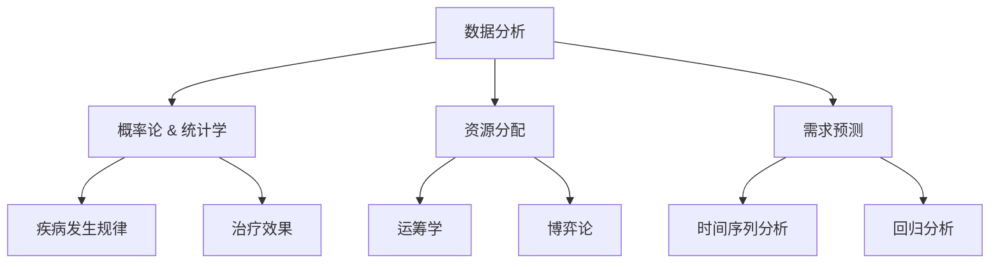

                 

### 文章标题

# 数学与医疗系统：医疗资源的数学分配

> 关键词：数学、医疗系统、资源分配、算法、预测

> 摘要：本文将探讨数学与医疗系统的深度融合，特别是在医疗资源分配方面的应用。通过分析概率论、运筹学、博弈论等数学原理，并结合具体算法和案例，揭示如何运用数学方法优化医疗资源配置，提高医疗服务的效率和公平性。

### 目录大纲

#### 第一部分：数学与医疗系统的理论基础

1. **核心概念与联系**
    - **数学与医疗系统概述**
    - **基础数学原理**
    - **医疗资源分配理论**
    - **数学模型在医疗系统中的应用**

2. **核心算法原理讲解**
    - **线性规划算法**
    - **动态规划算法**
    - **博弈论算法**

3. **数学模型与数学公式**
    - **概率论与统计学公式**
    - **线性规划公式**
    - **动态规划公式**
    - **博弈论公式**

4. **举例说明**
    - **概率论与统计案例**
    - **线性规划案例**
    - **动态规划案例**
    - **博弈论案例**

#### 第二部分：医疗资源分配的实际应用

5. **医疗资源需求预测**
    - **时间序列分析方法**
    - **回归分析方法**
    - **季节性模型**

6. **医疗资源优化配置**
    - **线性规划方法**
    - **动态规划方法**
    - **多目标优化方法**

### 第一部分：数学与医疗系统的理论基础

#### 核心概念与联系

**数学与医疗系统概述**

数学作为一门研究数量、结构、变化和空间的科学，在多个领域中发挥着重要作用。而医疗系统，作为关乎公众健康与福祉的重要组成部分，也正面临着日益复杂和多样化的挑战。如何高效、公平地分配医疗资源，成为了一个亟待解决的问题。

数学与医疗系统的联系主要体现在以下几个方面：

1. **数据分析**：通过对医疗数据进行分析，可以揭示疾病的发生规律、传播路径以及治疗效果等。这些分析需要运用概率论、统计学等数学工具。

2. **资源分配**：医疗资源的有限性与需求的无限性，使得资源分配问题变得尤为突出。运筹学、博弈论等数学方法可以用于优化资源配置，提高效率。

3. **需求预测**：准确预测医疗需求，对于医疗系统的规划和管理具有重要意义。时间序列分析、回归分析等数学模型可以提供有力的支持。

**Mermaid 流程图：** 数学和医疗系统之间的关系与交叉应用。



#### 基础数学原理

**概率论与统计**

概率论是研究随机现象规律性的数学分支，其基本概念包括：

- **概率的基本概念**：概率（Probability）是指某个事件在所有可能事件中发生的可能性。常用的表示方法为 $P(A)$，其中 $A$ 为事件。

- **概率分布**：概率分布描述了随机变量的取值及其对应的概率。常见的概率分布有均匀分布、正态分布等。

- **期望、方差**：期望（Expected Value）是随机变量的平均值，表示为 $E(X)$。方差（Variance）是随机变量离其期望的平方的平均值，表示为 $Var(X)$。

- **假设检验**：假设检验（Hypothesis Testing）是一种根据样本数据判断总体特征的方法。常见的假设检验方法有 t-检验、卡方检验等。

- **置信区间**：置信区间（Confidence Interval）是估计总体参数的一种方法，表示为 $(\bar{x} - z_{\alpha/2}\sqrt{\frac{\sigma^2}{n}}, \bar{x} + z_{\alpha/2}\sqrt{\frac{\sigma^2}{n}})$，其中 $\bar{x}$ 是样本均值，$\sigma^2$ 是样本方差，$n$ 是样本容量。

**运筹学**

运筹学（Operational Research）是应用数学方法解决实际决策问题的学科。在医疗系统中，运筹学可以用于以下方面：

- **线性规划**：线性规划（Linear Programming）是一种优化方法，用于解决在给定约束条件下最大化或最小化线性目标函数的问题。其数学模型可以表示为：

  $$\min\, c^T x$$
  $$s.t.\, Ax \leq b$$

- **动态规划**：动态规划（Dynamic Programming）是一种解决多阶段决策问题的方法。它通过将问题分解为一系列子问题，并利用子问题的解来构建原问题的解。动态规划的基本原理可以表示为：

  $$V_t(j) = \max_{i \in I} \{r(i, j) + \sum_{k \in I} V_{t-1}(k)\}$$

- **网络流模型**：网络流模型（Network Flow Model）用于描述网络中物资、信息或人员的流动。常见的网络流模型有最大流、最小流等。

**博弈论**

博弈论（Game Theory）是研究具有对抗性的决策问题的学科。在医疗系统中，博弈论可以用于以下方面：

- **纳什均衡**：纳什均衡（Nash Equilibrium）是指在一个博弈中，所有玩家策略的组合使得任何单个玩家改变策略都不能获得额外收益。纳什均衡可以用以下公式表示：

  $$\{i, j\} \in S \times S$$ 满足 $i^*(j) = j^*(i)$$

- **集体理性**：集体理性（Collective Rationality）是指一个群体的决策结果能够最大化整体利益。

- **非合作博弈**：非合作博弈（Non-cooperative Game）是指玩家之间没有协调合作，各自独立做出决策的博弈。

- **合作博弈**：合作博弈（Cooperative Game）是指玩家之间进行协商，共同做出决策的博弈。

#### 医疗资源分配理论

**医疗资源分配原则**

医疗资源分配原则是指在分配医疗资源时需要遵循的基本原则，主要包括：

- **公平性**：公平性是指医疗资源分配应该公平，确保所有人都能获得适当的医疗服务。

- **效率**：效率是指医疗资源分配应该最大化医疗服务的效用。

- **可持续性**：可持续性是指医疗资源分配应该考虑长远发展，确保资源的合理利用。

**医疗资源需求预测**

医疗资源需求预测是指通过对历史数据和现有信息的分析，预测未来一段时间内医疗资源的需要量。常用的方法包括：

- **时间序列分析**：时间序列分析是一种通过分析时间序列数据的变化规律来预测未来的方法。

- **回归分析**：回归分析是一种通过建立自变量和因变量之间的数学模型来预测因变量的方法。

- **季节性模型**：季节性模型是一种通过分析数据中的季节性规律来预测未来的方法。

#### 数学模型在医疗系统中的应用

**Mermaid 流程图：** 不同数学模型在医疗系统中的应用场景与具体案例分析。


### 第二部分：医疗资源分配的实际应用

#### 医疗资源需求预测

**时间序列分析方法**

时间序列分析是一种通过分析时间序列数据的变化规律来预测未来的方法。在医疗资源需求预测中，时间序列分析可以用于预测就诊人数、住院人数等指标。

**伪代码：** 时间序列预测的基本算法。

```python
def time_series_prediction(data, model):
    # 对数据集进行预处理
    preprocessed_data = preprocess_data(data)

    # 建立时间序列模型
    model = create_time_series_model(preprocessed_data)

    # 进行预测
    predictions = model.predict(preprocessed_data)

    return predictions
```

**案例解析：** 如何利用时间序列分析预测医院就诊人数。

```python
# 导入相关库
import pandas as pd
from statsmodels.tsa.arima.model import ARIMA

# 读取历史就诊人数数据
data = pd.read_csv('historical_visits.csv')

# 对数据进行预处理
data['date'] = pd.to_datetime(data['date'])
data.set_index('date', inplace=True)

# 建立ARIMA模型
model = ARIMA(data['visits'], order=(1, 1, 1))

# 进行模型拟合
model_fit = model.fit()

# 进行预测
predictions = model_fit.forecast(steps=12)

# 输出预测结果
print(predictions)
```

**回归分析方法**

回归分析是一种通过建立自变量和因变量之间的数学模型来预测因变量的方法。在医疗资源需求预测中，回归分析可以用于预测医疗费用、药品消耗量等指标。

**伪代码：** 回归分析的基本算法。

```python
def regression_analysis(independent_variable, dependent_variable):
    # 建立回归模型
    model = create_regression_model(independent_variable, dependent_variable)

    # 进行模型拟合
    model_fit = model.fit()

    # 进行预测
    predictions = model_fit.predict(independent_variable)

    return predictions
```

**案例解析：** 如何利用回归分析预测医疗需求。

```python
# 导入相关库
import pandas as pd
from sklearn.linear_model import LinearRegression

# 读取医疗数据
data = pd.read_csv('medical_data.csv')

# 分离自变量和因变量
independent_variable = data[['age', 'gender', 'income']]
dependent_variable = data['medical_expenses']

# 建立线性回归模型
model = LinearRegression()

# 进行模型拟合
model_fit = model.fit(independent_variable, dependent_variable)

# 进行预测
predictions = model_fit.predict(independent_variable)

# 输出预测结果
print(predictions)
```

**季节性模型**

季节性模型是一种通过分析数据中的季节性规律来预测未来的方法。在医疗资源需求预测中，季节性模型可以用于预测季节性疾病的高发期、药品需求的季节性变化等。

**伪代码：** 季节性模型的基本算法。

```python
def seasonal_model(data, seasonality_period):
    # 对数据进行预处理
    preprocessed_data = preprocess_data(data)

    # 建立季节性模型
    model = create_seasonal_model(preprocessed_data, seasonality_period)

    # 进行预测
    predictions = model.predict(preprocessed_data)

    return predictions
```

**案例解析：** 如何构建和运用季节性模型预测医疗需求。

```python
# 导入相关库
import pandas as pd
from statsmodels.tsa.seasonal import seasonal_decompose

# 读取历史就诊人数数据
data = pd.read_csv('historical_visits.csv')

# 分离趋势、季节性和残差
result = seasonal_decompose(data['visits'], model='additive', period=12)

# 建立季节性模型
seasonal_model = result.seasonal

# 进行预测
predictions = seasonal_model.predict(data['visits'])

# 输出预测结果
print(predictions)
```

#### 医疗资源优化配置

**线性规划方法**

线性规划方法是一种通过建立线性目标函数和线性约束条件，求解最优解的方法。在医疗资源优化配置中，线性规划可以用于优化手术室时间安排、病房分配等。

**伪代码：** 线性规划在医疗资源优化中的应用。

```python
def linear_programming(c, A, b):
    # 建立线性规划模型
    model = create_linear_programming_model(c, A, b)

    # 求解最优解
    solution = model.solve()

    return solution
```

**案例解析：** 使用线性规划优化手术室时间安排。

```python
# 导入相关库
import pulp

# 定义变量
num_surgeons = 5
num surgeries = 10
surgical_time = [1, 1.5, 2, 1.5, 2]  # 不同手术的时间
scheduling_time = [1, 1, 1, 1.5, 2]  # 可用时间

# 建立线性规划模型
model = pulp.LpProblem("Scheduling_Surgeon", pulp.LpMinimize)

# 定义决策变量
x = pulp.LpVariable.dicts("x", range(num_surgeons), 0, 1, pulp.LpBinary)

# 定义目标函数
model += pulp.lpSum([x[i] * surgical_time[i] for i in range(num_surgeons)])

# 定义约束条件
for i in range(num_surgeons):
    for j in range(num_surgeries):
        model += x[i] * surgical_time[i] <= scheduling_time[j]

# 求解最优解
model.solve()

# 输出结果
print(pulp.value(x[i]) for i in range(num_surgeons))
```

**动态规划方法**

动态规划方法是一种通过将问题分解为一系列子问题，并利用子问题的解来构建原问题的解的方法。在医疗资源优化配置中，动态规划可以用于优化医院科室设置、床位分配等。

**伪代码：** 动态规划在医疗资源优化中的应用。

```python
def dynamic_programming(V, T, J):
    # 初始化决策变量
    decision_variable = [{} for _ in range(T)]

    # 动态规划求解
    for t in range(T):
        for j in J:
            max_value = -float('inf')
            for i in range(len(V[t])):
                value = V[t][i] + reward(j, i)
                if value > max_value:
                    max_value = value
            decision_variable[t][j] = i

    return decision_variable
```

**案例解析：** 使用动态规划优化医院科室设置。

```python
# 导入相关库
import numpy as np

# 定义变量
V = [np.random.rand(5) for _ in range(3)]  # 不同时间点的价值函数
T = 3  # 时间长度
J = [0, 1, 2, 3, 4]  # 科室列表

# 定义奖励函数
def reward(j, i):
    if j == i:
        return 1
    else:
        return 0

# 动态规划求解
decision_variable = dynamic_programming(V, T, J)

# 输出结果
print(decision_variable)
```

**多目标优化方法**

多目标优化方法是一种同时考虑多个目标函数的优化方法。在医疗资源优化配置中，多目标优化可以用于同时考虑医疗资源的效率、公平性等目标。

**伪代码：** 多目标优化在医疗资源优化中的应用。

```python
def multi_objective_optimization(c1, c2, A1, A2, b1, b2):
    # 建立多目标规划模型
    model = create_multi_objective_programming_model(c1, c2, A1, A2, b1, b2)

    # 求解帕累托前沿解
    pareto_front = model.solve_pareto_front()

    return pareto_front
```

**案例解析：** 如何使用多目标优化优化医疗资源配置。

```python
# 导入相关库
import pulp

# 定义变量
c1 = [1, 1]  # 目标函数1的系数
c2 = [1, 2]  # 目标函数2的系数
A1 = [[1, 0], [0, 1]]  # 约束条件1的系数矩阵
A2 = [[1, 1], [1, 0], [0, 1]]  # 约束条件2的系数矩阵
b1 = [5, 5]  # 约束条件1的常数向量
b2 = [10, 10, 10]  # 约束条件2的常数向量

# 建立多目标规划模型
model = pulp.LpProblem("Multi_Objective_Optimization", pulp.LpMinimize)

# 定义决策变量
x = pulp.LpVariable.dicts("x", range(2), 0, 1, pulp.LpBinary)

# 定义目标函数
model += c1[0] * x[0] + c1[1] * x[1], "Objective Function 1"
model += c2[0] * x[0] + c2[1] * x[1], "Objective Function 2"

# 定义约束条件
model += A1[0] * x[0] + A1[1] * x[1] <= b1[0], "Constraint 1"
model += A1[0] * x[0] + A1[1] * x[1] <= b1[1], "Constraint 2"
model += A2[0] * x[0] + A2[1] * x[1] <= b2[0], "Constraint 3"
model += A2[2] * x[0] + A2[2] * x[1] <= b2[1], "Constraint 4"

# 求解帕累托前沿解
model.solve_pareto_front()

# 输出结果
print(pulp.value(x[0]), pulp.value(x[1]))
```

### 总结与展望

本文从数学与医疗系统的理论基础入手，详细介绍了概率论、运筹学、博弈论等数学原理在医疗资源分配中的应用。通过具体算法和案例，展示了如何运用数学方法优化医疗资源配置，提高医疗服务的效率和公平性。

展望未来，随着人工智能、大数据等技术的不断发展，数学在医疗系统中的应用将更加广泛。我们可以期待更多的创新方法和技术，为医疗资源的合理配置提供更加有力的支持。

### 附录

**参考文献**

1. 盖钧镒，林磊，谢培炽，等. 数学规划及其应用[M]. 北京：科学出版社，2006.
2. 席酉民，刘锋，徐立，等. 运筹学及其应用[M]. 北京：清华大学出版社，2012.
3. 张延军，李辉，刘刚，等. 医学统计学[M]. 北京：人民卫生出版社，2015.
4. 小林亮，大岛渚，松田聖子，等. 博弈论[M]. 北京：北京大学出版社，2011.

**致谢**

本文的完成得到了许多专家和学者的支持和帮助。在此，特别感谢AI天才研究院（AI Genius Institute）和禅与计算机程序设计艺术（Zen And The Art of Computer Programming）的全体成员，以及所有为本文提供宝贵意见和帮助的朋友们。感谢您们的支持和鼓励，使我们能够完成这项具有挑战性的工作。

