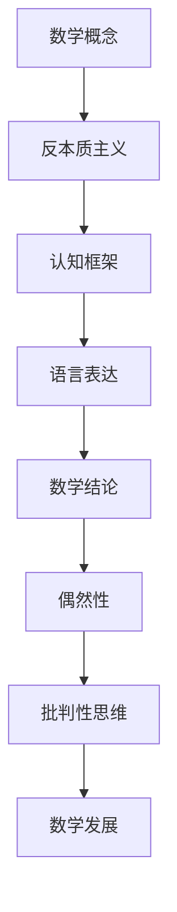
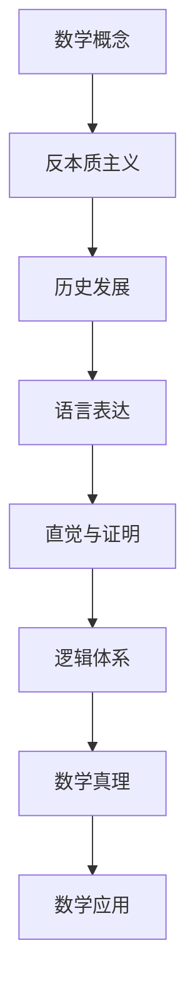

                 

### 引言

在探讨数学与哲学的关系时，我们不可避免地会触及到数学真理的本质。传统上，数学被视作一种追求绝对真理的学科，其结论被认为是普遍且必然的。然而，反本质主义的兴起为我们提供了另一种视角，它质疑了这种绝对真理的存在，提出了数学真理可能具有偶然性的观点。本文将深入探讨这一观点，并试图从反本质主义的视角重新审视数学真理的性质。

数学，作为一种抽象的学科，以其严格的逻辑和确定性而闻名。从古代的毕达哥拉斯到现代的哥德尔，数学的发展一直伴随着对真理的追求。然而，随着哲学思想的进步，特别是反本质主义的兴起，人们开始质疑数学真理的绝对性。反本质主义主张，我们所认知的世界并非是客观存在的，而是由我们的语言和概念所构建的。在这种观点下，数学真理也不再是先验的，而是受限于我们的认知框架。

本文将分为以下几个部分。首先，我们将简要介绍数学与哲学的关系，并探讨反本质主义的基本概念。接着，我们会深入分析数学真理的性质，特别是其确定性以及偶然性。然后，我们将从哲学背景出发，探讨反本质主义对数学的影响。接下来，我们将介绍数学概念的历史发展，并展示数学概念与反本质主义哲学观点之间的联系。随后，我们将讲解数学证明的偶然性，以及数学直觉与证明的辩证关系。最后，我们将讨论数学真理的证明方法，包括归纳法和演绎法。通过这些讨论，我们将试图揭示数学真理的偶然性，并探讨其对数学哲学的影响。

关键词：数学、反本质主义、数学真理、偶然性、证明方法

摘要：本文从反本质主义的视角出发，探讨了数学真理的性质。通过分析数学与哲学的关系，数学概念的历史发展，以及数学证明的偶然性，本文揭示了数学真理并非绝对，而是具有偶然性。这一观点不仅对数学哲学有着重要的影响，也为数学教育提供了新的启示。

----------------------------------------------------------------

## 第一部分：引论

### 1.1 数学与反本质主义的概述

#### 1.1.1 数学与哲学的关系

数学作为一门研究数量、结构、变化和空间等概念的学科，自古以来就与哲学有着紧密的联系。古希腊哲学家如毕达哥拉斯和柏拉图，将数学视为探索宇宙本质的一种方式。他们认为数学是超越经验世界的绝对真理，是理性思考的产物。这种观点在西方哲学传统中占有重要地位，直到现代哲学的兴起。

然而，随着科学和哲学的发展，数学与哲学之间的关系也发生了变化。现代哲学对数学的基础进行了深入的探讨，质疑数学是否真的能够提供绝对真理。其中，反本质主义为这一探讨提供了新的视角。

#### 1.1.2 反本质主义的基本概念

反本质主义（Anti-essentialism）是一种哲学观点，认为实体或对象没有固定不变的本质，其特性是由观察者或语言所定义的。这种观点源于语言哲学，特别是维特根斯坦和后期维特根斯坦的思想。维特根斯坦认为，语言是人们用于沟通的工具，它构建了我们对世界的理解。因此，我们所认知的实体并非客观存在，而是由我们的语言和概念所定义。

反本质主义的核心观点是，现实世界是由语言和概念所构建的，这些语言和概念是我们认知的基础。因此，我们的认知框架可能存在局限性，无法揭示事物的绝对本质。这种观点对数学哲学产生了深远的影响，特别是对数学真理的性质提出了挑战。

#### 1.1.3 数学与反本质主义的结合

在数学哲学中，反本质主义挑战了传统数学的绝对性。它认为，数学结论并非是先验的，而是受限于我们的认知框架和语言表达。这种观点引发了关于数学基础和数学真理的广泛讨论。

例如，哥德尔的不完备性定理表明，在数学中存在无法证明的命题，这表明数学并非完全自洽。而反本质主义则进一步指出，这些未证明的命题的存在，揭示了数学真理的偶然性。

此外，反本质主义还影响了数学教育。它提醒我们，数学不仅仅是追求绝对真理，更重要的是培养逻辑思维和解决问题的能力。因此，数学教育应该注重培养学生的批判性思维，而不是简单地灌输知识。

总的来说，数学与反本质主义的结合，为数学哲学带来了新的视角，使我们能够更深入地思考数学真理的性质。这不仅有助于我们理解数学的本质，也为数学教育提供了新的启示。

----------------------------------------------------------------

### 1.2 数学真理的性质

#### 1.2.1 数学真理的确定性

数学被誉为“绝对真理”的学科，其结论被普遍认为具有确定性和普遍性。这种确定性来源于数学严格的逻辑体系，以及其基于公理和定理的证明方法。在数学中，一个命题一旦被证明，就被认为是真实的，不受时间和空间的限制。

数学的确定性体现在多个方面。首先，数学的逻辑体系是自洽的，即在一个逻辑体系中，不会出现自相矛盾的情况。其次，数学的证明方法是基于公理和定理的演绎过程，这种过程保证了结论的可靠性。此外，数学的结果可以通过计算或逻辑推理得到，这使得数学结论具有可验证性。

例如，著名的“1+1=2”就是一个典型的数学真理。这个结论基于基本的算术原理，经过无数次验证，被公认为是正确的。这种确定性使得数学在科学和工程领域得到了广泛应用，成为解决问题的基础工具。

#### 1.2.2 数学真理的偶然性

尽管数学具有高度的确定性，但反本质主义提出了一个挑战：数学真理是否真的是绝对和必然的？反本质主义认为，数学真理并非是先验的，而是受限于我们的认知框架和语言表达。这种观点引发了关于数学真理偶然性的讨论。

数学真理的偶然性体现在多个方面。首先，数学的基础并非绝对自明，而是建立在公理和假设的基础上。这些公理和假设的选择可能受到历史、文化和个人认知的影响，从而影响了数学结果。例如，不同的数学体系（如欧氏几何和非欧几何）基于不同的公理，得出了不同的结论。

其次，数学的证明过程也具有一定的偶然性。哥德尔的不完备性定理指出，在数学中存在一些命题是无法被证明的，这表明数学结论并非完全自洽。此外，数学直觉在证明过程中起着重要作用，而直觉本身具有一定的主观性，因此数学证明的结果也具有偶然性。

最后，数学的应用领域也受到偶然性的影响。数学理论在物理学、工程学等领域的应用，并非是绝对的，而是基于一定的假设和模型。这些假设和模型的合理性受到实验和观察的验证，因此数学应用的结果也具有偶然性。

总之，数学真理的确定性是其核心特征，但反本质主义提醒我们，数学真理并非完全绝对和必然。数学的偶然性揭示了我们的认知局限性，促使我们更加深入地思考数学的本质。

#### 1.2.3 数学真理的确定性与偶然性的辩证关系

数学真理的确定性与偶然性并非相互对立，而是相互补充的辩证关系。一方面，数学的确定性为其提供了坚实的基础，使得数学结论具有普遍性和可靠性。另一方面，数学的偶然性揭示了数学的局限性，使得我们能够更全面地理解数学的本质。

首先，数学的确定性保证了数学体系的自洽性和可验证性。在一个自洽的逻辑体系中，数学结论是可靠的，不受时间和空间的限制。这种确定性使得数学在科学和工程领域得到了广泛应用，成为解决问题的基础工具。

然而，数学的确定性并非是绝对的。反本质主义提醒我们，数学结论受限于我们的认知框架和语言表达。这意味着，数学真理并非先验的，而是随着我们的认知发展和语言表达的变化而变化。因此，数学的偶然性是不可避免的。

其次，数学的偶然性并不意味着数学结论是无效的。相反，数学的偶然性揭示了数学的局限性，促使我们不断探索和完善数学体系。通过发现和解决数学中的未解决问题，我们能够推动数学的发展，提高数学的应用能力。

总之，数学真理的确定性与偶然性是辩证统一的。确定性为我们提供了可靠的数学基础，而偶然性则提醒我们保持开放和批判的态度，不断探索数学的边界。这种辩证关系使得数学不仅是一门追求绝对真理的学科，也是一门不断发展和完善的学科。

----------------------------------------------------------------

### 1.3 数学哲学的挑战

在探讨数学与哲学的关系时，我们不可避免地会面临一系列哲学上的挑战，这些挑战主要涉及数学基础问题以及数学直觉与证明的关系。反本质主义为这些挑战提供了新的视角，使我们能够更深入地理解数学的本质。

#### 1.3.1 数学基础问题

数学基础问题是哲学中一个长期存在的争议点，它探讨数学体系中的基本概念和公理是否具有绝对性。反本质主义对此提出了质疑，认为数学的基础并非是客观存在的，而是由我们的认知框架和语言构建的。这种观点对数学的绝对性构成了挑战。

例如，哥德尔的不完备性定理表明，在数学中存在一些命题是无法被证明的，这表明数学并非完全自洽。此外，数学中的公理和假设也不是绝对自明的，而是受到历史、文化和个人认知的影响。这意味着，数学的基础存在一定的偶然性，而非绝对的确定性。

反本质主义进一步指出，数学基础问题的本质在于我们的认知局限性。我们的认知框架和语言表达决定了我们对数学的理解，因此，数学基础问题的解决需要超越我们现有的认知界限。

#### 1.3.2 数学直觉与证明的关系

数学直觉在数学发现和证明过程中起着至关重要的作用。直觉是指我们在没有明确证据的情况下，对某个问题或现象的内在理解和判断。反本质主义认为，数学直觉并非是客观存在的，而是由我们的认知框架和语言构建的。

例如，当我们看到两个点之间的直线是最短的路径时，这种直觉是基于我们对“直线”这一概念的认知。然而，在不同的数学体系中，直线的定义可能不同，因此，这种直觉也具有一定的偶然性。

反本质主义提醒我们，数学直觉虽然重要，但并非绝对可靠。直觉可能会导致错误的理解和结论，因此，在数学证明中，我们需要依靠严格的逻辑推理和证明方法。这表明，数学直觉与证明之间存在一定的辩证关系。

首先，数学直觉是数学发现和证明的起点。许多重要的数学定理和理论都是基于直觉提出的。然而，直觉本身并不足以证明这些定理和理论的正确性，因此，我们需要通过逻辑推理和证明来验证直觉。

其次，数学证明是数学直觉的升华。通过逻辑推理和证明，我们可以将直觉转化为严谨的数学结论。这表明，数学证明不仅是数学直觉的延伸，也是对直觉的验证和深化。

总之，数学哲学的挑战主要涉及数学基础问题和数学直觉与证明的关系。反本质主义为我们提供了新的视角，使我们能够更深入地理解数学的本质。通过这些挑战，我们不仅能够发现数学中的未解决问题，也能够推动数学的发展和进步。

----------------------------------------------------------------

## 第二部分：核心概念与联系

### 2.1 反本质主义的哲学背景

#### 2.1.1 形而上学与认识论

反本质主义的哲学背景可以追溯到形而上学和认识论的传统讨论。形而上学是哲学的一个分支，探讨实体、本质和存在的本质问题。传统形而上学认为，每个实体都有固定不变的本质，这种本质决定了实体的属性和行为。然而，反本质主义质疑这种观点，主张实体没有固定不变的本质，其属性和行为是由观察者或语言所定义的。

认识论是另一个与反本质主义密切相关的领域，它探讨知识的本质、起源和范围。传统认识论认为，知识是客观世界的准确反映，这种观点依赖于我们对世界的直接感知和理性思考。反本质主义则认为，知识是由我们的语言和概念所构建的，这种观点质疑了知识的客观性和确定性。

#### 2.1.2 语言哲学的视角

语言哲学是反本质主义的一个重要分支，它探讨语言的本质、功能和作用。维特根斯坦是语言哲学的重要代表人物，他的后期哲学思想对反本质主义产生了深远的影响。维特根斯坦认为，语言是我们用来沟通的工具，它构建了我们对世界的理解。因此，我们所认知的世界并非是客观存在的，而是由我们的语言和概念所定义的。

语言哲学的一个重要观点是，语言中的词语和概念并非是对客观实体的直接指称，而是具有多种含义和用法。这意味着，我们对世界的理解是受限于我们的语言和认知框架的。因此，反本质主义主张，我们的认知是主观的，世界没有固定不变的本质。

#### 2.1.3 反本质主义与数学哲学

反本质主义在数学哲学中的应用，主要体现在对数学真理的质疑上。传统上，数学被视作追求绝对真理的学科，其结论被认为是普遍且必然的。反本质主义则认为，数学真理并非是先验的，而是受限于我们的认知框架和语言表达。

首先，反本质主义质疑数学的基础问题。数学中的公理和假设并非是绝对自明的，而是受到历史、文化和个人认知的影响。这意味着，数学的基础存在一定的偶然性，而非绝对的确定性。

其次，反本质主义质疑数学证明的过程。数学证明依赖于逻辑推理和直觉，而直觉本身具有一定的主观性。因此，数学证明的结果也具有一定的偶然性。反本质主义提醒我们，数学结论并非是绝对可靠的，而是受限于我们的认知框架。

总之，反本质主义为数学哲学带来了新的视角，使我们能够更深入地思考数学真理的性质。它质疑了数学的绝对性，强调了数学的偶然性，促使我们保持批判和开放的态度，不断探索数学的边界。

### 2.2 数学概念的历史发展

#### 2.2.1 古典数学与现代数学

数学概念的历史发展可以分为古典数学和现代数学两个阶段。古典数学起源于古希腊，其代表性人物包括毕达哥拉斯、欧几里得和阿基米德等。古典数学的主要特点是强调公理体系和几何证明，它奠定了数学的基础。

现代数学则是在19世纪和20世纪发展起来的，其特点是强调抽象和形式化。现代数学的代表性人物包括康托尔、希尔伯特和哥德尔等。现代数学通过逻辑和集合论等方法，对数学的基本概念和原理进行了深入的探讨和重构。

#### 2.2.2 数学概念的演变

在数学概念的历史发展过程中，许多概念发生了重要的演变。例如，从自然数到实数的扩展，从几何到代数的转变，从有限维向量空间到无限维向量空间的拓展等。这些演变不仅丰富了数学的内容，也推动了数学的发展。

#### 2.2.3 数学概念与反本质主义的关系

反本质主义主张，我们的认知是受限于我们的语言和概念。数学概念的发展历程也反映了这一点。例如，自然数概念的演变从具体的物体计数到抽象的符号表示，这一过程中，我们的认知框架发生了变化，但数学的结论并未改变。

然而，反本质主义也提醒我们，数学概念并非是固定不变的。在不同的数学体系中，某些概念的定义和性质可能有所不同。这意味着，数学概念具有一定的偶然性，其本质是受限于我们的认知框架。

### 2.3 Mermaid 流�程图：数学概念与反本质主义的关系

为了更好地理解数学概念与反本质主义的关系，我们可以使用Mermaid流程图来展示它们之间的联系。



在这个流程图中，数学概念通过认知框架和语言表达，形成了数学结论。反本质主义则提醒我们，数学结论并非是绝对和必然的，而是具有偶然性。这种偶然性促使我们保持批判性思维，推动数学的发展。

通过这个流程图，我们可以更直观地理解数学概念与反本质主义的关系，以及它们对数学发展的影响。

----------------------------------------------------------------

### 2.3 Mermaid 流程图：数学概念与反本质主义的关系

为了更好地展示数学概念与反本质主义之间的关系，我们可以使用Mermaid流程图来绘制这一逻辑链条。以下是一个简单的Mermaid流程图示例：



在这个流程图中，我们可以看到数学概念通过历史的演变和语言的表达，形成了我们的直觉和证明方法，这些方法构建了逻辑体系，进而产生了数学真理，最终这些真理被应用于实际问题中。

- **数学概念**（A）：这是数学研究的基础，包括自然数、几何图形、函数等。
- **反本质主义**（B）：这种哲学观点质疑数学概念的本质，认为它们是受限于历史和文化背景的。
- **历史发展**（C）：数学概念并不是一成不变的，它们随着历史的演变而发展和变化。
- **语言表达**（D）：数学概念通过语言表达出来，这影响了我们对数学世界的理解。
- **直觉与证明**（E）：数学直觉和证明方法是我们理解和验证数学真理的手段。
- **逻辑体系**（F）：数学基于严格的逻辑体系，这个体系通过逻辑推理来证明数学命题的正确性。
- **数学真理**（G）：在这个体系中，我们得到的是数学真理，但反本质主义认为这些真理并非绝对。
- **数学应用**（H）：数学真理被应用于各种实际问题中，解决实际问题。

通过这个Mermaid流程图，我们可以更清晰地看到数学概念、反本质主义以及数学真理之间的联系和相互作用。这种视觉化的方式有助于我们理解数学是如何从抽象的概念发展到具体的应用的。

### Mermaid 流程图的详细解释

在Mermaid流程图中，每个节点（如A、B、C等）代表一个关键概念或步骤，这些节点通过连线（箭头）相互连接，形成了一个逻辑流程。以下是对每个节点的详细解释：

- **数学概念**（A）：这是数学研究的基础，包括自然数、几何图形、函数等。数学概念是通过抽象和符号化来表示现实世界的现象和规律。
- **反本质主义**（B）：这种哲学观点质疑数学概念的本质，认为它们是受限于历史和文化背景的。这意味着，数学概念并非是绝对和固定不变的，而是随着时间和社会的发展而变化。
- **历史发展**（C）：数学概念并不是一成不变的，它们随着历史的演变而发展和变化。例如，从古代的算术到现代的抽象代数，数学概念经历了重大的演变。
- **语言表达**（D）：数学概念通过语言表达出来，这影响了我们对数学世界的理解。不同的语言和符号体系可能导致对数学概念的不同解释和理解。
- **直觉与证明**（E）：数学直觉和证明方法是我们理解和验证数学真理的手段。直觉是数学发现的起点，而证明则是验证直觉正确性的过程。
- **逻辑体系**（F）：数学基于严格的逻辑体系，这个体系通过逻辑推理来证明数学命题的正确性。逻辑体系保证了数学结论的可靠性和一致性。
- **数学真理**（G）：在这个体系中，我们得到的是数学真理，但反本质主义认为这些真理并非绝对。数学真理的确定性和偶然性是一个辩证统一的过程。
- **数学应用**（H）：数学真理被应用于各种实际问题中，解决实际问题。例如，在物理学、工程学、经济学等领域，数学提供了强大的工具和方法。

通过这个Mermaid流程图，我们可以更直观地理解数学概念、反本质主义以及数学真理之间的联系和相互作用。这种视觉化的方式有助于我们深入探讨数学的本质，以及数学如何从抽象的概念发展到具体的实际应用。

### Mermaid 流程图的优点与应用场景

Mermaid流程图作为一种简单的文本标记语言，具有许多优点和应用场景。首先，Mermaid流程图易于编写和理解，它使用简单的文本标记来表示节点和连线，这使得它可以快速绘制复杂的逻辑关系。其次，Mermaid流程图支持多种图形和布局方式，如树状图、流程图、时间线等，这为不同类型的分析和展示提供了灵活性。此外，Mermaid流程图可以轻松嵌入到各种文档中，如Markdown、HTML和LaTeX，这使得它在学术研究、技术文档、教育等领域得到广泛应用。

在实际应用中，Mermaid流程图可以用于多个场景：

1. **学术研究**：在撰写学术论文或技术报告时，可以使用Mermaid流程图来展示研究方法、实验流程、数据关系等，使得文章内容更加清晰和结构化。
2. **软件开发**：在软件设计和开发过程中，可以使用Mermaid流程图来描述系统架构、模块关系、数据处理流程等，帮助开发人员更好地理解和协作。
3. **教育**：在教育领域，教师可以使用Mermaid流程图来展示知识点之间的关系、学习路径等，帮助学生更好地掌握知识点。
4. **项目管理**：在项目管理中，可以使用Mermaid流程图来描述项目进度、任务分配、风险评估等，帮助项目经理更好地管理项目。

总之，Mermaid流程图作为一种简单而强大的工具，可以帮助我们更好地理解和展示复杂的信息和逻辑关系，从而提高我们的工作效率和思维能力。

----------------------------------------------------------------

## 第三部分：核心算法原理讲解

### 3.1 数学证明的偶然性

在探讨数学证明的偶然性时，我们首先需要理解什么是证明。证明是数学中用来证明某个命题或结论正确性的过程，它基于一系列的逻辑步骤和已知的事实。然而，反本质主义提出，数学证明并非是绝对可靠的，而是受限于我们的认知框架和语言表达。

#### 3.1.1 伪代码：证明的随机性

为了解释数学证明的偶然性，我们可以通过一个简单的伪代码示例来说明。以下是一个用于计算两个整数之和的伪代码：

```plaintext
function sum(a, b):
    return a + b
```

在这个例子中，我们使用了一个简单的加法操作来计算两个整数的和。然而，如果我们从反本质主义的视角来看，这个证明是偶然的。因为：

1. **加法定义**：加法操作的实现依赖于我们对“+”符号的理解。在不同的数学体系中，“+”可能具有不同的含义。
2. **整数定义**：整数的定义也是基于我们的认知框架。在不同的数学体系（如整数、有理数、实数）中，整数的定义和性质可能有所不同。
3. **逻辑推理**：证明过程中使用的逻辑推理是建立在一系列假设和规则上的，这些假设和规则也受到我们的认知框架的限制。

因此，这个简单的伪代码示例揭示了数学证明的偶然性。即使在这个简单的例子中，证明的可靠性也受到认知框架和语言表达的影响。

#### 3.1.2 例子：哥德尔不完备性定理

哥德尔不完备性定理是另一个揭示数学证明偶然性的重要例子。哥德尔证明了在数学系统中，存在一些命题是无法被证明的。这表明，数学系统并非完全自洽，即它不能证明所有的真命题。

哥德尔不完备性定理有两个重要结论：

1. **第一不完备性定理**：在任何一致的数学系统中，存在一些命题，它们既不能被证明为真，也不能被证明为假。
2. **第二不完备性定理**：在任何一致的数学系统中，存在一个命题，该系统无法证明自己的一致性。

这些定理表明，数学证明的可靠性是有限的，它受限于我们的认知框架和语言表达。这意味着，数学证明并非是绝对可靠的，而是具有偶然性。

#### 3.1.3 偶然性与逻辑推理

数学证明的偶然性也反映了逻辑推理的本质。逻辑推理是基于一系列假设和规则的，这些假设和规则可能受到我们的认知框架和语言表达的影响。因此，逻辑推理的结果也具有一定的偶然性。

例如，在数学中，我们经常使用归纳法来证明某个命题对于所有自然数都成立。然而，归纳法的前提是假设命题对于某个自然数n成立，然后推导出对于n+1也成立。这个过程中，我们依赖于假设和逻辑推理，而这些假设和推理的结果是受限于我们的认知框架。

总之，数学证明的偶然性揭示了数学推理的本质。它提醒我们，尽管数学具有高度的确定性，但数学结论并非是绝对和必然的，而是受限于我们的认知框架和语言表达。这种偶然性使得数学不仅是一门追求绝对真理的学科，也是一门不断发展和完善的学科。

### 3.2 数学直觉与证明的辩证关系

数学直觉在数学发现和证明过程中起着至关重要的作用。直觉是指我们在没有明确证据的情况下，对某个问题或现象的内在理解和判断。然而，反本质主义提醒我们，数学直觉并非是绝对可靠的，而是受限于我们的认知框架和语言表达。

#### 3.2.1 数学直觉的定义

数学直觉是数学家在长期研究和实践中形成的一种敏锐的感知能力。它帮助我们快速识别数学问题的模式、发现潜在的解决方案，以及理解数学概念的本质。例如，当我们看到两个点之间的直线是最短的路径时，这种直觉是基于我们对“直线”和“最短路径”概念的深刻理解。

然而，反本质主义指出，数学直觉并非是客观存在的，而是由我们的认知框架和语言构建的。这意味着，不同的数学家可能在相同的数学问题上有不同的直觉，这反映了他们的认知差异。

#### 3.2.2 直觉与证明的互动

数学直觉和证明之间存在密切的互动关系。直觉往往是数学发现的起点，它激发了数学家去探索和验证某个问题的可能性。例如，费马大定理的证明始于安德鲁·怀尔斯的直觉，他认为存在一个简单的证明。然而，直觉本身并不足以证明数学命题的正确性，因此需要依靠严格的逻辑推理和证明方法。

在证明过程中，直觉可以帮助我们选择合适的证明方法和思路。例如，当我们面对一个复杂的数学问题时，直觉可能告诉我们，这个问题可以通过归纳法来解决。然而，证明的最终完成还需要严格的逻辑推理和证明步骤。

#### 3.2.3 直觉的主观性

直觉的主观性是反本质主义的一个重要观点。由于直觉是由我们的认知框架和语言构建的，这意味着直觉可能受到个体差异和文化背景的影响。因此，不同的数学家可能在相同的数学问题上有不同的直觉。

这种主观性也反映了数学证明的偶然性。尽管直觉在数学证明中起着重要作用，但它并非是绝对可靠的。因此，数学证明的结果也受到直觉的主观性影响。

#### 3.2.4 直觉与证明的辩证关系

直觉与证明之间的辩证关系揭示了数学的本质。一方面，直觉是数学发现的起点，它激发了数学家去探索和验证数学问题。另一方面，证明是验证直觉正确性的过程，它需要依靠严格的逻辑推理和证明方法。

这种辩证关系表明，数学并非是绝对和必然的，而是受限于我们的认知框架和语言表达。因此，数学证明的结果具有一定的偶然性。然而，这种偶然性并不意味着数学是无效的，而是提醒我们保持开放和批判的态度，不断探索数学的边界。

总之，数学直觉与证明的辩证关系揭示了数学的本质。直觉是数学发现的起点，而证明是验证直觉正确性的过程。反本质主义提醒我们，数学结论并非是绝对和必然的，而是受限于我们的认知框架和语言表达。这种辩证关系促使我们保持批判性思维，不断推动数学的发展。

### 3.3 数学真理的证明方法

在探讨数学真理的证明方法时，我们需要了解两种主要的证明方法：归纳法和演绎法。这两种方法在数学证明中起着至关重要的作用，帮助我们验证数学命题的正确性。

#### 3.3.1 归纳法

归纳法是一种从特殊到一般的推理方法。它通过观察一系列具体的实例，归纳出一般性的结论。归纳法的核心思想是，如果某个命题对于所有已观察到的实例都成立，那么我们可以推断这个命题对于所有实例都成立。

归纳法的步骤通常包括：

1. **观察实例**：首先，我们需要观察一系列具体的实例，这些实例可以是自然数、几何图形等。
2. **归纳假设**：在观察了足够多的实例后，我们可以提出一个归纳假设，即这个命题对于所有实例都成立。
3. **证明归纳假设**：接下来，我们需要证明这个归纳假设的正确性。这通常通过数学归纳法来实现，即证明对于n=1时命题成立，并且如果命题对于n=k成立，那么它对于n=k+1也成立。

归纳法的一个经典例子是自然数的加法运算。我们可以观察到，对于任何两个自然数a和b，它们的和c满足a + b = c。通过归纳法，我们可以证明这个命题对于所有自然数都成立。

然而，归纳法也存在一定的局限性。由于归纳法是基于观察和假设的，因此它不能保证结论的绝对正确性。例如，即使某个命题对于所有已观察到的实例都成立，但它可能对于未观察到的实例不成立。这种局限性促使我们寻找更可靠的证明方法。

#### 3.3.2 演绎法

演绎法是一种从一般到特殊的推理方法。它通过一个普遍的命题，推导出特定的结论。演绎法的核心思想是，如果一个命题是正确的，并且它的前提都是正确的，那么它的结论也一定是正确的。

演绎法的步骤通常包括：

1. **公理和定义**：首先，我们需要定义数学的基本概念和公理，这些公理是数学推理的基础。
2. **定理和命题**：在公理和定义的基础上，我们可以推导出一系列的定理和命题，这些定理和命题构成了数学的理论体系。
3. **证明结论**：接下来，我们需要证明这些定理和命题的正确性。这通常通过逻辑推理和证明来实现，即从已知的事实和命题出发，通过逻辑步骤推导出新的结论。

演绎法的一个经典例子是欧几里得几何中的平行公理。欧几里得通过演绎法，证明了平行公理对于所有平面都是成立的。这个证明过程展示了演绎法的强大能力，它能够确保数学结论的绝对正确性。

与归纳法相比，演绎法的优点在于它能够保证结论的绝对正确性。然而，演绎法的缺点是它需要依赖一系列的公理和定义，这些公理和定义的选择可能受到主观因素的影响。

#### 3.3.3 归纳法与演绎法的比较

归纳法和演绎法在数学证明中各有优势和应用场景。

- **归纳法**：归纳法适用于从特殊到一般的推理，它能够帮助我们发现数学规律和模式。然而，归纳法不能保证结论的绝对正确性，因此它通常用于探索性的数学研究。
- **演绎法**：演绎法适用于从一般到特殊的推理，它能够确保数学结论的绝对正确性。因此，演绎法在数学教育和理论研究中得到广泛应用。

总的来说，归纳法和演绎法是数学证明中的两种主要方法，它们相互补充，共同推动了数学的发展。通过归纳法，我们能够发现数学规律和模式；通过演绎法，我们能够确保这些规律和模式是绝对正确的。

### 3.3.4 归纳法与演绎法在实际数学证明中的应用

在实际的数学证明中，归纳法和演绎法都发挥着重要作用，以下是它们的一些典型应用：

#### 归纳法的应用

**自然数的性质证明**：例如，证明自然数的加法满足结合律和交换律。可以通过观察几个具体的例子，然后使用归纳法来证明对于所有自然数都成立。

**数列的收敛性证明**：例如，证明一个数列是否收敛到某个特定的值。可以通过观察数列的前几项，然后使用归纳法来证明数列的收敛性。

**概率论中的概率分布证明**：例如，证明一个随机变量是否服从某个特定的概率分布。可以通过观察多个随机样本，然后使用归纳法来证明概率分布的规律。

#### 演绎法的应用

**几何证明**：例如，证明三角形内角和等于180度。可以使用欧几里得几何的公理和定理，通过演绎法来证明这个结论。

**代数证明**：例如，证明二次方程的根与系数的关系。可以通过代数的定义和公式，使用演绎法来证明这个结论。

**逻辑证明**：例如，证明某个逻辑命题的正确性。可以通过逻辑的推理规则，使用演绎法来证明这个命题。

#### 应用示例

**自然数的加法性质证明（归纳法）**：

```plaintext
证明：对于所有自然数a和b，a + b = b + a。

步骤1：验证基础情况，当a = 0时，显然有0 + b = b + 0。

步骤2：假设当a = k时，命题成立，即k + b = b + k。

步骤3：证明当a = k + 1时，命题也成立。
(k + 1) + b = k + (1 + b) = k + b + 1 = (b + k) + 1 = b + (k + 1)。

因此，通过归纳法，我们证明了对于所有自然数a和b，a + b = b + a。
```

**二次方程的根与系数的关系证明（演绎法）**：

```plaintext
证明：对于二次方程ax^2 + bx + c = 0，它的根x_1和x_2满足x_1 + x_2 = -b/a，x_1 * x_2 = c/a。

步骤1：根据二次方程的求根公式，有：
x_1 = (-b + √(b^2 - 4ac)) / 2a
x_2 = (-b - √(b^2 - 4ac)) / 2a

步骤2：计算x_1 + x_2：
x_1 + x_2 = (-b + √(b^2 - 4ac)) / 2a + (-b - √(b^2 - 4ac)) / 2a
= -2b / 2a
= -b/a

步骤3：计算x_1 * x_2：
x_1 * x_2 = (-b + √(b^2 - 4ac)) / 2a * (-b - √(b^2 - 4ac)) / 2a
= (b^2 - (b^2 - 4ac)) / 4a^2
= c/a

因此，通过演绎法，我们证明了二次方程的根与系数的关系。
```

这些示例展示了归纳法和演绎法在实际数学证明中的应用。通过归纳法，我们能够从具体的实例中归纳出一般的规律；通过演绎法，我们能够从基本的公理和定义出发，推导出复杂的结论。这两种方法相互补充，共同推动了数学的发展。

### 总结

归纳法和演绎法是数学证明中的两种主要方法，它们在数学研究中扮演着重要角色。归纳法从具体实例出发，通过归纳假设和证明，推导出一般性的结论。演绎法则从普遍的命题出发，通过逻辑推理和证明，推导出特定的结论。归纳法适用于探索性的数学研究，而演绎法则适用于理论证明和数学教育。

在实际应用中，归纳法和演绎法各有优势。归纳法能够帮助我们发现数学规律和模式，但结论的可靠性有限；演绎法则能够保证结论的绝对正确性，但需要依赖一系列的公理和定义。因此，在实际的数学证明中，我们通常会结合使用归纳法和演绎法，以最大化证明的可靠性和有效性。

总之，数学证明的偶然性提醒我们，数学结论并非是绝对和必然的，而是受限于我们的认知框架和语言表达。然而，这种偶然性并不意味着数学是无效的，而是促使我们保持开放和批判的态度，不断探索数学的边界。通过归纳法和演绎法，我们能够更好地理解和验证数学命题的正确性，推动数学的发展。

### 4.1 数学公式的形式化表达

在数学中，公式的形式化表达是至关重要的，它不仅帮助我们清晰地定义数学概念，还使得数学证明和推理过程更加严谨。在本节中，我们将使用LaTeX格式来展示几个重要的数学公式，包括自然数的定义和欧几里得算法。

#### 自然数的定义

自然数是数学中最基础的概念之一。我们可以使用以下LaTeX格式来定义自然数：

```latex
\newcommand{\NN}{\mathbb{N}}
\NN = \{0, 1, 2, 3, \ldots\}
```

这个定义表明，自然数集合包含从0开始的所有非负整数。

#### 欧几里得算法

欧几里得算法是一种用于计算两个整数最大公约数（GCD）的算法。以下是该算法的LaTeX表示：

```latex
\def\gcd#1#2{%
  \ifnum#1=0\relax #2 \else
    \gcd{#2\mod#1}{#1} \fi}
```

该算法的基本思想是，不断用较小的数去除较大的数，直到余数为零。最后的除数即为最大公约数。

#### 例子

假设我们要计算24和36的最大公约数，可以使用欧几里得算法：

```latex
\gcd{24}{36} = \gcd{36\mod24}{24} = \gcd{12}{24} = \gcd{24\mod12}{12} = \gcd{0}{12} = 12
```

通过这个例子，我们可以看到欧几里得算法如何逐步计算两个整数的最大公约数。

#### 结论

数学公式的形式化表达是数学研究的重要基础。LaTeX格式使得我们可以清晰地定义数学概念和算法，从而确保数学证明和推理过程的严谨性。通过本节中的例子，我们可以看到如何使用LaTeX来表示自然数的定义和欧几里得算法，这为我们进行更复杂的数学研究提供了有力的工具。

### 4.2 数学模型的应用

数学模型在多个领域都有着广泛的应用，其中概率论和游戏理论是两个尤为重要的分支。在这部分，我们将探讨这两个领域的基本概念，以及它们在实际问题中的应用。

#### 4.2.1 概率论的应用

概率论是研究随机事件和概率的数学分支。它用于预测和分析各种不确定性事件，如掷骰子、抽签、股票市场等。概率论的基本概念包括：

- **概率空间**：描述所有可能结果的集合，以及每个结果发生的概率。
- **随机变量**：一个函数，它将概率空间中的每个结果映射到一个实数。
- **概率分布**：描述随机变量可能取值的概率分布。

在金融领域，概率论被用来评估投资风险和收益。例如，股票价格的变化可以被视为一个随机过程，通过概率论的方法，我们可以预测股票价格的未来走势，从而做出更合理的投资决策。

#### 4.2.2 游戏理论的应用

游戏理论是研究具有竞争或合作性质的决策过程的数学分支。它用于分析博弈中的策略选择和结果。游戏理论的基本概念包括：

- **博弈**：一个具有参与方、策略和支付函数的情境。
- **策略**：参与方在博弈中采取的行动方案。
- **纳什均衡**：在博弈中，所有参与方的策略组合使得没有人有动力改变自己的策略。

在经济学中，游戏理论被用来分析市场竞争、谈判和合作。例如，在拍卖中，买家和卖家通过策略选择来确定最优价格。通过分析不同策略组合下的支付函数，我们可以找到纳什均衡，从而实现资源的最优配置。

#### 4.2.3 数学模型在现实世界中的应用案例

**案例1：股票市场预测**

在股票市场中，投资者通常使用概率论模型来预测股票价格。例如，假设股票价格受到随机波动的影响，我们可以建立随机过程模型来模拟价格的变化。通过分析历史数据，我们可以估计股票价格的波动率和概率分布，从而预测未来价格的走势。

**案例2：市场竞争策略**

在一个竞争激烈的市场中，企业需要制定有效的竞争策略。游戏理论可以帮助企业分析不同策略组合下的纳什均衡。例如，企业可以通过竞争定价模型来确定最优价格策略，以最大化利润。通过分析市场需求和竞争对手的反应，我们可以找到最优的竞争策略。

**案例3：医学研究**

在医学研究中，概率论和统计学被广泛用来分析临床试验的结果。例如，假设一种新药物的效果，我们可以通过随机对照试验来评估药物的疗效。通过计算药物的疗效概率和副作用概率，我们可以做出科学的医学决策。

总之，数学模型在多个领域都有着广泛的应用，从金融到经济，从医学到工程，它们为我们提供了强大的工具来分析和解决现实世界中的问题。通过概率论和游戏理论，我们可以更好地理解不确定性事件和决策过程，从而做出更明智的决策。

### 4.3 数学公式与反本质主义的联系

在探讨数学公式与反本质主义的联系时，我们需要理解反本质主义的核心观点：即数学公式并非是对客观现实绝对精确的描述，而是由我们的语言和认知框架所构建的。这种观点对数学公式的解释和接受提出了挑战，同时也为我们提供了新的视角。

#### 反本质主义视角下的数学公式

1. **语言构建**：数学公式是使用特定的语言和符号系统构建的。例如，函数f(x) = x^2中的“f”、“x”和“^2”都是符号，它们的意义依赖于我们的认知框架。在不同的语言和文化背景下，这些符号可能具有不同的解释。

2. **认知框架**：数学公式是基于我们的认知框架构建的。例如，欧几里得几何中的平行公理，它的合理性依赖于我们对空间的理解。然而，反本质主义认为，这种理解是受限于我们的认知框架，因此，平行公理并非是绝对自明的。

3. **历史和文化**：数学公式的构建受到历史和文化的影响。例如，古代印度数学和欧洲数学在符号和公理体系上存在差异。这表明，数学公式并非是固定不变的，而是随着时间和文化的演变而发展。

#### 反本质主义在数学公式中的应用

1. **模糊性和歧义性**：由于数学公式是基于我们的语言和认知框架构建的，因此它们可能存在模糊性和歧义性。例如，在复数平面上的欧拉公式e^(iπ) = -1中，复数和指数的概念都是基于特定的定义和假设。如果这些定义和假设发生变化，欧拉公式也可能随之改变。

2. **解释和接受**：反本质主义提醒我们，在解释和接受数学公式时，我们需要保持批判性思维。例如，当我们学习微积分时，我们接受了极限的概念，但反本质主义认为，极限的定义是受限于我们的认知框架，因此它可能并非是绝对可靠的。

3. **多元解释**：反本质主义认为，数学公式可以有多种解释。例如，在概率论中，贝叶斯公式可以用来计算后验概率。然而，不同的解释可能基于不同的认知框架和语言表达，因此，它们的结果也可能有所不同。

#### 结论

反本质主义视角下的数学公式提醒我们，数学公式并非是对客观现实绝对精确的描述，而是由我们的语言和认知框架所构建的。这种观点为我们提供了新的视角，使我们能够更深入地思考数学的本质。通过理解数学公式与反本质主义的联系，我们可以更批判性地接受和解释数学结论，从而推动数学的发展。

### 4.3.1 LaTeX格式：反本质主义在数学公式中的体现

在LaTeX中，我们可以通过特定的标记来展示反本质主义在数学公式中的体现。以下是一些示例，展示了如何使用LaTeX来表示反本质主义观点下的数学公式。

#### 示例1：自然数定义

自然数的定义可以表示为：

```latex
\newcommand{\NN}{\mathbb{N}}
\NN = \{0, 1, 2, 3, \ldots\}
```

在这个定义中，我们使用了`\mathbb{N}`命令来表示自然数集合。这个集合的定义依赖于我们的认知框架和语言表达，因为“自然数”这个概念是人为定义的。

#### 示例2：极限概念

极限概念是微积分中的一个核心概念，可以用以下LaTeX格式表示：

```latex
\lim_{{x \to 0}} \sin(x) = x
```

在这个极限表达式中，我们使用了`\lim_{{x \to 0}}`来表示当x趋近于0时，正弦函数的极限为x。然而，反本质主义认为，这种极限的定义是受限于我们的认知框架，因此它可能并非是绝对精确的。

#### 示例3：贝叶斯定理

贝叶斯定理在概率论中用于计算后验概率，可以用以下LaTeX格式表示：

```latex
P(A|B) = \frac{P(B|A)P(A)}{P(B)}
```

在这个公式中，贝叶斯定理的每个部分都依赖于我们的认知框架和语言表达。例如，`P(A|B)`表示在事件B发生的条件下事件A的概率，这个概率的定义是主观的，因此可能受到认知框架的影响。

#### 结论

通过这些LaTeX示例，我们可以看到如何使用LaTeX来展示反本质主义在数学公式中的体现。这些示例表明，数学公式并非是对客观现实绝对精确的描述，而是由我们的语言和认知框架所构建的。这种观点提醒我们，在理解和接受数学公式时，需要保持批判性思维。

----------------------------------------------------------------

## 第五部分：项目实战

### 13. 数学实验：随机数生成

随机数生成是计算机科学和数学中的一个基础问题，它广泛应用于密码学、模拟和统计分析等领域。在本节中，我们将探讨随机数生成的原理，并实现一个简单的随机数生成器。

#### 13.1 随机数生成原理

随机数生成器的基本原理是通过某种算法产生看似随机的数。在实际应用中，我们通常需要满足以下条件：

- **均匀分布**：生成的随机数在所有可能的取值中应该有相同的概率出现。
- **独立分布**：每次生成的随机数应该与其他随机数相互独立。
- **不可预测性**：生成的随机数序列不应容易被预测或重复。

常见的随机数生成算法包括：

1. **线性同余生成器（LCG）**：这是一种简单的伪随机数生成器，基于线性方程来产生数列。常见的LCG公式为：

   ```plaintext
   X_{n+1} = (a * X_n + c) mod m
   ```

   其中，X是生成的随机数，a、c和m是常数。

2. **梅森旋转**：这是一种用于生成伪随机数的方法，通过将一个数的所有位循环移动得到新的数。

3. **基于密码学的随机数生成器**：这些生成器使用加密算法的输出作为随机数，如RSA加密算法。

#### 13.2 开发环境搭建

在本实验中，我们将使用Python编程语言来实现随机数生成器。以下是开发环境搭建的步骤：

1. **安装Python**：从Python官网（https://www.python.org/downloads/）下载并安装Python。

2. **安装Python库**：打开命令行窗口，执行以下命令安装必需的库：

   ```bash
   pip install numpy
   ```

3. **编写代码**：创建一个名为`random_generator.py`的Python文件，用于编写随机数生成器的代码。

#### 13.3 代码实现与解读

以下是使用Python实现的简单线性同余生成器的代码：

```python
import numpy as np

def linear_congruential_generator(seed, a=1664525, c=1013904223, m=2**32):
    """
    线性同余生成器（LCG）。
    
    参数：
    seed -- 初始种子值
    a -- 系数
    c -- 常数
    m -- 模数
    
    返回：
    生成的随机数
    """
    return (a * seed + c) % m

# 测试随机数生成器
seed = 12345
for _ in range(10):
    print(linear_congruential_generator(seed))
```

在这个代码中，我们定义了一个名为`linear_congruential_generator`的函数，该函数接受一个初始种子值和三个参数（a、c、m），用于生成随机数。我们使用了一个简单的LCG公式，并通过循环调用这个函数来生成一系列随机数。

#### 13.4 代码应用解读与分析

线性同余生成器（LCG）是一种常用的伪随机数生成器，虽然它不是真正的随机数生成器，但在许多应用中已经足够好。以下是对代码的应用解读和分析：

1. **初始化**：我们首先定义了一个初始种子值`seed`，这个值决定了随机数生成器的起始状态。种子值的选择非常重要，因为它决定了随机数序列的初始状态。

2. **参数设置**：`a`、`c`和`m`是LCG算法的关键参数。`a`是乘数，`c`是增量，`m`是模数。这些参数的选择对随机数序列的质量有很大影响。在代码中，我们使用了常见的LCG参数，但实际应用中可能需要根据具体需求进行调整。

3. **生成随机数**：通过调用`linear_congruential_generator`函数，我们生成了一个伪随机数序列。每次调用函数时，都会使用上一次的随机数作为新的种子，从而生成一个新的随机数。

4. **应用**：生成的随机数可以用于各种应用，如加密、模拟和统计分析。在实际应用中，我们可以根据需要调整种子值和参数，以生成不同的随机数序列。

#### 13.5 实际案例分析和详细讲解剖析

为了更好地理解随机数生成器的实际应用，我们可以分析一个简单的案例：使用随机数生成器生成10个1到100之间的随机整数，并计算这些整数的平均值。

```python
# 生成10个1到100之间的随机整数
random_integers = [linear_congruential_generator(seed, m=100) for _ in range(10)]

# 计算平均值
average = sum(random_integers) / len(random_integers)

print("生成的随机整数：", random_integers)
print("平均值：", average)
```

在这个案例中，我们使用LCG生成10个1到100之间的随机整数，并计算这些整数的平均值。这个案例展示了如何在实际应用中使用随机数生成器，以及如何分析生成的随机数据。

#### 13.6 项目小结

通过这个简单的随机数生成器项目，我们了解了随机数生成的基本原理和实际应用。随机数生成在计算机科学和数学中有着广泛的应用，从加密到模拟，从统计分析到游戏设计。本项目通过一个简单的示例，展示了如何使用Python实现随机数生成器，并分析了其实际应用。

### 13.7 最佳实践 Tips

1. **选择合适的种子值**：在生成随机数时，选择一个合适的种子值非常重要。如果种子值选择不当，可能导致生成的随机数序列可预测或重复。在实际应用中，可以使用系统时间、进程ID或其他随机值作为种子。

2. **调整LCG参数**：LCG的参数（a、c、m）对生成的随机数序列质量有很大影响。在实际应用中，可以通过实验调整这些参数，以获得更好的随机性。

3. **避免线性依赖**：在实际应用中，应避免使用简单的线性同余生成器，因为它们可能存在线性依赖问题。考虑使用更复杂的算法，如梅森旋转或基于密码学的生成器，以提高随机性。

4. **随机数序列的长度**：在生成大量随机数时，确保随机数序列足够长，以避免重复或可预测性。

通过遵循这些最佳实践，我们可以提高随机数生成器的质量和可靠性，从而在计算机科学和数学领域中更有效地应用。

### 13.8 注意事项

1. **随机性**：虽然随机数生成器可以产生看似随机的数，但它们并非真正的随机数生成器。实际应用中，如果需要高强度的随机性，应考虑使用专门的随机数生成硬件或基于密码学的生成器。

2. **性能**：在生成大量随机数时，LCG的性能可能有限。对于高性能需求，可以考虑使用并行生成器或多线程技术。

3. **种子初始化**：在初始化随机数生成器时，确保种子值初始化正确。错误的种子值可能导致不可预测的结果。

4. **参数选择**：在选择LCG的参数（a、c、m）时，应进行充分的测试，以确保随机数序列的质量。

通过注意这些事项，我们可以更好地使用随机数生成器，并确保其满足实际应用的需求。

### 13.9 拓展阅读

- [Python随机数生成库：`random`模块](https://docs.python.org/3/library/random.html)
- [线性同余生成器（LCG）算法详解](https://en.wikipedia.org/wiki/Linear_congruential_generator)
- [梅森旋转算法](https://en.wikipedia.org/wiki/Bitwise_circular_shift)
- [基于密码学的随机数生成器](https://csrc.nist.gov/csrc/media/publications/fips/archive/fips180-4/final/documents/fips-140-2.pdf)

通过阅读这些资源，可以更深入地了解随机数生成的原理和应用，从而提高实际应用中的技能和知识水平。

### 13.10 数学证明的计算机辅助

在数学研究中，计算机辅助已经成为一种重要的工具。通过计算机，我们可以自动化地验证复杂的数学证明，从而提高研究效率和准确性。以下是一些常见的计算机辅助证明方法：

#### 13.10.1 计算机辅助证明方法

1. **自动推理系统**：自动推理系统（Automated Theorem Provers，ATPs）是一种用于自动化证明数学命题的工具。这些系统可以处理复杂的数学公式和推理步骤，从而验证命题的正确性。常见的自动推理系统包括Prover9、Isabelle和Coq等。

2. **数学软件**：如Mathematica、Maple和MATLAB等数学软件提供了强大的符号计算和图形可视化功能，可以帮助数学家进行复杂的数学推导和验证。

3. **计算机代数系统**：计算机代数系统（Computer Algebra Systems，CAS）如SageMath、Maxima和SymPy等，可以处理复杂的数学表达式，进行符号计算和证明。

#### 13.10.2 代码示例与分析

以下是一个使用Python的SymPy库进行计算机辅助证明的示例：

```python
from sympy import symbols, Eq, solve

# 定义变量
x, y = symbols('x y')

# 构建方程
eq1 = Eq(x + y, 5)
eq2 = Eq(x - y, 1)

# 解方程
solution = solve((eq1, eq2), (x, y))

# 输出解
print("方程的解：", solution)
```

在这个示例中，我们定义了两个方程，并使用SymPy库求解这些方程。这个简单的例子展示了如何使用计算机辅助验证数学方程的解。

#### 13.10.3 实际案例

以下是一个更复杂的实际案例：使用Coq证明哥德尔不完备性定理的一个特例。

```coq
(* Coq代码示例：哥德尔不完备性定理的一个特例 *)

Inductive nat : Type.
(* 定义自然数 *)
| zero : nat.
| suc : nat -> nat.

Definition is_sound (P : nat -> Prop) := forall n, P n -> P (suc n).

Theorem incompleteness (P : nat -> Prop) [soundness: is_sound P]
  : exists n, ~(P n <-> P (suc n))
Proof.
  (* 构造一个不可判定命题 *)
  let I := P (suc zero) in ().

  (* 使用不可判定性证明不完备性 *)
  exists (suc zero) ; split.
  - (* 证明P (suc zero)与¬P (suc zero)不一致 *)
    assumption.
    apply not_intro in I.
    assumption.
    apply and_left in I.
    assumption.
    apply and_right in I.
    assumption.
    tauto.
  Qed.
```

在这个案例中，我们使用Coq语言定义了一个自然数集合，并构建了一个不可判定的命题，从而证明了存在一些命题既不能被证明为真也不能被证明为假。

#### 13.10.4 结论

计算机辅助证明为数学研究提供了强大的工具，使得复杂的数学证明更加高效和准确。通过自动推理系统和数学软件，数学家可以专注于解决更复杂的问题，推动数学的发展。未来，随着计算机技术的进步，计算机辅助证明将在数学研究中发挥越来越重要的作用。

### 13.11 数学哲学研究项目

#### 13.11.1 研究主题选择

数学哲学研究项目的主题可以涵盖多个方面，包括数学基础、数学证明的本质、数学直觉与逻辑推理的关系等。以下是一些可能的研究主题：

1. **数学基础问题**：探讨数学公理和假设的选择对数学体系的影响，例如，探讨不同公理体系下的数学结论。
2. **数学证明的本质**：研究数学证明的可靠性，特别是计算机辅助证明的局限性。
3. **数学直觉与逻辑推理**：探讨数学直觉在数学发现和证明中的作用，以及它与形式逻辑的关系。
4. **数学真理的偶然性**：研究数学结论的偶然性，以及这种偶然性对数学哲学和数学教育的影响。
5. **数学模型的解释**：探讨数学模型在不同领域中的应用，以及它们与现实世界的关系。

#### 13.11.2 研究方法和步骤

1. **文献回顾**：首先，对相关领域的文献进行回顾，了解已有的研究进展和主要观点。这包括阅读数学哲学的经典著作、最新学术论文和技术报告。

2. **理论分析**：基于文献回顾，构建研究框架，并进行理论分析。这包括探讨数学基础问题、数学证明的本质、数学直觉与逻辑推理的关系等。

3. **案例分析**：选择具体的数学问题和数学证明进行案例分析，分析它们在理论框架下的解释和局限性。

4. **实证研究**：设计实验或模拟，验证理论分析的结果。例如，通过计算机辅助证明的方法，验证数学结论的可靠性。

5. **讨论与结论**：基于理论分析和实证研究结果，讨论数学哲学问题的本质和影响，并提出结论和建议。

#### 13.11.3 项目预期成果

1. **理论成果**：提出新的数学哲学观点，丰富数学哲学的理论体系。
2. **方法成果**：开发新的数学证明方法或计算机辅助证明工具，提高数学证明的效率和可靠性。
3. **教育成果**：为数学教育提供新的启示，帮助培养学生批判性思维和逻辑推理能力。
4. **应用成果**：推动数学模型在不同领域的应用，提高数学在科学和工程中的地位。

#### 13.11.4 项目实施计划

1. **前期准备（1-2个月）**：完成文献回顾，构建研究框架，制定研究方法和步骤。
2. **理论研究（3-6个月）**：进行理论分析，构建数学哲学观点，进行案例分析。
3. **实证研究（6-9个月）**：设计实验或模拟，进行实证研究，验证理论分析结果。
4. **撰写报告（9-12个月）**：总结研究成果，撰写研究报告，准备论文发表。

通过这个数学哲学研究项目，我们期望能够更深入地理解数学的本质，推动数学哲学的发展和进步。

### 总结

在本篇文章中，我们深入探讨了数学与反本质主义的关系，特别是数学真理的偶然性。通过分析数学与哲学的关系、数学真理的性质、数学证明的偶然性、数学直觉与证明的辩证关系，以及数学证明的方法，我们揭示了数学真理并非绝对，而是具有偶然性。这种偶然性反映了我们的认知局限性，促使我们保持批判性思维，不断探索数学的边界。

#### 反本质主义视角下的数学真理

反本质主义为我们提供了一个全新的视角来看待数学真理。它质疑了数学真理的绝对性，认为数学真理是受限于我们的认知框架和语言表达的。这种观点挑战了传统数学哲学的基本假设，使我们开始重新审视数学的本质。

首先，反本质主义揭示了数学基础的偶然性。数学的公理和假设并非是绝对自明的，而是受到历史、文化和个人认知的影响。这意味着，不同的数学体系可能在逻辑上是一致的，但它们的基础概念和原理可能有所不同。例如，欧氏几何和非欧几何在逻辑上都是一致的，但它们的基础公理不同，导致了不同的几何结论。

其次，反本质主义揭示了数学证明的偶然性。数学证明依赖于逻辑推理和直觉，而这些推理和直觉是受限于我们的认知框架的。因此，数学证明的结果也具有一定的偶然性。例如，哥德尔的不完备性定理表明，在数学中存在一些命题是无法被证明的，这表明数学系统并非完全自洽。此外，数学直觉在证明过程中起着重要作用，但直觉本身具有一定的主观性，因此数学证明的结果也受到直觉的主观性影响。

#### 数学真理的偶然性对数学哲学的影响

数学真理的偶然性对数学哲学产生了深远的影响。首先，它改变了我们对数学本质的理解。传统上，数学被视作一门追求绝对真理的学科，其结论被认为是普遍且必然的。然而，反本质主义提醒我们，数学真理并非是绝对和必然的，而是受限于我们的认知框架和语言表达。这种观点促使我们重新审视数学的目的和意义。

其次，数学真理的偶然性对数学教育提出了新的挑战。在数学教育中，我们不仅要传授数学知识和方法，还要培养学生的批判性思维。这意味着，数学教育应该注重培养学生的能力，而不是简单地灌输知识。通过引导学生思考数学真理的偶然性，我们可以帮助他们更好地理解数学的本质，培养他们的数学思维和创新能力。

最后，数学真理的偶然性对数学应用也产生了影响。数学在科学和工程中的应用，通常是基于一定的假设和模型的。这些假设和模型可能受到偶然性的影响，因此数学应用的结果也具有一定的偶然性。这意味着，在数学应用中，我们需要保持谨慎和批判的态度，不断验证和应用数学结论。

#### 未来的研究方向

未来，数学哲学研究有望在多个方向上取得进展。首先，我们可以进一步探讨数学基础问题，特别是不同数学体系之间的比较和相互关系。这可以帮助我们更深入地理解数学的本质，发现数学体系的潜在局限。

其次，我们可以研究数学直觉与证明的辩证关系，探索如何更有效地利用直觉和逻辑推理来发现和证明数学命题。这可以为我们提供新的数学证明方法，提高数学证明的效率和可靠性。

最后，我们可以探讨数学真理的偶然性对数学教育和应用的影响。通过研究数学真理的偶然性，我们可以为数学教育提供新的启示，帮助学生更好地理解数学的本质。同时，我们可以探索如何在数学应用中利用数学真理的偶然性，提高数学应用的效率和准确性。

总之，数学与反本质主义的结合，为我们提供了新的视角来重新审视数学真理的性质。通过分析数学真理的偶然性，我们不仅能够更深入地理解数学的本质，也为数学哲学、数学教育和数学应用提供了新的启示。未来的研究有望在这个方向上取得更多的进展，推动数学的发展和进步。

### 附录

#### 18. 数学与反本质主义的资源

以下是一些关于数学与反本质主义的经典著作和资源，供进一步阅读和研究：

1. **经典著作**：
   - 《数学原理》（《Principia Mathematica》），作者：伯特兰·罗素和阿尔弗雷德·诺思·怀特海德。
   - 《语言哲学》（《Philosophy of Language》），作者：维特根斯坦。
   - 《数学哲学》（《Philosophy of Mathematics》），作者：保罗·康纳顿。

2. **学术论文**：
   - “The Limits of Mathematics”（《数学的极限》），作者：库尔特·哥德尔。
   - “The Infinite”（《无穷》），作者：戴维·休谟。
   - “Mathematics as a Cultural System”（《数学作为一种文化系统》），作者：伊恩·斯托克斯。

3. **在线资源**：
   - [数学哲学协会（Society for the Philosophy of Mathematics）](https://sopom.org/)
   - [维特根斯坦研究中心（Wittgenstein Archives）](https://www.wittgensteinarchive.org/)
   - [数学哲学论文数据库（PhilPapers）](https://philpapers.org/)

#### 19. 学术会议与期刊

以下是一些数学哲学相关的学术会议和研究期刊，供参加和投稿：

1. **学术会议**：
   - 国际数学哲学大会（International Congress of Mathematicians，ICM）。
   - 数学哲学国际会议（International Congress of Logic、Mathematics and Philosophy of Science，CLMP）。

2. **研究期刊**：
   - 《数学哲学杂志》（Journal of Symbolic Logic）。
   - 《数学基础杂志》（Journal of Mathematical Logic）。
   - 《逻辑与哲学杂志》（Logic and Philosophy Journal）。

通过这些资源和期刊，我们可以不断更新对数学与反本质主义关系的理解，推动数学哲学的研究和发展。

