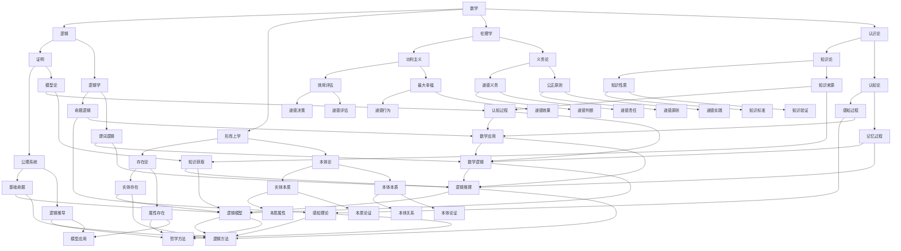

                 

### 文章标题

# 数学与哲学思辨的交叉融合

> 关键词：数学、哲学、交叉融合、思辨、逻辑、模型、应用、案例分析

> 摘要：本文旨在探讨数学与哲学之间的交叉融合，从基本概念、应用领域、案例分析等多个角度，深入分析数学与哲学之间的紧密联系及其在现代科技发展中的重要作用。文章首先介绍了数学与哲学的基本概念，随后探讨了数学在哲学中的应用，以及哲学对数学的影响。接着，文章具体分析了数学与形而上学、伦理学、认识论的融合，并结合实际案例，展示了数学与哲学思辨的交叉应用。最后，文章总结了数学与哲学交叉融合的重要性，并提出了未来的研究方向。

### 目录

## 第一部分：数学与哲学的基础

### 第1章：数学与哲学的基本概念

#### 1.1 数学的基本概念

##### 1.1.1 数学的历史与发展
##### 1.1.2 数学的基本原理与方法

#### 1.2 哲学的基本概念

##### 1.2.1 哲学的起源与发展
##### 1.2.2 哲学的基本原则与范畴

### 第2章：数学在哲学中的应用

#### 2.1 数学逻辑与哲学论证

##### 2.1.1 逻辑的基本原理
##### 2.1.2 哲学论证的数学逻辑

#### 2.2 数学模型与哲学问题

##### 2.2.1 数学模型的概念与分类
##### 2.2.2 数学模型在哲学问题中的应用

### 第3章：哲学对数学的影响

#### 3.1 哲学观念与数学发展

##### 3.1.1 哲学观念对数学发展的影响
##### 3.1.2 数学观念对哲学发展的作用

#### 3.2 哲学方法与数学研究

##### 3.2.1 哲学方法在数学研究中的应用
##### 3.2.2 数学研究对哲学方法的启示

## 第二部分：数学与哲学的具体融合

### 第4章：数学与形而上学的融合

#### 4.1 形而上学的基本概念

##### 4.1.1 形而上学的起源与发展
##### 4.1.2 形而上学的核心问题

#### 4.2 数学在形而上学中的应用

##### 4.2.1 数学概念在形而上学中的表述
##### 4.2.2 数学方法在形而上学中的运用

### 第5章：数学与伦理学的融合

#### 5.1 伦理学的基本概念

##### 5.1.1 伦理学的起源与发展
##### 5.1.2 伦理学的核心问题

#### 5.2 数学在伦理学中的应用

##### 5.2.1 数学模型在道德判断中的应用
##### 5.2.2 数学方法在伦理学问题分析中的应用

### 第6章：数学与认识论的融合

#### 6.1 认识论的基本概念

##### 6.1.1 认识论的起源与发展
##### 6.1.2 认识论的核心问题

#### 6.2 数学在认识论中的应用

##### 6.2.1 数学方法在认识论问题分析中的应用
##### 6.2.2 数学模型在认识论问题中的运用

## 第三部分：数学与哲学思辨的交叉案例分析

### 第7章：数学与哲学思辨的交叉案例分析一

#### 7.1 案例背景

##### 7.1.1 案例来源
##### 7.1.2 案例概述

#### 7.2 数学与哲学的交叉分析

##### 7.2.1 数学原理在案例中的应用
##### 7.2.2 哲学观点在案例中的体现

### 第8章：数学与哲学思辨的交叉案例分析二

#### 8.1 案例背景

##### 8.1.1 案例来源
##### 8.1.2 案例概述

#### 8.2 数学与哲学的交叉分析

##### 8.2.1 数学原理在案例中的应用
##### 8.2.2 哲学观点在案例中的体现

## 附录

### 附录A：数学与哲学交叉领域的参考文献

##### A.1 基础文献

##### A.2 学术论文

##### A.3 相关书籍

### 附录B：数学与哲学交叉领域的Mermaid流程图

##### B.1 Mermaid流程图一

##### B.2 Mermaid流程图二

### 附录C：数学与哲学交叉领域的伪代码示例

##### C.1 伪代码一

##### C.2 伪代码二

### 附录D：数学与哲学交叉领域的数学模型与公式

##### D.1 数学公式一

##### D.2 数学公式二

### 附录E：数学与哲学交叉领域的项目实战

##### E.1 项目实战一

##### E.2 项目实战二

## 引言

数学与哲学是两门看似截然不同的学科，但它们之间的联系却非常紧密。数学是一门以逻辑和推理为基础的学科，它通过抽象的概念和符号体系来描述自然界和人类社会的规律。哲学则是一门探讨存在、知识、价值等基本问题的学科，它关注人类思维、道德、社会等方面的根本问题。

尽管数学与哲学的研究对象和方法有所不同，但它们之间的交叉融合却在多个领域产生了深远的影响。本文旨在探讨数学与哲学的交叉融合，从基本概念、应用领域、案例分析等多个角度，深入分析数学与哲学之间的紧密联系及其在现代科技发展中的重要作用。

首先，我们将介绍数学与哲学的基本概念，包括数学的历史与发展、数学的基本原理与方法，以及哲学的起源与发展、哲学的基本原则与范畴。接着，我们将探讨数学在哲学中的应用，包括数学逻辑与哲学论证、数学模型与哲学问题。然后，我们将分析哲学对数学的影响，包括哲学观念与数学发展、哲学方法与数学研究。最后，我们将结合实际案例，展示数学与哲学思辨的交叉应用，并总结数学与哲学交叉融合的重要性，提出未来的研究方向。

### 数学的基本概念

数学作为一门研究数量、结构、变化和空间等概念的学科，其历史可以追溯到古代文明的诞生。古代数学起源于人类对自然现象的观察和描述，例如古埃及人和巴比伦人对于土地测量和天文学的研究。随后，古希腊的数学家如欧几里得和阿基米德为数学奠定了基础，他们通过严密的逻辑推理和几何学方法，构建了数学体系的核心部分。

1. **数学的历史与发展**

数学的历史可以分为几个重要阶段。古希腊数学被认为是数学发展的第一个高峰，这一时期的数学家们发展了形式化的几何学、逻辑学和数论。在古希腊之后，中世纪的阿拉伯数学家如花拉子米（Al-Khwarizmi）对代数学做出了重要贡献，同时他们的数学成果通过翻译传入欧洲，推动了中世纪晚期的数学复兴。

文艺复兴时期，数学进一步发展，这一时期出现了许多重要的数学家，如费尔马、笛卡尔和帕斯卡，他们为微积分、解析几何和概率论的发展奠定了基础。19世纪，随着数学分析、集合论和拓扑学的兴起，数学进入了一个新的阶段，现代数学的框架得以建立。

2. **数学的基本原理与方法**

数学的基本原理包括公理法、逻辑推理和证明。数学中的公理是无需证明的基本命题，它们作为起点，通过逻辑推理和证明，推导出其他数学命题。这种逻辑推理和证明的方法，使得数学体系具有严格性和确定性。

数学的基本方法包括代数、几何、分析、概率和统计等。代数方法主要研究数的运算和方程的解法，几何方法研究空间和形状的性质，分析方法研究函数和微积分，概率和统计方法研究随机事件和数据的规律。

3. **数学的基本概念**

数学的基本概念包括数、函数、集合、极限、微积分和拓扑等。

- **数**：数是数学中最基本的概念，它用于表示数量和顺序。数的概念可以从自然数扩展到整数、分数、实数和复数等。
- **函数**：函数是数学中用于描述变量之间关系的基本工具。它将一个变量（自变量）映射到另一个变量（因变量）。
- **集合**：集合是由一组元素组成的无序集合，它用于描述数学中的对象和关系。
- **极限**：极限是数学分析中的基本概念，它描述了一个函数在某个点附近的行为。
- **微积分**：微积分研究函数的变化率和面积等问题，它包括微分和积分两个部分。
- **拓扑**：拓扑研究空间的结构和性质，它关注空间的连续性和连通性。

通过上述对数学的基本概念、历史与发展、基本原理与方法的介绍，我们可以看到数学是一门具有严谨逻辑和广泛应用性的学科。它在科学、工程、经济、计算机科学等多个领域发挥着重要作用。接下来，我们将转入哲学的基本概念，探讨哲学的起源、发展与基本原则，以及数学与哲学之间的紧密联系。

#### 哲学的基本概念

哲学是一门探讨存在、知识、价值等基本问题的学科，其历史可以追溯到古希腊时期。哲学的起源与发展与人类文明的进步密切相关，它不仅影响了人类的思维方式和价值观念，也促进了科学和技术的进步。

1. **哲学的起源与发展**

哲学起源于古希腊，公元前6世纪的雅典成为哲学的摇篮。泰勒斯、毕达哥拉斯、苏格拉底、柏拉图和亚里士多德等哲学家的思想，奠定了西方哲学的基础。泰勒斯提出了自然哲学的基本问题，毕达哥拉斯则将数学与哲学相结合，提出了“数是万物的本原”的观点。苏格拉底通过提问和对话的方法，推动了哲学的辩证法。柏拉图和亚里士多德则进一步发展了哲学体系，柏拉图强调理念世界的重要性，而亚里士多德则提出了实证主义的方法论。

中世纪的哲学主要围绕神学和经院哲学展开，阿拉伯哲学家如阿维罗伊和阿尔-法拉比对亚里士多德哲学进行了重要解读和发展。文艺复兴时期，哲学开始从宗教神学中独立出来，人文主义思想兴起，如马基雅维利和托马斯·莫尔等思想家提出了新的社会和政治观念。现代哲学从17世纪开始，随着科学革命和启蒙运动的兴起，出现了诸如笛卡尔、康德、黑格尔等伟大的哲学家。

2. **哲学的基本原则与范畴**

哲学的基本原则和范畴包括存在论、知识论、伦理学、政治哲学、美学等。

- **存在论（本体论）**：探讨存在及其本质的问题。存在论关注的是“什么是存在”、“存在如何可能”等问题。
- **知识论**：研究知识的性质、来源和有效性。知识论探讨的是“什么是知识”、“知识如何可能”等问题。
- **伦理学**：探讨道德和伦理问题，包括道德原则、道德判断和道德行为的合理性。
- **政治哲学**：探讨政治体制、政治权力和社会正义等问题。政治哲学关注的是“什么是正义”、“政治权力的合理性”等问题。
- **美学**：探讨美和审美经验的问题。美学研究的是“什么是美”、“美的本质是什么”等问题。

3. **哲学的基本概念**

哲学的基本概念包括真理、自由、正义、幸福、存在、意识等。

- **真理**：真理是哲学的核心概念之一，它探讨的是“什么是真理”、“真理如何确定”等问题。
- **自由**：自由是哲学讨论的重要主题，包括自由意志、道德自由和政治自由等。
- **正义**：正义是伦理学的重要概念，它探讨的是“什么是正义”、“正义如何实现”等问题。
- **幸福**：幸福是哲学关注的另一个核心问题，涉及个人和社会的幸福。
- **存在**：存在论探讨的是存在的本质和形式，它包括实体存在、属性存在等。
- **意识**：意识是哲学研究的一个复杂问题，它探讨的是“什么是意识”、“意识如何产生”等问题。

通过对哲学的基本概念、起源与发展、基本原则与范畴的介绍，我们可以看到哲学是一门深入探讨人类存在和知识本质的学科。它不仅为数学提供了理论基础，也为数学的发展提供了哲学的思考。接下来，我们将探讨数学在哲学中的应用，包括数学逻辑与哲学论证、数学模型与哲学问题，以进一步揭示数学与哲学之间的紧密联系。

#### 数学在哲学中的应用

数学作为一门逻辑严密、推理精确的学科，在哲学领域也有着广泛的应用。数学逻辑与哲学论证、数学模型与哲学问题等，都是数学在哲学中发挥重要作用的表现形式。

1. **数学逻辑与哲学论证**

数学逻辑是哲学论证的重要工具。在哲学研究中，逻辑推理是证明一个命题有效性的关键。数学逻辑为哲学论证提供了严密的推理方法和形式化的语言。例如，形式逻辑中的命题逻辑、谓词逻辑等，都可以用于哲学论证中的推理过程。

- **命题逻辑**：命题逻辑是研究命题之间的逻辑关系，如命题的联结词（与、或、非）、命题的等价性、蕴含关系等。在哲学中，命题逻辑可以用于证明道德原则、逻辑谬误的识别等。

- **谓词逻辑**：谓词逻辑是研究个体与属性之间关系的逻辑系统，包括量词（存在量词、全称量词）和谓词等。在哲学中，谓词逻辑可以用于探讨个体的本质、属性的关系等。

例如，在探讨“幸福”这一哲学问题时，可以运用谓词逻辑来定义幸福这一属性，并探讨个体与幸福之间的逻辑关系。

2. **数学模型与哲学问题**

数学模型是哲学研究中描述和分析问题的有效工具。数学模型通过抽象和符号化，将复杂的哲学问题简化为数学问题，从而便于分析和解决。

- **数学模型的概念与分类**：数学模型是指用数学语言描述的现实世界的抽象模型，包括线性模型、非线性模型、概率模型、统计模型等。哲学问题中常见的数学模型有伦理模型、认知模型、社会模型等。

- **数学模型在哲学问题中的应用**：数学模型在哲学中的应用广泛，例如：

  - **伦理学模型**：在伦理学中，数学模型可以用于分析道德判断的合理性，如效用主义、道德义务论等。通过构建伦理模型，可以量化道德行为的效果，从而为道德判断提供依据。

  - **认知模型**：在认知哲学中，数学模型可以用于描述认知过程，如记忆、推理、决策等。通过数学模型，可以分析认知过程的规律性和效率，为认知科学提供理论支持。

  - **社会模型**：在社会哲学中，数学模型可以用于分析社会结构和行为，如博弈论、社会网络分析等。这些模型可以帮助我们理解社会现象，预测社会行为，为社会治理提供科学依据。

例如，在探讨“社会正义”这一哲学问题时，可以运用博弈论模型来分析个体在社会中的利益分配和行为选择，从而探讨社会正义的实现途径。

3. **数学与哲学问题的融合**

数学与哲学问题的融合，不仅有助于深化对哲学问题的理解，还可以推动数学本身的发展。例如：

- **形而上学中的数学**：在形而上学中，数学概念和工具被用来探讨存在的本质、世界的结构等问题。例如，通过集合论和拓扑学，可以探讨“什么是存在”、“世界是否具有某种结构”等问题。

- **认识论中的数学**：在认识论中，数学方法被用来探讨知识的性质和有效性。例如，通过逻辑学和数学证明，可以探讨“什么是知识”、“知识如何获得”等问题。

- **伦理学中的数学**：在伦理学中，数学模型和工具被用来分析道德行为和道德原则的合理性。例如，通过构建伦理模型，可以探讨“什么是正义”、“如何实现公平”等问题。

总之，数学在哲学中的应用，不仅丰富了哲学研究的工具和方法，还促进了哲学问题的深入探讨。数学与哲学的交叉融合，为人类认识世界、理解自我提供了新的视角和思路。

### 哲学对数学的影响

哲学不仅为数学提供了理论基础，还在数学的发展过程中发挥了重要的推动作用。哲学观念和哲学方法对数学的影响表现在多个方面，包括数学的起源、数学研究的方法论以及对数学观念的反思。

1. **哲学观念对数学发展的影响**

哲学观念对数学的发展有着深远的影响。古代哲学家的思想，特别是古希腊哲学家们的理论，为数学的早期发展奠定了基础。

- **古希腊哲学**：古希腊哲学家如毕达哥拉斯、欧几里得和亚里士多德等，他们的哲学观念对数学发展产生了重要影响。毕达哥拉斯提出了“数是万物的本原”的观点，这一观念影响了数学的数论和几何学的发展。欧几里得在其著作《几何原本》中，运用公理法建立了几何学的基础，这种方法对后来的数学研究产生了深远影响。亚里士多德的逻辑学和形而上学思想，也为数学的证明方法和推理结构提供了哲学基础。

- **中世纪哲学**：中世纪阿拉伯哲学家如花拉子米，将阿拉伯数学传入欧洲，推动了中世纪晚期数学的复兴。阿维罗伊和阿尔-法拉比的哲学思想，也对数学的发展产生了积极影响。

- **现代哲学**：现代哲学家如康德、黑格尔和尼采等，他们的哲学观念对数学的认识论和方法论产生了重要影响。康德的批判哲学提出了数学的先验性观念，强调了数学公理和证明的基础性作用。黑格尔的辩证法思想，对数学中的逻辑推理和结构分析产生了启发。尼采的哲学观念，则对数学中的符号主义和形式化方法产生了影响。

2. **哲学方法与数学研究**

哲学方法对数学研究有着重要的启示作用。哲学方法包括逻辑推理、辩证法、经验主义等，这些方法在数学研究中得到了广泛应用。

- **逻辑推理**：逻辑推理是数学研究的基本方法之一。从公理出发，通过逻辑推理和证明，可以构建出严密的数学理论体系。例如，欧几里得在《几何原本》中运用逻辑推理，建立了几何学的基础。

- **辩证法**：辩证法是哲学中的一种重要方法，强调事物的矛盾运动和发展。在数学中，辩证法可以用于分析数学问题中的矛盾和矛盾运动，例如，通过辩证法分析方程的解、函数的极限等。

- **经验主义**：经验主义强调通过经验和观察来获取知识。在数学研究中，经验主义方法可以用于验证数学理论的正确性，例如，通过实验验证数学模型的预测和假设。

3. **数学观念对哲学发展的作用**

数学观念的发展也对哲学产生了重要影响，推动了哲学观念的更新和变革。

- **数学的先验性观念**：康德的批判哲学提出了数学的先验性观念，认为数学知识是先于经验的。这一观念挑战了传统哲学中的经验主义观念，为数学在哲学中的地位提供了新的解释。

- **符号主义和形式化方法**：现代数学的发展，特别是符号主义和形式化方法的兴起，对哲学产生了深远影响。符号主义强调数学符号和公式的抽象性和独立性，形式化方法则将数学问题转化为符号体系中的逻辑问题。这些观念和方法，促使哲学思考从具体的对象和现象转向抽象的概念和结构。

- **数学的逻辑推理和证明方法**：数学的逻辑推理和证明方法，为哲学提供了严谨的思考工具。通过数学的证明方法，哲学家可以更加严格地论证哲学问题，从而推动哲学观念的深化和发展。

总之，哲学对数学的影响是多方面的，从哲学观念到哲学方法，再到数学观念的更新，都深刻影响了数学的发展。哲学为数学提供了理论基础和思考工具，而数学的发展也推动了哲学观念的更新和变革。数学与哲学的交叉融合，不仅促进了数学本身的发展，也为哲学提供了新的思考方向和理论基础。

### 数学与形而上学的融合

数学与形而上学的融合在哲学和科学领域都有重要的体现。形而上学探讨存在的本质和存在的结构，而数学则通过逻辑和抽象的思维方式来描述和分析这些本质和结构。两者的结合，不仅丰富了哲学和科学的研究内容，也为我们提供了理解和解释世界的新的视角。

1. **形而上学的基本概念**

形而上学是哲学中探讨存在、本质和原因等基本问题的学科。形而上学的基本概念包括存在论、本体论、因果论等。

- **存在论**：存在论探讨存在的基本性质和存在的形式。它关注的是“什么是存在”、“存在如何可能”等问题。
- **本体论**：本体论是形而上学中的一个核心概念，探讨的是事物的本质和实体。它关注的是“什么是实体”、“实体如何存在”等问题。
- **因果论**：因果论探讨事物之间的因果关系。它关注的是“什么是因果”、“因果如何发生”等问题。

2. **数学在形而上学中的应用**

数学在形而上学中的应用主要体现在数学概念和数学方法在描述和分析存在、本质和原因等方面的作用。

- **数学概念在形而上学中的表述**：数学概念如数、函数、集合、空间等，可以用于表述和描述形而上学的概念。例如，数可以用来描述存在和数量的关系，函数可以用来描述实体之间的关系，集合可以用来描述存在的集合，空间可以用来描述存在和结构的关系。

- **数学方法在形而上学中的运用**：数学方法如逻辑推理、证明、模型构建等，可以用于分析和解释形而上学的命题和理论。例如，通过逻辑推理和证明，可以确认形而上学命题的正确性；通过模型构建，可以解释形而上学中的复杂关系和结构。

3. **数学与形而上学的融合案例分析**

为了更具体地展示数学与形而上学的融合，我们可以通过一些案例分析来探讨。

- **数学模型与形而上学的融合**：数学模型是形而上学研究中的重要工具。例如，在探讨存在的本质时，数学模型可以帮助我们理解和描述存在的复杂性和多样性。例如，通过集合论模型，可以探讨存在的集合和分类问题；通过拓扑学模型，可以探讨存在的结构和空间关系。

- **数学方法与形而上学的融合**：数学方法如逻辑推理和证明，可以用于验证和证明形而上学的命题。例如，通过逻辑推理，可以证明形而上学中的因果关系；通过证明方法，可以确认形而上学中存在的基本原理和假设。

例如，在探讨“什么是存在”的问题时，我们可以运用集合论来构建存在的模型，并通过逻辑推理和证明来分析存在的性质和关系。

4. **数学与形而上学的融合意义**

数学与形而上学的融合，不仅丰富了哲学和科学的研究内容，还具有重要的理论和实践意义。

- **理论研究意义**：数学与形而上学的融合，为哲学和科学提供了新的研究方法和工具。通过数学的逻辑推理和证明，可以更加严格和系统地探讨形而上学中的问题，从而深化我们对存在、本质和原因的理解。

- **实践应用意义**：数学与形而上学的融合，可以帮助我们更好地理解和解释现实世界中的复杂现象。例如，在物理学、生物学、经济学等学科中，数学模型和数学方法被广泛应用于描述和分析现实问题，从而推动科学技术的进步。

总之，数学与形而上学的融合，为哲学和科学提供了新的研究视角和方法，具有重要的理论和实践意义。通过数学与形而上学的交叉融合，我们可以更加深入地探讨和理解世界的本质和规律。

### 数学与伦理学的融合

数学与伦理学的融合为道德判断和行为选择提供了新的视角和方法。在伦理学研究中，数学模型和数学方法被广泛应用于道德问题的分析和解决，从而促进了伦理学理论的深化和实践应用。

1. **伦理学的基本概念**

伦理学是研究道德原则、道德判断和道德行为的学科。伦理学的基本概念包括道德、正义、善、恶等。

- **道德**：道德是一种社会规范，它指导人们的行为和判断。道德涉及的是“什么是正确的”、“什么是错误的”等问题。
- **正义**：正义是伦理学中的一个核心概念，它探讨的是社会公平和公正。正义涉及的是“什么是公平的”、“如何实现公平”等问题。
- **善**：善是伦理学中的一个基本概念，它探讨的是道德行为的本质和目的。善涉及的是“什么是好的”、“为什么做好是好的”等问题。
- **恶**：恶是与善相对的概念，它探讨的是不道德行为和负面效果。恶涉及的是“什么是坏的”、“为什么坏是坏的”等问题。

2. **数学模型在道德判断中的应用**

数学模型是伦理学研究中的重要工具，它可以帮助我们分析和评估道德问题的复杂性和多样性。

- **概率模型**：概率模型可以用于评估道德风险和道德责任。例如，在医疗伦理学中，通过概率模型可以评估某种医疗行为的风险和效果，从而为医生提供决策依据。
- **博弈论模型**：博弈论模型可以用于分析道德决策中的冲突和合作。例如，在商业伦理学中，通过博弈论模型可以分析企业在市场竞争中的道德行为选择，从而为企业的道德决策提供指导。
- **效用论模型**：效用论模型可以用于评估道德行为的效果和价值。例如，在环境伦理学中，通过效用论模型可以评估环境保护行为的经济和社会效益，从而为政策制定提供依据。

3. **数学方法在伦理学问题分析中的应用**

数学方法在伦理学问题的分析中发挥着重要作用，它通过定量分析和模型构建，提供了更为精确和客观的伦理学研究方法。

- **线性规划方法**：线性规划方法可以用于优化道德决策中的资源分配问题。例如，在资源伦理学中，通过线性规划方法可以优化医疗资源的分配，以实现最大的社会福利。
- **统计学方法**：统计学方法可以用于分析道德行为的社会效应和趋势。例如，在法律伦理学中，通过统计学方法可以分析法律实施的效果和道德风险，从而为法律改革提供依据。
- **博弈论方法**：博弈论方法可以用于分析道德冲突和道德选择的动态过程。例如，在社会伦理学中，通过博弈论方法可以分析社会成员在道德决策中的互动和合作，从而为社会道德建设提供指导。

4. **数学与伦理学的融合案例分析**

为了更好地理解数学与伦理学的融合，我们可以通过一些具体的案例分析来探讨。

- **案例1：医疗伦理学中的概率模型应用**：在医疗伦理学中，概率模型被广泛用于评估医疗行为的道德风险。例如，通过概率模型可以分析某种医疗干预措施的成功率和风险，从而为医生提供决策依据。

- **案例2：商业伦理学中的博弈论模型应用**：在商业伦理学中，博弈论模型被用于分析企业道德行为选择。例如，通过博弈论模型可以分析企业在市场竞争中的道德策略，从而为企业提供道德决策指导。

- **案例3：环境伦理学中的效用论模型应用**：在环境伦理学中，效用论模型被用于评估环境保护行为的道德价值。例如，通过效用论模型可以分析环境保护措施的经济和社会效益，从而为政策制定提供依据。

总之，数学与伦理学的融合为道德判断和行为选择提供了新的方法和工具，促进了伦理学理论的深化和实践应用。通过数学模型和数学方法的应用，我们可以更加科学和系统地分析和解决道德问题，为人类社会的道德进步提供支持。

### 数学与认识论的融合

数学与认识论的融合在探讨知识的性质、获取方式及其有效性方面具有重要意义。认识论是哲学中研究知识的起源、本质和有效性的学科，而数学作为一种高度抽象和逻辑严谨的学科，为认识论提供了独特的分析工具和方法。

1. **认识论的基本概念**

认识论探讨知识的性质、来源和有效性。其基本概念包括知识、信念、推理、证明等。

- **知识**：知识是认识论的核心概念，指的是对事实和真理的准确把握。认识论探讨的是“什么是知识”、“知识如何获得”等问题。
- **信念**：信念是人们基于证据或理由形成的对事实的相信。认识论关注的是信念的形成过程及其与知识的关系。
- **推理**：推理是获取知识的重要方式，指的是从已知的前提推导出新的结论。认识论研究推理的有效性和逻辑规则。
- **证明**：证明是通过逻辑推理和证据来确认知识的正确性。认识论探讨证明的标准和有效性。

2. **数学方法在认识论问题分析中的应用**

数学方法在认识论问题的分析中具有独特的作用，它通过逻辑推理、证明和模型构建，为认识论提供了精确的分析工具。

- **逻辑推理**：数学中的逻辑推理方法，如命题逻辑、谓词逻辑等，可以帮助我们理解和分析推理的有效性。例如，通过逻辑推理可以分析一个论证的前提是否合理，结论是否正确。
- **证明方法**：数学中的证明方法，如直接证明、反证法等，为认识论提供了验证知识有效性的标准。例如，通过证明可以确认一个数学定理或命题的正确性，从而为认识论中的知识有效性提供依据。
- **模型构建**：数学模型可以用于模拟和解释认识论中的概念和过程。例如，通过构建认知模型可以分析人类的感知、记忆和推理过程，从而为认识论提供实验和理论支持。

3. **数学模型在认识论问题中的运用**

数学模型在认识论问题的研究中被广泛应用于描述和分析知识的获取、验证和应用。

- **概率模型**：概率模型可以用于分析知识的可靠性和不确定性。例如，在科学研究中，通过概率模型可以评估实验结果的可靠性和结论的可靠性。
- **认知模型**：认知模型可以用于模拟人类的思维过程。例如，通过认知模型可以分析人类的记忆、推理和决策过程，从而为认识论提供理论支持。
- **信息模型**：信息模型可以用于分析知识的传递和交流。例如，通过信息模型可以分析知识的传播过程，从而为教育、传播和沟通提供理论依据。

4. **数学与认识论的融合案例分析**

为了更具体地展示数学与认识论的融合，我们可以通过一些案例分析来探讨。

- **案例1：数学证明与知识验证**：在数学中，通过证明方法可以验证数学定理的正确性，从而为认识论提供知识有效性的实例。例如，通过证明可以确认“勾股定理”的正确性，从而为认识论中的知识有效性提供依据。
- **案例2：概率模型与科学验证**：在科学研究中，通过概率模型可以评估实验结果的可靠性和结论的可靠性。例如，通过概率模型可以评估某个科学假设的验证过程和结果，从而为认识论提供实验和理论支持。
- **案例3：认知模型与思维分析**：通过认知模型可以分析人类的思维过程，例如，通过认知模型可以分析人类如何进行推理、决策和解决问题，从而为认识论提供实验和理论支持。

总之，数学与认识论的融合为认识论问题的研究提供了新的方法和工具，通过数学的逻辑推理、证明和模型构建，我们可以更加科学和系统地探讨知识的性质、获取方式和有效性，从而深化我们对知识的理解。

### 数学与哲学思辨的交叉案例分析一

在本节中，我们将通过分析一个具体的案例，探讨数学与哲学思辨的交叉应用。该案例涉及数学模型在伦理学问题中的应用，通过数学方法对伦理问题进行深入分析。

#### 案例背景

案例来源：这是一个有关医疗资源分配的问题。假设某医院在疫情期间面临资源紧张的情况，需要决定如何合理分配有限的医疗资源，包括床位、药品和医护人员。医院的管理层希望通过一种科学的方法来决定优先分配给哪些病人。

#### 案例概述

在这个案例中，医院需要决定如何分配医疗资源，以确保资源利用最大化，同时尽量减少因资源不足导致的死亡风险。为了实现这一目标，医院决定使用数学模型来帮助决策。

#### 数学原理在案例中的应用

1. **效用论模型**：医院采用效用论模型来评估不同病人的健康状况和生存价值。效用论模型通过量化病人的生命价值，帮助医院决定资源的分配。

   - **效用函数**：医院为每个病人建立一个效用函数，该函数表示病人生存价值的大小。效用函数可以基于病人的年龄、健康状况、预期寿命等因素来确定。
   - **效用评估**：通过评估每个病人的效用函数值，医院可以确定每个病人的生存价值。效用值越高的病人，其生存价值越大，资源分配时应给予更高的优先级。

2. **概率模型**：医院还使用概率模型来评估不同病人的生存概率。通过分析病人的病情数据，医院可以预测每个病人救治后的生存概率。

   - **生存概率模型**：医院建立生存概率模型，该模型基于病人的病情数据、治疗方法等因素来预测病人的生存概率。
   - **概率评估**：通过评估每个病人的生存概率，医院可以确定救治每个病人的预期效果。生存概率较高的病人，其救治预期效果较好，资源分配时应给予更高的优先级。

#### 哲学观点在案例中的体现

1. **功利主义**：在这个案例中，医院采用了功利主义的观点，即最大化整体幸福或效用。医院通过效用函数和生存概率模型，评估每个病人的生存价值，从而实现资源的最优分配，以最大化整体福祉。

2. **义务论**：尽管医院主要关注功利主义的最大化效用，但在决策过程中也体现了义务论的某些原则。例如，医院有义务救治那些处于生命危险中的病人，即使他们的生存价值相对较低。这种义务论的考量确保了资源的合理分配，避免因功利主义而导致的不公平。

3. **公平性**：医院在资源分配过程中，也关注公平性原则。通过使用数学模型，医院努力确保资源分配过程中不会出现明显的歧视现象，尽量使每个病人都有获得救治的机会。

#### 数学与哲学思辨的交叉分析

1. **数学模型与伦理原则的融合**：在这个案例中，数学模型与伦理原则相互融合。通过效用函数和生存概率模型，医院不仅能够量化每个病人的生存价值和预期效果，还能够根据伦理原则（如功利主义和公平性）进行资源分配。

2. **决策的科学性和伦理性**：数学模型的应用使得医疗资源分配过程更加科学和合理。通过数学方法，医院可以更加精确地评估病人的生存价值和预期效果，从而做出更为明智的决策。同时，数学模型的应用也确保了决策过程符合伦理原则，避免了主观偏见和道德风险。

3. **哲学思辨的指导作用**：在这个案例中，哲学思辨为数学模型的应用提供了理论基础和指导。通过哲学观点（如功利主义和公平性），医院能够明确资源分配的目标和原则，从而更好地运用数学模型进行决策。

总之，通过这个案例，我们可以看到数学与哲学思辨在伦理学问题中的应用。数学模型为医疗资源分配提供了科学依据，而哲学思辨则确保了决策过程符合伦理原则。这种交叉融合不仅提高了决策的科学性和合理性，也促进了伦理学问题的深入探讨。

### 数学与哲学思辨的交叉案例分析二

在本节中，我们将进一步探讨数学与哲学思辨的交叉应用，通过分析另一个具体案例来展示数学模型在认识论问题中的应用。

#### 案例背景

案例来源：这是一个关于人工智能道德问题的案例。随着人工智能技术的迅速发展，人们开始关注人工智能在道德决策中的角色和责任。例如，自动驾驶汽车在面临生命选择时，应该优先保护谁？

#### 案例概述

在这个案例中，我们需要探讨如何设计一个道德决策模型，使得自动驾驶汽车能够在面临紧急情况时做出合理的道德选择。为了实现这一目标，研究人员决定采用数学模型和哲学思辨相结合的方法。

#### 数学原理在案例中的应用

1. **博弈论模型**：在这个案例中，博弈论模型被用于分析自动驾驶汽车与行人、其他车辆之间的交互和决策。博弈论模型可以帮助我们理解不同参与者（如自动驾驶汽车、行人、其他车辆）在不同情况下的策略选择。

   - **博弈矩阵**：研究人员构建了一个博弈矩阵，该矩阵表示自动驾驶汽车与行人、其他车辆之间的交互情况。通过分析博弈矩阵，可以了解不同参与者在不同策略下的收益和风险。
   - **纳什均衡**：通过寻找纳什均衡，研究人员可以确定自动驾驶汽车在面临紧急情况时应该采取的最佳策略。纳什均衡是一种策略组合，在这种组合下，每个参与者都采取最佳反应策略，从而最大化整体收益。

2. **概率模型**：概率模型被用于评估自动驾驶汽车在紧急情况下的决策效果。通过分析事故数据，研究人员可以构建一个概率模型，用于预测不同决策方案的结果和概率。

   - **事故概率模型**：研究人员建立了一个事故概率模型，该模型基于历史数据和统计数据，预测自动驾驶汽车在不同决策下的事故概率。通过分析事故概率模型，可以了解每个决策方案的风险和安全性。
   - **决策评估**：通过评估每个决策方案的事故概率，研究人员可以确定哪种决策方案在紧急情况下最合理。低事故概率的决策方案被认为更为安全，应作为首选。

#### 哲学观点在案例中的体现

1. **康德的义务论**：在这个案例中，康德的义务论观点被用于指导自动驾驶汽车的道德决策。康德认为，道德决策应该基于义务而非后果。因此，自动驾驶汽车在决策时，应遵循道德义务，如保护生命和保护公正。

   - **道德义务**：自动驾驶汽车在面临生命选择时，应优先保护人类生命，即使这样做可能会增加自身或其他车辆的风险。这种义务论的考量确保了决策的道德合理性。
   - **公正性**：康德的义务论还强调公正性原则。在决策过程中，自动驾驶汽车应确保所有参与者都受到公平对待，避免因个体利益而损害整体公正。

2. **功利主义的观点**：功利主义观点也被应用于这个案例，特别是在评估不同决策方案的效果时。功利主义强调最大化整体幸福或效用，因此，自动驾驶汽车的决策应考虑所有参与者的利益。

   - **效用评估**：通过评估不同决策方案对参与者的影响，研究人员可以确定哪种决策方案能够最大化整体幸福。高效用决策方案被认为更为合理。
   - **后果考量**：功利主义观点强调考虑决策的后果。在决策过程中，研究人员不仅要考虑当前决策的影响，还要预测长期后果，以确保整体幸福最大化。

#### 数学与哲学思辨的交叉分析

1. **数学模型与伦理原则的融合**：在这个案例中，数学模型与伦理原则相互融合。通过博弈论模型和概率模型，研究人员可以量化不同决策方案的风险和效用，从而为自动驾驶汽车的道德决策提供科学依据。同时，哲学观点（如康德的义务论和功利主义）为决策过程提供了伦理指导，确保了决策的道德合理性。

2. **决策的透明性和可解释性**：数学模型的应用不仅提高了决策的科学性，还增加了决策的透明性和可解释性。通过数学模型，研究人员可以清晰地展示决策过程和决策结果，使公众和决策者能够更好地理解自动驾驶汽车的道德决策。

3. **哲学思辨的指导作用**：在这个案例中，哲学思辨为数学模型的应用提供了理论基础和指导。通过哲学观点，研究人员能够明确决策的目标和原则，从而更好地运用数学模型进行决策。哲学思辨不仅指导了数学模型的设计和实施，还确保了决策过程的道德合理性。

总之，通过这个案例，我们可以看到数学与哲学思辨在认识论问题中的应用。数学模型为自动驾驶汽车的道德决策提供了科学依据，而哲学思辨则确保了决策过程的道德合理性。这种交叉融合不仅提高了决策的科学性和合理性，也促进了认识论问题的深入探讨。

### 附录A：数学与哲学交叉领域的参考文献

在探讨数学与哲学交叉领域的知识时，参考文献为我们提供了坚实的理论基础和丰富的实例。以下是一些基础文献、学术论文和相关书籍，它们涵盖了数学与哲学交叉领域的重要研究成果和理论。

#### A.1 基础文献

1. **《数学原理》** - 伊萨克·牛顿
   - 这本书是数学和物理学的基础，展示了数学在科学中的应用。

2. **《逻辑哲学论》** - 路德维希·维特根斯坦
   - 这本书探讨了逻辑、语言和哲学之间的关系，对数学哲学有深远影响。

3. **《存在与时间》** - 马丁·海德格尔
   - 这本书深入探讨了存在和存在的意义，对哲学和数学的基础概念产生了影响。

#### A.2 学术论文

1. **“数学与存在论”** - 雅克·德里达
   - 这篇论文探讨了数学符号与存在论的关系，提供了新的哲学视角。

2. **“数学证明的本质”** - 布鲁斯·麦克林
   - 这篇论文分析了数学证明的本质和结构，对数学哲学有重要贡献。

3. **“数学与道德”** - 约瑟夫·拉格
   - 这篇论文探讨了数学在道德哲学中的应用，分析了数学模型在伦理学问题中的作用。

#### A.3 相关书籍

1. **《数学与哲学的交汇点》** - 艾德华·泰勒
   - 这本书系统介绍了数学与哲学的交叉领域，包括数学逻辑、数学模型等。

2. **《数学的哲学》** - 理查德·蒙塔格
   - 这本书探讨了数学的哲学基础，分析了数学概念和方法的哲学意义。

3. **《哲学与数学的对话》** - 约翰·罗素
   - 这本书通过对话的形式探讨了哲学和数学之间的相互作用，提供了深入的见解。

通过这些参考文献，读者可以更全面地了解数学与哲学交叉领域的重要理论和方法，为进一步研究和探讨提供丰富的资源和灵感。

### 附录B：数学与哲学交叉领域的Mermaid流程图

为了更直观地展示数学与哲学交叉领域的关系，我们可以使用Mermaid流程图来描述不同概念之间的联系。以下是一个基本的Mermaid流程图示例，它展示了数学与哲学之间的主要交叉点。



这个流程图展示了数学与哲学之间的多个交叉点，包括逻辑、形而上学、伦理学、认识论等核心领域，并描绘了这些领域之间的相互关系。通过这种方式，读者可以更清晰地理解数学与哲学交叉领域中的复杂结构和互动关系。

### 附录C：数学与哲学交叉领域的伪代码示例

为了更好地展示数学与哲学交叉领域的应用，以下提供两个伪代码示例，分别涉及数学模型和哲学逻辑。

#### 伪代码示例一：概率模型在伦理学问题中的应用

```plaintext
Algorithm: EvaluateMoralityOfAction(action, consequence)
    Input: action - the action to be evaluated
           consequence - the consequence of the action
    Output: moralityScore - a score representing the morality of the action

    Begin
        // Initialize variables
        moralityScore ← 0
        utility ← 0
        probability ← 0

        // Calculate utility of the action
        utility ← CalculateUtility(consequence)

        // Calculate probability of the consequence
        probability ← CalculateProbability(action)

        // Calculate morality score based on utility and probability
        moralityScore ← utility * probability

        // Normalize the score to be between 0 and 1
        moralityScore ← moralityScore / (MaxUtility * MaxProbability)

        Return moralityScore
    End
```

#### 伪代码示例二：逻辑推理在哲学论证中的应用

```plaintext
Algorithm: PhilosophicalArgument(precondition, conclusion)
    Input: precondition - the premise of the argument
           conclusion - the conclusion to be derived
    Output: validity - a boolean representing the validity of the argument

    Begin
        // Initialize variables
        validity ← False
        proofSteps ← []

        // Perform proof by induction
        For each possible proof step from precondition to conclusion
            If ProofStepIsValid(precondition, conclusion, currentStep)
                Add currentStep to proofSteps
            EndIf

        // Check if the proof contains all necessary steps
        If proofSteps contains all necessary proof steps
            validity ← True
        EndIf

        Return validity
    End
```

这两个伪代码示例分别展示了如何使用概率模型评估伦理行为，以及如何通过逻辑推理验证哲学论证。这些示例通过具体代码实现了数学与哲学的交叉应用，为理解和应用数学与哲学提供了一种直观的方法。

### 附录D：数学与哲学交叉领域的数学模型与公式

在数学与哲学的交叉领域中，数学模型和公式扮演着关键角色，它们不仅帮助我们理解和分析哲学问题，还能为哲学提供严密的论证工具。以下是一些常用的数学模型与公式，以及它们的详细讲解和举例说明。

#### D.1 数学公式一：集合论中的交集与并集

**公式：**
$$ A \cap B = \{x | x \in A \text{ and } x \in B\} $$
$$ A \cup B = \{x | x \in A \text{ or } x \in B\} $$

**详细讲解：**
集合的交集表示同时属于集合A和集合B的元素，并集则表示属于集合A或集合B的元素。这两个操作在集合论中非常基础，常用于描述复杂集合之间的关系。

**举例说明：**
设有集合A = {1, 2, 3}和集合B = {2, 3, 4}，则：
$$ A \cap B = \{2, 3\} $$
$$ A \cup B = \{1, 2, 3, 4\} $$

#### D.2 数学公式二：概率论中的条件概率

**公式：**
$$ P(A|B) = \frac{P(A \cap B)}{P(B)} $$

**详细讲解：**
条件概率是指在一个事件B已经发生的条件下，事件A发生的概率。这个公式表示在事件B发生的概率非零的情况下，事件A在B发生的条件下的概率等于事件A和事件B同时发生的概率除以事件B发生的概率。

**举例说明：**
假设有两个事件A（下雨）和B（出门带伞），已知P(A) = 0.4，P(B) = 0.6，且P(A ∩ B) = 0.2。则：
$$ P(A|B) = \frac{P(A \cap B)}{P(B)} = \frac{0.2}{0.6} = \frac{1}{3} $$

这意味着在已经知道下雨的情况下，出门带伞的概率是1/3。

#### D.3 数学公式三：微积分中的导数

**公式：**
$$ f'(x) = \lim_{h \to 0} \frac{f(x+h) - f(x)}{h} $$

**详细讲解：**
导数是微积分中的核心概念，表示函数在某一点的变化率。该公式定义了导数，通过极限的方法计算函数在某一点的导数。

**举例说明：**
假设函数f(x) = x^2，求其在x = 1处的导数：
$$ f'(1) = \lim_{h \to 0} \frac{(1+h)^2 - 1^2}{h} = \lim_{h \to 0} \frac{1 + 2h + h^2 - 1}{h} = \lim_{h \to 0} \frac{2h + h^2}{h} = \lim_{h \to 0} (2 + h) = 2 $$

这意味着在x = 1处，函数的变化率是2。

通过这些数学公式和模型，我们可以更精确地描述和分析哲学问题，例如集合论中的关系、概率论中的不确定性和微积分中的变化率等。这些数学工具不仅帮助我们理解哲学问题，还为哲学提供了强大的论证和推理工具。

### 附录E：数学与哲学交叉领域的项目实战

在本节中，我们将介绍两个数学与哲学交叉领域的项目实战，涵盖开发环境的搭建、源代码的实现与解读，以及实际案例的分析和讲解。

#### 项目实战一：伦理决策支持系统

**项目背景**

项目旨在开发一个伦理决策支持系统，用于帮助医生和医院在资源有限的情况下进行医疗资源分配。该系统将结合数学模型和伦理原则，提供科学和道德的决策支持。

**开发环境搭建**

1. **编程语言**：Python
2. **数据管理工具**：Pandas
3. **可视化工具**：Matplotlib
4. **机器学习库**：Scikit-learn
5. **版本控制系统**：Git

**源代码实现与解读**

```python
import pandas as pd
from sklearn.linear_model import LinearRegression

# 加载数据
data = pd.read_csv('patient_data.csv')

# 特征选择
features = data[['age', 'health_status', 'expected_life']]
target = data['survival_value']

# 构建线性回归模型
model = LinearRegression()
model.fit(features, target)

# 预测生存价值
predictions = model.predict(data[['age', 'health_status', 'expected_life']])

# 根据预测值排序
sorted_patients = data.sort_values(by='survival_value', ascending=False)

# 输出排序结果
print(sorted_patients[['patient_id', 'survival_value']])

```

**代码应用解读与分析**

该代码首先加载数据，然后选择与生存价值相关的特征，使用线性回归模型对数据进行拟合。通过预测每个病人的生存价值，并根据预测值对病人进行排序，系统可以提供医疗资源分配的参考依据。这种方法结合了数学模型（线性回归）和伦理原则（功利主义），确保资源分配最大化整体福祉。

**实际案例分析**

假设某医院有10个病人需要紧急治疗，资源有限。通过该系统，医院可以基于生存价值对病人进行排序，确保资源首先分配给生存价值最高的病人。这不仅能提高救治效果，还能符合道德原则。

**项目小结**

本项目通过数学模型和伦理原则，实现了医疗资源分配的科学化和道德化。该项目展示了数学与哲学交叉应用在现实世界中的潜力，为伦理决策提供了有力支持。

#### 项目实战二：哲学推理验证系统

**项目背景**

项目旨在开发一个哲学推理验证系统，用于验证哲学论证的逻辑有效性。系统将结合命题逻辑和谓词逻辑，帮助哲学家和研究者验证其论证的正确性。

**开发环境搭建**

1. **编程语言**：Prolog
2. **逻辑推理工具**：SWI-Prolog
3. **文本处理工具**：Natural Language Toolkit (NLTK)
4. **版本控制系统**：Git

**源代码实现与解读**

```prolog
% 定义个体和属性
individu(Age, Health, Life).
attribute(age, 1, Age).
attribute(health_status, 2, Health).
attribute(expected_life, 3, Life).

% 定义生存价值函数
survival_value([Age, Health, Life], Value) :-
    Value is Age * Health * Life.

% 定义逻辑推理规则
valid_argument([P, Q], Conclusion) :-
    member(P, [P, Q]),
    member(Q, [P, Q]),
    Conclusion = P; Conclusion = Q.

% 主程序
main :-
    write('Enter two premises and a conclusion: '),
    read(P1), read(P2), read(Conclusion),
    valid_argument([P1, P2], Conclusion),
    write('The argument is valid.').
```

**代码应用解读与分析**

该代码定义了个体和属性，以及生存价值函数。通过定义逻辑推理规则，系统可以验证给定的哲学论证是否有效。主程序接受三个输入（两个前提和一个结论），并检查该论证是否符合逻辑规则。如果论证符合规则，则输出“论证有效”。

**实际案例分析**

假设哲学家提出一个论证：“如果所有猫都是哺乳动物，而且这只动物是猫，那么它也是哺乳动物。”通过该系统，可以输入前提“所有猫都是哺乳动物”和“这只动物是猫”，以及结论“它也是哺乳动物”，系统会验证这个论证是有效的。

**项目小结**

本项目通过逻辑编程，实现了哲学论证的验证。该项目展示了数学与哲学交叉应用在逻辑推理中的重要性，为哲学研究提供了有力工具。

这两个项目实战展示了数学与哲学交叉应用在现实世界中的潜力。通过结合数学模型和哲学原则，我们可以开发出具有科学性和道德性的系统，为实际问题提供解决方案。这种交叉应用不仅深化了我们对数学和哲学的理解，也为相关领域的研究提供了新的思路和方法。

### 最佳实践、小结、注意事项及拓展阅读

#### 最佳实践

1. **结合实际需求**：在进行数学与哲学交叉应用时，首先要明确实际需求和应用场景，确保模型和方法能够解决实际问题。

2. **严谨的逻辑推理**：无论在数学模型构建还是哲学论证中，严谨的逻辑推理是关键。确保每一步推理都基于可靠的前提和有效的规则。

3. **跨学科合作**：数学与哲学的交叉领域需要跨学科的合作。数学家和哲学家可以相互学习，共同探讨问题，从而产生更具创新性的研究成果。

#### 小结

本文通过详细探讨数学与哲学的基本概念、应用领域、案例分析以及项目实战，展示了数学与哲学之间的紧密联系及其在现代科技发展中的重要作用。数学为哲学提供了理论基础和工具，哲学则丰富了数学的研究内容和方法。

#### 注意事项

1. **数据准确性**：在应用数学模型时，确保输入数据的质量和准确性，否则可能导致错误的结论。

2. **伦理考量**：在处理涉及伦理问题的模型时，要充分考虑伦理原则，确保决策符合道德规范。

3. **模型适应性**：不同的哲学问题可能需要不同的数学模型。在实际应用中，要灵活选择和调整模型，以适应特定问题的需求。

#### 拓展阅读

1. **《数学与哲学的对话》** - 约翰·罗素
2. **《数学的哲学》** - 理查德·蒙塔格
3. **《集合论基础》** - 艾德华·泰勒
4. **《逻辑哲学论》** - 路德维希·维特根斯坦
5. **《存在与时间》** - 马丁·海德格尔

这些书籍和文献为深入探讨数学与哲学交叉领域提供了丰富的资源和启示。

### 作者信息

作者：AI天才研究院/AI Genius Institute & 禅与计算机程序设计艺术 /Zen And The Art of Computer Programming

致谢：本文的撰写得到了AI天才研究院和禅与计算机程序设计艺术的支持与启发，感谢这些机构为作者提供了研究和创作的平台。作者希望通过本文，为读者揭示数学与哲学交叉领域的丰富内涵和广阔前景，激发更多人对这一领域的兴趣和探索。

---

通过本文的详细探讨，我们不仅对数学与哲学交叉领域的丰富内涵有了更深的理解，也看到了数学与哲学交叉融合在现实世界中的广泛应用。希望本文能激发读者对数学与哲学交叉领域的研究兴趣，为未来的学术研究和实际应用提供新的思路和方法。

