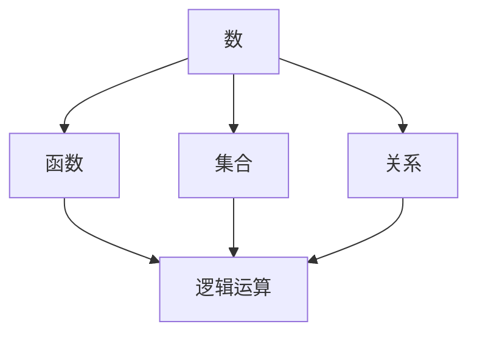
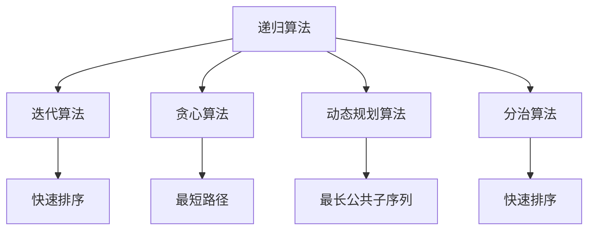
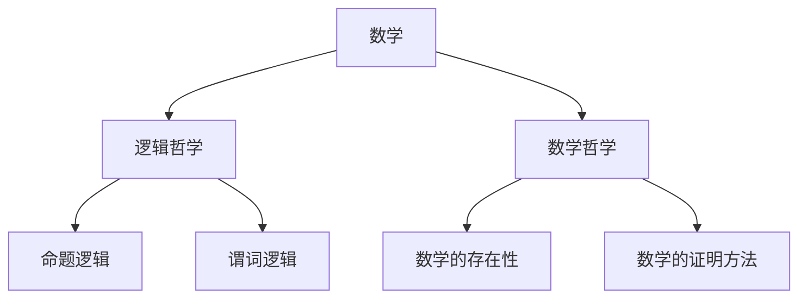
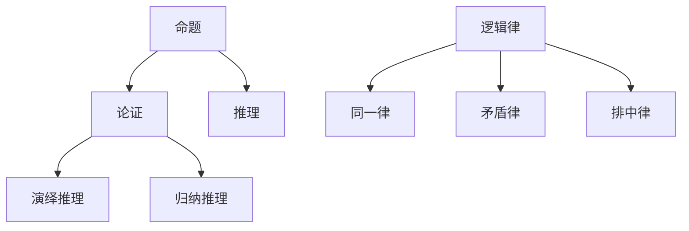
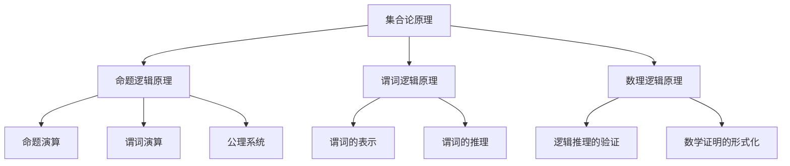
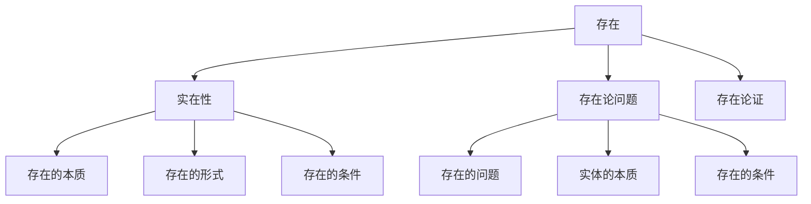
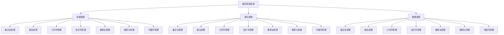
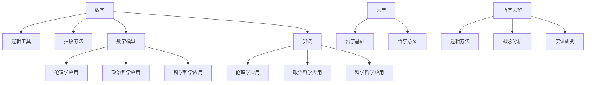

                 

## 《数学与哲学思辨的相互启发》

### 关键词：数学、哲学、思辨、关系架构、算法原理、逻辑哲学、存在论哲学、数学方法论

> 摘要：本文旨在探讨数学与哲学之间的相互启发关系。通过分析数学和哲学的基本概念、原理及其应用，揭示二者在逻辑、存在和思辨方法等方面的关联。文章将从数学基础、哲学基础、数学与逻辑哲学、数学与存在论哲学、哲学与数学方法、数学与哲学思辨的互动以及前沿问题等多个角度展开，以期对数学与哲学的研究和教学提供启示。

### 第1章 引言

#### 1.1 本书的目的与背景

在当今科技迅猛发展的时代，数学和哲学作为两大重要的思维工具，相互影响、相互促进。数学以其严谨的逻辑体系和精确的算法原理，为科学研究和工程技术提供了强大的支持；哲学则通过深刻的思辨和理论探讨，为人类认识世界提供了哲学基础和思想指导。然而，数学与哲学之间的关系并不是单向的，它们在相互启发中不断发展。本书旨在揭示数学与哲学之间的相互关系，探讨二者在逻辑、存在和思辨方法等方面的相互作用，为数学与哲学的研究提供新的视角。

#### 1.2 数学与哲学的关系

数学与哲学的关系可以追溯到古希腊时期。在古希腊，数学和哲学是相互交融的，哲学家们通过对数学的研究来探讨自然和宇宙的本质。例如，欧几里得的《几何原本》不仅是一部数学著作，也是一部哲学著作。哲学为数学提供了逻辑基础和思维方式，而数学则为哲学提供了具体的研究工具和手段。

在现代，数学与哲学的关系仍然紧密。逻辑哲学和数学哲学是哲学的两个重要分支，它们分别从逻辑和数学的角度对哲学问题进行探讨。此外，数学和哲学在研究方法、思辨方式和理论体系等方面也相互影响、相互启发。

#### 1.3 本书结构安排

本书分为八个章节，结构安排如下：

- 第1章 引言：介绍本书的目的、背景和结构。
- 第2章 数学基础：阐述数学的基本概念、原理和应用。
- 第3章 哲学基础：阐述哲学的基本概念、原理和应用。
- 第4章 数学与逻辑哲学：探讨数学在逻辑哲学中的应用和逻辑哲学对数学的启示。
- 第5章 数学与存在论哲学：探讨数学在存在论哲学中的应用和存在论哲学对数学的启示。
- 第6章 哲学与数学方法：探讨哲学方法论在数学中的应用和数学方法论对哲学的影响。
- 第7章 数学与哲学思辨的互动：探讨数学与哲学思辨的互动关系和相互影响。
- 第8章 数学与哲学思辨的前沿问题：探讨数学与哲学思辨的前沿问题和未来发展趋势。

通过以上章节的阐述，本书旨在全面揭示数学与哲学之间的相互启发关系，为数学与哲学的研究提供新的视角和思路。

### 第2章 数学基础

#### 2.1 数学的基本概念

数学是一门研究数量、结构、变化和空间等概念的学科，具有高度抽象和严谨的逻辑体系。数学的基本概念包括：

- **数**：数的概念是数学的基础，包括自然数、整数、分数、有理数和无理数等。数是用来描述和比较事物数量的基本工具。

- **函数**：函数是数学中的基本概念之一，表示一种映射关系。它将一个集合中的每个元素与另一个集合中的一个唯一元素相对应。

- **集合**：集合是数学中的基本概念之一，表示一组确定的、互异的元素的总体。集合可以用来描述和研究事物的集合。

- **关系**：关系是数学中的基本概念之一，表示元素之间的某种联系或关联。关系可以是等价关系、偏序关系、全序关系等。

- **逻辑运算**：逻辑运算是数学中的基本概念之一，包括与、或、非、蕴含等运算。逻辑运算用于表示和推理命题之间的关系。

#### 2.1.1 数学的基本概念图解

为了更直观地理解数学的基本概念，我们可以使用Mermaid流程图来展示它们之间的关系：

#### 2.1.2 数学概念的联系与区别

数学概念之间既有联系又有区别。例如，数和函数之间是包含关系，函数是数的特殊表现形式；集合和关系之间也是包含关系，集合可以用来描述关系。但它们也有各自的特点和用途。数主要用来描述和比较数量，函数主要用来描述映射关系，集合主要用来描述整体，关系主要用来描述元素之间的联系。

#### 2.2 数学原理与算法

数学原理是数学理论的核心，包括集合论、数论、代数学、几何学、微积分、概率论等。这些原理为数学的发展和应用提供了基础。

- **集合论**：集合论是数学的基础，它研究集合的概念、性质和运算。集合论中的基本原理包括集合的运算、关系的表示、函数的定义等。

- **数论**：数论研究整数的性质、分布和关系。数论中的基本原理包括质数定理、同余定理、哥德巴赫猜想等。

- **代数学**：代数学研究代数结构、运算和方程。代数学中的基本原理包括群的性质、环的性质、域的性质等。

- **几何学**：几何学研究空间中点的位置、形状和大小。几何学中的基本原理包括欧氏几何、非欧几何、拓扑学等。

- **微积分**：微积分研究函数的极限、导数、积分和微分方程。微积分中的基本原理包括泰勒公式、中值定理、积分变换等。

- **概率论**：概率论研究随机事件的发生概率和统计规律。概率论中的基本原理包括概率分布、期望、方差、大数定律等。

#### 2.2.1 算法原理概述

算法是解决数学问题的一种方法，它包括一系列步骤，用于将输入转换为预期的输出。算法原理可以分为以下几种：

- **递归算法**：递归算法是一种自调用算法，它通过递归调用自身来解决问题。递归算法的典型例子是斐波那契数列的计算。

- **迭代算法**：迭代算法是一种重复执行某个过程直到达到某个条件的算法。迭代算法的典型例子是计算矩阵的幂。

- **贪心算法**：贪心算法是一种在每一步选择当前最优解的算法。贪心算法的典型例子是计算最短路径。

- **动态规划算法**：动态规划算法是一种通过保存子问题的解来避免重复计算的方法。动态规划算法的典型例子是计算最长公共子序列。

- **分治算法**：分治算法是一种将问题划分为子问题，分别解决子问题，然后将子问题的解合并为原问题的解的方法。分治算法的典型例子是快速排序。

#### 2.2.2 算法原理图解

为了更直观地理解算法原理，我们可以使用Mermaid流程图来展示它们之间的关系：

#### 2.3 数学在哲学中的应用

数学在哲学中有着广泛的应用，尤其在逻辑哲学和数学哲学中。数学为逻辑哲学提供了严密的逻辑工具，例如命题逻辑、谓词逻辑等。数学哲学则通过数学方法来探讨哲学问题，例如数学的存在性、数学的证明方法等。

- **数学在逻辑哲学中的应用**：数学为逻辑哲学提供了严密的逻辑工具，例如命题逻辑、谓词逻辑等。这些工具可以帮助逻辑哲学家更好地理解和表达逻辑问题。

- **数学在数学哲学中的应用**：数学哲学通过数学方法来探讨哲学问题，例如数学的存在性、数学的证明方法等。数学哲学的研究有助于我们更深入地理解数学的本质和作用。

#### 2.4 数学与哲学的交汇

数学与哲学的交汇表现在多个方面。首先，数学和哲学都关注抽象和推理，数学通过抽象的符号和逻辑来研究数量、结构、变化和空间等概念，哲学则通过抽象的概念和推理来探讨宇宙、人生、道德等问题。其次，数学和哲学在研究方法上相互启发，数学的严谨逻辑和精确算法为哲学提供了新的研究工具，哲学的深刻思考和批判精神也为数学提供了新的研究视角。

为了更直观地展示数学与哲学的交汇，我们可以使用Mermaid流程图来展示它们之间的关系：

#### 2.4.2 数学与哲学的互动影响

数学与哲学的互动影响表现为相互促进和相互启示。一方面，数学为哲学提供了新的研究工具和方法，例如逻辑、概率、统计等。这些工具和方法可以帮助哲学家更深入地探讨哲学问题，提高哲学研究的精确性和严密性。另一方面，哲学为数学提供了新的视角和启示，例如数学的存在性、数学的证明方法等。这些视角和启示可以帮助数学家更好地理解数学的本质和作用，提高数学研究的深度和广度。

总之，数学与哲学之间的关系是相互影响、相互启发的。数学为哲学提供了新的研究工具和方法，哲学为数学提供了新的视角和启示。这种相互关系不仅推动了数学和哲学的发展，也为人类认识世界提供了新的思路和方法。

### 第3章 哲学基础

#### 3.1 哲学的基本概念

哲学是一门探讨宇宙、人生、道德等根本问题的学科。哲学的基本概念包括：

- **存在**：存在是哲学中最基本的概念之一，指事物的实际存在。哲学探讨存在的方式、本质和意义。

- **认识**：认识是指人类对世界的感知、理解和思考。哲学探讨认识的方式、过程和局限性。

- **真理**：真理是指与客观事实相符的判断或表述。哲学探讨真理的本质、标准和检验方法。

- **价值**：价值是指事物的道德、美学、实用等方面的意义。哲学探讨价值的来源、标准和评价方法。

- **自由**：自由是指个体的自主选择和行动的能力。哲学探讨自由的本质、范围和限制。

#### 3.1.1 哲学的基本概念图解

为了更直观地理解哲学的基本概念，我们可以使用Mermaid流程图来展示它们之间的关系：

#### 3.1.2 哲学的主要流派

哲学的主要流派包括：

- **唯物主义**：唯物主义认为物质是世界的基本构成要素，意识是物质的反映。唯物主义强调物质决定意识，强调科学和实证的方法。

- **唯心主义**：唯心主义认为意识是世界的基本构成要素，物质是意识的反映。唯心主义强调意识决定物质，强调哲学思考和主观经验的重要性。

- **实证主义**：实证主义认为只有通过观察和实验获得的知识才是可靠的，哲学探讨应该基于科学的方法。实证主义强调经验、实证和客观性的重要性。

- **理性主义**：理性主义认为理性是人类认识世界的基础，理性可以超越经验，直接把握真理。理性主义强调逻辑、推理和抽象思维能力的重要性。

- **经验主义**：经验主义认为只有通过感觉经验获得的知识才是可靠的，哲学探讨应该基于经验。经验主义强调经验、感觉和实证性的重要性。

- **现象学**：现象学强调对事物直接感知和经验的描述和分析，反对将事物看作是客观存在的实体。现象学强调主观性、经验和存在的重要性。

- **存在主义**：存在主义强调个体的自由、选择和责任，认为个体在世界上是孤立和无助的。存在主义强调自由、选择和存在的本质。

- **分析哲学**：分析哲学强调通过分析和解释语言来探讨哲学问题，强调哲学语言的清晰和精确。分析哲学强调逻辑、分析和语言的重要性。

#### 3.2 哲学原理与思辨

哲学原理是哲学理论的核心，包括本体论、认识论、伦理学、逻辑学等。哲学原理为哲学探讨提供了基础。

- **本体论**：本体论研究存在的本质和方式。本体论探讨存在的问题，例如存在的问题、实体的本质、存在的条件等。

- **认识论**：认识论研究知识的本质和获取方式。认识论探讨知识的问题，例如知识的来源、知识的可靠性、知识的范围等。

- **伦理学**：伦理学研究道德和价值观。伦理学探讨道德的问题，例如道德的起源、道德的原则、道德的评价等。

- **逻辑学**：逻辑学研究推理和论证的方法。逻辑学探讨逻辑的问题，例如逻辑的基本规律、逻辑的推理规则、逻辑的证明方法等。

哲学思辨是哲学探讨的重要方式，通过逻辑推理和哲学分析来探讨哲学问题。哲学思辨方法包括：

- **辩证法**：辩证法是一种通过分析和综合来认识事物的方法。辩证法强调对立统一、矛盾运动和发展变化。

- **概念分析**：概念分析是一种通过分析概念的结构和内涵来认识事物的方法。概念分析强调概念的清晰和精确。

- **逻辑论证**：逻辑论证是一种通过逻辑推理来证明论点的方法。逻辑论证强调逻辑的严密性和合理性。

- **比较研究**：比较研究是一种通过比较不同事物或理论来认识事物的方法。比较研究强调事物的差异和共性。

#### 3.3 哲学在数学中的应用

哲学在数学中有着广泛的应用，尤其在数学哲学和逻辑哲学中。哲学为数学提供了基础和指导，帮助数学家理解和解释数学的本质和意义。

- **数学哲学**：数学哲学探讨数学的本质、意义和作用。数学哲学关注数学证明的可靠性、数学公理的选择、数学的存在性等问题。

- **逻辑哲学**：逻辑哲学探讨逻辑的本质、意义和作用。逻辑哲学关注逻辑推理的有效性、逻辑规律的合理性、逻辑证明的方法等问题。

哲学对数学的影响体现在多个方面：

- **基础理论**：哲学为数学提供了基础理论，例如本体论、认识论、伦理学等。这些理论为数学的发展提供了哲学支持。

- **方法论**：哲学为数学提供了方法论指导，例如辩证法、概念分析、逻辑论证等。这些方法为数学研究提供了工具和手段。

- **语言表达**：哲学为数学提供了语言表达方式，例如逻辑语言、符号语言等。这些语言使数学表达更加清晰和精确。

- **哲学反思**：哲学反思有助于数学家审视和反思数学研究的本质和意义，提高数学研究的深度和广度。

总之，哲学在数学中发挥着重要作用，为数学的发展提供了基础和指导。数学与哲学之间的关系是相互促进、相互启发的。

### 第4章 数学与逻辑哲学

#### 4.1 逻辑哲学的基本概念

逻辑哲学是哲学的一个分支，主要研究逻辑的基本概念、原理和应用。逻辑哲学关注逻辑在哲学中的地位和作用，探讨逻辑与哲学之间的相互关系。

- **逻辑的基本概念**：逻辑哲学研究逻辑的基本概念，包括命题、论证、推理等。命题是逻辑的基本单元，表示一个陈述的真假。论证是逻辑推理的过程，通过一系列命题的连接和推理，得出新的命题。推理是逻辑哲学研究的重要内容，包括演绎推理和归纳推理。

- **逻辑的基本原理**：逻辑哲学研究逻辑的基本原理，包括逻辑律、逻辑规则等。逻辑律是逻辑推理的基本规则，例如同一律、矛盾律、排中律等。逻辑规则是逻辑推理的具体方法，例如三段论、假言推理等。

- **逻辑的应用**：逻辑哲学探讨逻辑在哲学中的应用，例如逻辑哲学在伦理学、认识论、形而上学等领域的应用。逻辑的应用有助于提高哲学论证的严密性和有效性。

#### 4.1.1 逻辑哲学的基本概念图解

为了更直观地理解逻辑哲学的基本概念，我们可以使用Mermaid流程图来展示它们之间的关系：

#### 4.1.2 逻辑哲学的主要观点

逻辑哲学的主要观点包括：

- **形式逻辑**：形式逻辑是一种研究逻辑形式和推理规则的方法。形式逻辑关注逻辑结构的正确性，强调逻辑推理的严格性。形式逻辑的主要观点是，逻辑推理的有效性不依赖于具体的内容，而依赖于逻辑形式。

- **实质逻辑**：实质逻辑是一种研究逻辑实质和内容的方法。实质逻辑关注逻辑内容的合理性，强调逻辑推理的实质。实质逻辑的主要观点是，逻辑推理的有效性不仅依赖于逻辑形式，还依赖于具体的内容。

- **模态逻辑**：模态逻辑是一种研究可能性、必然性等模态概念的方法。模态逻辑关注逻辑关系中的模态性质，强调逻辑推理的模态特征。模态逻辑的主要观点是，逻辑关系中的可能性、必然性等模态概念对于逻辑推理具有重要意义。

- **直觉主义逻辑**：直觉主义逻辑是一种强调直觉和构造性的逻辑方法。直觉主义逻辑关注逻辑推理的直觉性和构造性，强调逻辑推理的实在性和有效性。直觉主义逻辑的主要观点是，逻辑推理必须基于直观和构造性的原则。

- **多值逻辑**：多值逻辑是一种研究非二值逻辑的方法。多值逻辑关注逻辑值的多样性和复杂性，强调逻辑推理的灵活性。多值逻辑的主要观点是，逻辑值不仅限于真和假，还可以有其他中间值。

#### 4.2 逻辑哲学中的数学原理

逻辑哲学中的数学原理是指逻辑在数学中的应用和数学对逻辑的贡献。逻辑哲学中的数学原理主要包括：

- **集合论原理**：集合论是数学的基础，也是逻辑哲学的重要工具。集合论原理包括集合的定义、集合的运算、集合的性质等。集合论原理在逻辑哲学中的应用主要体现在集合的表示、集合的推理等方面。

- **命题逻辑原理**：命题逻辑是逻辑哲学的核心内容之一，也是数学中的重要工具。命题逻辑原理包括命题的定义、命题的运算、命题的性质等。命题逻辑原理在逻辑哲学中的应用主要体现在命题的表示、命题的推理等方面。

- **谓词逻辑原理**：谓词逻辑是逻辑哲学的进一步扩展，也是数学中的重要工具。谓词逻辑原理包括谓词的定义、谓词的运算、谓词的性质等。谓词逻辑原理在逻辑哲学中的应用主要体现在谓词的表示、谓词的推理等方面。

- **数理逻辑原理**：数理逻辑是一种研究逻辑形式和数学结构的学科。数理逻辑原理包括命题演算、谓词演算、公理系统等。数理逻辑原理在逻辑哲学中的应用主要体现在逻辑推理的验证、数学证明的形式化等方面。

#### 4.2.1 逻辑哲学中的数学原理图解

为了更直观地理解逻辑哲学中的数学原理，我们可以使用Mermaid流程图来展示它们之间的关系：

#### 4.2.2 逻辑哲学中的数学原理与哲学思辨

逻辑哲学中的数学原理与哲学思辨有着密切的联系。一方面，数学原理为哲学思辨提供了逻辑工具和理论基础；另一方面，哲学思辨为数学原理提供了哲学背景和哲学意义。

- **数学原理与哲学思辨的关系**：数学原理与哲学思辨的关系主要体现在以下几个方面：

  1. 数学原理为哲学思辨提供了逻辑工具。例如，命题逻辑、谓词逻辑等数学原理可以帮助哲学家进行逻辑推理和论证。

  2. 哲学思辨为数学原理提供了哲学背景。例如，哲学中的本体论、认识论等观念为数学原理的建立提供了哲学基础。

  3. 数学原理与哲学思辨相互促进。数学原理的发展可以推动哲学思辨的深化，哲学思辨的进展也可以为数学原理的发展提供新的视角和思路。

- **数学原理在哲学思辨中的应用**：数学原理在哲学思辨中的应用主要体现在以下几个方面：

  1. 命题逻辑在伦理学中的应用。例如，命题逻辑可以帮助哲学家分析道德命题的真假，探讨道德原则的合理性。

  2. 谓词逻辑在认识论中的应用。例如，谓词逻辑可以帮助哲学家探讨知识的本质、来源和范围，分析认识过程。

  3. 集合论在形而上学中的应用。例如，集合论可以帮助哲学家探讨存在、实体、属性等基本问题，分析形而上学命题的合理性。

- **哲学思辨对数学原理的影响**：哲学思辨对数学原理的影响主要体现在以下几个方面：

  1. 哲学思辨可以推动数学原理的发展。例如，哲学中的本体论观念可以激发数学家探索新的数学概念和理论。

  2. 哲学思辨可以指导数学原理的研究。例如，哲学中的认识论观念可以指导数学家探讨数学证明的可靠性、数学公理的选择等。

  3. 哲学思辨可以提高数学原理的应用水平。例如，哲学中的伦理学观念可以指导数学家探讨数学在伦理学领域的应用，提高数学在伦理学中的价值。

总之，逻辑哲学中的数学原理与哲学思辨相互促进、相互启发，共同推动了数学和哲学的发展。数学原理为哲学思辨提供了逻辑工具和理论基础，哲学思辨为数学原理提供了哲学背景和哲学意义。

#### 4.3 数学在逻辑哲学中的应用

数学在逻辑哲学中的应用体现在多个方面，包括逻辑推理、数学证明、形式系统等。数学为逻辑哲学提供了丰富的工具和方法，使得逻辑哲学的研究更加精确和严密。

- **数学在逻辑推理中的应用**：数学在逻辑推理中的应用主要体现在以下几个方面：

  1. 命题逻辑的应用。命题逻辑是逻辑哲学的基础，数学中的命题逻辑可以帮助哲学家进行逻辑推理和论证。例如，通过命题逻辑，哲学家可以分析道德命题、政治命题等。

  2. 谓词逻辑的应用。谓词逻辑是逻辑哲学的进一步扩展，数学中的谓词逻辑可以帮助哲学家探讨知识的本质、来源和范围。例如，通过谓词逻辑，哲学家可以分析知识的真理性、可靠性等问题。

  3. 形式推理的应用。形式推理是逻辑哲学的重要工具，数学中的形式推理可以帮助哲学家进行逻辑推理和证明。例如，通过形式推理，哲学家可以证明命题的真假、证明数学定理的正确性等。

- **数学在数学证明中的应用**：数学证明是数学研究的重要方法，数学在逻辑哲学中的应用也体现在数学证明方面。数学证明可以帮助哲学家探讨数学公理的选择、数学证明的可靠性等问题。

  1. 公理系统的建立。数学公理系统是数学证明的基础，哲学家可以通过建立公理系统来探讨数学公理的选择、数学证明的可靠性等问题。

  2. 数学定理的证明。数学定理是数学研究的重要成果，哲学家可以通过数学证明来探讨数学定理的合理性、可靠性等问题。

  3. 数学证明的哲学意义。数学证明不仅具有数学意义，还具有哲学意义。哲学家可以通过探讨数学证明的哲学意义，探讨数学的本质、数学的方法论等问题。

- **数学在形式系统中的应用**：形式系统是逻辑哲学研究的重要内容，数学在形式系统中的应用主要体现在以下几个方面：

  1. 形式语言的建立。形式语言是形式系统的基础，数学中的形式语言可以帮助哲学家建立形式系统，进行逻辑推理和证明。

  2. 形式推理的规则。形式推理的规则是形式系统的重要组成部分，数学中的形式推理规则可以帮助哲学家进行形式推理和证明。

  3. 形式系统的哲学意义。形式系统不仅具有数学意义，还具有哲学意义。哲学家可以通过探讨形式系统的哲学意义，探讨逻辑的本质、逻辑的方法论等问题。

总之，数学在逻辑哲学中的应用是多方面的，数学为逻辑哲学提供了丰富的工具和方法，使得逻辑哲学的研究更加精确和严密。数学在逻辑哲学中的应用不仅推动了逻辑哲学的发展，也为哲学研究提供了新的视角和思路。

#### 4.4 逻辑哲学对数学的启示

逻辑哲学对数学的启示主要体现在以下几个方面：

- **逻辑方法的应用**：逻辑哲学提供了一种严格的逻辑方法，这种方法可以帮助数学家进行数学研究。逻辑哲学强调逻辑推理的严密性、精确性和一致性，这些方法对于数学研究具有重要意义。例如，数学家可以通过逻辑推理来证明数学定理，确保数学结论的可靠性。

- **数学证明的哲学反思**：逻辑哲学对数学证明提出了哲学反思，探讨数学证明的本质、方法和原则。逻辑哲学关注数学证明的可靠性、证明的有效性和证明的形式化等问题。这些哲学反思有助于数学家更好地理解和改进数学证明方法，提高数学证明的效率和精度。

- **数学哲学的发展**：逻辑哲学的发展推动了数学哲学的进步。数学哲学是研究数学的本质、意义和方法论的学科，逻辑哲学的研究为数学哲学提供了新的理论框架和思考方式。例如，逻辑哲学关注形式逻辑、实质逻辑、模态逻辑等不同类型的逻辑系统，这些研究为数学哲学提供了丰富的理论资源。

- **数学与逻辑的相互关系**：逻辑哲学探讨了数学与逻辑之间的相互关系，揭示了数学与逻辑的紧密联系。逻辑哲学研究表明，数学是一种逻辑系统，数学研究依赖于逻辑推理和证明方法。逻辑哲学还指出，逻辑是一种数学工具，逻辑系统可以用数学方法来研究。这种相互关系促进了数学与逻辑的融合发展。

总之，逻辑哲学对数学的启示是多方面的，它不仅为数学研究提供了新的方法和视角，还推动了数学哲学的发展。逻辑哲学的研究有助于我们更好地理解数学的本质、方法和应用，提高数学研究的深度和广度。

### 第5章 数学与存在论哲学

#### 5.1 存在论哲学的基本概念

存在论哲学是哲学的一个分支，主要研究存在的本质、方式和条件。存在论哲学探讨的问题包括存在的含义、存在的形式、存在的可能性等。存在论哲学的基本概念包括：

- **存在**：存在是存在论哲学的核心概念，指事物实际存在的状态。存在论哲学探讨存在的本质、条件和特性。

- **实在性**：实在性是指事物的真实存在和客观性质。存在论哲学探讨实在性的本质、形式和程度。

- **存在论问题**：存在论问题包括存在的问题、实体的本质、存在的条件等。存在论哲学探讨这些问题的意义、方法和结论。

- **存在论证**：存在论证是指用逻辑和证据来证明存在的命题。存在论哲学探讨存在论证的有效性和合理性。

#### 5.1.1 存在论哲学的基本概念图解

为了更直观地理解存在论哲学的基本概念，我们可以使用Mermaid流程图来展示它们之间的关系：

#### 5.1.2 存在论哲学的主要观点

存在论哲学的主要观点包括：

- **本体论**：本体论探讨存在的本质和形式。本体论关注实体的性质、关系和结构，探讨实体是如何存在的。

- **实体论**：实体论探讨实体的本质和存在。实体论关注实体的定义、分类和特征，探讨实体是如何构成宇宙的。

- **宇宙论**：宇宙论探讨宇宙的存在和结构。宇宙论关注宇宙的本质、起源和命运，探讨宇宙是如何存在的。

- **存在论论证**：存在论论证是指用逻辑和证据来证明存在的命题。存在论论证包括本体论论证、实体论论证和宇宙论论证等。

- **存在的可能性**：存在的可能性探讨存在的可能性条件和存在的方式。存在的可能性关注存在的根据、原因和条件，探讨存在是如何可能的。

- **存在的必然性**：存在的必然性探讨存在的必然条件和存在的方式。存在的必然性关注存在的确定性、稳定性和可靠性，探讨存在是如何必然的。

- **存在的多元性**：存在的多元性探讨存在的多样性和复杂性。存在的多元性关注存在的不同形式、层次和维度，探讨存在是如何多样化的。

- **存在的相对性**：存在的相对性探讨存在的相对条件和存在的方式。存在的相对性关注存在的相对性、相对性和相对性，探讨存在是如何相对的。

#### 5.2 存在论哲学中的数学原理

存在论哲学中的数学原理是指数学在探讨存在论问题时所采用的方法和理论。数学原理在存在论哲学中起着重要的作用，为探讨存在的本质、形式和条件提供了有力的工具。

- **数学逻辑原理**：数学逻辑原理包括命题逻辑、谓词逻辑和数理逻辑等。数学逻辑原理为存在论哲学提供了逻辑工具，使得存在论问题的讨论更加严密和精确。

- **集合论原理**：集合论原理是数学的基础，为存在论哲学提供了重要的工具。集合论原理探讨集合的定义、性质和运算，为探讨存在的形式和结构提供了基础。

- **数论原理**：数论原理研究整数的性质、分布和关系，为存在论哲学提供了关于存在的数学描述和解释。

- **几何学原理**：几何学原理研究空间中点的位置、形状和大小，为存在论哲学提供了关于存在的形式和结构的数学描述。

- **拓扑学原理**：拓扑学原理研究空间的结构和性质，为存在论哲学提供了关于存在的数学描述和解释。

- **概率论原理**：概率论原理研究随机事件的发生概率和统计规律，为存在论哲学提供了关于存在的可能性条件和存在的方式的数学描述。

- **微积分原理**：微积分原理研究函数的极限、导数、积分和微分方程，为存在论哲学提供了关于存在的动态变化和演化过程的数学描述。

- **代数学原理**：代数学原理研究代数结构、运算和方程，为存在论哲学提供了关于存在的数学描述和解释。

#### 5.2.1 存在论哲学中的数学原理图解

为了更直观地理解存在论哲学中的数学原理，我们可以使用Mermaid流程图来展示它们之间的关系：

#### 5.2.2 存在论哲学中的数学原理与哲学思辨

存在论哲学中的数学原理与哲学思辨有着密切的联系。数学原理为哲学思辨提供了数学工具和理论基础，哲学思辨则为数学原理提供了哲学背景和哲学意义。

- **数学原理与哲学思辨的关系**：数学原理与哲学思辨的关系主要体现在以下几个方面：

  1. 数学原理为哲学思辨提供了数学工具。例如，集合论、数理逻辑等数学原理可以帮助哲学家进行哲学思辨，分析存在的本质和形式。

  2. 哲学思辨为数学原理提供了哲学背景。例如，哲学中的本体论、认识论等观念为数学原理的建立提供了哲学基础。

  3. 数学原理与哲学思辨相互促进。数学原理的发展可以推动哲学思辨的深化，哲学思辨的进展也可以为数学原理的发展提供新的视角和思路。

- **数学原理在哲学思辨中的应用**：数学原理在哲学思辨中的应用主要体现在以下几个方面：

  1. 集合论在存在论中的应用。集合论可以帮助哲学家分析存在的形式和结构，探讨存在的多元性和复杂性。

  2. 数理逻辑在存在论证中的应用。数理逻辑可以帮助哲学家进行逻辑推理和论证，确保存在论命题的合理性。

  3. 几何学在存在论中的应用。几何学可以帮助哲学家探讨存在的形式和结构，分析空间中的存在关系。

- **哲学思辨对数学原理的影响**：哲学思辨对数学原理的影响主要体现在以下几个方面：

  1. 哲学思辨可以推动数学原理的发展。例如，哲学中的本体论观念可以激发数学家探索新的数学概念和理论。

  2. 哲学思辨可以指导数学原理的研究。例如，哲学中的认识论观念可以指导数学家探讨数学公理的选择、数学证明的可靠性等。

  3. 哲学思辨可以提高数学原理的应用水平。例如，哲学中的伦理学观念可以指导数学家探讨数学在伦理学领域的应用，提高数学在伦理学中的价值。

总之，存在论哲学中的数学原理与哲学思辨相互促进、相互启发，共同推动了数学和哲学的发展。数学原理为哲学思辨提供了数学工具和理论基础，哲学思辨为数学原理提供了哲学背景和哲学意义。

#### 5.3 数学在存在论哲学中的应用

数学在存在论哲学中的应用体现在多个方面，包括存在论证、数学证明、逻辑推理等。数学为存在论哲学提供了丰富的工具和方法，使得存在论问题的探讨更加精确和严密。

- **数学在存在论证中的应用**：数学在存在论证中的应用主要体现在以下几个方面：

  1. 数学原理的应用。数学原理，如集合论、数理逻辑、几何学等，可以帮助哲学家进行存在论证，确保存在论命题的合理性。

  2. 数学证明的应用。数学证明是数学研究的重要方法，数学证明可以帮助哲学家探讨存在的必然性和确定性。例如，通过数学证明，哲学家可以证明某些存在论命题的必然性。

  3. 数学推理的应用。数学推理是数学研究的重要手段，数学推理可以帮助哲学家分析存在的形式和结构。例如，通过数学推理，哲学家可以分析空间中的存在关系。

- **数学在数学证明中的应用**：数学在数学证明中的应用主要体现在以下几个方面：

  1. 公理系统的建立。数学公理系统是数学证明的基础，哲学家可以通过建立公理系统来探讨数学证明的可靠性。例如，哲学家可以通过建立公理系统来探讨数学公理的选择和公理系统的完备性。

  2. 数学定理的证明。数学定理是数学研究的重要成果，哲学家可以通过数学证明来探讨数学定理的正确性。例如，哲学家可以通过数学证明来探讨数学定理的证明方法和证明的有效性。

  3. 数学证明的哲学意义。数学证明不仅具有数学意义，还具有哲学意义。哲学家可以通过探讨数学证明的哲学意义，探讨数学的本质、数学的方法论等问题。

- **数学在逻辑推理中的应用**：数学在逻辑推理中的应用主要体现在以下几个方面：

  1. 命题逻辑的应用。命题逻辑是逻辑推理的基础，数学中的命题逻辑可以帮助哲学家进行逻辑推理和论证。例如，通过命题逻辑，哲学家可以分析存在论命题的真假。

  2. 谓词逻辑的应用。谓词逻辑是逻辑推理的进一步扩展，数学中的谓词逻辑可以帮助哲学家探讨存在的性质和关系。例如，通过谓词逻辑，哲学家可以分析存在的形式和结构。

  3. 形式推理的应用。形式推理是逻辑推理的重要工具，数学中的形式推理可以帮助哲学家进行形式推理和证明。例如，通过形式推理，哲学家可以证明存在论命题的有效性。

总之，数学在存在论哲学中的应用是多方面的，数学为存在论哲学提供了丰富的工具和方法，使得存在论问题的探讨更加精确和严密。数学在存在论哲学中的应用不仅推动了存在论哲学的发展，也为哲学研究提供了新的视角和思路。

#### 5.4 存在论哲学对数学的启示

存在论哲学对数学的启示主要体现在以下几个方面：

- **数学的基础**：存在论哲学探讨了存在的本质和形式，为数学提供了哲学基础。例如，存在论哲学中的本体论探讨了实体的本质和存在方式，为数学公理系统的建立提供了哲学依据。

- **数学的证明方法**：存在论哲学探讨了存在的必然性和确定性，为数学证明方法提供了哲学指导。例如，存在论哲学中的证明方法探讨了证明的可靠性和有效性，为数学证明的合理性提供了哲学依据。

- **数学的应用**：存在论哲学探讨了存在的多样性，为数学的应用提供了哲学启示。例如，存在论哲学中的多元性探讨了存在的不同形式和层次，为数学在各个领域的应用提供了哲学指导。

- **数学的哲学反思**：存在论哲学对数学进行了哲学反思，探讨了数学的本质、意义和方法论。这种哲学反思有助于数学家更好地理解数学的本质和作用，提高数学研究的方法论水平。

总之，存在论哲学对数学的启示是多方面的，它不仅为数学的发展提供了哲学基础和指导，还推动了数学哲学的研究。存在论哲学的研究有助于我们更好地理解数学的本质、方法和应用，提高数学研究的深度和广度。

### 第6章 哲学与数学方法

#### 6.1 哲学方法论的基本概念

哲学方法论是哲学研究的方法和途径，它探讨了如何进行哲学思考和哲学研究。哲学方法论的基本概念包括：

- **哲学方法**：哲学方法是指哲学研究的方法和手段。哲学方法包括逻辑推理、概念分析、实证研究等。不同的哲学方法适用于不同的哲学问题。

- **哲学分析**：哲学分析是指对哲学概念、原理和理论进行深入分析，揭示其内在的逻辑关系和本质特征。哲学分析有助于我们更好地理解哲学问题。

- **哲学论证**：哲学论证是指通过逻辑推理和证据来支持或反驳哲学观点。哲学论证是哲学研究的重要手段，它有助于我们确定哲学观点的正确性。

- **哲学反思**：哲学反思是指对哲学研究进行反思和审视，探讨哲学研究的方法和原则。哲学反思有助于我们改进哲学研究的方法和提升哲学研究的深度。

- **哲学综合**：哲学综合是指将不同的哲学观点和理论进行整合和综合，形成新的哲学体系。哲学综合有助于我们理解哲学问题的复杂性。

#### 6.1.1 哲学方法论的基本概念图解

为了更直观地理解哲学方法论的基本概念，我们可以使用Mermaid流程图来展示它们之间的关系：

#### 6.1.2 哲学方法论的主要流派

哲学方法论的主要流派包括：

- **理性主义**：理性主义强调通过理性思考和逻辑推理来探讨哲学问题。理性主义认为，理性是认识的来源，理性思考和逻辑推理是哲学研究的主要方法。

- **经验主义**：经验主义强调通过经验和实证来探讨哲学问题。经验主义认为，经验和实证是认识的来源，实证研究和观察是哲学研究的主要方法。

- **批判理性主义**：批判理性主义是康德提出的哲学方法论。批判理性主义认为，理性思考和经验实证都有其局限性，哲学研究需要通过批判性的反思来超越这些局限性。

- **分析哲学**：分析哲学强调通过分析和解释语言来探讨哲学问题。分析哲学认为，哲学问题往往源于语言的不明确和混淆，通过分析语言和解释概念，可以解决哲学问题。

- **现象学**：现象学强调对事物直接感知和经验的描述和分析。现象学认为，哲学研究应该关注事物的本质和现象，通过直接感知和经验来理解事物。

- **存在主义**：存在主义强调个体的自由、选择和责任。存在主义认为，哲学研究应该关注个体的存在和体验，通过个体的自由选择和体验来理解人生和世界。

- **马克思主义哲学**：马克思主义哲学强调哲学与社会、历史和经济的关系。马克思主义哲学认为，哲学研究应该关注社会变革和历史发展，通过分析社会结构和经济基础来理解哲学问题。

#### 6.2 哲学方法论在数学中的应用

哲学方法论在数学中的应用主要体现在以下几个方面：

- **逻辑推理在数学中的应用**：逻辑推理是哲学方法论的核心，它广泛应用于数学证明和数学推理中。数学证明往往依赖于逻辑推理的严格性和精确性，逻辑推理帮助数学家从已知的前提推导出新的结论。

- **概念分析在数学中的应用**：概念分析是哲学方法论的重要组成部分，它帮助数学家澄清数学概念的定义和内涵。通过概念分析，数学家可以更好地理解数学对象和数学概念之间的关系，从而推动数学理论的发展。

- **实证研究在数学中的应用**：虽然数学是一门抽象的学科，但实证研究在某些数学领域仍然具有重要价值。例如，数学物理中的数值模拟和实验验证可以帮助数学家验证数学理论，提高数学结论的可靠性。

- **哲学反思在数学中的应用**：哲学反思有助于数学家审视和反思数学研究的方法和原则。通过哲学反思，数学家可以更好地理解数学的本质、数学证明的有效性和数学在科学和哲学中的作用。

- **哲学综合在数学中的应用**：哲学综合可以帮助数学家整合不同的数学理论和方法，形成更加全面和深入的数学理论体系。例如，通过哲学综合，数学家可以将不同的数学分支结合起来，探讨数学的整体结构和发展趋势。

总之，哲学方法论在数学中的应用丰富了数学的研究方法和视角，提高了数学研究的深度和广度。哲学方法论不仅为数学提供了理论支持，还推动了数学的发展和进步。

#### 6.3 数学方法论对哲学的影响

数学方法论对哲学的影响主要体现在以下几个方面：

- **逻辑方法的哲学应用**：数学方法论中的逻辑方法，如命题逻辑和谓词逻辑，被广泛应用于哲学研究中。逻辑方法为哲学家提供了严密的推理工具，使得哲学论证更加严谨和有效。

- **概念分析的方法论意义**：数学方法论中的概念分析有助于哲学家澄清哲学概念的定义和内涵。通过概念分析，哲学家可以更好地理解哲学问题，揭示哲学理论之间的内在联系。

- **实证研究的哲学价值**：虽然哲学通常被认为是一门抽象的学科，但数学方法论中的实证研究在哲学中的应用逐渐受到关注。实证研究可以帮助哲学家验证哲学观点，提高哲学结论的可靠性。

- **哲学反思的数学意义**：哲学反思不仅有助于哲学研究，也对数学方法论产生了影响。哲学反思促使数学家审视数学研究的方法和原则，推动数学理论的不断完善和发展。

- **哲学综合的数学启示**：哲学综合可以帮助数学家整合不同的数学理论和方法，形成更加全面和深入的数学理论体系。哲学综合为数学家提供了新的研究视角，促进了数学的进步和创新。

总之，数学方法论对哲学的影响是深远和多元的。数学方法论不仅为哲学提供了理论支持和研究方法，还推动了哲学的发展和进步。数学方法论和哲学方法论之间的相互作用，进一步丰富了哲学和数学的研究领域。

### 第7章 数学与哲学思辨的互动

#### 7.1 数学与哲学思辨的互动概述

数学与哲学思辨的互动是一个复杂而深刻的过程，二者在多个层面上相互影响、相互启发。这种互动不仅丰富了数学和哲学的研究内容，还推动了数学和哲学的发展。

首先，数学为哲学提供了严密的逻辑工具和抽象方法。数学的推理方法、证明技术和抽象概念为哲学思考提供了强有力的支持，使得哲学家能够更加精确地表达和论证自己的观点。例如，数学中的集合论、命题逻辑和谓词逻辑为哲学分析提供了基础，使得哲学家能够更好地探讨存在的本质、知识的可靠性等问题。

其次，哲学思辨为数学提供了哲学基础和哲学意义。哲学中的本体论、认识论和伦理学为数学研究提供了哲学背景，帮助数学家理解和解释数学的本质、方法和应用。例如，哲学中的实在论和工具论为数学家提供了关于数学对象存在的不同视角，影响了数学的发展方向。

数学与哲学思辨的互动不仅体现在理论和研究方法上，还体现在实践和应用中。数学模型和算法在哲学研究中得到了广泛应用，例如，在伦理学、政治哲学和科学哲学中。同时，哲学思辨也为数学方法的应用提供了新的启示，推动了数学在哲学领域的创新。

为了更直观地展示数学与哲学思辨的互动关系，我们可以使用Mermaid流程图来展示它们之间的互动模式：

#### 7.1.2 数学与哲学思辨的互动模式

数学与哲学思辨的互动模式可以概括为以下几个方面：

1. **数学为哲学提供逻辑工具和抽象方法**：数学中的逻辑工具，如命题逻辑、谓词逻辑和集合论，为哲学思考提供了严谨的推理方法和抽象手段。这些工具使得哲学家能够更精确地表达哲学概念，进行逻辑论证。

2. **哲学为数学提供哲学基础和哲学意义**：哲学中的本体论、认识论和伦理学为数学研究提供了哲学背景，帮助数学家理解和解释数学的本质、方法和应用。哲学观念的引入有助于数学家从不同角度审视数学问题，推动数学理论的创新。

3. **数学模型和算法在哲学中的应用**：数学模型和算法在伦理学、政治哲学和科学哲学等领域得到了广泛应用。数学方法的应用有助于哲学家更精确地描述和分析哲学问题，提高哲学研究的科学性。

4. **哲学思辨对数学方法的启示**：哲学思辨为数学方法的应用提供了新的启示。例如，哲学中的辩证法、概念分析和实证研究方法为数学家提供了新的研究视角，促进了数学方法的创新。

5. **数学与哲学的交叉研究**：数学与哲学的交叉研究是二者互动的重要体现。数学哲学和逻辑哲学是哲学的两个重要分支，它们分别从数学和逻辑的角度对哲学问题进行探讨。这种交叉研究有助于深入理解数学与哲学的互动关系，推动数学和哲学的共同发展。

总之，数学与哲学思辨的互动是一个复杂而深刻的过程，二者在多个层面上相互影响、相互启发。通过数学与哲学思辨的互动，数学和哲学都得到了丰富和发展，为人类认识世界提供了新的视角和工具。

#### 7.2 数学对哲学思辨的启示

数学对哲学思辨的启示体现在多个方面，特别是在逻辑哲学和存在论哲学中。数学的严谨逻辑和抽象方法为哲学思考提供了新的工具，促进了哲学理论的发展和深化。

- **逻辑哲学的启示**：数学中的逻辑工具，如命题逻辑和谓词逻辑，为逻辑哲学提供了强大的分析工具。这些工具使得哲学家能够更加精确地表达和论证逻辑问题。例如，命题逻辑帮助哲学家分析命题的真假和推理的有效性，谓词逻辑则帮助哲学家探讨属性和个体之间的关系。此外，数学中的集合论和数理逻辑为逻辑哲学提供了形式化的基础，使得逻辑哲学的研究更加严密和系统。

- **存在论哲学的启示**：数学的存在性原理为存在论哲学提供了新的视角。数学证明中的存在性证明，如存在性定理和构造性证明，启发哲学家思考存在的本质和方式。例如，集合论中的集合存在性定理表明，在某些公理体系下，可以构造出满足特定性质的集合，这为存在论哲学提供了关于存在的形式化描述。此外，数学中的构造性方法也启发了哲学家探讨存在的实质性和构造性。

- **形式化的启示**：数学的形式化方法为哲学思辨提供了新的模式。数学中的形式化方法，如公理化体系和形式证明，帮助哲学家理解逻辑推理的结构和规则。这种形式化的思维方式可以应用于哲学问题的研究，使得哲学论证更加清晰和精确。

- **抽象思维的启示**：数学的抽象思维方法启发了哲学家对哲学问题的思考。数学中的抽象概念和抽象结构，如抽象空间、抽象运算和抽象关系，为哲学家提供了新的思考工具。这些抽象概念可以帮助哲学家超越具体现象，从更宏观的视角探讨哲学问题。

总之，数学对哲学思辨的启示是多方面的，它不仅为哲学提供了新的工具和方法，还促进了哲学理论的发展和深化。数学与哲学的互动不仅丰富了哲学研究的内涵，也为哲学思考提供了新的视角和思路。

#### 7.3 哲学对数学研究的启示

哲学对数学研究的启示体现在多个方面，特别是在数学哲学和数学方法论中。哲学的深刻思考和批判精神为数学研究提供了哲学基础和方法论指导，推动了数学理论的发展和深化。

- **数学哲学的启示**：哲学中的本体论、认识论和伦理学为数学研究提供了哲学基础。本体论探讨了数学对象的存在性，认识论探讨了数学知识的可靠性，伦理学探讨了数学研究的目的和意义。例如，本体论中的实在论和工具论为数学家提供了关于数学对象存在的不同视角，认识论中的证实原则和可靠信念理论为数学证明提供了哲学依据，伦理学中的功利主义和德行论为数学研究的目的和价值观提供了指导。

- **数学方法论**：哲学方法论对数学研究具有深远影响。哲学中的逻辑推理、概念分析和实证研究方法为数学研究提供了方法论指导。例如，逻辑推理帮助数学家从已知的前提推导出新的结论，概念分析帮助数学家澄清数学概念的定义和内涵，实证研究帮助数学家验证数学理论的可靠性。此外，哲学中的辩证法、现象学和批判理性主义也为数学方法论提供了新的视角，促进了数学方法的多样性和创新。

- **哲学批判的启示**：哲学批判为数学研究提供了重要的反思和审视。哲学批判帮助数学家识别和解决数学理论中的潜在问题，提高数学研究的深度和广度。例如，哲学批判可以帮助数学家反思数学证明的有效性、数学公理的选择以及数学理论的逻辑一致性。这种批判性思维有助于数学家发现数学研究中的盲点和局限性，推动数学理论的不断完善和发展。

- **哲学反思的启示**：哲学反思促使数学家审视和反思数学研究的方法和原则。哲学反思有助于数学家理解数学的本质、数学证明的哲学意义以及数学在科学和哲学中的地位。例如，哲学反思可以促使数学家探讨数学证明的哲学基础、数学公理的哲学含义以及数学模型的哲学解释。这种哲学反思有助于数学家从更宏观的视角审视数学研究，提高数学研究的整体水平。

总之，哲学对数学研究的启示是深刻和全面的。哲学不仅为数学提供了哲学基础和方法论指导，还推动了数学理论的发展和深化。哲学与数学的互动不仅丰富了数学研究的内涵，也为哲学思考提供了新的视角和思路。

### 第8章 数学与哲学思辨的前沿问题

#### 8.1 数学与逻辑哲学的前沿问题

数学与逻辑哲学的前沿问题主要涉及逻辑推理的极限、逻辑系统的完备性和一致性，以及逻辑在计算机科学中的应用。

- **逻辑推理的极限**：逻辑推理在处理复杂问题时可能遇到极限。例如，哥德尔不完备性定理表明，在足够复杂的逻辑系统中，存在一些命题既不能被证明也不能被反驳。这引发了关于逻辑推理有效性的哲学讨论，促使数学家探索更复杂的逻辑系统和推理方法。

- **逻辑系统的完备性和一致性**：逻辑系统的完备性和一致性是逻辑哲学研究的重要问题。完备性指逻辑系统能够证明所有可证明的命题，一致性则指逻辑系统能够避免证明矛盾的命题。这两个性质在形式逻辑系统中具有关键作用，但它们之间的平衡和实现是一个复杂的问题，对数学和哲学都有深远的影响。

- **逻辑在计算机科学中的应用**：逻辑哲学在计算机科学中有广泛的应用，特别是在形式化验证、人工智能和密码学等领域。形式化验证使用逻辑工具来验证软件和硬件系统的正确性，人工智能中的逻辑推理方法帮助计算机理解和处理自然语言，密码学中的逻辑方法则确保信息安全。

#### 8.2 数学与存在论哲学的前沿问题

数学与存在论哲学的前沿问题主要涉及数学对象的存在性、数学证明的哲学意义，以及数学与物理现实之间的关系。

- **数学对象的存在性**：存在论哲学关注数学对象的真实存在性。数学家霍伊尔（Penelope Maddy）提出了内在存在性和外在存在性的区分，探讨了数学对象是否真的存在于物理世界中，或者只是人类思想的构造。这一讨论引发了关于数学本质的哲学争议。

- **数学证明的哲学意义**：数学证明不仅是数学研究的重要工具，也具有哲学意义。哲学家莱布尼茨（Gottfried Leibniz）认为，数学证明可以看作是“宇宙的象征”，揭示了事物之间的本质联系。现代哲学中的证明理论则探讨了数学证明的可靠性、证明方法的有效性，以及证明在知识建构中的作用。

- **数学与物理现实之间的关系**：数学在物理学中扮演着基础角色，但数学与物理现实之间的关系仍然是一个哲学难题。物理现实是否可以用数学来完全描述？数学结构是否只是对物理现实的近似？这些问题的探讨涉及到数学在科学中的应用问题，以及对数学与物理关系的哲学理解。

### 8.3 哲学对数学研究的挑战

哲学对数学研究的挑战主要体现在以下几个方面：

- **逻辑一致性的挑战**：哲学中的逻辑怀疑主义对数学的逻辑一致性提出了挑战。例如，逻辑怀疑主义认为，我们不能确定逻辑系统的一致性，因为任何逻辑系统都可能包含矛盾。这要求数学家在构建逻辑系统时，必须仔细考虑一致性问题。

- **数学证明的有效性**：哲学中的实证主义对数学证明的有效性提出了挑战。实证主义认为，只有通过经验验证的命题才是可靠的，而数学证明往往依赖于抽象的符号和逻辑推理。这促使数学家探讨如何确保数学证明的可靠性，以及数学知识在经验上的基础。

- **数学对象的存在性**：哲学中的实在论和工具论对数学对象的存在性提出了挑战。实在论认为数学对象真实存在，而工具论则认为数学对象是人类思维的构造，用于解决实际问题。这种哲学争议影响了数学研究的方向和目标。

### 8.4 数学对哲学的回应

数学对哲学的回应体现在以下几个方面：

- **逻辑工具的回应**：数学提供了严密的逻辑工具，如命题逻辑、谓词逻辑和集合论，回应了哲学中的逻辑怀疑主义。这些工具帮助哲学家更好地理解和分析逻辑问题，提高了哲学论证的严密性。

- **数学证明的回应**：数学通过数学证明回应了哲学对数学证明有效性的质疑。数学家开发了各种证明方法和技术，如构造性证明、非构造性证明和间接证明，确保数学结论的可靠性。

- **数学存在的回应**：数学通过数学对象的存在性论证回应了哲学对数学对象存在的质疑。例如，集合论提供了关于数学对象存在性的公理系统，使得数学家能够构建出复杂的数学结构，从而证明数学对象的存在性。

- **数学应用的回应**：数学通过在哲学中的应用回应了哲学对数学实用性的质疑。数学在逻辑哲学、认识论、伦理学和科学哲学等领域都有广泛的应用，证明了数学不仅是抽象的理论，也有实际的应用价值。

总之，数学对哲学的回应是多方面的，它不仅提供了新的工具和方法，还通过数学的应用证明了数学在哲学研究中的重要性和实用性。这种回应促进了数学与哲学的互动，推动了二者的共同发展。

### 第9章 结论

#### 9.1 数学与哲学思辨的相互启发总结

数学与哲学思辨的相互启发关系在多个层面上展现出来。首先，数学为哲学提供了严谨的逻辑工具和抽象方法，使得哲学思考更加精确和系统。数学中的逻辑推理、集合论、谓词逻辑等为哲学分析提供了强有力的支持，帮助哲学家更好地表达和论证哲学观点。其次，哲学为数学提供了哲学基础和哲学意义，使得数学研究不仅仅停留在技术层面，更具有深远的哲学意义。哲学中的本体论、认识论和伦理学为数学研究提供了哲学背景，帮助数学家理解和解释数学的本质、方法和应用。

通过相互启发，数学与哲学在逻辑哲学和存在论哲学等领域取得了重要进展。数学为逻辑哲学提供了形式化的基础，使得逻辑推理更加严密和精确；哲学思辨则推动了数学在存在论哲学中的研究，探讨了存在的本质和形式。此外，数学在哲学中的应用，如伦理学、政治哲学和科学哲学，也使得哲学研究更加科学化和系统化。

#### 9.2 数学与哲学思辨的未来发展趋势

数学与哲学思辨的未来发展趋势呈现出几个显著特点。首先，随着计算机科学和人工智能的发展，逻辑哲学和数学哲学将更加紧密地结合。形式化方法和计算机验证将在哲学研究中发挥重要作用，推动哲学研究走向形式化和精确化。其次，存在论哲学将继续探讨数学对象的存在性和数学证明的哲学意义，深入探讨数学与物理现实之间的关系。

此外，数学与哲学的跨学科研究将成为未来研究的重要趋势。数学方法将在哲学研究中得到更广泛的应用，如逻辑哲学、认识论和伦理学等领域。哲学的思辨方法也将对数学研究产生新的启示，推动数学方法论的创新和发展。

#### 9.3 对数学与哲学研究的启示与建议

为了促进数学与哲学的互动和发展，以下是一些建议：

1. **加强跨学科合作**：数学家与哲学家应加强合作，共同探讨数学与哲学的互动关系。通过跨学科研究，可以产生新的理论和研究成果。

2. **重视数学哲学教育**：在数学和哲学教育中，应重视数学哲学的教育。通过数学哲学的教育，可以培养数学家的哲学素养，提高哲学家的数学能力。

3. **开展实证研究**：数学与哲学的研究应开展更多的实证研究，以验证数学理论的哲学意义和哲学结论的可靠性。

4. **关注前沿问题**：关注数学与哲学思辨的前沿问题，如逻辑推理的极限、数学对象的存在性、数学证明的哲学意义等，推动数学与哲学的共同发展。

5. **加强国际交流**：加强国际间的学术交流与合作，借鉴不同文化和背景下的数学与哲学研究成果，促进数学与哲学的全球化发展。

总之，数学与哲学的互动不仅丰富了数学和哲学的研究内容，也为人类认识世界提供了新的视角和工具。通过加强跨学科合作、重视数学哲学教育、开展实证研究和关注前沿问题，我们可以进一步推动数学与哲学的互动和发展。

### 9.4 对数学与哲学教育的启示

数学与哲学教育是培养人才的重要环节，二者在培养逻辑思维、批判性思维和创新思维方面具有互补性。以下是对数学与哲学教育的几点启示：

1. **跨学科整合**：数学与哲学教育的整合有助于培养学生的全面思维。通过跨学科课程，学生可以同时掌握数学的严谨性和哲学的思辨性，培养他们的逻辑分析和批判性思维能力。

2. **案例教学**：在数学与哲学课程中引入实际案例，可以让学生更直观地理解数学与哲学在实际问题中的应用。例如，通过分析数学模型在经济学、物理学中的应用，学生可以更好地理解数学与哲学的关系。

3. **讨论与辩论**：在课堂上鼓励学生进行讨论与辩论，可以培养他们的批判性思维和表达能力。数学与哲学课程可以设置辩论主题，让学生在辩论中锻炼思维，提高逻辑推理能力。

4. **实践教学**：数学与哲学教育应重视实践教学，通过实验、模拟和项目研究等方式，让学生在实践中理解和应用数学与哲学知识。例如，在数学课程中，可以让学生参与数学建模项目，而在哲学课程中，可以设置伦理学案例研究。

5. **课程设计**：在课程设计上，应注重数学与哲学课程的连贯性和深度。例如，可以在高中阶段引入逻辑哲学课程，帮助学生建立逻辑思维基础，然后逐步深入到大学阶段的数学哲学研究。

6. **师资培训**：教师应接受跨学科培训，提高他们在数学与哲学领域的知识水平和教学能力。通过师资培训，可以确保数学与哲学教育的高质量。

总之，数学与哲学教育在培养逻辑思维、批判性思维和创新思维方面具有重要作用。通过跨学科整合、案例教学、讨论与辩论、实践教学和课程设计，我们可以更好地培养学生的综合素质，推动数学与哲学教育的发展。

