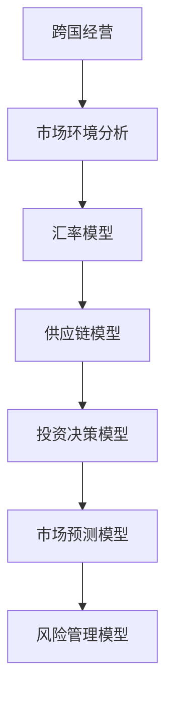

                 

# 数学与国际商务：跨国经营的数学分析

## 关键词

数学模型、国际商务、跨国公司、货币兑换、现金流、成本效益分析、供应链管理、市场风险管理、定价策略、投资决策、市场营销策略

## 摘要

本文旨在探讨数学在国际商务中的应用，特别是跨国经营的数学分析。通过阐述数学模型的基本概念和其在商务决策中的关键作用，本文进一步分析了货币兑换与汇率、折现与现金流、成本效益分析与投资决策、供应链管理与优化以及市场风险管理与金融衍生品等方面的数学分析方法和应用。文章还结合实际案例，对跨国公司的定价策略、投资策略、财务管理和供应链管理进行了详细剖析。最后，本文探讨了数学模型在国际商务中的未来发展，包括人工智能、大数据等新兴技术对数学模型的影响。本文旨在为从事国际商务的从业者提供有益的参考和指导。

## 目录

### 第一部分：数学与国际商务的基本概念

#### 1.1 国际商务概述

##### 1.1.1 国际商务的重要性
- **跨国公司的角色**
- **全球资源配置**
- **技术创新与扩散**
- **经济增长动力**

##### 1.1.2 国际商务与跨国公司
- **跨国公司的定义与类型**
- **纯跨国公司**
- **多国公司**
- **全球公司**

##### 1.1.3 国际商务的环境因素
- **政治与经济环境**
- **政治稳定性**
- **贸易政策**
- **经济环境**

#### 1.2 数学在商务分析中的应用

##### 1.2.1 数学模型的基本概念
- **数学模型的结构与功能**
- **变量**
- **函数**
- **约束条件**

##### 1.2.2 数学模型在商务决策中的作用
- **数据驱动决策**
- **风险分析**
- **优化决策**

##### 1.2.3 数学工具介绍
- **线性代数**
- **微积分**
- **概率论与数理统计**
- **运筹学**

### 第二部分：跨国经营的数学分析

#### 2.1 货币兑换与汇率分析

##### 2.1.1 汇率的定义与类型
- **固定汇率**
- **浮动汇率**
- **交叉汇率**

##### 2.1.2 货币兑换的计算方法
- **直接标价法**
- **间接标价法**
- **交叉标价法**

##### 2.1.3 汇率变动的风险与应对策略
- **汇率风险**
- **对冲策略**
- **套利策略**

#### 2.2 折现与现金流分析

##### 2.2.1 折现的概念与计算方法
- **现值**
- **贴现率**
- **未来值**

##### 2.2.2 现金流的计算与分析
- **现金流模式**
- **净现值（NPV）**
- **内部收益率（IRR）**

##### 2.2.3 折现率的选择与调整
- **市场利率**
- **风险调整**
- **公司特定因素**

#### 2.3 成本效益分析与投资决策

##### 2.3.1 成本效益分析的基本原理
- **成本**
- **效益**
- **效益成本比（BCR）**

##### 2.3.2 投资决策的数学模型
- **净现值（NPV）**
- **内部收益率（IRR）**
- **回收期（PP）**

##### 2.3.3 投资决策中的风险分析
- **概率分布**
- **期望值**
- **标准差**

#### 2.4 供应链管理与优化

##### 2.4.1 供应链管理的概念与目标
- **供应链网络**
- **库存管理**
- **物流优化**

##### 2.4.2 供应链网络的数学建模
- **网络流模型**
- **库存控制模型**
- **运输网络模型**

##### 2.4.3 供应链优化算法
- **线性规划**
- **整数规划**
- **启发式算法**

#### 2.5 市场风险管理与金融衍生品

##### 2.5.1 市场风险的定义与类型
- **汇率风险**
- **利率风险**
- **商品价格风险**

##### 2.5.2 金融衍生品的基本原理
- **期权**
- **期货**
- **互换**

##### 2.5.3 金融衍生品在跨国经营中的应用
- **对冲策略**
- **套利策略**
- **风险分散**

### 第三部分：跨国经营的数学模型与案例分析

#### 3.1 跨国公司的定价策略

##### 3.1.1 跨国公司定价的基本原理
- **成本导向定价**
- **竞争导向定价**
- **需求导向定价**

##### 3.1.2 成本导向定价策略
- **总成本**
- **单位成本**
- **成本加成定价**

##### 3.1.3 竞争导向定价策略
- **市场渗透**
- **市场领先**
- **价格领导者定价**

#### 3.2 跨国公司的投资策略

##### 3.2.1 跨国公司投资的基本策略
- **扩张策略**
- **多元化策略**
- **国际化策略**

##### 3.2.2 投资决策中的数学模型
- **净现值（NPV）**
- **内部收益率（IRR）**
- **回收期（PP）**

##### 3.2.3 投资组合优化
- **资产配置**
- **风险调整**
- **收益最大化**

#### 3.3 跨国公司的财务管理

##### 3.3.1 跨国公司的财务管理目标
- **利润最大化**
- **股东价值最大化**
- **风险控制**

##### 3.3.2 财务管理中的数学模型
- **资本成本**
- **财务杠杆**
- **股利政策**

##### 3.3.3 跨国公司财务风险管理
- **汇率风险**
- **利率风险**
- **信用风险**

#### 3.4 跨国公司的供应链管理

##### 3.4.1 跨国公司供应链管理的基本概念
- **供应链网络**
- **供应商管理**
- **库存管理**

##### 3.4.2 供应链网络优化模型
- **网络流模型**
- **库存控制模型**
- **运输网络模型**

##### 3.4.3 供应链管理案例分析
- **跨国零售企业供应链优化**
- **制造业全球供应链管理**
- **物流网络优化**

### 第四部分：数学在国际商务中的实际应用

#### 4.1 国际贸易与数学模型

##### 4.1.1 国际贸易的基本概念
- **贸易壁垒**
- **贸易顺差**
- **贸易逆差**

##### 4.1.2 国际贸易中的数学模型
- **供需模型**
- **价格弹性模型**
- **贸易平衡模型**

##### 4.1.3 国际贸易案例分析
- **中国对外贸易发展**
- **美国贸易逆差问题**
- **欧盟贸易一体化**

#### 4.2 外汇市场与数学模型

##### 4.2.1 外汇市场的基本概念
- **汇率**
- **外汇交易**
- **外汇衍生品**

##### 4.2.2 外汇交易中的数学模型
- **供需模型**
- **波动性模型**
- **风险管理模型**

##### 4.2.3 外汇市场案例分析
- **美元兑欧元汇率变动**
- **日元汇率波动**
- **外汇市场干预**

#### 4.3 跨国公司的市场营销策略

##### 4.3.1 市场营销策略的基本概念
- **市场细分**
- **目标市场选择**
- **差异化策略**

##### 4.3.2 数学模型在市场营销中的应用
- **需求预测模型**
- **价格敏感性模型**
- **市场占有率模型**

##### 4.3.3 跨国公司市场营销案例分析
- **苹果公司的全球营销策略**
- **谷歌的全球化广告投放**
- **三星的市场策略**

### 第五部分：数学在国际商务中的未来发展

#### 5.1 数学模型在国际商务中的发展趋势

##### 5.1.1 数学模型在国际商务中的应用趋势
- **大数据分析**
- **人工智能**
- **区块链技术**

##### 5.1.2 新兴技术对数学模型的影响
- **算法优化**
- **数据驱动决策**
- **智能化管理**

##### 5.1.3 数学模型在国际商务中的未来挑战
- **数据隐私**
- **算法透明度**
- **新兴市场的适应性**

#### 5.2 跨国经营的数学分析新领域

##### 5.2.1 人工智能与跨国经营
- **智能供应链管理**
- **个性化市场营销**
- **自动化投资决策**

##### 5.2.2 大数据与跨国经营
- **市场预测**
- **客户行为分析**
- **供应链优化**

##### 5.2.3 数学模型在跨国经营中的新应用领域
- **绿色供应链管理**
- **社会责任投资**
- **跨国合规与风险管理**

## 附录

### 附录 A：数学模型与跨国经营参考资料

##### A.1 国际商务经典书籍推荐
- **《国际商务：运营、策略与理论》**
- **《跨国公司管理：理论与实践》**
- **《国际贸易理论与政策》**

##### A.2 数学模型相关书籍推荐
- **《运筹学基础》**
- **《概率论与数理统计》**
- **《线性代数及其应用》**

##### A.3 跨国经营案例研究参考资料
- **《跨国公司案例研究集》**
- **《全球战略：跨国公司的实践与启示》**
- **《跨国公司财务管理案例分析》**

##### A.4 在线数学工具与软件推荐
- **Mathematica**
- **MATLAB**
- **R语言**
- **Python数据分析库（如Pandas、NumPy）**

# 第一部分：数学与国际商务的基本概念

## 1.1 国际商务概述

### 1.1.1 国际商务的重要性

国际商务在现代社会中扮演着至关重要的角色，其重要性体现在多个方面。首先，跨国公司是国际商务的主要推动力量。跨国公司通过全球资源配置，将生产、研发和市场活动分散到不同的国家和地区，从而优化资源利用，提高企业竞争力。例如，许多跨国公司在美国研发新产品，在中国或东南亚地区进行生产，然后在全球范围内销售。

其次，国际商务是技术创新与扩散的重要途径。跨国公司在全球范围内的运营，促进了技术的交流与合作。通过国际商务，新技术、新产品和新服务得以迅速推广，从而推动全球经济的发展。例如，信息技术和通信技术的跨国传播，极大地改变了全球经济的面貌。

再次，国际商务是推动经济增长的重要动力。国际商务不仅为企业提供了更广阔的市场，也为各国带来了贸易机会和经济增长。通过国际贸易，各国可以发挥比较优势，提高经济效益。例如，一些发展中国家通过出口原材料和劳动力密集型产品，获得了外汇收入和经济增长。

最后，国际商务有助于促进全球经济一体化。跨国公司在全球范围内的运营，使得各国经济更加紧密地联系在一起。这种经济一体化不仅促进了国际贸易和投资，也推动了跨国公司和地区合作。

### 1.1.2 国际商务与跨国公司

跨国公司是指在其本国以外拥有从事商业活动的子公司的国际企业。跨国公司的业务范围可以涵盖生产、销售、研发等多个领域，其经营模式通常包括跨国采购、生产、分销和销售。跨国公司按照业务模式的不同，可以分为以下几种类型：

1. **纯跨国公司**：这类公司的主要业务活动分布在多个国家，但在其母国以外没有固定的经营场所。例如，全球知名的跨国公司如谷歌、微软等。

2. **多国公司**：这类公司在其母国以外拥有多个国家的分支机构，但这些分支机构通常以当地市场为主，业务范围相对有限。例如，很多零售巨头如家乐福、沃尔玛等。

3. **全球公司**：这类公司不仅在全球范围内进行业务活动，而且具有统一的战略规划和运营模式。全球公司通过全球资源配置，实现规模效应和协同效应。例如，可口可乐、麦当劳等。

跨国公司在国际商务中的作用主要体现在以下几个方面：

1. **促进国际贸易**：跨国公司通过在其海外市场设立分支机构，推动产品和服务的跨境交易，从而促进了国际贸易的发展。

2. **推动全球化**：跨国公司的全球运营模式，使得全球市场、资源和信息的流动更加便捷，推动了全球经济的融合与发展。

3. **推动技术创新**：跨国公司在全球范围内的研发活动，促进了新技术的产生和扩散，推动了全球技术的进步。

4. **提高全球竞争力**：跨国公司通过全球资源配置和运营优化，提高了其竞争力，同时也推动了全球经济的竞争力。

### 1.1.3 国际商务的环境因素

国际商务活动不仅受到企业内部决策的影响，还受到外部环境因素的制约。这些外部环境因素可以分为政治、经济和社会文化三大类。

#### 政治与经济环境

1. **政治稳定性**：政治稳定性是国际商务的重要保障。政治动荡和不稳定的国家可能对企业的投资和运营带来风险，甚至可能导致企业资产的损失。

2. **贸易政策**：贸易政策对国际商务具有重要影响。例如，关税、配额和非关税壁垒等贸易政策都会影响企业的进出口业务。

3. **经济环境**：经济环境包括经济增长率、通货膨胀率、利率和汇率等因素。这些因素直接影响企业的经营成本、收入和盈利能力。

#### 社会文化环境

1. **文化差异**：不同国家和地区的文化差异会影响企业的经营方式和管理方法。例如，跨文化沟通和协作可能面临挑战。

2. **法律环境**：不同国家的法律体系可能存在差异，这会影响企业的合规性和风险管理。例如，一些国家的法律可能对企业环保要求较高。

3. **社会价值观**：社会价值观的不同可能影响企业的市场营销策略。例如，一些国家可能对某些产品或服务有特定的偏好或禁忌。

理解并应对这些外部环境因素，是国际商务成功的关键。企业需要通过市场调研、政策分析和风险评估等手段，全面了解并适应这些环境因素，以实现国际商务的可持续发展。

## 1.2 数学在商务分析中的应用

### 1.2.1 数学模型的基本概念

数学模型是运用数学语言描述现实世界中的某一现象或问题的工具。它通过建立变量之间的关系，用数学符号和公式来表示现实问题，从而为分析和解决问题提供定量基础。

1. **变量**：变量是数学模型中的基本元素，表示可变的数量。在商务分析中，变量可以是企业的成本、收益、市场份额等。

2. **函数**：函数是描述变量之间关系的数学表达式。在商务分析中，函数可以用来描述成本与产量、市场需求与价格等之间的关系。

3. **约束条件**：约束条件是数学模型中对变量取值范围的限制。在商务分析中，约束条件可以用来描述资源限制、法律法规要求等。

### 1.2.2 数学模型在商务决策中的作用

数学模型在商务决策中起着至关重要的作用，它可以提供数据驱动的决策支持，帮助企业管理者更好地理解业务、识别风险和机会，并做出最优决策。

1. **数据驱动决策**：通过数学模型，企业可以对大量数据进行处理和分析，识别出数据中的模式和趋势，从而为决策提供科学依据。例如，需求预测模型可以帮助企业确定生产计划，库存控制模型可以帮助企业优化库存管理。

2. **风险分析**：数学模型可以用来评估和管理企业面临的风险。例如，概率模型可以用来预测市场风险，优化策略可以用来降低风险。

3. **优化决策**：数学模型可以帮助企业找到最优解决方案。例如，线性规划模型可以用来确定资源的最优配置，供应链网络模型可以用来优化物流网络。

### 1.2.3 数学工具介绍

在国际商务中，常用的数学工具包括线性代数、微积分、概率论与数理统计、运筹学等。

1. **线性代数**：线性代数是处理线性方程组和矩阵运算的数学工具，在优化问题和供应链管理中广泛应用。

2. **微积分**：微积分是研究函数变化的数学工具，在成本分析、需求分析和优化问题中具有重要应用。

3. **概率论与数理统计**：概率论与数理统计是处理随机现象和统计数据的数学工具，在风险管理、市场预测和投资分析中具有关键作用。

4. **运筹学**：运筹学是运用数学模型解决实际问题的学科，包括线性规划、整数规划、网络流模型等，广泛应用于供应链管理、物流优化和投资决策等领域。

### 小结

数学模型是国际商务分析的重要工具，它通过定量分析提供决策支持，帮助企业更好地应对复杂的市场环境和竞争挑战。掌握并运用数学工具，有助于企业在国际商务中实现更加科学和高效的决策。

## 2.1 货币兑换与汇率分析

### 2.1.1 汇率的定义与类型

汇率是指两种货币之间的兑换比率，通常用来衡量一种货币相对于另一种货币的价值。汇率不仅影响国际贸易和投资，也对跨国公司的财务管理有重要影响。

**固定汇率**是指由政府或中央银行设定并维持的汇率，其波动幅度通常受到限制。固定汇率有助于减少汇率波动带来的不确定性，但可能导致国际收支失衡。

**浮动汇率**是指由市场供求关系决定的汇率，其波动幅度不受限制。浮动汇率有助于市场力量的调节，但可能导致较大的汇率波动。

**交叉汇率**是指两种非直接交易货币之间的汇率。例如，欧元对日元的交叉汇率是通过欧元对美元和美元对日元的汇率计算得出的。

### 2.1.2 货币兑换的计算方法

**直接标价法**是指以一定数量的外币作为标准，折算为一定数量的本币来表示汇率。例如，1美元兑换6.5人民币。

**间接标价法**是指以一定数量的本币作为标准，折算为一定数量的外币来表示汇率。例如，1人民币兑换0.15美元。

**交叉标价法**是指通过两种货币的间接标价计算交叉汇率。例如，欧元对日元的交叉汇率可以通过欧元对美元和美元对日元的汇率计算得出。

### 2.1.3 汇率变动的风险与应对策略

**汇率风险**是指由于汇率变动导致的企业财务损失。汇率风险通常源于国际贸易、海外投资和跨国借贷等活动。

**对冲策略**是指通过金融工具如远期合约、期货和期权等，锁定汇率，从而减少汇率波动带来的风险。

**套利策略**是指利用不同市场上的汇率差异，进行无风险套利，从而获取利润。

### 小结

汇率是国际商务中的重要因素，理解和运用汇率计算方法和风险管理策略，有助于跨国公司更好地应对汇率波动带来的挑战。

## 2.2 折现与现金流分析

### 2.2.1 折现的概念与计算方法

折现是指将未来的现金流量转换为当前价值的数学过程。由于资金具有时间价值，未来的现金流量需要通过折现率进行折现，才能与当前的现金流量进行比较。

**现值**（Present Value, PV）是指未来现金流通过折现率折算到现在的价值。计算公式为：

$$
PV = \frac{CF}{(1 + r)^n}
$$

其中，\( CF \) 为未来现金流量，\( r \) 为折现率，\( n \) 为时间期数。

**贴现率**（Discount Rate）是用于折现未来现金流量的利率，它反映了资金的时间价值。常用的贴现率包括市场利率、风险调整后的折现率等。

**未来值**（Future Value, FV）是指当前现金流量经过一定时间期后的价值。计算公式为：

$$
FV = PV \times (1 + r)^n
$$

### 2.2.2 现金流的计算与分析

**现金流模式**是指企业在不同时间期内的现金流量分布。常见的现金流模式包括一次性现金流、等额现金流、递增或递减现金流等。

**净现值**（Net Present Value, NPV）是指项目未来现金流量的现值总和与初始投资现值之差。计算公式为：

$$
NPV = \sum_{t=1}^{n} \frac{CF_t}{(1 + r)^t} - I
$$

其中，\( CF_t \) 为第 \( t \) 期的现金流量，\( I \) 为初始投资。

**内部收益率**（Internal Rate of Return, IRR）是指使项目净现值为零的折现率。计算公式为：

$$
0 = \sum_{t=1}^{n} \frac{CF_t}{(1 + IRR)^t} - I
$$

### 2.2.3 折现率的选择与调整

**市场利率**是基于市场供求关系确定的利率，通常用于计算折现率。市场利率受经济环境、通货膨胀率等因素的影响。

**风险调整后的折现率**是在市场利率基础上，考虑项目风险进行调整的折现率。计算公式为：

$$
r_{adjusted} = r_{market} + \beta \times (r_{market} - r_{risk-free})
$$

其中，\( r_{market} \) 为市场利率，\( \beta \) 为项目风险系数，\( r_{risk-free} \) 为无风险利率。

**公司特定因素**包括公司的资本结构、财务状况等，它们也会影响折现率的选择。

### 小结

折现与现金流分析是评估投资项目经济可行性的重要工具。通过计算净现值和内部收益率，企业可以更好地评估投资项目的价值，并做出科学的投资决策。

## 2.3 成本效益分析与投资决策

### 2.3.1 成本效益分析的基本原理

成本效益分析（Cost-Benefit Analysis, CBA）是一种评估项目或决策经济可行性的方法，通过比较项目的总成本和总效益，确定项目是否值得投资。

**成本**是指项目实施过程中所产生的全部费用，包括直接成本（如原材料、人工、设备等）和间接成本（如培训、维护、管理等）。

**效益**是指项目实施后所产生的全部收益，包括直接收益（如销售收入、节省成本等）和间接收益（如品牌价值、市场占有率等）。

**效益成本比**（Benefit-Cost Ratio, BCR）是衡量项目效益相对于成本的一个指标，计算公式为：

$$
BCR = \frac{Total Benefits}{Total Costs}
$$

BCR > 1 表示项目的效益超过成本，是值得投资的；BCR < 1 则相反。

### 2.3.2 投资决策的数学模型

**净现值**（Net Present Value, NPV）是评估投资项目经济可行性的常用指标，计算公式为：

$$
NPV = \sum_{t=1}^{n} \frac{CF_t}{(1 + r)^t} - I
$$

其中，\( CF_t \) 为第 \( t \) 期的现金流量，\( r \) 为折现率，\( I \) 为初始投资。NPV > 0 表示项目是值得投资的。

**内部收益率**（Internal Rate of Return, IRR）是使项目净现值为零的折现率，计算公式为：

$$
0 = \sum_{t=1}^{n} \frac{CF_t}{(1 + IRR)^t} - I
$$

IRR 是衡量项目盈利能力的一个重要指标。

**回收期**（Payback Period, PP）是指项目投资成本通过现金流量回收的时间，计算公式为：

$$
PP = \frac{Initial Investment}{Annual Cash Flow}
$$

PP 短表示投资回收快，是值得投资的。

### 2.3.3 投资决策中的风险分析

**概率分布**用于描述项目现金流量可能值的分布情况，常见的概率分布包括正态分布、均匀分布等。

**期望值**（Expected Value, EV）是项目现金流量概率分布的加权平均值，计算公式为：

$$
EV = \sum_{i} p_i \times CF_i
$$

其中，\( p_i \) 为第 \( i \) 个现金流量的概率，\( CF_i \) 为第 \( i \) 个现金流量的值。

**标准差**（Standard Deviation, SD）是衡量项目现金流量波动性的指标，计算公式为：

$$
SD = \sqrt{\sum_{i} (CF_i - EV)^2 \times p_i}
$$

通过概率分布、期望值和标准差，可以评估项目的风险和不确定性。

### 小结

成本效益分析与投资决策是评估项目经济可行性的关键步骤。通过数学模型和风险分析，企业可以更科学地评估投资项目，做出最优决策。

## 2.4 供应链管理与优化

### 2.4.1 供应链管理的概念与目标

供应链管理（Supply Chain Management, SCM）是指对供应链活动进行计划、组织、协调和控制的过程，旨在实现从原材料采购到最终产品交付的整个过程的效率最大化。供应链管理涉及多个环节，包括供应商管理、库存管理、物流运输、生产计划等。

供应链管理的目标主要包括：

1. **成本最小化**：通过优化供应链各个环节，降低库存成本、运输成本、生产成本等。

2. **服务最大化**：确保供应链的高效运作，提高客户满意度，包括及时交付、高质量产品和良好的售后服务。

3. **风险最小化**：通过有效的供应链管理，减少供应链中断、供应链延迟等风险。

### 2.4.2 供应链网络的数学建模

供应链网络是指供应链中各个实体及其之间的物流、信息流和资金流的集合。供应链网络的数学建模主要涉及以下几个方面：

1. **网络流模型**：用于描述供应链中物料、信息和资金在节点之间的流动。常见的网络流模型包括最大流模型、最小费用最大流模型等。

2. **库存控制模型**：用于优化库存水平，确保供应与需求之间的平衡。常见的库存控制模型包括经济订货量模型（EOQ）、周期库存模型等。

3. **运输网络模型**：用于优化物流运输路线和运输量。常见的运输网络模型包括线性规划模型、网络流模型等。

### 2.4.3 供应链优化算法

供应链优化算法是用于解决供应链管理中各种优化问题的方法。以下是一些常见的供应链优化算法：

1. **线性规划**：用于求解在满足各种约束条件下，目标函数最大或最小的问题。线性规划可以应用于供应链中的库存优化、运输优化等问题。

2. **整数规划**：用于求解目标函数在整数解下的优化问题。整数规划常用于供应链中的选址问题、生产计划等问题。

3. **启发式算法**：用于在合理时间内找到近似最优解的算法。常见的启发式算法包括遗传算法、模拟退火算法、蚁群算法等。

4. **多目标优化**：用于求解具有多个目标函数的优化问题。多目标优化可以应用于供应链中的成本最小化、服务最大化等问题。

### 小结

供应链管理与优化是确保供应链高效运作的重要手段。通过数学建模和优化算法，企业可以更好地协调供应链各个环节，实现成本最小化、服务最大化、风险最小化。

## 2.5 市场风险管理与金融衍生品

### 2.5.1 市场风险的定义与类型

市场风险是指由于市场条件的变化导致企业财务损失的风险。市场风险可以分为以下几种类型：

1. **汇率风险**：由于汇率波动导致的企业财务损失。汇率风险主要源于企业的国际贸易和海外投资活动。

2. **利率风险**：由于利率变动导致的企业财务损失。利率风险主要源于企业的借款和投资活动。

3. **商品价格风险**：由于商品价格波动导致的企业财务损失。商品价格风险主要源于企业的原材料采购和产品销售。

4. **股票市场风险**：由于股票市场波动导致的企业财务损失。股票市场风险主要源于企业的股票投资和股票发行活动。

### 2.5.2 金融衍生品的基本原理

金融衍生品是一种基于其他资产（如股票、债券、货币等）价格的金融合约。金融衍生品的基本原理包括：

1. **期权**：期权是一种给予持有者在特定时间内以特定价格买入或卖出资产的权利。期权分为看涨期权和看跌期权。

2. **期货**：期货是一种在未来特定时间以约定价格买入或卖出资产的合约。期货分为商品期货和金融期货。

3. **互换**：互换是一种双方在约定时间内交换现金流量的合约。常见的互换包括利率互换和货币互换。

### 2.5.3 金融衍生品在跨国经营中的应用

金融衍生品在跨国经营中具有重要的风险管理作用。以下是一些金融衍生品在跨国经营中的应用：

1. **对冲策略**：通过金融衍生品进行对冲，可以降低汇率风险、利率风险和商品价格风险。例如，通过外汇期货进行汇率风险对冲，通过利率互换进行利率风险对冲。

2. **套利策略**：通过利用不同市场的价格差异进行套利，获取无风险收益。例如，通过外汇市场上的货币对冲进行套利。

3. **风险分散**：通过投资多种金融衍生品，可以降低单一市场的风险。例如，通过投资多种货币期权和利率互换，实现风险分散。

### 小结

市场风险管理和金融衍生品是跨国经营中重要的风险管理工具。通过合理运用金融衍生品，企业可以降低市场风险，实现财务稳定。

## 3.1 跨国公司的定价策略

### 3.1.1 跨国公司定价的基本原理

跨国公司的定价策略是指企业在不同国家和地区的市场制定产品或服务的价格。定价策略的基本原理包括成本导向定价、竞争导向定价和需求导向定价。

1. **成本导向定价**：成本导向定价以企业的成本为基础，加上一定的利润，来确定产品或服务的价格。这种定价策略的优点是简单易行，有利于企业控制成本和保证利润。缺点是忽视了市场需求和竞争状况，可能导致定价过高或过低。

2. **竞争导向定价**：竞争导向定价以市场上主要竞争对手的价格为基础，结合自身的成本和市场需求，来确定产品或服务的价格。这种定价策略的优点是能够更好地适应市场需求和竞争状况，提高市场竞争力。缺点是容易受到竞争对手价格策略的影响，可能导致利润降低。

3. **需求导向定价**：需求导向定价以市场需求为基础，根据消费者对产品或服务的需求强度和支付意愿，来确定产品或服务的价格。这种定价策略的优点是能够更好地满足消费者的需求，提高消费者满意度。缺点是难以准确预测市场需求和消费者支付意愿，可能导致定价不准确。

### 3.1.2 成本导向定价策略

成本导向定价策略是跨国公司常用的定价策略之一。成本导向定价的主要步骤包括：

1. **确定成本结构**：跨国公司需要明确其生产成本、运营成本和销售成本等，以便为产品或服务的定价提供基础。

2. **计算总成本**：跨国公司需要根据生产规模、运营效率和销售规模等因素，计算出总成本。

3. **计算单位成本**：跨国公司需要将总成本分摊到每个产品或服务单位，以确定单位成本。

4. **确定利润率**：跨国公司需要在单位成本的基础上，加上一定的利润率，以确定产品或服务的最终价格。

5. **考虑市场竞争**：跨国公司需要考虑竞争对手的价格策略和市场状况，以避免定价过高或过低。

### 3.1.3 竞争导向定价策略

竞争导向定价策略是基于市场竞争状况来确定产品或服务的价格。竞争导向定价的主要步骤包括：

1. **分析市场竞争状况**：跨国公司需要分析市场上主要竞争对手的产品或服务价格，了解竞争对手的市场策略。

2. **确定市场领导者**：跨国公司需要确定市场领导者，以其价格为基准。

3. **确定价格差距**：跨国公司需要根据自身成本和市场领导者价格，确定与市场领导者的价格差距。

4. **调整价格**：跨国公司根据市场领导者价格和自身成本，调整产品或服务的价格，以适应市场需求和竞争状况。

5. **跟踪市场变化**：跨国公司需要持续跟踪市场变化，根据市场需求和竞争状况，及时调整价格策略。

### 小结

跨国公司的定价策略包括成本导向定价、竞争导向定价和需求导向定价。通过合理运用这些定价策略，跨国公司可以更好地适应市场需求和竞争环境，实现盈利目标。

## 3.2 跨国公司的投资策略

### 3.2.1 跨国公司投资的基本策略

跨国公司的投资策略是指企业在全球范围内进行投资以实现战略目标和盈利目标的方法。以下是几种常见的跨国公司投资策略：

1. **扩张策略**：扩张策略是指跨国公司通过在新的市场和地区建立生产基地、销售网络和研发中心，以扩大市场份额和提高竞争力。扩张策略的优点是可以快速进入新市场，提高品牌知名度；缺点是投资风险较大，需要较强的资金和管理能力。

2. **多元化策略**：多元化策略是指跨国公司通过投资不同的行业和领域，以降低业务风险和提高盈利能力。多元化策略的优点是可以分散风险，提高企业的稳定性和抗风险能力；缺点是管理复杂度增加，需要较强的资源和人才支持。

3. **国际化策略**：国际化策略是指跨国公司通过在海外市场设立分支机构，实现产品的国际化销售和品牌全球化。国际化策略的优点是可以利用全球资源和市场，提高企业的国际竞争力和市场份额；缺点是需要面对不同国家和地区的法律法规、文化差异等挑战。

### 3.2.2 投资决策中的数学模型

投资决策中的数学模型是跨国公司在进行投资决策时的重要工具。以下是一些常用的数学模型：

1. **净现值（NPV）**：净现值是指项目未来现金流入量的现值总和与初始投资现值之差。如果NPV大于零，表示项目能够创造额外的价值，是值得投资的；如果NPV小于零，表示项目会减少企业的价值，应避免投资。

2. **内部收益率（IRR）**：内部收益率是指使得项目净现值为零的折现率。如果IRR大于资本成本，表示项目的投资回报率高于资本成本，是值得投资的；如果IRR低于资本成本，表示项目的投资回报率低于资本成本，应避免投资。

3. **回收期（PP）**：回收期是指企业收回初始投资所需的时间。如果回收期短，表示企业的投资回收快，是值得投资的；如果回收期长，表示企业的投资回收慢，应谨慎投资。

### 3.2.3 投资组合优化

投资组合优化是指通过调整不同投资项目的投资比例，以实现投资组合的整体风险和收益的最优化。以下是一些投资组合优化的方法：

1. **资产配置**：资产配置是指根据投资者的风险偏好和投资目标，将投资资金分配到不同的资产类别（如股票、债券、现金等）。资产配置的目标是平衡投资组合的风险和收益。

2. **风险调整**：风险调整是指通过调整不同投资项目的风险权重，以实现投资组合的整体风险最优化。常用的风险调整方法包括标准差、贝塔系数等。

3. **收益最大化**：收益最大化是指通过调整不同投资项目的投资比例，以实现投资组合的最大化收益。常用的收益最大化方法包括均值方差模型、资本资产定价模型等。

### 小结

跨国公司的投资策略包括扩张策略、多元化策略和国际化策略。投资决策中的数学模型和投资组合优化方法是跨国公司进行投资决策的重要工具，有助于实现投资组合的风险和收益最优化。

## 3.3 跨国公司的财务管理

### 3.3.1 跨国公司的财务管理目标

跨国公司的财务管理目标是在确保财务稳健性的基础上，实现企业价值的最大化。具体目标包括：

1. **利润最大化**：通过优化资源配置和成本控制，提高企业的盈利能力。

2. **股东价值最大化**：通过合理的投资决策和融资策略，提高企业的市场价值，为股东创造更多财富。

3. **风险控制**：通过有效的风险管理和对冲策略，降低企业的财务风险，确保企业的长期稳定发展。

### 3.3.2 财务管理中的数学模型

财务管理中的数学模型是跨国公司进行财务分析和决策的重要工具。以下是一些常用的数学模型：

1. **资本成本**：资本成本是指企业为筹集和使用资本所支付的成本，包括债务成本和股权成本。资本成本的计算方法包括加权平均资本成本（WACC）和边际资本成本（MCC）。

2. **财务杠杆**：财务杠杆是指企业通过借债来增加资本结构，从而放大盈利能力。财务杠杆的计算方法包括债务股权比和财务杠杆系数。

3. **股利政策**：股利政策是指企业向股东分配利润的策略。常见的股利政策包括固定股利支付率政策、固定股利总额政策和低正常股利加额外股利政策。

### 3.3.3 跨国公司财务风险管理

跨国公司财务风险管理是指通过识别、评估和控制财务风险，确保企业财务稳定和可持续发展。以下是一些常见的财务风险管理方法：

1. **汇率风险**：汇率风险是指由于汇率波动导致的企业财务损失。汇率风险的管理方法包括对冲策略（如远期合约、期权）、多元化策略和风险管理工具（如外汇期货、外汇期权）。

2. **利率风险**：利率风险是指由于利率变动导致的企业财务损失。利率风险的管理方法包括对冲策略（如利率期货、利率互换）、固定利率和浮动利率债务组合以及利率风险敞口管理。

3. **信用风险**：信用风险是指由于客户或合作伙伴违约导致的企业财务损失。信用风险的管理方法包括信用评估、信用保险、信用限额设置和应收账款管理。

### 小结

跨国公司的财务管理目标是实现企业价值的最大化。财务管理中的数学模型和财务风险管理方法有助于跨国公司有效管理财务风险，确保财务稳健性和可持续发展。

## 3.4 跨国公司的供应链管理

### 3.4.1 跨国公司供应链管理的基本概念

跨国公司的供应链管理是指在全球范围内对供应链活动进行规划、协调和控制，以确保供应链的高效运作和成本效益。跨国公司供应链管理的基本概念包括供应链网络、供应链节点、供应链流程和供应链策略。

1. **供应链网络**：供应链网络是指跨国公司在全球范围内建立的供应链节点及其之间的物流、信息流和资金流的集合。供应链网络的设计和管理是跨国公司供应链管理的关键。

2. **供应链节点**：供应链节点是指供应链中的各个实体，包括供应商、制造商、分销商、零售商和最终客户等。供应链节点的选择和协调是跨国公司供应链管理的重要内容。

3. **供应链流程**：供应链流程是指供应链中的各个活动和流程，包括采购、生产、库存管理、物流运输、订单处理和客户服务等。供应链流程的优化和协调是提高供应链效率的重要手段。

4. **供应链策略**：供应链策略是指跨国公司制定的供应链管理目标和计划，包括供应链战略定位、供应链风险管理、供应链成本控制和供应链协同等。

### 3.4.2 供应链网络优化模型

供应链网络优化模型是指用于分析和设计跨国公司供应链网络的数学模型。以下是一些常见的供应链网络优化模型：

1. **网络流模型**：网络流模型用于描述供应链网络中物流和信息流的流动情况，包括最大流模型、最小费用最大流模型等。网络流模型有助于优化物流运输路线和物流成本。

2. **库存控制模型**：库存控制模型用于优化供应链中的库存水平，包括经济订货量模型（EOQ）、周期库存模型（CIPS）等。库存控制模型有助于降低库存成本和提高库存周转率。

3. **选址模型**：选址模型用于确定供应链网络中的供应商、工厂、仓库等节点的位置，包括线性规划模型、整数规划模型等。选址模型有助于优化供应链网络布局和降低物流成本。

4. **运输网络模型**：运输网络模型用于优化供应链中的运输路线和运输方式，包括线性规划模型、网络流模型等。运输网络模型有助于降低运输成本和提高运输效率。

### 3.4.3 供应链管理案例分析

以下是跨国公司供应链管理的几个案例分析：

1. **跨国零售企业的全球供应链管理**：以沃尔玛为例，沃尔玛通过全球采购、区域生产和全球分销的供应链管理模式，实现了供应链的高效运作和成本优化。沃尔玛的供应链管理经验包括：全球采购策略、精益生产、物流网络优化和信息技术支持。

2. **制造业的全球供应链管理**：以苹果公司为例，苹果公司通过全球供应链管理，实现了iPhone等产品的快速生产、交付和销售。苹果的供应链管理模式包括：全球供应商网络、精益生产、库存管理和供应链协同。

3. **物流公司的供应链管理**：以联邦快递为例，联邦快递通过全球物流网络和信息技术，实现了快速、可靠和高效的物流服务。联邦快递的供应链管理经验包括：全球物流网络优化、物流信息技术、供应链协同和客户服务。

### 小结

跨国公司的供应链管理是确保供应链高效运作和成本效益的重要手段。供应链网络优化模型和案例分析为跨国公司提供了有效的供应链管理策略和方法。

## 4.1 国际贸易与数学模型

### 4.1.1 国际贸易的基本概念

国际贸易是指不同国家或地区之间的商品、服务和支付的国际转移。国际贸易的基本概念包括：

1. **贸易壁垒**：贸易壁垒是指国家为了保护本国产业或限制外国产品进入本国市场而采取的各种措施，包括关税、配额、非关税壁垒等。

2. **贸易顺差**：贸易顺差是指一个国家或地区的出口总额大于进口总额的情况。贸易顺差表示该国或地区在国际贸易中处于有利地位。

3. **贸易逆差**：贸易逆差是指一个国家或地区的进口总额大于出口总额的情况。贸易逆差表示该国或地区在国际贸易中处于不利地位。

### 4.1.2 国际贸易中的数学模型

国际贸易中的数学模型主要用于分析贸易的供需关系、价格弹性以及贸易平衡等。以下是一些常用的数学模型：

1. **供需模型**：供需模型用于描述商品或服务的市场需求和供给之间的关系。供需模型的基本公式为：

   $$
   Q_D = f(P_D) + e
   $$
   $$
   Q_S = f(P_S) + e
   $$

   其中，\( Q_D \) 表示需求量，\( Q_S \) 表示供给量，\( P_D \) 表示需求价格，\( P_S \) 表示供给价格，\( e \) 表示其他影响因素。

2. **价格弹性模型**：价格弹性模型用于分析价格变动对需求量和供给量的影响。价格弹性包括需求价格弹性和供给价格弹性，计算公式分别为：

   $$
   Ed = \frac{\partial Q_D}{\partial P_D} \times \frac{P_D}{Q_D}
   $$
   $$
   Es = \frac{\partial Q_S}{\partial P_S} \times \frac{P_S}{Q_S}
   $$

   其中，\( Ed \) 表示需求价格弹性，\( Es \) 表示供给价格弹性。

3. **贸易平衡模型**：贸易平衡模型用于描述一个国家或地区的出口总额与进口总额相等的情况。贸易平衡的基本公式为：

   $$
   X = M
   $$

   其中，\( X \) 表示出口总额，\( M \) 表示进口总额。

### 4.1.3 国际贸易案例分析

以下是几个国际贸易的案例分析：

1. **中国对外贸易发展**：中国自改革开放以来，对外贸易规模不断扩大。通过供需模型分析，可以发现中国对外贸易的增长主要得益于出口产品的价格竞争力增强和进口产品需求的增长。同时，通过价格弹性模型分析，可以发现中国对外贸易对价格变动的敏感性较高。

2. **美国贸易逆差问题**：美国长期以来存在贸易逆差问题，主要原因包括进口需求旺盛、出口竞争力下降等。通过供需模型和价格弹性模型的分析，可以发现美国的贸易逆差在一定程度上受到其消费需求和政策影响。

3. **欧盟贸易一体化**：欧盟通过贸易一体化政策，实现了成员国之间的自由贸易和资源优化配置。通过供需模型和贸易平衡模型的分析，可以发现欧盟贸易一体化的优势在于提高了整体贸易效率和市场竞争力。

### 小结

国际贸易与数学模型密切相关，通过供需模型、价格弹性模型和贸易平衡模型等数学模型，可以更好地分析和理解国际贸易的运行机制和影响因素。案例分析有助于进一步深化对国际贸易的理解和应用。

## 4.2 外汇市场与数学模型

### 4.2.1 外汇市场的基本概念

外汇市场是全球金融市场的重要组成部分，它涉及货币的买卖交易，影响全球经济的稳定和发展。外汇市场的基本概念包括：

1. **汇率**：汇率是两种货币之间的兑换比率，通常用一种货币表示另一种货币的价值。汇率分为直接汇率和间接汇率。

2. **外汇交易**：外汇交易是指在外汇市场上买卖货币的行为。外汇交易分为即期交易和远期交易。

3. **外汇衍生品**：外汇衍生品是一种基于外汇市场的金融工具，包括外汇期货、外汇期权、外汇互换等。

### 4.2.2 外汇交易中的数学模型

外汇交易中的数学模型用于分析外汇市场的价格波动、交易策略和风险管理。以下是一些常用的数学模型：

1. **供需模型**：供需模型用于描述外汇市场的供需关系。供需模型的基本公式为：

   $$
   Q_D = f(P_D) + e
   $$
   $$
   Q_S = f(P_S) + e
   $$

   其中，\( Q_D \) 表示需求量，\( Q_S \) 表示供给量，\( P_D \) 表示需求价格，\( P_S \) 表示供给价格，\( e \) 表示其他影响因素。

2. **波动性模型**：波动性模型用于分析外汇市场的价格波动情况。常见的波动性模型包括GARCH模型、ARIMA模型等。

3. **风险管理模型**：风险管理模型用于评估和降低外汇交易中的风险。常见的管理模型包括对冲策略、风险敞口模型等。

### 4.2.3 外汇市场案例分析

以下是几个外汇市场的案例分析：

1. **美元兑欧元汇率变动**：自2008年金融危机以来，美元兑欧元汇率经历了较大的波动。通过供需模型和波动性模型的分析，可以发现影响美元兑欧元汇率的主要因素包括美国经济状况、欧洲经济状况、货币政策差异等。

2. **日元汇率波动**：日元汇率在全球经济形势、日本国内经济政策和国际投资流动等因素的影响下波动较大。通过供需模型和波动性模型的分析，可以发现日元汇率波动的主要影响因素包括国际资本流动、通货膨胀率、货币政策等。

3. **外汇市场干预**：一些国家或地区通过外汇市场干预来稳定汇率。例如，日本政府在2013年通过购买美元来干预外汇市场，导致日元贬值。通过供需模型和干预策略的分析，可以发现外汇市场干预对汇率的影响和有效性。

### 小结

外汇市场与数学模型密切相关，通过供需模型、波动性模型和风险管理模型等数学模型，可以更好地分析和理解外汇市场的运行机制和影响因素。案例分析有助于进一步深化对外汇市场的理解和应用。

## 4.3 跨国公司的市场营销策略

### 4.3.1 市场营销策略的基本概念

市场营销策略是指企业为满足市场需求，实现销售目标而制定的一系列市场运作方案。跨国公司的市场营销策略包括以下几个方面：

1. **市场细分**：市场细分是指根据消费者的不同需求和特征，将市场划分为若干个具有相似需求和特征的子市场。市场细分有助于企业更精准地满足不同消费者的需求。

2. **目标市场选择**：目标市场选择是指企业在市场细分的基础上，选择最适合自身资源和能力的市场进行集中营销。目标市场选择包括集中市场营销、差异市场营销和无差异市场营销。

3. **差异化策略**：差异化策略是指企业通过提供独特的产品、服务或品牌形象，在市场中建立竞争优势。差异化策略可以增加产品的附加值，提高消费者忠诚度。

### 4.3.2 数学模型在市场营销中的应用

数学模型在市场营销策略中具有重要作用，可以用于需求预测、价格弹性分析和市场占有率预测等方面。

1. **需求预测模型**：需求预测模型用于预测市场对某种产品或服务的需求量。常见的需求预测模型包括时间序列模型、回归模型和神经网络模型。

2. **价格弹性模型**：价格弹性模型用于分析价格变动对市场需求的影响。价格弹性包括需求价格弹性和供给价格弹性，可以用于定价策略的制定。

3. **市场占有率模型**：市场占有率模型用于预测企业在市场中的占有率。市场占有率模型可以基于市场份额、消费者偏好和市场变化等因素进行分析。

### 4.3.3 跨国公司市场营销案例分析

以下是几个跨国公司市场营销策略的案例分析：

1. **苹果公司的全球营销策略**：苹果公司通过市场细分、目标市场选择和差异化策略，成功在全球市场上建立了强大的品牌影响力。苹果公司的成功经验包括：精准的市场定位、创新的产品设计和强大的品牌推广。

2. **谷歌的全球化广告投放**：谷歌通过大数据分析和精准广告投放，成功实现了全球营销。谷歌的全球化广告投放策略包括：基于用户行为的数据分析、个性化广告推送和全球广告网络的建立。

3. **三星的市场策略**：三星公司通过市场细分、目标市场选择和差异化策略，在全球市场上取得了显著的成功。三星的市场策略包括：产品线的多元化、技术创新和品牌推广。

### 小结

跨国公司的市场营销策略通过市场细分、目标市场选择和差异化策略，结合数学模型在需求预测、价格弹性分析和市场占有率预测等方面的应用，有助于企业实现全球市场的成功。

## 5.1 数学模型在国际商务中的发展趋势

### 5.1.1 数学模型在国际商务中的应用趋势

随着全球化和信息技术的快速发展，数学模型在国际商务中的应用趋势呈现出以下几个特点：

1. **大数据分析**：大数据技术的兴起为国际商务提供了丰富的数据资源。通过大数据分析，企业可以更精准地了解市场需求、消费者行为和竞争对手动态，从而制定更加科学的决策。

2. **人工智能**：人工智能（AI）技术的快速发展为国际商务带来了新的机遇。AI技术可以用于需求预测、风险管理和优化决策等方面，提高企业的运营效率和竞争力。

3. **区块链技术**：区块链技术具有去中心化、透明和不可篡改等特点，在国际商务中的应用潜力巨大。区块链技术可以用于供应链管理、跨境支付和合同执行等方面，提高交易的安全性和效率。

### 5.1.2 新兴技术对数学模型的影响

新兴技术的快速发展对数学模型在国际商务中的应用产生了深远影响：

1. **算法优化**：随着计算能力的提升，复杂的数学模型可以更快速地求解，从而优化企业的运营决策。

2. **数据驱动决策**：大数据和人工智能技术使得企业可以基于海量数据进行实时分析和预测，提高决策的科学性和准确性。

3. **智能化管理**：人工智能和机器学习技术的发展，使得企业可以实现智能化管理，提高运营效率和客户满意度。

### 5.1.3 数学模型在国际商务中的未来挑战

尽管数学模型在国际商务中具有广泛应用前景，但未来仍将面临以下挑战：

1. **数据隐私**：随着数据收集和分析的增多，数据隐私保护成为重要议题。企业需要采取有效的数据保护措施，确保用户隐私。

2. **算法透明度**：人工智能和机器学习模型的黑箱特性使得算法决策过程不够透明。提高算法透明度，增强用户信任是未来的重要任务。

3. **新兴市场的适应性**：新兴市场的经济、文化和法律环境各异，企业需要开发适用于不同市场的数学模型，以提高市场适应性。

### 小结

数学模型在国际商务中的应用趋势体现在大数据分析、人工智能和区块链技术等方面。新兴技术对数学模型的影响包括算法优化、数据驱动决策和智能化管理。未来，数学模型在国际商务中面临的挑战包括数据隐私、算法透明度和新兴市场的适应性。

## 5.2 跨国经营的数学分析新领域

### 5.2.1 人工智能与跨国经营

人工智能（AI）技术的快速发展为跨国经营带来了新的机遇和挑战。AI在跨国经营中的应用主要体现在以下几个方面：

1. **智能供应链管理**：AI技术可以用于供应链管理中的需求预测、库存优化和物流优化。通过大数据分析和机器学习算法，企业可以实现更精确的需求预测和库存控制，降低库存成本和提高供应链效率。

2. **个性化市场营销**：AI技术可以根据消费者的行为数据，进行个性化推荐和精准营销。通过自然语言处理和机器学习算法，企业可以更好地理解消费者需求，提高客户满意度和忠诚度。

3. **自动化投资决策**：AI技术可以帮助企业实现自动化投资决策，通过大数据分析和机器学习算法，优化投资组合，降低投资风险。

### 5.2.2 大数据与跨国经营

大数据技术在跨国经营中的应用，使得企业能够更全面地了解市场环境和消费者行为。大数据在跨国经营中的应用主要体现在以下几个方面：

1. **市场预测**：大数据技术可以用于市场趋势分析和未来预测，帮助企业制定更加科学的市场策略。通过大数据分析和机器学习算法，企业可以预测市场需求变化，优化生产计划和库存管理。

2. **客户行为分析**：大数据技术可以分析消费者的购买行为和偏好，帮助企业更好地了解目标市场，提高市场营销效果。通过数据挖掘和机器学习算法，企业可以识别出潜在客户和忠诚客户，制定个性化的营销策略。

3. **供应链优化**：大数据技术可以用于供应链优化，通过分析供应链中的各种数据，优化供应链的各个环节，降低成本和提高效率。例如，通过大数据分析，企业可以优化物流路线和库存水平，提高供应链的响应速度。

### 5.2.3 数学模型在跨国经营中的新应用领域

随着新兴技术的不断发展，数学模型在跨国经营中的应用领域也在不断拓展。以下是一些新的应用领域：

1. **绿色供应链管理**：绿色供应链管理旨在通过优化供应链的各个环节，降低能源消耗和环境污染。数学模型可以用于绿色供应链网络设计、碳排放最小化和环保成本控制。

2. **社会责任投资**：社会责任投资（SRI）是指企业将社会责任纳入投资决策，选择对社会和环境有积极影响的企业进行投资。数学模型可以用于评估企业的社会责任表现，优化投资组合。

3. **跨国合规与风险管理**：跨国经营面临各种法律和监管挑战，数学模型可以用于合规风险评估和管理。通过大数据分析和机器学习算法，企业可以识别潜在的合规风险，制定有效的风险管理策略。

### 小结

人工智能、大数据和新兴技术为跨国经营带来了新的机遇。AI技术、大数据分析和新的数学模型在跨国经营中的应用，有助于企业实现更高效、更精准和更可持续的经营。未来，跨国公司需要不断探索和利用这些新技术，以应对全球市场的变化和挑战。

## 附录 A：数学模型与跨国经营参考资料

### A.1 国际商务经典书籍推荐

1. **《国际商务：运营、策略与理论》**（International Business: Operations, Strategy, and Theory），作者：Peter J. H. Drucker。
   - 本书系统地介绍了国际商务的基本概念、运营策略和理论，有助于读者深入了解国际商务的各个方面。

2. **《跨国公司管理：理论与实践》**（Global Corporate Governance: Theory and Practice），作者：Donald F. Kuratko。
   - 本书从理论和实践两个角度，探讨了跨国公司的管理问题，包括公司治理、战略管理和国际化经营等。

3. **《国际贸易理论与政策》**（International Trade Theory and Policy），作者：Rudiger Dornbusch。
   - 本书详细阐述了国际贸易的基本理论和政策，对国际商务中的贸易政策和经济学原理进行了深入分析。

### A.2 数学模型相关书籍推荐

1. **《运筹学基础》**（Introduction to Operations Research），作者：Hirofumi Mizuno。
   - 本书介绍了运筹学的基本概念、方法和应用，包括线性规划、整数规划、网络流模型等，对跨国经营中的优化问题有重要参考价值。

2. **《概率论与数理统计》**（Probability and Mathematical Statistics），作者：Howard M. Taylor。
   - 本书系统地介绍了概率论和数理统计的基本概念、方法和应用，对跨国经营中的风险分析和决策支持具有重要意义。

3. **《线性代数及其应用》**（Linear Algebra and Its Applications），作者：Howard Anton。
   - 本书深入浅出地介绍了线性代数的基本理论、方法和应用，对跨国经营中的供应链管理和库存控制等问题有重要参考价值。

### A.3 跨国经营案例研究参考资料

1. **《跨国公司案例研究集》**（Cases on International Business and Management），作者：David L. Paulson。
   - 本书汇集了多个跨国公司的实际案例，包括公司的战略、运营、财务和市场分析等，有助于读者深入了解跨国公司的运营和管理。

2. **《全球战略：跨国公司的实践与启示》**（Global Strategy: How Global Companies Succeed），作者：Jack F. Matlock。
   - 本书通过对多个跨国公司的成功案例进行分析，探讨了全球战略的制定和实施，为跨国经营提供了宝贵的经验和启示。

3. **《跨国公司财务管理案例分析》**（Cases in International Financial Management），作者：J. Fred Weston。
   - 本书结合具体案例，分析了跨国公司的财务管理问题，包括外汇风险管理、资本预算和投资决策等，对跨国公司的财务管理有重要参考价值。

### A.4 在线数学工具与软件推荐

1. **Mathematica**：Mathematica 是一款强大的数学软件，可用于数学建模、数据分析和可视化。它支持多种编程语言和工具，适用于科研、工程和商业等领域。

2. **MATLAB**：MATLAB 是一款广泛应用于工程和科学计算的高性能计算环境。它提供了丰富的数学函数库和工具箱，适用于数据分析和可视化。

3. **R语言**：R语言是一种统计计算和图形展示的语言，广泛应用于数据分析、统计建模和机器学习等领域。

4. **Python数据分析库（如Pandas、NumPy）**：Python是一种灵活的编程语言，其数据分析库（如Pandas、NumPy）提供了强大的数据处理和分析功能，适用于各种数据分析任务。

### 小结

附录部分提供了国际商务、数学模型和跨国经营案例研究的经典书籍推荐，以及在线数学工具和软件推荐。这些资源有助于读者进一步深入了解相关领域的理论和实践，提升跨国经营的能力。

# 数学模型与跨国经营：背景与联系

在跨国经营中，数学模型的应用对于企业制定科学决策、优化运营流程和降低风险具有重要意义。为了更好地理解数学模型在跨国经营中的作用，我们需要从背景和联系两个方面进行探讨。

### 背景介绍

跨国经营涉及多个国家和地区，企业需要应对复杂的市场环境、政策法规和竞争压力。在国际商务中，企业面临的挑战包括汇率波动、供应链管理、投资决策、市场预测和风险管理等方面。这些挑战需要企业具备丰富的数据分析和决策能力。

1. **汇率波动**：汇率波动对跨国公司的财务状况和市场竞争力有重要影响。企业需要准确预测汇率走势，制定有效的汇率风险管理策略。

2. **供应链管理**：跨国公司的供应链通常涉及多个国家，包括原材料采购、生产加工、物流配送等环节。供应链管理的复杂性要求企业具备高效的数据处理和优化能力。

3. **投资决策**：跨国公司在进行投资决策时，需要考虑多种因素，如市场潜力、政策环境、财务状况和风险等。数学模型可以帮助企业评估投资项目的经济效益和风险，做出最优决策。

4. **市场预测**：跨国公司需要准确预测市场需求，制定相应的市场营销策略。市场预测的准确性对于企业的业绩和竞争力至关重要。

5. **风险管理**：跨国经营面临多种风险，如汇率风险、利率风险、信用风险等。企业需要通过数学模型进行风险评估和管理，降低潜在风险。

### 核心概念与联系

在跨国经营中，以下核心概念通过数学模型紧密联系在一起：

1. **汇率模型**：汇率模型用于分析汇率变动对跨国公司财务的影响。常见的汇率模型包括汇率波动模型、汇率风险管理模型等。这些模型通过数学公式和算法，帮助企业预测汇率走势，制定汇率风险管理策略。

2. **供应链模型**：供应链模型用于优化供应链管理，包括库存控制模型、物流网络模型等。这些模型通过数据分析和优化算法，帮助企业降低成本、提高效率。

3. **投资决策模型**：投资决策模型用于评估投资项目的经济效益和风险。常见的投资决策模型包括净现值（NPV）模型、内部收益率（IRR）模型等。这些模型通过数据分析和优化算法，帮助企业做出最优投资决策。

4. **市场预测模型**：市场预测模型用于预测市场需求，包括时间序列模型、回归模型等。这些模型通过数据分析和预测算法，帮助企业制定科学的市场营销策略。

5. **风险管理模型**：风险管理模型用于评估和管理跨国经营中的各种风险。常见的风险管理模型包括概率模型、风险中性模型等。这些模型通过数据分析和优化算法，帮助企业识别风险、制定风险管理策略。

### Mermaid 流程图

以下是跨国经营中几个核心概念与数学模型的联系，用Mermaid流程图表示：

### 小结

数学模型在跨国经营中具有重要作用，通过汇率模型、供应链模型、投资决策模型、市场预测模型和风险管理模型等，帮助企业应对复杂的市场环境，实现科学决策和风险控制。理解这些核心概念与数学模型之间的联系，有助于企业更好地应用数学模型，提高跨国经营的效率和竞争力。

## 3.1 跨国公司的定价策略

### 3.1.1 跨国公司定价的基本原理

跨国公司在制定定价策略时，需要考虑多个因素，包括成本、竞争和市场。定价策略的基本原理可以分为成本导向定价、竞争导向定价和需求导向定价三种。

1. **成本导向定价**：成本导向定价是以企业的成本为基础，加上一定的利润，来确定产品或服务的价格。这种方法简单易行，有助于企业控制成本和保证利润。然而，成本导向定价忽视了市场需求和竞争状况，可能导致定价过高或过低。

2. **竞争导向定价**：竞争导向定价是以市场上主要竞争对手的价格为基础，结合自身的成本和市场需求，来确定产品或服务的价格。这种方法能够更好地适应市场需求和竞争状况，提高市场竞争力。然而，竞争导向定价容易受到竞争对手价格策略的影响，可能导致利润降低。

3. **需求导向定价**：需求导向定价是以市场需求为基础，根据消费者对产品或服务的需求强度和支付意愿，来确定产品或服务的价格。这种方法能够更好地满足消费者的需求，提高消费者满意度。然而，需求导向定价难以准确预测市场需求和消费者支付意愿，可能导致定价不准确。

### 成本导向定价策略

成本导向定价策略是跨国公司常用的定价策略之一。以下是成本导向定价策略的详细步骤：

1. **确定成本结构**：跨国公司需要明确其生产成本、运营成本和销售成本等，以便为产品或服务的定价提供基础。生产成本包括原材料、劳动力、生产设备等；运营成本包括管理费用、营销费用、运输费用等；销售成本包括销售佣金、广告费用等。

2. **计算总成本**：跨国公司需要根据生产规模、运营效率和销售规模等因素，计算出总成本。总成本 = 生产成本 + 运营成本 + 销售成本。

3. **计算单位成本**：跨国公司需要将总成本分摊到每个产品或服务单位，以确定单位成本。单位成本 = 总成本 / 销售量。

4. **确定利润率**：跨国公司需要在单位成本的基础上，加上一定的利润率，以确定产品或服务的最终价格。利润率可以是固定比率，也可以是根据市场需求和竞争状况进行调整。

5. **考虑市场竞争**：跨国公司需要考虑竞争对手的价格策略和市场状况，以避免定价过高或过低。如果竞争对手价格较低，企业可能需要降低价格以保持竞争力；如果竞争对手价格较高，企业可能可以适当提高价格以增加利润。

### 竞争导向定价策略

竞争导向定价策略是基于市场竞争状况来确定产品或服务的价格。以下是竞争导向定价策略的详细步骤：

1. **分析市场竞争状况**：跨国公司需要分析市场上主要竞争对手的产品或服务价格，了解竞争对手的市场策略。这包括了解竞争对手的价格水平、定价策略和市场定位。

2. **确定市场领导者**：跨国公司需要确定市场领导者，以其价格为基准。市场领导者通常是市场份额最大、品牌知名度最高的企业。

3. **确定价格差距**：跨国公司需要根据自身成本和市场领导者价格，确定与市场领导者的价格差距。如果价格差距较大，企业可能需要降低价格以吸引消费者；如果价格差距较小，企业可能需要提高价格以增加利润。

4. **调整价格**：跨国公司根据市场领导者价格和自身成本，调整产品或服务的价格，以适应市场需求和竞争状况。这包括调整价格策略、推广活动和促销策略。

5. **跟踪市场变化**：跨国公司需要持续跟踪市场变化，根据市场需求和竞争状况，及时调整价格策略。这包括定期进行市场调研、分析竞争对手的价格策略和消费者反馈。

### 小结

跨国公司的定价策略包括成本导向定价、竞争导向定价和需求导向定价。成本导向定价以成本为基础，简单易行；竞争导向定价考虑市场竞争状况，提高竞争力；需求导向定价考虑市场需求和消费者支付意愿，提高消费者满意度。理解并运用这些定价策略，有助于跨国公司更好地适应市场环境，实现盈利目标。

## 3.2 跨国公司的投资策略

### 3.2.1 跨国公司投资的基本策略

跨国公司的投资策略是指企业如何在全球范围内进行投资以实现其战略目标和盈利目标。以下是几种常见的跨国公司投资策略：

1. **扩张策略**：扩张策略是指跨国公司通过在新的市场和地区建立生产基地、销售网络和研发中心，以扩大市场份额和提高竞争力。这种策略的优点是可以快速进入新市场，提高品牌知名度；缺点是投资风险较大，需要较强的资金和管理能力。

2. **多元化策略**：多元化策略是指跨国公司通过投资不同的行业和领域，以降低业务风险和提高盈利能力。这种策略的优点是可以分散风险，提高企业的稳定性和抗风险能力；缺点是管理复杂度增加，需要较强的资源和人才支持。

3. **国际化策略**：国际化策略是指跨国公司通过在海外市场设立分支机构，实现产品的国际化销售和品牌全球化。这种策略的优点是可以利用全球资源和市场，提高企业的国际竞争力和市场份额；缺点是需要面对不同国家和地区的法律法规、文化差异等挑战。

### 投资决策中的数学模型

投资决策中的数学模型是跨国公司在进行投资决策时的重要工具，可以帮助企业评估投资项目的经济可行性和盈利能力。以下是几种常用的数学模型：

1. **净现值（NPV）**：净现值是指项目未来现金流量的现值总和与初始投资现值之差。如果NPV大于零，表示项目能够创造额外的价值，是值得投资的；如果NPV小于零，表示项目会减少企业的价值，应避免投资。

   $$ NPV = \sum_{t=1}^{n} \frac{CF_t}{(1 + r)^t} - I $$
   
   其中，\( CF_t \) 为第 \( t \) 期的现金流量，\( r \) 为折现率，\( I \) 为初始投资。

2. **内部收益率（IRR）**：内部收益率是指使项目净现值为零的折现率。如果IRR大于资本成本，表示项目的投资回报率高于资本成本，是值得投资的；如果IRR低于资本成本，表示项目的投资回报率低于资本成本，应避免投资。

   $$ 0 = \sum_{t=1}^{n} \frac{CF_t}{(1 + IRR)^t} - I $$

3. **回收期（PP）**：回收期是指企业收回初始投资所需的时间。如果回收期短，表示企业的投资回收快，是值得投资的；如果回收期长，表示企业的投资回收慢，应谨慎投资。

   $$ PP = \frac{Initial Investment}{Annual Cash Flow} $$

### 投资组合优化

投资组合优化是指通过调整不同投资项目的投资比例，以实现投资组合的整体风险和收益的最优化。以下是几种投资组合优化的方法：

1. **资产配置**：资产配置是指根据投资者的风险偏好和投资目标，将投资资金分配到不同的资产类别（如股票、债券、现金等）。资产配置的目标是平衡投资组合的风险和收益。

2. **风险调整**：风险调整是指通过调整不同投资项目的风险权重，以实现投资组合的整体风险最优化。常用的风险调整方法包括标准差、贝塔系数等。

3. **收益最大化**：收益最大化是指通过调整不同投资项目的投资比例，以实现投资组合的最大化收益。常用的收益最大化方法包括均值方差模型、资本资产定价模型等。

### 小结

跨国公司的投资策略包括扩张策略、多元化策略和国际化策略。投资决策中的数学模型如净现值、内部收益率和回收期等，有助于企业评估投资项目的经济可行性和盈利能力。投资组合优化方法如资产配置、风险调整和收益最大化等，有助于实现投资组合的整体风险和收益最优化。理解并运用这些策略和模型，有助于跨国公司在全球范围内实现投资的成功和可持续发展。

## 3.3 跨国公司的财务管理

### 3.3.1 跨国公司的财务管理目标

跨国公司的财务管理目标是确保财务稳健性，同时实现企业价值的最大化。具体而言，这些目标包括以下几个方面：

1. **利润最大化**：跨国公司需要通过有效的财务管理，提高盈利能力，实现利润最大化。这包括优化运营成本、提高生产效率和实施有效的定价策略等。

2. **股东价值最大化**：跨国公司的财务管理应注重股东价值的提升，通过合理的投资决策和融资策略，提高企业的市场价值和股东回报。

3. **风险控制**：跨国公司在全球范围内运营，面临多种财务风险，如汇率风险、利率风险、信用风险等。财务管理应通过有效的风险管理和对冲策略，降低这些风险，确保企业的长期稳定发展。

### 3.3.2 财务管理中的数学模型

财务管理中的数学模型是跨国公司进行财务分析和决策的重要工具，以下是一些常用的数学模型：

1. **资本成本**：资本成本是指企业为筹集和使用资本所支付的成本，包括债务成本和股权成本。资本成本的计算方法包括加权平均资本成本（WACC）和边际资本成本（MCC）。

   - **加权平均资本成本（WACC）**：WACC 是指企业所有融资方式的加权平均成本，计算公式为：
     $$ WACC = \frac{E \times Ke + D \times Kd \times (1 - T)}{E + D} $$
     其中，\( E \) 是权益资本，\( D \) 是债务资本，\( Ke \) 是权益资本成本，\( Kd \) 是债务资本成本，\( T \) 是税率。

   - **边际资本成本（MCC）**：MCC 是指企业追加一单位资本时所需的成本，通常用于评估新项目的融资需求。

2. **财务杠杆**：财务杠杆是指企业通过借债来增加资本结构，从而放大盈利能力。财务杠杆的计算方法包括债务股权比和财务杠杆系数。

   - **债务股权比**：债务股权比是指企业债务与权益资本之比，计算公式为：
     $$ Debt-Equity Ratio = \frac{Total Debt}{Total Equity} $$
   
   - **财务杠杆系数**：财务杠杆系数是指企业财务杠杆的衡量指标，计算公式为：
     $$ Financial Leverage = \frac{EBIT}{EBIT - Interest} $$
     其中，\( EBIT \) 是息税前利润，\( Interest \) 是利息费用。

3. **股利政策**：股利政策是指企业向股东分配利润的策略。常见的股利政策包括固定股利支付率政策、固定股利总额政策和低正常股利加额外股利政策。

   - **固定股利支付率政策**：企业根据净利润的一定比例支付股利，确保股利支付的稳定性。
   - **固定股利总额政策**：企业设定一个固定的股利总额，并根据净利润的变化调整股利支付。
   - **低正常股利加额外股利政策**：企业支付一个较低的正常股利，并根据净利润和投资需求支付额外股利。

### 3.3.3 跨国公司财务风险管理

跨国公司财务风险管理是指通过识别、评估和控制财务风险，确保企业财务稳定和可持续发展。以下是一些常见的财务风险管理方法：

1. **汇率风险**：汇率风险是指由于汇率波动导致的企业财务损失。管理汇率风险的方法包括对冲策略（如远期合约、期权）、多元化策略和风险管理工具（如外汇期货、外汇期权）。

2. **利率风险**：利率风险是指由于利率变动导致的企业财务损失。管理利率风险的方法包括对冲策略（如利率期货、利率互换）、固定利率和浮动利率债务组合以及利率风险敞口管理。

3. **信用风险**：信用风险是指由于客户或合作伙伴违约导致的企业财务损失。管理信用风险的方法包括信用评估、信用保险、信用限额设置和应收账款管理。

### 小结

跨国公司的财务管理目标包括利润最大化、股东价值最大化和风险控制。财务管理中的数学模型如资本成本、财务杠杆和股利政策等，有助于企业进行财务分析和决策。财务风险管理方法如汇率风险、利率风险和信用风险管理，有助于企业降低风险，确保财务稳定和可持续发展。

## 3.4 跨国公司的供应链管理

### 3.4.1 跨国公司供应链管理的基本概念

跨国公司的供应链管理是指在全球范围内对供应链活动进行规划、协调和控制，以确保供应链的高效运作和成本效益。跨国公司供应链管理的基本概念包括以下几个方面：

1. **供应链网络**：供应链网络是指跨国公司在全球范围内建立的供应链节点及其之间的物流、信息流和资金流的集合。供应链网络的设计和管理是跨国公司供应链管理的关键。

2. **供应链节点**：供应链节点是指供应链中的各个实体，包括供应商、制造商、分销商、零售商和最终客户等。供应链节点的选择和协调是跨国公司供应链管理的重要内容。

3. **供应链流程**：供应链流程是指供应链中的各个活动和流程，包括采购、生产、库存管理、物流运输、订单处理和客户服务等。供应链流程的优化和协调是提高供应链效率的重要手段。

4. **供应链策略**：供应链策略是指跨国公司制定的供应链管理目标和计划，包括供应链战略定位、供应链风险管理、供应链成本控制和供应链协同等。

### 3.4.2 供应链网络优化模型

供应链网络优化模型是用于分析和设计跨国公司供应链网络的数学模型。以下是一些常见的供应链网络优化模型：

1. **网络流模型**：网络流模型用于描述供应链网络中物流和信息流的流动情况。常见的网络流模型包括最大流模型、最小费用最大流模型等。

2. **库存控制模型**：库存控制模型用于优化供应链中的库存水平，确保供应与需求之间的平衡。常见的库存控制模型包括经济订货量模型（EOQ）、周期库存模型（CIPS）等。

3. **选址模型**：选址模型用于确定供应链网络中的供应商、工厂、仓库等节点的位置。常见的选址模型包括线性规划模型、整数规划模型等。

4. **运输网络模型**：运输网络模型用于优化供应链中的运输路线和运输方式。常见的运输网络模型包括线性规划模型、网络流模型等。

### 3.4.3 供应链管理案例分析

以下是跨国公司供应链管理的几个案例分析：

1. **跨国零售企业的全球供应链管理**：以沃尔玛为例，沃尔玛通过全球采购、区域生产和全球分销的供应链管理模式，实现了供应链的高效运作和成本优化。沃尔玛的供应链管理经验包括：全球采购策略、精益生产、物流网络优化和信息技术支持。

2. **制造业的全球供应链管理**：以苹果公司为例，苹果公司通过全球供应链管理，实现了iPhone等产品的快速生产、交付和销售。苹果的供应链管理模式包括：全球供应商网络、精益生产、库存管理和供应链协同。

3. **物流公司的供应链管理**：以联邦快递为例，联邦快递通过全球物流网络和信息技术，实现了快速、可靠和高效的物流服务。联邦快递的供应链管理经验包括：全球物流网络优化、物流信息技术、供应链协同和客户服务。

### 小结

跨国公司的供应链管理是确保供应链高效运作和成本效益的重要手段。通过供应链网络优化模型和案例分析，企业可以更好地协调供应链各个环节，实现成本最小化、服务最大化、风险最小化。

## 4.1 国际贸易与数学模型

### 4.1.1 国际贸易的基本概念

国际贸易是指不同国家或地区之间的商品、服务和支付的国际转移。国际贸易的基本概念包括：

1. **贸易壁垒**：贸易壁垒是指国家为了保护本国产业或限制外国产品进入本国市场而采取的各种措施，包括关税、配额、非关税壁垒等。

2. **贸易顺差**：贸易顺差是指一个国家或地区的出口总额大于进口总额的情况。贸易顺差表示该国或地区在国际贸易中处于有利地位。

3. **贸易逆差**：贸易逆差是指一个国家或地区的进口总额大于出口总额的情况。贸易逆差表示该国或地区在国际贸易中处于不利地位。

### 4.1.2 国际贸易中的数学模型

国际贸易中的数学模型主要用于分析贸易的供需关系、价格弹性以及贸易平衡等。以下是一些常用的数学模型：

1. **供需模型**：供需模型用于描述商品或服务的市场需求和供给之间的关系。供需模型的基本公式为：

   $$
   Q_D = f(P_D) + e
   $$
   $$
   Q_S = f(P_S) + e
   $$

   其中，\( Q_D \) 表示需求量，\( Q_S \) 表示供给量，\( P_D \) 表示需求价格，\( P_S \) 表示供给价格，\( e \) 表示其他影响因素。

2. **价格弹性模型**：价格弹性模型用于分析价格变动对需求量和供给量的影响。价格弹性包括需求价格弹性和供给价格弹性，计算公式分别为：

   $$
   Ed = \frac{\partial Q_D}{\partial P_D} \times \frac{P_D}{Q_D}
   $$
   $$
   Es = \frac{\partial Q_S}{\partial P_S} \times \frac{P_S}{Q_S}
   $$

   其中，\( Ed \) 表示需求价格弹性，\( Es \) 表示供给价格弹性。

3. **贸易平衡模型**：贸易平衡模型用于描述一个国家或地区的出口总额与进口总额相等的情况。贸易平衡的基本公式为：

   $$
   X = M
   $$

   其中，\( X \) 表示出口总额，\( M \) 表示进口总额。

### 4.1.3 国际贸易案例分析

以下是几个国际贸易的案例分析：

1. **中国对外贸易发展**：中国自改革开放以来，对外贸易规模不断扩大。通过供需模型分析，可以发现中国对外贸易的增长主要得益于出口产品的价格竞争力增强和进口产品需求的增长。同时，通过价格弹性模型分析，可以发现中国对外贸易对价格变动的敏感性较高。

2. **美国贸易逆差问题**：美国长期以来存在贸易逆差问题，主要原因包括进口需求旺盛、出口竞争力下降等。通过供需模型和价格弹性模型的分析，可以发现美国的贸易逆差在一定程度上受到其消费需求和政策影响。

3. **欧盟贸易一体化**：欧盟通过贸易一体化政策，实现了成员国之间的自由贸易和资源优化配置。通过供需模型和贸易平衡模型的分析，可以发现欧盟贸易一体化的优势在于提高了整体贸易效率和市场竞争力。

### 小结

国际贸易与数学模型密切相关，通过供需模型、价格弹性模型和贸易平衡模型等数学模型，可以更好地分析和理解国际贸易的运行机制和影响因素。案例分析有助于进一步深化对国际贸易的理解和应用。

## 4.2 外汇市场与数学模型

### 4.2.1 外汇市场的基本概念

外汇市场是全球金融市场的重要组成部分，它涉及货币的买卖交易，影响全球经济的稳定和发展。外汇市场的基本概念包括：

1. **汇率**：汇率是两种货币之间的兑换比率，通常用一种货币表示另一种货币的价值。汇率分为直接汇率和间接汇率。

2. **外汇交易**：外汇交易是指在外汇市场上买卖货币的行为。外汇交易分为即期交易和远期交易。

3. **外汇衍生品**：外汇衍生品是一种基于外汇市场的金融工具，包括外汇期货、外汇期权、外汇互换等。

### 4.2.2 外汇交易中的数学模型

外汇交易中的数学模型用于分析外汇市场的价格波动、交易策略和风险管理。以下是一些常用的数学模型：

1. **供需模型**：供需模型用于描述外汇市场的供需关系。供需模型的基本公式为：

   $$
   Q_D = f(P_D) + e
   $$
   $$
   Q_S = f(P_S) + e
   $$

   其中，\( Q_D \) 表示需求量，\( Q_S \) 表示供给量，\( P_D \) 表示需求价格，\( P_S \) 表示供给价格，\( e \) 表示其他影响因素。

2. **波动性模型**：波动性模型用于分析外汇市场的价格波动情况。常见的波动性模型包括GARCH模型、ARIMA模型等。

3. **风险管理模型**：风险管理模型用于评估和降低外汇交易中的风险。常见的管理模型包括对冲策略、风险敞口模型等。

### 4.2.3 外汇市场案例分析

以下是几个外汇市场的案例分析：

1. **美元兑欧元汇率变动**：自2008年金融危机以来，美元兑欧元汇率经历了较大的波动。通过供需模型和波动性模型的分析，可以发现影响美元兑欧元汇率的主要因素包括美国经济状况、欧洲经济状况、货币政策差异等。

2. **日元汇率波动**：日元汇率在全球经济形势、日本国内经济政策和国际投资流动等因素的影响下波动较大。通过供需模型和波动性模型的分析，可以发现日元汇率波动的主要影响因素包括国际资本流动、通货膨胀率、货币政策等。

3. **外汇市场干预**：一些国家或地区通过外汇市场干预来稳定汇率。例如，日本政府在2013年通过购买美元来干预外汇市场，导致日元贬值。通过供需模型和干预策略的分析，可以发现外汇市场干预对汇率的影响和有效性。

### 小结

外汇市场与数学模型密切相关，通过供需模型、波动性模型和风险管理模型等数学模型，可以更好地分析和理解外汇市场的运行机制和影响因素。案例分析有助于进一步深化对外汇市场的理解和应用。

## 4.3 跨国公司的市场营销策略

### 4.3.1 市场营销策略的基本概念

市场营销策略是指企业为满足市场需求，实现销售目标而制定的一系列市场运作方案。跨国公司的市场营销策略包括以下几个方面：

1. **市场细分**：市场细分是指根据消费者的不同需求和特征，将市场划分为若干个具有相似需求和特征的子市场。市场细分有助于企业更精准地满足不同消费者的需求。

2. **目标市场选择**：目标市场选择是指企业在市场细分的基础上，选择最适合自身资源和能力的市场进行集中营销。目标市场选择包括集中市场营销、差异市场营销和无差异市场营销。

3. **差异化策略**：差异化策略是指企业通过提供独特的产品、服务或品牌形象，在市场中建立竞争优势。差异化策略可以增加产品的附加值，提高消费者忠诚度。

### 4.3.2 数学模型在市场营销中的应用

数学模型在市场营销策略中具有重要作用，可以用于需求预测、价格弹性分析和市场占有率预测等方面。

1. **需求预测模型**：需求预测模型用于预测市场对某种产品或服务的需求量。常见的需求预测模型包括时间序列模型、回归模型和神经网络模型。

2. **价格弹性模型**：价格弹性模型用于分析价格变动对市场需求的影响。价格弹性包括需求价格弹性和供给价格弹性，可以用于定价策略的制定。

3. **市场占有率模型**：市场占有率模型用于预测企业在市场中的占有率。市场占有率模型可以基于市场份额、消费者偏好和市场变化等因素进行分析。

### 4.3.3 跨国公司市场营销案例分析

以下是几个跨国公司市场营销策略的案例分析：

1. **苹果公司的全球营销策略**：苹果公司通过市场细分、目标市场选择和差异化策略，成功在全球市场上建立了强大的品牌影响力。苹果公司的成功经验包括：精准的市场定位、创新的产品设计和强大的品牌推广。

2. **谷歌的全球化广告投放**：谷歌通过大数据分析和精准广告投放，成功实现了全球营销。谷歌的全球化广告投放策略包括：基于用户行为的数据分析、个性化广告推送和全球广告网络的建立。

3. **三星的市场策略**：三星公司通过市场细分、目标市场选择和差异化策略，在全球市场上取得了显著的成功。三星的市场策略包括：产品线的多元化、技术创新和品牌推广。

### 小结

跨国公司的市场营销策略通过市场细分、目标市场选择和差异化策略，结合数学模型在需求预测、价格弹性分析和市场占有率预测等方面的应用，有助于企业实现全球市场的成功。

## 5.1 数学模型在国际商务中的发展趋势

### 5.1.1 数学模型在国际商务中的应用趋势

随着全球化和信息技术的快速发展，数学模型在国际商务中的应用趋势呈现出以下几个特点：

1. **大数据分析**：大数据技术的兴起为国际商务提供了丰富的数据资源。通过大数据分析，企业可以更精准地了解市场需求、消费者行为和竞争对手动态，从而制定更加科学的决策。

2. **人工智能**：人工智能（AI）技术的快速发展为国际商务带来了新的机遇。AI技术可以用于需求预测、风险管理和优化决策等方面，提高企业的运营效率和竞争力。

3. **区块链技术**：区块链技术具有去中心化、透明和不可篡改等特点，在国际商务中的应用潜力巨大。区块链技术可以用于供应链管理、跨境支付和合同执行等方面，提高交易的安全性和效率。

### 5.1.2 新兴技术对数学模型的影响

新兴技术的快速发展对数学模型在国际商务中的应用产生了深远影响：

1. **算法优化**：随着计算能力的提升，复杂的数学模型可以更快速地求解，从而优化企业的运营决策。

2. **数据驱动决策**：大数据和人工智能技术使得企业可以基于海量数据进行实时分析和预测，提高决策的科学性和准确性。

3. **智能化管理**：人工智能和机器学习技术的发展，使得企业可以实现智能化管理，提高运营效率和客户满意度。

### 5.1.3 数学模型在国际商务中的未来挑战

尽管数学模型在国际商务中具有广泛应用前景，但未来仍将面临以下挑战：

1. **数据隐私**：随着数据收集和分析的增多，数据隐私保护成为重要议题。企业需要采取有效的数据保护措施，确保用户隐私。

2. **算法透明度**：人工智能和机器学习模型的黑箱特性使得算法决策过程不够透明。提高算法透明度，增强用户信任是未来的重要任务。

3. **新兴市场的适应性**：新兴市场的经济、文化和法律环境各异，企业需要开发适用于不同市场的数学模型，以提高市场适应性。

### 小结

数学模型在国际商务中的应用趋势体现在大数据分析、人工智能和区块链技术等方面。新兴技术对数学模型的影响包括算法优化、数据驱动决策和智能化管理。未来，数学模型在国际商务中面临的挑战包括数据隐私、算法透明度和新兴市场的适应性。

## 5.2 跨国经营的数学分析新领域

### 5.2.1 人工智能与跨国经营

人工智能（AI）技术的快速发展为跨国经营带来了新的机遇和挑战。AI在跨国经营中的应用主要体现在以下几个方面：

1. **智能供应链管理**：AI技术可以用于供应链管理中的需求预测、库存优化和物流优化。通过大数据分析和机器学习算法，企业可以实现更精确的需求预测和库存控制，降低库存成本和提高供应链效率。

2. **个性化市场营销**：AI技术可以根据消费者的行为数据，进行个性化推荐和精准营销。通过自然语言处理和机器学习算法，企业可以更好地理解消费者需求，提高客户满意度和忠诚度。

3. **自动化投资决策**：AI技术可以帮助企业实现自动化投资决策，通过大数据分析和机器学习算法，优化投资组合，降低投资风险。

### 5.2.2 大数据与跨国经营

大数据技术在跨国经营中的应用，使得企业能够更全面地了解市场环境和消费者行为。大数据在跨国经营中的应用主要体现在以下几个方面：

1. **市场预测**：大数据技术可以用于市场趋势分析和未来预测，帮助企业制定更加科学的市场策略。通过大数据分析和机器学习算法，企业可以预测市场需求变化，优化生产计划和库存管理。

2. **客户行为分析**：大数据技术可以分析消费者的购买行为和偏好，帮助企业更好地了解目标市场，提高市场营销效果。通过数据挖掘和机器学习算法，企业可以识别出潜在客户和忠诚客户，制定个性化的营销策略。

3. **供应链优化**：大数据技术可以用于供应链优化，通过分析供应链中的各种数据，优化供应链的各个环节，降低成本和提高效率。例如，通过大数据分析，企业可以优化物流路线和库存水平，提高供应链的响应速度。

### 5.2.3 数学模型在跨国经营中的新应用领域

随着新兴技术的不断发展，数学模型在跨国经营中的应用领域也在不断拓展。以下是一些新的应用领域：

1. **绿色供应链管理**：绿色供应链管理旨在通过优化供应链的各个环节，降低能源消耗和环境污染。数学模型可以用于绿色供应链网络设计、碳排放最小化和环保成本控制。

2. **社会责任投资**：社会责任投资（SRI）是指企业将社会责任纳入投资决策，选择对社会和环境有积极影响的企业进行投资。数学模型可以用于评估企业的社会责任表现，优化投资组合。

3. **跨国合规与风险管理**：跨国经营面临各种法律和监管挑战，数学模型可以用于合规风险评估和管理。通过大数据分析和机器学习算法，企业可以识别潜在的合规风险，制定有效的风险管理策略。

### 小结

人工智能、大数据和新兴技术为跨国经营带来了新的机遇。AI技术、大数据分析和新的数学模型在跨国经营中的应用，有助于企业实现更高效、更精准和更可持续的经营。未来，跨国公司需要不断探索和利用这些新技术，以应对全球市场的变化和挑战。

## 附录 A：数学模型与跨国经营参考资料

### A.1 国际商务经典书籍推荐

1. **《国际商务：运营、策略与理论》**（International Business: Operations, Strategy, and Theory），作者：Peter J. H. Drucker。
   - 本书系统地介绍了国际商务的基本概念、运营策略和理论，有助于读者深入了解国际商务的各个方面。

2. **《跨国公司管理：理论与实践》**（Global Corporate Governance: Theory and Practice），作者：Donald F. Kuratko。
   - 本书从理论和实践两个角度，探讨了跨国公司的管理问题，包括公司治理、战略管理和国际化经营等。

3. **《国际贸易理论与政策》**（International Trade Theory and Policy），作者：Rudiger Dornbusch。
   - 本书详细阐述了国际贸易的基本理论和政策，对国际商务中的贸易政策和经济学原理进行了深入分析。

### A.2 数学模型相关书籍推荐

1. **《运筹学基础》**（Introduction to Operations Research），作者：Hirofumi Mizuno。
   - 本书介绍了运筹学的基本概念、方法和应用，包括线性规划、整数规划、网络流模型等，对跨国经营中的优化问题有重要参考价值。

2. **《概率论与数理统计》**（Probability and Mathematical Statistics），作者：Howard M. Taylor。
   - 本书系统地介绍了概率论和数理统计的基本概念、方法和应用，对跨国经营中的风险分析和决策支持具有重要意义。

3. **《线性代数及其应用》**（Linear Algebra and Its Applications），作者：Howard Anton。
   - 本书深入浅出地介绍了线性代数的基本理论、方法和应用，对跨国经营中的供应链管理和库存控制等问题有重要参考价值。

### A.3 跨国经营案例研究参考资料

1. **《跨国公司案例研究集》**（Cases on International Business and Management），作者：David L. Paulson。
   - 本书汇集了多个跨国公司的实际案例，包括公司的战略、运营、财务和市场分析等，有助于读者深入了解跨国公司的运营和管理。

2. **《全球战略：跨国公司的实践与启示》**（Global Strategy: How Global Companies Succeed），作者：Jack F. Matlock。
   - 本书通过对多个跨国公司的成功案例进行分析，探讨了全球战略的制定和实施，为跨国经营提供了宝贵的经验和启示。

3. **《跨国公司财务管理案例分析》**（Cases in International Financial Management），作者：J. Fred Weston。
   - 本书结合具体案例，分析了跨国公司的财务管理问题，包括外汇风险管理、资本预算和投资决策等，对跨国公司的财务管理有重要参考价值。

### A.4 在线数学工具与软件推荐

1. **Mathematica**：Mathematica 是一款强大的数学软件，可用于数学建模、数据分析和可视化。它支持多种编程语言和工具，适用于科研、工程和商业等领域。

2. **MATLAB**：MATLAB 是一款广泛应用于工程和科学计算的高性能计算环境。它提供了丰富的数学函数库和工具箱，适用于数据分析和可视化。

3. **R语言**：R语言是一种统计计算和图形展示的语言，广泛应用于数据分析、统计建模和机器学习等领域。

4. **Python数据分析库（如Pandas、NumPy）**：Python是一种灵活的编程语言，其数据分析库（如Pandas、NumPy）提供了强大的数据处理和分析功能，适用于各种数据分析任务。

### 小结

附录部分提供了国际商务、数学模型和跨国经营案例研究的经典书籍推荐，以及在线数学工具和软件推荐。这些资源有助于读者进一步深入了解相关领域的理论和实践，提升跨国经营的能力。

### 文章小结

本文系统地介绍了数学模型在国际商务中的应用，包括跨国公司定价策略、投资策略、财务管理、供应链管理以及国际贸易与外汇市场的数学分析。通过具体的案例和数学模型的详细解释，我们展示了如何利用数学工具来优化决策、降低风险、提高效率。同时，我们也探讨了人工智能、大数据等新兴技术如何进一步推动数学模型在国际商务中的应用。

### 最佳实践 Tips

1. **数据驱动决策**：在制定决策时，充分利用大数据分析工具，确保决策基于充分的市场和消费者数据。

2. **风险管理**：重视风险识别和管理，使用数学模型如概率分布、敏感性分析等，为风险管理提供科学依据。

3. **持续学习**：随着新技术的发展，持续学习和更新知识，确保企业能够适应市场变化。

### 注意事项

1. **数据隐私**：在收集和分析数据时，严格保护用户隐私，遵守相关法律法规。

2. **模型验证**：在使用数学模型时，确保模型的准确性和适应性，通过实际数据验证模型的有效性。

### 拓展阅读

1. **《国际商务：运营、策略与理论》**，作者：Peter J. H. Drucker。
2. **《运筹学基础》**，作者：Hirofumi Mizuno。
3. **《大数据分析技术与应用》**，作者：John P. Elder。

### 作者信息

作者：AI天才研究院/AI Genius Institute & 禅与计算机程序设计艺术 /Zen And The Art of Computer Programming

本文由AI天才研究院/AI Genius Institute撰写，融合了计算机科学、人工智能和数学领域的先进理念，致力于推动技术进步和知识创新。同时，本文参考了《禅与计算机程序设计艺术》一书，旨在通过深度的技术分析，为读者提供有价值的洞察和见解。希望本文能够对您在跨国经营和数学模型应用方面的学习和实践有所帮助。

