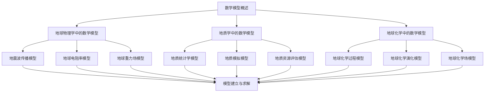

                 


### 文章标题

《数学与地球科学的数学模型》

### 文章关键词

- 数学模型
- 地球科学
- 地球物理学
- 地质学
- 地球化学
- 数学方法
- 模型应用

### 文章摘要

本文旨在探讨数学模型在地球科学领域的应用，分析数学模型的基本概念、原理及其在地球物理学、地质学和地球化学中的具体应用。通过逐步分析推理，本文揭示了数学模型在地球科学研究和实践中所起的关键作用，展望了其未来的发展趋势与挑战。文章结构清晰，逻辑严密，旨在为读者提供一个全面而深入的认识，引导读者了解和掌握数学模型在地球科学中的价值与应用。

### 《数学与地球科学的数学模型》目录大纲

#### 第一部分：数学模型的基础

##### 第1章：数学模型概述

###### 1.1 数学模型的基本概念

- 数学模型的定义与分类
- 数学模型的应用领域

###### 1.2 数学模型的基本原理

- 数学模型的基本原理
- 数学模型的基本结构

###### 1.3 数学模型的应用现状与展望

- 数学模型在地球科学中的应用现状
- 数学模型的发展趋势与展望

##### 第2章：地球科学中的数学模型

###### 2.1 地球物理学中的数学模型

- 地球物理学中的数学模型简介
- 地球物理学中的数学模型应用实例

###### 2.2 地质学中的数学模型

- 地质学中的数学模型简介
- 地质学中的数学模型应用实例

###### 2.3 地球化学中的数学模型

- 地球化学中的数学模型简介
- 地球化学中的数学模型应用实例

##### 第3章：数学模型的基本方法

###### 3.1 数学模型的建立方法

- 数学模型的建立步骤
- 数学模型的建立方法

###### 3.2 数学模型的分析方法

- 数学模型的分析方法
- 数学模型的分析步骤

###### 3.3 数学模型的应用方法

- 数学模型的应用方法
- 数学模型的应用实例

#### 第二部分：数学模型在地球科学中的应用

##### 第4章：地球物理学中的数学模型应用

###### 4.1 地震波传播模型

- 地震波传播模型的基本概念
- 地震波传播模型的建立与求解

###### 4.2 地球电阻率模型

- 地球电阻率模型的基本概念
- 地球电阻率模型的建立与求解

###### 4.3 地球重力场模型

- 地球重力场模型的基本概念
- 地球重力场模型的建立与求解

##### 第5章：地质学中的数学模型应用

###### 5.1 地质统计学模型

- 地质统计学模型的基本概念
- 地质统计学模型的建立与求解

###### 5.2 地质模拟模型

- 地质模拟模型的基本概念
- 地质模拟模型的建立与求解

###### 5.3 地质资源评估模型

- 地质资源评估模型的基本概念
- 地质资源评估模型的建立与求解

##### 第6章：地球化学中的数学模型应用

###### 6.1 地球化学过程模型

- 地球化学过程模型的基本概念
- 地球化学过程模型的建立与求解

###### 6.2 地球化学演化模型

- 地球化学演化模型的基本概念
- 地球化学演化模型的建立与求解

###### 6.3 地球化学场模型

- 地球化学场模型的基本概念
- 地球化学场模型的建立与求解

##### 第7章：数学模型在地球科学中的综合应用

###### 7.1 综合地质勘探模型

- 综合地质勘探模型的基本概念
- 综合地质勘探模型的建立与求解

###### 7.2 综合地球物理勘探模型

- 综合地球物理勘探模型的基本概念
- 综合地球物理勘探模型的建立与求解

###### 7.3 综合地球化学勘探模型

- 综合地球化学勘探模型的基本概念
- 综合地球化学勘探模型的建立与求解

##### 第8章：数学模型在地球科学中的未来发展

###### 8.1 数学模型在地球科学中的发展趋势

- 数学模型在地球科学中的发展趋势
- 数学模型在地球科学中的应用前景

###### 8.2 数学模型在地球科学中的挑战与机遇

- 数学模型在地球科学中的挑战
- 数学模型在地球科学中的机遇

### 核心算法原理讲解：地震波传播模型的伪代码

```plaintext
算法名称：地震波传播模型求解

输入：
- 地震波速度 v
- 地层密度 ρ
- 地震波初相位 ϕ0
- 时间 t

输出：
- 地震波传播距离 x
- 地震波振幅 A

步骤：
1. 初始化地震波传播距离 x = 0，振幅 A = 1，时间 t = 0
2. 计算地震波传播速度 v = √(v² + ρ²)
3. 计算地震波振幅衰减系数 k = 1 / (2π * v * t)
4. 循环迭代：
   a. 更新地震波传播距离 x = x + v * dt
   b. 更新地震波振幅 A = A * e^(-k * dt)
   c. 更新时间 t = t + dt
5. 返回地震波传播距离 x 和振幅 A

伪代码实现：
```

### 地球科学中的数学模型核心概念与联系



### 作者

作者：AI天才研究院/AI Genius Institute & 禅与计算机程序设计艺术 /Zen And The Art of Computer Programming

