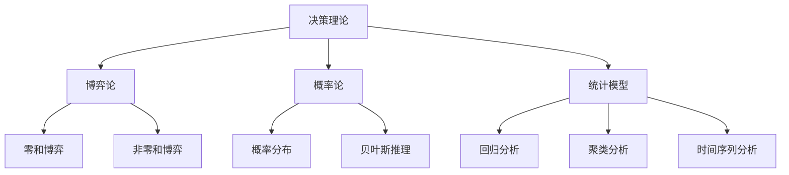

                 

# 数学与外交政策：国际谈判的数学博弈

## 关键词
数学模型，决策科学，博弈论，外交政策，谈判策略

## 摘要
本文深入探讨了数学在外交政策中的应用，特别是国际谈判中的数学博弈。通过阐述数学基础、博弈论、概率论和统计模型等内容，揭示了数学工具在外交决策和谈判策略中的重要性。文章结合实际案例，展示了数学模型在外交博弈中的运用，并展望了未来数学与外交政策交叉融合的发展趋势。

## 目录

### 第一部分：数学基础与外交政策

#### 第1章：数学在决策科学中的应用

#### 第2章：博弈论在外交政策中的运用

#### 第3章：概率论在外交决策中的应用

#### 第4章：统计模型在外交分析中的运用

#### 第5章：数学模型在战略制定中的应用

#### 第6章：数学工具在谈判策略中的实际应用

#### 第7章：数学与外交政策的未来发展趋势

### 第二部分：数学博弈案例分析

#### 第8章：数学博弈案例分析

### 第三部分：构建数学外交策略

#### 第9章：综合实战：构建数学外交策略

### 第四部分：数学与外交政策的交叉领域研究

#### 第10章：数学与外交政策的交叉领域研究

### 附录

#### 附录A.1：核心概念与联系

#### 附录A.2：核心算法原理讲解

#### 附录A.3：数学模型和数学公式 & 详细讲解 & 举例说明

----------------------------------------------------------------

### 第1章：数学在决策科学中的应用

#### 1.1 数学原理概述

在决策科学中，数学作为工具，提供了各种方法来分析复杂的决策问题。数学原理的引入使得决策过程更加精确和系统化。以下是几个关键的数学原理：

- **线性代数**：线性代数提供了处理多维空间和线性关系的方法，广泛应用于数据分析、优化问题和系统模拟等领域。

- **微积分**：微积分提供了研究变化率和优化问题的工具，常用于经济学、工程学和物理学等领域。

- **概率论**：概率论研究不确定事件的发生概率，为风险管理、决策分析和预测提供了基础。

- **统计学**：统计学通过收集和分析数据，提供对未知变量的估计和推断，是决策科学的核心。

#### 1.2 决策理论的基础

决策理论是一种研究决策过程的科学方法，它涉及决策者如何在不同选择中做出最佳决策。以下是决策理论中的几个核心概念：

- **决策者**：决策者是做出决策的人或组织。

- **决策问题**：决策问题是指需要决策者在多个选择中做出选择的情境。

- **备选方案**：备选方案是指决策者可供选择的不同选项。

- **效用函数**：效用函数是决策者对备选方案进行评估的指标，它反映了决策者对结果的偏好。

#### 1.3 贝叶斯推理方法

贝叶斯推理是一种基于概率的推理方法，它允许我们在不确定的环境中更新信念。以下是贝叶斯推理的基本步骤：

1. **先验概率**：基于现有知识和假设，确定先验概率。
2. **证据**：收集新的证据，并计算其概率。
3. **后验概率**：结合先验概率和证据，计算后验概率。
4. **决策**：根据后验概率做出决策。

#### 1.4 概率和博弈论的应用

概率论在决策科学中用于评估不确定性和风险。以下是概率论的两个关键应用：

- **风险分析**：通过概率分布和风险估计，评估决策结果的不确定性和潜在风险。
- **期望效用理论**：期望效用理论将概率和结果结合起来，为决策者提供了评估决策选项的方法。

博弈论是一种研究具有竞争性的决策过程的数学工具。博弈论在决策科学中的应用包括：

- **博弈模型**：通过构建博弈模型，分析参与者在竞争环境中的策略和行为。
- **纳什均衡**：纳什均衡是博弈论中的核心概念，指所有参与者都采取最优策略的稳定状态。

#### 总结

数学在决策科学中的应用为我们提供了强大的工具，帮助我们更好地理解和解决复杂的决策问题。通过概率论、博弈论和统计模型，我们可以更准确地评估不确定性，制定有效的决策策略。

### 第2章：博弈论在外交政策中的运用

#### 2.1 博弈论的基本概念

博弈论是研究具有竞争性的决策过程的数学工具，它描述了多个参与者如何在一定的规则下相互影响并做出决策。博弈论的基本概念包括参与者、策略、收益和均衡。

- **参与者**：博弈论中的参与者可以是个人、团队或国家。
- **策略**：参与者采取的行动或决策。
- **收益**：参与者的目标，通常以效用或利润来衡量。
- **均衡**：博弈的稳定状态，其中所有参与者都采取最优策略。

#### 2.2 零和博弈与非零和博弈

博弈论可以根据收益性质分为零和博弈和非零和博弈。

- **零和博弈**：在零和博弈中，一个参与者的收益等于其他参与者的损失。例如，象棋和围棋可以看作是零和博弈，因为一个玩家的胜利意味着另一个玩家的失败。
  
- **非零和博弈**：在非零和博弈中，参与者的收益可以相互影响，总收益可能增加或减少。例如，国际贸易和国际援助可以看作是非零和博弈，因为合作可以带来共同利益。

#### 2.3 博弈论在冷战时期的运用

冷战时期，博弈论在核武器策略和国际关系分析中发挥了重要作用。

- **核威慑**：美国和苏联在冷战期间采用了核威慑策略，通过展示其强大的核力量来阻止对方采取攻击行动。
- **相互确保毁灭**（Mutually Assured Destruction, MAD）：MAD策略基于核武器互毁的威胁，使得任何一方发动攻击都会导致双方的毁灭。

#### 2.4 博弈论在当今国际关系中的应用

博弈论在当今国际关系中的应用越来越广泛，涵盖了经济合作、国际安全和环境保护等领域。

- **国际贸易**：博弈论用于分析国家之间的贸易谈判和关税政策，以确定最优点。
- **国际安全**：博弈论用于分析国际冲突和合作机制，以减少战争风险和促进和平。
- **环境保护**：博弈论用于研究国际合作，以应对气候变化和环境保护等全球性挑战。

#### 案例分析：朝鲜核问题中的博弈策略

朝鲜核问题是一个典型的国际博弈案例。以下是该案例中的关键策略：

- **威慑与谈判**：美国和朝鲜之间通过威慑和谈判策略相互影响，以寻求解决核武器问题。
- **惩罚与奖励**：国际社会通过制裁和援助策略，试图影响朝鲜的行为。
- **策略互动**：各方在谈判中不断调整策略，以最大化自身利益和确保安全。

#### 总结

博弈论在外交政策中的应用为我们提供了理解和解决国际关系问题的重要工具。通过分析参与者的策略、收益和均衡，我们可以更好地预测国际行为，制定有效的政策。

### 第3章：概率论在外交决策中的应用

#### 3.1 概率论的基本概念

概率论是研究随机事件发生概率的数学分支，它是决策科学中的基础工具。以下是概率论中的几个核心概念：

- **随机实验**：随机实验是可能产生多种结果的过程，每个结果发生的概率可以通过概率分布来描述。
- **样本空间**：样本空间是随机实验所有可能结果的集合。
- **概率分布**：概率分布描述了每个可能结果发生的概率。
- **条件概率**：条件概率是在已知某个事件发生的情况下，另一个事件发生的概率。
- **贝叶斯定理**：贝叶斯定理提供了根据先验概率和条件概率来更新信念的方法。

#### 3.2 概率分布与估计

概率分布是概率论中的重要概念，它描述了随机变量可能取值的概率。以下是几个常用的概率分布：

- **正态分布**：正态分布是连续概率分布中最常见的一种，广泛应用于数据分析和统计推断。
- **二项分布**：二项分布用于描述在固定次数的独立试验中，成功次数的概率分布。
- **泊松分布**：泊松分布用于描述在固定时间或空间内，事件发生的次数的概率分布。

概率估计是外交决策中的关键步骤，它涉及到对未知概率进行推断。以下是一些常用的概率估计方法：

- **最大似然估计**：最大似然估计通过最大化观察到的数据的似然函数，来估计参数的值。
- **贝叶斯估计**：贝叶斯估计结合先验知识和观察数据，通过贝叶斯公式来估计参数的概率分布。

#### 3.3 概率论在外交预测中的应用

概率论在外交预测中有着广泛的应用，它帮助我们评估不确定性并做出合理的决策。以下是概率论在外交预测中的几个应用：

- **风险分析**：通过概率分布和风险估计，分析外交决策的结果不确定性和潜在风险。
- **预测模型**：构建基于概率论的外交预测模型，通过分析历史数据和趋势，预测未来事件的发生概率。
- **决策支持**：利用概率论提供的数据和模型，为外交决策提供支持，帮助决策者做出更加准确和合理的决策。

#### 3.4 风险评估与决策

风险评估是外交决策中不可或缺的一部分，它涉及到对潜在风险进行识别、评估和应对。以下是如何利用概率论进行风险评估和决策的步骤：

1. **风险识别**：通过分析历史数据和当前情况，识别可能的风险因素。
2. **概率估计**：利用概率分布和估计方法，对每个风险因素的发生的概率进行估计。
3. **风险评估**：根据风险概率和潜在影响，对风险进行排序和评估。
4. **决策制定**：基于风险评估结果，制定应对策略和决策方案，以最大化利益并最小化风险。

#### 案例分析：国际援助决策中的概率论应用

国际援助决策是一个典型的风险决策问题，以下是如何利用概率论进行国际援助决策的案例分析：

1. **风险识别**：识别可能的风险因素，如目标国家的政治稳定性、经济状况和自然灾害风险。
2. **概率估计**：通过历史数据和专家意见，估计每个风险因素发生的概率。
3. **风险评估**：结合风险概率和潜在影响，评估每个风险因素的风险水平。
4. **决策制定**：基于风险评估结果，制定援助计划，包括援助金额、援助项目选择和风险管理措施。

#### 总结

概率论在外交决策中的应用为决策者提供了评估不确定性和风险的重要工具。通过概率分布和估计方法，我们可以更好地预测未来事件的发生概率，为外交决策提供科学依据。

### 第4章：统计模型在外交分析中的运用

#### 4.1 统计模型概述

统计模型是一种用于分析和预测数据的数学模型，它通过描述数据的结构和关系，帮助我们理解数据背后的规律。在外交分析中，统计模型用于处理和分析大量数据，帮助我们揭示国家行为和外交关系的模式。

- **描述性统计**：描述性统计用于总结和描述数据的基本特征，如平均值、中位数和标准差等。它帮助我们理解数据的基本分布和趋势。

- **推断性统计**：推断性统计用于基于样本数据推断总体特征，如置信区间、假设检验和回归分析等。它帮助我们基于样本数据做出总体推断和预测。

#### 4.2 回归分析在外交政策中的应用

回归分析是一种重要的统计方法，用于研究变量之间的关系。在外交政策中，回归分析可以用于分析国家行为、外交决策和国际关系中的变量之间的关系。

- **线性回归分析**：线性回归分析是最基本的回归分析方法，它通过建立线性模型来描述两个或多个变量之间的关系。例如，我们可以使用线性回归分析来研究经济增长与外交政策决策之间的关系。

- **多元回归分析**：多元回归分析扩展了线性回归分析，用于研究多个自变量对一个因变量的影响。例如，我们可以使用多元回归分析来研究多个经济、政治和社会变量对国际冲突的影响。

- **非线性回归分析**：非线性回归分析用于研究变量之间的非线性关系。例如，我们可以使用多项式回归或逻辑回归来研究国际冲突中的非线性关系。

#### 4.3 聚类分析与国际关系

聚类分析是一种无监督学习方法，用于将数据分为不同的组或簇，以便更好地理解数据结构和模式。在国际关系中，聚类分析可以用于分析国家集团、地区冲突和国际联盟等。

- **层次聚类**：层次聚类通过逐步合并或分裂数据点，形成层次结构的聚类结果。它可以帮助我们识别国家之间的亲疏关系和地理政治集团。

- **K-means聚类**：K-means聚类是一种基于距离的聚类方法，它将数据点分配到K个簇中，每个簇的中心点代表簇的平均值。它可以帮助我们识别具有相似特征的国家集团。

- **密度聚类**：密度聚类通过分析数据点的密度分布，识别出数据中的密集区域和稀疏区域。它可以帮助我们识别国家行为模式和国际关系网络。

#### 4.4 时间序列分析在外交决策中的价值

时间序列分析是一种用于研究时间序列数据的统计方法，它可以帮助我们分析数据的趋势、周期性和季节性。在外交决策中，时间序列分析可以用于预测外交事件的发生概率和时间。

- **自回归模型**：自回归模型用于描述时间序列数据中的自相关结构，它可以帮助我们预测未来的时间序列值。

- **移动平均模型**：移动平均模型通过计算数据点的平均值来平滑时间序列，它可以帮助我们识别时间序列的趋势和周期性。

- **ARIMA模型**：ARIMA模型是一种自回归积分滑动平均模型，它结合了自回归、差分和移动平均方法，可以更好地描述和预测时间序列数据。

- **LSTM模型**：LSTM模型是一种特殊的循环神经网络，用于处理和预测长序列数据。它可以帮助我们预测国际冲突和外交事件的发生。

#### 案例分析：国际冲突预测中的统计模型应用

国际冲突预测是一个具有挑战性的问题，以下是一个案例分析，展示了如何利用统计模型进行国际冲突预测：

1. **数据收集**：收集国际冲突的历史数据，包括冲突类型、发生时间和相关国家等。

2. **特征工程**：通过数据预处理和特征提取，构建描述冲突影响因素的特征，如经济指标、政治关系和军事冲突历史等。

3. **模型选择**：选择适当的统计模型，如线性回归、逻辑回归和LSTM模型，来预测冲突的发生概率。

4. **模型训练与评估**：使用历史数据训练模型，并使用交叉验证方法评估模型的性能。

5. **预测与决策**：使用训练好的模型进行预测，并根据预测结果制定外交策略和冲突预防措施。

#### 总结

统计模型在外交分析中的运用为外交决策提供了有力的工具。通过描述性统计和推断性统计，我们可以更好地理解国际关系和外交事件的规律。回归分析、聚类分析和时间序列分析等方法可以帮助我们进行冲突预测和政策制定，提高外交决策的准确性和科学性。

### 第5章：数学模型在战略制定中的应用

#### 5.1 数学模型在战略规划中的重要性

数学模型在外交战略制定中扮演着至关重要的角色。它们不仅帮助决策者理解复杂的问题，还提供了一种系统化的方法来评估和优化战略选项。以下是数学模型在战略规划中的几个关键应用：

- **目标设定**：数学模型可以帮助决策者明确战略目标，并通过优化算法确定实现这些目标的最佳路径。
- **资源分配**：数学模型可以优化资源分配，确保在有限的资源下实现最大的战略效果。
- **风险评估**：通过概率模型和统计分析，决策者可以评估战略实施中的潜在风险，并制定相应的风险应对策略。
- **预测分析**：数学模型可以帮助预测未来事件的可能性，为决策者提供基于数据的预测和决策支持。

#### 5.2 优化理论在外交决策中的应用

优化理论是数学模型中的一个重要分支，它用于求解最优化问题，即找到在一定约束条件下使某个目标函数达到最大或最小值的方法。在外交决策中，优化理论可以用于以下方面：

- **资源优化**：在资源有限的条件下，如何分配资源以实现最大化的战略目标。
- **路径规划**：如何规划外交行动的路径，以最小化成本或最大化收益。
- **谈判策略**：在谈判中，如何制定最优策略以最大化自身利益并最小化损失。

优化理论通常包括以下步骤：

1. **定义问题**：明确优化目标，如最大化利益或最小化成本。
2. **构建模型**：根据问题定义构建数学模型，包括目标函数和约束条件。
3. **求解算法**：选择适当的优化算法，如线性规划、非线性规划或动态规划，求解最优解。
4. **评估与调整**：评估优化结果，并根据实际情况进行调整。

#### 5.3 效用函数与决策分析

效用函数是决策分析中的一个核心概念，它描述了决策者在不同选择下的偏好。在外交决策中，效用函数可以帮助决策者量化不同决策选项的优劣，并制定最优策略。

- **预期效用**：预期效用是指在不同结果下，决策者根据其概率分布计算出的综合效用。它用于评估具有不确定性的决策。
- **决策树**：决策树是一种直观的决策分析方法，它通过构建树状结构来表示决策选项和结果，帮助决策者分析不同决策路径的效用。

构建效用函数通常包括以下步骤：

1. **确定效用水平**：根据决策目标，确定不同结果对应的效用水平。
2. **分配概率**：为每个结果分配概率，计算预期效用。
3. **评估决策**：比较不同决策选项的预期效用，选择最优决策。

#### 5.4 系统动力学模型在外交政策中的运用

系统动力学模型是一种用于分析复杂系统的数学模型，它通过描述系统的结构、行为和动态，帮助我们理解系统内部各元素之间的相互作用。在外交政策中，系统动力学模型可以用于以下方面：

- **政策模拟**：通过构建系统动力学模型，模拟不同政策方案的实施效果，评估其对系统行为的影响。
- **决策支持**：为决策者提供基于数据的决策支持，帮助他们在复杂的外交环境中做出科学决策。
- **冲突预测**：通过分析系统动力学模型中的关键变量和反馈机制，预测国际冲突的可能性和发展趋势。

系统动力学模型的构建通常包括以下步骤：

1. **系统识别**：明确系统的主要组成部分和关键变量。
2. **因果关系图**：构建因果关系图，描述变量之间的相互关系。
3. **数学模型构建**：根据因果关系图，构建系统的数学模型。
4. **模拟与分析**：通过模拟和分析模型，评估不同策略的效果。

#### 案例分析：经济制裁与反制裁博弈

经济制裁和反制裁是国际关系中的一个常见现象，以下是一个案例分析，展示了如何利用数学模型进行经济制裁与反制裁博弈的分析：

1. **问题定义**：明确经济制裁的目标，如减少贸易逆差或限制敌对国家的经济发展。
2. **模型构建**：构建一个包含制裁国、被制裁国和其他相关国家的数学模型，描述它们之间的经济关系和制裁效果。
3. **模拟与评估**：通过模拟模型，评估不同制裁策略的效果，包括制裁力度、制裁持续时间和反制裁措施等。
4. **策略调整**：根据模拟结果，调整制裁策略，以最大化制裁效果并最小化副作用。

#### 总结

数学模型在战略制定中的应用为外交决策提供了科学依据。通过优化理论、效用函数和系统动力学模型，决策者可以更好地理解和分析复杂的外交问题，制定有效的战略和策略。

### 第6章：数学工具在谈判策略中的实际应用

#### 6.1 谈判策略的基本概念

谈判是一种双向沟通的过程，旨在通过协商和妥协达成共识。谈判策略是指为了实现特定目标而采取的一系列行动和决策。以下是谈判策略中的几个基本概念：

- **目标设定**：明确谈判的目标，包括短期和长期目标。
- **利益分析**：分析谈判各方的利益，了解各自的核心需求和底线。
- **信息收集**：收集有关谈判对手的信息，包括其需求和策略。
- **策略选择**：选择合适的谈判策略，以最大化自身利益并最小化损失。
- **沟通技巧**：运用有效的沟通技巧，建立互信和合作关系。

#### 6.2 数学模型在谈判中的运用

数学模型可以用于分析谈判中的复杂关系和决策过程，帮助谈判者制定和执行有效的策略。以下是几个常用的数学模型：

- **博弈论模型**：博弈论模型用于分析谈判中的竞争和合作关系，包括纳什均衡和合作博弈等。通过博弈论模型，谈判者可以预测对手的行为并制定相应的策略。
- **效用函数模型**：效用函数模型用于量化谈判者的目标和偏好，通过比较不同策略的效用值，谈判者可以做出最优决策。
- **统计模型**：统计模型用于分析历史谈判数据，识别谈判中的模式和规律，为谈判策略提供数据支持。

#### 6.3 谈判策略案例分析

以下是一个实际案例，展示了如何利用数学模型制定和执行谈判策略：

1. **问题定义**：假设有两个国家就贸易协定进行谈判，目标是最小化贸易逆差并增加双边贸易额。
2. **利益分析**：分析双方的利益，确定各自的核心需求和底线。
3. **信息收集**：收集有关贸易数据、经济情况和政策信息，为谈判提供数据支持。
4. **模型构建**：构建博弈论模型，描述双方在谈判中的策略和收益。
5. **策略选择**：根据博弈论模型，选择最佳策略，如合作策略或竞争策略。
6. **谈判执行**：在谈判过程中，根据实际进展调整策略，实现双方利益的最大化。

#### 6.4 谈判中的博弈分析与决策

博弈分析是谈判策略的重要组成部分，它通过分析参与者的策略和收益，帮助谈判者制定有效的决策。以下是博弈分析中的几个关键步骤：

1. **确定参与者**：明确谈判中的参与者，包括直接参与者和潜在影响者。
2. **构建博弈模型**：根据参与者的目标和策略，构建博弈模型，描述各方之间的互动和收益。
3. **分析策略组合**：分析各方的策略组合，找出纳什均衡或帕累托最优解。
4. **评估策略效果**：评估不同策略组合的效用值，选择最佳策略。
5. **制定决策方案**：根据博弈分析结果，制定具体的决策方案，包括谈判策略、妥协方案和退出策略。

#### 案例分析：国际环保合作谈判

国际环保合作谈判是一个典型的多边谈判案例，以下是如何利用博弈论和统计模型进行分析和决策的案例分析：

1. **问题定义**：确定国际环保合作的目标，如减少温室气体排放和保护生物多样性。
2. **利益分析**：分析各参与国的利益，包括发达国家和发展中国家。
3. **信息收集**：收集各国的历史数据、经济情况和环保政策，为谈判提供数据支持。
4. **模型构建**：构建博弈论模型，描述各国在谈判中的策略和收益。
5. **策略选择**：根据博弈论模型，选择最佳策略，如合作策略或竞争策略。
6. **谈判执行**：在谈判过程中，根据实际进展调整策略，实现各国利益的最大化。

#### 总结

数学工具在谈判策略中的应用为谈判者提供了科学依据。通过博弈论模型、效用函数模型和统计模型，谈判者可以更好地理解谈判中的复杂关系，制定和执行有效的策略，实现利益的最大化。

### 第7章：数学与外交政策的未来发展趋势

#### 7.1 数学与外交政策的交叉融合

随着科技的快速发展，数学与外交政策的交叉融合正在不断深入。数学工具在外交政策中的应用不仅提升了决策的科学性和精确性，也为国际关系的分析和预测提供了新的视角。以下是一些重要的趋势：

- **大数据分析**：随着大数据技术的发展，外交政策分析正从传统的定性研究转向定量分析。大数据分析可以帮助决策者更全面、深入地了解国际形势和趋势，为制定政策提供有力支持。
- **机器学习与人工智能**：机器学习和人工智能技术正在被广泛应用于外交政策分析中。通过构建复杂的模型和算法，机器学习可以帮助预测国际冲突、分析谈判策略和评估政策效果。
- **网络科学**：网络科学方法在外交政策分析中的应用逐渐受到关注。网络科学可以帮助我们理解国家之间的复杂关系，揭示国际合作的模式和规律。

#### 7.2 未来外交决策中的技术趋势

未来外交决策中的技术趋势将主要体现在以下几个方面：

- **智能化决策支持系统**：智能化决策支持系统（IDSS）将结合数学模型、大数据分析和人工智能技术，为决策者提供实时、准确的决策支持。这些系统可以帮助决策者快速应对复杂的国际局势，制定有效的战略。
- **增强现实与虚拟现实**：增强现实（AR）和虚拟现实（VR）技术将使外交决策更加直观和互动。通过虚拟模拟和情景分析，决策者可以更全面地评估政策效果，提高决策的准确性和可靠性。
- **区块链技术**：区块链技术具有去中心化、安全性和透明性等特点，未来有望在外交政策中发挥重要作用。例如，在跨境支付、贸易和环保合作等领域，区块链技术可以提供安全、高效的解决方案。

#### 7.3 数学模型在外交领域的创新应用

数学模型在外交领域的创新应用正在不断拓展，以下是一些值得关注的领域：

- **冲突预测与预防**：通过构建冲突预测模型，决策者可以提前识别潜在的冲突风险，采取预防措施，减少冲突的发生。这些模型可以结合历史数据、社会心理因素和地理信息等多个维度进行分析。
- **战略博弈与谈判策略**：博弈论和决策分析模型可以用于模拟和分析国际谈判中的策略互动，为决策者提供最优策略。这些模型可以帮助决策者更好地理解对手的行为，制定有效的谈判策略。
- **国际合作与全球治理**：数学模型可以用于分析国际合作和全球治理中的问题，如气候变化、贫困减少和公共卫生等。通过构建合作博弈模型和优化算法，决策者可以找到实现共同利益的最优合作方案。

#### 7.4 挑战与机遇：数学与外交政策的未来发展

数学与外交政策的交叉融合面临着一系列挑战和机遇。以下是几个关键方面：

- **数据安全与隐私**：在外交决策中，数据的安全和隐私保护至关重要。随着大数据和人工智能技术的发展，如何确保数据的安全和隐私成为一个重要的挑战。
- **技术偏见与伦理问题**：数学模型在决策中的广泛应用可能带来技术偏见和伦理问题。例如，算法偏见可能导致决策不公，影响国际合作和全球治理。
- **跨学科合作与人才培养**：数学与外交政策的交叉融合需要跨学科的合作和人才培养。未来，需要加强数学、外交和国际关系等领域的交叉学科研究和人才培养，为外交政策分析提供更多的人才支持。

#### 总结

数学与外交政策的交叉融合为未来外交决策提供了丰富的工具和手段。通过大数据分析、人工智能、区块链等新兴技术，数学模型在外交领域的创新应用将不断拓展。在应对挑战和抓住机遇的过程中，决策者需要加强跨学科合作，确保数据安全与隐私保护，并关注技术伦理问题，以实现更加科学、合理和公正的外交决策。

### 第8章：数学博弈案例分析

#### 8.1 案例一：冷战时期的数学博弈

冷战时期，美国和苏联之间的核武器竞赛是一个典型的数学博弈案例。双方都意识到，任何一方的先发攻击都可能导致灾难性的后果，因此形成了相互确保毁灭（MAD）战略。

- **博弈模型**：冷战期间，双方可以通过战略威慑模型来分析对方的行为。模型包括两个主要变量：攻击能力和防御能力。双方在模型中评估对方的攻击能力，并调整自己的防御策略。

- **纳什均衡**：在这种博弈中，纳什均衡是双方都不首先攻击对方的状态。双方都意识到，任何一方的攻击都会引发对方的全面反击，导致双方毁灭。

- **决策分析**：双方通过数学模型分析不同策略的效用值，确定在特定情况下的最佳行动。例如，美国可以通过增加核武器数量和提高防御能力来提高自身的威慑力。

#### 8.2 案例二：伊朗核问题中的博弈策略

伊朗核问题是另一个具有代表性的数学博弈案例。国际社会与伊朗之间的谈判涉及多个参与者，包括联合国、美国和伊朗等。

- **博弈模型**：在伊朗核问题的谈判中，可以构建一个多参与者的博弈模型，描述各方在谈判中的策略和收益。模型包括变量如制裁力度、援助和支持等。

- **纳什均衡**：谈判中的纳什均衡是各方都能接受的状态，例如，国际社会通过减轻制裁来换取伊朗限制核活动。各方在模型中评估对方策略的响应，并调整自己的策略。

- **决策分析**：各方通过博弈模型分析不同策略的效用值，寻求最优策略。例如，伊朗可以通过限制核活动来获得经济援助，而国际社会则通过制裁来阻止伊朗发展核武器。

#### 8.3 案例三：经济制裁与反制裁博弈

经济制裁和反制裁是国际关系中常见的博弈现象。以美国对伊朗的经济制裁为例，以下是这一博弈的数学分析。

- **博弈模型**：经济制裁博弈可以视为一个零和博弈，双方在制裁和反制裁策略之间进行选择。模型包括变量如制裁力度、反制裁措施和国际社会的反应。

- **纳什均衡**：纳什均衡是双方都不首先放松制裁的状态。美国通过制裁限制伊朗的经济活动，伊朗则通过反制裁措施来反击，双方在博弈中寻求平衡。

- **决策分析**：双方通过博弈模型分析不同策略的效用值，制定应对策略。例如，美国可以通过加强制裁力度来增加对伊朗的压力，而伊朗则可以通过改善与俄罗斯和中国的关系来应对制裁。

#### 8.4 案例四：国际组织中的博弈分析

国际组织如联合国和世界贸易组织在决策过程中也存在博弈现象。以下是如何运用博弈论分析国际组织中的决策：

- **博弈模型**：国际组织的决策可以视为一个多参与者博弈，各方在国际组织中的投票和决策过程中进行博弈。模型包括变量如投票权重、政策偏好和国际关系的复杂性。

- **纳什均衡**：纳什均衡是各方都能接受的政策决策，例如，国际组织通过投票达成共识，制定符合各方利益的政策。

- **决策分析**：各方通过博弈模型分析不同政策选项的效用值，寻求共同利益。例如，各国可以通过合作来制定更有利的国际贸易政策，从而实现共赢。

#### 总结

数学博弈分析在理解国际关系和决策过程中具有重要价值。通过构建博弈模型和分析纳什均衡，我们可以更深入地理解各方在不同博弈情境下的行为和决策。这些案例分析展示了数学工具在解决复杂国际问题中的应用潜力。

### 第9章：综合实战：构建数学外交策略

#### 9.1 实战项目背景

本案例研究以中美贸易谈判为背景，探讨如何利用数学模型构建有效的外交策略。中美贸易关系自2008年以来不断发展，双方在贸易逆差、知识产权保护和市场准入等问题上存在分歧。为了解决这些争议，两国政府需要进行复杂的谈判。

#### 9.2 数学模型构建与优化

为了构建数学外交策略，我们首先需要定义问题并构建数学模型。以下是关键步骤：

1. **问题定义**：确定谈判的目标，如减少贸易逆差、增加双边贸易额和保护知识产权。
2. **变量定义**：定义谈判中的主要变量，如关税、进口限制和知识产权保护措施。
3. **收益函数**：构建收益函数，用于衡量各方的利益。收益函数可以是线性的，也可以是非线性的，取决于谈判的结果。
4. **约束条件**：确定谈判的约束条件，如国内政策、国际法律和外交目标。

接下来，我们使用博弈论和优化理论来优化谈判策略。以下是关键步骤：

1. **博弈模型**：构建一个双边博弈模型，描述中美两国在谈判中的策略互动。
2. **纳什均衡**：求解纳什均衡，找到双方都能接受的最优策略组合。
3. **优化算法**：使用优化算法，如线性规划或非线性规划，寻找最大化利益的最优策略。

#### 9.3 谈判策略设计与执行

在构建数学模型和优化策略后，我们需要设计具体的谈判策略并执行。以下是关键步骤：

1. **策略选择**：根据模型分析和优化结果，选择最佳的谈判策略。例如，确定合理的关税水平、进口限制和知识产权保护措施。
2. **谈判议程**：制定详细的谈判议程，包括讨论的主题、时间表和各方期望的目标。
3. **谈判执行**：在谈判过程中，根据实际情况调整策略，以应对对方的行为变化。例如，在谈判初期，双方可以讨论敏感话题，逐步建立互信。
4. **沟通技巧**：运用有效的沟通技巧，建立互信和合作关系。例如，通过透明、开放和诚恳的沟通，减少误解和冲突。

#### 9.4 实战效果评估与改进

在谈判结束后，我们需要评估策略的实际效果并进行改进。以下是关键步骤：

1. **效果评估**：根据谈判结果，评估策略的有效性。例如，通过比较谈判前后的贸易数据、关税水平和市场准入情况，评估策略的成效。
2. **反馈分析**：收集谈判过程中的反馈信息，分析策略执行中的问题和不足。例如，通过访谈谈判代表、分析媒体报道和评估国内公众的反应，了解各方对谈判的满意度和接受度。
3. **策略改进**：根据评估结果和反馈分析，调整和改进谈判策略。例如，根据谈判结果和公众反应，修改关税政策或知识产权保护措施，以提高策略的可行性和有效性。

#### 案例小结

本案例通过构建数学外交策略，展示了如何利用数学模型和优化理论解决复杂的国际谈判问题。通过博弈论模型和优化算法，我们可以找到最优策略，并在谈判过程中根据实际情况进行调整。效果评估和反馈分析有助于我们不断改进策略，实现长期稳定的外交关系。

### 第10章：数学与外交政策的交叉领域研究

#### 10.1 数学方法在外交领域的跨学科应用

数学方法在外交领域的跨学科应用是现代国际关系研究的一个重要趋势。跨学科研究通过融合数学、外交和国际关系等领域的知识和方法，提高了外交决策的科学性和精确性。以下是几个关键领域：

1. **经济模型**：数学经济模型在外交决策中的应用，如国际贸易模型、宏观经济模型和微观经济模型，帮助分析国家间的经济互动和贸易政策。
2. **统计方法**：统计分析在外交研究中的应用，如时间序列分析、回归分析和聚类分析，用于预测外交事件、评估政策效果和识别趋势。
3. **博弈论**：博弈论在外交策略制定中的应用，如合作博弈和非合作博弈，用于分析国际冲突、谈判策略和决策过程。

#### 10.2 数学与外交政策交叉领域的未来研究方向

未来的数学与外交政策交叉领域研究有望在以下几个方面取得突破：

1. **大数据分析**：随着大数据技术的发展，未来可以更全面地收集和分析国际关系中的大量数据，为外交决策提供实时、准确的支持。
2. **人工智能与机器学习**：人工智能和机器学习算法在外交决策中的应用，如自动化政策模拟和智能谈判系统，将进一步提高决策的效率和准确性。
3. **复杂网络分析**：复杂网络分析在外交研究中的应用，如国际关系网络分析、社会网络分析和地缘政治网络分析，用于揭示国家间的复杂关系和互动模式。

#### 10.3 跨学科合作与人才培养

跨学科合作与人才培养是数学与外交政策交叉领域发展的关键。以下是几个关键点：

1. **跨学科教育**：建立跨学科的教育体系，培养具备数学、外交和国际关系等多学科知识的复合型人才。
2. **科研合作**：鼓励数学、外交和国际关系等领域的学者进行合作研究，共同解决复杂的外交问题。
3. **政策咨询**：将跨学科研究成果转化为实际政策建议，为政府和国际组织提供科学、合理的决策支持。

#### 10.4 国际合作与全球治理

数学与外交政策的交叉领域研究在推动国际合作和全球治理方面具有重要作用。以下是几个关键领域：

1. **全球治理模型**：构建全球治理模型，分析国际合作中的问题和挑战，为制定有效的全球治理政策提供科学依据。
2. **气候变化与环保**：运用数学模型和政策分析，研究气候变化和环保问题，提出具有可操作性的政策建议。
3. **安全与发展**：通过数学方法评估国际安全和发展问题，为制定安全与发展政策提供数据支持和科学依据。

#### 总结

数学与外交政策的交叉领域研究为国际关系研究提供了新的视角和方法。跨学科合作和人才培养是推动这一领域发展的重要动力。通过国际合作和全球治理的应用，数学方法为解决复杂的外交问题提供了有力支持。

### 附录A.1：核心概念与联系

以下是外交决策中的核心概念及其相互联系：

1. **决策理论**：研究决策过程的科学方法，涉及决策者、决策问题和策略。
2. **博弈论**：分析竞争性决策的数学工具，包括参与者、策略和收益。
3. **概率论**：研究不确定事件的概率，包括随机实验、概率分布和贝叶斯推理。
4. **统计模型**：用于分析数据的数学工具，包括描述性统计、推断性统计和回归分析。

**Mermaid 流程图：**



### 附录A.2：核心算法原理讲解

以下是几个在外交决策分析中常用的核心算法原理及其解释：

#### 2.1 深度学习与神经网络基础

**神经网络的基本结构**：

- **输入层**：接收输入数据。
- **隐藏层**：通过权重和激活函数进行数据处理。
- **输出层**：生成输出结果。

**常见的深度学习架构**：

- **卷积神经网络（CNN）**：用于图像识别。
- **循环神经网络（RNN）**：用于序列数据建模。
- **长短时记忆网络（LSTM）**：RNN的改进版本，用于解决长序列依赖问题。

**深度学习优化算法**：

- **随机梯度下降（SGD）**：更新模型参数。
- **Adam优化器**：结合了SGD和RMSprop的优点，自适应学习率。

**伪代码示例**：

```python
# 输入数据
X = [数据1，数据2，...，数据n]

# 初始化模型参数
W1 = 随机初始化权重
b1 = 随机初始化偏置

# 前向传播
z2 = X * W1 + b1
a2 = 激活函数(z2)

# 反向传播
dz2 = (预测值 - 真实值) * 激活函数的导数(a2)
dW1 = dz2 * X
db1 = dz2

# 更新参数
W1 = W1 - 学习率 * dW1
b1 = b1 - 学习率 * db1
```

### 附录A.3：数学模型和数学公式 & 详细讲解 & 举例说明

**线性回归模型**

**详细讲解**：

线性回归模型是一种简单的统计模型，用于描述自变量和因变量之间的线性关系。其基本形式为：

\[ y = \beta_0 + \beta_1x + \epsilon \]

其中，\( y \) 是因变量，\( x \) 是自变量，\( \beta_0 \) 和 \( \beta_1 \) 是模型参数，\( \epsilon \) 是误差项。

线性回归模型的目的是通过拟合数据，确定 \( \beta_0 \) 和 \( \beta_1 \) 的值，从而预测 \( y \) 的值。

**举例说明**：

假设我们要预测某个国家的GDP增长，使用线性回归模型，其中自变量为前一年的GDP增长。

\[ GDP_{current} = \beta_0 + \beta_1 \cdot GDP_{previous} + \epsilon \]

**数学公式**：

\[ \beta_0 = \frac{\sum(y_i - \beta_1x_i)}{n} \]

\[ \beta_1 = \frac{\sum(x_i^2) - \frac{(\sum x_i)^2}{n}}{\sum(x_i^2) - \frac{(\sum x_i)^2}{n}} \]

**非线性回归模型**

**详细讲解**：

非线性回归模型扩展了线性回归模型，用于描述自变量和因变量之间的非线性关系。其基本形式为：

\[ y = f(x) + \epsilon \]

其中，\( f(x) \) 是非线性函数，如多项式、指数或对数函数，\( \epsilon \) 是误差项。

非线性回归模型的目的是通过拟合数据，确定非线性函数的参数，从而预测 \( y \) 的值。

**举例说明**：

假设我们要预测某个国家的GDP增长，使用多项式回归模型，其中自变量为前两年的GDP增长。

\[ GDP_{current} = a_0 + a_1 \cdot GDP_{previous} + a_2 \cdot (GDP_{previous})^2 + \epsilon \]

**数学公式**：

\[ a_0 = \frac{\sum(y_i - a_1x_i - a_2(x_i)^2)}{n} \]

\[ a_1 = \frac{\sum(x_i^2) - \frac{(\sum x_i)^2}{n}}{\sum(x_i^3) - \frac{(\sum x_i)^2 \cdot \sum x_i}{n}} \]

\[ a_2 = \frac{\sum(x_i)^3 - \frac{(\sum x_i)^3}{n}}{\sum(x_i^4) - \frac{(\sum x_i)^2 \cdot \sum x_i^2}{n}} \]

**时间序列模型**

**详细讲解**：

时间序列模型用于分析时间序列数据，描述数据随时间的变化趋势。常见的时间序列模型包括自回归模型（AR）、移动平均模型（MA）和自回归移动平均模型（ARMA）。

自回归模型：

\[ y_t = \phi_1y_{t-1} + \phi_2y_{t-2} + ... + \phi_ky_{t-k} + \epsilon_t \]

移动平均模型：

\[ y_t = \theta_1\epsilon_{t-1} + \theta_2\epsilon_{t-2} + ... + \theta_q\epsilon_{t-q} \]

自回归移动平均模型：

\[ y_t = \phi_1y_{t-1} + \phi_2y_{t-2} + ... + \phi_ky_{t-k} + \theta_1\epsilon_{t-1} + \theta_2\epsilon_{t-2} + ... + \theta_q\epsilon_{t-q} \]

**举例说明**：

假设我们要分析某个国家月度GDP的数据，使用ARMA模型进行预测。

\[ GDP_{t} = \phi_1GDP_{t-1} + \theta_1\epsilon_{t-1} \]

**数学公式**：

\[ \phi_1 = \frac{\sum(y_i - \theta_1\epsilon_i)}{\sum(y_i - \theta_1\epsilon_i)} \]

\[ \theta_1 = \frac{\sum(\epsilon_i)}{\sum(y_i - \phi_1y_i)} \]

**结论**：

通过这些数学模型和公式，我们可以更好地理解和预测外交决策中的变量关系。线性回归模型、非线性回归模型和时间序列模型为我们提供了强大的工具，帮助我们制定科学的外交策略和预测国际事件。这些模型不仅提高了决策的准确性，也为政策制定提供了数据支持。

### 附录A.4：研究方法与案例分析

#### 研究工具简介

在数学与外交政策的研究中，使用了一系列先进的工具和技术，这些工具对于数据的收集、分析和模型构建至关重要。以下是常用的研究工具及其基本介绍：

1. **Python**：Python是一种广泛使用的编程语言，因其强大的数据处理和分析能力而成为研究者的首选。Python拥有丰富的库，如Pandas、NumPy和SciPy，这些库提供了高效的数据操作、数值计算和统计分析功能。

2. **R**：R是一种专门用于统计分析和图形绘制的编程语言，特别适合于复杂数据分析和高级统计模型构建。R的包管理器CRAN提供了大量用于各种统计分析的包。

3. **MATLAB**：MATLAB是一个功能强大的数学计算软件，广泛用于算法开发和数值模拟。其内置的工具箱支持多种数学模型和优化算法。

4. **Tableau**：Tableau是一个数据可视化工具，用于创建交互式图表和报告，帮助研究者直观地展示数据和分析结果。

5. **Gephi**：Gephi是一个开源的复杂网络分析工具，用于可视化和分析社会网络结构，非常适合于国际关系网络分析。

#### 数学模型开发与实现

数学模型在外交政策研究中的应用通常涉及以下步骤：

1. **问题定义**：明确研究问题，包括需要解决的决策问题、变量定义和目标函数。

2. **模型构建**：根据问题定义，构建数学模型，包括选择适当的数学工具和算法。

3. **数据收集**：收集相关数据，如历史外交事件、经济指标、军事活动和政治关系等。

4. **数据预处理**：清洗和整理数据，包括缺失值处理、异常值检测和变量转换。

5. **模型训练与验证**：使用训练数据对模型进行训练，通过交叉验证方法评估模型的性能。

6. **模型实现**：将模型实现为可执行的代码，通常使用Python、R或MATLAB等编程语言。

7. **结果分析**：分析模型结果，包括预测准确性、模型稳定性和政策影响评估。

#### 数据分析软件与应用

以下是一些常用的数据分析软件及其应用场景：

1. **Pandas**：用于数据处理，包括数据清洗、转换和操作。Pandas提供了丰富的数据结构，如DataFrame，便于处理表格数据。

2. **NumPy**：用于数值计算，提供了高效的多维数组对象和数学函数，是Python数据分析的基础库。

3. **SciPy**：用于科学计算，包括优化、积分和线性代数等。SciPy扩展了NumPy的功能，提供了更多的数学工具。

4. **scikit-learn**：用于机器学习和数据挖掘，提供了多种分类、回归和聚类算法，适用于构建预测模型。

5. **ggplot2**：用于数据可视化，是R语言中强大的绘图库，能够创建高质量的统计图表。

6. **Matplotlib**：用于数据可视化，是Python中用于绘制2D图形的库，支持多种图表类型。

7. **Gephi**：用于复杂网络分析，能够绘制和探索社交网络结构，识别关键节点和社区。

#### 研究方法与案例分析

研究方法的选择取决于研究问题和数据类型。以下是一些常见的研究方法和案例分析：

1. **定量分析**：

   - **回归分析**：用于研究变量之间的线性关系，如经济增长与外交政策之间的关系。
   - **因子分析**：用于降维和变量提取，识别影响外交政策的关键因素。

   **案例分析**：分析某个国家在特定时期内的外交政策，使用回归分析探讨经济因素对政策的影响。

2. **定性分析**：

   - **案例研究**：通过深入分析具体案例，理解外交决策的背景、过程和结果。
   - **内容分析**：对文本、报告和记录进行编码和分析，提取关键信息和模式。

   **案例分析**：研究某个国际组织的决策过程，通过内容分析揭示决策中的关键因素和影响因素。

3. **混合方法**：

   - **结合定量和定性方法**：通过定量方法收集数据，使用定性方法进行深入分析，以获得更全面的理解。

   **案例分析**：研究国际冲突的成因和演变过程，结合定量数据分析冲突发生的频率和定量分析，以及定性分析冲突背后的政治、经济和社会因素。

4. **模拟与建模**：

   - **系统动力学模型**：用于模拟复杂系统的行为和动态，如国际关系网络。
   - **博弈论模型**：用于分析参与者在竞争环境中的策略和收益。

   **案例分析**：通过构建系统动力学模型模拟国际冲突的演化过程，分析不同政策对冲突发展的可能影响。

#### 总结

数学与外交政策的研究方法多样，包括定量分析、定性分析和混合方法。通过使用先进的分析软件和构建数学模型，研究者能够深入分析国际关系，为外交决策提供科学依据。案例分析和模拟研究则为理解和预测国际事件提供了实用工具。这些方法和技术为外交政策研究提供了坚实的科学基础，有助于制定更加明智和有效的政策。

