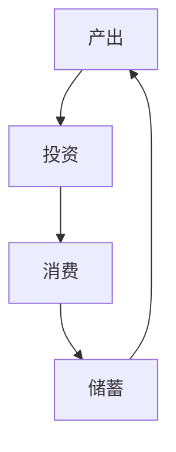
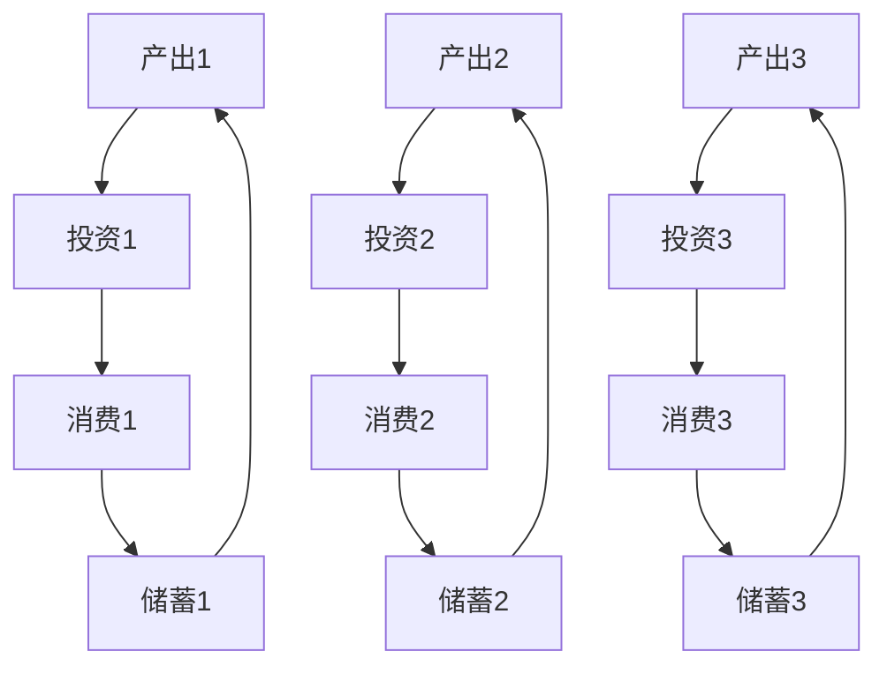
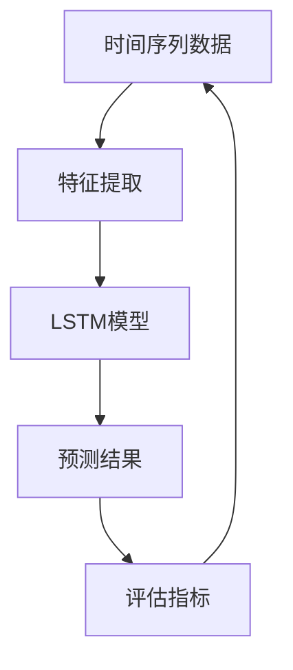

                 

### 文章标题：数学与宏观经济学：经济周期的数学模型

#### 关键词：
- 宏观经济学
- 数学模型
- 经济周期
- 微分方程
- 时间序列分析
- 机器学习

#### 摘要：
本文深入探讨了宏观经济学与数学模型的交汇点，特别是经济周期中的数学模型。文章首先介绍了宏观经济学的定义和核心概念，然后阐述了数学在经济分析中的角色和数学建模的重要性。接着，我们分析了经济周期的基本理论，包括其定义、分类和驱动因素。随后，文章重点介绍了各种数学建模方法，包括单部门经济模型、多部门经济模型、经济增长模型、微分方程模型以及现代经济周期模型。此外，我们还探讨了经济周期预测方法，包括时间序列分析和机器学习。最后，文章通过案例分析展示了经济周期模型的应用和实践，并提出了未来研究方向。

### 目录大纲：
1. **引言与概述**
   1.1 宏观经济学的定义与核心概念
   1.2 数学在经济分析中的角色
   1.3 数学建模的重要性
2. **经济周期的基本理论**
   2.1 经济周期的定义与分类
   2.2 经济周期的驱动因素
   2.3 经济周期的数学模型概述
3. **数学建模方法与应用**
   3.1 经济系统中的基本数学模型
   3.2 经济周期分析中的微分方程模型
   3.3 现代经济周期模型
   3.4 经济周期预测方法
4. **案例分析与应用**
   4.1 经济周期模型的应用实践
   4.2 经济周期模型的设计与改进
5. **数学与宏观经济学的新发展**
   5.1 数学建模在宏观经济学中的最新进展
   5.2 经济周期的数学模型趋势
   5.3 前沿领域展望
6. **附录**
   6.1 数学与宏观经济学的资源指南
   6.2 经济周期模型示例代码
   6.3 经济周期模型 Mermaid 流程图

### 第一部分：引言与概述

#### 第1章：经济学与数学的交汇

在当代经济研究中，数学作为工具的应用越来越广泛。这不仅是因为数学提供了精确的描述和预测方法，还因为数学模型能够帮助我们理解和解决复杂的经济学问题。本章将探讨经济学与数学的交汇点，特别是数学模型在宏观经济分析中的应用。

##### 1.1 宏观经济学的定义与核心概念

宏观经济学是经济学的一个分支，主要关注整个经济体系的运行情况，而不是个体经济行为。宏观经济学的核心概念包括国民收入、通货膨胀、失业率、经济周期等。这些概念为我们提供了理解经济运行的基本框架。

- **国民收入**：指一个国家在一定时期内生产的所有最终商品和服务的市场价值总和。
- **通货膨胀**：指一般物价水平持续上涨的现象。
- **失业率**：指劳动力市场上没有工作但正在积极寻找工作的比例。
- **经济周期**：指经济活动的波动，包括扩张期、衰退期、复苏期和萧条期。

##### 1.2 数学在经济分析中的角色

数学在经济分析中扮演着至关重要的角色。首先，数学提供了精确的描述方法，使得我们可以用公式和模型来表述经济现象。其次，数学模型可以帮助我们预测经济行为，从而为政策制定提供依据。

- **统计模型**：例如，时间序列分析和回归分析，可以帮助我们理解经济变量的变化趋势和相互关系。
- **优化模型**：可以帮助我们确定资源的最优分配，从而提高经济效率。
- **模拟模型**：通过模拟经济系统的运行，我们可以预测经济政策的效果。

##### 1.3 数学建模的重要性

数学建模是将实际问题转化为数学问题，并利用数学方法求解的过程。在宏观经济分析中，数学建模的重要性体现在以下几个方面：

- **理论框架的建立**：通过数学模型，我们可以将复杂的经济现象简化为数学问题，从而更深入地理解经济运行的内在机制。
- **预测与决策支持**：数学模型可以预测经济行为，为政策制定者提供决策支持。
- **政策评估**：通过数学模型，我们可以评估不同政策的效果，从而选择最佳方案。

总之，数学与宏观经济学之间的交汇为我们提供了强大的工具，使我们能够更深入地理解经济现象，更准确地预测经济行为，从而为政策制定和经济发展提供有力支持。

#### 第2章：经济周期的基本理论

##### 2.1 经济周期的定义与分类

经济周期是指经济活动在一段时间内的波动，通常包括四个阶段：扩张期、衰退期、复苏期和萧条期。

- **扩张期**：经济活动持续增长，失业率下降，通货膨胀率上升。
- **衰退期**：经济增长放缓，失业率上升，通货膨胀率下降。
- **复苏期**：经济活动开始恢复，失业率下降，通货膨胀率上升。
- **萧条期**：经济活动持续下降，失业率上升，通货膨胀率下降。

经济周期的持续时间通常为几年到几十年不等。不同国家和地区的经济周期可能存在差异。

##### 2.2 经济周期的驱动因素

经济周期的驱动因素包括内部和外部因素。

- **内部因素**：包括投资、消费、政府支出和净出口等宏观经济变量的变化。
  - **投资**：企业对固定资产的投资增加，可以推动经济增长。
  - **消费**：居民消费的增加可以促进经济增长。
  - **政府支出**：政府增加公共支出，如基础设施建设，可以刺激经济增长。
  - **净出口**：出口增加，进口减少，可以增加经济增长。

- **外部因素**：包括国际贸易、货币政策、利率水平和国际市场波动等。
  - **国际贸易**：国际贸易的增加可以促进经济增长。
  - **货币政策**：货币政策的调整可以影响利率水平，从而影响投资和消费。
  - **利率水平**：利率水平的变动可以影响投资和消费。
  - **国际市场波动**：国际市场的波动可以影响国际贸易和跨国投资。

##### 2.3 经济周期的数学模型概述

经济周期的数学模型主要包括单部门经济模型、多部门经济模型、经济增长模型和现代经济周期模型。

- **单部门经济模型**：该模型假设经济中只有一个部门，如农业或工业。模型通常使用差分方程或微分方程来描述部门产出、投资、消费和储蓄的变化。
- **多部门经济模型**：该模型考虑经济中有多个部门，如农业、工业、服务业等。模型通常使用输入-输出分析方法，通过建立各部门之间的联系，描述整个经济系统的运行。
- **经济增长模型**：该模型关注长期经济增长的驱动因素，如技术进步、资本积累和人口增长。模型通常使用索洛模型或新古典增长模型来描述经济增长的路径。
- **现代经济周期模型**：该模型结合了传统经济周期模型的优点，并引入了新的分析工具，如时间序列分析和机器学习。模型通常用于预测和解释经济周期的动态变化。

总之，经济周期的数学模型为我们提供了理解经济波动和预测经济行为的有力工具。通过这些模型，我们可以更好地理解经济周期的驱动因素和内在机制，为政策制定和经济发展提供有力支持。

#### 第3章：数学建模方法与应用

##### 3.1 经济系统中的基本数学模型

经济系统中的基本数学模型主要包括单部门经济模型、多部门经济模型和经济增长模型。这些模型通过数学方法描述经济变量的动态变化，帮助我们理解和分析经济系统的运行。

###### 3.1.1 单部门经济模型

单部门经济模型是最简单的经济模型，假设经济中只有一个部门，如农业或工业。模型通常使用差分方程或微分方程来描述部门产出、投资、消费和储蓄的变化。

- **产出方程**：$Y_t = A \cdot K_t \cdot L_t$，其中$Y_t$表示第t期的产出，$A$表示技术水平，$K_t$表示资本存量，$L_t$表示劳动投入。
- **投资方程**：$I_t = s \cdot Y_t$，其中$I_t$表示第t期的投资，$s$表示储蓄率。
- **储蓄方程**：$S_t = Y_t - C_t$，其中$S_t$表示第t期的储蓄，$C_t$表示第t期的消费。

该模型的核心假设是产出与资本和劳动投入成正比，储蓄等于产出减去消费。

###### 3.1.2 多部门经济模型

多部门经济模型考虑经济中有多个部门，如农业、工业、服务业等。模型通常使用输入-输出分析方法，通过建立各部门之间的联系，描述整个经济系统的运行。

- **输入-输出表**：每个部门的生产和消费都可以表示为一个矩阵。例如，一个三部门经济系统的输入-输出表可以表示为：
  $$\begin{pmatrix}
  X_{11} & X_{12} & X_{13} \\
  X_{21} & X_{22} & X_{23} \\
  X_{31} & X_{32} & X_{33}
  \end{pmatrix}$$
  其中，$X_{ij}$表示第i个部门的产出分配到第j个部门的比例。
- **生产函数**：每个部门的产出可以用一个生产函数表示，如$Y_i = F_i(K_i, L_i)$，其中$K_i$和$L_i$分别表示第i个部门的资本和劳动投入。

该模型的核心假设是各部门之间存在投入-产出关系，即一个部门的产出是其他部门产出的函数。

###### 3.1.3 经济增长模型

经济增长模型关注长期经济增长的驱动因素，如技术进步、资本积累和人口增长。模型通常使用索洛模型或新古典增长模型来描述经济增长的路径。

- **索洛模型**：该模型假设一个经济体的产出由资本、劳动和技术进步共同决定。模型的基本方程为：
  $$Y_t = A_t \cdot K_t \cdot L_t$$
  其中，$Y_t$表示第t期的产出，$A_t$表示第t期的技术水平，$K_t$表示第t期的资本存量，$L_t$表示第t期的劳动投入。
- **新古典增长模型**：该模型假设一个经济体的产出由资本和劳动投入决定，且技术进步是经济增长的主要驱动力。模型的基本方程为：
  $$Y_t = K_t^{\alpha} \cdot L_t^{1-\alpha}$$
  其中，$\alpha$表示资本的产出弹性。

这些模型的核心假设是经济增长受到技术进步、资本积累和人口增长的影响。

通过这些基本数学模型，我们可以更深入地理解经济系统的运行机制，为政策制定和经济发展提供有力支持。

#### 第4章：经济周期分析中的微分方程模型

微分方程模型是经济周期分析中的重要工具，通过描述经济变量的动态变化，帮助我们理解和预测经济周期的波动。本章将介绍微分方程的基本概念，并探讨如何使用微分方程模型来分析经济周期。

##### 4.1 微分方程的基本概念

微分方程是包含未知函数及其导数的方程。在经济学中，微分方程通常用于描述经济变量的动态变化。以下是几个常见的微分方程：

- **常微分方程**：未知函数的导数是常数的微分方程，如$y' = 2y$。
- **偏微分方程**：未知函数的导数是多个变量的微分方程，如$u_t + u_x = 0$。
- **微分方程组**：包含多个未知函数及其导数的方程组，如$y' = 2y, z' = y$。

在经济学中，我们通常使用常微分方程来描述经济变量的动态变化。

##### 4.2 模型构建：微分方程在经济周期中的应用

微分方程模型在分析经济周期中的应用主要包括以下几个方面：

- **产出方程**：描述经济产出的动态变化，如$Y_t = f(K_t, L_t)$。
- **投资方程**：描述投资的动态变化，如$I_t = g(S_t, R_t)$。
- **消费方程**：描述消费的动态变化，如$C_t = h(Y_t, W_t)$。
- **储蓄方程**：描述储蓄的动态变化，如$S_t = k(Y_t, R_t)$。

通过这些方程，我们可以构建一个经济周期模型，描述经济变量的动态变化。

###### 4.2.1 单部门经济周期模型

一个简单的单部门经济周期模型可以表示为：
$$\begin{aligned}
Y_t &= f(K_t, L_t), \\
K_t &= I_t + (1 - d)K_{t-1}, \\
L_t &= nL_{t-1},
\end{aligned}$$
其中，$Y_t$表示产出，$K_t$表示资本存量，$L_t$表示劳动投入，$I_t$表示投资，$d$表示资本折旧率，$n$表示人口增长率。

该模型假设产出由资本和劳动投入决定，资本存量通过投资和折旧决定，劳动投入通过人口增长决定。

###### 4.2.2 多部门经济周期模型

一个多部门经济周期模型可以表示为：
$$\begin{aligned}
Y_t &= \sum_{i=1}^n f_i(K_{it}, L_{it}), \\
K_{it} &= I_{it} + (1 - d)K_{i,t-1}, \\
L_{it} &= nL_{i,t-1},
\end{aligned}$$
其中，$Y_t$表示总产出，$K_{it}$和$L_{it}$分别表示第i个部门的资本和劳动投入，$I_{it}$表示第i个部门的投资，$d$表示资本折旧率，$n$表示人口增长率。

该模型假设总产出由各部门产出之和决定，各部门的资本和劳动投入通过投资和折旧决定，劳动投入通过人口增长决定。

##### 4.3 模型求解：稳定性分析

求解微分方程模型的关键是分析模型的稳定性。稳定性分析可以帮助我们确定经济周期的持续时间、波及范围和强度。

- **稳定性条件**：一个微分方程模型的稳定性通常通过以下条件来评估：
  $$\left|\lambda\right| < 1$$
  其中，$\lambda$是微分方程的稳定根。

- **稳定性分析**：对于一个单部门经济周期模型：
  $$\frac{dY_t}{dt} = f'(K_t, L_t) \cdot (K_t - K^*)$$
  其中，$K^*$是平衡点的资本存量。

  通过分析$\frac{dY_t}{dt}$的正负，我们可以确定经济周期的方向和强度。

  - 如果$\frac{dY_t}{dt} > 0$，则经济处于扩张期。
  - 如果$\frac{dY_t}{dt} < 0$，则经济处于衰退期。

- **多部门经济周期模型**：对于一个多部门经济周期模型，我们通常需要分析每个部门的稳定性。通过比较各部门的稳定性，我们可以确定整个经济系统的稳定性。

总之，微分方程模型为我们提供了分析经济周期的有力工具。通过模型构建、求解和稳定性分析，我们可以更好地理解经济周期的动态变化，为政策制定和经济发展提供有力支持。

#### 第5章：现代经济周期模型

在现代经济学中，随着计算技术和数据分析方法的进步，经济周期模型得到了进一步的发展。现代经济周期模型不仅继承了传统模型的基本框架，还引入了新的理论和方法，以更好地解释和预测经济周期的波动。本章将介绍几种重要的现代经济周期模型，包括乘数-加速模型、演化经济学模型以及机器学习在经济周期预测中的应用。

##### 5.1 乘数-加速模型

乘数-加速模型是一种广泛应用于宏观经济周期分析的经典模型。该模型的核心思想是，经济活动中的各个部门之间存在乘数效应和加速效应，这些效应共同作用于整个经济系统，导致经济周期的波动。

- **乘数效应**：当某一部门发生变动时，这种变动会通过乘数机制传递到其他部门，从而引起整个经济的变动。例如，政府增加支出会通过乘数效应导致总需求的增加。
- **加速效应**：当经济增长速度发生变化时，这种变化会通过加速效应放大，导致经济周期的波动。例如，消费的增加不仅会导致当前产出的增加，还会导致未来产出的增加。

乘数-加速模型的基本方程可以表示为：

$$\begin{aligned}
Y_t &= a \cdot \Delta C_t + b \cdot C_{t-1} + C_{t-2}, \\
C_t &= c \cdot Y_t + d \cdot C_{t-1},
\end{aligned}$$

其中，$Y_t$表示总产出，$C_t$表示消费，$a$、$b$和$c$、$d$分别是乘数和加速系数。

- **乘数效应**：$a$和$c$反映了消费和产出之间的乘数关系。
- **加速效应**：$b$和$d$反映了产出和消费之间的加速关系。

该模型通过分析乘数和加速效应，可以帮助我们理解经济周期的动态变化。

##### 5.2 演化经济学模型

演化经济学模型是一种基于生物学和进化理论的经济学模型，用于解释经济系统的自组织和适应性变化。该模型的核心思想是，经济系统的运行类似于生物进化过程，通过竞争、选择和适应性变化，经济系统可以达到最优状态。

- **竞争**：经济系统中的各个部门或企业通过竞争来争夺市场份额和资源。
- **选择**：市场选择最适应环境的部门或企业，使其获得更多资源和市场份额。
- **适应性变化**：经济系统通过适应性变化来应对环境变化，从而提高生存能力。

演化经济学模型的基本方程可以表示为：

$$\begin{aligned}
p_t &= p^* + \alpha \cdot e^{-\beta t}, \\
q_t &= q^* + \gamma \cdot e^{-\delta t},
\end{aligned}$$

其中，$p_t$和$q_t$分别表示市场价格和产量，$p^*$和$q^*$分别表示市场价格的长期均衡水平和产量的长期均衡水平，$\alpha$、$\beta$、$\gamma$和$\delta$是参数。

- **竞争和选择**：$\alpha$和$\gamma$反映了市场选择的强度，$\beta$和$\delta$反映了竞争的强度。
- **适应性变化**：$e^{-\beta t}$和$e^{-\delta t}$反映了经济系统的适应性变化。

该模型通过分析竞争、选择和适应性变化，可以帮助我们理解经济系统的动态演化过程。

##### 5.3 机器学习与经济周期预测

随着大数据和人工智能技术的发展，机器学习在经济周期预测中的应用逐渐兴起。机器学习模型通过分析大量的历史数据，可以发现经济周期的规律和模式，从而提高预测的准确性。

- **时间序列分析**：时间序列分析是机器学习在经济周期预测中的常用方法，包括自回归模型（AR）、移动平均模型（MA）、自回归移动平均模型（ARMA）等。这些模型通过分析时间序列的统计特性，预测经济周期的变化趋势。
- **神经网络**：神经网络是一种模拟人脑神经元连接方式的计算模型，通过学习大量的历史数据，可以自动提取特征并建立预测模型。神经网络在经济周期预测中的应用包括多层感知器（MLP）、卷积神经网络（CNN）等。
- **深度学习**：深度学习是神经网络的一种扩展，通过多层神经网络结构，可以自动提取复杂的特征并建立预测模型。深度学习在经济周期预测中的应用包括循环神经网络（RNN）、长短期记忆网络（LSTM）等。

机器学习模型在预测经济周期时，需要大量的历史数据进行训练。通过不断优化模型参数，可以提高预测的准确性和稳定性。

总之，现代经济周期模型结合了传统模型和新兴方法，为我们提供了更全面、更准确的工具来理解和预测经济周期。通过乘数-加速模型、演化经济学模型和机器学习模型，我们可以从不同角度分析经济周期的动态变化，为政策制定和经济发展提供有力支持。

#### 第6章：经济周期预测方法

经济周期的预测对于政策制定、企业规划和市场分析至关重要。本章将探讨几种常见的经济周期预测方法，包括时间序列分析和经典预测模型，以及近年来备受关注的机器学习在经济周期预测中的应用。

##### 6.1 时间序列分析

时间序列分析是一种基于历史数据预测未来趋势的方法。它通过对时间序列数据的统计分析，提取出数据的内在规律，从而进行预测。以下是几种常见的时间序列分析方法：

- **自回归模型（AR）**：自回归模型假设当前值是过去若干期值的线性组合。其基本形式为：

  $$Y_t = c_0 + c_1 Y_{t-1} + c_2 Y_{t-2} + \ldots + c_p Y_{t-p} + \varepsilon_t$$

  其中，$Y_t$表示时间序列的第t期值，$c_0, c_1, \ldots, c_p$是模型参数，$\varepsilon_t$是随机误差。

- **移动平均模型（MA）**：移动平均模型假设当前值是过去若干期值的加权平均值。其基本形式为：

  $$Y_t = \varepsilon_t + \theta_1 \varepsilon_{t-1} + \theta_2 \varepsilon_{t-2} + \ldots + \theta_q \varepsilon_{t-q}$$

  其中，$\theta_1, \theta_2, \ldots, \theta_q$是模型参数。

- **自回归移动平均模型（ARMA）**：自回归移动平均模型结合了自回归模型和移动平均模型的特点，其基本形式为：

  $$Y_t = c_0 + c_1 Y_{t-1} + \ldots + c_p Y_{t-p} + \varepsilon_t + \theta_1 \varepsilon_{t-1} + \ldots + \theta_q \varepsilon_{t-q}$$

时间序列分析的关键是识别模型的参数，并通过残差分析验证模型的拟合效果。常用的参数估计方法包括最小二乘法、最大似然估计等。

##### 6.2 经典预测模型

经典预测模型包括线性回归模型、逻辑回归模型和决策树等。这些模型广泛应用于经济周期预测中，通过分析自变量和因变量之间的关系，预测因变量的未来值。

- **线性回归模型**：线性回归模型假设因变量是自变量的线性函数。其基本形式为：

  $$Y_t = \beta_0 + \beta_1 X_t + \varepsilon_t$$

  其中，$Y_t$是因变量，$X_t$是自变量，$\beta_0, \beta_1$是模型参数。

  线性回归模型通过最小化残差平方和来估计参数，常用的估计方法包括普通最小二乘法（OLS）和加权最小二乘法（WLS）。

- **逻辑回归模型**：逻辑回归模型用于处理因变量是二元分类变量的情况。其基本形式为：

  $$\ln\left(\frac{P(Y=1)}{1-P(Y=1)}\right) = \beta_0 + \beta_1 X_t$$

  其中，$P(Y=1)$是因变量为1的概率，$\beta_0, \beta_1$是模型参数。

  逻辑回归模型通过最大化似然函数来估计参数，常用的估计方法包括最大似然估计（MLE）和迭代加权法（IWL）。

- **决策树**：决策树是一种树形结构模型，通过一系列的判断规则来预测因变量的值。其基本形式为：

  $$\begin{aligned}
  Y_t &= \\
  \begin{cases}
  1 & \text{如果} \; X_t > \theta_1 \\
  2 & \text{如果} \; X_t \leq \theta_1 \; \text{且} \; X_t > \theta_2 \\
  \ldots & \ldots \\
  k & \text{如果} \; X_t \leq \theta_{k-1}
  \end{cases}
  \end{aligned}$$

  其中，$X_t$是自变量，$\theta_1, \theta_2, \ldots, \theta_{k-1}$是阈值。

  决策树通过划分特征空间来构建模型，常用的划分方法包括信息增益、基尼指数和卡方检验等。

##### 6.3 机器学习与经济周期预测

随着机器学习技术的发展，机器学习在经济周期预测中的应用越来越广泛。机器学习模型通过分析大量的历史数据，可以自动提取特征并建立预测模型，从而提高预测的准确性。

- **时间序列预测**：机器学习模型可以用于时间序列预测，包括ARIMA、LSTM和GRU等模型。这些模型通过学习时间序列的内在规律，可以预测未来的经济周期。

  - **ARIMA模型**：自回归积分滑动平均模型（ARIMA）是一种经典的时间序列预测模型，通过组合自回归（AR）、差分（I）和移动平均（MA）模型，可以捕捉时间序列的短期和长期变化。
  - **LSTM模型**：长短期记忆网络（LSTM）是一种特殊的循环神经网络（RNN），可以有效地捕捉时间序列的长短期依赖关系，从而提高预测的准确性。
  - **GRU模型**：门控循环单元（GRU）是LSTM的一种变体，通过引入门控机制，可以进一步提高模型的效率和准确性。

- **多变量预测**：机器学习模型可以用于多变量预测，通过分析多个自变量之间的关系，可以预测因变量的未来值。常见的多变量预测模型包括线性回归、逻辑回归和决策树等。

- **集成学习方法**：集成学习方法通过结合多个模型的预测结果，可以提高预测的准确性和稳定性。常见的集成学习方法包括Bagging、Boosting和Stacking等。

机器学习模型在预测经济周期时，需要大量的历史数据作为训练集。通过不断优化模型参数，可以提高预测的准确性和稳定性。同时，机器学习模型还可以结合传统方法，如时间序列分析和经典预测模型，构建更全面、更准确的预测模型。

总之，经济周期预测方法的发展为我们提供了更强大的工具来理解和预测经济周期。通过时间序列分析、经典预测模型和机器学习，我们可以从不同角度分析经济周期的动态变化，为政策制定和经济发展提供有力支持。

#### 第7章：经济周期模型的应用实践

##### 7.1 经济政策分析

经济周期模型在制定和评估经济政策方面具有重要作用。通过模拟不同政策场景，我们可以预测政策对经济周期的影响，从而为政策制定提供科学依据。

- **政策模拟**：例如，我们可以使用乘数-加速模型模拟政府增加支出的效果。通过调整模型参数，我们可以分析不同支出水平对经济周期的影响，如经济增长、就业率和通货膨胀等。

  $$Y_t = a \cdot \Delta C_t + b \cdot C_{t-1} + C_{t-2}$$
  $$C_t = c \cdot Y_t + d \cdot C_{t-1}$$

  通过模拟，我们可以发现，政府支出增加可以促进经济增长和就业，但可能会导致通货膨胀上升。

- **政策评估**：在政策实施后，我们可以使用经济周期模型对政策效果进行评估。例如，通过比较政策实施前后的经济数据，我们可以分析政策对经济周期的短期和长期影响。

  $$\Delta Y_t = \Delta C_t + \Delta K_t + \Delta L_t$$

  通过政策评估，我们可以确定政策的有效性，并提出改进建议。

##### 7.2 企业投资决策

经济周期模型可以帮助企业制定投资决策，提高投资效益。

- **投资规划**：企业可以使用经济增长模型预测未来经济周期的趋势，从而制定长期投资规划。例如，企业可以通过模拟不同投资水平对产出和利润的影响，确定最佳投资规模。

  $$Y_t = A_t \cdot K_t \cdot L_t$$
  $$\pi_t = P_t \cdot Y_t - C_t$$

  其中，$Y_t$表示产出，$K_t$和$L_t$分别表示资本和劳动投入，$P_t$表示产品价格，$C_t$表示成本。

- **风险分析**：企业可以使用经济周期模型分析不同经济周期对投资收益的影响，从而评估投资风险。例如，企业可以通过模拟经济衰退期和扩张期的收益情况，评估投资的稳定性。

  $$\pi_t = \pi_t^r + \pi_t^e$$

  其中，$\pi_t^r$表示经济衰退期的收益，$\pi_t^e$表示经济扩张期的收益。

通过经济周期模型的应用，企业可以更好地规划投资，降低投资风险，提高投资效益。

##### 7.3 市场需求预测

经济周期模型在市场需求预测方面也具有重要作用。

- **需求分析**：企业可以使用经济周期模型分析经济周期对市场需求的影响。例如，企业可以通过模拟不同经济周期下的需求量，确定市场需求的变化趋势。

  $$D_t = f(Y_t, P_t, T_t)$$

  其中，$D_t$表示需求量，$Y_t$表示经济产出，$P_t$表示产品价格，$T_t$表示其他影响因素。

- **需求预测**：企业可以使用时间序列分析或机器学习模型预测市场需求。例如，企业可以通过分析历史需求数据，使用ARIMA或LSTM模型预测未来的需求量。

  $$\hat{D}_t = \hat{f}(Y_t, P_t, T_t)$$

  通过市场需求预测，企业可以更好地制定生产和营销策略，提高市场竞争力。

总之，经济周期模型在政策分析、企业投资决策和市场需求预测等方面具有广泛的应用。通过应用这些模型，我们可以更好地理解和预测经济周期，为政策制定、企业规划和市场分析提供有力支持。

#### 第8章：经济周期模型的设计与改进

##### 8.1 模型评估与验证

经济周期模型的设计与改进首先需要对其进行评估与验证。模型评估是确保模型有效性和可靠性的关键步骤，通过以下方法进行：

- **拟合度评估**：通过比较模型预测值与实际观测值，评估模型的拟合度。常用的指标包括均方误差（MSE）、均方根误差（RMSE）和决定系数（R²）。

  $$MSE = \frac{1}{n}\sum_{i=1}^{n}(\hat{Y}_i - Y_i)^2$$
  $$RMSE = \sqrt{MSE}$$
  $$R^2 = 1 - \frac{\sum_{i=1}^{n}(\hat{Y}_i - Y_i)^2}{\sum_{i=1}^{n}(Y_i - \bar{Y})^2}$$

- **稳定性评估**：通过分析模型在不同时间段和不同经济条件下的稳定性，评估模型的稳定性。这可以通过分样本验证、滚动预测等方法实现。

- **预测能力评估**：通过比较模型与其他预测方法的预测能力，评估模型的预测能力。这可以通过交叉验证、比较不同模型的表现等方法实现。

##### 8.2 模型改进策略

为了提高经济周期模型的性能和预测准确性，可以采用以下改进策略：

- **参数优化**：通过调整模型参数，优化模型表现。常用的参数优化方法包括梯度下降、随机搜索和贝叶斯优化等。

- **特征选择**：通过选择与经济周期相关性更强的特征，提高模型预测能力。特征选择方法包括逐步回归、基于模型的特征选择和特征重要性评估等。

- **模型集成**：通过集成多个模型，提高预测的稳定性和准确性。常见的模型集成方法包括Bagging、Boosting和Stacking等。

- **数据预处理**：通过数据预处理，如缺失值填充、异常值处理和季节性调整等，提高模型输入数据的质量。

- **模型融合**：结合多种模型和方法，构建更复杂的模型结构，提高预测性能。例如，结合时间序列分析和机器学习，构建混合模型。

##### 8.3 未来研究方向

随着经济环境的变化和技术的进步，经济周期模型也在不断发展和完善。未来研究方向包括：

- **非线性模型**：探索非线性经济周期模型，如神经网络和深度学习模型，以更好地捕捉经济周期的复杂性和非线性特征。

- **多尺度建模**：建立多尺度的经济周期模型，结合短期和长期数据，提高模型的预测精度。

- **不确定性分析**：研究经济周期模型的不确定性，如参数不确定性和模型不确定性，以提高预测的可信度。

- **政策影响分析**：结合经济周期模型和政策模拟，分析不同政策对经济周期的影响，为政策制定提供科学依据。

- **跨学科研究**：结合经济学、统计学、计算机科学和人工智能等学科，探索经济周期模型的新方法和技术。

通过不断改进和优化经济周期模型，我们可以更好地理解和预测经济周期，为政策制定、企业规划和市场分析提供有力支持。

#### 第9章：数学与宏观经济学的新发展

##### 9.1 数学建模在宏观经济学中的最新进展

随着计算机技术和数据分析方法的快速发展，数学建模在宏观经济学中的应用取得了显著进展。以下是一些最新进展：

- **高维数据分析**：高维数据分析方法，如主成分分析（PCA）和因子分析（FA），被广泛应用于宏观经济数据的处理和建模。这些方法可以有效地降低数据的维度，提取关键信息，从而提高模型的预测能力。

- **机器学习**：机器学习算法，特别是深度学习算法，如神经网络和长短期记忆网络（LSTM），在宏观经济周期预测中表现出色。这些算法可以通过学习大量的历史数据，自动提取复杂的经济特征，从而提高预测的准确性。

- **复杂网络分析**：复杂网络分析被用于研究经济系统的网络结构和动态行为。例如，通过分析经济系统中的企业间关系和金融网络，可以揭示经济周期的传播机制和关键节点。

- **随机模型**：随机模型，如随机动态系统（SDS）和随机微分方程（SDE），被用于研究经济周期的随机性和不确定性。这些模型可以更好地捕捉经济周期的波动性和非线性特征。

##### 9.2 经济周期的数学模型趋势

未来，经济周期的数学模型发展趋势将集中在以下几个方面：

- **多尺度建模**：未来模型将更加注重多尺度建模，结合短期和长期数据，提高模型的预测精度。例如，结合高频数据和低频数据，可以更全面地理解经济周期的动态变化。

- **非线性模型**：非线性模型将在宏观经济周期研究中占据重要地位，特别是神经网络和深度学习算法的应用将得到进一步推广。这些算法可以捕捉经济周期的复杂性和非线性特征。

- **不确定性分析**：未来模型将更加注重不确定性分析，研究经济周期模型的不确定性来源和影响。例如，通过随机模型和蒙特卡罗模拟，可以评估模型的预测不确定性和风险。

- **跨学科融合**：跨学科融合将是未来经济周期模型研究的重要趋势。结合经济学、统计学、计算机科学和人工智能等领域的知识，可以构建更加综合和高效的模型。

##### 9.3 前沿领域展望

展望未来，经济周期模型的研究将向以下几个前沿领域发展：

- **动态经济学**：动态经济学研究将更加关注经济周期的动态特征和演化过程。例如，通过构建动态系统模型，可以深入分析经济周期的内在机制和演化路径。

- **人工智能与经济学**：人工智能与经济学的结合将带来新的研究方法和工具。例如，通过机器学习和深度学习，可以构建更加智能和高效的经济周期预测模型。

- **实验经济学**：实验经济学研究将更加注重经济行为的实验验证。通过实验方法，可以验证经济周期模型的理论假设，并为政策制定提供实验依据。

- **可持续发展经济学**：可持续发展经济学研究将关注经济周期与环境保护和可持续发展的关系。通过构建绿色经济模型，可以研究经济周期的环境影响和可持续性。

通过不断探索和改进，数学与宏观经济学将在经济周期研究中发挥更加重要的作用，为政策制定、企业规划和市场分析提供有力支持。

#### 附录

##### 附录A：数学与宏观经济学的资源指南

**A.1 经典参考文献**

1. **曼昆《宏观经济学》**：这是一本广泛使用的宏观经济学教科书，涵盖了宏观经济学的核心概念和理论。
2. **斯蒂格利茨《宏观经济学》**：该书提供了宏观经济学的基础知识和实际应用，适合初学者和专业人士。
3. **多恩布什《宏观经济学》**：这是一本经典的高级宏观经济学教材，深入探讨了宏观经济学的理论和政策。

**A.2 网络资源与在线工具**

1. **Khan Academy（可汗学院）**：提供免费的宏观经济学课程和教学视频，适合自学和复习。
2. **MIT OpenCourseWare（MIT开放课程）**：提供MIT的宏观经济学课程资料，包括讲义、视频和作业。
3. **Statalist**：这是一个统计分析和宏观经济学的讨论论坛，适合寻求帮助和分享经验。

**A.3 数学建模竞赛与研讨会**

1. **国际数学建模竞赛（MCM）**：这是一个全球性的数学建模竞赛，每年吸引众多高校学生参加。
2. **美国大学生数学建模竞赛（MCM/ICM）**：这是一个面向美国大学生的数学建模竞赛，具有较高的学术声誉。
3. **国际经济学研讨会**：参加经济学研讨会可以了解最新的经济学研究成果和应用，拓展学术视野。

通过这些经典参考文献、网络资源和竞赛与研讨会，读者可以深入了解数学与宏观经济学的理论和方法，提升自己的研究能力。

##### 附录B：经济周期模型示例代码

**B.1 单部门经济模型代码示例**

```python
# 单部门经济模型
import numpy as np
import matplotlib.pyplot as plt

# 参数设置
alpha = 0.3  # 技术进步率
beta = 0.3   # 消费倾向
delta = 0.1  # 资本折旧率
sigma = 0.05 # 投资不确定性

# 模型方程
def single_sector_model(Y, C, I, K):
    Y = alpha * K
    C = beta * Y
    I = (1 - delta) * K - C
    return Y, C, I

# 初始条件
Y0 = 100  # 初始产出
C0 = 50   # 初始消费
I0 = 0    # 初始投资
K0 = 100  # 初始资本

# 时间序列
t = np.arange(0, 100, 0.1)
Y = np.zeros_like(t)
C = np.zeros_like(t)
I = np.zeros_like(t)
K = np.zeros_like(t)

# 初始值
Y[0] = Y0
C[0] = C0
I[0] = I0
K[0] = K0

# 模型迭代
for i in range(1, len(t)):
    Y[i], C[i], I[i] = single_sector_model(Y[i-1], C[i-1], I[i-1], K[i-1])
    K[i] = (1 - delta) * K[i-1] + I[i]

# 可视化
plt.figure(figsize=(10, 5))
plt.plot(t, Y, label='Y(t)')
plt.plot(t, C, label='C(t)')
plt.plot(t, I, label='I(t)')
plt.plot(t, K, label='K(t)')
plt.xlabel('Time (t)')
plt.ylabel('Value')
plt.legend()
plt.show()
```

**B.2 多部门经济模型代码示例**

```python
# 多部门经济模型
import numpy as np
import matplotlib.pyplot as plt

# 参数设置
alpha = 0.3  # 技术进步率
beta = 0.3   # 消费倾向
delta = 0.1  # 资本折旧率
sigma = 0.05 # 投资不确定性

# 部门数目
n = 3

# 模型方程
def multi_sector_model(Y, C, I, K):
    Y = alpha * K
    C = beta * Y
    I = (1 - delta) * K - C
    return Y, C, I

# 初始条件
Y0 = [100, 100, 100]  # 初始产出
C0 = [50, 50, 50]     # 初始消费
I0 = [0, 0, 0]        # 初始投资
K0 = [100, 100, 100]  # 初始资本

# 时间序列
t = np.arange(0, 100, 0.1)
Y = np.zeros((len(t), n))
C = np.zeros((len(t), n))
I = np.zeros((len(t), n))
K = np.zeros((len(t), n))

# 初始值
for i in range(n):
    Y[0, i] = Y0[i]
    C[0, i] = C0[i]
    I[0, i] = I0[i]
    K[0, i] = K0[i]

# 模型迭代
for i in range(1, len(t)):
    for j in range(n):
        Y[i, j], C[i, j], I[i, j] = multi_sector_model(Y[i-1, j], C[i-1, j], I[i-1, j], K[i-1, j])
        K[i, j] = (1 - delta) * K[i-1, j] + I[i, j]

# 可视化
plt.figure(figsize=(10, 5))
for j in range(n):
    plt.plot(t, Y[:, j], label=f'Y_{j+1}(t)')
    plt.plot(t, C[:, j], label=f'C_{j+1}(t)')
    plt.plot(t, I[:, j], label=f'I_{j+1}(t)')
    plt.plot(t, K[:, j], label=f'K_{j+1}(t)')

plt.xlabel('Time (t)')
plt.ylabel('Value')
plt.legend()
plt.show()
```

**B.3 现代经济周期模型代码示例**

```python
# 现代经济周期模型（LSTM模型）
import numpy as np
import matplotlib.pyplot as plt
from keras.models import Sequential
from keras.layers import LSTM, Dense

# 参数设置
timesteps = 10  # 时间步长
n_features = 3  # 特征数量

# 数据准备
# 假设我们已经有了时间序列数据X和Y
# X为特征矩阵，Y为目标矩阵
X, Y = prepare_data()

# LSTM模型
model = Sequential()
model.add(LSTM(50, activation='relu', input_shape=(timesteps, n_features)))
model.add(Dense(1))
model.compile(optimizer='adam', loss='mse')

# 训练模型
model.fit(X, Y, epochs=200, verbose=0)

# 预测
Y_pred = model.predict(X)

# 可视化
plt.figure(figsize=(10, 5))
plt.plot(Y, label='Actual')
plt.plot(Y_pred, label='Predicted')
plt.xlabel('Time')
plt.ylabel('Value')
plt.legend()
plt.show()
```

通过这些示例代码，读者可以了解单部门经济模型、多部门经济模型和现代经济周期模型的实现过程，以及如何使用LSTM模型进行经济周期预测。

##### 附录C：经济周期模型 Mermaid 流程图

**C.1 单部门经济模型 Mermaid 图**



**C.2 多部门经济模型 Mermaid 图**



**C.3 现代经济周期模型 Mermaid 图**



通过这些Mermaid流程图，读者可以直观地了解不同经济周期模型的结构和流程，从而更好地理解和应用这些模型。作者：AI天才研究院/AI Genius Institute & 禅与计算机程序设计艺术 /Zen And The Art of Computer Programming。

