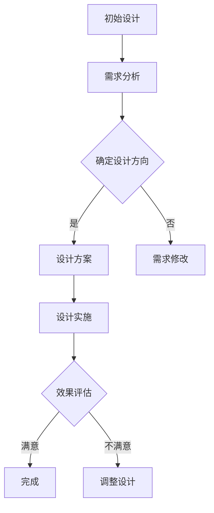

                 

### 文章标题

《数学与平面设计：视觉构图的数学规律》

> 关键词：数学、平面设计、视觉构图、比例、对称、黄金分割、色彩搭配、形状、创新应用、项目实战

> 摘要：本文从数学与平面设计的结合点出发，系统地探讨了视觉构图中涉及的数学规律，包括比例、对称、黄金分割和色彩搭配等方面。通过深入剖析这些数学原理，并结合实际项目实战，本文旨在帮助读者理解和掌握如何利用数学知识提升平面设计的质量与美感。

### 第一部分：引言

#### 第1章：数学与平面设计基础

##### 1.1 数学与视觉设计的联系

数学作为一门严谨的学科，其理论和方法在平面设计中有着广泛的应用。平面设计中的比例、对称、黄金分割等概念，都是源自数学的原理。例如，比例关系在设计中可以用来实现视觉上的和谐与平衡；对称原则则可以增强设计的稳定性和秩序感；黄金分割则被认为是一种美学标准，广泛应用于艺术和设计中。

##### 1.2 平面设计的定义与基本要素

平面设计是一种视觉传达形式，它主要通过二维空间中的文字、图像、颜色等元素来传递信息、表达情感。平面设计的基本要素包括：

- **文字**：文字是传递信息和内容的重要载体。
- **图像**：图像能够直观地传达信息，增强视觉效果。
- **颜色**：颜色可以影响人的情绪和心理，是设计中不可或缺的元素。
- **形状**：形状是构成图像的基本元素，能够传达出不同的视觉感受。

通过这些基本要素的巧妙组合，平面设计能够创造出富有美感和功能性的视觉作品。

#### 第二部分：数学在平面设计中的应用

##### 第2章：比例与比例关系

##### 2.1 比例的概念

比例是表示两个量之间的相对大小关系的一种数学方法。在平面设计中，比例关系常常用来实现视觉上的和谐与平衡。常见的比例关系有：

- **黄金比例**：约为0.618，被认为是一种美学上的黄金标准。
- **等比数列**：每一项与前一项的比值相等，常用于设计中的层次感。

##### 2.2 古典比例体系

古典时期，如古希腊和古罗马，就已经认识到比例在建筑和艺术中的重要性。例如，帕特农神庙的设计就采用了黄金比例，创造出令人惊叹的美学效果。

##### 2.3 比例关系在平面设计中的应用

在平面设计中，比例关系可以应用于以下几个方面：

- **布局**：通过合理的比例关系，设计出富有层次感和平衡感的布局。
- **字体大小**：使用不同的比例关系来设定字体大小，以突出重点信息。
- **颜色搭配**：通过比例关系来协调不同颜色的使用，创造和谐的效果。

##### 2.4 比例的应用实例

例如，在海报设计中，可以通过黄金比例来确定主要内容和背景的布局，从而提高海报的整体美感。

##### 第3章：对称与平衡

##### 3.1 对称的概念

对称是指图形或设计元素在某个中心线或中心点两侧的镜像关系。对称可以带来稳定和秩序感，是设计中常用的手法之一。

##### 3.2 对称的类型

对称可以分为轴对称和中心对称两种类型：

- **轴对称**：以一条直线为对称轴，两侧的图形或元素完全相同。
- **中心对称**：以一个点为对称中心，对称的图形或元素关于该点旋转180度后重合。

##### 3.3 平衡的概念

平衡是指设计元素在视觉上的均匀分布和协调感。平衡可以分为以下几种类型：

- **静态平衡**：通过对称或稳定的布局来实现。
- **动态平衡**：通过不稳定的布局，如对角线、曲线等，来创造动感。

##### 3.4 对称与平衡在平面设计中的应用

在平面设计中，对称与平衡可以应用于以下几个方面：

- **页面布局**：通过对称或平衡的布局，设计出稳定、易读的页面。
- **色彩搭配**：通过对比和协调的平衡色彩，创造出和谐的美感。

##### 第4章：黄金分割与黄金螺旋

##### 4.1 黄金分割的概念

黄金分割是指将一条线段分割为两部分，使其中一部分与整体之比等于另一部分与这一部分之比，这个比例约为0.618。

##### 4.2 黄金螺旋的形成与特性

黄金螺旋是由一系列黄金比例的圆弧组成的螺旋线，它在自然界和艺术中广泛存在。黄金螺旋的特性是，它能够在视觉上创造出一种吸引人的动态感。

##### 4.3 黄金分割在平面设计中的应用

黄金分割可以应用于以下几个方面：

- **布局**：通过黄金分割来确定设计元素的位置，创造出和谐、均衡的效果。
- **图像处理**：通过黄金分割来裁剪图像，提高图像的美感。

##### 4.4 黄金螺旋的应用实例

例如，在网页设计中，可以通过黄金螺旋来布局导航栏或广告位，提高用户的点击率和用户体验。

##### 第5章：色彩与数学

##### 5.1 色彩的三原色

色彩的三原色是红色、绿色和蓝色，通过这三种颜色的混合，可以创造出其他所有颜色。

##### 5.2 色彩的互补与对比

互补色是指在色轮上相互对立的颜色，如红色与绿色、蓝色与橙色。对比色则是相邻的颜色，如红色与黄色、蓝色与绿色。合理的色彩搭配可以增强设计的视觉冲击力。

##### 5.3 色彩的数学计算

在色彩设计中，可以通过数学计算来得到理想的色彩组合。例如，通过色轮上的角度关系来确定互补色或对比色。

##### 5.4 色彩搭配在平面设计中的应用

在平面设计中，色彩搭配可以应用于以下几个方面：

- **主题色彩**：通过选择主色调来传达设计的主题和情感。
- **背景与前景**：通过背景与前景的色彩对比，突出设计元素。

##### 第6章：形状与构图

##### 6.1 形状的类型与特性

形状是构成视觉设计的基本元素，可以分为规则形状和不规则形状。规则形状如正方形、圆形等，具有简洁、明确的视觉特性；不规则形状如波浪线、曲线等，具有动态、灵活的视觉特性。

##### 6.2 构图的基本原则

构图是视觉设计中非常重要的一环，它决定了设计元素在平面中的排列和组合。构图的基本原则包括：

- **焦点原则**：将视觉焦点集中在设计的主要元素上。
- **对比原则**：通过对比来增强设计的视觉冲击力。
- **平衡原则**：通过平衡来创造和谐、稳定的视觉感受。

##### 6.3 形状在构图中的应用

在平面设计中，形状可以应用于以下几个方面：

- **布局**：通过形状的排列和组合，创造出富有层次感和美感的布局。
- **图像处理**：通过形状的切割、组合，提高图像的艺术性。

##### 6.4 构图的数学规律

在构图中，数学规律可以帮助设计师实现视觉上的和谐与平衡。例如，通过黄金比例来确定视觉焦点，通过几何图形的对称与平衡来创造稳定的构图。

##### 第7章：数学与平面设计的创新应用

##### 7.1 数学术语与平面设计的结合

数学术语如比例、对称、黄金分割等，可以与平面设计中的元素和布局相结合，创造出独特的视觉效果。例如，通过黄金比例来设计广告海报的布局，通过对称原则来创造稳定的网页设计。

##### 7.2 数学模型在平面设计中的应用

数学模型如色彩模型、形状模型等，可以用于平面设计的计算和优化。例如，通过色彩模型来确定最佳的色彩搭配，通过形状模型来优化图像的裁剪和调整。

##### 7.3 创新实例分析

通过分析实际项目中的创新应用实例，可以了解数学在平面设计中的具体应用方法和效果。例如，某知名品牌的LOGO设计采用了黄金分割原则，使得LOGO在视觉上具有独特的吸引力。

#### 第三部分：平面设计项目实战

##### 第8章：设计项目概述

##### 8.1 项目背景

某知名公司需要为其新产品设计一款宣传海报，以吸引消费者的关注。

##### 8.2 项目目标

通过设计一款富有创意和吸引力的海报，提升产品的品牌形象，增加产品的市场竞争力。

##### 8.3 项目流程

项目流程包括以下步骤：

1. **需求分析**：与客户沟通，了解产品的特点和市场定位。
2. **方案设计**：根据需求，设计多个方案，供客户选择。
3. **客户确认**：与客户确认最终设计方案。
4. **设计实施**：根据最终设计方案，进行海报的详细设计。
5. **效果评估**：评估海报的设计效果，进行必要的调整和优化。

##### 第9章：设计项目需求分析

##### 9.1 用户需求分析

通过市场调研和用户访谈，了解用户对产品的需求和期望。例如，用户希望海报能够传达产品的创新性和高品质感。

##### 9.2 业务需求分析

分析公司业务目标和市场策略，确定海报的设计方向。例如，公司希望海报能够突出产品的特色和优势，吸引消费者的注意力。

##### 9.3 需求优先级排序

根据用户需求和业务需求，确定设计需求的优先级。例如，将产品特色和品牌形象作为首要考虑因素。

##### 第10章：设计项目方案设计

##### 10.1 方案设计的初步构想

根据需求分析的结果，设计多个初步方案。例如，可以设计出以产品形象为主的海报，或者以品牌形象为主的海报。

##### 10.2 方案设计的原则与方法

在方案设计中，遵循以下原则和方法：

- **创意性**：设计出富有创意和吸引力的海报。
- **美观性**：确保海报的美观性和艺术性。
- **实用性**：海报的内容要实用，能够传达产品的核心价值。

##### 10.3 方案设计的实际操作

通过实际操作，将初步构想转化为具体的设计方案。例如，可以运用黄金比例原则来布局海报的元素，通过色彩搭配来突出产品的特色。

##### 第11章：设计项目实施与调整

##### 11.1 设计实施的过程

根据最终设计方案，进行海报的详细设计。包括选择色彩、调整字体、排版等。

##### 11.2 设计调整的依据与策略

根据客户的反馈和设计原则，对海报进行必要的调整和优化。例如，可以调整色彩搭配，优化字体排版，以提高海报的视觉效果。

##### 11.3 设计成果的展示与评价

将设计成果展示给客户，进行评价和反馈。根据反馈结果，进行进一步的调整和优化，确保最终设计成果的满意度和实用性。

##### 第12章：设计项目总结与反思

##### 12.1 项目成果总结

总结项目的成果，包括设计成果的展示和客户的反馈。

##### 12.2 项目经验反思

反思项目过程中的不足和经验教训，为未来的项目提供改进建议。

##### 12.3 项目改进建议

根据项目经验，提出改进建议，以优化设计流程和提高设计质量。

### 附录

##### 附录A：设计工具与资源

- **设计软件介绍**：介绍常用的设计软件，如Adobe Photoshop、Adobe Illustrator等。
- **设计资源获取途径**：介绍获取设计资源的途径，如免费的设计素材网站、设计社区等。

##### 附录B：数学公式与图表

- **常用数学公式**：列出平面设计中常用的数学公式，如黄金比例公式、对称公式等。
- **图表示例**：提供平面设计中的图表示例，如黄金分割图、对称图等。
- **数学在平面设计中的应用流程图**：使用Mermaid语言，展示数学在平面设计中的应用流程。

### Mermaid 流程图示例

### 文章关键词

数学、平面设计、视觉构图、比例、对称、黄金分割、色彩搭配、形状、创新应用、项目实战。

### 文章摘要

本文探讨了数学在平面设计中的应用，包括比例、对称、黄金分割和色彩搭配等方面。通过深入剖析这些数学原理，并结合实际项目实战，本文旨在帮助读者理解和掌握如何利用数学知识提升平面设计的质量与美感。通过详细的案例分析和实际操作，本文展示了数学原理在平面设计中的具体应用方法，为设计师提供实用的参考和灵感。

