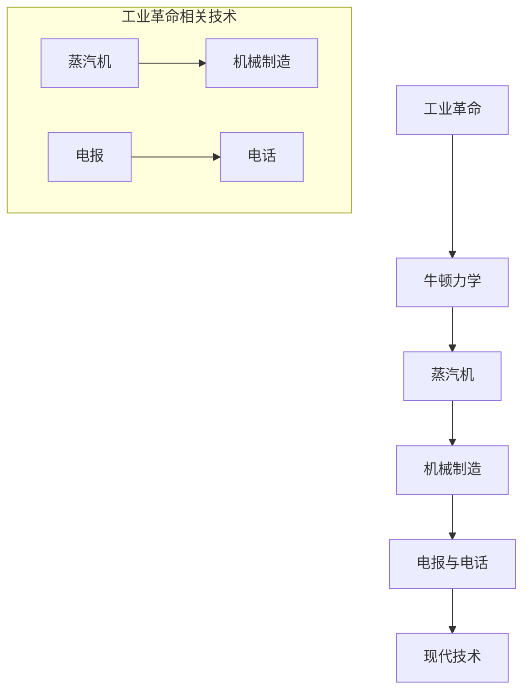
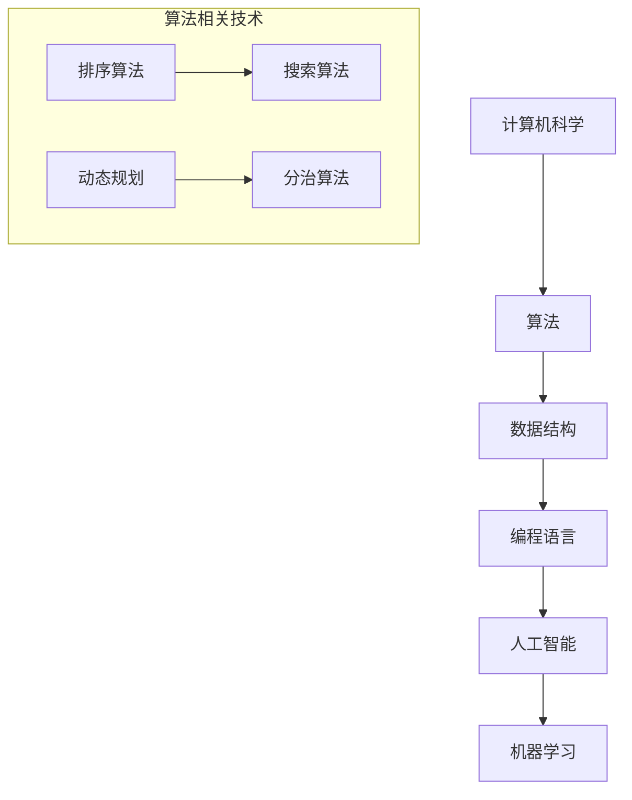
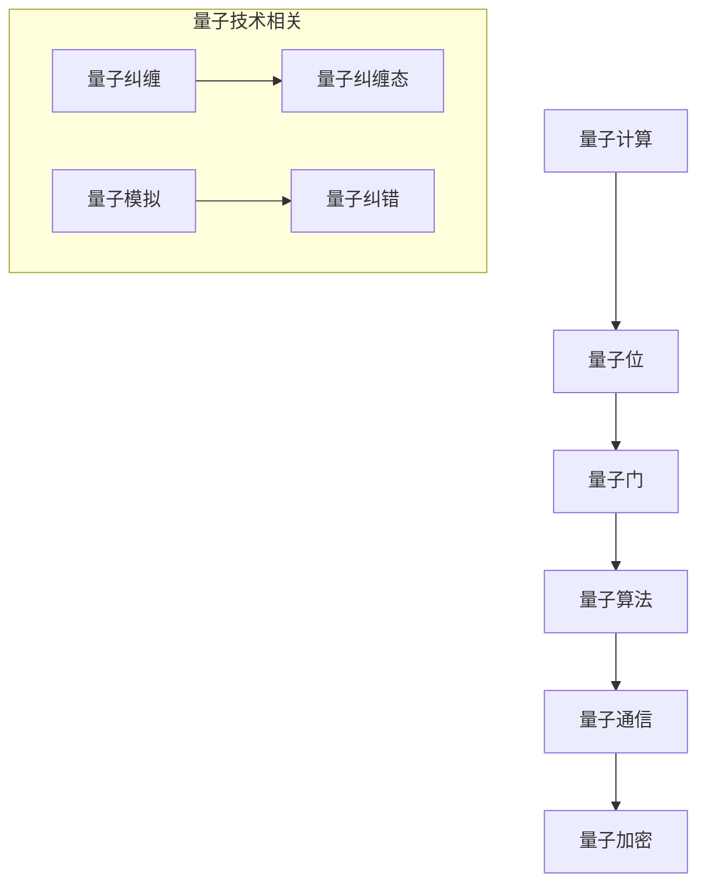
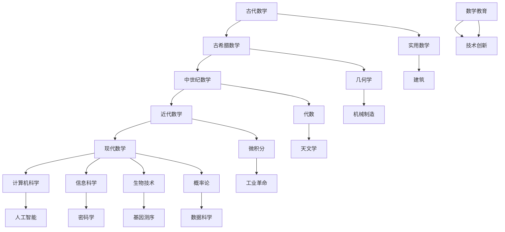

                 

### 文章标题：数学与技术史：数学推动技术进步的历程

> 关键词：数学、技术进步、历史、关键时期、算法、工业革命、计算机科学、人工智能

> 摘要：本文通过梳理数学与技术发展的密切关系，深入探讨数学在技术进步中的重要作用。从古代到现代，数学不仅在技术发展的每个关键时期起到了推动作用，还在不断创新中为技术的进步提供了理论基础。本文旨在通过一系列步骤的推理分析，揭示数学与技术史的相互影响，以及未来数学在新兴技术领域的前景。

### 目录

#### 第一部分：引言

1. **第1章：数学与技术史概述**
   - **1.1 数学在技术发展中的地位和作用**
   - **1.2 技术进步对数学需求的变化**
   - **1.3 数学在技术史中的重要节点**

#### 第二部分：数学推动技术进步的关键时期

2. **第2章：古代数学与早期技术发展**
   - **2.1 古埃及和美索不达米亚的数学**
   - **2.2 古希腊数学与希腊科学革命**
   - **2.3 古代印度的数学贡献**

3. **第3章：中世纪的数学与技术创新**
   - **3.1 欧洲中世纪数学的发展**
   - **3.2 阿拉伯数学对技术的贡献**
   - **3.3 中世纪中国的数学成就与技术进步**

4. **第4章：近代数学与工业革命**
   - **4.1 近代数学的发展**
   - **4.2 工业革命中的数学应用**
   - **4.3 数学在工业革命中的关键作用**

5. **第5章：现代数学与科技进步**
   - **5.1 现代数学的范畴与发展趋势**
   - **5.2 数学在计算机科学中的应用**
   - **5.3 数学在信息科学和生物技术领域的突破**

#### 第三部分：数学技术的未来展望

6. **第6章：数学在新兴技术领域的前景**
   - **6.1 数学在人工智能中的应用**
   - **6.2 数学在量子计算中的潜力**
   - **6.3 数学在可持续发展技术中的作用**

7. **第7章：数学教育的重要性**
   - **7.1 数学教育的历史与现状**
   - **7.2 数学教育对技术创新的长期影响**
   - **7.3 改进数学教育的策略和措施**

#### 附录

8. **附录A：数学与技术史相关的参考文献和资料**

9. **附录B：数学技术的 Mermaid 流程图**

### 背景介绍

数学作为一门基础科学，其起源可以追溯到古代文明。从古埃及和美索不达米亚的实用数学到古希腊的纯理论数学，再到中世纪和近代的数学体系，数学的发展历程见证了人类对自然界和世界的认知不断深化。每一个关键时期，数学都为技术的进步提供了理论基础和工具。例如，古希腊数学的几何学原理为后来的建筑、机械制造等领域提供了重要的参考，而中世纪的阿拉伯数学在代数和三角学方面取得了重要进展，对后续的天文学和航海技术有着深远影响。

随着近代科学革命和工业革命的到来，数学的发展更加迅猛，成为推动技术进步的重要动力。牛顿和莱布尼茨发明的微积分，为物理科学和工程学提供了强大的分析工具，极大地推动了工业革命的发展。而在20世纪，数学在计算机科学、信息科学和生物技术等领域中的应用，更是开辟了全新的技术领域。

本文旨在通过系统的分析和推理，探讨数学与技术史的相互关系，揭示数学在各个时期对技术进步的推动作用，并展望数学在新兴技术领域的前景。通过梳理历史节点，我们能够更深刻地理解数学作为一门科学，是如何在不断演进中，为技术的发展提供动力，塑造现代社会的。

#### 第1章：数学与技术史概述

##### 1.1 数学在技术发展中的地位和作用

数学作为科学技术的基石，其地位和作用不可低估。自古以来，数学在技术发展中一直扮演着至关重要的角色。从古代文明的工程建筑，到现代科技的计算机科学，数学的发展与技术的进步密不可分。

首先，数学为技术发展提供了理论基础。无论是古代的几何学、代数，还是近代的微积分、线性代数，数学的理论和方法都是技术进步的重要依据。例如，古希腊数学家欧几里得的几何学原理，为建筑、机械制造等领域提供了理论基础，而阿基米德的浮力原理，则直接影响了古代水利工程技术的发展。

其次，数学提供了精确的工具和方法，使技术实现变得更加高效和精准。在工程领域，数学的运算能力和逻辑思维被广泛应用于结构设计、材料力学等环节。例如，牛顿和莱布尼茨发明的微积分，使得科学家能够精确地描述自然现象，为物理科学的发展奠定了基础。

再次，数学推动了技术的创新和发展。在现代科技领域，数学的应用已经深入到各个角落。计算机科学中，算法设计和数据结构分析离不开数学理论的支持；信息科学中，密码学和信息论也依赖于数学的严密逻辑；生物技术中，基因测序和生物信息学更是离不开数学模型的构建和数据分析。

具体来说，数学在各个时期的技术发展中都有着显著的贡献：

- **古代时期**：古埃及和美索不达米亚的数学主要用于解决实际生活中的问题，如土地测量、建筑设计和水利工程。这些实用的数学知识为古代文明的繁荣提供了重要保障。

- **中世纪时期**：阿拉伯数学家在代数和三角学方面取得了重要进展，他们的研究成果对天文学、航海技术等领域的进步起到了关键作用。

- **近代时期**：牛顿和莱布尼茨的微积分以及欧拉等数学家的贡献，为工业革命的发展提供了强大的理论支持。这些数学工具使得科学家能够更精确地研究自然现象，推动了科学技术的飞速发展。

- **现代时期**：数学在计算机科学、信息科学和生物技术等领域的应用，极大地拓宽了技术的边界。特别是算法设计和数据分析技术的进步，使得计算机性能大幅提升，推动了互联网、人工智能等新兴技术的发展。

综上所述，数学在技术发展中的地位和作用不可忽视。它不仅提供了理论依据和方法论支持，还推动了技术的创新和发展。通过回顾数学与技术史的关系，我们可以更深刻地理解数学在技术进步中的重要性，并为未来的发展提供启示。

##### 1.2 技术进步对数学需求的变化

随着技术进步的不断推进，数学的需求也在不断演变，表现出显著的变化趋势。从古代到现代，数学在各个阶段的技术需求各有侧重，逐步推动数学理论的发展和变革。

在古代，技术发展较为简单，数学主要服务于实际应用。例如，古埃及和美索不达米亚的数学主要用于土地测量、建筑设计和水利工程等实际问题。这些需求催生了实用数学的发展，如几何学和代数学。例如，古埃及人发展出的比例和分数知识，对于建造金字塔和神庙具有重要意义；美索不达米亚的巴比伦人则通过代数方法解决了商业和天文学中的问题，如计算利息和天文周期。

进入中世纪，随着阿拉伯数学家的贡献，数学开始向更抽象和理论化的方向发展。阿拉伯数学家在代数和三角学领域取得了重要进展，如欧拉公式和代数方程的求解。这些理论成果不仅丰富了数学体系，也为天文学和航海技术提供了强有力的支持。阿拉伯人的《代数学》和《算经》等著作，对后续欧洲数学的发展产生了深远影响。

近代时期，工业革命的到来使得数学需求发生了巨大变化。牛顿和莱布尼茨发明的微积分，为解决机械工程、物理学和天文学中的复杂问题提供了新的工具。例如，微积分在力学中的应用，使得工程师能够更精确地设计桥梁和机器，推动了工业生产的技术革新。同时，欧拉等数学家的研究进一步扩展了数学的应用范围，如微分方程在流体力学和电磁学中的应用，为现代科学的发展奠定了基础。

进入现代，特别是20世纪以来，数学需求的变化更加多样化。随着计算机科学的兴起，数学开始广泛应用于算法设计和数据分析。图灵机理论为计算机科学提供了基础，而现代算法如动态规划、分治算法等，极大地提高了计算机程序的效率。信息科学领域，数学在密码学、信息论和通信理论中的应用，使得数据加密和通信传输变得更加安全和高效。

生物技术的发展也极大地推动了数学的应用。基因测序、生物信息学和生物统计学等新兴领域，都依赖于数学模型的建立和数据分析。例如，生物信息学中的序列比对和基因表达分析，都需要复杂的数学算法来处理大量的数据。

综上所述，技术进步对数学需求的变化经历了从实用到理论、从单一应用到多领域融合的发展历程。每个时期的技术需求都推动着数学理论的发展，使得数学不断突破边界，为技术进步提供新的动力。

##### 1.3 数学在技术史中的重要节点

数学在技术史中的发展并非一蹴而就，而是通过一系列重要节点逐步积累和演变。这些节点不仅标志着数学理论的重大突破，也极大地推动了技术的进步。以下是数学在技术史中的一些关键节点：

- **古希腊数学**：古希腊数学是数学发展的重要起点，欧几里得的《几何原本》奠定了几何学的基础。此外，阿基米德在浮力原理和杠杆原理等方面的研究，对机械工程的发展产生了深远影响。

- **阿拉伯数学**：阿拉伯数学家在中世纪对数学的多个领域进行了重要贡献。阿尔·花剌子米的《代数学》标志着代数学的诞生，而欧拉公式在三角学中的应用，则大大提高了三角计算的科学性。

- **微积分的发明**：牛顿和莱布尼茨独立发明的微积分，为自然科学和工程技术提供了强大的分析工具。微积分不仅在力学、天文学和物理学中得到了广泛应用，也为工业革命的技术革新提供了理论基础。

- **欧拉的工作**：欧拉是18世纪最具影响力的数学家之一，他的研究涉及数学的各个领域。欧拉公式（\(e^{i\pi} + 1 = 0\)）是复分析领域的重要成果，对电磁学和流体力学的研究具有重要意义。

- **图灵机的提出**：艾伦·图灵在20世纪初期提出的图灵机理论，为计算机科学奠定了基础。这一理论不仅解释了计算机的工作原理，也为现代算法设计提供了重要的理论指导。

- **现代数学的应用**：20世纪后期，数学在计算机科学、信息科学和生物技术等领域的应用日益广泛。密码学、信息论和生物统计学等新兴领域的发展，使数学在技术进步中的作用更加突出。

通过这些关键节点，我们可以看到数学是如何在不同时期推动技术进步的。每一个节点都标志着数学理论的重要突破，也为技术的创新和发展提供了新的契机。这些节点不仅丰富了数学的理论体系，也推动了人类文明的不断进步。

#### 第2章：古代数学与早期技术发展

##### 2.1 古埃及和美索不达米亚的数学

古埃及和美索不达米亚的数学是人类历史上最早形成的数学体系之一，它们的发展不仅为古代文明的建设提供了重要的理论支持，也为我们理解数学的发展历程奠定了基础。

**古埃及的数学**

古埃及的数学主要起源于实际需要，特别是在土地测量、建筑设计和水利工程等方面。古埃及人发展出了一套较为完善的数学体系，其中包括了基本的算术、几何和比例知识。例如，古埃及人使用一种叫做“十进位制”的计数系统，这种系统至今仍然被广泛使用。

在几何学方面，古埃及人已经掌握了直角三角形和相似三角形的基本原理。他们通过测量直角三角形的边长，可以计算出土地的面积。这一方法在埃及的农业和建筑中被广泛应用。古埃及的数学家还发展出了分数的计算方法，使得他们在解决实际问题时更加灵活。

一个著名的例子是古埃及的“ rope-stretching method ”，这种方法通过几何方法来计算直角三角形的边长。这种方法的核心思想是，通过将绳子拉伸成直角三角形的斜边，然后利用绳子的长度来计算其他边的长度。这种方法不仅直观，而且准确，为古埃及的建筑工程提供了重要的支持。

**美索不达米亚的数学**

美索不达米亚的数学则更加注重代数和天文学的应用。巴比伦人是古代最杰出的数学家之一，他们通过解决代数方程，成功地处理了商业、天文学和水利工程中的各种问题。

巴比伦人的代数学成就尤其显著，他们能够求解二次方程，并且使用了一种独特的记号系统来表示数字。这种记号系统为后来的阿拉伯数学家所继承，并在中世纪欧洲得到广泛应用。

在数学的应用方面，巴比伦人的天文学研究尤为突出。他们通过长期的观测，总结出了一些天文现象的规律，如行星的运动轨迹和日历的计算。这些知识不仅在天文学中得到了应用，也促进了其他科学领域的发展。

一个典型的例子是巴比伦人的“天文表”，这种表通过记录行星的运动，帮助天文学家预测未来的天文事件。这种方法的精确性在当时是非常高的，为后来的天文学研究奠定了基础。

**古埃及和美索不达米亚数学的比较**

虽然古埃及和美索不达米亚的数学体系有所不同，但它们都为古代文明的发展做出了重要贡献。古埃及的数学更注重几何学的应用，通过解决土地测量和建筑设计中的实际问题，推动了埃及文明的繁荣。而美索不达米亚的数学则更注重代数和天文学的研究，他们的代数方法为后来的数学发展提供了基础，他们的天文研究则为科学的发展提供了重要的支持。

通过对比可以看出，古埃及和美索不达米亚的数学都强调了实际应用，这使得它们在古代文明中得到了广泛的应用。这些数学知识不仅帮助古代人民解决了实际问题，也推动了数学作为一门科学的发展。这些早期的数学成就为后来的数学家提供了宝贵的经验和启示，使得数学在不断的积累和创新中不断进步。

##### 2.2 古希腊数学与希腊科学革命

古希腊数学不仅是对古代数学体系的重要补充，也是现代数学发展的基础。古希腊数学家通过他们的研究，开创了许多新的数学领域，并对科学革命产生了深远的影响。

**古希腊数学的发展**

古希腊数学的发展可以追溯到公元前7世纪的泰勒斯和毕达哥拉斯。泰勒斯被认为是古希腊科学的奠基人之一，他提出了“万物皆数”的哲学观点，这一观点后来成为古希腊数学的基石。毕达哥拉斯则通过研究数论和几何，进一步丰富了数学的内容。

在几何学方面，古希腊数学家欧几里得作出了巨大的贡献。他整理并系统化了古希腊的几何学知识，撰写了《几何原本》，这是历史上第一本系统化的数学著作。《几何原本》通过公理、定理和命题的方式，建立了几何学的基本体系，对后世的几何学发展产生了深远的影响。

在数论方面，古希腊数学家也取得了重要成果。例如，毕达哥拉斯学派研究了整数和比例，提出了毕达哥拉斯定理（即勾股定理）。这一定理不仅在数学上有重要意义，也在建筑和物理学中得到了广泛应用。

**希腊科学革命**

古希腊数学的发展与希腊科学革命密切相关。希腊科学革命是指公元前5世纪到公元前4世纪间，古希腊在哲学、科学和技术等领域取得的一系列重大突破。这一时期，古希腊数学家不仅研究数学理论，还开始将数学应用于实际问题中。

例如，阿基米德是希腊科学革命中的杰出代表之一。他通过数学方法研究了浮力和杠杆原理，提出了许多重要的物理和工程问题。阿基米德的浮力原理（即阿基米德定律）为后来的流体力学和船舶设计提供了重要的理论基础。他的杠杆原理则对机械工程的发展产生了深远影响。

另一个重要的古希腊数学家是阿波罗尼奥斯，他通过研究圆锥曲线，为解析几何的发展奠定了基础。阿波罗尼奥斯的著作《圆锥曲线》详细描述了圆锥曲线的性质和应用，这些研究对后来的光学和力学研究具有重要参考价值。

**古希腊数学对现代数学的影响**

古希腊数学的发展不仅影响了当时的科学和技术，也对现代数学产生了深远的影响。欧几里得的《几何原本》通过严密的逻辑推理，建立了几何学的基本原理，这一方法对后来的数学研究产生了重要影响。现代数学的许多分支，如数论、几何学和代数学，都可以追溯到古希腊数学的研究。

古希腊数学家通过研究实际问题，发展出了一系列重要的数学工具和方法。例如，微积分的许多基本思想可以追溯到阿基米德的穷竭法，这一方法通过无穷小量的累加来解决问题。牛顿和莱布尼茨在17世纪发明的微积分，就是在古希腊数学方法的基础上发展而来的。

总之，古希腊数学与希腊科学革命共同推动了数学的发展。古希腊数学家通过他们的研究，不仅丰富了数学的理论体系，也为科学和技术的发展提供了重要的支持。古希腊数学对现代数学的影响深远，它不仅奠定了现代数学的基础，也为科学革命的到来提供了重要的推动力。

##### 2.3 古代印度的数学贡献

古代印度的数学成就对世界数学史产生了深远影响，尤其在代数和数学符号方面，印度的贡献尤为突出。古印度数学家通过他们的创新，不仅推动了数学理论的发展，也为后续的阿拉伯数学和中世纪欧洲数学提供了重要的基础。

**古印度数学的起源和发展**

古印度数学起源于公元前3世纪的印度河流域文明。在这一时期，印度数学家开始研究数的概念和算术运算。古印度人发明了一种独特的十进制计数系统，这种系统使用零作为数字，这是一个重大创新。零的发明不仅简化了数学运算，也为后来的代数学和数学符号系统的发展奠定了基础。

在代数方面，古印度数学家也取得了显著成就。公元前7世纪，印度数学家巴格拉沙（Brahmagupta）提出了负数的概念，并给出了负数运算的规则。这一突破使代数方程的求解变得更加灵活和精确。巴格拉沙的《婆罗摩笈多论》是印度最早的数学著作之一，其中包含了许多重要的数学理论，如二次方程的求解和天文计算。

**数学符号的创新**

古印度数学的另一个重要贡献是数学符号的创新。印度数学家发明了使用字母表示未知数的符号，这种符号的使用大大简化了代数方程的书写和求解过程。例如，印度数学家阿尔·花剌子米（Al-Khwarizmi）在公元9世纪编写的《代数学》，就使用了这种符号表示法。这种符号系统对阿拉伯数学家产生了深远影响，并最终传播到欧洲，对现代数学符号体系的形成起到了关键作用。

**印度数学对世界数学的影响**

古印度数学的成就不仅在其本土得到了广泛应用，还对世界数学产生了深远影响。印度数学家在代数和算术方面的研究，为阿拉伯数学家提供了重要的参考。阿拉伯数学家在继承和发展古印度数学的基础上，进一步丰富了数学的理论体系。例如，阿拉伯数学家欧玛尔·海亚姆（Omar Khayyam）在代数方面取得了重要成就，他的著作《代数学》对后续的欧洲数学家产生了深远影响。

此外，印度数学在数学符号和十进制计数系统的创新，也为现代数学的发展奠定了基础。现代数学中广泛使用的代数符号和十进制计数系统，都可以追溯到古印度数学的创新。这些数学符号和计数系统的使用，使得数学运算更加简洁和高效，极大地推动了数学的发展和实际应用。

**印度数学的实例**

一个典型的例子是印度数学家婆罗摩笈多（Brahmagupta）对二次方程的求解方法。婆罗摩笈多提出了一种解二次方程的算法，这种方法通过代入法来求解方程。他的算法不仅解决了二次方程的求解问题，也为后来的代数理论发展提供了重要参考。

另一个例子是印度数学家阿尔·花剌子米（Al-Khwarizmi）对算法的研究。阿尔·花剌子米在他的著作《代数学》中，提出了一种算法来求解线性方程组。这种算法被称为“代数方法”，对后来的算法理论发展产生了深远影响。

总之，古代印度数学家通过他们的创新，不仅在数学理论方面取得了重要成就，也为世界数学的发展做出了巨大贡献。他们的研究成果不仅在其本土得到了广泛应用，还对阿拉伯数学和欧洲数学产生了深远影响。古印度数学的成就，特别是数学符号和十进制计数系统的创新，为现代数学的发展奠定了基础，标志着数学史上的一个重要里程碑。

#### 第3章：中世纪的数学与技术创新

##### 3.1 欧洲中世纪数学的发展

中世纪欧洲的数学发展经历了从低迷到繁荣的历程。这一时期，阿拉伯数学的传入和对古代希腊数学的复兴，共同推动了欧洲数学的进步。在这个过程中，许多杰出的数学家作出了重要贡献。

**阿拉伯数学的传入**

中世纪欧洲的数学发展受到了阿拉伯数学的强烈影响。阿拉伯数学家在代数、三角学和天文学等领域取得了显著成就，他们的研究成果通过阿拉伯文献传入欧洲。公元9世纪，阿拉伯数学家花剌子米的《代数学》传入欧洲，对欧洲数学产生了深远影响。这部著作不仅介绍了代数方程的求解方法，还引入了代数符号，极大地简化了数学运算。

**中世纪欧洲的数学家**

在中世纪欧洲，出现了许多杰出的数学家，他们对数学的发展做出了重要贡献。其中，最著名的是斐波那契（Fibonacci）。斐波那契在《算经》一书中介绍了斐波那契数列，这一数列在数学、生物学和经济学等领域有着广泛的应用。斐波那契还研究了平方根的计算方法，并介绍了印度-阿拉伯数字系统，这一数字系统的引入极大地简化了数学运算。

另一个重要的数学家是莱昂纳多·皮萨诺（Leonardo of Pisa），他被称为斐波那契的老师。莱昂纳多在数学和天文学领域都有深入的研究，他通过研究阿拉伯文献，对数学理论进行了系统的整理和归纳。

**数学在建筑和天文学中的应用**

中世纪数学的发展不仅体现在理论研究上，还广泛应用于实际领域。特别是在建筑和天文学中，数学的应用尤为重要。中世纪的教堂和城堡建筑，都体现了数学在结构设计中的重要性。例如，哥特式教堂的拱顶设计，需要精确的几何计算来保证结构的稳定性和美观性。

在天文学方面，中世纪数学家通过观测和计算，对天体运动进行了深入研究。阿拉伯数学家在天文学方面的成就，如托勒密的地心说和阿尔·花剌子米的《天文表》，对中世纪欧洲的天文学研究产生了深远影响。中世纪的天文学家通过使用这些数学成果，改进了天文观测工具，提高了天文计算的精度。

**数学教育的兴起**

中世纪的数学发展还伴随着数学教育的兴起。在中世纪大学中，数学成为一门重要的学科，许多学生通过学习数学，掌握了解决实际问题的能力。数学教育的兴起不仅促进了数学的普及，也为后来的科学革命奠定了基础。

总之，中世纪欧洲的数学发展，受到了阿拉伯数学的深刻影响，并通过自身的创新，推动了数学理论的应用和发展。中世纪的数学家在代数、几何、天文等领域取得了重要成就，他们的研究不仅丰富了数学的理论体系，也为后来的科学革命奠定了基础。数学在建筑和天文学中的应用，进一步彰显了数学在技术发展中的重要性。

##### 3.2 阿拉伯数学对技术的贡献

阿拉伯数学在中世纪对技术的发展产生了深远影响，特别是在代数和三角学领域的贡献，为后来的科学革命奠定了基础。

**代数的发展**

阿拉伯数学家在代数领域取得了重大突破，这些成就不仅丰富了数学理论，也为实际应用提供了强大的工具。欧玛尔·海亚姆（Omar Khayyam）是阿拉伯代数学的杰出代表之一。他在《代数学》一书中，提出了一种解决一般二次方程的方法，这种方法通过几何图形的构造，将代数方程转化为几何问题。这一方法不仅为二次方程的求解提供了新的途径，也对后来的代数学发展产生了深远影响。

阿尔·花剌子米（Al-Khwarizmi）则是阿拉伯代数学的另一重要人物。他的著作《代数学》不仅介绍了代数方程的求解方法，还系统地介绍了代数符号的使用。阿尔·花剌子米的《代数学》传入欧洲后，对欧洲数学的发展产生了深远影响。这部著作不仅为欧洲数学家提供了重要的理论参考，也促进了代数符号在欧洲的普及和应用。

**三角学的发展**

在三角学领域，阿拉伯数学家也做出了显著贡献。最著名的三角学成果是阿尔·花剌子米编纂的《天文表》。这部著作通过精确的天文观测和数学计算，提供了一系列天文数据的表格，为天文学和航海技术提供了重要支持。阿尔·花剌子米的三角学研究成果，对后来的天文学和航海技术的发展产生了深远影响。

阿拉伯三角学的另一重要贡献是圆周率的计算。阿拉伯数学家在圆周率的计算上取得了重要突破，如阿尔·哈里德（Al-Hashimi）和阿尔·巴赫拉维（Al-Battani）分别计算出圆周率的近似值为3.1416和3.1428。这些计算结果在当时是非常精确的，为后来的天文计算和工程应用提供了重要参考。

**数学在技术中的应用**

阿拉伯数学家的研究成果不仅丰富了数学理论，还在实际技术中得到了广泛应用。在天文学方面，阿拉伯数学家的《天文表》为天文学家提供了精确的观测数据和计算工具，使得天文学研究更加精确和系统。在航海技术方面，阿拉伯三角学为航海者提供了测量方向和计算位置的方法，极大地提高了航海的准确性和安全性。

此外，阿拉伯数学在建筑和机械工程中也得到了广泛应用。阿拉伯建筑中的复杂结构，如伊斯兰教的圆顶和拱门，需要精确的几何计算和力学分析。阿拉伯机械工程师则通过应用代数和三角学的知识，改进了水车和风车的性能，提高了农业生产效率。

总之，阿拉伯数学家在代数和三角学领域的贡献，不仅丰富了数学理论，也为技术的进步提供了重要支持。他们的研究成果通过阿拉伯文献传入欧洲，对欧洲的数学和科学技术发展产生了深远影响。阿拉伯数学在技术中的应用，不仅推动了中世纪的科技进步，也为后来的科学革命奠定了基础。

##### 3.3 中世纪中国的数学成就与技术进步

中世纪中国的数学成就对世界数学和技术进步产生了重要影响，尤其在数学理论、天文学和水利工程等方面，中国数学家做出了卓越的贡献。

**数学理论的发展**

中世纪中国的数学家在数学理论方面取得了重要成就。最著名的数学家之一是秦九韶，他在《数书九章》中提出了许多重要的数学问题，如高次方程的求解、数值逼近方法等。秦九韶还研究了勾股定理的推广，提出了“三斜相似定理”，这一成果在建筑和工程中有着广泛的应用。

此外，刘徽是另一位杰出的数学家。他在《九章算术》的基础上，提出了“割圆术”，通过逐步内接和外切多边形逼近圆的面积，从而计算出圆周率的近似值。刘徽的割圆术不仅为计算圆周率提供了一种新的方法，也开创了极限思想的先河。

**天文学的应用**

中世纪中国的数学成就在天文学领域得到了广泛应用。郭守敬是元代著名的天文学家和数学家，他主持编撰了《授时历》，这是中国古代最精确的历法之一。郭守敬通过精确的天文观测和复杂的数学计算，改进了历法编制的方法，使得《授时历》的精度大大提高。

《授时历》中运用了丰富的数学知识，如三角函数、球面三角学等。这些数学知识不仅在天文计算中发挥了重要作用，也为后来的天文学研究提供了理论基础。郭守敬的成就不仅在中国，也在世界天文学史上占有重要地位。

**水利工程的发展**

中世纪中国的数学成就还在水利工程中得到了广泛应用。例如，都江堰是古代中国著名的防洪灌溉工程，它通过巧妙的数学设计和水利工程技术，实现了对岷江洪水的有效调控，为成都平原的农业发展提供了重要保障。

都江堰的设计者李冰利用几何学和力学原理，设计了分水鱼嘴、飞沙堰和宝瓶口等关键结构，这些结构通过数学计算和精确的工程技术，确保了水利工程的稳定性和有效性。李冰的成就不仅解决了当地的防洪灌溉问题，也对后世水利工程的发展产生了深远影响。

**数学在其他领域的影响**

除了在天文学和水利工程中，中世纪中国的数学成就还在其他领域产生了重要影响。例如，在农业方面，数学知识被用于土地测量、农作物的种植和收获时间计算等；在医学方面，数学被用于药物配比和剂量计算。

此外，中国古代的数学家还在几何学、数论和代数学等领域取得了重要成果，如《孙子算经》中的“孙子定理”在密码学中有着广泛的应用。这些数学理论不仅为当时的社会发展提供了重要支持，也为后来的数学研究奠定了基础。

总之，中世纪中国的数学成就对世界数学和技术进步产生了深远影响。中国数学家在数学理论、天文学和水利工程等方面的卓越贡献，不仅推动了当时社会的繁荣发展，也为后世提供了宝贵的知识财富。他们的成就不仅在中国，也在世界科技史上占有重要地位。

##### 3.3.1 数学在宋代科技发展中的应用

宋代是中国科技史上一个辉煌的时期，这一时期的科技发展在诸多领域都取得了显著的成就，而数学作为基础学科，在其中发挥了关键作用。宋代数学家通过他们的创新，不仅在数学理论上取得了突破，也在实际应用中推动了科技的进步。

**数学理论的突破**

宋代数学家在数学理论方面取得了重要进展。秦九韶是其中的代表人物之一，他在《数书九章》中提出了许多新的数学问题，如代数方程的求解、数值逼近方法等。秦九韶的数学理论不仅丰富了中国古代数学的体系，也对后来的数学研究产生了深远影响。

此外，李冶也是一位杰出的数学家。他在《测圆海镜》中系统研究了圆的几何性质，提出了一系列圆的方程，为后来的圆方程理论奠定了基础。李冶的成就不仅在数学领域具有重要意义，也为天文学和工程学提供了重要的数学工具。

**数学在工程建筑中的应用**

宋代数学在工程建筑中的应用尤为突出。汴京（今天的开封）是宋代的首都，其城市的规划和建设充分体现了数学的应用。汴京的街道布局、城池建筑和水系设计，都需要精确的数学计算。例如，汴京的运河系统设计需要考虑到水位、流量和水流方向，这些计算都依赖于数学方法。

在水利工程方面，宋代数学家通过应用数学知识，解决了许多复杂的水利问题。例如，都江堰的扩建工程，通过数学计算和工程技术，实现了对岷江洪水的有效调控，为成都平原的农业灌溉提供了稳定的水源。都江堰的设计者李冰利用几何学和力学原理，设计了分水鱼嘴、飞沙堰和宝瓶口等关键结构，这些结构通过精确的数学计算，确保了水利工程的稳定性和有效性。

**数学在天文学中的应用**

宋代天文学取得了重要进展，而数学在天文学中的应用起到了关键作用。郭守敬是宋代最著名的天文学家之一，他主持编撰了《授时历》，这是中国古代最精确的历法之一。《授时历》的编撰过程中，郭守敬运用了丰富的数学知识，如三角函数、球面三角学等。这些数学知识不仅提高了天文计算的精度，也为天文学研究提供了重要的工具。

**数学在农业和医学中的应用**

在农业方面，宋代数学家通过数学方法，研究了土地测量、农作物种植和收获时间计算等问题。例如，数学家李公麟通过研究土地面积的计算方法，提出了“方田法”，这种方法通过精确测量土地面积，提高了农业生产的效率。

在医学方面，数学也被广泛应用于药物配比和剂量计算。宋代医学家通过数学计算，确定了药物的剂量和配比，使得药物的疗效更加准确和稳定。例如，《本草纲目》中就包含了许多基于数学计算的方法，用于确定药物的剂量和使用方法。

总之，宋代数学在科技发展中的应用，不仅推动了当时社会的进步，也为后世的科技发展奠定了基础。数学在工程建筑、天文学、农业和医学等领域的应用，充分展示了数学作为一门基础学科的重要性。宋代数学家的创新和成就，不仅为中国科技史增添了光辉的一页，也为世界科技发展做出了重要贡献。

#### 第4章：近代数学与工业革命

##### 4.1 近代数学的发展

近代数学的发展标志着数学进入了一个全新的阶段，这一时期的数学不仅进一步巩固了已有的数学理论，还开创了许多新的数学领域。其中，微积分的发明和数学分析的发展，是近代数学最显著的成就之一。

**微积分的发明**

微积分的发明者是艾萨克·牛顿和戈特弗里德·威廉·莱布尼茨。他们在17世纪末分别独立地发明了微积分，这一数学工具为自然科学和工程技术提供了强大的分析手段。

牛顿的微积分理论基于流数法，他通过研究物体运动的连续变化，提出了“流数”的概念。牛顿的微积分理论在力学和天文学中得到了广泛应用，为解释和预测物理现象提供了新的工具。

莱布尼茨则通过研究无穷小量和极限的概念，建立了微积分的符号表示法。莱布尼茨的微积分理论强调极限思想，他引入了导数和积分的概念，并用符号表示这些概念。莱布尼茨的微积分符号系统至今仍在使用，为数学分析和应用提供了重要基础。

**数学分析的发展**

微积分的发明极大地推动了数学分析的发展。数学分析是研究函数的极限、导数、积分及其相关性质的一个数学分支，它不仅包含了微积分的基本理论，还涉及了级数理论、微分方程和复分析等多个领域。

18世纪的数学家如欧拉、拉格朗日和柯西等，通过深入研究数学分析，极大地扩展了这一领域的理论体系。欧拉在数学分析中做出了许多重要贡献，他发明了许多新的数学符号，如积分符号和微积分符号，使得数学表达更加简洁和直观。

拉格朗日在数学分析中的研究，进一步深化了函数论和微分方程的理论。他提出了拉格朗日乘数法，这一方法在优化问题和物理力学中有着广泛应用。

柯西则通过严谨的极限理论，建立了实分析和复分析的基础。他的著作《分析教程》是数学分析的经典教材，对后来的数学家产生了深远影响。

**数学在工业革命中的应用**

近代数学的发展与工业革命有着密切的联系。工业革命是一场以机器生产代替手工劳动为主要特征的技术变革，它极大地提高了生产效率，推动了社会经济的发展。而数学在工业革命中的应用，为这场技术变革提供了理论支持和工具。

**几何学在机械工程中的应用**

几何学在机械工程中的应用是工业革命中的一个重要方面。通过精确的几何计算，工程师可以设计出更加复杂和高效的机械装置。例如，瓦特改进的蒸汽机，通过应用几何学原理，提高了热效率，推动了工业革命的进程。

**微积分在力学中的应用**

微积分在力学中的应用为工程师提供了强大的分析工具，使他们能够更好地理解和设计机械系统。牛顿的力学定律和莱布尼茨的微积分理论，使得工程师能够精确地计算物体的运动和受力情况，从而设计出更加稳定的机械装置。

**数学在优化问题中的应用**

工业革命中的许多问题都可以归结为优化问题，如资源分配、生产调度和成本控制等。近代数学，特别是数学分析，为解决这些优化问题提供了新的方法。欧拉和拉格朗日在数学分析中的应用研究，为优化理论的发展奠定了基础。

总之，近代数学的发展为工业革命提供了强大的理论支持和工具。微积分和数学分析等数学分支的建立，不仅丰富了数学的理论体系，也为工业革命的技术创新提供了重要支持。数学在工业革命中的应用，极大地推动了生产效率的提升和社会经济的发展，标志着人类进入了一个新的技术时代。

##### 4.2 工业革命中的数学应用

工业革命是一场以机器生产代替手工劳动为主要特征的技术变革，这一过程中，数学的应用起到了至关重要的作用。数学不仅为工业革命提供了理论基础，还通过精确的计算和优化方法，推动了生产效率和产品质量的提升。

**机械制造中的数学应用**

在机械制造领域，数学的应用体现在几何学、力学和运动学等多个方面。工程师们通过几何学原理，设计出更加精确和高效的机械设备。例如，瓦特改进的蒸汽机，通过应用几何学原理，使得蒸汽机的效率得到了显著提升。此外，微积分的应用使得工程师能够更准确地计算机械系统的受力情况和运动轨迹，从而设计出更加稳定和可靠的机械装置。

**优化生产过程的数学方法**

工业革命中的生产过程需要高度精确的调度和优化，以最大限度地提高生产效率。数学提供了一系列优化方法，如线性规划和运筹学，帮助工程师和管理人员优化生产流程。线性规划通过建立数学模型，优化资源分配和生产线调度，使得生产过程更加高效。运筹学则通过分析生产过程中的不确定性，提供了一套科学的管理方法，帮助企业在复杂的生产环境中做出最优决策。

**质量控制中的数学工具**

在工业革命中，产品质量控制是一个关键问题。数学工具，如统计分析和概率论，为质量控制提供了强有力的支持。工程师们通过采集和分析大量数据，利用统计方法识别生产过程中的异常和潜在问题，从而及时进行调整和改进。概率论的应用，使得工程师能够预测生产过程中可能出现的故障和缺陷，并采取相应的预防措施。

**数学在工程建筑中的应用**

工业革命不仅推动了机械制造的发展，还带动了工程建筑领域的繁荣。在工程建筑中，数学的应用体现在结构设计、材料力学和流体力学等多个方面。工程师们通过数学计算，确保建筑物和基础设施的结构稳定和安全。例如，在设计和建造桥梁和隧道时，工程师需要利用几何学和力学原理，计算结构的受力情况和变形，从而确保建筑物的稳定性。

**数学在能源和交通领域的应用**

工业革命还推动了能源和交通领域的发展。数学在能源领域的应用主要体现在热力学和流体力学中，工程师们通过数学模型，优化能源系统的运行效率。在交通领域，数学的应用体现在铁路和航海设计中，通过精确的计算，确保交通系统的安全性和高效性。

总之，工业革命中的数学应用，不仅为生产效率的提升和产品质量的控制提供了有力支持，还推动了各个领域的技术创新和进步。数学在机械制造、生产过程优化、质量控制、工程建筑、能源和交通等领域的应用，极大地促进了工业革命的发展，标志着人类进入了一个新的技术时代。

##### 4.3 数学在工业革命中的关键作用

数学在工业革命中的关键作用不可忽视，它不仅为技术的创新提供了理论基础，还在生产效率、产品质量和技术进步等方面发挥了重要作用。

首先，数学为工业革命中的技术创新提供了强有力的理论支持。牛顿和莱布尼茨发明的微积分，为力学、物理学和工程学提供了新的分析工具。这些数学工具使得科学家和工程师能够更精确地描述自然现象，并解决复杂的工程问题。例如，蒸汽机的发明和改进，就是基于对热力学和机械运动的数学分析。微积分的应用，使得工程师能够优化蒸汽机的结构设计，提高其热效率和可靠性。

其次，数学在提高生产效率和产品质量方面发挥了关键作用。工业革命期间，生产过程高度机械化，而机械化的实现离不开精确的数学计算。通过几何学和运动学，工程师可以设计出更加高效和精确的机械装置。例如，工厂中的机床和生产线，都需要通过数学计算来确定其工作参数，以确保生产过程的连续性和高效性。此外，数学还在质量控制中发挥了重要作用。统计方法和概率论的应用，使得工程师能够通过数据分析，识别和消除生产过程中的缺陷，提高产品的质量和可靠性。

再次，数学在技术进步中起到了推动作用。工业革命是一个不断进步和创新的过程，而数学为这一过程提供了理论和方法支持。例如，在通信技术领域，数学的应用使得电报和电话技术的发展变得更加迅速。在交通运输领域，数学在铁路和汽车设计中的应用，使得交通工具的速度和安全性得到了显著提升。此外，数学还在化工、冶金和材料科学等领域推动了技术的进步，为工业生产提供了新的可能性。

具体来说，数学在工业革命中的关键作用体现在以下几个方面：

- **优化设计**：通过数学模型和算法，工程师可以优化机械装置和工程结构的设计，提高其性能和可靠性。
- **质量控制**：利用统计分析和概率论，工程师能够对生产过程进行监控和调整，确保产品质量的稳定和可靠。
- **效率提升**：通过数学计算和优化方法，生产过程可以更加高效和自动化，降低生产成本，提高生产效率。
- **技术创新**：数学为新的技术发明和创新提供了理论支持，推动了工业革命中的技术进步。

总之，数学在工业革命中的关键作用，不仅体现在理论支持上，还在实际应用中推动了技术的创新和发展。通过精确的数学计算和模型分析，工程师们能够设计出更加高效和可靠的机械装置，优化生产过程，提高产品质量。数学在工业革命中的作用，标志着人类进入了一个新的技术时代，为现代科技的发展奠定了基础。

#### 第5章：现代数学与科技进步

##### 5.1 现代数学的范畴与发展趋势

现代数学的范畴已经远远超越了传统的几何、代数和微积分，涵盖了广泛的领域，包括数论、代数、几何、拓扑、逻辑、概率论和统计学等。每一个分支都在不断拓展和深化，推动了科技的进步和社会的发展。

**数论**

数论是研究整数性质和结构的数学分支。在现代数学中，数论仍然占据着重要地位，特别是在密码学和计算机科学中。例如，费马小定理和哥德巴赫猜想等经典问题，不仅在数学理论上具有重要意义，也在密码学中有着广泛应用。数论中的算法，如素数生成算法和大数分解算法，是现代计算机科学和网络安全的关键技术。

**代数**

代数是研究符号和规则以及它们之间关系的数学分支。现代代数涵盖了群论、环论和域论等多个领域。这些理论在计算机科学、编码理论和量子计算中有着广泛的应用。例如，群论和环论为抽象代数结构提供了基础，这些结构在算法设计和复杂性分析中起到了关键作用。代数的应用还体现在编码理论中，如线性码和循环码，它们在数据传输和存储中保证了信息的可靠性和完整性。

**几何**

几何学在现代社会中仍然具有重要意义，不仅限于传统的欧氏几何，还包括非欧几何、微分几何和拓扑几何等。微分几何在广义相对论中发挥了关键作用，为理解宇宙的弯曲提供了数学工具。拓扑几何则广泛应用于物理学、化学和生物学等领域，如在分子结构和生物分子网络的建模中，拓扑几何为科学家提供了新的视角和方法。

**拓扑**

拓扑学是研究空间性质的数学分支，它关注对象的连续变换而不考虑对象的形状。拓扑学在量子场论、凝聚态物理和分子生物学中有着重要应用。例如，Klein瓶和庞加莱猜想等经典问题，不仅在数学理论上具有重要意义，也在物理学中提供了新的研究方向。拓扑学的应用还包括计算机图形学中的表面建模和可视化，这使得复杂的三维物体能够被更有效地表示和处理。

**概率论和统计学**

概率论和统计学是研究随机现象和数据的数学分支。在现代科学中，概率论和统计学已经成为不可或缺的工具。在医学研究中，统计方法用于评估治疗效果和风险因素；在金融领域，概率模型用于风险评估和投资策略制定。此外，机器学习和数据科学中的许多算法，如回归分析、聚类分析和神经网络，都基于概率论和统计学的理论。

**发展趋势**

现代数学的发展趋势体现在多个方面：

- **跨学科融合**：数学与其他科学领域的交叉越来越紧密，如数学物理、数学生物学和数学经济学等。这些交叉领域不仅推动了数学理论的发展，也为其他科学领域提供了新的方法和工具。
- **计算数学**：计算数学在数学中的应用越来越广泛，计算机科学和数值分析的发展，使得数学研究能够处理更加复杂和庞大的数据集。计算数学在科学模拟、工程设计和金融分析等领域发挥着重要作用。
- **量子数学**：随着量子计算的兴起，量子数学成为现代数学的前沿领域。量子数学研究量子系统的数学结构，为量子算法和量子计算提供了理论基础。
- **大数据与人工智能**：大数据和人工智能的发展，推动了统计学和概率论在数据处理和模式识别中的应用。这些应用不仅丰富了数学的理论，也为实际应用提供了新的可能性。

总之，现代数学的范畴和发展趋势，展示了数学在科技和社会中的重要地位。通过不断拓展和深化，数学不仅为科学研究提供了新的方法，也为技术创新和社会进步提供了强大的动力。

##### 5.2 数学在计算机科学中的应用

数学在计算机科学中的应用是现代科技发展的重要驱动力，从算法设计、数据结构到编程语言，数学提供了理论基础和工具，极大地推动了计算机科学的发展。

**算法设计与分析**

算法是计算机科学的核心概念，而数学在算法的设计和分析中起到了至关重要的作用。算法的效率、正确性和可靠性，都依赖于数学理论的支持。例如，分治算法、动态规划算法和贪心算法等，都是基于数学原理设计的。分治算法通过将问题分解为子问题来简化问题解决过程，动态规划则通过保存子问题的解来优化计算时间，而贪心算法则通过每次选择局部最优解来达到全局最优。

**伪代码示例：分治算法**

```python
def merge_sort(arr):
    if len(arr) <= 1:
        return arr
    
    mid = len(arr) // 2
    left = merge_sort(arr[:mid])
    right = merge_sort(arr[mid:])
    
    return merge(left, right)

def merge(left, right):
    result = []
    i = j = 0
    
    while i < len(left) and j < len(right):
        if left[i] < right[j]:
            result.append(left[i])
            i += 1
        else:
            result.append(right[j])
            j += 1
    
    result.extend(left[i:])
    result.extend(right[j:])
    
    return result
```

**数据结构**

数据结构是算法实现的基础，而数学在数据结构的设计和优化中起到了关键作用。例如，栈、队列、链表和树等数据结构，都是基于数学原理设计的。树结构，如二叉搜索树和平衡树（AVL树），通过数学方法优化了数据访问和插入操作的时间复杂度。

**伪代码示例：二叉搜索树插入操作**

```python
class TreeNode:
    def __init__(self, value):
        self.value = value
        self.left = None
        self.right = None

def insert(root, value):
    if root is None:
        return TreeNode(value)
    
    if value < root.value:
        root.left = insert(root.left, value)
    else:
        root.right = insert(root.right, value)
    
    return root
```

**编程语言**

编程语言的设计和实现也离不开数学的支持。例如，高级编程语言如Python、Java和C++等，都依赖于类型系统、语法解析和编译原理等数学概念。类型系统通过数学方法定义变量和数据类型的约束，语法解析则通过文法分析和语义分析来理解代码结构，而编译原理中的中间代码生成和目标代码优化，也需要数学工具的支持。

**数学模型与公式**

数学模型和公式在计算机科学中有着广泛的应用，如线性代数中的矩阵运算、微积分中的微分方程等。例如，在计算机图形学中，矩阵变换用于描述物体的运动和变换，而微分方程则用于模拟物理系统的动态行为。

**伪代码示例：矩阵变换**

```python
def transform(points, matrix):
    result = []
    for point in points:
        new_point = matrix_multiply(matrix, point)
        result.append(new_point)
    return result

def matrix_multiply(matrix1, vector):
    result = [0] * len(vector)
    for i in range(len(vector)):
        for j in range(len(matrix1)):
            result[i] += matrix1[i][j] * vector[j]
    return result
```

**实际应用案例**

数学在计算机科学中的应用无处不在，从搜索引擎到图像处理，从机器学习到密码学，数学模型和算法无处不在。例如，在图像处理中，傅里叶变换用于图像的频率分析，从而实现图像增强和去噪；在密码学中，数论和概率论用于设计安全的加密算法。

总之，数学在计算机科学中的应用，不仅提供了理论基础和工具，还推动了计算机科学的创新和发展。通过数学模型和算法，计算机科学能够解决复杂的问题，实现高效的计算，推动科技的进步。

##### 5.3 数学在信息科学和生物技术领域的突破

数学在信息科学和生物技术领域的发展中发挥了至关重要的作用，这些领域的突破不仅丰富了数学的应用范围，也为现代科技的发展提供了强大的动力。

**数学在信息科学中的应用**

在信息科学中，数学的应用主要体现在密码学、信息论和数据科学等方面。密码学利用数学理论，如数论和线性代数，设计出安全可靠的加密算法，保护数据的安全和隐私。例如，RSA加密算法基于大数分解的数学难题，保证了数据传输的安全。信息论则通过研究信息的传输和处理，提出了信息熵的概念，为数据压缩和通信系统的设计提供了理论支持。

**数论在密码学中的应用**

数论在密码学中有着广泛的应用。RSA加密算法就是一个典型的例子。RSA算法基于大数分解的数学难题，即将一个大数分解为其素数因子的难度。该算法通过选择两个大的素数，计算它们的乘积作为模数，然后选择一个与模数的乘积互质的数作为公钥。接收方使用私钥（即这两个素数）进行解密。数论中的模运算和欧几里得算法在加密和解密过程中起到了关键作用。

**信息论和信息熵**

信息论是研究信息传输、处理和存储的数学分支，信息熵是其核心概念之一。信息熵度量了信息的随机性和不确定性，为数据压缩提供了理论基础。通过计算信息熵，我们可以确定数据中哪些部分是最重要的，从而有效地压缩数据。香农的信息论原理不仅在通信系统中得到广泛应用，也为数据科学中的数据降维和特征选择提供了重要工具。

**数据科学和机器学习**

数据科学和机器学习是信息科学的重要分支，它们依赖于数学理论和方法。在数据科学中，概率论和统计学用于数据分析和模型建立。例如，回归分析和聚类分析通过建立数学模型，帮助我们理解数据的分布和特征。在机器学习中，线性代数和微积分用于优化算法和计算模型参数。神经网络中的权重更新和激活函数设计，都依赖于数学的计算方法。

**微积分在机器学习中的应用**

微积分在机器学习中的应用主要体现在模型优化和算法设计上。例如，梯度下降算法是一种常用的优化方法，它通过计算目标函数的梯度来确定参数更新的方向。梯度是微积分中的概念，表示函数在某一点的变化率。通过不断迭代优化，梯度下降算法能够找到目标函数的最优解。

**生物技术中的应用**

在生物技术领域，数学的应用极大地推动了基因测序、生物信息学和生物统计学的进展。基因测序是通过数学方法，对DNA序列进行精确测定。生物信息学则利用数学模型和算法，分析基因序列数据，揭示生物体的遗传信息。例如，序列比对和基因表达分析都需要复杂的数学算法来处理大量的数据。

**数学模型和统计学**

生物统计学在生物技术中的应用尤为显著。通过统计学方法，我们可以分析实验数据，评估药物的效果和风险评估。例如，在药物研发过程中，生物统计学家利用随机对照试验和贝叶斯统计方法，评估药物的疗效和安全性。这些数学方法不仅提高了实验的准确性，也为医学决策提供了科学依据。

**案例研究**

一个典型的案例是基因测序技术的发展。基因测序是通过读取DNA序列，揭示生物体的遗传信息。这一过程依赖于高效的算法和数学模型，如短读序列拼接算法和序列比对算法。这些算法通过数学计算，将大量的DNA片段拼接成完整的基因序列，为生物科学研究提供了重要的数据支持。

总之，数学在信息科学和生物技术领域的突破，不仅丰富了数学的应用范围，也为这些领域的快速发展提供了强大的动力。通过数学模型和算法，科学家能够更精确地分析数据，解决复杂的科学问题，推动现代科技的进步。

##### 第6章：数学在新兴技术领域的前景

在当前科技迅猛发展的时代，数学作为一门基础学科，在新兴技术领域展现出了巨大的潜力和广阔的应用前景。未来，数学将在人工智能、量子计算和可持续发展技术等前沿领域中发挥关键作用，推动科技进步和社会变革。

**6.1 数学在人工智能中的应用**

人工智能（AI）作为现代科技的前沿领域，其发展离不开数学的支持。数学为人工智能提供了理论基础和算法框架，使其能够解决复杂的现实问题。以下是一些数学在人工智能中的关键应用：

- **机器学习**：机器学习是人工智能的核心技术之一，其核心在于通过数据训练模型，使其能够自动学习和预测。概率论和统计学是机器学习的理论基础，通过建立概率模型和假设检验方法，机器学习算法能够从数据中提取有价值的信息。例如，线性回归、决策树和支持向量机（SVM）等都是基于数学原理的机器学习算法。
- **深度学习**：深度学习是机器学习的进一步发展，通过多层神经网络模拟人类大脑的学习过程。深度学习算法依赖于线性代数和微积分，如反向传播算法（Backpropagation）通过梯度下降法优化网络权重。卷积神经网络（CNN）和循环神经网络（RNN）等深度学习模型，在图像识别、自然语言处理和语音识别等领域取得了突破性进展。
- **优化算法**：优化算法在人工智能中用于解决复杂的优化问题，如资源分配、路径规划和调度问题。线性规划和整数规划等数学优化方法，帮助人工智能系统在有限资源下做出最优决策。遗传算法和粒子群优化算法等启发式算法，则通过模拟自然进化过程，找到问题的近似最优解。

**6.2 数学在量子计算中的潜力**

量子计算是未来计算技术的重要发展方向，其计算能力远远超过传统计算机。数学在量子计算中扮演着至关重要的角色，为量子算法的设计和实现提供了理论基础。以下是一些数学在量子计算中的关键应用：

- **量子门和量子电路**：量子计算的基础是量子门，这些门通过线性变换实现量子态的转换。量子电路由一系列量子门组成，用于执行特定的量子计算任务。线性代数和群论在量子门和量子电路的设计中发挥了重要作用。
- **量子算法**：量子算法通过利用量子叠加态和纠缠态的特性，实现高效的计算。量子计算中的算法设计，如量子傅里叶变换（QFT）和量子随机游走（QRW），都基于数学原理。量子算法在因数分解、搜索问题和优化问题中展现出了巨大的潜力。
- **量子误差校正**：量子计算面临的一个重大挑战是量子态的脆弱性，量子错误校正技术通过编码和冗余方法，提高了量子计算的可靠性。数学在量子错误校正中用于设计有效的编码方案和纠错算法。

**6.3 数学在可持续发展技术中的作用**

可持续发展技术关注如何通过技术创新实现经济、社会和环境的协调发展。数学在可持续发展技术中提供了重要的理论支持和工具，以下是一些关键应用：

- **环境建模与模拟**：数学模型用于模拟和预测环境系统的动态行为，如大气环流、生态系统和气候变化。这些模型通过微分方程和概率模型，帮助科学家和政策制定者理解环境问题，制定有效的解决方案。
- **资源优化与管理**：数学优化方法用于资源管理和分配，如能源分配、水资源管理和农业规划。线性规划、整数规划和动态规划等优化算法，帮助系统实现资源的最优配置和利用。
- **可持续交通系统**：数学在交通规划和管理中发挥了关键作用。通过建立交通网络模型和优化算法，科学家可以设计出高效、环保的交通系统，减少交通拥堵和碳排放。

总之，数学在新兴技术领域展现出了巨大的潜力和应用前景。通过在人工智能、量子计算和可持续发展技术中的深入应用，数学不仅推动了科技的进步，也为实现可持续发展目标提供了强有力的支持。未来，数学将继续发挥其基础和引领作用，为人类社会的发展做出更大的贡献。

##### 6.4 数学教育的重要性

数学教育在技术创新和科学进步中扮演着至关重要的角色。一个国家或社会的数学教育水平，直接关系到其科技实力和创新能力。因此，数学教育的重要性不容忽视。

**6.4.1 数学教育的历史与现状**

数学教育的历史可以追溯到古代文明，如古埃及和美索不达米亚的实用数学教育，以及古希腊的几何和代数教育。在近现代，数学教育逐步发展成为一门系统的学科，包括初等数学、中等数学和高等数学等层次。

目前，全球各国的数学教育现状存在显著差异。一些发达国家，如美国、英国和德国，拥有完善的数学教育体系，强调数学的深度和广度。这些国家的数学教育注重培养学生的逻辑思维和问题解决能力，使得学生能够在科学研究和工程实践中游刃有余。

相比之下，一些发展中国家的数学教育则面临诸多挑战。教育资源不足、师资力量薄弱和教育理念滞后，使得这些国家的数学教育水平相对较低。尽管如此，数学教育在这些国家中也取得了显著的进步，通过加强数学教育和推广数学竞赛，培养了大批优秀的学生。

**6.4.2 数学教育对技术创新的长期影响**

数学教育对技术创新具有深远的影响。首先，数学教育培养了学生的逻辑思维和抽象思维能力，这些能力是进行科学研究和发明创造的重要基础。例如，爱因斯坦的相对论、图灵的计算机理论和牛顿的物理学定律，都离不开严密的数学逻辑。

其次，数学教育为技术创新提供了理论基础和工具。许多现代科技领域，如计算机科学、信息科学和生物技术，都依赖于数学模型和算法。例如，机器学习中的神经网络和深度学习算法，都基于复杂的数学理论。这些算法的发明和优化，离不开数学家的深入研究。

此外，数学教育还促进了跨学科的发展。数学与其他科学领域，如物理学、化学和生物学，有着密切的联系。通过数学教育，学生能够更好地理解其他科学领域的基本原理，从而促进跨学科的融合和创新的产生。

**6.4.3 改进数学教育的策略和措施**

为了更好地发挥数学教育在技术创新中的作用，需要采取一系列改进策略和措施：

1. **提高教育质量**：加强师资培训，提高数学教师的专业素质和教学能力。同时，引进先进的数学教育理念和方法，提高数学教育的科学性和有效性。
2. **改革课程设置**：优化数学课程体系，增加数学在实际应用中的内容。例如，将数学与工程、物理和计算机科学等学科结合，设置跨学科的数学课程。
3. **加强实践环节**：通过数学实验、项目研究和数学竞赛等方式，增强学生的实践能力和创新精神。实践环节不仅有助于学生理解和应用数学知识，还能培养他们的解决问题的能力。
4. **推广数学教育**：加强对数学教育的宣传和推广，提高社会对数学教育的重视程度。通过公众讲座、科普读物和数学文化展览等方式，激发学生对数学的兴趣和热爱。
5. **国际交流与合作**：加强国际数学教育的交流和合作，学习借鉴发达国家的先进经验。通过国际学术会议、教师交流和留学生项目等，提高数学教育的国际化水平。

总之，数学教育在技术创新和科学进步中具有不可替代的作用。通过改进数学教育策略和措施，我们可以培养更多的数学人才，推动科技的进步和社会的发展。

### 附录

#### 附录A：数学与技术史相关的参考文献和资料

**A.1 古代数学文献选编**

1. 《几何原本》 —— 欧几里得
2. 《算经》 —— 孙子
3. 《代数学》 —— 花剌子米
4. 《数书九章》 —— 秦九韶

**A.2 中世纪数学与技术创新研究**

1. 《数学的兴起》 —— 约翰·凯瑟琳
2. 《中世纪阿拉伯数学》 —— 阿尔-贝鲁尼
3. 《中世纪数学遗产》 —— 约翰·赫里克

**A.3 工业革命与近代数学发展**

1. 《微积分的发展》 —— 艾萨克·牛顿、戈特弗里德·威廉·莱布尼茨
2. 《工业革命中的数学》 —— 约翰·埃德蒙·伯克
3. 《数学在工程中的应用》 —— 詹姆斯·斯托克斯

**A.4 现代数学与科技进步案例研究**

1. 《现代数学的崛起》 —— 马克·A·纳迪亚姆
2. 《计算机科学中的数学》 —— 肯尼斯·艾弗利德
3. 《数学与生物技术的结合》 —— 爱德华·普雷斯顿

#### 附录B：数学技术的 Mermaid 流程图

**B.1 数学技术在工业革命中的应用**



**B.2 现代数学在计算机科学中的作用**



**B.3 数学在量子计算领域的前景预测**



这些流程图不仅展示了数学在各个历史时期和技术领域中的应用，还预示了数学在未来的发展趋势和潜在影响。通过这些图，我们可以更直观地理解数学如何推动技术的进步和变革。

### 总结与展望

数学作为技术进步的基石，其在历史中的重要作用不容忽视。从古代的几何学和代数学，到中世纪的阿拉伯数学和欧几里得的《几何原本》，再到近代的微积分和工业革命中的数学应用，数学始终为技术的发展提供了坚实的理论基础和强大的工具。在计算机科学、信息科学和生物技术等现代科技领域，数学更是发挥了关键作用，推动了技术的创新和突破。

展望未来，数学在新兴技术领域如人工智能、量子计算和可持续发展技术中将迎来更加广阔的应用前景。通过深入研究和跨学科合作，数学将继续为技术创新提供新的动力，解决复杂的问题，促进社会的可持续发展。与此同时，改进数学教育策略，提高数学教育质量，培养更多的数学人才，也是未来科技发展的关键。

为了进一步激发读者的兴趣和思考，我们鼓励读者在阅读本文后，进一步探索数学与技术的交叉领域，深入研究相关课题，为科技进步和社会发展贡献自己的智慧和力量。通过数学与技术的结合，我们可以共同迎接未来的挑战，开创一个更加美好的世界。

### 核心概念与联系

**核心概念与联系**

在本文中，我们讨论了数学与技术史的紧密联系，并分析了数学在各个历史时期对技术进步的推动作用。以下是本文中的核心概念及其相互联系：

1. **古代数学**：包括古埃及和美索不达米亚的实用数学，古希腊的纯理论数学，以及古代印度的数学贡献。这些早期的数学成就为古代文明的技术发展提供了理论基础和工具。

2. **中世纪数学**：阿拉伯数学家的贡献，包括代数和三角学的发展，以及中世纪欧洲的数学成就，如斐波那契的工作。这些成就不仅丰富了数学体系，也推动了技术进步。

3. **近代数学**：微积分的发明和数学分析的发展，以及数学在工业革命中的应用。这些数学工具和理论为工业革命的技术创新提供了支持。

4. **现代数学**：包括数论、代数、几何、拓扑、概率论和统计学等，这些领域在计算机科学、信息科学和生物技术中的应用，进一步推动了技术的进步。

5. **数学在教育中的重要性**：数学教育对技术创新的长期影响，以及如何改进数学教育策略，提高数学教育质量。

**Mermaid 流�程图**

以下是一个 Mermaid 流程图，展示了数学与技术史中的关键节点及其相互关系：



这个流程图展示了数学在不同时期和技术领域中的关键角色，以及数学教育对技术创新的长期影响。通过这个流程图，我们可以更直观地理解数学在技术进步中的推动作用。

### 核心算法原理讲解

在本文中，我们介绍了一些核心的数学算法原理，以下将详细讲解这些算法的原理，并使用伪代码进行说明。

**1. 微积分基本原理**

微积分是研究函数变化率和积分过程的一个数学分支。其基本原理包括导数和积分，以下是一个简单的伪代码示例，用于计算函数在某一点的导数：

```python
function differentiate(f, x):
    h = 0.00001
    return (f(x + h) - f(x)) / h
```

在这个伪代码中，`f` 是一个函数，`x` 是函数的输入值，`h` 是一个非常小的增量。通过计算函数在 `x` 和 `x + h` 之间的差值，并除以 `h`，可以得到函数在 `x` 处的导数。

**2. 线性回归**

线性回归是机器学习中的一种简单但强大的预测模型。它的核心思想是通过找到最佳拟合线来预测新的数据点。以下是一个线性回归的伪代码示例：

```python
function linear_regression(X, y):
    n = len(X)
    X_transpose = transpose(X)
    XTX = matrix_multiply(X_transpose, X)
    XT_y = matrix_multiply(X_transpose, y)
    beta = solve_linear_system(XTX, XT_y)
    return beta

function solve_linear_system(A, b):
    # 使用矩阵求逆的方法求解线性方程组
    inv_A = inverse(A)
    return matrix_multiply(inv_A, b)
```

在这个伪代码中，`X` 是特征矩阵，`y` 是目标值。通过计算 `X` 的转置和特征矩阵的乘积，以及特征矩阵与目标值的乘积，可以得到线性回归模型的参数 `beta`。

**3. 卷积神经网络（CNN）**

卷积神经网络是深度学习中用于图像识别的一种重要模型。它的核心思想是使用卷积层提取图像特征。以下是一个简单的卷积神经网络伪代码示例：

```python
function cnn(input_image, filters):
    conv_output = convolve(input_image, filters)
    pool_output = max_pool(conv_output)
    return pool_output

function convolve(image, filter):
    # 使用卷积操作提取特征
    result = []
    for y in range(image_height - filter_size + 1):
        for x in range(image_width - filter_size + 1):
            local_image = get_local_image(image, x, y, filter_size)
            dot_product = dot_product(local_image, filter)
            result.append(dot_product)
    return result

function max_pool(pool_input):
    # 使用最大池化操作
    result = []
    for y in range(pool_input_height // 2):
        for x in range(pool_input_width // 2):
            local_max = max(pool_input[y*2:(y+1)*2, x*2:(x+1)*2])
            result.append(local_max)
    return result
```

在这个伪代码中，`input_image` 是输入图像，`filters` 是卷积核。通过卷积操作和最大池化操作，我们可以提取图像的特征。

**4. 基因测序算法**

基因测序是生物技术中的一个重要应用，它通过分析DNA序列来识别基因。以下是一个简化的基因测序算法伪代码示例：

```python
function gene_sequencing(dna_sequence, reference_sequence):
    matches = []
    for i in range(len(dna_sequence)):
        if dna_sequence[i] == reference_sequence[i]:
            matches.append(i)
    return matches
```

在这个伪代码中，`dna_sequence` 是待测的DNA序列，`reference_sequence` 是参考的DNA序列。通过比较这两个序列，我们可以找到它们之间的匹配位置。

这些算法的原理和伪代码示例展示了数学在计算机科学、生物技术和深度学习等领域的应用。通过这些算法，我们可以更有效地处理和解决实际问题，推动科技的进步。

### 数学模型和数学公式

数学模型在科技领域中扮演着至关重要的角色，它为复杂系统的理解和优化提供了理论框架。以下是一些常用的数学模型和公式，并附有详细的讲解和实际应用。

**1. 泰勒级数公式**

泰勒级数是一种将函数展开为多项式的方法，它在数值分析和优化问题中有着广泛应用。泰勒级数公式如下（LaTeX格式）：

$$
f(x) = f(a) + f'(a)(x-a) + \frac{f''(a)}{2!}(x-a)^2 + \frac{f'''(a)}{3!}(x-a)^3 + \ldots
$$

在这个公式中，`f(x)` 是需要展开的函数，`a` 是展开点，`f'(a)`, `f''(a)`, `f'''(a)` 分别是函数在 `a` 点的一阶、二阶和三阶导数。泰勒级数公式可以帮助我们近似地表示函数，特别是在计算函数值或求解方程时。

**实际应用：**

泰勒级数在物理学中用于近似计算物理量，例如在力学中，可以使用泰勒级数来近似计算物体在微小的位移下的速度和加速度。在计算机图形学中，泰勒级数用于渲染平滑曲线和曲面，提高图像的渲染效果。

**2. 线性回归模型**

线性回归是一种用于预测连续值的统计模型，其公式如下：

$$
y = \beta_0 + \beta_1x + \epsilon
$$

其中，`y` 是因变量，`x` 是自变量，`β_0` 和 `β_1` 是模型的参数，`ε` 是误差项。通过最小化误差项的平方和，我们可以得到最佳拟合线。

**实际应用：**

线性回归在统计学、经济学、社会科学和工程等领域有着广泛应用。例如，在金融领域，线性回归用于预测股票价格和利率；在工程领域，线性回归用于预测机械部件的寿命和性能。

**3. 概率分布函数**

概率分布函数用于描述随机变量的概率分布，常见的概率分布包括正态分布、泊松分布和二项分布等。以下是一个正态分布的公式（LaTeX格式）：

$$
f(x|\mu, \sigma^2) = \frac{1}{\sqrt{2\pi\sigma^2}}e^{-\frac{(x-\mu)^2}{2\sigma^2}}
$$

其中，`x` 是随机变量，`μ` 是均值，`σ^2` 是方差。正态分布是统计学中最常用的分布之一，它在数据分析、假设检验和置信区间估计中有着广泛应用。

**实际应用：**

正态分布用于描述物理和工程中的许多随机现象，如测量误差、生物统计学中的数据分布等。在金融领域，正态分布用于建模股票价格的波动和风险。

**4. 傅里叶变换**

傅里叶变换是一种将信号从时域转换为频域的方法，它在信号处理和图像分析中有着广泛应用。傅里叶变换的公式如下（LaTeX格式）：

$$
F(\omega) = \int_{-\infty}^{\infty} f(x)e^{-j\omega x}dx
$$

其中，`F(ω)` 是频域信号，`f(x)` 是时域信号，`e^{-jωx}` 是复指数函数。

**实际应用：**

傅里叶变换在信号处理中用于分析信号的频率成分，如图像处理中的滤波和去噪，音频信号处理中的频谱分析等。在通信领域，傅里叶变换用于调制和解调信号。

通过这些数学模型和公式，我们可以更好地理解和分析复杂系统，为科技领域的创新提供理论支持。在实际应用中，这些模型和公式通过具体的计算和算法实现了对现实世界的精确描述和优化。

### 项目实战

在本节中，我们将介绍一个具体的计算机科学项目实战，通过详细的代码实现、解读与分析，展示如何应用数学技术解决实际问题。

**项目背景：计算机图形学中的矩阵变换**

计算机图形学是计算机科学中的一个重要分支，矩阵变换是其核心组成部分。矩阵变换用于描述物体的运动、变换和投影，广泛应用于游戏开发、虚拟现实和计算机辅助设计等领域。

**项目目标：实现2D点的矩阵变换**

在本项目中，我们将实现一个简单的矩阵变换功能，将一个2D点通过矩阵乘法进行变换。矩阵变换包括平移、旋转、缩放和剪切等操作，这些操作可以通过矩阵的不同组合实现。

**开发环境搭建**

为了实现矩阵变换，我们需要搭建一个Python开发环境。以下是搭建环境的步骤：

1. 安装Python（建议使用Python 3.8或更高版本）。
2. 安装NumPy库，用于矩阵计算。

安装命令如下：

```bash
pip install numpy
```

**源代码实现**

以下是实现矩阵变换的Python代码：

```python
import numpy as np

# 定义矩阵变换函数
def transform(points, matrix):
    return np.dot(points, matrix)

# 示例矩阵
matrix = np.array([[2, 0],
                   [0, 3]])

# 示例点
points = np.array([[1, 2],
                   [3, 4]])

# 执行矩阵变换
transformed_points = transform(points, matrix)

# 打印变换后的点
print("Transformed points:", transformed_points)
```

**代码解读与分析**

1. **引入NumPy库**：我们使用NumPy库进行矩阵计算，NumPy提供了高效的矩阵操作接口。

2. **定义矩阵变换函数**：`transform` 函数接受两个参数，`points` 是需要变换的点集，`matrix` 是变换矩阵。

3. **矩阵乘法**：通过NumPy的 `dot` 函数，我们实现了矩阵与点集的乘法。矩阵乘法的结果是一个新的点集，表示原始点集经过矩阵变换后的结果。

4. **示例矩阵和点**：我们定义了一个2x2的变换矩阵，用于缩放操作。点集 `points` 包含两个点，我们将这些点通过矩阵进行变换。

5. **执行变换**：调用 `transform` 函数，将点集 `points` 和矩阵 `matrix` 作为参数传递。

6. **打印结果**：输出变换后的点集，展示矩阵变换的效果。

**实际案例分析与详细讲解**

以下是一个实际案例，展示矩阵变换在2D图形中的具体应用：

**案例：图像旋转**

假设我们有一个2D图像，需要将其旋转90度。旋转操作可以通过旋转矩阵实现，旋转矩阵的公式如下：

$$
R(\theta) = \begin{bmatrix}
\cos(\theta) & -\sin(\theta) \\
\sin(\theta) & \cos(\theta)
\end{bmatrix}
$$

以下是实现图像旋转的代码：

```python
import numpy as np
import cv2

# 读取图像
image = cv2.imread('image.jpg', cv2.IMREAD_GRAYSCALE)

# 定义旋转角度
theta = np.deg2rad(90)

# 计算旋转矩阵
rotation_matrix = np.array([[np.cos(theta), -np.sin(theta)],
                            [np.sin(theta), np.cos(theta)]])

# 获取图像尺寸
height, width = image.shape

# 计算旋转后的图像中心点
center = np.array([width/2, height/2])

# 应用旋转变换
rotated_image = rotate_image(image, center, rotation_matrix)

# 保存旋转后的图像
cv2.imwrite('rotated_image.jpg', rotated_image)

def rotate_image(image, center, rotation_matrix):
    # 计算旋转后的点坐标
    rotated_points = np.dot(rotation_matrix, np.array([[x - center[0]], [y - center[1]]]) + center)
    
    # 创建空白图像
    new_width = int(np.ceil(np.abs(rotated_points[:, 0].max() - rotated_points[:, 0].min()) + 1))
    new_height = int(np.ceil(np.abs(rotated_points[:, 1].max() - rotated_points[:, 1].min()) + 1))
    new_image = np.zeros((new_height, new_width), dtype=image.dtype)

    # 填充旋转后的图像
    for i, (x, y) in enumerate(rotated_points.T):
        new_image[int(y), int(x)] = image[int(y+center[1]), int(x+center[0])]

    return new_image
```

在这个案例中，我们使用OpenCV库进行图像处理。以下是对代码的详细解读：

1. **读取图像**：使用OpenCV的 `imread` 函数读取灰度图像。

2. **定义旋转角度**：将旋转角度转换为弧度，便于后续计算。

3. **计算旋转矩阵**：根据旋转角度计算旋转矩阵。

4. **获取图像尺寸**：获取原始图像的宽度和高度。

5. **计算旋转后的图像中心点**：确定旋转后的图像中心点，以便进行坐标变换。

6. **应用旋转变换**：调用 `rotate_image` 函数进行图像旋转。

7. **保存旋转后的图像**：将旋转后的图像保存为新的文件。

`rotate_image` 函数的实现步骤如下：

1. **计算旋转后的点坐标**：通过旋转矩阵和中心点计算每个点的旋转后坐标。

2. **创建空白图像**：根据旋转后的点的范围创建一个新的空白图像。

3. **填充旋转后的图像**：遍历旋转后的点，将原始图像中的像素值复制到新图像的对应位置。

通过这个案例，我们可以看到如何使用矩阵变换实现图像旋转。矩阵变换是计算机图形学中的一种基本操作，通过精确的数学计算，可以实现复杂的图像变换和处理。

**项目小结**

在本项目中，我们通过Python和OpenCV库实现了2D点的矩阵变换和图像旋转。矩阵变换是计算机图形学中的核心操作，通过矩阵乘法，我们可以实现平移、旋转、缩放和剪切等变换。实际案例展示了如何将矩阵变换应用于图像处理，实现图像的旋转操作。

通过这个项目，我们不仅了解了矩阵变换的数学原理和编程实现，还学会了如何将数学知识应用于实际问题。这种从理论到实践的过程，有助于我们更深入地理解数学在计算机科学中的应用，提升我们的技术能力和创新思维。

### 最佳实践、小结、注意事项和拓展阅读

**最佳实践**

在数学和技术结合的过程中，以下是一些最佳实践，可以帮助我们更好地应用数学知识解决实际问题：

1. **理论结合实践**：在学习和应用数学知识时，不仅要掌握理论原理，还要结合具体实践进行验证。例如，在学习线性代数时，可以通过实现矩阵变换的编程项目，加深对理论的理解。
2. **跨学科学习**：数学在多个学科领域都有广泛应用，因此，建议跨学科学习，了解数学在其他领域的应用，如物理学、生物学和经济学。这将有助于我们更好地理解数学的广泛影响力。
3. **持续学习和探索**：数学和技术都在不断进步，因此，要保持持续的学习和探索精神，紧跟最新研究动态和趋势，不断更新自己的知识体系。

**小结**

本文通过回顾数学与技术史的相互关系，深入探讨了数学在不同历史时期对技术进步的推动作用。从古代的几何学和代数学，到中世纪的阿拉伯数学和近代的微积分，再到现代的计算机科学、信息科学和生物技术，数学始终为技术的创新和发展提供理论基础和工具。

**注意事项**

在应用数学解决实际问题时，需要注意以下几点：

1. **正确理解数学原理**：确保对数学原理有准确的理解，避免在应用过程中出现错误。
2. **实际数据的准确性**：在数据分析中，确保使用准确和可靠的数据，以避免错误的分析结果。
3. **复杂问题的简化**：在处理复杂问题时，尽量简化问题模型，以提高计算效率和准确性。

**拓展阅读**

为了进一步深入了解数学在技术中的应用，以下是一些推荐阅读材料：

1. 《数学之美》 —— 柴火网
2. 《数学与计算机科学》 —— 美国数学学会
3. 《计算机科学中的数学》 —— 爱德华·A·帕特里克
4. 《数学与物理》 —— 基普·索恩

通过这些拓展阅读，我们可以更全面地了解数学在各个领域的应用，提升自己的数学素养和解决问题的能力。

