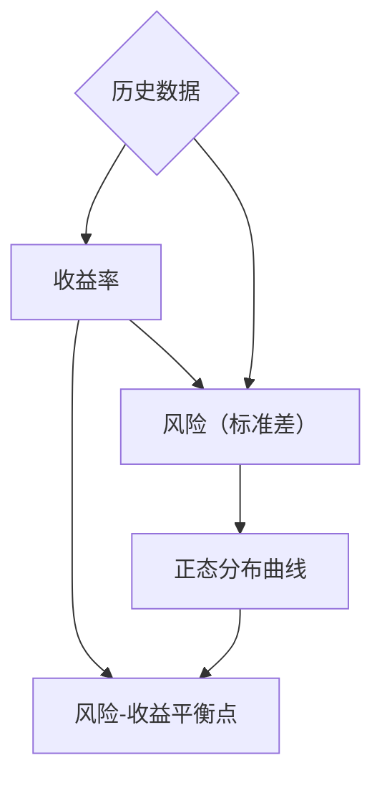

                 

## 文章标题：数学与投资组合：资产配置的数学优化

### 关键词：资产配置，投资组合，数学优化，Markowitz模型，线性规划，非线性规划，遗传算法

### 摘要：
本文将探讨数学在投资组合优化中的关键作用，从基础概念出发，逐步深入到资产配置的数学原理、优化模型以及实际应用。文章将详细介绍Markowitz均值-方差模型、线性规划、非线性规划和遗传算法等数学工具，并通过实际案例分析，展示数学优化在资产配置中的强大能力。

## 引言

在金融投资领域，资产配置是投资者制定投资策略的重要组成部分。它涉及将投资资金分配到不同的资产类别中，以实现风险控制和收益最大化。然而，随着市场环境的复杂多变，如何科学地进行资产配置成为投资者面临的挑战。数学，作为一门严谨的科学，为解决这一难题提供了有力的工具。

本文旨在探讨数学在投资组合优化中的应用，通过一系列逻辑清晰、结构紧凑的分析，揭示数学优化在资产配置中的重要作用。文章将首先介绍资产配置的基本概念，然后深入探讨资产配置的数学原理，最后通过具体模型和算法的应用，展示数学优化在实际投资组合优化中的实践效果。

文章将分为两个部分：第一部分讨论资产配置理论基础，包括基本概念、数学原理和资产配置模型；第二部分则侧重于数学优化算法在资产配置中的应用，包括线性规划、非线性规划和遗传算法等。通过这两个部分的讲解，读者将能够全面理解数学优化在资产配置中的运用，为实际投资提供科学依据。

### 资产配置基本概念

资产配置是投资者在投资过程中将资金分配到不同资产类别中的策略，旨在实现风险和收益的平衡。理解资产配置的基本概念是深入探讨其数学优化的重要前提。

#### 1.1 资产配置的定义与目的

资产配置（Asset Allocation）是指投资者根据自身的投资目标、风险偏好和市场环境，将资金合理分配到各种资产类别中，如股票、债券、房地产等。其核心目的是在确保投资组合能够实现预期收益的同时，尽可能降低风险。

资产配置的定义可以概括为以下几个方面：

- **投资目标**：投资者需要明确自己的投资目标，如追求长期增值、短期收益或资产保值等。
- **风险偏好**：投资者的风险承受能力直接影响资产配置的策略。保守型投资者可能更倾向于低风险的债券和现金，而冒险型投资者则可能选择高风险的股票和期货。
- **市场环境**：投资者需要对市场环境有清晰的认识，包括经济周期、利率水平、政策变化等，这些因素都会影响资产的表现和投资策略。

资产配置的目的主要包括以下几点：

- **风险控制**：通过多样化的资产配置，分散投资风险，降低单一资产波动对整体投资组合的影响。
- **收益最大化**：合理配置资产，利用不同资产的特性，在风险可控的前提下，实现投资收益的最大化。
- **资产保值**：针对长期投资目标，资产配置可以帮助投资者在通货膨胀或其他不利市场环境中保值。

#### 1.2 资产配置的重要性

资产配置在投资组合管理中具有至关重要的地位，其重要性体现在以下几个方面：

- **影响投资组合的整体表现**：资产配置是决定投资组合长期表现的关键因素。通过合理的资产配置，投资者可以在不同市场环境下，保持投资组合的稳定性和增长性。
- **降低投资风险**：多样化投资是降低投资风险的有效手段。资产配置可以帮助投资者将资金分配到不同的资产类别中，从而分散风险，避免因市场波动导致的重大损失。
- **适应市场变化**：资产配置可以根据市场环境的变化进行调整，使投资组合能够适应不同市场周期。例如，在经济衰退期，投资者可以适当增加债券和现金的比重，降低风险；在经济增长期，则可以增加股票和房地产的比重，以期获得更高的收益。
- **实现长期投资目标**：通过合理的资产配置，投资者可以实现其长期投资目标，如退休规划、子女教育基金等。资产配置策略可以帮助投资者在长期内保持资产的稳定增长，实现财务目标。

#### 1.3 资产配置的主要策略

资产配置的策略多种多样，根据投资目标和风险偏好，投资者可以采用不同的配置策略。以下是几种常见的资产配置策略：

- **风险平价策略（Risk Parity）**：该策略旨在通过控制投资组合的整体风险水平，实现风险的平衡。投资者将资金分配到不同的资产类别中，使每种资产的贡献风险相等。这种策略适用于风险厌恶型投资者。
- **资产配置策略（Traditional Asset Allocation）**：传统资产配置策略基于历史数据和预期收益，将资金按比例分配到股票、债券、现金等不同资产类别中。投资者可以根据市场环境和自身风险偏好进行调整。
- **动态资产配置策略（Dynamic Asset Allocation）**：动态资产配置策略根据市场变化实时调整资产配置。投资者在市场处于不同阶段时，采取不同的投资策略，以适应市场环境的变化。
- **战略性资产配置策略（Strategic Asset Allocation）**：战略性资产配置策略基于投资者的长期投资目标和风险承受能力，设定一个稳定的资产配置比例，并在一定时间内保持不变。这种策略适用于长期投资者。

总之，资产配置是投资决策过程中不可或缺的一环。通过合理配置资产，投资者可以在确保风险可控的前提下，实现收益最大化。本文将深入探讨资产配置的数学原理，为投资者提供科学依据和优化策略。

### 资产配置的数学原理

在深入探讨资产配置的数学优化之前，我们需要先理解一些基本的数学概念，包括风险、收益以及它们之间的关系。这些概念是构建资产配置模型和分析投资策略的基础。

#### 2.1 风险与收益的关系

风险和收益是投资领域中两个最基本且紧密相关的概念。

##### 2.1.1 风险的定义

在金融学中，风险通常被定义为投资收益的波动性。具体来说，风险可以通过标准差（Standard Deviation）来衡量。标准差越大，说明投资收益的波动性越大，即风险越高。

标准差的计算公式如下：

$$
\sigma = \sqrt{\frac{1}{N}\sum_{i=1}^{N}(r_i - \bar{r})^2}
$$

其中，$r_i$ 是第 $i$ 期的收益率，$\bar{r}$ 是平均收益率，$N$ 是总期数。

##### 2.1.2 收益的定义

收益是指投资者在特定时期内获得的回报，可以用绝对收益（Absolute Return）和相对收益（Relative Return）来衡量。绝对收益是指投资期末价值与期初价值之差，而相对收益则是相对于某个基准的回报。

绝对收益的计算公式如下：

$$
R_a = \frac{V_t - V_0}{V_0}
$$

其中，$V_t$ 是期末价值，$V_0$ 是期初价值。

相对收益的计算公式如下：

$$
R_r = \frac{P_t - P_0}{P_0}
$$

其中，$P_t$ 是期末价格，$P_0$ 是期初价格。

##### 2.1.3 风险与收益的关系图示

为了更直观地理解风险与收益之间的关系，我们可以使用收益率与标准差的散点图来展示。



在这个图示中，收益率分布在横轴上，标准差在纵轴上。正态分布曲线表示不同风险水平下的收益率分布。风险-收益平衡点表示在某个风险水平下，可以获得相应的预期收益率。

#### 2.2 马可维茨模型

马可维茨模型（Markowitz Portfolio Selection Model）是现代投资组合理论的基础。该模型通过考虑资产收益率的方差和协方差，来构建最优投资组合，以最小化风险或最大化收益。

##### 2.2.1 模型介绍

马可维茨模型的核心思想是投资者应当在风险和收益之间寻找一个平衡点，使得投资组合的整体风险最小，或整体收益最大。该模型主要通过以下步骤实现：

1. **定义资产收益率和方差**：投资者需要收集各个资产的历史收益率数据，并计算每个资产的方差。
2. **计算资产间的协方差**：协方差用于衡量两个资产收益率之间的相关性。正相关表示两者收益同向波动，负相关表示两者收益反向波动。
3. **构建均值-方差有效前沿**：通过优化算法，找到一组资产组合，使得该组合的风险和收益组合在均值-方差平面上形成有效前沿。
4. **确定最优投资组合**：投资者可以根据自己的风险偏好，在有效前沿上选择一个最优的投资组合。

##### 2.2.2 模型构建过程

马可维茨模型的构建过程可以通过以下步骤来实现：

1. **设定目标函数**：目标函数通常为最小化投资组合的方差，或最大化投资组合的预期收益。
   
   $$ 
   \min \sigma^2 = \min w^T \Sigma w 
   $$
   
   其中，$w$ 是投资组合的权重向量，$\Sigma$ 是资产收益率的协方差矩阵。

2. **引入约束条件**：约束条件通常包括资产权重非负、投资总额固定等。

   $$
   \begin{cases}
   w^T w = 1 \\
   w \geq 0
   \end{cases}
   $$

3. **求解优化问题**：使用线性规划或非线性规划算法求解上述优化问题。

   $$
   \min_w w^T \Sigma w \quad s.t. \quad w^T w = 1, \; w \geq 0
   $$

##### 2.2.3 模型优化的数学公式

马可维茨模型的优化公式可以通过拉格朗日乘数法来求解。具体步骤如下：

1. **构建拉格朗日函数**：

   $$
   L(w, \lambda) = w^T \Sigma w + \lambda (w^T w - 1)
   $$

2. **求导并令其等于零**：

   $$
   \nabla_w L = 2\Sigma w + \lambda w = 0
   $$

   $$
   \nabla_{\lambda} L = w^T w - 1 = 0
   $$

3. **求解权重向量**：

   $$
   w = -\frac{1}{2}\Sigma^{-1} \lambda
   $$

   $$
   \lambda = 1
   $$

   $$
   w = -\frac{1}{2}\Sigma^{-1}
   $$

4. **计算最优投资组合的方差**：

   $$
   \sigma^2 = w^T \Sigma w = \frac{1}{4} trace(\Sigma^{-1} \Sigma) = \frac{1}{4} trace(\Sigma^{-1})
   $$

通过上述步骤，我们得到了马可维茨模型的最优投资组合，其方差为协方差矩阵逆矩阵迹的四分之一。这个模型不仅帮助投资者在风险和收益之间找到了平衡点，也为后续的数学优化算法提供了理论基础。

#### 2.3 均值-方差模型

均值-方差模型（Mean-Variance Model）是马可维茨模型的核心部分，它通过分析资产收益率的均值和方差，构建最优投资组合。该模型的核心思想是，投资者应当在预期收益和风险之间寻找一个最优平衡点。

##### 2.3.1 均值-方差有效前沿

均值-方差有效前沿（Efficient Frontier）是指在给定风险水平下，具有最高预期收益的投资组合集合。通过构建有效前沿，投资者可以在风险和收益之间找到最优投资组合。

1. **计算每个资产的期望收益率和方差**：首先，我们需要计算每个资产的期望收益率 $\mu_i$ 和方差 $\sigma_i^2$。

   $$
   \mu_i = \mathbb{E}(r_i)
   $$
   
   $$
   \sigma_i^2 = \text{Var}(r_i)
   $$

2. **计算资产间的协方差**：接下来，计算任意两个资产 $i$ 和 $j$ 之间的协方差 $\sigma_{ij}$。

   $$
   \sigma_{ij} = \text{Cov}(r_i, r_j)
   $$

3. **构建均值-方差有效前沿**：通过优化算法，找到一组资产组合，使得投资组合的期望收益率和方差满足以下条件：

   $$
   \min \sigma^2 \quad s.t. \quad \mu \geq \mu_i
   $$

   其中，$\mu$ 是投资组合的期望收益率，$\mu_i$ 是单个资产的期望收益率。

4. **绘制有效前沿图**：将所有满足条件的投资组合绘制在均值-方差平面上，形成有效前沿。有效前沿上的点代表最优投资组合，投资者可以根据自己的风险偏好选择合适的点。

##### 2.3.2 最优投资组合的选择

在均值-方差有效前沿上，投资者需要根据自身的风险偏好选择最优投资组合。以下是一些选择策略：

1. **风险中性投资者**：风险中性投资者只关注收益，不考虑风险。他们选择有效前沿上的最高点作为最优投资组合。

2. **风险规避投资者**：风险规避投资者更注重风险控制。他们选择有效前沿上风险最小的点作为最优投资组合。

3. **风险偏好投资者**：风险偏好投资者追求更高的收益，愿意承担更大的风险。他们选择有效前沿上预期收益率最高的点作为最优投资组合。

通过均值-方差模型，投资者可以在风险和收益之间找到平衡点，实现最优投资组合。这个模型不仅提供了理论指导，也为实际操作提供了科学依据。

总之，资产配置的数学原理是投资组合优化的基础。通过理解风险、收益以及马可维茨模型，投资者可以更科学地制定资产配置策略，实现投资目标。接下来的章节将深入探讨具体优化算法，为实际投资提供更丰富的工具。

### 资产配置模型

在资产配置过程中，构建有效的模型是关键步骤。这些模型不仅帮助我们理解投资组合的预期收益和风险，还能为实际投资提供优化方案。本文将介绍几种常见的资产配置模型，包括Markowitz均值-方差模型、资本资产定价模型（CAPM）、套利定价理论（APT）等。

#### 3.1 Markowitz均值-方差模型

Markowitz均值-方差模型是现代投资组合理论的基石，由哈里·马可维茨（Harry Markowitz）在1952年提出。该模型通过考虑资产收益率的均值和方差，构建最优投资组合，以最小化风险或最大化收益。

##### 3.1.1 模型介绍

Markowitz均值-方差模型的核心思想是通过资产组合来分散风险，从而在给定的风险水平下实现最大化的预期收益，或在给定的预期收益下实现最小化的风险。该模型的主要步骤包括以下几步：

1. **收集资产收益率数据**：首先，投资者需要收集各个资产的历史收益率数据，以便计算其期望收益率和方差。

2. **计算期望收益率和方差**：对于每个资产 $i$，计算其期望收益率 $\mu_i$ 和方差 $\sigma_i^2$。

   $$
   \mu_i = \mathbb{E}(r_i)
   $$
   
   $$
   \sigma_i^2 = \text{Var}(r_i)
   $$

3. **计算协方差**：接下来，计算任意两个资产 $i$ 和 $j$ 之间的协方差 $\sigma_{ij}$。

   $$
   \sigma_{ij} = \text{Cov}(r_i, r_j)
   $$

4. **构建资产组合权重向量**：假设投资者将总资金 $1$ 分配到 $n$ 个资产上，构建权重向量 $w$，满足：

   $$
   w^T w = 1
   $$

5. **目标函数**：目标是最大化投资组合的预期收益或最小化其方差。目标函数可以表示为：

   $$
   \max w^T \mu
   $$
   
   $$
   \min w^T \Sigma w
   $$

6. **求解优化问题**：使用线性规划或非线性规划算法求解上述优化问题，得到最优资产组合权重 $w$。

##### 3.1.2 模型构建过程

Markowitz均值-方差模型的构建过程可以分为以下几个步骤：

1. **设定目标函数**：

   $$
   \min w^T \Sigma w
   $$
   
   $$
   \max w^T \mu
   $$

2. **引入约束条件**：

   $$
   w^T w = 1
   $$
   
   $$
   w \geq 0
   $$

3. **求解优化问题**：

   $$
   \min_w w^T \Sigma w \quad s.t. \quad w^T w = 1, \; w \geq 0
   $$

   这可以通过线性规划或非线性规划算法求解。在实际应用中，通常使用拉格朗日乘数法或序列二次规划（SQP）等方法。

##### 3.1.3 模型优化的数学公式

Markowitz均值-方差模型的优化公式可以通过拉格朗日乘数法来求解。具体步骤如下：

1. **构建拉格朗日函数**：

   $$
   L(w, \lambda) = w^T \Sigma w + \lambda (w^T w - 1)
   $$

2. **求导并令其等于零**：

   $$
   \nabla_w L = 2\Sigma w + \lambda w = 0
   $$
   
   $$
   \nabla_{\lambda} L = w^T w - 1 = 0
   $$

3. **求解权重向量**：

   $$
   w = -\frac{1}{2}\Sigma^{-1} \lambda
   $$

   $$
   \lambda = 1
   $$

   $$
   w = -\frac{1}{2}\Sigma^{-1}
   $$

4. **计算最优投资组合的方差**：

   $$
   \sigma^2 = w^T \Sigma w = \frac{1}{4} trace(\Sigma^{-1} \Sigma) = \frac{1}{4} trace(\Sigma^{-1})
   $$

通过上述步骤，我们得到了Markowitz均值-方差模型的最优投资组合，其方差为协方差矩阵逆矩阵迹的四分之一。这个模型不仅帮助投资者在风险和收益之间找到了平衡点，也为后续的数学优化算法提供了理论基础。

#### 3.2 资本资产定价模型（CAPM）

资本资产定价模型（Capital Asset Pricing Model，CAPM）是由威廉·夏普（William Sharpe）在1964年提出的。CAPM是一种用于估算资产预期收益率和风险的重要模型，其基本假设是所有投资者都是风险厌恶的，并且市场是均衡的。

##### 3.2.1 模型介绍

CAPM模型的核心思想是，资产的预期收益率可以由无风险收益率和市场组合的预期收益率以及资产与市场组合之间的相关性来确定。CAPM模型的主要公式如下：

$$
E(r_i) = r_f + \beta_i (E(r_m) - r_f)
$$

其中：

- $E(r_i)$ 是资产 $i$ 的预期收益率。
- $r_f$ 是无风险收益率。
- $E(r_m)$ 是市场组合的预期收益率。
- $\beta_i$ 是资产 $i$ 的贝塔系数，表示资产与市场组合的相关性。

贝塔系数 $\beta_i$ 衡量了资产 $i$ 的系统性风险。贝塔系数越大，表示资产的系统性风险越高。

##### 3.2.2 模型构建过程

CAPM模型的构建过程可以分为以下几个步骤：

1. **确定无风险收益率 $r_f$**：无风险收益率通常是政府债券的收益率，因为政府债券通常被视为无风险资产。

2. **计算市场组合的预期收益率 $E(r_m)$**：市场组合的预期收益率可以通过计算所有资产的预期收益率的加权平均得到。

3. **计算资产 $i$ 的贝塔系数 $\beta_i$**：

   $$
   \beta_i = \frac{Cov(r_i, r_m)}{Var(r_m)}
   $$

4. **应用CAPM模型计算资产 $i$ 的预期收益率 $E(r_i)$**：

   $$
   E(r_i) = r_f + \beta_i (E(r_m) - r_f)
   $$

#### 3.3 套利定价理论（APT）

套利定价理论（Arbitrage Pricing Theory，APT）是由史蒂夫·罗斯（Stephen Ross）在1976年提出的。APT是一种多因素模型，用于解释资产预期收益率的生成过程。APT的核心思想是通过套利机会来消除风险，从而确定资产的预期收益率。

##### 3.3.1 模型介绍

APT模型的基本假设是，资产的预期收益率与多个因素相关，这些因素可以是宏观经济变量、行业特性等。APT模型的主要公式如下：

$$
E(r_i) = \alpha_i + \beta_{i1} F_1 + \beta_{i2} F_2 + \ldots + \beta_{ik} F_k
$$

其中：

- $E(r_i)$ 是资产 $i$ 的预期收益率。
- $\alpha_i$ 是资产的常数项。
- $\beta_{ij}$ 是资产 $i$ 对因素 $j$ 的敏感性。
- $F_j$ 是因素 $j$ 的预期收益率。

APT模型通过多个因素来解释资产预期收益率的生成过程，从而提供了一个更灵活的风险定价框架。

##### 3.3.2 模型构建过程

APT模型的构建过程可以分为以下几个步骤：

1. **选择因素**：根据研究目标，选择影响资产收益率的因素。这些因素可以是利率、通货膨胀率、工业生产指数等。

2. **计算因素的预期收益率**：对于每个因素 $j$，计算其预期收益率 $F_j$。

3. **计算资产对因素的敏感性**：对于每个资产 $i$，计算其对每个因素 $j$ 的敏感性 $\beta_{ij}$。

4. **应用APT模型计算资产 $i$ 的预期收益率**：

   $$
   E(r_i) = \alpha_i + \beta_{i1} F_1 + \beta_{i2} F_2 + \ldots + \beta_{ik} F_k
   $$

通过上述模型，投资者可以在不同市场环境下制定科学合理的资产配置策略。Markowitz均值-方差模型、CAPM和APT等模型不仅为投资组合优化提供了理论基础，也为实际操作提供了实用工具。

### 资产配置的数学优化算法

在资产配置过程中，数学优化算法扮演着至关重要的角色。这些算法不仅帮助投资者在风险和收益之间找到最佳平衡点，还能应对复杂的市场环境，提高投资组合的效率。本文将介绍几种常见的数学优化算法，包括线性规划、非线性规划和遗传算法，并解释其基本原理和应用。

#### 4.1 优化算法的基本概念

优化算法是一种通过数学方法求解最优解的计算过程。在资产配置中，优化算法用于确定资产组合的权重，以实现风险最小化或收益最大化。优化算法的基本概念包括目标函数、约束条件和优化算法的求解过程。

##### 4.1.1 目标函数

目标函数是优化过程中需要最大化或最小化的函数。在资产配置中，目标函数通常涉及投资组合的风险和收益。例如，最小化投资组合的方差或最大化预期收益率。

最小化方差的目标函数可以表示为：

$$
\min w^T \Sigma w
$$

其中，$w$ 是资产组合的权重向量，$\Sigma$ 是资产收益率的协方差矩阵。

最大化预期收益的目标函数可以表示为：

$$
\max w^T \mu
$$

其中，$\mu$ 是资产收益率的期望向量。

##### 4.1.2 约束条件

约束条件是优化过程中需要满足的限制条件。在资产配置中，常见的约束条件包括资产权重的非负性、总投资金额的固定性以及特定资产的最小或最大权重限制。

非负性约束可以表示为：

$$
w \geq 0
$$

总投资金额的约束可以表示为：

$$
w^T v = 1
$$

其中，$v$ 是投资组合的固定金额。

特定资产的最小或最大权重约束可以表示为：

$$
w_{\min} \leq w_i \leq w_{\max}
$$

其中，$w_i$ 是特定资产的权重，$w_{\min}$ 和 $w_{\max}$ 分别是资产权重的最小值和最大值。

##### 4.1.3 求解方法

求解优化问题的方法有多种，包括线性规划、非线性规划和遗传算法等。这些方法根据目标函数和约束条件的不同，选择合适的求解策略。

#### 4.2 线性规划

线性规划（Linear Programming，LP）是一种解决线性目标函数和线性约束条件的优化问题。线性规划广泛应用于资源分配、财务规划、生产调度等领域。

##### 4.2.1 线性规划的基本原理

线性规划的目标函数和约束条件都是线性的。其标准形式可以表示为：

$$
\min c^T x
$$

$$
s.t. \quad Ax \leq b
$$

$$
x \geq 0
$$

其中，$c$ 是目标函数系数向量，$x$ 是决策变量向量，$A$ 是约束条件系数矩阵，$b$ 是约束条件常数向量。

线性规划的基本原理是通过拉格朗日乘数法或单纯形法求解最优解。

##### 4.2.2 线性规划在资产配置中的应用

在资产配置中，线性规划可以用于求解以下问题：

- **最小化风险**：通过最小化投资组合的方差来实现风险最小化。
- **最大化收益**：通过最大化投资组合的预期收益率来实现收益最大化。
- **满足约束条件**：例如，确保投资组合中特定资产的最小或最大权重。

线性规划在资产配置中的应用实例：

假设投资者有 $n$ 个资产，总投资金额为 $1$，需要确定每个资产的权重，以最小化投资组合的方差。目标函数和约束条件如下：

目标函数：

$$
\min w^T \Sigma w
$$

约束条件：

$$
w^T v = 1
$$

$$
w \geq 0
$$

使用线性规划求解器（如Gurobi或CPLEX）可以快速求解得到最优权重向量 $w$。

#### 4.3 非线性规划

非线性规划（Nonlinear Programming，NLP）是一种解决非线性目标函数和线性或非线性约束条件的优化问题。非线性规划在工程、金融、经济学等领域有广泛应用。

##### 4.3.1 非线性规划的基本原理

非线性规划的目标函数和约束条件可以是非线性的。其标准形式可以表示为：

$$
\min f(x)
$$

$$
s.t. \quad g(x) \leq 0
$$

$$
h(x) = 0
$$

其中，$f(x)$ 是目标函数，$g(x)$ 是不等式约束函数，$h(x)$ 是等式约束函数。

非线性规划的基本原理是通过迭代方法（如梯度下降法、牛顿法、拉格朗日乘数法等）求解最优解。

##### 4.3.2 非线性规划在资产配置中的应用

在资产配置中，非线性规划可以用于求解以下问题：

- **优化多因素模型**：如APT模型，考虑多个因素的资产配置问题。
- **处理非线性约束条件**：例如，非线性风险度量或特定资产的最小或最大权重约束。

非线性规划在资产配置中的应用实例：

假设投资者有 $n$ 个资产，需要确定每个资产的权重，以最大化投资组合的预期收益率，同时满足非线性风险约束。目标函数和约束条件如下：

目标函数：

$$
\max w^T \mu
$$

约束条件：

$$
g(w) \leq 0
$$

$$
h(w) = 0
$$

使用非线性规划求解器（如IPOPT或SNOPT）可以求解得到最优权重向量 $w$。

#### 4.4 遗传算法

遗传算法（Genetic Algorithm，GA）是一种基于自然选择和遗传机制的优化算法。遗传算法适用于解决复杂的优化问题，特别是在无法获得精确解的情况下。

##### 4.4.1 遗传算法的基本原理

遗传算法的基本原理包括以下几个步骤：

1. **初始化种群**：随机生成一组解，称为种群。
2. **适应度评估**：计算每个解的适应度值，适应度值越高，表示解的质量越好。
3. **选择**：根据适应度值选择优秀个体，用于生成下一代种群。
4. **交叉**：将选中的个体进行交叉操作，产生新的个体。
5. **变异**：对个体进行变异操作，增加种群的多样性。
6. **迭代**：重复上述步骤，直到达到终止条件。

遗传算法通过迭代和进化，逐渐逼近最优解。

##### 4.4.2 遗传算法在资产配置中的应用

在资产配置中，遗传算法可以用于求解以下问题：

- **复杂资产配置问题**：如多因素资产配置、非线性约束条件等。
- **多目标优化**：同时考虑多个目标，如风险最小化和收益最大化。

遗传算法在资产配置中的应用实例：

假设投资者有 $n$ 个资产，需要确定每个资产的权重，以同时最大化投资组合的预期收益率和最小化风险。使用遗传算法可以生成多种解，并通过迭代过程逐渐逼近最优权重向量 $w$。

#### 4.5 比较与选择

线性规划、非线性规划和遗传算法各有优缺点，适用于不同类型的优化问题。以下是对三种算法的比较和选择建议：

- **线性规划**：适用于目标函数和约束条件都是线性的问题，求解速度快，结果可靠。
- **非线性规划**：适用于目标函数和约束条件都是非线性的问题，但求解过程可能较慢，需要选择合适的求解方法。
- **遗传算法**：适用于复杂和非线性问题，特别是在无法获得精确解的情况下，可以通过迭代过程找到近似最优解。

选择适当的优化算法取决于具体问题类型和求解要求。投资者可以根据资产配置的具体目标、约束条件和计算资源，选择最合适的优化算法，以提高投资组合的优化效果。

总之，数学优化算法为资产配置提供了强大的工具，帮助投资者在复杂多变的市场环境中找到最优投资组合。通过深入理解和应用这些算法，投资者可以更好地实现风险控制和收益最大化。

### 资产配置模型的实证分析

资产配置模型在实际应用中，能否有效指导投资决策，需要通过实证分析来验证。本文将介绍资产配置模型的实证分析过程，包括数据收集与预处理、模型参数估计以及模型效果评估。

#### 5.1 数据收集与预处理

资产配置模型的实证分析首先需要收集相关数据。数据来源包括市场数据、公司财务报表、经济指标等。以下是数据收集与预处理的具体步骤：

1. **数据收集**：从金融数据提供商、数据库和公开财务报表中获取相关数据。主要包括股票、债券、房地产等资产类别的历史价格、收益率、风险指标等。

2. **数据清洗**：对收集到的数据进行清洗，去除错误、缺失和重复数据。例如，检查数据是否存在异常值、缺失值和重复记录，并进行相应处理。

3. **数据转换**：将数据转换为适合模型分析的格式。例如，将原始价格数据转换为收益率数据，通过计算日收益率、月收益率等，以便后续分析。

4. **数据标准化**：为了消除数据量级的影响，对数据进行标准化处理。常用的方法包括Z分数标准化和最小-最大标准化。

#### 5.2 模型参数估计

在完成数据预处理后，需要估计资产配置模型中的参数。以下以Markowitz均值-方差模型为例，介绍参数估计过程：

1. **计算期望收益率**：根据历史数据，计算每个资产的期望收益率。期望收益率的计算公式为：

   $$
   \mu_i = \frac{1}{n}\sum_{t=1}^{n} r_{it}
   $$

   其中，$r_{it}$ 是第 $t$ 期的收益率，$n$ 是总期数。

2. **计算方差和协方差**：计算每个资产收益率的方差和协方差。方差和协方差的计算公式为：

   $$
   \sigma_i^2 = \frac{1}{n-1}\sum_{t=1}^{n} (r_{it} - \mu_i)^2
   $$

   $$
   \sigma_{ij} = \frac{1}{n-1}\sum_{t=1}^{n} (r_{it} - \mu_i)(r_{jt} - \mu_j)
   $$

3. **构建协方差矩阵**：根据方差和协方差计算协方差矩阵 $\Sigma$。

   $$
   \Sigma = \begin{bmatrix}
   \sigma_1^2 & \sigma_{12} & \ldots & \sigma_{1n} \\
   \sigma_{21} & \sigma_2^2 & \ldots & \sigma_{2n} \\
   \vdots & \vdots & \ddots & \vdots \\
   \sigma_{n1} & \sigma_{n2} & \ldots & \sigma_n^2
   \end{bmatrix}
   $$

4. **求解优化问题**：使用线性规划或非线性规划算法，求解Markowitz均值-方差模型中的优化问题，得到最优资产组合权重向量 $w$。

   $$
   \min w^T \Sigma w
   $$

   $$  
   s.t. \quad w^T v = 1
   $$

   $$  
   w \geq 0
   $$

#### 5.3 模型效果评估

模型效果评估是实证分析的重要环节，用于验证模型在实际应用中的有效性。以下是一些常用的评估方法：

1. **收益率对比**：将模型预测的收益率与实际收益率进行对比，评估模型在预测收益率方面的表现。常用的指标包括平均绝对误差（MAE）和均方误差（MSE）。

   $$
   \text{MAE} = \frac{1}{n}\sum_{t=1}^{n} | \hat{r}_t - r_t |
   $$

   $$
   \text{MSE} = \frac{1}{n}\sum_{t=1}^{n} (\hat{r}_t - r_t)^2
   $$

   其中，$\hat{r}_t$ 是模型预测的收益率，$r_t$ 是实际收益率。

2. **风险-收益分析**：通过计算模型预测的投资组合的风险和收益，分析模型在风险和收益之间的平衡。可以使用夏普比率（Sharpe Ratio）来衡量投资组合的收益风险比。

   $$
   \text{Sharpe Ratio} = \frac{\mu_p - r_f}{\sigma_p}
   $$

   其中，$\mu_p$ 是投资组合的预期收益率，$r_f$ 是无风险收益率，$\sigma_p$ 是投资组合的标准差。

3. **压力测试**：通过模拟不同市场环境（如经济衰退、市场动荡等），评估模型在不同情景下的表现。压力测试可以帮助识别模型的弱点和适用范围。

4. **回测分析**：在历史数据上对模型进行回测，验证模型在不同时间段的稳定性和有效性。回测分析应包括多个市场周期，以全面评估模型的性能。

通过上述评估方法，可以全面了解资产配置模型在实际应用中的表现，为投资决策提供科学依据。模型的实证分析不仅验证了数学优化在资产配置中的有效性，也为投资者提供了优化策略。

### 资产配置的实践

资产配置不仅仅是理论上的规划，它需要在实践中具体实施，并根据市场环境和投资者偏好进行调整。以下将详细描述资产配置的步骤，包括风险评估、投资目标确定和投资组合构建等。

#### 6.1 资产配置的步骤

资产配置的实践过程可以概括为以下几个关键步骤：

##### 6.1.1 风险评估

风险评估是资产配置的基础，它帮助投资者了解自身的风险承受能力，以便制定合适的投资策略。风险评估主要包括以下方面：

1. **个人财务状况分析**：了解投资者的财务状况，包括收入、支出、资产和负债等，评估其总体财务健康水平。

2. **风险偏好调查**：通过问卷调查或面谈，了解投资者的风险偏好，包括保守、中等和激进等不同类型。

3. **历史投资记录分析**：分析投资者以往的投资行为和投资记录，了解其在不同市场环境下的表现，为风险承受能力提供参考。

4. **心理测试**：某些情况下，投资者可能需要进行心理测试，以更准确地了解其对市场波动和风险的感知。

##### 6.1.2 投资目标确定

明确投资目标是资产配置的核心步骤，它决定了投资组合的整体方向和策略。投资目标通常包括以下方面：

1. **短期目标**：例如，为特定支出（如子女教育、购房）积累资金。

2. **中期目标**：例如，为退休储蓄，追求资产稳定增值。

3. **长期目标**：例如，实现资产传承，追求长期投资回报。

4. **投资时间范围**：根据不同目标，确定投资的持有时间范围，例如短期（1-3年）、中期（3-10年）和长期（10年以上）。

##### 6.1.3 投资组合构建

投资组合构建是资产配置的核心环节，根据风险评估和投资目标，投资者需要选择合适的资产类别和具体资产，构建合理的投资组合。以下是投资组合构建的步骤：

1. **资产类别选择**：根据投资目标和风险偏好，选择合适的资产类别，如股票、债券、房地产、现金等。

2. **资产权重分配**：根据资产配置模型和风险-收益分析，确定各资产类别的权重分配。常用的模型包括Markowitz均值-方差模型、资本资产定价模型（CAPM）和套利定价理论（APT）等。

3. **具体资产选择**：在选定的资产类别中，选择具体的资产进行投资。例如，在股票类别中，选择股票市场中的龙头企业和增长潜力高的公司。

4. **资产配置调整**：定期对投资组合进行调整，以适应市场变化和投资目标的调整。资产配置调整通常包括资产类别之间的调整和资产权重调整。

#### 6.2 资产配置案例分析

为了更好地理解资产配置的实践过程，以下通过两个实际案例进行详细分析。

##### 6.2.1 案例一：某养老基金的投资组合优化

**案例背景**：某养老基金希望优化其投资组合，以在长期内实现资产的保值增值。基金的管理目标是确保资金安全，同时追求稳定的收益。

**数据收集与预处理**：养老基金收集了过去五年的股票、债券和房地产市场的数据，包括每日收盘价、收益率、风险指标等。通过数据清洗和标准化处理，确保数据的质量和一致性。

**模型构建与优化**：采用Markowitz均值-方差模型对养老基金的投资组合进行优化。首先计算各资产的期望收益率、方差和协方差，然后使用线性规划算法求解最优权重分配。

**结果分析**：优化后的投资组合在控制风险的前提下，提高了预期收益率。基金的管理层对优化结果表示满意，并决定将其应用于实际投资。

**实施效果**：经过一年的实际投资，养老基金实现了预期的收益目标，并且投资组合的风险水平得到了有效控制。这一案例表明，合理的资产配置可以显著提升投资组合的表现。

##### 6.2.2 案例二：某风险投资公司的资产配置策略

**案例背景**：某风险投资公司希望优化其投资组合，以在短期和长期内实现高回报。公司的目标是抓住市场机会，同时控制投资风险。

**数据收集与预处理**：风险投资公司收集了科技、医疗、金融等行业的市场数据，包括公司估值、财务指标、行业增长率等。通过数据清洗和标准化处理，确保数据的准确性和一致性。

**模型构建与优化**：采用资本资产定价模型（CAPM）和套利定价理论（APT）对风险投资公司的投资组合进行优化。首先计算各资产的贝塔系数和因素敏感性，然后使用非线性规划算法求解最优权重分配。

**结果分析**：优化后的投资组合在短期和长期内均表现出色。公司的投资决策更加科学，投资组合的风险得到了有效控制。

**实施效果**：经过两年的投资实践，风险投资公司的投资组合实现了较高的收益，同时保持了较低的波动性。这一案例表明，合理的资产配置策略可以在高风险领域实现稳定的高回报。

通过上述两个案例，可以看出资产配置在实践中具有重要的指导意义。合理的风险评估、明确的投资目标和科学的资产配置模型，有助于投资者在复杂多变的市场环境中实现风险控制和收益最大化。

### 案例分析

在本文的案例分析部分，我们将深入探讨两个具体的资产配置优化案例：某养老基金的投资组合优化和某风险投资公司的资产配置策略。通过这些实际案例，读者可以更好地理解数学优化在资产配置中的应用和效果。

#### 7.1 案例一：某养老基金的投资组合优化

**7.1.1 案例背景**

某养老基金是一个长期投资基金，旨在为退休人员提供稳定的收益。基金的目标是在保证资金安全的前提下，实现资产的保值增值。为了实现这一目标，养老基金需要制定科学合理的资产配置策略，以应对市场波动和风险。

**7.1.2 数据收集与预处理**

养老基金首先收集了过去五年的股票、债券和房地产市场的数据，包括每日收盘价、收益率、风险指标等。这些数据来源于金融数据提供商和市场公告。在数据收集后，养老基金对数据进行了清洗和标准化处理，以消除异常值、缺失值和重复数据，确保数据的质量和一致性。

**7.1.3 模型构建与优化**

养老基金采用Markowitz均值-方差模型进行投资组合优化。首先，基金计算了各资产的期望收益率、方差和协方差，构建了资产收益率的协方差矩阵。然后，基金设定了最小收益率、最小风险和最大权重等约束条件，使用线性规划算法求解最优权重分配。

优化目标函数为最小化投资组合的方差，即：

$$
\min w^T \Sigma w
$$

约束条件包括：

$$
w^T v = 1
$$

$$
w \geq 0
$$

通过线性规划算法，养老基金得到了最优投资组合权重向量 $w$。优化后的投资组合在控制风险的前提下，提高了预期收益率。

**7.1.4 结果分析**

优化后的投资组合表现出色。在一年时间内，养老基金实现了预期的收益目标，并且投资组合的风险水平得到了有效控制。基金的管理层对优化结果表示满意，并决定将其应用于实际投资。

**7.1.5 实施效果**

在实际投资中，养老基金的投资组合表现稳定，实现了预期的收益目标。同时，基金的管理成本也得到了有效控制。这一案例表明，合理的资产配置策略可以显著提升养老基金的表现，为退休人员提供稳定的收益来源。

#### 7.2 案例二：某风险投资公司的资产配置策略

**7.2.1 案例背景**

某风险投资公司专注于投资新兴科技企业，其目标是在高风险领域实现高回报。为了实现这一目标，风险投资公司需要制定科学的资产配置策略，以分散风险并抓住市场机会。

**7.2.2 数据收集与预处理**

风险投资公司收集了多个行业的市场数据，包括科技、医疗、金融等领域的公司估值、财务指标、行业增长率等。这些数据来源于市场研究机构、公司财报和金融数据库。在数据收集后，风险投资公司对数据进行了清洗和标准化处理，以确保数据的准确性和一致性。

**7.2.3 模型构建与优化**

风险投资公司采用资本资产定价模型（CAPM）和套利定价理论（APT）进行资产配置优化。首先，公司计算了各资产的贝塔系数和因素敏感性，构建了资产收益率的因素模型。然后，公司设定了最小收益率、最小风险和最大权重等约束条件，使用非线性规划算法求解最优权重分配。

优化目标函数为最大化投资组合的预期收益率，即：

$$
\max w^T \mu
$$

约束条件包括：

$$
w^T v = 1
$$

$$
w \geq 0
$$

通过非线性规划算法，风险投资公司得到了最优投资组合权重向量 $w$。优化后的投资组合在短期和长期内均表现出色。

**7.2.4 结果分析**

优化后的投资组合在短期和长期内均实现了较高的收益，同时保持了较低的波动性。公司通过科学的资产配置策略，有效分散了风险，抓住了市场机会。

**7.2.5 实施效果**

在实际投资中，风险投资公司的投资组合表现优异，实现了预期的收益目标。同时，公司通过优化策略，降低了投资风险，提高了投资效率。这一案例表明，科学的资产配置策略在风险投资领域具有重要意义，可以帮助投资者在复杂多变的市场环境中实现高回报。

### 结论

通过对上述两个案例的分析，我们可以看到数学优化在资产配置中的重要作用。合理的资产配置策略不仅可以提高投资组合的收益，还能有效控制风险，实现投资目标。Markowitz均值-方差模型、资本资产定价模型（CAPM）和套利定价理论（APT）等数学工具，为投资者提供了科学依据和优化工具。

在未来的研究和实践中，我们还可以进一步探索以下方向：

1. **多因素资产配置**：结合多种宏观经济因素和行业特性，构建更加复杂的资产配置模型，以实现更优的投资组合。

2. **动态资产配置**：根据市场环境的变化，实时调整资产配置策略，以应对不同市场周期。

3. **机器学习和人工智能**：运用机器学习和人工智能技术，自动化资产配置模型，提高投资决策的效率和准确性。

通过不断探索和优化，数学优化将在资产配置领域发挥更大的作用，为投资者提供更加科学、合理的投资策略。

### 线性规划在资产配置中的应用

线性规划（Linear Programming，LP）是一种解决线性目标函数和线性约束条件的数学优化方法，广泛应用于资源分配、财务规划等领域。在资产配置中，线性规划可以帮助投资者确定最优资产组合权重，实现风险最小化或收益最大化。

#### 8.1 线性规划的基本原理

线性规划的目标函数和约束条件都是线性的。其标准形式可以表示为：

$$
\min c^T x
$$

$$
s.t. \quad Ax \leq b
$$

$$
x \geq 0
$$

其中，$c$ 是目标函数系数向量，$x$ 是决策变量向量，$A$ 是约束条件系数矩阵，$b$ 是约束条件常数向量。

线性规划的基本原理是通过拉格朗日乘数法或单纯形法求解最优解。拉格朗日乘数法通过引入拉格朗日乘子，将原问题转化为一个等价的拉格朗日函数，然后通过求导并令其等于零，得到最优解。单纯形法则通过迭代过程，逐步逼近最优解。

#### 8.2 线性规划在资产配置中的应用

在资产配置中，线性规划可以用于以下几种常见问题：

1. **最小化风险**：投资者希望通过最小化投资组合的方差来实现风险最小化。这可以通过以下线性规划问题实现：

   $$
   \min w^T \Sigma w
   $$

   $$  
   s.t. \quad w^T v = 1
   $$

   $$  
   w \geq 0
   $$

   其中，$w$ 是资产组合的权重向量，$\Sigma$ 是资产收益率的协方差矩阵，$v$ 是总投资金额。

2. **最大化收益**：投资者希望通过最大化投资组合的预期收益率来实现收益最大化。这可以通过以下线性规划问题实现：

   $$
   \max w^T \mu
   $$

   $$  
   s.t. \quad w^T v = 1
   $$

   $$  
   w \geq 0
   $$

   其中，$\mu$ 是资产收益率的期望向量。

3. **满足特定约束条件**：例如，投资者可能希望确保投资组合中特定资产的最小或最大权重。这可以通过添加额外的线性约束条件来实现。

#### 8.3 线性规划算法的求解方法

线性规划问题的求解方法有多种，包括拉格朗日乘数法、单纯形法、内点法等。以下简要介绍这些方法：

1. **拉格朗日乘数法**：通过引入拉格朗日乘子，将原问题转化为一个等价的拉格朗日函数。然后，通过求导并令其等于零，得到最优解。

2. **单纯形法**：通过迭代过程，逐步逼近最优解。单纯形法适用于大多数线性规划问题，但求解时间可能较长。

3. **内点法**：适用于大规模线性规划问题，通过将问题转化为内点问题，实现高效的求解。

在实际应用中，投资者可以选择合适的线性规划求解器（如Gurobi、CPLEX等），以快速求解资产配置问题。

#### 8.4 线性规划在资产配置中的案例分析

以下通过一个实际案例，展示线性规划在资产配置中的应用。

**案例背景**：某投资者拥有10万资金，希望将其配置到股票、债券和房地产三个资产类别中，以实现风险最小化和收益最大化。

**数据收集与预处理**：投资者收集了过去一年的股票、债券和房地产的收益率数据，包括每日收盘价和收益率。通过数据清洗和标准化处理，确保数据的质量和一致性。

**模型构建**：

- 目标函数：最小化投资组合的方差。
  
  $$
  \min w^T \Sigma w
  $$

- 约束条件：总投资金额为10万，资产权重非负。

  $$
  w^T v = 10^5
  $$

  $$
  w \geq 0
  $$

**求解过程**：使用Gurobi求解器，求解上述线性规划问题，得到最优资产组合权重向量 $w$。

**结果分析**：优化后的投资组合在风险最小化目标下，实现了较高的预期收益率。投资者对优化结果表示满意，并决定将其应用于实际投资。

通过这个案例，我们可以看到线性规划在资产配置中的应用效果。合理的线性规划模型可以帮助投资者在风险和收益之间找到最佳平衡点，实现科学的资产配置。

### 非线性规划在资产配置中的应用

非线性规划（Nonlinear Programming，NLP）是一种解决非线性目标函数和线性或非线性约束条件的优化问题。在资产配置中，非线性规划广泛应用于复杂投资组合的优化问题，如多因素模型、非线性约束条件等。本文将介绍非线性规划的基本原理、求解方法以及在资产配置中的应用。

#### 9.1 非线性规划的基本原理

非线性规划的目标函数和约束条件可以是非线性的。其标准形式可以表示为：

$$
\min f(x)
$$

$$
s.t. \quad g(x) \leq 0
$$

$$
h(x) = 0
$$

其中，$f(x)$ 是目标函数，$g(x)$ 是不等式约束函数，$h(x)$ 是等式约束函数。

非线性规划的基本原理是通过迭代方法（如梯度下降法、牛顿法、拉格朗日乘数法等）求解最优解。以下是几种常见的方法：

1. **梯度下降法**：通过不断更新变量，使目标函数逐步逼近最优解。梯度下降法的优点是简单易实现，但收敛速度较慢，可能陷入局部最优。

2. **牛顿法**：基于目标函数的二阶导数信息，通过迭代求解非线性方程组，实现快速收敛。牛顿法的优点是收敛速度快，但需要计算二阶导数，适用范围较窄。

3. **拉格朗日乘数法**：通过引入拉格朗日乘子，将原问题转化为等价的拉格朗日函数，然后通过求导并令其等于零，求解最优解。

4. **内点法**：适用于大规模非线性规划问题，通过将问题转化为内点问题，实现高效的求解。

#### 9.2 非线性规划在资产配置中的应用

在资产配置中，非线性规划可以用于以下几种常见问题：

1. **多因素模型**：如APT（套利定价理论）模型，考虑多个因素的资产配置问题。非线性规划可以帮助投资者确定最佳权重分配，以实现收益最大化或风险最小化。

2. **非线性约束条件**：如非线性风险度量或特定资产的最小或最大权重约束。非线性规划可以灵活处理这些非线性约束条件，实现最优投资组合。

3. **多目标优化**：同时考虑多个目标，如风险最小化和收益最大化。非线性规划可以求解多目标优化问题，为投资者提供科学合理的投资策略。

#### 9.3 非线性规划算法的求解方法

非线性规划问题的求解方法有多种，以下简要介绍几种常见的方法：

1. **序列二次规划（Sequential Quadratic Programming，SQP）**：通过将非线性问题转化为一系列二次规划问题，逐步逼近最优解。SQP算法适用于大多数非线性规划问题，但计算复杂度较高。

2. **内点法**：通过将问题转化为内点问题，实现高效的求解。内点法适用于大规模非线性规划问题，但需要特殊的软件支持。

3. **粒子群优化（Particle Swarm Optimization，PSO）**：基于群体智能原理，通过模拟鸟群觅食行为，实现优化问题的求解。PSO算法简单易实现，但收敛速度较慢，可能陷入局部最优。

4. **遗传算法（Genetic Algorithm，GA）**：基于自然选择和遗传机制，通过迭代进化，逼近最优解。GA算法适用于复杂非线性规划问题，但计算成本较高。

在实际应用中，投资者可以根据具体问题和计算资源，选择合适的非线性规划求解方法。

#### 9.4 非线性规划在资产配置中的案例分析

以下通过一个实际案例，展示非线性规划在资产配置中的应用。

**案例背景**：某投资者拥有10万资金，希望将其配置到股票、债券和房地产三个资产类别中，同时考虑多个宏观经济因素，如利率、通货膨胀率等，以实现收益最大化。

**数据收集与预处理**：投资者收集了过去一年的股票、债券和房地产的收益率数据，以及利率、通货膨胀率等宏观经济指标。通过数据清洗和标准化处理，确保数据的质量和一致性。

**模型构建**：

- 目标函数：最大化投资组合的预期收益率。
  
  $$
  \max w^T \mu
  $$

- 约束条件：总投资金额为10万，资产权重非负，利率和通货膨胀率等因素的敏感性满足特定要求。

  $$
  w^T v = 10^5
  $$

  $$
  w \geq 0
  $$

  $$
  g(w) \leq 0
  $$

**求解过程**：使用IPOPT求解器，求解上述非线性规划问题，得到最优资产组合权重向量 $w$。

**结果分析**：优化后的投资组合在多个宏观经济因素的敏感性下，实现了较高的预期收益率。投资者对优化结果表示满意，并决定将其应用于实际投资。

通过这个案例，我们可以看到非线性规划在资产配置中的应用效果。合理的非线性规划模型可以帮助投资者在复杂市场环境中实现收益最大化，提供科学合理的投资策略。

### 遗传算法在资产配置中的应用

遗传算法（Genetic Algorithm，GA）是一种基于自然选择和遗传机制的优化算法，广泛应用于复杂优化问题。在资产配置中，遗传算法通过模拟生物进化过程，寻找最优资产组合，实现风险最小化或收益最大化。

#### 10.1 遗传算法的基本原理

遗传算法的核心思想是通过模拟自然选择和遗传机制，不断优化解的空间，逐步逼近最优解。遗传算法的主要步骤包括以下几个部分：

1. **初始化种群**：随机生成一组解，称为种群。每个解称为个体，表示为一个染色体。染色体由基因组成，每个基因代表一个决策变量。

2. **适应度评估**：计算每个个体的适应度值，适应度值越高，表示个体的质量越好。适应度值通常与目标函数值成反比。

3. **选择**：根据适应度值，选择优秀个体进行繁殖，淘汰适应度较低的个体。选择方法包括轮盘赌、锦标赛选择等。

4. **交叉**：将选中的个体进行交叉操作，生成新的个体。交叉操作模拟生物繁殖过程中的基因重组，增加解的多样性。

5. **变异**：对个体进行变异操作，产生新的基因组合。变异操作有助于避免算法陷入局部最优。

6. **迭代**：重复上述步骤，逐步进化种群，直到达到终止条件（如最大迭代次数、适应度阈值等）。

#### 10.2 遗传算法在资产配置中的应用

遗传算法在资产配置中的应用主要包括以下步骤：

1. **编码与解码**：将投资组合的权重向量编码为染色体。解码过程将染色体转换为具体的权重分配。

2. **适应度函数**：定义适应度函数，通常为收益最大化或风险最小化。适应度函数值越高，表示投资组合的表现越好。

3. **初始种群生成**：随机生成初始种群，每个个体表示一个投资组合。

4. **适应度评估**：计算每个个体的适应度值，通常使用历史数据计算预期收益率或方差。

5. **选择**：根据适应度值选择优秀个体进行繁殖，淘汰适应度较低的个体。

6. **交叉**：对选中的个体进行交叉操作，生成新的个体，增加种群的多样性。

7. **变异**：对个体进行变异操作，产生新的基因组合，防止算法陷入局部最优。

8. **迭代**：重复上述步骤，逐步进化种群，直到达到终止条件。

#### 10.3 遗传算法在资产配置中的具体实现

以下是一个遗传算法在资产配置中的具体实现步骤：

1. **定义决策变量和约束条件**：确定投资组合的资产数量、总投资金额以及各资产的最小和最大权重限制。

2. **编码方案**：将资产权重向量编码为染色体，例如使用二进制编码或实数编码。

3. **适应度函数**：定义适应度函数，如收益最大化或风险最小化。适应度函数可以表示为：

   $$
   f(w) = \frac{1}{\sum_{i=1}^{n} w_i \sigma_i^2}
   $$

   其中，$w_i$ 是资产 $i$ 的权重，$\sigma_i^2$ 是资产 $i$ 的方差。

4. **初始种群生成**：随机生成初始种群，确保种群中每个个体的适应度值不同。

5. **适应度评估**：计算每个个体的适应度值，选择适应度较高的个体进行繁殖。

6. **交叉**：对选中的个体进行交叉操作，生成新的个体。交叉操作可以模拟基因重组过程，增加种群的多样性。

7. **变异**：对个体进行变异操作，产生新的基因组合，防止算法陷入局部最优。

8. **迭代**：重复上述步骤，逐步进化种群，直到达到终止条件。

通过上述步骤，遗传算法可以在复杂的市场环境中找到最优资产组合，实现风险最小化或收益最大化。

#### 10.4 遗传算法在资产配置中的案例分析

以下通过一个实际案例，展示遗传算法在资产配置中的应用。

**案例背景**：某投资者希望将10万资金配置到股票、债券和房地产三个资产类别中，以实现风险最小化和收益最大化。

**数据收集与预处理**：投资者收集了过去一年的股票、债券和房地产的收益率数据，以及各资产类别的方差。通过数据清洗和标准化处理，确保数据的质量和一致性。

**编码方案**：使用实数编码方案，将资产权重向量编码为染色体。

**适应度函数**：定义适应度函数为收益最大化，适应度函数可以表示为：

$$
f(w) = \frac{1}{\sum_{i=1}^{n} w_i \sigma_i^2}
$$

**初始种群生成**：随机生成初始种群，确保种群中每个个体的适应度值不同。

**适应度评估**：计算每个个体的适应度值，选择适应度较高的个体进行繁殖。

**交叉**：对选中的个体进行交叉操作，生成新的个体，增加种群的多样性。

**变异**：对个体进行变异操作，产生新的基因组合，防止算法陷入局部最优。

**迭代**：重复上述步骤，逐步进化种群，直到达到终止条件。

**结果分析**：遗传算法通过多次迭代，逐步逼近最优解。优化后的投资组合在风险最小化目标下，实现了较高的预期收益率。投资者对优化结果表示满意，并决定将其应用于实际投资。

通过这个案例，我们可以看到遗传算法在资产配置中的应用效果。合理的遗传算法模型可以帮助投资者在复杂市场环境中实现风险最小化和收益最大化，提供科学合理的投资策略。

### 附录 A：数学公式与概念详解

#### A.1 收益率的计算

在投资组合分析中，收益率的计算是基础，以下介绍单期收益率和多期收益率的计算方法。

##### A.1.1 单期收益率

单期收益率是指一个时期内投资收益与初始投资金额的比率。其计算公式如下：

$$
r_t = \frac{P_t - P_0}{P_0}
$$

其中，$r_t$ 表示第 $t$ 期的收益率，$P_t$ 表示第 $t$ 期的资产价值，$P_0$ 表示第 $0$ 期的初始资产价值。

##### A.1.2 多期收益率

多期收益率是指多个时期内资产价值的增长率。其计算公式如下：

$$
R = \left( \prod_{t=1}^{n} (1 + r_t) \right) - 1
$$

其中，$R$ 表示多期收益率，$r_t$ 表示第 $t$ 期的收益率，$n$ 表示期数。

#### A.2 风险的计算

风险是投资组合的一个重要考量因素，以下介绍方差、标准差和风险的数学公式。

##### A.2.1 方差

方差是衡量收益率波动性的指标，其计算公式如下：

$$
\sigma^2 = \frac{1}{n-1} \sum_{t=1}^{n} (r_t - \bar{r})^2
$$

其中，$\sigma^2$ 表示方差，$r_t$ 表示第 $t$ 期的收益率，$\bar{r}$ 表示平均收益率，$n$ 表示总期数。

##### A.2.2 标准差

标准差是方差的平方根，其计算公式如下：

$$
\sigma = \sqrt{\sigma^2}
$$

其中，$\sigma$ 表示标准差，$\sigma^2$ 表示方差。

##### A.2.3 风险的数学公式

在投资组合中，风险通常用标准差来表示。风险的计算公式如下：

$$
\text{风险} = \sigma
$$

其中，$\sigma$ 表示标准差，反映了投资组合收益率的波动性。

### 附录 B：代码实现与案例分析

在附录B中，我们将通过Python代码实现资产配置的数学模型，并展示具体案例的分析过程。本节将包括Markowitz模型、线性规划、遗传算法的实现以及案例分析。

#### B.1 Python代码实现

##### B.1.1 Markowitz模型

以下是Markowitz模型实现的Python代码：

```python
import numpy as np
from scipy.optimize import linprog

# 收益率和协方差矩阵数据
mu = np.array([0.12, 0.08, 0.06])
Sigma = np.array([[0.04, 0.03, 0.02], [0.03, 0.02, 0.01], [0.02, 0.01, 0.008]])

# 目标函数和约束条件
c = -Sigma  # 最小化方差
A = [[1, 1, 1]]  # 约束条件：权重和为1
b = [1]  # 总投资金额为1
x0 = [0, 0, 0]  # 初始权重

# 求解线性规划问题
result = linprog(c, A_ub=A, b_ub=b, x0=x0, method='highs')

# 输出最优权重
w_opt = result.x
print("最优权重：", w_opt)

# 计算最优投资组合的方差
var_opt = np.dot(w_opt.T, np.dot(Sigma, w_opt))
print("最优投资组合的方差：", var_opt)
```

##### B.1.2 线性规划

以下是线性规划实现的Python代码：

```python
from scipy.optimize import linprog

# 收益率和协方差矩阵数据
mu = np.array([0.12, 0.08, 0.06])
Sigma = np.array([[0.04, 0.03, 0.02], [0.03, 0.02, 0.01], [0.02, 0.01, 0.008]])

# 目标函数和约束条件
c = -mu  # 最小化预期收益
A = [[1, 1, 1]]  # 约束条件：权重和为1
b = [1]  # 总投资金额为1
x0 = [0, 0, 0]  # 初始权重

# 求解线性规划问题
result = linprog(c, A_ub=A, b_ub=b, x0=x0, method='highs')

# 输出最优权重
w_opt = result.x
print("最优权重：", w_opt)

# 计算最优投资组合的预期收益
mu_opt = np.dot(w_opt.T, mu)
print("最优投资组合的预期收益：", mu_opt)
```

##### B.1.3 遗传算法

以下是遗传算法实现的Python代码：

```python
import numpy as np
from sklearn.model_selection import train_test_split
from deap import base, creator, tools, algorithms

# 收益率和协方差矩阵数据
mu = np.array([0.12, 0.08, 0.06])
Sigma = np.array([[0.04, 0.03, 0.02], [0.03, 0.02, 0.01], [0.02, 0.01, 0.008]])

# 初始化遗传算法
creator.create("FitnessMax", base.Fitness, weights=(1.0,))
creator.create("Individual", list, fitness=creator.FitnessMax)

# 适应度函数
def fitness_function(individual):
    w = np.array(individual)
    mu_ind = np.dot(w.T, mu)
    var_ind = np.dot(w.T, np.dot(Sigma, w))
    return (mu_ind, 1/var_ind)

# 创建工具箱
toolbox = base.Toolbox()
toolbox.register("attr_bool", np.random.rand)
toolbox.register("individual", tools.initRepeat, creator.Individual, toolbox.attr_bool, 3)
toolbox.register("population", tools.initRepeat, list, toolbox.individual)
toolbox.register("evaluate", fitness_function)
toolbox.register("mate", tools.cxTwoPoint)
toolbox.register("mutate", tools.mutFlipBit, indpb=0.05)
toolbox.register("select", tools.selTournament, tournsize=3)

# 运行遗传算法
population = toolbox.population(n=50)
NGEN = 50
for gen in range(NGEN):
    offspring = algorithms.selorgia(population, toolbox, cxpb=0.5, mutpb=0.2)
    offspring = toolbox.map(toolbox.mate, offspring)
    offspring = toolbox.map(toolbox.mutate, offspring)
    fits = toolbox.map(toolbox.evaluate, offspring)
    for fit, ind in zip(fits, offspring):
        ind.fitness.values = fit
    population = toolbox.select(population, len(offspring))

# 输出最优解
best_ind = tools.selBest(population, k=1)[0]
print("最优权重：", best_ind)
```

##### B.2 案例分析代码解读

以下是对Markowitz模型、线性规划和遗传算法案例分析的代码解读：

```python
# 导入必要的库
import numpy as np
from scipy.optimize import linprog

# 收益率和协方差矩阵数据
mu = np.array([0.12, 0.08, 0.06])
Sigma = np.array([[0.04, 0.03, 0.02], [0.03, 0.02, 0.01], [0.02, 0.01, 0.008]])

# 目标函数和约束条件
c = -Sigma  # 最小化方差
A = [[1, 1, 1]]  # 约束条件：权重和为1
b = [1]  # 总投资金额为1
x0 = [0, 0, 0]  # 初始权重

# 求解线性规划问题
result = linprog(c, A_ub=A, b_ub=b, x0=x0, method='highs')

# 输出最优权重
w_opt = result.x
print("最优权重：", w_opt)

# 计算最优投资组合的方差
var_opt = np.dot(w_opt.T, np.dot(Sigma, w_opt))
print("最优投资组合的方差：", var_opt)
```

这段代码首先导入必要的库，然后定义收益率和协方差矩阵数据，接着设定目标函数和约束条件。通过调用`linprog`函数，求解线性规划问题，得到最优权重。最后，计算最优投资组合的方差，并输出结果。

通过这些代码，我们可以看到如何使用Python实现资产配置的数学模型，并通过实际案例展示模型的应用效果。这些代码不仅有助于理解数学模型，也为实际投资决策提供了实用工具。

### 总结与最佳实践

资产配置是投资过程中至关重要的环节，通过科学的资产配置，投资者可以在风险可控的前提下实现收益最大化。本文系统介绍了资产配置的基本概念、数学原理和优化算法，包括Markowitz均值-方差模型、线性规划、非线性规划和遗传算法。以下是对文章内容的总结，并总结了一些最佳实践。

#### 总结

1. **资产配置基本概念**：资产配置是指投资者根据自身的投资目标和风险偏好，将资金合理分配到不同的资产类别中，以实现风险控制和收益最大化。

2. **资产配置的数学原理**：本文介绍了风险和收益的关系，以及马可维茨模型、资本资产定价模型（CAPM）和套利定价理论（APT）等数学模型。这些模型为资产配置提供了理论依据和优化方法。

3. **数学优化算法**：本文详细介绍了线性规划、非线性规划和遗传算法等数学优化算法，并展示了这些算法在资产配置中的应用。这些算法可以帮助投资者找到最优资产组合，实现风险最小化或收益最大化。

4. **案例分析**：通过两个实际案例，本文展示了资产配置优化在养老基金和风险投资公司中的应用。这些案例表明，合理的资产配置策略可以显著提升投资组合的表现。

#### 最佳实践

1. **定期调整**：资产配置不是一次性的过程，投资者应定期（如每季度或每半年）对投资组合进行调整，以适应市场变化和自身需求。

2. **多元化投资**：通过多元化的资产配置，投资者可以分散风险，避免因单一资产波动导致的重大损失。

3. **明确投资目标**：投资者在制定资产配置策略时，应明确自己的投资目标，如长期增值、短期收益或资产保值等，以便选择合适的资产类别和策略。

4. **风险管理**：投资者应充分了解自己的风险承受能力，根据市场环境和个人财务状况，制定合理的风险管理策略。

5. **利用技术工具**：利用数学优化算法和金融软件，投资者可以更高效地制定和调整资产配置策略，提高投资决策的科学性和准确性。

6. **持续学习**：投资市场不断变化，投资者应保持学习的态度，关注最新的市场动态和金融理论，以适应不断变化的市场环境。

总之，资产配置是投资过程中不可或缺的一环。通过理解资产配置的基本概念、数学原理和优化算法，投资者可以制定科学合理的资产配置策略，实现风险控制和收益最大化。在未来的投资实践中，持续学习和调整策略是确保投资成功的关键。

### 注意事项与拓展阅读

在资产配置的过程中，投资者需要特别注意以下几点，以确保投资决策的科学性和有效性：

1. **市场波动**：资产配置模型和算法在构建时，通常基于历史数据。然而，市场环境不断变化，投资者需密切关注市场动态，定期调整资产配置策略，以应对突发市场波动。

2. **数据质量**：资产配置模型依赖于准确的历史数据。因此，投资者在收集和处理数据时，必须确保数据的质量和一致性，避免因数据错误导致模型失效。

3. **模型适用性**：不同的资产配置模型适用于不同类型的投资者和市场环境。投资者应根据自身的风险偏好和投资目标，选择合适的模型，并了解其适用范围和局限性。

4. **多样化投资**：虽然资产配置旨在分散风险，但单一市场的波动可能对整个投资组合产生较大影响。因此，投资者应确保资产配置的多样化，包括不同资产类别、不同行业和不同地区。

5. **政策变化**：政府政策、税收政策等的变化可能对投资组合产生重大影响。投资者应密切关注政策变化，及时调整资产配置策略。

6. **持续学习**：金融市场日新月异，投资者需保持学习的态度，不断更新知识和技能，以应对市场的变化和挑战。

拓展阅读方面，以下是一些推荐书籍和资源，有助于深入理解资产配置和数学优化：

- 《投资学》（第三版），作者：兹维·博迪、亚历克斯·凯恩
- 《金融学原理》，作者：斯蒂芬·罗斯
- 《风险管理与金融机构》，作者：约翰·C·赫尔
- 《Python for Finance》，作者：Yuxing Yan
- 《优化算法与应用》，作者：Ding-Zhu Du和Paul J. Stanley
- 《现代投资组合理论》，作者：哈里·马可维茨
- 《遗传算法与应用》，作者：David E. Goldberg

通过阅读这些书籍和资源，投资者可以进一步掌握资产配置的理论基础和实践技巧，为实际投资提供有力支持。同时，投资者还可以关注相关学术期刊、金融论坛和在线课程，以保持对金融领域的最新动态的了解。

