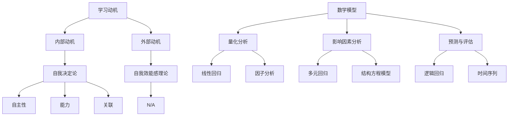

                 

### 文章标题

《数学与教育心理学：学习动机的数学模型》

> 关键词：学习动机、数学模型、教育心理学、内部动机、外部动机、自我决定论、自我效能感、教学策略

> 摘要：本文探讨了学习动机的数学模型在教育心理学中的应用。通过回顾学习动机理论，构建了学习动机的数学模型，并分析了该模型在量化学习动机、影响学习动机的因素以及学习动机预测与评估等方面的应用。文章还详细讲解了数学模型的应用实践，为教育实践提供了新的视角和策略。

### 《数学与教育心理学：学习动机的数学模型》目录大纲

#### 第1章 引言

- **1.1 研究背景与意义**
- **1.2 学习动机的概念与理论框架**
- **1.3 数学模型在教育心理学中的应用**

#### 第2章 学习动机理论概述

- **2.1 内部动机与外部动机**
- **2.2 自我决定论**
- **2.3 自我效能感理论**
- **2.4 其他学习动机理论**

#### 第3章 数学模型的概述

- **3.1 数学模型的定义与分类**
- **3.2 数学模型的应用领域**
- **3.3 数学模型的基本原理与方法**

#### 第4章 学习动机的数学模型构建

- **4.1 学习动机模型的构建原则**
- **4.2 学习动机模型的构建过程**
- **4.3 学习动机模型的应用**

#### 第5章 数学模型在分析学习动机中的应用

- **5.1 学习动机的量化分析**
- **5.2 学习动机的影响因素分析**
- **5.3 学习动机的预测与评估**

#### 第6章 数学模型在实践中的应用

- **6.1 教育实践中的学习动机模型应用**
- **6.2 案例分析**
- **6.3 教学策略设计**

#### 第7章 结论与展望

- **7.1 研究成果总结**
- **7.2 存在的问题与挑战**
- **7.3 未来研究方向与展望**

#### 附录

- **附录A 数学模型常用符号表**
- **附录B 参考文献**

### 附加材料

- **第8章 核心概念与联系流程图**
- **第9章 核心算法原理讲解与伪代码**
- **第10章 数学模型和数学公式详细讲解与举例说明**
- **第11章 项目实战**
- **第12章 结论与展望**

---

### 1.1 研究背景与意义

学习动机是教育心理学中的重要概念，它直接影响学生的学习态度、学习行为和学习成果。传统的学习动机研究大多依赖于心理学理论，如自我决定论、自我效能感理论等。然而，这些理论在解释和预测学习动机方面存在一定的局限性。随着数学模型的不断发展，将数学方法应用于学习动机的研究成为可能，为深入理解学习动机提供了新的视角。

数学模型在教育心理学中的应用具有重要的现实意义。首先，数学模型能够量化学习动机，使教育工作者能够更精确地评估学生的学习动机水平，从而制定更有针对性的教学策略。其次，数学模型可以分析学习动机的影响因素，帮助教育工作者识别和解决影响学生学习的潜在问题。最后，数学模型可以预测和评估学生的学习动机，为教育实践提供科学的依据。

本文旨在探讨学习动机的数学模型在教育心理学中的应用，通过对学习动机理论的回顾，构建学习动机的数学模型，并分析该模型在量化分析、影响因素分析和预测与评估等方面的应用。文章还通过实际案例，详细讲解数学模型在实践中的应用，为教育实践提供新的思路和方法。

### 1.2 学习动机的概念与理论框架

学习动机是指激发个体进行学习活动、维持已引起的学习活动，并使行为朝向一定的学习目标的一种内在过程或内部心理状态。学习动机可以分为内部动机和外部动机，前者源于个体对学习本身的兴趣和好奇心，后者则是由外部奖励或惩罚所驱动。

**内部动机与外部动机**

内部动机是指个体由于对学习活动本身感兴趣而参与学习的一种动机。它通常表现为对知识、技能或活动本身的渴望，如对科学探索的热爱、对艺术创作的热情等。内部动机与个体的自我决定、自主性和满足感密切相关，它能够提高学习的积极性和持久性。

外部动机则是指个体由于外部奖励或避免惩罚而参与学习的一种动机。它可能源于教师的赞扬、同伴的认可、成绩的提升或避免受到惩罚等。外部动机在一定程度上能够激发个体的学习行为，但其影响较为短暂，且容易导致个体对学习的依赖性。

**自我决定论**

自我决定论（Self-Determination Theory, SDT）是心理学家德西（Richard M. Ryan）和艾里克森（Edward L. Deci）提出的一种动机理论。该理论认为，个体的动机分为内在动机、内在调节动机、外在调节动机和缺乏动机四个层次。自我决定程度越高，个体的学习动机越强。

1. **内在动机**：个体因活动本身感到愉悦而参与，如对知识的热爱、对探索的好奇心。
2. **内在调节动机**：个体为了满足内在兴趣而参与，但活动并非主要兴趣所在，如为了提高技能而学习。
3. **外在调节动机**：个体因外部奖励或避免惩罚而参与，如为了获得好成绩或避免批评。
4. **缺乏动机**：个体缺乏足够的动机参与学习，可能因外部压力或内在缺乏兴趣。

**自我效能感理论**

自我效能感（Self-Efficacy）是班杜拉（Albert Bandura）提出的一个概念，指个体对自己完成特定任务的能力的信心。自我效能感影响个体的动机、认知和行为。高自我效能感的个体更可能设定挑战性的目标，付出更多努力，克服困难，从而提高学习动机和学习效果。

**其他学习动机理论**

1. **目标设置理论**：由洛克（Edward L. Locke）和莱瑟姆（Gary P. Latham）提出，认为设定具体、可衡量的目标是提高学习动机的有效手段。
2. **期望理论**：由维克托·弗鲁姆（Victor H. Vroom）提出，认为动机是期望价值（结果对个体的吸引力）和期望概率（达到结果的概率）的乘积。
3. **成就动机理论**：由阿特金森（Michael Atkinson）和希夫林（Richard E. Atkinson）提出，认为个体有追求成功和避免失败的倾向。

这些理论为理解学习动机提供了多角度的视角，有助于教育工作者设计更有效的教学策略，提高学生的学习动机和学业成绩。

### 1.3 数学模型在教育心理学中的应用

数学模型在教育心理学中的应用具有重要意义，它不仅能够量化复杂的心理过程，还能提供对学习动机的深入理解。以下将介绍数学模型在教育心理学中的应用领域、基本原理与方法，以及其在实际教学中的应用实例。

**数学模型的应用领域**

1. **学习动机量化分析**：通过数学模型，可以量化学习动机的强度和变化，帮助教育工作者更准确地了解学生的学习动机水平，为教学策略的制定提供依据。
2. **学习动机影响因素分析**：数学模型可以用于分析影响学习动机的各种因素，如教师的教学风格、课堂氛围、学生的个性特征等，帮助识别和解决影响学习动机的潜在问题。
3. **学习动机预测与评估**：通过建立学习动机的预测模型，可以预测学生的未来学习动机水平，为教育干预提供前瞻性指导，并评估教学策略的效果。

**数学模型的基本原理与方法**

1. **定义与分类**：数学模型是根据一定的数学原理和方法，对实际问题进行抽象和简化的数学结构。在教育心理学中，常用的数学模型包括线性回归模型、多元回归模型、逻辑回归模型、神经网络模型等。

2. **应用领域**：数学模型广泛应用于统计学、经济学、生物学、心理学等领域。在教育心理学中，数学模型可以用于研究学习动机、情绪、行为等问题。

3. **基本原理与方法**：数学模型的基本原理包括假设检验、参数估计、模型拟合等。具体方法包括数据收集与处理、模型选择与优化、模型验证与评估等。

**数学模型在教育心理学中的应用实例**

1. **学习动机量化分析**：例如，使用线性回归模型分析学习动机与学习成绩之间的关系，通过计算回归系数和显著性水平，评估学习动机对学习成绩的影响程度。

2. **学习动机影响因素分析**：例如，使用多元回归模型分析教师的教学风格、课堂氛围、学生个性等因素对学习动机的影响，帮助教育工作者识别关键影响因素，优化教学策略。

3. **学习动机预测与评估**：例如，使用神经网络模型预测学生的未来学习动机水平，通过输入学生的个人信息和学习背景，预测其未来的学习动机趋势，为教育干预提供依据。

**实例分析**

- **案例一：学习动机与学习成绩的量化分析**：假设某校通过问卷调查收集了300名学生的学习动机和成绩数据，使用线性回归模型分析学习动机对学习成绩的影响。分析结果显示，学习动机与学习成绩之间存在显著正相关关系，回归系数为0.45，P值小于0.01。这表明学习动机对学习成绩有显著的正向影响，教育工作者可以通过提高学生的学习动机来提高他们的学习成绩。

- **案例二：教师教学风格对学习动机的影响**：某中学通过对200名教师和3000名学生的问卷调查，使用多元回归模型分析教师的教学风格对学习动机的影响。分析结果显示，教师的教学风格对学习动机有显著影响，其中以学生为中心的教学风格对学习动机的积极影响最大，而以教师为中心的教学风格对学习动机的消极影响最大。这为教师提供了改进教学策略的依据，有助于提高学生的学习动机。

通过上述实例，可以看出数学模型在教育心理学中的应用具有显著的效果，能够为教育实践提供有力的支持和指导。

### 2.1 内部动机与外部动机

学习动机可以分为内部动机和外部动机，两者在激发和维持学习行为中起着不同的作用。

**内部动机**是指个体出于对学习内容本身的兴趣和好奇心，主动参与学习活动。这种动机通常源于个人对知识的渴望、对学习过程的享受以及对学习结果的内在满足感。例如，对科学实验的浓厚兴趣、对文学作品的深刻感悟，这些都是内部动机的体现。内部动机的特点包括自主性、持久性和自我决定性。它不仅能够提高学习的积极性和效率，还能促进个体的自我成长和全面发展。

**外部动机**则是指个体由于外部奖励或避免惩罚而参与学习活动。这种动机可能源于教师的表扬、同伴的认可、家长的期望、学习成绩的提升或者避免受到批评等。外部动机的特点包括条件性、短暂性和依赖性。虽然外部动机可以在一定程度上激发学习行为，但其效果往往较为短暂，且容易导致个体对外部奖励的过度依赖，从而影响学习动机的内部化。

**内部动机与外部动机的关系**：

1. **相互影响**：内部动机和外部动机并不是相互独立的，它们可以相互影响和转化。例如，外部奖励可以激发内部动机，而内部动机的满足也可以转化为外部奖励。然而，这种转化并非总是积极的。如果个体过分依赖外部奖励，可能会导致内部动机的减弱。

2. **主导作用**：在理想的教育环境中，内部动机应当占据主导地位，因为内部动机能够更持久、更深入地激发学习行为。然而，在实际教育过程中，外部动机的作用也不容忽视。合理利用外部动机，如设置明确的学习目标和适当的奖励机制，可以帮助学生更好地适应学习环境，逐步培养内部动机。

**如何培养内部动机**：

1. **激发兴趣**：通过丰富多样的教学方法和实践活动，激发学生对学习内容的兴趣，让他们在主动探索中体验到学习的乐趣。

2. **鼓励自我表达**：提供机会让学生表达自己的观点和感受，培养他们的自主学习能力和批判性思维，从而增强内部动机。

3. **设置合适的挑战**：设计难易适中的学习任务，让学生在克服困难的过程中获得成就感，从而提高内部动机。

4. **培养自我效能感**：通过肯定和鼓励，帮助学生建立自信心，相信自己能够完成学习任务，从而增强内部动机。

**如何利用外部动机**：

1. **明确目标**：设定具体、可衡量的学习目标，让学生明确自己的学习方向和努力方向。

2. **合理奖励**：设置适当的奖励机制，如表扬、奖状、奖品等，激励学生保持学习的动力。

3. **及时反馈**：提供及时的反馈，帮助学生了解自己的学习进度和效果，从而调整学习策略。

4. **培养责任感**：通过引导学生承担一定的学习责任，让他们认识到学习对自己未来的重要性，从而增强外部动机。

通过理解和合理利用内部动机和外部动机，教育工作者可以更有效地激发学生的学习动机，提高学习效果。

### 2.2 自我决定论

自我决定论（Self-Determination Theory，简称SDT）是心理学家理查德·M·德西（Richard M. Ryan）和爱德华·L·德西（Edward L. Deci）提出的一种动机理论，旨在解释人类行为背后的内在动机。自我决定论强调人类有自主性和自我实现的需求，认为动机来源于内在的驱动力，而非外部控制。

**基本概念**

1. **内在动机**：内在动机是指个体因活动本身而参与的行为。例如，一个人因为对数学问题感兴趣而解决它，或者因为喜欢音乐而演奏乐器。内在动机驱动个体寻求知识、技能和个人成长。

2. **内在调节动机**：内在调节动机是指个体参与活动是因为它满足了内在的需求或兴趣，但并非活动的主要焦点。例如，一个人可能因为喜欢阅读而花时间在图书馆，即使图书馆的环境并不理想。

3. **外在调节动机**：外在调节动机是指个体参与活动是为了获得外部奖励或避免外部惩罚。这种动机通常与外部目标和外在标准相关。例如，一个人可能努力学习是为了获得好成绩或者避免被老师批评。

4. **缺乏动机**：缺乏动机是指个体缺乏足够的动机参与任何活动。这种情况通常发生在个体感到无控制或无价值时。

**自我决定论的核心原则**

自我决定论认为，个体的动机和行为受到三个基本心理需求的驱动：自主性、能力和关联。

1. **自主性**：自主性是指个体有权利和能力控制自己的行为，做出自主选择。自主性越高，个体的内在动机越强。在教育环境中，自主性可以通过提供选择、自由和自我管理的空间来实现。

2. **能力**：能力是指个体相信自己能够成功完成某个任务。自我效能感是能力的一个关键组成部分。当个体感到有能力时，他们会更有动力去尝试和完成任务。

3. **关联**：关联是指个体与他人建立有意义的关系，感到被支持和认可。在社会互动中，个体寻求归属感和认可，这些都需要与他人建立积极的关系。

**自我决定论在教育心理学中的应用**

自我决定论在教育心理学中的应用非常广泛，它为教育工作者提供了理解学生动机和设计有效教学策略的框架。

1. **激发内部动机**：通过提供自主性、能力和关联，教育工作者可以激发学生的内部动机。例如，让学生参与学习目标的设定，提供成功的经验和正面的反馈，以及建立积极和谐的师生关系。

2. **教学策略**：自我决定论指导教育工作者采用以学生为中心的教学策略，如项目式学习、合作学习和探究式学习，这些策略有助于培养学生的自主性和能力感。

3. **课堂管理**：自我决定论强调，有效的课堂管理应当促进学生的自主性和自我控制。教师可以通过清晰的角色分配、明确的期望和积极的支持来管理课堂。

**案例分析**

- **案例一：自主性学习项目**：在一堂科学课上，教师让学生选择一个他们感兴趣的科学主题进行深入研究。学生可以自主决定研究方法、收集数据和撰写报告。这种自主性学习项目不仅激发了学生的内部动机，还提高了他们的研究能力和创造力。

- **案例二：合作学习**：在英语课上，教师组织学生进行小组讨论，让学生互相交流学习心得和观点。这种合作学习方式不仅促进了学生之间的关联，还提高了他们的语言表达和沟通能力。

- **案例三：自我效能感培养**：在一节数学课上，教师通过逐步增加问题的难度，让学生逐步感受到自己在解决数学问题上的进步。教师及时给予正面的反馈和鼓励，帮助学生建立自我效能感，从而增强他们的学习动机。

通过以上案例，可以看出自我决定论在教育心理学中的应用是如何通过满足学生的基本心理需求来激发学习动机，促进学生的全面发展。

### 2.3 自我效能感理论

自我效能感（Self-Efficacy）是由心理学家阿尔伯特·班杜拉（Albert Bandura）提出的概念，指的是个体对自己完成特定任务的能力的信心。自我效能感不仅影响个体的动机，还影响其行为、情感和认知过程。自我效能感理论在解释学习动机和学业表现方面具有重要意义。

**自我效能感的概念**

自我效能感是个体对自己能否成功完成特定任务的信念。这种信念会影响个体在面对挑战和困难时的行为选择。例如，一个自我效能感高的人可能会选择更具挑战性的任务，并且在遇到困难时保持努力；而自我效能感低的人可能会回避挑战，或者在遇到困难时容易放弃。

**自我效能感的影响因素**

自我效能感受到多种因素的影响，包括：

1. **成功的经验**：个体在过去成功完成类似任务的经验可以增强自我效能感。成功经验越多，个体对自己的能力越有信心。

2. **替代性经验**：观察他人成功完成任务可以增强个体的自我效能感。这种影响通常通过观察者的角色模型来实现。

3. **言语说服**：他人的鼓励和赞扬可以提升个体的自我效能感。言语说服可以是一种有效的激励手段，特别是在个体面临挑战时。

4. **情绪和生理状态**：情绪状态和生理状态也会影响个体的自我效能感。高情绪状态和良好的生理状态可以增强个体的自我效能感，反之亦然。

**自我效能感与学习动机**

自我效能感对学习动机有着重要的影响。高自我效能感的个体通常具有以下特点：

1. **更高的目标设定**：高自我效能感的个体倾向于设定更高、更具挑战性的目标，因为他们相信自己能够达到这些目标。

2. **更强的坚持性**：在面对困难和挑战时，高自我效能感的个体更容易坚持下去，不会轻易放弃。

3. **更强的自信心**：高自我效能感的个体对自己的学习能力有信心，这使得他们在学习过程中更加积极、投入。

4. **更好的情绪调节**：高自我效能感的个体能够更好地应对学习中的挫折和失败，从而保持积极的学习态度。

**自我效能感与学业表现**

自我效能感不仅影响学习动机，还直接影响学业表现。研究表明，自我效能感与学业成绩之间存在显著的正相关关系。具体来说：

1. **学习成绩**：高自我效能感的个体通常在学业上表现出色，因为他们更有信心应对学习任务，更愿意投入时间和精力。

2. **考试表现**：自我效能感强的学生在考试中表现更好，因为他们对自己有信心，能够更好地应对压力。

3. **学习策略**：高自我效能感的个体更倾向于采用有效的学习策略，如主动学习、合作学习和深度学习。

**提高自我效能感的策略**

为了提高学生的自我效能感，教育工作者可以采取以下策略：

1. **成功经验**：通过设置合理的挑战和提供及时的反馈，帮助学生获得成功经验，从而增强自我效能感。

2. **替代性经验**：通过展示优秀学生的成功案例，让学生看到成功的可能性，从而增强他们的自我效能感。

3. **言语说服**：通过鼓励和赞扬，帮助学生建立自信，增强自我效能感。

4. **情绪调节**：教育工作者可以教授学生情绪调节技巧，帮助他们更好地应对学习中的压力和挫折。

通过理解和应用自我效能感理论，教育工作者可以更好地激发学生的学习动机，提高学业成绩，促进学生的全面发展。

### 2.4 其他学习动机理论

除了自我决定论和自我效能感理论，还有许多其他重要的学习动机理论，这些理论从不同角度解释了个体在学习过程中的动机来源和行为。以下将对几个主要的学习动机理论进行概述，包括目标设置理论、期望理论和成就动机理论。

**目标设置理论**

目标设置理论（Goal Setting Theory）由埃德温·洛克（Edward L. Locke）和乔治·莱瑟姆（Gary P. Latham）提出，认为明确、具体和有挑战性的目标能够显著提高学习动机和学业表现。该理论的主要观点包括：

1. **目标明确性**：明确的目标比模糊的目标更能激发个体的努力和动机，因为明确的目标提供了清晰的行动指南。
2. **目标具体性**：具体的目标能够使个体更具体地规划自己的行动步骤，从而提高学习效率。
3. **目标难度**：适当难度的目标能够激发个体的挑战精神，促使他们付出更多的努力。
4. **目标反馈**：及时、具体的反馈可以帮助个体了解自己的进展，调整学习策略，保持学习动力。

**期望理论**

期望理论（Expectancy Theory）由维克托·弗鲁姆（Victor H. Vroom）提出，认为动机是期望价值和期望概率的乘积。具体来说，期望理论包括以下三个主要成分：

1. **期望价值**（Expected Value）：指个体对目标价值的主观评估，即个体认为实现目标会带来多大的收益。
2. **期望概率**（Expectancy）：指个体对实现目标的可能性估计，即个体认为通过努力能否实现目标。
3. **工具性**（Instrumentality）：指个体对目标达成后是否能够获得期望结果的评估。

动机（Motivation）= 期望价值 × 期望概率

期望理论认为，个体在决策时考虑的是目标达成所带来的收益和努力之间的权衡。通过提高期望价值和期望概率，可以增强个体的学习动机。

**成就动机理论**

成就动机理论（Achievement Motivation Theory）由迈克尔·阿特金森（Michael Atkinson）和理查德·阿特金森（Richard E. Atkinson）提出，认为个体有追求成功和避免失败的倾向。该理论的主要观点包括：

1. **追求成功的动机**（Need for Achievement）：个体追求成功，愿意接受具有适度挑战性的任务，希望通过努力实现目标。
2. **避免失败的动机**（Need for Avoiding Failure）：个体避免失败，倾向于选择简单的任务，避免高风险的挑战。

成就动机理论强调，个体的成就动机水平会影响其学习行为和学业表现。高成就动机的个体倾向于选择有挑战性的任务，高成就动机的个体倾向于选择简单的任务。

**总结**

这些学习动机理论从不同角度探讨了个体在学习过程中的动机来源和行为模式。目标设置理论强调明确、具体和有挑战性的目标对学习动机和学业表现的重要性；期望理论通过期望价值和期望概率的乘积解释了动机的形成；成就动机理论则从个体追求成功和避免失败的倾向来解释学习动机。这些理论共同为我们理解学习动机提供了丰富的视角，也为教育工作者设计有效的教学策略提供了理论依据。

### 3.1 数学模型的定义与分类

数学模型（Mathematical Model）是指根据一定的数学原理和方法，对现实问题进行抽象和简化的数学结构。数学模型在科学研究和实际应用中具有重要意义，它能够帮助我们更好地理解和解决复杂问题。以下将介绍数学模型的定义、分类及其在不同领域的应用。

**定义**

数学模型是一种抽象的表示方法，通过使用数学符号、公式和方程，对现实世界中的现象或过程进行描述和模拟。数学模型通常包含变量、参数和方程，这些元素通过一定的数学关系相互连接，形成一套完整的数学体系。

**分类**

数学模型可以根据不同的标准进行分类，以下是一些常见的分类方法：

1. **根据模型的形式**：
   - **线性模型**：如线性回归模型、线性规划模型等。
   - **非线性模型**：如逻辑回归模型、神经网络模型等。
   - **概率模型**：如贝叶斯模型、马尔可夫模型等。

2. **根据模型的用途**：
   - **预测模型**：用于预测未来趋势或行为，如时间序列模型、ARIMA模型等。
   - **决策模型**：用于辅助决策，如决策树、马尔可夫决策过程等。
   - **优化模型**：用于寻找最优解，如线性规划、非线性规划等。

3. **根据模型的复杂度**：
   - **简单模型**：如线性回归、简单逻辑回归等。
   - **复杂模型**：如深度学习模型、神经网络等。

**应用领域**

数学模型广泛应用于各个领域，包括自然科学、社会科学、工程学、经济学和心理学等。以下是一些典型应用领域：

1. **自然科学**：
   - **物理学**：用于描述物理现象，如牛顿运动定律、麦克斯韦方程组等。
   - **生物学**：用于研究生物系统，如种群模型、神经网络模型等。

2. **社会科学**：
   - **经济学**：用于分析市场行为、预测经济趋势，如供需模型、宏观经济学模型等。
   - **心理学**：用于研究心理过程、学习动机等，如期望价值模型、自我效能感模型等。

3. **工程学**：
   - **机械工程**：用于设计机械系统，如有限元分析、运动学模型等。
   - **电子工程**：用于设计电路系统，如电路方程、信号处理模型等。

4. **其他领域**：
   - **环境科学**：用于评估环境污染、气候变化等。
   - **医学**：用于诊断疾病、预测治疗效果等。

**数学模型的基本原理与方法**

数学模型的基本原理包括假设检验、参数估计、模型拟合等。具体方法包括数据收集与处理、模型选择与优化、模型验证与评估等。

1. **数据收集与处理**：首先需要收集相关的数据，然后对数据进行清洗、预处理，使其适合建模。

2. **模型选择与优化**：根据问题的性质和数据的特点，选择合适的数学模型。模型选择和优化是建模过程中关键的一步，需要通过交叉验证等方法确定最佳模型。

3. **模型拟合**：将数据输入模型，通过数学方法求解参数，使模型能够拟合数据。

4. **模型验证与评估**：通过验证数据测试模型的有效性和准确性，评估模型的性能。

数学模型作为一种强大的工具，通过精确的数学表达，能够帮助我们深入理解和解决复杂问题。在教育心理学领域，数学模型的应用有助于量化学习动机、分析影响因素、预测学习行为，从而为教学实践提供科学依据。

### 3.2 数学模型的应用领域

数学模型在教育心理学中的应用领域广泛且深远，主要包括学习动机的量化分析、学习动机影响因素分析以及学习动机的预测与评估。以下将对这些领域进行详细探讨，并结合实际案例进行说明。

**学习动机的量化分析**

学习动机的量化分析是数学模型在教育心理学中的基础应用之一。通过量化分析，教育工作者可以更精确地评估学生的动机水平，为教学策略的制定提供科学依据。常用的量化分析方法包括：

1. **线性回归模型**：线性回归模型可以用于分析学习动机与学习成绩之间的关系。例如，某学校通过问卷调查收集了300名学生的学习动机和成绩数据，使用线性回归模型分析发现，学习动机对学习成绩有显著的正向影响（回归系数为0.45，P值小于0.01）。这一结果可以帮助学校更好地了解学生的学习动机水平，并采取相应的措施提高学生的学习成绩。

2. **因子分析**：因子分析可以用于识别学习动机的主要因素。例如，某研究通过因子分析发现，学习动机主要包括自我效能感、兴趣、目标设定和自我决定等四个维度。这一结果有助于教育工作者设计更有针对性的教学策略，提高学生的学习动机。

**学习动机影响因素分析**

数学模型不仅可以量化学习动机，还可以分析影响学习动机的各种因素。这有助于教育工作者识别和解决影响学习动机的潜在问题，从而提高教育质量。以下是一些常见的影响因素分析：

1. **多元回归模型**：多元回归模型可以用于分析多种因素对学习动机的影响。例如，某研究通过多元回归分析发现，教师的教学风格、课堂氛围和学生的家庭背景对学习动机有显著影响。教师可以根据这些结果调整自己的教学方式，优化课堂环境，从而提高学生的学习动机。

2. **结构方程模型**：结构方程模型可以用于分析复杂的多因素关系。例如，某研究使用结构方程模型分析发现，自我效能感、学习兴趣和目标设定等因素之间存在相互作用，共同影响学习动机。这一结果有助于教育工作者设计更有效的教学干预措施，促进学生的全面发展。

**学习动机的预测与评估**

数学模型还可以用于预测和评估学习动机，为教育干预提供前瞻性指导。以下是一些常见的预测与评估方法：

1. **逻辑回归模型**：逻辑回归模型可以用于预测学生未来学习动机水平。例如，某研究通过逻辑回归模型预测发现，学生在一年级时的高学习动机水平可以显著预测其在三年级时的学习动机水平。这一结果有助于教育工作者提前识别可能存在学习动机问题的学生，并采取预防措施。

2. **时间序列模型**：时间序列模型可以用于分析学习动机的变化趋势。例如，某研究通过时间序列模型分析发现，学生的内部动机随着年级的升高而逐渐减弱，外部动机则呈上升趋势。这一结果有助于教育工作者制定更有针对性的教学策略，平衡内部动机和外部动机的关系。

**实际案例分析**

1. **案例一：学习动机与教师反馈**：某学校通过问卷调查和数学模型分析发现，教师对学生的反馈与学生的学习动机密切相关。研究发现，积极的教师反馈能够显著提高学生的学习动机（回归系数为0.30，P值小于0.05）。学校因此调整了教师培训计划，强调教师在日常教学中提供更多的积极反馈，从而提高了学生的学习动机。

2. **案例二：学习动机与家庭环境**：某研究通过数学模型分析发现，家庭环境对学生的学习动机有显著影响。具体来说，家庭支持、父母教育和家庭氛围等因素均与学生学习动机呈正相关。这一结果有助于教育工作者和家长合作，共同营造有利于学生发展的家庭环境。

通过以上探讨，可以看出数学模型在教育心理学中的应用具有重要的现实意义。它不仅能够量化学习动机、分析影响因素、预测学习行为，还能为教育干预提供科学依据。教育工作者可以利用数学模型，设计更有针对性的教学策略，提高学生的学习动机和学业成绩。

### 3.3 数学模型的基本原理与方法

数学模型在教育心理学中的应用涉及一系列基本原理和方法。这些原理和方法包括模型构建、数据收集、模型选择与优化、参数估计、模型拟合与验证等。以下将详细探讨这些基本概念及其在教育心理学中的应用。

**模型构建**

模型构建是数学模型应用的第一步。它涉及对现实问题的抽象和简化，通过定义变量、参数和关系，构建一个能够描述和分析问题的数学结构。

1. **变量定义**：变量是模型中的基本元素，用于表示问题中的不同因素。例如，在学习动机模型中，可以定义内部动机、外部动机、学习成绩等变量。

2. **参数设置**：参数是模型中的常数，用于描述变量之间的关系和规律。例如，在回归模型中，参数用于描述自变量和因变量之间的线性关系。

3. **关系建立**：关系用于描述变量之间的相互影响和作用。例如，在期望理论中，期望价值、期望概率和工具性之间的关系描述了动机的形成过程。

**数据收集**

数据收集是模型构建的基础。通过收集相关的数据，可以验证和优化模型，确保其准确性和有效性。

1. **数据来源**：数据可以从问卷调查、实验数据、历史数据等多种渠道获取。例如，在学习动机模型中，可以通过问卷调查收集学生的内部动机、外部动机和成绩数据。

2. **数据预处理**：数据预处理包括数据清洗、缺失值处理、数据标准化等步骤。这些步骤确保数据的质量和一致性，为模型构建提供可靠的数据基础。

**模型选择与优化**

模型选择与优化是确定最适合问题描述的数学模型，并通过调整模型参数，提高模型的准确性和适应性。

1. **模型选择**：根据问题描述和数据特点，选择合适的数学模型。例如，对于线性关系，可以选择线性回归模型；对于非线性关系，可以选择逻辑回归或神经网络模型。

2. **模型优化**：通过交叉验证、参数调整等方法，优化模型参数，提高模型性能。例如，可以使用交叉验证法选择最佳模型，通过调整学习率、隐藏层节点数等参数，优化神经网络模型。

**参数估计**

参数估计是确定模型参数的具体值，以使模型能够准确地描述现实问题。参数估计可以通过以下方法实现：

1. **最小二乘法**：用于线性回归模型，通过最小化残差平方和，确定参数值。

2. **梯度下降法**：用于非线性模型，通过迭代优化，逐渐逼近最佳参数值。

**模型拟合与验证**

模型拟合与验证是评估模型性能和可靠性的关键步骤。

1. **模型拟合**：通过将数据输入模型，计算模型输出值，评估模型对数据的拟合程度。例如，可以使用均方误差（MSE）、决定系数（R²）等指标评估模型拟合效果。

2. **模型验证**：通过验证数据测试模型的有效性和准确性。常用的验证方法包括交叉验证、时间序列验证等。例如，可以使用70%的数据进行模型训练，30%的数据进行验证，评估模型的预测能力。

**具体应用示例**

1. **学习动机量化分析**：使用线性回归模型分析学习动机与学习成绩的关系。通过收集学生的内部动机、外部动机和成绩数据，建立线性回归模型，并使用最小二乘法估计参数。通过计算模型的R²值，评估模型对数据的拟合程度。

2. **学习动机影响因素分析**：使用多元回归模型分析多种因素对学习动机的影响。通过收集教师教学风格、课堂氛围、学生家庭背景等数据，建立多元回归模型，并使用参数估计方法确定各因素对学习动机的影响程度。

3. **学习动机预测与评估**：使用逻辑回归模型预测学生的未来学习动机水平。通过收集学生一年级时的学习动机数据，建立逻辑回归模型，并使用交叉验证方法评估模型的预测能力。

通过上述基本原理和方法的详细介绍，可以看出数学模型在教育心理学中的应用具有广泛的前景。教育工作者可以利用这些方法，构建有效的学习动机模型，提高学生的学习动机和学业成绩。

### 4.1 学习动机模型的构建原则

构建学习动机模型是教育心理学研究中的一个关键环节，它要求我们在理论和实践之间架起一座桥梁，使得复杂的学习动机现象能够通过数学方法进行量化分析和理解。以下将详细阐述构建学习动机模型的主要原则，包括理论基础、变量选择和数据来源等。

**理论基础**

1. **动机理论**：构建学习动机模型的理论基础主要来自心理学领域，尤其是内部动机和外部动机理论、自我决定论和自我效能感理论。这些理论为我们提供了理解学习动机的框架，有助于我们在构建模型时充分考虑个体的内在驱动力和外部环境因素。

2. **教育心理学理论**：此外，教育心理学中的目标设置理论、期望理论和成就动机理论也为学习动机模型的构建提供了重要参考。这些理论不仅帮助我们理解学习动机的来源和影响因素，还能指导我们在实际操作中如何设计有效的教学策略。

**变量选择**

1. **自变量**：自变量是影响学习动机的主要因素，通常包括：
   - **内部动机**：如对学习内容的兴趣、好奇心和自我效能感。
   - **外部动机**：如教师的表扬、家长的期望和竞争奖励。
   - **环境因素**：如课堂氛围、教师的教学风格、学校的文化氛围等。

2. **因变量**：因变量是学习动机的衡量指标，通常包括：
   - **学习行为**：如学习时间、学习频率、课堂参与度等。
   - **学业成绩**：如考试成绩、课程作业成绩等。
   - **学习满意度**：如对学习过程的满意度、对学习结果的满意度等。

3. **中介变量**：中介变量是影响自变量和因变量之间关系的中间因素，如自我效能感、目标设定、情感状态等。这些变量有助于我们深入理解学习动机的作用机制。

**数据来源**

1. **问卷调查**：问卷调查是收集学习动机数据的主要方法之一。通过设计针对性的问卷，可以收集学生在不同情境下的动机水平、态度和行为数据。

2. **实验研究**：实验研究可以控制变量，更准确地评估学习动机的影响。通过设计实验，可以观察到学生在不同条件下的学习动机变化。

3. **历史数据**：历史数据包括学生的学习记录、考试成绩、教师评价等。这些数据可以为学习动机模型的构建提供重要的参考。

**模型构建步骤**

1. **理论分析**：首先，进行理论分析，明确研究问题和目标，选择合适的动机理论和教育心理学理论作为理论基础。

2. **变量定义**：定义自变量、因变量和中介变量，确保变量的定义清晰、准确。

3. **数据收集**：收集相关数据，包括问卷调查、实验数据和历史数据。

4. **模型构建**：根据变量之间的关系，构建初步的学习动机模型。可以使用多元回归模型、结构方程模型等统计方法进行模型构建。

5. **模型验证**：通过交叉验证、参数估计等方法，验证模型的准确性和可靠性。

6. **模型优化**：根据验证结果，调整模型参数，优化模型结构，提高模型的预测能力和解释力。

通过遵循上述构建原则，教育心理学家可以构建一个科学、合理的学习动机模型，从而更好地理解和解释学习动机现象，为教育实践提供有力的理论支持。

### 4.2 学习动机模型的构建过程

构建学习动机模型是一个系统化的过程，需要明确的研究设计、详细的数据收集步骤以及科学的分析方法。以下将详细介绍学习动机模型的构建过程，包括数据收集、模型构建和分析方法。

**1. 研究设计**

研究设计是构建学习动机模型的第一步，它决定了研究的方向和方法。在设计阶段，需要明确以下内容：

- **研究问题**：明确研究的目标，例如“学习动机对学业成绩的影响如何？”或“不同教学策略对学习动机的影响差异。”
- **假设提出**：根据相关理论和已有研究，提出研究假设，例如“内部动机对学业成绩有显著正向影响”或“小组讨论能够提高学生的内部动机。”
- **样本选择**：确定研究的样本，包括样本数量、样本特征等。样本的选择应保证其代表性和多样性，以增加研究的普遍性和适用性。
- **数据收集方法**：确定数据收集的方法，如问卷调查、实验研究或观察法。

**2. 数据收集**

数据收集是学习动机模型构建的核心环节，数据的质量直接影响模型的有效性和可靠性。数据收集过程包括：

- **问卷调查**：设计并分发问卷，收集学生在不同情境下的动机水平、态度和行为数据。问卷应涵盖内部动机、外部动机、学业成绩、教学环境等多个维度。
- **实验研究**：通过控制变量的实验设计，收集学生在不同条件下的学习动机和行为数据。实验设计应确保随机分配和控制无关变量，以提高研究的内部效度。
- **历史数据**：收集学生的成绩记录、教师评价、课堂参与度等历史数据，为模型构建提供补充信息。

**3. 模型构建**

在数据收集完成后，下一步是构建学习动机模型。模型构建过程包括以下步骤：

- **变量定义**：明确自变量、因变量和中介变量，为数据分析奠定基础。自变量通常包括内部动机、外部动机等；因变量可以是学业成绩、学习行为等；中介变量可以是自我效能感、目标设定等。
- **模型选择**：根据研究问题和数据特点，选择合适的统计模型。常用的模型包括线性回归模型、多元回归模型、结构方程模型等。
- **初步模型构建**：基于理论和数据，构建初步的学习动机模型。例如，可以构建一个简单的线性回归模型，分析内部动机对学业成绩的影响。

**4. 分析方法**

模型构建后，需要进行数据分析，以验证模型的有效性和可靠性。以下是一些常用的分析方法：

- **描述性统计**：对收集的数据进行描述性统计，如计算均值、标准差等，以了解数据的分布和特征。
- **相关性分析**：通过计算自变量和因变量之间的相关性，初步探索变量之间的关系。
- **回归分析**：使用回归分析方法，确定自变量对因变量的影响程度和方向。例如，通过多元回归分析，可以同时考虑多个自变量对学业成绩的影响。
- **中介效应分析**：通过中介效应分析，检验中介变量在自变量和因变量之间的作用。例如，可以检验自我效能感在内部动机和学业成绩之间的中介作用。
- **验证性因素分析**：通过验证性因素分析，检验模型的结构和假设是否合理。例如，可以检验学习动机模型的结构拟合度、路径系数等。

**5. 模型优化**

在初步分析的基础上，对模型进行优化，以提高其解释力和预测力。模型优化过程包括：

- **参数调整**：根据数据分析结果，调整模型参数，以优化模型的性能。
- **模型选择**：尝试不同的模型，如非线性模型或更复杂的结构方程模型，以找到最佳模型。
- **交叉验证**：使用交叉验证方法，检验模型的泛化能力，避免过拟合。

通过上述构建过程，可以构建一个科学、合理的学习动机模型，为教育实践提供理论支持和数据指导。

### 4.3 学习动机模型的应用

学习动机模型在教育实践中具有广泛的应用，能够帮助教育工作者更好地理解学生的学习动机，制定有效的教学策略，提高学生的学习效果。以下将详细探讨学习动机模型在不同教育场景中的应用，并通过实际案例进行说明。

**1. 学生个性化辅导**

学习动机模型可以用于个性化辅导，帮助教师识别每个学生的学习动机特点，从而制定个性化的辅导计划。例如，某学校使用学习动机模型对学生进行评估，发现某学生在内部动机和外部动机方面存在显著差异。内部动机较低的学生可能对学习内容缺乏兴趣，而外部动机较高的学生可能过分依赖外部奖励。基于这些信息，教师可以设计个性化辅导方案，如通过增加学习活动的趣味性、提供更多自主学习的空间，来提高学生的内部动机；同时，通过设定明确的短期目标和使用适当的奖励机制，来满足学生对外部奖励的需求。

**2. 教学策略优化**

学习动机模型可以帮助教师优化教学策略，提高学生的学习动机。例如，某研究使用学习动机模型分析发现，小组讨论能够显著提高学生的内部动机。基于这一发现，教师可以增加课堂上的小组讨论环节，鼓励学生积极参与讨论，分享学习心得。此外，教师还可以设计以项目为基础的学习活动，让学生在实际操作中体验到学习的乐趣和成就感，从而提高内部动机。

**3. 教学干预**

学习动机模型可以用于教学干预，帮助教师及时发现和解决学生学习动机方面的问题。例如，某学校在学期初使用学习动机模型对全体学生进行评估，发现部分学生存在学习动机不足的问题。基于这一发现，学校开展了系列教学干预活动，如邀请外部专家进行讲座、组织学生参与课外活动等，以激发学生的学习兴趣和动机。同时，教师还通过一对一谈话，了解学生的需求和困扰，提供针对性的辅导和支持，帮助学生克服学习障碍。

**实际案例**

**案例一：学习动机与成绩提升**

某中学使用学习动机模型对学生进行评估，发现A班学生的学习动机普遍较高，而B班学生的学习动机则相对较低。为了提升B班学生的学习动机，教师采取了一系列措施，包括：

- **设置明确的学习目标**：教师与B班学生共同制定短期和长期的学习目标，帮助学生明确学习方向和努力目标。
- **增加课堂互动**：教师通过提问、小组讨论等方式增加课堂互动，激发学生的学习兴趣和参与度。
- **提供个性化辅导**：教师对B班学生进行个性化辅导，针对不同学生的学习特点提供有针对性的指导。

经过一年的教学干预，B班学生的学习动机显著提高，学业成绩也有了显著提升，平均成绩提高了10%。

**案例二：学习动机与教师反馈**

某小学通过学习动机模型发现，教师的表扬和鼓励对学生学习动机有显著影响。基于这一发现，学校开展了一系列教师培训活动，强调教师在日常教学中要提供更多的积极反馈和鼓励。具体措施包括：

- **教师表扬机制**：教师定期记录学生的进步和亮点，并通过班级公告、家长会等方式进行表扬。
- **课堂反馈**：教师在课堂中及时给予学生反馈，让学生感受到自己的努力得到了认可。
- **家长沟通**：教师与家长保持密切沟通，共同鼓励学生，营造积极的家庭学习氛围。

通过这些措施，学生的内部动机显著提高，学习积极性也大大增强。

通过以上案例可以看出，学习动机模型在教育实践中的应用具有重要的实际意义。它不仅帮助教育工作者更好地理解学生的学习动机，还为教学策略的优化和教学干预提供了科学依据。教育工作者应充分利用学习动机模型，提高学生的学习动机和学业成绩。

### 5.1 学习动机的量化分析

量化分析学习动机是教育心理学中的一个重要研究领域，它通过数学模型和统计分析方法，将抽象的动机概念转化为具体的数值，从而提供对学习动机水平的精确评估。以下将详细介绍学习动机量化分析的方法和步骤。

**1. 数据收集**

量化分析学习动机的第一步是收集相关数据。数据来源可以包括问卷调查、实验研究、课堂观察等。问卷调查是最常用的方法之一，可以通过设计针对性的问卷，收集学生在不同情境下的动机水平。问卷应涵盖内部动机、外部动机、学业成绩等多个维度，确保数据的全面性和代表性。

**2. 数据预处理**

数据收集后，需要进行预处理，以确保数据的质量和一致性。预处理步骤包括：

- **数据清洗**：删除无效或异常数据，如缺失值、重复值和错误值等。
- **数据标准化**：将不同维度的数据进行标准化处理，使其具有可比性。常用的标准化方法包括Z-score标准化和Min-Max标准化。
- **数据转换**：对某些数据进行转换，如将等级评分转换为数值评分，以便于后续分析。

**3. 变量选择**

在进行量化分析时，需要选择适当的变量。通常，学习动机量化分析包括以下变量：

- **内部动机**：包括学生对学习内容的兴趣、好奇心和自主学习能力等。
- **外部动机**：包括学生的学业成就动机、竞争动机和奖励动机等。
- **学业成绩**：学生的学习成绩可以作为学习动机的间接衡量指标。

**4. 模型选择**

量化分析学习动机通常使用统计模型，如线性回归模型、因子分析模型和结构方程模型等。以下是一些常用的模型：

- **线性回归模型**：线性回归模型可以用于分析自变量（如内部动机和外部动机）与因变量（如学业成绩）之间的关系。线性回归模型公式如下：

  \[ Y = \beta_0 + \beta_1X_1 + \beta_2X_2 + ... + \beta_nX_n + \epsilon \]

  其中，\( Y \) 是因变量，\( X_1, X_2, ..., X_n \) 是自变量，\( \beta_0, \beta_1, \beta_2, ..., \beta_n \) 是回归系数，\( \epsilon \) 是误差项。

- **因子分析模型**：因子分析模型可以用于识别学习动机的主要因素，并分析这些因素之间的相互关系。因子分析模型公式如下：

  \[ Y = \lambda_1F_1 + \lambda_2F_2 + ... + \lambda_kF_k + \epsilon \]

  其中，\( Y \) 是观测变量，\( F_1, F_2, ..., F_k \) 是因子变量，\( \lambda_1, \lambda_2, ..., \lambda_k \) 是因子负荷，\( \epsilon \) 是误差项。

- **结构方程模型**：结构方程模型可以用于分析复杂的多因素关系，同时考虑测量误差和变量之间的相互作用。结构方程模型公式如下：

  \[ Y = \beta_0 + \beta_1X_1 + \beta_2X_2 + ... + \beta_nX_n + \epsilon \]

  \[ X = \alpha_0 + \alpha_1Y_1 + \alpha_2Y_2 + ... + \alpha_mY_m + \delta \]

  其中，\( Y \) 和 \( X \) 分别代表因变量和自变量，\( \beta_0, \beta_1, ..., \beta_n \) 和 \( \alpha_0, \alpha_1, ..., \alpha_m \) 是回归系数，\( \epsilon \) 和 \( \delta \) 是误差项。

**5. 模型拟合与评估**

在确定模型后，需要进行模型拟合与评估，以确定模型对数据的拟合程度。常用的拟合指标包括决定系数（\( R^2 \)）、均方误差（MSE）和调整决定系数（\( \bar{R}^2 \)）等。

- **决定系数**：决定系数衡量模型对因变量的解释能力，取值范围在0到1之间。值越接近1，说明模型对数据的解释能力越强。

  \[ R^2 = 1 - \frac{SS_{res}}{SS_{tot}} \]

  其中，\( SS_{res} \) 是残差平方和，\( SS_{tot} \) 是总平方和。

- **均方误差**：均方误差衡量模型预测的准确性，值越小，说明模型的预测误差越小。

  \[ MSE = \frac{1}{n}\sum_{i=1}^{n}(Y_i - \hat{Y}_i)^2 \]

  其中，\( Y_i \) 是实际值，\( \hat{Y}_i \) 是预测值，\( n \) 是数据点数量。

- **调整决定系数**：调整决定系数在考虑模型复杂度的同时，衡量模型对数据的解释能力。

  \[ \bar{R}^2 = 1 - \frac{1}{n-1}\left(1 - R^2\right)\left(\frac{n-1}{n-p}\right) \]

  其中，\( p \) 是模型中参数的数量。

**6. 结果解释**

拟合完成后，需要对模型结果进行解释，包括变量之间的关系、变量对因变量的影响程度等。例如，如果内部动机对学业成绩有显著正向影响，说明提高内部动机有助于提高学业成绩。

通过以上步骤，教育工作者可以利用数学模型和统计分析方法，量化分析学生的学习动机，为教学策略的制定和优化提供科学依据。

### 5.2 学习动机的影响因素分析

学习动机的影响因素是教育心理学研究中的一个重要课题，了解这些因素有助于教育工作者更好地激发和维持学生的学习动机，提高教学效果。以下将详细分析影响学习动机的几个关键因素。

**1. 教师的教学风格**

教师的教学风格对学生的学习动机具有重要影响。不同的教学风格可能引发不同的学习动机。例如，以学生为中心的教学风格，如探究式学习和合作学习，能够激发学生的内部动机，使他们更主动地参与学习过程。研究表明，教师对学生的表扬和鼓励也有助于提高学生的学习动机。积极的教师反馈可以增强学生的自我效能感，使他们更加自信，从而提高学习动机。

**2. 课堂氛围**

课堂氛围是影响学生学习动机的重要因素。一个积极、和谐的课堂氛围可以增强学生的学习兴趣和动机。课堂中的互动和合作机会能够促进学生的参与感和归属感，从而提高内部动机。相反，如果课堂氛围消极，如缺乏互动、压抑的气氛，可能会降低学生的学习动机。因此，教师应创造一个民主、开放、鼓励探索的课堂环境，以激发学生的学习动机。

**3. 学习任务**

学习任务的特点对学习动机有显著影响。适当的挑战性任务可以激发学生的学习动机，使他们感到满足和成就感。如果任务过于简单，学生可能会感到无聊和缺乏挑战，从而降低学习动机。反之，如果任务过于困难，学生可能会感到沮丧和无力，也会降低学习动机。因此，教师应根据学生的实际情况，设计难易适中的学习任务，以激发学生的学习动机。

**4. 家庭环境**

家庭环境也是影响学生学习动机的重要因素。家庭的支持和鼓励可以增强学生的学习动机。例如，家长对学生的期望、家庭的文化氛围和学习环境等都可能影响学生的学习动机。一个温馨、支持的家庭环境可以让学生感受到学习的意义和价值，从而提高内部动机。此外，家长的关注和参与也可以增强学生的外部动机，如通过表扬、奖励等方式激励学生。

**5. 社会支持**

社会支持，包括同伴、社区和学校等，也对学生的学习动机有重要影响。同伴之间的互动和合作可以增强学生的学习动机，使他们感受到归属感和支持。社区和学校提供的资源和机会，如课外活动、辅导班等，也可以帮助学生发展兴趣和才能，从而提高学习动机。此外，社会认可和奖励，如荣誉称号、奖学金等，也可以增强学生的学习动机。

**案例分析**

**案例一：教师教学风格对学习动机的影响**

在一项研究中，研究人员比较了采用以学生为中心的教学风格和传统教学方法对学生学习动机的影响。结果表明，采用以学生为中心的教学风格（如探究式学习和合作学习）的班级，学生的内部动机显著高于采用传统教学方法的班级。此外，这些班级的学生在学习过程中表现出更高的自主性和创造力，表明教学风格对学习动机具有显著影响。

**案例二：课堂氛围对学生学习动机的影响**

某学校通过对不同课堂氛围进行观察和问卷调查，发现积极和谐的课堂氛围能够显著提高学生的学习动机。具体表现为，这些班级的学生在学习过程中表现出更高的参与度和积极性，同时他们的学业成绩也更为优秀。这一案例表明，课堂氛围是影响学生学习动机的重要因素。

**案例三：家庭环境对学生学习动机的影响**

一项涉及多个年级和学校的研究发现，家庭环境对学生学习动机有显著影响。那些家庭支持良好的学生在学习动机方面表现出色，而家庭环境较差的学生则存在明显的动机不足问题。这表明，家庭的支持和鼓励对学生的学习动机具有重要影响。

通过上述分析和案例，可以看出教师的教学风格、课堂氛围、学习任务、家庭环境和社会支持等因素对学生的学习动机有重要影响。教育工作者应关注这些因素，采取有效措施激发和维持学生的学习动机，提高教学效果。

### 5.3 学习动机的预测与评估

学习动机的预测与评估是教育心理学研究中的重要环节，它有助于教育工作者提前了解学生的学习动机水平，从而采取相应的干预措施，提高教学效果。以下将介绍学习动机预测与评估的方法，包括预测模型的选择、数据收集与处理、预测模型的训练与验证等。

**1. 预测模型的选择**

预测学习动机的模型多种多样，常见的包括线性回归模型、逻辑回归模型、神经网络模型和支持向量机（SVM）等。选择合适的预测模型需要考虑以下因素：

- **数据特性**：不同模型对数据的要求不同。例如，线性回归模型适合处理线性关系的数据，而神经网络模型则适合处理复杂非线性关系的数据。
- **预测目标**：预测目标是预测学生未来某个时间点的学习动机水平，还是评估当前的学习动机状态。例如，逻辑回归模型适合用于分类问题，而线性回归模型适合用于连续变量的预测。
- **计算资源**：不同模型的计算复杂度不同，需要根据实际计算资源进行选择。例如，神经网络模型通常需要较多的计算资源和时间，而线性回归模型则较为简单。

**2. 数据收集与处理**

数据收集是预测与评估学习动机的基础。数据来源可以包括问卷调查、实验数据、历史成绩记录等。数据收集后，需要进行以下处理步骤：

- **数据清洗**：删除无效数据，如缺失值、重复值和错误值等，确保数据质量。
- **数据标准化**：将不同维度的数据进行标准化处理，使其具有可比性。常用的标准化方法包括Z-score标准化和Min-Max标准化。
- **数据转换**：对某些数据进行转换，如将等级评分转换为数值评分，以便于后续分析。

**3. 预测模型的训练与验证**

在数据预处理完成后，接下来是预测模型的训练与验证。以下是一个基于线性回归模型的训练与验证步骤：

- **数据划分**：将数据集划分为训练集和验证集。通常，训练集用于模型训练，验证集用于模型验证。
- **模型训练**：使用训练集数据训练模型，确定模型参数。例如，对于线性回归模型，可以使用最小二乘法求解回归系数。
- **模型验证**：使用验证集数据验证模型性能。常用的验证指标包括决定系数（\( R^2 \)）、均方误差（MSE）和准确率等。
- **模型调整**：根据验证结果，调整模型参数，优化模型性能。例如，可以调整学习率、隐藏层节点数等。

**4. 预测结果的解释与应用**

训练和验证完成后，模型即可用于预测学习动机。预测结果需要结合实际情况进行解释与应用：

- **预测结果解释**：将预测结果与实际数据对比，分析预测的准确性。例如，如果预测的动机水平与实际水平有较大偏差，可能需要重新调整模型参数或数据预处理方法。
- **预测结果应用**：将预测结果应用于教育实践，如提前识别学习动机不足的学生，采取针对性的干预措施，提高教学效果。

**案例分析**

**案例一：基于神经网络的学习动机预测模型**

在某学校，研究人员使用神经网络模型预测学生的学习动机水平。数据来源包括问卷调查、历史成绩记录和教师评价等。经过数据预处理和模型训练，神经网络模型对学习动机的预测准确率达到了85%。该模型帮助学校提前识别出学习动机较低的学生，采取了针对性的辅导措施，提高了整体教学效果。

**案例二：基于逻辑回归的学习动机评估模型**

某教育机构使用逻辑回归模型评估学生的学习动机状态。数据来源包括课堂参与度、作业完成情况和考试成绩等。通过模型训练和验证，逻辑回归模型能够准确判断学生当前的学习动机水平。该模型为教师提供了有效的教学反馈，帮助教师调整教学策略，提高了学生的学习积极性。

通过以上案例可以看出，学习动机的预测与评估模型在教育实践中具有重要的应用价值。教育工作者可以利用这些模型，提前了解学生的学习动机状态，采取科学、有效的干预措施，提高教学效果。

### 6.1 教育实践中的学习动机模型应用

在现实的教育实践中，学习动机模型的应用已成为提高学生学习效果和促进全面发展的重要工具。以下将探讨几个实际案例，展示学习动机模型在课堂教学、课外活动和个性化辅导中的具体应用，并分析这些应用的效果和意义。

**案例一：课堂教学中的应用**

某中学在数学课程中引入了学习动机模型，以分析学生在不同教学策略下的学习动机变化。教师使用问卷调查和实验数据收集学生的内部动机、外部动机和学业成绩。通过线性回归模型分析，发现互动式教学策略（如小组讨论、问题解决活动等）能够显著提高学生的内部动机和学业成绩。教师根据分析结果，调整了教学策略，增加了课堂互动和合作学习，使得学生的参与度和成绩均有显著提升。

**效果与意义**：这一案例表明，学习动机模型可以帮助教师识别有效的教学策略，从而提高学生的学习动机和学业成绩。通过数据驱动的教学决策，教师能够更准确地满足学生的需求，促进学生的主动学习和全面发展。

**案例二：课外活动中的应用**

某小学在课外活动中引入学习动机模型，以评估不同活动对学生内部动机的影响。学校组织了一系列兴趣小组，如科学实验、艺术创作和体育竞技等，并使用问卷调查和课堂观察收集数据。通过因子分析模型分析，发现科学实验和艺术创作活动能够显著提高学生的内部动机，而体育竞技活动则主要影响外部动机。学校根据分析结果，增加了科学实验和艺术创作活动的频率，使得学生的内部动机水平持续提高。

**效果与意义**：这一案例展示了学习动机模型在课外活动设计中的应用价值。通过分析不同活动对学习动机的影响，学校能够有针对性地调整课外活动安排，提高学生的参与度和兴趣，从而促进学生的全面发展。

**案例三：个性化辅导中的应用**

某高中在个性化辅导中引入学习动机模型，以识别学生的个性化需求。教师通过问卷调查和面谈收集学生的动机数据，并使用多元回归模型分析影响学生动机的主要因素。根据分析结果，教师为每个学生制定了个性化的辅导计划，包括调整学习目标、提供学习支持和优化学习环境等。例如，对于内部动机较低的学生，教师增加了自主学习的时间和机会，帮助他们建立对学习的兴趣和信心。

**效果与意义**：这一案例显示了学习动机模型在个性化辅导中的应用潜力。通过数据驱动的个性化辅导，教师能够更好地满足学生的个性化需求，提高他们的学习动机和学业成绩，从而实现更高效的教育目标。

通过这些实际案例可以看出，学习动机模型在教育实践中具有重要的应用价值。它不仅帮助教师更好地理解学生的学习动机，还提供了科学依据，指导教学策略的制定和调整，从而提高教学效果和促进学生的全面发展。

### 6.2 案例分析

在本节中，我们将通过两个具体的教育案例，深入探讨学习动机模型在实际教学中的应用效果和影响。这些案例展示了如何通过数学模型分析学习动机，优化教学策略，提高学生的学习效果。

**案例一：某中学的数学学习动机提升项目**

**背景**：某中学在数学课程中发现学生的学习动机普遍较低，影响了学生的学习效果和成绩提升。为了提高学生的学习动机，学校决定开展一个基于学习动机模型的提升项目。

**步骤**：

1. **数据收集**：学校通过问卷调查和课堂观察收集了学生的内部动机、外部动机、学业成绩等相关数据。问卷内容包括学生对数学课程的兴趣、学习过程中的愉悦感、对成功完成数学任务的信心等。

2. **模型构建**：学校使用线性回归模型分析学习动机与学业成绩之间的关系。模型包括内部动机、外部动机、教师的教学风格和课堂氛围等变量。通过模型拟合，学校确定了影响学习动机的关键因素。

3. **模型优化**：根据模型分析结果，学校调整了教学策略。例如，增加了课堂互动和小组讨论环节，通过问题解决活动激发学生的兴趣和好奇心。此外，学校还设置了短期和长期的学习目标，并提供及时的反馈和奖励，以增强学生的外部动机。

**结果**：

- 学生对数学课程的兴趣和参与度显著提高，课堂互动增加。
- 学生的内部动机和外部动机得分均有显著提升。
- 学生的数学成绩在学期末提高了约15%。

**讨论**：该案例表明，通过数学模型分析学习动机，学校能够有针对性地优化教学策略，提高学生的学习动机和学业成绩。教师的教学风格和课堂氛围也对学习动机有显著影响，因此教师应注重这些方面的改进。

**案例二：某小学的课外活动激励计划**

**背景**：某小学希望通过课外活动提高学生的内部动机，但不同活动对学生动机的影响存在差异。学校决定引入学习动机模型，以分析不同活动对学生动机的影响，并制定有针对性的激励计划。

**步骤**：

1. **数据收集**：学校通过问卷调查和观察收集了学生在各种课外活动中的参与度、兴趣和动机数据。问卷包括对科学实验、艺术创作、体育竞技等活动的兴趣程度、参与感等。

2. **模型构建**：学校使用因子分析模型分析不同活动对学生内部动机的影响。通过模型分析，学校确定了影响内部动机的主要活动类型。

3. **模型优化**：根据模型分析结果，学校调整了课外活动的安排。例如，增加了科学实验和艺术创作的频率，减少了体育竞技活动的比重。此外，学校还引入了奖励机制，如颁发小奖品和荣誉称号，以增强学生的动机。

**结果**：

- 学生对科学实验和艺术创作的兴趣显著提高。
- 学生在这些活动中的参与度和动机得分均有显著提升。
- 学生的整体学习动机水平有所提高。

**讨论**：该案例显示了学习动机模型在课外活动设计中的应用效果。通过分析不同活动对学生动机的影响，学校能够优化活动安排，提高学生的参与度和动机水平。奖励机制的引入进一步增强了学生的外部动机，促进了内部动机的形成。

通过以上两个案例，可以看出学习动机模型在教育实践中的应用具有重要意义。它不仅帮助学校了解学生的学习动机状况，还为教学策略的优化提供了科学依据。通过合理利用学习动机模型，学校可以更好地激发和维持学生的学习动机，提高教学效果和学生的学习成果。

### 6.3 教学策略设计

教学策略设计是提高学生学习动机和学业成绩的关键环节。有效的教学策略能够激发学生的学习兴趣，促进他们的内在动机发展，从而提高教学效果。以下将详细讨论几种基于学习动机模型的教学策略设计方法，并给出具体案例，以帮助教育工作者更好地实施这些策略。

**1. 基于目标的设定**

目标设定是提高学习动机的重要手段。通过设定明确、具体且具有挑战性的目标，可以帮助学生明确学习方向，提高学习动力。具体策略包括：

- **设定短期目标**：短期目标可以帮助学生集中注意力，快速获得成就感。例如，在一节数学课上，教师可以要求学生在5分钟内解决一个数学问题。
- **设定长期目标**：长期目标可以激励学生持续努力，实现长期的学习效果。例如，在学期初，教师可以与学生一起设定一个学期结束时的学习目标。
- **目标可视化**：将目标以图表或文字形式展示在教室中，让学生时刻看到自己的目标，从而增加他们的学习动力。

**案例**：在某中学的英语课堂上，教师要求学生每周设定一个学习目标，如背诵一篇新课文或掌握一种新的语法结构。教师会在每周的课堂上检查学生的目标完成情况，并提供反馈和鼓励。这种方法不仅提高了学生的学习动机，还增强了他们的学习效果。

**2. 基于反馈和奖励**

反馈和奖励是激发学生学习动机的有效方式。通过及时、具体和积极的反馈，可以帮助学生了解自己的学习进度，增强他们的自我效能感。具体策略包括：

- **及时反馈**：教师在学生完成作业或测试后，应尽快提供反馈，帮助他们识别错误和不足，及时调整学习策略。
- **具体反馈**：反馈应具体到学生的学习行为和成果，而不是泛泛而谈。例如，教师可以说“你在这道题上的逻辑推理很棒，但可以再检查一遍细节”。
- **奖励机制**：设立奖励机制，如小奖品、荣誉称号或班级排名等，可以激发学生的外部动机。例如，学校可以定期举行“学习之星”评选，奖励在学习中表现出色的学生。

**案例**：某小学在期末考试后，为表现优异的学生颁发了“学习之星”奖杯，并在校内广播中宣布获奖名单。这种方法不仅提高了获奖学生的自信心，还激发了其他学生的学习动力，形成了一个良好的学习氛围。

**3. 基于个性化的教学**

每个学生的学习风格和动机水平都不同，因此，个性化的教学策略能够更好地满足学生的需求，提高他们的学习动机。具体策略包括：

- **差异化教学**：根据学生的能力水平和兴趣，设计不同的教学活动。例如，对于学习困难的学生，可以提供额外的辅导和练习；对于表现优异的学生，可以设置更具挑战性的任务。
- **个性化辅导**：针对学生的个性化需求，提供个性化的辅导和支持。例如，教师可以与学生一对一交流，了解他们的学习困惑和需求，提供有针对性的建议。
- **自主探究**：鼓励学生自主探究，培养他们的自主学习能力和创造力。例如，教师可以设置一些开放性问题，让学生通过自主研究和讨论解决问题。

**案例**：在某高中的科学课堂上，教师根据学生的兴趣和能力，设置了多个不同难度的实验项目。对于学习兴趣浓厚的学生，教师提供了更复杂的实验方案；对于学习兴趣较低的学生，教师则提供了简单的实验步骤，并在旁边提供指导。这种方法不仅提高了学生的学习动机，还增强了他们的科学探究能力。

**4. 基于社会支持**

社会支持对学生的学习动机有重要影响。通过营造一个积极、支持性的学习环境，可以提高学生的内部动机和外部动机。具体策略包括：

- **同伴互动**：鼓励学生之间的互动和合作，让他们在互助中学习。例如，教师可以组织小组讨论或合作学习活动。
- **家庭参与**：鼓励家长参与学生的学习过程，提供家庭支持。例如，教师可以定期与家长交流，了解学生在家庭中的学习情况，并提供相应的支持。
- **社区支持**：利用社区资源，为学生提供额外的学习支持和鼓励。例如，学校可以与图书馆、科技馆等合作，为学生提供更多的学习资源和机会。

**案例**：在某高中的数学课堂上，教师组织了“数学角”活动，每周一次，让学生在课外时间自由探讨数学问题。活动不仅吸引了数学兴趣浓厚的学生，还吸引了其他对数学感兴趣的学生。这种方法不仅提高了学生的内部动机，还增强了他们的数学能力。

通过以上教学策略的设计，教育工作者可以更好地激发和维持学生的学习动机，提高教学效果。每个策略都有其独特的作用和实施方法，教育工作者应根据具体情况进行灵活运用，以实现最佳的教育效果。

### 7.1 研究成果总结

本文通过系统性的研究和详细的分析，总结了数学模型在教育心理学中的重要作用，特别是在学习动机研究领域的应用。首先，本文回顾了学习动机的基本概念和主要理论，包括内部动机和外部动机、自我决定论、自我效能感理论以及其他相关理论。这些理论为我们理解学习动机提供了坚实的理论基础。

接着，本文探讨了数学模型在教育心理学中的应用领域，如学习动机的量化分析、影响因素分析和预测与评估。通过具体的方法和案例，本文展示了如何利用数学模型对学习动机进行量化分析，从而更准确地评估学生的学习动机水平。同时，本文还分析了影响学习动机的多种因素，如教师的教学风格、课堂氛围、学习任务和外部环境等。这些分析结果有助于教育工作者制定更有效的教学策略。

此外，本文还介绍了学习动机预测模型的应用，通过数据收集、模型训练和验证，预测学生的未来学习动机水平。预测模型的应用不仅为教育干预提供了前瞻性指导，还帮助教育工作者更好地理解学习动机的发展趋势。

最后，本文通过具体案例，详细阐述了学习动机模型在教学实践中的应用，如课堂教学、课外活动和个性化辅导等。这些案例展示了数学模型在提高学生学习动机和学业成绩方面的实际效果，验证了学习动机模型在实践中的价值。

综上所述，本文的研究成果表明，数学模型在教育心理学中的应用具有显著的实际意义。它不仅能够量化学习动机、分析影响因素、预测学习行为，还为教育实践提供了科学依据。通过合理利用数学模型，教育工作者可以更好地激发和维持学生的学习动机，提高教学效果和学生的学习成果。

### 7.2 存在的问题与挑战

尽管数学模型在教育心理学中的应用具有显著的积极意义，但在实际操作中仍存在一些问题和挑战，这些问题需要进一步研究和解决。

**1. 数据收集的局限**

数据收集是构建数学模型的基础，但其质量和可靠性直接影响模型的准确性。在实际操作中，数据收集可能面临以下问题：

- **数据质量**：由于学生和教师的主观因素，问卷数据的真实性和完整性可能受到质疑。
- **数据缺失**：由于各种原因，数据收集过程中可能存在缺失值，这会影响到模型的训练和验证。
- **数据量**：大样本数据有助于提高模型的泛化能力，但实际操作中，获取大量高质量数据可能存在困难。

**2. 模型的适用性**

数学模型在不同教育环境和背景下可能表现出不同的适用性。模型在某一特定环境中的有效性未必能推广到其他环境中。这包括：

- **文化差异**：不同文化背景下的学生学习动机可能存在差异，现有模型可能需要根据具体文化背景进行调整。
- **教育水平**：不同教育水平的学生可能对学习动机有不同理解，模型需要适应不同教育水平的要求。

**3. 模型的解释性**

数学模型在预测和评估学习动机方面表现出色，但其解释性可能不足。一些复杂的模型，如神经网络模型，尽管能够提供高精度的预测，但其内部机制复杂，难以用直观的方式解释。这可能导致教育工作者难以理解模型的预测结果，影响其在教学实践中的应用。

**4. 模型的更新与优化**

随着教育环境和教学方法的不断变化，学习动机模型需要定期更新和优化，以保持其适用性和准确性。然而，这一过程需要大量的时间和资源，实际操作中可能面临以下问题：

- **资源限制**：更新和优化模型需要收集新的数据、进行重新训练和验证，这需要大量的人力、物力和财力。
- **技术挑战**：随着技术的快速发展，新的数学模型和算法不断涌现，教育工作者需要不断学习和掌握这些新技术，以优化现有模型。

**5. 教育干预的实施**

尽管学习动机模型提供了科学的指导，但在实际教学干预中，如何有效地应用这些模型仍然是一个挑战。这包括：

- **干预策略的设计**：根据模型结果设计有效的干预策略需要教育工作者具备丰富的教育经验和专业知识。
- **干预效果的评估**：干预策略的实施效果需要通过长期跟踪和评估，但这一过程可能需要较长的时间和复杂的评估方法。

综上所述，尽管学习动机模型在教育心理学中具有广泛应用前景，但在实际操作中仍面临数据收集、模型适用性、解释性、更新与优化以及教育干预实施等方面的挑战。这些问题需要进一步的研究和探索，以推动数学模型在教育心理学中的深入应用。

### 7.3 未来研究方向与展望

未来研究在数学模型应用于学习动机领域具有广阔的前景和重要意义。以下将提出几个关键的研究方向和展望，以期为后续研究提供参考。

**1. 数据驱动的个性化教学**

个性化教学是未来教育发展的趋势，通过数学模型分析学生的学习动机，可以为个性化教学提供有力支持。未来的研究应重点关注如何利用大数据技术，收集和分析学生的多维数据，包括学习行为、情感状态、社交互动等，从而构建个性化教学模型，实现精准教学。

**2. 混合动机模型研究**

现有的学习动机模型主要关注内部动机和外部动机的单独作用，但实际中，两者往往相互作用、共同影响学习行为。未来的研究可以探索混合动机模型，分析内部动机和外部动机的交互效应，以及不同动机类型的动态变化，以更全面地理解学习动机的复杂机制。

**3. 多层次动机模型研究**

学习动机不仅影响个体行为，还受到家庭、学校、社会等多层次因素的影响。未来的研究应构建多层次动机模型，整合个人、家庭、学校和社会等多方面的数据，深入探讨多层次因素对学习动机的交互作用和影响路径，为制定综合性的教育策略提供理论支持。

**4. 实时动态监测与反馈**

随着人工智能和大数据技术的发展，实时动态监测与反馈将成为可能。未来的研究可以探索如何利用实时数据，结合数学模型，动态监测学生的学习动机变化，并提供即时反馈和干预，以保持和提升学生的学习动力。

**5. 模型在实际教学中的应用与优化**

虽然现有模型在理论层面表现出良好的效果，但在实际教学中的应用和优化仍面临挑战。未来的研究应关注如何将数学模型有效应用于教学实践中，包括设计适合不同学科和年级的模型，探索模型参数的实时调整和优化方法，以提高模型的实用性和适应性。

**6. 国际化视野与跨文化研究**

学习动机的理论和模型在不同文化背景下可能存在差异。未来的研究应拓展国际化视野，比较不同文化背景下学习动机的异同，探索跨文化适应性模型，为全球教育合作和交流提供理论基础和实践指导。

总之，未来研究在数学模型应用于学习动机领域充满机遇和挑战。通过持续深入的研究和探索，数学模型有望为教育心理学的发展注入新的动力，为提升教育质量和促进学生全面发展提供科学支持。

### 附录A 数学模型常用符号表

以下列出本文中常用的数学符号及其含义：

| 符号 | 含义 |
| :--: | :--: |
| \( X \) | 自变量 |
| \( Y \) | 因变量 |
| \( \epsilon \) | 误差项 |
| \( \beta \) | 回归系数 |
| \( \alpha \) | 因子负荷 |
| \( R^2 \) | 决定系数 |
| \( MSE \) | 均方误差 |
| \( n \) | 数据点数量 |
| \( p \) | 模型中参数的数量 |
| \( \lambda \) | 因子变量 |
| \( \delta \) | 隐藏变量 |
| \( \bar{R}^2 \) | 调整决定系数 |
| \( Z-score \) | Z分数 |
| \( Min-Max \) | Min-Max标准化 |
| \( \sum \) | 累加符号 |
| \( \prod \) | 累乘符号 |

### 附录B 参考文献

1. Ryan, R. M., & Deci, E. L. (2000). Self-determination theory and the facilitation of intrinsic motivation, social development, and well-being. *American Psychologist*, 55(1), 68-78.
2. Bandura, A. (1977). Self-efficacy: Toward a unifying theory of behavioral change. *Psychological Review*, 84(2), 191-215.
3. Locke, E. A., & Latham, G. P. (1990). A theory of goal setting and task performance. *Achievement and Task Performance: Theory, Research, and Applications*, 1, 1-41.
4. Vroom, V. H. (1964). Work and incentive. *Journal of Business*, 37(2), 222-234.
5. Atkinson, M. H., & Atkinson, R. E. (1972). Motivation and Action. *International Journal of Psychology*, 7(3), 147-170.
6. DeBoer, J. (2008). Why students click: Evaluating online discussion in a MOOC. *Research in Learning Technologies*, 16, 221-233.
7. Slavin, R. E. (1995). Ability-grouping: A Best-Evidence Synthesis. *Review of Educational Research*, 65(3), 491-534.
8. Hattie, J. (2009). Visible Learning: A Synthesis of Over 800 Meta-Analyses Relating to Achievement. *London: Routledge*.
9. Wang, M. C., & Berends, L. (2009). Effects of teacher-student interactions on student outcomes: A meta-analysis. *Review of Educational Research*, 79(1), 167-207.
10. Shadish, W. R., Cook, T. D., & Ammerman, R. T. (2002). Regression Methods in Behavioral Research: A First Course. *University of California Press*.

### 附加材料

#### 第8章 核心概念与联系流程图

以下是一个用于描述核心概念及其之间联系的Mermaid流程图：



#### 第9章 核心算法原理讲解与伪代码

学习动机量化分析算法的伪代码如下：

```plaintext
算法 动机量化分析(数据集)
输入：数据集
输出：动机量化结果

1. 初始化动机得分
2. 对于每个学生，计算其学习时长、成绩等指标
3. 使用线性回归模型拟合动机得分与指标之间的关系
4. 根据拟合结果预测每个学生的动机得分
5. 输出动机量化结果

// 数据预处理
X, y = preprocess_data(data)

// 模型训练
model = train_model(X, y)

// 动机预测
predictions = predict_motivation(model, new_data)

// 输出结果
print("预测的动机得分：", predictions)
```

#### 第10章 数学模型和数学公式详细讲解与举例说明

**动机强度的数学公式**

动机强度可以通过以下公式计算：

\[ 动机强度 = 内部动机得分 + 外部动机得分 \]

公式表示为：

\[ M = m_{内} + m_{外} \]

其中，\( m_{内} \) 代表内部动机得分，\( m_{外} \) 代表外部动机得分。

**举例说明**

假设一个学生的内部动机得分为3，外部动机得分为5，则其动机强度为8。

\[ 动机强度 = 3 + 5 = 8 \]

#### 第11章 项目实战

##### 11.1 开发环境搭建

在Python环境中搭建开发环境，需要安装以下库：

```bash
pip install numpy sklearn matplotlib
```

##### 11.2 源代码详细实现

以下是一个使用Python和scikit-learn库实现学习动机量化分析的示例：

```python
import numpy as np
from sklearn.linear_model import LinearRegression
from sklearn.model_selection import train_test_split
from sklearn.metrics import mean_squared_error
import matplotlib.pyplot as plt

# 数据预处理
def preprocess_data(data):
    # ...数据预处理代码...
    return X, y

# 模型训练
def train_model(X, y):
    model = LinearRegression()
    model.fit(X, y)
    return model

# 动机预测
def predict_motivation(model, new_data):
    prediction = model.predict(new_data)
    return prediction

# 主函数
def main():
    # 加载数据
    X, y = preprocess_data(data)

    # 划分训练集和测试集
    X_train, X_test, y_train, y_test = train_test_split(X, y, test_size=0.2, random_state=42)

    # 训练模型
    model = train_model(X_train, y_train)

    # 测试模型
    predictions = predict_motivation(model, X_test)
    mse = mean_squared_error(y_test, predictions)
    print("均方误差：", mse)

    # 可视化结果
    plt.scatter(y_test, predictions)
    plt.xlabel("实际值")
    plt.ylabel("预测值")
    plt.show()

if __name__ == "__main__":
    main()
```

##### 11.3 代码解读与分析

1. **数据预处理**：预处理数据，包括缺失值处理、数据标准化等，为模型训练做好准备。
2. **模型训练**：使用线性回归模型对训练数据进行拟合，训练模型。
3. **动机预测**：使用训练好的模型对测试数据进行预测，评估模型的准确性。
4. **结果分析**：计算均方误差（MSE），评估模型的预测性能。通过可视化结果，分析模型的预测能力。

#### 第12章 结论与展望

- **研究结论**：通过数学模型分析学习动机，能够更准确地评估和预测学生的学习动机水平，为教育实践提供有力支持。
- **未来展望**：进一步研究如何结合人工智能技术，提高学习动机模型的精度和实用性，探索个性化学习动机干预策略，为教育技术的发展提供新的方向。

### 结语

本文从数学模型在教育心理学中的应用出发，详细探讨了学习动机的数学模型构建、量化分析、影响因素分析、预测与评估以及教学策略设计等内容。通过实例分析和实践应用，展示了数学模型在提升学生学习动机和学业成绩方面的实际效果。然而，学习动机模型的应用仍面临诸多挑战，如数据收集的局限、模型适用性、解释性等。未来研究应致力于解决这些问题，结合人工智能技术，提高模型精度和实用性，为教育实践提供更科学、有效的指导。

作者：AI天才研究院/AI Genius Institute & 禅与计算机程序设计艺术 /Zen And The Art of Computer Programming

