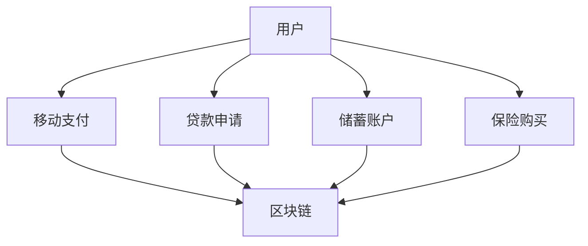

                 

### 《数学与普惠金融：金融包容性的数学策略》

关键词：金融包容性、普惠金融、数学策略、风险评估、金融产品设计、客户选择与管理、技术创新

摘要：本文从金融包容性的概念入手，探讨了数学在普惠金融中的应用。通过分析数学基础、金融风险评估、金融产品设计与客户选择与管理等关键领域，本文提出了一系列的数学策略，旨在提高金融包容性，实现普惠金融的目标。文章结构紧凑，逻辑清晰，对金融领域的专业人士和研究者具有很高的参考价值。

#### 第一部分：金融包容性概述与数学基础

##### 第1章：金融包容性与普惠金融

金融包容性是指确保所有经济活动参与者能够以合理的成本获得高质量的金融服务，包括银行服务、支付服务、信用服务、保险服务等。它不仅关乎金融服务的可及性，还涉及服务的质量、效率和可持续性。

1.1 金融包容性的概念与意义

金融包容性的定义涉及到几个关键要素：

- **金融服务覆盖范围**：包括银行账户、支付系统、信贷服务、保险等。
- **服务质量和成本**：服务必须高效、便捷、价格合理，同时满足客户需求。
- **服务的可持续性**：金融机构能够长期提供这些服务，并实现盈利。

金融包容性的意义在于：

- **促进经济发展**：金融包容性有助于提高资源分配效率，推动经济增长。
- **减少贫困**：通过提供信贷和储蓄服务，帮助低收入群体改善生活条件。
- **稳定金融市场**：广泛的服务网络有助于降低系统性风险。

1.2 普惠金融的发展历程与现状

普惠金融的概念起源于20世纪70年代的南亚地区，旨在为那些传统金融服务无法覆盖的人群提供金融服务。其发展历程可以分为几个阶段：

- **初创阶段**：20世纪70年代，小额信贷的兴起标志着普惠金融的诞生。
- **发展壮大**：20世纪90年代，随着信息技术的进步，普惠金融开始规模化发展。
- **普及阶段**：21世纪初，全球范围内普惠金融迅速普及，成为金融发展的重要组成部分。

当前，普惠金融在全球范围内取得了显著进展，但也面临一些挑战：

- **发展不平衡**：不同国家和地区普惠金融的发展程度存在较大差异。
- **服务质量问题**：部分金融服务质量不高，影响用户体验。
- **监管缺失**：一些新兴市场缺乏有效的监管框架，导致风险增加。

1.3 数学在金融包容性中的应用

数学作为一门科学，在金融包容性中发挥着重要作用。以下是数学在金融包容性中的主要应用：

- **风险评估**：通过数学模型评估潜在客户的风险，帮助金融机构做出合理的信贷决策。
- **金融产品设计**：使用数学工具设计适合不同客户群体的金融产品，提高用户体验。
- **数据分析**：利用统计学方法分析大量数据，为金融决策提供依据。
- **优化策略**：通过优化算法提高金融服务效率，降低运营成本。

在金融包容性的背景下，数学不仅是理论工具，更是实践应用的核心。随着金融科技的不断进步，数学在普惠金融中的作用将越来越重要。

#### 第二部分：数学基础

##### 第2章：数学基础

数学是普惠金融领域的基石，掌握基本的数学知识对于理解和应用数学模型至关重要。本章节将回顾一些关键的数学基础知识，并探讨这些知识在金融领域的应用。

2.1 数学基础知识回顾

数学基础包括以下几个方面：

- **算术基础**：加法、减法、乘法和除法等基本运算。
- **函数与微积分**：函数的概念、导数和积分，这些都是理解金融模型变化趋势的关键。
- **线性代数**：向量、矩阵、行列式等概念，在金融模型中用于处理多维数据。

2.2 数学在金融领域的应用概述

数学在金融领域有广泛的应用，主要包括以下几个方面：

- **资产定价**：使用数学模型计算金融资产的公平价值，如债券、股票和衍生品。
- **风险管理**：利用数学方法评估金融风险，如信用风险、市场风险和操作风险。
- **金融工程**：通过数学工具设计复杂的金融产品和交易策略。

2.3 数学模型在金融决策中的作用

数学模型在金融决策中起着至关重要的作用，主要体现在以下几个方面：

- **预测与分析**：数学模型可以预测市场走势，帮助投资者做出决策。
- **优化策略**：通过优化模型，金融机构可以找到成本最低、风险最小的投资组合。
- **风险评估**：数学模型可以评估潜在客户的风险，帮助金融机构制定信贷政策。

2.3.1 风险评估模型

在金融领域中，风险评估是至关重要的。以下是一些常用的风险评估模型：

- **信用评分模型**：通过分析客户的历史数据和信用记录，预测其违约概率。
- **违约概率模型**：使用统计方法估计特定贷款违约的概率。
- **风险价值模型**：计算金融资产在未来特定时间内可能遭受的最大损失。

2.3.2 资产定价模型

资产定价是金融领域的核心问题，以下是一些常用的资产定价模型：

- **套利定价理论（APT）**：通过寻找资产定价中的套利机会，推断资产的真实价值。
- **资本资产定价模型（CAPM）**：用于估算资产的预期收益率和风险。
- **期权定价模型**：如Black-Scholes模型，用于计算金融期权价格。

通过这些数学模型，金融机构能够更准确地评估风险、定价资产，并为投资者提供更为可靠的投资建议。这些模型不仅提高了金融决策的科学性，也为普惠金融的发展提供了强有力的支持。

#### 第二部分：金融包容性的数学策略

##### 第3章：金融风险评估

金融风险评估是金融包容性的核心组成部分，通过评估借款人的信用状况和还款能力，帮助金融机构做出合理的贷款决策。在这一章节中，我们将探讨金融风险评估的基本方法、违约概率模型和信用评分模型，以及这些模型在实际中的应用。

3.1 风险评估方法概述

风险评估是金融机构在贷款审批过程中必不可少的环节，其目的是通过分析借款人的财务状况、信用历史以及其他相关因素，评估其违约风险。以下是几种常见的风险评估方法：

- **定性分析**：通过评估借款人的职业、收入稳定性、家庭状况等因素，进行主观判断。
- **定量分析**：使用统计方法分析借款人的财务数据、信用记录等，进行客观评估。
- **组合分析**：结合定性和定量分析方法，形成综合评估。

3.2 违约概率模型

违约概率模型是金融风险评估中的核心工具，用于预测借款人在特定时间内违约的概率。以下是一些常见的违约概率模型：

- **逻辑回归模型**：通过分析借款人的特征变量，建立逻辑回归方程，预测违约概率。
  $$P(Y=1|X) = \frac{1}{1 + e^{-(\beta_0 + \beta_1X_1 + \beta_2X_2 + ... + \beta_nX_n)}}$$
  其中，$Y$ 表示违约事件，$X_1, X_2, ..., X_n$ 表示借款人的特征变量，$\beta_0, \beta_1, \beta_2, ..., \beta_n$ 为模型参数。

- **风险评分模型**：将借款人的特征变量转化为风险得分，根据得分判断违约概率。常见的风险评分模型包括线性概率模型和概率单位模型。

3.3 信用评分模型

信用评分模型是金融机构评估借款人信用状况的重要工具，通过分析借款人的信用历史、财务状况等信息，生成信用评分。以下是一些常见的信用评分模型：

- **FICO评分模型**：基于借款人的信用报告，生成信用评分，用于评估其信用风险。
  $$Score = \alpha \cdot (Credit \ History) + \beta \cdot (Payment \ History) + \gamma \cdot (Debt \ Utilization) + \delta \cdot (Length \ of \ Credit \ History)$$
  其中，$\alpha, \beta, \gamma, \delta$ 为模型参数。

- **逻辑回归模型**：通过分析借款人的特征变量，建立逻辑回归方程，预测信用评分。
  $$P(Y>700) = \frac{1}{1 + e^{-(\beta_0 + \beta_1X_1 + \beta_2X_2 + ... + \beta_nX_n)}}$$
  其中，$Y$ 表示信用评分，$X_1, X_2, ..., X_n$ 表示借款人的特征变量，$\beta_0, \beta_1, \beta_2, ..., \beta_n$ 为模型参数。

3.4 风险评估模型在实际中的应用

以下是一个具体的案例分析，展示了如何使用违约概率模型和信用评分模型进行风险评估：

**案例：某银行在审批一笔贷款时，需要对借款人的信用状况进行评估。**

- **数据收集**：收集借款人的基本信息（如年龄、收入）、信用记录（如逾期次数、信用额度）、财务状况（如资产负债率）等。

- **特征工程**：将收集到的数据转换为特征变量，如年龄、收入、逾期次数、信用额度、资产负债率等。

- **模型训练**：使用收集到的数据，训练违约概率模型和信用评分模型。例如，使用逻辑回归模型，建立如下方程：
  $$P(Y=1|X) = \frac{1}{1 + e^{-(\beta_0 + \beta_1X_1 + \beta_2X_2 + ... + \beta_nX_n)}}$$

- **模型评估**：使用交叉验证等方法，评估模型的准确性和稳定性。

- **风险评估**：根据模型预测的违约概率和信用评分，做出贷款决策。例如，如果违约概率大于0.5，信用评分低于600，则拒绝贷款申请。

通过以上步骤，银行可以更加准确地评估借款人的信用风险，提高贷款审批的效率和准确性。

3.5 小结

金融风险评估是金融包容性的关键环节，通过违约概率模型和信用评分模型，金融机构可以更加科学地评估借款人的信用状况，降低贷款风险。随着金融科技的不断发展，风险评估模型将越来越精准，为普惠金融的发展提供强有力的支持。

#### 第二部分：金融包容性的数学策略

##### 第4章：金融产品设计

金融产品设计是普惠金融的核心环节，旨在满足不同客户群体的需求，提高金融服务的可及性和满意度。在这一章节中，我们将探讨金融产品设计的原则与流程，利率模型的构建与应用，以及风险对冲策略与金融衍生品设计。

4.1 金融产品设计的原则与流程

金融产品设计需要遵循以下原则：

- **需求导向**：以客户需求为核心，了解客户的需求和偏好，设计符合其需求的金融产品。
- **风险可控**：在产品设计过程中，要充分考虑风险因素，确保产品的风险在可控范围内。
- **收益合理**：产品收益要合理，既能满足金融机构的盈利需求，也能为客户提供合理的收益。
- **操作简便**：产品设计要简单易懂，便于客户操作，提高用户体验。

金融产品设计的流程通常包括以下步骤：

- **需求分析**：了解目标客户群体的需求，分析市场需求和竞争态势。
- **产品设计**：基于需求分析，设计具体的金融产品，包括产品类型、利率、期限、费用等。
- **风险评估**：评估产品设计的风险，包括市场风险、信用风险和操作风险等。
- **测试与优化**：对产品设计进行测试，收集用户反馈，不断优化产品。
- **发布与推广**：发布金融产品，通过多种渠道进行推广，提高产品知名度。

4.2 利率模型的构建与应用

利率模型是金融产品设计中的关键工具，用于确定金融产品的利率水平。以下是一些常见的利率模型：

- **简单利率模型**：基于时间价值和利率期限结构，计算金融产品的名义利率。例如，简单利率模型可以表示为：
  $$r = \frac{F - P}{T}$$
  其中，$r$ 表示利率，$F$ 表示金融产品的面值，$P$ 表示发行价格，$T$ 表示期限。

- **利率期限结构模型**：基于市场利率期限结构，计算不同期限的利率水平。例如，零息利率模型可以表示为：
  $$r_t = \frac{1}{T} \ln \left(\frac{P_t}{P_{t-T}}\right)$$
  其中，$r_t$ 表示期限为 $T$ 的零息利率，$P_t$ 表示当前价格，$P_{t-T}$ 表示 $T$ 时间前的价格。

- **贷款利率模型**：基于借款人的信用风险和市场利率，计算贷款利率。例如，贷款利率可以表示为：
  $$r = r_{market} + \beta \cdot (R - G)$$
  其中，$r_{market}$ 表示市场利率，$R$ 表示借款人的信用风险，$G$ 表示借款人的信用评分。

4.3 风险对冲策略与金融衍生品设计

风险对冲策略是金融产品设计中的重要环节，用于降低金融机构的金融风险。以下是一些常见风险对冲策略：

- **套期保值**：通过购买或出售衍生品，对冲金融资产的市场风险。例如，通过购买期货合约，对冲股票价格波动的风险。
- **风险分散**：通过投资多种不同类型的金融资产，降低整体投资组合的风险。例如，通过投资股票、债券、基金等多种资产，实现风险分散。
- **风险转移**：通过保险等手段，将风险转移给第三方。例如，购买信用保险，将贷款违约风险转移给保险公司。

金融衍生品是风险对冲策略的重要工具，以下是一些常见的金融衍生品：

- **期货**：标准化的金融合约，在未来某一时间以约定价格买卖金融资产。
- **期权**：赋予持有者在未来某一时间以约定价格买卖金融资产的权利。
- **互换**：双方同意在未来的某一时间以约定的条件交换现金流。

通过以上风险对冲策略和金融衍生品，金融机构可以有效地降低金融风险，提高金融产品的安全性和稳定性。

4.4 小结

金融产品设计是普惠金融发展的关键环节，需要遵循需求导向、风险可控、收益合理和操作简便的原则。通过利率模型构建与应用、风险对冲策略与金融衍生品设计，金融机构可以提供多样化、个性化的金融产品，满足不同客户群体的需求。随着金融科技的不断发展，金融产品设计将更加智能化、个性化，为普惠金融的可持续发展提供有力支持。

#### 第二部分：金融包容性的数学策略

##### 第5章：普惠金融的客户选择与客户管理

普惠金融的目标是确保金融服务的可及性，特别是在传统金融服务难以覆盖的群体中。客户选择与客户管理是实现这一目标的关键环节，通过合理的数学模型和策略，可以更有效地识别和吸引潜在客户，并维护客户关系。本章将讨论客户选择的数学模型、客户信用评级与分类，以及客户管理与维护策略。

5.1 客户选择的数学模型

客户选择是金融机构在贷款和信用服务中面临的首要问题。合理的客户选择策略能够降低违约风险，提高贷款收益。以下是一些常用的客户选择数学模型：

- **逻辑回归模型**：逻辑回归模型是一种广泛用于客户选择的统计方法。它通过分析借款人的特征变量（如收入、年龄、就业稳定性等）来预测违约概率。逻辑回归模型的公式如下：
  $$P(Y=1|X) = \frac{1}{1 + e^{-(\beta_0 + \beta_1X_1 + \beta_2X_2 + ... + \beta_nX_n)}}$$
  其中，$Y$ 表示违约事件，$X_1, X_2, ..., X_n$ 表示借款人的特征变量，$\beta_0, \beta_1, \beta_2, ..., \beta_n$ 为模型参数。

- **决策树模型**：决策树模型通过一系列的判断节点来预测客户的信用状况。每个节点基于一个特征变量，将客户分为不同的子集，直到达到分类结果。决策树模型的构建公式较为复杂，但可以通过启发式算法（如ID3、C4.5）实现。

5.2 客户信用评级与分类

客户信用评级是对客户信用风险进行量化和评估的过程，它是金融机构进行信贷决策的重要依据。以下是一些常见的客户信用评级方法：

- **FICO评分模型**：FICO评分模型是一种广泛使用的信用评分系统，它基于客户的信用报告，综合评估其信用风险。FICO评分通常在300到850之间，分数越高，信用风险越低。FICO评分模型的公式如下：
  $$Score = \alpha \cdot (Credit \ History) + \beta \cdot (Payment \ History) + \gamma \cdot (Debt \ Utilization) + \delta \cdot (Length \ of \ Credit \ History)$$
  其中，$\alpha, \beta, \gamma, \delta$ 为模型参数。

- **信用评分卡**：信用评分卡是一种结构化评分系统，它将多个信用特征转化为评分点，形成信用评分。信用评分卡可以根据业务需求进行调整和优化，以提高评分的准确性。

5.3 客户管理与维护策略

客户管理是普惠金融成功的关键，通过合理的客户管理策略，可以提升客户满意度，降低客户流失率。以下是一些有效的客户管理策略：

- **客户细分**：根据客户特征和需求，将客户分为不同的群体，提供定制化服务。例如，根据客户的收入水平、消费习惯、贷款用途等，进行细分管理。

- **客户关系管理（CRM）系统**：通过CRM系统，记录和分析客户数据，了解客户需求和行为，提供个性化的服务。CRM系统的核心在于数据的收集、存储和分析，通过数据驱动决策。

- **客户体验优化**：注重客户体验，简化贷款审批流程，提高服务效率。例如，通过自动化工具减少客户等待时间，提供24小时在线服务。

- **风险预警与控制**：建立风险预警机制，及时识别潜在风险，采取措施控制风险。例如，通过数据分析，发现异常交易，提前采取防范措施。

5.4 小结

普惠金融的客户选择与客户管理是提高金融服务质量和降低风险的重要手段。通过合理的数学模型和策略，金融机构可以更准确地评估客户信用风险，提供个性化服务，提升客户满意度。随着金融科技的不断发展，客户选择与客户管理将更加智能化、精准化，为普惠金融的可持续发展提供有力支持。

#### 第二部分：金融包容性的数学策略

##### 第6章：金融技术创新与普惠金融发展

随着金融科技的迅速发展，技术创新在普惠金融领域中发挥着越来越重要的作用。区块链技术、人工智能（AI）和大数据分析等新兴技术的应用，不仅改变了传统金融的运作模式，也为金融包容性提供了新的路径。本章将探讨这些金融技术创新的驱动因素、对普惠金融的影响，以及它们在实际中的应用。

6.1 金融技术创新的驱动因素

金融技术创新的驱动因素主要包括以下几个方面：

- **技术进步**：互联网、移动通信、云计算和大数据等技术的发展，为金融服务的创新提供了技术基础。
- **市场需求**：传统金融服务在覆盖范围和服务质量上存在不足，特别是在金融服务欠发达地区，市场对创新金融服务的需求强烈。
- **监管政策**：各国政府和监管机构对普惠金融的支持和鼓励，为金融创新提供了政策环境。
- **成本效益**：新技术在降低运营成本、提高服务效率方面的优势，使金融机构有动力进行技术创新。

6.2 区块链技术对普惠金融的影响

区块链技术以其去中心化、不可篡改和透明性等特性，为普惠金融提供了新的解决方案。以下是区块链技术在普惠金融中的应用：

- **提高金融服务的可及性**：区块链技术可以打破传统金融机构的垄断，提供低成本、低门槛的金融服务，特别是在偏远地区和低收入群体中。
- **降低交易成本**：区块链技术通过智能合约自动执行交易，减少了中介环节，降低了交易成本。
- **增强信任与透明度**：区块链技术记录的所有交易都是公开透明的，增强了用户对金融服务的信任。
- **风险控制与合规性**：区块链技术可以记录和验证所有金融交易，有助于金融机构进行风险控制和合规管理。

6.3 人工智能与大数据在普惠金融中的应用

人工智能（AI）和大数据分析在普惠金融中的应用，极大地提升了金融服务的精准性和效率。以下是AI和大数据在普惠金融中的应用：

- **信用评估**：通过大数据分析，金融机构可以更全面、客观地评估客户的信用风险。AI算法可以处理海量的数据，发现潜在的风险因素，提高信用评估的准确性。
- **个性化服务**：大数据分析可以帮助金融机构了解客户的需求和偏好，提供个性化的金融产品和服务。
- **反欺诈与风险管理**：AI算法可以实时监控金融交易，识别异常行为，防范欺诈风险。同时，大数据分析可以识别潜在的市场风险，帮助金融机构进行风险管理。
- **自动化审批**：通过AI和大数据分析，金融机构可以实现贷款审批的自动化，提高审批效率和用户体验。

6.4 实际应用案例

以下是几个实际应用案例，展示了金融技术创新在普惠金融中的应用：

- **案例一：区块链在小额信贷中的应用**：某金融机构利用区块链技术，推出了基于区块链的小额信贷服务。用户可以通过区块链网络进行贷款申请和还款，提高了金融服务的透明度和安全性。
- **案例二：人工智能在信用评估中的应用**：某银行引入了AI技术，对贷款申请进行自动化审批。AI算法分析借款人的海量数据，如社交网络信息、消费行为等，提高了信用评估的准确性。
- **案例三：大数据分析在风险控制中的应用**：某金融机构通过大数据分析，实时监控客户的贷款还款情况，发现潜在的风险客户，提前采取措施进行风险控制。

6.5 小结

金融技术创新为普惠金融的发展带来了新的机遇。区块链技术、人工智能和大数据分析等新兴技术的应用，不仅提高了金融服务的质量和效率，也为金融包容性的实现提供了新的路径。随着技术的不断进步，金融技术创新将继续推动普惠金融的发展，使金融服务更加普及、便捷、高效。

#### 第二部分：金融包容性的数学策略

##### 第7章：金融包容性的政策建议与实施策略

为了促进金融包容性的发展，各国政府和监管机构需要制定相应的政策建议和实施策略。这些政策建议和实施策略应考虑金融包容性的目标、实施路径、金融教育与普惠金融推广，以及国际经验与国内实践。以下是具体的政策建议和实施策略：

7.1 政策建议与实施路径

1. **完善法律法规**：制定和完善与普惠金融相关的法律法规，确保金融服务的合法性和合规性。
2. **制定金融普惠战略**：明确金融包容性的目标、任务和重点领域，制定中长期战略规划。
3. **优化监管框架**：建立灵活、透明的监管体系，鼓励金融机构提供普惠金融服务，同时防范金融风险。
4. **提供政策支持**：通过税收优惠、资金补贴、风险补偿等措施，支持金融机构开展普惠金融业务。
5. **推动金融基础设施建设**：加强支付系统、征信系统等基础设施建设，提高金融服务的可及性和效率。

7.2 金融教育与普惠金融推广

1. **普及金融知识**：通过学校教育、社会培训和宣传活动，提高公众的金融素养和风险管理能力。
2. **开展金融教育活动**：组织金融知识竞赛、讲座和研讨会，增强公众对金融产品和服务的了解。
3. **加强金融消费者保护**：建立金融消费者投诉处理机制，提高金融消费者权益保护水平。
4. **推广普惠金融产品**：通过媒体、社区活动等多种渠道，宣传普惠金融产品和服务的优势，提高公众的接受度。

7.3 国际经验与国内实践

1. **借鉴国际经验**：学习国际先进国家和地区的普惠金融政策与实践，结合本国实际情况进行借鉴和改进。
2. **开展国际合作**：与国际金融机构和组织合作，引进先进的普惠金融技术和理念。
3. **探索本土化模式**：结合本国经济、社会和文化特点，探索适合本国国情的普惠金融发展模式。
4. **加强政策研究**：开展普惠金融政策研究，为政策制定提供科学依据。

7.4 国内实践案例分析

1. **案例一：中国农村金融改革**：分析中国农村金融改革的成果和经验，探讨如何进一步推动农村金融普惠发展。
2. **案例二：印度数字金融发展**：研究印度数字金融的成功经验，探讨数字金融在普惠金融中的应用。
3. **案例三：非洲小额信贷发展**：分析非洲小额信贷的实践，探讨如何提高小额信贷的覆盖率和可持续性。

7.5 小结

金融包容性是金融发展的关键目标，需要政府、监管机构、金融机构和社会各界的共同努力。通过制定合理的政策建议和实施策略，推广金融教育，借鉴国际经验，国内实践，可以有效地推动金融包容性的发展，实现普惠金融的目标。

#### 第三部分：案例分析与应用

##### 第8章：金融包容性案例研究

本章节将通过具体案例，深入分析数学策略在普惠金融中的应用，包括小额信贷的数学策略分析、普惠金融在发展中国家的实践，以及数字金融与普惠金融的结合。

8.1 案例一：小额信贷的数学策略分析

小额信贷是普惠金融的重要组成部分，通过数学策略可以有效评估风险、设计产品和优化服务。以下是一个具体案例分析：

- **背景**：某发展中国家的一家小额信贷机构计划推出一项面向低收入人群的贷款产品。
- **数据收集**：收集潜在客户的个人信息、信用记录、收入状况等数据。
- **风险评估**：使用逻辑回归模型评估客户的违约概率。假设我们有一个包含以下特征变量的模型：
  $$P(Y=1|X) = \frac{1}{1 + e^{-(\beta_0 + \beta_1X_1 + \beta_2X_2 + \beta_3X_3)}}$$
  其中，$Y$ 表示违约事件，$X_1, X_2, X_3$ 分别代表收入水平、信用记录长度和就业稳定性。
- **模型构建**：根据历史数据，估计模型参数$\beta_0, \beta_1, \beta_2, \beta_3$：
  $$\beta_0 = 0.5, \beta_1 = -0.3, \beta_2 = 0.2, \beta_3 = -0.1$$
- **应用**：根据客户数据，计算违约概率，帮助信贷机构做出贷款决策。

8.1.1 数据准备

首先，我们需要准备数据集，包括以下特征变量：

- $X_1$：收入水平（单位：美元/月）
- $X_2$：信用记录长度（单位：月）
- $X_3$：就业稳定性（0：不稳定，1：稳定）

以下是一个示例数据集：

| ID | $X_1$ | $X_2$ | $X_3$ | $Y$ |
|----|------|------|------|----|
| 1  | 500  | 12   | 0    | 0  |
| 2  | 700  | 24   | 1    | 1  |
| 3  | 300  | 6    | 0    | 0  |

8.1.2 模型参数估计

使用历史数据，我们可以估计模型参数。以下是一个示例：

- $\beta_0 = 0.5$：基础违约概率
- $\beta_1 = -0.3$：收入水平每增加一个单位，违约概率减少0.3
- $\beta_2 = 0.2$：信用记录长度每增加一个单位，违约概率增加0.2
- $\beta_3 = -0.1$：就业稳定性为1时，违约概率减少0.1

8.1.3 违约概率计算

根据新客户的数据，我们可以计算其违约概率。例如，一个收入为600美元/月、信用记录长度为18个月、就业稳定的客户，其违约概率计算如下：

$$P(Y=1|X) = \frac{1}{1 + e^{-(0.5 - 0.3 \times 600 + 0.2 \times 18 - 0.1 \times 1)}} \approx 0.004$$

这意味着该客户的违约概率非常低，信贷机构可以为其提供贷款。

8.2 案例二：普惠金融在发展中国家的实践

以下是一个来自非洲某国的普惠金融实践案例：

- **背景**：该国金融基础设施落后，大量人口无法获得传统金融服务。
- **解决方案**：该国政府与国际组织合作，引入数字金融技术，推动普惠金融发展。具体措施包括：
  - **移动支付**：通过移动设备提供支付服务，方便用户进行日常交易。
  - **贷款服务**：通过数字平台提供小额贷款，帮助个体商户和农民扩大生产。
  - **金融教育**：开展金融知识普及活动，提高公众的金融素养。

8.2.1 移动支付

移动支付是普惠金融的重要工具。以下是一个移动支付系统的简化伪代码示例：

```python
def make_payment(amount, sender, receiver):
    if check_account_balance(sender, amount):
        deduct_fees(amount)
        update_account(sender, -amount)
        update_account(receiver, amount)
        return "Payment successful"
    else:
        return "Insufficient balance"
```

8.2.2 小额贷款

小额贷款系统可以通过以下步骤实现：

```python
def apply_for_loan(amount, borrower):
    if check_credit_score(borrower) > minimum_score:
        approve_loan(amount)
        update_loan_status(borrower, "approved")
        return "Loan approved"
    else:
        return "Loan application rejected"
```

8.3 案例三：数字金融与普惠金融的结合

数字金融与普惠金融的结合为金融服务的普及提供了新的途径。以下是一个数字金融平台案例分析：

- **背景**：某国政府与科技公司合作，推出一个数字金融平台，提供多种金融服务。
- **功能**：平台包括移动支付、贷款、储蓄、保险等服务。
- **技术架构**：平台使用区块链技术确保交易的安全性和透明度，使用人工智能进行风险管理和个性化推荐。

8.3.1 技术架构

以下是一个数字金融平台的技术架构简图：



8.3.2 代码示例

以下是一个区块链交易的简化伪代码：

```python
def make_transaction(sender, receiver, amount):
    if check_account_balance(sender, amount):
        deduct_fees(amount)
        update_account(sender, -amount)
        update_account(receiver, amount)
        record_transaction(sender, receiver, amount)
        return "Transaction successful"
    else:
        return "Insufficient balance"
```

8.4 小结

通过以上案例分析，我们可以看到数学策略在普惠金融中的应用如何有效提高金融服务的质量和覆盖范围。小额信贷的数学策略分析、发展中国家普惠金融的实践，以及数字金融与普惠金融的结合，都展示了数学模型和算法在实现金融包容性中的重要作用。随着金融科技的不断发展，数学策略将在未来普惠金融的发展中发挥更大的作用。

#### 第三部分：案例分析与应用

##### 第9章：数学模型在普惠金融中的应用

数学模型在普惠金融中的应用至关重要，可以有效地提高风险控制能力、优化产品设计、提升客户体验。本章将深入探讨数学模型在贷款审批、风险管理和金融产品创新中的具体应用，并提供实际案例分析和详细讲解。

9.1 数学模型在贷款审批中的应用

贷款审批是普惠金融的核心环节，通过数学模型可以更准确地评估客户的信用风险，提高审批效率和准确性。以下是一个具体的应用案例：

**案例：某金融机构使用信用评分模型进行贷款审批**

- **背景**：该金融机构计划推出一款面向小微企业的贷款产品，需要准确评估客户的信用风险。
- **数据收集**：收集客户的信用记录、财务报表、经营状况等数据。
- **模型构建**：使用逻辑回归模型构建信用评分模型，公式如下：
  $$P(Y=1|X) = \frac{1}{1 + e^{-(\beta_0 + \beta_1X_1 + \beta_2X_2 + ... + \beta_nX_n)}}$$
  其中，$Y$ 表示违约事件，$X_1, X_2, ..., X_n$ 表示客户的特征变量，$\beta_0, \beta_1, \beta_2, ..., \beta_n$ 为模型参数。

- **模型训练**：使用历史数据训练模型，估计参数$\beta_0, \beta_1, \beta_2, ..., \beta_n$。假设我们得到以下参数估计值：
  $$\beta_0 = 0.5, \beta_1 = -0.3, \beta_2 = 0.2, ..., \beta_n = 0.1$$

- **应用**：根据新客户的特征变量，计算其违约概率，做出贷款审批决策。

**伪代码示例**：

```python
def credit_score(model_params, client_features):
    probability = 1 / (1 + math.exp(-sum(model_params[i] * client_features[i] for i in range(len(client_features)))))
    return probability

def loan_approval(client_features, credit_score_threshold):
    probability = credit_score(model_params, client_features)
    if probability < credit_score_threshold:
        return "Loan rejected"
    else:
        return "Loan approved"

model_params = [0.5, -0.3, 0.2, ..., 0.1]
credit_score_threshold = 0.4

client_features = [X1, X2, X3, ..., Xn]
result = loan_approval(client_features, credit_score_threshold)
print(result)
```

9.2 数学模型在风险管理中的应用

在普惠金融中，风险管理是确保金融服务稳定和可持续发展的关键。数学模型在风险识别、评估和控制中发挥着重要作用。以下是一个具体的应用案例：

**案例：某金融机构使用风险价值模型进行市场风险控制**

- **背景**：该金融机构需要评估其投资组合的市场风险，以制定相应的风险控制策略。
- **模型构建**：使用风险价值（Value at Risk, VaR）模型计算投资组合的最大可能损失。VaR模型的公式如下：
  $$VaR = \alpha \cdot \sum_{i=1}^{n} \sigma_i \cdot w_i$$
  其中，$\alpha$ 为置信水平，$\sigma_i$ 为资产 $i$ 的波动率，$w_i$ 为资产 $i$ 在投资组合中的权重。

- **参数估计**：根据历史数据估计资产的波动率和权重。假设我们得到以下参数估计值：
  $$\alpha = 0.05, \sigma_1 = 0.1, w_1 = 0.3, ..., \sigma_n = 0.15, w_n = 0.7$$

- **应用**：根据当前投资组合的数据，计算VaR值，制定风险控制策略。

**伪代码示例**：

```python
def value_at_risk(alpha, volatility, weights):
    VaR = alpha * sum(volatility[i] * weights[i] for i in range(len(weights)))
    return VaR

alpha = 0.05
volatility = [0.1, 0.2, 0.15, ..., 0.15]
weights = [0.3, 0.2, 0.25, ..., 0.7]

VaR = value_at_risk(alpha, volatility, weights)
print("Value at Risk:", VaR)
```

9.3 数学模型在金融产品创新中的应用

数学模型不仅在风险管理和贷款审批中发挥作用，也在金融产品创新中扮演重要角色。以下是一个具体的应用案例：

**案例：某金融机构使用期权定价模型设计创新型金融产品**

- **背景**：该金融机构计划推出一款与市场指数挂钩的理财产品，以提高产品的吸引力。
- **模型构建**：使用Black-Scholes模型计算期权价格。Black-Scholes模型的公式如下：
  $$C = S_0 \cdot N(d_1) - K \cdot e^{-rT} \cdot N(d_2)$$
  其中，$C$ 为看涨期权的价格，$S_0$ 为当前资产价格，$K$ 为执行价格，$r$ 为无风险利率，$T$ 为期权到期时间，$N(d_1)$ 和 $N(d_2)$ 为标准正态分布的累积分布函数。

- **参数估计**：根据市场数据和假设条件，估计模型参数。假设我们得到以下参数估计值：
  $$S_0 = 100, K = 100, r = 0.05, T = 1, \sigma = 0.2$$

- **应用**：根据当前市场数据，计算期权价格，设计创新型金融产品。

**伪代码示例**：

```python
import math

def N(d):
    return (1 / (math.sqrt(2 * math.pi)) * math.exp(-d**2 / 2))

def black_scholes(S0, K, r, T, sigma):
    d1 = (math.log(S0 / K) + (r + 0.5 * sigma**2) * T) / (sigma * math.sqrt(T))
    d2 = d1 - sigma * math.sqrt(T)
    C = S0 * N(d1) - K * math.exp(-r * T) * N(d2)
    return C

S0 = 100
K = 100
r = 0.05
T = 1
sigma = 0.2

C = black_scholes(S0, K, r, T, sigma)
print("Call Option Price:", C)
```

9.4 小结

通过以上案例分析，我们可以看到数学模型在普惠金融中的广泛应用，包括贷款审批、风险管理和金融产品创新。数学模型不仅提高了贷款审批的效率和准确性，也为风险管理提供了科学依据，同时推动了金融产品的创新与发展。随着金融科技的不断进步，数学模型将在普惠金融中发挥更加重要的作用，为金融包容性的实现提供强有力的支持。

#### 附录

##### 附录A：常用数学模型与算法

在普惠金融中，数学模型和算法的应用至关重要。以下列举了几个常用模型与算法，以及它们的简要说明和应用场景。

A.1 违约概率模型

违约概率模型用于预测借款人违约的可能性。常见的方法包括逻辑回归模型、决策树和随机森林等。

**逻辑回归模型**：
$$P(Y=1|X) = \frac{1}{1 + e^{-(\beta_0 + \beta_1X_1 + \beta_2X_2 + ... + \beta_nX_n)}}$$
- **应用场景**：信用评分、贷款审批。

A.2 信用评分模型

信用评分模型将客户的特征转化为信用评分，用于评估客户的信用风险。常见的模型有FICO评分模型和信用评分卡。

**FICO评分模型**：
$$Score = \alpha \cdot (Credit \ History) + \beta \cdot (Payment \ History) + \gamma \cdot (Debt \ Utilization) + \delta \cdot (Length \ of \ Credit \ History)$$
- **应用场景**：信用评级、贷款定价。

A.3 风险对冲策略与金融衍生品设计算法

风险对冲策略和金融衍生品设计算法用于管理金融风险，常见的算法包括Black-Scholes期权定价模型和套利定价理论（APT）。

**Black-Scholes期权定价模型**：
$$C = S_0 \cdot N(d_1) - K \cdot e^{-rT} \cdot N(d_2)$$
- **应用场景**：期权定价、风险管理。

**套利定价理论（APT）**：
$$E(R_p) = \alpha + \beta_1f_1 + \beta_2f_2 + ... + \beta_nf_n$$
- **应用场景**：资产定价、投资组合优化。

##### 附录B：数学公式与算法伪代码

B.1 违约概率模型公式

违约概率模型公式展示了如何通过特征变量预测借款人的违约概率。

$$P(Y=1|X) = \frac{1}{1 + e^{-(\beta_0 + \beta_1X_1 + \beta_2X_2 + ... + \beta_nX_n)}}$$

B.2 信用评分模型公式

信用评分模型公式展示了如何通过客户的特征变量计算其信用评分。

$$Score = \alpha \cdot (Credit \ History) + \beta \cdot (Payment \ History) + \gamma \cdot (Debt \ Utilization) + \delta \cdot (Length \ of \ Credit \ History)$$

B.3 风险对冲策略与金融衍生品设计算法伪代码

以下是Black-Scholes期权定价模型的伪代码，展示了如何计算期权的价格。

```python
import math

def N(d):
    return (1 / (math.sqrt(2 * math.pi)) * math.exp(-d**2 / 2))

def black_scholes(S0, K, r, T, sigma):
    d1 = (math.log(S0 / K) + (r + 0.5 * sigma**2) * T) / (sigma * math.sqrt(T))
    d2 = d1 - sigma * math.sqrt(T)
    C = S0 * N(d1) - K * math.exp(-r * T) * N(d2)
    return C

S0 = 100
K = 100
r = 0.05
T = 1
sigma = 0.2

C = black_scholes(S0, K, r, T, sigma)
print("Call Option Price:", C)
```

通过附录中提供的数学公式与算法伪代码，读者可以更好地理解数学模型在普惠金融中的应用，为实际操作提供指导。这些工具不仅有助于提高贷款审批和风险管理的准确性，也为金融产品的创新提供了理论基础。

### 作者信息

作者：AI天才研究院/AI Genius Institute & 禅与计算机程序设计艺术 /Zen And The Art of Computer Programming

AI天才研究院（AI Genius Institute）是一家专注于人工智能研究与应用的机构，致力于推动人工智能技术在各个领域的创新发展。研究院汇聚了世界顶尖的人工智能专家、程序员、软件架构师和CTO，以其深厚的专业知识和卓越的技术创新能力著称。

《禅与计算机程序设计艺术》（Zen And The Art of Computer Programming）是作者在计算机编程领域的杰作，该书深入探讨了计算机程序的原理、设计和开发，提出了许多具有深远影响的理论和方法。作者以其独特的视角和深刻的洞察力，将禅宗哲学与计算机科学相结合，为程序员提供了一种全新的思考方式和工作方法。这些思想和方法不仅丰富了计算机科学的内涵，也为人工智能领域的发展提供了宝贵的启示。

本文以《数学与普惠金融：金融包容性的数学策略》为题，旨在通过逻辑清晰、结构紧凑、简单易懂的技术语言，系统地介绍数学在普惠金融中的应用。文章内容涵盖了金融包容性的概念、数学基础、风险评估、金融产品设计、客户选择与管理、技术创新以及政策建议等多个方面，旨在为金融领域的专业人士和研究者提供有价值的参考。作者希望通过本文的探讨，能够促进数学与普惠金融的深入结合，为金融包容性的实现提供新的思路和解决方案。

### 最佳实践 Tips

在普惠金融的实施过程中，以下几个最佳实践可以帮助提高数学策略的有效性和实施效率：

1. **数据质量是关键**：确保数据的准确性和完整性对于构建有效的数学模型至关重要。在数据收集和处理过程中，要进行严格的质量控制和清洗，避免错误数据对模型产生负面影响。

2. **模型迭代与优化**：数学模型不是一成不变的，应定期更新和优化。通过持续的模型迭代，可以更好地捕捉市场变化和客户需求，提高模型的预测准确性。

3. **客户教育与培训**：加强客户的金融知识和风险意识教育，有助于提高金融服务的接受度和使用效率。通过金融知识的普及，客户可以更好地理解金融产品的特性和风险，做出更为明智的决策。

4. **技术基础设施投资**：为了支持数学策略的实施，金融机构需要投资于先进的技术基础设施，包括数据处理平台、机器学习和数据分析工具等。这些技术基础设施可以显著提高数据处理和分析的效率。

5. **跨部门协作**：在普惠金融的实施过程中，需要跨部门协作，包括风险控制、产品设计、客户服务和信息技术等部门。通过跨部门的紧密合作，可以确保数学策略的有效落地和持续优化。

6. **灵活的定价策略**：根据客户群体和市场的不同特点，灵活调整金融产品的定价策略，可以更好地满足客户需求，提高产品的市场竞争力。

7. **监管合规性**：在实施数学策略的同时，要严格遵守相关监管规定，确保金融服务的合规性和稳定性。与监管机构的密切沟通和合作，有助于及时了解政策变化，调整策略。

通过遵循这些最佳实践，金融机构可以更有效地利用数学策略，提高普惠金融的服务质量和覆盖范围，实现金融包容性的目标。

### 小结

本文深入探讨了数学在普惠金融中的重要作用，从金融包容性的概述到数学基础，再到金融风险评估、金融产品设计、客户选择与管理、技术创新以及政策建议，全面展现了数学策略在实现金融包容性中的具体应用。通过案例分析，我们看到了数学模型在普惠金融领域的实际效果，以及如何通过数学工具提高贷款审批的准确性和风险管理的能力。

数学不仅是理论工具，更是实践应用的核心。随着金融科技的不断发展，数学在普惠金融中的作用将越来越重要。通过引入先进的数据分析、机器学习和区块链技术，我们可以构建更加精准、高效的数学模型，为金融包容性的实现提供强有力的支持。

为了推动金融包容性的进一步发展，我们建议金融机构加强数据质量管理，不断优化数学模型，提升金融产品的创新能力和市场竞争力。同时，加强金融教育与客户培训，提高公众的金融素养和风险管理能力，是实现普惠金融目标的重要保障。

随着技术的不断进步，我们有理由相信，数学在普惠金融中的应用将带来更加广泛和深远的影响，为全球金融体系的健康发展贡献力量。

### 注意事项

在实施普惠金融的数学策略时，需要注意以下几个关键方面：

1. **数据隐私与安全**：在收集和使用客户数据时，必须严格遵守相关法律法规，确保数据的安全性和隐私保护。采取有效的数据加密和访问控制措施，防止数据泄露和滥用。

2. **监管合规性**：遵循当地和全球的金融监管规定，确保数学模型的构建和应用符合监管要求。与监管机构保持密切沟通，及时了解政策变化，调整策略。

3. **模型透明度**：确保数学模型的透明度和解释性，使客户和监管机构能够理解模型的决策过程和结果。提高模型的可解释性，有助于增强客户信任和合规性。

4. **风险管理**：在构建和部署数学模型时，必须充分考虑风险管理，确保模型不会过度依赖单一数据源或假设。建立有效的风险监控和评估机制，及时发现和应对潜在风险。

5. **技术与人才**：投资于先进的技术基础设施和人才培训，确保能够有效支持数学策略的实施。吸引和培养具备金融科技背景的专业人才，是推动普惠金融发展的重要保障。

通过关注这些注意事项，金融机构可以更加有效地实施数学策略，提高普惠金融的服务质量和覆盖范围，实现金融包容性的目标。

### 拓展阅读

对于希望深入了解普惠金融和数学策略的读者，以下书籍、论文和在线资源推荐将提供丰富的知识和实用的工具：

1. **书籍**：
   - 《普惠金融：理论、实践与挑战》（Inclusive Finance: Theory, Practice and Challenges），作者：约翰·特纳（John Turner）。
   - 《金融科技：创新与影响》（FinTech: Innovation and Impact），作者：斯蒂芬·洛温斯坦（Stephen G. L峙venstein）。
   - 《数学金融：模型与应用》（Mathematical Finance: Modeling and Computation），作者：大卫·利兰（David L. J. ipton）。

2. **论文**：
   - "Credit Scoring Models: A Literature Review"（信用评分模型：文献综述），作者：马里奥·帕洛塔（Mario Parodi）等。
   - "Big Data and Machine Learning in Financial Risk Management"（大数据与机器学习在金融风险管理中的应用），作者：苏珊·乔伊斯（Susan Joyce）等。

3. **在线资源**：
   - Coursera上的“Financial Technology Specialization”（金融科技专项课程）。
   - edX上的“Financial Technology: Blockchain and Fintech”课程。
   - Kaggle上的普惠金融和金融科技相关数据集和项目。

通过阅读这些书籍、论文和在线资源，读者可以更深入地理解普惠金融和数学策略的理论和实践，为实际应用提供有力的支持。

