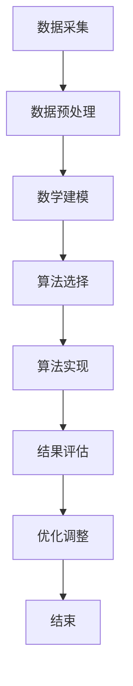

                 

# 《数学与智能交通：交通流量的数学优化》

## 摘要

随着城市化进程的加速和汽车保有量的不断增加，交通拥堵问题已经成为全球范围内亟待解决的难题。本文以数学与智能交通为主题，探讨交通流量的数学优化问题。文章首先介绍了智能交通系统的基本概念和架构，然后深入分析了交通流量的数学建模和优化原理，探讨了包括线性规划、动态规划、遗传算法和粒子群优化算法在内的多种优化算法。文章最后通过实际应用案例，展示了数学优化在交通信号控制和交通网络路由优化中的效果，并展望了未来智能交通系统的发展趋势。

## 引言

### 智能交通系统的概念与重要性

智能交通系统（Intelligent Transportation System，简称ITS）是一种利用信息技术、数据通信传输技术、电子传感技术、电子控制技术及计算机处理技术对现代城市交通系统进行集成和优化管理的技术系统。其主要目的是通过提高交通效率、降低交通事故率和减少交通拥堵，来改善城市交通环境。

智能交通系统的发展经历了从单一功能向综合集成应用的演变过程。早期的智能交通系统主要侧重于交通信息采集和发布，如交通广播、电子显示屏等。随着技术的进步，智能交通系统逐渐引入了车辆定位、自动驾驶、交通信号控制等高科技手段，形成了今天涵盖多个层面的综合交通管理体系。

### 交通流量的重要性

交通流量是智能交通系统中的核心数据之一，它直接关系到道路的通行能力和服务质量。优化交通流量不仅可以缓解交通拥堵，提高道路通行效率，还可以减少能源消耗和环境污染。

然而，实际中的交通流量具有复杂性和动态性，受多种因素影响，如天气、节假日、交通事故等。因此，如何准确预测和优化交通流量，成为智能交通系统研究和应用中的一个重要课题。

### 数学优化在智能交通中的应用

数学优化作为一种有效的工具，广泛应用于交通流量的预测和优化。本文将详细探讨几种常见的数学优化算法，包括线性规划、动态规划、遗传算法和粒子群优化算法，并分析它们在智能交通系统中的应用。

## 第一部分：智能交通系统概述

### 第1章：智能交通系统基础

#### 1.1 智能交通系统的概念与历史背景

##### 1.1.1 智能交通系统的定义

智能交通系统（ITS）是指通过集成先进的信息通信技术、控制技术、电子技术、计算机技术和网络技术，实现交通的智能管理，从而提高交通系统的运行效率、安全性和舒适性，减少交通拥堵和环境污染。ITS不仅涵盖了传统的交通管理功能，还包括了智能交通信息服务、智能车辆控制、智能交通基础设施等多个方面。

##### 1.1.2 智能交通系统的发展历程

智能交通系统的发展可以分为以下几个阶段：

1. **初级阶段（20世纪60年代至80年代）**：主要侧重于交通信息收集和发布，如交通广播、电子显示屏等。

2. **发展阶段（20世纪80年代至90年代）**：开始引入计算机和通信技术，如车辆检测器、交通信号控制等。

3. **成熟阶段（21世纪以来）**：智能交通系统逐渐走向集成化、智能化，涵盖了更多的高科技应用，如自动驾驶、车联网等。

#### 1.2 智能交通系统的架构与组成部分

##### 1.2.1 智能交通系统的总体架构

智能交通系统的总体架构通常包括以下几个层次：

1. **感知层**：通过各种传感器和检测设备，实时获取交通信息，如车辆速度、流量、道路状况等。

2. **传输层**：利用通信技术，将感知层获取的数据传输到中心处理系统。

3. **处理层**：对传输层的数据进行处理、分析和优化，生成决策信息。

4. **执行层**：根据处理层的决策信息，控制交通信号、调整交通流量等。

##### 1.2.2 智能交通系统的关键组成部分

智能交通系统主要由以下几个关键部分组成：

1. **交通信号控制**：通过优化交通信号相位、时长，提高道路通行能力。

2. **车辆检测与定位**：利用传感器和GPS等技术，实时监测车辆位置和速度。

3. **交通信息发布**：通过广播、电子显示屏等途径，向驾驶员提供实时交通信息。

4. **车辆通信与协同**：实现车辆之间的通信，协同完成驾驶任务。

#### 1.3 智能交通系统的作用与挑战

##### 1.3.1 智能交通系统的主要作用

智能交通系统的主要作用包括：

1. **提高交通效率**：通过优化交通信号、调整交通流量，减少拥堵。

2. **降低交通事故率**：通过实时监控、预警和自动化控制，降低事故发生概率。

3. **减少环境污染**：通过优化交通流量，降低尾气排放。

4. **提高出行体验**：提供实时交通信息，帮助驾驶员选择最佳路线。

##### 1.3.2 智能交通系统面临的挑战

智能交通系统在发展过程中也面临着一系列挑战：

1. **数据采集与处理**：交通数据的采集、处理和分析是智能交通系统的核心，然而数据量大、实时性要求高，给数据处理带来了巨大挑战。

2. **系统可靠性**：智能交通系统依赖于各种传感器和通信设备，系统的可靠性直接关系到交通管理的效果。

3. **隐私保护**：交通数据中包含大量个人隐私信息，如何在保护隐私的前提下进行数据处理，是智能交通系统面临的一大难题。

4. **技术融合与创新**：智能交通系统需要不断融合新技术，如人工智能、大数据等，以实现更高效、更智能的交通管理。

## 第二部分：交通流量数学优化原理

### 第2章：交通流量的数学建模

#### 2.1 交通流量的基本概念与模型

##### 2.1.1 交通流量的定义

交通流量是指单位时间内通过某一交通路段的车辆数量。通常用每小时车辆数（PCU/h）来表示。交通流量是衡量道路通行能力的重要指标，也是交通流量优化的重要基础。

##### 2.1.2 常见交通流量模型

常见的交通流量模型包括以下几种：

1. **泊松模型**：假设交通流量服从泊松分布，适用于描述随机事件发生的情况。

2. **负二项模型**：在泊松模型的基础上，考虑车辆到达时间间隔的多样性，适用于描述非随机事件发生的情况。

3. **韦伯模型**：适用于描述高峰期交通流量，考虑了车辆到达时间的集中性。

#### 2.2 交通流量的数学描述方法

##### 2.2.1 常见交通流量的数学描述方法

交通流量的数学描述方法主要包括以下几种：

1. **概率分布描述**：使用概率分布函数来描述交通流量，如泊松分布、负二项分布等。

2. **差分方程描述**：通过差分方程来描述交通流量随时间的变化，如一阶差分方程、二阶差分方程等。

3. **微分方程描述**：通过微分方程来描述交通流量随时间的变化，如连续流模型、流量平衡方程等。

##### 2.2.2 交通流量的时空特性

交通流量的时空特性是指交通流量在时间和空间上的分布特性。交通流量的时空特性受多种因素影响，如天气、时间、道路状况等。

1. **时间特性**：交通流量在时间上的分布特性通常表现为一定的周期性，如早高峰、晚高峰等。

2. **空间特性**：交通流量在空间上的分布特性通常表现为一定的集中性，如市中心区域、交通枢纽等。

#### 2.3 交通流量优化的基本原理

##### 2.3.1 交通流量优化的目标

交通流量优化的主要目标是：

1. **提高道路通行能力**：通过优化交通信号、调整交通流量，提高道路的通行能力。

2. **降低交通拥堵**：通过优化交通流量，减少交通拥堵，提高道路服务水平。

3. **减少能源消耗和环境污染**：通过优化交通流量，减少车辆在拥堵状态下的行驶时间，降低能源消耗和环境污染。

##### 2.3.2 交通流量优化的基本策略

交通流量优化的基本策略包括：

1. **交通信号优化**：通过调整交通信号的相位、时长，优化交通流。

2. **交通组织优化**：通过优化道路布局、车道分配等，提高道路通行效率。

3. **交通信息优化**：通过提供实时交通信息，引导驾驶员选择最佳路线，优化交通流量。

## 第三部分：交通流量优化算法

### 第3章：交通流量优化算法

#### 3.1 线性规划方法

##### 3.1.1 线性规划的基本概念

线性规划（Linear Programming，简称LP）是一种数学优化方法，用于在满足一组线性约束条件下，最大化或最小化一个线性目标函数。线性规划的基本形式如下：

$$
\text{Maximize/Minimize } c^T x \\
\text{subject to } Ax \leq b
$$

其中，$x$ 是决策变量，$c$ 是目标函数系数向量，$A$ 是约束系数矩阵，$b$ 是约束常数向量。

##### 3.1.2 线性规划的求解方法

线性规划的求解方法主要包括以下几种：

1. **图解法**：适用于变量较少且约束线性可分的情况，通过绘制约束平面图，找到最优解。

2. **单纯形法**：适用于大规模线性规划问题，通过迭代移动到最优解。

3. **内点法**：适用于大规模线性规划问题，通过求解非线性方程组来找到最优解。

#### 3.2 动态规划方法

##### 3.2.1 动态规划的基本概念

动态规划（Dynamic Programming，简称DP）是一种基于递推关系求解多阶段决策过程的最优化方法。动态规划的基本思想是将复杂问题分解为若干个相互关联的子问题，并求解这些子问题的最优解，从而得到原问题的最优解。

##### 3.2.2 动态规划的求解方法

动态规划的求解方法主要包括以下步骤：

1. **定义状态**：确定问题的状态变量，表示问题在不同阶段的状态。

2. **定义状态转移方程**：确定状态变量之间的关系，表示问题的动态变化。

3. **初始化边界条件**：确定初始状态和边界条件。

4. **递推计算**：根据状态转移方程，从初始状态开始，递推计算得到最终状态的最优解。

5. **回溯求解**：根据递推计算的结果，回溯求解每个状态的最优解。

#### 3.3 遗传算法

##### 3.3.1 遗传算法的基本概念

遗传算法（Genetic Algorithm，简称GA）是一种基于自然选择和遗传机制求解最优解的优化算法。遗传算法通过模拟生物进化过程，逐步优化解的群体，寻找最优解。

##### 3.3.2 遗传算法的求解方法

遗传算法的求解方法主要包括以下步骤：

1. **初始化种群**：随机生成一组初始解，作为遗传算法的初始种群。

2. **适应度评估**：对每个个体进行适应度评估，适应度越高，表示个体越优秀。

3. **选择操作**：根据个体的适应度，选择优秀的个体进入下一代。

4. **交叉操作**：对选择的个体进行交叉操作，产生新的后代。

5. **变异操作**：对个体进行变异操作，增加种群的多样性。

6. **更新种群**：将交叉和变异后的个体组成新的种群。

7. **迭代优化**：重复上述步骤，直到满足停止条件，如达到最大迭代次数或找到满意解。

#### 3.4 粒子群优化算法

##### 3.4.1 粒子群优化算法的基本概念

粒子群优化算法（Particle Swarm Optimization，简称PSO）是一种基于群体智能的优化算法，通过模拟鸟群觅食行为，寻找最优解。

##### 3.4.2 粒子群优化算法的求解方法

粒子群优化算法的求解方法主要包括以下步骤：

1. **初始化粒子群**：随机生成一组初始解，作为粒子群优化算法的初始种群。

2. **计算适应度**：对每个粒子计算适应度，适应度越高，表示粒子越优秀。

3. **更新速度和位置**：根据粒子的历史最优位置和全局最优位置，更新粒子的速度和位置。

4. **迭代优化**：重复上述步骤，直到满足停止条件，如达到最大迭代次数或找到满意解。

## 第四部分：交通流量优化在实际中的应用

### 第4章：交通信号控制优化

#### 4.1 交通信号控制的基本原理

##### 4.1.1 交通信号控制的定义

交通信号控制（Traffic Signal Control）是指通过控制交通信号灯的相位和时长，优化交通流，提高道路通行能力的一种技术手段。交通信号控制主要包括定时控制、感应控制和自适应控制等不同方式。

##### 4.1.2 交通信号控制的基本原理

交通信号控制的基本原理是通过对交通流量和交通需求的分析，制定合理的信号控制策略，从而优化交通流，提高道路通行效率。主要步骤包括：

1. **数据采集**：通过传感器和摄像头等设备，采集交通流量、车速、车辆排队长度等数据。

2. **数据预处理**：对采集到的数据进行清洗、滤波等预处理，得到准确的交通状态信息。

3. **信号控制策略制定**：根据交通状态信息，制定相应的信号控制策略，如定时控制策略、感应控制策略等。

4. **信号控制执行**：通过交通信号控制器，执行信号控制策略，控制交通信号灯的相位和时长。

#### 4.2 基于交通流量的信号控制策略

##### 4.2.1 常见交通信号控制策略

常见的交通信号控制策略包括以下几种：

1. **定时控制策略**：根据预定的信号周期和相位时长，自动控制交通信号灯。

2. **感应控制策略**：根据路口车辆排队长度和流量，动态调整信号灯的相位和时长。

3. **自适应控制策略**：利用实时交通数据，自动调整信号灯的相位和时长，实现动态交通流量优化。

##### 4.2.2 基于数学优化的信号控制策略

基于数学优化的信号控制策略是通过数学建模和优化算法，实现交通信号控制的优化。主要方法包括：

1. **线性规划**：通过线性规划方法，制定信号控制策略，实现交通流量优化。

2. **动态规划**：通过动态规划方法，制定信号控制策略，实现交通流量优化。

3. **遗传算法**：通过遗传算法，优化信号控制策略，实现交通流量优化。

4. **粒子群优化算法**：通过粒子群优化算法，优化信号控制策略，实现交通流量优化。

#### 4.3 交通信号控制的案例分析

##### 4.3.1 案例一：城市道路信号优化

案例背景：某城市一条主要道路的交通拥堵严重，平均车速低于20公里/小时，影响了居民的出行效率和城市交通的流畅性。

解决方案：

1. **数据采集**：在主要道路的各个路口安装流量传感器、摄像头等设备，实时采集交通流量、车速、车辆排队长度等数据。

2. **数据预处理**：对采集到的交通数据进行清洗、滤波等预处理，得到准确的交通状态信息。

3. **信号控制策略制定**：采用线性规划方法，根据实时交通数据，动态调整交通信号灯的相位和时长，实现交通流量优化。

4. **信号控制执行**：通过交通信号控制器，执行优化后的信号控制策略，提高道路通行能力。

效果评估：

- 交通拥堵现象明显改善，平均车速提高到30公里/小时。
- 路口排队长度减少，车辆通行时间缩短。

##### 4.3.2 案例二：高速公路信号控制

案例背景：某高速公路在节假日高峰期，出现严重拥堵现象，影响了车辆的通行效率和安全。

解决方案：

1. **数据采集**：在高速公路的关键路段安装流量传感器、摄像头等设备，实时采集交通流量、车速、车辆排队长度等数据。

2. **数据预处理**：对采集到的交通数据进行清洗、滤波等预处理，得到准确的交通状态信息。

3. **信号控制策略制定**：采用遗传算法，根据实时交通数据，动态调整交通信号灯的相位和时长，实现交通流量优化。

4. **信号控制执行**：通过交通信号控制器，执行优化后的信号控制策略，提高高速公路的通行能力。

效果评估：

- 交通拥堵现象明显改善，高速公路通行效率提高。
- 车辆通行时间缩短，事故率降低。

## 第5章：交通网络路由优化

#### 5.1 交通网络路由的基本概念

##### 5.1.1 交通网络路由的定义

交通网络路由（Traffic Network Routing）是指根据交通网络的状态和驾驶员的需求，为车辆选择最优行驶路径的过程。交通网络路由的目标是缩短行驶时间、减少行驶成本、避免交通拥堵等。

##### 5.1.2 交通网络路由的目标

交通网络路由的主要目标包括：

1. **时间最短**：选择最短的行驶路径，以减少行驶时间。
2. **成本最低**：考虑道路收费、油耗等因素，选择最低成本的行驶路径。
3. **避免拥堵**：避开交通拥堵区域，确保行驶的顺畅。
4. **安全性**：考虑道路的安全性，避免危险路段。

#### 5.2 基于交通流量的网络路由算法

##### 5.2.1 最短路径算法

最短路径算法（Shortest Path Algorithm）是一种用于寻找图中两点之间最短路径的算法。常见的最短路径算法包括：

1. **迪杰斯特拉算法（Dijkstra算法）**：适用于图中的边权值为非负数的情况，通过逐步扩展找到最短路径。
2. **贝尔曼-福特算法（Bellman-Ford算法）**：适用于图中的边权值可以为负数的情况，通过反复松弛边来找到最短路径。

##### 5.2.2 车辆路径规划算法

车辆路径规划算法（Vehicle Path Planning Algorithm）是一种用于为车辆在复杂环境中选择最优行驶路径的算法。常见的车辆路径规划算法包括：

1. **A*算法**：结合了迪杰斯特拉算法和启发式搜索，通过评估函数估算剩余路径成本，快速找到最优路径。
2. **粒子群优化算法（PSO）**：通过模拟鸟群觅食行为，寻找最优路径。
3. **遗传算法（GA）**：通过模拟生物进化过程，优化路径选择。

#### 5.3 交通网络路由案例分析

##### 5.3.1 案例一：城市交通网络优化

案例背景：某城市交通网络复杂，经常出现拥堵现象，影响了居民的出行效率和城市交通的流畅性。

解决方案：

1. **数据采集**：在城市交通网络的关键节点和路段安装流量传感器、摄像头等设备，实时采集交通流量、车速、车辆排队长度等数据。
2. **数据预处理**：对采集到的交通数据进行清洗、滤波等预处理，得到准确的交通状态信息。
3. **路径规划算法**：采用A*算法，结合实时交通数据，为车辆选择最优行驶路径。
4. **路径规划执行**：通过车载导航系统，为驾驶员提供实时最优路径信息。

效果评估：

- 交通拥堵现象明显改善，平均车速提高。
- 车辆行驶时间缩短，出行效率提高。

##### 5.3.2 案例二：物流配送路径优化

案例背景：某物流公司在城市配送过程中，经常遇到交通拥堵，影响了配送效率和客户满意度。

解决方案：

1. **数据采集**：在物流配送的主要道路和配送区域安装流量传感器、摄像头等设备，实时采集交通流量、车速、车辆排队长度等数据。
2. **数据预处理**：对采集到的交通数据进行清洗、滤波等预处理，得到准确的交通状态信息。
3. **路径规划算法**：采用遗传算法，根据实时交通数据，为物流车辆选择最优配送路径。
4. **路径规划执行**：通过物流调度系统，为配送车辆提供实时最优配送路径。

效果评估：

- 配送效率提高，物流成本降低。
- 客户满意度提升，物流服务质量提高。

## 第6章：智能交通系统中的大数据分析

#### 6.1 大数据分析的基本原理

##### 6.1.1 大数据的定义

大数据（Big Data）是指无法使用传统数据处理工具在合理时间内进行捕捉、管理和处理的大量数据。大数据具有4V特性，即数据量（Volume）、数据速度（Velocity）、数据多样性（Variety）和数据价值（Value）。

##### 6.1.2 大数据分析的方法

大数据分析包括数据采集、数据预处理、数据存储、数据分析和数据可视化等步骤。主要方法包括：

1. **数据采集**：使用传感器、摄像头、移动设备等收集数据。
2. **数据预处理**：清洗、去重、归一化等处理，确保数据质量。
3. **数据存储**：使用分布式存储系统，如Hadoop、Spark等，存储海量数据。
4. **数据分析**：采用统计分析、机器学习、数据挖掘等方法，从数据中提取有用信息。
5. **数据可视化**：使用图表、地图等，将数据分析结果呈现给用户。

#### 6.2 智能交通系统中的大数据应用

##### 6.2.1 交通流量预测

交通流量预测是智能交通系统的重要应用之一，通过分析历史交通数据、实时交通数据和环境数据，预测未来的交通流量。主要方法包括：

1. **时间序列分析**：通过分析交通流量随时间的变化趋势，预测未来的交通流量。
2. **机器学习**：使用机器学习算法，如回归分析、时间序列建模等，预测交通流量。
3. **深度学习**：使用神经网络模型，如LSTM、GRU等，对交通流量进行预测。

##### 6.2.2 交通拥堵分析

交通拥堵分析是通过分析交通流量、车速、车辆排队长度等数据，识别交通拥堵的原因和分布。主要方法包括：

1. **聚类分析**：通过聚类分析，识别交通拥堵区域。
2. **关联规则挖掘**：通过关联规则挖掘，分析交通拥堵与天气、节假日等因素的关系。
3. **异常检测**：通过异常检测，识别异常交通事件，如交通事故、道路施工等。

#### 6.3 大数据分析案例分析

##### 6.3.1 案例一：城市交通流量预测

案例背景：某城市交通管理部门希望通过大数据分析预测未来的交通流量，以便提前制定交通管理措施。

解决方案：

1. **数据采集**：在城市的交通主干道和重要节点安装流量传感器、摄像头等设备，实时采集交通流量、车速、车辆排队长度等数据。
2. **数据预处理**：对采集到的交通数据进行清洗、去重、归一化等处理，确保数据质量。
3. **数据存储**：使用Hadoop分布式存储系统，存储海量交通数据。
4. **数据分析**：采用时间序列分析和机器学习算法，预测未来的交通流量。
5. **数据可视化**：使用图表、地图等，将交通流量预测结果可视化。

效果评估：

- 交通流量预测准确率提高，为交通管理提供了科学依据。
- 交通管理措施更加精准，交通拥堵现象减少。

##### 6.3.2 案例二：高速公路交通状况分析

案例背景：某高速公路管理部门希望通过大数据分析实时监测和预测高速公路的交通状况，以便及时采取应对措施。

解决方案：

1. **数据采集**：在高速公路的关键路段安装流量传感器、摄像头等设备，实时采集交通流量、车速、车辆排队长度等数据。
2. **数据预处理**：对采集到的交通数据进行清洗、去重、归一化等处理，确保数据质量。
3. **数据存储**：使用Spark分布式存储系统，存储海量交通数据。
4. **数据分析**：采用机器学习和深度学习算法，实时监测和预测高速公路的交通状况。
5. **数据可视化**：使用图表、地图等，将交通状况分析结果可视化。

效果评估：

- 高速公路交通状况实时监测和预测准确率提高。
- 交通管理部门能够及时采取应对措施，减少交通事故和拥堵现象。

## 第7章：未来智能交通系统的发展趋势

#### 7.1 未来智能交通系统的展望

##### 7.1.1 智能交通系统的发展趋势

未来智能交通系统的发展趋势主要包括：

1. **智能化**：随着人工智能技术的不断发展，智能交通系统将更加智能化，能够自主学习和优化交通流。
2. **联网化**：通过车联网、物联网等技术，实现交通系统各部分之间的信息共享和协同工作。
3. **自动化**：自动驾驶技术的发展将使交通系统更加自动化，减少人为干预，提高交通效率。
4. **绿色化**：通过新能源车辆、智能交通管理等方式，减少交通对环境的污染。

##### 7.1.2 数学优化在智能交通系统中的未来发展

数学优化在智能交通系统中的应用将更加广泛和深入，具体包括：

1. **交通流量优化**：通过更复杂的数学模型和算法，实现更精准的交通流量预测和优化。
2. **交通信号控制**：利用大数据和机器学习技术，实现自适应的交通信号控制，提高道路通行效率。
3. **交通网络路由**：通过实时交通数据分析，为车辆提供最优路径规划，减少交通拥堵。
4. **交通安全监控**：利用数学优化技术，实时监控交通状况，预测和预防交通事故。

#### 7.2 智能交通系统的政策与法规

##### 7.2.1 智能交通系统的政策背景

为了推动智能交通系统的发展，各国政府纷纷出台了一系列政策和法规，主要包括：

1. **资金支持**：政府提供资金支持，鼓励智能交通系统的研发和应用。
2. **技术标准**：制定统一的技术标准，确保智能交通系统的兼容性和互操作性。
3. **数据共享**：鼓励交通管理部门和交通企业之间数据共享，提高交通管理效率。

##### 7.2.2 智能交通系统的法规框架

智能交通系统的法规框架主要包括以下几个方面：

1. **交通安全法规**：确保智能交通系统的安全和可靠性，防止交通事故。
2. **数据隐私法规**：保护交通数据的安全和隐私，防止数据泄露和滥用。
3. **车辆管理法规**：规范自动驾驶车辆的测试和应用，确保交通安全。

#### 7.3 智能交通系统的可持续发展

##### 7.3.1 可持续交通发展战略

智能交通系统的可持续发展战略主要包括：

1. **节能减排**：通过智能交通管理，减少交通能耗和排放，保护环境。
2. **交通效率提升**：通过优化交通流，提高道路通行能力，减少交通拥堵。
3. **交通结构优化**：鼓励公共交通和共享出行，减少私家车出行，降低交通压力。

##### 7.3.2 智能交通系统在可持续发展中的作用

智能交通系统在可持续发展中的作用主要体现在：

1. **交通管理优化**：通过智能交通管理，提高交通效率，减少交通拥堵，降低能源消耗。
2. **环境改善**：通过减少交通排放，改善空气质量，保护生态环境。
3. **社会经济效益**：通过提高交通效率，降低出行成本，提高居民生活质量。

### 附录

#### 附录A：数学优化流程图与算法对比

##### A.1 交通流量优化流程图

##### A.2 不同优化算法对比

| 算法       | 优点                     | 缺点                     | 适用场景                 |
|------------|------------------------|------------------------|------------------------|
| 线性规划   | 算法简单，易于实现         | 受限于线性约束           | 线性问题                 |
| 动态规划   | 能解决多阶段决策问题       | 计算复杂度高             | 多阶段决策问题           |
| 遗传算法   | 具有很强的全局搜索能力       | 计算量大，收敛速度慢       | 复杂优化问题               |
| 粒子群优化 | 运算简单，收敛速度快       | 易陷入局部最优           | 中小规模优化问题           |

#### 附录B：参考文献

##### B.1 相关书籍推荐

1. 《智能交通系统技术与应用》
2. 《大数据之路：阿里巴巴大数据实践》
3. 《深度学习：人工智能领域基础教材》

##### B.2 研究论文集锦

1. “Intelligent Transportation Systems: Architecture and Applications”
2. “Traffic Flow Modeling and Optimization: A Survey”
3. “Genetic Algorithms for Travel Time Prediction in Urban Traffic Networks”

##### B.3 网络资源链接

1. 智能交通系统国家标准：[http://www.itsc.org.cn](http://www.itsc.org.cn)
2. 大数据之路：[https://bigdata.aliyun.com/](https://bigdata.aliyun.com/)
3. 粒子群优化算法：[https://www.researchgate.net/publication/324649642_Particle_Swarm_Operation](https://www.researchgate.net/publication/324649642_Particle_Swarm_Operation)

