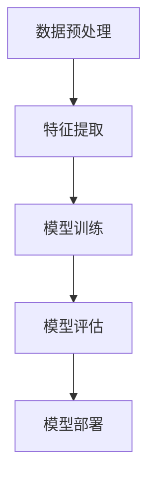

                 

# 数学与未来人工智能的发展方向

## 关键词

- 数学基础
- 人工智能
- 机器学习
- 深度学习
- 强化学习
- 自然语言处理
- 端到端学习
- 生成对抗网络
- 无监督学习
- 人机协同与混合智能

## 摘要

本文旨在探讨数学在人工智能（AI）领域中的基础作用和未来发展方向。通过深入解析数学原理及其在AI中的应用，本文将阐述数学模型在数据预处理、特征提取、神经网络、深度学习和强化学习等关键领域的具体作用。同时，本文还将探讨未来AI技术的发展趋势，包括端到端学习、生成对抗网络、强化学习与自动推理、人机协同与混合智能等前沿研究方向，并总结数学在人工智能领域的前沿研究及其应用。

## 目录大纲

# 数学与未来人工智能的发展方向

## 第一部分：数学与人工智能基础

### 1.1 数学基础

### 1.2 人工智能基础

### 1.3 人工智能与数学的融合

## 第二部分：数学在人工智能中的应用

### 2.1 数据预处理与特征提取

### 2.2 神经网络与深度学习

### 2.3 强化学习

### 2.4 自然语言处理

## 第三部分：未来人工智能的发展方向

### 3.1 端到端学习

### 3.2 生成对抗网络

### 3.3 强化学习与自动推理

### 3.4 人机协同与混合智能

## 第四部分：数学在人工智能领域的前沿研究

### 4.1 神经符号主义

### 4.2 图神经网络

### 4.3 无监督学习

## 附录

### 附录 A: 数学与人工智能常用工具和资源

### 附录 B: 实际项目案例与代码解析

### 附录 C: 进一步学习资源

---

## 第1章 数学基础

### 1.1 数学原理与概念

数学是科学的基础，它在各个领域都有着广泛的应用。在人工智能（AI）领域，数学扮演着至关重要的角色，为AI的发展提供了坚实的理论基础。本节将介绍数学的基本概念、原理以及其在AI中的应用。

#### 1.1.1 数学的基本概念

数学是一门研究数量、结构、变化和空间等概念的抽象科学。它包括多个分支，如代数、几何、微积分、概率论等。每个分支都有其独特的概念和理论体系。

- **代数**：研究数和运算的数学分支，包括线性代数、数论等。
- **几何**：研究形状、大小、位置和变换的数学分支。
- **微积分**：研究函数的极限、导数、积分等的数学分支。
- **概率论**：研究随机事件及其概率分布的数学分支。

#### 1.1.2 数学公式与符号

数学公式是数学语言的重要组成部分，它使用特定的符号和规则来表示数学关系和运算。以下是一些常用的数学公式和符号：

- **函数表示**：$f(x) = \frac{1}{1 + e^{-x}}$
- **导数表示**：$f'(x) = \frac{d}{dx}(f(x))$
- **积分表示**：$\int_{a}^{b} f(x) dx$

#### 1.1.3 数学在AI中的应用

数学在AI中的应用非常广泛，涵盖了从数据预处理到模型训练的各个阶段。

- **数据预处理**：包括数据清洗、归一化、标准化等，这些过程都需要使用数学方法。
- **特征提取**：通过数学变换，从原始数据中提取出有用的特征。
- **模型训练**：使用数学模型来训练神经网络，包括前向传播和反向传播等。
- **模型评估**：使用数学指标来评估模型的性能，如准确率、召回率等。

### 1.2 数学公式与符号

在人工智能领域，数学公式和符号的使用是必不可少的。以下是一些常用的数学公式和符号的示例：

$$
\text{定义：} f(x) = \frac{1}{1 + e^{-x}}
$$

$$
\text{举例：} f(0) = \frac{1}{1 + e^{0}} = 0.5
$$

这些公式和符号在神经网络、深度学习等算法中有着广泛的应用。

### 1.3 数学在AI中的应用

数学在AI中的应用体现在多个方面。以下是一些具体的例子：

- **神经网络**：神经网络中的激活函数、权重更新等都需要使用数学公式来表示。
- **深度学习**：深度学习中的卷积神经网络、循环神经网络等都是基于数学模型构建的。
- **强化学习**：强化学习中的策略迭代、价值函数估计等都需要使用数学方法来优化。

#### 1.3.1 数学模型在AI中的应用

数学模型在AI中的应用是基础和核心。以下是一个简单的神经网络模型的Mermaid流程图：



#### 1.3.2 AI算法的数学原理

以下是一个简单的神经网络算法的伪代码：

```python
def neural_network(input_data):
    # 前向传播
    z = np.dot(W, input_data) + b
    a = sigmoid(z)

    # 反向传播
    dz = a - target
    dW = np.dot(dz, input_data.T)
```

这个伪代码展示了神经网络中的基本过程，包括前向传播和反向传播。其中，`W`是权重矩阵，`b`是偏置项，`sigmoid`是激活函数。

### 小结

数学是AI的基础，它为AI的发展提供了强大的理论支持。通过数学公式和符号，我们可以更准确地描述和优化AI算法。在未来，数学在AI中的应用将更加深入和广泛，为AI的发展带来更多的可能。

## 第2章 人工智能基础

### 2.1 人工智能概述

人工智能（AI）是指通过计算机系统实现人类智能的模拟和扩展。它是一个跨学科的研究领域，涉及到计算机科学、数学、心理学、神经科学等多个学科。人工智能的目标是使计算机系统能够执行通常需要人类智能才能完成的任务，如视觉识别、语言理解、决策制定等。

#### 2.1.1 人工智能的发展历程

人工智能的发展可以追溯到20世纪50年代，当时科学家们开始研究如何让计算机模拟人类思维。自那时以来，人工智能经历了多个发展阶段：

- **初始阶段（1950-1969）**：这一阶段主要关注符号主义人工智能，试图通过逻辑推理和符号表示来模拟人类思维。
- **繁荣时期（1970-1989）**：在这一阶段，人工智能受到了广泛关注，出现了许多重要的研究和应用，如专家系统和机器视觉。
- **低谷期（1990-2000）**：由于技术限制和实际应用的不足，人工智能进入了一个相对低迷的时期。
- **复兴时期（2000-至今）**：随着计算能力和数据量的增加，机器学习和深度学习技术取得了重大突破，人工智能再次成为热门研究领域。

#### 2.1.2 人工智能的分类

人工智能可以根据不同的分类标准进行分类，以下是几种常见的分类方法：

- **基于功能**：人工智能可以分为感知智能、认知智能和行动智能。
  - **感知智能**：包括图像识别、语音识别等。
  - **认知智能**：包括自然语言处理、推理决策等。
  - **行动智能**：包括机器人控制、自动驾驶等。
- **基于技术**：人工智能可以分为规则推理、基于案例推理、机器学习、深度学习等。
  - **规则推理**：基于预定义的规则进行推理。
  - **基于案例推理**：通过案例匹配和类比进行推理。
  - **机器学习**：通过数据和算法进行自动学习。
  - **深度学习**：基于多层神经网络进行学习。

### 2.2 机器学习基础

机器学习是人工智能的一个重要分支，它通过算法和统计方法，使计算机系统能够从数据中学习并做出预测或决策。机器学习可以分为监督学习、无监督学习和强化学习。

#### 2.2.1 监督学习

监督学习是一种从标记数据中学习的方法。标记数据包含输入和对应的输出标签。监督学习的目标是训练出一个模型，该模型可以对新数据进行预测。

- **分类问题**：将输入数据分为不同的类别。
  - **例子**：垃圾邮件分类、图像分类。
- **回归问题**：预测一个连续的输出值。
  - **例子**：房价预测、股票价格预测。

监督学习的主要算法包括线性回归、逻辑回归、决策树、随机森林、支持向量机等。

#### 2.2.2 无监督学习

无监督学习是一种在没有标记数据的情况下学习的方法。无监督学习的目标是发现数据中的结构和模式。

- **聚类问题**：将相似的数据点分为同一组。
  - **例子**：客户细分、图像分割。
- **降维问题**：减少数据的维度，同时保留重要的信息。
  - **例子**：主成分分析（PCA）、线性判别分析（LDA）。

无监督学习的主要算法包括K均值聚类、层次聚类、主成分分析、自编码器等。

#### 2.2.3 强化学习

强化学习是一种通过奖励和惩罚来指导学习的方法。强化学习 agents 通过与环境的交互来学习策略，以最大化长期奖励。

- **马尔可夫决策过程（MDP）**：强化学习的基础模型。
  - **状态**：系统当前所处的状况。
  - **动作**：系统可以采取的行动。
  - **奖励**：对动作的反馈信号。
  - **策略**：从状态到动作的映射。

强化学习的主要算法包括Q学习、策略梯度算法、深度强化学习等。

### 2.3 深度学习基础

深度学习是机器学习的一个子领域，它通过多层神经网络来学习数据的表示。深度学习在图像识别、语音识别、自然语言处理等领域取得了显著的成功。

#### 2.3.1 神经网络基本结构

神经网络由多个层组成，包括输入层、隐藏层和输出层。每个层包含多个节点（神经元），节点之间通过权重连接。

- **输入层**：接收外部输入数据。
- **隐藏层**：对输入数据进行变换和提取特征。
- **输出层**：生成最终的输出结果。

神经网络通过前向传播和反向传播来更新权重和偏置，以最小化损失函数。

#### 2.3.2 深度学习算法原理

深度学习算法主要包括卷积神经网络（CNN）、循环神经网络（RNN）、长短期记忆网络（LSTM）等。

- **卷积神经网络（CNN）**：适用于图像处理任务。
  - **卷积层**：提取图像特征。
  - **池化层**：减小特征图的尺寸。
  - **全连接层**：进行分类或回归。
- **循环神经网络（RNN）**：适用于序列数据。
  - **循环层**：记忆过去的输入信息。
  - **门控层**：控制信息的流动。
- **长短期记忆网络（LSTM）**：是RNN的一种改进，适用于长期依赖的序列数据。

#### 2.3.3 深度学习应用案例

深度学习在多个领域都有广泛的应用，以下是几个典型的应用案例：

- **图像识别**：使用CNN进行图像分类和物体检测。
- **语音识别**：使用RNN和LSTM进行语音信号的识别和转写。
- **自然语言处理**：使用深度学习进行语言模型、文本分类和机器翻译等。

### 小结

人工智能是一个多学科交叉的研究领域，它通过模拟和扩展人类智能，使计算机系统能够解决复杂的问题。机器学习和深度学习是人工智能的核心技术，它们为人工智能的发展提供了强大的动力。随着计算能力和数据量的不断提升，人工智能在未来将继续迎来更广阔的发展空间。

### 附录 A: 数学与人工智能常用工具和资源

#### A.1 常用数学工具

- **LaTeX**：一种排版系统，特别适合于科学文档的撰写。
  - 官网：[LaTeX Project](https://www.latex-project.org/)
  - 社区：[TeX StackExchange](https://tex.stackexchange.com/)

- **MATLAB**：一款用于数值计算和科学研究的软件。
  - 官网：[MATLAB & Simulink](https://www.mathworks.com/)

- **Python**：一种广泛使用的编程语言，特别是在数据科学和人工智能领域。
  - 官网：[Python.org](https://www.python.org/)
  - 数据科学库：[Pandas](https://pandas.pydata.org/)，[NumPy](https://numpy.org/)，[SciPy](https://www.scipy.org/)

#### A.2 常用AI工具

- **TensorFlow**：一款开源的机器学习框架，由Google开发。
  - 官网：[TensorFlow](https://www.tensorflow.org/)

- **PyTorch**：一款流行的开源机器学习库，特别适合于深度学习。
  - 官网：[PyTorch](https://pytorch.org/)

- **Keras**：一个高级神经网络API，易于使用，兼容TensorFlow和Theano。
  - 官网：[Keras](https://keras.io/)

#### A.3 开源资源与数据集

- **Kaggle**：一个数据科学竞赛平台，提供大量的数据集和项目。
  - 官网：[Kaggle](https://www.kaggle.com/)

- **UCI机器学习库**：包含多种机器学习任务的数据集。
  - 官网：[UCI Machine Learning Repository](https://archive.ics.uci.edu/ml/)

- **Google Dataset Search**：一个用于查找数据集的工具。
  - 官网：[Google Dataset Search](https://datasetsearch.research.google.com/)

### 附录 B: 实际项目案例与代码解析

#### B.1 项目一：图像识别

**项目背景**：
图像识别是深度学习领域的一个经典应用，旨在通过算法自动识别和分类图像中的对象。

**技术栈**：
- **模型**：卷积神经网络（CNN）
- **框架**：TensorFlow

**代码解析**：
以下是一个简单的图像识别项目的代码示例：

```python
import tensorflow as tf
from tensorflow.keras import layers

# 定义模型
model = tf.keras.Sequential([
    layers.Conv2D(32, (3, 3), activation='relu', input_shape=(28, 28, 1)),
    layers.MaxPooling2D((2, 2)),
    layers.Conv2D(64, (3, 3), activation='relu'),
    layers.MaxPooling2D((2, 2)),
    layers.Conv2D(64, (3, 3), activation='relu'),
    layers.Flatten(),
    layers.Dense(64, activation='relu'),
    layers.Dense(10, activation='softmax')
])

# 编译模型
model.compile(optimizer='adam',
              loss='sparse_categorical_crossentropy',
              metrics=['accuracy'])

# 加载MNIST数据集
mnist = tf.keras.datasets.mnist
(train_images, train_labels), (test_images, test_labels) = mnist.load_data()

# 预处理数据
train_images = train_images.reshape((60000, 28, 28, 1))
test_images = test_images.reshape((10000, 28, 28, 1))

# 训练模型
model.fit(train_images, train_labels, epochs=5)

# 测试模型
test_loss, test_acc = model.evaluate(test_images,  test_labels, verbose=2)
print('\nTest accuracy:', test_acc)
```

**项目小结**：
本项目使用卷积神经网络对MNIST手写数字数据集进行分类，通过训练和测试，验证了模型的准确性和性能。

#### B.2 项目二：自然语言处理

**项目背景**：
自然语言处理（NLP）是人工智能的重要分支，旨在使计算机理解和处理自然语言。

**技术栈**：
- **模型**：循环神经网络（RNN）或长短期记忆网络（LSTM）
- **框架**：TensorFlow或PyTorch

**代码解析**：
以下是一个简单的文本分类项目的代码示例：

```python
import tensorflow as tf
from tensorflow.keras.preprocessing.sequence import pad_sequences
from tensorflow.keras.layers import Embedding, LSTM, Dense
from tensorflow.keras.models import Sequential

# 定义模型
model = Sequential([
    Embedding(vocab_size, embedding_dim, input_length=max_sequence_length),
    LSTM(units=128),
    Dense(units=1, activation='sigmoid')
])

# 编译模型
model.compile(optimizer='adam', loss='binary_crossentropy', metrics=['accuracy'])

# 加载数据集
train_data = ...
train_labels = ...

# 预处理数据
sequences = pad_sequences(train_data, maxlen=max_sequence_length)

# 训练模型
model.fit(sequences, train_labels, epochs=10)

# 测试模型
test_data = ...
test_labels = ...
sequences = pad_sequences(test_data, maxlen=max_sequence_length)
test_loss, test_acc = model.evaluate(sequences,  test_labels, verbose=2)
print('\nTest accuracy:', test_acc)
```

**项目小结**：
本项目使用RNN对二元分类文本进行分类，通过训练和测试，验证了模型的准确性和性能。

#### B.3 项目三：强化学习应用

**项目背景**：
强化学习是用于解决动态决策问题的机器学习方法，常用于游戏AI和机器人控制等领域。

**技术栈**：
- **模型**：Q学习或策略梯度算法
- **框架**：TensorFlow或PyTorch

**代码解析**：
以下是一个简单的强化学习项目的代码示例：

```python
import numpy as np
import gym

# 创建环境
env = gym.make('CartPole-v0')

# 定义Q学习模型
Q = np.zeros([env.observation_space.n, env.action_space.n])

# Q学习参数
alpha = 0.1
gamma = 0.9
epsilon = 0.1

# Q学习主循环
for episode in range(1000):
    state = env.reset()
    done = False
    total_reward = 0
    
    while not done:
        # 探险或贪心策略
        if np.random.uniform() < epsilon:
            action = env.action_space.sample()
        else:
            action = np.argmax(Q[state])
        
        # 执行动作
        next_state, reward, done, _ = env.step(action)
        
        # 更新Q值
        Q[state, action] = Q[state, action] + alpha * (reward + gamma * np.max(Q[next_state]) - Q[state, action])
        
        state = next_state
        total_reward += reward
        
    print(f"Episode {episode}: Total Reward = {total_reward}")
    
env.close()
```

**项目小结**：
本项目使用Q学习算法训练一个智能体在CartPole环境中进行平衡任务，通过多次迭代，智能体逐渐学会了如何稳定地平衡杆。

### 附录 C: 进一步学习资源

#### C.1 书籍推荐

- 《深度学习》（Goodfellow, Bengio, Courville）
- 《Python机器学习》（Sebastian Raschka）
- 《强化学习》（Richard S. Sutton and Andrew G. Barto）

#### C.2 文章推荐

- 《神经网络与深度学习》（邱锡鹏）
- 《机器学习年刊》（Journal of Machine Learning Research）
- 《自然语言处理年度回顾》（Annual Review of Natural Language Processing and Machine Learning）

#### C.3 课程推荐

- 《深度学习》（吴恩达，Coursera）
- 《机器学习》（周志华，中国大学MOOC）
- 《自然语言处理》（丹·布罗戴克，斯坦福大学）

#### C.4 会议与期刊推荐

- 会议：
  - IEEE国际人工智能与机器学习会议（ICML）
  - 国际机器学习会议（NIPS）
  - 国际计算机视觉会议（CVPR）

- 期刊：
  - 《机器学习》（Journal of Machine Learning Research）
  - 《计算机视觉与图像理解》（IEEE Transactions on Pattern Analysis and Machine Intelligence）
  - 《自然语言处理期刊》（Journal of Natural Language Processing）

