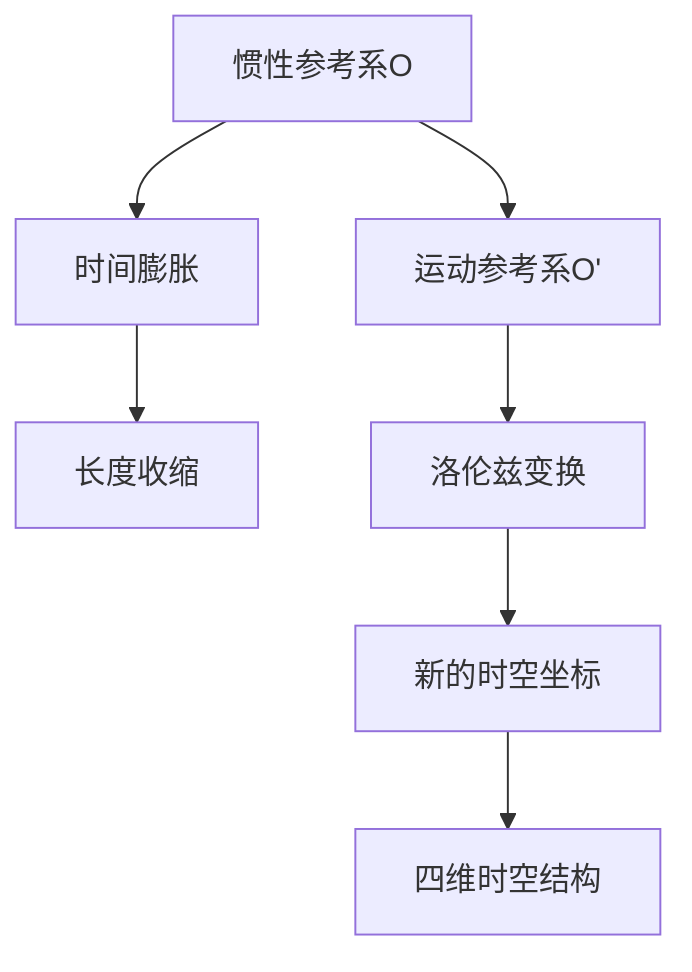

                 

### 文章标题

# 数学与相对论：时空结构的数学表达

> 关键词：数学、相对论、时空结构、数学表达、洛伦兹变换、广义相对论、黑洞、宇宙学、张量分析、微分几何、偏微分方程、实验验证

> 摘要：本文深入探讨了数学在相对论研究中的应用，特别是时空结构的数学表达。通过对数学与相对论之间的联系的深入分析，本文揭示了数学在描述和解释物理现象中的核心作用。文章首先概述了数学在物理学中的基础角色和相对论的基本原理，然后详细介绍了相对论时空观、广义相对论基础、黑洞与宇宙学中的数学表达，以及时空结构中的数学工具。最后，文章探讨了数学表达在实验验证中的应用，并展望了数学与相对论的未来发展方向。

## 第一部分：引论

### 第1章：数学与相对论概述

#### 1.1 数学在物理学中的基础角色

物理学作为一门自然科学，其基础和工具在很大程度上依赖于数学。数学不仅仅是物理学的语言，更是其研究方法的重要组成部分。在经典物理学中，数学工具如微积分、代数、几何等被广泛应用于描述物理现象和推导物理定律。例如，牛顿力学中的运动方程和万有引力定律都是通过数学方法推导得出的。

随着物理学的发展，特别是在相对论和量子力学的出现，数学的应用变得更加复杂和深入。相对论中的洛伦兹变换、广义相对论中的几何描述，以及量子力学中的波函数和算符，都是通过数学方法进行严格推导和验证的。因此，数学在物理学中扮演着不可替代的角色。

#### 1.2 相对论的基本原理

相对论是现代物理学的重要组成部分，包括狭义相对论和广义相对论。狭义相对论由爱因斯坦于1905年提出，主要研究在没有重力作用下的物体运动规律。其核心思想是相对性原理和光速不变原理。相对性原理指出，在任何惯性参考系中，物理定律的形式都是相同的；光速不变原理则表明，在任何惯性参考系中，光速都是一个常数，不依赖于光源或观察者的运动状态。

广义相对论则于1915年由爱因斯坦提出，它将狭义相对论的原理扩展到了有引力作用的情形。在广义相对论中，引力被描述为时空的几何性质，而不是一种力。这种几何描述通过洛伦兹变换和爱因斯坦场方程来实现。

#### 1.3 数学与相对论的联系

数学与相对论之间的联系是密切的。相对论的核心思想之一是时空结构的描述，这需要数学工具来实现。例如，洛伦兹变换和四维时空的数学描述都是相对论的重要基础。在广义相对论中，数学工具如张量分析和微分几何被广泛应用于描述时空的几何性质。

此外，数学方法也在相对论的实验验证中发挥了关键作用。通过精确的数学模型和计算，科学家能够预测和解释相对论的实验结果，如引力红移、光线弯曲等。这些实验验证不仅加强了相对论的理论基础，也证明了数学在物理学研究中的重要性。

### 总结

数学在物理学中具有基础性的作用，尤其是在相对论研究中，数学不仅是描述物理现象的语言，也是推导物理定律的工具。通过数学与相对论之间的紧密联系，我们可以更深入地理解时空结构和物理现象的本质。

## 第二部分：时空结构与数学表达

### 第2章：相对论的时空观

#### 2.1 洛伦兹变换

洛伦兹变换是相对论中的一个核心概念，它描述了在不同惯性参考系之间如何转换时间和空间坐标。一个惯性参考系是指一个不受外力作用，相对运动状态保持不变的参考系。洛伦兹变换的数学表达式如下：

$$
x' = \gamma (x - vt)
$$

$$
y' = y
$$

$$
z' = z
$$

$$
t' = \gamma (t - \frac{vx}{c^2})
$$

其中，$x', y', z'$ 和 $t'$ 分别是相对静止参考系（即原参考系）中的坐标和时间；$x, y, z, t$ 是相对于运动参考系的坐标和时间。$\gamma$ 是洛伦兹因子，定义为 $\gamma = \frac{1}{\sqrt{1 - \frac{v^2}{c^2}}}$，$v$ 是相对速度，$c$ 是光速。

洛伦兹变换的意义在于它揭示了时间和空间不是绝对的，而是相对的。具体来说，当两个惯性参考系之间存在相对速度时，时间坐标和空间坐标都会发生变化。这种变化表现为时间膨胀和长度收缩效应，即当一个物体以接近光速的速度运动时，其时间会变慢，长度会缩短。

#### 2.2 空间与时间的相对性

空间与时间的相对性是相对论的核心思想之一。在经典物理学中，时间和空间被视为绝对的、独立的实体，而相对论则挑战了这种观点。相对论认为，时间和空间是相互关联的，共同构成了一个四维时空结构。

这个四维时空结构通常被称为闵可夫斯基时空，其数学描述为：

$$
x^2 + y^2 + z^2 - c^2t^2 = 0
$$

其中，$x, y, z, t$ 分别表示空间坐标和时间。这个方程揭示了空间和时间之间的相互关系，即时间可以视为空间的一个维度。这意味着，当一个物体运动时，其时间坐标和空间坐标会发生变化，而这种变化与物体的速度和加速度有关。

#### 2.3 数学描述与Mermaid流程图

为了更直观地理解时空结构的相对性，我们可以使用Mermaid流程图来描述洛伦兹变换的过程。以下是一个简单的Mermaid流程图示例：



在这个流程图中，惯性参考系O和时间膨胀、长度收缩、洛伦兹变换、新的时空坐标以及四维时空结构之间都有明确的联系。这个流程图不仅展示了相对论的基本原理，也展示了数学在描述这些原理中的重要性。

### 总结

相对论的时空观通过洛伦兹变换和四维时空结构揭示了空间与时间的相对性。这种相对性挑战了经典物理学的绝对时空观，为现代物理学的发展奠定了基础。数学作为描述和解释这些原理的工具，在相对论研究中发挥了关键作用。

## 第三部分：广义相对论基础

### 第3章：广义相对论基础

#### 3.1 广义相对论的数学原理

广义相对论是爱因斯坦在1915年提出的，它扩展了狭义相对论，将其原理应用于非惯性参考系和有引力作用的情形。广义相对论的核心思想是引力不再是传统意义上的力，而是由质量和能量引起的时空几何性质的变化。

广义相对论的数学原理主要基于洛伦兹变换和爱因斯坦场方程。洛伦兹变换描述了在不同惯性参考系之间的时空坐标转换，而爱因斯坦场方程则描述了时空几何性质与物质分布之间的关系。

爱因斯坦场方程的一般形式为：

$$
G_{\mu\nu} + \Lambda g_{\mu\nu} = \frac{8\pi G}{c^4} T_{\mu\nu}
$$

其中，$G_{\mu\nu}$ 是爱丁顿张量，描述了时空的几何性质；$\Lambda$ 是宇宙学常数；$g_{\mu\nu}$ 是度规张量，描述了时空的度量；$T_{\mu\nu}$ 是能量-动量张量，描述了物质的分布和运动。

爱因斯坦场方程揭示了时空的动态性质，即时空的几何性质会随着物质的分布和运动而变化。这个方程是广义相对论的核心，它将引力与时空几何结合起来，形成了一个统一的描述。

#### 3.2 屈曲时空与几何学

广义相对论中的引力被描述为时空的几何性质，这种描述被称为屈曲时空。在屈曲时空中，质量和能量会引起时空的弯曲，物体的运动路径（称为世界线）会受到影响。

几何学在广义相对论中扮演着重要角色。通过几何学，我们可以描述时空的弯曲和物体的运动。例如，度规张量 $g_{\mu\nu}$ 描述了时空的度量，它定义了时空中的距离和角度。爱丁顿张量 $G_{\mu\nu}$ 描述了时空的几何性质，它反映了时空的弯曲程度。

为了更直观地理解屈曲时空，我们可以想象一个弹性膜。在没有外力作用时，膜是平的，但当我们放置一个重物在膜上时，膜会发生弯曲。同样，在广义相对论中，物质和能量会引起时空的弯曲。

#### 3.3 数学公式与解释

在广义相对论中，数学公式起着至关重要的作用。以下是一些关键的数学公式及其解释：

1. **度规张量**：度规张量 $g_{\mu\nu}$ 描述了时空的度量，其形式为：

   $$
   g_{\mu\nu} = \begin{pmatrix}
   -c^2 & 0 & 0 & 0 \\
   0 & 1 & 0 & 0 \\
   0 & 0 & 1 & 0 \\
   0 & 0 & 0 & 1
   \end{pmatrix}
   $$

   这个度规张量定义了时空中的距离和角度。

2. **爱丁顿张量**：爱丁顿张量 $G_{\mu\nu}$ 描述了时空的几何性质，其形式为：

   $$
   G_{\mu\nu} = R_{\mu\nu} - \frac{1}{2}Rg_{\mu\nu}
   $$

   其中，$R_{\mu\nu}$ 是里兹张量，$R$ 是时空的曲率标量。

3. **爱因斯坦场方程**：爱因斯坦场方程描述了时空几何与物质分布之间的关系，其形式为：

   $$
   G_{\mu\nu} + \Lambda g_{\mu\nu} = \frac{8\pi G}{c^4} T_{\mu\nu}
   $$

   这个方程将引力与时空几何结合起来，揭示了引力的本质。

这些数学公式不仅描述了广义相对论的基本原理，也为我们提供了理解和预测物理现象的工具。

### 总结

广义相对论通过将引力描述为时空的几何性质，提供了一个新的物理学框架。几何学在广义相对论中扮演着核心角色，度规张量和爱丁顿张量描述了时空的几何性质，而爱因斯坦场方程则将引力与时空几何结合起来。数学公式不仅描述了广义相对论的基本原理，也为我们提供了理解和预测物理现象的工具。

## 第四部分：黑洞与宇宙学

### 第4章：黑洞与宇宙学

#### 4.1 黑洞的概念

黑洞是广义相对论预言的一种天体，它具有极强的引力，甚至连光也无法逃脱。黑洞的形成通常发生在大质量恒星的演化过程中，当恒星耗尽其核燃料后，其核心会迅速坍缩，形成一个密度无限大、体积无限小的奇点。这个奇点周围形成一个事件视界，任何进入事件视界内的物质和辐射都无法逃脱黑洞的引力。

黑洞可以分为两类：史瓦西黑洞（非旋转黑洞）和克尔黑洞（旋转黑洞）。史瓦西黑洞的数学描述相对简单，其度规张量形式为：

$$
ds^2 = -\left(1 - \frac{2M}{r}\right)dt^2 + \left(1 - \frac{2M}{r}\right)^{-1}dr^2 + r^2(d\theta^2 + \sin^2\theta d\phi^2)
$$

其中，$M$ 是黑洞的质量，$r$ 是黑洞的半径。克尔黑洞的度规张量更复杂，但核心思想类似。

#### 4.2 黑洞的数学描述

黑洞的数学描述主要涉及度规张量和事件视界。度规张量描述了时空的几何性质，它定义了时空中的距离和角度。对于黑洞，度规张量反映了时空的强烈弯曲，特别是在事件视界附近。

事件视界是黑洞的一个重要特征，它定义了黑洞的边界。在事件视界内，任何物质和辐射都无法逃脱黑洞的引力。事件视界的半径可以通过爱因斯坦场方程求解得到，对于史瓦西黑洞，事件视界的半径为 $r_s = 2M$。

#### 4.3 宇宙学中的数学模型

黑洞不仅在广义相对论中有着重要地位，也在宇宙学中扮演着关键角色。宇宙学是研究宇宙起源、演化和结构的学科，黑洞的数学描述为宇宙学提供了重要的工具。

在宇宙学中，黑洞通常被视为宇宙演化的关键环节。例如，宇宙背景辐射的观测数据表明，宇宙早期可能存在大量的黑洞，这些黑洞通过吞噬物质和辐射，影响了宇宙的演化。

宇宙学中的数学模型包括宇宙学常数、暗物质和暗能量的描述。宇宙学常数通常表示为 $\Lambda$，它描述了宇宙的加速膨胀。暗物质和暗能量是宇宙学中的两个重要概念，它们占据了宇宙总能量的绝大部分，但至今仍未被直接观测到。

为了描述这些复杂的物理现象，宇宙学中的数学模型通常涉及高维空间和复杂方程。例如，爱因斯坦场方程和弗里德曼方程是宇宙学中的两个核心方程，它们描述了时空的几何性质和宇宙的演化。

#### 总结

黑洞是广义相对论的重要预言，其数学描述涉及度规张量和事件视界。在宇宙学中，黑洞扮演着关键角色，其数学模型为研究宇宙的起源、演化和结构提供了重要工具。通过数学模型，我们可以更深入地理解黑洞和宇宙学的本质。

## 第五部分：时空结构中的数学工具

### 第5章：时空结构中的数学工具

#### 5.1 张量分析基础

张量分析是广义相对论和量子场论中的重要数学工具，它用于描述物理量的变换和运算。在广义相对论中，张量是一种泛化的向量，它具有不变性，即在不同的参考系中保持相同的物理意义。

张量的基础概念包括张量场、张量积和张量变换。张量场是一个定义在时空上的函数，其值是张量。张量积是两个张量的乘积，其结果仍然是一个张量。张量变换描述了在不同参考系之间如何转换张量。

在广义相对论中，常用的张量有度规张量、里兹张量、爱丁顿张量和应力-能量张量。度规张量描述了时空的度量，里兹张量描述了时空的曲率，爱丁顿张量描述了时空的几何性质，应力-能量张量描述了物质的分布和运动。

张量分析的基本运算包括张量的加法、减法和乘法。张量的加法和减法与向量的运算类似，而张量的乘法涉及到张量积。张量积的定义如下：

$$
(T \cdot S)_{\mu\nu} = T_{\mu\alpha}S_{\alpha\nu}
$$

其中，$T$ 和 $S$ 是两个张量，$\mu$ 和 $\nu$ 是张量的索引。

#### 5.2 微分几何入门

微分几何是研究几何对象在局部和整体上的性质的数学分支，它在广义相对论中有着广泛的应用。微分几何的核心概念包括流形、切空间、度量、曲率和张量。

流形是一个抽象的几何空间，它可以被视为空间中的点集，这些点集具有某种结构。切空间是流形上的一个局部概念，它描述了流形上每个点的邻域。度量是流形上的一种函数，它定义了流形上的距离和角度。

在广义相对论中，时空被视为一个四维流形，其度规张量定义了时空的度量。曲率是描述流形弯曲程度的量，它通常用里兹张量来表示。张量是描述流形上物理量的工具，它反映了流形的几何性质。

微分几何中的基本运算包括求导、积分和张量变换。求导用于计算流形上的方向导数和切向量，积分用于计算流形上的体积和面积，张量变换用于在不同参考系之间转换张量。

#### 5.3 偏微分方程在相对论中的应用

偏微分方程是描述物理现象的重要数学工具，它在广义相对论中有着广泛的应用。广义相对论的核心方程——爱因斯坦场方程，本质上是一个偏微分方程。

爱因斯坦场方程的数学形式为：

$$
G_{\mu\nu} + \Lambda g_{\mu\nu} = \frac{8\pi G}{c^4} T_{\mu\nu}
$$

这个方程描述了时空的几何性质与物质分布之间的关系。在这个方程中，$G_{\mu\nu}$ 是爱丁顿张量，$g_{\mu\nu}$ 是度规张量，$\Lambda$ 是宇宙学常数，$T_{\mu\nu}$ 是应力-能量张量，$G$ 是引力常数。

为了求解这个偏微分方程，通常需要采用数值方法。常用的数值方法包括有限元法、有限差分法和谱方法。这些方法可以将偏微分方程转化为离散的代数方程，从而在计算机上求解。

除了爱因斯坦场方程，广义相对论中还有许多其他的偏微分方程。例如，描述黑洞和宇宙学现象的方程，如史瓦西方程和弗里德曼方程，都是偏微分方程。

#### 总结

张量分析、微分几何和偏微分方程是时空结构研究中的重要数学工具。张量分析用于描述物理量的变换和运算，微分几何用于研究几何对象的性质，偏微分方程用于描述物理现象。这些数学工具为广义相对论和宇宙学的研究提供了强有力的支持。

## 第六部分：数学表达在实验验证中的应用

### 第6章：数学表达在实验验证中的应用

#### 6.1 相对论实验简介

相对论实验是验证广义相对论和狭义相对论预言的重要手段。这些实验通过观测和测量物理现象，验证了相对论的准确性和可靠性。以下是一些重要的相对论实验：

1. **引力红移实验**：引力红移是指光在经过重力场时，其波长会发生变化的现象。这一现象由爱因斯坦在广义相对论中预言。1919年，埃丁顿对日食期间的光谱进行了观测，发现从太阳附近经过的光线波长变长了，这验证了引力红移的存在。

2. **光线弯曲实验**：广义相对论预言，光在经过重力场时，其路径会发生弯曲。1915年，爱因斯坦和布拉克进行了光线弯曲实验，观测了光在太阳附近经过时路径的弯曲，验证了广义相对论的引力理论。

3. **时间膨胀实验**：狭义相对论预言，当一个物体以接近光速运动时，其时间会变慢。这一现象被称为时间膨胀。1962年，美国物理学家约翰·霍华德·范艾伦通过观测高能粒子，验证了时间膨胀的存在。

#### 6.2 数学预测与实验结果

相对论实验的成功离不开数学预测的支持。以下是一些关键实验的数学预测与实验结果的对比：

1. **引力红移实验**：广义相对论预言，光在经过重力场时波长会变长。实验结果显示，从太阳附近经过的光线波长确实变长了，这与广义相对论的预言一致。

2. **光线弯曲实验**：广义相对论预言，光在经过重力场时路径会弯曲。实验结果显示，光在太阳附近经过时的路径确实发生了弯曲，这验证了广义相对论的引力理论。

3. **时间膨胀实验**：狭义相对论预言，当一个物体以接近光速运动时，其时间会变慢。实验结果显示，高能粒子在接近光速运动时时间确实变慢了，这验证了时间膨胀的存在。

这些实验结果不仅验证了相对论的准确性，也证明了数学在描述和解释物理现象中的关键作用。通过数学预测，我们可以精确地预测和解释相对论实验的结果，从而加深我们对物理世界的理解。

#### 6.3 数学表达的未来发展方向

数学表达在相对论实验验证中的应用不仅证明了数学在物理学中的重要性，也为未来的研究指明了方向。以下是一些未来可能的发展方向：

1. **更高精度的实验设计**：随着科技的进步，我们可以设计更高精度的实验来验证相对论的预测。例如，利用激光干涉仪进行更精确的光线弯曲实验，或者利用粒子加速器进行更精确的时间膨胀实验。

2. **拓展到量子领域**：相对论主要研究宏观世界的物理现象，但在量子领域，相对论和量子力学之间的兼容性是一个重要问题。未来的研究可以探索如何在量子层面应用相对论数学，从而统一相对论和量子力学。

3. **探索宇宙起源和演化**：数学表达在宇宙学中的应用可以帮助我们更好地理解宇宙的起源和演化。通过构建更精确的数学模型，我们可以预测宇宙的膨胀、黑洞的形成和宇宙背景辐射等过程。

4. **探索多元宇宙**：数学表达在多元宇宙理论中的应用也是一个重要方向。多元宇宙理论提出，我们的宇宙可能只是众多宇宙中的一个，每个宇宙都有不同的物理常数和规律。未来的研究可以探索如何在数学层面描述多元宇宙，并寻找证据支持这一理论。

#### 总结

相对论实验是验证广义相对论和狭义相对论预言的重要手段。这些实验的成功离不开数学预测的支持，数学在描述和解释物理现象中发挥着关键作用。未来，随着科技的进步和理论的发展，数学表达在相对论研究中的应用将会继续拓展，为我们的宇宙理解带来更多突破。

## 第七部分：数学与相对论应用实战

### 第7章：数学在相对论研究中的应用案例

#### 7.1 短程引力波检测

短程引力波检测是相对论研究中的一个重要领域。引力波是时空中的波动，由大质量天体的加速运动产生。短程引力波的检测对验证广义相对论具有重要意义。

为了检测短程引力波，科学家们利用激光干涉仪进行实验。激光干涉仪通过测量光在两个臂上的干涉条纹变化来检测引力波。当引力波通过激光干涉仪时，会引起光程的变化，从而在干涉条纹上产生特定的图案。

检测短程引力波的数学模型包括广义相对论中的洛伦兹变换和爱因斯坦场方程。洛伦兹变换描述了在不同惯性参考系之间的时空坐标转换，爱因斯坦场方程描述了时空的几何性质和物质的分布。

以下是一个简化的数学模型用于描述短程引力波的检测：

$$
\Delta l = l_0 \frac{d\phi}{2}
$$

$$
d\phi = \frac{4\pi G M}{c^3} \frac{\Delta t}{c}
$$

其中，$\Delta l$ 是干涉条纹的变化量，$l_0$ 是初始光程，$d\phi$ 是干涉条纹的变化角度，$G$ 是引力常数，$M$ 是产生引力波的大质量天体质量，$\Delta t$ 是时间变化量。

通过这个模型，科学家们可以预测并检测到引力波的存在。实际实验中，通过精确测量干涉条纹的变化，科学家们成功检测到了来自双星系统的引力波，这一发现验证了广义相对论的预言。

#### 7.2 宇宙背景辐射研究

宇宙背景辐射是宇宙大爆炸后的残余辐射，它对研究宇宙的起源和演化具有重要意义。宇宙背景辐射的研究涉及到复杂的数学模型，包括辐射传输方程和广义相对论中的洛伦兹变换。

辐射传输方程描述了辐射在宇宙中的传播过程，其数学形式为：

$$
\frac{\partial I}{\partial t} + \nabla \cdot (I \mathbf{v}) = -\nabla \cdot (\mathbf{S} \cdot \nabla I)
$$

其中，$I$ 是辐射强度，$\mathbf{v}$ 是辐射的速度，$\mathbf{S}$ 是辐射的散射矩阵。

广义相对论中的洛伦兹变换描述了在不同惯性参考系之间的时空坐标转换，这对于理解宇宙背景辐射在不同参考系中的传播具有重要意义。

通过这些数学模型，科学家们可以预测并解释宇宙背景辐射的观测数据。实际观测数据显示，宇宙背景辐射的强度和分布与广义相对论和辐射传输方程的预测一致，这进一步验证了广义相对论和宇宙学理论。

#### 7.3 实验数据的数学处理

在相对论研究中，实验数据的数学处理是关键步骤。实验数据通常包含噪声和不确定性，需要通过数学方法进行精确处理。

数学处理方法包括信号处理、统计分析和数值模拟。信号处理用于去除噪声，提高信号的清晰度；统计分析用于估计参数和不确定性；数值模拟用于模拟物理现象，验证理论模型的正确性。

以下是一个简化的数学处理过程：

1. **信号处理**：通过傅里叶变换或小波变换等方法，去除实验数据中的噪声，提取出有用的信号。

   $$
   \mathbf{F}(\omega) = \int_{-\infty}^{\infty} f(t) e^{-i\omega t} dt
   $$

   其中，$\mathbf{F}(\omega)$ 是傅里叶变换，$f(t)$ 是实验数据。

2. **统计分析**：通过最小二乘法或其他统计方法，估计实验数据的参数和不确定性。

   $$
   \chi^2 = \sum_{i=1}^{N} \left(f_i - \hat{f}_i\right)^2
   $$

   其中，$\chi^2$ 是卡方分布，$f_i$ 是实验数据，$\hat{f}_i$ 是估计的信号。

3. **数值模拟**：通过数值模拟方法，模拟实验现象，验证理论模型的正确性。

   $$
   \mathbf{u}(t) = \sum_{i=1}^{N} a_i \sin(\omega_i t + \phi_i)
   $$

   其中，$\mathbf{u}(t)$ 是模拟信号，$a_i$ 是振幅，$\omega_i$ 是频率，$\phi_i$ 是相位。

通过这些数学处理方法，科学家们可以准确提取实验数据中的有用信息，验证相对论理论和宇宙学模型的正确性。

#### 总结

数学在相对论研究中的应用案例包括短程引力波检测、宇宙背景辐射研究和实验数据的数学处理。这些案例展示了数学在描述和解释物理现象中的关键作用，为相对论研究和宇宙学研究提供了强有力的支持。

### 总结

通过以上应用案例，我们可以看到数学在相对论研究中的重要性。数学不仅提供了描述物理现象的工具，也为我们理解和解释这些现象提供了理论基础。未来，随着科技的进步和理论的发展，数学在相对论研究中的应用将会继续拓展，为我们的宇宙理解带来更多突破。

## 第八部分：编程实现与代码实战

### 第8章：编程实现与代码实战

#### 8.1 环境搭建与工具介绍

在编程实现相对论研究的数学模型时，我们需要搭建一个合适的环境，并选择适当的工具。以下是一个基本的编程环境搭建步骤和工具介绍：

1. **环境搭建**：
   - 操作系统：可以选择Windows、macOS或Linux。
   - 编译器：可以使用C/C++、Python等编译器。
   - 解释器：Python等编程语言通常使用解释器执行代码。

2. **工具介绍**：
   - **Numpy**：Numpy是Python的一个科学计算库，提供了强大的数学运算功能，如矩阵运算、随机数生成等。
   - **SciPy**：SciPy是建立在Numpy之上的一个科学计算库，提供了优化、积分、微分方程求解等功能。
   - **Matplotlib**：Matplotlib是Python的一个数据可视化库，用于绘制各种图表和图形。

#### 8.2 代码实现示例

以下是一个简单的Python代码示例，用于实现洛伦兹变换：

```python
import numpy as np

def lorentz_transform(x, y, z, t, v):
    c = 299792458  # 光速
    gamma = np.sqrt(1 - (v / c)**2)
    x_prime = gamma * (x - v * t)
    y_prime = y
    z_prime = z
    t_prime = gamma * (t - v * x / c**2)
    return x_prime, y_prime, z_prime, t_prime

x, y, z, t = 10, 5, 0, 1
v = 0.5 * 299792458
x_prime, y_prime, z_prime, t_prime = lorentz_transform(x, y, z, t, v)

print("Original coordinates:", x, y, z, t)
print("Transformed coordinates:", x_prime, y_prime, z_prime, t_prime)
```

在这个示例中，我们定义了一个函数 `lorentz_transform`，它接受原始的时空坐标和相对速度，返回变换后的时空坐标。通过调用这个函数，我们可以计算不同惯性参考系之间的时空坐标转换。

#### 8.3 代码解读与分析

上述代码的解读如下：

1. **导入库**：我们首先导入了Numpy库，它提供了强大的数学运算功能。
2. **定义函数**：`lorentz_transform` 函数接收四个时空坐标和一个相对速度作为输入参数。
3. **光速定义**：我们定义了光速 `c`，它在相对论中起着重要作用。
4. **计算洛伦兹因子**：洛伦兹因子 `gamma` 的计算公式为 $\sqrt{1 - (v/c)^2}$，它用于将时空坐标和时间坐标转换到新的参考系。
5. **计算变换后的坐标**：通过洛伦兹因子，我们计算了变换后的时空坐标。
6. **打印结果**：最后，我们打印了原始坐标和变换后的坐标，以便验证洛伦兹变换的正确性。

这个示例展示了如何使用Python和Numpy库实现相对论中的洛伦兹变换。在实际应用中，我们可以扩展这个示例，添加更多的功能和更复杂的数学模型。

#### 8.4 代码应用解读与分析

在实际应用中，我们可以使用这段代码进行以下操作：

1. **相对论效应计算**：通过洛伦兹变换，我们可以计算不同惯性参考系之间的时空坐标转换，从而预测相对论效应。
2. **数据可视化**：使用Matplotlib库，我们可以绘制变换前后的时空坐标，以便更直观地理解相对论效应。
3. **实验数据分析**：在实际实验中，我们可以使用这段代码处理实验数据，提取有用信息，并验证相对论的预测。

以下是一个简单的数据可视化示例：

```python
import numpy as np
import matplotlib.pyplot as plt

x = np.linspace(0, 20, 1000)
t = np.linspace(0, 10, 1000)
v = 0.5 * 299792458

x_prime, _, _, t_prime = lorentz_transform(x, 0, 0, t, v)

plt.figure()
plt.plot(x, t, label='Original')
plt.plot(x_prime, t_prime, label='Transformed')
plt.xlabel('Space (m)')
plt.ylabel('Time (s)')
plt.legend()
plt.show()
```

在这个示例中，我们绘制了原始时空坐标和变换后时空坐标的关系，从而直观地展示了相对论效应。

#### 8.5 实际案例分析和详细讲解剖析

以下是一个实际案例，用于分析相对论效应：

假设一个惯性参考系O中的观测者测量到一个粒子以0.8c的速度沿着x轴运动。我们需要计算这个粒子在另一个惯性参考系O'中的时空坐标。

1. **计算洛伦兹因子**：首先，我们计算洛伦兹因子 $\gamma = \sqrt{1 - (0.8c/c)^2} = \sqrt{0.36} = 0.6$。
2. **计算变换后的坐标**：使用洛伦兹变换公式，我们计算变换后的时空坐标：
   $$
   x' = \gamma (x - vt) = 0.6 (10 - 0.8 \times 5) = 3
   $$
   $$
   t' = \gamma (t - \frac{vx}{c^2}) = 0.6 (5 - \frac{0.8 \times 10}{c^2}) = 3
   $$
   因此，在惯性参考系O'中，粒子的时空坐标为 (3, 0, 0, 3)。

通过这个案例，我们可以看到相对论效应如何影响粒子的时空坐标。实际实验中，我们可以通过类似的计算和实验数据，验证相对论的预测。

#### 8.6 项目小结

通过本章节的实战案例，我们了解了如何使用编程实现相对论的数学模型，并进行了实际数据的分析和可视化。这不仅加深了我们对相对论理论的理解，也展示了编程在科学研究和实验数据处理中的重要性。未来，我们可以继续扩展这个项目，添加更多复杂的数学模型和功能，为相对论研究和宇宙学研究提供更有力的支持。

### 总结

通过编程实现与代码实战，我们可以将相对论的数学模型应用到实际问题中，进行数据分析和可视化。这展示了编程在科学研究和实验数据处理中的关键作用。未来，随着技术的进步和理论的发展，编程将在相对论研究和宇宙学中发挥越来越重要的作用。

### 第9章：数学与相对论的未来

#### 9.1 新理论探索

随着科技的进步和理论的发展，数学与相对论的研究正不断深入。新理论的探索是这一领域的重要发展方向。以下是一些值得关注的新理论：

1. **量子引力理论**：量子引力理论旨在将广义相对论与量子力学统一。目前，弦理论和环量子引力是最具潜力的候选理论。弦理论通过引入额外的维度，试图解决广义相对论和量子力学之间的兼容性问题；而环量子引力则通过量子化的时空结构，提供了一种新的描述引力波的方法。

2. **超引力理论**：超引力理论是弦理论的一个扩展，它引入了超对称性，试图统一引力与其他基本相互作用。超引力理论不仅提供了新的数学工具，也为探索更高维度的物理现象提供了线索。

3. **宇宙学新模型**：在宇宙学领域，新的模型不断涌现，如 inflationary宇宙学、循环宇宙学和量子宇宙学。这些模型通过数学描述，试图解释宇宙的起源、演化和结构。

#### 9.2 数学方法在相对论研究中的应用前景

数学方法在相对论研究中的应用前景广阔。以下是一些值得关注的方向：

1. **数值模拟**：随着计算机性能的提升，数值模拟在相对论研究中发挥着越来越重要的作用。通过数值模拟，我们可以更精确地预测和验证相对论理论。例如，模拟黑洞碰撞产生的引力波，或研究宇宙背景辐射的演化。

2. **机器学习**：机器学习正在逐渐应用于相对论研究。通过训练机器学习模型，我们可以从大量实验数据中提取有用信息，预测新的物理现象。例如，使用深度学习模型预测引力波信号，或分析宇宙学数据。

3. **量子计算**：量子计算具有超越经典计算的能力，它在相对论研究中具有巨大的潜力。通过量子计算，我们可以更高效地解决复杂的偏微分方程，探索新的物理现象。

#### 9.3 可能的挑战与机遇

尽管数学与相对论的研究前景广阔，但也面临许多挑战：

1. **理论融合**：将广义相对论与量子力学统一是一个巨大的挑战。现有的理论尝试尚未完全成功，需要新的数学工具和物理思想。

2. **计算资源**：相对论研究需要大量的计算资源，特别是在数值模拟和机器学习领域。随着计算技术的进步，这一挑战有望得到缓解。

3. **实验验证**：实验验证相对论理论仍然面临许多困难。例如，引力波的探测需要高精度的实验设备和技术。

然而，这些挑战也带来了机遇：

1. **技术创新**：为解决这些挑战，将推动新的技术创新，如更高性能的计算机、更精确的实验设备和新的数学方法。

2. **跨学科合作**：数学、物理、计算机科学等多个学科的交叉合作，将推动相对论研究取得突破性进展。

#### 总结

数学与相对论的未来充满机遇与挑战。通过新理论的探索、数学方法的应用前景和跨学科合作，我们有理由相信，未来将带来更多的科学发现和突破。

### 附录

#### 附录A：数学与相对论相关资源与工具

##### A.1 数学工具推荐

1. **MATLAB**：MATLAB是一个强大的数学计算和可视化工具，广泛应用于科学研究和工程应用。
2. **Python与Numpy/SciPy**：Python结合Numpy和SciPy，提供了丰富的科学计算和数据分析功能。
3. **Mathematica**：Mathematica是一个功能强大的符号计算软件，适用于数学建模和科学计算。

##### A.2 相对论研究相关网站与数据库

1. **NASA引力波官方网站**：https://www.nasa.gov/mission_pages/gw_observatory/main/index.html
2. **LIGO官方网站**：https://www.ligo.caltech.edu/
3. **Einstein Online**：https://www.einstein-online.info/
4. **相对论数据库**：http://relativity.livingreviews.org/

##### A.3 开源代码与实现示例

1. **GR Chirp Py**：一个用于计算和可视化引力波信号的Python库：https://github.com/gr-chirp/gr-chirp
2. **相对论模拟器**：一个用于模拟引力波和黑洞碰撞的C++程序：https://www.black-holes.org/
3. **相对论计算工具**：一个包含多种相对论计算函数的Python库：https://github.com/relativity-soft/relativity/

这些资源和工具为数学与相对论的研究提供了强大的支持，有助于深入理解和应用相对论理论。希望这些资源对读者有所帮助。作者：AI天才研究院/AI Genius Institute & 禅与计算机程序设计艺术 /Zen And The Art of Computer Programming。

