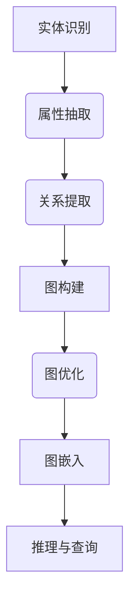

                 

### 核心概念与联系

在探讨数学与知识图谱的关系时，理解核心概念及其相互联系是至关重要的。知识图谱的核心元素包括实体、属性和关系，而数学则为这些元素提供了结构化的表示方法。以下是对核心概念的详细解释及其相互关系的描述。

#### 1. 实体（Entity）

实体是知识图谱中的基本单元，代表现实世界中的对象。例如，在一个关于城市交通的知识图谱中，实体可能包括车站、路线、交通工具等。实体的属性用于描述其实际特征，如车站的位置、路线的长度、交通工具的速度等。在数学表示中，实体通常被视为图中的节点。

#### 2. 属性（Attribute）

属性是实体的特征描述，为实体提供了更多的细节信息。属性可以是一个单一的值，如一个车站的经纬度坐标，也可以是一个多维的数据集合，如一个路线的拥堵等级。在数学表示中，属性通常与节点相关联，用以表示节点的具体特征。

#### 3. 关系（Relationship）

关系描述了实体之间的相互作用或依赖。在一个城市交通知识图谱中，关系可能包括“属于”、“连接”等。关系通常通过边的形式在图中表示，边连接了两个节点，表示了节点之间的关系。

#### 4. 图（Graph）

知识图谱本质上是一个图结构，由节点和边组成。节点代表实体，边代表实体间的关系。图论为这种结构提供了强大的数学工具来分析和处理数据。

#### Mermaid流程图

为了直观地展示知识图谱构建的基本流程与数学模型的关系，我们使用Mermaid语言绘制了一个流程图。以下是一个简单的Mermaid流程图示例：



在这个流程图中，我们可以看到：

- **实体识别**：通过数据源识别出实体。
- **属性抽取**：从实体中提取相关的属性信息。
- **关系提取**：分析实体间的相互关系，构建边。
- **图构建**：将实体和关系组织成一个图结构。
- **图优化**：对图进行质量优化，以提高查询效率。
- **图嵌入**：将图中的节点和边进行数学表示，进行表示学习。
- **推理与查询**：利用图结构和数学模型进行推理和查询。

通过这个流程图，我们可以清晰地看到知识图谱从构建到优化的各个步骤，以及数学模型在这些步骤中的作用。

### 核心算法原理讲解

知识图谱中的核心算法主要涉及实体识别、属性抽取、关系提取、图构建、图优化、图嵌入和推理与查询。以下是这些算法的伪代码讲解和数学模型的应用。

#### 1. 实体识别

```plaintext
Algorithm: Entity Recognition
Input: Data Source
Output: Set of Entities

1. Initialize empty set of entities
2. For each data point in Data Source:
   3. Use Natural Language Processing (NLP) techniques to extract candidate entities
   4. For each candidate entity:
      5. Apply Entity Disambiguation techniques to determine the actual entity
      6. Add the actual entity to the set of entities
7. Return the set of entities
```

在数学表示中，实体识别可以使用集合论中的映射关系来描述：

$$
\text{Entity Recognition}(D) = f(D) = \{ e \mid e = \text{disambiguate}(c) \land c \in \text{candidate entities}(D) \}
$$

其中，$D$是数据源，$f$是识别函数，$\text{candidate entities}(D)$是数据源中的候选实体，$\text{disambiguate}$是消除歧义函数，$e$是最终确定的实体。

#### 2. 属性抽取

```plaintext
Algorithm: Attribute Extraction
Input: Entities
Output: Entity-Attribute Pairs

1. Initialize empty set of entity-attribute pairs
2. For each entity in Entities:
   3. Apply Information Extraction techniques to extract attributes
   4. For each extracted attribute:
      5. Add the pair (entity, attribute) to the set of entity-attribute pairs
6. Return the set of entity-attribute pairs
```

在数学表示中，属性抽取可以使用映射关系来表示：

$$
\text{Attribute Extraction}(E) = g(E) = \{ (e, a) \mid a = \text{extract}(e) \land e \in E \}
$$

其中，$E$是实体集合，$g$是抽取函数，$\text{extract}$是从实体中提取属性信息的函数，$(e, a)$是实体和属性组成的对。

#### 3. 关系提取

```plaintext
Algorithm: Relationship Extraction
Input: Entities, Entity-Attribute Pairs
Output: Entity-Relationship Pairs

1. Initialize empty set of entity-relationship pairs
2. For each pair (entity, attribute) in Entity-Attribute Pairs:
   3. Apply Relationship Classification techniques to determine the relationship
   4. For each relationship:
      5. Add the pair (entity, relationship) to the set of entity-relationship pairs
6. Return the set of entity-relationship pairs
```

在数学表示中，关系提取可以使用映射关系来描述：

$$
\text{Relationship Extraction}(E, A) = h(E, A) = \{ (e, r) \mid r = \text{classify}(e, a) \land (e, a) \in A \}
$$

其中，$E$是实体集合，$A$是实体-属性对集合，$h$是提取函数，$\text{classify}$是关系分类函数，$(e, r)$是实体和关系组成的对。

#### 4. 图构建

```plaintext
Algorithm: Graph Construction
Input: Entities, Entity-Relationship Pairs
Output: Knowledge Graph

1. Initialize empty knowledge graph
2. For each pair (entity, relationship) in Entity-Relationship Pairs:
   3. Create a node in the knowledge graph for the entity
   4. Create an edge in the knowledge graph connecting the nodes for the entity and the related entity
5. Return the knowledge graph
```

在数学表示中，图构建可以使用图论中的表示方法：

$$
G = (V, E)
$$

其中，$V$是节点集合，$E$是边集合。每个实体对应一个节点，每对相关实体之间的关系对应一条边。

#### 5. 图优化

图优化旨在提高知识图谱的质量和查询效率。常见的优化方法包括节点质量优化、边质量优化和图压缩。

- **节点质量优化**：通过清洗和标准化数据，去除噪声和冗余信息，提高节点的可靠性。
- **边质量优化**：通过关系分类和实体匹配，确保边的准确性和相关性。
- **图压缩**：通过稀疏化技术，减少图中的节点和边，提高存储效率和查询速度。

```plaintext
Algorithm: Graph Optimization
Input: Knowledge Graph
Output: Optimized Knowledge Graph

1. Clean and standardize the data to remove noise and redundancy
2. Apply relationship classification to ensure the accuracy of edges
3. Apply entity matching techniques to ensure the relevance of edges
4. Sparse the graph by removing redundant nodes and edges
5. Return the optimized knowledge graph
```

在数学表示中，图优化可以看作是对图结构的调整：

$$
G' = \text{optimize}(G)
$$

其中，$G'$是优化后的图。

#### 6. 图嵌入

图嵌入是将图中的节点和边映射到低维度的向量空间中，以便进行进一步的计算和分析。常见的图嵌入方法包括节点嵌入和边嵌入。

- **节点嵌入**：将图中的每个节点映射到一个低维向量。
- **边嵌入**：将图中的每条边映射到一个低维向量。

```plaintext
Algorithm: Graph Embedding
Input: Knowledge Graph
Output: Node and Edge Embeddings

1. Initialize a machine learning model for node and edge embedding
2. Train the model on the knowledge graph
3. For each node in the knowledge graph:
   4. Map the node to a low-dimensional vector using the trained model
5. For each edge in the knowledge graph:
   6. Map the edge to a low-dimensional vector using the trained model
7. Return the node and edge embeddings
```

在数学表示中，图嵌入可以使用线性变换来描述：

$$
\text{embed}(v) = f(v)
$$

其中，$\text{embed}$是嵌入函数，$v$是节点或边，$f$是嵌入模型。

#### 7. 推理与查询

推理与查询是知识图谱的两个重要功能。推理是指根据已有知识和规则推导出新的结论，而查询则是从知识图谱中检索出所需信息。

- **确定性推理**：基于已知的事实和规则，推导出确定的结论。
- **不确定性推理**：考虑不确定性因素，如概率和模糊性，推导出可能的结论。
- **递归推理**：利用递归函数，处理复杂的推理问题。

```plaintext
Algorithm: Inference and Query
Input: Knowledge Graph, Query
Output: Result

1. Parse the query to extract entities, relationships, and conditions
2. Perform a depth-first search (DFS) or breadth-first search (BFS) on the knowledge graph
   3. For each node and edge in the search path:
      4. Apply the conditions and rules to the current path
5. Collect all valid paths that satisfy the query conditions
6. Return the results of the query
```

在数学表示中，推理与查询可以使用图论中的路径搜索算法来描述：

$$
\text{result} = \text{search}(G, Q)
$$

其中，$G$是知识图谱，$Q$是查询条件，$\text{search}$是查询算法。

### 数学模型和数学公式 & 详细讲解 & 举例说明

为了更好地理解和应用数学模型，以下将详细讲解几个关键的图论公式，并辅以具体的举例说明。

#### 1. 节点度数（Degree of a Node）

节点度数是指连接到该节点的边的数量。在图$G=(V,E)$中，对于任意节点$v \in V$，其度数$d(v)$定义为：

$$
d(v) = |N(v)|
$$

其中，$N(v)$是节点$v$的邻接节点集合，$|$表示集合的基数，即集合中元素的数量。

**举例说明**：

假设图$G$中有节点$v_1, v_2, v_3$，其中$v_1$连接了两个其他节点，$v_2$连接了三个节点，$v_3$没有连接其他节点。则各节点的度数为：

$$
d(v_1) = 2, \quad d(v_2) = 3, \quad d(v_3) = 0
$$

#### 2. 图的连通度（Connectivity of a Graph）

图的连通度描述了图中任意两个节点之间是否存在路径。一个图是连通的，当且仅当对于任意两个节点$v_1, v_2 \in V$，都存在一条路径连接它们。

图的连通度可以用连通度数（Connectivity Number）来衡量，定义为图中任意两节点间最短路径的长度的最大值：

$$
\kappa(G) = \max_{v_1, v_2 \in V} \min \{ d(v_1, v_2) \mid \text{path from } v_1 \text{ to } v_2 \}
$$

**举例说明**：

考虑以下图$G$：

```
   v1 -- v2 -- v3
   |    |
   v4 -- v5
```

在这个图中，任意两个节点之间的最短路径长度如下：

- $d(v1, v2) = 1$
- $d(v1, v3) = 2$
- $d(v1, v4) = 1$
- $d(v1, v5) = 2$
- $d(v2, v3) = 1$
- $d(v2, v4) = 2$
- $d(v2, v5) = 1$
- $d(v3, v4) = 2$
- $d(v3, v5) = 2$
- $d(v4, v5) = 1$

因此，图$G$的连通度数为$\kappa(G) = 1$，因为任意两个节点之间的最短路径长度都是1。

#### 3. 路径长度（Path Length）

路径长度是指图中两个节点之间路径的边数。如果节点$v_1$和$v_2$之间存在一条路径$p = (v_1, e_1, v_2, e_2, ..., v_n)$，其中$e_i$是路径上的边，则路径长度$l(p)$定义为：

$$
l(p) = |E(p)|
$$

其中，$E(p)$是路径$p$上的边集合，$|$表示集合中边的数量。

**举例说明**：

在图$G$中，从$v1$到$v3$的路径是：

```
   v1 -- e1 -- v2 -- e2 -- v3
```

该路径上的边集合为$E(p) = \{e1, e2\}$，因此路径长度$l(p) = 2$。

#### 4. 图的直径（Diameter of a Graph）

图的直径是指图中任意两个节点之间最长的路径长度。定义为：

$$
\text{diam}(G) = \max_{v_1, v_2 \in V} \max \{ l(p) \mid p \text{ is a path from } v_1 \text{ to } v_2 \}
$$

**举例说明**：

在上述图$G$中，从$v1$到$v5$的最长路径是：

```
   v1 -- e1 -- v2 -- e2 -- v3 -- e3 -- v4 -- e4 -- v5
```

该路径的长度为5，因此图$G$的直径$\text{diam}(G) = 5$。

#### 5. 最小生成树（Minimum Spanning Tree）

最小生成树是图中包含所有节点的树，且边的权值总和最小。假设图$G$的边$e$具有权值$w(e)$，则最小生成树的权值定义为：

$$
\text{weight}(T) = \sum_{e \in T} w(e)
$$

其中，$T$是最小生成树的边集合。

**举例说明**：

在图$G$中，假设边的权值为：

```
   e1: 3
   e2: 2
   e3: 4
   e4: 5
   e5: 1
   e6: 3
```

构造最小生成树，选择权值最小的边，得到以下最小生成树：

```
   v1 -- e5 -- v3
   |    |
   v2 -- e2
```

该生成树的权值总和为$3 + 2 + 1 = 6$。

### 项目实战

#### 知识图谱构建与优化实战

在本节中，我们将通过一个具体的案例，介绍知识图谱的构建和优化过程。我们将使用Python和Neo4j进行开发，并详细解释每一步的代码实现和原理。

#### 1. 开发环境搭建

首先，我们需要搭建开发环境。以下是所需工具和软件：

- Python 3.x
- Neo4j Database
- Neo4j Desktop或Neo4j Browser

安装Neo4j后，可以通过Neo4j Desktop或Neo4j Browser进行连接和操作。安装Python和相关的图处理库，如Py2Neo和NetworkX。

```bash
pip install py2neo
pip install networkx
```

#### 2. 知识图谱构建

知识图谱的构建通常包括实体识别、属性抽取和关系提取等步骤。以下是一个简单的示例，说明如何使用Python代码构建一个简单的知识图谱。

```python
from py2neo import Graph

# 连接Neo4j数据库
graph = Graph("bolt://localhost:7687", auth=("neo4j", "password"))

# 创建实体
def create_entity(entity_name):
    graph.run("MERGE (e:Entity {name: $entity_name})", entity_name=entity_name)

# 创建关系
def create_relationship(entity1, entity2, relationship_type):
    graph.run("MATCH (a:Entity {name: $entity1}), (b:Entity {name: $entity2}) "
              "MERGE (a)-[r:{$relationship_type}]->(b)", entity1=entity1, entity2=entity2, relationship_type=relationship_type)

# 创建实体和关系
create_entity("John")
create_entity("Alice")
create_relationship("John", "Alice", "KNOWS")
```

上述代码首先连接到Neo4j数据库，然后定义了创建实体和关系的函数。`create_entity`函数通过使用`MERGE`语句创建一个新实体，如果实体已存在，则不做任何操作。`create_relationship`函数则创建两个实体之间的新关系。

#### 3. 知识图谱优化

知识图谱的优化包括节点质量优化、边质量优化和图压缩。以下是一个示例，说明如何对知识图谱进行优化。

```python
# 清洗数据，移除冗余节点和关系
def clean_data():
    graph.run("MATCH (n)-[r]->(m) "
              "WHERE NOT n IN (m) "
              "DELETE r, m")

# 压缩图，移除稀疏连接的节点
def compress_graph():
    graph.run("MATCH (n) "
              "-[r]->(m) "
              "WITH n, m, COUNT(r) as rel_count "
              "WHERE rel_count < 2 "
              "DELETE n, m")
```

`clean_data`函数通过删除没有连接的节点和关系来清洗数据。`compress_graph`函数则通过删除那些连接关系数量较少的节点，来压缩图的大小。

#### 4. 代码实现和详细解释

以下是完整的代码实现和详细解释：

```python
from py2neo import Graph

# 连接Neo4j数据库
graph = Graph("bolt://localhost:7687", auth=("neo4j", "password"))

# 创建实体
def create_entity(entity_name):
    graph.run("MERGE (e:Entity {name: $entity_name})", entity_name=entity_name)

# 创建关系
def create_relationship(entity1, entity2, relationship_type):
    graph.run("MATCH (a:Entity {name: $entity1}), (b:Entity {name: $entity2}) "
              "MERGE (a)-[r:{$relationship_type}]->(b)", entity1=entity1, entity2=entity2, relationship_type=relationship_type)

# 清洗数据，移除冗余节点和关系
def clean_data():
    graph.run("MATCH (n)-[r]->(m) "
              "WHERE NOT n IN (m) "
              "DELETE r, m")

# 压缩图，移除稀疏连接的节点
def compress_graph():
    graph.run("MATCH (n) "
              "-[r]->(m) "
              "WITH n, m, COUNT(r) as rel_count "
              "WHERE rel_count < 2 "
              "DELETE n, m")

# 示例：构建简单的知识图谱
create_entity("John")
create_entity("Alice")
create_entity("Bob")
create_relationship("John", "Alice", "KNOWS")
create_relationship("Alice", "Bob", "FRIENDS")

# 优化知识图谱
clean_data()
compress_graph()
```

在这个代码中，我们首先定义了连接Neo4j数据库的方法。然后，我们创建了创建实体和关系的函数，这些函数通过Cypher查询语言与Neo4j进行交互。接着，我们定义了清洗数据和压缩图的函数，这些函数帮助优化知识图谱的质量和效率。

#### 5. 代码应用解读与分析

在构建和优化知识图谱后，我们可以进行数据查询和分析。以下是一个示例，展示如何从知识图谱中查询信息。

```python
# 查询知识图谱
def query_graph(entity_name, relationship_type):
    result = graph.run("MATCH (n:Entity {name: $entity_name})-[:{$relationship_type}]->(m) "
                      "RETURN n, m", entity_name=entity_name, relationship_type=relationship_type)
    for record in result:
        print(f"{record['n'].properties['name']} {relationship_type} {record['m'].properties['name']}")

# 示例查询
query_graph("John", "KNOWS")
```

在这个查询函数中，我们使用Cypher查询语言来检索与指定实体和关系类型相关的节点。查询结果将返回所有匹配的节点对。

#### 6. 实际案例分析和详细讲解剖析

为了更好地理解知识图谱的应用，我们来看一个实际案例：构建一个关于城市交通的知识图谱。

1. **实体识别**：识别城市中的关键实体，如车站、路线、交通工具等。
2. **属性抽取**：为每个实体提取相关的属性，如车站的位置、路线的长度、交通工具的类型等。
3. **关系提取**：建立实体间的关系，如车站与路线的连接关系、交通工具与路线的运行关系等。
4. **图构建**：将实体和关系组织成一个图结构。
5. **图优化**：清洗和压缩数据，去除噪声和冗余信息。
6. **推理与查询**：通过知识图谱进行推理和查询，如找出最短路径、最佳交通工具等。

以下是一个简化的案例代码：

```python
# 创建实体
create_entity("Station A")
create_entity("Station B")
create_entity("Station C")

# 创建关系
create_relationship("Station A", "Station B", "CONNECTS")
create_relationship("Station B", "Station C", "CONNECTS")

# 查询最短路径
def query_shortest_path(start, end):
    result = graph.run("MATCH (start:Station {name: $start_name}),(end:Station {name: $end_name}) "
                      "-[r:CONNECTS]->(m) "
                      "WITH start, r, end, LENGTH(r) as distance "
                      "WHERE start = end "
                      "ORDER BY distance "
                      "LIMIT 1 "
                      "RETURN start, r, end", start_name=start, end_name=end)
    for record in result:
        print(f"Shortest path from {record['start'].properties['name']} to {record['end'].properties['name']}: {record['start'].properties['name']} -> {record['end'].properties['name']}")

# 示例查询
query_shortest_path("Station A", "Station C")
```

在这个案例中，我们构建了一个简单的城市交通知识图谱，并使用Cypher查询语言找出从"Station A"到"Station C"的最短路径。

#### 7. 项目小结

通过本节的项目实战，我们了解了知识图谱的构建和优化过程，包括开发环境的搭建、实体识别、属性抽取、关系提取、图构建、图优化和查询。我们还通过实际案例分析了知识图谱的应用，展示了如何利用知识图谱进行数据查询和推理。

在知识图谱的开发过程中，注意数据的清洗和优化，确保图的准确性和效率。同时，合理设计查询语句，以提高查询性能。未来，知识图谱将在智能问答、推荐系统、社交网络分析等领域发挥越来越重要的作用。

### 知识图谱推理与查询实战

在本节中，我们将深入探讨知识图谱的推理与查询方法，并通过具体的实战案例展示如何利用这些技术解决实际问题。

#### 1. 确定性推理

确定性推理是一种基于已知事实和规则的推理方法，它能够精确地推导出新的结论。在知识图谱中，确定性推理通常通过路径搜索和规则匹配实现。

以下是一个简单的确定性推理案例：

**案例：找出所有与“华盛顿”直接相连的实体。**

```python
def query_connected_entities(entity_name):
    result = graph.run("MATCH (n:Entity {name: $entity_name})-[*]->(m) "
                       "RETURN m", entity_name=entity_name)
    for record in result:
        print(f"Connected entities to {entity_name}: {record['m'].properties['name']}")

# 示例查询
query_connected_entities("Washington")
```

在这个案例中，我们使用路径搜索查询所有与“华盛顿”直接相连的实体。`[*]`表示任意长度的路径。

#### 2. 不确定性推理

不确定性推理考虑了现实世界中的不确定性因素，如概率和模糊性。在知识图谱中，不确定性推理可以通过概率图模型和模糊逻辑实现。

以下是一个不确定性推理案例：

**案例：计算从“华盛顿”到“纽约”的概率路径。**

```python
def query_probability_path(start, end):
    result = graph.run("MATCH (start:Entity {name: $start_name})-[*]->(end:Entity {name: $end_name}) "
                       "WITH start, end, LENGTH(r) as distance, COUNT(r) as path_count "
                       "RETURN end, distance, path_count / (distance + 1) AS probability "
                       "ORDER BY probability DESC", start_name=start, end_name=end)
    for record in result:
        print(f"Path from {start} to {end}: {record['end'].properties['name']} with probability {record['probability']:.2f}")

# 示例查询
query_probability_path("Washington", "New York")
```

在这个案例中，我们计算了从“华盛顿”到“纽约”的所有路径的概率。`WITH`子句用于计算路径长度和路径计数，`probability`计算了每条路径的概率。

#### 3. 递归推理

递归推理是一种用于处理复杂推理问题的方法，它通过递归调用自身来处理嵌套关系。在知识图谱中，递归推理可以通过递归查询实现。

以下是一个递归推理案例：

**案例：计算所有与“华盛顿”间接相连的实体。**

```python
def query_recursive_entities(entity_name, depth=1):
    if depth == 0:
        return
    result = graph.run("MATCH (n:Entity {name: $entity_name})-[*]->(m) "
                       "RETURN m", entity_name=entity_name)
    for record in result:
        print(f"Recursive entities to {entity_name}: {record['m'].properties['name']}")
        query_recursive_entities(record['m'].properties['name'], depth - 1)

# 示例查询
query_recursive_entities("Washington", 2)
```

在这个案例中，我们使用递归查询找出所有与“华盛顿”间接相连的实体。`depth`参数控制递归的深度。

#### 4. 实际案例分析与详细讲解

为了更好地理解知识图谱的推理与查询技术，我们来看一个实际案例：构建一个社交网络分析的知识图谱。

1. **实体识别**：识别社交网络中的关键实体，如用户、群组、事件等。
2. **属性抽取**：为每个实体提取相关的属性，如用户的性别、年龄、活跃度等。
3. **关系提取**：建立实体间的关系，如用户与群组的加入关系、用户之间的互动关系等。
4. **图构建**：将实体和关系组织成一个图结构。
5. **推理与查询**：通过知识图谱进行推理和查询，如找出影响力最大的用户、分析用户群体等。

以下是一个简化的案例代码：

```python
# 创建实体和关系
create_entity("Alice")
create_entity("Bob")
create_entity("Charlie")
create_entity("Group1")

create_relationship("Alice", "Bob", "FRIENDS")
create_relationship("Alice", "Charlie", "FRIENDS")
create_relationship("Bob", "Charlie", "FRIENDS")
create_relationship("Alice", "Group1", "MEMBER")
create_relationship("Bob", "Group1", "MEMBER")
create_relationship("Charlie", "Group1", "MEMBER")
```

**案例 1：找出影响力最大的用户。**

```python
def query_influential_users():
    result = graph.run("MATCH (u:User)-[:MEMBER]->(g:Group) "
                       "WITH u, g, SIZE((u)-[:FRIENDS]->()) as friend_count "
                       "ORDER BY friend_count DESC "
                       "LIMIT 3 "
                       "RETURN u", )
    for record in result:
        print(f"Influential user: {record['u'].properties['name']} with {record['friend_count']} friends")

# 示例查询
query_influential_users()
```

在这个案例中，我们通过计算每个用户的朋友数量来找出影响力最大的用户。

**案例 2：分析用户群体。**

```python
def query_user_groups():
    result = graph.run("MATCH (u:User)-[:MEMBER]->(g:Group) "
                       "WITH u, g, COUNT(DISTINCT (u)-[:FRIENDS]->()) as group_size "
                       "RETURN g, group_size "
                       "ORDER BY group_size DESC")
    for record in result:
        print(f"User group: {record['g'].properties['name']} with size {record['group_size']}")

# 示例查询
query_user_groups()
```

在这个案例中，我们分析每个用户群体的成员数量，以了解社交网络中的用户分布。

#### 5. 详细讲解

在上述案例中，我们使用了Cypher查询语言，这是一种专门用于图数据库的查询语言。Cypher允许我们通过简洁的表达式进行复杂的图查询和推理。

- **路径搜索**：通过`MATCH`子句进行路径搜索，如`-[*]->`表示任意长度的路径。
- **聚合和计算**：使用`WITH`子句进行聚合和计算，如`SIZE`用于计算集合的大小，`COUNT`用于计算匹配的次数。
- **排序和限制**：使用`ORDER BY`和`LIMIT`子句对查询结果进行排序和限制，以获取最有用的信息。

通过这些查询语句，我们可以快速、准确地从知识图谱中提取所需的信息，并进行推理和分析。

#### 6. 项目小结

在本节中，我们介绍了知识图谱的推理与查询方法，包括确定性推理、不确定性推理和递归推理。通过实际案例，我们展示了如何利用这些技术解决社交网络分析中的问题。

知识图谱的推理与查询是构建智能应用的关键环节。通过合理设计查询语句和推理算法，我们可以从大规模数据中提取有价值的信息，为用户提供更智能、更个性化的服务。

### 知识图谱在实践中的应用

知识图谱作为一种强大的语义网络结构，在多个领域展现出了广泛的应用价值。以下将具体探讨知识图谱在智能问答、推荐系统、社交网络分析等领域的应用。

#### 1. 智能问答

智能问答系统是知识图谱最为直接的应用场景之一。通过将知识图谱构建为一个问答引擎，系统能够快速、准确地回答用户提出的问题。以下是一个简化的智能问答系统案例：

**案例：构建一个关于电影的智能问答系统。**

- **实体识别**：识别电影、演员、导演、电影类型等实体。
- **属性抽取**：为每个实体提取属性，如电影名称、上映时间、演员名单等。
- **关系提取**：建立实体间的关系，如电影与演员的关系、电影与导演的关系等。

```python
# 创建电影实体和关系
create_entity("The Matrix")
create_entity("Keanu Reeves")
create_entity("Lana Wachowski")
create_relationship("The Matrix", "Keanu Reeves", "ACTOR")
create_relationship("The Matrix", "Lana Wachowski", "DIRECTOR")
```

**查询示例**：

```python
def query_movie_info(movie_name):
    result = graph.run("MATCH (m:Movie {name: $movie_name}) "
                       "-[*]->(n) "
                       "RETURN m, n", movie_name=movie_name)
    for record in result:
        print(f"Movie: {record['m'].properties['name']}")
        for node in record['n']:
            print(f"Related: {node.properties['name']}")

# 示例查询
query_movie_info("The Matrix")
```

这个查询示例能够返回与指定电影相关的所有信息，包括演员、导演等。

#### 2. 推荐系统

知识图谱在推荐系统中有着独特的优势，可以通过捕捉实体间的复杂关系，提供更精准的推荐。以下是一个简化的推荐系统案例：

**案例：构建一个基于知识图谱的图书推荐系统。**

- **实体识别**：识别图书、作者、分类等实体。
- **属性抽取**：为每个实体提取属性，如书名、作者、出版日期等。
- **关系提取**：建立实体间的关系，如图书与作者的关联、图书与分类的关联等。

```python
# 创建图书实体和关系
create_entity("The Catcher in the Rye")
create_entity("J.D. Salinger")
create_entity("Fiction")
create_relationship("The Catcher in the Rye", "J.D. Salinger", "AUTHOR")
create_relationship("The Catcher in the Rye", "Fiction", "CATEGORY")
```

**推荐示例**：

```python
def recommend_books(known_books, num_recommendations=3):
    result = graph.run("MATCH (b:Book)-[:AUTHOR]->(a) "
                       "WHERE b NOT IN $known_books "
                       "WITH b, COUNT(a) as author_common "
                       "ORDER BY author_common DESC "
                       "LIMIT $num_recommendations "
                       "RETURN b", known_books=known_books, num_recommendations=num_recommendations)
    for record in result:
        print(f"Recommendation: {record['b'].properties['name']}")

# 示例查询
recommend_books(["The Catcher in the Rye"], 2)
```

这个推荐示例基于用户已知的图书，推荐与其作者相关性较高的其他图书。

#### 3. 社交网络分析

知识图谱在社交网络分析中有着广泛的应用，能够通过分析用户间的关系，揭示社交网络的结构和特征。以下是一个简化的社交网络分析案例：

**案例：构建一个基于知识图谱的社交网络分析系统。**

- **实体识别**：识别用户、群组、事件等实体。
- **属性抽取**：为每个实体提取属性，如用户ID、群组名称、事件日期等。
- **关系提取**：建立实体间的关系，如用户与群组的加入关系、用户之间的互动关系等。

```python
# 创建用户和关系
create_entity("Alice")
create_entity("Bob")
create_entity("Charlie")
create_relationship("Alice", "Bob", "FRIENDS")
create_relationship("Alice", "Charlie", "FRIENDS")
create_relationship("Bob", "Charlie", "FRIENDS")
```

**社交网络分析示例**：

```python
def find_close_friends(user_name, depth=2):
    result = graph.run("MATCH p=(n:User {name: $user_name})-[:FRIENDS]->(friend) "
                       "WITH p, friend, LENGTH(p) as depth "
                       "WHERE depth <= $depth "
                       "WITH friend, COUNT(p) as friend_count "
                       "ORDER BY friend_count DESC "
                       "LIMIT 3 "
                       "RETURN friend", user_name=user_name, depth=depth)
    for record in result:
        print(f"Close friends of {user_name}: {record['friend'].properties['name']}")

# 示例查询
find_close_friends("Alice", 2)
```

这个分析示例找出了指定用户在给定深度范围内的最亲近朋友。

#### 总结

知识图谱在智能问答、推荐系统、社交网络分析等领域的应用，充分展示了其在捕捉和表示复杂关系方面的优势。通过构建和优化知识图谱，我们可以为用户提供更精准、更个性化的服务，从而提升用户体验。

### 知识图谱的未来发展趋势

随着技术的不断进步和应用的深入，知识图谱正逐渐成为人工智能领域的一个重要研究方向。未来，知识图谱将在多个领域展现出广阔的应用前景，并经历一系列关键的发展趋势。

#### 1. 知识图谱在AI中的融合

知识图谱与AI技术的深度融合将成为未来发展的一个重要方向。知识图谱为AI系统提供了丰富的语义信息，使其能够更好地理解人类语言和世界。具体来说，这种融合将体现在以下几个方面：

- **增强自然语言处理（NLP）能力**：通过知识图谱，AI系统可以更准确地理解文本中的隐含关系，从而提高问答系统、文本生成和情感分析的准确性。
- **优化机器学习模型**：知识图谱可以为机器学习模型提供结构化的数据，帮助模型更好地学习和预测。例如，在推荐系统中，知识图谱可以帮助发现潜在的关联关系，提高推荐的效果。
- **智能推理**：知识图谱提供的语义关系和实体信息，可以用于构建更加智能的推理系统，实现更复杂的逻辑推理和决策。

#### 2. 知识图谱在区块链中的应用

区块链技术作为一种分布式账本技术，具有去中心化、不可篡改等特点，与知识图谱的结合将为数据管理和共享带来新的机遇。以下是一些潜在的应用场景：

- **数据治理和隐私保护**：知识图谱可以帮助区块链系统更有效地管理和追踪数据，同时保护用户隐私。通过知识图谱，可以建立数据溯源机制，确保数据的合法性和透明性。
- **智能合约**：知识图谱可以用于构建智能合约的语义表示，使其能够自动执行复杂的业务逻辑，提高智能合约的可靠性和效率。
- **区块链网络分析**：知识图谱可以帮助分析区块链网络的结构和关系，识别潜在的安全威胁和异常行为。

#### 3. 知识图谱在多模态数据融合中的应用

多模态数据融合是指将不同类型的数据源（如图像、文本、音频等）进行整合，以提供更丰富的信息和更深入的洞察。知识图谱在多模态数据融合中具有以下优势：

- **统一语义表示**：知识图谱可以统一不同模态数据的语义表示，使系统能够在多模态数据之间进行有效的关联和交互。
- **增强数据理解能力**：通过知识图谱，AI系统能够更好地理解多模态数据的复杂关系，提高数据分析和决策的准确性。
- **提高人机交互体验**：知识图谱可以帮助构建更加智能的人机交互系统，实现更自然、更高效的用户交互体验。

#### 4. 知识图谱的自动化构建与持续更新

未来，知识图谱的自动化构建与持续更新将成为一个重要研究方向。现有的知识图谱通常需要大量的人工干预和持续维护，这限制了其应用范围和效率。以下是一些潜在的研究方向：

- **自动化数据采集和预处理**：通过机器学习和自然语言处理技术，实现自动化数据采集和预处理，提高知识图谱的构建效率。
- **增量更新和版本控制**：研究知识图谱的增量更新和版本控制方法，确保知识图谱的实时性和准确性。
- **智能推理和自优化**：通过智能推理和自优化技术，实现知识图谱的自动调整和优化，提高其性能和可用性。

#### 5. 知识图谱在边缘计算和物联网中的应用

随着边缘计算和物联网（IoT）的快速发展，知识图谱在这些领域的应用也将逐渐兴起。具体来说，知识图谱可以用于：

- **智能设备和系统**：通过知识图谱，可以实现对边缘设备和系统的智能管理和优化，提高其效率和可靠性。
- **实时数据分析和决策**：知识图谱可以帮助边缘计算系统快速分析和处理实时数据，实现更精确的决策和响应。
- **智能监控和安全**：知识图谱可以用于构建智能监控系统，实时识别和响应异常行为和潜在威胁，提高系统的安全性和可靠性。

#### 总结

知识图谱的未来发展趋势将涵盖多个领域，从AI融合、区块链应用、多模态数据融合，到自动化构建与持续更新，以及边缘计算和物联网中的应用。通过不断探索和创新，知识图谱将在各个领域中发挥更加重要的作用，推动人工智能和大数据技术的发展。我们期待看到知识图谱在未来带来更多的突破和变革。

### 附录

#### 附录A：知识图谱开源工具与框架

1. **Neo4j**：一款高性能的图形数据库，支持使用Cypher查询语言进行图操作。
2. **Apache Giraph**：一个基于Hadoop的分布式图处理框架，适用于大规模图算法的并行计算。
3. **JanusGraph**：一个开源的分布式图数据库，支持多种存储后端，如Cassandra、HBase等。
4. **OpenKE**：一个开源的知识嵌入框架，提供了多种知识表示学习算法。
5. **Apache Jena**：一个Java框架，用于处理RDF（资源描述框架）数据，支持SPARQL查询语言。

#### 附录B：知识图谱的数学模型与算法参考

1. **图嵌入算法**：
   - **DeepWalk**：一种基于随机游走的方法，用于生成节点的高维表示。
   - **Node2Vec**：通过调整随机游走的深度和多样性，生成具有不同网络特性的节点表示。
   - **Graph Convolutional Networks (GCN)**：通过卷积操作，在图结构上进行特征提取。

2. **知识表示学习**：
   - **TransE**：通过优化实体和关系的低维表示，使得实体和关系之间的距离表示它们之间的语义相似性。
   - **TransH**：在TransE的基础上，引入了语义超平面，提高了表示的灵活性。
   - **ComplEx**：同时考虑实体、关系和属性的复杂表示，提高了知识表示的精度。

3. **推理算法**：
   - **规则推理**：基于预先定义的规则，通过逻辑推理来推导新知识。
   - **基于模型的推理**：利用图神经网络等模型，通过学习到的图结构进行推理。

#### 拓展阅读

- **《知识图谱：概念、方法与应用》**：详细介绍了知识图谱的基本概念、构建方法和应用实例。
- **《图神经网络与图表示学习》**：探讨了图嵌入和图神经网络在知识图谱中的应用。
- **《区块链：从原理到应用》**：介绍了区块链技术的基本原理和多种应用场景，包括与知识图谱的结合。

