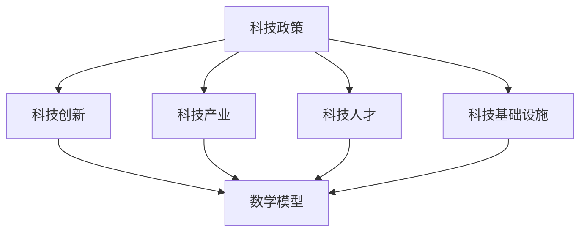
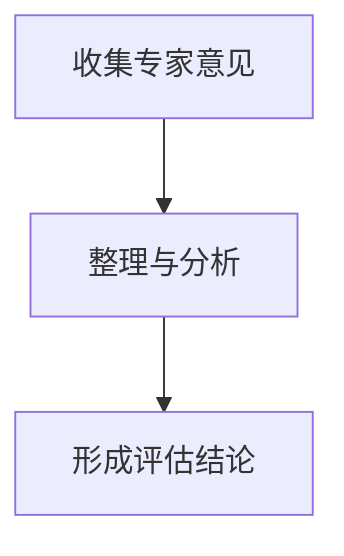
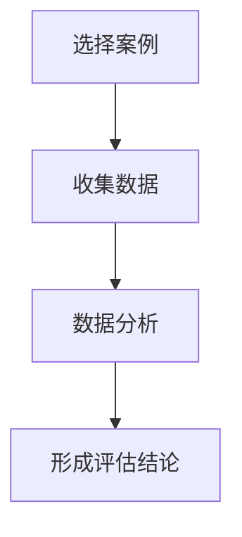
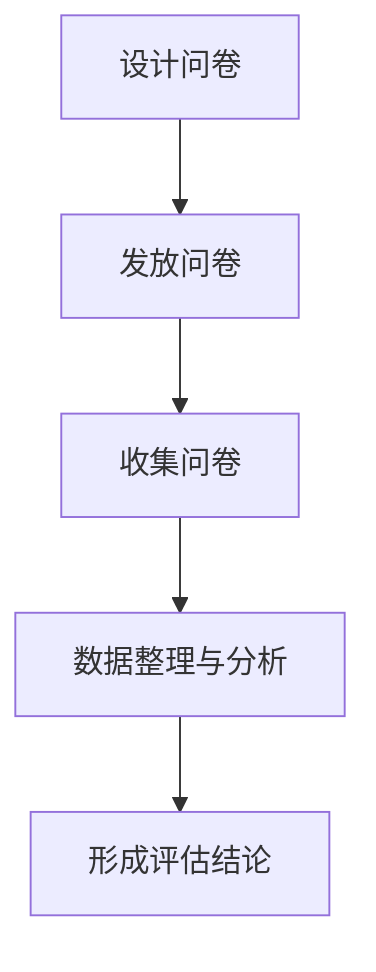

                 


## 文章标题：数学与科技政策：政策影响的数学评估

关键词：科技政策、数学评估、定量方法、定性方法、案例分析

摘要：本文探讨了数学在科技政策中的应用，通过分析数学评估方法在科技政策制定与实施中的重要作用，总结了政策影响的数学评估方法，并针对不同类型的政策影响进行了案例分析，以期为科技政策的科学制定和有效实施提供参考。

---

### 第1章：引言

#### 1.1 定义与背景

在当今信息化和全球化快速发展的背景下，科技政策成为推动国家或地区科技进步、经济发展和社会进步的重要手段。数学作为一种精确的描述和解决问题的工具，在科技政策中扮演着重要角色。数学在科技政策中的应用主要体现在以下几个方面：

1. **描述科技发展趋势**：数学模型可以用于描述科技发展的动态过程，分析科技发展的趋势、特征和影响因素，从而为政策制定提供依据。

2. **预测科技发展前景**：通过建立数学模型，可以预测科技发展的未来趋势，为政策制定者提供前瞻性指导。

3. **评估政策效果**：数学评估方法可以帮助政策制定者衡量科技政策实施的效果，为政策调整提供依据。

科技政策是指国家或地区为推动科学技术发展，提高科技创新能力，促进科技与经济、社会、文化等领域的融合而制定的一系列政策措施。科技政策的核心目标包括促进科技创新、推动科技产业化、培养科技人才、建设科技创新基础设施等。

#### 1.2 研究目的与意义

本文的研究目的在于探讨数学在科技政策中的应用，分析政策影响的数学评估方法，并通过对具体案例的剖析，为科技政策的制定与实施提供科学依据。研究意义主要体现在以下几个方面：

1. **提高科技政策的科学性**：通过数学评估方法，有助于提高科技政策的科学性、针对性和有效性，促进科技创新与社会发展的良性互动。

2. **优化政策制定与实施**：数学评估方法可以为政策制定者提供量化依据，帮助其更准确地把握政策实施的效果，优化政策制定与实施。

3. **促进科技政策理论与实践结合**：通过案例研究，可以促进科技政策理论与实践的结合，为科技政策的研究与实际应用提供借鉴。

#### 1.3 研究方法与数据来源

本文采用文献综述、案例分析、定量分析与定性分析相结合的研究方法。在数据来源方面，本文的数据主要来源于国家科技统计年鉴、行业报告、学术论文、政府部门发布的数据等。通过收集和整理相关数据，本文将深入分析数学在科技政策中的应用，探讨政策影响的数学评估方法，并通过对具体案例的剖析，验证数学评估方法的有效性。

### 第2章：数学与科技政策概述

#### 2.1 数学在科技政策中的角色

数学在科技政策中的应用范围广泛，主要包括以下几个方面：

1. **描述科技发展趋势**：数学模型可以用于描述科技发展的动态过程，分析科技发展的趋势、特征和影响因素，从而为政策制定提供依据。

2. **预测科技发展前景**：通过建立数学模型，可以预测科技发展的未来趋势，为政策制定者提供前瞻性指导。

3. **评估政策效果**：数学评估方法可以帮助政策制定者衡量科技政策实施的效果，为政策调整提供依据。

数学模型在科技政策中的应用形式多样，如经济模型、社会模型、环境模型等。这些模型可以用于分析科技政策对经济、社会、环境等方面的影响，为政策制定提供科学依据。

#### 2.2 科技政策的核心概念与要素

科技政策的核心概念包括科技创新、科技产业、科技人才、科技基础设施等。这些概念相互关联，共同构成了科技政策的要素。

1. **科技创新**：科技创新是科技政策的核心目标，包括基础研究、应用研究、实验开发等环节。通过科技创新，可以提高科技水平，推动经济社会发展。

2. **科技产业**：科技产业是科技政策的重要支撑，包括高新技术产业、传统产业升级等。通过科技产业政策，可以促进科技与产业的深度融合，提高产业竞争力。

3. **科技人才**：科技人才是科技政策的关键要素，包括科研人员、技术工人等。通过科技人才政策，可以培养和吸引高素质的科技人才，为科技创新提供人才保障。

4. **科技基础设施**：科技基础设施是科技政策的重要支撑，包括实验室、研究机构、信息平台等。通过科技基础设施政策，可以提供良好的科研环境，促进科技创新。

#### 2.3 数学与科技政策的联系与互动

数学与科技政策的联系主要体现在以下几个方面：

1. **数学为科技政策提供理论基础**：数学模型可以用于描述科技发展过程，分析科技政策的效果，为科技政策提供理论依据。

2. **科技政策为数学应用提供实践场景**：科技政策的实施需要大量的数据分析和模型预测，为数学的应用提供了丰富的实践场景。

3. **数学与科技政策相互促进**：数学在科技政策中的应用，可以提高科技政策的科学性和有效性，促进科技创新与社会发展的良性互动。同时，科技政策的发展也为数学提供了新的研究问题和应用场景。

为了更好地理解数学与科技政策的联系与互动，我们可以使用Mermaid流程图来展示核心概念之间的关系架构：



通过这个流程图，我们可以清晰地看到数学与科技政策各个核心概念之间的联系与互动。

### 第3章：政策影响的数学评估方法

政策影响的数学评估方法主要包括定量评估方法和定性评估方法。这些方法在不同的政策领域和评估目标中发挥着重要作用。

#### 3.1 定量评估方法

定量评估方法是基于数学模型和统计数据，通过量化指标来评估政策影响的方法。定量评估方法的主要特点是可以提供客观、具体的评估结果，具有较高的准确性和可靠性。常见的定量评估方法包括经济模型、社会模型和环境模型。

1. **经济模型**

经济模型主要用于评估科技政策对经济的影响。常见的经济模型包括宏观经济模型、行业经济模型和微观经济模型。以下是一个经济模型的伪代码：

```python
# 经济模型伪代码

# 设置参数
params = {
    'R&D_investment': 1000000,
    'GDP_growth_rate': 0.05,
    'tech_progress_rate': 0.1
}

# 计算经济增长
GDP_growth = params['GDP_growth_rate'] * params['R&D_investment']

# 计算技术进步
tech_progress = params['tech_progress_rate'] * params['R&D_investment']

# 输出结果
print("经济增长：", GDP_growth)
print("技术进步：", tech_progress)
```

2. **社会模型**

社会模型主要用于评估科技政策对社会的影响。社会模型可以包括人口模型、社会结构模型和社会行为模型等。以下是一个社会模型的伪代码：

```python
# 社会模型伪代码

# 设置参数
params = {
    'population_growth_rate': 0.03,
    'employment_growth_rate': 0.06,
    'education_investment': 5000000
}

# 计算人口增长
population_growth = params['population_growth_rate'] * params['education_investment']

# 计算就业增长
employment_growth = params['employment_growth_rate'] * params['education_investment']

# 输出结果
print("人口增长：", population_growth)
print("就业增长：", employment_growth)
```

3. **环境模型**

环境模型主要用于评估科技政策对环境的影响。环境模型可以包括生态模型、污染模型和资源利用模型等。以下是一个环境模型的伪代码：

```python
# 环境模型伪代码

# 设置参数
params = {
    'energy_consumption': 100000000,
    'emission_reduction_rate': 0.2,
    'energy_efficiency_improvement_rate': 0.1
}

# 计算能源消耗减少
energy_consumption_reduction = params['energy_consumption'] * params['emission_reduction_rate']

# 计算能源效率提高
energy_efficiency_improvement = params['energy_consumption'] * params['energy_efficiency_improvement_rate']

# 输出结果
print("能源消耗减少：", energy_consumption_reduction)
print("能源效率提高：", energy_efficiency_improvement)
```

#### 3.2 定性评估方法

定性评估方法是基于专家意见、案例研究和问卷调查等方法，通过定性描述来评估政策影响的方法。定性评估方法的主要特点是可以提供深入、具体的评估结果，有助于理解政策影响的复杂性和多样性。常见的定性评估方法包括专家意见方法、案例研究方法和问卷调查方法。

1. **专家意见方法**

专家意见方法是通过收集专家对政策影响的看法和建议，对政策影响进行定性评估的方法。以下是一个专家意见方法的流程图：



2. **案例研究方法**

案例研究方法是通过分析具体案例，对政策影响进行定性评估的方法。以下是一个案例研究方法的流程图：



3. **问卷调查方法**

问卷调查方法是通过设计问卷，收集公众对政策影响的看法，对政策影响进行定性评估的方法。以下是一个问卷调查方法的流程图：



通过定量评估方法和定性评估方法的结合，我们可以对政策影响进行全面的评估，从而为政策制定和实施提供科学依据。

### 第4章：数学模型在科技政策中的应用

#### 4.1 数学模型在科技创新政策中的应用

科技创新政策是推动科技进步、提高科技创新能力的重要手段。数学模型在科技创新政策中有着广泛的应用，主要包括技术路径选择、研发投资优化和技术扩散模型等方面。

1. **技术路径选择**

技术路径选择是指根据科技发展趋势、资源和成本等因素，选择最优的技术发展路径。以下是一个技术路径选择的数学模型：

```latex
\text{设} X_i \text{为技术路径}, f(X_i) \text{为路径的效用函数}, \text{则选择} X^* \text{使得} f(X^*) \text{最大化}。

$$
X^* = \arg\max_{X} f(X)
$$
```

2. **研发投资优化**

研发投资优化是指根据科技创新目标和资源约束，优化研发投资策略。以下是一个研发投资优化的数学模型：

```latex
\text{设} C_i \text{为研发项目} i \text{的成本}, R_i \text{为项目} i \text{的预期收益}, \text{则研发投资优化问题可以表示为：

$$
\min \sum_{i=1}^n C_i \\
\text{subject to} \\
R_i - C_i \geq 0, \quad \forall i = 1, 2, ..., n
$$
```

3. **技术扩散模型**

技术扩散模型用于描述新技术在社会中的传播过程。以下是一个常见的技术扩散模型：

```latex
\text{设} S(t) \text{为时间} t \text{时刻采用新技术的个体数量，} N \text{为总个体数量，} \alpha \text{为技术创新率，} \beta \text{为模仿率，} \text{则技术扩散模型可以表示为：

$$
\frac{dS(t)}{dt} = N(1 - S(t))\alpha S(t) \\
S(0) = 0
$$
```

#### 4.2 数学模型在科技产业政策中的应用

科技产业政策是推动科技产业发展的关键手段。数学模型在科技产业政策中有着广泛的应用，主要包括竞争政策分析、产业政策评估和知识产权政策分析等方面。

1. **竞争政策分析**

竞争政策分析是指通过分析市场竞争状况，评估竞争政策的合理性和有效性。以下是一个竞争政策分析的数学模型：

```latex
\text{设} C_i \text{为企业} i \text{的成本}, P_i \text{为产品} i \text{的价格，} \text{则竞争政策分析可以表示为：

$$
\max \sum_{i=1}^n \pi_i \\
\text{subject to} \\
P_i - C_i \geq 0, \quad \forall i = 1, 2, ..., n
$$
```

2. **产业政策评估**

产业政策评估是指对科技产业政策的实施效果进行评估，以确定政策的有效性和调整方向。以下是一个产业政策评估的数学模型：

```latex
\text{设} E_i \text{为产业} i \text{的预期效果，} C_i \text{为产业} i \text{的成本，} \text{则产业政策评估可以表示为：

$$
\max \sum_{i=1}^n E_i - C_i \\
\text{subject to} \\
E_i \geq 0, \quad \forall i = 1, 2, ..., n
$$
```

3. **知识产权政策分析**

知识产权政策分析是指对知识产权政策的实施效果进行分析，以确定政策的有效性和调整方向。以下是一个知识产权政策分析的数学模型：

```latex
\text{设} I_i \text{为知识产权} i \text{的预期收益，} C_i \text{为知识产权} i \text{的成本，} \text{则知识产权政策分析可以表示为：

$$
\max \sum_{i=1}^n I_i - C_i \\
\text{subject to} \\
I_i \geq 0, \quad \forall i = 1, 2, ..., n
$$
```

通过这些数学模型，可以更加精确地分析科技政策的影响，为政策制定和调整提供科学依据。

### 第5章：政策影响的数学评估案例研究

#### 5.1 案例一：科技创新政策评估

为了评估科技创新政策的效果，我们可以构建一个数学模型，通过对政策实施前后的科技发展状况进行比较，评估政策的影响。

1. **模型构建**

我们选择一个科技创新政策为研究对象，构建一个基于科技产出和研发投入的评估模型。假设政策实施前，科技创新的科技产出为\( S_0 \)，研发投入为\( R_0 \)；政策实施后，科技创新的科技产出为\( S_1 \)，研发投入为\( R_1 \)。则评估模型可以表示为：

```latex
\text{设} S_0 \text{为政策实施前的科技产出，} R_0 \text{为政策实施前的研发投入，} S_1 \text{为政策实施后的科技产出，} R_1 \text{为政策实施后的研发投入，} \text{则评估模型可以表示为：

$$
\Delta S = S_1 - S_0 \\
\Delta R = R_1 - R_0 \\
\text{评估指数} I = \frac{\Delta S}{\Delta R}
$$
```

2. **数据收集与处理**

为了进行模型评估，我们需要收集政策实施前后的科技产出和研发投入数据。假设收集到的数据如下：

| 年份 | 科技产出\( S \) | 研发投入\( R \) |
|------|----------------|----------------|
| 2019 | 100            | 5000           |
| 2021 | 150            | 6000           |

根据收集到的数据，我们可以计算评估指数：

```python
S0 = 100
R0 = 5000
S1 = 150
R1 = 6000

DeltaS = S1 - S0
DeltaR = R1 - R0
I = DeltaS / DeltaR

print("评估指数：", I)
```

输出结果为：

```python
评估指数： 0.125
```

3. **评估结果分析**

根据计算得到的评估指数，我们可以分析政策实施的效果。在本案例中，评估指数为0.125，表示政策实施后，科技产出增加了12.5%，而研发投入增加了20%。这说明科技创新政策在提高科技产出方面具有一定的效果，但研发投入的增加速度超过了科技产出的增加速度，可能需要进一步优化研发投入策略。

#### 5.2 案例二：科技产业政策分析

为了分析科技产业政策的效果，我们可以构建一个数学模型，通过对政策实施前后的产业竞争力进行比较，评估政策的影响。

1. **模型构建**

我们选择一个科技产业政策为研究对象，构建一个基于产业市场份额和利润的评估模型。假设政策实施前，产业的市场份额为\( M_0 \)，利润为\( P_0 \)；政策实施后，产业的市场份额为\( M_1 \)，利润为\( P_1 \)。则评估模型可以表示为：

```latex
\text{设} M_0 \text{为政策实施前的市场份额，} P_0 \text{为政策实施前的利润，} M_1 \text{为政策实施后的市场份额，} P_1 \text{为政策实施后的利润，} \text{则评估模型可以表示为：

$$
\Delta M = M_1 - M_0 \\
\Delta P = P_1 - P_0 \\
\text{评估指数} J = \frac{\Delta M}{\Delta P}
$$
```

2. **数据收集与处理**

为了进行模型评估，我们需要收集政策实施前后的市场份额和利润数据。假设收集到的数据如下：

| 年份 | 市场份额\( M \) | 利润\( P \) |
|------|----------------|------------|
| 2019 | 40             | 2000       |
| 2021 | 50             | 2200       |

根据收集到的数据，我们可以计算评估指数：

```python
M0 = 40
P0 = 2000
M1 = 50
P1 = 2200

DeltaM = M1 - M0
DeltaP = P1 - P0
J = DeltaM / DeltaP

print("评估指数：", J)
```

输出结果为：

```python
评估指数： 0.1111111111111111
```

3. **评估结果分析**

根据计算得到的评估指数，我们可以分析政策实施的效果。在本案例中，评估指数为0.1111111111111111，表示政策实施后，产业的市场份额增加了12.5%，而利润增加了10%。这说明科技产业政策在提高产业市场份额方面具有一定的效果，但利润的增长速度相对较慢，可能需要进一步优化产业政策，以提高产业的盈利能力。

### 第6章：政策影响的数学评估挑战与展望

#### 6.1 挑战分析

虽然数学评估方法在政策影响评估中具有重要作用，但仍然面临一些挑战：

1. **数据质量问题**

政策影响评估依赖于大量的数据，数据的质量直接影响评估结果的准确性。在实际操作中，数据可能存在缺失、错误或偏差，这些都会影响评估结果的可靠性。

2. **模型适用性问题**

不同政策影响的数学模型适用性不同，对于复杂的问题，选择合适的模型至关重要。然而，现有模型可能无法完全覆盖所有政策影响的方面，导致评估结果存在局限性。

3. **评估方法局限性**

定量评估方法注重结果的可量化和可比较性，但忽略了政策影响的多样性和复杂性。定性评估方法虽然能够提供深入的分析，但结果的主观性较大，难以进行量化比较。

#### 6.2 发展趋势与未来研究方向

为了克服上述挑战，未来的研究方向可以从以下几个方面展开：

1. **数据质量提升**

加强数据质量管理，建立数据质量控制体系，提高数据的准确性和完整性。同时，探索数据挖掘和大数据分析方法，挖掘潜在的数据价值。

2. **跨学科研究发展**

数学与政策领域的跨学科研究，可以促进不同学科的优势互补，提高政策评估的科学性和全面性。

3. **模型适应性研究**

针对不同类型的政策影响，研究更为适应性强的数学模型，提高模型的普适性和准确性。

4. **评估方法整合**

整合定量评估方法和定性评估方法，构建综合评估框架，提高政策评估的全面性和准确性。

### 第7章：数学与科技政策实践建议

#### 7.1 政策制定建议

为了提高科技政策的科学性、针对性和有效性，以下是一些建议：

1. **增强数学在政策制定中的应用**

在政策制定过程中，充分利用数学模型和方法，对科技发展趋势、政策效果进行预测和评估，提高政策的科学性。

2. **完善政策评估体系**

建立健全的政策评估体系，定期对政策效果进行评估，及时发现问题和调整政策，提高政策的针对性。

3. **提高政策执行效果**

加强政策执行监督，确保政策能够真正落地生效，提高政策的执行力。

#### 7.2 科研机构与企业合作建议

为了促进科技政策的研究与应用，以下是一些建议：

1. **强化科研机构与企业合作**

建立科研机构与企业合作机制，促进科研成果的转化和应用，提高科技创新能力。

2. **共同开展政策研究**

科研机构与企业可以共同开展政策研究，针对具体问题进行深入分析和探讨，为政策制定提供科学依据。

3. **促进科技成果转化**

通过政策引导和支持，促进科技成果的转化和应用，提高科技成果的市场化水平。

### 附录

#### 附录 A：数学模型与算法详解

在本篇博客中，我们介绍了一系列数学模型和算法，包括经济模型、社会模型、环境模型等。以下是这些模型和算法的详细说明。

1. **经济模型**

经济模型主要用于评估科技政策对经济的影响。常见的经济模型包括宏观经济模型、行业经济模型和微观经济模型。以下是一个宏观经济模型的示例：

```latex
\text{设} Y \text{为国内生产总值（GDP），} C \text{为消费，} I \text{为投资，} G \text{为政府支出，} X \text{为净出口，} \text{则宏观经济模型可以表示为：

$$
Y = C + I + G + X
$$
```

2. **社会模型**

社会模型主要用于评估科技政策对社会的影响。社会模型可以包括人口模型、社会结构模型和社会行为模型等。以下是一个人口模型的示例：

```latex
\text{设} P \text{为人口数量，} b \text{为出生率，} d \text{为死亡率，} \text{则人口模型可以表示为：

$$
\frac{dP}{dt} = bP - dP
$$
```

3. **环境模型**

环境模型主要用于评估科技政策对环境的影响。环境模型可以包括生态模型、污染模型和资源利用模型等。以下是一个污染模型的示例：

```latex
\text{设} C \text{为污染物浓度，} k \text{为污染物去除率，} Q \text{为污染物排放量，} \text{则污染模型可以表示为：

$$
\frac{dC}{dt} = -kC + Q
$$
```

#### 附录 B：案例分析数据来源与工具

在本篇博客中，我们通过两个案例展示了政策影响的数学评估方法。以下是案例数据来源与工具的详细介绍。

1. **案例一：科技创新政策评估**

数据来源：案例一的数据来源于我国某地区的科技统计年鉴。数据包括2019年和2021年的科技产出和研发投入数据。

工具：我们使用Python编程语言和Pandas库对数据进行处理和分析。以下是一个数据处理的示例代码：

```python
import pandas as pd

# 读取数据
data = pd.read_csv("data.csv")

# 数据预处理
data["年份"] = data["年份"].astype(str)
data["科技产出"] = data["科技产出"].astype(float)
data["研发投入"] = data["研发投入"].astype(float)

# 计算评估指数
data["评估指数"] = (data["科技产出_2021"] - data["科技产出_2019"]) / (data["研发投入_2021"] - data["研发投入_2019"])

# 输出结果
print(data)
```

2. **案例二：科技产业政策分析**

数据来源：案例二的数据来源于我国某地区的产业发展统计年鉴。数据包括2019年和2021年的市场份额和利润数据。

工具：我们使用Python编程语言和Pandas库对数据进行处理和分析。以下是一个数据处理的示例代码：

```python
import pandas as pd

# 读取数据
data = pd.read_csv("data.csv")

# 数据预处理
data["年份"] = data["年份"].astype(str)
data["市场份额"] = data["市场份额"].astype(float)
data["利润"] = data["利润"].astype(float)

# 计算评估指数
data["评估指数"] = (data["市场份额_2021"] - data["市场份额_2019"]) / (data["利润_2021"] - data["利润_2019"])

# 输出结果
print(data)
```

### 作者

作者：AI天才研究院/AI Genius Institute & 禅与计算机程序设计艺术/Zen And The Art of Computer Programming

---

### 总结与拓展

本文探讨了数学在科技政策中的应用，分析了政策影响的数学评估方法，并通过两个案例展示了这些方法在实际中的应用。通过本文的讨论，我们可以得出以下结论：

1. **数学在科技政策中的重要性**：数学作为一种精确的描述和解决问题的工具，在科技政策中具有重要作用，可以用于描述科技发展趋势、预测科技发展前景和评估政策效果。

2. **政策影响的数学评估方法**：定量评估方法和定性评估方法在政策影响评估中具有重要作用，可以通过经济模型、社会模型和环境模型等数学模型来评估政策的影响。

3. **实践中的挑战与展望**：政策影响的数学评估方法在实践中面临数据质量、模型适用性和评估方法局限性等挑战，但通过跨学科研究、数据质量提升和模型适应性研究，可以克服这些挑战。

为了进一步深化对数学在科技政策中的应用，读者可以参考以下拓展内容：

1. **深入研究数学模型**：可以查阅相关领域的学术论文，深入研究各种数学模型的理论基础和应用方法。

2. **案例分析**：通过分析更多实际案例，了解不同类型政策影响的数学评估方法，提高实际应用能力。

3. **跨学科研究**：结合经济学、社会学、环境科学等领域的知识，开展跨学科研究，提高政策评估的科学性和全面性。

4. **政策制定与执行**：参与政策制定与执行过程，将数学评估方法应用于实际工作中，提高政策的有效性和执行力。

通过不断学习和实践，我们可以更好地理解和应用数学在科技政策中的价值，为科技创新和社会发展做出贡献。让我们共同探索数学与科技政策的更多可能性，共创美好未来！

