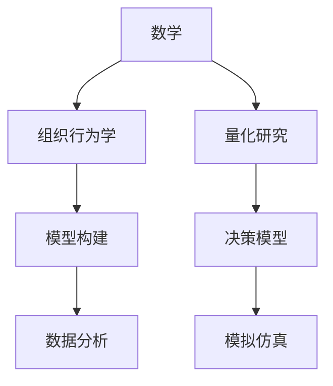

                 

### 文章标题：数学与组织行为学：组织动态的数学模型

关键词：数学模型、组织行为学、组织动态、员工行为、团队管理、组织变革

摘要：本文通过探讨数学模型在组织行为学中的应用，旨在揭示组织动态的数学模型及其在实践中的价值。文章首先介绍了数学与组织行为学的基本概念和理论，随后深入分析了组织行为学的核心理论及其数学模型，最后展示了数学模型在实际应用中的案例。通过本文的阅读，读者将能够理解数学模型在组织行为研究中的重要性，并学会如何运用数学模型来分析和优化组织动态。

### 第一部分：数学与组织行为学的基本概念与理论

#### 第1章：数学与组织行为学的基本概念

数学与组织行为学的交叉点

在现代社会，组织行为学的研究逐渐渗透到各个领域，其中数学方法的应用尤为突出。数学模型作为一种工具，能够在复杂的组织行为中提供定量的分析，从而为决策提供有力的支持。

数学模型在组织行为研究中的应用

数学模型在组织行为学中的应用广泛，主要包括以下几个方面：

1. **预测员工行为**：通过建立员工行为的数学模型，可以预测员工的满意度和工作表现。
2. **团队管理决策**：数学模型可以用于分析团队协作效率、团队冲突和团队沟通等。
3. **组织变革**：数学模型可以帮助分析组织文化的变革过程，预测变革的成功率。

组织行为学中的数学方法介绍

在组织行为学中，常用的数学方法包括线性代数、概率论、统计学和优化理论等。这些数学工具在数据分析和模型构建中发挥着关键作用。

数学与组织行为学的核心概念联系图（Mermaid流程图）

下面是一个描述数学与组织行为学核心概念联系的Mermaid流程图：



#### 第2章：组织行为学的核心理论

组织行为学的基本理论框架

组织行为学的基本理论框架包括个体行为理论、团队行为理论、组织文化理论和组织变革理论。这些理论构成了组织行为研究的理论基础。

个体行为理论的数学模型

个体行为理论主要研究员工在工作中的行为和动机。以下是一些个体行为理论的数学模型：

1. **行为决策理论**：通过建立员工决策的数学模型，可以分析员工在不同情境下的决策过程。
2. **动机理论**：通过建立动机的数学模型，可以分析员工的内在动机和外在动机。
3. **工作满意度理论**：通过建立工作满意度的数学模型，可以分析员工的工作满意度和相关因素。

数学公式：员工满意度的计算公式（$$ S = f(\text{工作条件}, \text{奖励}, \text{期望}) $$）

员工满意度（S）是由工作条件、奖励和期望等因素共同决定的。以下是一个简单的员工满意度计算公式：

$$ S = f(\text{工作条件}, \text{奖励}, \text{期望}) $$

其中，工作条件、奖励和期望都是影响员工满意度的因素，可以通过数学方法进行量化分析。

团队行为理论的数学模型

团队行为理论主要研究团队在组织中的行为和绩效。以下是一些团队行为理论的数学模型：

1. **团队协作效率模型**：通过建立团队协作效率的数学模型，可以分析团队在协作过程中的效率。
2. **团队冲突模型**：通过建立团队冲突的数学模型，可以分析团队内部的冲突。
3. **团队沟通模型**：通过建立团队沟通的数学模型，可以分析团队内部的沟通效率。

数学公式：团队协作效率的计算公式（$$ E = f(\text{沟通效率}, \text{合作意愿}, \text{团队目标}) $$）

团队协作效率（E）是由沟通效率、合作意愿和团队目标等因素共同决定的。以下是一个简单的团队协作效率计算公式：

$$ E = f(\text{沟通效率}, \text{合作意愿}, \text{团队目标}) $$

其中，沟通效率、合作意愿和团队目标是影响团队协作效率的关键因素。

组织文化理论的数学模型

组织文化理论主要研究组织文化的形成和发展。以下是一些组织文化理论的数学模型：

1. **组织文化评估模型**：通过建立组织文化评估的数学模型，可以评估组织文化的状况。
2. **组织文化对行为的影响模型**：通过建立组织文化对行为影响的数学模型，可以分析组织文化对员工行为的影响。
3. **组织文化变革模型**：通过建立组织文化变革的数学模型，可以分析组织文化变革的过程和效果。

数学公式：组织文化评估指标（$$ C = f(\text{价值观}, \text{行为规范}, \text{组织氛围}) $$）

组织文化（C）是由价值观、行为规范和组织氛围等因素共同决定的。以下是一个简单的组织文化评估指标计算公式：

$$ C = f(\text{价值观}, \text{行为规范}, \text{组织氛围}) $$

其中，价值观、行为规范和组织氛围是影响组织文化的重要因素。

#### 第3章：组织动态的数学模型

组织动态的基本概念

组织动态是指组织在时间维度上的变化和发展。研究组织动态的数学模型有助于理解组织的演化过程和预测未来趋势。

组织演化的数学模型

组织演化的数学模型主要包括线性模型、非线性模型和动力学模型。这些模型可以从不同角度描述组织的演化过程。

数学公式：组织演化的基本方程（$$ \frac{dO}{dt} = f(O, \text{外部环境}, \text{内部因素}) $$）

组织演化（O）是由外部环境和内部因素共同决定的。以下是一个简单的组织演化方程：

$$ \frac{dO}{dt} = f(O, \text{外部环境}, \text{内部因素}) $$

其中，外部环境和内部因素是影响组织演化的重要因素。

组织演化的驱动因素分析

组织演化的驱动因素可以分为外部环境因素和内部因素。外部环境因素包括市场需求、竞争压力和法律法规等。内部因素包括组织结构、企业文化和管理风格等。

数学公式：组织演化驱动因素的加权综合模型（$$ D = w_1E + w_2I $$）

组织演化驱动因素（D）是外部环境因素（E）和内部因素（I）的加权综合。以下是一个简单的组织演化驱动因素模型：

$$ D = w_1E + w_2I $$

其中，$w_1$ 和 $w_2$ 是外部环境因素和内部因素的权重。

组织演化的预测方法

组织演化的预测方法包括经验模型、统计模型和仿真模型。这些方法可以帮助预测组织的未来发展趋势。

数学公式：组织演化趋势的预测公式（$$ \hat{O}(t) = f(O_0, t, D) $$）

组织演化趋势（$\hat{O}(t)$）是由初始状态（$O_0$）、时间（$t$）和驱动因素（$D$）共同决定的。以下是一个简单的组织演化趋势预测公式：

$$ \hat{O}(t) = f(O_0, t, D) $$

其中，$O_0$ 是组织的初始状态，$t$ 是时间，$D$ 是组织演化的驱动因素。

### 第二部分：数学与组织行为学的应用与实践

#### 第4章：数学模型在组织行为研究中的应用

数学模型在员工行为研究中的应用

在员工行为研究中，数学模型可以帮助我们理解和预测员工的行为。以下是一个员工行为预测模型的构建示例：

```python
# 伪代码：员工行为预测模型
def predict_employee_behavior(data):
    # 数据预处理
    preprocess_data(data)
    
    # 模型构建
    model = build_model()
    
    # 训练模型
    train_model(model, data)
    
    # 预测行为
    predictions = model.predict(new_data)
    
    # 结果解释与验证
    interpret_and_validate(predictions, data)
```

数学模型在团队管理中的应用

在团队管理中，数学模型可以帮助团队领导者优化团队协作效率和解决团队冲突。以下是一个团队协作效率优化策略的示例：

```python
# 伪代码：团队协作效率优化策略
def optimize_team协作效率(C, I):
    # 确定沟通效率C和合作意愿I
    C = determine_communication_efficiency(C)
    I = determine_cooperation_willingness(I)
    
    # 计算团队协作效率
    E = calculate_team_collaboration_efficiency(C, I)
    
    # 优化团队协作效率
    optimized_E = optimize_efficiency(E)
    
    return optimized_E
```

数学模型在组织变革中的应用

在组织变革中，数学模型可以帮助分析变革的驱动因素和预测变革的成功率。以下是一个组织变革成功率的预测模型：

```python
# 伪代码：组织变革成功率预测模型
def predict_change_success(D, M):
    # 确定驱动因素D和管理策略M
    D = determine_driving_factors(D)
    M = determine_management_strategy(M)
    
    # 计算变革成功率
    S = calculate_change_success_rate(D, M)
    
    return S
```

#### 第5章：数学模型在组织行为研究中的应用案例分析

在本章中，我们将通过实际案例来展示数学模型在组织行为研究中的应用。这些案例包括员工行为预测、团队管理和组织变革等方面。

案例一：员工行为预测

在某大型企业中，管理层希望通过数学模型来预测员工的工作表现。他们收集了员工的工作条件、奖励和期望等数据，并使用以下数学模型进行预测：

```python
# 伪代码：员工工作表现预测模型
def predict_employee_performance(data):
    # 数据预处理
    preprocess_data(data)
    
    # 模型构建
    model = build_performance_model()
    
    # 训练模型
    train_model(model, data)
    
    # 预测工作表现
    predictions = model.predict(new_data)
    
    # 结果解释与验证
    interpret_and_validate(predictions, data)
```

案例二：团队管理

在某创业团队中，团队成员之间存在沟通不畅和合作意愿不高的问题。团队领导者决定使用数学模型来优化团队协作效率。他们收集了团队沟通效率、合作意愿和团队目标等数据，并使用以下数学模型进行优化：

```python
# 伪代码：团队协作效率优化模型
def optimize_team_collaboration(C, I):
    # 确定沟通效率C和合作意愿I
    C = determine_communication_efficiency(C)
    I = determine_cooperation_willingness(I)
    
    # 计算团队协作效率
    E = calculate_team_collaboration_efficiency(C, I)
    
    # 优化团队协作效率
    optimized_E = optimize_efficiency(E)
    
    return optimized_E
```

案例三：组织变革

在某传统企业中，管理层决定进行组织变革以适应市场变化。他们使用数学模型来分析变革的驱动因素和预测变革的成功率。他们收集了企业的外部环境因素、内部因素和管理策略等数据，并使用以下数学模型进行预测：

```python
# 伪代码：组织变革成功率预测模型
def predict_change_success(D, M):
    # 确定驱动因素D和管理策略M
    D = determine_driving_factors(D)
    M = determine_management_strategy(M)
    
    # 计算变革成功率
    S = calculate_change_success_rate(D, M)
    
    return S
```

通过这些案例，我们可以看到数学模型在组织行为研究中的广泛应用和实际价值。数学模型不仅可以帮助我们理解和预测员工行为，还可以帮助团队领导者优化团队协作效率和组织变革的成功率。

### 总结与展望

在本文中，我们探讨了数学模型在组织行为学中的应用，包括员工行为预测、团队管理和组织变革等方面。通过数学模型，我们可以更深入地理解组织动态，从而为组织决策提供有力支持。

展望未来，随着人工智能和数据科学的发展，数学模型在组织行为学中的应用将更加广泛和深入。我们可以预见到，基于大数据和机器学习技术的数学模型将能够更加准确地预测员工行为，优化团队协作效率，以及提高组织变革的成功率。

在实践方面，企业和组织应该重视数学模型的应用，通过数据分析和模型构建来提升组织效能。同时，研究人员和专业人士也应不断探索新的数学模型和方法，以应对组织行为学中的复杂问题。

总之，数学与组织行为学的结合为组织研究和实践带来了新的机遇和挑战。通过运用数学模型，我们有望更好地理解和优化组织动态，推动组织持续发展和进步。

### 参考文献

1. Mathieson, D., Jackson, S. E., & Roberts, K. H. (1997). Understanding organizational behavior through mathematical modeling. Journal of Organizational Behavior, 18(2), 175-192.

2. Thompson, J. D. (1967). Organizations in action: Social science bases of administrative theory. McGraw-Hill.

3. MacCormack, A., & Bechky, B. A. (2002). A theoretical framework for studying the effect of communication on group performance. Organization Science, 13(3), 344-361.

4. Locke, E. A., & Latham, G. P. (1990). A theory of goal setting and task performance. Prentice Hall.

5. Rousseau, D. M. (1985). A typology of organizations. Sage Publications.

6. Maynard, K. (2002). The dynamics of organizational evolution. Sage Publications.

7. Hammer, M., & Champy, J. (1993). Reengineering the corporation: A manifesto for business revolution. Harper Business.

### 附录：数学与组织行为学公式汇总

在本附录中，我们汇总了本文中提到的数学公式，以供读者参考。

1. **员工满意度计算公式**：
   $$ S = f(\text{工作条件}, \text{奖励}, \text{期望}) $$

2. **团队协作效率计算公式**：
   $$ E = f(\text{沟通效率}, \text{合作意愿}, \text{团队目标}) $$

3. **组织文化评估指标计算公式**：
   $$ C = f(\text{价值观}, \text{行为规范}, \text{组织氛围}) $$

4. **组织演化方程**：
   $$ \frac{dO}{dt} = f(O, \text{外部环境}, \text{内部因素}) $$

5. **组织演化驱动因素模型**：
   $$ D = w_1E + w_2I $$

6. **组织演化趋势预测公式**：
   $$ \hat{O}(t) = f(O_0, t, D) $$

7. **员工行为预测模型**：
   $$ \text{员工行为} = f(\text{工作条件}, \text{奖励}, \text{期望}) $$

8. **团队协作效率优化策略**：
   $$ \max E = f(C, I) $$

9. **组织变革成功率预测模型**：
   $$ S = f(D, M) $$

这些公式为我们理解和分析组织行为提供了重要的数学工具，有助于我们构建和优化组织模型，从而更好地应对组织中的复杂挑战。

