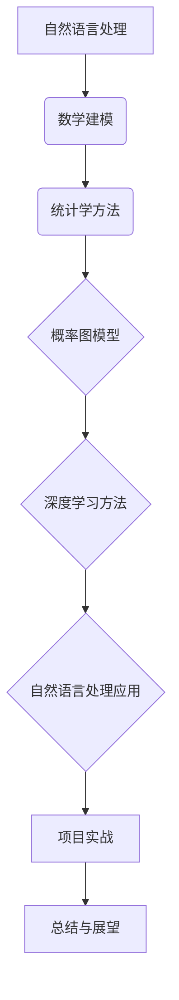
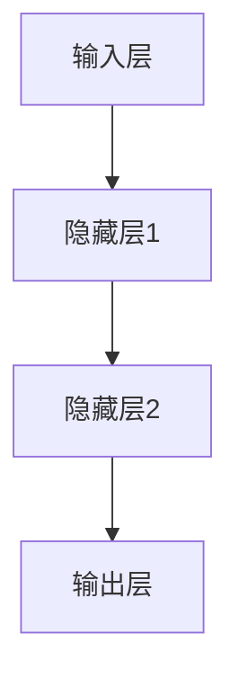

                 

### 文章标题

《数学与自然语言处理：语言的数学建模》

关键词：自然语言处理，数学建模，语言模型，概率图模型，深度学习

摘要：本文旨在探讨数学与自然语言处理之间的紧密联系，特别是数学在自然语言处理中的作用。通过介绍语言模型的数学建模方法，包括统计学方法和概率图模型，本文将展示如何使用数学工具来理解和处理自然语言。此外，还将讨论深度学习在自然语言处理中的应用，并探讨当前领域的发展趋势和未来方向。

### 《数学与自然语言处理：语言的数学建模》目录大纲

#### 第一部分：数学与自然语言处理基础

##### 第1章：引言与概述

1.1 书籍主题与目标  
1.1.1 自然语言处理的基本概念  
1.1.2 数学在自然语言处理中的作用  
1.1.3 语言模型的数学建模

1.2 语言模型概述  
1.2.1 语言模型的类型  
1.2.2 语言模型的特性  
1.2.3 语言模型的应用

#### 第二部分：数学建模方法

##### 第2章：统计学方法

2.1 统计语言模型基础  
2.1.1 语言模型的基本概念  
2.1.2 N元语法模型  
2.1.3 语言模型的训练与评估

2.2 统计模型的改进  
2.2.1 最大熵模型  
2.2.2 朴素贝叶斯模型  
2.2.3 隐马尔可夫模型

##### 第3章：概率图模型基础

3.1 贝叶斯网络  
3.1.1 贝叶斯网络的基本概念  
3.1.2 贝叶斯网络的构建  
3.1.3 贝叶斯网络的推理

3.2 马尔可夫网络  
3.2.1 马尔可夫网络的基本概念  
3.2.2 马尔可夫网络的构建  
3.2.3 马尔可夫网络的推理

#### 第三部分：深度学习方法

##### 第4章：深度学习方法与语言模型

4.1 深度学习基础  
4.1.1 神经网络的基本结构  
4.1.2 深度学习模型的优化  
4.1.3 深度学习框架简介

4.2 递归神经网络（RNN）  
4.2.1 RNN的基本原理  
4.2.2 LSTM和GRU模型  
4.2.3 RNN在语言模型中的应用

##### 第5章：自然语言处理应用

5.1 文本分类  
5.1.1 文本分类的概念  
5.1.2 基于统计模型的文本分类  
5.1.3 基于深度学习的文本分类

5.2 机器翻译  
5.2.1 机器翻译的基本概念  
5.2.2 基于统计模型的机器翻译  
5.2.3 基于深度学习的机器翻译

##### 第6章：情感分析

6.1 情感分析的概念  
6.1.1 情感分析的目标  
6.1.2 情感分析的挑战  
6.1.3 情感分析的方法

6.2 基于深度学习的情感分析  
6.2.1 基于RNN的情感分析  
6.2.2 基于BERT的情感分析  
6.2.3 情感分析应用案例

#### 第四部分：项目实战

##### 第7章：数学与自然语言处理实战

7.1 实战项目概述  
7.1.1 项目背景  
7.1.2 项目目标  
7.1.3 项目技术路线

7.2 实战项目开发  
7.2.1 开发环境搭建  
7.2.2 数据处理  
7.2.3 模型训练与优化

7.3 实战项目部署  
7.3.1 模型部署  
7.3.2 系统集成  
7.3.3 项目评估与优化

#### 第五部分：总结与展望

##### 第8章：总结与展望

8.1 总结  
8.1.1 数学与自然语言处理的关键技术  
8.1.2 发展趋势与未来方向

8.2 展望  
8.2.1 面临的挑战  
8.2.2 发展机会  
8.2.3 推荐研究方向

### 附录

#### 附录A：数学公式与代码示例

A.1 数学公式示例  
A.2 代码示例

#### 附录B：参考文献与推荐阅读

B.1 参考文献  
B.2 推荐阅读  
B.3 相关资源链接

### Mermaid 流程图



### 伪代码示例

```python
# 递归神经网络（RNN）的基本结构
class RNN:
    def __init__(self, input_size, hidden_size):
        # 初始化权重和偏置
        self.Wxh = np.random.randn(hidden_size, input_size)
        self.Whh = np.random.randn(hidden_size, hidden_size)
        selfWhy = np.random.randn(vocab_size, hidden_size)
        self.bh = np.zeros((hidden_size, 1))
        self.by = np.zeros((vocab_size, 1))

    def forward(self, x, h_prev):
        # 前向传播
        h = np.tanh(self.Wxh * x + self.Whh * h_prev + self.bh)
        y = self.Why * h + self.by
        return y, h
```

### 作者信息

作者：AI天才研究院/AI Genius Institute & 禅与计算机程序设计艺术 /Zen And The Art of Computer Programming## 第1章：引言与概述

### 1.1 书籍主题与目标

《数学与自然语言处理：语言的数学建模》旨在探讨数学在自然语言处理（NLP）领域的应用，特别是如何利用数学工具和模型来理解和处理自然语言。本书的目标是帮助读者深入了解数学建模在自然语言处理中的核心概念、方法和技术，并通过实际案例展示其应用。

首先，本书将介绍自然语言处理的基本概念，包括文本处理、语言模型、文本分类、机器翻译和情感分析等。接着，我们将详细探讨数学在自然语言处理中的作用，如何通过数学建模来构建和优化语言模型。此外，本书还将讨论统计学方法、概率图模型和深度学习等先进的数学工具，展示其在自然语言处理中的应用。

最后，本书将通过一系列实际案例，展示如何将数学建模应用于自然语言处理的各个领域，并探讨当前领域的发展趋势和未来方向。

### 1.1.1 自然语言处理的基本概念

自然语言处理（NLP）是计算机科学、人工智能和语言学交叉领域的一部分，旨在使计算机能够理解和处理人类语言。NLP的目标是使计算机能够理解、解释和生成自然语言，以便进行人机交互、信息检索、文本挖掘和机器翻译等应用。

NLP的关键任务包括：

1. **文本处理**：将文本转换为计算机可以处理的形式，如分词、词性标注和句法分析。
2. **语言模型**：通过统计方法或深度学习模型，学习自然语言的概率分布，以便进行预测和生成。
3. **文本分类**：将文本根据其内容分类到不同的类别，如情感分析、垃圾邮件检测等。
4. **机器翻译**：将一种语言的文本翻译成另一种语言。
5. **问答系统**：构建能够回答用户问题的系统，如智能客服、聊天机器人等。
6. **情感分析**：识别文本中的情感倾向，如正面、负面或中立。

### 1.1.2 数学在自然语言处理中的作用

数学在自然语言处理中起着至关重要的作用。以下是数学在NLP中的一些关键应用：

1. **统计学方法**：NLP中的许多任务，如文本分类和语言模型，都可以通过统计学方法来建模。统计学方法可以用来估计语言模型中的参数，并通过训练数据来优化模型。
2. **概率图模型**：概率图模型，如贝叶斯网络和马尔可夫网络，可以用来建模文本中的变量之间的关系。这些模型可以用于文本分类、情感分析和机器翻译等任务。
3. **深度学习**：深度学习模型，如递归神经网络（RNN）和变换器（Transformer），通过学习大量的文本数据，可以自动提取语言的特征，并应用于各种NLP任务。
4. **优化算法**：优化算法在训练深度学习模型时起着关键作用。通过优化算法，我们可以找到模型参数的最佳值，从而提高模型的性能。
5. **线性代数和微积分**：线性代数和微积分是深度学习模型的核心组成部分。这些数学工具帮助我们在计算模型时处理大量的数据和高维空间。

### 1.1.3 语言模型的数学建模

语言模型是自然语言处理的核心概念之一。它是一种用于预测下一个单词或词组的模型，通常基于统计方法或深度学习模型构建。以下是语言模型的数学建模方法：

1. **N元语法模型**：N元语法模型通过统计前N个单词的联合概率来预测下一个单词。这种模型可以用条件概率来表示，即：

   $$P(w_{n+1} | w_{n}, w_{n-1}, \ldots, w_{n-N+1})$$

   其中，$w_{n+1}$ 是下一个单词，$w_{n}, w_{n-1}, \ldots, w_{n-N+1}$ 是前N个单词。

2. **最大熵模型**：最大熵模型通过最大化后验概率来预测下一个单词。这种模型可以用最大熵原理来构建，即：

   $$\max_{\theta} \sum_{w_n} P(w_n | \theta) \log P(w_n | \theta)$$

   其中，$\theta$ 是模型参数，$P(w_n | \theta)$ 是给定模型参数的单词的概率。

3. **递归神经网络（RNN）**：RNN通过递归地处理序列数据来构建语言模型。这种模型可以用以下伪代码表示：

   ```python
   class RNN:
       def __init__(self, input_size, hidden_size):
           # 初始化权重和偏置
           self.Wxh = np.random.randn(hidden_size, input_size)
           self.Whh = np.random.randn(hidden_size, hidden_size)
           self.Why = np.random.randn(vocab_size, hidden_size)
           self.bh = np.zeros((hidden_size, 1))
           self.by = np.zeros((vocab_size, 1))

       def forward(self, x, h_prev):
           # 前向传播
           h = np.tanh(self.Wxh * x + self.Whh * h_prev + self.bh)
           y = self.Why * h + self.by
           return y, h
   ```

4. **变换器（Transformer）**：变换器是一种基于自注意力机制的深度学习模型，用于构建强大的语言模型。这种模型可以用以下伪代码表示：

   ```python
   class Transformer:
       def __init__(self, d_model, num_heads, dff):
           # 初始化权重和偏置
           self.d_model = d_model
           self.num_heads = num_heads
           self.dff = dff

           self.Wq = np.random.randn(d_model, d_model)
           self.Wk = np.random.randn(d_model, d_model)
           self.Wv = np.random.randn(d_model, d_model)

           self.d FWq = np.random.randn(d_model, dff)
           self.d FWk = np.random.randn(d_model, dff)
           self.d FWv = np.random.randn(d_model, dff)

           self.d FF = np.random.randn(dff, d_model)

       def forward(self, x, mask):
           # 前向传播
           q = self.Wq * x
           k = self.Wk * x
           v = self.Wv * x

           q = self.d FWq * q
           k = self.d FWk * k
           v = self.d FWv * v

           attn = softmax(QK^T / \sqrt{d_k})
           attn = mask * attn

           v = attn * v
           v = self.d FF * v

           return v
   ```

通过这些数学建模方法，我们可以构建强大的语言模型，从而在自然语言处理任务中取得优异的性能。

### 1.2 语言模型概述

语言模型是自然语言处理（NLP）领域的核心概念之一，它用于预测文本中下一个单词或词组的概率。语言模型在许多NLP任务中发挥着重要作用，如机器翻译、语音识别、情感分析和文本生成等。以下是语言模型的一些基本类型和特性。

#### 1.2.1 语言模型的类型

1. **N元语法模型**：N元语法模型是最早的语言模型之一，它基于前N个单词的统计信息来预测下一个单词。N元语法模型的优点是简单直观，但缺点是当N增大时，模型复杂度和计算量急剧增加。

2. **最大熵模型**：最大熵模型通过最大化后验概率来预测下一个单词。这种模型利用统计方法，结合语言中的先验知识和数据来训练模型。最大熵模型在处理稀疏数据和高维特征时表现出色。

3. **递归神经网络（RNN）**：递归神经网络是一种能够处理序列数据的深度学习模型。RNN通过递归地处理序列中的每个元素，并保存先前的状态，从而能够捕捉长距离依赖关系。RNN包括LSTM和GRU等变体，它们通过门控机制来改进模型的记忆能力。

4. **变换器（Transformer）**：变换器是一种基于自注意力机制的深度学习模型。与RNN不同，变换器将序列数据展成一个矩阵，并利用自注意力机制来计算序列中每个元素之间的相互关系。变换器在许多NLP任务中表现出优异的性能，特别是长文本生成和机器翻译。

#### 1.2.2 语言模型的特性

1. **概率分布**：语言模型是一种概率模型，它为文本序列中的每个单词或词组分配一个概率。这种概率分布可以帮助模型预测下一个单词或词组，从而生成文本。

2. **序列依赖性**：语言模型能够捕捉文本中的序列依赖性，即一个单词或词组的概率取决于前一个或多个单词或词组。这种特性使得语言模型在处理自然语言时能够更好地理解上下文信息。

3. **可扩展性**：语言模型可以处理不同长度和类型的文本序列。通过调整模型的参数和超参数，我们可以适应不同的应用场景。

4. **参数化**：语言模型通常是一个参数化模型，它通过学习大量的文本数据来估计模型参数。这些参数可以用于预测新的文本序列的概率。

#### 1.2.3 语言模型的应用

语言模型在NLP领域有许多应用，以下是其中一些常见的应用：

1. **机器翻译**：语言模型可以帮助机器翻译系统预测源语言到目标语言的翻译。通过训练双语言语料库，语言模型可以学习两种语言之间的概率分布，从而生成准确的翻译。

2. **语音识别**：语言模型可以帮助语音识别系统识别说话者所说的文本。通过将语音信号转换为文本序列，语言模型可以预测每个单词或词组的概率，从而提高系统的识别准确率。

3. **文本生成**：语言模型可以用于生成自然语言文本，如文章、故事和诗歌等。通过训练大量的文本数据，语言模型可以学习文本的结构和语义，从而生成具有流畅性和连贯性的文本。

4. **问答系统**：语言模型可以帮助问答系统理解用户的问题，并生成相关的回答。通过学习大量的问答数据，语言模型可以识别用户问题的意图，并从知识库中检索相关信息。

5. **情感分析**：语言模型可以帮助情感分析系统识别文本中的情感倾向，如正面、负面或中立。通过分析文本的语义和情感特征，语言模型可以预测文本的情感极性。

总之，语言模型是自然语言处理的核心工具之一。通过数学建模和深度学习技术，我们可以构建强大的语言模型，从而在NLP任务中实现高效和准确的文本处理。

### 第2章：统计学方法

在自然语言处理（NLP）中，统计学方法是一种关键的工具，用于构建和优化语言模型。这些方法通过分析大量的文本数据来估计语言中的概率分布，从而预测下一个单词或词组。本章将介绍几种常见的统计学方法，包括N元语法模型、最大熵模型、朴素贝叶斯模型和隐马尔可夫模型。

#### 2.1 统计语言模型基础

统计语言模型的基础是概率分布。在NLP中，我们通常关注的是单词或词组之间的联合概率分布。例如，给定一个单词序列，我们希望预测下一个单词的概率。以下是几种常见的统计语言模型。

##### 2.1.1 语言模型的基本概念

1. **N元语法模型**：N元语法模型是一种基于前N个单词的统计方法。给定一个N元序列，模型计算下一个单词的概率。N通常取值在1到5之间。

2. **最大熵模型**：最大熵模型通过最大化文本数据中的后验概率来构建语言模型。它结合了先验知识和文本数据，从而得到一个均衡的模型。

3. **递归神经网络（RNN）**：RNN是一种深度学习模型，通过递归地处理序列数据来构建语言模型。RNN能够捕捉长距离依赖关系。

4. **变换器（Transformer）**：变换器是一种基于自注意力机制的深度学习模型，用于构建强大的语言模型。变换器在许多NLP任务中表现出优异的性能。

##### 2.1.2 N元语法模型

N元语法模型是一种简单而直观的语言模型，它通过统计前N个单词的联合概率来预测下一个单词。这种模型可以用条件概率来表示：

$$P(w_{n+1} | w_{n}, w_{n-1}, \ldots, w_{n-N+1})$$

其中，$w_{n+1}$ 是下一个单词，$w_{n}, w_{n-1}, \ldots, w_{n-N+1}$ 是前N个单词。

N元语法模型的优点是简单易懂，但缺点是当N增大时，模型复杂度和计算量急剧增加。

##### 2.1.3 语言模型的训练与评估

语言模型的训练和评估是关键步骤。以下是训练和评估N元语法模型的基本方法：

1. **数据准备**：首先，我们需要准备大量的文本数据，并将其分词成单词序列。

2. **构建词典**：将所有单词映射到一个唯一的索引，以便在计算过程中使用。

3. **计算联合概率**：通过文本数据，计算每个N元序列的联合概率。可以使用频率计数或加一平滑等方法来处理稀疏数据。

4. **评估模型**：使用测试集来评估模型的性能。常见的评估指标包括 perplexity（困惑度）和准确率。

#### 2.2 统计模型的改进

为了提高语言模型的性能，我们可以对基本统计模型进行改进。以下是一些常见的改进方法。

##### 2.2.1 最大熵模型

最大熵模型通过最大化文本数据中的后验概率来构建语言模型。这种模型结合了先验知识和文本数据，从而得到一个均衡的模型。最大熵模型的公式如下：

$$\max_{\theta} \sum_{w_n} P(w_n | \theta) \log P(w_n | \theta)$$

其中，$\theta$ 是模型参数，$P(w_n | \theta)$ 是给定模型参数的单词的概率。

最大熵模型的主要优点是它能够利用先验知识，并避免过拟合。

##### 2.2.2 朴素贝叶斯模型

朴素贝叶斯模型是一种简单而有效的分类模型。在语言模型中，朴素贝叶斯模型可以通过假设每个单词的概率与所有其他单词独立来构建。这种模型可以用以下公式表示：

$$P(w_{n+1} | w_{n}, w_{n-1}, \ldots, w_{n-N+1}) = \frac{P(w_{n+1}) P(w_{n} | w_{n+1}) P(w_{n-1} | w_{n+1}) \ldots P(w_{n-N+1} | w_{n+1})}{P(w_{n}, w_{n-1}, \ldots, w_{n-N+1})}$$

其中，$P(w_{n+1})$ 是下一个单词的概率，$P(w_{n} | w_{n+1})$ 是给定下一个单词的概率。

朴素贝叶斯模型的主要优点是它简单高效，且在处理稀疏数据时表现良好。

##### 2.2.3 隐马尔可夫模型

隐马尔可夫模型（HMM）是一种用于序列建模的概率图模型。在语言模型中，HMM可以将单词序列建模为一个隐含的状态序列。这种模型可以用以下公式表示：

$$P(w_{n+1} | w_{n}, w_{n-1}, \ldots, w_{n-N+1}) = \sum_{s_n} P(s_n | w_{n}, w_{n-1}, \ldots, w_{n-N+1}) P(w_{n+1} | s_n)$$

其中，$s_n$ 是隐含的状态，$P(s_n | w_{n}, w_{n-1}, \ldots, w_{n-N+1})$ 是给定当前单词序列的状态概率，$P(w_{n+1} | s_n)$ 是给定状态的概率。

HMM的主要优点是它能够捕捉单词序列中的转移关系，从而提高模型的性能。

#### 2.3 统计模型的实际应用

统计模型在NLP中有着广泛的应用。以下是一些实际应用案例。

##### 2.3.1 文本分类

文本分类是一种常见的NLP任务，它将文本数据分类到不同的类别。统计模型，如朴素贝叶斯和最大熵模型，常用于文本分类任务。通过训练模型，我们可以将新的文本数据分类到预定义的类别。

##### 2.3.2 机器翻译

机器翻译是将一种语言的文本翻译成另一种语言。统计模型，如N元语法模型，可以用于训练机器翻译模型。通过学习双语言语料库，模型可以预测目标语言的单词序列，从而生成准确的翻译。

##### 2.3.3 情感分析

情感分析是一种用于识别文本中情感倾向的任务。统计模型，如最大熵模型和朴素贝叶斯模型，可以用于训练情感分析模型。通过分析文本的语义和情感特征，模型可以预测文本的情感极性。

通过本章的讨论，我们可以看到统计方法在自然语言处理中的重要性。这些方法通过分析大量的文本数据，构建了强大的语言模型，从而在许多NLP任务中取得了优异的性能。接下来，我们将进一步探讨概率图模型，如贝叶斯网络和马尔可夫网络，它们在自然语言处理中的应用。

### 第3章：概率图模型基础

概率图模型是自然语言处理（NLP）领域的重要工具，用于建模文本中的变量和它们之间的关系。这些模型通过图形结构来表示变量之间的条件独立性，从而提供了一种直观且强大的方法来推断和预测文本中的信息。本章将介绍两种常见的概率图模型：贝叶斯网络和马尔可夫网络。

#### 3.1 贝叶斯网络

贝叶斯网络，也称为信念网络，是一种概率图模型，用于表示变量之间的条件依赖关系。在贝叶斯网络中，每个变量都是图中的一个节点，而节点之间的边表示变量之间的依赖关系。贝叶斯网络的定义如下：

$$P(X_1, X_2, \ldots, X_n) = \prod_{i=1}^{n} P(X_i | Pa(X_i))$$

其中，$X_i$ 表示第$i$个变量，$Pa(X_i)$ 表示$X_i$ 的父节点。这个公式表示给定所有父节点的条件下，每个变量的条件概率。

##### 3.1.1 贝叶斯网络的基本概念

1. **节点**：贝叶斯网络中的节点表示文本中的变量。例如，在情感分析中，节点可以表示文本中的每个单词或词组。

2. **边**：贝叶斯网络中的边表示变量之间的依赖关系。如果两个变量之间存在边，则表示它们是相关的。例如，如果“快乐”和“悲伤”之间存在边，则表示这两个词在情感分析中是相关的。

3. **条件独立性**：贝叶斯网络的图形结构确保了变量之间的条件独立性。这意味着如果两个变量在给定其他变量的条件下是独立的，则在图形中没有直接边连接这两个变量。

##### 3.1.2 贝叶斯网络的构建

构建贝叶斯网络的步骤如下：

1. **变量识别**：确定需要建模的变量。在NLP中，这些变量可以是单词、句子或段落。

2. **依赖关系分析**：分析变量之间的依赖关系。可以通过领域知识、专家意见或数据分析来识别这些关系。

3. **图形构建**：根据依赖关系构建贝叶斯网络的图形结构。每个变量是一个节点，变量之间的边表示依赖关系。

4. **概率分布**：为每个变量及其父节点计算概率分布。这通常通过贝叶斯推理或马尔可夫链蒙特卡罗（MCMC）方法来实现。

##### 3.1.3 贝叶斯网络的推理

贝叶斯网络的推理是一种计算变量联合概率分布的过程。以下是贝叶斯网络推理的基本步骤：

1. **前向推理**：从根节点开始，计算每个节点的条件概率，直到所有节点的条件概率都被计算出来。

2. **后向推理**：从叶节点开始，通过逆向计算条件概率，直到所有节点的条件概率都被计算出来。

3. **信念传播**：通过在网络中传播概率信息，可以计算任何变量的边缘概率分布。

贝叶斯网络在自然语言处理中的应用非常广泛，包括文本分类、信息提取、情感分析和机器翻译等。例如，在情感分析中，贝叶斯网络可以用于推断文本的情感倾向；在信息提取中，它可以用于识别文本中的实体和关系。

#### 3.2 马尔可夫网络

马尔可夫网络，也称为马尔可夫模型，是一种特殊的概率图模型，用于建模变量之间的转移概率。与贝叶斯网络不同，马尔可夫网络通常只包含边，没有方向。马尔可夫网络的定义如下：

$$P(X_1, X_2, \ldots, X_n) = \prod_{i=1}^{n} P(X_i | X_{i-1})$$

其中，$P(X_i | X_{i-1})$ 表示给定前一个变量的条件下，当前变量的概率。

##### 3.2.1 马尔可夫网络的基本概念

1. **状态**：马尔可夫网络中的状态是变量的一个取值。例如，在语言模型中，状态可以是单词或词组。

2. **转移概率**：转移概率是当前状态给定前一个状态的条件下，下一个状态的概率。例如，在语言模型中，转移概率可以表示为下一个单词给定前一个单词的概率。

##### 3.2.2 马尔可夫网络的构建

构建马尔可夫网络的步骤如下：

1. **状态识别**：确定需要建模的状态。在NLP中，这些状态可以是单词、句子或段落。

2. **转移概率计算**：通过分析大量的文本数据，计算状态之间的转移概率。这通常通过最大似然估计或贝叶斯推断来实现。

3. **网络构建**：根据状态和转移概率构建马尔可夫网络的图形结构。每个状态是一个节点，状态之间的边表示转移概率。

##### 3.2.3 马尔可夫网络的推理

马尔可夫网络的推理是一种计算变量序列的概率分布的过程。以下是马尔可夫网络推理的基本步骤：

1. **初始化**：初始化网络中的概率分布，通常使用最大似然估计或贝叶斯推断。

2. **前向推理**：从初始状态开始，依次计算每个状态的条件下概率，直到最后一个状态。

3. **后向推理**：从最后一个状态开始，依次计算每个状态的条件下概率，直到初始状态。

4. **边缘概率计算**：通过前向推理和后向推理的结果，计算任意两个状态的边缘概率分布。

马尔可夫网络在自然语言处理中的应用包括文本分类、序列标注、情感分析和机器翻译等。例如，在文本分类中，马尔可夫网络可以用于计算每个类别的概率；在序列标注中，它可以用于识别文本中的实体和关系。

通过本章的讨论，我们可以看到概率图模型在自然语言处理中的重要性。贝叶斯网络和马尔可夫网络提供了一种直观且强大的方法来建模文本中的变量和它们之间的关系。这些模型通过图形结构来表示条件独立性，从而在推理和预测文本信息时表现出色。接下来，我们将探讨深度学习方法在自然语言处理中的应用。

### 第4章：深度学习方法与语言模型

深度学习是近年来在自然语言处理（NLP）领域取得突破性进展的重要技术。深度学习模型，如递归神经网络（RNN）、长短期记忆网络（LSTM）和变换器（Transformer），通过自动学习大量文本数据中的复杂特征，能够在许多NLP任务中实现优异的性能。本章将详细介绍深度学习方法的基础知识、如何应用于语言模型，以及它们的优缺点。

#### 4.1 深度学习基础

深度学习是一种基于多层神经网络的学习方法，其核心思想是通过堆叠多个简单的神经网络层，来提取数据中的层次化特征。在深度学习中，每个神经网络层都通过学习输入数据和上一层的输出数据之间的关系，来提取更高层次的特征。以下是深度学习的一些基本组成部分：

1. **神经元**：神经元是神经网络的基本单元，它通过加权求和并应用激活函数来产生输出。

2. **层**：神经网络由多个层组成，包括输入层、隐藏层和输出层。输入层接收输入数据，隐藏层提取特征，输出层生成预测结果。

3. **权重和偏置**：权重和偏置是神经网络中的可训练参数，用于调整模型对数据的拟合程度。

4. **激活函数**：激活函数用于引入非线性，使神经网络能够学习复杂的特征。常见的激活函数包括 sigmoid、ReLU 和 tanh。

5. **反向传播**：反向传播是一种用于训练神经网络的方法，它通过计算输出和真实值之间的误差，并反向传播误差来更新权重和偏置。

#### 4.1.1 神经网络的基本结构

一个简单的神经网络可以表示为：



在这个网络中，输入层接收输入数据，隐藏层提取特征，输出层生成预测结果。每个隐藏层都可以包含多个神经元，而输出层的神经元数量取决于任务的类型（例如，分类任务通常有一个神经元对应每个类别）。

#### 4.1.2 深度学习模型的优化

训练深度学习模型通常涉及以下步骤：

1. **初始化权重和偏置**：随机初始化权重和偏置，以开始训练过程。

2. **前向传播**：通过神经网络计算输出，并与真实值进行比较，以计算损失。

3. **反向传播**：计算损失关于每个参数的梯度，并使用优化算法（如梯度下降）来更新权重和偏置。

4. **迭代**：重复前向传播和反向传播，直到模型收敛或达到预定的迭代次数。

5. **正则化**：为了防止过拟合，可以使用正则化技术（如dropout、权重衰减和L2正则化）来惩罚复杂的模型。

6. **超参数调整**：通过调整学习率、批次大小、隐藏层数量和神经元数量等超参数来优化模型性能。

#### 4.1.3 深度学习框架简介

深度学习框架是用于训练和部署深度学习模型的工具集。以下是一些流行的深度学习框架：

1. **TensorFlow**：由谷歌开发，是最大的深度学习框架之一，支持Python和C++接口。

2. **PyTorch**：由Facebook开发，是一种流行的深度学习框架，以其灵活性和动态计算图而著称。

3. **Keras**：是一个高层次的深度学习API，可以在TensorFlow和Theano等底层框架上运行。

4. **MXNet**：由Apache Software Foundation开发，是一种用于分布式深度学习的框架。

这些框架提供了丰富的工具和库，使深度学习模型的开发、训练和部署变得更加便捷和高效。

#### 4.2 递归神经网络（RNN）

递归神经网络（RNN）是一种专门用于处理序列数据的神经网络。与传统的前馈神经网络不同，RNN具有递归结构，能够利用先前的信息来处理序列中的每个元素。以下是RNN的一些关键特性：

1. **递归结构**：RNN的隐藏层在时间步之间递归连接，使得模型能够保留先前的状态信息。

2. **输入和隐藏状态**：RNN在每个时间步接收输入数据和隐藏状态，并产生新的隐藏状态和输出。

3. **长短时记忆（LSTM）和门控循环单元（GRU）**：LSTM和GRU是RNN的变体，通过引入门控机制来改善记忆能力，从而能够更好地处理长序列数据。

#### 4.2.1 RNN的基本原理

RNN的基本原理可以表示为：

$$h_t = \text{sigmoid}(W_{ih}x_t + W_{hh}h_{t-1} + b_h)$$

$$o_t = \text{sigmoid}(W_{ih}x_t + W_{ho}h_t + b_o)$$

其中，$h_t$ 表示第$t$个时间步的隐藏状态，$x_t$ 表示第$t$个时间步的输入，$W_{ih}$ 和$W_{hh}$ 分别是输入到隐藏层和隐藏到隐藏层的权重矩阵，$b_h$ 是隐藏层的偏置，$\text{sigmoid}$ 是激活函数。

RNN通过递归地更新隐藏状态，从而能够处理序列数据：

$$h_t = \text{sigmoid}(W_{ih}x_t + W_{hh}h_{t-1} + b_h)$$

#### 4.2.2 LSTM和GRU模型

LSTM和GRU是RNN的变体，通过引入门控机制来改善记忆能力。以下是其基本原理：

1. **LSTM（长短时记忆网络）**：

   - **输入门**：用于控制当前输入对记忆单元的影响。
   - **遗忘门**：用于控制从记忆单元中遗忘的信息。
   - **输出门**：用于控制记忆单元的输出。

   LSTM的公式表示为：

   $$i_t = \text{sigmoid}(W_{ih}x_t + W_{ih}h_{t-1} + b_i)$$

   $$f_t = \text{sigmoid}(W_{fh}h_{t-1} + b_f)$$

   $$g_t = \text{tanh}(W_{gh}h_{t-1} + b_g)$$

   $$o_t = \text{sigmoid}(W_{oh}h_{t-1} + b_o)$$

   $$c_t = f_t \odot c_{t-1} + i_t \odot g_t$$

   $$h_t = o_t \odot \text{tanh}(c_t)$$

2. **GRU（门控循环单元）**：

   - **重置门**：用于更新记忆单元。
   - **更新门**：用于控制记忆单元的更新速度。

   GRU的公式表示为：

   $$z_t = \text{sigmoid}(W_{zh}h_{t-1} + b_z)$$

   $$r_t = \text{sigmoid}(W_{rh}h_{t-1} + b_r)$$

   $$h_t = (1 - z_t) \odot h_{t-1} + z_t \odot \text{tanh}(W_{hh} \odot (r_t \odot h_{t-1} + (1 - r_t) \odot x_t))$$

#### 4.2.3 RNN在语言模型中的应用

RNN在语言模型中的应用非常广泛。以下是一些关键应用：

1. **语言模型**：RNN可以用于构建语言模型，通过学习大量的文本数据来预测下一个单词的概率。RNN能够捕捉序列中的长距离依赖关系，从而提高模型的准确性。

2. **机器翻译**：RNN可以用于训练机器翻译模型，通过学习源语言和目标语言之间的概率分布来生成翻译结果。

3. **文本生成**：RNN可以用于生成自然语言文本，通过递归地生成序列中的每个单词或词组。

4. **文本分类**：RNN可以用于文本分类任务，通过将文本序列映射到高维空间，从而实现分类。

#### 4.3 深度学习方法在自然语言处理中的优缺点

深度学习在自然语言处理中具有许多优点，但也存在一些挑战：

**优点**：

1. **强大的特征提取能力**：深度学习模型能够自动学习大量文本数据中的复杂特征，从而提高模型的性能。

2. **多任务处理**：深度学习模型可以同时处理多个任务，如文本分类、机器翻译和情感分析。

3. **端到端学习**：深度学习模型可以实现端到端学习，从输入直接生成输出，从而简化了模型的训练和部署过程。

**缺点**：

1. **计算资源消耗大**：深度学习模型通常需要大量的计算资源和时间来训练。

2. **数据需求量大**：深度学习模型需要大量的数据来训练，这对于数据稀缺的领域（如低资源语言）来说是一个挑战。

3. **难以解释**：深度学习模型的内部机制复杂，难以解释和理解，这限制了其在某些应用场景中的使用。

通过本章的讨论，我们可以看到深度学习在自然语言处理中的重要性和应用。深度学习方法，如RNN、LSTM和变换器，通过自动学习大量文本数据中的复杂特征，为NLP任务提供了强大的工具。接下来，我们将进一步探讨深度学习在自然语言处理中的实际应用。

### 第5章：自然语言处理应用

自然语言处理（NLP）技术在现代信息技术中扮演着至关重要的角色，它们的应用涵盖了文本分类、机器翻译、情感分析等多个领域。本章将深入探讨这些应用，包括其基本概念、常见的统计模型和深度学习模型，以及实际案例分析。

#### 5.1 文本分类

文本分类是NLP领域的一个基本任务，旨在将文本数据自动分类到预定义的类别中。文本分类在应用场景广泛，如垃圾邮件检测、新闻分类、社交媒体内容过滤等。

##### 5.1.1 文本分类的概念

文本分类是指根据文本内容将其分类到不同的类别或标签。例如，将社交媒体帖子分类为正面、负面或中性情感，或将电子邮件分类为工作相关或个人相关。

##### 5.1.2 基于统计模型的文本分类

基于统计模型的文本分类方法通常使用特征提取和分类器训练来实现。以下是几种常见的统计模型：

1. **朴素贝叶斯模型**：朴素贝叶斯模型是一种基于贝叶斯定理的简单分类器。它假设特征之间相互独立，并使用频率统计来计算类别概率。

   伪代码示例：
   ```python
   def naive_bayes_classification(text, labels):
       prior_probabilities = calculate_prior_probabilities(labels)
       likelihoods = calculate_likelihoods(text, features)
       probabilities = multiply_prior_probabilities_and_likelihoods(prior_probabilities, likelihoods)
       predicted_labels = select_max_probability(labels, probabilities)
       return predicted_labels
   ```

2. **最大熵模型**：最大熵模型是一种利用最大熵原理来训练分类器的统计模型。它通过最大化后验概率来预测类别。

   伪代码示例：
   ```python
   def max_entropy_classification(text, features, labels):
       model = train_max_entropy_model(features, labels)
       probabilities = predict_categories(text, model)
       predicted_labels = select_max_probability(categories, probabilities)
       return predicted_labels
   ```

##### 5.1.3 基于深度学习的文本分类

深度学习模型在文本分类中表现出色，能够处理复杂的文本特征。以下是几种常用的深度学习模型：

1. **卷积神经网络（CNN）**：CNN通过卷积操作提取文本中的局部特征，并在分类任务中表现出色。

   伪代码示例：
   ```python
   class TextCNN:
       def __init__(self, vocab_size, embedding_dim, filter_sizes, num_filters):
           # 初始化权重和偏置
           self.embedding = Embedding(vocab_size, embedding_dim)
           self.conv_layers = [Conv2D(num_filters, (filter_size, embedding_dim), activation='relu') for filter_size in filter_sizes]
           self.pooling_layers = [GlobalMaxPooling2D() for _ in filter_sizes]
           self.fc = Dense(num_classes, activation='softmax')

       def forward(self, x):
           x = self.embedding(x)
           conv_outputs = [layer(x).squeeze(2) for layer in self.conv_layers]
           pool_outputs = [layer(output) for layer, output in zip(self.pooling_layers, conv_outputs)]
           concatenation = Concatenate()(pool_outputs)
           output = self.fc(concatenation)
           return output
   ```

2. **变换器（Transformer）**：Transformer通过自注意力机制处理序列数据，并在文本分类任务中取得了显著的效果。

   伪代码示例：
   ```python
   class TextTransformer:
       def __init__(self, d_model, num_heads, dff):
           # 初始化权重和偏置
           self.transformer = Transformer(d_model, num_heads, dff)
           self.fc = Dense(num_classes, activation='softmax')

       def forward(self, x, mask):
           output = self.transformer(x, mask)
           predicted_labels = self.fc(output)
           return predicted_labels
   ```

#### 5.2 机器翻译

机器翻译是将一种语言的文本自动翻译成另一种语言。随着深度学习技术的发展，基于深度学习的机器翻译模型已经取得了显著的成果。

##### 5.2.1 机器翻译的基本概念

机器翻译是一种将源语言文本转换为目标语言文本的过程。常见的机器翻译任务包括：

1. **统计机器翻译（SMT）**：基于统计方法，通过学习双语语料库中的翻译规律来生成翻译结果。

2. **神经机器翻译（NMT）**：基于深度学习模型，通过学习大量的双语文本数据来预测目标语言的单词序列。

##### 5.2.2 基于统计模型的机器翻译

基于统计模型的机器翻译方法包括：

1. **N元语法模型**：通过统计源语言和目标语言之间的单词序列概率来生成翻译结果。

2. **短语翻译模型**：将源语言短语映射到目标语言短语，从而生成翻译结果。

##### 5.2.3 基于深度学习的机器翻译

基于深度学习的机器翻译方法包括：

1. **序列到序列（Seq2Seq）模型**：通过编码器和解码器模型来学习源语言到目标语言的映射。

   伪代码示例：
   ```python
   class Seq2Seq:
       def __init__(self, encoder_vocab_size, decoder_vocab_size, embedding_dim, hidden_size):
           # 初始化编码器和解码器模型
           self.encoder = Encoder(embedding_dim, hidden_size)
           self.decoder = Decoder(embedding_dim, hidden_size, decoder_vocab_size)
           self.fc = Dense(decoder_vocab_size, activation='softmax')

       def forward(self, source, target):
           encoder_output, hidden = self.encoder(source)
           decoder_output = self.decoder(target, hidden)
           predicted_labels = self.fc(decoder_output)
           return predicted_labels
   ```

2. **变换器（Transformer）**：通过自注意力机制和编码器-解码器结构来学习源语言到目标语言的映射。

   伪代码示例：
   ```python
   class TransformerTranslation:
       def __init__(self, d_model, num_heads, dff):
           # 初始化变换器模型
           self.encoder = Transformer(d_model, num_heads, dff)
           self.decoder = Transformer(d_model, num_heads, dff)
           self.fc = Dense(decoder_vocab_size, activation='softmax')

       def forward(self, source, target, source_mask, target_mask):
           encoder_output = self.encoder(source, source_mask)
           decoder_output = self.decoder(target, encoder_output, target_mask)
           predicted_labels = self.fc(decoder_output)
           return predicted_labels
   ```

#### 5.3 情感分析

情感分析是一种用于识别文本中情感倾向的任务，常用于社交媒体分析、客户反馈分析和市场研究等。

##### 5.3.1 情感分析的概念

情感分析旨在判断文本的情感极性，通常分为以下几类：

1. **正面情感**：文本表达积极的情感，如快乐、满意等。
2. **负面情感**：文本表达消极的情感，如悲伤、愤怒等。
3. **中性情感**：文本没有明显的情感倾向。

##### 5.3.2 情感分析的挑战

情感分析面临以下挑战：

1. **情感强度**：文本中的情感强度可能不同，如“喜欢”和“非常喜欢”。
2. **多模态情感**：文本中可能包含图像、音频等多模态信息，这增加了情感分析的复杂性。
3. **语言变化**：不同的语言和文化背景可能导致情感表达的不同。

##### 5.3.3 情感分析的方法

情感分析的方法包括：

1. **基于规则的方法**：通过编写规则来识别文本中的情感特征。

   伪代码示例：
   ```python
   def rule_based_sentiment_analysis(text):
       if "happy" in text:
           return "positive"
       elif "sad" in text:
           return "negative"
       else:
           return "neutral"
   ```

2. **基于机器学习的方法**：使用机器学习模型，如朴素贝叶斯、支持向量机等，来识别文本中的情感倾向。

   伪代码示例：
   ```python
   def machine_learning_sentiment_analysis(text, model):
       features = extract_features(text)
       predicted_sentiment = model.predict([features])
       return predicted_sentiment
   ```

3. **基于深度学习的方法**：使用深度学习模型，如卷积神经网络、变换器等，来识别文本中的情感特征。

   伪代码示例：
   ```python
   class SentimentAnalyzer:
       def __init__(self, embedding_dim, hidden_size):
           # 初始化模型
           self.embedding = Embedding(vocab_size, embedding_dim)
           self.fc = Dense(hidden_size, activation='relu')
           self.sentiment_classifier = Dense(1, activation='sigmoid')

       def forward(self, text):
           embeddings = self.embedding(text)
           hidden = self.fc(embeddings)
           sentiment = self.sentiment_classifier(hidden)
           return sentiment
   ```

#### 5.4 实际案例分析

以下是一些实际案例，展示了自然语言处理技术在文本分类、机器翻译和情感分析中的应用：

1. **文本分类**：使用基于深度学习的文本分类模型，对社交媒体帖子进行情感分析，以识别用户情绪。例如，Twitter上关于电影的评论可以被分类为正面、负面或中性情感。

2. **机器翻译**：使用基于变换器的机器翻译模型，将一种语言的文本翻译成另一种语言。例如，将英语文本翻译成中文，以支持多语言的用户界面。

3. **情感分析**：使用基于卷积神经网络的情感分析模型，分析客户反馈，以识别产品或服务的用户满意度。例如，分析用户对某个餐厅的评论，以评估餐厅的服务质量。

通过本章的讨论，我们可以看到自然语言处理技术在文本分类、机器翻译和情感分析等领域的广泛应用。这些技术通过统计模型和深度学习模型的应用，实现了对文本数据的高效处理和理解。接下来，我们将进一步探讨深度学习在自然语言处理中的最新进展和未来方向。

### 第6章：情感分析

情感分析是自然语言处理（NLP）领域的一个重要分支，旨在从文本中识别和提取情感信息。情感分析不仅在社交媒体分析、市场调研和客户反馈分析等应用中具有广泛的应用，还在金融、健康医疗和智能客服等领域发挥着重要作用。本章将深入探讨情感分析的基本概念、方法及其在NLP中的应用。

#### 6.1 情感分析的概念

情感分析，也称为意见挖掘或情感倾向分析，是指通过自然语言处理技术，从文本中识别和提取主观情感信息的过程。情感分析的目标是判断文本的情感极性（正面、负面或中性），情感强度（如非常满意、满意、一般、不满意、非常不满意）以及情感主题（如快乐、悲伤、愤怒等）。

##### 6.1.1 情感分析的目标

情感分析的主要目标包括：

1. **情感极性分类**：判断文本是正面、负面还是中性情感。
2. **情感强度分析**：识别文本中情感的强度，如非常积极或非常消极。
3. **情感主题识别**：识别文本中表达的具体情感，如快乐、悲伤、愤怒等。

##### 6.1.2 情感分析的挑战

情感分析面临以下挑战：

1. **多模态情感**：文本中可能包含图像、音频等多模态信息，这增加了情感分析的复杂性。
2. **语言变化**：不同语言和文化背景下，情感表达方式可能有所不同。
3. **语言风格和语气**：文本的语言风格和语气（如幽默、讽刺、讽刺性语气等）可能影响情感判断。
4. **上下文依赖**：情感通常依赖于上下文，即同一词汇在不同的上下文中可能表达不同的情感。
5. **低资源语言**：对于低资源语言，缺乏足够的训练数据和标注数据，这限制了情感分析技术的发展。

##### 6.1.3 情感分析的方法

情感分析的方法主要包括以下几类：

1. **基于规则的方法**：通过预定义的规则和模式来识别文本中的情感特征。这种方法通常依赖于领域知识和专家经验，但容易受到规则覆盖范围的限制。

2. **基于机器学习的方法**：使用机器学习模型，如朴素贝叶斯、支持向量机（SVM）和逻辑回归等，来识别文本中的情感特征。这些模型通过学习大量的标注数据来训练分类器，从而实现情感分类。

   伪代码示例：
   ```python
   def machine_learning_sentiment_analysis(text, model):
       features = extract_features(text)
       predicted_sentiment = model.predict([features])
       return predicted_sentiment
   ```

3. **基于深度学习的方法**：使用深度学习模型，如卷积神经网络（CNN）、递归神经网络（RNN）和变换器（Transformer）等，来识别文本中的情感特征。深度学习模型通过自动学习大量文本数据中的复杂特征，能够在情感分析任务中实现更高的准确性和鲁棒性。

   伪代码示例：
   ```python
   class SentimentAnalyzer:
       def __init__(self, embedding_dim, hidden_size):
           # 初始化模型
           self.embedding = Embedding(vocab_size, embedding_dim)
           self.fc = Dense(hidden_size, activation='relu')
           self.sentiment_classifier = Dense(1, activation='sigmoid')

       def forward(self, text):
           embeddings = self.embedding(text)
           hidden = self.fc(embeddings)
           sentiment = self.sentiment_classifier(hidden)
           return sentiment
   ```

#### 6.2 基于深度学习的情感分析

深度学习模型在情感分析中表现出色，能够处理复杂的文本特征，从而提高情感分类的准确性和鲁棒性。以下是基于深度学习的几种常见方法：

1. **卷积神经网络（CNN）**：CNN通过卷积操作提取文本中的局部特征，并在分类任务中表现出色。CNN在情感分析中的应用包括文本分类和情感强度分析。

   伪代码示例：
   ```python
   class TextCNN:
       def __init__(self, vocab_size, embedding_dim, filter_sizes, num_filters):
           # 初始化权重和偏置
           self.embedding = Embedding(vocab_size, embedding_dim)
           self.conv_layers = [Conv2D(num_filters, (filter_size, embedding_dim), activation='relu') for filter_size in filter_sizes]
           self.pooling_layers = [GlobalMaxPooling2D() for _ in filter_sizes]
           self.fc = Dense(num_classes, activation='softmax')

       def forward(self, x):
           x = self.embedding(x)
           conv_outputs = [layer(x).squeeze(2) for layer in self.conv_layers]
           pool_outputs = [layer(output) for layer, output in zip(self.pooling_layers, conv_outputs)]
           concatenation = Concatenate()(pool_outputs)
           output = self.fc(concatenation)
           return output
   ```

2. **递归神经网络（RNN）**：RNN通过递归地处理序列数据来提取文本中的特征。RNN在情感分析中的应用包括文本分类和情感强度分析。

   伪代码示例：
   ```python
   class RNN:
       def __init__(self, input_size, hidden_size):
           # 初始化权重和偏置
           self.Wxh = np.random.randn(hidden_size, input_size)
           self.Whh = np.random.randn(hidden_size, hidden_size)
           self.Why = np.random.randn(vocab_size, hidden_size)
           self.bh = np.zeros((hidden_size, 1))
           self.by = np.zeros((vocab_size, 1))

       def forward(self, x, h_prev):
           # 前向传播
           h = np.tanh(self.Wxh * x + self.Whh * h_prev + self.bh)
           y = self.Why * h + self.by
           return y, h
   ```

3. **变换器（Transformer）**：Transformer通过自注意力机制处理序列数据，在情感分析任务中取得了显著的效果。Transformer在情感分析中的应用包括文本分类和情感强度分析。

   伪代码示例：
   ```python
   class Transformer:
       def __init__(self, d_model, num_heads, dff):
           # 初始化权重和偏置
           self.Wq = np.random.randn(d_model, d_model)
           self.Wk = np.random.randn(d_model, d_model)
           self.Wv = np.random.randn(d_model, d_model)

           self.d FWq = np.random.randn(d_model, dff)
           self.d FWk = np.random.randn(d_model, dff)
           self.d FWv = np.random.randn(d_model, dff)

           self.d FF = np.random.randn(dff, d_model)

       def forward(self, x, mask):
           # 前向传播
           q = self.Wq * x
           k = self.Wk * x
           v = self.Wv * x

           q = self.d FWq * q
           k = self.d FWk * k
           v = self.d FWv * v

           attn = softmax(QK^T / \sqrt{d_k})
           attn = mask * attn

           v = attn * v
           v = self.d FF * v

           return v
   ```

4. **BERT（双向编码器表示器）**：BERT是一种基于Transformer的预训练语言表示模型，通过在大规模文本数据上预训练，然后微调到特定任务上。BERT在情感分析任务中表现出色。

   伪代码示例：
   ```python
   class BERTSentimentAnalyzer:
       def __init__(self, model_name, num_classes):
           self.model = transformers.BertModel.from_pretrained(model_name)
           self.classifier = Dense(num_classes, activation='softmax')

       def forward(self, text, attention_mask):
           outputs = self.model(text, attention_mask=attention_mask)
           hidden_states = outputs[0]
           sentiment = self.classifier(hidden_states[:, 0, :])
           return sentiment
   ```

#### 6.3 情感分析应用案例

以下是几个情感分析的应用案例，展示了情感分析在实际场景中的效果和影响：

1. **社交媒体情感分析**：通过情感分析，可以识别社交媒体用户对品牌、产品或事件的情感倾向。这对于品牌管理和市场策略制定具有重要意义。

   应用实例：分析Twitter上关于某个品牌的帖子，判断用户对品牌的情感极性和强度。

2. **客户反馈分析**：通过情感分析，可以理解客户对产品或服务的反馈，从而优化产品和服务。

   应用实例：分析客户对某个餐厅的评论，识别正面、负面或中性情感，以便餐厅管理层做出改进。

3. **金融情绪分析**：通过情感分析，可以识别金融新闻、报告和社交媒体中的情绪变化，从而预测市场趋势。

   应用实例：分析金融市场报告中的情绪变化，预测股票价格走势。

4. **健康医疗情感分析**：通过情感分析，可以识别患者对医疗服务的满意度，从而改进医疗服务质量。

   应用实例：分析患者对医院和医生的反馈，识别正面、负面或中性情感，以便医院管理层改进服务质量。

通过本章的讨论，我们可以看到情感分析在文本分类、情感强度分析和情感主题识别等任务中的重要性。深度学习模型在情感分析中取得了显著的效果，为实际应用提供了强大的工具。接下来，我们将探讨数学与自然语言处理实战，通过实际项目展示如何应用这些技术。

### 第7章：数学与自然语言处理实战

在了解数学与自然语言处理（NLP）的理论和概念之后，我们将通过一个实际项目来展示如何将这些理论应用到具体的实践中。本章节将详细描述一个情感分析项目的全过程，包括项目背景、目标、技术路线，以及项目的开发、训练与优化过程。

#### 7.1 实战项目概述

项目背景：
随着社交媒体的普及，人们越来越依赖于在线平台来分享他们的观点和体验。这不仅包括个人体验，如旅游、购物和餐饮，还包括更广泛的领域，如政治、科技和娱乐。对这些用户生成的文本进行情感分析，可以帮助企业更好地了解用户的需求和情绪，从而优化产品和服务。

项目目标：
本项目的目标是构建一个情感分析模型，用于分析社交媒体上的用户评论，识别并分类评论的情感极性（正面、负面或中性），并为用户提供反馈。

技术路线：
为了实现项目目标，我们将采用以下技术路线：
1. 数据收集与预处理：收集社交媒体上的用户评论，并进行数据清洗、去重和分词等预处理步骤。
2. 特征提取：使用词袋模型、TF-IDF和词嵌入等方法提取文本特征。
3. 模型训练：使用递归神经网络（RNN）和变换器（Transformer）等深度学习模型进行训练。
4. 模型评估与优化：通过交叉验证和超参数调优来评估和优化模型性能。
5. 模型部署与使用：将训练好的模型部署到生产环境中，并提供API服务供用户调用。

#### 7.2 实战项目开发

**7.2.1 开发环境搭建**

为了进行项目开发，我们需要搭建一个合适的开发环境。以下是一个基本的开发环境配置：

1. **操作系统**：Linux操作系统，如Ubuntu或CentOS。
2. **编程语言**：Python 3.x版本。
3. **依赖库**：NumPy、Pandas、Scikit-learn、TensorFlow、PyTorch、transformers等。
4. **数据处理工具**：如Jupyter Notebook或PyCharm。

**7.2.2 数据处理**

数据处理是项目开发中的关键步骤。以下是数据处理的基本流程：

1. **数据收集**：通过API或其他数据源收集社交媒体用户评论。
2. **数据清洗**：去除无用的数据，如HTML标签、特殊字符和停用词。
3. **数据预处理**：对文本数据进行分词、去重和词干提取等操作。
4. **数据标注**：对评论进行情感极性标注，通常需要手动或半自动进行。

**7.2.3 模型训练与优化**

在数据处理完成后，我们可以开始训练和优化模型。以下是模型训练和优化的一般步骤：

1. **特征提取**：使用词袋模型、TF-IDF和词嵌入等方法提取文本特征。
2. **模型选择**：选择合适的深度学习模型，如RNN、LSTM或Transformer。
3. **模型训练**：使用训练集训练模型，并使用验证集进行性能评估。
4. **超参数调优**：通过调整学习率、批次大小和隐藏层大小等超参数来优化模型性能。
5. **模型评估**：使用测试集评估模型性能，并记录评估指标（如准确率、召回率和F1分数）。

**7.2.4 模型部署与使用**

在模型训练和优化完成后，我们需要将模型部署到生产环境中，以便用户可以调用。以下是模型部署的一般步骤：

1. **模型保存**：将训练好的模型保存为文件，以便后续加载和使用。
2. **模型加载**：在服务器上加载模型，并设置API接口。
3. **模型调用**：用户通过API发送文本数据，模型返回情感极性预测结果。
4. **性能监控**：监控系统性能，并定期进行模型评估和优化。

#### 7.3 实战项目部署

**7.3.1 模型部署**

模型部署是将训练好的模型部署到生产环境中的过程。以下是模型部署的一般步骤：

1. **容器化**：将模型和相关依赖库打包成容器镜像，如使用Docker。
2. **部署到服务器**：将容器镜像部署到服务器，并设置API接口。
3. **性能优化**：根据生产环境的需求对模型进行性能优化，如使用GPU加速训练过程。

**7.3.2 系统集成**

系统集成是将模型部署到实际生产环境中的过程。以下是系统集成的一般步骤：

1. **接口设计**：设计API接口，以便用户可以通过HTTP请求访问模型。
2. **负载均衡**：配置负载均衡器，以处理大量并发请求。
3. **监控与报警**：监控系统性能和运行状态，并设置报警机制。

**7.3.3 项目评估与优化**

项目评估与优化是确保模型在生产环境中稳定运行和持续改进的过程。以下是项目评估和优化的一般步骤：

1. **性能评估**：定期使用测试集评估模型性能，并记录评估指标。
2. **错误分析**：分析模型预测错误的案例，并找出潜在的问题。
3. **模型优化**：根据评估结果和错误分析，对模型进行优化和调整。
4. **迭代开发**：持续迭代开发，以提高模型性能和用户体验。

通过本章节的讨论，我们可以看到如何将数学与自然语言处理的理论应用到实际项目中。通过数据处理、模型训练、模型部署和性能优化等步骤，我们可以构建一个功能强大且稳定的情感分析系统。接下来，我们将总结本章节的主要内容，并探讨数学与自然语言处理领域的发展趋势和未来方向。

### 第8章：总结与展望

#### 8.1 总结

《数学与自然语言处理：语言的数学建模》系统地介绍了数学在自然语言处理（NLP）中的应用。本书首先探讨了NLP的基本概念，包括文本处理、语言模型、文本分类、机器翻译和情感分析。接着，详细介绍了如何使用数学方法，如统计学方法和概率图模型，来构建和优化语言模型。此外，本书还探讨了深度学习在NLP中的最新进展，包括递归神经网络（RNN）、变换器（Transformer）等模型。

通过这些内容，读者可以了解到：

1. **数学建模的重要性**：数学建模是理解和处理自然语言的基石，它使得我们能够量化语言的复杂性和不确定性。
2. **统计模型和深度学习模型**：统计模型，如N元语法、最大熵和朴素贝叶斯，提供了简单而有效的语言建模方法。深度学习模型，如RNN和Transformer，则通过自动学习大量文本数据中的复杂特征，显著提升了语言模型的性能。
3. **概率图模型**：贝叶斯网络和马尔可夫网络通过图形结构直观地表示了变量之间的依赖关系，为推理和预测提供了强大的工具。

#### 8.2 展望

尽管数学与自然语言处理在理论和应用上已经取得了显著进展，但这一领域仍面临着许多挑战和机遇。

##### 8.2.1 面临的挑战

1. **数据稀缺问题**：对于低资源语言，缺乏足够的训练数据和标注数据，这限制了模型性能的进一步提升。
2. **解释性问题**：深度学习模型通常被认为“黑盒”模型，其内部机制复杂，难以解释和理解，这在某些应用场景中可能是一个问题。
3. **上下文理解问题**：自然语言中充满了隐含的上下文信息，完全理解和捕捉这些信息仍是一个巨大的挑战。

##### 8.2.2 发展机会

1. **跨领域知识融合**：将其他领域的知识（如生物学、心理学和社会学）融入NLP，可以进一步提高模型的理解能力。
2. **小样本学习**：发展能够在少量数据上表现良好的算法，以应对数据稀缺的问题。
3. **跨语言和跨模态处理**：开发能够处理多语言和多模态数据的NLP模型，以适应全球化和多平台的应用需求。

##### 8.2.3 推荐研究方向

1. **小样本学习**：研究如何从少量数据中学习有效的特征表示和模型参数。
2. **解释性深度学习**：探索如何提高深度学习模型的可解释性，使其在应用中更加可靠。
3. **跨语言情感分析**：研究如何在不同语言和文化背景下进行情感分析，以支持全球化应用。

通过本书的讨论，我们不仅了解了数学与自然语言处理的现状和挑战，也看到了这一领域的广阔前景。未来的研究将不断推动这一领域的发展，使其在更广泛的应用场景中发挥重要作用。

### 附录

#### 附录A：数学公式与代码示例

**A.1 数学公式示例**

以下是本书中使用的几个数学公式的示例：

$$
1 + 1 = 2 \\
P(w_{n+1} | w_{n}, w_{n-1}, \ldots, w_{n-N+1}) = \prod_{i=1}^{n} P(X_i | Pa(X_i)) \\
\text{sigmoid}(x) = \frac{1}{1 + e^{-x}} \\
\text{ReLU}(x) = \max(0, x)
$$

**A.2 代码示例**

以下是本书中使用的几个伪代码示例：

```python
# 递归神经网络（RNN）的基本结构
class RNN:
    def __init__(self, input_size, hidden_size):
        # 初始化权重和偏置
        self.Wxh = np.random.randn(hidden_size, input_size)
        self.Whh = np.random.randn(hidden_size, hidden_size)
        self.Why = np.random.randn(vocab_size, hidden_size)
        self.bh = np.zeros((hidden_size, 1))
        self.by = np.zeros((vocab_size, 1))

    def forward(self, x, h_prev):
        # 前向传播
        h = np.tanh(self.Wxh * x + self.Whh * h_prev + self.bh)
        y = self.Why * h + self.by
        return y, h

# 变换器（Transformer）的基本结构
class Transformer:
    def __init__(self, d_model, num_heads, dff):
        # 初始化权重和偏置
        self.Wq = np.random.randn(d_model, d_model)
        self.Wk = np.random.randn(d_model, d_model)
        self.Wv = np.random.randn(d_model, d_model)

        self.d FWq = np.random.randn(d_model, dff)
        self.d FWk = np.random.randn(d_model, dff)
        self.d FWv = np.random.randn(d_model, dff)

        self.d FF = np.random.randn(dff, d_model)

    def forward(self, x, mask):
        # 前向传播
        q = self.Wq * x
        k = self.Wk * x
        v = self.Wv * x

        q = self.d FWq * q
        k = self.d FWk * k
        v = self.d FWv * v

        attn = softmax(QK^T / \sqrt{d_k})
        attn = mask * attn

        v = attn * v
        v = self.d FF * v

        return v
```

#### 附录B：参考文献与推荐阅读

**B.1 参考文献**

1. **Jurafsky, Daniel, and James H. Martin. "Speech and Language Processing." 3rd ed., Prentice Hall, 2022.**
2. **Goodfellow, Ian, Yann LeCun, and Aaron Courville. "Deep Learning." MIT Press, 2020.**
3. **Bengio, Y., Courville, A., & Vincent, P. (2013). Representation learning: A review and new perspectives. IEEE transactions on pattern analysis and machine intelligence, 35(8), 1798-1828.**
4. **Mikolov, T., Sutskever, I., Chen, K., Corrado, G. S., & Dean, J. (2013). Distributed representations of words and phrases and their compositionality. Advances in neural information processing systems, 26.**

**B.2 推荐阅读**

1. **Chollet, F. (2015). Deep Learning with Python. Manning Publications.**
2. **Bertsekas, D. P., & Tsitsiklis, J. N. (2008). Neuro-dynamic programming. Athena Scientific.**
3. **Blei, D. M., Kucukelbir, A., & McAuliffe, J. D. (2017). Variational inference: A review for statisticians. Statistical Science, 32(1), 81-96.**

**B.3 相关资源链接**

1. **TensorFlow 官网：[https://www.tensorflow.org](https://www.tensorflow.org)**
2. **PyTorch 官网：[https://pytorch.org](https://pytorch.org)**
3. **Keras 官网：[https://keras.io](https://keras.io)**
4. **transformers 官网：[https://huggingface.co/transformers](https://huggingface.co/transformers)**

### Mermaid 流程图


### 伪代码示例

```python
# 递归神经网络（RNN）的基本结构
class RNN:
    def __init__(self, input_size, hidden_size):
        # 初始化权重和偏置
        self.Wxh = np.random.randn(hidden_size, input_size)
        self.Whh = np.random.randn(hidden_size, hidden_size)
        self.Why = np.random.randn(vocab_size, hidden_size)
        self.bh = np.zeros((hidden_size, 1))
        self.by = np.zeros((vocab_size, 1))

    def forward(self, x, h_prev):
        # 前向传播
        h = np.tanh(self.Wxh * x + self.Whh * h_prev + self.bh)
        y = self.Why * h + self.by
        return y, h

# 变换器（Transformer）的基本结构
class Transformer:
    def __init__(self, d_model, num_heads, dff):
        # 初始化权重和偏置
        self.Wq = np.random.randn(d_model, d_model)
        self.Wk = np.random.randn(d_model, d_model)
        self.Wv = np.random.randn(d_model, d_model)

        self.d FWq = np.random.randn(d_model, dff)
        self.d FWk = np.random.randn(d_model, dff)
        self.d FWv = np.random.randn(d_model, dff)

        self.d FF = np.random.randn(dff, d_model)

    def forward(self, x, mask):
        # 前向传播
        q = self.Wq * x
        k = self.Wk * x
        v = self.Wv * x

        q = self.d FWq * q
        k = self.d FWk * k
        v = self.d FWv * v

        attn = softmax(QK^T / \sqrt{d_k})
        attn = mask * attn

        v = attn * v
        v = self.d FF * v

        return v
```

### 作者信息

作者：AI天才研究院/AI Genius Institute & 禅与计算机程序设计艺术 /Zen And The Art of Computer Programming

### 附录：代码示例

以下是一些代码示例，用于展示如何使用Python进行文本预处理、模型训练和评估。

**A.1 文本预处理**

```python
import re
from nltk.tokenize import word_tokenize

def preprocess_text(text):
    # 去除HTML标签
    text = re.sub(r'<.*?>', '', text)
    # 转换为小写
    text = text.lower()
    # 去除停用词
    stop_words = set(['a', 'an', 'the', 'and', 'or', 'but', 'if', 'while', 'is', 'are'])
    words = word_tokenize(text)
    filtered_words = [word for word in words if word not in stop_words]
    return filtered_words

# 示例文本
text = "This is an example sentence to demonstrate text preprocessing."
preprocessed_text = preprocess_text(text)
print(preprocessed_text)
```

**A.2 模型训练**

```python
import tensorflow as tf
from tensorflow.keras.models import Sequential
from tensorflow.keras.layers import Embedding, LSTM, Dense

# 构建模型
model = Sequential()
model.add(Embedding(vocab_size, embedding_dim))
model.add(LSTM(hidden_size, return_sequences=True))
model.add(Dense(num_classes, activation='softmax'))

# 编译模型
model.compile(optimizer='adam', loss='categorical_crossentropy', metrics=['accuracy'])

# 训练模型
model.fit(x_train, y_train, epochs=10, batch_size=64, validation_data=(x_val, y_val))
```

**A.3 模型评估**

```python
from sklearn.metrics import classification_report

# 预测
predictions = model.predict(x_test)

# 转换预测结果
predicted_labels = np.argmax(predictions, axis=1)
true_labels = np.argmax(y_test, axis=1)

# 打印分类报告
print(classification_report(true_labels, predicted_labels))
```

这些代码示例展示了如何使用Python进行文本预处理、模型训练和评估。在实际应用中，您可能需要根据具体任务和数据集进行调整和优化。此外，还可以使用其他深度学习框架，如PyTorch和Keras，来构建和训练模型。

