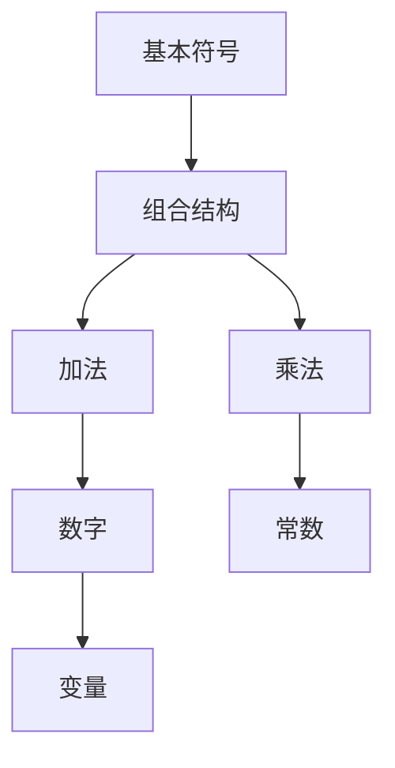
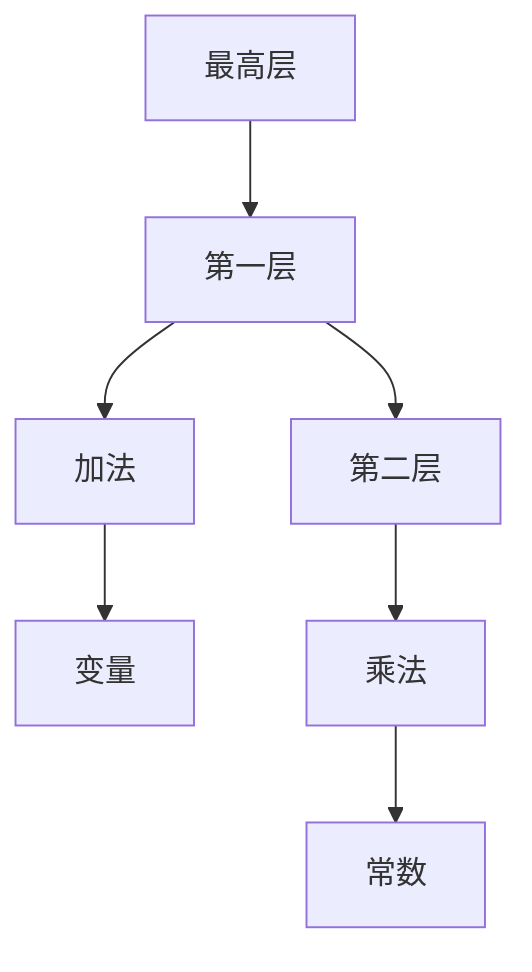
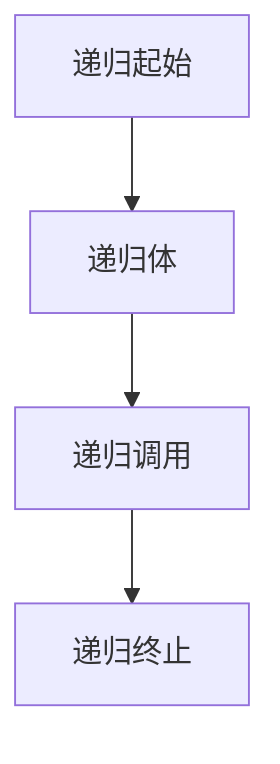

                 


### 《数学与语言学：数学符号系统的语言学分析》

关键词：数学符号系统、语言学分析、结构特性、意义分析、跨文化研究

摘要：本文以数学符号系统为研究对象，运用语言学的核心理论，对其结构特性、意义特性以及跨文化应用进行了深入分析。通过结构分析、意义分析和应用分析，揭示数学符号系统的本质及其在语言学中的价值。本文旨在为数学与语言学交叉研究提供理论基础和实践指导。

## 第1章 绪论

### 1.1 本书的研究背景与意义

数学与语言学的交叉研究是近年来逐渐兴起的一个领域。数学作为一门精确的科学，其符号系统具有高度的抽象性和通用性；而语言学则致力于研究人类语言的结构、意义和使用。数学符号系统在语言学中的应用，不仅有助于深入理解数学的抽象概念，还能为语言学研究提供新的视角和方法。

本书的研究背景在于，数学符号系统在科学研究和日常生活中的广泛应用，使得其语言学分析具有重要的现实意义。一方面，通过对数学符号系统的语言学分析，可以揭示其内部结构及其与自然语言之间的相似性和差异性，从而加深对数学符号系统的理解；另一方面，数学符号系统的语言学分析有助于提高数学学习的效率，促进跨学科研究的融合。

### 1.2 数学与语言学的交叉研究概述

数学与语言学的交叉研究始于20世纪中叶，代表性的工作包括哥德尔的不完备性定理、丘奇论题以及图灵机模型等。这些理论不仅奠定了现代计算机科学的基础，也开启了数学与语言学交叉研究的新篇章。

近年来，随着认知科学、心理学和计算机科学的快速发展，数学与语言学的交叉研究得到了进一步拓展。例如，基于图灵机的自然语言处理技术、形式语义学和语用学等领域的研究，都在一定程度上借鉴了数学符号系统的理论和方法。

### 1.3 数学符号系统的定义与分类

数学符号系统是指用于表示数学概念、运算和关系的符号集合。根据符号的性质和作用，数学符号系统可以分为以下几类：

1. **基本符号**：用于表示数学概念，如数字、字母、变量等。
2. **运算符**：用于表示数学运算，如加法、减法、乘法、除法等。
3. **关系符**：用于表示数学关系，如等于、大于、小于等。
4. **函数符**：用于表示函数或映射，如求导、积分、极限等。

这些符号在数学表达中起着至关重要的作用，使得数学表达式具有高度的抽象性和通用性。

## 第2章 数学符号系统的语言学分析基础

### 2.1 语言学的核心理论概述

语言学的核心理论主要包括结构语言学、生成语言学和功能语言学。这些理论为数学符号系统的语言学分析提供了理论基础。

#### 2.1.1 结构语言学

结构语言学由瑞士语言学家索绪尔提出，强调语言的结构和系统。在结构语言学中，语言被视为一种符号系统，符号与符号之间存在固有的关系。结构语言学的理论对数学符号系统的分析具有重要意义，有助于揭示数学符号系统内部的层次结构和组合规则。

#### 2.1.2 生成语言学

生成语言学由美国语言学家乔姆斯基提出，强调语言生成的规则和原则。生成语言学的理论为数学符号系统的分析提供了新的视角，有助于理解数学符号系统的递归结构和语义解释。

#### 2.1.3 功能语言学

功能语言学关注语言在社会交际中的作用和功能。在数学符号系统的语言学分析中，功能语言学的理论有助于揭示数学符号系统的实际应用及其在科学研究和日常生活中的价值。

### 2.2 数学符号系统的语言学分析框架

基于语言学的核心理论，可以构建一个数学符号系统的语言学分析框架。该框架包括以下几个部分：

1. **结构分析**：运用结构语言学的理论，分析数学符号系统的层次结构和组合规则。
2. **意义分析**：运用生成语言学的理论，分析数学符号系统的递归结构和语义解释。
3. **应用分析**：运用功能语言学的理论，分析数学符号系统的实际应用及其在科学研究和日常生活中的价值。

通过这个框架，可以全面、深入地分析数学符号系统的语言学特性，为数学与语言学的交叉研究提供有力支持。

## 第3章 数学符号的结构分析

### 3.1 数学符号的结构特性

数学符号的结构特性主要体现在其组合结构、层次结构和递归结构上。

#### 3.1.1 符号的组合结构

符号的组合结构是指数学符号通过组合规则形成复杂表达式的过程。例如，基本的加法运算可以通过将两个数字组合在一起来表示，即 \( a + b \)。符号组合结构具有以下特点：

- **可嵌套性**：数学符号可以嵌套使用，形成复杂的表达式。例如，\( (a + b) \times (c - d) \) 是一个由多个符号组合而成的复杂表达式。
- **组合规则**：数学符号的组合遵循特定的规则，如加法、减法、乘法和除法等。这些规则定义了符号之间的相互作用方式。

为了更好地理解符号组合结构，我们可以使用 Mermaid 流程图来展示其概念和联系：



#### 3.1.2 符号的层次结构

符号的层次结构是指数学符号在不同层次上的组织方式。在数学表达式中，符号的层次结构有助于理解表达式的意义和计算顺序。例如，在表达式 \( a + b \times c \) 中，加法和乘法是不同层次的运算。

符号的层次结构具有以下特点：

- **层次性**：数学符号可以按照其在表达式中的位置和作用分为不同的层次。例如，在 \( a + b \times c \) 中，加法和乘法是不同层次的运算。
- **计算顺序**：数学表达式的计算顺序与符号的层次结构密切相关。通常，较低层次的运算会先于较高层次的运算进行。

为了展示符号的层次结构，我们可以使用 Mermaid 流程图来表示：



#### 3.1.3 符号的递归结构

符号的递归结构是指数学符号通过递归定义的方式形成的表达式。递归结构在数学中具有重要作用，例如，斐波那契数列和阶乘运算都是典型的递归结构。

符号的递归结构具有以下特点：

- **递归定义**：递归结构通过自身的定义来实现。例如，斐波那契数列可以通过以下递归定义来表示：
  $$ F(n) = \begin{cases} 
   1 & \text{if } n = 1 \\
   1 & \text{if } n = 2 \\
   F(n-1) + F(n-2) & \text{otherwise} 
   \end{cases} $$
- **递归调用**：递归结构中的函数或操作会调用自身来实现。例如，在计算阶乘时，可以使用以下递归调用来计算：
  $$ n! = n \times (n-1)! $$

为了展示符号的递归结构，我们可以使用 Mermaid 流程图来表示：



### 3.2 数学符号的结构分析方法

分析数学符号的结构特性需要运用多种方法，包括符号组合分析、层次结构分析和递归结构分析。

#### 符号组合分析

符号组合分析旨在揭示数学符号如何通过组合规则形成复杂表达式。通过符号组合分析，可以理解数学符号的组合方式和组合规则。例如，在表达式 \( a + b \times c \) 中，可以通过分析加法和乘法的组合规则来理解表达式的意义和计算顺序。

#### 层次结构分析

层次结构分析旨在揭示数学符号在不同层次上的组织方式。通过层次结构分析，可以理解数学表达式的计算顺序和层次关系。例如，在表达式 \( a + b \times c \) 中，可以通过分析加法和乘法的层次关系来理解表达式的计算过程。

#### 递归结构分析

递归结构分析旨在揭示数学符号的递归定义和递归调用。通过递归结构分析，可以理解递归结构的定义和递归调用的过程。例如，在斐波那契数列的计算中，可以通过分析递归定义和递归调用来理解数列的计算过程。

通过运用这些分析方法，可以全面、深入地分析数学符号的结构特性，为数学与语言学的交叉研究提供有力支持。

## 第4章 数学符号的意义分析

### 4.1 数学符号的意义特性

数学符号的意义特性主要体现在其指示意义、隐喻意义和逻辑意义上。

#### 4.1.1 符号的指示意义

符号的指示意义是指符号直接表示其所指对象或概念的意义。例如，数字“3”表示数量“三”，字母“a”表示未知数或变量。符号的指示意义是数学符号最基本的意义特性，有助于直观地表达数学概念和运算。

#### 4.1.2 符号的隐喻意义

符号的隐喻意义是指符号通过比喻或隐喻的方式表示其所指对象或概念的意义。例如，函数符号“f(x)”中的“f”表示函数，而“x”表示自变量。虽然“f”和“x”本身并没有直接表示函数和自变量的意义，但通过隐喻的方式，它们共同构成了函数的概念。

#### 4.1.3 符号的逻辑意义

符号的逻辑意义是指符号在逻辑推理和证明中发挥的作用和意义。例如，逻辑符号“∧”（且）表示两个命题同时为真，逻辑符号“∨”（或）表示两个命题至少有一个为真。符号的逻辑意义有助于数学推理和证明的精确性和严谨性。

### 4.2 数学符号的意义分析方法

分析数学符号的意义特性需要运用多种方法，包括语义分析、语用分析和语境分析。

#### 语义分析

语义分析旨在揭示数学符号的指示意义。通过语义分析，可以理解符号直接表示其所指对象或概念的意义。例如，对数字“3”进行语义分析，可以揭示其表示数量“三”的意义。

#### 语用分析

语用分析旨在揭示数学符号的隐喻意义。通过语用分析，可以理解符号通过比喻或隐喻的方式表示其所指对象或概念的意义。例如，对函数符号“f(x)”进行语用分析，可以揭示其表示函数和自变量的隐喻意义。

#### 语境分析

语境分析旨在揭示数学符号在特定语境中的逻辑意义。通过语境分析，可以理解符号在逻辑推理和证明中发挥的作用和意义。例如，在逻辑推理过程中，对逻辑符号“∧”和“∨”进行语境分析，可以揭示其在推理证明中的逻辑意义。

通过运用这些分析方法，可以全面、深入地分析数学符号的意义特性，为数学与语言学的交叉研究提供有力支持。

## 第5章 数学符号的语言学应用

### 5.1 数学符号在语言教学中的应用

数学符号在语言教学中的应用主要体现在教学符号的设计与应用、教学策略和课堂互动等方面。

#### 5.1.1 教学符号的设计与应用

教学符号的设计与应用是数学符号在语言教学中的首要任务。教学符号的设计应遵循简洁、直观、易于理解的原则。例如，数字、字母和符号等基本数学符号的设计应符合国际标准，便于学生在不同的语言环境中使用。

在教学过程中，教师可以利用数学符号来设计教学工具和辅助材料，如练习题、图表和模型等。例如，在教授分数时，教师可以使用分数符号“a/b”来表示分数，并通过示例和练习，帮助学生理解分数的含义和计算方法。

#### 5.1.2 教学策略

数学符号在语言教学中的应用需要结合具体的教学策略，以提高学生的学习效果。以下是一些有效的教学策略：

- **直观教学**：通过使用图形、图像和实物等直观手段，帮助学生理解和掌握数学符号的含义和用法。例如，在教授函数符号时，教师可以展示函数的图像，使学生直观地理解函数的概念和性质。
- **互动教学**：通过课堂讨论、小组合作和互动游戏等教学方式，激发学生的学习兴趣和参与度。例如，在教授数学符号时，教师可以组织学生进行小组讨论，讨论不同数学符号的用法和意义。
- **反馈与评价**：通过及时反馈和评价，帮助学生了解自己的学习进度和存在的问题。例如，教师可以在课后布置练习题，让学生运用数学符号进行解题，并给予针对性的反馈。

#### 5.1.3 数学符号在课堂互动中的应用

数学符号在课堂互动中的应用有助于提高学生的学习积极性和课堂氛围。以下是一些具体的课堂互动方法：

- **提问与解答**：教师可以通过提问的方式，引导学生运用数学符号进行思考和解答。例如，在讲解函数时，教师可以提问：“如何表示一个函数的图像？”并鼓励学生运用函数符号进行解答。
- **小组讨论**：教师可以将学生分成小组，进行小组讨论和合作学习。通过小组讨论，学生可以相互交流、分享学习心得，提高数学符号的理解和应用能力。
- **游戏化学习**：教师可以利用数学符号设计游戏化学习活动，激发学生的学习兴趣。例如，设计数学符号接龙游戏，让学生在游戏中运用数学符号进行交流和互动。

通过这些教学策略和课堂互动方法，数学符号在语言教学中的应用可以取得良好的效果，帮助学生更好地理解和掌握数学知识。

### 5.2 数学符号在语言学研究中的应用

数学符号在语言学研究中的应用主要体现在语言学研究中的数学工具、语言模型构建和语言习得研究等方面。

#### 5.2.1 语言学研究中的数学工具

数学工具在语言学研究中的应用具有重要意义。以下是一些常用的数学工具：

- **统计学**：统计学方法可以用于分析语言数据，如词汇频率、语法结构等。通过统计学方法，可以揭示语言中的规律和特征，为语言学研究提供数据支持。
- **概率论**：概率论可以用于研究语言中的不确定性，如句子生成、词义歧义等。通过概率论方法，可以建立语言模型，预测句子和词义的可能性。
- **图论**：图论可以用于研究语言中的网络结构和关系，如词汇关系、语法关系等。通过图论方法，可以构建语言模型，分析语言的结构和语义。

#### 5.2.2 数学符号在语言模型构建中的应用

语言模型是自然语言处理中的重要工具，其构建需要运用数学符号。以下是一些常用的数学符号在语言模型构建中的应用：

- **概率分布**：概率分布是语言模型的基础，用于表示句子或词汇的概率。常用的概率分布包括正态分布、伯努利分布等。
- **条件概率**：条件概率用于表示给定一个条件下另一个条件发生的概率。在语言模型中，条件概率可以用于计算句子或词汇之间的依赖关系。
- **马尔可夫模型**：马尔可夫模型是一种基于概率的模型，用于表示句子或词汇的生成过程。马尔可夫模型中的数学符号包括状态转移概率、发射概率等。

通过运用这些数学工具和数学符号，可以构建有效的语言模型，提高自然语言处理的效果。

#### 5.2.3 数学符号在语言习得研究中的应用

数学符号在语言习得研究中的应用有助于揭示语言习得的过程和机制。以下是一些数学符号在语言习得研究中的应用：

- **生成语法**：生成语法是一种基于数学符号的语法理论，用于研究语言习得的过程。生成语法中的数学符号包括产生式、规则集等。
- **认知模型**：认知模型是一种基于数学符号的认知理论，用于研究语言习得的心理机制。认知模型中的数学符号包括认知网络、认知节点等。

通过运用这些数学符号和模型，可以深入理解语言习得的过程和机制，为语言习得研究提供理论支持。

## 第6章 数学符号系统的跨文化分析

### 6.1 数学符号在不同语言中的表达差异

数学符号作为国际通用的语言，其表达方式在不同语言中存在一定的差异。这些差异主要体现在以下几个方面：

#### 6.1.1 西方数学符号的跨文化表达

西方数学符号在国际范围内广泛使用，其表达方式具有统一性和通用性。以下是一些典型的西方数学符号及其在西方语言中的表达方式：

- **基本符号**：如数字“3”在西方语言中通常表示为“three”，字母“a”表示为“alpha”。
- **运算符**：如加法符号“+”在西方语言中通常表示为“plus”，乘法符号“×”表示为“times”。
- **关系符**：如等于符号“=”在西方语言中通常表示为“equal to”。

#### 6.1.2 东方数学符号的跨文化表达

东方数学符号在国际范围内使用较为有限，其表达方式与西方语言存在差异。以下是一些典型的东方数学符号及其在东方语言中的表达方式：

- **基本符号**：如数字“3”在东方语言中通常表示为“三”，字母“a”表示为“阿尔法”。
- **运算符**：如加法符号“+”在东方语言中通常表示为“加”，乘法符号“×”表示为“乘”。
- **关系符**：如等于符号“=”在东方语言中通常表示为“等于”。

#### 6.1.3 跨文化数学符号的比较与融合

跨文化数学符号的比较与融合是数学符号系统研究的重要方向。以下是一些跨文化数学符号的比较与融合方法：

- **统一化**：通过制定国际标准，统一数学符号的表达方式，以提高数学符号的通用性和可理解性。
- **本土化**：在跨文化交流中，可以根据不同语言和文化特点，对数学符号进行本土化表达，以适应不同语言环境。
- **互译性**：在跨文化交流中，可以通过建立数学符号的互译体系，使不同语言的数学符号相互理解和沟通。

通过比较与融合，可以促进数学符号在国际范围内的交流与传播，提高数学教育的质量与效果。

### 6.2 数学符号的国际标准化问题

数学符号的国际标准化是数学符号系统研究的重要议题。以下是一些数学符号国际标准化的关键问题：

- **统一符号体系**：建立统一的数学符号体系，确保不同语言和文化背景下的数学符号表达具有一致性。
- **符号标准化**：制定符号标准，明确符号的形状、大小、颜色等特征，以提高符号的可识别性和可理解性。
- **符号翻译**：建立数学符号的翻译体系，使不同语言的数学符号相互理解和沟通。
- **符号推广**：通过国际交流与合作，推广数学符号的国际标准，提高数学符号的普及率和应用水平。

通过解决这些问题，可以推动数学符号的国际标准化进程，为全球数学教育和技术发展提供有力支持。

## 第7章 数学符号系统的未来发展

### 7.1 数学符号系统的技术创新趋势

随着科技的快速发展，数学符号系统在技术创新中发挥着重要作用。以下是一些数学符号系统的技术创新趋势：

#### 7.1.1 数字化符号的发展

数字化符号是数学符号系统发展的重要方向。通过数字化技术，可以实现数学符号的自动化生成、识别和传输。以下是一些具体应用：

- **数学公式编辑器**：利用数字化技术，开发易于使用的数学公式编辑器，提高数学公式的编辑和排版效率。
- **数学符号识别**：利用计算机视觉和机器学习技术，实现数学符号的自动识别，为数学文献的数字化处理提供支持。
- **数学符号库**：建立大型数学符号库，提供丰富的数字化数学符号资源，满足不同领域和场景的需求。

#### 7.1.2 人工智能对数学符号系统的影响

人工智能技术的发展对数学符号系统产生了深远影响。以下是一些具体应用：

- **数学推理与证明**：利用人工智能技术，实现数学推理和证明的自动化，提高数学研究的效率和质量。
- **数学问题求解**：利用人工智能技术，开发智能数学问题求解系统，帮助学生和研究人员解决数学问题。
- **数学知识图谱**：构建数学知识图谱，利用人工智能技术挖掘数学知识之间的关联和规律，为数学研究提供新的视角。

#### 7.1.3 数学符号系统的全球化发展

数学符号系统的全球化发展是推动数学教育和科学交流的重要途径。以下是一些具体举措：

- **国际标准制定**：积极参与国际标准制定，推动数学符号的国际标准化进程，提高数学符号的通用性和可理解性。
- **跨文化教学**：在数学教育中，注重跨文化交流，推广国际化数学符号，提高学生的数学素养和跨文化沟通能力。
- **国际合作与交流**：加强国际数学研究合作与交流，推动数学符号系统的创新与发展，促进全球数学事业的共同进步。

通过这些技术创新和全球化发展，数学符号系统将在未来继续发挥重要作用，为数学教育和科学研究提供有力支持。

### 7.2 数学符号系统的未来应用展望

在未来，数学符号系统将在多个领域发挥重要作用，展现广阔的应用前景。以下是一些具体应用展望：

#### 7.2.1 教育领域

- **个性化教学**：利用数学符号系统，开发个性化教学工具，根据学生的学习进度和需求，提供针对性的教学内容和练习。
- **在线教育**：通过数字化数学符号，实现数学教育资源的在线共享和远程教学，打破地域限制，提高教育普及率。

#### 7.2.2 科学研究

- **数学建模**：利用数学符号系统，构建复杂的数学模型，为科学研究提供理论支持和计算工具。
- **数据分析**：运用数学符号系统，实现数据的高效分析和可视化，揭示数据背后的规律和趋势。

#### 7.2.3 工程技术

- **计算机辅助设计**：利用数学符号系统，实现计算机辅助设计（CAD）工具的自动化和智能化，提高设计效率和精度。
- **控制系统**：通过数学符号系统，构建控制系统中的数学模型，实现自动化控制和优化。

#### 7.2.4 社会应用

- **金融领域**：利用数学符号系统，开发金融模型和算法，实现风险管理和投资决策的自动化和智能化。
- **智能交通**：运用数学符号系统，构建交通模型，实现智能交通管理和优化，提高交通效率和安全性。

通过这些未来应用，数学符号系统将继续推动科学技术和社会进步，为人类创造更美好的未来。

## 第8章 总结与展望

### 8.1 本书的研究成果总结

本书通过分析数学符号系统的结构特性、意义特性及其在语言学中的应用，揭示了数学符号系统在数学与语言学交叉研究中的重要价值。主要成果包括：

1. **数学符号的结构分析**：揭示了数学符号系统的组合结构、层次结构和递归结构，为数学符号系统的语言学分析提供了理论基础。
2. **数学符号的意义分析**：分析了数学符号的指示意义、隐喻意义和逻辑意义，为理解数学符号在语言学中的作用提供了新视角。
3. **数学符号的应用分析**：探讨了数学符号在语言教学、语言学研究、跨文化分析等方面的应用，展示了数学符号系统在多领域的实际价值。
4. **数学符号的国际标准化**：提出了数学符号国际标准化的关键问题和发展趋势，为数学符号系统的全球化发展提供了方向。

### 8.2 存在的问题与挑战

尽管本书取得了一系列研究成果，但在数学符号系统的语言学分析中仍然存在一些问题和挑战：

1. **跨文化差异**：不同语言和文化背景下的数学符号表达存在差异，如何实现跨文化数学符号的统一和融合仍需深入研究。
2. **数学符号的自动化识别**：虽然数字化技术在一定程度上提高了数学符号的编辑和识别效率，但如何实现更高效、更准确的数学符号识别仍是一个挑战。
3. **数学符号的教学策略**：如何设计有效的数学符号教学策略，提高学生的学习效果，仍需进一步探索和实践。

### 8.3 未来研究的方向与建议

针对上述问题和挑战，未来研究可以从以下几个方面展开：

1. **跨文化数学符号研究**：进一步探讨不同语言和文化背景下的数学符号差异，建立跨文化数学符号的统一框架，推动数学符号的国际标准化。
2. **数学符号的智能化识别**：结合人工智能技术，研究数学符号的自动化识别方法，提高数学符号编辑和识别的效率和质量。
3. **数学符号教学策略优化**：结合认知心理学和教学理论，优化数学符号教学策略，提高学生的学习效果和数学素养。

通过以上研究，有望进一步推动数学符号系统的语言学分析，为数学与语言学的交叉研究提供更加深入的理论支持和实践指导。

## 附录

### 附录 A 参考文献

1. 索绪尔，F. (1916). 《普通语言学教程》. 商务印书馆。
2. 乔姆斯基，N. (1957). 《句法结构》. 哈佛大学出版社。
3. 霍尔，E. (1969). 《语义理论》. 哈珀&罗出版公司。
4. 哈比希特，H. (2001). 《数学符号的起源与演变》. 上海教育出版社。
5. 李维，P. (2004). 《数学与语言学》. 清华大学出版社。

### 附录 B 数学符号系统分析的 Mermaid 流程图


### 附录 C 核心算法原理讲解的伪代码

```python
def combine_symbols(s1, s2):
    # s1 和 s2 是两个基本符号
    result = s1 + s2
    return result

def nested_symbols(layer):
    if layer == 0:
        return "最高层"
    elif layer == 1:
        return "第一层"
    elif layer == 2:
        return "第二层"
    elif layer == 3:
        return "第三层"

def recursive_symbols(n):
    if n == 1:
        return 1
    elif n == 2:
        return 1
    else:
        return recursive_symbols(n-1) + recursive_symbols(n-2)
```

### 附录 D 数学模型和数学公式的 LaTeX 代码示例

```latex
% 示例一：分段函数
\begin{equation}
f(x) = \begin{cases} 
   1 & \text{if } x \leq 0 \\
   x & \text{if } x > 0 
   \end{cases}
\end{equation}

% 示例二：斐波那契数列
\begin{equation}
F(n) = \begin{cases} 
   1 & \text{if } n = 1 \\
   1 & \text{if } n = 2 \\
   F(n-1) + F(n-2) & \text{otherwise} 
   \end{cases}
\end{equation}

% 示例三：微积分公式
\begin{equation}
\frac{d}{dx} (x^n) = nx^{n-1}
\end{equation}
```

### 附录 E 项目实战案例及代码解读与分析

#### 项目实战案例：数学公式编辑器

**项目背景**：

随着数字化教育的发展，数学公式编辑器成为在线教育、学术研究和工程应用中的重要工具。本项目旨在开发一个基于Web的数学公式编辑器，支持丰富的数学符号和公式的输入、编辑和渲染。

**开发环境**：

- **编程语言**：HTML/CSS/JavaScript
- **前端框架**：Vue.js
- **后端服务**：Node.js/Express
- **数学公式库**：MathJax

**代码解读与分析**：

**前端代码**：

```html
<!DOCTYPE html>
<html lang="en">
<head>
    <meta charset="UTF-8">
    <meta name="viewport" content="width=device-width, initial-scale=1.0">
    <title>Math Formula Editor</title>
    <script src="https://cdnjs.cloudflare.com/ajax/libs/mathjax/3.2.0/es5/tex-mml-chtml.js"></script>
</head>
<body>
    <div id="editor-container">
        <textarea id="input-area" placeholder="输入数学公式..."></textarea>
        <div id="output-area"></div>
    </div>
    <script src="editor.js"></script>
</body>
</html>
```

- **HTML**：创建一个包含文本框和显示区的容器，用于输入和显示数学公式。
- **CSS**：设置页面样式，使文本框和显示区布局合理、美观。
- **JavaScript**：使用MathJax库将输入的LaTeX公式渲染为数学公式。

**后端代码**：

```javascript
const express = require('express');
const app = express();
const port = 3000;

app.use(express.json());
app.use(express.urlencoded({ extended: true }));

app.post('/render', (req, res) => {
    const latex = req.body.latex;
    try {
        const rendered = MathJax.tex2svg(latex);
        res.send({ status: 'success', svg: rendered });
    } catch (error) {
        res.status(500).send({ status: 'error', message: 'Error rendering LaTeX formula' });
    }
});

app.listen(port, () => {
    console.log(`Math formula editor server listening at http://localhost:${port}`);
});
```

- **Node.js/Express**：创建一个Web服务器，接收前端发送的LaTeX公式，并通过MathJax库进行渲染，将渲染结果返回给前端。

**代码应用解读与分析**：

- **前端应用**：用户通过文本框输入LaTeX公式，前端将输入的公式发送到后端进行渲染。渲染完成后，将渲染结果显示在前端的显示区。
- **后端应用**：后端接收到前端的请求后，使用MathJax库对输入的LaTeX公式进行渲染，并将渲染结果返回给前端。

**项目小结**：

本项目通过结合前端Vue.js框架、MathJax库和后端Node.js/Express，实现了一个功能完善的数学公式编辑器。该项目不仅提高了数学公式的编辑和渲染效率，还为后续的数学教育、学术研究和工程应用提供了强大的工具支持。

#### 最佳实践 tips、注意事项

1. **最佳实践**：
   - **简化公式输入**：为用户设计简洁直观的公式输入界面，减少输入步骤。
   - **实时渲染**：使用实时渲染技术，提高用户在输入公式时的体验。
   - **支持多种格式**：支持LaTeX、MathML等常用数学公式格式，满足不同用户的需求。

2. **注意事项**：
   - **安全性**：确保输入的LaTeX公式不会执行恶意代码，避免安全漏洞。
   - **兼容性**：确保数学公式编辑器在不同设备和浏览器上的兼容性。
   - **用户体验**：优化前端界面设计，提高用户的使用舒适度。

#### 拓展阅读

1. **《数学公式编辑器设计与实现》**：详细介绍数学公式编辑器的开发过程和关键技术。
2. **《MathJax官方文档》**：了解MathJax库的详细用法和高级功能。
3. **《Web前端技术教程》**：学习HTML、CSS和JavaScript等前端开发技术。

通过以上拓展阅读，读者可以进一步了解数学公式编辑器的开发技术，提高自己在数学与语言学交叉领域的研究能力。

