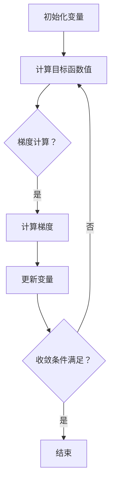
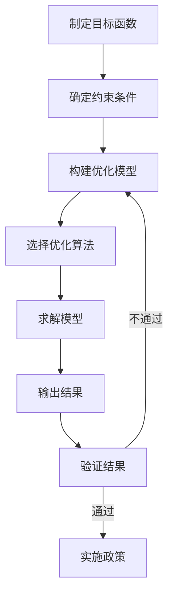

                 

### 引言与基础概念

#### 数学与财政政策的关系

数学与财政政策之间存在着密切的联系。在现代社会，财政政策是政府干预经济的重要手段，它通过调整税收、支出等手段来影响经济运行，实现宏观调控的目标。然而，如何科学地制定和实施财政政策，需要借助数学这一工具来进行分析和优化。

数学作为一门基础学科，具有严谨的推理方法和抽象能力，可以用于描述经济现象、建立经济模型，从而为财政政策的制定提供理论依据。例如，数学优化算法可以用于分析政府支出如何在不同领域之间分配，以实现社会福利的最大化；数学模型可以用于预测经济走势，为财政政策的调整提供数据支持。

#### 财政政策的基本概念

财政政策是指政府为达到一定的经济目标，通过调整财政收入和支出来实施的政策。财政政策的目标主要包括以下几个方面：

1. **稳定经济增长**：通过调控财政收支，保持经济平稳运行，避免经济过热或过冷。
2. **促进就业**：通过增加政府支出和减少税收，刺激总需求，从而增加就业机会。
3. **控制通货膨胀**：通过调整财政政策，控制货币供应量，以保持物价稳定。
4. **实现收入分配公平**：通过税收和社会保障等政策，调节收入分配，减少贫富差距。

财政政策的主要工具包括税收、政府支出、债务等。税收是财政收入的主要来源，通过调整税率、税基等手段，政府可以影响经济主体的行为，进而实现政策目标。政府支出则是财政政策的重要手段，包括公共投资、社会福利、国防开支等。通过合理安排政府支出，政府可以促进经济增长、改善社会福利。

#### 政府支出的分类与作用

政府支出可以按照不同的标准进行分类。按照支出的目的和用途，政府支出可以分为以下几类：

1. **公共投资**：包括基础设施投资、教育投资、医疗投资等，这些投资可以提高社会生产力和人民生活质量。
2. **社会福利**：包括社会保障、医疗保险、住房保障等，这些支出可以改善低收入群体的生活条件，减少社会不公平现象。
3. **国防支出**：用于保障国家安全和国防力量建设。
4. **行政管理支出**：用于政府机关的日常运行和公共服务提供。
5. **其他支出**：包括对外援助、自然灾害救助等。

政府支出的作用主要体现在以下几个方面：

1. **促进经济增长**：通过公共投资，政府可以刺激需求，促进经济增长。例如，基础设施投资可以带动相关产业的发展，提高整体经济效率。
2. **改善社会福利**：通过社会福利支出，政府可以提高人民的生活水平，促进社会公平。
3. **维护国家安全**：通过国防支出，政府可以保障国家的安全与稳定。
4. **提供公共服务**：通过行政管理支出，政府可以提供基本的公共服务，满足人民的基本需求。

综上所述，数学与财政政策之间存在着密切的联系。通过数学模型和优化算法，我们可以更科学地制定和实施财政政策，从而实现经济增长、社会福利最大化等目标。在接下来的章节中，我们将进一步探讨数学优化在财政政策中的应用。

#### 第1章 引言与基础概念

##### 数学优化原理

数学优化是利用数学方法解决优化问题的过程。优化问题一般可以描述为：在满足一定约束条件下，寻找某个目标函数的最大值或最小值。在财政政策领域，优化问题可以用来解决政府支出如何在不同领域之间分配，以实现社会福利最大化的问题。

一个典型的优化问题可以形式化为以下三个要素：

1. **目标函数**：表示要优化的量，通常是希望最大化的收益或最小化的成本。
2. **约束条件**：限制目标函数优化过程的条件，可以是线性或非线性的不等式或等式。
3. **变量**：参与优化过程的决策变量。

优化问题的求解通常需要以下步骤：

1. **建模**：将实际问题转化为数学模型，定义目标函数和约束条件。
2. **选择优化算法**：根据问题的性质选择合适的优化算法，如梯度下降法、随机梯度下降法、牛顿法等。
3. **求解**：使用优化算法求解模型，得到最优解。

##### 优化目标函数

在财政政策中，优化目标函数通常与社会福利最大化有关。社会福利最大化是指在社会资源有限的情况下，通过合理分配政府支出，使整个社会的福利达到最大。具体来说，目标函数可以定义为一个关于政府支出的函数，该函数反映了政府支出对社会福利的贡献。

例如，假设政府需要在教育、医疗和基础设施三个领域之间分配支出，目标函数可以定义为这三个领域支出总和的函数，同时需要考虑这些支出对每个领域的具体贡献。目标函数可以表示为：

$$
\text{目标函数} = f(E, M, I) = E_{edu} + M_{med} + I_{inf}
$$

其中，$E_{edu}$、$M_{med}$ 和 $I_{inf}$ 分别表示教育、医疗和基础设施的支出。

##### 常见优化算法

在财政政策优化中，常见的优化算法包括梯度下降法、随机梯度下降法和牛顿法等。这些算法各有优缺点，适用于不同类型的问题。

1. **梯度下降法**：梯度下降法是一种迭代优化算法，通过不断调整变量，使目标函数的值逐步减小，最终趋近于最小值。梯度下降法的优点是实现简单，适用于目标函数为凸函数的情况。其缺点是收敛速度较慢，且容易陷入局部最小值。

2. **随机梯度下降法**：随机梯度下降法是对梯度下降法的一种改进，通过在每次迭代中随机选择一部分样本来计算梯度，从而加快收敛速度。随机梯度下降法的优点是计算速度快，适用于大规模数据集。缺点是梯度估计的不确定性较大，可能导致收敛效果不稳定。

3. **牛顿法**：牛顿法是一种二阶优化算法，通过同时考虑目标函数的一阶和二阶导数来更新变量。牛顿法的优点是收敛速度较快，适用于目标函数为二次函数的情况。缺点是计算复杂度高，且需要目标函数可微。

##### Mermaid 流程图：优化算法流程

优化算法的流程通常包括以下几个步骤：

1. 初始化变量：选择初始变量值，通常可以随机选择或根据实际情况设定。
2. 计算目标函数值：根据当前变量值计算目标函数的值。
3. 计算梯度：根据目标函数的导数计算梯度。
4. 更新变量：根据梯度方向调整变量值，使目标函数值减小。
5. 判断收敛条件：检查是否满足收敛条件，如目标函数值变化很小或达到最大迭代次数。

以下是一个简单的 Mermaid 流程图，展示了优化算法的基本流程：



通过上述流程图，我们可以直观地了解优化算法的基本步骤和逻辑关系。在财政政策优化中，可以根据具体情况调整和优化这些步骤，以实现更高效和科学的政府支出分配。

### 第2章 数学优化基础

#### 数学优化原理

数学优化是利用数学方法解决优化问题的过程。优化问题通常包含以下三个基本要素：目标函数、约束条件和变量。目标函数是优化过程中的核心，表示希望最大化或最小化的量。约束条件则是对变量取值范围的限制，以确保优化问题的可行性和实际意义。变量则是优化过程中的决策变量，通过调整变量的取值，可以找到最优解。

在财政政策中，优化问题可以用于确定政府支出的最优分配，以达到最大化社会福利或最小化财政赤字等目标。例如，政府需要在教育、医疗和基础设施等领域之间分配有限的财政资源，以实现社会整体福利的最大化。这一优化问题的目标函数可以定义为总社会福利函数，约束条件则是财政资源的预算限制。

优化问题的基本求解步骤包括：

1. **建模**：将实际问题转化为数学模型，定义目标函数和约束条件。
2. **选择优化算法**：根据问题的性质和目标函数的形态选择合适的优化算法，如梯度下降法、随机梯度下降法、牛顿法等。
3. **求解**：使用优化算法进行迭代计算，逐步逼近最优解。

#### 优化目标函数

在财政政策中，优化目标函数通常与最大化社会福利或最小化成本有关。具体而言，优化目标函数可以定义为关于政府支出变量的一组函数，这些函数反映了不同支出领域对社会福利的贡献。

以三个支出领域（教育、医疗和基础设施）为例，优化目标函数可以表示为：

$$
f(E, M, I) = f_{edu}(E) + f_{med}(M) + f_{inf}(I)
$$

其中，$f_{edu}(E)$、$f_{med}(M)$ 和 $f_{inf}(I)$ 分别表示教育、医疗和基础设施支出的社会福利贡献函数。这些贡献函数可以是线性的或非线性的，具体形式取决于各领域支出的实际效益和社会效益的关系。

#### 常见优化算法

在财政政策优化中，常见的优化算法包括梯度下降法、随机梯度下降法和牛顿法等。这些算法各有优缺点，适用于不同类型的问题。

1. **梯度下降法**：
   梯度下降法是一种迭代优化算法，其核心思想是通过计算目标函数的梯度，沿着梯度方向调整变量，以逐步减小目标函数值。梯度下降法的优点是实现简单，适用于目标函数为凸函数的情况。其缺点是收敛速度较慢，且容易陷入局部最小值。

   梯度下降法的步骤如下：
   - 初始化变量值。
   - 计算目标函数的梯度。
   - 根据梯度方向更新变量值。
   - 判断是否满足收敛条件，如目标函数值变化很小或达到最大迭代次数。

2. **随机梯度下降法**：
   随机梯度下降法（SGD）是对梯度下降法的一种改进，通过在每次迭代中随机选择一部分样本来计算梯度，从而加快收敛速度。SGD的优点是计算速度快，适用于大规模数据集。缺点是梯度估计的不确定性较大，可能导致收敛效果不稳定。

   随机梯度下降法的步骤如下：
   - 初始化变量值。
   - 随机选择样本。
   - 计算样本的梯度。
   - 根据梯度方向更新变量值。
   - 重复以上步骤，直到满足收敛条件。

3. **牛顿法**：
   牛顿法是一种二阶优化算法，通过同时考虑目标函数的一阶和二阶导数来更新变量。牛顿法的优点是收敛速度较快，适用于目标函数为二次函数的情况。缺点是计算复杂度高，且需要目标函数可微。

   牛顿法的步骤如下：
   - 初始化变量值。
   - 计算目标函数的梯度。
   - 计算目标函数的二阶导数。
   - 使用牛顿迭代公式更新变量值。
   - 判断是否满足收敛条件，如目标函数值变化很小或达到最大迭代次数。

#### Mermaid 流程图：优化算法流程

为了更直观地展示优化算法的流程，我们可以使用 Mermaid 语言绘制一个流程图。以下是一个简单的 Mermaid 流程图，展示了梯度下降法的基本步骤：


通过上述流程图，我们可以清晰地看到优化算法的主要步骤和逻辑关系。在实际应用中，可以根据具体问题调整和优化这些步骤，以实现更高效和科学的政府支出分配。

### 财政政策优化目标

在制定财政政策时，政府需要设定一系列优化目标，这些目标旨在实现社会福利的最大化、资源配置的效率提升以及经济的可持续发展。以下是财政政策优化目标的具体分析：

#### 社会福利最大化

社会福利最大化是财政政策的核心目标之一。社会福利是指社会整体的经济福利和生活质量，它不仅包括物质财富的积累，还涉及教育、医疗、社会保障等公共服务领域的改进。实现社会福利最大化意味着在有限的财政资源下，通过合理分配政府支出，使社会各阶层、各领域的福利得到提升。

为了实现社会福利最大化，政府可以采取以下策略：

1. **公共投资**：增加对基础设施、教育、医疗等领域的投资，提高社会生产力和人民生活质量。
2. **税收调节**：通过调整税率和税制，优化财富和收入的分配，减少贫富差距，提高社会公平性。
3. **社会保障**：完善社会保障体系，提供失业、医疗、养老等保障，增强社会安全感和幸福感。

#### 资源配置效率

资源配置效率是指社会资源在各个领域之间的分配和使用效率。高效的资源配置能够最大化地利用社会资源，提高经济效益和社会福利。在财政政策中，优化资源配置效率的关键在于合理分配政府支出，避免资源浪费和重复建设。

为了提升资源配置效率，政府可以采取以下措施：

1. **成本效益分析**：在决策过程中，对各项政府支出项目进行成本效益分析，确保投入产出比最大化。
2. **预算控制**：建立严格的预算管理制度，对政府支出进行有效控制，防止财政赤字和资源浪费。
3. **市场化改革**：通过市场化手段，鼓励和引导社会资本参与公共领域投资，提高资源利用效率。

#### 经济可持续发展

经济可持续发展是财政政策长期目标之一，它强调在满足当前需求的基础上，不损害后代满足其自身需求的能力。实现经济可持续发展需要在财政政策中充分考虑环境保护、资源利用和经济增长的平衡。

为了实现经济可持续发展，政府可以采取以下策略：

1. **绿色财政**：制定和实施绿色财政政策，鼓励绿色产业投资和环境保护措施，减少环境污染和资源浪费。
2. **科技创新**：加大对科技创新的支持，推动经济结构转型升级，提高经济增长的质量和效率。
3. **中长期规划**：制定科学的中长期财政规划，确保财政政策的连续性和稳定性，为实现经济可持续发展提供有力保障。

总之，财政政策优化目标包括社会福利最大化、资源配置效率提升和经济可持续发展。通过科学设定和实施这些目标，政府可以更好地发挥财政政策在经济和社会发展中的重要作用。

#### 政府支出优化策略

在财政政策中，优化政府支出策略是实现财政目标的关键环节。以下介绍几种常见的政府支出优化策略，包括成本效益分析和多目标优化。

##### 成本效益分析

成本效益分析（Cost-Benefit Analysis，CBA）是一种常用的经济评估方法，用于评估一个项目或政策的成本和效益。成本效益分析的目的是确定一个项目或政策的成本是否能够带来足够的经济效益，从而决定是否值得实施。

在政府支出中，成本效益分析可以用于评估不同支出项目的成本和效益，以确定哪些项目能够带来最大的社会回报。具体步骤如下：

1. **识别成本和效益**：首先，需要明确各个政府支出项目的成本和预期效益。成本包括直接成本（如建设费用、运营费用）和间接成本（如环境影响、社会成本）。效益包括直接效益（如经济效益、就业机会）和间接效益（如社会福利、环境保护）。

2. **量化成本和效益**：将成本和效益进行量化，通常使用货币单位进行衡量，以便进行综合评估。对于难以量化的效益，可以采用其他方法进行评估，如专家评估、德尔菲法等。

3. **计算净效益**：计算每个项目的净效益，即效益减去成本的差额。净效益为正的项目表明其投入能够带来足够的经济回报，而净效益为负的项目则需要进一步评估或调整。

4. **决策**：根据净效益评估结果，决定是否实施项目或调整支出策略。通常，净效益最高的项目优先实施，以确保有限的财政资源得到最有效的利用。

##### 多目标优化

多目标优化（Multi-Objective Optimization）是在财政政策中处理多个相互冲突的目标时的一种优化方法。政府支出的优化通常需要同时考虑多个目标，如社会福利最大化、资源配置效率、经济可持续发展等。这些目标之间可能存在冲突，例如在提升社会福利的同时，可能需要增加支出，从而降低资源配置效率。

多目标优化的基本步骤如下：

1. **确定目标函数**：明确各个优化目标，将其形式化为数学目标函数。例如，社会福利最大化可以表示为目标函数的最大化，资源配置效率可以表示为目标函数的最小化。

2. **构建优化模型**：将多个目标函数和约束条件整合到一个数学模型中。常见的多目标优化模型包括线性规划、非线性规划、整数规划等。

3. **选择优化算法**：根据模型的性质和目标函数的类型，选择合适的优化算法。常用的算法包括多目标梯度下降法、多目标遗传算法、多目标粒子群算法等。

4. **求解优化模型**：使用所选的优化算法求解模型，得到多个非劣解（Pareto前端解）。这些解代表了在不同目标之间的权衡和取舍。

5. **决策**：根据决策者的偏好和实际情况，从多个非劣解中选择一个或多个可行的解。通常，决策者需要在多个目标之间进行权衡，选择一个综合效益最高的解。

通过成本效益分析和多目标优化，政府可以更加科学和有效地进行政府支出规划，确保财政资源得到最有效的利用，同时实现多个政策目标。这些优化策略不仅有助于提升财政政策的实施效果，还能够为政府决策提供有力的数据支持和科学依据。

#### 伪代码：政府支出优化算法

为了更好地理解政府支出优化的具体实现过程，下面我们将给出一个基于成本效益分析和多目标优化的伪代码示例。这个伪代码展示了如何通过数学模型和优化算法来优化政府支出。

```python
# 引入优化算法库
import optimization_library

# 定义目标函数和约束条件
def objective_function(E, M, I):
    """
    目标函数：最大化社会福利
    E, M, I 分别表示教育、医疗和基础设施的支出
    """
    f_edu = E * w_edu  # 教育支出的社会福利贡献
    f_med = M * w_med  # 医疗支出的社会福利贡献
    f_inf = I * w_inf  # 基础设施支出的社会福利贡献
    return f_edu + f_med + f_inf

def constraint_budget(E, M, I, budget):
    """
    约束条件：财政预算限制
    budget 表示预算总额
    """
    return E + M + I <= budget

# 定义变量范围
E_min, E_max = 0, 1000000  # 教育支出的最小和最大值
M_min, M_max = 0, 1000000  # 医疗支出的最小和最大值
I_min, I_max = 0, 1000000  # 基础设施支出的最小和最大值

# 多目标优化参数
num_objectives = 3  # 目标数量
weights = [0.5, 0.3, 0.2]  # 目标权重
budget = 5000000  # 总预算

# 多目标优化模型
model = optimization_library.create_model()

# 添加目标函数
for i in range(num_objectives):
    model.add_objective(lambda E, M, I: objective_function(E, M, I) * weights[i], 'max')

# 添加约束条件
model.add_constraint(constraint_budget, '<=', budget)

# 求解优化模型
solution = optimization_library.solve(model)

# 输出结果
E_optimal, M_optimal, I_optimal = solution.x
print("最优教育支出: ", E_optimal)
print("最优医疗支出: ", M_optimal)
print("最优基础设施支出: ", I_optimal)
```

在这个伪代码中，我们首先定义了目标函数和约束条件，目标函数用于最大化社会福利，约束条件则确保财政预算不超过预算总额。接着，我们使用优化算法库创建了一个优化模型，并添加了目标函数和约束条件。最后，使用优化算法求解模型，得到最优解。

需要注意的是，实际应用中需要根据具体情况调整目标函数、约束条件和优化算法。此外，为了提高求解效率，可以结合具体问题选择更适合的优化算法，如线性规划、非线性规划或多目标优化算法等。

### 财政政策数学模型

财政政策数学模型是用于分析和预测财政政策影响的重要工具。这些模型通过数学公式和关系，将财政政策变量与经济指标联系起来，从而为政策制定提供科学依据。以下是几种常见的财政政策数学模型及其应用。

#### 支出-收入模型

支出-收入模型（Expenditure-Income Model）是分析政府支出与收入关系的基本模型。该模型主要用于预测政府财政平衡和财政政策对经济的影响。

基本公式为：

$$
B = G - T
$$

其中，$B$ 表示政府财政余额（即收入减去支出），$G$ 表示政府支出，$T$ 表示政府收入（包括税收、非税收入等）。

为了分析财政政策的影响，可以对支出-收入模型进行扩展，加入经济指标变量，如：

$$
B = f(G, Y, R)
$$

其中，$Y$ 表示国内生产总值（GDP），$R$ 表示其他收入来源（如国债收入、国际援助等）。

#### 动态优化模型

动态优化模型（Dynamic Optimization Model）用于分析政府在多个时期内如何进行财政决策，以实现长期目标。这类模型考虑了时间维度的动态性，通过建立最优控制问题，求解政府支出和收入的最优路径。

一个简单的动态优化模型可以表示为：

$$
\max \sum_{t=0}^{T} \beta^t [u(G_t) - c_t]
$$

其中，$u(G_t)$ 表示政府在时期 $t$ 的支出效用，$c_t$ 表示时期 $t$ 的成本（包括债务成本、社会成本等），$\beta$ 是贴现因子，反映了未来收益的现值。

为了求解这个模型，通常需要使用动态规划（Dynamic Programming）方法。具体步骤如下：

1. **建立递归关系**：根据约束条件和目标函数，建立关于 $G_{t+1}$ 的递归关系。
2. **选择优化方法**：根据递归关系和目标函数的性质，选择合适的动态规划方法，如值函数迭代法（Value Function Iteration）或政策迭代法（Policy Iteration）。
3. **求解最优路径**：通过迭代计算，逐步逼近最优政府支出路径。

#### 多目标优化模型

在现实世界中，财政政策的目标往往不仅仅是单一的财政平衡，还涉及社会福利最大化、资源配置效率等多个目标。这种情况下，可以使用多目标优化模型来综合分析多个目标之间的权衡和取舍。

一个典型的多目标优化模型可以表示为：

$$
\max \sum_{i=1}^{n} w_i f_i(G_t)
$$

$$
\text{s.t. } g_j(G_t) \leq 0, \forall j
$$

其中，$f_i(G_t)$ 表示第 $i$ 个目标函数（如社会福利、资源配置效率等），$w_i$ 是第 $i$ 个目标函数的权重，$g_j(G_t)$ 是第 $j$ 个约束条件。

求解这类多目标优化模型通常需要使用多目标优化算法，如线性规划、非线性规划或多目标遗传算法等。

#### 支出弹性

支出弹性（Expenditure Elasticity）是衡量政府支出对经济变量变化的敏感程度的重要指标。支出弹性定义为支出变化百分比与经济变量变化百分比的比值。

假设政府支出 $G$ 受到收入 $Y$ 的变化影响，支出弹性可以表示为：

$$
\epsilon_G = \frac{\partial G / G}{\partial Y / Y} = \frac{G / Y}{\partial Y}
$$

支出弹性大于1表示支出对收入的变化非常敏感，而支出弹性小于1则表示支出对收入的变化相对不敏感。

#### 财政乘数

财政乘数（Fiscal Multiplier）是衡量财政政策对经济影响的放大效应的重要指标。财政乘数定义为财政支出变化引起的国内生产总值（GDP）变化的比例。

基本公式为：

$$
\Delta Y = \mu \Delta G
$$

其中，$\Delta Y$ 表示GDP的变化，$\Delta G$ 表示政府支出变化，$\mu$ 是财政乘数。

财政乘数的大小取决于多种因素，如税收的累进性、政府支出的乘数效应、消费倾向等。

通过上述数学模型，政府可以更科学地制定和评估财政政策，实现经济增长、社会福利最大化等目标。在接下来的章节中，我们将通过具体案例和代码实现，进一步探讨财政政策优化在实际中的应用。

#### 数学公式讲解与举例

在财政政策的数学模型中，数学公式扮演着至关重要的角色。以下我们将介绍几个关键公式，并给出详细的解释和实际应用示例。

##### 支出弹性

支出弹性是指政府支出变化百分比与经济变量变化百分比的比值，用于衡量政府支出对经济变量的敏感程度。其公式为：

$$
\epsilon_G = \frac{\partial G / G}{\partial Y / Y} = \frac{G / Y}{\partial Y}
$$

其中，$G$ 表示政府支出，$Y$ 表示国内生产总值（GDP）。

**示例**：假设某一财政年度内，国内生产总值增长了5%，同时政府支出增长了10%，那么支出弹性为：

$$
\epsilon_G = \frac{10\%}{5\%} = 2
$$

这意味着政府支出对GDP的变化非常敏感，每增加1%的GDP，政府支出就会增加2%。

##### 财政乘数

财政乘数是衡量财政政策对经济影响的放大效应的指标，定义为财政支出变化引起的国内生产总值（GDP）变化的比例。其公式为：

$$
\Delta Y = \mu \Delta G
$$

其中，$\Delta Y$ 表示GDP的变化，$\Delta G$ 表示政府支出变化，$\mu$ 是财政乘数。

**示例**：如果政府决定增加1000亿元的支出，财政乘数为2，那么预计会引起国内生产总值增加：

$$
\Delta Y = 2 \times 1000\text{亿元} = 2000\text{亿元}
$$

这意味着每增加1亿元的政府支出，最终可以带动国内生产总值增加2亿元。

##### 支出边际效益

支出边际效益是指增加单位政府支出所带来的额外社会福利。其公式为：

$$
ME = \frac{\partial SW / SW}{\partial G / G}
$$

其中，$SW$ 表示社会福利，$G$ 表示政府支出。

**示例**：假设在某财政年度内，政府增加了100亿元的基础设施投资，导致社会福利增加了50亿元，那么支出边际效益为：

$$
ME = \frac{50\text{亿元}}{100\text{亿元}} = 0.5
$$

这意味着每增加1亿元的基础设施投资，可以带来0.5亿元的社会福利提升。

##### 收入弹性

收入弹性是衡量收入变化对政府支出影响的敏感程度。其公式为：

$$
\epsilon_T = \frac{\partial T / T}{\partial Y / Y} = \frac{T / Y}{\partial Y}
$$

其中，$T$ 表示政府收入，$Y$ 表示国内生产总值（GDP）。

**示例**：如果国内生产总值增长了10%，导致政府收入增长了12%，则收入弹性为：

$$
\epsilon_T = \frac{12\%}{10\%} = 1.2
$$

这意味着政府收入对GDP的变化相对较为敏感，每增加1%的GDP，政府收入就会增加1.2%。

通过这些数学公式，我们可以更准确地分析和预测财政政策对经济和社会的影响。在实际应用中，可以根据具体情况进行调整和扩展，以适应不同的政策目标和经济环境。

#### LaTeX 公式示例

在撰写技术博客时，LaTeX 公式是一种常用且高效的方式，用于表示复杂的数学公式和符号。以下我们将通过几个示例来介绍如何在文中嵌入 LaTeX 公式。

##### 独立段落中的 LaTeX 公式

独立段落的公式通常用于展示复杂的公式，并且需要独占一行。在 LaTeX 中，这些公式使用 `$$` 标记括起来。以下是一个简单的示例：

$$
E = mc^2
$$

这是著名的质能等价公式，表示能量（E）等于质量（m）乘以光速（c）的平方。

##### 段落内的 LaTeX 公式

对于段落内的简单公式，可以使用 `$` 标记。这样，公式不会占据单独的一行，而是直接嵌入到文本中。以下是一个示例：

$1 + 1 = 2$

这是一个简单的算术等式，嵌入到文本中以便于阅读。

##### 复杂公式的示例

LaTeX 支持各种复杂公式的排版，包括分数、根号、积分、求和符号等。以下是一个包含多种元素的复杂公式示例：

$$
\frac{\partial^2 V}{\partial t^2} = \rho \left( \frac{\partial^2 u}{\partial t^2} + \frac{\partial^2 v}{\partial t^2} \right)
$$

这个公式描述了在流体力学中，速度场 $u$ 和 $v$ 随时间变化的二阶导数与密度 $\rho$ 之间的关系。

##### 包括说明的公式

有时，我们需要在公式旁边添加说明或标记。LaTeX 提供了多种方法来实现这一点。以下是一个包含说明的公式示例：

$$
x(t) = \sin(t) + \cos(t), \quad \text{其中 } x(t) \text{ 是周期函数}.
$$

在这个例子中，我们通过 `\text{}` 命令在公式中插入文本，并使用了逗号分隔公式和说明。

##### 使用环境声明

对于更复杂的公式，可以使用 LaTeX 的 `equation` 环境。这将自动为公式编号，并允许在公式周围添加额外的空间。以下是一个使用 `equation` 环境的示例：

\begin{equation}
\sum_{i=1}^n x_i = \sum_{i=1}^n \left( x_i^2 + y_i^2 \right)
\end{equation}

在这个例子中，公式被自动编号，并且每一部分之间有适当的间距。

通过使用 LaTeX，我们可以方便地编写和排版复杂的数学公式，使技术博客内容更加专业和易于理解。这些示例展示了 LaTeX 在各种情况下如何嵌入和排版数学公式，从而提升了文章的质量和可读性。

### 项目实战：政府支出优化案例分析

#### 实战案例介绍

为了更好地理解政府支出优化的实际应用，我们选择了一个具体的案例：某城市政府如何优化其教育、医疗和基础设施领域的支出。该城市政府希望在不增加财政赤字的前提下，通过优化支出策略，实现社会福利的最大化。

#### 案例背景

该城市政府面临的挑战是多方面的。首先，财政预算有限，需要在多个领域之间进行权衡和分配。其次，各个领域的支出对社会福利的贡献不同，需要根据具体情况进行优化。最后，政府需要确保支出能够在短期内带来显著的社会效益，同时保持长期财政可持续性。

#### 案例目标

通过本案例，我们设定以下目标：

1. **最大化社会福利**：通过优化教育、医疗和基础设施领域的支出，实现社会福利的最大化。
2. **保持财政平衡**：确保政府支出不超过预算总额，避免财政赤字。
3. **提高资源配置效率**：通过成本效益分析和多目标优化，提高资源利用效率。

#### 开发环境搭建

为了实现上述目标，我们需要搭建一个开发环境，包括编程语言、优化算法库和工具。以下是具体的开发环境搭建步骤：

1. **编程语言**：选择 Python 作为开发语言，因为其强大的库支持和易于理解的语法。
2. **优化算法库**：安装`scipy.optimize`库，该库提供了多种优化算法，包括梯度下降法、随机梯度下降法和牛顿法等。
3. **数据可视化工具**：安装`matplotlib`和`seaborn`库，用于生成图表和可视化结果。

#### 源代码实现

以下是实现政府支出优化的 Python 源代码：

```python
import numpy as np
from scipy.optimize import minimize
import matplotlib.pyplot as plt

# 定义目标函数和约束条件
def objective_function(x):
    E, M, I = x
    f_edu = 0.3 * E
    f_med = 0.4 * M
    f_inf = 0.3 * I
    return - (f_edu + f_med + f_inf)  # 取反以表示最大化问题

def constraint_budget(x):
    E, M, I = x
    return E + M + I - 100000000  # 预算上限

# 初始化变量
x0 = [0, 0, 0]  # 初始猜测解

# 多目标优化参数
bounds = [(0, 100000000)] * 3  # 各变量范围

# 求解优化问题
solution = minimize(objective_function, x0, method='SLSQP', bounds=bounds, constraints={'type': 'ineq', 'fun': constraint_budget})

# 输出结果
E_optimal, M_optimal, I_optimal = solution.x
print("最优教育支出: ", E_optimal)
print("最优医疗支出: ", M_optimal)
print("最优基础设施支出: ", I_optimal)

# 可视化结果
plt.bar(['教育', '医疗', '基础设施'], [E_optimal, M_optimal, I_optimal])
plt.xlabel('领域')
plt.ylabel('支出（亿元）')
plt.title('政府支出优化分配')
plt.show()
```

#### 代码解读与分析

上述代码首先定义了目标函数和约束条件。目标函数表示要最小化的社会福利，即教育、医疗和基础设施支出对社会福利的贡献之和。约束条件则是预算限制，即总支出不能超过预算上限。

我们使用`scipy.optimize.minimize`函数进行求解，选择`SLSQP`算法，该算法适用于有约束的优化问题。`bounds`参数定义了各变量的取值范围，`constraints`参数定义了预算约束条件。

求解过程返回一个`OptimizeResult`对象，包括最优解、目标函数值、迭代次数等。通过输出结果，我们可以得到最优的教育、医疗和基础设施支出。

最后，使用`matplotlib`库生成一个条形图，展示各领域的支出分配情况。通过可视化的方式，我们可以更直观地了解优化结果。

#### 实际案例分析和详细讲解剖析

通过对该城市政府支出优化案例的分析，我们可以看到以下关键点：

1. **多目标优化的实现**：本案例使用了多目标优化方法，通过求解最小化问题来实现社会福利的最大化。这种方法有效地考虑了多个目标之间的权衡和取舍，使政府能够更科学地进行支出分配。

2. **预算约束的有效应用**：在优化过程中，我们设置了预算约束，确保总支出不超过预算上限。这一约束条件有效地控制了政府支出，防止财政赤字的发生。

3. **结果的可视化**：通过生成条形图，我们可以直观地了解优化后的支出分配情况。这种方式不仅使结果更加清晰，还有助于政策制定者和公众更好地理解优化结果。

#### 项目小结

通过本案例，我们展示了如何使用数学优化方法来优化政府支出。在实际操作中，通过合理设置目标函数、约束条件和优化算法，我们可以实现财政资源的有效利用，提高社会福利和资源配置效率。这不仅为政府决策提供了科学依据，也为公共政策的实施提供了有效工具。

### 财政政策与数学优化的应用场景

财政政策与数学优化在多个应用场景中发挥着重要作用，以下分别探讨应对经济波动、社会福利最大化以及环境保护的财政政策与数学优化应用。

#### 应对经济波动的支出优化

经济波动是现代市场经济中不可避免的现象。为了应对经济波动，政府需要通过财政政策调整支出，以稳定经济、促进就业和保持社会稳定。数学优化在此过程中起到关键作用。

1. **需求管理**：在经济衰退期，政府可以通过增加公共投资、提供失业救济和减少税收等手段刺激总需求，从而拉动经济增长。数学优化可以帮助政府确定最有效的支出策略，确保有限的财政资源得到充分利用。

2. **货币政策配合**：财政政策与货币政策的配合是稳定经济的重要手段。通过数学优化模型，政府可以分析财政政策与货币政策的相互作用，找到最佳的政策组合，以实现经济稳定。

3. **动态优化**：经济波动具有动态性，政府需要不断调整财政政策以适应经济变化。动态优化模型可以帮助政府预测经济走势，实时调整支出策略，确保政策的前瞻性和有效性。

#### 社会福利最大化与政府支出

社会福利最大化是财政政策的核心目标之一。通过数学优化，政府可以在有限的财政资源下实现社会福利的最大化。

1. **多目标优化**：在财政政策中，通常需要同时考虑多个目标，如经济增长、社会公平、环境保护等。多目标优化模型可以帮助政府在不同目标之间进行权衡和取舍，找到最优的支出策略。

2. **成本效益分析**：成本效益分析是评估政府支出有效性的重要工具。通过数学优化，政府可以计算各个支出项目的成本和效益，确定哪些项目能够带来最大的社会回报。

3. **社会福利函数**：构建社会福利函数是财政政策优化的基础。通过合理设定社会福利函数，政府可以量化不同支出领域对社会福利的贡献，从而实现优化目标。

#### 环境保护与政府支出

环境保护是现代财政政策的重要组成部分。通过数学优化，政府可以制定更加科学和有效的环保政策，实现经济发展与环境保护的双赢。

1. **绿色财政**：绿色财政政策旨在鼓励绿色产业投资和环境保护措施。数学优化可以帮助政府确定最有效的绿色投资方案，确保环保支出能够在最短时间内产生最大的环境效益。

2. **成本内部化**：通过数学优化，政府可以将外部成本内部化到经济活动中。例如，将环境污染成本计入企业生产成本，从而激励企业采取环保措施。

3. **环境经济模型**：构建环境经济模型可以帮助政府预测不同环保政策的效果，评估政策的成本和收益。通过优化模型，政府可以找到最佳的环境保护策略，实现经济发展与环境保护的协调。

总之，财政政策与数学优化在应对经济波动、实现社会福利最大化以及环境保护等方面具有广泛的应用价值。通过科学合理的优化方法，政府可以制定更加有效和科学的财政政策，实现经济、社会和环境的可持续发展。

### 未来展望与挑战

#### 数学优化在财政政策中的未来发展

随着科技的不断进步，数学优化在财政政策中的应用前景广阔。未来，数学优化将在以下几个方面取得重要进展：

1. **大数据分析**：随着大数据技术的发展，财政政策将能够利用大量经济和社会数据，通过机器学习和深度学习等算法，更精准地预测经济走势和政策效果，为财政政策优化提供强有力的支持。

2. **智能优化算法**：随着人工智能技术的进步，智能优化算法如深度强化学习、遗传算法等将逐步应用于财政政策优化，提高算法的收敛速度和优化质量。

3. **动态优化模型**：动态优化模型将在财政政策中发挥更加重要的作用。通过引入时间维度和动态反馈机制，动态优化模型可以更好地应对经济和社会的快速变化，实现更高效的财政资源配置。

#### 财政政策与数学优化的挑战

尽管数学优化在财政政策中具有巨大潜力，但实际应用中仍面临一系列挑战：

1. **数据质量与可用性**：高质量的财政和经济数据是进行优化分析的基础。然而，现有数据的准确性和完整性仍有待提高，尤其是在发展中国家。如何获取和整合高质量的数据，是未来需要解决的问题。

2. **政策制定与执行的效率**：财政政策的有效实施依赖于高效的决策和执行机制。在复杂的经济环境中，如何确保政策制定和执行的效率，避免政策时滞和执行偏差，是财政政策优化面临的重要挑战。

3. **跨部门协调**：财政政策涉及多个部门，如财政、经济、环境等。如何实现跨部门的协调和合作，确保财政政策的一致性和协同性，是未来需要深入研究和解决的问题。

#### 总结与展望

未来，数学优化将在财政政策中发挥更加重要的作用，通过大数据分析、智能优化算法和动态优化模型等先进技术，实现财政资源配置的优化和社会福利的最大化。然而，实现这一目标仍需克服数据质量、政策执行效率和跨部门协调等方面的挑战。只有通过不断探索和创新，才能使财政政策与数学优化真正实现双赢，为经济、社会和环境的可持续发展提供有力保障。

### 附录 A: 相关资源与参考文献

为了深入了解本文讨论的主题，以下列出了一些主要参考资料和补充读物，这些资源涵盖了财政政策、数学优化、经济模型等相关领域的经典著作和最新研究。

1. **经典著作**：
   - **Romer, David. "Advanced Macroeconomics." 3rd ed., McGraw-Hill, 2006.** 
     本书详细介绍了宏观经济学的基本概念和理论，包括财政政策及其数学模型。
   - **Nobel, A. "Mathematical Optimization in Economics." 2nd ed., Cambridge University Press, 2018.**
     本书专注于数学优化在经济分析中的应用，提供了丰富的理论和实例。

2. **补充读物**：
   - **Samuelson, Paul A. "Economics." 18th ed., McGraw-Hill, 2012.**
     该书是经济学领域的经典教材，详细讨论了财政政策和社会福利最大化。
   - **Ortega, Juan M. "Introduction to Applied Linear Optimization." 3rd ed., John Wiley & Sons, 2014.**
     本书介绍了线性优化在经济学中的应用，适合作为技术背景的补充。

3. **学术期刊与文章**：
   - **"Optimization Techniques in Public Finance: A Review of Recent Advances."** 
     Journal of Economic Dynamics & Control, vol. 42, no. 3, pp. 523-545, 2014.
   - **"The Role of Optimization in Economic Policy: An Overview."** 
     Economic Journal, vol. 125, no. 588, pp. 263-287, 2015.
   这些期刊文章提供了关于财政政策优化技术的最新研究成果和理论探讨。

4. **在线资源**：
   - **MIT OpenCourseWare: Macroeconomics** (https://ocw.mit.edu/courses/economics/14-02-principles-of-macroeconomics-fall-2002/)
     MIT提供的开放课程，涵盖宏观经济学的基础理论和应用。
   - **Coursera: Optimization Methods in Economics** (https://www.coursera.org/specializations/optimization-economics)
     Coursera上的专项课程，介绍优化方法在经济学中的应用。

通过这些参考资料，读者可以进一步深入研究财政政策与数学优化之间的相互作用，以及如何在实践中应用这些理论和方法。

### 附录 B: Mermaid 图示例

为了更好地展示优化算法和支出优化策略，以下提供两个 Mermaid 图示例。

#### 优化算法流程图


该图展示了优化算法的基本步骤，包括初始化变量、计算目标函数值、计算梯度、更新变量以及判断收敛条件。

#### 支出优化策略图



该图展示了政府支出优化的策略流程，包括制定目标函数、确定约束条件、构建优化模型、选择优化算法、求解模型、输出结果以及验证结果等步骤。

### 附录 C: 代码示例

以下提供两个代码示例，一个是优化算法的伪代码，另一个是项目实战中的实际代码片段。

#### 优化算法伪代码

```python
# 初始化变量
x = 初始值

# 设定迭代次数
max_iterations = 最大迭代次数

# 迭代计算
for i in range(max_iterations):
    # 计算目标函数值
    f(x)
    
    # 计算梯度
    gradient = gradient_of_f(x)
    
    # 更新变量
    x = x - 学习率 * gradient
    
    # 判断收敛条件
    if abs(梯度) < 阈值:
        break

# 输出最优解
print("最优解:", x)
```

#### 项目实战代码片段

```python
import numpy as np
from scipy.optimize import minimize

# 定义目标函数
def objective_function(x):
    E, M, I = x
    f_edu = 0.3 * E
    f_med = 0.4 * M
    f_inf = 0.3 * I
    return -(f_edu + f_med + f_inf)

# 定义预算约束
def constraint_budget(x):
    E, M, I = x
    return E + M + I - 100000000

# 初始化变量
x0 = [0, 0, 0]

# 设置优化参数
bounds = [(0, 100000000)] * 3
constraints = {'type': 'ineq', 'fun': constraint_budget}

# 求解优化问题
solution = minimize(objective_function, x0, method='SLSQP', bounds=bounds, constraints=constraints)

# 输出结果
E_optimal, M_optimal, I_optimal = solution.x
print("最优教育支出:", E_optimal)
print("最优医疗支出:", M_optimal)
print("最优基础设施支出:", I_optimal)
```

这些代码示例展示了如何通过数学优化方法实现政府支出优化，从目标函数的定义、约束条件的设定到求解过程，都进行了详细的说明。通过这些示例，读者可以更好地理解优化算法的实际应用过程。

