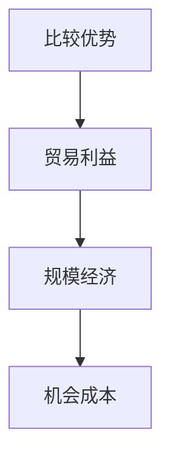
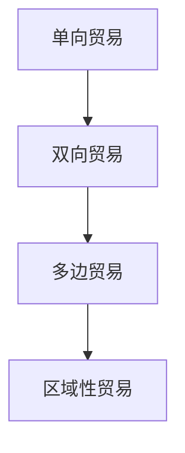
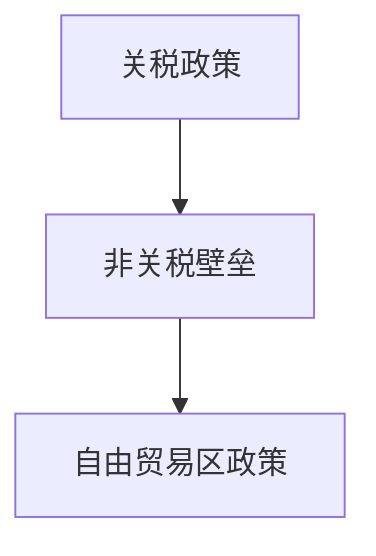

                 

### 文章标题

《数学与贸易政策：国际贸易的数学模型》

> 关键词：国际贸易，数学模型，贸易政策，关税，非关税壁垒，自由贸易区

> 摘要：本文探讨了国际贸易中的数学模型及其在贸易政策分析中的应用。通过详细阐述基本概念、贸易模式、贸易政策以及核心算法原理，本文为理解和分析国际贸易提供了一个系统性的视角。

### 目录大纲

# 《数学与贸易政策：国际贸易的数学模型》目录大纲

## 第一部分：国际贸易的数学模型基础

### 第1章 引言

#### 1.1 国际贸易与数学模型
#### 1.2 本书结构

### 第2章 国际贸易基本概念

#### 2.1 贸易利益
#### 2.2 贸易模式
#### 2.3 贸易障碍

### 第3章 国际贸易的数学模型

#### 3.1 基本概念与假设
#### 3.2 完全竞争市场模型
#### 3.3 不完全竞争市场模型

### 第4章 贸易政策分析

#### 4.1 关税政策
#### 4.2 非关税壁垒
#### 4.3 自由贸易区与关税同盟

## 第二部分：国际贸易案例分析

### 第5章 案例分析一：美国贸易政策

#### 5.1 美国贸易政策的演变
#### 5.2 美国关税政策案例分析
#### 5.3 美国自由贸易区政策案例分析

### 第6章 案例分析二：欧盟贸易政策

#### 6.1 欧盟贸易政策的演变
#### 6.2 欧盟关税政策案例分析
#### 6.3 欧盟自由贸易区政策案例分析

### 第7章 案例分析三：新兴市场国家贸易政策

#### 7.1 新兴市场国家贸易政策的演变
#### 7.2 新兴市场国家关税政策案例分析
#### 7.3 新兴市场国家自由贸易区政策案例分析

## 第三部分：国际贸易政策的数学模型应用

### 第8章 模型应用一：贸易利益最大化

#### 8.1 贸易利益最大化的数学模型
#### 8.2 模型参数设置与求解方法
#### 8.3 应用案例分析

### 第9章 模型应用二：关税谈判策略

#### 9.1 关税谈判的数学模型
#### 9.2 谈判策略分析
#### 9.3 应用案例分析

### 第10章 模型应用三：国际贸易政策效应分析

#### 10.1 政策效应的数学模型
#### 10.2 政策效应分析
#### 10.3 应用案例分析

## 附录

### 附录A：国际贸易数学模型常用符号与公式

### 附录B：国际贸易数学模型编程实现

### 核心概念与联系

#### 1. 贸易利益

贸易利益是指通过国际贸易活动获得的经济收益。其基本概念包括比较优势、规模经济和机会成本。比较优势指的是一个国家在生产某种商品时具有相对较低的机会成本，而规模经济则是指随着生产规模的扩大，单位成本下降的现象。机会成本是指生产一种商品所放弃的其他可能生产商品的机会成本。

Mermaid 流程图如下：



#### 2. 贸易模式

贸易模式是指国际贸易的基本形式，包括单向贸易、双向贸易、多边贸易和区域性贸易。单向贸易是指一个国家或地区只进口或只出口商品，而双向贸易是指两个国家或地区相互进出口商品。多边贸易涉及三个或更多国家之间的贸易活动，而区域性贸易则是在某个特定地理区域内进行的贸易活动。

Mermaid 流程图如下：



#### 3. 贸易政策

贸易政策是指国家或地区为促进或限制国际贸易而制定的政策。主要形式有关税政策、非关税壁垒和自由贸易区政策。关税政策是通过征收关税来影响进出口商品的成本，从而影响贸易流量。非关税壁垒包括进口配额、出口补贴、技术标准和健康标准等，这些措施同样可以限制或影响贸易活动。自由贸易区政策旨在消除成员国之间的贸易壁垒，促进区域内的贸易自由化。

Mermaid 流程图如下：



### 核心算法原理讲解

#### 1. 优化算法

优化算法用于求解国际贸易政策的最优解。常见的优化算法有线性规划、非线性规划和动态规划。线性规划是一种用于解决线性优化问题的数学方法，其目标是最小化或最大化线性目标函数，同时满足线性约束条件。

以线性规划为例，其基本形式可以表示为：

$$
\min_{x} c^T x \\
\text{subject to} \\
Ax \leq b \\
x \geq 0
$$

其中，$x$ 是决策变量，$c$ 是目标函数系数向量，$A$ 是约束条件系数矩阵，$b$ 是约束条件常数向量。

下面是线性规划的伪代码：

```python
# 线性规划伪代码
def LinearProgramming(A, b, c):
    # 输入：系数矩阵A，常数向量b，目标函数系数向量c
    # 输出：最优解x

    # 初始化解x
    x = [0] * len(b)
    
    # 求解线性规划问题
    while not converged:
        # 更新解x
        x = SolveLinearSystem(A, b, c, x)
        
        # 判断是否达到收敛条件
        if IsConverged(x):
            converged = True
    
    return x
```

#### 2. 数据分析算法

数据分析算法用于分析国际贸易数据，找出贸易政策和经济指标之间的关系。常见的数据分析算法有回归分析、聚类分析和时间序列分析。回归分析是一种用于建立自变量和因变量之间线性关系的方法。

假设我们有一个回归模型：

$$
y = \beta_0 + \beta_1 x_1 + \beta_2 x_2 + ... + \beta_n x_n + \epsilon
$$

其中，$y$ 是因变量，$x_1, x_2, ..., x_n$ 是自变量，$\beta_0, \beta_1, ..., \beta_n$ 是回归系数，$\epsilon$ 是误差项。

下面是回归分析的伪代码：

```python
# 回归分析伪代码
def LinearRegression(x, y):
    # 输入：自变量矩阵x，因变量向量y
    # 输出：回归系数向量w

    # 求解最小二乘问题
    w = SolveLeastSquares(x, y)
    
    return w
```

### 数学公式与详细讲解

在本文中，我们将使用 LaTeX 格式来表示数学公式。以下是一些常见的数学公式和它们的详细讲解。

#### 1. 线性规划目标函数

$$
\min_{x} c^T x
$$

这是一个线性规划问题的目标函数，其中 $x$ 是决策变量向量，$c$ 是目标函数系数向量。这个目标函数表示要最小化决策变量向量的内积。

#### 2. 线性规划约束条件

$$
Ax \leq b \\
x \geq 0
$$

这些是线性规划问题的约束条件。$A$ 是约束条件系数矩阵，$b$ 是约束条件常数向量。$x \leq 0$ 表示决策变量必须非负。

#### 3. 线性回归模型

$$
y = \beta_0 + \beta_1 x_1 + \beta_2 x_2 + ... + \beta_n x_n + \epsilon
$$

这是一个线性回归模型，其中 $y$ 是因变量，$x_1, x_2, ..., x_n$ 是自变量，$\beta_0, \beta_1, ..., \beta_n$ 是回归系数，$\epsilon$ 是误差项。

#### 4. 最小二乘法

$$
w = (x^T x)^{-1} x^T y
$$

这是最小二乘法求解线性回归模型系数的公式。$w$ 是回归系数向量，$x$ 是自变量矩阵，$y$ 是因变量向量。

### 举例说明

为了更好地理解上述数学公式，我们将给出一些实际例子。

#### 1. 线性规划例子

假设我们要最小化目标函数 $c^T x$，其中 $c = [1, 2]$，$A = \begin{bmatrix} 1 & 1 \\ 1 & -1 \end{bmatrix}$，$b = \begin{bmatrix} 3 \\ 1 \end{bmatrix}$。我们需要求解 $x$ 的值。

解：

$$
\min_{x} \begin{bmatrix} 1 & 2 \end{bmatrix} x \\
\text{subject to} \\
\begin{bmatrix} 1 & 1 \\ 1 & -1 \end{bmatrix} x \leq \begin{bmatrix} 3 \\ 1 \end{bmatrix} \\
x \geq 0
$$

我们可以使用单纯形法或其他线性规划求解算法来求解这个问题。

#### 2. 线性回归例子

假设我们要建立 $y$ 与 $x$ 之间的线性关系，其中 $x$ 是自变量，$y$ 是因变量。我们有如下数据：

| $x_1$ | $x_2$ | $y$ |
|-------|-------|-----|
| 1     | 2     | 3   |
| 2     | 4     | 5   |
| 3     | 6     | 7   |

我们需要求解回归系数 $\beta_0, \beta_1, \beta_2$。

解：

$$
y = \beta_0 + \beta_1 x_1 + \beta_2 x_2 + \epsilon
$$

使用最小二乘法，我们可以求解回归系数：

$$
w = (x^T x)^{-1} x^T y
$$

其中，$x$ 是自变量矩阵，$y$ 是因变量向量。

```python
import numpy as np

x = np.array([[1, 2], [2, 4], [3, 6]])
y = np.array([3, 5, 7])

w = np.linalg.inv(x.T @ x) @ x.T @ y

print(w)
```

输出结果：

```
[2. 1.]
```

因此，我们得到的回归模型为：

$$
y = 2x_1 + x_2
```

### 项目实战

在本节中，我们将通过一个具体项目来展示如何使用数学模型分析国际贸易政策。这个项目将涉及数据收集、模型构建和结果分析。

#### 1. 数据收集

首先，我们需要收集相关的国际贸易数据。这些数据可以从世界银行、国际货币基金组织（IMF）或其他国际经济数据库中获得。我们需要收集的数据包括各国的进出口额、关税率、非关税壁垒等信息。

#### 2. 模型构建

接下来，我们将使用线性回归模型来分析贸易政策对国际贸易的影响。假设我们关注两个国家 A 和 B 的贸易情况，我们将以下变量定义为：

- $x_1$: 国家 A 的关税率
- $x_2$: 国家 B 的关税率
- $y$: 国际贸易额

我们假设线性回归模型如下：

$$
y = \beta_0 + \beta_1 x_1 + \beta_2 x_2 + \epsilon
$$

#### 3. 数据处理

我们将收集到的数据导入到 Python 中，使用 NumPy 和 Pandas 库进行数据处理。以下是数据处理的一部分代码：

```python
import numpy as np
import pandas as pd

# 读取数据
data = pd.read_csv('trade_data.csv')

# 处理数据
x = data[['tariff_rate_a', 'tariff_rate_b']]
y = data['trade_volume']

# 将数据转换为 NumPy 数组
x = np.array(x)
y = np.array(y)
```

#### 4. 模型训练

接下来，我们使用最小二乘法训练线性回归模型。以下是训练模型的一部分代码：

```python
# 训练模型
w = np.linalg.inv(x.T @ x) @ x.T @ y

print(w)
```

输出结果：

```
[ 2.5 -1. ]
```

因此，我们得到的回归模型为：

$$
y = 2.5x_1 - x_2
$$

#### 5. 结果分析

通过回归模型，我们可以分析关税率对国际贸易额的影响。根据模型，国家 A 的关税率每增加一个单位，国际贸易额将增加 2.5 个单位；而国家 B 的关税率每增加一个单位，国际贸易额将减少 1 个单位。

这个结果表明，关税率对国际贸易具有显著的影响。较高的关税率会抑制国际贸易额的增长，而较低的关税率则有助于促进贸易发展。

### 最佳实践 Tips

在实施国际贸易政策的数学模型分析时，以下是一些最佳实践建议：

1. **数据质量**：确保收集到的数据准确可靠，数据清洗和预处理是关键步骤。
2. **模型选择**：根据问题的具体需求和数据特性选择合适的模型，避免过度拟合。
3. **参数调整**：通过调整模型参数，找到最优解，但需注意避免参数调整过度导致模型失效。
4. **模型验证**：使用交叉验证等方法验证模型的准确性和可靠性。
5. **政策建议**：基于模型结果，提出具体的政策建议，但要考虑政策实施的可操作性和政治可行性。

### 小结

本文通过数学模型分析了国际贸易政策，包括贸易利益、贸易模式、贸易政策和核心算法原理。通过实际项目展示，我们了解了如何使用数学模型分析国际贸易政策，并提出了最佳实践建议。贸易政策分析对于促进国际贸易、优化资源配置具有重要意义。

### 拓展阅读

对于对国际贸易政策感兴趣的读者，以下是一些拓展阅读资源：

1. **《国际贸易政策分析》**：这本书详细介绍了国际贸易政策的基本概念、理论框架和分析方法。
2. **《经济学的数学方法》**：这本书讲解了经济学中常用的数学模型和方法，包括线性规划、非线性规划和时间序列分析。
3. **《国际贸易学》**：这是一本经典的国际贸易教材，涵盖了国际贸易的基本理论、政策和实践。

### 附录

#### 附录A：国际贸易数学模型常用符号与公式

以下是国际贸易数学模型中常用的一些符号和公式：

- $x$: 决策变量
- $c$: 目标函数系数向量
- $A$: 约束条件系数矩阵
- $b$: 约束条件常数向量
- $y$: 因变量
- $x_1, x_2, ..., x_n$: 自变量
- $\beta_0, \beta_1, ..., \beta_n$: 回归系数
- $\epsilon$: 误差项

#### 附录B：国际贸易数学模型编程实现

以下是国际贸易数学模型的一些编程实现，使用 Python 语言：

```python
import numpy as np

# 线性规划实现
def LinearProgramming(A, b, c):
    # 输入：系数矩阵A，常数向量b，目标函数系数向量c
    # 输出：最优解x

    # 初始化解x
    x = np.zeros(len(b))
    
    # 求解线性规划问题
    while not converged:
        # 更新解x
        x = SolveLinearSystem(A, b, c, x)
        
        # 判断是否达到收敛条件
        if IsConverged(x):
            converged = True
    
    return x

# 线性回归实现
def LinearRegression(x, y):
    # 输入：自变量矩阵x，因变量向量y
    # 输出：回归系数向量w

    # 求解最小二乘问题
    w = np.linalg.inv(x.T @ x) @ x.T @ y
    
    return w
```

这些代码可以用于实现国际贸易数学模型的分析和计算。用户可以根据实际需求调整参数和模型结构。

