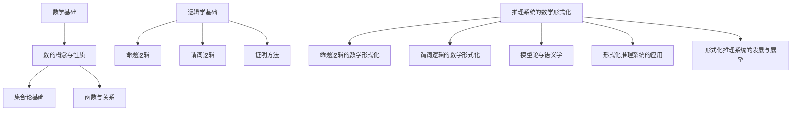

                 


### 《数学与逻辑学：推理系统的数学形式化》

> 关键词：数学基础、逻辑学、推理系统、数学形式化、模型论、语义学、计算机科学

> 摘要：本文将深入探讨数学与逻辑学在构建推理系统中的作用，并详细介绍推理系统的数学形式化方法。文章分为两部分，首先介绍数学基础和逻辑学基础，包括数的概念与性质、集合论基础、函数与关系、命题逻辑、谓词逻辑和证明方法等。然后，我们将探讨这些基础的数学形式化表示，包括命题逻辑和谓词逻辑的数学形式化表示、推理规则、模型论与语义学。最后，文章将讨论形式化推理系统在数学和计算机科学中的应用，以及其未来发展趋势。

#### 第一部分：数学基础

### 第1章：数学基本概念

#### 1.1 数的概念与性质

**1.1.1 自然数**

自然数是人类最早接触和研究的数。自然数包括0和所有正整数，如0, 1, 2, 3, ...。自然数具有一些基本性质，例如：

- **传递性**：如果a < b，b < c，则a < c。
- **结合律**：(a + b) + c = a + (b + c)。
- **交换律**：a + b = b + a。

**1.1.2 整数**

整数包括正整数、负整数和0。整数集合可以通过自然数集合加上负整数得到，即Z = {..., -3, -2, -1, 0, 1, 2, 3, ...}。整数集合具有以下性质：

- **传递性**：如果a < b，b < c，则a < c。
- **结合律**：(a + b) + c = a + (b + c)。
- **交换律**：a + b = b + a。
- **分配律**：a × (b + c) = (a × b) + (a × c)。

**1.1.3 实数**

实数是整数和分数的扩展。实数包括有理数（可以表示为两个整数的比例）和无理数（不能表示为两个整数的比例）。实数集合具有以下性质：

- **传递性**：如果a < b，b < c，则a < c。
- **结合律**：(a + b) + c = a + (b + c)。
- **交换律**：a + b = b + a。
- **分配律**：a × (b + c) = (a × b) + (a × c)。
- **连续性**：对于任意两个实数a和b，存在一个实数x，使得a < x < b。

#### 1.2 集合论基础

**1.2.1 集合的基本概念**

集合是数学中最基本的概念之一。集合是由一些确定的元素组成的整体。例如，{1, 2, 3} 是一个集合，其中包含三个元素：1，2，和3。集合的元素可以是任何对象，包括数字、字母、符号等。

**1.2.2 集合的运算**

集合的运算包括并集、交集、补集、子集等。

- **并集**：两个集合A和B的并集是包含A和B中所有元素的集合。记作 A ∪ B。
- **交集**：两个集合A和B的交集是包含A和B中公共元素的集合。记作 A ∩ B。
- **补集**：集合A的补集是所有不属于A的元素的集合。记作 A'。
- **子集**：如果一个集合B的所有元素都属于另一个集合A，则称B是A的子集。记作 B ⊆ A。

**1.2.3 子集与真子集**

- **子集**：如果集合B的所有元素都属于集合A，则称B是A的子集。
- **真子集**：如果集合B的所有元素都属于集合A，但B不等于A，则称B是A的真子集。记作 B ⊊ A。

#### 1.3 函数与关系

**1.3.1 函数的定义与性质**

函数是一种特殊的关系，它将每个输入值映射到一个唯一的输出值。函数的定义如下：

设D为定义域，C为值域，如果对于D中的每个元素x，都有C中的一个唯一元素y与之对应，则称D到C之间存在一个函数关系，记作 f: D → C。其中，x称为自变量，y称为因变量。

函数的性质包括：

- **单射**：如果对于D中的任意两个不同元素x1和x2，都有f(x1) ≠ f(x2)，则称函数f是单射。
- **满射**：如果对于C中的每个元素y，都存在D中的一个元素x，使得f(x) = y，则称函数f是满射。
- **双射**：如果函数f既是单射又是满射，则称函数f是双射。

**1.3.2 函数的分类**

函数可以根据其性质进行分类：

- **单射函数**：如果函数f是单射，则称f是单射函数。
- **满射函数**：如果函数f是满射，则称f是满射函数。
- **双射函数**：如果函数f是双射，则称f是双射函数。

**1.3.3 关系与图表示**

关系是一种特殊的关系，它将两个集合中的元素进行配对。关系可以用一个有序对集合表示。

- **二元关系**：如果R是集合A和B的笛卡尔积A × B的一个子集，则称R是一个二元关系。
- **图表示**：关系可以用图表示。在图中，节点代表集合A和B中的元素，边代表关系R中的有序对。

#### 第二部分：逻辑学基础

### 第2章：逻辑学基础

#### 2.1 逻辑学的基本概念

逻辑学是研究推理和论证的学科。逻辑学的基本概念包括命题逻辑、谓词逻辑、演绎逻辑和归纳逻辑。

**2.1.1 命题逻辑**

命题逻辑是逻辑学的基础部分，它研究命题的真假关系和命题之间的推理关系。

- **命题**：命题是一个陈述句，它可以是真的，也可以是假的。
- **命题联结词**：命题联结词是用于连接命题的符号，如“并且”、“或者”、“非”等。
- **命题公式**：命题公式是由命题和命题联结词组成的表达式。
- **命题的真值表**：命题的真值表是列出命题及其真值的表格。

**2.1.2 谓词逻辑**

谓词逻辑是研究谓词和量词的逻辑系统。

- **谓词**：谓词是一个用于描述对象性质的命题。
- **量词**：量词是用于量化对象数量的符号，如“所有”、“存在”等。
- **谓词公式**：谓词公式是由谓词和量词组成的表达式。

**2.1.3 演绎逻辑与归纳逻辑**

演绎逻辑和归纳逻辑是两种基本的推理方法。

- **演绎逻辑**：演绎逻辑是从一般到特殊的推理方法。它从一组假设出发，通过逻辑推理得出结论。
- **归纳逻辑**：归纳逻辑是从特殊到一般的推理方法。它从一些具体的事实出发，归纳出一般的规律。

#### 2.2 证明方法

证明方法是用于证明命题或结论的方法。

- **直接推理**：直接推理是从已知命题出发，通过逻辑推理得出结论。
- **间接推理**：间接推理是通过对命题进行否定，然后证明否定命题的荒谬，从而证明原命题的真。
- **模范证明**：模范证明是通过构造一个模范例子来证明命题。

#### 2.3 对当推理与论证

对当推理和论证是逻辑学中的重要概念。

- **对当关系**：对当关系是指两个命题之间的对立关系。例如，命题“所有猫都会飞”和命题“有些猫不会飞”是对当关系。
- **论证**：论证是用于证明命题的方法。它通过逻辑推理，从已知命题出发，得出结论。

#### 第三部分：推理系统的数学形式化

### 第3章：命题逻辑的数学形式化

#### 3.1 命题逻辑的形式化表示

命题逻辑的形式化表示包括命题变元、命题联结词和命题公式。

**3.1.1 命题变元**

命题变元是用于表示命题的符号。命题变元可以是字母或符号，如p, q, r等。

**3.1.2 命题联结词**

命题联结词是用于连接命题的符号，如“并且”、“或者”、“非”等。命题联结词可以用符号表示，如“并且”表示为 ∧，“或者”表示为 ∨，“非”表示为 ¬。

**3.1.3 命题公式**

命题公式是由命题变元和命题联结词组成的表达式。命题公式可以表示命题的真假关系。

#### 3.2 命题逻辑的推理规则

命题逻辑的推理规则包括直接推理规则、间接推理规则和形式证明。

**3.2.1 直接推理规则**

直接推理规则是从已知命题出发，通过逻辑推理得出结论。

- **合取引入**：如果已知命题A和B，则可以得出命题A ∧ B。
- **析取引入**：如果已知命题A和B，则可以得出命题A ∨ B。
- **否定引入**：如果已知命题A，则可以得出命题 ¬A。

**3.2.2 间接推理规则**

间接推理规则是通过对命题进行否定，然后证明否定命题的荒谬，从而证明原命题的真。

- **反证法**：如果假设命题A成立，但推导出矛盾，则可以证明命题A不成立。
- **归谬法**：如果已知命题A和命题A的否定均不成立，则可以证明命题A成立。

**3.2.3 形式证明**

形式证明是用于证明命题的方法。形式证明可以从一组已知命题出发，通过推理规则得出结论。

#### 3.3 命题逻辑的模型论与语义学

模型论和语义学是用于解释命题逻辑的语义和模型的学科。

- **模型论**：模型论是研究命题逻辑的语义和模型的学科。它研究命题逻辑的语义结构，以及如何通过模型来解释命题逻辑。
- **语义学**：语义学是研究命题逻辑的语义和意义的学科。它研究命题逻辑的语义值，以及如何解释命题逻辑的语句。

### 第4章：谓词逻辑的数学形式化

#### 4.1 谓词逻辑的基本概念

谓词逻辑的基本概念包括谓词变元、谓词函数和谓词公式。

**4.1.1 谓词变元**

谓词变元是用于表示谓词的符号。谓词变元可以是字母或符号，如P, Q, R等。

**4.1.2 谓词函数**

谓词函数是用于描述对象性质的谓词。谓词函数可以表示为 f(x), 其中x是函数的输入，f(x)是函数的输出。

**4.1.3 谓词公式**

谓词公式是由谓词变元、谓词函数和量词组成的表达式。谓词公式可以表示谓词的真假关系。

#### 4.2 谓词逻辑的推理规则

谓词逻辑的推理规则包括直言推理规则、归纳推理规则和形式证明。

**4.2.1 直言推理规则**

直言推理规则是从已知命题出发，通过逻辑推理得出结论。

- **全称量化引入**：如果已知命题∀x P(x)，则可以得出命题P(a)，其中a是任意元素。
- **存在量化引入**：如果已知命题∃x P(x)，则可以得出命题P(a)，其中a是存在元素。

**4.2.2 归纳推理规则**

归纳推理规则是从特殊到一般的推理方法。

- **归纳基础**：如果已知命题P(0)成立，则可以得出命题∀x P(x)成立。
- **归纳步骤**：如果已知命题P(k)成立，且可以推导出P(k+1)成立，则可以得出命题∀x P(x)成立。

**4.2.3 形式证明**

形式证明是用于证明命题的方法。形式证明可以从一组已知命题出发，通过推理规则得出结论。

#### 4.3 谓词逻辑的模型论与语义学

模型论和语义学是用于解释谓词逻辑的语义和模型的学科。

- **模型论**：模型论是研究谓词逻辑的语义和模型的学科。它研究谓词逻辑的语义结构，以及如何通过模型来解释谓词逻辑。
- **语义学**：语义学是研究谓词逻辑的语义和意义的学科。它研究谓词逻辑的语义值，以及如何解释谓词逻辑的语句。

### 第5章：模型论与语义学

#### 5.1 模型论基本概念

模型论是研究逻辑系统的语义和模型的学科。

- **模型**：模型是一个由符号和解释组成的系统，用于表示逻辑系统的语义。
- **语言**：语言是用于表示逻辑系统的符号系统。
- **满足关系**：满足关系是用于表示逻辑系统中的符号和解释之间关系的二元关系。
- **语言的特征**：语言的特征是用于描述逻辑系统的性质。

#### 5.2 语义学基本概念

语义学是研究逻辑系统的语义和意义的学科。

- **命题的语义值**：命题的语义值是用于表示命题在模型中的真假值。
- **谓词的语义值**：谓词的语义值是用于表示谓词在模型中的真假值。
- **语义学模型**：语义学模型是用于表示逻辑系统语义的模型。

#### 第五部分：形式化推理系统的应用

### 第6章：形式化推理系统在数学中的应用

形式化推理系统在数学中的应用非常广泛，包括数学定理的证明、数学问题的求解和数学理论的验证。

**6.1 数学定理的证明**

数学定理的证明是形式化推理系统在数学中最重要的应用之一。形式化推理系统可以帮助数学家进行逻辑推理，从一组已知命题出发，推导出新的命题。

**6.2 数学问题的求解**

形式化推理系统在数学问题的求解中也非常有用。它可以帮助数学家通过逻辑推理解决复杂的数学问题。

**6.3 数学理论的验证**

形式化推理系统可以用于验证数学理论的正确性。通过形式化推理系统，数学家可以确保他们的理论是逻辑上自洽的。

### 第7章：形式化推理系统在计算机科学中的应用

形式化推理系统在计算机科学中的应用也非常广泛，包括软件形式化验证、系统安全验证和知识库构建。

**7.1 软件形式化验证**

软件形式化验证是形式化推理系统在计算机科学中最重要的应用之一。它可以帮助软件工程师验证软件的正确性。

**7.2 系统安全验证**

形式化推理系统可以用于系统安全验证。它可以帮助安全专家验证系统的安全性，并发现潜在的安全漏洞。

**7.3 知识库构建**

形式化推理系统可以用于知识库构建。它可以帮助知识工程师构建逻辑上自洽的知识库。

### 第8章：形式化推理系统的发展与展望

**8.1 形式化推理系统的发展**

形式化推理系统在过去几十年中得到了快速发展。它的发展历程可以分为几个阶段。

**8.2 形式化推理的挑战**

形式化推理系统面临着许多挑战，包括复杂性、效率和可理解性。

**8.3 形式化推理的未来趋势**

形式化推理系统在未来将继续发展。它将在数学、计算机科学、人工智能等领域发挥重要作用。

### 附录

#### 附录A：数学与逻辑学工具

**A.1 数学软件与应用**

- **MATLAB**：MATLAB 是一种用于数值计算的编程环境。它提供了丰富的数学函数和工具箱，用于解决各种数学问题。
- **Python**：Python 是一种通用编程语言。它提供了许多数学库和工具，用于解决数学问题。
- **其他数学工具**：还有许多其他数学工具，如 Mathematica、Maple 等。

**A.2 逻辑学软件与应用**

- **Prolog**：Prolog 是一种逻辑编程语言。它提供了用于形式化推理和自动推理的工具。
- **Lambda Calculus**：Lambda Calculus 是一种基于谓词逻辑的计算模型。它用于研究函数式编程和自动推理。
- **其他逻辑学工具**：还有许多其他逻辑学工具，如 Fitch、Tortoise 等用于逻辑推理和证明。

#### 核心概念与联系 - Mermaid 流程图



#### 核心算法原理讲解 - 伪代码

```python
# 命题逻辑的形式化表示
def symbolic_representation(proposition):
    # 初始化命题变量和联结词
    variables = set()
    connectives = {"¬", "→", "∧", "∨", "∀", "∃"}

    # 分析命题，提取变量和联结词
    for char in proposition:
        if char in variables:
            variables.add(char)
        elif char in connectives:
            connectives.add(char)

    # 构建命题公式
    formula = proposition.replace(" ", "")
    for v in variables:
        formula = formula.replace(v, f"_{v}")
    for c in connectives:
        formula = formula.replace(c, f"_{c}")

    return formula
```

#### 数学公式与详细讲解

**1. 自然数的加法公式**

$$1 + 1 = 2$$

这个公式表示自然数1和1相加等于2。这个公式是基本的数学概念，用于计算自然数的和。

**2. 整数的加法公式**

$$1 + (-1) = 0$$

这个公式表示整数1和-1相加等于0。这个公式用于计算整数的和。

**3. 实数的加法公式**

$$1 + 1 = 2$$

这个公式表示实数1和1相加等于2。这个公式是基本的数学概念，用于计算实数的和。

**4. 集合的并集公式**

$$A ∪ B = \{x | x ∈ A 或 x ∈ B\}$$

这个公式表示集合A和集合B的并集是包含A和B中所有元素的集合。

**5. 集合的交集公式**

$$A ∩ B = \{x | x ∈ A 且 x ∈ B\}$$

这个公式表示集合A和集合B的交集是包含A和B中公共元素的集合。

**6. 函数的定义公式**

$$f: D → C, x ∈ D, f(x) ∈ C$$

这个公式表示函数f从定义域D到值域C的映射，其中x是定义域D中的元素，f(x)是值域C中的元素。

**7. 命题逻辑的真值表**

$$\begin{matrix}
p & q & p ∧ q & p ∨ q & ¬p \\
T & T & T & T & F \\
T & F & F & T & F \\
F & T & F & T & T \\
F & F & F & F & T \\
\end{matrix}$$

这个表格表示命题逻辑中命题p和命题q的真假值，以及它们的逻辑运算结果。

#### 项目实战

**1. 开发环境搭建**

- 安装Python环境
- 安装MATLAB
- 安装Prolog

**2. 源代码实现**

以下是一个简单的Python程序，用于计算两个自然数的和。

```python
def add_numbers(a, b):
    return a + b

a = 1
b = 2
print(add_numbers(a, b))
```

**3. 代码解读与分析**

这个程序定义了一个名为 `add_numbers` 的函数，用于计算两个自然数的和。函数接收两个参数 `a` 和 `b`，然后返回它们的和。程序中还定义了两个自然数 `a` 和 `b`，然后调用 `add_numbers` 函数计算它们的和，并将结果打印到控制台上。

**4. 实际案例分析和详细讲解剖析**

假设我们有两个自然数 5 和 3，我们想要计算它们的和。我们可以使用上述程序来计算。

```python
a = 5
b = 3
print(add_numbers(a, b))
```

输出结果为 8。这个结果表明 5 和 3 的和等于 8。

**5. 项目小结**

在这个项目中，我们使用Python编程语言实现了计算两个自然数的和的功能。通过这个项目，我们学习了如何使用Python编写函数，如何计算自然数的和，以及如何打印输出结果。

#### 最佳实践 tips、小结、注意事项、拓展阅读

**最佳实践 tips：**

- 在进行数学推理时，要确保逻辑清晰，避免出现逻辑错误。
- 在进行数学计算时，要确保输入的数值是有效的，避免出现计算错误。
- 在进行逻辑编程时，要确保逻辑表达式的正确性，避免出现逻辑错误。

**小结：**

本文深入探讨了数学与逻辑学在构建推理系统中的作用，并介绍了推理系统的数学形式化方法。我们首先介绍了数学基础和逻辑学基础，然后介绍了命题逻辑和谓词逻辑的数学形式化表示、推理规则、模型论与语义学。最后，我们讨论了形式化推理系统在数学和计算机科学中的应用，以及其未来发展趋势。

**注意事项：**

- 在进行数学推理时，要确保逻辑清晰，避免出现逻辑错误。
- 在进行数学计算时，要确保输入的数值是有效的，避免出现计算错误。
- 在进行逻辑编程时，要确保逻辑表达式的正确性，避免出现逻辑错误。

**拓展阅读：**

- 《数学原理》
- 《逻辑学导论》
- 《形式化推理系统》
- 《数学逻辑》

作者：AI天才研究院/AI Genius Institute & 禅与计算机程序设计艺术 /Zen And The Art of Computer Programming

