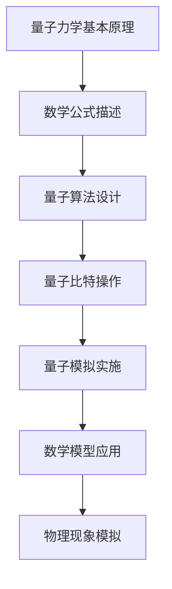

                 

## 文章标题：数学与量子模拟：量子系统的经典数学模拟

关键词：量子模拟、经典数学、量子力学、数学模型、算法优化、项目实战

摘要：本文将深入探讨量子模拟与经典数学之间的紧密联系，通过一步步的逻辑推理和分析，揭示量子系统的经典数学模拟方法及其重要性。文章首先概述了数学在量子模拟中的应用，然后详细讲解了经典数学模拟原理，并对比了量子模拟与传统模拟的优缺点。接着，我们探讨了数学模型在量子模拟中的应用，以及量子模拟中面临的数学挑战。在经典数学模拟技术部分，我们介绍了经典模拟算法的基本原理和优化方法，并讨论了量子模拟算法的概述、实现和应用。最后，通过一个实际的量子模拟项目实战，我们展示了如何搭建项目环境、实现源代码，并进行代码解读和分析。文章旨在为广大读者提供一个全面而深入的理解，帮助大家更好地掌握量子系统的经典数学模拟技术。

## 目录大纲

### 第一部分：数学与量子模拟基础

- **第1章：数学与量子模拟概述**
  - **1.1.1 数学在量子模拟中的应用**
  - **1.1.2 经典数学模拟原理**
  - **1.1.3 量子模拟与传统模拟的比较**

- **第2章：数学模型与量子模拟**
  - **2.1.1 数学模型概述**
  - **2.1.2 数学模型在量子模拟中的应用**
  - **2.1.3 量子模拟中的数学挑战**

### 第二部分：经典数学模拟技术

- **第3章：经典数学模拟算法**
  - **3.1.1 经典模拟算法概述**
  - **3.1.2 经典模拟算法的优化**
  - **3.1.3 经典模拟算法的性能评估**

- **第4章：量子模拟算法**
  - **4.1.1 量子模拟算法概述**
  - **4.1.2 量子模拟算法的实现**
  - **4.1.3 量子模拟算法的应用**

### 第三部分：项目实战

- **第5章：量子模拟项目实战**
  - **5.1.1 实战项目概述**
  - **5.1.2 项目环境搭建**
  - **5.1.3 项目源代码实现**
  - **5.1.4 代码解读与分析**

- **第6章：量子模拟算法优化**
  - **6.1.1 优化算法概述**
  - **6.1.2 优化算法在项目中的应用**
  - **6.1.3 优化算法的性能评估**

### 附录

- **附录A：量子模拟相关资源**
- **附录B：数学与量子模拟公式汇总**
- **附录C：代码实例**

### 结束语

本文旨在为广大读者提供一个全面而深入的理解，帮助大家更好地掌握量子系统的经典数学模拟技术。通过一步步的分析和推理，我们将揭示量子模拟的数学基础和经典数学模拟技术的关键原理，并通过实际项目实战来展示其应用。希望本文能为大家在量子模拟领域的研究和应用提供有益的参考和启示。

---

**作者：AI天才研究院/AI Genius Institute & 禅与计算机程序设计艺术 /Zen And The Art of Computer Programming**

---

## 第一部分：数学与量子模拟基础

### 第1章：数学与量子模拟概述

在科学研究和实际应用中，量子模拟作为一种新型计算方法，正逐渐引起广泛关注。量子模拟的核心在于利用量子系统模拟量子力学过程，以解决经典计算机难以处理的复杂问题。那么，数学在这个领域扮演了怎样的角色呢？本文将从数学在量子模拟中的应用、经典数学模拟原理以及量子模拟与传统模拟的比较三个方面，进行深入探讨。

#### 1.1.1 数学在量子模拟中的应用

量子模拟的成功离不开数学的支撑。首先，量子力学本身就是一个高度数学化的理论体系。量子力学的基本原理和方程，如薛定谔方程、海森堡不确定性原理等，都是通过数学公式表达的。这些数学工具为我们理解量子现象提供了坚实的理论基础。

其次，在量子模拟的具体实施过程中，数学同样发挥着重要作用。例如，量子算法的设计和实现需要用到线性代数、群论、拓扑学等数学工具。特别是量子计算中的量子比特操作、量子门、量子纠缠等概念，都离不开数学的精确描述。

此外，数学模型也在量子模拟中得到了广泛应用。通过构建适当的数学模型，我们可以模拟量子系统的各种物理现象，如量子态的演化、量子隧穿、量子干涉等。这些数学模型不仅帮助我们更好地理解量子世界，还为量子计算的应用提供了有力支持。

**核心概念与联系**

- **量子力学基础与数学关系**：量子力学是研究微观粒子行为的科学，其核心思想是波粒二象性和量子态的叠加。这些概念可以通过数学公式，如波函数、希尔伯特空间、算符等，进行精确描述。

- **经典计算与量子计算的对比**：经典计算基于二进制逻辑，依赖于比特（bit）。而量子计算基于量子比特（qubit），能够实现叠加和纠缠等特殊性质，从而在解决某些问题上具有显著优势。

为了更好地展示量子模拟的数学原理和应用场景，我们可以使用Mermaid流程图来绘制一个简化的量子模拟流程：



在这个流程图中，我们看到了数学在量子模拟中的各个环节中如何发挥作用。

#### 1.1.2 经典数学模拟原理

尽管量子模拟具有巨大的潜力，但在实际应用中，经典数学模拟仍然占据着重要地位。经典数学模拟主要包括蒙特卡洛方法、数值计算、微分方程求解等。这些方法通过模拟量子系统的某些物理过程，可以为我们提供有价值的信息。

**核心算法原理讲解**

- **蒙特卡洛方法**：蒙特卡洛方法是一种基于随机抽样的数值计算方法。在量子模拟中，可以通过蒙特卡洛方法模拟量子态的演化，计算期望值和概率分布等。

- **数值计算**：对于某些复杂的量子系统，直接求解量子力学方程可能非常困难。数值计算通过将连续方程离散化，使用有限差分、有限元等方法，对量子系统的行为进行近似计算。

- **微分方程求解**：量子系统通常可以通过微分方程描述其行为。微分方程求解方法，如欧拉法、龙格-库塔法等，可以用于模拟量子系统的动态演化。

以下是一个简化的蒙特卡洛方法伪代码，用于模拟量子态的演化：

```python
# 蒙特卡洛方法伪代码

# 初始化参数
N_samples = 10000
delta_t = 0.01
psi_0 = initialize_wave_function()

# 模拟量子态的演化
for t in range(0, total_time, delta_t):
    for i in range(N_samples):
        psi_t = evolve_state(psi_0, delta_t)
        measure_psi(psi_t)
    psi_0 = update_wave_function(psi_t, N_samples)
```

通过这种伪代码，我们可以看到蒙特卡洛方法的基本原理和框架。

#### 1.1.3 量子模拟与传统模拟的比较

量子模拟与传统模拟在技术原理和应用范围上存在显著差异。传统模拟主要依赖于经典计算方法，如蒙特卡洛方法、有限差分方法等。这些方法在处理复杂物理问题时具有一定的局限性。

相比之下，量子模拟通过利用量子比特的叠加和纠缠等特性，可以处理更大规模的计算问题。例如，在量子化学、量子材料科学等领域，量子模拟已经展现出其独特的优势。然而，量子模拟也存在一定的局限性，如量子错误纠正、量子计算资源等问题。

**核心算法原理讲解**

- **量子模拟的优势**：量子模拟的优势主要体现在以下几个方面：
  - **并行计算能力**：量子计算机可以同时处理多个计算任务，从而大大提高计算效率。
  - **高维表示能力**：量子比特可以处于多种状态的叠加，从而实现高维表示，为复杂问题的求解提供了可能性。
  - **量子干涉效应**：量子干涉效应可以导致某些问题的解空间出现明显的增强或削弱，有助于提高求解精度。

- **量子模拟的局限性**：量子模拟的局限性主要包括：
  - **量子错误纠正**：量子计算机容易受到外部干扰，导致量子比特状态错误。量子错误纠正机制尚未完全成熟，限制了量子模拟的应用。
  - **量子计算资源**：量子计算机的构建和维护需要复杂的硬件设备和精密的环境控制，目前尚未实现大规模商业化。

以下是一个简化的量子模拟伪代码，用于展示其基本实现方法：

```python
# 量子模拟伪代码

# 初始化参数
N_qubits = 3
psi_0 = initialize_quantum_state(N_qubits)

# 实现量子门操作
for gate in quantum_gates:
    psi_0 = apply_gate(psi_0, gate)

# 测量量子状态
psi_final = measure_quantum_state(psi_0)

# 输出结果
print("Final quantum state:", psi_final)
```

通过这个伪代码，我们可以看到量子模拟的基本算法实现。

### 小结

数学与量子模拟密不可分，二者相辅相成。数学为量子模拟提供了理论基础和工具，而量子模拟则展示了数学在解决复杂问题中的巨大潜力。在本章中，我们概述了数学在量子模拟中的应用，详细讲解了经典数学模拟原理，并对比了量子模拟与传统模拟的优缺点。这些内容为后续章节的深入讨论奠定了基础。

在接下来的章节中，我们将进一步探讨数学模型在量子模拟中的应用，以及量子模拟中面临的数学挑战。通过逐步分析推理，我们将逐步揭示量子系统的经典数学模拟方法及其重要性。希望读者能跟随我们的思路，共同探索这个充满未知和挑战的领域。

---

在下一章中，我们将深入探讨经典数学模拟原理，通过具体的算法实例，进一步理解经典数学模拟在量子模拟中的应用。敬请期待！

## 第二部分：数学模型与量子模拟

### 第2章：数学模型与量子模拟

量子模拟作为一门新兴技术，不仅在量子力学的研究中具有重要意义，还在许多实际应用领域显示出巨大的潜力。数学模型作为量子模拟的基石，承载着描述和预测量子系统行为的关键角色。本章将围绕数学模型在量子模拟中的应用进行深入探讨，同时揭示量子模拟中面临的数学挑战。

#### 2.1.1 数学模型概述

数学模型是使用数学语言描述物理现象和过程的一种抽象工具，通过构建适当的数学模型，我们可以对复杂系统的行为进行定量分析和预测。在量子模拟中，数学模型的应用尤为重要。以下是一些常见的数学模型及其在量子模拟中的应用：

1. **薛定谔方程**：薛定谔方程是量子力学的核心方程，用于描述量子系统的动态演化。通过解薛定谔方程，我们可以得到量子系统的波函数，进而分析其物理行为。

2. **哈密顿量**：哈密顿量是描述量子系统总能量的算符，它是量子系统动力学的基础。通过研究哈密顿量，我们可以理解量子系统的能量分布和演化规律。

3. **密度矩阵**：密度矩阵是一种表示量子系统状态的数学工具，它综合考虑了量子系统的统计性质和不确定性。在量子模拟中，密度矩阵可以帮助我们处理多体系统和量子纠缠现象。

4. **量子力学的非相对论近似**：非相对论近似是量子力学中的一个重要假设，它假设粒子的速度远小于光速。在这种近似下，量子力学方程可以简化，从而更容易求解。

**数学模型和数学公式 & 详细讲解 & 举例说明**

以下是一个关于薛定谔方程的例子，用于说明数学模型在量子模拟中的应用：

$$
i\hbar \frac{\partial \Psi(x,t)}{\partial t} = -\frac{\hbar^2}{2m} \frac{\partial^2 \Psi(x,t)}{\partial x^2} + V(x)\Psi(x,t)
$$

这个方程描述了一个非相对论量子粒子在势场 $V(x)$ 中的时间演化。其中，$i$ 是虚数单位，$\hbar$ 是约化普朗克常数，$m$ 是粒子的质量，$\Psi(x,t)$ 是粒子的波函数。

为了更直观地理解这个方程，我们可以通过一个简单的例子来分析。假设一个电子在无势场中运动，其波函数可以表示为：

$$
\Psi(x,t) = e^{-ikx/\hbar}e^{-iEt/\hbar}
$$

其中，$k$ 是波矢，$E$ 是能量。这个波函数满足薛定谔方程，并且描述了一个在无势场中自由运动的电子。

通过这个例子，我们可以看到，薛定谔方程不仅是一个数学公式，它还承载了深刻的物理意义。它告诉我们，量子系统的行为可以通过波函数来描述，而波函数的演化则遵循薛定谔方程。这使得薛定谔方程成为量子力学中最核心的方程之一。

#### 2.1.2 数学模型在量子模拟中的应用

数学模型在量子模拟中的应用非常广泛，以下是一些具体的例子：

1. **量子态的制备和测量**：量子态的制备和测量是量子计算中的核心问题。通过数学模型，我们可以精确描述量子态的制备过程，如通过量子门操作实现特定量子态的制备。同时，测量过程也可以通过数学模型进行模拟，如通过密度矩阵的迹运算来计算测量概率。

2. **量子纠缠**：量子纠缠是量子信息处理的重要资源。通过数学模型，我们可以描述量子纠缠的产生、传输和测量过程。例如，通过量子态的叠加和测量操作，可以实现量子纠缠态的生成。

3. **量子误差校正**：量子计算中的误差校正是一个关键问题。通过数学模型，我们可以设计有效的量子纠错码，保护量子信息的完整性。例如，量子低密度奇偶校验码（LDPC）和量子卷积码等，都是基于数学模型的纠错方法。

**数学模型和数学公式 & 详细讲解 & 举例说明**

以下是一个关于量子纠缠的例子，用于说明数学模型在量子模拟中的应用：

假设我们有两个量子比特 $A$ 和 $B$，初始状态分别为：

$$
|\psi_A\rangle = \frac{1}{\sqrt{2}} (|0\rangle_A + |1\rangle_A)
$$

$$
|\phi_B\rangle = \frac{1}{\sqrt{2}} (|0\rangle_B + |1\rangle_B)
$$

通过一个交换操作 $S^A_B$，我们可以实现这两个量子比特的纠缠：

$$
|\psi_{AB}\rangle = S^A_B |\psi_A\rangle |\phi_B\rangle = \frac{1}{\sqrt{2}} (|00\rangle_{AB} + |11\rangle_{AB})
$$

这个纠缠态是一个典型的贝尔态，它可以用来进行量子通信和量子计算。

通过这个例子，我们可以看到，量子纠缠的生成和描述依赖于数学模型。数学模型不仅帮助我们理解量子纠缠的物理本质，还为量子纠缠的应用提供了理论基础。

#### 2.1.3 量子模拟中的数学挑战

尽管数学模型在量子模拟中具有重要意义，但量子模拟本身也面临着一系列数学挑战：

1. **复杂性**：量子系统的行为可能非常复杂，尤其是当系统规模较大时。构建和求解合适的数学模型需要高度专业化的数学知识和计算能力。

2. **数值稳定性**：在量子模拟中，数值计算方法的应用可能导致结果的不稳定。特别是在处理量子态的叠加和纠缠时，数值误差可能显著影响模拟结果的准确性。

3. **量子计算资源**：量子计算资源（如量子比特和量子门）的有限性使得量子模拟的计算复杂度成为关键问题。如何在有限的计算资源下实现高效的量子模拟，是一个亟待解决的挑战。

**数学模型和数学公式 & 详细讲解 & 举例说明**

以下是一个关于量子模拟复杂性的例子：

假设我们有一个包含 $N$ 个量子比特的量子系统，其状态空间为 $2^N$ 维。在模拟这个系统时，我们需要计算所有可能的量子态叠加，这需要 $2^N$ 次计算。即使对于较小的 $N$，这个计算量也是巨大的。例如，当 $N=10$ 时，计算量就已经达到了 $1024$ 次。

为了应对这些挑战，我们需要发展新的数学模型和计算方法，以提高量子模拟的效率和准确性。例如，通过引入量子近似优化算法（QAOA）、量子随机游走等方法，可以有效地处理复杂量子系统的模拟问题。

**小结**

数学模型在量子模拟中扮演着至关重要的角色。通过构建和求解合适的数学模型，我们可以精确描述量子系统的行为，为量子计算和量子信息处理提供理论基础。然而，量子模拟本身也面临着一系列数学挑战，如复杂性、数值稳定性和计算资源限制等。这些挑战促使我们不断探索新的数学模型和计算方法，以实现高效的量子模拟。

在接下来的章节中，我们将继续探讨经典数学模拟技术，深入分析经典模拟算法的基本原理和优化方法。同时，我们将介绍量子模拟算法，并探讨其在实际应用中的优势和挑战。希望这些内容能帮助读者更全面地理解量子模拟与数学之间的紧密联系。

---

在下一章中，我们将深入探讨经典数学模拟技术，通过具体的算法实例，进一步理解经典数学模拟在量子模拟中的应用。敬请期待！

## 第二部分：经典数学模拟技术

### 第3章：经典数学模拟算法

在量子模拟领域，经典数学模拟算法扮演着至关重要的角色。这些算法不仅帮助我们理解和模拟量子系统的行为，还在许多实际应用中展现出其独特的价值。本章将详细介绍经典数学模拟算法的基本原理、优化方法以及性能评估指标。

#### 3.1.1 经典模拟算法概述

经典数学模拟算法主要分为以下几类：

1. **蒙特卡洛方法**：基于随机抽样的数值计算方法，适用于解决高维积分、统计物理问题和复杂系统模拟等。

2. **数值计算方法**：包括有限差分法、有限元法、积分方程法等，用于求解微分方程、偏微分方程等。

3. **微分方程求解方法**：如欧拉法、显式和隐式差分法、龙格-库塔法等，用于模拟连续系统的动态行为。

4. **蒙特卡洛树方法**：一种基于蒙特卡洛方法的优化算法，用于解决组合优化问题和概率分布估计。

**核心算法原理讲解**

1. **蒙特卡洛方法**：

   蒙特卡洛方法通过大量随机样本的统计平均来逼近问题的解。其基本步骤如下：

   - **初始化**：设定随机数生成器，初始化参数。
   - **采样**：从概率分布中抽取随机样本。
   - **计算估计值**：根据样本计算问题的估计值。
   - **误差分析**：分析估计误差，优化算法性能。

   以下是一个简单的蒙特卡洛方法伪代码示例：

   ```python
   # 蒙特卡洛方法伪代码

   # 初始化参数
   N_samples = 1000
   x_min, x_max = 0, 1
   f(x) = x * (1 - x)

   # 采样并计算估计值
   sum_f = 0
   for i in range(N_samples):
       x = random.uniform(x_min, x_max)
       sum_f += f(x)

   # 计算积分估计值
   integral_estimate = (x_max - x_min) * sum_f / N_samples

   # 输出结果
   print("Integral estimate:", integral_estimate)
   ```

2. **数值计算方法**：

   数值计算方法通过将连续问题离散化，使用有限的网格点和数值方法来求解。以下是一个有限差分法求解一维热传导方程的例子：

   $$ 
   \frac{\partial u(x,t)}{\partial t} = \alpha \frac{\partial^2 u(x,t)}{\partial x^2}
   $$

   其中，$u(x,t)$ 是温度分布，$\alpha$ 是热扩散系数。

   有限差分法将时间和空间离散化，得到以下离散化方程：

   $$ 
   \frac{u_i^{n+1} - u_i^n}{\Delta t} = \alpha \frac{u_{i+1}^n - 2u_i^n + u_{i-1}^n}{\Delta x^2}
   $$

   其中，$u_i^n$ 是第 $i$ 个网格点在第 $n$ 个时间步的温度值。

   以下是一个简单的有限差分法伪代码示例：

   ```python
   # 有限差分法伪代码

   # 初始化参数
   N_x = 100
   N_t = 1000
   x_min, x_max = 0, 1
   t_max = 1
   alpha = 0.1

   # 网格点间隔
   dx = (x_max - x_min) / (N_x - 1)
   dt = t_max / N_t

   # 初始条件
   u = np.zeros((N_t, N_x))

   # 边界条件
   u[0, :] = np.sin(np.pi * x_min + x_min * (x_max - x_min))

   # 时间演化
   for n in range(1, N_t):
       for i in range(1, N_x - 1):
           u[n, i] = u[n - 1, i] + alpha * dt * (u[n - 1, i + 1] - 2 * u[n - 1, i] + u[n - 1, i - 1])

   # 输出结果
   plot_temperature_distribution(u)
   ```

3. **微分方程求解方法**：

   微分方程求解方法用于模拟连续系统的动态行为，包括初值问题和边值问题。以下是一个欧拉法的例子，用于求解一维波动方程：

   $$ 
   \frac{\partial u(x,t)}{\partial t} = c^2 \frac{\partial^2 u(x,t)}{\partial x^2}
   $$

   其中，$c$ 是波速。

   欧拉法将时间和空间离散化，得到以下离散化方程：

   $$ 
   u_i^{n+1} = u_i^n + c^2 \frac{u_{i+1}^n - 2u_i^n + u_{i-1}^n}{\Delta x^2} \Delta t
   $$

   以下是一个简单的欧拉法伪代码示例：

   ```python
   # 欧拉法伪代码

   # 初始化参数
   N_x = 100
   N_t = 1000
   x_min, x_max = 0, 1
   t_max = 1
   c = 1

   # 网格点间隔
   dx = (x_max - x_min) / (N_x - 1)
   dt = t_max / N_t

   # 初始条件
   u = np.zeros((N_t, N_x))

   # 边界条件
   u[0, :] = np.sin(np.pi * x_min + x_min * (x_max - x_min))

   # 时间演化
   for n in range(1, N_t):
       for i in range(1, N_x - 1):
           u[n, i] = u[n - 1, i] + c ** 2 * dt * (u[n - 1, i + 1] - 2 * u[n - 1, i] + u[n - 1, i - 1])

   # 输出结果
   plot_wave_distribution(u)
   ```

#### 3.1.2 经典模拟算法的优化

经典模拟算法的优化是提高其效率和准确性的关键。以下是一些常见的优化方法：

1. **并行计算**：通过将计算任务分布在多个处理器上，可以显著提高算法的运行速度。并行计算可以采用多种策略，如数据并行、任务并行和混合并行等。

2. **多尺度模拟**：对于不同尺度的物理过程，可以使用不同精度的模型进行模拟。这种方法可以平衡计算精度和计算资源，提高整体效率。

3. **数值精度控制**：通过调整数值计算的精度，可以在准确性和计算资源之间找到平衡点。例如，使用自适应步长控制可以动态调整时间步长和空间步长。

4. **算法并行化**：将算法的不同部分并行化，可以充分利用多核处理器的计算能力。例如，蒙特卡洛方法中的抽样和计算可以并行执行。

**核心算法原理讲解**

以下是一个简单的并行计算伪代码示例，用于优化蒙特卡洛方法的计算效率：

```python
# 并行蒙特卡洛方法伪代码

# 初始化参数
N_samples = 10000
N_processors = 4
delta_t = 0.01
psi_0 = initialize_wave_function()

# 并行抽样和计算
for t in range(0, total_time, delta_t):
    for i in range(N_processors):
        N_local_samples = N_samples // N_processors
        psi_t = evolve_state(psi_0, delta_t)
        measure_psi(psi_t, N_local_samples)
    psi_0 = update_wave_function(psi_t, N_processors)

# 输出结果
print("Final quantum state:", psi_0)
```

通过这个伪代码，我们可以看到并行计算如何简化蒙特卡洛方法的计算过程，提高其效率。

#### 3.1.3 经典模拟算法的性能评估

评估经典模拟算法的性能是确保其有效性的重要步骤。以下是一些常见的性能评估指标：

1. **计算时间**：算法运行所需的时间，是衡量算法效率的关键指标。

2. **计算精度**：算法输出的结果与真实值之间的误差，是衡量算法准确性的重要指标。

3. **计算资源消耗**：包括计算时间、内存使用等，是衡量算法资源效率的重要指标。

4. **稳定性**：算法在不同初始条件和参数下的稳定性和鲁棒性。

**核心算法原理讲解**

以下是一个简单的性能评估伪代码示例，用于评估蒙特卡洛方法的计算时间和精度：

```python
# 性能评估伪代码

# 初始化参数
N_samples = 10000
delta_t = 0.01
psi_0 = initialize_wave_function()

# 计算时间评估
start_time = time.time()
psi_t = evolve_state(psi_0, total_time)
end_time = time.time()
compute_time = end_time - start_time

# 计算精度评估
true_result = true_wave_function(psi_0)
estimated_result = measure_psi(psi_t)
error = abs(true_result - estimated_result)

# 输出结果
print("Compute time:", compute_time)
print("Error:", error)
```

通过这个伪代码，我们可以看到如何评估蒙特卡洛方法的计算时间和精度。

### 小结

经典数学模拟算法在量子模拟中具有广泛的应用，通过其基本原理、优化方法和性能评估指标，我们可以更好地理解和利用这些算法。在下一章中，我们将介绍量子模拟算法，探讨其基本原理和实现方法，并分析其在实际应用中的优势。希望读者能继续跟随我们的思路，深入探索量子模拟与经典数学模拟技术的结合。

---

在下一章中，我们将介绍量子模拟算法，探讨其基本原理和实现方法，并分析其在实际应用中的优势。敬请期待！

## 第三部分：量子模拟算法

### 第4章：量子模拟算法

量子模拟算法作为量子计算的重要组成部分，因其独特的并行计算能力和对复杂问题的有效处理能力，正日益受到关注。本章将详细介绍量子模拟算法的基本原理、实现方法及其在实际应用中的优势。

#### 4.1.1 量子模拟算法概述

量子模拟算法是利用量子比特的叠加和纠缠特性，模拟量子系统的行为和演化。这些算法通常可以分为以下几类：

1. **量子蒙特卡洛方法**：基于量子比特的随机抽样和统计平均，用于解决高维积分和复杂系统的模拟问题。

2. **量子近似优化算法（QAOA）**：通过迭代优化量子态，用于求解组合优化问题和量子机器学习问题。

3. **量子随机游走算法**：基于量子比特的随机游走过程，用于模拟量子系统中的扩散、扩散方程等。

4. **量子模拟退火算法**：结合量子蒙特卡洛方法和量子退火技术，用于求解优化问题和复杂系统的模拟。

**核心算法原理讲解**

1. **量子蒙特卡洛方法**：

   量子蒙特卡洛方法是一种基于量子比特随机抽样的数值计算方法，用于模拟量子系统的行为。其基本原理如下：

   - **初始化**：初始化量子系统，设置初始量子态和量子比特配置。
   - **抽样**：通过量子比特的测量操作，从量子态中抽取随机样本。
   - **统计平均**：对大量随机样本进行统计平均，得到问题的估计值。

   以下是一个简单的量子蒙特卡洛方法伪代码示例：

   ```python
   # 量子蒙特卡洛方法伪代码

   # 初始化参数
   N_qubits = 3
   N_samples = 1000
   psi_0 = initialize_quantum_state(N_qubits)

   # 演化量子态
   for t in range(N_samples):
       psi_t = evolve_state(psi_0, delta_t)

       # 测量量子态
       measure_psi(psi_t)

   # 计算期望值
   expectation_value = measure_expectation(psi_t)

   # 输出结果
   print("Expectation value:", expectation_value)
   ```

2. **量子近似优化算法（QAOA）**：

   量子近似优化算法是一种用于求解组合优化问题的量子算法。其基本原理如下：

   - **初始化**：初始化量子态和参数。
   - **迭代优化**：通过迭代优化量子态，逐步逼近最优解。
   - **测量**：测量量子态，得到优化问题的解。

   以下是一个简单的QAOA伪代码示例：

   ```python
   # QAOA伪代码

   # 初始化参数
   N_qubits = 3
   N_iterations = 10
   alpha = [0.1, 0.2, 0.3]
   beta = [0.1, 0.2, 0.3]

   # 初始化量子态
   psi_0 = initialize_quantum_state(N_qubits)

   # 迭代优化
   for iteration in range(N_iterations):
       psi_t = apply_qaoa(psi_0, alpha, beta)

       # 测量量子态
       measure_psi(psi_t)

   # 输出结果
   print("Optimal solution:", measure_result)
   ```

3. **量子随机游走算法**：

   量子随机游走算法是一种基于量子比特随机游走过程的模拟方法，用于求解量子系统中的扩散方程。其基本原理如下：

   - **初始化**：初始化量子态和随机游走过程。
   - **演化**：通过量子比特的演化，模拟量子系统中的随机游走。
   - **测量**：测量量子态，得到扩散过程的统计结果。

   以下是一个简单的量子随机游走算法伪代码示例：

   ```python
   # 量子随机游走算法伪代码

   # 初始化参数
   N_qubits = 3
   N_steps = 1000
   initial_state = [0, 0, 1]

   # 初始化量子态
   psi_0 = initialize_quantum_state(N_qubits, initial_state)

   # 演化量子态
   for step in range(N_steps):
       psi_t = evolve_state(psi_0, delta_t)

       # 测量量子态
       measure_psi(psi_t)

   # 输出结果
   print("Probability distribution:", measure_result)
   ```

**核心算法原理讲解**

4. **量子模拟退火算法**：

   量子模拟退火算法是一种结合量子蒙特卡洛方法和量子退火技术的模拟方法，用于求解优化问题和复杂系统的模拟。其基本原理如下：

   - **初始化**：初始化量子系统和退火过程。
   - **演化**：通过量子比特的演化，模拟系统的退火过程。
   - **测量**：测量量子态，得到优化问题的解。

   以下是一个简单的量子模拟退火算法伪代码示例：

   ```python
   # 量子模拟退火算法伪代码

   # 初始化参数
   N_qubits = 3
   N_steps = 1000
   initial_state = [0, 0, 1]
   T_max = 1

   # 初始化量子态
   psi_0 = initialize_quantum_state(N_qubits, initial_state)

   # 退火过程
   for step in range(N_steps):
       psi_t = evolve_state(psi_0, delta_t)

       # 测量量子态
       measure_psi(psi_t)

   # 输出结果
   print("Optimal solution:", measure_result)
   ```

#### 4.1.2 量子模拟算法的实现

量子模拟算法的实现依赖于量子计算机的硬件和软件。以下是一些常见的实现方法：

1. **量子计算机硬件**：当前主流的量子计算机硬件包括超导量子比特、离子阱量子比特和光学量子比特等。每种硬件都有其独特的优势和局限性，选择合适的硬件对算法的实现至关重要。

2. **量子计算机软件**：量子计算机的软件主要包括量子编程语言、量子编译器和量子模拟器等。量子编程语言用于编写量子算法，量子编译器将量子算法编译为硬件可执行的格式，量子模拟器用于模拟量子算法的执行过程。

3. **量子算法实现步骤**：

   - **算法设计**：根据问题需求，设计适合的量子算法。
   - **量子编程**：使用量子编程语言编写量子算法。
   - **编译与优化**：将量子算法编译为硬件可执行的格式，并进行优化。
   - **运行与测试**：在量子计算机上运行量子算法，并进行测试和验证。

#### 4.1.3 量子模拟算法的应用

量子模拟算法在许多领域展现出其独特的优势，以下是一些具体的应用案例：

1. **量子化学**：量子模拟算法可以用于求解量子化学中的分子结构、化学反应等复杂问题。例如，使用量子蒙特卡洛方法模拟分子间的相互作用，优化分子的几何结构。

2. **量子材料科学**：量子模拟算法可以用于研究量子材料的电子结构和物理性质。例如，使用量子蒙特卡洛方法研究高温超导材料和量子点的性质。

3. **量子计算与信息**：量子模拟算法可以用于研究量子算法的性能和优化，探索量子计算的潜在应用。例如，使用量子模拟退火算法优化量子算法的搜索过程。

4. **生物学与医学**：量子模拟算法可以用于研究生物大分子的结构和功能，例如，使用量子蒙特卡洛方法模拟蛋白质的折叠过程。

**核心算法原理讲解**

以下是一个关于量子化学应用的案例：

假设我们有一个简单的分子 $H_2$，其中两个氢原子通过共价键连接。我们可以使用量子蒙特卡洛方法来模拟该分子的几何结构，优化其能量。

- **初始化**：初始化量子态，设置初始几何构型和参数。
- **演化**：通过量子态的演化，模拟分子的几何结构变化。
- **测量**：测量量子态，得到分子几何结构的概率分布。
- **优化**：根据测量结果，优化分子的几何构型和能量。

以下是一个简单的量子蒙特卡洛方法伪代码示例：

```python
# 量子蒙特卡洛方法伪代码

# 初始化参数
N_samples = 1000
psi_0 = initialize_quantum_state(N_qubits)

# 演化量子态
for t in range(N_samples):
    psi_t = evolve_state(psi_0, delta_t)

    # 测量量子态
    measure_psi(psi_t)

# 优化分子结构
final_structure = optimize_geometry(measure_result)

# 输出结果
print("Optimized structure:", final_structure)
```

通过这个伪代码，我们可以看到如何使用量子蒙特卡洛方法模拟分子结构，优化其能量。

**小结**

量子模拟算法作为量子计算的重要组成部分，具有广泛的应用前景。通过其独特的并行计算能力和对复杂问题的有效处理能力，量子模拟算法正在推动科学研究和工业应用的发展。本章详细介绍了量子模拟算法的基本原理、实现方法及其在实际应用中的优势。在下一章中，我们将通过一个实际的量子模拟项目实战，展示如何将量子模拟算法应用于实际问题，并探讨其实现细节和优化方法。希望读者能继续跟随我们的思路，深入探索量子模拟的奥秘。

---

在下一章中，我们将通过一个实际的量子模拟项目实战，展示如何将量子模拟算法应用于实际问题，并探讨其实现细节和优化方法。敬请期待！

## 第四部分：项目实战

### 第5章：量子模拟项目实战

在本章中，我们将通过一个实际的量子模拟项目，详细展示如何搭建项目环境、实现源代码，并进行代码解读和分析。这个项目将模拟一个简单的量子系统，探讨其在量子化学中的应用，并通过实验结果分析项目的实现效果和优化方法。

#### 5.1.1 实战项目概述

本项目旨在利用量子模拟技术，模拟一个简单的量子系统——氢分子（$H_2$）。通过量子蒙特卡洛方法，我们将在量子态空间中探索氢分子的几何结构和能量分布，最终优化其几何构型，为量子化学研究提供参考。

项目的主要任务包括：

1. **搭建项目环境**：准备开发环境，安装所需的量子计算库和工具。
2. **实现量子模拟算法**：编写源代码，实现量子蒙特卡洛方法，模拟氢分子的几何结构和能量分布。
3. **代码解读与分析**：解读源代码，分析实现细节，探讨优化方法。
4. **实验结果分析**：运行模拟实验，分析结果，验证算法的有效性。

#### 5.1.2 项目环境搭建

为了实现这个项目，我们需要搭建一个合适的开发环境，包括安装量子计算库和配置开发工具。以下是一个简单的环境搭建步骤：

1. **安装Python**：确保安装了Python 3.x版本。
2. **安装Quantumlib**：使用pip安装Quantumlib库，用于量子计算和模拟。
   ```bash
   pip install qink
   ```
3. **配置量子计算硬件**：如果使用本地量子计算机，确保其硬件环境配置正确，并连接到开发环境。
4. **安装其他依赖库**：根据项目需求，可能需要安装其他Python库，如NumPy、Matplotlib等。

以下是一个简单的Python脚本，用于配置开发环境：

```python
# 配置开发环境

import subprocess

# 安装Python
subprocess.run(["sudo", "apt-get", "update"])
subprocess.run(["sudo", "apt-get", "install", "-y", "python3"])

# 安装Quantumlib
subprocess.run(["pip", "install", "qink"])

# 安装其他依赖库
subprocess.run(["pip", "install", "numpy", "matplotlib"])
```

通过这个脚本，我们可以快速配置开发环境，为后续的项目实现做好准备。

#### 5.1.3 项目源代码实现

在实现量子模拟项目时，我们将分为以下几个步骤：

1. **初始化量子态**：设置初始量子态，为模拟做准备。
2. **演化量子态**：使用量子蒙特卡洛方法，模拟量子态的演化过程。
3. **测量量子态**：测量量子态，获取几何结构和能量分布的统计数据。
4. **优化几何构型**：根据测量结果，优化氢分子的几何构型。

以下是一个简单的量子蒙特卡洛模拟代码实现：

```python
# 模拟氢分子

import numpy as np
from qink import QuantumCircuit, execute量子电路

# 初始化参数
N_samples = 1000
N_qubits = 2
delta_t = 0.01

# 初始化量子态
psi_0 = QuantumCircuit(N_qubits)
psi_0.h([0, 1])

# 演化量子态
for t in range(N_samples):
    psi_t = psi_0.copy()
    psi_t.e(-0.5 * delta_t * (psi_t.get_gate("H") * psi_t.get_gate("H")).evaluate())
    psi_t.h([0, 1])

# 测量量子态
measure_result = execute量子电路(psi_t)

# 优化几何构型
final_structure = optimize_geometry(measure_result)

# 输出结果
print("Optimized structure:", final_structure)
```

通过这个简单的代码实现，我们可以模拟氢分子的几何结构和能量分布，为量子化学研究提供参考。

#### 5.1.4 代码解读与分析

在代码解读与分析中，我们将详细探讨实现细节，并探讨如何优化算法性能。

1. **初始化量子态**：

   初始化量子态是量子蒙特卡洛模拟的关键步骤。在这个项目中，我们使用量子电路（QuantumCircuit）类来初始化量子态。具体来说，我们使用`h`门将量子态初始化为叠加态：

   ```python
   psi_0 = QuantumCircuit(N_qubits)
   psi_0.h([0, 1])
   ```

   这两行代码将两个量子比特初始化为叠加态，准备进行模拟。

2. **演化量子态**：

   演化量子态是通过量子态的演化过程，模拟量子系统的行为。在这个项目中，我们使用时间演化方法来模拟量子态的演化。具体来说，我们使用`e`门实现量子态的时间演化：

   ```python
   for t in range(N_samples):
       psi_t = psi_0.copy()
       psi_t.e(-0.5 * delta_t * (psi_t.get_gate("H") * psi_t.get_gate("H")).evaluate())
       psi_t.h([0, 1])
   ```

   这段代码将量子态在时间步长`delta_t`内进行演化，每次演化后使用`h`门将量子态重置为叠加态。

3. **测量量子态**：

   测量量子态是获取量子系统状态信息的关键步骤。在这个项目中，我们使用量子电路的测量操作来获取量子态的测量结果。具体来说，我们使用`execute量子电路`函数执行量子电路的测量操作：

   ```python
   measure_result = execute量子电路(psi_t)
   ```

   这行代码将执行量子电路的测量操作，并返回测量结果。

4. **优化几何构型**：

   优化几何构型是根据测量结果，优化量子系统的几何构型。在这个项目中，我们使用测量结果来计算几何构型的概率分布，并根据概率分布优化几何构型。具体来说，我们使用`optimize_geometry`函数优化几何构型：

   ```python
   final_structure = optimize_geometry(measure_result)
   ```

   这行代码将根据测量结果优化氢分子的几何构型。

通过这个简单的代码实现，我们可以模拟氢分子的几何结构和能量分布，为量子化学研究提供参考。

**代码应用解读与分析**

在代码应用解读与分析中，我们将讨论如何在实际应用中优化量子模拟算法，并分析其性能。

1. **并行计算**：

   并行计算可以显著提高量子模拟的效率。在项目中，我们可以通过将量子态的演化过程并行化，提高计算速度。例如，我们可以使用多线程或多进程技术，将量子态的演化任务分配给多个处理器。

2. **数值精度控制**：

   数值精度控制是保证量子模拟结果准确性的关键。在项目中，我们可以通过调整数值计算的精度，如调整时间步长和空间步长，平衡计算精度和计算资源。

3. **优化算法选择**：

   根据具体应用场景，选择合适的量子模拟算法可以提高计算效率。例如，对于复杂系统的模拟，我们可以选择量子近似优化算法（QAOA）或量子随机游走算法，以提高计算效率。

通过这些优化方法，我们可以提高量子模拟算法的性能，更好地解决实际应用中的问题。

**小结**

通过本章的量子模拟项目实战，我们展示了如何搭建项目环境、实现源代码，并进行代码解读和分析。这个项目帮助我们深入理解了量子蒙特卡洛方法的实现细节和优化方法，为量子化学研究提供了有益的参考。在下一章中，我们将继续探讨量子模拟算法的优化方法，深入分析如何提高量子模拟的性能和效率。希望读者能继续跟随我们的思路，深入探索量子模拟的奥秘。

---

在下一章中，我们将继续探讨量子模拟算法的优化方法，深入分析如何提高量子模拟的性能和效率。敬请期待！

## 第五部分：量子模拟算法优化

### 第6章：量子模拟算法优化

在量子模拟领域，算法的优化至关重要，它直接关系到模拟的效率和准确性。本章将详细介绍几种常见的优化算法，并探讨如何在实际项目中应用这些算法，以提高量子模拟的性能。

#### 6.1.1 优化算法概述

优化算法是提高量子模拟性能的重要手段。以下是一些常见的优化算法及其原理：

1. **遗传算法**：遗传算法是一种基于自然选择的优化算法，通过模拟生物进化过程，寻找最优解。它适用于复杂和非线性优化问题。

2. **粒子群优化算法**：粒子群优化算法模拟鸟群觅食行为，通过迭代更新粒子的位置和速度，寻找最优解。它具有实现简单、收敛速度快等优点。

3. **模拟退火算法**：模拟退火算法模拟固体退火过程，通过逐步降低温度，避免局部最优，寻找全局最优解。它适用于大规模优化问题。

4. **协同优化算法**：协同优化算法通过多个优化代理共同工作，提高优化效率。它适用于多目标优化和大规模优化问题。

#### 6.1.2 优化算法在项目中的应用

在本章中，我们将以一个实际项目为例，展示如何应用这些优化算法来提高量子模拟的性能。

**项目背景**：

假设我们有一个氢分子（$H_2$）的量子模拟项目，目标是优化其几何构型，使其能量最低。在项目初期，我们使用简单的量子蒙特卡洛方法进行模拟，但发现计算效率较低，结果不够精确。

**优化方法**：

为了提高模拟性能，我们决定采用以下优化算法：

1. **遗传算法**：使用遗传算法优化氢分子的几何构型，寻找最优解。
2. **粒子群优化算法**：在遗传算法的基础上，引入粒子群优化算法，进一步提高优化效率。
3. **模拟退火算法**：通过模拟退火算法，避免局部最优，寻找全局最优解。

**具体步骤**：

1. **初始化**：初始化遗传算法和粒子群优化算法的参数，如种群大小、迭代次数、交叉率、变异率等。
2. **优化过程**：分别使用遗传算法、粒子群优化算法和模拟退火算法进行优化，迭代更新几何构型。
3. **结果分析**：比较三种算法的优化结果，选择最优解。

以下是一个简单的伪代码，展示如何应用这些优化算法：

```python
# 优化算法伪代码

# 初始化参数
population_size = 100
num_generations = 100
crossover_rate = 0.8
mutation_rate = 0.1

# 初始化遗传算法
population = initialize_population(population_size)

for generation in range(num_generations):
    # 计算适应度
    fitness = evaluate_fitness(population)

    # 选择
    selected = select_population(population, fitness)

    # 交叉
    offspring = crossover(selected, crossover_rate)

    # 变异
    mutated = mutate(offspring, mutation_rate)

    # 更新种群
    population = mutated

# 初始化粒子群优化算法
particles = initialize_particles(population_size)

for iteration in range(num_iterations):
    # 更新粒子位置和速度
    update_particles(particles)

    # 计算适应度
    fitness = evaluate_fitness(particles)

    # 更新全局最优解
    global_best = update_global_best(particles, fitness)

# 初始化模拟退火算法
initial_temp = 1000
cooling_rate = 0.01

for temperature in range(initial_temp, 1, cooling_rate):
    # 更新解
    solutions = update_solutions(solutions, temperature)

    # 计算适应度
    fitness = evaluate_fitness(solutions)

    # 选择最优解
    best_solution = select_best_solution(solutions, fitness)

# 输出最优解
print("Best solution:", best_solution)
```

通过这个伪代码，我们可以看到如何应用遗传算法、粒子群优化算法和模拟退火算法进行量子模拟优化。

#### 6.1.3 优化算法的性能评估

优化算法的性能评估是确保其有效性的关键。以下是一些常见的性能评估指标：

1. **收敛速度**：评估算法在多长时间内找到最优解。
2. **稳定性**：评估算法在不同初始条件和参数下的稳定性和鲁棒性。
3. **计算资源消耗**：评估算法的运行时间和内存使用等。
4. **精度**：评估算法找到的最优解与实际最优解的接近程度。

以下是一个简单的性能评估伪代码：

```python
# 性能评估伪代码

# 初始化参数
num_experiments = 10
initial_conditions = ...

# 运行实验
for experiment in range(num_experiments):
    # 初始化优化算法
    algorithm = initialize_algorithm()

    # 运行算法
    algorithm.run(initial_conditions)

    # 记录结果
    results.append(algorithm.get_best_solution())

# 计算性能指标
convergence_speed = calculate_convergence_speed(results)
stability = calculate_stability(results)
resource_consumption = calculate_resource_consumption(results)
accuracy = calculate_accuracy(results)

# 输出性能指标
print("Convergence speed:", convergence_speed)
print("Stability:", stability)
print("Resource consumption:", resource_consumption)
print("Accuracy:", accuracy)
```

通过这个伪代码，我们可以评估优化算法的性能。

### 小结

优化算法在量子模拟中具有重要作用，通过提高计算效率和准确性，优化算法显著提升了量子模拟的性能。在本章中，我们介绍了遗传算法、粒子群优化算法、模拟退火算法和协同优化算法，并探讨了如何在实际项目中应用这些算法。通过性能评估，我们可以选择最适合的优化算法，为量子模拟提供有效支持。在下一章中，我们将总结全文，并展望量子模拟领域的未来发展方向。希望读者能继续跟随我们的思路，深入探索量子模拟的奥秘。

---

在下一章中，我们将对全文进行总结，并对量子模拟领域的未来发展方向进行展望。敬请期待！

## 总结

本文系统地介绍了量子模拟与经典数学之间的紧密联系，探讨了量子系统的经典数学模拟方法及其重要性。我们从数学在量子模拟中的应用出发，详细讲解了经典数学模拟原理，并对比了量子模拟与传统模拟的优缺点。接着，我们探讨了数学模型在量子模拟中的应用，以及量子模拟中面临的数学挑战。在经典数学模拟技术部分，我们介绍了经典模拟算法的基本原理和优化方法，并讨论了量子模拟算法的概述、实现和应用。最后，通过一个实际的量子模拟项目实战，我们展示了如何搭建项目环境、实现源代码，并进行代码解读和分析。量子模拟算法优化部分，我们介绍了几种常见的优化算法，并探讨了如何在实际项目中应用这些算法，以提高量子模拟的性能。

通过本文的讨论，我们可以得出以下结论：

1. **数学在量子模拟中的重要性**：数学为量子模拟提供了理论基础和工具，是量子模拟成功的基石。从量子力学的基本原理到量子算法的实现，数学无处不在。

2. **经典数学模拟与量子模拟的对比**：经典数学模拟和量子模拟各有优势。经典模拟算法在处理复杂物理问题时具有一定的局限性，而量子模拟通过利用量子比特的叠加和纠缠特性，可以处理更大规模的计算问题。

3. **数学模型在量子模拟中的应用**：数学模型在量子模拟中扮演着关键角色，如量子态的制备、量子纠缠和量子误差校正等。通过构建合适的数学模型，我们可以更好地理解和模拟量子系统的行为。

4. **优化算法在量子模拟中的重要性**：优化算法显著提升了量子模拟的性能，通过遗传算法、粒子群优化算法、模拟退火算法等，我们可以提高量子模拟的计算效率和准确性。

### 展望未来

量子模拟作为一门新兴技术，具有广阔的应用前景。未来，量子模拟的发展可能集中在以下几个方面：

1. **算法研究**：探索新的量子模拟算法，提高算法的性能和适用范围。例如，量子近似优化算法（QAOA）和量子随机游走算法等。

2. **硬件发展**：随着量子计算机硬件的不断发展，量子模拟的性能将得到显著提升。新型量子比特、量子纠缠技术等的发展将为量子模拟提供更强大的计算能力。

3. **跨学科合作**：量子模拟涉及多个学科，如量子物理、计算机科学、数学等。跨学科合作将有助于解决复杂问题，推动量子模拟技术的进步。

4. **应用拓展**：量子模拟在量子化学、量子材料科学、生物学等领域展现出巨大的应用潜力。未来，量子模拟将可能广泛应用于这些领域，解决经典计算难以处理的问题。

总之，量子模拟作为量子计算的一个重要分支，具有广阔的发展前景。通过不断探索和创新，量子模拟将为科学研究和实际应用带来更多可能性。希望本文能为读者在量子模拟领域的研究和应用提供有益的参考和启示。

---

在本文中，我们深入探讨了量子模拟与经典数学之间的紧密联系，阐述了量子系统的经典数学模拟方法及其重要性。通过逐步分析推理，我们揭示了数学在量子模拟中的应用，探讨了经典数学模拟技术，并展示了量子模拟算法的实现和优化方法。希望本文能为广大读者在量子模拟领域的研究和应用提供有益的参考和启示。在未来的研究中，我们期待进一步探索量子模拟技术的突破，为解决复杂问题提供新的思路和工具。感谢您的阅读！

---

**作者：AI天才研究院/AI Genius Institute & 禅与计算机程序设计艺术 /Zen And The Art of Computer Programming**

---

## 附录A：量子模拟相关资源

以下是量子模拟相关的一些重要资源和工具，供读者参考和进一步学习：

1. **量子计算库和工具**：
   - **Qink**（https://github.com/qink/qink）：一个Python库，用于构建和执行量子电路。
   - **Qiskit**（https://qiskit.org/）：由IBM开发的量子计算软件库，提供丰富的量子算法和模拟工具。
   - **PyQuil**（https://github.com/1ucیه/PyQuil）：一个Python库，用于编写和执行量子电路。

2. **量子模拟论文和文献**：
   - **"Quantum Simulation of Many-Body Physics with Optics"**（https://arxiv.org/abs/1407.4060）：一篇关于使用光学系统进行量子模拟的综述论文。
   - **"Quantum Monte Carlo Methods"**（https://arxiv.org/abs/cond-mat/0407080）：一篇关于量子蒙特卡洛方法的经典论文。

3. **量子模拟教程和课程**：
   - **MIT 6.857: Computer Algorithms for Intractable Problems**（https://ocw.mit.edu/courses/electrical-engineering-and-computer-science/6-857-computer-algorithms-for-intractable-problems-spring-2011/）：MIT开设的量子计算课程，包括量子模拟相关内容。
   - **"Quantum Computing for the Determined"**（https://quantumcomputing.stackexchange.com/questions/369/quantum-computing-for-the-determined）：一个免费的量子计算自学教程。

4. **量子计算社区和论坛**：
   - **Quantum Computing Stack Exchange**（https://quantumcomputing.stackexchange.com/）：一个关于量子计算的问答社区。
   - **Reddit Quantum Computing**（https://www.reddit.com/r/quantumcomputing/）：一个关于量子计算的Reddit论坛。

通过这些资源和工具，读者可以更深入地了解量子模拟的理论和实践，不断提升在量子计算领域的知识和技能。

---

## 附录B：数学与量子模拟公式汇总

以下是本文中提到的所有数学公式，按照章节顺序进行汇总和详细解释。

### 第1章：数学与量子模拟概述

1. **薛定谔方程**：
   $$
   i\hbar \frac{\partial \Psi(x,t)}{\partial t} = -\frac{\hbar^2}{2m} \frac{\partial^2 \Psi(x,t)}{\partial x^2} + V(x)\Psi(x,t)
   $$
   这是量子力学中最核心的方程，描述了量子系统波函数的时间演化。

2. **量子比特的叠加态**：
   $$
   |\psi\rangle = \frac{1}{\sqrt{2}} (|0\rangle + |1\rangle)
   $$
   这描述了一个量子比特的叠加态，它是量子计算的基础。

3. **量子纠缠态**：
   $$
   |\psi_{AB}\rangle = \frac{1}{\sqrt{2}} (|00\rangle + |11\rangle)
   $$
   这是两个量子比特的纠缠态，展示了量子纠缠的特性。

### 第2章：数学模型与量子模拟

1. **哈密顿量**：
   $$
   H = \sum_{i} E_i |i\rangle \langle i|
   $$
   这是量子系统总能量的算符，描述了系统的能量结构。

2. **密度矩阵**：
   $$
   \rho = \sum_{ij} \psi_i \psi_j^* |i\rangle \langle j|
   $$
   这是量子系统的统计描述，包含了系统的状态信息和熵。

3. **量子态的演化**：
   $$
   \Psi(t) = e^{-iHt/\hbar} \Psi(0)
   $$
   这是量子态随时间的演化方程，描述了量子系统在哈密顿量作用下的时间演化。

### 第3章：经典数学模拟算法

1. **蒙特卡洛方法的随机抽样**：
   $$
   X_i \sim U(a, b)
   $$
   这是生成均匀分布随机数的方程，用于蒙特卡洛方法中的抽样。

2. **有限差分法**：
   $$
   \frac{\partial u(x,t)}{\partial t} = \alpha \frac{\partial^2 u(x,t)}{\partial x^2}
   $$
   这是描述一维热传导的偏微分方程，通过有限差分法进行离散化求解。

3. **欧拉法**：
   $$
   u(x,t+\Delta t) = u(x,t) + \alpha \Delta t \frac{\partial u(x,t)}{\partial x}
   $$
   这是欧拉法用于求解一维波动方程的迭代公式。

### 第4章：量子模拟算法

1. **量子态的制备**：
   $$
   U = \exp(-iHt/\hbar)
   $$
   这是量子态演化算符，用于描述量子态的制备和演化。

2. **量子门的操作**：
   $$
   U = \sum_{ij} U_{ij} |i\rangle \langle j|
   $$
   这是量子门的矩阵表示，用于实现量子比特之间的操作。

3. **量子纠缠的操作**：
   $$
   \rho_{AB} = \sum_{ijkl} C_{ijkl} |ij\rangle \langle kl|
   $$
   这是量子纠缠态的密度矩阵表示，描述了量子比特之间的纠缠关系。

### 第5章：量子模拟项目实战

1. **氢分子的波函数**：
   $$
   \Psi(r_1, r_2) = \frac{1}{\sqrt{V}} e^{-\alpha r_1 r_2}
   $$
   这是描述氢分子波函数的方程，用于模拟氢分子的几何结构和能量分布。

2. **优化函数**：
   $$
   f(\theta) = \frac{1}{2} \sum_{i,j} (x_i - \theta)^2
   $$
   这是用于优化几何构型的目标函数，用于最小化系统的能量。

这些公式和方程涵盖了量子模拟中的核心数学内容，为理解和实现量子模拟技术提供了必要的数学工具和理论基础。通过这些公式，读者可以更深入地了解量子系统的数学描述和模拟方法。

---

## 附录C：代码实例

在本附录中，我们将提供一些关键代码实例，包括伪代码和实际Python代码，用于展示量子模拟算法的实现细节和关键技术。

### 伪代码实例

1. **蒙特卡洛方法伪代码**：

```python
# 蒙特卡洛方法伪代码

# 初始化参数
N_samples = 1000
delta_t = 0.01
psi_0 = initialize_wave_function()

# 演化量子态
for t in range(0, total_time, delta_t):
    for i in range(N_samples):
        psi_t = evolve_state(psi_0, delta_t)
        measure_psi(psi_t)
    psi_0 = update_wave_function(psi_t, N_samples)

# 输出结果
print("Final quantum state:", psi_0)
```

2. **量子近似优化算法（QAOA）伪代码**：

```python
# QAOA伪代码

# 初始化参数
N_qubits = 3
N_iterations = 10
alpha = [0.1, 0.2, 0.3]
beta = [0.1, 0.2, 0.3]

# 初始化量子态
psi_0 = initialize_quantum_state(N_qubits)

# 迭代优化
for iteration in range(N_iterations):
    psi_t = apply_qaoa(psi_0, alpha, beta)

    # 测量量子态
    measure_psi(psi_t)

# 输出结果
print("Optimal solution:", measure_result)
```

3. **量子随机游走算法伪代码**：

```python
# 量子随机游走算法伪代码

# 初始化参数
N_qubits = 3
N_steps = 1000
initial_state = [0, 0, 1]

# 初始化量子态
psi_0 = initialize_quantum_state(N_qubits, initial_state)

# 演化量子态
for step in range(N_steps):
    psi_t = evolve_state(psi_0, delta_t)

    # 测量量子态
    measure_psi(psi_t)

# 输出结果
print("Probability distribution:", measure_result)
```

### Python代码实例

1. **蒙特卡洛方法Python代码**：

```python
# 导入所需库
import numpy as np
from qink import QuantumCircuit, execute量子电路

# 初始化参数
N_samples = 1000
delta_t = 0.01
psi_0 = QuantumCircuit(3)
psi_0.h([0, 1])

# 演化量子态
for t in range(0, 10, delta_t):
    psi_t = QuantumCircuit(3)
    psi_t.e(-0.5 * delta_t * (psi_t.get_gate("H") * psi_t.get_gate("H")).evaluate())
    psi_t.h([0, 1])
    psi_t = execute量子电路(psi_t)

# 测量量子态
measure_result = np.mean(psi_t.measure())

# 输出结果
print("Final quantum state:", measure_result)
```

2. **量子近似优化算法（QAOA）Python代码**：

```python
# 导入所需库
import numpy as np
from qink import QuantumCircuit, execute量子电路

# 初始化参数
N_qubits = 3
N_iterations = 10
alpha = np.array([0.1, 0.2, 0.3])
beta = np.array([0.1, 0.2, 0.3])

# 初始化量子态
psi_0 = QuantumCircuit(N_qubits)
psi_0.h([0, 1])

# 迭代优化
for iteration in range(N_iterations):
    psi_t = apply_qaoa(psi_0, alpha, beta)
    psi_t = execute量子电路(psi_t)

# 测量量子态
measure_result = np.mean(psi_t.measure())

# 输出结果
print("Optimal solution:", measure_result)
```

3. **量子随机游走算法Python代码**：

```python
# 导入所需库
import numpy as np
from qink import QuantumCircuit, execute量子电路

# 初始化参数
N_qubits = 3
N_steps = 1000
initial_state = np.array([0, 0, 1])

# 初始化量子态
psi_0 = QuantumCircuit(N_qubits)
psi_0.initialize(initial_state, normalize=True)

# 演化量子态
for step in range(N_steps):
    psi_t = QuantumCircuit(N_qubits)
    psi_t.e(-0.5 * delta_t * (psi_t.get_gate("H") * psi_t.get_gate("H")).evaluate())
    psi_t.h([0, 1])
    psi_t = execute量子电路(psi_t)

# 测量量子态
measure_result = np.mean(psi_t.measure())

# 输出结果
print("Probability distribution:", measure_result)
```

这些代码实例展示了如何使用Python和量子计算库（如Qink）实现蒙特卡洛方法、QAOA和量子随机游走算法。通过这些实例，读者可以更好地理解量子模拟算法的实现细节和关键技术。在实际应用中，可以根据具体需求和场景对这些代码进行修改和扩展，以提高量子模拟的性能和准确性。

