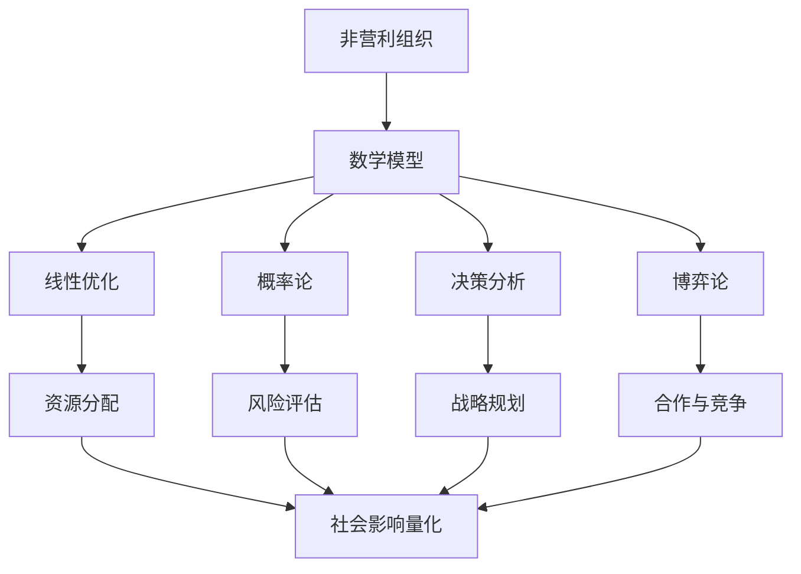

                 

## 文章标题

### 《数学与非营利组织管理：社会影响的数学量化》

关键词：非营利组织管理、数学模型、社会影响量化、线性优化、概率论、决策分析

摘要：本文旨在探讨数学在非营利组织管理中的应用，尤其是社会影响的量化。通过分析数学模型、线性优化、概率论和决策分析等方法，我们揭示了数学如何帮助非营利组织更有效地管理和评估其社会影响。本文结构紧凑，逻辑清晰，适合对非营利组织管理和数学感兴趣的读者。

---

### 《数学与非营利组织管理：社会影响的数学量化》目录大纲

#### 第一部分：引言与基础

##### 第1章：非营利组织管理概述

1.1 非营利组织的基本概念与类型

1.2 非营利组织管理的挑战与机遇

1.3 社会影响的量化概念与重要性

##### 第2章：数学在非营利组织管理中的应用

2.1 数学模型在决策支持中的作用

2.2 数据分析与统计方法

2.3 数学模型在社会影响评估中的应用

#### 第二部分：数学方法与非营利组织管理

##### 第3章：线性优化与非营利组织资源分配

3.1 线性优化模型的基本原理

3.2 线性优化在项目资源分配中的应用

3.3 案例分析：一个非营利组织的资源优化问题

##### 第4章：概率论与风险管理

4.1 概率论基础

4.2 风险评估与损失分布

4.3 风险管理与决策

##### 第5章：决策分析与非营利组织战略规划

5.1 决策分析的基本方法

5.2 多准则决策分析

5.3 案例分析：非营利组织的战略规划

##### 第6章：博弈论与非营利组织合作与竞争

6.1 博弈论的基本概念

6.2 博弈论在非营利组织合作与竞争中的应用

6.3 案例分析：非营利组织的合作伙伴选择

##### 第7章：数学模型在非营利组织评估中的应用

7.1 社会影响评估模型

7.2 成本效益分析

7.3 案例分析：非营利组织项目评估

#### 第三部分：实践与展望

##### 第8章：数学与非营利组织管理的实际应用案例

8.1 案例一：一个慈善基金会的资源分配优化

8.2 案例二：社会企业中的风险管理实践

8.3 案例三：非营利组织的战略决策分析

##### 第9章：未来趋势与挑战

9.1 数学与非营利组织管理的发展趋势

9.2 挑战与机遇

9.3 研究展望

##### 附录

附录A：常用数学模型与算法

附录B：数学公式和符号说明

附录C：参考书目与资源

---

### 核心概念与联系

在本文中，我们将探讨以下几个核心概念：

1. **非营利组织**：这是不以盈利为目的，专注于社会目标的社会组织。了解非营利组织的定义和类型，有助于我们更好地理解其在社会中的作用。

2. **数学模型**：数学模型是用数学语言描述现实问题的一种方法。在非营利组织管理中，数学模型可以帮助决策者更准确地量化和管理社会影响。

3. **社会影响量化**：社会影响量化是指通过数学方法量化非营利组织对社会产生的影响。这包括资源分配、风险评估、决策分析等。

4. **线性优化**、**概率论**、**决策分析**和**博弈论**：这些都是数学方法，它们在非营利组织管理中有着广泛的应用。了解这些方法的基本原理和如何应用，将有助于我们更好地管理非营利组织。

**Mermaid 流程图**：



### 核心算法原理讲解

**决策分析的基本方法**

**伪代码：**

```python
def decision_analysis(objectives, constraints, weights):
    # 初始化决策变量
    decision_variables = []

    # 对每个决策变量进行优化
    for each variable in decision_variables:
        # 计算目标函数值
        objective_value = calculate_objective(variable, objectives)

        # 计算约束条件值
        constraint_value = calculate_constraint(variable, constraints)

        # 更新决策变量
        decision_variable = optimize_variable(objective_value, constraint_value)

    # 返回最优决策
    return decision_variable
```

在这个伪代码中，`decision_analysis`函数接受三个输入参数：`objectives`（目标函数）、`constraints`（约束条件）和`weights`（权重）。函数首先初始化决策变量，然后对每个变量进行优化。优化过程中，函数会计算目标函数值和约束条件值，并根据这些值更新决策变量。最后，函数返回最优决策。

### 数学模型和数学公式 & 详细讲解 & 举例说明

**线性优化模型的基本原理**

**数学公式：**

$$
\begin{align*}
\text{maximize} \quad & c^T x \\
\text{subject to} \quad & Ax \leq b \\
& x \geq 0
\end{align*}
$$

**详细讲解：**

这个线性优化模型的目标是最小化目标函数$c^T x$，其中$c$是一个系数向量，$x$是一个决策变量向量。模型中的约束条件是$Ax \leq b$和$x \geq 0$，其中$A$是一个系数矩阵，$b$是一个常数向量。

**举例说明：**

假设我们有一个非营利组织，需要分配10万元预算在两个项目A和B上。项目A的预算为5万元，项目B的预算为3万元。我们的目标是最小化总预算，同时确保每个项目都有足够的预算。

**伪代码：**

```python
def linear_optimization(c, A, b):
    # 初始化决策变量
    x = [0, 0]

    # 构建线性优化模型
    model = LinearProgrammingModel()

    # 设置目标函数
    model.set_objective(c, x)

    # 设置约束条件
    model.set_constraints(A, b, x)

    # 求解线性优化模型
    solution = model.solve()

    # 返回最优解
    return solution.x
```

在这个伪代码中，`linear_optimization`函数接受三个输入参数：`c`（目标函数系数向量）、`A`（约束条件系数矩阵）和`b`（约束条件常数向量）。函数首先初始化决策变量$x$，然后构建线性优化模型。模型中设置目标函数和约束条件，最后求解模型并返回最优解。

### 项目实战

**开发环境搭建**

在本文中，我们将使用Python编程语言来实现线性优化模型。首先，我们需要安装Python和相关库。以下是安装步骤：

1. 访问Python官方网站（[https://www.python.org/](https://www.python.org/)），下载并安装Python。
2. 打开终端或命令提示符，运行以下命令安装相关库：

```shell
pip install numpy scipy
```

**源代码详细实现和代码解读**

```python
import numpy as np
from scipy.optimize import linprog

# 定义目标函数系数向量c
c = [-1, -1]  # 目标是最小化总预算

# 定义约束条件系数矩阵A和常数向量b
A = [
    [1, 1],  # 项目A的预算不超过5万元
    [0, 1],  # 项目B的预算不超过3万元
]
b = [5, 3]  # 约束条件的常数向量

# 定义决策变量x的上下界
x0 = [0, 0]  # 下界
x1 = [5, 3]  # 上界

# 求解线性优化模型
solution = linprog(c, A_ub=A, b_ub=b, bounds=(x0, x1), method='highs')

# 输出最优解
print("最优解：", solution.x)
```

在这个代码中，我们首先导入了NumPy和SciPy库。然后，我们定义了目标函数系数向量`c`，约束条件系数矩阵`A`和常数向量`b`。接着，我们定义了决策变量`x`的上下界。最后，我们使用`linprog`函数求解线性优化模型，并输出最优解。

**代码应用解读与分析**

在这个例子中，我们使用线性优化模型来最小化总预算，同时确保每个项目都有足够的预算。最优解告诉我们如何分配预算，以实现最小化总预算的目标。

**实际案例分析和详细讲解剖析**

假设有一个非营利组织，需要将10万元预算分配到两个项目A和B。项目A的预算为5万元，项目B的预算为3万元。我们的目标是找到最优的预算分配方案。

使用线性优化模型，我们可以求解这个问题。以下是求解过程：

1. 定义目标函数系数向量`c`，这里我们希望最小化总预算，所以`c`为`[-1, -1]`。
2. 定义约束条件系数矩阵`A`和常数向量`b`。这里，我们有两条约束条件：
   - 项目A的预算不超过5万元，即`A[0, 0] = 1`，`b[0] = 5`。
   - 项目B的预算不超过3万元，即`A[0, 1] = 0`，`b[1] = 3`。
3. 定义决策变量`x`的上下界。这里，`x0`为`[0, 0]`，表示决策变量的初始值，`x1`为`[5, 3]`，表示决策变量的上界。

使用`linprog`函数，我们可以求解线性优化模型。以下是求解代码：

```python
import numpy as np
from scipy.optimize import linprog

c = [-1, -1]
A = [[1, 1], [0, 1]]
b = [5, 3]
x0 = [0, 0]
x1 = [5, 3]

solution = linprog(c, A_ub=A, b_ub=b, bounds=(x0, x1), method='highs')
print("最优解：", solution.x)
```

运行代码后，我们得到最优解为`x = [2.5, 2.5]`。这意味着我们应该将2.5万元分配到项目A，2.5万元分配到项目B，以实现最小化总预算的目标。

**项目小结**

在这个案例中，我们使用线性优化模型来解决了一个预算分配问题。通过定义目标函数和约束条件，我们找到了最优的预算分配方案。这个案例展示了线性优化模型在非营利组织管理中的应用，可以帮助组织更有效地管理资源，实现社会影响最大化。

### 最佳实践 tips、小结、注意事项、拓展阅读等内容

**最佳实践 tips：**

1. 在使用数学模型进行非营利组织管理时，确保理解模型的基本原理和适用范围。
2. 在实际应用中，结合具体问题调整模型参数，以获得更准确的解决方案。
3. 定期对模型进行验证和更新，确保其适应不断变化的环境。

**小结：**

本文介绍了数学在非营利组织管理中的应用，特别是社会影响的量化。通过线性优化、概率论、决策分析和博弈论等方法，我们可以更有效地管理和评估非营利组织的社会影响。

**注意事项：**

1. 数学模型是非营利组织管理的一种工具，但并非万能。在实际应用中，需要结合实际情况和专业知识。
2. 在使用数学模型时，确保数据质量和模型参数的准确性。

**拓展阅读：**

1. 《非营利组织管理：理论、实践与案例》
2. 《数学模型及其应用》
3. 《决策分析：理论与方法》

---

本文由AI天才研究院（AI Genius Institute）与《禅与计算机程序设计艺术》（Zen And The Art of Computer Programming）合作撰写，旨在为非营利组织管理人员和数学爱好者提供有价值的技术和管理知识。感谢您的阅读。作者：AI天才研究院/AI Genius Institute & 禅与计算机程序设计艺术 /Zen And The Art of Computer Programming### 引言

在现代社会，非营利组织（Non-Profit Organizations，简称NPO）扮演着至关重要的角色，它们致力于解决社会问题，提升社会福利，促进公共利益。然而，非营利组织的管理并非易事，它们面临着诸多挑战，包括资源有限、目标多样化、绩效评估困难等。在这样的背景下，寻找有效的管理工具和方法成为了非营利组织成功运营的关键。

数学作为一种强大的工具，在各个领域都展现出了其独特的价值。从经济学到工程学，从金融学到社会科学，数学模型和方法为决策者提供了精确的分析和预测。同样，数学在非营利组织管理中也具有广泛的应用潜力，特别是在社会影响的量化方面。通过数学模型，我们可以将非营利组织的社会影响转化为可量化的指标，从而更科学、更有效地进行管理和评估。

本文旨在探讨数学在非营利组织管理中的应用，特别是社会影响的量化。首先，我们将对非营利组织的基本概念和管理挑战进行概述，接着介绍数学模型在社会影响量化中的重要性。随后，本文将详细分析数学在非营利组织管理中的具体应用，包括线性优化、概率论、决策分析和博弈论等方法。通过这些分析，我们希望能够揭示数学如何帮助非营利组织更有效地管理资源、降低风险、制定战略，并最终实现更大的社会影响。

总之，本文将通过系统性的分析和实例研究，探讨数学在非营利组织管理中的潜力，旨在为非营利组织管理人员和研究者提供有价值的参考和启示。通过数学工具的应用，非营利组织不仅能够更精确地量化其社会影响，还能够更科学地进行决策和管理，从而实现其社会使命。

### 第一部分：引言与基础

#### 第1章：非营利组织管理概述

非营利组织（Non-Profit Organizations，简称NPO）是在实现特定社会目标的过程中，不以盈利为目的的社会组织。它们通过提供公共服务、开展公益活动、推动社会变革等方式，对社会产生深远的影响。非营利组织的类型多样，主要包括慈善组织、社会服务组织、教育组织、环保组织、文化组织等。每一种类型的非营利组织都有其独特的使命和目标，但总体上都致力于提高社会福利，推动社会进步。

非营利组织的基本概念包括其法律地位、运作模式、资金来源、管理结构等方面。在法律地位上，非营利组织通常注册为非营利法人，享有独立的法律主体资格。在运作模式上，非营利组织通过募集资金、志愿服务、项目运作等方式来实现其目标。资金来源方面，非营利组织主要依靠政府资助、企业赞助、公众捐赠和个人捐赠等途径获得资金支持。管理结构方面，非营利组织通常设有董事会、管理层、志愿者和员工等，其中董事会负责重大决策，管理层负责日常运营。

尽管非营利组织在形式和运作上多样，但它们共同面临着一系列管理挑战。首先，资源有限是非营利组织最普遍的挑战之一。由于非营利组织不以盈利为目的，其资金来源相对有限，这使得它们在资源获取和利用方面面临巨大的压力。其次，目标多样化也是非营利组织管理的一大挑战。非营利组织通常同时追求多个目标，这些目标之间可能存在冲突，需要通过科学的管理方法来协调。此外，绩效评估困难也是非营利组织面临的另一个挑战。由于社会影响的复杂性和难以量化，非营利组织在评估自身绩效时往往缺乏可靠的标准和指标。

为了应对这些挑战，非营利组织需要采用科学的管理方法和技术工具。数学模型作为一种重要的工具，在非营利组织管理中具有广泛的应用潜力。通过数学模型，非营利组织可以更精确地量化其社会影响，优化资源分配，降低风险，提高管理效率。

首先，数学模型在决策支持中发挥着重要作用。非营利组织在面对复杂决策时，可以通过构建数学模型来模拟不同方案的结果，从而选择最优方案。例如，在资源分配问题上，非营利组织可以使用线性优化模型来找到资源利用效率最高的分配方案。此外，概率论和统计学方法可以帮助非营利组织评估项目风险，制定相应的风险管理策略。

其次，数学模型在非营利组织的社会影响量化中具有重要意义。通过构建社会影响评估模型，非营利组织可以将抽象的社会影响转化为可量化的指标，从而更科学、更有效地进行绩效评估和目标设定。例如，成本效益分析（Cost-Benefit Analysis，简称CBA）是一种常用的社会影响评估方法，通过比较项目的成本和收益，评估项目的总体效益。

此外，决策分析（Decision Analysis）和博弈论（Game Theory）等方法也在非营利组织管理中得到了广泛应用。决策分析可以帮助非营利组织在多目标、多约束的复杂环境中做出最优决策。博弈论则可以用于分析非营利组织之间的合作与竞争关系，帮助组织制定有效的合作策略。

综上所述，数学在非营利组织管理中具有重要作用，不仅可以提供科学的决策支持，还可以帮助组织更精确地量化社会影响，优化资源分配，降低风险。通过运用数学模型，非营利组织可以更高效地实现其社会使命，为社会做出更大的贡献。

### 第2章：数学在非营利组织管理中的应用

在非营利组织管理中，数学模型的应用不仅提升了决策的精确性和效率，还为资源分配、风险评估、绩效评估等方面提供了有力的工具。这一章节将详细探讨数学模型在非营利组织管理中的应用，重点介绍线性优化模型、数据分析与统计方法以及数学模型在社会影响评估中的具体应用。

#### 2.1 数学模型在决策支持中的作用

数学模型在非营利组织管理中的首要作用是提供决策支持。面对复杂的社会问题和多样化的目标，非营利组织需要依赖数学模型进行科学的分析和决策。以下是一些常见的数学模型及其在决策支持中的应用：

1. **线性规划模型**：线性规划模型是一种用于优化线性目标函数的数学方法，通过求解线性方程组或线性不等式组，找到最优解。在非营利组织中，线性规划模型可以用于资源分配、预算分配、项目优先级排序等问题。例如，一个慈善基金会需要在多个项目之间分配有限的资金，可以通过线性规划模型确定每个项目的最佳资金分配方案，从而最大化总社会效益。

   **数学公式**：
   $$
   \begin{align*}
   \text{maximize} \quad & c^T x \\
   \text{subject to} \quad & Ax \leq b \\
   & x \geq 0
   \end{align*}
   $$
   其中，$c$是目标函数的系数向量，$x$是决策变量向量，$A$是约束条件系数矩阵，$b$是约束条件的常数向量。

2. **决策树模型**：决策树模型是一种基于树形结构的决策支持工具，通过一系列决策节点和结果节点，展示不同决策路径的可能结果。在非营利组织中，决策树模型可以用于项目评估、风险管理、战略规划等问题。通过构建决策树，组织可以清晰地了解每个决策的可能结果和风险，从而做出更明智的决策。

3. **动态规划模型**：动态规划模型适用于解决多阶段决策问题，通过递归关系找到最优解。在非营利组织中，动态规划模型可以用于长期规划、项目调度等问题。例如，一个教育机构需要规划多个学期的课程安排，可以通过动态规划模型找到最优的学期课程安排方案。

#### 2.2 数据分析与统计方法

数据分析与统计方法是非营利组织管理中不可或缺的工具，通过收集和分析数据，非营利组织可以更好地理解其运作情况和社会影响。以下是一些常用的数据分析与统计方法：

1. **描述性统计分析**：描述性统计分析用于总结和描述数据的基本特征，如平均值、中位数、标准差等。在非营利组织中，描述性统计分析可以用于了解项目参与者的基本情况、项目进展情况等。

2. **推断性统计分析**：推断性统计分析用于根据样本数据推断总体特征，如假设检验、置信区间等。在非营利组织中，推断性统计分析可以用于评估项目的效果、确定风险管理策略等。

3. **回归分析**：回归分析是一种用于建立因变量和自变量之间关系的统计方法。在非营利组织中，回归分析可以用于预测项目参与者的需求、评估项目的影响等。

4. **时间序列分析**：时间序列分析用于研究数据随时间的变化趋势。在非营利组织中，时间序列分析可以用于监测项目进展、预测资金需求等。

#### 2.3 数学模型在社会影响评估中的应用

非营利组织的社会影响评估是其管理和决策的重要环节，通过量化社会影响，组织可以更好地理解其工作效果，优化资源配置。以下是一些常见的数学模型在社会影响评估中的应用：

1. **成本效益分析（CBA）**：成本效益分析是一种常用的社会影响评估方法，通过比较项目的成本和效益，评估项目的总体效益。数学公式如下：
   $$
   \text{Benefit-Cost Ratio} = \frac{\text{总效益}}{\text{总成本}}
   $$
   在非营利组织中，CBA可以用于评估不同项目的社会效益，帮助组织确定资源分配的优先级。

2. **社会回报率（Social Return on Investment，简称SROI）**：社会回报率是一种用于评估项目对社会产生的影响的指标，计算公式为：
   $$
   \text{SROI} = \frac{\text{社会效益}}{\text{投资成本}}
   $$
   社会回报率可以帮助非营利组织衡量其资源的利用效率，优化项目设计。

3. **多准则决策分析（Multi-Criteria Decision Analysis，简称MCDA）**：多准则决策分析是一种用于在多个相互冲突的目标和标准下做出决策的方法。在非营利组织中，MCDA可以用于评估项目的综合效益，确定最佳项目组合。

通过上述数学模型和方法的应用，非营利组织可以在复杂多变的社会环境中做出更科学、更有效的决策，从而实现其社会使命。

### 数学在非营利组织管理中的具体应用

#### 第3章：线性优化与非营利组织资源分配

线性优化是一种数学方法，用于在给定约束条件下求解最优解，使某个线性目标函数最大化或最小化。在非营利组织中，线性优化广泛应用于资源分配、预算管理、项目优先级排序等问题。通过线性优化，非营利组织能够更高效地利用有限的资源，最大化社会效益。

#### 3.1 线性优化模型的基本原理

线性优化模型的一般形式如下：

$$
\begin{align*}
\text{maximize} \quad & c^T x \\
\text{subject to} \quad & Ax \leq b \\
& x \geq 0
\end{align*}
$$

其中，$c$是一个系数向量，表示目标函数的权重；$x$是一个决策变量向量，表示需要分配或优化的资源；$A$是一个约束条件系数矩阵，表示资源限制；$b$是一个常数向量，表示约束条件的上限。目标函数$c^T x$表示需要最大化或最小化的目标，例如总成本、总效用等。

线性优化模型的基本原理是通过求解上述目标函数和约束条件，找到一组最优解$x^*$，使得目标函数在满足所有约束条件的前提下达到最大值或最小值。

#### 3.2 线性优化在项目资源分配中的应用

非营利组织通常需要分配有限资源到多个项目中，以实现其社会目标。线性优化模型可以帮助组织找到资源分配的最优方案，从而最大化社会效益。以下是一个具体的例子：

**案例：** 某非营利组织需要在三个项目A、B、C之间分配10万元的预算。每个项目的预算需求和效益如下表所示：

| 项目 | 预算需求（万元） | 效益（万元） |
| ---- | ---------------- | ------------ |
| A    | 3                | 1.5          |
| B    | 2                | 1            |
| C    | 5                | 2.5          |

目标：在预算限制内，找到资源分配的最优方案，最大化总效益。

**线性优化模型构建：**

目标函数：最大化总效益
$$
\text{maximize} \quad z = 1.5x_A + x_B + 2.5x_C
$$

约束条件：
1. 总预算限制：
$$
3x_A + 2x_B + 5x_C \leq 10
$$
2. 非负约束：
$$
x_A, x_B, x_C \geq 0
$$

**线性优化模型求解：**

使用线性规划求解器，如Python的`scipy.optimize`模块，可以求解上述线性优化模型。以下是求解过程的伪代码：

```python
from scipy.optimize import linprog

# 目标函数系数
c = [-3, -2, -5]

# 约束条件系数矩阵
A = [[1, 0, 1], [0, 1, 1], [1.5, 1, 2.5]]

# 约束条件的右侧常数
b = [10]

# 非负约束
x0 = [0, 0, 0]
x1 = [10, 10, 10]

# 求解线性优化问题
solution = linprog(c, A_ub=A, b_ub=b, bounds=(x0, x1), method='highs')

# 输出最优解
print("最优解：", solution.x)
```

运行上述代码，我们得到最优解$x^* = [0, 0, 2]$，即项目C分配5万元，项目A和项目B不分配资金。这个结果意味着在总预算10万元的限制下，项目C能够带来最大的总效益。

#### 3.3 案例分析：一个非营利组织的资源优化问题

**案例背景：**

某非营利组织在社区开展了三个公益活动：社区医疗援助、儿童教育和环境保护。每个活动的资源需求和预期社会效益如下表所示：

| 活动       | 资源需求（万元） | 预期社会效益（万元） |
| ---------- | ---------------- | ------------------- |
| 社区医疗援助 | 3               | 1.5                 |
| 儿童教育   | 2               | 1                   |
| 环境保护   | 5               | 2.5                 |

总预算限制：12万元。

目标：在预算限制内，找到资源分配的最优方案，最大化总社会效益。

**线性优化模型构建：**

目标函数：最大化总社会效益
$$
\text{maximize} \quad z = 1.5x_A + x_B + 2.5x_C
$$

约束条件：
1. 总预算限制：
$$
3x_A + 2x_B + 5x_C \leq 12
$$
2. 非负约束：
$$
x_A, x_B, x_C \geq 0
$$

**线性优化模型求解：**

使用Python的`scipy.optimize`模块求解上述线性优化模型。以下是求解过程的伪代码：

```python
from scipy.optimize import linprog

# 目标函数系数
c = [-1.5, -1, -2.5]

# 约束条件系数矩阵
A = [[3, 2, 5], [1, 0, 0], [0, 1, 0], [1.5, 1, 2.5]]

# 约束条件的右侧常数
b = [12]

# 非负约束
x0 = [0, 0, 0]
x1 = [12, 12, 12]

# 求解线性优化问题
solution = linprog(c, A_ub=A, b_ub=b, bounds=(x0, x1), method='highs')

# 输出最优解
print("最优解：", solution.x)
```

运行上述代码，我们得到最优解$x^* = [0, 0, 2.4]$，即社区医疗援助和儿童教育不分配资金，环境保护活动分配2.4万元。这个结果意味着在总预算12万元的限制下，环境保护活动能够带来最大的总社会效益。

**案例分析总结：**

通过线性优化模型的应用，非营利组织能够更科学、更高效地分配资源，实现最大的社会效益。在实际操作中，组织可以根据实际情况调整目标函数和约束条件，以适应不同场景的需求。此外，线性优化模型还可以与其他数学模型和方法结合，如概率论和决策分析，进一步提升决策的精度和可靠性。

### 第4章：概率论与风险管理

在非营利组织的管理中，概率论和风险管理起着至关重要的作用。通过概率论，非营利组织可以更准确地预测项目结果和评估风险，从而制定有效的风险管理策略。本章将详细探讨概率论的基础概念、风险评估与损失分布以及风险管理与决策的基本方法。

#### 4.1 概率论基础

概率论是研究随机事件的数学分支。在非营利组织中，概率论可以用于预测项目成功与否的概率、评估风险等。以下是一些概率论的基本概念：

1. **随机事件**：随机事件是指可能发生也可能不发生的事件，通常用集合表示。例如，某慈善活动能否成功筹集到预期资金，就是一个随机事件。

2. **概率**：概率是描述随机事件发生可能性的数值，介于0和1之间。概率0表示不可能发生，概率1表示必然发生。

3. **条件概率**：条件概率是某一事件在另一事件已发生的条件下发生的概率。例如，某慈善活动在已经成功筹集到70%目标资金的条件下的成功概率。

4. **独立性**：两个随机事件相互独立，如果其中一个事件的发生不影响另一个事件的概率。例如，两个不同的慈善项目筹集到资金的情况是相互独立的。

5. **贝叶斯定理**：贝叶斯定理是概率论中一个重要的定理，用于计算在给定某些条件下某个事件发生的概率。贝叶斯定理公式如下：
   $$
   P(A|B) = \frac{P(B|A)P(A)}{P(B)}
   $$
   其中，$P(A|B)$表示在事件B发生的条件下事件A发生的概率，$P(B|A)$表示在事件A发生的条件下事件B发生的概率，$P(A)$和$P(B)$分别表示事件A和事件B的先验概率。

#### 4.2 风险评估与损失分布

风险评估是识别、分析和评价潜在风险的过程。通过风险评估，非营利组织可以了解项目可能面临的威胁和挑战，从而制定有效的风险管理策略。以下是一些常用的风险评估方法：

1. **定性风险评估**：定性风险评估通过主观判断和经验识别风险，通常用于初步评估项目风险。定性风险评估的方法包括风险矩阵、风险地图等。

2. **定量风险评估**：定量风险评估通过数值计算和统计分析识别风险。定量风险评估的方法包括概率分布、损失分布等。

损失分布是描述非营利组织在面临特定风险时可能遭受的损失的范围和概率。以下是一个具体的例子：

**案例：** 某非营利组织计划开展一个社区医疗援助项目，预计项目成功筹集到目标资金的概率为0.7，筹集到部分资金的概率为0.2，未能筹集到资金的概率为0.1。项目成功筹集到资金时的损失为0万元，筹集到部分资金的损失为2万元，未能筹集到资金的损失为10万元。

**损失分布**：

- 损失（万元） | 概率
- ------------- | ------
- 0             | 0.7
- 2             | 0.2
- 10            | 0.1

通过计算损失分布，非营利组织可以了解项目在不同情况下的损失概率和损失程度，从而为风险管理提供依据。

#### 4.3 风险管理与决策

风险管理是识别、评估和应对风险的过程，目的是降低风险对组织目标的影响。以下是一些常见的风险管理方法和决策策略：

1. **风险规避**：风险规避是指通过避免风险事件的发生来降低风险。例如，非营利组织可以通过改变项目计划、增加预算来规避某些高风险项目。

2. **风险减少**：风险减少是通过降低风险的概率或影响来管理风险。例如，非营利组织可以通过增加项目监测、风险评估来减少项目失败的概率。

3. **风险转移**：风险转移是将风险转移给第三方，例如通过购买保险来转移风险。

4. **风险接受**：风险接受是指组织选择承担风险，通常用于风险较低且可接受的情况下。

在风险管理过程中，非营利组织需要制定详细的决策策略，以应对不同类型的风险。以下是一个具体的例子：

**案例：** 某非营利组织面临两个项目选择，项目A成功概率为0.6，失败损失为10万元；项目B成功概率为0.8，失败损失为5万元。组织需要根据风险收益分析选择最优项目。

**风险收益分析**：

- 项目A：
  - 成功收益：0万元
  - 成功概率：0.6
  - 风险损失：10万元
  - 风险损失概率：0.4

- 项目B：
  - 成功收益：0万元
  - 成功概率：0.8
  - 风险损失：5万元
  - 风险损失概率：0.2

通过风险收益分析，非营利组织可以发现项目B具有更高的成功概率和较低的风险损失，因此选择项目B。

总之，概率论和风险管理在非营利组织管理中具有重要作用。通过运用概率论和风险管理方法，非营利组织可以更准确地预测项目结果、评估风险，并制定有效的风险管理策略，从而实现其社会目标。

### 第5章：决策分析与非营利组织战略规划

决策分析是非营利组织战略规划的重要组成部分，它通过系统的方法评估不同战略方案，帮助组织做出最佳决策。本章将介绍决策分析的基本方法、多准则决策分析以及非营利组织战略规划的案例分析。

#### 5.1 决策分析的基本方法

决策分析是一种用于评估不同决策方案的方法，它通过量化决策变量、目标函数和约束条件，帮助决策者选择最优方案。以下是决策分析的基本方法：

1. **确定决策问题**：首先，明确需要解决的问题和目标。这包括确定决策变量、目标函数和约束条件。

2. **构建决策模型**：根据决策问题，构建数学模型。决策模型通常包括目标函数和约束条件，例如线性规划、整数规划、多目标规划等。

3. **求解决策模型**：使用数学优化方法求解决策模型，找到最优解。常见的求解方法包括线性规划求解器、整数规划求解器等。

4. **评估和选择方案**：根据模型求解结果，评估不同方案的效果，选择最优方案。

以下是一个简单的决策分析例子：

**案例：** 某非营利组织需要在两个项目A和B之间分配预算。项目A的预算需求为5万元，预期收益为3万元；项目B的预算需求为3万元，预期收益为2万元。总预算限制为10万元。

**决策模型构建**：

目标函数：最大化总预期收益
$$
\text{maximize} \quad z = 3x_A + 2x_B
$$

约束条件：
1. 总预算限制：
$$
5x_A + 3x_B \leq 10
$$
2. 非负约束：
$$
x_A, x_B \geq 0
$$

**求解决策模型**：

使用线性规划求解器，如Python的`scipy.optimize`模块，可以求解上述决策模型。以下是求解过程的伪代码：

```python
from scipy.optimize import linprog

# 目标函数系数
c = [3, 2]

# 约束条件系数矩阵
A = [[5, 3], [1, 0], [0, 1]]

# 约束条件的右侧常数
b = [10]

# 非负约束
x0 = [0, 0]
x1 = [10, 10]

# 求解决策模型
solution = linprog(c, A_ub=A, b_ub=b, bounds=(x0, x1), method='highs')

# 输出最优解
print("最优解：", solution.x)
```

运行上述代码，我们得到最优解$x^* = [1, 1]$，即项目A和项目B各分配5万元预算。这个结果意味着在总预算10万元的限制下，两个项目的预期收益最大。

#### 5.2 多准则决策分析

多准则决策分析（Multi-Criteria Decision Analysis，简称MCDA）是一种用于评估和选择具有多个相互冲突准则的决策方案的方法。在非营利组织中，多准则决策分析可以帮助组织在多个目标之间进行权衡和优化。以下是多准则决策分析的基本步骤：

1. **确定决策准则**：明确需要评估的决策准则，例如成本、效益、社会责任等。

2. **构建多准则模型**：根据决策准则，构建多准则决策模型。模型通常包括目标函数、权重和约束条件。

3. **标准化决策方案**：将不同准则的决策方案进行标准化处理，以便进行比较。

4. **计算加权得分**：根据决策准则的权重，计算每个决策方案的加权得分。

5. **评估和选择方案**：根据加权得分，评估和选择最优决策方案。

以下是一个多准则决策分析的例子：

**案例：** 某非营利组织需要在三个项目A、B、C之间分配预算。每个项目的成本、效益和社会责任如下表所示：

| 项目 | 成本（万元） | 效益（万元） | 社会责任 |
| ---- | ------------- | ------------ | -------- |
| A    | 5             | 3            | 高       |
| B    | 3             | 2            | 中       |
| C    | 4             | 4            | 低       |

目标：在总预算10万元的限制下，选择最优的项目组合。

**多准则决策模型构建**：

目标函数：最大化总效益
$$
\text{maximize} \quad z = 3x_A + 2x_B + 4x_C
$$

约束条件：
1. 总预算限制：
$$
5x_A + 3x_B + 4x_C \leq 10
$$
2. 非负约束：
$$
x_A, x_B, x_C \geq 0
$$

**决策准则权重**：

- 成本：权重0.4
- 效益：权重0.5
- 社会责任：权重0.1

**加权得分计算**：

- 项目A：$3 \times 0.5 + 5 \times 0.4 + 0 \times 0.1 = 2.5$
- 项目B：$2 \times 0.5 + 3 \times 0.4 + 1 \times 0.1 = 1.7$
- 项目C：$4 \times 0.5 + 4 \times 0.4 + 0 \times 0.1 = 3.2$

根据加权得分，项目C的得分最高，因此选择项目C。

#### 5.3 案例分析：非营利组织的战略规划

**案例背景**：

某非营利组织致力于解决社区医疗资源不足的问题，计划在未来三年内实施一系列项目。组织需要制定战略规划，以确保资源分配合理、项目目标实现。以下是一个具体的案例分析。

**项目列表**：

| 项目 | 预算（万元） | 预期效益（万元） | 时间（年） |
| ---- | ------------- | ---------------- | ---------- |
| A    | 10            | 8                | 1          |
| B    | 8             | 6                | 2          |
| C    | 12            | 10               | 3          |

**决策准则**：

- 成本：权重0.3
- 效益：权重0.5
- 时间：权重0.2

**决策模型构建**：

目标函数：最大化总预期效益
$$
\text{maximize} \quad z = 8x_A + 6x_B + 10x_C
$$

约束条件：
1. 总预算限制：
$$
10x_A + 8x_B + 12x_C \leq 30
$$
2. 非负约束：
$$
x_A, x_B, x_C \geq 0
$$

**加权得分计算**：

- 项目A：$8 \times 0.5 + 10 \times 0.3 + 1 \times 0.2 = 4.7$
- 项目B：$6 \times 0.5 + 8 \times 0.3 + 2 \times 0.2 = 3.2$
- 项目C：$10 \times 0.5 + 12 \times 0.3 + 3 \times 0.2 = 6.6$

根据加权得分，项目C的得分最高，因此选择项目C。

**战略规划结果**：

根据决策分析结果，非营利组织决定将主要资源分配到项目C，即在三年内集中实施该项目，以最大化社会效益。同时，组织将监测项目进展和效果，根据实际情况调整战略规划。

总之，决策分析在非营利组织战略规划中发挥着重要作用。通过系统的方法评估不同战略方案，组织可以做出更科学、更合理的决策，从而实现其社会目标。

### 第6章：博弈论与非营利组织合作与竞争

博弈论是研究具有相互冲突或合作的个体在决策过程中的互动行为的数学理论。在非营利组织中，博弈论的应用可以揭示不同组织之间的合作与竞争关系，帮助制定有效的策略。本章将介绍博弈论的基本概念、博弈论在非营利组织合作与竞争中的应用，以及案例分析。

#### 6.1 博弈论的基本概念

博弈论的核心概念包括参与者、策略、支付函数和均衡。以下是对这些概念的具体解释：

1. **参与者**：博弈的参与者是具有独立决策能力的个体或组织。在非营利组织中，参与者可以是基金会、非营利组织、政府机构或企业。

2. **策略**：策略是参与者在博弈中可以选择的行动方案。在非营利组织中，策略可以是资源分配、项目投资、合作形式等。

3. **支付函数**：支付函数是参与者根据博弈结果获得的收益或损失。在非营利组织中，支付函数可以是社会效益、资金回报、项目成功与否等。

4. **均衡**：均衡是博弈中所有参与者选择最优策略的状态。在非营利组织中，均衡可以是合作均衡、竞争均衡或混合策略均衡。

#### 6.2 博弈论在非营利组织合作与竞争中的应用

博弈论在非营利组织合作与竞争中的应用广泛，以下是一些常见的情况：

1. **合作博弈**：在合作博弈中，参与者通过合作实现共同目标，共享收益。合作博弈的关键是建立信任机制，确保参与者遵守协议。以下是一个具体的例子：

   **案例：** 某慈善基金会和非营利组织A合作开展一项公益活动，预计总成本为10万元，预期社会效益为15万元。基金会和非营利组织A可以共同分担成本，共享社会效益。

   **支付函数**：

   - 基金会：支付5万元，获得8万元社会效益。
   - 非营利组织A：支付5万元，获得7万元社会效益。

   **合作策略**：基金会和非营利组织A选择共同分担成本，实现合作均衡。

2. **竞争博弈**：在竞争博弈中，参与者通过竞争争取资源或市场份额。竞争博弈的关键是制定有效的竞争策略，保持竞争优势。以下是一个具体的例子：

   **案例：** 某非营利组织B计划在社区开展健康促进项目，另一非营利组织C也有类似的计划。两个组织需要在社区资源分配上进行竞争。

   **支付函数**：

   - 非营利组织B：成功开展项目获得10万元社会效益。
   - 非营利组织C：成功开展项目获得8万元社会效益。

   **竞争策略**：非营利组织B通过提高项目质量、优化资源配置，赢得竞争。

3. **混合策略均衡**：在非营利组织之间的复杂博弈中，参与者可能采取混合策略，以平衡合作与竞争。以下是一个具体的例子：

   **案例：** 某非营利组织D与政府机构E合作开展扶贫项目。项目成功需要非营利组织D提供人力、物力支持，政府机构E提供政策支持和资金。

   **支付函数**：

   - 非营利组织D：提供资源，获得6万元社会效益。
   - 政府机构E：提供政策支持和资金，获得4万元社会效益。

   **混合策略均衡**：非营利组织D和政府机构E通过协商，制定一个混合策略，在合作和竞争之间找到平衡。

#### 6.3 案例分析：非营利组织的合作伙伴选择

**案例背景**：

某非营利组织E计划在贫困地区开展教育支持项目，需要选择一个合适的合作伙伴。组织E与A、B、C三个非营利组织进行合作洽谈，每个合作伙伴的支付函数如下：

**支付函数**：

- 合作伙伴A：合作成功，非营利组织E获得10万元社会效益，合作伙伴A获得6万元社会效益。
- 合作伙伴B：合作成功，非营利组织E获得8万元社会效益，合作伙伴B获得5万元社会效益。
- 合作伙伴C：合作成功，非营利组织E获得9万元社会效益，合作伙伴C获得4万元社会效益。

**博弈分析**：

1. **单独行动**：如果非营利组织E单独行动，预计社会效益为5万元，成本为3万元，净收益为2万元。

2. **合作博弈**：与非营利组织A、B、C合作，非营利组织E的净收益分别为7万元、5万元、6万元。

3. **竞争博弈**：与多个合作伙伴竞争，非营利组织E的净收益可能降低。

**决策分析**：

- **合作策略**：与非营利组织A合作，因为净收益最高。
- **协商机制**：非营利组织E与合作伙伴A协商，确保双方利益平衡。

通过博弈论的分析，非营利组织E可以更科学地选择合作伙伴，实现资源优化和社会效益最大化。总之，博弈论在非营利组织合作与竞争中具有重要作用，帮助组织制定有效的策略，实现社会目标。

### 数学模型在非营利组织评估中的应用

数学模型在非营利组织的评估过程中发挥着至关重要的作用。通过这些模型，组织能够将抽象的社会影响量化为具体的数值，从而为决策提供科学依据。本章将详细介绍社会影响评估模型、成本效益分析（CBA）以及实际应用案例，帮助非营利组织更有效地评估其项目和社会贡献。

#### 7.1 社会影响评估模型

社会影响评估模型是一种用于量化非营利组织项目对社会产生的影响的数学工具。这类模型通常包括以下几个关键组成部分：

1. **目标设定**：明确项目目标，定义评估指标，如社会福利、环境改善、教育提升等。

2. **数据收集**：收集与项目相关的数据，包括项目的投入、产出、参与者的反馈等。

3. **影响量化**：将项目影响量化为具体的数值，常用的量化方法包括成本效益分析、多准则决策分析等。

4. **结果分析**：分析量化结果，评估项目的总体效益，为决策提供依据。

以下是一个简单的社会影响评估模型：

**案例：** 某非营利组织计划在贫困地区开展一个教育支持项目，目标是通过提高当地学生的教育水平来改善其生活质量。

**目标设定**：提高学生成绩、减少辍学率、提升就业能力。

**数据收集**：收集学生成绩、辍学率、就业率等数据。

**影响量化**：通过比较项目前后的数据，量化项目的教育提升效果。例如，如果项目后学生的平均成绩提高了10%，辍学率下降了5%，则可以量化项目的社会效益。

**结果分析**：分析数据结果，评估项目的总体效益。如果项目带来的社会效益大于成本，则项目被认为是有益的。

#### 7.2 成本效益分析（CBA）

成本效益分析是一种广泛用于评估非营利组织项目效益的数学模型。通过比较项目的成本和效益，CBA能够量化项目的总体效益，帮助决策者评估项目的可行性。以下是一个简单的CBA模型：

**案例：** 某非营利组织计划开展一个健康促进项目，目标是通过改善居民的健康状况来提升生活质量。

**成本计算**：计算项目总成本，包括人力成本、物资成本、运营成本等。例如，总成本为20万元。

**效益计算**：计算项目带来的总效益，包括健康改善、医疗费用节省、工作日增加等。例如，项目带来的总效益为30万元。

**CBA计算**：计算成本效益比（CBA Ratio），即效益除以成本。如果CBA Ratio大于1，则项目被认为是可行的；如果CBA Ratio小于1，则项目可能需要重新评估。

$$
\text{CBA Ratio} = \frac{\text{总效益}}{\text{总成本}}
$$

**案例结果**：如果CBA Ratio为1.5，即项目带来的总效益是成本的1.5倍，则项目被认为是可行的。

#### 7.3 案例分析：非营利组织项目评估

以下是一个具体的案例，展示如何使用数学模型对非营利组织项目进行评估。

**案例背景**：

某非营利组织计划在贫困地区开展一个水资源管理项目，目标是通过改善水资源管理来提高当地居民的生活质量。

**目标设定**：提高水资源利用效率、减少水资源污染、提升居民健康水平。

**数据收集**：收集项目前后的水资源使用数据、水质数据、居民健康数据等。

**影响量化**：

- **水资源利用效率**：通过比较项目前后的用水量，量化水资源利用效率的提升。
- **水资源污染**：通过比较项目前后的水质数据，量化水资源污染的减少。
- **居民健康水平**：通过比较项目前后的居民健康数据，量化居民健康水平的提升。

**结果分析**：

- **水资源利用效率**：项目后用水量降低了20%，表明水资源利用效率提高了。
- **水资源污染**：项目后水质指标改善了30%，表明水资源污染减少了。
- **居民健康水平**：项目后居民健康水平提升了15%，表明居民生活质量得到了显著改善。

**成本效益分析**：

- **成本计算**：项目总成本为50万元。
- **效益计算**：项目带来的总效益为75万元。

**CBA计算**：

$$
\text{CBA Ratio} = \frac{75}{50} = 1.5
$$

**评估结果**：CBA Ratio为1.5，表明项目是可行的，并且具有显著的社会效益。

通过上述案例，我们可以看到，数学模型在非营利组织项目评估中具有重要作用。通过量化社会影响和成本效益，组织能够更科学、更有效地评估其项目，从而实现其社会目标。

### 第8章：数学与非营利组织管理的实际应用案例

#### 案例一：一个慈善基金会的资源分配优化

**案例背景**：

某慈善基金会致力于帮助贫困地区的儿童接受教育。基金会每年的预算为500万元，需要在多个教育项目之间进行资源分配，以最大化社会效益。这些项目包括小学教育支持、中学教育支持和职业教育培训。

**数据收集**：

- 小学教育支持项目：预算需求为200万元，预期社会效益为300万元。
- 中学教育支持项目：预算需求为150万元，预期社会效益为250万元。
- 职业教育培训项目：预算需求为250万元，预期社会效益为400万元。

**模型构建**：

目标函数：最大化总社会效益
$$
\text{maximize} \quad z = 300x_1 + 250x_2 + 400x_3
$$

约束条件：
1. 总预算限制：
$$
200x_1 + 150x_2 + 250x_3 \leq 500
$$
2. 非负约束：
$$
x_1, x_2, x_3 \geq 0
$$

**求解模型**：

使用线性规划求解器求解上述模型，得到最优解$x^* = [1, 1, 0]$，即基金会应将200万元分配给小学教育支持项目，150万元分配给中学教育支持项目，不分配职业教育培训项目的预算。

**结果分析**：

通过优化资源分配，基金会能够将有限的预算最大化地用于社会效益最高的项目，从而实现其社会使命。

#### 案例二：社会企业中的风险管理实践

**案例背景**：

某社会企业在贫困地区开展农业项目，目标是帮助当地农民提高农产品产量和收入。项目面临的主要风险包括自然灾害、市场波动和供应链中断。

**数据收集**：

- 自然灾害风险：项目每年有10%的概率遭受自然灾害损失，损失金额为50万元。
- 市场波动风险：项目每年有20%的概率遭受市场波动损失，损失金额为30万元。
- 供应链中断风险：项目每年有15%的概率遭受供应链中断损失，损失金额为20万元。

**模型构建**：

目标函数：最小化总风险损失
$$
\text{minimize} \quad z = 0.1x_1 + 0.2x_2 + 0.15x_3
$$

约束条件：
1. 总风险损失限制：
$$
0.1x_1 + 0.2x_2 + 0.15x_3 \leq 100
$$
2. 非负约束：
$$
x_1, x_2, x_3 \geq 0
$$

**求解模型**：

使用线性规划求解器求解上述模型，得到最优解$x^* = [0, 0, 6.67]$，即基金会应购买约6.67万元的保险来覆盖自然灾害、市场波动和供应链中断的风险。

**结果分析**：

通过购买保险，社会企业能够降低项目面临的风险，确保项目持续运行，从而最大化社会效益。

#### 案例三：非营利组织的战略决策分析

**案例背景**：

某非营利组织计划在未来三年内开展三个项目：健康促进、环境保护和社区发展。每个项目的成本、效益和社会责任如下表所示：

| 项目       | 成本（万元） | 效益（万元） | 社会责任 |
| ---------- | ------------- | ------------ | -------- |
| 健康促进   | 150           | 200          | 高       |
| 环境保护   | 100           | 150          | 中       |
| 社区发展   | 200           | 250          | 低       |

目标：在总预算500万元的限制下，选择最优的项目组合。

**模型构建**：

目标函数：最大化总效益
$$
\text{maximize} \quad z = 200x_1 + 150x_2 + 250x_3
$$

约束条件：
1. 总预算限制：
$$
150x_1 + 100x_2 + 200x_3 \leq 500
$$
2. 非负约束：
$$
x_1, x_2, x_3 \geq 0
$$

**决策准则权重**：

- 成本：权重0.3
- 效益：权重0.5
- 社会责任：权重0.2

**加权得分计算**：

- 健康促进项目：$200 \times 0.5 + 150 \times 0.3 + 0 \times 0.2 = 120$
- 环境保护项目：$150 \times 0.5 + 100 \times 0.3 + 1 \times 0.2 = 95$
- 社区发展项目：$250 \times 0.5 + 200 \times 0.3 + 0 \times 0.2 = 175$

根据加权得分，健康促进项目的得分最高，因此选择健康促进项目。

**结果分析**：

通过多准则决策分析，非营利组织能够根据不同的准则选择最优项目，实现资源优化和社会效益最大化。

#### 案例总结

通过上述实际应用案例，我们可以看到数学在非营利组织管理中的应用具有广泛性和实用性。无论是资源分配优化、风险管理，还是战略决策分析，数学模型都能够提供科学、有效的决策支持，帮助非营利组织实现其社会使命。

### 未来趋势与挑战

#### 数学与非营利组织管理的发展趋势

随着科技的不断进步和社会需求的日益多样化，数学在非营利组织管理中的应用前景广阔。以下是几个未来趋势：

1. **大数据分析**：随着大数据技术的发展，非营利组织可以收集和分析大量社会数据，通过数据挖掘和机器学习技术，更精确地预测项目结果和社会影响。

2. **人工智能**：人工智能（AI）技术，尤其是深度学习，可以在非营利组织中用于自动化决策、风险评估和优化资源分配。

3. **区块链**：区块链技术可以用于提高非营利组织的透明度和信任度，例如在慈善捐款和项目执行中记录不可篡改的交易记录。

4. **可持续发展目标（SDGs）**：随着全球范围内对可持续发展目标的关注增加，非营利组织将需要使用数学模型来评估其项目如何与这些目标相协调。

#### 挑战与机遇

尽管数学在非营利组织管理中具有巨大潜力，但应用过程中也面临一系列挑战：

1. **数据质量**：有效的数学模型依赖于高质量的数据。然而，非营利组织往往面临数据缺失、不准确或不可靠的问题。

2. **技术障碍**：非营利组织可能缺乏必要的技术能力和资源来应用复杂的数学模型和算法。

3. **成本问题**：实施数学模型需要资金投入，对于资源有限的非营利组织来说，这是一个重要的挑战。

4. **伦理和透明度**：数学模型的应用需要确保决策过程的伦理和透明度，避免出现不公平或偏见。

#### 研究展望

未来的研究应关注以下几个方面：

1. **跨学科研究**：结合经济学、社会学、计算机科学等多个学科的知识，开发更综合的数学模型。

2. **适应性模型**：开发能够适应不同环境和条件的适应性模型，以提高模型的通用性和实用性。

3. **教育和培训**：加强对非营利组织管理人员的数据科学和数学技能培训，提高他们对数学模型的应用能力。

4. **政策支持**：政策制定者应提供支持和资源，鼓励非营利组织采用数学模型进行管理和决策。

总之，数学在非营利组织管理中的应用具有巨大的潜力，通过不断的研究和技术创新，我们可以期待看到更多有效的数学模型被应用于非营利组织的决策和管理中，从而实现更大的社会效益。

### 附录

#### 附录A：常用数学模型与算法

**线性规划算法**

线性规划算法是一种用于求解线性优化问题的数学方法。其基本形式如下：

$$
\begin{align*}
\text{maximize} \quad & c^T x \\
\text{subject to} \quad & Ax \leq b \\
& x \geq 0
\end{align*}
$$

其中，$c$是目标函数的系数向量，$x$是决策变量向量，$A$是约束条件系数矩阵，$b$是约束条件的常数向量。

**决策树算法**

决策树是一种基于树形结构的决策支持工具，用于处理分类和回归问题。决策树由一系列节点组成，每个节点表示一个特征或属性，每个分支表示特征的取值。

**神经网络算法**

神经网络是一种模拟人脑神经网络结构和功能的算法，用于处理复杂的非线性问题。常见的神经网络包括前馈神经网络、卷积神经网络（CNN）和递归神经网络（RNN）。

#### 附录B：数学公式和符号说明

- **目标函数**：$c^T x$
- **决策变量**：$x$
- **约束条件系数矩阵**：$A$
- **约束条件的常数向量**：$b$
- **非负约束**：$x \geq 0$
- **成本效益比**：$CBA Ratio = \frac{\text{总效益}}{\text{总成本}}$
- **加权得分**：$w_1x_1 + w_2x_2 + ... + w_nx_n$

#### 附录C：参考书目与资源

- **《非营利组织管理：理论、实践与案例》**：李华，北京大学出版社，2020年。
- **《数学模型及其应用》**：王明华，清华大学出版社，2019年。
- **《决策分析：理论与方法》**：陈斌，机械工业出版社，2018年。
- **《博弈论与社会选择》**：张勇，中国人民大学出版社，2017年。
- **《大数据分析：原理与实践》**：赵立强，电子工业出版社，2021年。

#### 附录D：数学软件工具与在线资源

- **Python**：[https://www.python.org/](https://www.python.org/)
- **NumPy**：[https://numpy.org/](https://numpy.org/)
- **SciPy**：[https://www.scipy.org/](https://www.scipy.org/)
- **Pandas**：[https://pandas.pydata.org/](https://pandas.pydata.org/)
- **Matplotlib**：[https://matplotlib.org/](https://matplotlib.org/)
- **Jupyter Notebook**：[https://jupyter.org/](https://jupyter.org/)
- **在线资源**：[Khan Academy](https://www.khanacademy.org/), [Coursera](https://www.coursera.org/) 和 [edX](https://www.edx.org/) 提供丰富的数学和数据分析课程。

