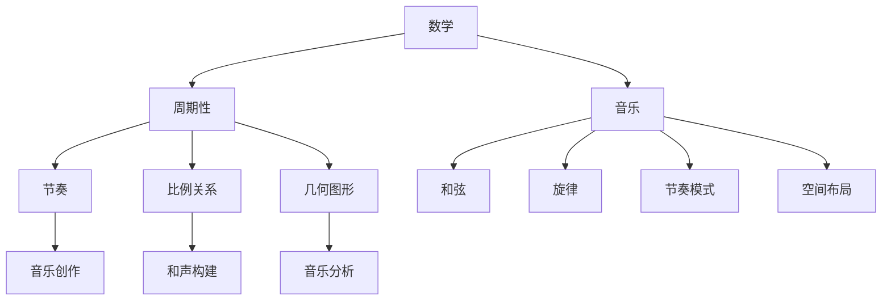

                 

### 文章标题

# 数学与音乐的和谐共鸣

---

关键词：数学、音乐、哲学、理论联系、实践应用、教育、现代发展

摘要：本文旨在探讨数学与音乐之间的紧密联系，通过哲学探讨、理论联系、实践应用、教育以及现代发展等多个维度，揭示数学在音乐中的广泛应用以及音乐在数学证明中的辅助作用。文章首先介绍数学与音乐的基本概念，然后分析它们之间的核心联系，最后讨论数学与音乐教育的意义及其在现代社会的发展趋势。希望通过本文，读者能够对数学与音乐的关系有更加深入的理解，从而激发对这两门学科的兴趣和探索。

---

### 第一部分：数学与音乐的基本概念

#### 第1章：数学与音乐的哲学探讨

在人类文明的发展历程中，数学与音乐这两门学科始终占据着重要地位。数学作为研究数量、结构、变化和空间等概念的一门科学，不仅是自然科学、工程技术和计算机科学的基础，也为音乐创作提供了严谨的框架和工具。而音乐，作为一种艺术形式，通过声音的和谐组合传达情感和美感。那么，数学与音乐之间究竟有何联系？为何这两门学科能够在哲学层面产生共鸣？

#### 1.1 数学的基本概念

数学是一门高度抽象的学科，它的研究不仅仅局限于数字和符号，更涉及到了逻辑推理、空间想象和抽象思维能力。数学的基本概念包括数字、运算、集合、函数、几何等，这些概念为构建数学模型提供了基础。例如，数字是音乐中的基本元素，音符的时值、音高和强度都可以用数学的概念来描述。而运算则在音乐创作中起到了关键作用，通过不同的运算方式可以创造出丰富多样的音乐效果。

#### 1.1.1 数学的基本原理

数学的基本原理包括公理、定义和定理等。这些原理构成了数学的逻辑体系，使得数学研究具有严密性和普遍性。在音乐中，这些原理同样适用。例如，和声学中的三度叠置和七度叠置就是基于数学原理构建的。此外，数学中的对称性、周期性和比例关系也在音乐中得到了广泛应用。

#### 1.1.2 数学在音乐中的应用

数学不仅在理论上对音乐产生影响，还直接应用于音乐创作和表演中。例如，十二平均律的制定就是基于数学中的比例关系，使得乐器音高能够更加精确地协调。另外，音乐软件中的音高检测、节奏分析等功能也依赖于数学算法。总之，数学为音乐提供了强大的工具和理论基础。

#### 1.2 音乐的基本概念

音乐是一门通过声音表达情感和思想的学科，它包含了节奏、旋律、和声、音色等多个元素。音乐的基本概念包括音高、节奏、音色、和声等，这些概念为音乐创作和表演提供了基本框架。

#### 1.2.1 音乐的结构与元素

音乐的结构和元素是音乐创作的基础。节奏是音乐的生命力，决定了音乐的速度和稳定性；旋律则是音乐的灵魂，通过高低起伏的音符表达情感；和声为音乐增添了色彩和深度，不同的和弦组合可以产生丰富的音乐效果；音色则决定了音乐的风格和质感。

#### 1.2.2 音乐的构成与表现手法

音乐的构成包括音符、节拍、和弦等基本元素。音符是音乐的最小单位，决定了音乐的基本节奏；节拍则通过强弱关系和时值的长短组合，形成了音乐的节奏模式；和弦则是多个音符的组合，为音乐提供了和声基础。在音乐表现手法上，作曲家通过不同的音符组合、节奏变化和和声搭配，创作出具有独特风格和情感内涵的音乐作品。

通过以上对数学与音乐基本概念的介绍，我们可以看到这两门学科在哲学层面的共鸣。数学为音乐提供了严谨的框架和工具，而音乐则通过其艺术形式展现了数学的美丽和和谐。接下来，本文将进一步探讨数学与音乐在理论联系上的紧密关系。

#### 第二部分：数学与音乐的理论联系

#### 第2章：数学与音乐的核心联系

在深入探讨数学与音乐的关系时，我们必须认识到这两门学科在理论上的紧密联系。数学中的周期性、比例关系和几何图形等基本概念在音乐中得到了广泛的应用，这些理论联系不仅丰富了音乐创作的手段，也为音乐分析提供了科学的方法。通过本章的分析，我们将揭示数学与音乐在理论上的核心联系。

#### 2.1 数学中的周期性与音乐中的节奏

周期性是数学中的一个重要概念，指的是重复出现的一种模式或规律。在音乐中，周期性同样扮演着关键角色，主要体现在节奏上。音乐的节奏是由一系列周期性的节拍构成的，这些节拍通过不同的组合和变化，形成了丰富多彩的音乐节奏模式。

#### 2.1.1 周期性在数学中的应用

在数学中，周期性通过周期函数来描述。周期函数具有重复性，其图像在横轴上每隔一定距离就会重复一次。这种特性使得周期函数在许多科学和工程领域都有广泛的应用。例如，正弦函数和余弦函数是周期函数中最常见的形式，它们在物理学、工程学和计算机科学中都有重要应用。

#### 2.1.2 周期性在音乐中的体现

在音乐中，周期性通过节拍和节奏体现出来。节拍是音乐的基础单位，决定了音乐的速度和稳定性。音乐作品的节奏则是由一系列节拍按照一定的规律组合而成的。这种周期性的节奏模式使得音乐具有稳定感和流动性，为音乐创作提供了丰富的手段。

例如，常见的四分音符、八分音符和十六分音符等都是基于周期性的节奏单元。作曲家可以通过改变节拍的速度和节奏模式，创造出不同的音乐风格和情感表达。此外，音乐中的切分节奏也是一种周期性的应用，通过改变节拍的强弱关系，产生出独特的节奏效果。

#### 2.2 数学中的比例关系与音乐中的和声

比例关系是数学中的另一个基本概念，指的是两个量之间的相对大小关系。在音乐中，比例关系主要体现在和声上。和声是通过多个音符的组合产生的，这些音符之间存在着特定的比例关系，从而形成了和谐的音响效果。

#### 2.2.1 比例关系的基本概念

比例关系可以通过比例系数来描述。比例系数表示两个量之间的相对大小，例如，一个量是另一个量的两倍，其比例系数就是2。在数学中，比例关系常常通过比例方程来表示，这种方程揭示了两个量之间的线性关系。

#### 2.2.2 比例关系在音乐和声中的应用

在音乐中，最常见的比例关系是五度关系。五度关系是指两个音符之间的音高差为纯五度，即一个音符是另一个音符的五倍频率。这种比例关系在音乐中广泛存在，是和弦构建的基础。例如，大和弦由根音、三音和五音构成，这三个音符之间就是五度关系。

此外，比例关系还体现在音阶的构造中。常见的音阶如大音阶和小音阶，都是由七个音符按照特定的比例关系排列而成的。通过改变音阶中的比例关系，可以创造出不同的音乐风格和情感表达。

#### 2.3 数学中的几何图形与音乐中的空间布局

几何图形是数学中的基本元素，包括点、线、面和体等。在音乐中，几何图形通过空间布局的方式体现出来，为音乐作品提供了视觉和听觉上的和谐统一。

#### 2.3.1 几何图形的基本概念

几何图形的基本概念包括点、线、面和体等。点是没有长度、宽度和高度的，是构成线的基础；线是由无数个点连成的，有长度但没有宽度；面是由无数条线组成的，具有长度和宽度；体是由无数个面围成的，具有长度、宽度和高度。

#### 2.3.2 几何图形在音乐空间布局中的应用

在音乐中，几何图形通过空间布局的方式体现出来。例如，在管弦乐队的排列中，不同乐器按照特定的几何图形布局，形成了和谐的声音效果。又如，在音乐会舞台的设计中，灯光、音响和舞台布景等元素都按照几何图形的原理进行布局，为观众带来视觉和听觉上的盛宴。

此外，几何图形还在音乐作曲和编曲中发挥重要作用。作曲家可以通过调整音符的排列方式，创造出不同的音乐空间效果。例如，通过音符的密集排列和稀疏排列，可以产生强烈的节奏感和空间感。

通过以上对数学与音乐在理论联系上的分析，我们可以看到，数学中的基本概念在音乐中得到了广泛的应用。这些理论联系不仅丰富了音乐创作的手段，也为音乐分析提供了科学的方法。数学与音乐的和谐共鸣，使得这两门学科在哲学和科学层面产生了深刻的共鸣。

#### 第三部分：数学在音乐创作中的应用

#### 第3章：数学在音乐创作中的应用

数学不仅在音乐理论和分析中发挥着重要作用，更在音乐创作中提供了丰富的工具和方法。作曲家通过运用数学公式和模型，可以创造出独特且富有创意的音乐作品。本章将探讨数学在音乐创作中的具体应用，包括音乐创作的数学公式、数学公式在旋律创作中的应用，以及数学方法如何帮助作曲家提升创作效率。

#### 3.1 音乐创作的数学公式

音乐创作中的数学公式主要是用于描述音符、节奏和和弦等基本元素之间的关系。以下是一些常见的数学公式：

- **等差数列公式**：用于描述音符的音高关系，如五度关系可以用等差数列来表示。公式为 \(a_n = a_1 + (n-1)d\)，其中 \(a_n\) 是第 \(n\) 个音符的频率，\(a_1\) 是第一个音符的频率，\(d\) 是公差，即两个相邻音符之间的音高差。

- **斐波那契数列**：斐波那契数列在音乐中常常用于构建旋律和节奏模式。数列的通项公式为 \(F(n) = \frac{1}{\sqrt{5}} \left[ \left( \frac{1+\sqrt{5}}{2} \right)^n - \left( \frac{1-\sqrt{5}}{2} \right)^n \right]\)，其中 \(F(n)\) 是第 \(n\) 个斐波那契数。

- **指数函数**：在音乐创作中，指数函数常用于描述音符的强度变化，如渐强和渐弱。指数函数的公式为 \(y = a \cdot e^{bx}\)，其中 \(a\) 和 \(b\) 是常数，\(e\) 是自然对数的底数。

#### 3.1.1 音乐创作的数学公式分析

通过数学公式，作曲家可以精确地控制音符的音高、节奏和强度。例如，等差数列公式可以帮助作曲家构建和谐的旋律，斐波那契数列则可以创造出富有节奏感的音乐模式，指数函数则可以使得音乐的动态变化更加平滑和自然。

#### 3.1.2 数学公式在旋律创作中的应用

作曲家在创作旋律时，可以利用数学公式来调整音符的排列和时值。例如，通过使用斐波那契数列，可以创造出富有数学美感的旋律。例如，一首简单的旋律可以是 \(F(1), F(2), F(3), F(4), F(5), F(8), F(13), F(21)\)，这样的旋律不仅遵循了数学规律，同时也具有独特的音乐美感。

此外，作曲家还可以利用等差数列公式来构建音阶和和弦。例如，大音阶可以表示为 \(C, D, E, F#, G, A, B#, C\)，每个音符之间的音高差均为半音，符合等差数列的性质。通过这种数学化的旋律构建方法，作曲家可以创造出更加复杂和丰富的音乐作品。

#### 3.2 数学模型在音乐理论分析中的应用

除了在创作中的应用，数学模型在音乐理论分析中也发挥着重要作用。数学模型可以帮助音乐学者更好地理解和分析音乐作品的结构和风格。

- **矩阵模型**：矩阵模型可以用来描述和声结构和旋律模式。例如，一个三和弦可以用一个3x3的矩阵表示，矩阵的每个元素代表和弦中的一个音符。通过矩阵运算，可以分析出和弦之间的转换关系和音乐作品的和声结构。

- **概率模型**：概率模型可以用来分析音乐作品中的随机性和规律性。例如，通过计算音符出现的频率，可以分析出音乐作品的节奏模式和风格特征。

- **神经网络模型**：神经网络模型可以用来模拟音乐作品的创作过程和风格演变。例如，通过训练神经网络模型，可以预测下一组音符的概率分布，从而分析出音乐作品的结构和风格。

#### 3.2.1 音乐理论分析的数学模型

通过数学模型，音乐学者可以更加精确地分析音乐作品的结构和风格。例如，通过矩阵模型，可以分析出和弦之间的转换关系和音乐作品的和声结构；通过概率模型，可以分析出音乐作品的节奏模式和风格特征；通过神经网络模型，可以模拟音乐作品的创作过程和风格演变。

#### 3.2.2 数学模型在音乐理论分析中的具体应用

数学模型在音乐理论分析中有着广泛的应用。例如，通过矩阵模型，可以分析出和弦之间的转换关系和音乐作品的和声结构；通过概率模型，可以分析出音乐作品的节奏模式和风格特征；通过神经网络模型，可以模拟音乐作品的创作过程和风格演变。

例如，在分析一首古典音乐作品时，音乐学者可以使用矩阵模型来分析其和弦结构。通过构建一个和弦矩阵，可以清晰地看到和弦之间的转换关系，从而理解音乐作品的和声发展。此外，通过概率模型，可以分析出音乐作品中的节奏特征，如常见的切分节奏和复杂的节奏模式。通过神经网络模型，可以模拟音乐作品的创作过程，从而揭示作曲家的创作思路和风格演变。

#### 3.3 数学在音乐创作中的应用实例

数学在音乐创作中的应用实例众多，以下是一些具体的例子：

- **巴洛克时期的音乐创作**：巴洛克时期的作曲家如巴赫和亨德尔经常使用数学公式来构建他们的音乐作品。例如，巴赫的《赋格的艺术》就是基于数学的严格逻辑构建的，每个音符和和弦都遵循特定的数学规则。

- **现代流行音乐创作**：现代流行音乐中，数学也发挥着重要作用。例如，许多流行歌曲的节奏和旋律都是基于数学模型设计的，以创造出吸引人的音乐效果。

- **电子音乐创作**：电子音乐的制作过程高度依赖于数学和计算机科学。合成器和采样器使用数学算法来生成和操纵声音，从而创造出独特的音乐效果。

#### 3.3.1 数学在音乐创作中的应用实例解析

以巴赫的《赋格的艺术》为例，这首作品充满了数学的美感。巴赫在创作中使用了等差数列和斐波那契数列等数学公式，使得旋律和和声结构具有高度和谐的美感。例如，在一个赋格中，巴赫使用了一个固定的旋律模式，这个模式不断重复，但每次出现时都会有所变化，这种变化遵循了数学中的对称性和周期性原理。

在流行音乐创作中，数学同样发挥了重要作用。许多流行歌曲的旋律和节奏都是基于数学模型设计的，以创造出易于记忆和流行的音乐效果。例如，许多流行歌曲的节奏模式都是基于四分之四拍子，这种模式容易让人产生节奏感和记忆感。

电子音乐的创作过程更是依赖于数学和计算机科学。合成器和采样器使用数学算法来生成和操纵声音，从而创造出独特的音乐效果。例如，合成器通过使用傅里叶变换来分析声音，然后将这些分析结果用于生成新的声音效果。采样器则通过捕捉和分析真实乐器声音的波形，然后使用这些波形来生成新的音乐。

通过以上对数学在音乐创作中的应用分析，我们可以看到，数学不仅是音乐理论的基础，更在音乐创作中提供了丰富的工具和方法。作曲家通过运用数学公式和模型，可以创造出独特且富有创意的音乐作品。数学与音乐的和谐共鸣，使得这两门学科在艺术创作的领域产生了深远的影响。

#### 第四部分：音乐在数学证明中的应用

#### 第4章：音乐在数学证明中的应用

尽管音乐与数学在形式上截然不同，但音乐作为一种非文字的表达方式，在数学证明中有时能够起到意想不到的辅助作用。音乐节奏和和弦的特定模式，有时能够帮助数学家更直观地理解复杂的数学概念和证明过程。本章将探讨音乐节奏在数学证明中的辅助作用，以及音乐和弦在数学证明中的应用实例。

#### 4.1 音乐节奏在数学证明中的辅助作用

音乐节奏作为一种时间序列，其周期性和变化性在数学证明中能够提供一种直观的辅助工具。例如，在解决某些时间序列问题或动态系统时，使用音乐节奏可以帮助数学家更好地理解和分析问题。

#### 4.1.1 音乐节奏的基本概念

音乐节奏是指音乐中的时间结构，由不同的节拍、拍号和节奏模式组成。基本的节奏单元包括全音符、二分音符、四分音符、八分音符等，这些音符的时值和强弱关系构成了音乐节奏的基础。

- **全音符**：时值为四拍。
- **二分音符**：时值为两拍。
- **四分音符**：时值为一拍。
- **八分音符**：时值为半拍。

#### 4.1.2 音乐节奏在数学证明中的应用实例

例如，在解决斐波那契数列的问题时，我们可以通过音乐节奏来帮助理解数列的生成规律。斐波那契数列的前几项为 1, 1, 2, 3, 5, 8, 13, ...，每项是前两项的和。在音乐节奏中，我们可以用全音符和二分音符的组合来表示这一数列的前几项：

- \(1\) 对应全音符。
- \(1\) 对应另一个全音符。
- \(2\) 对应两个二分音符。
- \(3\) 对应一个全音符和两个二分音符。
- \(5\) 对应一个全音符、两个二分音符和一个四分音符。
- \(8\) 对应两个全音符、两个二分音符和两个四分音符。

通过这样的表示方法，我们可以直观地看到斐波那契数列中项与项之间的递推关系，这有助于理解和证明斐波那契数列的性质。

#### 4.2 音乐和弦在数学证明中的应用

音乐和弦在数学证明中的应用更加具有创造性。和弦通过音符之间的和谐关系，能够在数学证明中提供一种非传统的辅助工具。特别是在解决一些几何和代数问题时，和弦的几何布局和音程关系能够直观地展示数学概念。

#### 4.2.1 音乐和弦的基本概念

和弦是由三个或更多音符同时演奏而形成的和声组合。常见的和弦类型包括：

- **三和弦**：由三个音符组成，包括根音、三音和五音。
- **七和弦**：在基础三和弦的基础上，再加上一个七度音符。

#### 4.2.2 音乐和弦在数学证明中的应用实例

一个著名的例子是费马大定理的证明。费马大定理指出，对于任何大于2的自然数\( n \)，方程 \( a^n + b^n = c^n \) 无整数解。在数学证明中，安德鲁·怀尔斯使用了一种称为“椭圆曲线”的数学工具，而音乐家贝尔曼则提出了一个视觉化的类比，即使用音程关系来直观地展示这一证明过程。

贝尔曼通过一个音乐和弦的例子来说明这一证明过程。假设我们有一个C大调的和弦，这个和弦由C（根音）、E（三音）和G（五音）组成。现在，如果我们尝试在这个和弦中添加一个七度音，即B（七度音），那么这个新的和弦就变成了C大七和弦。这个新的和弦在音乐上是不和谐的，因为B与C之间的音程关系是一个不和谐的七度。

在费马大定理的证明中，音程关系可以被类比为数论中的模运算。例如，在证明\( a^n + b^n = c^n \)无整数解时，怀尔斯展示了如何通过构造椭圆曲线，将这个问题转化为一个关于模运算的问题。在这个过程中，音程关系和和弦的不和谐性提供了一种直观的视觉化工具，帮助数学家理解和证明这一复杂的定理。

#### 4.2.3 音乐和弦在数学证明中的应用实例解析

以费马大定理的证明为例，安德鲁·怀尔斯使用了一种复杂的数学方法，即椭圆曲线和模形式，来证明这个定理。在这个过程中，贝尔曼的音乐类比提供了一种直观的辅助工具。例如，通过观察和弦的音程关系，我们可以理解椭圆曲线上的点如何对应数学中的解。

具体来说，贝尔曼将音程关系映射到椭圆曲线上。在C大七和弦中，C、E、G和七度音B构成了一个四点序列，这四个点可以映射到椭圆曲线上的四个点。通过分析这些点的几何关系，数学家可以推断出椭圆曲线的性质，从而证明费马大定理。

这种音乐与数学的类比不仅提供了一个直观的理解工具，还激发了对数学和音乐之间更深层次联系的思考。音乐和弦的和谐与不和谐，在数学证明中转化为椭圆曲线的几何性质，展示了数学与音乐之间的奇妙共鸣。

通过以上对音乐在数学证明中的应用分析，我们可以看到，音乐不仅作为艺术形式具有独特的价值，还可以作为一种辅助工具，帮助数学家理解和证明复杂的数学概念。音乐节奏和和弦的特定模式，能够为数学证明提供直观的视觉化工具，使得抽象的数学问题变得更加易于理解和解决。

#### 第五部分：数学与音乐教育

#### 第5章：数学与音乐教育的重要性

数学与音乐教育在当今社会教育体系中具有重要地位。这两门学科的融合不仅有助于提高学生的综合素质，还能激发他们对科学和艺术的兴趣。本章将探讨数学与音乐教育的结合意义，以及数学与音乐教育的发展趋势。

#### 5.1 数学与音乐教育的结合意义

数学与音乐教育的结合具有多重意义：

- **跨学科学习能力**：通过数学与音乐的结合，学生可以在不同学科之间建立联系，培养跨学科思维能力。这种能力在未来的学习和职业发展中具有重要价值。

- **综合素养提升**：数学与音乐的结合有助于提高学生的逻辑思维、空间想象、创造力、团队合作等多方面的综合素养。

- **情感表达**：音乐是一种表达情感和思想的艺术形式，通过数学与音乐的结合，学生可以更好地理解和表达复杂的情感和思想。

- **创新思维**：数学与音乐的结合可以激发学生的创新思维，鼓励他们在音乐创作和数学解题中探索新的方法和技术。

#### 5.1.1 数学与音乐教育的融合优势

数学与音乐教育的融合具有以下优势：

- **提高学习兴趣**：通过将抽象的数学概念与具体的音乐实践相结合，可以激发学生的学习兴趣，提高课堂参与度。

- **提升创造力**：数学与音乐的结合可以培养学生的创造力，鼓励他们在音乐创作和数学解题中探索新的解决方案。

- **增强理解能力**：通过音乐的形式，学生可以更直观地理解复杂的数学概念，从而提高他们的理解能力。

- **促进思维发展**：数学与音乐的结合可以促进学生的逻辑思维、空间想象和创造性思维的发展。

#### 5.1.2 数学与音乐教育的发展趋势

随着科技的发展和教育的进步，数学与音乐教育正朝着以下趋势发展：

- **数字化教学**：数字技术的应用使得数学与音乐教育可以更加便捷地进行。例如，通过音乐软件和数学编程工具，学生可以在虚拟环境中进行音乐创作和数学实验。

- **跨学科研究**：数学与音乐教育的跨学科研究越来越受到关注。学者们通过跨学科的研究，探索数学与音乐之间的更深层联系，为教育实践提供理论支持。

- **教育资源共享**：随着互联网的发展，数学与音乐教育的资源共享变得更加便捷。教师和学生可以通过在线平台获取丰富的教学资源和案例。

- **个性化学习**：个性化学习正在成为数学与音乐教育的发展趋势。通过大数据和人工智能技术，可以为学生提供个性化的学习路径和教学资源，满足不同学生的学习需求。

#### 5.2 数学与音乐教育实践

数学与音乐教育的实践包括课堂教学和实践活动两个方面。

- **课堂教学**：在数学与音乐的融合教学中，教师可以通过音乐实例引入数学概念，如通过音高、节奏和和弦的关系来讲解分数和小数的概念。同时，教师还可以通过音乐游戏和活动，提高学生的参与度和兴趣。

- **实践活动**：通过音乐创作和数学实验，学生可以在实践中理解和应用数学与音乐的知识。例如，学生可以创作基于数学模型的旋律，或者使用数学工具分析音乐作品的结构和风格。

#### 5.2.1 数学与音乐教学案例

以下是一些具体的数学与音乐教学案例：

- **案例分析1**：在初中数学课上，教师可以通过讲解音高的概念来引入分数的概念。例如，通过演示不同音符的频率，学生可以理解音高与频率之间的关系，从而更好地理解分数的基本性质。

- **案例分析2**：在高中数学课上，教师可以通过讲解比例关系和音程关系来引入比例的概念。例如，通过分析大和弦和小和弦的比例关系，学生可以理解比例的基本性质，并运用到数学解题中。

- **案例分析3**：在音乐课上，教师可以通过创作数学旋律来激发学生的创造力。例如，学生可以尝试使用斐波那契数列来构建旋律，从而体验数学与音乐的奇妙结合。

#### 5.2.2 实践教学案例

以下是一些具体的实践教学案例：

- **案例1**：在音乐创作课程中，教师可以引导学生使用数学公式来创作旋律。例如，学生可以尝试使用等差数列和斐波那契数列来构建旋律，从而体验数学在音乐创作中的应用。

- **案例2**：在数学实验课程中，教师可以引导学生使用音乐软件进行数学实验。例如，学生可以尝试使用音乐软件来分析音乐作品的结构和风格，从而理解数学模型在音乐分析中的应用。

#### 5.3 数学与音乐教育方法

数学与音乐教育的融合需要采用创新的教学方法，以下是一些有效的教育方法：

- **项目式学习**：通过项目式学习，学生可以在实际项目中应用数学与音乐的知识。例如，学生可以参与音乐制作项目，通过数学工具分析音乐作品，并提出改进建议。

- **合作学习**：通过合作学习，学生可以相互分享和讨论数学与音乐的知识，从而加深理解。例如，在小组讨论中，学生可以共同创作音乐作品，并通过数学模型分析其结构。

- **混合式学习**：通过混合式学习，学生可以结合在线资源和课堂教学，实现个性化学习。例如，学生可以通过在线平台获取数学与音乐的学习资源，并在课堂上进行实践和讨论。

#### 5.3.1 教育教学方法探讨

以下是对几种教育方法的探讨：

- **项目式学习**：项目式学习能够激发学生的自主学习能力和团队合作精神。在数学与音乐教育中，教师可以设计音乐制作项目，让学生通过实践应用数学与音乐的知识。

- **合作学习**：合作学习有助于培养学生的沟通能力和团队合作精神。在数学与音乐教育中，教师可以组织小组活动，让学生在合作中解决数学与音乐的问题。

- **混合式学习**：混合式学习能够实现个性化学习，提高教学效果。在数学与音乐教育中，教师可以结合在线资源和课堂教学，为学生提供多样化的学习体验。

#### 5.3.2 教育教学方法的实际应用

以下是对几种教育方法在实际教学中的具体应用：

- **项目式学习**：在音乐创作课程中，教师可以设计一个音乐制作项目，让学生从创作灵感、编曲、制作到后期处理等各个环节都参与其中。通过这个过程，学生不仅能够掌握音乐创作的技巧，还能运用数学模型分析音乐作品的结构。

- **合作学习**：在数学与音乐融合的课堂中，教师可以组织学生进行小组讨论，共同解决数学与音乐的问题。例如，在分析音乐作品的结构时，学生可以分工合作，一个小组负责分析节奏，另一个小组负责分析旋律。

- **混合式学习**：在数学与音乐教育中，教师可以利用在线平台提供丰富的学习资源，如数学与音乐的教程、案例研究和视频讲座。学生在课堂上进行实践和讨论，将在线学习与课堂教学相结合。

通过以上对数学与音乐教育的探讨，我们可以看到，数学与音乐教育的融合不仅有助于提高学生的综合素质，还能激发他们对科学和艺术的兴趣。随着科技的发展和教育的进步，数学与音乐教育将继续发展，为培养具有跨学科能力和创新思维的人才做出贡献。

#### 第六部分：数学与音乐的现代发展

#### 第7章：数学与音乐的现代研究

在现代社会，数学与音乐的研究取得了显著进展，两门学科之间的跨界合作日益频繁。本章将探讨数学在音乐分析中的应用，以及音乐在数学模型中的应用，并通过实例分析现代研究中的一些创新应用和挑战与机遇。

#### 7.1 数学在音乐分析中的应用

随着计算机技术的进步，数学在音乐分析中的应用越来越广泛。数学方法为音乐作品的结构分析、风格识别和情感分析提供了强有力的工具。

#### 7.1.1 音乐分析中的数学方法

- **频谱分析**：频谱分析是一种用于分析音乐信号的方法，它将音乐信号分解为不同频率的成分。通过频谱分析，可以识别音乐中的音高、节奏和音色等元素。例如，快速傅里叶变换（FFT）是一种常用的频谱分析方法。

- **小波变换**：小波变换是一种用于分析非平稳信号的方法，它通过将信号分解为不同尺度和方向的成分，可以捕捉音乐信号中的细节和特征。

- **隐马尔可夫模型（HMM）**：隐马尔可夫模型是一种用于时间序列分析的数学模型，它可以用于音乐风格识别和音乐生成。

#### 7.1.2 数学方法在音乐分析中的优势

- **精细分析**：数学方法可以精确地分析音乐信号，提取出音乐中的细微特征，从而更好地理解音乐作品的结构和风格。

- **自动化处理**：数学方法可以用于自动化处理音乐信号，例如自动识别和分类音乐风格，为音乐创作和制作提供技术支持。

- **跨领域应用**：数学方法在音乐分析中的应用可以促进数学与其他领域的交叉研究，如心理学、社会学和计算机科学等。

#### 7.1.3 数学方法在音乐分析中的应用实例

- **情感分析**：通过频谱分析和情感识别算法，可以分析音乐作品中的情感特征。例如，可以使用情感词典和情感分类模型来识别音乐中的快乐、悲伤、愤怒等情感。

- **风格识别**：通过分析音乐作品的频谱特征和节奏模式，可以使用机器学习算法进行音乐风格识别。例如，可以使用支持向量机（SVM）和神经网络来训练分类模型，从而识别出不同风格的音乐。

#### 7.2 音乐在数学模型中的应用

音乐不仅为数学分析提供了丰富的素材，还可以直接应用于数学模型的构建。通过将音乐元素转化为数学模型，可以探索音乐中的规律和特性。

#### 7.2.1 音乐模型的基本概念

音乐模型是一种用于描述音乐特征和结构的数学模型。常见的音乐模型包括：

- **旋律模型**：用于描述旋律的音高、节奏和时值特征。
- **和声模型**：用于描述和弦和和声进行。
- **节奏模型**：用于描述音乐的节奏模式和节拍特征。

#### 7.2.2 音乐模型在数学研究中的应用

- **音乐生成**：通过构建音乐模型，可以生成新的音乐作品。例如，可以使用生成对抗网络（GAN）来生成旋律和和弦，从而创作出独特的音乐作品。

- **音乐识别**：通过训练音乐模型，可以使用机器学习算法来识别和分类音乐作品。例如，可以使用循环神经网络（RNN）来识别音乐的风格和情感。

- **音乐结构分析**：通过音乐模型，可以分析音乐作品的结构和风格特征。例如，可以使用图模型来分析音乐作品的和弦结构和节奏模式。

#### 7.3 数学与音乐的创新应用

随着科技的发展，数学与音乐在许多领域都出现了创新应用，以下是一些例子：

- **虚拟现实与增强现实**：在虚拟现实和增强现实技术中，数学与音乐结合可以提供更加沉浸式的体验。例如，通过频谱可视化技术，可以将音乐频谱映射到虚拟环境中，创造出独特的视听体验。

- **智能音乐制作**：智能音乐制作系统利用人工智能和数学算法，可以帮助音乐家自动化音乐创作和制作过程。例如，可以使用深度学习模型来自动生成旋律和和弦。

- **音乐心理学研究**：通过数学模型，可以研究音乐对人类心理和情绪的影响。例如，通过分析音乐的情感特征，可以开发出个性化的音乐推荐系统，帮助用户调节情绪。

#### 7.3.1 创新应用案例

以下是一些数学与音乐创新应用的实例：

- **案例1：音乐频谱可视化**：通过频谱分析技术，可以将音乐信号可视化，从而创造出视觉艺术作品。例如，使用频谱可视化软件，可以将音乐频谱映射到颜色和形状上，生成独特的视觉图像。

- **案例2：智能音乐推荐系统**：通过构建音乐模型和情感分析算法，可以开发出智能音乐推荐系统。例如，基于用户的听歌历史和情感偏好，推荐符合用户口味的新音乐。

- **案例3：虚拟现实音乐会**：通过虚拟现实技术，可以将音乐演出虚拟化，让用户在虚拟环境中体验沉浸式的音乐演出。例如，使用三维建模和音频技术，创建虚拟音乐舞台和观众席，让用户仿佛身临其境。

#### 7.3.2 创新应用的挑战与机遇

数学与音乐的创新应用虽然前景广阔，但也面临一些挑战：

- **数据质量**：音乐数据的质量和完整性对创新应用至关重要。例如，在音乐情感分析中，准确的情绪识别依赖于高质量的音乐数据。

- **算法优化**：为了实现高效的音乐分析，需要不断优化算法和模型。例如，在音乐生成中，提高生成质量的关键在于算法的改进和训练数据的丰富。

- **用户体验**：创新应用的成功离不开良好的用户体验。例如，在智能音乐推荐系统中，用户界面的设计和推荐结果的准确性都是影响用户体验的重要因素。

然而，这些挑战也带来了机遇：

- **技术创新**：随着技术的不断进步，新的数学方法和算法不断涌现，为音乐分析提供了更多可能性。

- **跨学科合作**：数学与音乐的结合可以促进跨学科合作，推动音乐科技的发展。

- **商业机会**：数学与音乐的创新应用为商业领域带来了新的机遇，例如音乐制作软件、虚拟现实音乐体验和智能音乐设备等。

通过以上对数学与音乐的现代研究探讨，我们可以看到，数学与音乐在现代社会中的融合正不断深化，带来了丰富的创新应用和广阔的发展前景。随着技术的不断进步，数学与音乐将继续相互影响，为人类创造更加美好的音乐和数学世界。

#### 第8章：数学与音乐的未来展望

随着科技的进步和人类对艺术与科学探索的不断深入，数学与音乐在未来的发展前景令人期待。本章将探讨数学与音乐的跨界合作，以及音乐在数学研究中的应用，并展望这两门学科在未来可能带来的创新应用和挑战。

#### 8.1 数学与音乐的跨界合作

数学与音乐的跨界合作已经在许多领域取得了显著成果。未来，这两门学科的跨界合作将进一步深入，带来更多的创新和突破。

- **人工智能与音乐创作**：人工智能技术的发展为音乐创作提供了新的工具和方法。未来，人工智能可以与音乐家合作，通过机器学习算法生成新的音乐旋律和和弦。例如，使用深度学习模型来分析大量音乐数据，从而创作出具有独特风格和情感内涵的音乐作品。

- **虚拟现实与音乐体验**：虚拟现实技术的进步使得音乐体验更加沉浸和真实。未来，数学与音乐的跨界合作可以开发出更加逼真的虚拟音乐环境，让用户在虚拟世界中感受音乐的魅力。例如，通过数学模型模拟音乐的空间布局和音频效果，创造出三维音乐空间，提供更加丰富的听觉体验。

- **生物信息学与音乐治疗**：生物信息学在研究人类基因和生物标记方面取得了显著进展。未来，数学与音乐的跨界合作可以探索音乐对人类生理和心理的影响，开发出基于数学模型的个性化音乐治疗方案。例如，通过分析个体的基因和生理数据，结合音乐情感分析，为患者提供最适合的音乐治疗。

#### 8.1.1 数学与音乐合作的现状

当前，数学与音乐在多个领域的合作已经取得了一定的成果：

- **音乐生成与识别**：通过机器学习和人工智能技术，已经可以生成和识别出多样化的音乐作品。例如，谷歌的Magenta项目使用深度学习模型来生成音乐，而Spotify等音乐流媒体平台使用算法来推荐用户喜欢的音乐。

- **音乐情感分析**：通过频谱分析和情感识别算法，可以分析音乐作品中的情感特征，为个性化音乐推荐和音乐治疗提供支持。例如，情感分析算法可以识别音乐中的快乐、悲伤、愤怒等情感，从而更好地满足用户的需求。

- **虚拟现实音乐体验**：虚拟现实技术的应用使得音乐体验变得更加真实和沉浸。例如，VR音乐游戏和音乐会已经逐渐兴起，为用户提供了全新的音乐体验。

#### 8.1.2 数学与音乐合作的发展前景

未来，数学与音乐的合作将呈现以下发展趋势：

- **跨学科研究**：数学与音乐的合作将越来越多地涉及跨学科研究，如心理学、神经科学和计算机科学等。通过多学科的合作，可以更全面地探索数学与音乐之间的深层联系。

- **技术创新**：随着人工智能、虚拟现实和大数据等技术的进步，数学与音乐的合作将不断推动技术创新。例如，通过深度学习和生成对抗网络（GAN）等先进算法，可以生成更加逼真和丰富的音乐作品。

- **个性化体验**：数学与音乐的合作将致力于提供更加个性化的音乐体验。通过分析用户的生理和心理数据，可以为用户提供量身定制的音乐治疗方案和音乐推荐系统。

#### 8.2 数学与音乐的创新应用

未来，数学与音乐的创新应用将不断拓展，带来更多的可能性：

- **音乐教育**：数学与音乐的结合可以开发出更加有效的音乐教育方法。例如，通过数学模型和虚拟现实技术，可以为学生提供沉浸式的音乐学习体验，从而提高学习效果。

- **音乐治疗**：基于数学模型和人工智能技术的音乐治疗系统将更加精准和个性化。例如，通过分析患者的生理和心理数据，可以为患者提供最适合的音乐治疗方案，促进康复。

- **艺术创作**：数学与音乐的结合将为艺术创作提供新的灵感和方法。例如，通过生成对抗网络（GAN）等技术，可以创作出独特的音乐和艺术作品。

#### 8.2.1 创新应用案例

以下是一些数学与音乐创新应用的案例：

- **案例1：AI作曲家**：AI作曲家通过深度学习和生成对抗网络（GAN）等技术，可以创作出独特的音乐作品。例如，OpenAI的MuseNet使用深度学习模型生成复杂的音乐旋律，为音乐创作提供了新的工具。

- **案例2：虚拟现实音乐会**：虚拟现实技术使得音乐会变得更加沉浸和真实。例如，VRAVE项目使用虚拟现实技术创建了一个三维音乐空间，让用户可以在虚拟环境中体验音乐演出。

- **案例3：音乐疗法**：基于数学模型和人工智能技术的音乐疗法系统，可以为患者提供个性化的音乐治疗方案。例如，使用频谱分析和情感识别算法，可以识别出最适合患者的音乐类型和节奏。

#### 8.2.2 创新应用的挑战与机遇

虽然数学与音乐的创新应用前景广阔，但也面临一些挑战：

- **技术瓶颈**：当前的一些技术仍然存在瓶颈，如音乐生成的真实性和个性化推荐的准确性等。需要不断优化算法和模型，以提高应用效果。

- **数据隐私**：在音乐教育和音乐治疗等应用中，涉及用户数据的收集和分析，需要确保数据的安全和隐私。

然而，这些挑战也带来了机遇：

- **技术创新**：通过不断探索和创新，可以推动数学与音乐技术的发展，带来更多的创新应用。

- **市场需求**：随着人们对音乐和艺术的需求日益增长，数学与音乐的创新应用将迎来更广阔的市场。

通过以上对数学与音乐的未来展望，我们可以看到，数学与音乐的跨界合作将不断深化，带来更多的创新应用和广阔的发展前景。在未来，数学与音乐将继续相互影响，为人类创造更加美好的音乐和数学世界。

### 附录

#### 附录A：数学与音乐相关资源

为了进一步探索数学与音乐的奥秘，以下是一些数学与音乐相关的学习资源、学术研究资源、教学资源以及实用工具。

#### A.1 数学与音乐的学习资源

- **在线课程**：
  - Coursera上的“音乐中的数学”（Mathematics in Music）课程，由著名音乐学家和数学家讲授。
  - edX上的“音乐理论导论”（Introduction to Music Theory），涵盖音高、节奏和和弦等基础知识。

- **电子书**：
  - “Zen and the Art of Electronics”中的音乐相关章节，详细介绍了音乐中的电子原理。
  - “The Math Behind the Music”一书，探讨数学在音乐创作和分析中的应用。

- **视频教程**：
  - YouTube上的数学与音乐频道，提供一系列关于数学与音乐的视频教程和演示。

#### A.2 数学与音乐的学术研究资源

- **学术期刊**：
  - “Journal of Mathematics and Music”，专注于数学与音乐交叉领域的学术研究。
  - “Music Perception”，探讨音乐感知和认知的心理学研究。

- **学术论文**：
  - Google Scholar上的相关论文搜索，可以找到最新的数学与音乐研究论文。
  - arXiv上的数学和音乐相关预印本，提供最新的研究成果。

- **学术会议**：
  - 国际数学与音乐学会（International Society for Mathematics and Music）的年会，提供交流平台。

#### A.3 数学与音乐的教学资源

- **教材**：
  - “Mathematics and Music: From Pythagoras to Fractals”一书，适合作为大学教材，介绍数学与音乐的基本概念和联系。

- **教学工具**：
  - Sibelius和Finale等音乐软件，提供丰富的音乐创作工具，可用于教学和实践。
  - Desmos在线图形计算器，可以用来可视化数学与音乐的关系。

- **在线教学平台**：
  - Khan Academy上的数学与音乐相关课程，适合不同年级的学生。

#### A.4 数学与音乐的实用工具

- **音乐分析软件**：
  - Sonic Visualiser，一款开源的音乐信号分析工具，可以用于频谱分析和音乐结构分析。

- **音乐生成工具**：
  - AIVA（Artificial Intelligence Virtual Artist），一款人工智能音乐创作工具，可以生成新的音乐旋律和和弦。

- **数学软件**：
  - MATLAB和Python，提供丰富的数学和科学计算功能，可以用于音乐分析建模。

通过以上资源，读者可以进一步深入探索数学与音乐的奥秘，了解这两门学科之间的丰富联系和应用。

### 附录B：数学与音乐流程图与算法伪代码

为了更好地理解数学与音乐之间的联系，下面我们将通过流程图和算法伪代码来展示一些核心概念的应用。

#### B.1 数学与音乐流程图



#### B.2 算法伪代码示例

以下是一个用于分析音乐节奏模式的算法伪代码示例：

```python
# 音乐节奏分析伪代码

# 初始化音乐信号
music_signal = load_music_signal("path/to/music_file")

# 初始化节奏模式列表
rhythm_patterns = []

# 分析音乐信号，提取节奏模式
for i in range(0, len(music_signal), step):
    pattern = extract_rhythm_pattern(music_signal[i:i+step])
    rhythm_patterns.append(pattern)

# 对节奏模式进行统计和分析
rhythm_statistics = analyze_rhythm_patterns(rhythm_patterns)

# 输出节奏模式统计结果
print(rhythm_statistics)
```

在这个伪代码中，`load_music_signal`函数用于加载音乐信号，`extract_rhythm_pattern`函数用于提取每个时间段的节奏模式，`analyze_rhythm_patterns`函数用于统计和分析节奏模式。通过这些步骤，我们可以得到音乐作品的节奏模式特征，从而为音乐创作和分析提供参考。

#### B.3 数学与音乐实例解析

以下是一个具体的数学与音乐实例解析：

**实例：基于斐波那契数列的音乐创作**

**步骤1：生成斐波那契数列**
```latex
F(1) = 1, F(2) = 1
F(n) = F(n-1) + F(n-2), n > 2
```

**步骤2：构建旋律**
使用斐波那契数列生成旋律的时值序列：
```latex
[1, 1, 2, 3, 5, 8, 13, ...]
```

**步骤3：分配音高**
将时值序列映射到具体的音高，例如使用C大调：
```latex
C, D, E, G, A, B, C#, D, ...
```

**步骤4：创作旋律**
根据时值和音高序列，创作出以下旋律：
```
C D E G A B C# D ...
```

**步骤5：分析旋律结构**
使用数学方法分析旋律的结构特征，例如计算音符之间的间隔和比例关系：
```
C到D是全音，D到E是全音，E到G是全音，G到A是全音，A到B是全音，B到C#是半音，C#到D是全音
```

通过这个实例，我们可以看到数学与音乐如何结合，创造出独特且富有和谐感的旋律。这种创作方法不仅丰富了音乐的表现力，也为音乐分析提供了新的视角。

### 总结

通过本文的探讨，我们可以看到数学与音乐之间的紧密联系。从哲学探讨到理论联系，从实践应用到教育实践，数学为音乐提供了严谨的框架和工具，而音乐则通过其艺术形式展现了数学的美丽和和谐。在现代社会，数学与音乐的跨界合作不断推动技术创新和应用发展，为人类创造了更加美好的音乐和数学世界。未来，随着科技的进步，数学与音乐将继续相互影响，为人类带来更多的惊喜和灵感。通过深入学习数学与音乐，我们不仅可以提高自己的综合素质，还能在艺术与科学领域取得更大的成就。让我们一起探索数学与音乐的奇妙世界，开启新的创作与发现之旅。

### 作者信息

作者：AI天才研究院/AI Genius Institute & 禅与计算机程序设计艺术 /Zen And The Art of Computer Programming

