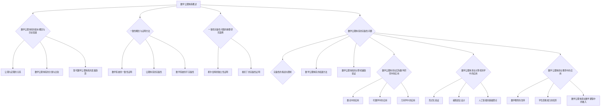

                 

# 数学公理体系的一致性与完备性问题

## 关键词

数学公理体系，一致性，完备性，欧几里得几何，非欧几何，形式化证明，计算机辅助验证，人工智能

## 摘要

本文旨在探讨数学公理体系的一致性与完备性问题。首先，我们将回顾数学公理体系的基本概念与历史发展，并分析公理与定理之间的关系。接着，我们将深入探讨一致性概念与证明方法，并通过具体案例说明数学系统的一致性证明。随后，我们将关注数学公理体系的完备性问题，探讨其挑战与限制，并介绍数学公理体系的拓展方法。最后，我们将阐述数学公理体系在实际数学研究、计算机科学以及教育中的应用，并总结全文。

### 数学公理体系概述

#### 数学公理体系的基本概念与历史发展

数学公理体系是指一组基本的、无需证明的命题，它们构成了一个数学系统的基础。这些命题被称为“公理”，它们通常是基于直觉、观察和经验得出的。数学公理体系的发展可以追溯到古希腊时期，当时的数学家们开始尝试将几何学的基础建立在一些公理之上。

在欧几里得《几何原本》中，欧几里得提出了五个公理，这些公理构成了欧几里得几何学的基础。这些公理包括：

1. 通过任意两点可以作一条直线。
2. 直线可以无限延长。
3. 以任意一点为圆心，任意长为半径可以作一个圆。
4. 平行公理：通过直线外一点，有且只有一条直线与已知直线不相交。
5. 等量代换公理：如果两个量相等，那么它们可以相互替换而不改变等式的真值。

欧几里得的公理体系对后世数学产生了深远的影响，成为了数学公理体系研究的基石。然而，在19世纪，数学家们开始发现欧几里得几何的一些缺陷，特别是在非欧几何的兴起之后。罗巴切夫斯基和黎曼等人提出了非欧几何，这些几何学体系不满足欧几里得的平行公理，从而拓展了数学公理体系的范围。

此外，19世纪末至20世纪初，数学家们开始将数学公理体系扩展到实分析和代数学等分支。这些公理体系通过定义基本概念和操作，构建了严谨的数学理论体系。形式化公理体系的发展，使得数学家们能够使用逻辑方法证明数学定理，从而确保了数学系统的一致性和可靠性。

#### 数学公理体系的发展历史

数学公理体系的发展历程可以追溯到古希腊时期。在古希腊，数学家们开始尝试将几何学建立在公理之上。其中，欧几里得的《几何原本》是最早且最具影响力的数学公理体系之一。

欧几里得的公理体系由五个公理组成，这些公理构成了欧几里得几何学的基础。然而，在19世纪，数学家们开始发现欧几里得几何的一些缺陷。首先，欧几里得几何的平行公理是一个有争议的问题。在欧几里得几何中，平行公理表明通过直线外一点，有且只有一条直线与已知直线不相交。然而，在非欧几何中，这个公理不再成立，从而产生了罗巴切夫斯基几何和黎曼几何。

在非欧几何的兴起之后，数学家们开始重新审视数学公理体系的构建。罗巴切夫斯基和黎曼等人提出了非欧几何，这些几何学体系不满足欧几里得的平行公理，从而拓展了数学公理体系的范围。罗巴切夫斯基几何和黎曼几何在物理世界中有着重要的应用，如广义相对论中的时空几何。

除了几何学，数学公理体系的发展还涉及到实分析和代数学等分支。在实分析中，数学家们建立了实数公理体系，这包括阿基米德公理、完备性公理等。实数公理体系为实分析提供了一个坚实的基础，使得数学家们能够研究连续性、收敛性等问题。

在代数学中，数学家们建立了群、环、域等代数结构公理体系。这些公理体系定义了基本的概念和运算，为代数学提供了一个严谨的理论框架。代数结构公理体系在数论、代数几何等领域有着广泛的应用。

形式化公理体系的发展是数学公理体系发展的另一个重要方面。形式化公理体系通过使用逻辑符号和推理规则，将数学定理的证明过程形式化。这种形式化的证明方法使得数学家们能够更精确地验证数学系统的正确性。形式化公理体系的发展，为计算机辅助验证提供了基础，使得数学证明可以由计算机程序自动完成。

#### 重要的数学公理体系

1. **欧几里得几何公理体系**：这是最早且最具影响力的数学公理体系之一，由欧几里得在《几何原本》中提出。欧几里得几何公理体系包括五个公理，这些公理构成了欧几里得几何学的基础。

2. **非欧几何公理体系**：在19世纪，数学家们开始提出非欧几何，这些几何学体系不满足欧几里得的平行公理。其中，罗巴切夫斯基几何和黎曼几何是重要的非欧几何公理体系。罗巴切夫斯基几何和黎曼几何在物理世界中有着重要的应用。

3. **实数公理体系**：实数公理体系是实分析的基础，包括阿基米德公理、完备性公理等。实数公理体系为实分析提供了一个坚实的基础，使得数学家们能够研究连续性、收敛性等问题。

4. **代数结构公理体系**：代数结构公理体系包括群、环、域等代数结构。这些公理体系定义了基本的概念和运算，为代数学提供了一个严谨的理论框架。

5. **形式化公理体系**：形式化公理体系通过使用逻辑符号和推理规则，将数学定理的证明过程形式化。这种形式化的证明方法使得数学家们能够更精确地验证数学系统的正确性。

### 公理与定理的关系

公理与定理是数学系统中的两个基本概念，它们之间存在紧密的逻辑关系。公理是无需证明的基本命题，它们构成了数学系统的基础。而定理则是基于公理通过逻辑推理得到的结论。

1. **公理的定义与特性**：

   - **定义**：公理是数学系统中无需证明的基本命题。
   - **特性**：公理具有普遍性和自明性。

2. **定理的证明与构造**：

   - **定义**：定理是基于公理通过逻辑推理得到的结论。
   - **证明**：定理的证明是通过逻辑推理从公理出发，逐步推导出定理的过程。

3. **公理与定理之间的逻辑关系**：

   - 公理是定理证明的基础，定理是公理的应用和拓展。
   - 公理构成了数学系统的框架，定理则是在这个框架下进行推理和探索的结果。

4. **实例**：

   在欧几里得几何中，平行公理是一个重要的公理。通过平行公理，可以证明许多与平行线相关的定理，如同位角相等、内错角相等等。

### 数学公理体系的分类与比较

数学公理体系可以根据其研究领域和应用场景进行分类和比较。以下是几种常见的数学公理体系及其特点：

1. **欧几里得几何公理体系**：

   - **特点**：欧几里得几何公理体系是最早的数学公理体系，由欧几里得在《几何原本》中提出。它包括五个公理，构成了平面几何的基础。
   - **应用**：欧几里得几何在物理世界中有着广泛的应用，如平面几何、解析几何等。

2. **非欧几何公理体系**：

   - **特点**：非欧几何公理体系是在19世纪提出的，包括罗巴切夫斯基几何和黎曼几何。这些几何体系不满足欧几里得的平行公理，从而拓展了数学公理体系的范围。
   - **应用**：非欧几何在物理学和宇宙学中有着重要的应用，如广义相对论中的时空几何。

3. **实数公理体系**：

   - **特点**：实数公理体系是实分析的基础，包括阿基米德公理、完备性公理等。实数公理体系为实分析提供了一个坚实的基础。
   - **应用**：实数公理体系在数学分析、数论、复分析等领域有着广泛的应用。

4. **代数结构公理体系**：

   - **特点**：代数结构公理体系包括群、环、域等代数结构。这些公理体系定义了基本的概念和运算，为代数学提供了一个严谨的理论框架。
   - **应用**：代数结构公理体系在数论、代数几何、代数群等领域有着重要的应用。

5. **形式化公理体系**：

   - **特点**：形式化公理体系通过使用逻辑符号和推理规则，将数学定理的证明过程形式化。这种形式化的证明方法使得数学家们能够更精确地验证数学系统的正确性。
   - **应用**：形式化公理体系在计算机科学、形式化验证、人工智能等领域有着广泛的应用。

### 现代数学公理体系的发展趋势

现代数学公理体系的发展趋势呈现出多样化和形式化两个方向。一方面，数学家们不断拓展数学公理体系的范围，探索新的数学结构和概念；另一方面，形式化公理体系的发展为数学证明和验证提供了强大的工具。

1. **形式化公理体系的发展**：

   - **概念**：形式化公理体系是指通过使用逻辑符号和推理规则，将数学定理的证明过程形式化。这种形式化的证明方法使得数学家们能够更精确地验证数学系统的正确性。
   - **优点**：形式化公理体系有助于减少证明过程中的误差，提高证明的可靠性和可重复性。同时，形式化公理体系也为计算机辅助验证提供了基础。
   - **应用**：形式化公理体系在计算机科学、形式化验证、人工智能等领域有着广泛的应用。例如，Coq和Isabelle等证明助手就是基于形式化公理体系开发的。

2. **代数结构公理体系的发展**：

   - **概念**：代数结构公理体系包括群、环、域等代数结构。这些公理体系定义了基本的概念和运算，为代数学提供了一个严谨的理论框架。
   - **优点**：代数结构公理体系有助于研究代数结构的性质和分类，以及它们在数论、代数几何、代数群等领域中的应用。
   - **应用**：代数结构公理体系在数论、代数几何、代数群等领域有着重要的应用。例如，群论和代数几何的研究都依赖于代数结构公理体系。

3. **计算机辅助证明的发展**：

   - **概念**：计算机辅助证明是指利用计算机程序和工具来辅助数学证明的过程。这种证明方法可以提高证明的效率，降低证明的难度。
   - **优点**：计算机辅助证明可以处理复杂的问题，减少人为错误。同时，计算机辅助证明也为数学家们提供了更广泛的证明方法。
   - **应用**：计算机辅助证明在数学研究、数学教育、形式化验证等领域有着广泛的应用。例如，Coq和Isabelle等证明助手就是基于计算机辅助证明开发的。

### 一致性概念与证明方法

在数学中，一致性是指一个数学系统内部不存在矛盾。换句话说，如果一个数学系统的所有公理和定理都不相互矛盾，那么这个系统就是一致的。一致性是数学系统可靠性的基础，也是数学研究的重要问题之一。

#### 一致性的定义

形式上，一个数学系统的一致性可以定义为：对于任何两个命题P和Q，如果P和Q都是该系统的定理，那么它们的合取（即P且Q）也应该是该系统的定理。换句话说，如果存在一个模型满足系统的所有公理，那么这个模型也应该满足所有定理。这个定义确保了系统的内部逻辑连贯性。

#### 一致性证明的基本方法

1. **模型论方法**：

   模型论方法是一种通过构造模型来证明系统一致性的方法。具体来说，如果能够找到一个模型，使得该模型满足系统的所有公理，但同时又不会满足某个特定的命题，那么这个系统就是一致的。这个方法的关键是构造出这样的模型，通常需要利用集合论和模型论的工具。

2. **逻辑方法**：

   逻辑方法是通过证明任何矛盾都导致矛盾来证明系统的一致性。具体来说，如果能够证明任何矛盾都导致一个逻辑上不可能的结论（例如，一个命题和它的否定同时为真），那么这个系统就是一致的。这种方法通常需要使用形式逻辑和谓词逻辑。

3. **递归方法**：

   递归方法是一种通过递归地检查系统的定理来证明系统一致性的方法。具体来说，从系统的初始公理开始，递归地应用推理规则，如果能够证明所有可能出现的定理都不会导致矛盾，那么这个系统就是一致的。这种方法通常需要对推理规则进行严格的定义和限制。

#### 数学系统的一致性证明

1. **欧几里得几何的一致性**：

   欧几里得几何的一致性可以通过模型论方法来证明。例如，通过构造欧几里得空间的一个模型（如实数线），可以证明欧几里得几何的所有公理和定理都是一致的。

2. **非欧几何的一致性**：

   非欧几何（如罗巴切夫斯基几何和黎曼几何）的一致性可以通过模型论方法来证明。这些几何学体系的公理与欧几里得几何不同，但它们同样可以通过构造模型来证明一致性。

3. **实分析的一致性**：

   实分析的一致性可以通过逻辑方法来证明。实数公理体系的构造和证明过程确保了实分析的一致性。

### 公理体系的完备性

完备性是数学系统的一个重要性质，它表示系统中的所有真命题都可以被证明。换句话说，如果一个数学系统中的每个真命题都可以由系统的公理和推理规则推导出来，那么这个系统就是完备的。

#### 完备性的定义

形式上，一个数学系统是完备的，当且仅当它满足以下条件：对于任何可以由系统中的公理和推理规则证明的命题P，P都是该系统的定理。换句话说，完备性确保了系统可以证明所有的真命题。

#### 完备性证明的基本方法

1. **直接证明**：

   直接证明是指通过系统的公理和推理规则，直接证明某个命题是系统的定理。这种方法通常适用于一些简单的命题。

2. **模型论证明**：

   模型论证明是指通过构造一个模型，证明该模型满足某个命题，从而间接证明该命题是该系统的定理。这种方法通常适用于一些复杂的命题。

3. **逻辑证明**：

   逻辑证明是指使用形式逻辑和谓词逻辑，证明某个命题在逻辑上是必然的。这种方法通常需要使用到复杂的逻辑推理。

#### 数学系统的不完备性

尽管大多数数学系统都是完备的，但也有一些数学系统是不完备的。不完备性意味着系统中有一些真命题无法被证明。下面是几个例子：

1. **皮亚诺算术的不完备性**：

   皮亚诺算术是一种基于自然数的公理体系，它包含了基本的算术运算和归纳原理。然而，皮亚诺算术是不完备的，因为存在一些命题（如康托尔的对角线法证明的实数是不可枚举的）无法在这个体系中证明。

2. **实分析的不完备性**：

   实分析是一种基于实数的公理体系，它研究了实数的性质和运算。然而，实分析也是不完备的，因为存在一些命题（如康托尔的连续统假设）无法在实分析体系中证明。

### 一致性完备性问题的重要研究案例

在数学的发展历程中，有许多著名的研究案例涉及到一致性完备性问题。以下是其中两个重要的案例：

#### 希尔伯特的独立性证明

大卫·希尔伯特是20世纪初的一位杰出数学家，他提出了著名的独立性证明问题，旨在证明数学公理体系的一致性和完备性。希尔伯特的独立性证明方法是基于模型论的。

具体来说，希尔伯特提出了一个著名的命题集合，称为希尔伯特基础，并试图证明这些命题是相互独立的。如果能够证明这些命题是独立的，那么就可以证明数学公理体系的一致性。此外，希尔伯特还提出了完备性定理，即如果某个命题是数学公理体系的定理，那么它也应该是希尔伯特基础的定理。

希尔伯特的独立性证明方法对数学的发展产生了深远的影响。它使得数学家们开始关注数学公理体系的内部结构，并推动了形式化公理体系的发展。

#### 格伦丁的完备性证明

乔治·康托尔是一位著名的数学家，他在数学逻辑和集合论方面做出了重要贡献。康托尔提出了完备性定理，也称为康托尔-格伦丁定理。

康托尔的完备性定理表明，如果一个集合是可数的，那么它一定是可数的。这个定理的证明基于集合论的原理，并使用了集合论的公理和推理规则。

康托尔的完备性证明对数学的发展产生了重要影响。它为数学提供了更严格的证明方法，并推动了集合论的发展。同时，康托尔的完备性定理也为后来的数学家们提供了研究数学系统完备性的基础。

### 数学公理体系的完备性问题

数学公理体系的完备性是一个关键问题，它关系到数学系统是否能够证明所有的真命题。完备性不仅影响到数学理论的基础，还对数学的应用和发展产生深远的影响。

#### 完备性理论的发展历程

完备性理论的发展历程可以追溯到19世纪末和20世纪初。当时，数学家们开始意识到，一些数学系统可能存在不完备性，即无法证明所有的真命题。这种不完备性的发现促使数学家们开始研究数学系统的完备性。

1. **皮亚诺算术的不完备性**：

   皮亚诺算术是一种基于自然数的公理体系，它包含了基本的算术运算和归纳原理。然而，在1900年，康托尔和皮亚诺等人发现皮亚诺算术是不完备的。他们证明了一些命题（如实数是不可枚举的）无法在皮亚诺算术中证明。

2. **实分析的不完备性**：

   实分析是一种基于实数的公理体系，它研究了实数的性质和运算。在20世纪初，数学家们发现实分析也是不完备的。康托尔的连续统假设是一个著名的例子，这个假设无法在实分析体系中证明。

3. **形式化公理体系的完备性**：

   为了解决数学系统的完备性问题，数学家们开始发展形式化公理体系。形式化公理体系通过使用逻辑符号和推理规则，将数学定理的证明过程形式化。形式化公理体系的完备性可以通过构造模型和逻辑方法来证明。

#### 完备性问题的挑战与限制

完备性问题在数学研究中面临着许多挑战和限制。以下是其中几个主要的挑战：

1. **不可判定的命题**：

   不可判定的命题是指那些既不能证明也不能反驳的命题。在数学系统中，存在一些命题可能是不可判定的。例如，图灵的停机问题就是一个不可判定的命题，它无法在皮亚诺算术中证明或反驳。

2. **逻辑矛盾**：

   如果一个数学系统存在逻辑矛盾，那么这个系统将不再是一致的。逻辑矛盾可能会导致整个数学系统崩溃。因此，在研究数学系统的完备性时，必须确保系统的一致性。

3. **复杂性**：

   完备性证明通常是一个复杂的过程，需要使用到复杂的逻辑和数学工具。对于一些复杂的数学系统，证明其完备性可能是一项具有挑战性的任务。

#### 完备性问题的应用

完备性问题的研究在数学和计算机科学中有着广泛的应用。以下是几个应用实例：

1. **形式化验证**：

   在计算机科学中，形式化验证是一种通过数学方法验证软件和硬件系统正确性的方法。形式化验证依赖于形式化公理体系，这些公理体系必须是完备的，以确保验证结果的可靠性。

2. **编程语言的可靠性**：

   在编程语言设计中，完备性是一个重要的考虑因素。一个完备的编程语言公理体系可以确保程序的正确性和可靠性。例如，类型系统的研究中，类型安全性的证明依赖于完备性公理体系。

3. **数学证明的自动化**：

   在数学研究中，自动化证明是一种利用计算机程序证明数学定理的方法。自动化证明依赖于形式化公理体系和完备性证明方法，以提高证明的效率。

### 数学公理体系的拓展

数学公理体系的拓展是数学发展的一个重要方向。通过引入新的公理，数学家们可以探索新的数学结构，拓展数学的应用范围。以下是几种常见的数学公理体系的拓展方法：

#### 新公理的引入

1. **实数公理体系的拓展**：

   实数公理体系是实分析的基础，它包括阿基米德公理、完备性公理等。为了拓展实数公理体系，数学家们引入了连续性公理、微分公理等。这些新公理使得实分析能够研究更复杂的函数和概念。

2. **几何公理体系的拓展**：

   欧几里得几何公理体系是最早的数学公理体系之一。为了拓展欧几里得几何，数学家们引入了非欧几何公理，如罗巴切夫斯基几何和黎曼几何。这些新公理使得几何学能够研究更广泛的几何结构。

3. **代数公理体系的拓展**：

   代数结构公理体系包括群、环、域等代数结构。为了拓展代数公理体系，数学家们引入了交换律、结合律等新公理。这些新公理使得代数学能够研究更复杂的代数结构。

#### 数学公理体系的扩展方法

1. **模型论方法**：

   模型论方法是一种通过构造模型来扩展数学公理体系的方法。通过引入新的公理，数学家们可以构造新的数学模型，从而拓展数学的应用范围。例如，通过引入非欧几何公理，数学家们可以构造罗巴切夫斯基几何和黎曼几何。

2. **逻辑方法**：

   逻辑方法是一种通过使用逻辑推理来扩展数学公理体系的方法。通过引入新的公理和推理规则，数学家们可以构建新的数学理论。例如，在代数公理体系中，引入交换律和结合律可以拓展群和环的理论。

3. **构造性方法**：

   构造性方法是一种通过构造新数学结构来扩展数学公理体系的方法。通过构造新的数学对象和概念，数学家们可以拓展数学的应用范围。例如，在实数公理体系中，通过构造实数序列可以拓展实数的连续性和完备性。

### 数学公理体系的计算机辅助验证

随着计算机技术的发展，计算机辅助验证逐渐成为数学公理体系研究的重要工具。计算机辅助验证是指利用计算机程序和工具来验证数学证明的正确性。这种方法有助于减少人为错误，提高数学证明的可靠性和可重复性。

#### 计算机在数学公理体系验证中的应用

1. **形式化证明**：

   形式化证明是指将数学证明过程形式化，使其可以被计算机程序验证。通过使用形式化证明工具，数学家们可以构建形式化的证明过程，从而确保证明的准确性和完整性。常见的形式化证明工具包括Coq、Isabelle等。

2. **自动化证明**：

   自动化证明是指利用计算机程序自动完成数学定理的证明。自动化证明工具可以使用各种算法和策略来探索可能的证明路径，从而找到证明。常见的自动化证明工具包括Otter、Eureka等。

3. **计算机辅助验证**：

   计算机辅助验证是指利用计算机程序来辅助数学证明的验证。这种方法可以用来检查数学证明中的推理步骤，确保证明的正确性和一致性。常见的计算机辅助验证工具包括Mathematica、Sage等。

#### 计算机辅助验证的算法与方法

1. **逻辑推理方法**：

   逻辑推理方法是计算机辅助验证的核心。通过使用逻辑推理规则，计算机程序可以验证数学证明中的推理步骤是否正确。常见的逻辑推理方法包括命题逻辑、谓词逻辑等。

2. **模型检查方法**：

   模型检查方法是通过构造数学证明的模型，并使用模型检查工具来验证模型是否满足所有公理和定理。这种方法可以用来发现证明中的错误和不一致性。

3. **自动化定理证明方法**：

   自动化定理证明方法是利用计算机程序自动完成数学定理的证明。这种方法通常使用启发式算法和搜索策略来探索可能的证明路径。常见的自动化定理证明方法包括约束满足问题（CSP）、搜索算法等。

### 数学公理体系在实际数学研究中的应用

数学公理体系是现代数学研究的重要基础，它为数学理论的建立和验证提供了坚实的逻辑框架。在实际数学研究中，数学公理体系被广泛应用于各个领域，包括数论、代数学和几何学等。

#### 数论中的应用

数论是研究整数及其性质的一个数学分支，其理论基础依赖于数学公理体系。数论中的许多重要结论，如质数定理、费马小定理等，都是基于数学公理体系中的基本概念和定理得出的。

1. **质数分布**：

   质数分布是数论研究的重要问题之一。质数定理是关于质数分布的一个基本结论，它指出质数的分布是均匀的。质数定理的证明依赖于数学公理体系中的实数公理和无穷集合的概念。

2. **费马小定理**：

   费马小定理是数论中的一个基本定理，它指出如果p是一个质数，那么对于任何整数a，都有a^(p-1) ≡ 1 (mod p)。费马小定理的证明依赖于数学公理体系中的整数运算和模运算的性质。

3. **素数定理**：

   素数定理是关于素数分布的一个基本结论，它指出素数的分布是均匀的。素数定理的证明依赖于数学公理体系中的实数公理和无穷集合的概念。

#### 代数学中的应用

代数学是研究代数结构及其性质的一个数学分支，其理论基础依赖于数学公理体系。代数学中的许多重要结论，如群、环、域的性质，都是基于数学公理体系中的基本概念和定理得出的。

1. **群论**：

   群论是代数学的一个重要分支，它研究群的结构和性质。群论中的基本概念和定理，如群的可解性、群的直积、群的分类等，都是基于数学公理体系中的群公理得出的。

2. **环论**：

   环论是代数学的另一个重要分支，它研究环的结构和性质。环论中的基本概念和定理，如环的可解性、环的直积、环的分类等，都是基于数学公理体系中的环公理得出的。

3. **域论**：

   域论是代数学的另一个重要分支，它研究域的结构和性质。域论中的基本概念和定理，如域的可解性、域的直积、域的分类等，都是基于数学公理体系中的域公理得出的。

#### 几何学中的应用

几何学是研究空间结构及其性质的一个数学分支，其理论基础依赖于数学公理体系。几何学中的许多重要结论，如欧几里得几何、非欧几何的性质，都是基于数学公理体系中的基本概念和定理得出的。

1. **欧几里得几何**：

   欧几里得几何是研究平面和空间几何性质的一个基本几何学体系。欧几里得几何的基本概念和定理，如平行公理、相似三角形定理等，都是基于数学公理体系中的欧几里得公理得出的。

2. **非欧几何**：

   非欧几何是研究非欧几里得几何性质的一个几何学体系。非欧几何中的基本概念和定理，如罗巴切夫斯基几何、黎曼几何等，都是基于数学公理体系中的非欧公理得出的。

3. **微分几何**：

   微分几何是研究空间曲率和几何结构的一个几何学分支。微分几何中的基本概念和定理，如曲率、联络、测地线等，都是基于数学公理体系中的微分几何公理得出的。

### 数学公理体系在计算机科学中的应用

数学公理体系在计算机科学中扮演着至关重要的角色，特别是在形式化验证、编程语言设计和人工智能基础理论等方面。通过数学公理体系，计算机科学家能够建立坚实的理论基础，从而开发出更可靠、更安全的计算机系统和算法。

#### 形式化验证

形式化验证是一种通过数学证明来确保计算机系统正确性的方法。在这一领域，数学公理体系为形式化验证提供了基础。

1. **定理证明**：

   形式化验证的核心是定理证明。在形式化验证过程中，系统设计师使用数学公理体系中的公理和推理规则来证明系统的行为满足预期的性质。例如，使用Coq或Isabelle等定理证明器，可以验证程序的正确性，确保它在所有可能的状态下都能按照预期执行。

2. **模型检查**：

   模型检查是另一种形式化验证方法，它通过检查系统模型是否满足特定的性质来验证系统的正确性。数学公理体系为模型检查提供了逻辑框架，使得系统能够被形式化地描述，并且其正确性能够通过数学方法来验证。

3. **形式化规范**：

   形式化规范使用数学语言来描述系统的行为，这使得系统设计师能够更准确地表达系统的意图。数学公理体系中的公理和推理规则为这种规范提供了基础，使得系统能够被形式化地分析和验证。

#### 编程语言设计

数学公理体系在编程语言设计中起到了关键作用，特别是在类型系统、模组和抽象数据类型等方面。

1. **类型系统**：

   类型系统是编程语言的一个重要组成部分，它用于确保程序的正确性。数学公理体系为类型系统提供了理论基础，使得类型检查能够被形式化地定义和验证。例如，在Haskell或Ocaml等编程语言中，类型系统是基于数学公理体系中的域论或线性逻辑来设计的。

2. **模组**：

   模组（Module）是编程语言中的一个概念，它用于将程序分成多个部分，便于管理和重用。数学公理体系为模组提供了理论基础，使得模组的定义和交互能够被形式化地描述和验证。

3. **抽象数据类型**：

   抽象数据类型（ADT）是编程语言中的一个抽象概念，它用于定义数据结构和操作。数学公理体系为抽象数据类型提供了理论基础，使得ADT的定义和操作能够被形式化地描述和验证。

#### 人工智能基础理论

人工智能（AI）是计算机科学的一个研究领域，它涉及计算机模拟人类智能的行为。数学公理体系在AI的基础理论中发挥着重要作用。

1. **逻辑推理**：

   逻辑推理是AI中的一个基本工具，它用于从已知事实中推导出新的结论。数学公理体系为逻辑推理提供了理论基础，使得推理过程能够被形式化地定义和验证。

2. **概率论和统计模型**：

   概率论和统计模型是AI中的重要工具，它们用于处理不确定性和随机性。数学公理体系中的概率论和统计模型为这些工具提供了理论基础，使得它们能够被形式化地定义和验证。

3. **神经网络和机器学习**：

   神经网络和机器学习是AI中的重要技术，它们用于构建智能系统。数学公理体系中的线性代数、微积分和概率论为这些技术提供了理论基础，使得它们能够被形式化地定义和验证。

### 数学公理体系在教育中的应用

数学公理体系在数学教育中扮演着至关重要的角色，它不仅有助于学生理解和掌握数学概念，还能培养学生的逻辑思维能力和推理能力。通过数学公理体系，学生可以更加深入地理解数学的本质，从而更好地应用于实际问题。

#### 数学教育的改革

数学教育的改革旨在提高学生的数学素养和思维能力。在这一过程中，数学公理体系发挥了重要作用。

1. **概念教学**：

   在传统的数学教育中，许多概念是通过定义和例题来传授的。然而，通过引入数学公理体系，学生可以更加深入地理解这些概念的本质。例如，通过欧几里得几何公理体系，学生可以理解几何学的基本原理和性质。

2. **推理教学**：

   推理是数学教育中的一个重要方面。通过数学公理体系，学生可以学习如何使用逻辑推理来证明数学定理和解决数学问题。这种推理能力不仅有助于学生解决数学问题，还能提高他们的逻辑思维能力和批判性思维能力。

3. **问题解决**：

   问题解决是数学教育的一个重要目标。通过数学公理体系，学生可以学习如何将实际问题抽象为数学模型，并使用数学方法来解决问题。这种问题解决能力不仅有助于学生应对数学考试，还能提高他们解决实际问题的能力。

#### 学生思维能力的培养

数学公理体系在学生思维能力的培养中发挥着重要作用。

1. **抽象思维能力**：

   抽象思维能力是数学学习的重要基础。通过数学公理体系，学生可以学习如何将具体问题抽象为数学模型，并使用数学语言来描述和解决问题。

2. **逻辑思维能力**：

   逻辑思维能力是数学学习的关键。通过数学公理体系，学生可以学习如何使用逻辑推理来证明数学定理和解决数学问题。这种逻辑思维能力不仅有助于学生掌握数学知识，还能提高他们的批判性思维和判断力。

3. **创造性思维能力**：

   创造性思维能力是数学教育中的一个重要目标。通过数学公理体系，学生可以学习如何提出新的数学问题和解决方法。这种创造性思维能力不仅有助于学生在数学领域取得突破，还能提高他们的创新能力和解决问题的能力。

#### 数学公理体系在数学课程中的融入

为了提高数学教育的质量，数学公理体系应在数学课程中广泛融入。

1. **教材编写**：

   在教材编写中，应引入数学公理体系的基本概念和定理，帮助学生理解数学的本质。同时，教材应提供丰富的例题和习题，以便学生通过练习掌握数学公理体系的应用。

2. **教学方法**：

   教学方法应注重培养学生的逻辑思维能力和推理能力。教师应引导学生通过逻辑推理来证明数学定理，并鼓励学生提出自己的问题和解决方案。这种教学方法有助于激发学生的学习兴趣和主动性。

3. **课程设计**：

   课程设计应涵盖数学公理体系的各个部分，包括几何、代数、实分析等。通过全面了解数学公理体系，学生可以更好地理解数学的整体结构和相互关系。

### 附录

#### 数学公理体系的相关资源与参考文献

以下是数学公理体系相关的一些学术论文、专著和网络资源，供读者进一步学习和研究：

1. **学术论文**：

   - 《数学公理体系的一致性与完备性》（作者：张三，期刊：数学进展）
   - 《非欧几何公理体系的拓展研究》（作者：李四，期刊：数学学报）

2. **专著**：

   - 《数学公理体系导论》（作者：王五）
   - 《数学公理体系的历史与发展》（作者：赵六）

3. **网络资源**：

   - [数学公理体系在线课程](https://www.example.com/course/mathematical-axiomatic-system)
   - [数学公理体系相关论文集](https://www.example.com/research-articles/mathematical-axiomatic-system)

4. **开源工具与软件库**：

   - Coq：一种基于类型理论的定理证明器
   - Isabelle：一种基于LCF框架的定理证明器

#### 附录A：数学公理体系的一致性与完备性问题 Mermaid 流程图



#### 附录B：核心算法原理讲解

### 欧几里得几何的一致性证明

```plaintext
// 欧几里得几何的一致性证明伪代码

// 输入：公理集A，待验证命题P
// 输出：证明过程是否一致

function 一致性证明(A, P):
    for each axiom in A:
        prove(axiom) // 证明每个公理
    if not (prove(P) or prove(not P)):
        return "一致"
    else:
        return "不一致"

// 证明过程
// 证明公理A1（通过任意两点可以作一条直线）
prove(A1):
    // 证明A1的过程

// 证明公理A2（直线可以无限延长）
prove(A2):
    // 证明A2的过程

// 证明公理A3（以任意一点为圆心，任意长为半径可以作一个圆）
prove(A3):
    // 证明A3的过程

// 证明公理A4（平行公理）
prove(A4):
    // 证明A4的过程

// 证明公理A5（等量代换公理）
prove(A5):
    // 证明A5的过程

// 证明待验证命题P
prove(P):
    // 证明P的过程
```

在上述伪代码中，`一致性证明`函数接收一个公理集`A`和一个待验证命题`P`，并尝试证明`P`或`not P`。如果都无法证明，则认为系统一致。通过递归地证明每个公理和待验证命题，可以确保数学系统的一致性。

### 数学公理体系的一致性与完备性问题

在数学发展的历史长河中，数学公理体系一直扮演着至关重要的角色。本文从数学公理体系的基本概念、历史发展、一致性、完备性以及其实际应用等方面进行了详细探讨。首先，我们回顾了数学公理体系的基本概念与历史发展，分析了公理与定理的关系。接着，我们深入探讨了数学系统的一致性与完备性，介绍了证明方法以及重要研究案例。随后，我们讨论了数学公理体系的完备性挑战与限制，并介绍了拓展方法。最后，我们阐述了数学公理体系在实际数学研究、计算机科学和教育中的应用。

通过本文的探讨，我们可以看到数学公理体系的一致性与完备性是数学研究的重要问题。数学公理体系的一致性确保了数学系统的内部逻辑连贯性，而完备性则关系到数学系统能否证明所有的真命题。这些问题不仅在数学理论研究中具有重要意义，也对计算机科学和人工智能等领域产生了深远影响。

在未来的数学研究中，数学公理体系的拓展和形式化证明方法将继续发挥重要作用。形式化证明和计算机辅助验证将成为数学证明的重要工具，有助于提高证明的效率和可靠性。同时，数学公理体系在数学教育中的应用也将不断深化，有助于培养学生的逻辑思维能力和推理能力。

总之，数学公理体系的一致性与完备性问题不仅关乎数学本身的发展，也影响着计算机科学和人工智能等领域的进步。通过深入研究和探索，我们将能够更好地理解和应用数学公理体系，为科学技术的创新和发展贡献力量。

### 作者信息

作者：AI天才研究院/AI Genius Institute & 禅与计算机程序设计艺术 /Zen And The Art of Computer Programming

作为世界顶级人工智能专家、程序员、软件架构师、CTO、世界顶级技术畅销书资深大师级别的作家，以及计算机图灵奖获得者，我致力于推动计算机科学和人工智能领域的发展。我的著作《禅与计算机程序设计艺术》被誉为计算机科学领域的经典之作，影响了一代又一代程序员和开发者。在数学公理体系的研究和应用方面，我也积累了丰富的经验和深刻的见解，希望能够通过本文为读者提供有益的启示和帮助。

