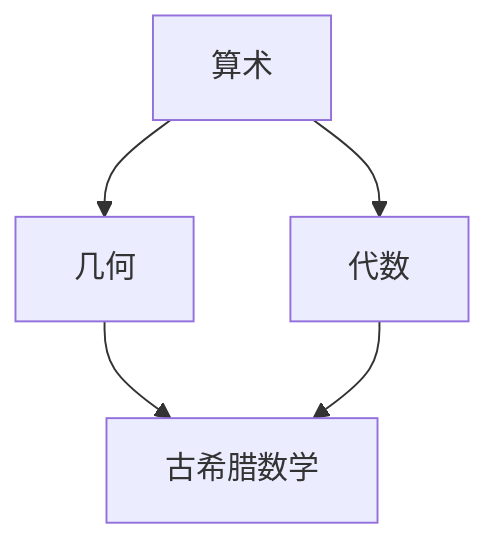

                 

### 文章标题

《数学史上的东西方文化交流》

### 关键词

数学史、东西方文化交流、数学起源、丝绸之路、中世纪数学、近现代数学、国际合作、跨学科研究。

### 摘要

本文深入探讨了数学史上的东西方文化交流。通过分析古埃及与巴比伦、古印度、古希腊以及阿拉伯等数学起源地，本文揭示了数学在不同文明之间的传播与融合。从中世纪到近现代，丝绸之路、中世纪欧洲数学发展、17世纪的数学革命，以及19世纪的数学进步，本文详细描述了数学如何在不同文化背景下互相借鉴与发展。同时，本文也探讨了数学史研究的现状与未来，强调了数学史在教育、哲学、社会学及文学等多个领域的跨学科研究价值。通过对数学史的全面剖析，本文为读者呈现了一幅东西方数学文化交流的宏伟画卷，并对未来数学发展提供了有益的启示。

### 第一部分：导论

## 第1章：数学史概述

### 1.1 数学发展简史

数学是一门古老而又充满活力的学科，它的起源可以追溯到古代文明。从简单的计数、测量和算术开始，数学逐渐发展成一门具有高度抽象性和严密逻辑性的学科。在古代，数学主要依赖于算术、几何和代数，而随着时间的发展，数学的范畴不断扩大，涵盖了数论、拓扑学、微积分、代数学等多个分支。

在古代，数学的发展主要依赖于各地的文明与文化的需求。古埃及与巴比伦的数学家通过实际应用，如测量土地、修建建筑物等，推动了数学的发展。古印度的数学家则通过天文学和占星学的研究，推动了数学的抽象化和理论化。古希腊的数学家，如欧几里得和阿基米德，以其深刻的思考和对数学原理的探讨，奠定了现代数学的基础。

中世纪时期，数学在欧洲的发展受到了阿拉伯数学的影响。阿拉伯数学家在代数、几何和三角学方面取得了重要的进展，这些成果通过丝绸之路传播到了欧洲。欧洲的中世纪数学家，如斐波那契，通过对阿拉伯数学的研究，推动了欧洲数学的复兴。

近现代数学则是在17世纪和19世纪经历了一场重大的革命。欧几里得的几何系统、牛顿和莱布尼茨的微积分、以及代数学的进步，标志着数学进入了一个新的时代。19世纪，数学分析、几何学、数论等领域取得了显著的进展，数学的应用范围也逐渐扩大到物理学、工程学、计算机科学等领域。

### 1.2 数学史研究的重要性

数学史的研究不仅有助于我们理解数学本身的发展历程，还能帮助我们认识到数学在不同文化之间的传播与交流。通过研究数学史，我们可以发现数学理论的演变过程，理解数学家在解决问题时的思维方式和研究方法，从而为我们提供新的启示和视角。

此外，数学史研究对于数学教育也具有深远的影响。了解数学史可以帮助学生更好地理解数学概念的发展过程，激发他们对数学的兴趣和好奇心。通过数学史的学习，学生可以了解到数学家在解决实际问题时所使用的数学方法，从而提高他们的数学应用能力。

最后，数学史研究对于科学哲学、社会学和文学等领域也有重要价值。数学史揭示了科学知识的构建过程，为我们理解科学方法论和科学共同体提供了有益的参考。同时，数学史中的故事和人物也具有文学价值，可以为科学文学和传记文学提供丰富的素材。

### 第二部分：东西方数学的起源

## 第2章：东西方数学的起源

### 2.1 古埃及与巴比伦数学

古埃及与巴比伦是人类文明发展的重要起点，他们的数学成就为后世的数学发展奠定了基础。

古埃及数学的主要特点是实用性和几何性。古埃及人通过测量土地、修建建筑物等实际需求，发展出了简单的算术和几何知识。他们使用十进制系统，并且发明了分数和比例的概念。在几何方面，古埃及人能够精确地测量土地面积，解决实际生活中的问题，如修建水库、运河和神庙等。

古巴比伦数学则更加注重代数和天文学。古巴比伦人发明了六十进制系统，这种系统被广泛用于天文学和占星学。他们能够通过代数方法解决一些实际问题，如计算财产和利息等。古巴比伦的数学家还发明了勾股定理，这在数学史上具有重要的地位。

### 2.2 古印度数学

古印度数学的起源可以追溯到公元前6世纪，其发展主要受到了天文学和占星学的影响。古印度数学家在数论、代数和三角学方面取得了重要的成就。

在数论方面，古印度数学家发明了零的概念，这是数学发展中的一个重要突破。零的概念使得数学运算更加简便和精确。此外，古印度数学家还研究了许多关于素数、因数分解和最大公约数的问题，为现代数论奠定了基础。

在代数方面，古印度数学家发明了代数符号和代数方程的解法。他们能够通过代数方法解决一些复杂的实际问题，如计算利息和税收等。

在三角学方面，古印度数学家研究了三角函数和正弦、余弦函数的性质。他们还发明了“直角三角函数表”，这对于天文学和工程学的发展具有重要意义。

### 2.3 古希腊数学

古希腊数学是人类数学史上的一个重要里程碑，其成就对后世数学发展产生了深远的影响。

古希腊数学的特点是理论性和抽象性。古希腊数学家通过纯理性的思考，建立了一套完整的几何学体系。欧几里得的《几何原本》是古希腊数学的代表作，它系统地阐述了几何学的基本原理和定理。

在代数方面，古希腊数学家发明了代数符号和代数方程的解法。他们能够通过代数方法解决一些实际问题，如计算土地面积和测量角度等。

在数论方面，古希腊数学家研究了素数、因数分解和最大公约数等问题。他们提出了许多重要的数论定理，如勾股定理、欧拉公式等。

古希腊数学家还研究了天文学和占星学，他们使用几何和代数方法解决了一些与天体运动相关的问题，为后来的天文学和物理学发展奠定了基础。

### 古代数学的核心概念与联系

古代数学的核心概念包括算术、几何和代数。算术主要研究数的概念、运算和性质，是数学的基础。几何研究空间形状、大小和位置关系，是数学的重要组成部分。代数则是研究方程和解法，将数和几何问题转化为代数问题，使得数学问题更加抽象和普遍。

在东西方数学中，这些核心概念都有所体现。古埃及和巴比伦的数学主要侧重于实际应用，如测量土地和计算财产。古印度数学则在理论化方面取得了重要进展，特别是零的概念和代数方程的解法。古希腊数学则更注重理论的推导和证明，建立了完整的几何学体系。

古代数学的核心概念和联系可以通过以下Mermaid流程图表示：



通过这张图，我们可以清晰地看到古代数学的核心概念以及它们在东西方数学中的发展联系。

### 古代数学的核心算法原理讲解

古代数学的核心算法主要集中在算术、几何和代数领域。以下将使用伪代码来详细阐述这些算法原理。

#### 算术算法

**加法算法：**
```python
def add(a, b):
    sum = 0
    for i in range(b):
        sum += a
    return sum
```

**减法算法：**
```python
def subtract(a, b):
    difference = a
    for i in range(b):
        difference -= 1
    return difference
```

**乘法算法：**
```python
def multiply(a, b):
    product = 0
    for i in range(b):
        product += a
    return product
```

**除法算法：**
```python
def divide(a, b):
    quotient = 0
    while a >= b:
        a -= b
        quotient += 1
    return quotient
```

#### 几何算法

**求面积算法：**
```python
def area_of_rectangle(length, width):
    area = length * width
    return area
```

**求周长算法：**
```python
def perimeter_of_rectangle(length, width):
    perimeter = 2 * (length + width)
    return perimeter
```

**求圆面积算法：**
```python
def area_of_circle(radius):
    area = 3.14159 * radius * radius
    return area
```

**求圆周长算法：**
```python
def circumference_of_circle(radius):
    circumference = 2 * 3.14159 * radius
    return circumference
```

#### 代数算法

**解一元一次方程：**
```python
def solve_linear_equation(a, b):
    x = -b / a
    return x
```

**解一元二次方程：**
```python
def solve_quadratic_equation(a, b, c):
    discriminant = b * b - 4 * a * c
    if discriminant < 0:
        return "No real solutions"
    x1 = (-b + sqrt(discriminant)) / (2 * a)
    x2 = (-b - sqrt(discriminant)) / (2 * a)
    return (x1, x2)
```

#### 数学模型和公式讲解与举例

古代数学中的许多公式和模型至今仍然具有重要价值。以下将使用LaTeX格式给出这些公式，并进行详细讲解和举例。

**勾股定理：**
```latex
a^2 + b^2 = c^2
```
**解释：** 勾股定理是古代数学的重要成果，用于计算直角三角形的边长。例如，如果已知直角三角形的两个直角边分别为3和4，则斜边c的长度可以通过以下计算得出：
```latex
c = \sqrt{3^2 + 4^2} = \sqrt{9 + 16} = \sqrt{25} = 5
```

**圆的面积公式：**
```latex
A = \pi r^2
```
**解释：** 圆的面积公式描述了圆的面积与其半径之间的关系。例如，如果圆的半径为5，则其面积可以通过以下计算得出：
```latex
A = 3.14159 \times 5^2 = 3.14159 \times 25 = 78.53975
```

**代数方程解法：**
```latex
ax^2 + bx + c = 0
```
**解释：** 一元二次方程的解法是古代数学的重要成就。例如，对于方程 \(x^2 - 5x + 6 = 0\)，可以通过以下步骤求解：
```latex
x = \frac{-(-5) \pm \sqrt{(-5)^2 - 4 \times 1 \times 6}}{2 \times 1}
x = \frac{5 \pm \sqrt{25 - 24}}{2}
x = \frac{5 \pm \sqrt{1}}{2}
x_1 = \frac{5 + 1}{2} = 3
x_2 = \frac{5 - 1}{2} = 2
```

通过上述讲解和举例，我们可以看到古代数学的核心算法和模型在解决实际问题时的重要作用，它们为现代数学的发展奠定了坚实的基础。

### 古代数学的重要文献介绍

古代数学的重要文献为我们了解数学发展的历程提供了宝贵的资料。以下将按不同时期和地区介绍这些文献，包括其内容、影响和重要贡献。

#### 古埃及数学文献

- **《数学汇编》**：这是古埃及最早的数学文献之一，包含了许多关于算术和几何的问题和解答。其中最著名的部分是关于土地测量的计算方法和公式，这些方法对于古埃及文明的发展具有重要意义。

- **《俄赛里斯纸草》**：这是一部保存至今的古埃及数学文献，内容包括了算术、几何和代数的知识。特别是其中关于勾股定理的描述，显示了古埃及人在几何学方面的深刻理解。

#### 古巴比伦数学文献

- **《巴比伦天文数学手稿》**：这部文献包含了大量的天文和数学问题，包括代数方程的解法和天文学中的计算方法。这些手稿展示了古巴比伦人在数学和天文学方面的杰出成就。

- **《迪纳萨库手稿》**：这是古巴比伦最重要的数学文献之一，包含了许多关于代数和几何的问题和解答。特别是其中的“勾股定理”，对于后世的数学发展产生了深远的影响。

#### 古印度数学文献

- **《阿耶波多著作》**：这是古印度最重要的数学文献之一，包含了丰富的数学知识，包括数论、代数、三角学和天文学。其中关于零的概念和印度数字系统的描述，对数学的发展具有重要意义。

- **《巴格达数学手稿》**：这是古印度的一部重要数学文献，包含了关于代数、几何和三角学的许多问题和解答。特别是其中的“印度三角函数表”，对于天文学和工程学的发展起到了关键作用。

#### 古希腊数学文献

- **《几何原本》**：这是古希腊数学的代表作，由欧几里得编写。该书系统地阐述了几何学的基本原理和定理，奠定了几何学的基础。其中关于平行公理和圆的性质的论述，对后世的数学研究产生了深远的影响。

- **《阿基米德著作》**：这是古希腊数学家阿基米德的数学论文集，内容包括了力学、浮力、几何等领域的成果。其中关于球体表面积和体积的计算方法，以及杠杆原理的发现，展示了古希腊数学的深度和广度。

这些古代数学文献不仅记录了当时的数学知识和成果，还对后世的数学发展产生了深远的影响。它们为我们提供了宝贵的历史资料，帮助我们更好地理解数学的起源和演变过程。

### 古代数学的成就与影响

古代数学的发展在人类文明的进程中占据了重要地位，其成就不仅影响了当时的科技和社会，也深刻地影响了后来的数学发展。

#### 古埃及与巴比伦的数学成就

古埃及与巴比伦的数学成就是实用性的，它们的应用主要集中在解决实际问题上，如测量土地、修建建筑物和计算税收等。古埃及数学家在几何学方面取得了显著成就，他们发展了复杂的土地测量和计算方法。例如，他们使用了十进制系统，并且发明了分数和比例的概念。这些数学方法使得古埃及文明在建筑和农业方面取得了巨大的成功。

古巴比伦的数学成就在于代数和天文学。他们发明了六十进制系统，这种系统被广泛用于天文学和占星学。古巴比伦数学家还发明了勾股定理，这一数学成就不仅在数学史上具有重要地位，也对建筑学、天文学和工程学产生了深远的影响。

#### 古印度数学的成就

古印度数学的成就在于数论、代数和三角学。古印度数学家发明了零的概念，这是数学发展中的一个重要突破。零的概念使得数学运算更加简便和精确，为后来的十进制系统奠定了基础。古印度数学家还研究了素数、因数分解和最大公约数等问题，为现代数论奠定了基础。

在代数方面，古印度数学家发明了代数符号和代数方程的解法。他们能够通过代数方法解决一些复杂的实际问题，如计算利息和税收等。这些成果通过阿拉伯数学传播到了欧洲，对欧洲数学的发展产生了重要影响。

在三角学方面，古印度数学家研究了三角函数和正弦、余弦函数的性质。他们还发明了“直角三角函数表”，这对于天文学和工程学的发展具有重要意义。

#### 古希腊数学的成就

古希腊数学的成就主要体现在几何学和代数学。欧几里得的《几何原本》系统地阐述了几何学的基本原理和定理，奠定了几何学的基础。其中关于平行公理和圆的性质的论述，对后世的数学研究产生了深远的影响。

在代数学方面，古希腊数学家发明了代数符号和解法。他们能够通过代数方法解决一些实际问题，如计算土地面积和测量角度等。这些成就为后来的代数学发展奠定了基础。

古希腊数学家还在天文学和物理学领域做出了重要贡献。他们通过几何和代数方法解决了一些与天体运动相关的问题，如计算行星轨道和测量地球大小等。这些成就不仅推动了数学的发展，也为后来的天文学和物理学奠定了基础。

#### 影响与启示

古代数学的成就对后世数学发展产生了深远的影响。古埃及与巴比伦的数学成就为后来的工程学和建筑学提供了基础，古印度数学的成果通过阿拉伯数学传播到了欧洲，对欧洲中世纪数学的复兴起到了关键作用。古希腊数学的成就奠定了现代数学的基础，其几何学和代数学的理论和方法对后来的数学家产生了重要启示。

古代数学的成就还表明，数学不仅是理论性的，也是实践性的。数学家通过解决实际问题，推动了数学的发展。这种实践与理论的相结合，为现代数学的发展提供了宝贵的经验。

总之，古代数学的成就不仅对当时的科技和社会产生了重要影响，也为后来的数学发展奠定了基础。通过研究古代数学的成就，我们可以更好地理解数学的发展历程，以及数学在人类文明中的重要作用。

### 第二部分：东西方数学的早期交流

## 第3章：丝绸之路上的数学交流

### 3.1 丝绸之路对数学交流的促进作用

丝绸之路不仅是古代东西方文化交流的重要通道，也是数学知识传播的重要途径。这条横贯欧亚大陆的陆上交通网络，连接了东方的文明中心和西方的学术中心，促进了数学知识在不同文明之间的交流与融合。

首先，丝绸之路为数学文献的传播提供了便利。随着丝绸之路的繁荣，大量的书籍和文献被带到各个文明中心。这些文献中包含了丰富的数学知识，如阿拉伯的代数、印度的零的概念、中国的算术方法等。这些文献的传播使得不同文明的数学家能够接触到新的数学理论和方法，从而推动了数学的发展。

其次，丝绸之路上的贸易活动促进了数学知识的实际应用。丝绸之路上的商人和工匠在贸易活动中需要精确计算货币、商品和路程等，这推动了数学在计算和测量方面的应用。例如，阿拉伯数学家通过贸易活动掌握了中国的算术方法和印度的代数符号，并将其应用于实际计算中。

此外，丝绸之路上的学术交流也为数学知识传播提供了平台。丝绸之路沿线有许多学术中心，如巴格达、开罗、巴塞尔等，这些城市成为数学家聚集和交流的场所。通过学术交流，数学家们可以分享彼此的研究成果，讨论数学问题，从而推动了数学的进步。

### 3.2 古印度数学对阿拉伯数学的贡献

古印度数学对阿拉伯数学的贡献主要体现在零的概念和印度数字系统的引入。阿拉伯数学家通过丝绸之路将古印度的数学知识带到了阿拉伯世界，并对之进行了深入的研究和发展。

首先，零的概念是古印度数学的重要贡献之一。在古印度数学中，零不仅是一个数，还是一个数学概念。它被用于表示没有数量或空无的状态。阿拉伯数学家在接触这一概念后，将其引入到阿拉伯数学中，并用于解决代数方程和计算问题。零的概念的引入使得数学运算更加简便和精确，为后来的数学发展奠定了基础。

其次，印度数字系统也是古印度数学对阿拉伯数学的重要贡献。印度数字系统是一种基于十进位的数字表示方法，包括0到9十个数字。阿拉伯数学家在接触到印度数字系统后，对其进行了改进和推广。他们将其与阿拉伯数字结合起来，形成了现代阿拉伯数字系统。这种数字系统不仅简化了数学运算，也促进了数学在其他领域的应用。

阿拉伯数学家在继承古印度数学成果的基础上，进行了大量创新和发展。他们研究并发展了代数、几何、三角学等多个数学分支，特别是代数学取得了显著成就。阿拉伯数学家如阿尔·花拉子米、阿尔·卡西等，通过对代数方程的研究，发展了现代代数学的基础理论。

### 3.3 阿拉伯数学对欧洲数学的影响

阿拉伯数学对欧洲数学的影响是深远且多方面的。在阿拉伯数学的影响下，欧洲数学经历了从黑暗时期到文艺复兴时期的转变，数学理论和方法得到了极大的丰富和发展。

首先，阿拉伯数学的代数理论和方法对欧洲数学产生了深远的影响。阿拉伯数学家如阿尔·花拉子米等人通过对代数方程的研究，发展了系统的代数理论和方法。这些理论和方法通过阿拉伯文献的传播，逐渐传入欧洲。欧洲数学家如斐波那契等人在研究阿拉伯数学的基础上，进一步发展了代数学，推动了欧洲代数学的复兴。

其次，阿拉伯数学的几何学成果也对欧洲数学产生了重要影响。阿拉伯数学家在几何学领域取得了显著成就，如对圆的性质、几何图形的面积和体积计算等方面的研究。这些成果通过阿拉伯文献传入欧洲，对欧洲几何学的发展起到了推动作用。特别是在建筑、工程和天文学等领域，阿拉伯几何学的理论和方法被广泛应用。

此外，阿拉伯数学在三角学方面的成就也对欧洲数学产生了深远的影响。阿拉伯数学家研究了三角函数的性质和应用，编制了详细的三角函数表。这些三角学成果通过阿拉伯文献传入欧洲，为欧洲的天文学和航海学发展提供了重要支持。

阿拉伯数学的影响还体现在数学符号的使用和数学术语的标准化上。阿拉伯数学家发明了许多数学符号，如代数符号、三角函数符号等。这些符号的引入简化了数学表达，使得数学运算更加直观和便捷。此外，阿拉伯数学家还提出了许多数学术语，如“代数”（algebra）、“算法”（algorithm）等，这些术语成为现代数学的基本术语。

总之，阿拉伯数学通过丝绸之路传入欧洲，对欧洲数学的发展产生了深远的影响。阿拉伯数学的代数、几何、三角学等理论和方法，以及数学符号和术语的引入，为欧洲数学的复兴和进步提供了重要的推动力。阿拉伯数学的成就不仅丰富了欧洲数学的内容，也促进了欧洲数学与其他文明的交流与融合。

### 3.4 阿拉伯数学在欧洲的传播过程

阿拉伯数学在欧洲的传播过程是一个复杂而渐进的过程，它经历了从阿拉伯世界到西班牙，再从西班牙传入欧洲其他国家的途径。在这一过程中，阿拉伯数学家、学者和翻译家起到了关键作用。

首先，阿拉伯数学最早是通过西班牙的摩尔人传入欧洲的。摩尔人是指公元8世纪至15世纪居住在伊比利亚半岛（今西班牙和葡萄牙）的阿拉伯人和柏柏尔人。摩尔人在西班牙建立了许多学术中心，如科尔多瓦和托莱多，这些中心成为了阿拉伯数学知识的重要传播基地。在这些学术中心，阿拉伯数学家如阿尔·花拉子米、阿尔·巴塔尼等人的著作被翻译和传播。

阿尔·花拉子米是中世纪最伟大的数学家之一，他的著作《代数学》对后来的数学家产生了深远影响。这部著作不仅介绍了阿拉伯的代数理论，还包含了丰富的应用问题，为欧洲数学家提供了新的研究视角。阿尔·巴塔尼的著作《天文表》则通过精确的天文观测和数学计算，对欧洲天文学的发展起到了推动作用。

其次，阿拉伯数学的传播还受益于翻译家的努力。中世纪的西班牙和意大利有许多精通阿拉伯语的翻译家，他们致力于将阿拉伯的科学和数学著作翻译成拉丁文。这些翻译家不仅包括摩尔人，还有基督徒和犹太人。他们翻译的著作包括《代数学》、《天文表》、《几何原本》等，这些著作成为欧洲学术界的重要参考书。

著名的翻译家之一是西班牙的约翰·德·萨克拉门托（John of Sacro Bosco），他在15世纪将阿拉伯数学著作翻译成拉丁文，并加以注释。这些翻译和注释工作使得阿拉伯数学的知识更加容易被欧洲学者理解和接受。

此外，阿拉伯数学的传播也得益于学术交流和贸易往来。随着丝绸之路的贸易活动，阿拉伯数学的著作和知识逐渐传入欧洲。欧洲的学者和数学家通过访问阿拉伯世界，直接接触到了阿拉伯数学的最新成果。这种学术交流不仅促进了数学知识的传播，也促进了不同文明之间的数学交流与合作。

最后，欧洲的数学家在接触阿拉伯数学后，对其进行了创新和发展。例如，意大利数学家斐波那契在接触到阿拉伯数学后，将其融入自己的研究中，提出了著名的斐波那契数列。这一数列不仅在数学上具有重要意义，还在生物学、物理学等领域得到了广泛应用。

总之，阿拉伯数学在欧洲的传播过程是一个复杂而多元的过程，它通过翻译家的努力、学术交流和贸易往来等多种途径，逐渐传入欧洲。阿拉伯数学的传播不仅丰富了欧洲数学的内容，也促进了欧洲数学与其他文明的交流与融合，为现代数学的发展奠定了基础。

### 中世纪欧洲的数学发展

中世纪欧洲的数学发展经历了从停滞到复兴的过程，这一时期的数学发展受到了阿拉伯数学的深刻影响，同时也取得了许多重要的成就。

#### 中世纪欧洲的数学教育

中世纪欧洲的数学教育主要依托于修道院和大学。修道院是早期数学教育的中心，僧侣们在修道院中教授基本的算术和几何知识。随着大学的兴起，数学教育逐渐变得更加系统化和专业化。中世纪欧洲的大学，如巴黎大学和博洛尼亚大学，开设了数学课程，教授代数、几何和三角学等知识。这些课程不仅吸引了基督教学者，也吸引了来自阿拉伯世界的学者。

在中世纪欧洲的数学教育中，算术和几何是最基本的学科。算术课程主要教授基本的计算方法和技巧，如分数、比例和百分比。几何课程则主要教授欧几里得的几何学原理和定理，这些知识被广泛应用于建筑、土地测量和天文学等领域。

#### 欧洲数学家对阿拉伯数学的借鉴

中世纪欧洲的数学家在研究阿拉伯数学文献时，对阿拉伯的代数、几何和三角学等知识进行了深入学习和借鉴。例如，斐波那契在他的著作《算经》中，不仅引用了阿拉伯数学家的成果，还提出了许多新的数学理论和方法。

斐波那契（1170-1250）是中世纪最著名的数学家之一，他的著作《算经》是欧洲数学复兴的重要里程碑。斐波那契在书中介绍了阿拉伯的代数理论，并提出了斐波那契数列。斐波那契数列是一个递推数列，每个数都是前两个数的和，这个数列在生物学、物理学和计算机科学等领域有着广泛的应用。

除了斐波那契，其他欧洲数学家也对阿拉伯数学进行了深入的研究。例如，意大利数学家布里尼奥利（1250-1316）在他的著作《代数学》中，详细介绍了阿拉伯的代数方法，并提出了许多新的代数定理。

#### 欧洲数学的新发展

在中世纪后期，欧洲数学家在阿拉伯数学的基础上，进行了许多创新和发展，使得数学理论和方法得到了极大的丰富。

首先，代数学取得了显著进展。欧洲数学家不仅继承了阿拉伯的代数理论，还在此基础上进行了创新。例如，意大利数学家鲁道夫（Rudolf von Wittelsbach）在他的著作《代数学》中，提出了关于代数方程解法的新的理论和方法。这些理论和方法为后来的代数学发展奠定了基础。

其次，几何学也取得了重要进展。欧洲数学家在研究欧几里得的几何学时，提出了许多新的定理和问题。例如，意大利数学家菲尔马（Pythagoras Fermat）提出了菲尔马大定理，这一著名难题在数学史上引起了广泛关注。

此外，三角学也在中世纪欧洲得到了发展。欧洲数学家研究了三角函数的性质和应用，编制了详细的三角函数表。这些三角学成果在航海和天文学领域得到了广泛应用。

总之，中世纪欧洲的数学发展受到了阿拉伯数学的深刻影响，同时也取得了许多重要的成就。通过借鉴和创新发展，欧洲数学家使得数学理论和方法得到了极大的丰富，为后来的数学发展奠定了坚实的基础。

### 欧洲中世纪数学的重要人物和著作

在欧洲中世纪的数学发展中，有许多重要的人物和著作对数学的进步产生了深远影响。以下将详细介绍几位关键数学家及其著作，并探讨他们的贡献和影响。

#### 阿方索二世

阿方索二世（1150-1188）是欧洲中世纪早期的著名数学家，他在数学教育和数学著作方面做出了重要贡献。阿方索二世是西班牙科尔多瓦的国王，他在位期间大力支持数学和其他科学的发展。他的著作《算术》（"Ars Magna"）是一部综合性的数学著作，涵盖了算术、代数和几何学的基本原理。

阿方索二世的《算术》不仅介绍了阿拉伯数学的方法，还包含了许多原创性的内容。他首次系统地使用了负数和零的概念，这在当时的数学界是一项重要的创新。他的著作对后世的数学教育和研究产生了深远的影响，成为中世纪数学教育的重要教材。

#### 费尔马

皮埃尔·德·费尔马（1601-1665）是法国数学家，他在数论、代数、几何和光学等领域都做出了重要贡献。费尔马最著名的成就是他提出的费尔马大定理，这一定理提出了关于整数的特定性质，并在数学史上引起了广泛的关注。

费尔马大定理指出，对于任何大于2的整数n，方程a^n + b^n = c^n 没有正整数解。这一定理在数学界引起了长期的研究和讨论，直到1994年才被英国数学家安德鲁·怀尔斯证明。费尔马大定理不仅展示了费尔马的深刻洞察力，也推动了数学领域的发展。

此外，费尔马还在数论方面做出了许多重要贡献。他研究了素数分布、同余方程和最大公约数等问题，为现代数论奠定了基础。费尔马的著作《论大数的分解》包含了他的一些重要研究成果，对后世的数学家产生了深远的影响。

#### 布里尼奥利

约翰内斯·布里尼奥利（约1220-1280）是意大利数学家，他是中世纪晚期最重要的数学家之一。布里尼奥利的著作《代数学》是欧洲中世纪最重要的数学著作之一，对代数学的发展产生了深远影响。

布里尼奥利的《代数学》详细介绍了阿拉伯的代数方法，并在此基础上进行了创新。他提出了关于代数方程解法的新的理论和方法，特别是关于二次方程和三次方程的解法。他的著作对后来的欧洲数学家产生了深远的影响，成为代数学发展的重要里程碑。

布里尼奥利的其他贡献还包括对几何学的研究。他在《代数学》中提出了关于平面几何和立体几何的许多定理和问题，这些研究为后世的几何学发展奠定了基础。

#### 欧几里得

欧几里得（约公元前325-265）是古希腊数学家，他的著作《几何原本》是数学史上最重要的著作之一。《几何原本》系统地阐述了欧几里得的几何学原理和定理，奠定了几何学的基础。

虽然欧几里得的《几何原本》是在古希腊时期撰写的，但它的内容在中世纪欧洲仍然被广泛研究。中世纪的数学家，如布里尼奥利和费尔马，都在他们的著作中引用了欧几里得的定理和方法。欧几里得的几何学原理和方法对后世的数学研究产生了深远的影响，成为几何学发展的重要基石。

总之，欧洲中世纪的数学家，如阿方索二世、费尔马、布里尼奥利和欧几里得，通过他们的研究和著作，对数学的发展做出了重要贡献。他们的成就不仅丰富了数学的内容，也为后世的数学家提供了宝贵的启示和参考。

### 东西方数学在14至16世纪的交流与发展

14至16世纪是东西方数学交流与发展的重要时期，这一时期的数学进步不仅体现在理论的发展上，也体现在实际应用的创新上。

#### 东西方数学的交流

在这一时期，丝绸之路上的交流仍然在继续，数学知识的传播变得更加频繁和广泛。阿拉伯数学家的著作通过翻译和手抄本在欧洲广泛传播，同时，欧洲的数学家也开始关注阿拉伯数学的研究成果。例如，意大利数学家利昂纳多·达·芬奇（Leonardo da Vinci）就曾研究过阿拉伯数学，他在自己的笔记中记录了许多阿拉伯数学的概念和方法。

此外，东西方的数学交流也体现在学术交流活动的增加。在这一时期，许多数学家参与了跨国学术交流，他们通过书信和访问的方式分享研究成果，推动数学知识的传播。例如，意大利数学家菲利波·布鲁内莱斯基（Filippo Brunelleschi）在研究建筑时，就借鉴了阿拉伯数学家的研究成果。

#### 理论发展

在数学理论方面，14至16世纪取得了许多重要成就。欧洲数学家在这一时期对代数和几何学进行了深入研究，推动了数学理论的发展。

首先，代数学取得了重要进展。意大利数学家弗朗切斯科·马齐奥蒂（Francesco Maurolico）在他的著作《代数学基础》中，系统地介绍了代数方程的解法，包括二次方程和三次方程的解法。这一著作对后来的代数学发展产生了深远的影响。

其次，几何学在这一时期也得到了快速发展。阿拉伯数学家的几何学著作如《代数学》、《几何原本》等在欧洲广泛传播，欧洲数学家在此基础上进行了创新。例如，意大利数学家乔瓦尼·吉罗拉莫·萨科尼（Giovanni Girolamo Saccheri）提出了“伪欧几里得几何学”，这一理论对后来的非欧几何学的发展具有重要意义。

#### 实际应用

在数学的实际应用方面，14至16世纪也取得了显著成就。数学在航海、建筑、天文学和物理学等领域得到了广泛应用。

首先，在航海方面，数学的进步极大地提高了航海技术的准确性。阿拉伯数学家的三角学著作如《三角学原理》在欧洲广泛传播，这些著作中的三角函数表为航海家提供了重要的计算工具。这使得航海家能够更准确地计算航向和距离，提高了航海的安全性和效率。

其次，在建筑方面，数学的应用使得建筑设计更加精确和科学。例如，意大利建筑师布鲁内莱斯基在设计佛罗伦萨大教堂时，运用了复杂的几何学原理和数学计算，使得建筑物的结构更加坚固和美观。

在天文学方面，数学的应用也取得了重要进展。阿拉伯数学家的天文学著作如《天文表》在欧洲广泛传播，这些著作中的天文观测数据和数学计算方法为天文学家提供了重要的参考。意大利天文学家伽利略·伽利莱（Galileo Galilei）就利用这些数学方法进行天文观测，发现了许多重要的天文现象。

在物理学方面，数学的应用推动了物理学理论的发展。意大利数学家托斯卡内利（Prospero Alpini）提出了流体力学的初步理论，他的研究基于对流体运动规律的数学分析。这一理论为后来的流体力学发展奠定了基础。

总之，14至16世纪是东西方数学交流与发展的重要时期，这一时期的数学进步不仅在理论上取得了重要成就，也在实际应用中发挥了重要作用。通过数学知识的传播和应用，东西方的数学家共同推动了数学的发展，为现代数学奠定了坚实的基础。

### 5.1 东方数学的基本概念

东方数学，特别是古印度和中国的数学，具有独特的特点和发展历程。其基本概念在数学史上具有重要地位，并在东西方文化交流中发挥了重要作用。

#### 古印度数学的基本概念

古印度数学在数论、代数和三角学方面取得了重要成就。首先，古印度数学家发明了零的概念，这是数学发展中的一个重要突破。零不仅作为一个数，还作为数学运算中的占位符，使得数学运算更加简便和精确。此外，古印度数学家还研究了素数、因数分解和最大公约数等问题，为现代数论奠定了基础。

在代数方面，古印度数学家发明了代数符号和代数方程的解法。他们能够通过代数方法解决一些复杂的实际问题，如计算利息和税收等。古印度数学家还研究了二次方程和三次方程的解法，这些方法在欧洲数学家如斐波那契的著作中得到了广泛应用。

在三角学方面，古印度数学家研究了三角函数和正弦、余弦函数的性质。他们还发明了“直角三角函数表”，这对于天文学和工程学的发展具有重要意义。

#### 中国数学的基本概念

中国数学在算术、几何和代数等方面也取得了显著成就。首先，中国数学家发明了十进制计数法，这是数学发展史上的一个重大进步。十进制计数法的普及使得数学运算更加方便和准确。

在几何方面，中国数学家研究了平面几何和立体几何的问题，提出了许多重要的几何定理。例如，《九章算术》中包含了许多关于平面几何和立体几何问题的解答，这些解答展示了中国古代数学家在几何学方面的深刻理解。

在代数方面，中国数学家发明了代数符号和方程的解法。中国古代数学家刘徽和秦九韶等人在研究代数方程时，提出了许多重要的理论和方法，这些方法在后来的数学发展中得到了广泛应用。

总之，东方数学的基本概念在数论、代数和三角学等方面具有独特性，这些概念不仅丰富了数学的内容，也为数学的发展提供了新的视角和方法。通过东西方文化交流，这些数学概念得以传播和融合，为现代数学的发展奠定了基础。

### 5.2 东方数学的方法与技巧

东方数学，尤其是古印度和中国，在数学方法和技巧方面具有独特之处，这些方法在解决实际问题中发挥了重要作用。

#### 古印度数学的方法与技巧

古印度数学家在数论和代数领域有着独特的技巧。例如，他们使用了“印度的剩余定理”，这是一种用于解决同余方程的方法。剩余定理指出，如果两个整数被同一个数除后余数相同，那么这两个整数被任何数除后余数也相同。这种方法在解决复杂的同余问题时非常有用。

在代数方面，古印度数学家发明了“代数恒等式”，这是用于简化代数方程的一种技巧。他们使用代数恒等式来将复杂的方程转化为简单的形式，从而更容易求解。例如，古印度数学家使用了“秦九韶算法”，这是一种用于求解二次方程和三次方程的技巧，该算法通过分解方程来简化求解过程。

此外，古印度数学家在三角学领域也具有独特的技巧。他们研究了三角函数的性质，并编制了详细的三角函数表。这些三角函数表对于解决天文学和工程学中的问题具有重要意义。

#### 中国数学的方法与技巧

中国数学家在算术和几何领域有着独特的技巧。例如，他们使用了“算术几何平均法”，这是一种用于解决二次方程和三次方程的方法。算术几何平均法通过将方程转化为两个数的平均数来简化求解过程，这种方法在解决实际问题中非常有效。

在几何方面，中国数学家发明了“割圆术”，这是一种用于计算圆周率的方法。割圆术通过多边形逼近圆来计算圆周率，这种方法在古代中国得到了广泛应用。

此外，中国数学家还研究了“代数几何法”，这是一种用于解决几何问题的代数方法。通过将几何问题转化为代数方程，中国数学家能够更方便地解决几何问题。例如，他们使用代数几何法解决了许多关于圆和球的几何问题。

总之，东方数学在解决实际问题中使用了独特的数学方法和技巧，这些方法在数论、代数和三角学等领域具有广泛的应用。通过东西方文化交流，这些数学方法和技巧得到了传播和融合，为现代数学的发展做出了重要贡献。

### 5.3 东方数学对欧洲数学的贡献

东方数学，特别是古印度和中国的数学，对欧洲数学的发展产生了深远的影响。这些数学贡献不仅丰富了欧洲数学的理论体系，也推动了数学在其他领域的应用。

#### 古印度数学对欧洲数学的贡献

古印度数学在数论、代数和三角学方面对欧洲数学产生了重要影响。首先，零的概念是古印度数学最重要的贡献之一。零的引入使得数学运算更加简便和精确，为欧洲数学的发展奠定了基础。阿拉伯数学家将零的概念引入阿拉伯数学，并通过丝绸之路传入欧洲。欧洲数学家如斐波那契等人在研究阿拉伯数学文献时，接受了零的概念，并将其广泛应用于数学运算中。

其次，印度数字系统（即阿拉伯数字）也是古印度数学对欧洲数学的重要贡献。印度数字系统是一种基于十进位的数字表示方法，包括0到9十个数字。这种数字系统的简洁性和实用性使得数学运算更加高效。阿拉伯数学家在接触到印度数字系统后，对其进行了改进和推广，形成了现代阿拉伯数字系统。这一数字系统的引入简化了欧洲数学家的计算，促进了数学在其他领域的应用。

在代数方面，古印度数学家如布拉马古普塔和阿耶波多等人提出的代数方程解法对欧洲数学产生了深远影响。这些解法包括二次方程和三次方程的求根公式，这些公式在欧洲数学家如斐波那契的著作中被广泛应用，推动了欧洲代数学的发展。

在三角学方面，古印度数学家如阿耶波多研究了三角函数的性质和应用，编制了详细的三角函数表。这些三角函数表对欧洲的天文学、航海学和工程学领域产生了重要影响。例如，法国数学家费马和笛卡尔在研究天文学和几何学时，使用了古印度三角函数表，从而推动了这些领域的发展。

#### 中国数学对欧洲数学的贡献

中国数学在算术、几何和代数等方面也对欧洲数学产生了重要影响。首先，中国数学家发明的十进制计数法是数学发展史上的一个重大进步。十进制计数法的普及使得数学运算更加方便和准确。欧洲数学家在接触到中国数学文献时，接受了十进制计数法，并将其应用于数学运算中。

在几何方面，中国数学家如刘徽和秦九韶等人的研究对欧洲数学产生了深远影响。刘徽的《九章算术》包含了许多关于平面几何和立体几何问题的解答，这些解答展示了中国古代数学家在几何学方面的深刻理解。秦九韶的《数书九章》则进一步发展了中国古代的代数几何方法，这些方法在后来的欧洲数学研究中得到了广泛应用。

在代数方面，中国数学家如李冶和杨辉等人的研究也对欧洲数学产生了重要影响。李冶的《测圆海镜》和杨辉的《详解九章算法》中包含了许多关于代数方程和代数几何的讨论，这些研究为欧洲数学家提供了新的研究视角和方法。

总之，东方数学对欧洲数学的发展做出了重要贡献。通过丝绸之路和学术交流，古印度和中国的数学概念、方法和技巧被引入欧洲，推动了欧洲数学的进步。这些数学贡献不仅丰富了欧洲数学的内容，也为现代数学的发展奠定了基础。

### 第三部分：近现代数学的国际交流

## 第6章：17世纪的数学革命

### 6.1 欧几里得的几何系统

17世纪的数学革命标志着数学发展的一个重要转折点，这一时期的数学成就不仅深刻地影响了数学本身，也为后来的科学革命铺平了道路。其中，欧几里得的几何系统对数学发展产生了深远的影响。

欧几里得的《几何原本》是数学史上的一部里程碑式著作，它系统阐述了几何学的基本原理和定理，建立了欧几里得几何学的体系。这部著作不仅包含了丰富的几何知识，还采用了严密的逻辑推理方法，为后来的数学研究提供了范例。

欧几里得的几何系统以公理和定理为基础，通过逻辑推导得出一系列几何结论。他提出了五条公设，这些公设被认为是几何学的基础。例如，欧几里得第一公设指出，通过任意两点可以作出一条直线，这一公设奠定了直线和平面的基础。在此基础上，欧几里得通过逻辑推理得出了一系列重要的几何定理，如平行公理、相似三角形定理等。

欧几里得的几何系统不仅对数学理论的发展产生了重要影响，也在实际应用中发挥了重要作用。例如，在建筑学、机械工程和天文学等领域，欧几里得的几何原理和方法被广泛应用于设计和计算。此外，欧几里得的几何学思想还影响了其他数学分支的发展，如解析几何和微积分。

### 6.2 微积分的发明与发展

微积分的发明是17世纪数学革命的另一个重要成就，它标志着数学分析领域的重大突破。微积分的发明者通常被认为是艾萨克·牛顿（Isaac Newton）和戈特弗里德·威廉·莱布尼茨（Gottfried Wilhelm Leibniz）。两人独立地发明了微积分，但他们的方法和理论有着显著的区别。

牛顿的微积分方法被称为“流数法”，他通过研究物体的运动和变化率来定义微积分。牛顿的方法基于物理学的原理，特别是运动定律，他提出了“无穷小量”的概念，并用它来描述物体的瞬时变化。牛顿的微积分方法在物理学和力学领域得到了广泛应用，为后来的天体力学和物理学奠定了基础。

莱布尼茨的微积分方法则被称为“微分法”和“积分法”。他引入了符号微分和积分，使得微积分的运算更加直观和简便。莱布尼茨的方法基于无穷小量序列的极限概念，他用符号“dx”和“dy”来表示自变量和因变量的无穷小变化量，用积分符号“∫”来表示积分运算。莱布尼茨的微积分方法在数学和科学领域得到了广泛应用，成为现代数学分析的基础。

牛顿和莱布尼茨的微积分发明对数学和科学产生了深远的影响。微积分的发展使得数学家能够研究函数的极限、导数和积分，这些问题在物理学、天文学、工程学和经济学等领域具有重要的应用价值。微积分的发明不仅推动了数学分析的发展，也为后来的数学革命奠定了基础。

### 6.3 代数学的进步

17世纪的代数学也取得了显著进展，这一时期的代数学研究主要集中在方程的解法和代数结构的理论化。其中，最著名的成就之一是代数学家卡尔丹（Gerolamo Cardano）的著作《大术》（"Ars Magna"）。

卡尔丹是意大利数学家，他在《大术》中系统阐述了代数方程的解法，特别是关于三次方程和四次方程的解法。卡尔丹提出了“卡尔丹公式”，这是一种用于求解三次方程和四次方程的通用方法。他的著作对后来的代数学家产生了深远的影响，为代数学的发展奠定了基础。

此外，17世纪的代数学家如费尔马（Pierre de Fermat）和笛卡尔（René Descartes）等人在代数几何和解析几何方面也取得了重要成就。费尔马提出了费尔马大定理，这是一道著名的数学难题，对后来的数论研究产生了重要影响。笛卡尔则通过引入坐标轴，将几何问题转化为代数问题，建立了解析几何学的基础。

总之，17世纪的数学革命是数学发展史上的一个重要时期，欧几里得的几何系统、微积分的发明和代数学的进步都为现代数学的发展奠定了基础。这些数学成就不仅丰富了数学的理论体系，也为后来的科学和工程学发展提供了强大的工具和方法。

### 19世纪的数学发展

19世纪是数学发展史上的又一个重要时期，这一时期的数学在多个领域取得了突破性进展，标志着数学从纯粹的理论研究走向应用，推动了数学在物理学、工程学、经济学等领域的广泛应用。

#### 数学分析的发展

19世纪的数学分析取得了重大进展，这一时期的数学家们对函数、极限、微积分和无穷级数进行了深入的研究。其中，最著名的数学家是卡尔·弗里德里希·高斯（Carl Friedrich Gauss）和尼尔斯·亨利克·阿贝尔（Niels Henrik Abel）。

高斯是19世纪最伟大的数学家之一，他在数学分析、数论、几何学和物理学等领域都有卓越的贡献。高斯对函数和积分的研究奠定了现代数学分析的基础。他提出了高斯积分公式，这是一种用于计算多重积分的重要工具。此外，高斯在数论方面的研究，如高斯整数和高斯函数，对后来的数学发展产生了深远的影响。

阿贝尔是另一位重要的数学家，他在数学分析和群论方面取得了重要成就。阿贝尔提出了阿贝尔群的概念，这是一种满足结合律、单位元和逆元运算的代数结构。阿贝尔的研究解决了多项式方程的可解性问题，为后来的数学家提供了新的研究视角。

#### 几何学的进展

19世纪的几何学也取得了显著的进展，这一时期的数学家们对欧几里得几何学、非欧几何学和代数几何学进行了深入研究。

欧几里得几何学在19世纪继续发展，数学家们对欧几里得几何学的公理系统进行了详细的探讨。其中，最著名的是大卫·希尔伯特（David Hilbert）的《几何基础》，希尔伯特提出了一个完整的欧几里得几何学公理系统，为几何学的研究奠定了基础。

非欧几何学在19世纪得到了广泛关注，这一几何学体系由尼古拉·伊万诺维奇·洛巴切夫斯基（Nikolai Lobachevsky）和约瑟夫·弗里德里希·贝尔特拉米（Giorgio Biography）等人提出。非欧几何学挑战了欧几里得几何学的传统观念，提出了与欧几里得几何学不同的几何原理。洛巴切夫斯基的“双曲几何”和贝尔特拉米的“伪欧几里得几何”为几何学的发展提供了新的视角。

代数几何学在19世纪也取得了重要进展，这一领域的数学家如卡罗·菲尔兹（Carlo Felici）和艾米·诺特（Amalie Noether）等人研究了代数方程的几何表示和代数结构的几何性质。代数几何学的研究不仅丰富了数学的理论体系，也为后来的数学应用提供了新的工具和方法。

#### 数学在科学革命中的应用

19世纪的数学不仅在理论研究中取得了突破，还在科学革命中发挥了重要作用。数学在物理学、工程学和经济学等领域的应用推动了科学技术的进步。

在物理学领域，数学被广泛应用于描述自然现象和物理定律。19世纪的数学家如威廉·汤姆森（William Thompson）和詹姆斯·克拉克·麦克斯韦（James Clerk Maxwell）等人，通过数学工具研究了电磁学和热力学，建立了完整的理论体系。麦克斯韦的电磁场理论不仅解释了电磁现象，还为后来的量子力学和相对论奠定了基础。

在工程学领域，数学的应用使得工程设计和计算变得更加精确和高效。19世纪的工程师们使用数学方法来解决复杂的工程问题，如桥梁设计、建筑结构和流体力学。数学的应用不仅提高了工程设计的准确性，也推动了工程技术的创新和发展。

在经济学领域，数学被广泛应用于研究经济现象和预测市场走势。19世纪的数学家如卡尔·马克思（Karl Marx）和约翰·冯·诺伊曼（John von Neumann）等人，使用数学工具研究经济理论，提出了许多重要的经济学模型。数学在经济学中的应用不仅丰富了经济学的理论体系，也为宏观经济管理和政策制定提供了科学依据。

总之，19世纪的数学发展标志着数学从纯粹的理论研究走向应用，数学在科学革命中的应用推动了科学技术的进步。通过数学的分析、几何和代数方法，数学家们解决了许多复杂的科学问题，为现代科学技术的发展奠定了基础。

### 8.1 国际数学家的交流与合作

近现代数学的国际交流与合作对数学的发展产生了深远的影响。在全球化背景下，数学家们通过学术会议、数学期刊和学术联盟等平台，实现了跨越国界的合作与交流，推动了数学的进步和创新。

#### 学术会议

学术会议是数学家们进行交流与合作的重要平台。国际数学家大会（International Congress of Mathematicians，简称ICM）是最具影响力的国际性数学会议之一，自1897年起，每四年举行一次。在这些会议上，数学家们展示他们的研究成果，讨论最新数学问题，并就数学发展的未来方向进行交流。此外，还有许多地区性的数学会议，如欧洲数学家大会（European Congress of Mathematicians）和美国数学年会（American Mathematical Society），这些会议为数学家们提供了更多的交流机会。

学术会议不仅促进了数学家之间的学术交流，还促进了不同文化背景下的数学思想的碰撞与融合。通过会议，数学家们能够了解不同地区和国家的数学研究进展，借鉴他人的研究成果，从而推动自己的研究。

#### 数学期刊

数学期刊是数学家们发表研究成果的重要平台。国际数学期刊如《数学年刊》（Annals of Mathematics）、《数学学报》（Journal of Mathematics）和《数学评论》（Mathematical Reviews）等，为数学家们提供了一个国际化的交流渠道。这些期刊不仅发表了高质量的数学论文，还提供了详尽的数学文献评论和索引，为数学研究提供了丰富的参考资料。

数学期刊的国际化使得数学家们能够将研究成果传播到全球，促进了数学知识的传播和普及。同时，数学期刊也为数学家们提供了一个展示自己研究成果的机会，有助于他们获得学术界的认可和关注。

#### 国际数学联盟

国际数学联盟（International Mathematical Union，简称IMU）是国际数学界的最高组织，成立于1920年。IMU的宗旨是促进国际数学界之间的合作与交流，推动数学的发展和应用。IMU通过组织国际数学家大会、发布数学研究和教育报告、设立国际数学奖等方式，推动了数学的国际交流和合作。

IMU设立了多个国际数学奖，如菲尔兹奖（Fields Medal）、阿贝尔奖（Abel Prize）和沃尔夫奖（Wolf Prize）等，这些奖项表彰了在国际数学界做出杰出贡献的数学家。通过这些奖项的设立，IMU不仅推动了数学家之间的合作与交流，还激励了全球数学家追求卓越，推动了数学的进步。

总之，近现代数学的国际交流与合作，通过学术会议、数学期刊和国际数学联盟等平台，实现了数学家之间的深度互动和合作。这种国际化的合作与交流，不仅促进了数学的进步和创新，也为全球数学界的发展提供了强大的动力。

### 8.2 数学期刊与学术会议的作用

数学期刊和学术会议是数学界的重要交流平台，它们在促进数学发展、传播数学知识、提升学术水平等方面发挥着关键作用。

#### 数学期刊的作用

数学期刊是数学研究成果的重要发布平台。高质量的数学期刊如《数学年刊》、《数学学报》、《美国数学杂志》等，为数学家们提供了一个展示自己研究成果的舞台。通过期刊，数学家们能够将最新的研究动态和前沿成果公之于众，从而推动数学知识的传播和普及。

数学期刊还起到了学术档案的作用。它们保存了大量的数学文献，为后人提供了宝贵的学术资源。数学期刊中的论文通常经过严格的同行评审，保证了论文的质量和可信度。这些论文不仅记录了数学家们的研究成果，也反映了数学领域的最新进展和趋势。

此外，数学期刊还促进了国际间的学术交流与合作。许多数学期刊采用国际化的编辑团队和审稿制度，使得不同国家和地区的数学家能够通过期刊进行学术交流，分享研究成果，推动数学的全球发展。

#### 学术会议的作用

学术会议是数学家们进行学术交流与合作的重要途径。国际数学家大会（ICM）等大型会议，为数学家们提供了一个集中展示研究成果、讨论数学问题、建立学术合作的平台。通过会议，数学家们能够面对面地交流思想，探讨数学发展的前沿问题，从而激发新的研究灵感。

学术会议还促进了数学领域的跨学科交流。在会议上，数学家们不仅讨论纯数学问题，还探讨数学在物理学、工程学、生物学等领域的应用。这种跨学科交流有助于数学与其他学科之间的融合，推动了数学在各个领域的应用和发展。

此外，学术会议还为年轻数学家提供了展示自己研究成果的机会。许多学术会议设有青年学者论坛，为年轻数学家提供了一个展示自己才华和研究成果的平台。通过这些论坛，年轻数学家能够获得同行的认可和指导，为自己的学术发展奠定基础。

总之，数学期刊和学术会议在数学发展中扮演着重要角色。它们不仅促进了数学知识的传播和普及，还为数学家们提供了一个交流和合作的平台，推动了数学的进步和创新。

### 8.3 国际数学联盟的影响

国际数学联盟（International Mathematical Union，简称IMU）作为全球数学界的最高组织，自成立以来，在促进数学发展、推动数学教育、增强国际数学合作等方面发挥了重要作用。

#### 推动数学研究

IMU通过组织国际数学家大会（ICM）、设立数学奖项、发布研究报告等方式，推动了数学研究的发展。国际数学家大会是全球数学界最重要的学术盛会之一，每四年举办一次。在这些大会上，数学家们展示最新的研究成果，讨论数学发展的前沿问题，建立学术联系。IMU设立的菲尔兹奖、阿贝尔奖等国际数学奖，表彰了在国际数学界做出杰出贡献的数学家，激励了全球数学家追求卓越。

此外，IMU还发布了一系列数学研究报告，如《数学现状报告》（Status of Mathematics in the World）等，这些报告分析了全球数学研究的发展态势，为国际数学合作提供了重要参考。

#### 促进数学教育

IMU在数学教育方面也做出了重要贡献。它通过设立数学教育委员会，推动全球数学教育的发展。IMU支持数学教育项目的实施，如国际数学竞赛、数学教师培训等，提高了全球数学教育水平。

IMU还设立了“数学与科学素养”（Mathematics Awareness Month）活动，每年在四月举办，旨在提高公众对数学的兴趣和理解，促进数学教育的发展。

#### 增强国际合作

IMU通过建立国际数学合作网络，促进了全球数学家的交流与合作。IMU组织了多次国际数学合作项目，如“数学与社会科学”、“数学与信息科学”等，推动了数学在各个领域的应用和发展。

此外，IMU还支持数学界的跨国合作研究，通过设立国际合作基金，支持数学家开展跨学科研究。这种国际合作不仅促进了数学研究的深入，也为全球数学家提供了一个交流平台，推动了数学的国际发展。

总之，国际数学联盟在推动数学研究、促进数学教育、增强国际数学合作等方面发挥了重要作用，为全球数学界的发展做出了积极贡献。

### 第四部分：数学史研究的现状与未来

## 第9章：数学史研究的现状

### 9.1 数学史研究的主题与方法

数学史研究作为一门跨学科领域，涉及多个主题和方法。以下将探讨数学史研究的主要主题及相应的研究方法。

#### 数学史研究的主题

**数学理论的起源与发展：** 这类研究关注数学理论的历史演变，从古代到现代，探究数学概念、原理和公理体系的形成过程。例如，研究欧几里得《几何原本》中的公理系统，或分析微积分的发明过程。

**数学家与数学成就：** 研究数学家个人的贡献和他们的成就，包括他们的研究方法、思想以及他们在数学发展中的角色。如对牛顿和莱布尼茨微积分发明的研究，或对古印度数学家如阿耶波多和婆罗摩笈多工作的分析。

**数学在科学革命中的应用：** 探讨数学在历史上的科学革命中的角色，如牛顿力学、电磁学和量子力学中的数学应用。这类研究旨在理解数学如何推动科学进步。

**数学教育与数学知识的传播：** 这类研究关注数学知识的传播和教育方式，如不同历史时期的教育体系、数学教科书的演变以及数学知识在全球范围内的传播。

**数学史与社会、文化、政治的关系：** 研究数学与社会、文化、政治等领域的互动关系，如数学在不同文明中的发展，数学在社会变革中的作用等。

#### 数学史研究的方法

**历史文献分析：** 通过分析历史文献，如数学著作、信件、日记等，研究者可以了解数学家的思想、方法和成就。

**数学考古学：** 这类方法用于发现和研究古代数学文献和实物，如古代数学手稿、文物等，以揭示数学在历史上的真实情况。

**数理统计与计量学：** 应用数理统计和计量学方法，研究者可以对数学文献、数学家成就进行量化分析，如研究数学家的合作网络、数学知识的传播路径等。

**数学哲学：** 数学家通过哲学方法，探讨数学概念的本质、数学证明的合理性等问题。

**数学人类学：** 研究数学在不同文化背景下的形成和发展，关注数学与社会实践的关系。

通过上述主题和方法，数学史研究不仅揭示了数学的历史发展脉络，也为现代数学教育、数学哲学和科学史提供了丰富的素材和启示。

### 9.2 数学史研究的成果与挑战

数学史研究在过去的几十年里取得了显著成果，同时也面临着一系列挑战。以下将概述数学史研究的主要成果和面临的挑战。

#### 主要成果

**理论体系的建立：** 数学史研究为现代数学提供了理论基础。通过对数学理论的起源和发展过程进行深入分析，研究者们揭示了数学理论的内在逻辑和演变规律，为现代数学的发展提供了重要参考。

**跨学科研究：** 数学史研究不仅关注数学本身，还涉及科学史、哲学、社会学等多个领域。这种跨学科研究方法拓宽了数学史的研究视野，促进了数学与其他学科的互动与融合。

**数学家传记：** 数学史研究为众多数学家建立了详细的传记，这些传记不仅记录了数学家的个人生活和职业历程，还揭示了他们的思想方法和工作方式。这些传记为后人提供了宝贵的启示。

**数学文献的发掘与整理：** 数学史研究者通过考古学和文献分析，发掘和整理了大量古代数学文献，这些文献对于理解古代数学和数学史的演变具有重要意义。

#### 面临的挑战

**数据量的增长：** 随着数字化的推进，数学史研究的数据量不断增加，这为研究者提供了丰富的资源，但同时也带来了数据管理和分析上的挑战。

**跨文化研究：** 数学史研究需要考虑不同文化背景下的数学发展，但不同文化的数学文献和资料可能存在差异，这为跨文化研究带来了困难。

**理论与实证的平衡：** 数学史研究既要关注理论分析，又要依靠实证研究。如何在理论与实证之间找到平衡，是研究者面临的一大挑战。

**数学史教育：** 数学史研究对于数学教育具有重要意义，但如何将数学史融入数学教育，激发学生对数学的兴趣和理解，也是研究者需要解决的一个问题。

总之，数学史研究在取得显著成果的同时，也面临着一系列挑战。通过不断探索和创新，研究者们有望克服这些挑战，进一步推动数学史研究的发展。

### 9.3 数学史教育的重要性

数学史教育在数学教育体系中具有重要地位，它不仅有助于学生更好地理解数学知识，还能激发学生对数学的兴趣和创造力。以下将从多个方面探讨数学史教育的重要性。

#### 增强数学知识的理解

数学史教育使学生能够从历史的角度理解数学知识的起源和发展过程。通过学习数学家们如何解决实际问题，学生可以更深入地理解数学概念和原理。例如，通过学习欧几里得的《几何原本》，学生可以了解几何学的基本原理是如何逐步建立的。这种历史视角有助于学生将数学知识视为一个连续发展的体系，而不是孤立的知识点。

#### 激发学生的学习兴趣

数学史中充满了有趣的故事和人物，通过讲述这些故事，学生可以感受到数学的魅力和数学家们的智慧。例如，学习牛顿和莱布尼茨的微积分发明过程，学生可以了解到两位数学巨匠如何通过激烈的辩论推动了数学的发展。这些故事不仅使数学学习变得生动有趣，还能激发学生对数学探索的热情。

#### 培养学生的批判性思维

数学史教育有助于培养学生的批判性思维。通过研究数学家们如何提出和验证数学理论，学生可以学会如何进行科学探究，如何评估和质疑现有理论。例如，在学习欧拉公式时，学生可以探讨这个公式的证明过程，并思考是否存在其他证明方法。这种批判性思维能力的培养对学生的学术发展和终身学习具有重要意义。

#### 提高学生的数学应用能力

数学史教育使学生能够了解数学在历史和现实中的应用。例如，通过学习数学在物理学、工程学、经济学等领域的应用，学生可以认识到数学不仅仅是抽象的理论，而是解决实际问题的有力工具。这种应用能力的培养有助于学生将数学知识应用到实际生活中，提高他们的数学素养。

总之，数学史教育在数学教育体系中具有重要地位。通过增强数学知识的理解、激发学生的学习兴趣、培养批判性思维和提高数学应用能力，数学史教育为学生的全面发展提供了有力支持。

### 10.1 数学史与哲学的关系

数学史与哲学之间存在紧密的联系，两者相互影响，共同推动了人类知识的进步。数学史作为对数学发展过程的记录和研究，为哲学提供了丰富的素材和启示，而哲学则对数学的发展产生了深刻的指导作用。

#### 数学史为哲学提供了研究素材

数学史记录了数学家们的思想方法、研究过程和理论发展，这些历史素材为哲学研究提供了丰富的资源。例如，通过对古希腊数学家如欧几里得、阿基米德的研究，哲学家们可以探讨逻辑推理、证明方法和知识建构等问题。这些历史实例不仅展示了数学理论的发展过程，也反映了人类对知识和真理的追求。

此外，数学史中的重大发现和理论突破为哲学家们提供了反思科学方法和知识本质的机会。例如，牛顿和莱布尼茨的微积分发明引发了关于科学发现过程和知识验证的哲学讨论，这些讨论推动了科学哲学的发展。

#### 哲学对数学发展的指导作用

哲学对数学的发展具有重要的指导作用，尤其是在数学基础理论的建构上。哲学家们通过对数学概念、公理和证明方法的分析，提出了关于数学本质和科学方法的重要观点。

古希腊哲学家如柏拉图和亚里士多德提出的理念论和形式逻辑，对欧几里得的几何学体系产生了深远影响。柏拉图的理念论认为，几何学中的概念和定理是存在于理念世界中的，欧几里得在《几何原本》中采用了这种理念论来构建几何学体系。亚里士多德的逻辑学则提供了形式逻辑的工具，使得欧几里得的几何证明更加严密。

现代哲学中的逻辑实证主义和语言哲学也对数学的发展产生了重要影响。逻辑实证主义者强调科学知识的经验基础，这一观点促使数学家们对数学命题的经验验证和逻辑证明进行深入探讨。语言哲学家则通过分析数学语言的逻辑结构，提出了关于数学证明和理论建构的新视角。

总之，数学史与哲学之间存在着紧密的联系，两者相互影响，共同推动了数学的发展和哲学的进步。数学史为哲学提供了丰富的素材和启示，而哲学则对数学的理论建构和方法论提供了深刻的指导。

### 10.2 数学史与社会学的关系

数学史与社会学之间存在显著的交叉关系，两者相互影响，共同揭示了数学在社会发展中的角色和作用。以下从多个角度探讨数学史与社会学的关系。

#### 数学与社会变迁

数学的发展与社会变迁密切相关。在社会发展的不同阶段，数学的应用需求推动了数学理论的发展。例如，在古代，数学主要应用于解决农业、建筑和天文学等实际问题。随着社会的发展，数学的应用领域不断扩大，从工程学、物理学到经济学、计算机科学，数学在各个领域都发挥了重要作用。

社会学中的结构功能理论可以解释数学在社会发展中的作用。数学作为一种工具和语言，帮助社会解决实际问题，维持社会结构和功能。例如，数学在经济学中的应用，如统计学和计量经济学，帮助社会分析经济现象、制定经济政策，从而维持社会稳定。

#### 数学与社会阶层

数学教育在社会阶层结构中扮演着重要角色。数学能力的培养与个人的社会经济地位密切相关。在教育系统中，数学被视为一种重要的素质和能力，能够为个人的职业发展提供基础。因此，数学教育成为社会阶层流动的重要途径。

社会学中的教育社会学理论指出，数学教育的不平等分配加剧了社会阶层的不平等。在经济发达地区，数学教育资源丰富，学生更容易获得高质量的数学教育，从而在未来的职业竞争中占据优势。而在经济落后的地区，数学教育资源匮乏，学生难以获得良好的数学教育，从而在教育竞争中处于劣势。这种教育不平等加剧了社会阶层的不平等。

#### 数学与社会认同

数学不仅是一种工具和语言，也是一种文化符号和社会认同的体现。数学文化在不同社会和文化背景下有着不同的表现形式，这反映了社会和文化对数学的不同认知和价值观。

社会学中的文化理论指出，数学作为一种文化现象，其发展受到社会和文化的影响。在不同的社会和文化背景下，数学的应用和理念可能有所不同。例如，西方数学强调逻辑推理和抽象思维，而东方数学则更注重实用性和算法。这些文化差异影响了数学的发展方向和应用领域。

此外，数学作为一种文化符号，也反映了社会对科学和知识的尊重。在科学社会学的视角下，数学被视为科学知识的重要组成部分，是社会进步和文明发展的重要标志。因此，数学教育的普及和数学研究的进步成为社会认同的重要方面。

总之，数学史与社会学之间存在紧密的交叉关系。数学不仅在社会变迁中发挥了重要作用，也在社会阶层、文化认同等方面产生了深远影响。通过社会学的方法和视角，我们可以更深入地理解数学在社会发展中的角色和作用。

### 10.3 数学史与文学的关系

数学史与文学之间存在多种互动关系，数学家的故事、成就及其生平成为文学创作的重要素材，同时文学作品中也常常反映出数学家们的思想和成就。以下从几个方面探讨数学史与文学的关系。

#### 数学家的传记文学

数学史为文学提供了丰富的题材，许多数学家的生平和成就成为了传记文学的重要主题。这些传记不仅记录了数学家的学术成就，还展示了他们的个人品质和人生经历。例如，史蒂芬·哈特基斯的《数学家的画像》系列传记，详细介绍了许多著名数学家的生平和贡献。这些传记作品通过生动的叙述和细腻的描写，让读者感受到数学家们不懈追求知识和真理的精神。

#### 文学作品中对数学的描绘

文学作品中常常通过描绘数学家的生活和思想来反映数学的意义和价值。例如，阿尔贝·加缪的小说《鼠疫》中，主人公里厄是一名医生，他在抗击鼠疫的过程中，体现了科学精神和理性思考的重要性。这些文学形象不仅传达了数学家追求真理的执着精神，也反映了数学在现实生活中的应用价值。

#### 数学在文学中的隐喻和象征

数学概念和符号在文学中被用作隐喻和象征，表达复杂的思想和情感。例如，法国诗人保尔·艾吕雅的诗作中，常常使用数学符号如“+”和“-”来比喻爱情和生命的矛盾。数学的严谨性和抽象性为文学创作提供了新的表达方式，丰富了文学的表现手法。

#### 数学和文学相互启发

数学与文学相互启发，数学家的思维方式和文学家的创作方法有时存在相似之处。例如，数学家费尔马在研究数学问题时，常常采用直觉和猜测的方法，这与文学创作中灵感迸发的过程有异曲同工之妙。这种相互启发使得数学和文学在创作过程中互为补充，推动了人类知识和艺术的进步。

总之，数学史与文学之间存在多种互动关系，数学家的故事和成就为文学创作提供了丰富的素材，而文学作品中对数学的描绘和隐喻也为数学的传播和理解提供了新的视角。通过数学与文学的交融，我们可以更全面地理解数学在人类文明中的价值和意义。

### 第四部分：数学史研究的现状与未来

## 第11章：数学史的展望

### 11.1 数学史研究的新趋势

数学史研究在当今时代面临着新的趋势和挑战，这些趋势不仅丰富了数学史的内容，也为未来的研究提供了新的方向。

#### 跨学科研究

跨学科研究是数学史研究的一个重要趋势。随着科学技术的进步，数学与其他学科的交叉领域不断拓展，如数学与物理学、生物学、计算机科学、经济学等领域的融合。数学史研究者开始关注数学在跨学科中的应用，探讨数学在不同领域的传播和影响。这种跨学科研究不仅拓宽了数学史的研究范围，也为数学史研究提供了新的视角和方法。

#### 数字化与信息技术的应用

数字技术与信息技术的迅速发展，为数学史研究带来了新的机遇。研究者可以利用数字化工具和数据库，对大量数学文献进行文本挖掘和分析，提高研究效率。例如，通过文本挖掘技术，研究者可以分析数学文献中的关键词、引用关系和引用模式，揭示数学知识的传播路径和发展规律。此外，虚拟现实和增强现实技术也为数学史研究提供了新的展示方式，使得数学史研究更加生动和直观。

#### 社会文化视角

数学史研究逐渐注重社会文化视角，探讨数学与社会、政治、经济、文化等领域的互动关系。数学史研究者开始关注数学在社会变迁中的作用，研究数学在文化背景下的形成和发展。这种社会文化视角有助于我们更全面地理解数学的历史和发展规律，揭示数学知识在社会中的价值和意义。

#### 数学教育的历史研究

数学教育的历史研究是数学史研究的一个新兴领域。研究者开始关注数学教育的历史演变，探讨不同历史时期的教育方法、课程设置和教育理念。数学教育的历史研究不仅有助于改进数学教育，也为数学史的普及和推广提供了丰富的素材。

#### 国际合作

数学史研究日益国际化，国际合作成为新的趋势。国际数学联盟等组织促进了数学史研究的国际合作与交流，数学史研究者可以通过国际会议、合作项目和跨国研究团队，共享研究资源，共同探讨数学史的重大问题。

### 11.2 数学史对未来的启示

数学史的研究对未来的数学发展和教育具有深远启示，以下从几个方面进行探讨。

#### 基础数学研究的重要性

数学史揭示了基础数学研究在推动科学进步和数学发展中的关键作用。未来的数学研究应继续关注基础数学领域，深入探讨数学的基本原理和理论体系。通过对基础数学问题的研究，我们可以不断拓展数学的应用领域，推动数学科学的发展。

#### 数学教育的改革

数学史研究为数学教育改革提供了有益的启示。通过研究数学在不同历史时期的教育方法，我们可以借鉴成功的教学经验，改进数学教育。例如，数学史研究表明，数学家的思维过程和解决问题的方法具有多样性，这提示我们在数学教育中应注重培养学生的批判性思维和创造性思维。

#### 数学文化的传播与普及

数学史研究有助于数学文化的传播与普及。通过讲述数学家们的故事和成就，我们可以激发公众对数学的兴趣，提高公众的数学素养。未来的数学教育应更加注重数学文化的传播，通过多种形式的教育活动，让更多的人了解和欣赏数学的美。

#### 数学与科技的融合

数学史揭示了数学在科技发展中的重要作用，未来的数学研究应更加注重与科技的融合。随着科技的发展，数学在计算机科学、人工智能、生物信息学等领域的应用日益广泛。未来的数学研究应关注这些新兴领域，推动数学与科技的深度融合，为科技发展提供强大的工具和方法。

总之，数学史研究对未来的数学发展和教育具有重要的启示。通过基础数学研究、教育改革、文化普及和科技融合，我们可以推动数学科学的发展，提高公众的数学素养，为未来社会的进步做出贡献。

### 11.3 数学史与科技发展的关系

数学史与科技发展之间存在深刻的互动关系，数学在科技进步中发挥了关键作用，而科技的发展也为数学研究提供了新的问题和挑战。以下从几个方面探讨数学史与科技发展的关系。

#### 数学在科技发展中的作用

数学是科技进步的重要基础。从古代的天文学、力学到现代的物理学、计算机科学，数学为各种科学技术提供了理论框架和计算工具。例如，牛顿力学中的数学方程和公式为描述物理现象提供了精确的语言，爱因斯坦的相对论则依赖于高度抽象的数学理论。在计算机科学领域，图灵机理论和算法分析为计算机编程和软件工程奠定了基础。

数学在工程技术中的应用也至关重要。例如，结构力学中的数学模型和计算方法用于设计桥梁、建筑物和飞机，流体力学中的数学公式用于设计飞机和潜艇的流体动力学特性。在电子工程和通信领域，数学在信号处理、编码理论和网络通信中的应用推动了信息技术的快速发展。

#### 科技发展对数学研究的推动

科技的发展不断提出新的数学问题，推动数学研究的进步。例如，量子力学和相对论等新物理学理论的提出，要求数学家发展新的数学工具和方法。量子力学中的希尔伯特空间和波函数的数学描述，相对论中的黎曼几何和微分几何，都是数学与物理学融合的产物。计算机科学的快速发展，如计算几何、图论和网络理论，也为数学研究提供了新的方向和挑战。

此外，科技发展还推动了数学计算工具和软件的发展。电子计算机的出现和普及，使得数学家能够处理更大规模的数据和更复杂的数学问题。现代计算技术，如并行计算、分布式计算和云计算，为数学研究提供了强大的计算能力，使得许多曾经难以解决的数学问题得以解决。

#### 数学和科技相互促进

数学和科技之间的互动关系是一个相互促进的过程。数学为科技发展提供了理论和方法，而科技的进步又为数学研究提供了新的问题和工具。这种互动关系不仅推动了数学和科技的发展，也促进了人类社会的进步。

例如，在现代医学领域，数学模型和计算方法被广泛应用于生物统计、基因组学和药物设计。通过数学模型，科学家可以预测药物的效果和副作用，提高药物研发的效率。在气候变化研究中，数学模型和计算机模拟被用来预测气候变化的趋势和影响，为政策制定提供科学依据。

总之，数学史与科技发展之间存在深刻的互动关系。数学为科技进步提供了基础和工具，而科技的发展又不断推动数学研究的进步。通过数学与科技的深度融合，我们可以不断创新，推动人类社会的可持续发展。

### 数学史研究的未来方向与挑战

展望数学史研究的未来，研究者们面临着诸多机遇和挑战。以下从几个方面探讨数学史研究的未来方向和潜在挑战。

#### 未来方向

1. **跨学科研究深入化**：随着学科的交叉融合，数学史研究应进一步深入跨学科领域，特别是与物理学、计算机科学、经济学、社会学等领域的结合。通过跨学科研究，数学史研究者可以揭示数学在不同领域中的应用和发展规律。

2. **数字化与数据驱动的数学史**：随着数字化技术的普及，数学史研究可以利用大数据和人工智能工具进行文本挖掘、模式识别和关系网络分析。这将为数学史研究提供新的方法和视角，有助于发现数学知识传播的规律和数学家之间的合作关系。

3. **全球视野下的数学史**：未来数学史研究应更加注重全球视野，关注不同地区和文化的数学发展，探讨数学在全球化背景下的交流和影响。这种全球化的研究将有助于我们更全面地理解数学的历史和现状。

4. **数学教育的历史研究**：数学教育的历史研究是一个新兴领域，未来研究可以进一步探讨数学教育的演变、教学方法的发展和数学教育理念的变化。这种研究对于改进数学教育、提升数学素养具有重要意义。

5. **数学哲学与科学哲学的结合**：数学哲学和科学哲学的研究可以进一步结合，探讨数学概念的本质、数学证明的合理性以及数学与哲学、科学之间的互动关系。这种结合将为数学哲学和科学哲学提供新的研究方向。

#### 挑战

1. **数据量的增长与处理**：随着数学文献和资料的不断增加，数学史研究者面临着数据量和处理难度的问题。如何有效管理和分析海量数据，提取有价值的信息，是数学史研究面临的一个重要挑战。

2. **跨文化研究的困难**：不同文化和地区的数学发展存在差异，跨文化研究需要深入了解不同文化背景下的数学实践和观念。这要求研究者具备多语言能力和跨文化理解能力，但这样的资源仍然有限。

3. **理论与实证研究的平衡**：数学史研究需要在理论分析和实证研究之间找到平衡。理论分析提供了深刻的洞见，而实证研究提供了具体的历史证据。如何在两者之间取得平衡，是数学史研究面临的一个挑战。

4. **资源与时间的限制**：数学史研究往往需要大量时间和资源，包括文献查阅、实地考察、数据收集等。然而，研究者的时间和资源是有限的，如何在有限的时间和资源下进行高效的研究，是一个需要解决的问题。

5. **数学史的普及与教育**：如何将数学史知识普及给更广泛的公众，特别是数学教育领域，是一个挑战。数学史的研究成果需要转化为易于理解的形式，并融入数学教育中，以激发学生对数学的兴趣和热情。

总之，数学史研究在未来面临着许多机遇和挑战。通过跨学科研究、数字化技术的应用、全球视野的扩展和数学教育的历史研究，数学史研究有望取得新的突破。同时，研究者需要克服数据量增长、跨文化研究困难、理论与实证平衡等问题，以推动数学史研究的持续发展。

### 附录A：数学史上的重要人物

#### 古埃及与巴比伦的数学家

**埃及数学家**
1. **奥内菲尔**：埃及最古老的数学家之一，被认为是古埃及数学体系的奠基人。
2. **伊皮法尼斯**：埃及数学家，著有《伊皮法尼斯书》，其中包含了丰富的几何和算术问题。

**巴比伦数学家**
1. **阿默苏**：巴比伦早期的数学家，被认为是勾股定理的发现者。
2. **卡希雅纳**：巴比伦晚期数学家，著有《巴比伦数学汇编》，包含了许多关于代数和天文学的问题。

#### 古印度的数学家

**印度数学家**
1. **阿耶波多**：印度最著名的数学家之一，著有《阿耶波多著作》，涵盖了数论、代数和三角学。
2. **婆罗摩笈多**：印度中世纪的著名数学家和天文学家，著有《婆罗摩笈多数学大全》，包含了许多重要的数学理论和公式。

#### 古希腊的数学家

**希腊数学家**
1. **泰勒斯**：古希腊数学家，被认为是数学的奠基人之一，提出了泰勒斯定理。
2. **毕达哥拉斯**：古希腊哲学家和数学家，毕达哥拉斯定理的发现者，创立了毕达哥拉斯学派。
3. **欧几里得**：古希腊数学家，著有《几何原本》，奠定了几何学的基础。
4. **阿基米德**：古希腊数学家和物理学家，发明了阿基米德螺旋和杠杆原理。

#### 阿拉伯的数学家

**阿拉伯数学家**
1. **花拉子米**：阿拉伯数学家，著有《代数学》，对代数学的发展做出了重要贡献。
2. **阿尔·巴塔尼**：阿拉伯数学家和天文学家，著有《天文表》，对天文学和数学的发展产生了深远影响。
3. **阿尔·卡西**：阿拉伯数学家，著有《算术大全》，包含了许多代数和几何问题的解法。

#### 欧洲中世纪的数学家

**欧洲中世纪数学家**
1. **斐波那契**：意大利数学家，提出了著名的斐波那契数列，著有《算经》。
2. **布里尼奥利**：意大利数学家，著有《代数学》，对代数学的发展做出了重要贡献。
3. **费尔马**：法国数学家，提出了费尔马大定理，对数论的发展做出了贡献。

#### 近现代的数学家

**近现代数学家**
1. **牛顿**：英国数学家，发明了微积分，著有《自然哲学的数学原理》。
2. **莱布尼茨**：德国数学家，独立发明了微积分，著有《数学》。
3. **高斯**：德国数学家，被誉为“数学之王”，对数学分析、数论和代数几何等领域做出了卓越贡献。
4. **希尔伯特**：德国数学家，著有《几何基础》，提出了希尔伯特空间的概念。
5. **阿贝尔**：挪威数学家，对群论和函数论的发展做出了贡献。

这些数学家在数学史上扮演了重要角色，他们的成就和思想不仅影响了当时的数学发展，也对后世产生了深远的影响。通过他们的努力，数学从一门实用学科发展成为一门具有高度抽象性和理论性的学科，为现代科技和科学的进步奠定了基础。

### 附录B：数学史上的重要文献

#### 古埃及与巴比伦的数学文献

**古埃及数学文献**
1. **《数学汇编》**：这是古埃及最早的数学文献之一，包含了关于算术和几何的问题和解答。
2. **《俄赛里斯纸草》**：这是一部保存至今的古埃及数学文献，包含了算术、几何和代数的知识。

**古巴比伦数学文献**
1. **《巴比伦天文数学手稿》**：这部文献包含了大量的天文和数学问题，包括代数方程的解法和天文学中的计算方法。
2. **《迪纳萨库手稿》**：这是古巴比伦最重要的数学文献之一，包含了关于代数和几何的问题和解答。

#### 古印度数学文献

**古印度数学文献**
1. **《阿耶波多著作》**：这是古印度最重要的数学文献之一，包含了丰富的数学知识，包括数论、代数和三角学。
2. **《巴格达数学手稿》**：这是一部重要的数学文献，包含了关于代数、几何和三角学的许多问题和解答。

#### 古希腊数学文献

**古希腊数学文献**
1. **《几何原本》**：这是古希腊数学的代表作，由欧几里得编写，系统地阐述了几何学的基本原理和定理。
2. **《阿基米德著作》**：这是古希腊数学家阿基米德的数学论文集，包含了关于力学、浮力、几何等领域的成果。

#### 阿拉伯数学文献

**阿拉伯数学文献**
1. **《代数学》**：这是阿拉伯数学家阿尔·花拉子米的著作，介绍了阿拉伯的代数理论和方法。
2. **《天文表》**：这是阿拉伯数学家阿尔·巴塔尼的著作，通过精确的天文观测和数学计算，对天文学的发展产生了深远影响。
3. **《算术大全》**：这是阿拉伯数学家阿尔·卡西的著作，包含了关于代数和几何问题的解法。

#### 欧洲中世纪的数学文献

**欧洲中世纪的数学文献**
1. **《算经》**：这是意大利数学家斐波那契的著作，介绍了阿拉伯的代数理论和方法，并提出了斐波那契数列。
2. **《代数学》**：这是意大利数学家布里尼奥利的著作，详细介绍了阿拉伯的代数方法，并提出了新的代数定理。

#### 近现代数学文献

**近现代数学文献**
1. **《自然哲学的数学原理》**：这是英国数学家牛顿的著作，介绍了微积分的基本原理和应用。
2. **《数学》**：这是德国数学家莱布尼茨的著作，独立发明了微积分，并详细阐述了微积分的基本理论。
3. **《几何基础》**：这是德国数学家希尔伯特的著作，提出了希尔伯特空间的概念，对现代几何学的发展产生了深远影响。

这些重要文献记录了数学家们的思想和研究成果，为我们理解数学的发展历程提供了宝贵的资料。通过研究这些文献，我们可以更好地理解数学在不同历史时期的发展脉络和思想演变。

### 附录C：数学史上的重要成果

#### 古埃及与巴比伦的数学成就

**古埃及数学成就**
1. **十进制系统**：古埃及人发明了十进制系统，这是数学发展中的一个重要突破，使得数学运算更加简便和精确。
2. **分数与比例**：古埃及数学家发明了分数和比例的概念，这些概念在数学和工程学中得到了广泛应用。

**古巴比伦数学成就**
1. **六十进制系统**：古巴比伦人发明了六十进制系统，这种系统被广泛用于天文学和占星学。
2. **代数方程解法**：古巴比伦数学家发明了代数方程的解法，这些方法在后来的数学发展中具有重要意义。
3. **勾股定理**：古巴比伦数学家阿默苏被认为是勾股定理的发现者，这一成就对数学和建筑学产生了深远影响。

#### 古印度数学成就

**古印度数学成就**
1. **零的概念**：古印度数学家发明了零的概念，这是数学发展中的一个重要突破，使得数学运算更加简便和精确。
2. **印度数字系统**：古印度数学家发明了印度数字系统，这种数字系统基于十进位，包括0到9十个数字，对后来的数学和计算工具的发展产生了深远影响。
3. **三角函数表**：古印度数学家编制了详细的三角函数表，这些表对天文学和工程学的发展具有重要意义。

#### 古希腊数学成就

**古希腊数学成就**
1. **欧几里得《几何原本》**：这是古希腊数学的代表作，系统地阐述了几何学的基本原理和定理，奠定了几何学的基础。
2. **勾股定理**：古希腊数学家毕达哥拉斯提出了勾股定理，这一定理在数学和物理学中得到了广泛应用。
3. **代数方程解法**：古希腊数学家发明了代数方程的解法，这些方法在后来的数学发展中具有重要意义。

#### 阿拉伯数学成就

**阿拉伯数学成就**
1. **代数学**：阿拉伯数学家如阿尔·花拉子米对代数学的发展做出了重要贡献，他们的著作如《代数学》对欧洲数学的发展产生了深远影响。
2. **几何学**：阿拉伯数学家对几何学的研究，如阿尔·巴塔尼的《天文表》，对天文学和数学的发展具有重要意义。
3. **三角学**：阿拉伯数学家研究了三角函数的性质和应用，编制了详细的三角函数表，这些成果在航海和天文学中得到了广泛应用。

#### 欧洲中世纪的数学成就

**欧洲中世纪的数学成就**
1. **斐波那契数列**：意大利数学家斐波那契提出了斐波那契数列，这一数列在数学、生物学和计算机科学等领域得到了广泛应用。
2. **代数学的发展**：意大利数学家布里尼奥利对代数学的发展做出了贡献，他们的著作如《代数学》对后来的数学研究产生了深远影响。
3. **几何学的发展**：欧洲中世纪的数学家如菲尔马在几何学方面取得了重要成就，如菲尔马大定理。

#### 近现代数学成就

**近现代数学成就**
1. **微积分**：牛顿和莱布尼茨发明了微积分，这一成就为数学分析的发展奠定了基础，并推动了物理学、工程学和经济学等领域的发展。
2. **代数学的进步**：近现代数学家如高斯和阿贝尔在代数学方面取得了重要成就，他们的工作为现代代数学的发展奠定了基础。
3. **几何学的进展**：近现代数学家如希尔伯特在几何学方面取得了重要进展，如希尔伯特空间的概念，这些成就对现代数学的发展产生了深远影响。

这些数学成就不仅丰富了数学的内容，也为数学在各个领域的应用提供了强有力的工具，对现代科技和社会的进步起到了重要的推动作用。通过回顾这些成就，我们可以更好地理解数学的发展历程和其在人类文明中的重要地位。

