                 

### 文章标题：数学史上的数学危机与革命

#### 关键词：数学危机、数学革命、数学史、数学理论、数学方法

#### 摘要：
本文将探讨数学史上的一系列数学危机与革命，从古代数学的困境到现代数学的崛起，通过分析关键事件、人物及其影响，揭示数学危机与革命背后的逻辑与动力。本文旨在为广大数学爱好者提供一个清晰、系统的数学史视角，以激发对数学本质的深入思考。

----------------------------------------------------------------

### 目录大纲

- [文章标题：数学史上的数学危机与革命](#文章标题数学史上的数学危机与革命)
- [关键词：数学危机、数学革命、数学史、数学理论、数学方法](#关键词数学危机数学革命数学史数学理论数学方法)
- [摘要](#摘要)
- [第一部分：数学危机的起源](#第一部分数学危机的起源)
  - [1.1 数学危机的起源](#11-数学危机的起源)
    - [1.1.1 古代数学的困境](#11-1古代数学的困境)
    - [1.1.2 中世纪数学的发展与停滞](#11-2中世纪数学的发展与停滞)
    - [1.1.3 文艺复兴时期数学的复苏](#11-3文艺复兴时期数学的复苏)
  - [1.2 数学危机的标志事件](#12-数学危机的标志事件)
    - [1.2.1 无理数的发现](#12-1无理数的发现)
    - [1.2.2 实数的构造](#12-2实数的构造)
    - [1.2.3 数学基础的动摇](#12-3数学基础的动摇)
- [第二部分：数学革命的展开](#第二部分数学革命的展开)
  - [2.1 数学革命的先驱](#21-数学革命的先驱)
    - [2.1.1 欧几里得的贡献](#21-1欧几里得的贡献)
    - [2.1.2 笛卡尔与解析几何](#21-2笛卡尔与解析几何)
    - [2.1.3 范黎安与微积分](#21-3范黎安与微积分)
  - [2.2 数学革命的成果](#22-数学革命的成果)
    - [2.2.1 代数学的发展](#22-1代数学的发展)
    - [2.2.2 几何学的进步](#22-2几何学的进步)
    - [2.2.3 概率论的创立](#22-3概率论的创立)
  - [2.3 数学革命的影响](#23-数学革命的影响)
    - [2.3.1 数学方法论的变革](#23-1数学方法论的变革)
    - [2.3.2 数学在自然科学中的应用](#23-2数学在自然科学中的应用)
    - [2.3.3 数学教育的影响](#23-3数学教育的影响)
- [第三部分：现代数学的发展与挑战](#第三部分现代数学的发展与挑战)
  - [3.1 现代数学的崛起](#31-现代数学的崛起)
    - [3.1.1 代数学的新进展](#31-1代数学的新进展)
    - [3.1.2 几何学的新面貌](#31-2几何学的新面貌)
    - [3.1.3 数论的发展](#31-3数论的发展)
  - [3.2 数学与物理学的关系](#32-数学与物理学的关系)
    - [3.2.1 数学在物理学中的应用](#32-1数学在物理学中的应用)
    - [3.2.2 物理学对数学的挑战](#32-2物理学对数学的挑战)
    - [3.2.3 数学在量子力学中的作用](#32-3数学在量子力学中的作用)
  - [3.3 数学未来展望](#33-数学未来展望)
    - [3.3.1 数学在信息科学中的应用](#33-1数学在信息科学中的应用)
    - [3.3.2 数学与社会问题](#33-2数学与社会问题)
    - [3.3.3 数学研究的未来趋势](#33-3数学研究的未来趋势)
- [第四部分：数学危机与革命的启示](#第四部分数学危机与革命的启示)
  - [4.1 数学危机的教训](#41-数学危机的教训)
    - [4.1.1 数学理论的严谨性](#41-1数学理论的严谨性)
    - [4.1.2 数学方法的发展](#41-2数学方法的发展)
    - [4.1.3 数学家的责任](#41-3数学家的责任)
  - [4.2 数学革命的启示](#42-数学革命的启示)
    - [4.2.1 数学创新的动力](#42-1数学创新的动力)
    - [4.2.2 数学教育的改革](#42-2数学教育的改革)
    - [4.2.3 数学在现代社会中的角色](#42-3数学在现代社会中的角色)
  - [4.3 数学史的研究方法](#43-数学史的研究方法)
    - [4.3.1 数学史的重要性](#43-1数学史的重要性)
    - [4.3.2 数学史的研究方法](#43-2数学史的研究方法)
    - [4.3.3 数学史的资料来源](#43-3数学史的资料来源)
- [附录](#附录)
  - [附录 A：数学危机与革命的关键人物](#附录-a-数学危机与革命的关键人物)
    - [A.1 阿基米德](#a1-阿基米德)
    - [A.2 欧拉](#a2-欧拉)
    - [A.3 高斯](#a3-高斯)
    - [A.4 康托尔](#a4-康托尔)
  - [附录 B：数学危机与革命的文献推荐](#附录-b-数学危机与革命的文献推荐)
    - [B.1 《数学史》](#b1-数学史)
    - [B.2 《数学危机》](#b2-数学危机)
    - [B.3 《数学革命》](#b3-数学革命)
    - [B.4 《数学哲学》](#b4-数学哲学)

----------------------------------------------------------------

## 第一部分：数学危机的起源

### 1.1 数学危机的起源

数学危机的起源可以追溯到古代数学的发展历程。在古代，数学主要应用于解决实际问题，如建筑、测量、天文等。然而，随着数学理论的不断深入，一系列问题逐渐浮现，这些问题成为数学危机的根源。

#### 1.1.1 古代数学的困境

在古代，数学家们主要研究数论、几何、代数等基本数学问题。然而，这些研究的局限性也逐渐暴露出来。例如，在几何学中，古希腊数学家们发现无法准确地处理无理数。无理数的存在导致了数学理论的矛盾，从而引发了数学危机。

#### 1.1.2 中世纪数学的发展与停滞

中世纪时期，数学在欧洲得到了一定的发展，但整体上仍处于停滞状态。这一时期，数学家们主要致力于解决实际应用问题，如天文学、地理学等。然而，数学理论的发展并未取得显著突破，数学危机依然存在。

#### 1.1.3 文艺复兴时期数学的复苏

文艺复兴时期，数学迎来了新的复苏。随着古希腊数学著作的重新发现，数学家们开始重新审视数学理论，并逐步解决了古代数学的困境。这一时期的数学革命为后来的数学发展奠定了基础。

### 1.2 数学危机的标志事件

数学危机的标志事件主要体现在数学理论的矛盾和错误上。以下是几个典型的数学危机事件：

#### 1.2.1 无理数的发现

无理数的发现是数学危机的起源之一。在古希腊时期，数学家们发现了无法表示为两个整数比值的数，如π和√2。无理数的存在挑战了当时的数学体系，引发了数学理论的矛盾。

#### 1.2.2 实数的构造

实数的构造是另一个重要的数学危机事件。在古代，数学家们主要研究整数和分数，但无法处理无理数。为了解决这个问题，数学家们开始探索实数的构造，从而建立了完整的实数体系。

#### 1.2.3 数学基础的动摇

数学基础的动摇是数学危机的另一个重要表现。在19世纪末，数学家们发现数学基础存在矛盾，如集合论悖论等问题。这些问题动摇了整个数学体系的可靠性，引发了数学危机。

### 总结

数学危机的起源可以追溯到古代数学的困境，中世纪数学的发展与停滞，以及文艺复兴时期数学的复苏。数学危机的标志事件主要包括无理数的发现、实数的构造和数学基础的动摇。这些事件推动了数学理论和方法的发展，为后来的数学革命奠定了基础。

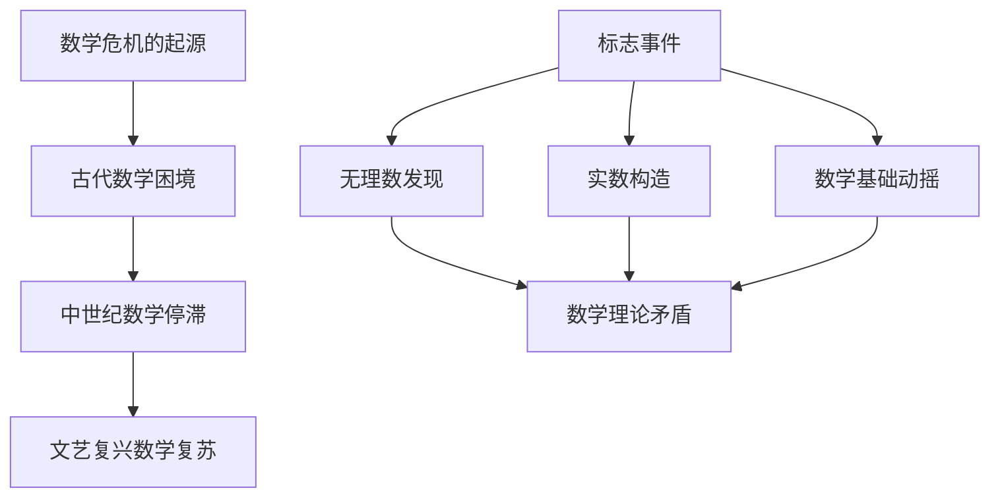

----------------------------------------------------------------

### 第二部分：数学革命的展开

#### 2.1 数学革命的先驱

数学革命的过程中，许多杰出的数学家做出了重要贡献，他们的工作推动了数学的发展。以下是一些数学革命的先驱及其贡献：

#### 2.1.1 欧几里得的贡献

欧几里得是古希腊最著名的数学家之一，他的著作《几何原本》对几何学的发展产生了深远影响。欧几里得提出了公理体系，定义了几何学的基本概念和命题，为后来的几何学研究奠定了基础。

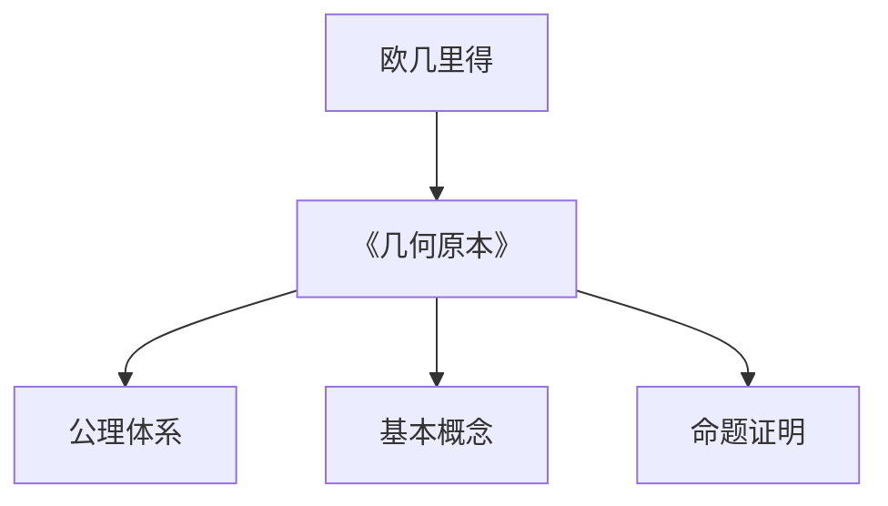

#### 2.1.2 笛卡尔与解析几何

笛卡尔是法国著名的数学家和哲学家，他在17世纪提出了解析几何的概念。解析几何将几何问题转化为代数问题，使得几何学和代数学得以紧密结合。这一革命性的思想为后来的数学研究提供了新的工具和方法。

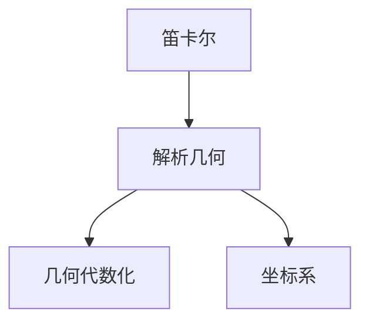

#### 2.1.3 范黎安与微积分

范黎安是英国数学家，他于17世纪末提出了微积分的基本思想。微积分研究变化率和累积量，是现代数学的重要组成部分。范黎安的工作为后来的数学家们提供了研究动力系统、连续统和无穷级数的方法。

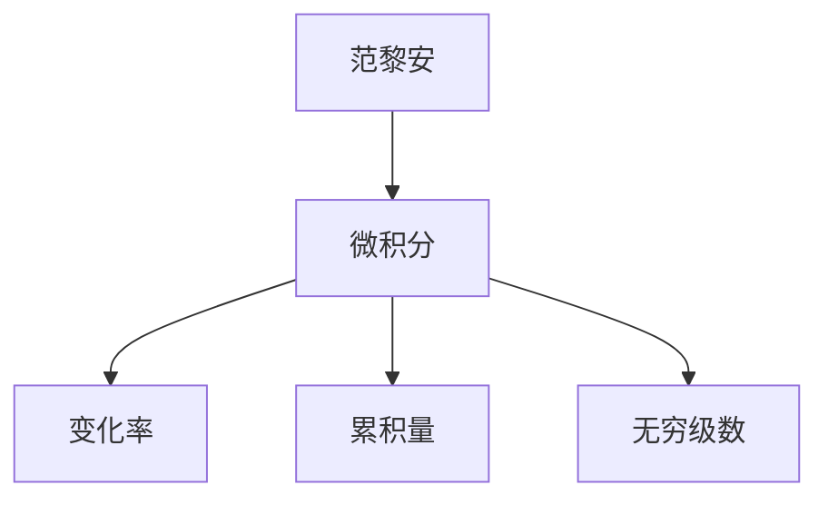

#### 2.2 数学革命的成果

数学革命的过程中，许多新的数学理论和方法被提出，这些成果对数学的发展产生了深远影响。

#### 2.2.1 代数学的发展

代数学在数学革命中取得了显著进展。数学家们提出了群、环、域等新的代数结构，这些结构为解决复杂的数学问题提供了强有力的工具。代数学的发展使得数学理论更加丰富和完备。

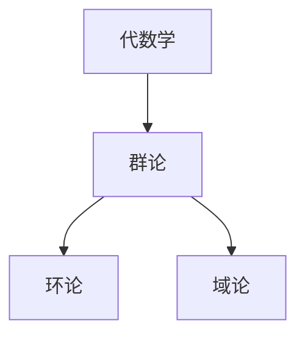

#### 2.2.2 几何学的进步

解析几何的提出使得几何学得到了新的发展。通过解析方法，几何学问题可以转化为代数问题，从而得到更简洁和精确的解法。此外，非欧几何的提出打破了传统的欧几里得几何观念，为几何学的研究开辟了新的方向。

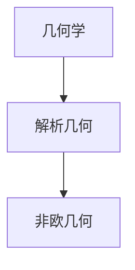

#### 2.2.3 概率论的创立

概率论在数学革命中得到了独立发展。概率论的创立为解决实际问题提供了新的数学工具，如统计方法、随机过程等。概率论的研究不仅丰富了数学理论，还对自然科学、社会科学等领域产生了深远影响。

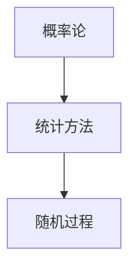

#### 2.3 数学革命的影响

数学革命不仅改变了数学理论和方法，还对数学方法论、自然科学应用和数学教育产生了深远影响。

#### 2.3.1 数学方法论的变革

数学革命推动了数学方法论的变革。从直观的几何方法到代数方法，再到现代的抽象代数方法，数学方法论经历了巨大的变革。这一变革使得数学研究更加精确和严格。

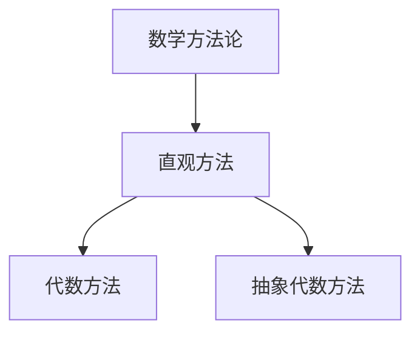

#### 2.3.2 数学在自然科学中的应用

数学革命使得数学在自然科学中的应用得到了空前发展。从物理学到化学，从生物学到天文学，数学理论和方法被广泛应用于各个自然科学领域，推动了科学技术的进步。

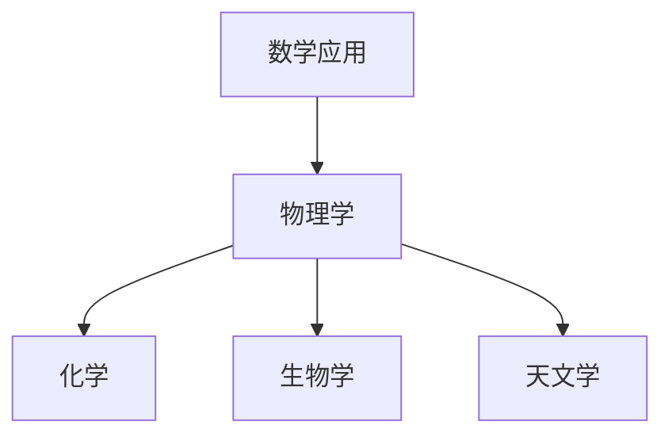

#### 2.3.3 数学教育的影响

数学革命对数学教育产生了深远影响。从传统的计算技能教育到现代的数学理论教育，数学教育的内容和方法发生了巨大变化。现代数学教育注重培养学生的逻辑思维能力、抽象能力和创新能力，以适应现代科技的发展。

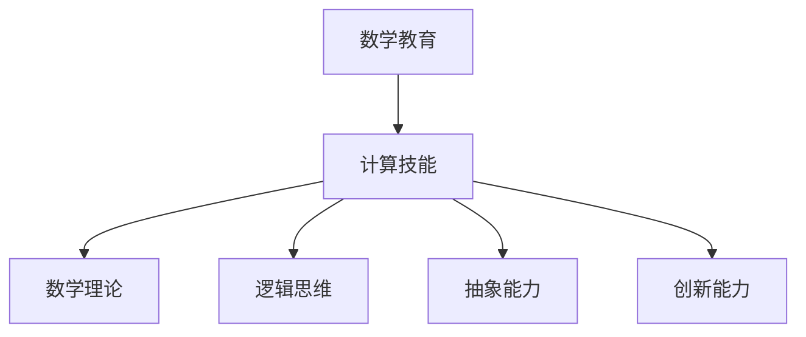

### 总结

数学革命的先驱包括欧几里得、笛卡尔和范黎安等人，他们的贡献为数学的发展奠定了基础。数学革命的成果包括代数学的发展、几何学的进步和概率论的创立等。数学革命的影响体现在数学方法论、自然科学应用和数学教育等方面。数学革命不仅改变了数学的理论体系，还推动了科技和社会的发展。

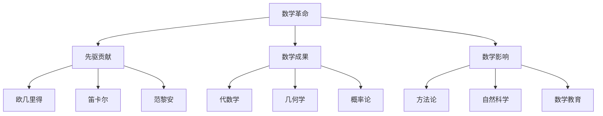

----------------------------------------------------------------

## 第三部分：现代数学的发展与挑战

### 3.1 现代数学的崛起

现代数学在19世纪末到20世纪初经历了迅速崛起，这一时期出现了许多新的数学分支和理论。以下是现代数学崛起的一些关键进展：

#### 3.1.1 代数学的新进展

代数学在19世纪取得了重要进展，特别是群论、环论和域论的发展。这些代数结构为解决复杂的数学问题提供了强有力的工具。代数学的新进展还包括线性代数和多项式代数，这些理论在物理学、工程学和计算机科学等领域得到了广泛应用。

#### 3.1.2 几何学的新面貌

几何学在20世纪经历了重大变革，特别是非欧几何和微分几何的发展。非欧几何打破了传统的欧几里得几何观念，引入了不同的几何空间。微分几何研究几何对象的局部和全局性质，为物理学中的相对论和量子场论提供了重要的数学基础。

#### 3.1.3 数论的发展

数论在20世纪也取得了重要进展，特别是数论中的素数分布、同余方程和数论函数的研究。这些理论在密码学、信息科学和计算机科学等领域得到了广泛应用。数论的研究还涉及到数论中的素数定理、哥德巴赫猜想和黎曼猜想等著名问题。

### 3.2 数学与物理学的关系

数学与物理学之间的紧密关系是现代科学发展的重要特征。数学为物理学提供了强有力的工具和方法，而物理学则为数学提供了丰富的应用背景和问题。

#### 3.2.1 数学在物理学中的应用

数学在物理学中的应用非常广泛，从经典力学到量子力学，从电磁学到相对论，数学都扮演了关键角色。例如，微积分在经典力学中用于描述物体的运动，微分方程在电磁场理论中用于描述电磁波传播，群论在量子力学中用于描述粒子的对称性。

#### 3.2.2 物理学对数学的挑战

物理学的发展不断对数学提出新的挑战。例如，量子力学中的量子场论涉及到复杂的数学结构，如黎曼曲面和高维流形。相对论中的广义相对论需要解决时空几何的问题，这为微分几何的发展提供了新的动力。

#### 3.2.3 数学在量子力学中的作用

量子力学是现代物理学中最重要的理论之一，而数学在量子力学中起到了核心作用。量子力学的数学描述涉及到希尔伯特空间、算符理论和测不准原理等。这些数学工具不仅帮助我们理解微观世界的规律，还推动了数学本身的发展。

### 3.3 数学未来展望

随着科技的不断进步，数学在未来将继续发挥重要作用。以下是数学未来展望的一些方向：

#### 3.3.1 数学在信息科学中的应用

信息科学是21世纪的重要领域，数学在信息科学中的应用将越来越广泛。例如，密码学中的数论和代数结构用于设计安全通信协议，图论和网络理论用于优化网络结构和资源分配。

#### 3.3.2 数学与社会问题

数学在社会问题中的应用也将越来越受到关注。例如，统计学和概率论在公共卫生、经济学和社会科学等领域具有广泛应用。数学模型可以帮助我们更好地理解和解决复杂的社会问题。

#### 3.3.3 数学研究的未来趋势

数学研究的未来趋势将涉及到更多交叉学科的研究，如数学与生物学、物理学和计算机科学的结合。此外，数学还将继续探索新的数学结构和理论，以解决当前科学和工程中的挑战。

### 总结

现代数学在19世纪末到20世纪初经历了迅速崛起，代数学、几何学和数论取得了重要进展。数学与物理学之间的紧密关系为物理学的发展提供了强有力的工具和方法。随着科技的进步，数学在未来将继续发挥重要作用，推动科学和社会的发展。

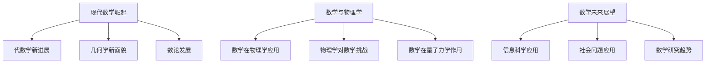

----------------------------------------------------------------

## 第四部分：数学危机与革命的启示

### 4.1 数学危机的教训

数学危机给我们带来了许多宝贵的教训，这些教训对数学研究和应用具有重要意义。

#### 4.1.1 数学理论的严谨性

数学危机提醒我们，数学理论必须具备高度的严谨性。只有在严密的理论基础上，数学才能保持其可靠性和正确性。例如，实数的构造过程中，数学家们通过严格证明的方式解决了无理数的问题，确保了数学体系的稳定性。

#### 4.1.2 数学方法的发展

数学危机促使数学方法不断发展，以应对新的数学问题和挑战。例如，在解决实数构造问题时，数学家们引入了集合论和构造主义等新的数学方法。这些方法不仅解决了当时的危机，还为后来的数学研究提供了新的工具。

#### 4.1.3 数学家的责任

数学家在解决数学危机的过程中扮演着重要角色。他们必须具备扎实的数学知识和深刻的洞察力，以发现和解决数学问题。同时，数学家还需要承担社会责任，确保数学理论的正确性和可靠性。

### 4.2 数学革命的启示

数学革命给我们的启示是多方面的，不仅体现在数学理论上，还涉及到数学教育和社会应用。

#### 4.2.1 数学创新的动力

数学革命的历程表明，数学创新是推动数学发展的关键动力。在解决数学危机的过程中，数学家们不断提出新的理论和方法，推动数学不断向前发展。这种创新精神值得我们学习和借鉴。

#### 4.2.2 数学教育的改革

数学革命对数学教育产生了深远影响，提示我们数学教育需要不断改革。现代数学教育应注重培养学生的逻辑思维、抽象能力和创新能力，以适应现代科技的发展。

#### 4.2.3 数学在现代社会中的角色

数学在现代社会中扮演着重要角色，不仅应用于自然科学和工程技术领域，还涉及到社会科学、经济管理和艺术等领域。数学的广泛应用使得数学在现代社会中具有不可替代的地位。

### 4.3 数学史的研究方法

数学史的研究方法对于理解数学的发展具有重要意义。以下是一些数学史的研究方法：

#### 4.3.1 数学史的重要性

数学史研究有助于我们理解数学的发展历程，揭示数学理论和方法的形成过程。通过研究数学史，我们可以更好地理解数学的本质和规律，为现代数学研究提供启示。

#### 4.3.2 数学史的研究方法

数学史的研究方法包括文献研究、历史比较、概念分析和案例分析等。文献研究通过分析数学家的著作和文献，了解他们的思想和贡献。历史比较通过对比不同时期和不同领域的数学发展，揭示数学的演变规律。概念分析通过探讨数学概念的形成和演变，理解数学理论的本质。案例分析通过具体案例的研究，分析数学问题的解决过程和方法。

#### 4.3.3 数学史的资料来源

数学史的资料来源包括数学家的著作、历史文献、数学杂志和学术会议记录等。这些资料为我们提供了研究数学史的第一手资料，有助于我们深入了解数学的发展历程。

### 总结

数学危机与革命的历程给我们带来了宝贵的教训和启示，这些教训和启示对数学研究和应用具有重要意义。通过数学史的研究方法，我们可以更好地理解数学的发展历程和规律，为现代数学研究提供指导。

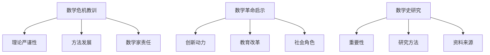

----------------------------------------------------------------

## 附录

### 附录 A：数学危机与革命的关键人物

#### A.1 阿基米德

阿基米德是古希腊时期的著名数学家和物理学家。他提出了许多重要的数学理论，如阿基米德螺旋和浮力原理。阿基米德的工作为后来的数学和物理学发展奠定了基础。

#### A.2 欧拉

欧拉是18世纪著名的数学家，他的贡献涵盖了数学的各个领域。欧拉提出了许多重要的数学公式和定理，如欧拉公式和欧拉图。他的工作对现代数学的发展产生了深远影响。

#### A.3 高斯

高斯是19世纪著名的数学家，他被誉为“数学王子”。高斯在数论、代数学、几何学和物理学等领域做出了重要贡献。他的研究为后来的数学发展奠定了基础。

#### A.4 康托尔

康托尔是19世纪末的数学家，他提出了集合论的概念，并对无穷集合进行了深入研究。康托尔的工作打破了传统的数学观念，为现代数学的发展开辟了新的方向。

### 附录 B：数学危机与革命的文献推荐

#### B.1 《数学史》

《数学史》是一本经典的数学史著作，全面介绍了数学的发展历程和重要事件。这本书对理解数学危机与革命的历史背景具有重要意义。

#### B.2 《数学危机》

《数学危机》是一本关于数学危机的专著，详细分析了数学史上的一系列危机事件及其影响。这本书有助于我们深入了解数学危机的起源和解决过程。

#### B.3 《数学革命》

《数学革命》是一本关于数学革命的著作，讲述了数学革命的历史背景、关键事件和重要人物。这本书为我们提供了理解数学革命的全景视角。

#### B.4 《数学哲学》

《数学哲学》是一本关于数学哲学的专著，探讨了数学的本质、意义和方法。这本书有助于我们理解数学的发展逻辑和哲学基础。

通过这些文献，我们可以更深入地了解数学危机与革命的历史背景、关键事件和重要人物，从而对数学的本质和发展规律有更深刻的认识。

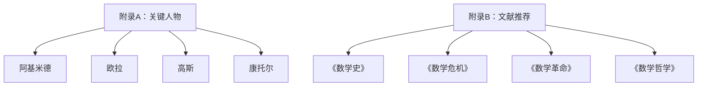

----------------------------------------------------------------

## 文章总结

本文以《数学史上的数学危机与革命》为题，通过分析数学危机的起源、数学革命的展开以及现代数学的发展与挑战，揭示了数学危机与革命对数学发展的重要影响。以下是本文的核心观点和结论：

1. **数学危机的起源**：数学危机源于古代数学的困境、中世纪数学的发展与停滞以及文艺复兴时期数学的复苏。数学危机的标志事件包括无理数的发现、实数的构造和数学基础的动摇。

2. **数学革命的先驱**：欧几里得、笛卡尔和范黎安等数学家的贡献为数学革命奠定了基础。他们的工作推动了代数学、几何学和概率论的发展。

3. **数学革命的成果**：数学革命的成果体现在代数学的发展、几何学的进步和概率论的创立等方面，这些成果改变了数学方法论，推动了数学在自然科学中的应用，并对数学教育产生了深远影响。

4. **现代数学的发展与挑战**：现代数学在19世纪末到20世纪初经历了迅速崛起，代数学、几何学和数论取得了重要进展。数学与物理学的关系日益紧密，数学在信息科学、社会问题等方面具有广泛应用。未来数学研究将涉及更多交叉学科。

5. **数学危机与革命的启示**：数学危机提醒我们数学理论的严谨性和数学方法的发展，数学革命启示我们数学创新的动力、数学教育的改革以及数学在现代社会中的角色。

本文通过对数学史上的一系列数学危机与革命的深入分析，为读者提供了一个清晰、系统的数学史视角，以激发对数学本质的深入思考。通过了解数学危机与革命的历程，我们不仅能够更好地理解数学的发展规律，还能为现代数学研究提供启示。

在数学的发展过程中，危机与革命是不可或缺的环节。正是由于数学家们不断面对危机、解决危机，数学才得以不断进步，推动科学技术的快速发展。本文通过分析数学史上的危机与革命，旨在为广大数学爱好者提供一个深入了解数学发展历程的机会，以激发对数学本质的热爱与追求。

## 最佳实践 tips、小结、注意事项、拓展阅读

#### 最佳实践 tips

1. **深入阅读数学史**：通过阅读数学史著作，了解数学发展历程中的关键事件和人物，有助于我们更好地理解数学的本质和规律。
2. **学习数学方法论**：掌握数学方法论，如公理体系、证明方法、数学模型等，有助于我们在数学研究中更系统地思考和解决问题。
3. **关注数学交叉领域**：数学与其他学科的交叉融合日益紧密，关注数学在物理学、信息科学、经济学等领域的应用，有助于拓宽我们的视野。

#### 小结

本文从数学危机的起源、数学革命的展开、现代数学的发展与挑战以及数学危机与革命的启示等方面，全面分析了数学史上的数学危机与革命。通过深入了解数学危机与革命的历程，我们不仅能够更好地理解数学的发展规律，还能为现代数学研究提供启示。

#### 注意事项

1. **严谨性**：数学研究必须具备高度的严谨性，确保数学理论和方法的可信度和可靠性。
2. **创新性**：数学研究应注重创新，不断提出新的理论和方法，以解决实际问题。
3. **应用性**：数学应关注实际应用，为自然科学、工程技术和社会科学等领域提供强有力的工具和方法。

#### 拓展阅读

1. **《数学史》**：这本书全面介绍了数学的发展历程和重要事件，有助于我们深入了解数学的历史背景。
2. **《数学危机》**：这本书详细分析了数学史上的一系列危机事件及其影响，有助于我们理解数学危机的产生和解决过程。
3. **《数学革命》**：这本书讲述了数学革命的历史背景、关键事件和重要人物，为我们提供了理解数学革命的全景视角。
4. **《数学哲学》**：这本书探讨了数学的本质、意义和方法，有助于我们理解数学的发展逻辑和哲学基础。

通过拓展阅读，我们可以更深入地了解数学危机与革命的历史背景、关键事件和重要人物，从而对数学的本质和发展规律有更深刻的认识。

### 附录

**附录 A：数学危机与革命的关键人物**

1. **阿基米德**：古希腊著名数学家和物理学家，提出了阿基米德螺旋和浮力原理。
2. **欧拉**：18世纪著名数学家，提出了欧拉公式和欧拉图。
3. **高斯**：19世纪著名数学家，被誉为“数学王子”，在数论、代数学和几何学等领域做出了重要贡献。
4. **康托尔**：19世纪末数学家，提出了集合论的概念，对无穷集合进行了深入研究。

**附录 B：数学危机与革命的文献推荐**

1. **《数学史》**：全面介绍了数学的发展历程和重要事件。
2. **《数学危机》**：详细分析了数学史上的一系列危机事件及其影响。
3. **《数学革命》**：讲述了数学革命的历史背景、关键事件和重要人物。
4. **《数学哲学》**：探讨了数学的本质、意义和方法。

通过阅读这些文献，我们可以更深入地了解数学危机与革命的历史背景、关键事件和重要人物，从而对数学的本质和发展规律有更深刻的认识。

