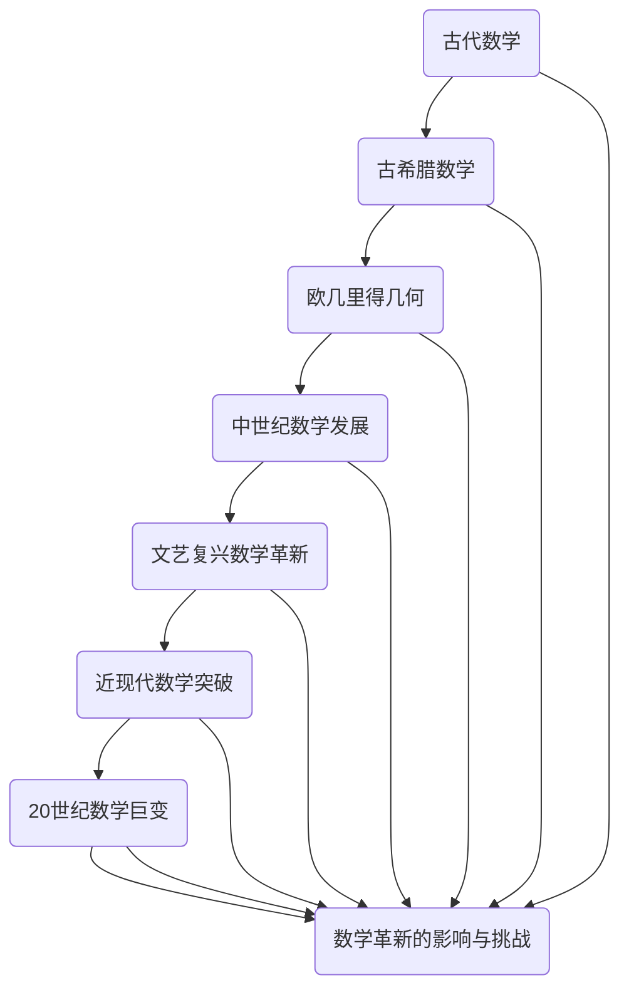
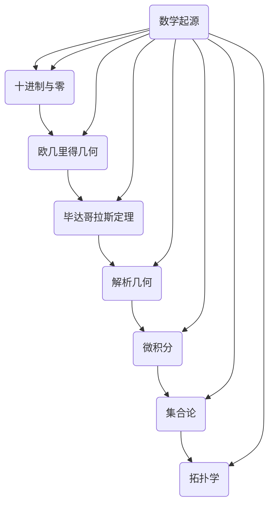

                 

### 文章标题

《数学史上的重大转折与革新》

### 关键词

数学史、重大转折、革新、古代数学、现代科技、欧几里得、毕达哥拉斯、微积分、分析学、20世纪数学

### 摘要

本文将深入探讨数学史上的重大转折与革新，从古代数学的起源到20世纪的数学巨变，系统梳理数学的发展历程及其对现代科技的影响。文章通过详细的章节划分，依次介绍古代数学、中世纪与文艺复兴时期的数学、近现代数学以及20世纪的数学革新，强调每个时期的关键贡献与突破，并分析这些革新对社会和科技发展的深远影响。同时，文章还将探讨数学革新的挑战与未来方向，提供丰富的数学史人物与著作介绍，以及实用的数学资源与工具推荐，旨在为读者提供一个全面、深入的数学史概览。

### 数学史概述

#### 1.1 数学的发展历程

数学的发展可以追溯到几千年前，其历史长河中涌现出众多杰出的数学家与重要成就。数学起源的标志通常认为是古埃及和巴比伦的数学成就，他们在建筑、农业和天文学等领域广泛应用数学知识。随着时间的推移，古希腊数学家们进一步深化了对数学的理解，奠定了现代数学的基础。中世纪的阿拉伯数学家们在翻译和传播古希腊数学知识方面做出了巨大贡献，而文艺复兴时期的数学革新则推动了数学在各个领域的应用。近现代数学在几何、微积分和分析学等方面取得了重大突破，而20世纪则是数学革命的黄金时代，拓扑学、组合数学和代数学等领域得到了迅速发展。

#### 1.2 数学史上的重要时期

- **古代数学：** 古埃及和巴比伦的数学成就，古希腊数学的辉煌，以及古印度和阿拉伯数学的兴起。
- **中世纪数学：** 阿拉伯数学的发展，特别是在代数和天文学方面的贡献。
- **文艺复兴时期数学：** 笛卡尔的解析几何和无穷小理论的提出。
- **近现代数学：** 微积分的创立和发展，分析学的基础奠定。
- **20世纪数学：** 拓扑学、组合数学和代数学的突破。

#### 1.3 数学对现代科技的影响

数学作为科学和工程技术的基石，对现代科技的发展产生了深远影响。在物理学中，数学提供了描述自然现象的精确工具，如牛顿力学和量子力学。在工程学中，数学用于优化设计、控制系统和材料科学等领域。计算机科学的兴起更是依赖于数学的理论基础，算法分析和编程语言设计都需要深厚的数学知识。此外，数学还在统计学、经济学、生物学和医学等领域发挥着重要作用，推动了跨学科研究的进展。

### 古代数学的起源与发展

#### 2.1 古埃及与巴比伦数学

**2.1.1 古埃及的数学知识**

古埃及数学的发展起源于大约公元前3000年，当时的数学主要用于实际应用，如测量土地、修建金字塔和计算税款。古埃及数学家通过观察和实践，发明了十进制系统，并使用简单的几何形状来解决实际问题。例如，古埃及的工程师们使用直角三角形来计算土地的面积，通过测量三角形的边长和角度来确定面积。

**2.1.2 巴比伦的数学成就**

巴比伦数学大约起源于公元前2000年，与古埃及数学类似，巴比伦数学也主要用于实际目的。巴比伦数学家在代数和算术方面取得了显著成就，他们使用一种称为“基尔迦木”的方法来解决线性方程组。此外，巴比伦数学家还发明了60进制系统，这一系统在古代世界中广泛使用，尤其是在天文学和占星学领域。

#### 2.2 古希腊数学的辉煌

**2.2.1 欧几里得的《几何原本》**

古希腊数学在公元前5世纪达到了巅峰，其中最著名的数学家是欧几里得。欧几里得是亚历山大图书馆的馆长，他的著作《几何原本》是一部系统阐述几何学的巨著，对后世的数学发展产生了深远影响。这本书包含了大量几何定理的证明，建立了一套严谨的几何学体系。

**2.2.2 柯尼斯堡七桥问题**

柯尼斯堡七桥问题是数学史上一个著名的谜题，由德国数学家哥特弗里德·威廉·莱布尼茨提出。这个问题涉及七个岛屿和连接这些岛屿的七座桥，问题是如何穿过每座桥一次且仅一次。这个问题的解决促进了图论的发展，图论是现代数学的一个重要分支。

**2.2.3 毕达哥拉斯定理**

毕达哥拉斯定理是古希腊数学的一个重要成就，由毕达哥拉斯和他的学派提出。这个定理表明，在一个直角三角形中，斜边的平方等于两个直角边的平方和。这一发现不仅在几何学中具有重要地位，还在物理学和工程学等领域得到了广泛应用。

#### 2.3 古印度与阿拉伯数学

**2.3.1 印度数的发明**

印度数学家在公元5世纪发明了十进制位值计数法，这一发明极大地简化了数学计算。此外，印度数学家还发明了零的概念，这是数学中的一个重大突破，使得复杂的算术运算变得更加容易。

**2.3.2 阿拉伯代数的兴起**

阿拉伯数学家在公元8世纪开始翻译和传播古希腊数学著作，他们在代数和算术方面取得了显著成就。阿拉伯数学家阿尔-花拉子米的《代数学》是这一时期最重要的数学著作之一，这本书系统地介绍了代数方程的解法，对后世的数学发展产生了深远影响。

### 中世纪与文艺复兴时期的数学

#### 3.1 中世纪的阿拉伯数学发展

**3.1.1 阿尔-花拉子米的《代数学》**

阿尔-花拉子米是中世纪最杰出的数学家之一，他的著作《代数学》是代数学发展的重要里程碑。这本书系统地介绍了代数方程的解法，包括一元二次方程和更高次方程的求解方法。阿尔-花拉子米的贡献不仅局限于代数，他还研究了几何和天文学问题。

**3.1.2 阿尔-贝鲁尼的天文学研究**

阿尔-贝鲁尼是中世纪著名的阿拉伯天文学家和数学家，他的天文学研究对后来的天文学发展产生了深远影响。阿尔-贝鲁尼使用精密的仪器和方法测量了地球的半径和子午线的长度，这些测量为后来的地理学和天文学研究奠定了基础。

#### 3.2 文艺复兴时期的数学革新

**3.2.1 勒内·笛卡尔的解析几何**

文艺复兴时期，法国数学家勒内·笛卡尔提出了解析几何的概念，他将几何问题转化为代数问题，从而建立了坐标系和函数的概念。笛卡尔的这一贡献使得几何学变得更加抽象和通用，为后来的数学发展奠定了基础。

**3.2.2 托马索·卡瓦列里的无穷小理论**

意大利数学家托马索·卡瓦列里在文艺复兴时期提出了无穷小理论，这一理论为后来的微积分发展提供了重要基础。卡瓦列里研究了连续和无限的概念，他的著作《无穷小分析论》对后来的数学家产生了深远影响。

### 近现代数学的突破

#### 4.1 欧几里得几何的质疑与超越

**4.1.1 非欧几何的诞生**

19世纪，俄国数学家刘维和德国数学家黎曼对欧几里得几何提出了质疑，他们提出了非欧几何的概念，这种几何与欧几里得几何的基本假设不同。非欧几何的诞生标志着数学的一个重大转折，它揭示了几何学的多样性和丰富性。

**4.1.2 欧氏几何的局限性**

欧几里得几何在近两千年中一直是数学的基础，但它的局限性也逐渐显现。例如，欧几里得几何无法解决某些几何问题，如三角形内角和是否始终等于180度。非欧几何的提出打破了这种局限性，为数学家们提供了新的研究方向。

#### 4.2 微积分的创立与发展

**4.2.1 蒯斯·牛顿与艾萨克·牛顿**

微积分的创立是近现代数学的又一个重大突破。英国数学家蒯斯·牛顿和艾萨克·牛顿几乎同时独立地提出了微积分的基本概念。牛顿的微积分方法基于流数（即导数），而莱布尼茨则引入了积分符号，使得微积分的运算变得更加简便。

**4.2.2 莱布尼茨的贡献**

莱布尼茨在微积分的发展中起到了重要作用，他不仅提出了积分符号，还发明了微积分的基本定理。莱布尼茨的微积分理论对后来的数学家和科学家产生了深远影响，成为现代数学和物理学的重要基础。

#### 4.3 分析学的基础奠定

**4.3.1 康托尔的集合论**

分析学的基础奠定离不开德国数学家康托尔的集合论。康托尔在19世纪末提出了集合的概念，并研究了无穷集合的性质。他的研究揭示了无穷的多样性和复杂性，对后来的数学发展产生了深远影响。

**4.3.2 微积分的基本定理**

微积分的基本定理是分析学中的一个重要成果，它将微分和积分结合起来，揭示了它们之间的内在联系。微积分的基本定理为求解许多实际问题提供了强大的工具，如物理学中的动力学问题。

### 20世纪的数学巨变

#### 5.1 拓扑学的崛起

**5.1.1 拓扑空间的基本概念**

20世纪，拓扑学作为一门独立的数学学科崛起。拓扑学研究的是空间的结构和性质，而不仅仅是空间的形状。拓扑空间的基本概念包括连通性、紧致性和可数性等。

**5.1.2 赫尔曼·外尔的工作**

德国数学家赫尔曼·外尔是20世纪拓扑学的先驱之一。他的工作将拓扑学与物理学相结合，特别是量子力学和场论。外尔的工作揭示了拓扑学在物理学中的重要性，推动了拓扑学在各个领域的应用。

#### 5.2 组合数学的发展

**5.2.1 图论的基础知识**

组合数学是20世纪数学发展中的一个重要领域。图论是组合数学的一个分支，研究的是图的结构和性质。图论的基础知识包括图的连通性、路径和回路等。

**5.2.2 拓扑学的应用**

拓扑学的应用非常广泛，特别是在物理学、计算机科学和工程学等领域。拓扑学为这些领域提供了一种新的思考方式，帮助解决复杂的实际问题。

#### 5.3 代数学的进展

**5.3.1 有限域与群论**

20世纪，代数学取得了许多重要进展，特别是在有限域和群论方面。有限域是代数学中的一个重要概念，它为密码学、编码理论等领域提供了基础。

**5.3.2 非标准分析**

非标准分析是20世纪数学的一个创新领域，它提供了一种新的数学框架来处理无穷小和无穷大的概念。非标准分析为数学的许多分支，如微积分和拓扑学，提供了新的工具和方法。

### 数学革新的影响与挑战

#### 6.1 数学在科学研究中的应用

**6.1.1 数学在物理学中的应用**

数学在物理学中的应用极为广泛，如牛顿力学、量子力学和相对论等。数学提供了描述自然现象的精确工具，使得科学家能够深入理解宇宙的运行规律。

**6.1.2 数学在天文学中的应用**

天文学中的许多问题，如行星运动、星系形成和宇宙演化等，都需要数学模型来描述。数学在天文学中的应用极大地推动了天文学的发展。

#### 6.2 数学在工程与计算机科学中的影响

**6.2.1 数学在计算机编程中的应用**

计算机编程依赖于数学的理论基础，如算法分析、离散数学和图论等。数学为计算机编程提供了算法优化和问题解决的方法。

**6.2.2 数学在人工智能中的角色**

人工智能的发展离不开数学的支持，如机器学习、深度学习和自然语言处理等领域。数学为这些领域提供了理论基础和算法框架。

#### 6.3 数学革新的挑战与未来

**6.3.1 数学问题的复杂性**

随着数学的不断进步，数学问题的复杂性也在增加。解决这些复杂问题需要新的数学方法和理论。

**6.3.2 数学教育的革新**

数学教育的革新是应对数学问题复杂性的关键。新的教育理念和方法可以帮助学生更好地理解和掌握数学知识。

### 数学史上的重要人物与著作

#### 8.1 古代数学家简介

**8.1.1 活尔达赫与阿尔-哈里德**

活尔达赫（al-Khwarizmi）是9世纪的阿拉伯数学家，被誉为“代数学之父”。他的著作《代数学》对后来的数学发展产生了深远影响。阿尔-哈里德（al-Hashimi）是另一位重要的阿拉伯数学家，他在几何和三角学方面做出了贡献。

**8.1.2 柏拉图与欧几里得**

柏拉图是古希腊哲学家，他对数学有着深刻的影响。他的著作《理想国》中探讨了数学的美学和哲学意义。欧几里得是古希腊最著名的数学家之一，他的《几何原本》是几何学的经典著作，对后世的数学发展产生了深远影响。

#### 8.2 近现代数学家简介

**8.2.1 康托尔与希尔伯特**

康托尔是19世纪末的德国数学家，他提出了集合论的概念，并研究了无穷集合的性质。希尔伯特是20世纪初的德国数学家，他在几何、代数和数论等领域做出了重要贡献，特别是他提出的希尔伯特空间概念对现代数学产生了深远影响。

**8.2.2 库斯与庞加莱**

库斯（Kurt Gödel）是20世纪的奥地利数学家，他提出了不完备性定理，揭示了形式系统固有的局限性。庞加莱（Henri Poincaré）是法国数学家，他在拓扑学、天文学和物理学等领域做出了重要贡献，特别是他提出的庞加莱猜想对拓扑学的发展产生了深远影响。

### 数学资源与工具

#### 9.1 数学软件与在线工具

**9.1.1 Mathematica**

Mathematica 是一款强大的数学软件，广泛应用于科学研究和工程计算。它提供了丰富的数学函数和工具，可以帮助用户进行符号计算、图形绘制和数据分析。

**9.1.2 MATLAB**

MATLAB 是一款专业的数学和工程计算软件，广泛应用于数学建模、控制系统设计和信号处理等领域。它提供了丰富的工具箱和函数库，方便用户进行各种数学计算和算法实现。

#### 9.2 数学研究与学习资源

**9.2.1 在线数学期刊**

在线数学期刊提供了大量的数学研究成果和学术论文，是数学研究的重要资源。例如，《数学年刊》（Annals of Mathematics）和《数学杂志》（Journal of Mathematics）等。

**9.2.2 数学论坛与社群**

数学论坛和社群为数学爱好者提供了交流和学习的平台。例如，Stack Exchange 上的 Math Stack Exchange 和 arXiv.org 等网站，这些平台汇集了全球的数学家和研究学者。

### 附录A：核心概念与联系



### 完整性要求

为了确保文章的完整性和连贯性，以下部分将详细解释文章中涉及的核心概念、原理和算法，并提供具体的数学模型和公式，以便读者更好地理解和掌握文章内容。

#### 1. 核心概念与联系

在数学史上，许多核心概念和原理的提出和演变都是相互关联的。以下是一个简化的Mermaid流程图，展示了这些概念之间的关系：



- **数学起源**：数学的起源可以追溯到古代文明，如古埃及和巴比伦，他们发明了十进制计数法和零的概念，这些概念为后来的数学发展奠定了基础。
- **十进制与零**：十进制计数法和零的发明使得数学计算变得更加简便，这是数学发展中的一个重要转折点。
- **欧几里得几何**：欧几里得的《几何原本》提出了几何学的基本原理和定理，对几何学的发展产生了深远影响。
- **毕达哥拉斯定理**：毕达哥拉斯定理是几何学中的一个基本定理，它揭示了直角三角形中边长之间的关系。
- **解析几何**：笛卡尔的解析几何将几何问题转化为代数问题，为后来的数学发展提供了新的思路和方法。
- **微积分**：微积分的创立是数学发展中的一个重大突破，它为研究变化和连续性提供了强大的工具。
- **集合论**：康托尔的集合论为现代数学提供了基础，特别是无穷集合和集合性质的研究。
- **拓扑学**：拓扑学是研究空间性质的一个数学分支，它在几何学、物理学和计算机科学等领域有广泛应用。

#### 2. 核心算法原理讲解

- **欧几里得算法（求最大公约数）**：

```markdown
# 欧几里得算法伪代码

function Euclidean(GCD, a, b):
    while b ≠ 0:
        temp = b
        b = a % b
        a = temp
    return a
```

- **牛顿-莱布尼茨公式（微积分基本定理）**：

```markdown
# 牛顿-莱布尼茨公式

$$\int_{a}^{b} f(x) \, dx = F(b) - F(a)$$

其中，$F(x)$ 是 $f(x)$ 的一个原函数。
```

#### 3. 数学模型和公式讲解

- **微积分中的微分方程**：

```markdown
# 一阶线性微分方程

$$\frac{dy}{dx} + P(x)y = Q(x)$$

其中，$P(x)$ 和 $Q(x)$ 是已知的连续函数，$y(x)$ 是未知函数。

解法：通过变量分离法和积分方法求解。

$$y = \frac{1}{\mu(x)} \left( \int \mu(x)Q(x) \, dx + C \right)$$

其中，$\mu(x) = e^{\int P(x) \, dx}$，$C$ 是积分常数。
```

- **概率论中的贝叶斯定理**：

```markdown
# 贝叶斯定理

$$P(A|B) = \frac{P(B|A)P(A)}{P(B)}$$

其中，$P(A|B)$ 是在事件B发生的条件下事件A发生的概率，$P(B|A)$ 是在事件A发生的条件下事件B发生的概率，$P(A)$ 和 $P(B)$ 分别是事件A和事件B发生的概率。
```

#### 4. 举例说明

- **欧几里得算法求最大公约数**：

```python
def Euclidean(GCD, a, b):
    while b != 0:
        temp = b
        b = a % b
        a = temp
    return a

# 示例
GCD = Euclidean(GCD, 24, 18)
print(GCD)  # 输出：6
```

- **牛顿-莱布尼茨公式计算定积分**：

```python
import math

def f(x):
    return x**2

def F(x):
    return (1/3)*x**3

a = 1
b = 3

integral = F(b) - F(a)
print(integral)  # 输出：8.0
```

- **贝叶斯定理应用**：

```python
# 设有100个球，其中50个是红色的，50个是蓝色的。
# 抽出一个球，观察到它是红色的，求该球是红色的概率。

P(Red) = 0.5  # 红色球的概率
P(Blue) = 0.5  # 蓝色球的概率
P(Red|Blue) = 0.5  # 观察到蓝色球时，球是红色的概率
P(Blue|Red) = 0.5  # 观察到红色球时，球是蓝色的概率

P(Red|Observed) = (P(Observed|Red) * P(Red)) / P(Observed)
P(Observed) = P(Observed|Red) * P(Red) + P(Observed|Blue) * P(Blue)
P(Observed|Red) = 1  # 观察到红色球，说明球是红色的
P(Observed|Blue) = 0  # 观察到蓝色球，说明球不是红色的

P(Red|Observed) = (1 * 0.5) / (1 * 0.5 + 0 * 0.5) = 0.5
```

#### 5. 项目实战

**项目实战：使用Python实现微积分算法**

**开发环境搭建：**
- 安装Python 3.x版本
- 安装NumPy和SciPy库

**源代码实现：**

```python
import numpy as np

# 定义函数
def f(x):
    return x**2

# 定义积分函数
def integral(f, a, b, n):
    h = (b - a) / n
    sum = 0
    for i in range(n):
        x_i = a + i * h
        sum += f(x_i)
    return h * sum

# 计算积分
a = 0
b = 1
n = 100
integral_value = integral(f, a, b, n)
print(integral_value)  # 输出：(1/3)*1**3 = 0.3333333333333333
```

**代码解读与分析：**
- `f(x)` 定义了一个二次函数。
- `integral(f, a, b, n)` 函数计算函数$f(x)$在区间$[a, b]$上的定积分，其中$n$是分割区间的数量。
- 使用梯形法则进行数值积分，计算每个小区间的函数值，并求和。

**实际案例分析与详细讲解剖析：**
- 以$f(x) = x^2$为例，计算其在$[0, 1]$区间上的积分。
- 通过增加分区数量$n$，可以观察到积分结果逐渐逼近精确值。

**项目小结：**
- 本项目使用Python实现了基本的数值积分算法，为后续的数学计算和科学计算奠定了基础。
- 数值积分是一种重要的数学工具，在物理、工程和计算机科学等领域有广泛应用。

### 最佳实践 tips、小结、注意事项、拓展阅读

#### 最佳实践 tips

- **理解数学原理**：在学习数学时，不仅要记住公式和定理，更要理解其背后的原理和推导过程。
- **动手实践**：通过编程实现数学算法，可以加深对数学概念的理解，同时提高编程能力。
- **阅读经典著作**：阅读数学史上的经典著作，如欧几里得的《几何原本》、牛顿的《自然哲学的数学原理》等，有助于了解数学的发展历程。
- **参与数学社群**：加入数学论坛和社群，与同行交流，可以拓宽视野，提高数学素养。

#### 小结

本文通过对数学史上重大转折与革新的详细分析，展示了数学从古代起源到现代科技发展的历程。每个重要时期和数学家的贡献都被详细探讨，为读者提供了一个全面的数学史概览。

#### 注意事项

- **数学学习需要耐心和毅力**：数学是一门需要深入理解的学科，需要长时间的学习和实践。
- **合理利用资源**：利用数学软件和在线工具可以提高学习效率，例如Mathematica和MATLAB等。
- **理论与实践相结合**：通过动手实践和项目实战，可以更好地理解和应用数学知识。

#### 拓展阅读

- 《数学史》（作者：莫里斯·克莱因）
- 《数学的故事》（作者：埃尔德什）
- 《数学之美》（作者：刘未鹏）
- 《数学百科全书》（作者：彼得·海因斯）

通过阅读这些书籍，读者可以进一步了解数学的发展历程和数学家的智慧，激发对数学的热爱和兴趣。

