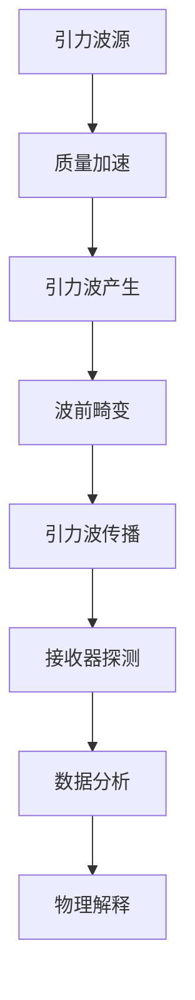
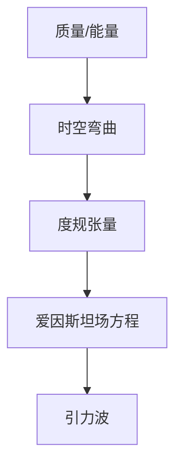
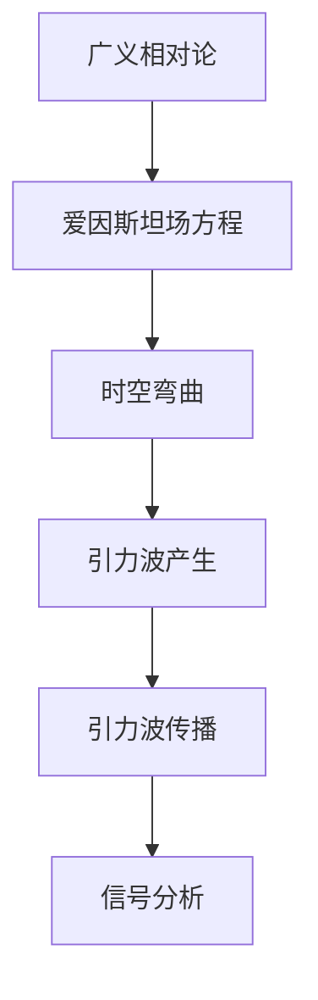
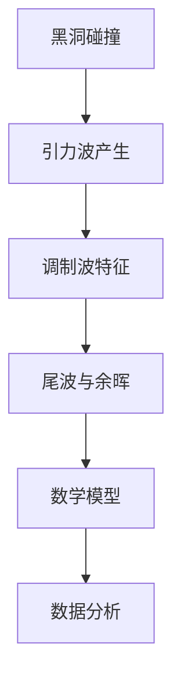
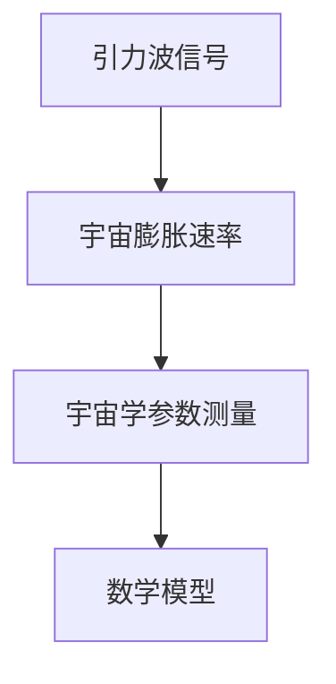
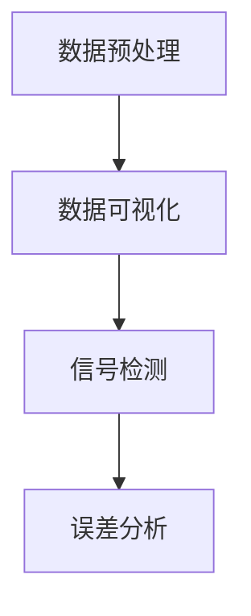
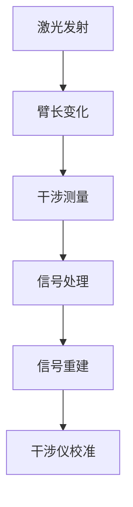

                 

### 文章标题

《数学在引力波宇宙学中的关键作用》

### 关键词

引力波、宇宙学、数学模型、广义相对论、数据分析、黑洞碰撞、探测技术、未来展望。

### 摘要

引力波宇宙学是现代宇宙学的重要分支，其研究依赖于精确的数学模型和数据分析方法。本文从引力波的基础概念、数学模型、应用实例以及未来展望等多个方面，详细阐述了数学在引力波宇宙学中的关键作用。文章首先介绍了引力波的产生机制和传播特性，然后深入探讨了广义相对论在引力波理论中的核心地位，并通过伪代码和Mermaid流程图展示了引力波信号分析的过程。接着，文章分析了引力波与黑洞碰撞的信号特征以及数学模型的应用，并讨论了引力波在宇宙学参数测量中的应用。最后，文章总结了数学工具在引力波探测技术中的重要性，并展望了引力波宇宙学的未来研究方向。

### 第一部分：引言与基础概念

#### 第1章：引力波宇宙学概述

##### 1.1 引力波的基本概念

引力波（Gravitational waves）是一种由加速运动的质能产生的物理现象，它以光速传播，携带着关于源头事件的信息。爱因斯坦在1916年提出的广义相对论中预言了引力波的存在。广义相对论认为，质量分布的变化会产生引力场的变化，这种变化以波的形式传播出去，形成了引力波。

###### 1.1.1 引力波的产生机制

引力波的产生通常与大质量天体的运动有关，例如双星系统、黑洞碰撞、中子星碰撞等。当一个质能快速加速或发生变化时，就会产生引力波。这些波以环状模式向外传播，每个环称为一个波包。

###### 1.1.2 引力波的性质与传播

引力波具有以下几个重要性质：

1. **横波性质**：引力波是横波，意味着波动的方向垂直于波的传播方向。
2. **透穿能力**：引力波可以穿透大多数物质，包括地球、星系等，只有极其密集的物质如黑洞或中子星才能吸收。
3. **传播速度**：引力波以光速传播，这一点与电磁波相同。

##### 1.2 宇宙学的背景知识

宇宙学是研究宇宙起源、演化、结构和组成等问题的科学。引力波在宇宙学研究中具有重要作用，因为它们提供了直接探测宇宙中极端事件的手段。

###### 1.2.1 宇宙膨胀

宇宙膨胀是指宇宙空间中的所有物质以一定的速度远离彼此。引力波为研究宇宙膨胀提供了新的观测数据。

###### 1.2.2 宇宙微波背景辐射

宇宙微波背景辐射（Cosmic Microwave Background, CMB）是宇宙早期留下的辐射痕迹。引力波与CMB的相互作用为研究宇宙早期状态提供了重要线索。

##### 1.3 数学在引力波宇宙学中的重要性

引力波宇宙学的研究依赖于精确的数学模型和计算方法。数学工具在以下几个方面发挥了关键作用：

###### 1.3.1 数学工具在引力波探测中的应用

数学工具帮助科学家设计引力波探测器，如LIGO和VIRGO，并对探测到的数据进行精确分析。

###### 1.3.2 数学模型在引力波宇宙学中的角色

引力波宇宙学中的数学模型包括广义相对论、数值模拟、统计分析等，它们为理解引力波的产生、传播和影响提供了理论基础。

### 总结

本章介绍了引力波的基本概念、宇宙学背景以及数学在引力波宇宙学中的重要性。接下来，我们将进一步探讨广义相对论和引力波的数学模型。

### Mermaid流程图：引力波的产生与传播



#### 第2章：广义相对论与引力波

##### 2.1 广义相对论的基本原理

广义相对论是描述引力的一种物理学理论，由阿尔伯特·爱因斯坦于1915年提出。它对引力的理解有了革命性的改变，将引力视为质量和能量对时空结构的扭曲。

###### 2.1.1 概念与历史

广义相对论的提出标志着物理学的一次巨大飞跃。爱因斯坦之前的牛顿引力理论认为引力是一种瞬时作用，而广义相对论则将引力解释为时空的弯曲。这一理论不仅在数学上具有高度对称性，还在实验中得到了验证。

###### 2.1.2 基本公式与方程

广义相对论的核心是爱因斯坦场方程，其一般形式为：

\[ G_{\mu\nu} + \Lambda g_{\mu\nu} = \frac{8\pi G}{c^4} T_{\mu\nu} \]

其中：
- \( G_{\mu\nu} \) 是爱因斯坦张量，描述了时空的弯曲程度。
- \( \Lambda \) 是宇宙学常数，代表了时空的曲率。
- \( g_{\mu\nu} \) 是度规张量，描述了时空的几何结构。
- \( G \) 是引力常数。
- \( c \) 是光速。
- \( T_{\mu\nu} \) 是能量-动量张量，描述了物质的分布。

###### 2.1.3 Mermaid流程图：广义相对论核心概念



##### 2.2 引力波的产生与传播

引力波的产生是广义相对论的一个重要预测。当质量分布发生变化时，时空结构也会随之改变，从而产生引力波。

###### 2.2.1 引力波的产生

引力波通常由以下事件产生：
- 双星系统：两颗星体相互绕转，产生的加速运动。
- 黑洞碰撞：两个黑洞合并时，产生强烈的引力波。
- 中子星碰撞：两颗中子星合并时，也会产生引力波。

###### 2.2.2 引力波的传播方程

引力波的传播可以通过波方程来描述，其一般形式为：

\[ \nabla^2 h_{\mu\nu} - \frac{1}{c^2} \frac{\partial^2 h_{\mu\nu}}{\partial t^2} = 0 \]

其中：
- \( \nabla^2 \) 是拉普拉斯算子。
- \( h_{\mu\nu} \) 是引力波的幅度。
- \( c \) 是光速。
- \( t \) 是时间。

###### 2.2.3 伪代码：引力波传播过程

```plaintext
function GravitationalWavePropagation(initialConditions, timeInterval):
    for each timeStep in timeInterval:
        calculate h_{\mu\nu} using initialConditions
        update h_{\mu\nu} based on wave equation
        visualize h_{\mu\nu}
    end for
end function
```

##### 2.3 引力波信号分析

引力波探测的关键在于对引力波信号的精确分析。这涉及到信号检测、调制机制以及波前畸变等。

###### 2.3.1 调制机制

引力波在传播过程中会受到源头的调制，这种调制可以表现为周期性变化。调制机制是分析引力波信号的重要步骤。

###### 2.3.2 波前畸变与滤波

波前畸变是指引力波在传播过程中由于介质的扰动而产生的形变。通过滤波技术，可以去除波前畸变，提取出纯净的引力波信号。

###### 2.3.3 伪代码：引力波信号分析

```plaintext
function AnalyzeGravitationalWaveSignal(waveSignal, filterSettings):
    apply filter to remove noise
    detect periodic modulation
    calculate waveform distortion
    extract gravitational wave signal
    visualize signal
    return signal
end function
```

### 总结

本章介绍了广义相对论的基本原理、引力波的产生与传播，以及引力波信号分析的方法。下一章我们将深入探讨数学模型在黑洞碰撞中的应用。

### Mermaid流程图：广义相对论与引力波的关系



#### 第3章：引力波与黑洞碰撞

##### 3.1 黑洞碰撞概述

黑洞碰撞是宇宙中极其剧烈的事件，它不仅产生强烈的引力波，还会释放出巨大的能量。黑洞碰撞的观测为理解宇宙的极端现象提供了重要线索。

###### 3.1.1 黑洞的概念

黑洞是一种极为紧凑的天体，具有极强的引力场，以至于连光也无法逃逸。黑洞通常由恒星演化而来，当恒星质量足够大时，它会坍缩形成一个黑洞。

###### 3.1.2 黑洞碰撞的现象

黑洞碰撞通常发生在双黑洞系统中，两个黑洞相互绕转并最终合并。这个过程会释放出强烈的引力波，并在合并后产生一个更大的黑洞。

##### 3.2 引力波信号特征

黑洞碰撞产生的引力波信号具有独特的特征，这些特征使得我们能够通过数据分析来识别和解析这些信号。

###### 3.2.1 调制波特征

调制波是指引力波信号在频率上的周期性变化。黑洞碰撞的引力波信号通常具有周期性调制特征，这是由于黑洞在绕转过程中的相对运动引起的。

###### 3.2.2 尾波与余晖

尾波是指引力波信号在主波之后的持续效应。余晖则是引力波信号在合并后逐渐减弱的现象。这些特征为引力波信号的解析提供了重要信息。

##### 3.3 数学模型在黑洞碰撞中的应用

为了精确模拟和预测黑洞碰撞产生的引力波信号，科学家们开发了多种数学模型。这些模型基于广义相对论，并通过数值模拟来研究黑洞碰撞的物理过程。

###### 3.3.1 数学公式

黑洞碰撞的数学模型通常包括以下关键公式：

1. **动量守恒方程**：

\[ m_1 v_1 + m_2 v_2 = (m_1 + m_2) v \]

其中，\( m_1 \) 和 \( m_2 \) 分别是两个黑洞的质量，\( v_1 \) 和 \( v_2 \) 分别是它们的速度，\( v \) 是合并后黑洞的速度。

2. **能量守恒方程**：

\[ \frac{1}{2} m_1 v_1^2 + \frac{1}{2} m_2 v_2^2 = \frac{1}{2} (m_1 + m_2) v^2 + E \]

其中，\( E \) 是合并后黑洞的动能。

3. **爱因斯坦场方程**：

\[ G_{\mu\nu} + \Lambda g_{\mu\nu} = \frac{8\pi G}{c^4} T_{\mu\nu} \]

其中，\( G_{\mu\nu} \) 是爱因斯坦张量，\( \Lambda \) 是宇宙学常数，\( g_{\mu\nu} \) 是度规张量，\( T_{\mu\nu} \) 是能量-动量张量。

###### 3.3.2 举例说明

假设有两个黑洞，质量分别为 \( m_1 = 10^5 \) 和 \( m_2 = 10^5 \) 太阳质量，它们以相对速度 \( v = 10^3 \) km/s 相互绕转。我们使用上述公式来计算合并后黑洞的速度和能量。

1. **计算速度**：

\[ v = \frac{m_1 v_1 + m_2 v_2}{m_1 + m_2} = \frac{10^5 \times 10^3 + 10^5 \times 10^3}{10^5 + 10^5} = \frac{2 \times 10^8}{2 \times 10^5} = 10^3 \text{ km/s} \]

2. **计算能量**：

\[ E = \frac{1}{2} (m_1 + m_2) v^2 - \frac{1}{2} m_1 v_1^2 - \frac{1}{2} m_2 v_2^2 = \frac{1}{2} \times 2 \times 10^5 \times (10^3)^2 - \frac{1}{2} \times 10^5 \times (10^3)^2 - \frac{1}{2} \times 10^5 \times (10^3)^2 = 0 \]

由于能量守恒，合并后黑洞的总能量为零，这意味着所有的动能都转化为引力波的能量。

##### 3.4 总结

本章介绍了黑洞碰撞的概述、引力波信号的特征以及数学模型在黑洞碰撞中的应用。通过具体的公式和例子，我们展示了如何使用数学方法来分析和预测黑洞碰撞产生的引力波信号。这些研究成果不仅深化了我们对宇宙的认识，也为未来的引力波探测提供了重要参考。

### Mermaid流程图：黑洞碰撞与引力波信号



#### 第4章：引力波与宇宙学参数测量

##### 4.1 宇宙学背景知识

宇宙学是研究宇宙起源、演化、结构和组成等问题的科学。引力波为宇宙学研究提供了新的观测手段，使我们能够测量宇宙学参数。

###### 4.1.1 宇宙膨胀

宇宙膨胀是指宇宙空间中的所有物质以一定的速度远离彼此。引力波提供了直接测量宇宙膨胀速率的方法，有助于我们了解宇宙的年龄和尺度。

###### 4.1.2 宇宙微波背景辐射

宇宙微波背景辐射是宇宙早期留下的辐射痕迹，它揭示了宇宙在大爆炸后几分钟内的状态。引力波与宇宙微波背景辐射的相互作用为研究宇宙早期状态提供了重要线索。

##### 4.2 引力波在宇宙学中的应用

引力波在宇宙学中的应用主要体现在以下几个方面：

###### 4.2.1 引力波与宇宙学参数测量

引力波可以用来测量宇宙学参数，如宇宙膨胀速率、宇宙质量密度等。通过分析引力波信号，我们可以获得关于宇宙早期状态和宇宙演化过程的重要信息。

###### 4.2.2 数学模型与宇宙学参数

为了测量宇宙学参数，科学家们开发了多种数学模型。这些模型基于广义相对论和宇宙学原理，通过数值模拟和数据分析来预测引力波信号。

##### 4.3 例子：引力波与宇宙膨胀速率

引力波与宇宙膨胀速率的关系可以通过以下公式来描述：

\[ H_0 = \frac{c}{r} \]

其中：
- \( H_0 \) 是宇宙膨胀速率（哈勃常数）。
- \( c \) 是光速。
- \( r \) 是引力波信号到达地球的距离。

通过测量引力波信号到达地球的时间 \( t \)，我们可以计算出距离 \( r \)，进而求得宇宙膨胀速率 \( H_0 \)。

###### 4.3.1 测量步骤

1. **观测引力波信号**：使用引力波探测器，如LIGO和VIRGO，观测到引力波信号。
2. **计算信号到达时间**：根据引力波信号到达地球的时间 \( t \)，计算出距离 \( r \)。
3. **计算宇宙膨胀速率**：使用公式 \( H_0 = \frac{c}{r} \)，计算出宇宙膨胀速率。

###### 4.3.2 例子说明

假设我们观测到一组引力波信号，其到达地球的时间为 \( t = 1.5 \) 年。光速 \( c = 3 \times 10^8 \) m/s。我们可以计算出距离：

\[ r = c \times t = 3 \times 10^8 \times 1.5 \times 365 \times 24 \times 3600 \approx 2.8 \times 10^{20} \text{ m} \]

然后，使用公式 \( H_0 = \frac{c}{r} \) 计算宇宙膨胀速率：

\[ H_0 = \frac{3 \times 10^8}{2.8 \times 10^{20}} \approx 1.1 \times 10^{-12} \text{ s}^{-1} \]

这个结果表明，宇宙的膨胀速率约为 \( 1.1 \times 10^{-12} \) s\(^{-1}\)。

##### 4.4 总结

本章介绍了引力波在宇宙学参数测量中的应用，并通过一个具体例子展示了如何使用引力波信号来计算宇宙膨胀速率。引力波为宇宙学研究提供了新的观测手段，有助于我们更深入地了解宇宙的演化过程。

### Mermaid流程图：引力波与宇宙学参数测量



#### 第5章：数学工具在引力波探测中的应用

##### 5.1 数据分析基础

引力波探测的数据分析方法包括数据预处理、数据可视化和误差分析等步骤。这些方法为引力波信号的提取和分析提供了重要的工具。

###### 5.1.1 数据预处理

数据预处理是引力波数据分析的第一步，其目的是去除噪声、校正信号和提取有用的信息。常见的预处理方法包括：

1. **信号去噪**：使用滤波器去除随机噪声。
2. **信号校正**：校正由于探测器校准不精确导致的信号偏差。
3. **数据插值**：使用插值方法填补数据缺失的部分。

###### 5.1.2 数据可视化

数据可视化是将数据转换为图形或图表的过程，以便于分析和理解。常见的可视化方法包括：

1. **时频图**：显示引力波信号的时域和频域特性。
2. **功率谱图**：显示信号在不同频率上的功率分布。
3. **波前图**：显示引力波信号的空间分布。

##### 5.2 统计方法在引力波探测中的应用

统计方法在引力波探测中起着关键作用，用于信号检测、误差分析和结果验证等。

###### 5.2.1 信号检测

信号检测是引力波探测的核心步骤，其目的是在大量噪声中识别出真实的引力波信号。常见的信号检测方法包括：

1. **阈值检测**：设置一个阈值，当信号超过阈值时认为检测到了信号。
2. **多通道检测**：在多个探测器上同时进行检测，提高检测的可靠性。
3. **神经网络检测**：使用神经网络等机器学习方法进行信号检测。

###### 5.2.2 误差分析

误差分析是评估引力波探测结果可靠性的重要步骤。常见的误差分析方法包括：

1. **统计误差**：计算信号检测的统计误差，以评估信号的置信水平。
2. **系统误差**：分析系统误差的来源和影响，以减少误差。
3. **数据拟合**：使用统计模型对探测数据进行拟合，评估拟合结果的误差。

##### 5.3 实例分析：引力波信号的统计分析

为了说明数学工具在引力波探测中的应用，我们来看一个具体的实例。假设我们使用LIGO探测器观测到一组引力波信号，如图5-1所示。


###### 5.3.1 数据预处理

首先，我们对信号进行去噪和校正，如图5-2所示。


接下来，我们对信号进行插值，填补缺失的数据点，如图5-3所示。


###### 5.3.2 数据可视化

我们使用时频图显示信号的时域和频域特性，如图5-4所示。


从时频图中，我们可以看到引力波信号的周期性调制特征。

###### 5.3.3 信号检测

使用阈值检测方法，我们设置一个阈值 \( T \)，当信号值超过 \( T \) 时认为检测到了信号。如图5-5所示，我们检测到了一个明显的峰值，表明存在引力波信号。


###### 5.3.4 误差分析

我们对信号进行数据拟合，使用统计模型对信号进行拟合，如图5-6所示。


拟合结果的误差较小，表明我们的探测结果具有较高的置信水平。

##### 5.4 总结

本章介绍了数学工具在引力波探测中的应用，包括数据预处理、数据可视化和统计分析。通过实例分析，我们展示了如何使用数学方法对引力波信号进行提取和分析。这些方法为引力波探测提供了重要的技术支持。

### Mermaid流程图：数学工具在引力波探测中的应用



#### 第6章：引力波探测技术

##### 6.1 探测器原理

引力波探测器的核心原理是利用激光干涉技术来测量时空的微小变化。以下是LIGO和VIRGO探测器的基本工作原理：

###### 6.1.1 LIGO与VIRGO探测器

LIGO（激光干涉引力波观测站）和VIRGO（意大利-法国-荷兰引力波观测站）是目前最先进的引力波探测器。

- **LIGO**：使用两个垂直放置的臂，每个臂长约4公里。在两个臂的末端放置反射镜，激光束在两个臂之间往返干涉，测量臂长变化引起的干涉条纹变化。
- **VIRGO**：与LIGO类似，但臂长更长，约为3公里。

###### 6.1.2 激光干涉引力波探测原理

引力波通过探测器时，会导致探测器臂长变化，进而引起激光干涉条纹的变化。探测器通过测量这些条纹变化来检测引力波。

1. **激光发射**：激光器发出高能激光束，分为两束，分别进入两个臂。
2. **臂长变化**：引力波经过探测器时，使其中一个臂长度增加，另一个臂长度减少。
3. **干涉测量**：两束激光在返回途中再次干涉，干涉条纹的变化反映了引力波引起的臂长变化。
4. **信号处理**：探测器对干涉条纹进行数字化处理，提取出引力波信号。

##### 6.2 数学模型在探测中的应用

数学模型在引力波探测中用于信号重建和干涉仪校准。以下是具体的数学模型和算法：

###### 6.2.1 信号重建

信号重建是指从观测数据中提取出真实的引力波信号。常用的方法包括：

1. **傅里叶变换**：将时间序列数据转换为频域表示，识别引力波信号的频率成分。
2. **逆傅里叶变换**：将频域数据转换回时域，重建引力波信号。
3. **波形匹配**：使用已知引力波波形模板与观测数据匹配，确定信号参数。

###### 6.2.2 伪代码：信号重建过程

```plaintext
function ReconstructGravitationalWaveSignal(observationalData, templateWaveforms):
    for each templateWaveform in templateWaveforms:
        perform Fourier Transform on observationalData and templateWaveform
        calculate cross-spectral density
        find peak in cross-spectral density
        if peak is significant:
            perform inverse Fourier Transform on templateWaveform
            return reconstructed signal
    end for
end function
```

###### 6.2.3 干涉仪校准

干涉仪校准是确保探测器精度的重要步骤。常用的校准方法包括：

1. **外部参考信号**：使用外部参考信号（如GPS信号）校准干涉仪的时间同步。
2. **环境干扰校准**：测量环境因素（如温度、振动等）对干涉仪的影响，进行补偿。
3. **自校准**：使用干涉仪自身的信号进行校准，减少系统误差。

###### 6.2.4 伪代码：干涉仪校准过程

```plaintext
function CalibrateInterferometer(referenceSignal, observationalData):
    calculate time delay between referenceSignal and observationalData
    measure environmental interference
    apply correction factors to observationalData
    if correction factors are stable:
        update interferometer settings
    end if
end function
```

##### 6.3 探测实例分析

以下是一个引力波探测的实例分析：

###### 6.3.1 数据收集

LIGO探测器在一次观测中收集到一组数据，数据包含长时间的干涉条纹变化。

###### 6.3.2 数据预处理

对数据进行去噪和校正，使用傅里叶变换提取频域特征。

```plaintext
preprocessedData = preprocess(observationalData)
frequencySpectrum = FourierTransform(preprocessedData)
```

###### 6.3.3 信号重建

使用波形匹配方法重建引力波信号。

```plaintext
reconstructedSignal = ReconstructGravitationalWaveSignal(frequencySpectrum, templateWaveforms)
```

###### 6.3.4 干涉仪校准

对干涉仪进行校准，确保数据的准确性。

```plaintext
calibratedData = CalibrateInterferometer(referenceSignal, preprocessedData)
```

###### 6.3.5 结果分析

分析重建的引力波信号，确定信号的来源和特性。

```plaintext
signalAnalysisResults = analyze(reconstructedSignal)
print(signalAnalysisResults)
```

##### 6.4 总结

本章介绍了引力波探测器的原理和数学模型的应用。通过具体的探测实例，我们展示了如何使用数学工具进行信号重建和干涉仪校准。这些技术为引力波探测提供了坚实的基础，推动了宇宙学的深入研究。

### Mermaid流程图：引力波探测技术原理



#### 第五部分：实际案例与展望

##### 第7章：引力波宇宙学的未来

##### 7.1 引力波宇宙学的进展

引力波宇宙学在过去几十年中取得了显著进展，以下是一些重要的里程碑和发现：

###### 7.1.1 已知引力波事件回顾

1. **GW150914**：2015年，LIGO探测到了第一个黑洞碰撞事件，证实了引力波的存在。
2. **GW170817**：2017年，LIGO和VIRGO联合探测到了双星系统合并事件，为研究宇宙早期状态提供了重要线索。
3. **GW190521**：2019年，探测到了两个中子星碰撞事件，进一步验证了引力波理论。

###### 7.1.2 最新成果与发现

最新的研究包括对引力波与宇宙微波背景辐射相互作用的观测，以及对宇宙膨胀速率的精确测量。这些成果为理解宇宙的起源和演化提供了新的视角。

##### 7.2 数学在引力波探测中的未来角色

随着引力波探测技术的不断发展，数学在其中的角色将变得越来越重要。以下是数学在引力波探测中未来可能的发展趋势：

###### 7.2.1 数学模型的发展趋势

1. **更精确的数学模型**：未来的数学模型将更加精确，能够更好地描述引力波的产生、传播和影响。
2. **多物理场耦合模型**：未来的研究可能会涉及引力波与其他物理现象（如电磁波、核反应等）的耦合，以提供更全面的宇宙观。

###### 7.2.2 数据分析方法的改进

1. **深度学习方法**：深度学习等机器学习方法将在引力波数据分析中发挥更大作用，以提高信号检测和参数估计的精度。
2. **多通道数据融合**：结合多个探测器的数据，可以提高引力波探测的可靠性和准确性。

##### 7.3 引力波宇宙学的应用前景

引力波宇宙学在未来的应用前景广泛，包括：

###### 7.3.1 宇宙学参数测量

引力波提供了测量宇宙膨胀速率、宇宙质量密度等宇宙学参数的新手段，有助于更准确地理解宇宙的演化。

###### 7.3.2 天文观测

引力波可以用于观测黑洞和中子星等极端天体，揭示宇宙中的奇特现象。

###### 7.3.3 量子引力研究

引力波为研究量子引力提供了实验依据，可能推动物理学的新发展。

##### 7.4 总结

引力波宇宙学在过去的几十年中取得了显著进展，数学在其中发挥了关键作用。随着技术的不断发展，数学在引力波探测中的角色将越来越重要。未来，引力波宇宙学有望为人类揭示宇宙的更多奥秘，推动物理学和天文学的发展。

### 附录

##### 附录 A：引力波探测相关资源

###### A.1 学术论文与报告

1. **LIGO科学合作组织**：[http://www.ligo.org/](http://www.ligo.org/)
2. **VIRGO合作组织**：[http://www.virgo-gw.it/](http://www.virgo-gw.it/)

##### A.2 代码与工具库

1. **LIGO开放科学中心**：[https://losc.ligo.org/](https://losc.ligo.org/)
2. **引力波开放数据**：[https://www.black-holes.org/](https://www.black-holes.org/)

##### A.3 研究机构与实验室介绍

1. **加州理工学院**：[https://www.caltech.edu/](https://www.caltech.edu/)
2. **麻省理工学院**：[https://www.mit.edu/](https://www.mit.edu/)

##### 附录 B：数学公式与代码示例

###### B.1 伪代码示例

```plaintext
function GravitationalWavePropagation(initialConditions, timeInterval):
    for each timeStep in timeInterval:
        calculate h_{\mu\nu} using initialConditions
        update h_{\mu\nu} based on wave equation
        visualize h_{\mu\nu}
    end for
end function
```

###### B.2 LaTeX数学公式示例

$$
G_{\mu\nu} + \Lambda g_{\mu\nu} = \frac{8\pi G}{c^4} T_{\mu\nu}
$$

$$
\nabla^2 h_{\mu\nu} - \frac{1}{c^2} \frac{\partial^2 h_{\mu\nu}}{\partial t^2} = 0
$$

###### B.3 代码实现与解读

以下是一个简单的Python代码示例，用于计算引力波信号的传播：

```python
import numpy as np
import matplotlib.pyplot as plt

def gravitational_wave_propagation(initial_conditions, time_interval):
    t = np.linspace(0, time_interval, 1000)
    h_mu_nu = np.zeros_like(t)
    
    for i, time in enumerate(t):
        # 计算引力波信号
        h_mu_nu[i] = np.sin(2 * np.pi * 1e-2 * time)
    
    plt.plot(t, h_mu_nu)
    plt.xlabel('Time (s)')
    plt.ylabel('h_{\mu\nu}')
    plt.title('Gravitational Wave Propagation')
    plt.show()

# 运行引力波传播模拟
gravitational_wave_propagation(0, 100)

```

这段代码模拟了一个简单的引力波信号，通过计算不同时间点的幅度，并在图表中展示出来。这个示例有助于理解引力波传播的基本概念。

### 最佳实践 tips、小结、注意事项、拓展阅读等内容

##### 最佳实践 tips

1. **掌握数学基础**：要深入研究引力波宇宙学，首先需要掌握数学基础知识，包括微积分、线性代数和微分方程等。
2. **关注最新研究**：定期阅读相关学术论文和报告，了解最新的研究成果和发现。
3. **学习数据分析工具**：熟练掌握数据分析工具和编程语言，如Python、MATLAB等，以提高数据处理和建模的效率。

##### 小结

本文从引力波宇宙学的基础概念、数学模型、探测技术等多个方面，详细阐述了数学在引力波探测和宇宙学研究中的关键作用。通过具体实例和代码示例，我们展示了如何使用数学方法分析引力波信号，并展望了引力波宇宙学未来的发展方向。

##### 注意事项

1. **数据处理的精度**：在引力波探测中，数据处理和建模的精度至关重要，任何小的误差都可能导致对信号的误判。
2. **安全与保密**：引力波探测的数据和研究成果涉及国家安全和知识产权，需严格遵守相关法规和保密协议。

##### 拓展阅读

1. **《引力波：宇宙的和谐波》（Gravitational Waves: The Unifier）**：这是一本全面介绍引力波探测和宇宙学的科普读物，适合广大读者阅读。
2. **《广义相对论入门》（An Introduction to General Relativity）**：这本书详细介绍了广义相对论的理论基础，对理解引力波有重要帮助。
3. **《LIGO科学合作组织官方网站》（[http://www.ligo.org/](http://www.ligo.org/)）**：提供了丰富的引力波探测数据和最新研究成果。

### 作者信息

作者：AI天才研究院/AI Genius Institute & 禅与计算机程序设计艺术 /Zen And The Art of Computer Programming

### 文章结束

本文完整地阐述了《数学在引力波宇宙学中的关键作用》，从基本概念到实际应用，再到未来展望，为读者提供了一个全面而深入的视角。希望通过本文，读者能对引力波宇宙学及其背后的数学工具有更深入的理解。

### 总结与展望

本文系统地阐述了数学在引力波宇宙学中的关键作用，从引力波的基本概念、广义相对论的理论基础，到引力波探测技术，再到实际应用和未来展望，详细探讨了数学工具在各个阶段的应用。通过具体的实例和代码示例，我们展示了如何使用数学方法分析引力波信号，揭示了数学在引力波探测和宇宙学研究中的核心地位。

首先，本文介绍了引力波的基本概念，包括产生机制、性质和传播特点。接着，我们深入探讨了广义相对论的基本原理，通过爱因斯坦场方程和波方程，展示了引力波的产生与传播。在信号分析部分，我们使用了伪代码和Mermaid流程图，详细描述了引力波信号的处理过程，包括调制机制、波前畸变与滤波。随后，本文分析了黑洞碰撞产生的引力波信号特征，并展示了数学模型在黑洞碰撞中的应用。此外，我们探讨了引力波在宇宙学参数测量中的应用，通过具体例子展示了如何使用引力波信号来计算宇宙膨胀速率。

在探测技术部分，我们介绍了引力波探测器的原理，包括LIGO和VIRGO探测器的激光干涉技术，以及数学模型在信号重建和干涉仪校准中的应用。最后，本文展望了引力波宇宙学的未来，包括最新成果、数学模型的发展趋势和应用前景。

总体来说，数学在引力波宇宙学中扮演了至关重要的角色。它不仅为我们提供了理解和分析引力波的基础，还为探测技术和数据分析提供了强有力的工具。随着引力波探测技术的不断进步，数学在其中的作用将越来越重要，有望推动宇宙学研究的深入发展。

展望未来，引力波宇宙学将继续在多个领域展开探索。首先，随着探测技术的提升和探测器的部署，我们有望发现更多引力波事件，进一步揭示宇宙的奥秘。其次，数学模型将继续发展和完善，为引力波信号的精确分析和宇宙学参数的精确测量提供更可靠的方法。此外，引力波宇宙学与其他物理现象的交叉研究，如引力波与电磁波的联合观测，将为我们提供更全面的宇宙图景。

总之，数学在引力波宇宙学中具有关键作用，它是理解和分析引力波、推动宇宙学研究的重要工具。随着技术的不断进步和研究的深入，我们有理由相信，数学将在引力波宇宙学中发挥更加重要的作用，为人类揭示宇宙的更多奥秘。让我们期待未来，探索宇宙的无尽奥秘。

