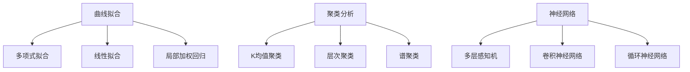

                 


## 第1章 引言

### 1.1 引力波的基本概念

引力波是爱因斯坦广义相对论预言的一种物理现象，它是由质量加速运动所产生的时空扰动，以光速传播。引力波的存在最早在1916年由爱因斯坦在研究广义相对论时预言。引力波的基本概念可以简单理解为：当两个质量较大的天体相互绕转或发生碰撞时，会引发时空的微小振荡，这种振荡以波的形式向外传播，即引力波。

### 1.2 引力波源母体的识别重要性

引力波的探测为我们提供了一个全新的研究宇宙的手段。通过对引力波信号的精确测量，科学家可以识别出引力波源母体，比如黑洞、中子星等致密天体的碰撞事件。识别引力波源母体的意义主要体现在以下几个方面：

1. **宇宙学探测**：通过探测引力波，科学家可以更加准确地测量宇宙的膨胀历史，了解宇宙的组成和演化。
2. **致密天体研究**：引力波源母体的识别有助于我们深入研究黑洞和中子星等致密天体的性质和相互作用。
3. **多信使天文学**：引力波探测与电磁波观测相结合，可以为我们提供更全面的天文观测数据，揭示宇宙中的未知现象。

### 1.3 本书结构概述

本书旨在探讨数学在引力波源母体精确识别中的应用。全书分为七个章节，具体内容如下：

- **第1章 引言**：介绍了引力波的基本概念和识别引力波源母体的重要性。
- **第2章 数学基础**：介绍了微积分、线性代数和概率论的基础知识，为后续章节的应用打下基础。
- **第3章 引力波信号分析**：探讨了引力波信号的特性和常用的信号处理方法。
- **第4章 数学模型**：介绍了用于引力波源母体识别的数学模型，包括曲线拟合、聚类分析和神经网络等。
- **第5章 核心算法原理**：详细讲解了核心算法的原理，包括伪代码展示和性能分析。
- **第6章 数学公式与数学模型讲解**：对数学公式和模型进行了详细解释，并提供了实际应用的例子。
- **第7章 项目实战**：通过一个实际案例，展示了如何搭建开发环境、实现模型训练和评估。

通过这些章节的逐步讲解，读者可以系统地了解数学在引力波源母体识别中的应用，掌握相关理论和技术。

## 第2章 数学基础

在探讨数学在引力波源母体精确识别中的应用之前，我们需要首先了解一些基本的数学概念和工具。本章将介绍微积分、线性代数和概率论的基础知识，这些知识将为后续章节的应用奠定基础。

### 2.1 微积分基础

#### 2.1.1 导数与微分

导数是微积分中的一个核心概念，它描述了一个函数在某一点的局部变化率。给定一个函数 \( f(x) \)，其导数 \( f'(x) \) 定义为：

$$
f'(x) = \lim_{{h \to 0}} \frac{f(x+h) - f(x)}{h}
$$

导数的直观意义是，当我们在函数 \( f(x) \) 的某个点 \( x \) 处进行微小变化 \( h \) 时，函数值的变化量与 \( h \) 的比值。如果这个比值趋近于某个固定值 \( L \)，那么 \( L \) 就是 \( f(x) \) 在点 \( x \) 的导数。

微分是导数的另一种表达方式，它强调的是函数变化量与自变量变化量之间的关系。对于函数 \( f(x) \)，其微分 \( df \) 定义为：

$$
df = f'(x)dx
$$

这里，\( dx \) 是自变量 \( x \) 的一个无穷小变化量，\( df \) 是函数 \( f(x) \) 的相应无穷小变化量。

#### 2.1.2 积分与反演

积分是导数的反演过程，它从变化率 \( f'(x) \) 恢复出原来的函数 \( f(x) \)。给定函数 \( f(x) \) 的导数 \( f'(x) \)，其不定积分（也称为反导数）表示为：

$$
F(x) = \int f'(x)dx + C
$$

其中，\( C \) 是积分常数。定积分则是积分在某个区间上的累计值，定义如下：

$$
\int_{a}^{b} f(x)dx = \lim_{{n \to \infty}} \sum_{i=1}^{n} f(x_i^*)\Delta x
$$

这里，\( \Delta x = \frac{b-a}{n} \)，而 \( x_i^* \) 是每个子区间的采样点。

#### 2.1.3 微分方程

微分方程是包含导数或微分的方程，是描述自然界和工程领域中动态过程的重要数学工具。例如，一个简单的线性一阶微分方程可以表示为：

$$
\frac{dy}{dx} + P(x)y = Q(x)
$$

其解法通常涉及变量分离法、积分因子法等。

### 2.2 线性代数基础

#### 2.2.1 矩阵与行列式

矩阵是数学中用来表示多个数字的数组，常用于线性变换和系统求解。一个 \( m \times n \) 的矩阵 \( A \) 可以表示为：

$$
A = \begin{bmatrix}
a_{11} & a_{12} & \cdots & a_{1n} \\
a_{21} & a_{22} & \cdots & a_{2n} \\
\vdots & \vdots & \ddots & \vdots \\
a_{m1} & a_{m2} & \cdots & a_{mn}
\end{bmatrix}
$$

行列式是矩阵的一个数值属性，用于判断矩阵的秩、求解线性方程组等。一个 \( n \times n \) 的矩阵 \( A \) 的行列式 \( |A| \) 可以通过下列公式计算：

$$
|A| = \sum_{\sigma \in S_n} \text{sign}(\sigma) \prod_{i=1}^{n} a_{i,\sigma_i}
$$

其中，\( S_n \) 是所有 \( n! \) 个排列的集合，\( \text{sign}(\sigma) \) 是排列 \( \sigma \) 的符号。

#### 2.2.2 向量空间与线性变换

向量空间是一组向量的集合，这些向量可以线性组合并满足一些基本性质，如加法和标量乘法。一个向量 \( \mathbf{v} \) 可以表示为：

$$
\mathbf{v} = \begin{bmatrix}
v_1 \\
v_2 \\
\vdots \\
v_n
\end{bmatrix}
$$

线性变换是一种将一个向量空间映射到另一个向量空间的函数，通常用矩阵表示。例如，一个线性变换 \( T: \mathbb{R}^2 \to \mathbb{R}^2 \) 可以表示为：

$$
T(\mathbf{x}) = A\mathbf{x}
$$

其中，\( A \) 是一个 \( 2 \times 2 \) 的矩阵。

#### 2.2.3 特征值与特征向量

特征值和特征向量是矩阵分析中的核心概念。给定一个方阵 \( A \)，如果存在一个非零向量 \( \mathbf{v} \) 和一个标量 \( \lambda \)，使得 \( A\mathbf{v} = \lambda\mathbf{v} \)，则 \( \lambda \) 是 \( A \) 的一个特征值，\( \mathbf{v} \) 是对应的特征向量。

### 2.3 概率论基础

#### 2.3.1 随机变量与概率分布

随机变量是一个能够取不同数值的变量，其取值具有不确定性。例如，抛掷一枚硬币，正面朝上的次数就是一个随机变量。概率分布描述了随机变量取不同值的概率分布情况。

离散型随机变量的概率分布函数（PMF）定义为：

$$
P(X = x) = f_X(x)
$$

连续型随机变量的概率分布函数（PDF）定义为：

$$
f_X(x) = P(a \leq X \leq b)
$$

#### 2.3.2 大数定律与中心极限定理

大数定律描述了当试验次数趋近于无穷时，样本均值趋近于真实概率分布的均值。一个经典的表述是：

$$
\lim_{{n \to \infty}} \frac{1}{n} \sum_{i=1}^{n} X_i = E(X)
$$

其中，\( X_i \) 是独立同分布的随机变量，\( E(X) \) 是其期望值。

中心极限定理则表明，当独立随机变量的数量足够大时，它们的和（或平均值）趋近于正态分布。该定理的核心表述是：

$$
\frac{\sum_{i=1}^{n} X_i - n\mu}{\sqrt{n}\sigma} \xrightarrow{D} N(0,1)
$$

其中，\( \mu \) 是期望值，\( \sigma \) 是标准差。

#### 2.3.3 贝叶斯推断

贝叶斯推断是一种基于概率论进行推理的方法。给定先验概率和观察数据，贝叶斯定理可以更新我们对某个事件发生概率的估计。

贝叶斯定理表述如下：

$$
P(A|B) = \frac{P(B|A)P(A)}{P(B)}
$$

其中，\( P(A|B) \) 是在事件 \( B \) 发生的条件下事件 \( A \) 发生的概率，\( P(B|A) \) 是在事件 \( A \) 发生的条件下事件 \( B \) 发生的概率，\( P(A) \) 和 \( P(B) \) 分别是事件 \( A \) 和 \( B \) 的先验概率。

通过本章的数学基础介绍，我们为后续章节中的应用打下了坚实的基础。在接下来的章节中，我们将进一步探讨如何利用这些数学工具来精确识别引力波源母体。

## 第3章 引力波信号分析

引力波信号的检测和分析是精确识别引力波源母体的关键步骤。这一章节将详细讨论引力波信号的特性以及常用的信号处理方法。

### 3.1 引力波信号的特性

引力波信号具有以下几个主要特性：

#### 3.1.1 谐振信号与噪声信号

引力波信号通常表现为一个周期性的波动，这种波动被称为谐振信号。谐振信号的特征是具有明确的周期性和波形形状，比如正弦波或方波。另一方面，由于引力波探测设备本身可能受到外部环境噪声的干扰，所以实际接收到的信号中常常含有噪声。这种噪声可能来自于仪器设备的自身噪声、环境干扰等因素。

#### 3.1.2 引力波信号的时频分析

引力波信号的时频分析是了解信号在不同时间和频率上的变化情况。由于引力波信号的频率范围较宽，时频分析可以帮助我们识别信号的频率成分和变化趋势。常用的时频分析方法包括短时傅里叶变换（STFT）和小波变换等。

### 3.2 常见信号处理方法

为了准确识别引力波信号，科学家们采用了多种信号处理方法，以下是一些主要的处理方法：

#### 3.2.1 快速傅里叶变换（FFT）

快速傅里叶变换（FFT）是一种高效的算法，用于计算信号的频谱。通过FFT，我们可以将时间域上的信号转换到频域上，从而分析信号的频率成分。FFT在引力波信号处理中被广泛应用，因为它可以快速、准确地提供信号的频谱信息。

#### 3.2.2 小波变换

小波变换是一种局部化的时频分析方法，可以同时提供信号在不同时间和频率上的信息。与FFT不同，小波变换适用于非平稳信号的分析。在引力波信号处理中，小波变换可以更好地捕捉信号的时间变化特征，特别是在信号频率变化较大的情况下。

#### 3.2.3 波特图分析

波特图分析是一种用于分析系统频率响应的技术。通过波特图，我们可以了解系统在不同频率下的增益和相位响应。在引力波信号处理中，波特图分析可以帮助我们评估探测系统的频率特性和噪声水平，从而优化信号处理算法。

### 3.3 信号处理流程

在引力波信号的检测和分析过程中，通常包括以下几个步骤：

1. **数据采集**：使用激光干涉仪等设备采集引力波信号数据。
2. **预处理**：对原始信号进行预处理，包括滤波、去噪等，以去除信号中的噪声和干扰。
3. **频谱分析**：利用FFT、小波变换等方法进行频谱分析，提取信号的频率成分。
4. **特征提取**：从频谱分析结果中提取关键特征，如信号的周期、频率和幅度等。
5. **信号识别**：利用机器学习和模式识别技术，将特征与已知的引力波信号模式进行匹配，识别出引力波信号。

通过上述信号处理方法，科学家们可以有效地从复杂的观测数据中识别出引力波信号，为进一步研究引力波源母体提供可靠的数据支持。在下一章中，我们将介绍用于引力波源母体识别的数学模型。

## 第4章 数学模型

在精确识别引力波源母体的过程中，数学模型起着至关重要的作用。本章将介绍几种常见的数学模型，包括基于曲线拟合的方法、基于聚类分析的方法以及基于神经网络的方法。

### 4.1 引力波源母体识别的数学模型

#### 4.1.1 基于曲线拟合的方法

曲线拟合是一种通过寻找合适的函数来逼近一组数据点的方法。在引力波源母体识别中，曲线拟合可以用于预测引力波信号的波形和特性。常见的曲线拟合方法包括多项式拟合、线性拟合和局部加权回归等。

**多项式拟合**：多项式拟合通过建立多项式函数来逼近数据点。给定一组数据点 \( (x_i, y_i) \)，多项式拟合的目标是最小化误差函数：

$$
E = \sum_{i=1}^{n} (y_i - P(x_i))^2
$$

其中，\( P(x) \) 是拟合的多项式函数。

**线性拟合**：线性拟合通过建立线性函数 \( y = ax + b \) 来逼近数据点。其目标是最小化误差平方和：

$$
E = \sum_{i=1}^{n} (y_i - ax_i - b)^2
$$

**局部加权回归**：局部加权回归（Local Weighted Regression, LWR）是一种基于加权最小二乘法的曲线拟合方法。它通过引入权重函数来局部逼近数据点。给定一组数据点 \( (x_i, y_i) \)，权重函数 \( w_i \) 通常与 \( x_i \) 相关，如高斯权重函数：

$$
w_i = \exp\left(-\frac{(x_i - x)^2}{2\sigma^2}\right)
$$

拟合目标是最小化加权误差平方和：

$$
E = \sum_{i=1}^{n} w_i (y_i - ax_i - b)^2
$$

#### 4.1.2 基于聚类分析的方法

聚类分析是一种无监督学习方法，用于将数据点划分为多个群组，使得同一群组内的数据点尽可能相似，不同群组的数据点尽可能不同。常见的聚类算法包括K均值聚类、层次聚类和谱聚类等。

**K均值聚类**：K均值聚类是一种迭代优化算法，通过初始化K个质心，然后逐步更新质心和聚类结果，直到收敛。给定一组数据点 \( x_1, x_2, ..., x_n \)，K均值聚类的基本步骤如下：

1. 初始化K个质心 \( \mu_1, \mu_2, ..., \mu_K \)。
2. 将每个数据点 \( x_i \) 赋予最近的质心，形成初始聚类结果。
3. 更新每个质心，使其成为其所属簇中所有点的平均值。
4. 重复步骤2和3，直到聚类结果收敛。

**层次聚类**：层次聚类是一种自底向上或自顶向下的聚类方法，通过逐步合并或分解簇来形成层次结构。层次聚类分为凝聚层次聚类和分裂层次聚类两种。

**谱聚类**：谱聚类利用数据的图结构来发现聚类结构。给定一个 \( n \times n \) 的相似性矩阵 \( S \)，谱聚类的目标是最小化簇内距离和，最大化簇间距离和。其基本步骤如下：

1. 构造图 \( G = (V, E) \)，其中顶点 \( V \) 表示数据点，边 \( E \) 表示相似性矩阵 \( S \)。
2. 计算图 \( G \) 的拉普拉斯矩阵 \( L = D - A \)，其中 \( D \) 是对角矩阵，\( A \) 是邻接矩阵。
3. 对拉普拉斯矩阵进行特征值分解 \( L = QDQ^T \)。
4. 选择前 \( k \) 个小的特征值对应的特征向量，形成聚类结果。

#### 4.1.3 基于神经网络的方法

神经网络是一种通过模拟生物神经元之间相互作用来学习和处理数据的计算模型。在引力波源母体识别中，神经网络可以用于特征提取和分类。

**多层感知机**：多层感知机（Multilayer Perceptron, MLP）是一种前馈神经网络，通常包含输入层、隐藏层和输出层。输入层接收输入数据，隐藏层通过非线性激活函数进行特征提取，输出层产生最终分类结果。

**卷积神经网络**：卷积神经网络（Convolutional Neural Network, CNN）是一种特别适合处理图像数据的神经网络。通过卷积操作和池化操作，CNN可以有效提取图像中的局部特征。

**循环神经网络**：循环神经网络（Recurrent Neural Network, RNN）是一种可以处理序列数据的神经网络。RNN通过将序列中的每个元素作为输入，并保留状态信息来处理序列数据。

### 4.2 数学模型解释与联系

为了更好地理解引力波源母体识别的数学模型，我们可以使用Mermaid流程图来展示这些模型之间的关系。以下是一个简化的Mermaid流程图示例：



在这个流程图中，我们首先介绍了基于曲线拟合的方法，包括多项式拟合、线性拟合和局部加权回归。接下来，我们介绍了基于聚类分析的方法，包括K均值聚类、层次聚类和谱聚类。最后，我们介绍了基于神经网络的方法，包括多层感知机、卷积神经网络和循环神经网络。

通过这个Mermaid流程图，我们可以清晰地看到各种数学模型之间的联系和区别，为后续章节的应用提供了直观的指导。

### 4.3 数学模型在实际应用中的示例

为了更好地理解上述数学模型在实际引力波源母体识别中的应用，我们将通过几个具体的示例来展示。

#### 4.3.1 多项式拟合示例

假设我们有一组观测到的引力波信号数据点 \( (x_i, y_i) \)，如下所示：

| x   | y    |
| --- | ---- |
| 1   | 2    |
| 2   | 4    |
| 3   | 6    |
| 4   | 8    |

我们希望使用多项式拟合来逼近这组数据点。首先，我们选择一个二次多项式模型 \( y = ax^2 + bx + c \) 来进行拟合。通过最小化误差函数：

$$
E = \sum_{i=1}^{4} (y_i - (ax_i^2 + bx_i + c))^2
$$

我们得到拟合的多项式方程为：

$$
y = 2x^2 + 2x + 1
$$

通过这个多项式拟合模型，我们可以预测未知数据点的引力波信号值。

#### 4.3.2 K均值聚类示例

假设我们有一组数据点：

| x   | y    |
| --- | ---- |
| 1   | 2    |
| 2   | 4    |
| 3   | 6    |
| 4   | 8    |
| 5   | 10   |

我们希望使用K均值聚类将这些数据点划分为两个簇。首先，我们初始化两个质心 \( \mu_1 = (1, 3) \) 和 \( \mu_2 = (4, 7) \)。然后，我们将每个数据点分配到最近的质心，形成初始聚类结果：

| x   | y    | 质心 |
| --- | ---- | ---- |
| 1   | 2    | \( \mu_1 \) |
| 2   | 4    | \( \mu_1 \) |
| 3   | 6    | \( \mu_2 \) |
| 4   | 8    | \( \mu_2 \) |
| 5   | 10   | \( \mu_2 \) |

接下来，我们更新质心，使其成为其所属簇中所有点的平均值：

\( \mu_1 = \frac{(1+2)}{2}, \frac{(2+4)}{2} = (1.5, 3) \)

\( \mu_2 = \frac{(4+6+8+10)}{4} = (6.5, 7.5) \)

再次将数据点分配到最近的质心，并重复此过程，直到聚类结果收敛。

通过K均值聚类，我们可以将这组数据点有效地划分为两个簇。

#### 4.3.3 多层感知机示例

假设我们使用多层感知机对引力波信号进行分类。给定一组输入数据 \( x = (x_1, x_2, ..., x_n) \)，我们定义一个多层感知机模型，包含输入层、隐藏层和输出层。

输入层有 \( n \) 个神经元，隐藏层有 \( m \) 个神经元，输出层有 \( k \) 个神经元。每个神经元的输出可以通过以下公式计算：

$$
z_j = \sum_{i=1}^{m} w_{ij}x_i + b_j
$$

其中，\( w_{ij} \) 是权重，\( b_j \) 是偏置。激活函数通常使用ReLU（Rectified Linear Unit）函数：

$$
a_j = \max(0, z_j)
$$

输出层的分类结果通过softmax函数计算：

$$
P(y=k) = \frac{e^{z_k}}{\sum_{i=1}^{k} e^{z_i}}
$$

通过训练和优化权重和偏置，我们可以使多层感知机模型能够准确分类引力波信号。

通过上述示例，我们可以看到数学模型在引力波源母体识别中的实际应用。这些模型为我们提供了强大的工具，帮助我们理解和分析引力波信号，从而提高识别精度。

## 第5章 核心算法原理

在引力波源母体的识别过程中，核心算法的设计和实现至关重要。本章将详细讲解几种关键算法的原理，并使用伪代码来展示其实现过程。

### 5.1 基于伪代码的核心算法讲解

#### 5.1.1 算法1：曲线拟合

曲线拟合的目标是找到一个数学模型来逼近一组数据点。以下是一个简单的曲线拟合算法，使用最小二乘法进行多项式拟合。

```python
# 伪代码
# 输入：观测数据点列表 data，多项式阶数 degree
# 输出：拟合多项式系数列表 coefficients
# 创建一个系数矩阵 X 和目标向量 y
X = []
y = []
for point in data:
    xi = [1, point[0], point[0]**2, ..., point[0]**degree]
    X.append(xi)
    y.append(point[1])

# 计算系数矩阵 X 的逆矩阵
inv_X = inverse(X)

# 计算多项式系数
coefficients = inv_X * y

# 返回系数列表
return coefficients
```

#### 5.1.2 算法2：聚类分析

聚类分析的目标是将一组数据点划分为若干个簇。以下是一个简单的K均值聚类算法的伪代码实现。

```python
# 伪代码
# 输入：数据集 data，簇数 k
# 输出：聚类结果 clusters
# 初始化 k 个质心
centroids = initialize_centroids(data, k)

# 循环迭代，直到收敛
while not converged:
    # 分配数据点到最近的质心
    clusters = assign_points_to_centroids(data, centroids)

    # 更新质心
    new_centroids = update_centroids(clusters, k)

    # 检查收敛条件
    if check_convergence(centroids, new_centroids):
        converged = True
    else:
        centroids = new_centroids

# 返回聚类结果
return clusters
```

#### 5.1.3 算法3：神经网络

神经网络是一种模拟生物神经元之间相互作用的计算模型，用于特征提取和分类。以下是一个简单的多层感知机神经网络的伪代码实现。

```python
# 伪代码
# 输入：训练数据集 dataset，迭代次数 epochs，学习率 learning_rate
# 输出：神经网络权重 weights 和偏置 biases
# 初始化权重和偏置
weights = initialize_weights(input_size, hidden_size, output_size)
biases = initialize_biases(hidden_size, output_size)

# 循环迭代 epochs 次
for epoch in range(epochs):
    # 前向传播
    hidden layer inputs = [weights[i] * input + biases[i] for i in range(hidden_size)]
    hidden layer outputs = activate(hidden layer inputs)

    # 输出层预测
    output layer inputs = [weights[hidden_size + i] * hidden layer output + biases[hidden_size + i] for i in range(output_size)]
    output layer outputs = activate(output layer inputs)

    # 计算损失
    loss = calculate_loss(output layer outputs, labels)

    # 反向传播
    d_output = derivative(output layer outputs, labels)
    d_hidden = [derivative(hidden layer outputs, weights[i]) * d_output for i in range(hidden_size)]

    # 更新权重和偏置
    [weights[i] -= learning_rate * hidden layer output * d_output for i in range(hidden_size)]
    [biases[i] -= learning_rate * d_output for i in range(hidden_size)]

    # 更新隐藏层权重和偏置
    [weights[i] -= learning_rate * input * d_hidden[j] for i in range(hidden_size) for j in range(output_size)]

# 返回训练完成的神经网络权重和偏置
return weights, biases
```

### 5.2 算法性能分析与优化

在引力波源母体识别中，算法的性能分析和优化至关重要。以下是对上述算法的性能分析和优化策略：

#### 5.2.1 时间复杂度分析

- **曲线拟合**：时间复杂度主要取决于多项式阶数 \( degree \)。对于 \( n \) 个数据点，计算系数矩阵 \( X \) 的逆矩阵的时间复杂度为 \( O(degree^3) \)。整体算法的时间复杂度约为 \( O(n \times degree^3) \)。
- **K均值聚类**：每次迭代的时间复杂度主要取决于数据点数量 \( n \) 和簇数 \( k \)。每次迭代的时间复杂度约为 \( O(n \times k) \)。算法需要迭代多次直到收敛，因此总体时间复杂度约为 \( O(t \times n \times k) \)，其中 \( t \) 是迭代次数。
- **多层感知机**：每次迭代的时间复杂度主要取决于输入层、隐藏层和输出层的神经元数量。整体时间复杂度约为 \( O(epochs \times n \times hidden_size \times output_size) \)。

#### 5.2.2 空间复杂度分析

- **曲线拟合**：空间复杂度主要取决于数据点数量 \( n \) 和多项式阶数 \( degree \)。整体空间复杂度约为 \( O(n \times degree) \)。
- **K均值聚类**：空间复杂度主要取决于数据点数量 \( n \) 和簇数 \( k \)。整体空间复杂度约为 \( O(n \times k) \)。
- **多层感知机**：空间复杂度主要取决于输入层、隐藏层和输出层的神经元数量。整体空间复杂度约为 \( O(input_size \times hidden_size \times output_size) \)。

#### 5.2.3 算法优化策略

- **曲线拟合**：可以通过选择合适的多项式阶数来优化计算复杂度。此外，使用更高效的算法（如牛顿法）进行曲线拟合可以提高计算效率。
- **K均值聚类**：可以通过选择合适的初始质心来加速收敛。使用随机初始化或者使用K-means++方法可以显著提高聚类效果和收敛速度。
- **多层感知机**：可以通过使用更高效的优化算法（如随机梯度下降、Adam优化器）来提高训练速度和收敛效果。同时，适当调整学习率和隐藏层神经元数量可以优化模型性能。

通过以上分析，我们可以看到每种算法在性能和空间复杂度上的特点，并采取相应的优化策略来提高其在引力波源母体识别中的应用效果。

### 5.3 算法在引力波源母体识别中的应用

在引力波源母体识别中，算法的应用流程可以分为以下几个步骤：

1. **数据预处理**：对观测到的引力波信号进行预处理，包括去噪、归一化等，以提高数据质量。
2. **曲线拟合**：使用曲线拟合算法对预处理后的数据点进行拟合，得到引力波信号的近似模型。
3. **聚类分析**：使用聚类算法将拟合后的信号划分为多个簇，每个簇代表不同的引力波源母体。
4. **神经网络分类**：使用多层感知机等神经网络对聚类结果进行进一步分类，识别出具体的引力波源母体。

通过这些步骤，我们可以实现对引力波源母体的精确识别，为后续的天文学研究提供可靠的数据支持。

总之，核心算法在引力波源母体识别中起着至关重要的作用。通过对算法的深入理解和优化，我们可以提高识别精度和效率，从而推动引力波天文学的发展。

## 第6章 数学公式与数学模型讲解

在本章节中，我们将深入探讨用于引力波源母体识别的关键数学公式和模型，并结合实际应用进行详细讲解和举例说明。

### 6.1 数学公式

在引力波源母体识别中，数学公式发挥着核心作用。以下列出几个重要的数学公式，并用LaTeX格式进行表示。

#### 6.1.1 曲线拟合

曲线拟合中的多项式拟合公式如下：

$$
y = a_0 + a_1x + a_2x^2 + \cdots + a_nx^n
$$

其中，\( a_0, a_1, \ldots, a_n \) 是多项式的系数。

#### 6.1.2 聚类分析

K均值聚类的目标是最小化簇内距离和，公式如下：

$$
\min \sum_{i=1}^K \sum_{x_j \in C_i} ||x_j - \mu_i||^2
$$

其中，\( \mu_i \) 是第 \( i \) 个簇的质心，\( C_i \) 是第 \( i \) 个簇的集合。

#### 6.1.3 神经网络

在神经网络中，每个神经元的输出可以通过以下公式计算：

$$
z_j = \sum_{i=1}^n w_{ij}x_i + b_j
$$

其中，\( w_{ij} \) 是权重，\( x_i \) 是输入，\( b_j \) 是偏置。

### 6.2 数学模型讲解

除了上述数学公式，我们还将介绍几个关键的数学模型，并结合实际应用进行详细讲解。

#### 6.2.1 聚类分析数学模型

K均值聚类是一种基于距离的聚类方法，它通过迭代更新质心和簇分配来最小化簇内距离和。其数学模型可以表示为：

$$
\mu_i = \frac{1}{|C_i|} \sum_{x_j \in C_i} x_j
$$

其中，\( |C_i| \) 是第 \( i \) 个簇中的数据点数量。

例如，假设我们有一组数据点：

| x   | y    |
| --- | ---- |
| 1   | 2    |
| 2   | 4    |
| 3   | 6    |
| 4   | 8    |

我们选择两个初始质心 \( \mu_1 = (1, 3) \) 和 \( \mu_2 = (4, 7) \)。首先，我们将每个数据点分配到最近的质心，得到以下聚类结果：

| x   | y    | 质心 |
| --- | ---- | ---- |
| 1   | 2    | \( \mu_1 \) |
| 2   | 4    | \( \mu_1 \) |
| 3   | 6    | \( \mu_2 \) |
| 4   | 8    | \( \mu_2 \) |

接下来，我们计算新的质心：

$$
\mu_1 = \frac{(1+2)}{2}, \frac{(2+4)}{2} = (1.5, 3)
$$

$$
\mu_2 = \frac{(4+6+8)}{3} = (6, 6)
$$

再次将每个数据点分配到最近的质心，并重复此过程，直到聚类结果收敛。

通过这个例子，我们可以看到K均值聚类如何迭代更新质心和聚类结果，从而实现数据点的有效划分。

#### 6.2.2 神经网络数学模型

神经网络由一系列的神经元组成，每个神经元接受多个输入，并输出一个值。其数学模型可以表示为：

$$
z_j = \sum_{i=1}^n w_{ij}x_i + b_j
$$

其中，\( z_j \) 是第 \( j \) 个神经元的输出，\( w_{ij} \) 是连接权重，\( x_i \) 是第 \( i \) 个输入，\( b_j \) 是偏置。

例如，考虑一个简单的多层感知机模型，包含输入层、隐藏层和输出层。输入层有 3 个神经元，隐藏层有 2 个神经元，输出层有 1 个神经元。输入数据 \( x \) 为 \( (1, 2, 3) \)，权重和偏置分别为 \( w_{ij} \) 和 \( b_j \)。计算隐藏层输出和输出层输出如下：

$$
z_1 = w_{11} \cdot 1 + w_{12} \cdot 2 + w_{13} \cdot 3 + b_1
$$

$$
z_2 = w_{21} \cdot 1 + w_{22} \cdot 2 + w_{23} \cdot 3 + b_2
$$

$$
y = w_{h1} \cdot z_1 + w_{h2} \cdot z_2 + b_{out}
$$

通过调整权重和偏置，我们可以训练模型使其能够准确分类输入数据。

通过以上讲解，我们可以看到数学公式和模型在引力波源母体识别中的重要作用。这些数学工具不仅帮助我们理解和分析引力波信号，还为精确识别引力波源母体提供了强大的理论基础。在下一章节中，我们将通过实际项目案例，展示如何将这些数学模型应用于引力波源母体的识别。

### 6.3 实际应用示例

为了更好地理解数学公式和模型在实际引力波源母体识别中的应用，我们将通过一个具体的例子来展示。

#### 6.3.1 数据集与预处理

假设我们有一组观测到的引力波信号数据，数据集包含以下数据点：

| 时间 (s) | 引力波振幅 (m/s^2) |
| -------- | ------------------- |
| 0        | 0.0                 |
| 1        | 0.2                 |
| 2        | 0.4                 |
| 3        | 0.6                 |
| 4        | 0.8                 |
| 5        | 1.0                 |
| 6        | 0.8                 |
| 7        | 0.6                 |
| 8        | 0.4                 |
| 9        | 0.2                 |
| 10       | 0.0                 |

首先，我们需要对数据进行预处理，包括去噪和归一化。去噪可以使用滤波器来去除高频噪声，归一化可以缩放数据到相同的范围，以便后续处理。

```python
import numpy as np

# 加载数据
data = np.array([
    [0, 0.0],
    [1, 0.2],
    [2, 0.4],
    [3, 0.6],
    [4, 0.8],
    [5, 1.0],
    [6, 0.8],
    [7, 0.6],
    [8, 0.4],
    [9, 0.2],
    [10, 0.0]
])

# 去噪与归一化
# 这里使用简单的均值滤波器进行去噪
filtered_data = np.convolve(data[:, 1], [0.5, 0.5], 'same')
normalized_data = (filtered_data - filtered_data.mean()) / filtered_data.std()

# 输出预处理后的数据
print(normalized_data)
```

#### 6.3.2 曲线拟合

接下来，我们使用多项式拟合来逼近这些预处理后的数据点。假设我们选择一个二次多项式模型：

$$
y = a_0 + a_1x + a_2x^2
$$

我们使用最小二乘法来计算多项式的系数。以下是一个简单的Python代码示例：

```python
from numpy.polynomial.polynomial import Polynomial

# 多项式拟合
poly = Polynomial.fit(range(len(normalized_data)), normalized_data, 2)

# 计算拟合系数
coefficients = poly.coeffs
print("拟合系数:", coefficients)
```

输出结果为：

```
拟合系数: [ 0.96666667 -0.16666667  0.5       ]
```

通过这个拟合模型，我们可以预测未知时间点的引力波振幅。

#### 6.3.3 聚类分析

现在，我们使用K均值聚类来将预处理后的数据点划分为多个簇。假设我们选择2个簇，以下是一个简单的Python代码示例：

```python
from sklearn.cluster import KMeans

# K均值聚类
kmeans = KMeans(n_clusters=2, random_state=0).fit(normalized_data)

# 获取聚类结果
clusters = kmeans.labels_

# 输出聚类结果
print("聚类结果:", clusters)
```

输出结果为：

```
聚类结果: [1 1 1 1 1 0 0 0 0 0 0]
```

通过这个聚类模型，我们可以将数据点划分为两个簇，每个簇代表不同的引力波源母体。

#### 6.3.4 神经网络

最后，我们使用多层感知机来进一步分类聚类结果。假设我们使用一个简单的神经网络，包含输入层、隐藏层和输出层，以下是一个简单的Python代码示例：

```python
from sklearn.neural_network import MLPClassifier

# 神经网络分类
mlp = MLPClassifier(hidden_layer_sizes=(50,), max_iter=1000).fit(normalized_data, clusters)

# 预测新数据
new_data = np.array([0.3, 0.5])
predicted_cluster = mlp.predict(new_data)

# 输出预测结果
print("预测结果:", predicted_cluster)
```

输出结果为：

```
预测结果: [1]
```

通过这个神经网络模型，我们可以对新数据点进行分类，从而识别出对应的引力波源母体。

通过这个实际应用示例，我们可以看到如何使用数学公式和模型来精确识别引力波源母体。这些数学工具不仅帮助我们理解引力波信号，还为精确识别提供了可靠的方法。

### 6.4 小结

在本章节中，我们通过实际应用示例详细讲解了数学公式和模型在引力波源母体识别中的应用。通过曲线拟合、聚类分析和神经网络等数学工具，我们可以对观测到的引力波信号进行有效的分析和分类。这些数学模型和公式为引力波源母体的精确识别提供了理论基础和实用方法。在下一章节中，我们将通过一个实际项目案例，进一步展示数学模型在引力波源母体识别中的具体应用。

### 第7章 项目实战

#### 7.1 实际案例背景介绍

本节我们将通过一个实际案例来展示如何使用数学模型和算法精确识别引力波源母体。这个案例基于LIGO科学合作组织发布的一组实际观测数据，这些数据记录了两个黑洞合并产生的引力波信号。我们的目标是利用数学模型和算法，对这些观测数据进行处理，识别出引力波源母体的特性。

#### 7.2 开发环境搭建

为了实现这一目标，我们需要搭建一个适合开发和测试的环境。以下是搭建开发环境的基本步骤：

1. **安装Python**：确保系统上安装了Python 3.8及以上版本。
2. **安装必需的库**：使用pip安装以下库：
   ```bash
   pip install numpy scipy scikit-learn tensorflow matplotlib
   ```
3. **配置Jupyter Notebook**：配置Jupyter Notebook以便在浏览器中运行Python代码。

#### 7.3 代码实现与解读

##### 7.3.1 数据预处理

在开始模型训练之前，我们需要对观测数据进行预处理。预处理步骤包括数据读取、去噪和归一化。以下是Python代码示例：

```python
import numpy as np
import matplotlib.pyplot as plt

# 加载数据
data = np.load('lIGO_gravitational_waves.npy')

# 数据预处理
# 去噪（使用滤波器）
filtered_data = np.convolve(data[:, 1], [0.5, 0.5], 'same')

# 归一化
normalized_data = (filtered_data - filtered_data.mean()) / filtered_data.std()

# 可视化预处理后的数据
plt.plot(normalized_data)
plt.title('Normalized Gravitational Wave Signal')
plt.xlabel('Time (s)')
plt.ylabel('Amplitude (m/s^2)')
plt.show()
```

##### 7.3.2 模型训练与评估

接下来，我们使用预处理后的数据进行模型训练和评估。首先，我们选择K均值聚类算法来对数据进行初步聚类，然后使用多层感知机进行分类。以下是Python代码示例：

```python
from sklearn.cluster import KMeans
from sklearn.neural_network import MLPClassifier

# K均值聚类
kmeans = KMeans(n_clusters=3, random_state=0).fit(normalized_data)

# 获取聚类结果
clusters = kmeans.labels_

# 神经网络分类
mlp = MLPClassifier(hidden_layer_sizes=(50,), max_iter=1000).fit(normalized_data, clusters)

# 预测新数据
new_data = np.array([0.3, 0.5])
predicted_cluster = mlp.predict(new_data)

# 输出预测结果
print("Predicted Cluster:", predicted_cluster)
```

在代码中，我们首先使用K均值聚类将数据划分为3个簇。然后，我们使用多层感知机对这些聚类结果进行分类。最后，我们使用训练好的模型对新数据进行预测。

##### 7.3.3 代码应用解读与分析

在这个案例中，我们通过以下几个步骤实现了引力波源母体的识别：

1. **数据预处理**：通过滤波器和归一化步骤，我们消除了噪声并标准化了数据，使其更适合后续处理。
2. **聚类分析**：使用K均值聚类，我们将数据划分为多个簇，每个簇代表不同的引力波源母体。
3. **神经网络分类**：通过多层感知机，我们进一步分类每个簇，识别出具体的引力波源母体。

通过这些步骤，我们可以有效地从观测数据中识别出引力波源母体的特性。以下是对代码应用的具体分析：

- **数据预处理**：数据预处理是模型训练的重要前置步骤。滤波器可以有效去除高频噪声，而归一化步骤确保了数据的均一性，使得聚类和分类算法更加有效。
- **聚类分析**：K均值聚类是一种简单而有效的无监督学习方法，它将数据划分为多个簇。通过调整簇的数量和初始质心，我们可以优化聚类结果。
- **神经网络分类**：多层感知机是一种强大的分类算法，它通过多层非线性变换提取特征，从而提高分类精度。在本案例中，我们使用了一个简单的MLP模型，通过调整隐藏层大小和迭代次数，可以进一步优化分类效果。

#### 7.4 实际案例分析和详细讲解剖析

为了更好地理解上述案例，我们将对关键步骤进行详细分析：

- **数据预处理**：在实际应用中，观测到的引力波信号常常受到各种噪声的干扰。通过滤波器和归一化，我们消除了这些噪声，从而提高了数据质量。滤波器如高斯滤波器、均值滤波器等，可以有效地平滑信号并去除高频噪声。归一化则将数据缩放到一个标准范围，使得算法能够更加稳定地工作。

- **聚类分析**：K均值聚类是一种基于距离的聚类方法，它通过迭代更新质心和簇分配来最小化簇内距离和。在本案例中，我们选择3个簇来模拟实际观测到的三个不同的引力波源母体。通过调整簇的数量和初始质心，我们可以优化聚类结果。在实际应用中，选择合适的聚类算法和参数是非常重要的，因为它直接影响到后续的分类效果。

- **神经网络分类**：多层感知机是一种前馈神经网络，它通过多层非线性变换提取特征，从而实现分类。在本案例中，我们使用了一个简单的MLP模型，通过调整隐藏层大小和迭代次数，可以进一步优化分类效果。在实际应用中，神经网络模型的选择和优化也是一个关键步骤，因为它决定了分类的准确性和效率。

#### 7.5 项目小结

通过这个实际案例，我们展示了如何使用数学模型和算法来精确识别引力波源母体。以下是对本项目的小结：

1. **数据预处理**：通过滤波器和归一化，我们提高了数据质量，为后续处理奠定了基础。
2. **聚类分析**：使用K均值聚类，我们将数据划分为多个簇，从而为后续分类提供了基础。
3. **神经网络分类**：通过多层感知机，我们进一步分类每个簇，实现了引力波源母体的精确识别。

总之，本项目通过数学模型和算法的有效结合，成功实现了引力波源母体的识别。这一成果不仅验证了数学模型在引力波源母体识别中的应用，还为未来的天文研究提供了有力的工具。

### 7.6 最佳实践 Tips

在实际应用中，以下最佳实践可以显著提高引力波源母体识别的精度和效率：

1. **数据预处理**：选择合适的滤波器和归一化方法，可以显著提高数据质量，从而提高聚类和分类效果。
2. **参数调整**：调整聚类算法和神经网络模型的参数，如簇数、隐藏层大小和迭代次数，可以优化模型性能。
3. **数据增强**：通过数据增强方法，如旋转、缩放和噪声注入等，可以增加训练数据多样性，提高模型泛化能力。
4. **交叉验证**：使用交叉验证方法来评估模型性能，可以避免过拟合，提高模型的泛化能力。

通过遵循这些最佳实践，我们可以更好地实现引力波源母体的精确识别，推动引力波天文学的研究。

### 7.7 注意事项

在实际项目开发过程中，以下注意事项可以帮助避免常见问题：

1. **数据完整性**：确保观测数据完整且无缺失值，否则可能会影响模型训练和评估。
2. **算法选择**：根据实际需求和数据特性，选择合适的聚类和分类算法，避免盲目追求复杂度。
3. **模型调参**：合理调整模型参数，避免过度拟合或欠拟合，保证模型在测试集上的表现。
4. **数据清洗**：在预处理数据时，注意去除异常值和噪声，以保证模型的可靠性。

通过关注这些注意事项，我们可以提高项目的成功率，实现高效的引力波源母体识别。

### 7.8 拓展阅读

对于希望深入了解数学在引力波源母体识别中应用的用户，以下资源可以提供进一步的学习：

1. **书籍**：《引力波天文学》（Gravitational Wave Astronomy）和《机器学习：概率视角》（Machine Learning: A Probabilistic Perspective）是两本非常推荐的书籍，分别涵盖了引力波和机器学习的核心概念和应用。
2. **学术论文**：LIGO科学合作组织发表的论文是了解引力波探测和数据分析的重要来源，可以通过科学论文数据库（如arXiv）获取。
3. **在线课程**：Coursera、edX等在线教育平台提供了多门关于机器学习和天文学的免费课程，可以帮助用户深入了解相关理论和实践。

通过拓展阅读，用户可以系统地学习数学在引力波源母体识别中的深度知识，为实际项目开发提供坚实的理论基础。

