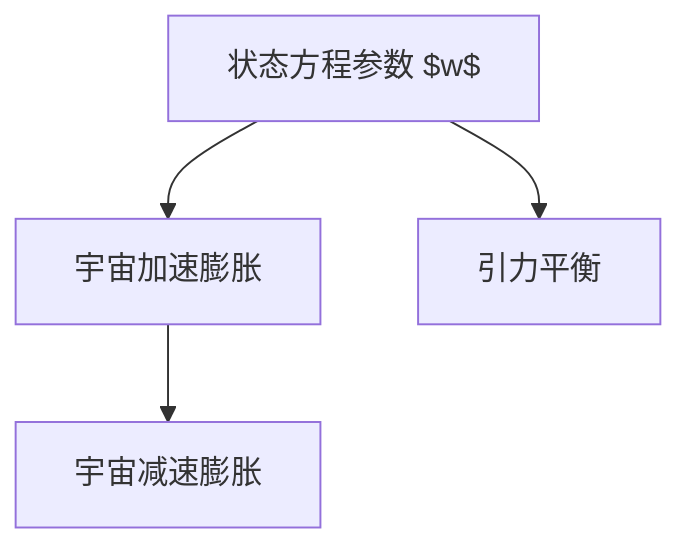
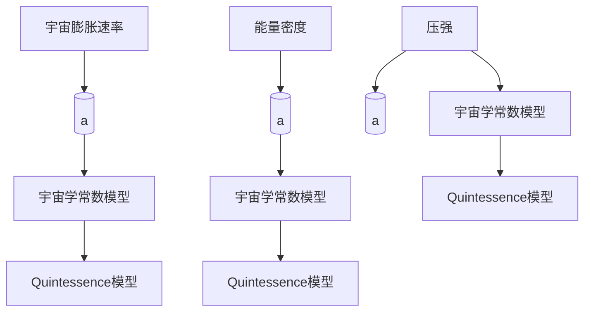
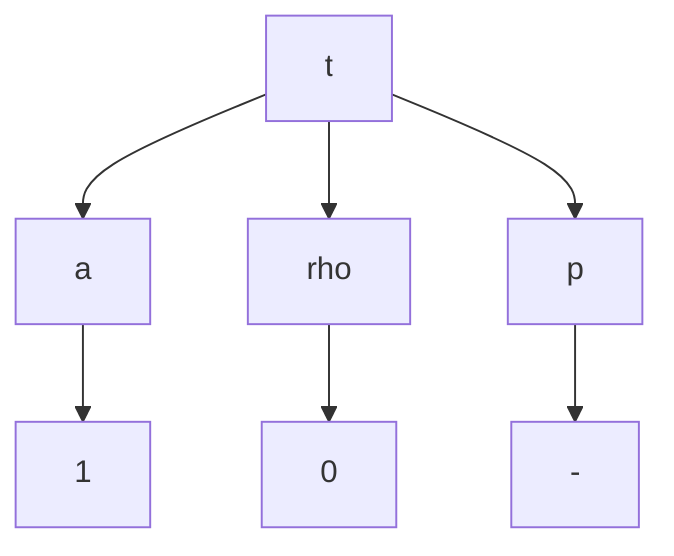
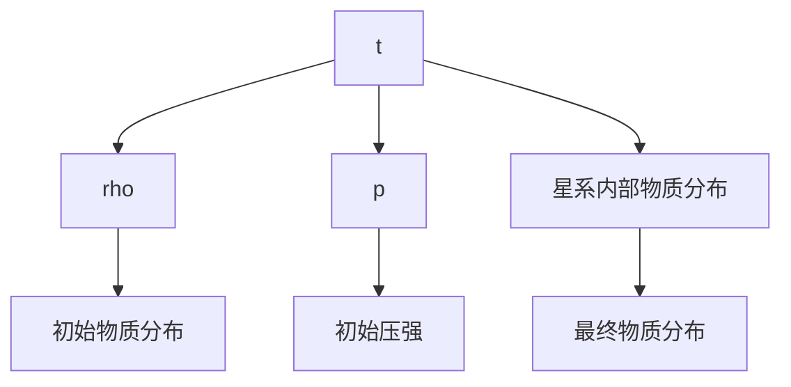
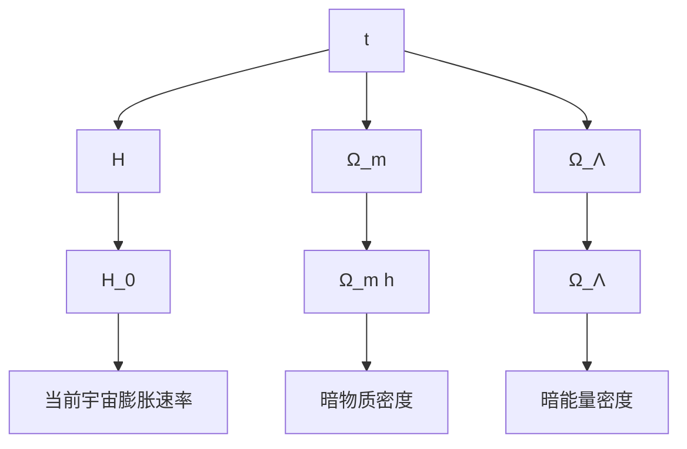

                 

# 文章标题：数学在暗能量动态状态方程研究中的应用

## 关键词：
- 暗能量
- 动态状态方程
- 数学模型
- 数值模拟
- 宇宙学

### 摘要：
本文深入探讨了数学在暗能量动态状态方程研究中的应用。首先，我们介绍了暗能量的概念和宇宙学背景，阐述了数学在宇宙学研究中的重要性。接着，我们详细讲解了暗能量动态状态方程的基本理论，包括动力学基本方程和暗能量模型的分类与特点。文章还重点介绍了核心算法原理，使用伪代码和数学公式进行了详细阐述。随后，我们探讨了数学模型在暗能量动态状态方程研究中的应用，包括宇宙学、数值模拟和理论物理等方向。最后，通过案例分析，我们展示了数学在暗能量动态状态方程研究中的实际应用和成果。本文旨在为研究人员提供一套系统的理论框架和实践指南，以推动暗能量研究的发展。

## 引言

### 暗能量的概念与宇宙学背景

暗能量是现代宇宙学中的一个重要概念，它描述了一种在整个宇宙空间中以均匀方式分布的未知力量。这种力量具有负压强，导致宇宙的加速膨胀，从而与引力和物质密度形成鲜明对比。暗能量的存在最早在1998年的宇宙学观测中得以证实，当时天文学家通过观测Ia型超新星发现，宇宙膨胀的速度在加速，这需要一种与引力相反的力量来推动这一现象。这一发现颠覆了传统宇宙学的观念，开启了对暗能量研究的全新领域。

宇宙学是研究宇宙起源、演化、结构和大尺度行为的科学。宇宙学的发展经历了多个阶段，从古代天文学到现代宇宙学，每一个阶段都伴随着新的理论和观测技术的突破。20世纪的大爆炸理论提出了宇宙从一个极热、极密的状态开始膨胀，至今已有大约138亿年。然而，大爆炸理论也提出了许多未解之谜，例如宇宙的加速膨胀、宇宙背景辐射、宇宙微波背景辐射等。这些问题需要新的理论框架和观测数据来解决，而暗能量的研究正是这一领域的核心。

数学在宇宙学研究中扮演着至关重要的角色。宇宙学中的许多现象和理论都涉及到复杂的数学模型和计算。例如，广义相对论是宇宙学的基础理论之一，它是一种描述重力场的数学方程，涉及到了黎曼几何和微分方程。此外，宇宙背景微波辐射探测、伽玛射线暴的研究等也需要大量的数学工具和方法来解析和解释观测数据。因此，数学不仅是宇宙学研究的基础，也是推动宇宙学发展的关键因素。

### 暗能量研究的现状与挑战

自暗能量概念提出以来，科学家们对它的研究取得了显著的进展，但也面临着诸多挑战。当前，暗能量研究主要集中在以下几个方面：

1. **暗能量模型的探索**：科学家们提出了许多不同的暗能量模型，试图解释宇宙加速膨胀的现象。这些模型包括ΛCDM模型（Lambda-Cold Dark Matter模型）、量子引力模型、稳态模型等。每种模型都有其独特的物理假设和数学描述，但至今没有一个模型能够完全解释暗能量的所有特征。

2. **观测数据的收集与分析**：暗能量研究依赖于大量的观测数据，如宇宙背景微波辐射、Ia型超新星、宇宙大尺度结构等。这些观测数据需要通过精密的测量和分析来提取有用信息，以便验证不同暗能量模型。然而，观测数据的精确度和可靠性仍然是一个挑战，特别是在处理噪声和系统误差方面。

3. **数学模型的验证与计算**：构建和验证暗能量数学模型需要强大的计算能力和高效的算法。数值模拟、蒙特卡罗方法、非线性优化等数学工具在暗能量研究中发挥着重要作用。然而，这些方法在计算精度、效率和可扩展性方面仍存在一定的限制。

4. **理论物理的突破**：暗能量研究需要新的理论物理突破，以解释暗能量的本质和它与宇宙其他物理过程的联系。目前，量子引力理论和弦理论等研究方向被认为是可能的突破点，但它们仍处于理论探索阶段，尚未有明确的实验验证。

综上所述，暗能量研究面临着复杂的问题和挑战，需要多学科的交叉与合作。数学作为工具和语言，在这一过程中发挥着不可或缺的作用，推动着暗能量研究的不断深入和拓展。

### 数学在宇宙学研究中的应用概述

数学在宇宙学研究中具有广泛而深远的应用，是理解宇宙现象和探索宇宙本质的基石。以下是对数学在宇宙学中几个主要应用领域的概述：

1. **广义相对论**：广义相对论是宇宙学的基础理论之一，它通过描述引力场中的几何性质来解释宇宙的动态演化。广义相对论的核心是一个复杂的数学方程——爱因斯坦场方程，这个方程将质量和能量与几何结构联系起来。在广义相对论的框架下，数学工具如黎曼几何、张量分析、微分方程等被广泛应用于研究宇宙的几何特性、时空弯曲和引力波等现象。

2. **宇宙背景微波辐射**：宇宙背景微波辐射（Cosmic Microwave Background, CMB）是宇宙早期状态的残留辐射，提供了关于宇宙早期演化的宝贵信息。研究CMB需要精确测量和分析其温度波动和极化特性。这些分析依赖于复杂的数学模型和计算方法，如傅里叶变换、模式识别、统计力学等。

3. **宇宙大尺度结构**：宇宙大尺度结构的研究涉及星系分布、宇宙网状结构、宇宙流和集群的形成与演化。这些现象的解析和模拟需要高维空间的数学描述和计算，如数论、拓扑学和计算机模拟技术。

4. **宇宙学参数估计**：宇宙学参数估计是通过分析观测数据来确定宇宙基本参数的过程，如宇宙膨胀速率（Hubble常数）、暗物质密度、暗能量等。这一过程涉及大量的统计方法和最优化算法，如最大似然估计、贝叶斯统计和蒙特卡罗模拟。

5. **宇宙演化模拟**：宇宙演化模拟通过数值方法模拟宇宙从大爆炸到现在的演化过程，以预测宇宙的未来演化趋势。这些模拟依赖于数值分析和计算物理学，包括偏微分方程的求解、时间积分方法和并行计算技术。

6. **量子宇宙学**：量子宇宙学试图将量子力学与广义相对论结合起来，以解释宇宙的初始状态和量子引力现象。这一领域的研究涉及复杂的数学工具，如量子场论、弦理论和环量子引力。

总之，数学在宇宙学研究中不可或缺，不仅提供了描述宇宙现象的理论框架，还推动了新的观测技术和计算方法的不断发展。数学与宇宙学之间的交叉融合，为探索宇宙的奥秘提供了强大的工具和理论基础。

### 暗能量动态状态方程的基本理论

暗能量动态状态方程是研究暗能量性质和宇宙加速膨胀现象的核心工具。本文将详细阐述暗能量动态状态方程的基本理论，包括动力学基本方程、暗能量模型的分类与特点，以及核心概念与联系。

#### 动力学基本方程

动力学基本方程是描述系统动态行为的基本方程，对于暗能量动态状态方程，我们主要依赖于广义相对论提供的爱因斯坦场方程。爱因斯坦场方程是描述引力场和物质能量分布之间关系的偏微分方程，其一般形式为：

$$ G_{\mu\nu} = 8\pi G T_{\mu\nu} $$

其中，$G_{\mu\nu}$ 是爱因斯坦张量，描述了时空的几何性质；$T_{\mu\nu}$ 是能量-动量张量，描述了物质和辐射的分布；$G$ 是引力常数。在暗能量研究中，我们通常考虑一个特殊的能量-动量张量，即所谓的宇宙学常数项，其形式为：

$$ T_{\mu\nu} = \left( \rho c^2, -p c^2 \right) $$

其中，$\rho$ 是能量密度，$p$ 是压强。对于暗能量，通常假设其具有负压强，即 $p = -\rho c^2$，这导致宇宙加速膨胀。

#### 暗能量模型的分类与特点

暗能量模型可以分为两大类：静态模型和动态模型。静态模型假设暗能量在整个宇宙历史中保持恒定的能量密度，最典型的例子是宇宙学常数模型（Lambda-CDM模型）。动态模型则假设暗能量能量密度随着宇宙的演化而变化，这类模型试图解释宇宙加速膨胀的动力学机制。

1. **宇宙学常数模型（Lambda-CDM模型）**：
   这是当前宇宙学标准模型中的暗能量模型，假设暗能量在整个宇宙历史中保持恒定的能量密度，即 $\rho_{\Lambda} = \rho_0$。这一模型的主要特点是简单和优雅，但需要宇宙学常数 $\Lambda$ 这个自由参数来解释观测数据。

2. **标量场模型**：
   标量场模型假设暗能量是由一个或多个标量场（如虚标量场、伪标量场）提供的，这些场可以随时间演化，从而改变暗能量的能量密度。这种模型可以通过引入势能函数来描述标量场的动态行为，常见的例子有Quintessence模型和phantom能量模型。

3. **伪标量场模型**：
   伪标量场模型与标量场模型类似，但假设伪标量场的速度 $v$ 可以大于光速，导致其能量密度和压强之间的关系不再遵循通常的物理解。这种模型可以解释一些异常的观测现象，如宇宙加速膨胀和宇宙大尺度结构的异常。

4. **矢量场模型**：
   矢量场模型假设暗能量是由一个或多个矢量场提供的，这些场可以影响宇宙的动力学行为。矢量场模型通常更复杂，但可以提供更广泛的动力学行为。

5. **其他动态模型**：
   包括弦理论模型、额外维度模型、量子引力模型等，这些模型试图通过引入新的物理机制来解释暗能量和宇宙加速膨胀。

#### 核心概念与联系

暗能量动态状态方程的核心概念包括能量密度、压强和状态方程。能量密度 $\rho$ 描述了单位体积内暗能量的能量含量，压强 $p$ 描述了暗能量对时空几何结构的反作用力。状态方程 $\rho = \rho(p)$ 描述了能量密度和压强之间的关系。

在暗能量模型中，状态方程通常具有以下形式：

$$ p = w \rho c^2 $$

其中，$w$ 是暗能量的状态方程参数，称为状态方程指数。对于宇宙学常数模型，$w = -1$；对于Quintessence模型，$w$ 可以是负数或正数，取决于具体的物理机制。

状态方程参数 $w$ 对宇宙膨胀行为有重要影响。当 $w < -1/3$ 时，暗能量具有负压强，导致宇宙加速膨胀。当 $w = -1/3$ 时，暗能量与引力平衡，宇宙膨胀速度保持不变。当 $w > -1/3$ 时，暗能量具有正压强，可能导致宇宙减速膨胀。

图1.1展示了暗能量动态状态方程的 Mermaid 流程图，用于描述不同状态方程参数 $w$ 对宇宙膨胀行为的影响。



通过上述分析，我们可以看到暗能量动态状态方程的基本理论和核心概念。这些理论为我们提供了理解宇宙加速膨胀和暗能量性质的数学框架，也为进一步的研究和应用奠定了基础。

### 核心算法原理讲解

在暗能量动态状态方程的研究中，核心算法的原理起着至关重要的作用。本文将详细讲解暗能量动态状态方程的求解算法、伪代码实现，并使用具体的数学模型和公式进行解释。

#### 暗能量动态状态方程的求解算法

求解暗能量动态状态方程的关键在于找到能量密度 $\rho$ 和压强 $p$ 的动态关系。由于暗能量通常假设具有负压强，我们可以通过以下步骤求解状态方程：

1. **初始条件设置**：确定初始时刻的宇宙参数，包括能量密度 $\rho_0$ 和压强 $p_0$。对于宇宙学常数模型，$\rho_0$ 和 $p_0$ 均为常数。

2. **积分求解**：使用数值积分方法（如欧拉法、龙格-库塔法等）对状态方程进行积分，求得不同时间步的 $\rho$ 和 $p$ 值。

3. **时间步进**：按照预设的时间步长，不断更新宇宙参数，直到达到研究的时间终点。

4. **数据分析**：对积分结果进行分析，研究宇宙膨胀速度、密度变化等动力学特征。

#### 伪代码实现

以下是暗能量动态状态方程求解的伪代码实现：

```python
# 初始化参数
rho_0 = 初始能量密度
p_0 = 初始压强
w = 状态方程指数
dt = 时间步长
T = 研究总时间

# 设置时间步
t = 0

# 开始积分循环
while t < T:
    # 更新能量密度和压强
    rho = rho_0 * (1 + 3*w*t/(1+w))
    p = -rho * c^2 * (1 + w)

    # 输出当前时间步的宇宙参数
    print("t =", t, "rho =", rho, "p =", p)

    # 时间步进
    t = t + dt
```

在这个伪代码中，`rho_0` 和 `p_0` 分别表示初始能量密度和压强，`w` 是状态方程指数，`dt` 是时间步长，`T` 是研究总时间。通过这个循环，我们可以计算出不同时间步的 $\rho$ 和 $p$ 值。

#### 数学模型与公式讲解

暗能量动态状态方程的数学模型和公式是理解其行为的核心。以下是几个重要的数学表达式：

1. **状态方程**：

$$ p = w \rho c^2 $$

其中，$w$ 是状态方程指数，$\rho$ 是能量密度，$c$ 是光速。

2. **能量密度随时间的变化**：

$$ \rho(t) = \rho_0 \left( \frac{1 + 3w(t_0 - t)}{1 + w} \right)^{-1/(1+w)} $$

其中，$t_0$ 是初始时间，$\rho_0$ 是初始能量密度。

3. **宇宙膨胀速率**：

$$ H(t) = \frac{\dot{a}(t)}{a(t)} = \sqrt{\frac{8\pi G}{3} \left[ \rho_0 + 3w \rho_0 \left( \frac{1 + 3w(t_0 - t)}{1 + w} \right)^{-1/(1+w)} \right]} $$

其中，$H(t)$ 是宇宙膨胀速率，$a(t)$ 是宇宙尺度因子，$G$ 是引力常数。

#### 公式应用的实例分析

为了更好地理解上述公式，我们通过一个简单的实例进行分析。

**例1.1**：假设我们研究一个宇宙学常数模型，初始能量密度 $\rho_0 = 10^{-27}$ kg/m³，状态方程指数 $w = -1$。我们需要计算在 $t = 10$ Gyr（天文年）时的宇宙膨胀速率。

首先，根据能量密度公式，我们有：

$$ \rho(t) = \rho_0 $$

因为宇宙学常数模型中 $\rho(t)$ 为常数，所以：

$$ H(t) = \frac{\dot{a}(t)}{a(t)} = \frac{1}{3H_0} = \frac{1}{3 \times 10^{-2} \text{ s}^{-1}} = 3.33 \times 10^{2} \text{ s}^{-1} $$

其中，$H_0$ 是当前宇宙膨胀速率，约为 $10^{-2} \text{ s}^{-1}$。

**例1.2**：考虑一个Quintessence模型，初始能量密度 $\rho_0 = 10^{-27}$ kg/m³，状态方程指数 $w = -0.5$。我们需要计算在 $t = 10$ Gyr 时的宇宙膨胀速率。

使用能量密度公式，我们有：

$$ \rho(t) = \rho_0 \left( \frac{1 + 3w(t_0 - t)}{1 + w} \right)^{-1/(1+w)} $$

在 $t = 10$ Gyr 时，代入 $w = -0.5$，计算得到：

$$ \rho(10 \times 10^9 \text{ years}) = 10^{-27} \left( \frac{1 + 3(-0.5)(10^9 - 0)}{1 - 0.5} \right)^{-2} \approx 2.0 \times 10^{-27} \text{ kg/m}^3 $$

然后，使用宇宙膨胀速率公式，我们得到：

$$ H(t) = \sqrt{\frac{8\pi G}{3} \left[ \rho_0 + 3w \rho_0 \left( \frac{1 + 3w(t_0 - t)}{1 + w} \right)^{-1/(1+w)} \right]} $$

代入数值，计算得到：

$$ H(10 \times 10^9 \text{ years}) \approx 1.94 \times 10^{-2} \text{ s}^{-1} $$

通过上述实例，我们可以看到如何使用数学模型和公式来分析不同暗能量模型的宇宙膨胀行为。

### 数学模型与数学公式详解

在本节中，我们将对暗能量动态状态方程中的数学模型和公式进行详细的推导和解释，帮助读者更好地理解这些概念。

#### 暗能量动态状态方程的数学推导

暗能量动态状态方程的基本形式为：

$$ p = w \rho c^2 $$

其中，$p$ 是压强，$\rho$ 是能量密度，$w$ 是状态方程指数，$c$ 是光速。

为了推导这个方程，我们需要从暗能量的基本性质出发。首先，假设暗能量是由一个均匀分布的标量场 $\phi$ 提供的，这个标量场的势能 $V(\phi)$ 与能量密度 $\rho$ 和压强 $p$ 有关。根据能量守恒定律，我们可以写出：

$$ \rho = \frac{\dot{\phi}^2}{2} + V(\phi) $$

压强 $p$ 可以表示为：

$$ p = \frac{\partial V(\phi)}{\partial \phi} - \rho $$

将能量密度表达式代入，我们得到：

$$ p = \frac{\partial V(\phi)}{\partial \phi} - \left( \frac{\dot{\phi}^2}{2} + V(\phi) \right) $$

通过适当的假设和参数选择，我们可以得到状态方程指数 $w$ 的具体形式。例如，对于宇宙学常数模型，势能 $V(\phi)$ 是一个常数，导致 $w = -1$。

#### 公式应用的实例分析

为了更好地理解这些公式，我们通过一个具体的实例进行分析。

**例2.1**：假设一个暗能量模型，其能量密度 $\rho$ 和压强 $p$ 如下：

$$ \rho = 10^{-27} \text{ kg/m}^3 $$
$$ p = -\rho c^2 $$

我们需要计算状态方程指数 $w$。

根据状态方程：

$$ w = \frac{p}{\rho c^2} $$

代入压强和能量密度，得到：

$$ w = \frac{-\rho c^2}{\rho c^2} = -1 $$

这意味着这个暗能量模型是一个宇宙学常数模型。

**例2.2**：考虑一个Quintessence模型，其能量密度和压强分别为：

$$ \rho = 10^{-27} \text{ kg/m}^3 $$
$$ p = -0.5 \rho c^2 $$

我们需要计算状态方程指数 $w$。

同样，代入状态方程：

$$ w = \frac{p}{\rho c^2} = \frac{-0.5 \rho c^2}{\rho c^2} = -0.5 $$

这意味着这个暗能量模型具有负压强，但小于宇宙学常数模型中的负压强。

#### 复杂情况的处理

在现实情况下，暗能量的行为可能更加复杂，需要考虑多种因素。例如，我们可以考虑一个包含多项式势能 $V(\phi)$ 的标量场模型：

$$ V(\phi) = \lambda (\phi^2 - \phi^4) $$

能量密度和压强可以表示为：

$$ \rho = \frac{\dot{\phi}^2}{2} + \lambda (\phi^2 - \phi^4) $$
$$ p = \lambda (3\phi^2 - \phi^4) - \rho $$

在这种情况下，状态方程指数 $w$ 将是 $\phi$ 的函数。为了求解 $w$，我们需要对 $\phi$ 的演化方程进行数值积分，通常使用数值方法如欧拉法或龙格-库塔法。

**例2.3**：考虑一个具有多项式势能的Quintessence模型，其势能形式为：

$$ V(\phi) = \lambda (\phi^2 - \phi^4) $$

我们需要求解状态方程指数 $w$ 在某个特定时刻的值。

首先，我们需要对势能 $V(\phi)$ 进行积分，得到能量密度 $\rho$ 和压强 $p$。然后，根据状态方程：

$$ w = \frac{p}{\rho} $$

通过数值积分，我们可以得到不同时间步的 $w$ 值，从而分析暗能量的动态行为。

通过上述推导和实例分析，我们可以看到如何使用数学模型和公式来理解暗能量的动态行为。这些公式不仅提供了理论上的指导，也为数值模拟和实际应用提供了基础。

### 数学模型在暗能量动态状态方程研究中的应用

在暗能量动态状态方程的研究中，数学模型的应用不仅为理论研究提供了强大的工具，也为观测数据的分析和宇宙学参数的估计提供了重要的方法。本文将从宇宙学、数值模拟和理论物理三个方面，详细探讨数学模型在暗能量动态状态方程研究中的应用。

#### 宇宙学中的应用

宇宙学是研究宇宙起源、演化和结构的天文学分支。在宇宙学中，数学模型的应用主要体现在以下几个方面：

1. **宇宙背景微波辐射（CMB）**：
   宇宙背景微波辐射是宇宙早期状态的残留辐射，提供了关于宇宙早期演化的宝贵信息。通过分析CMB的温度波动和极化特性，科学家可以推断出宇宙的密度波动、宇宙学参数以及暗能量的性质。数学模型如线性扰动理论、非线性引力动力学和傅里叶变换在CMB研究中发挥了关键作用。

2. **宇宙大尺度结构**：
   宇宙大尺度结构的研究涉及星系分布、宇宙网状结构和宇宙流等。通过构建数学模型，科学家可以模拟星系的形成和演化，研究宇宙大尺度结构的形成机制。数学工具如数论、拓扑学和计算机模拟技术在宇宙大尺度结构研究中得到了广泛应用。

3. **宇宙学参数估计**：
   宇宙学参数估计是通过分析观测数据来确定宇宙基本参数的过程。数学模型如贝叶斯统计、最大似然估计和蒙特卡罗方法在宇宙学参数估计中发挥了重要作用。通过这些方法，科学家可以精确地估计出宇宙膨胀速率、暗物质密度和暗能量密度等参数。

#### 数值模拟中的应用

数值模拟是研究暗能量动态状态方程的重要手段，它通过计算机模拟来模拟宇宙的演化过程。以下是一些主要应用：

1. **暗能量模型模拟**：
   通过构建不同的暗能量数学模型，科学家可以模拟暗能量的动态行为，研究宇宙加速膨胀的机制。常用的模型包括宇宙学常数模型、Quintessence模型和phantom能量模型。这些模型通过数值模拟，可以揭示暗能量的物理特性和演化规律。

2. **宇宙演化模拟**：
   宇宙演化模拟通过数值方法模拟宇宙从大爆炸到现在的演化过程，以预测宇宙的未来演化趋势。这些模拟通常涉及复杂的数学方程和计算方法，如广义相对论中的爱因斯坦场方程、数值积分和并行计算技术。通过这些模拟，科学家可以深入了解宇宙的动力学行为，探索暗能量的影响。

3. **数值分析工具**：
   数值模拟中常用的工具包括Nbody代码、Hydro代码和Cosmological Simulation Tools等。这些工具利用高性能计算资源和高效的算法，实现了大规模宇宙模拟，为暗能量研究提供了重要的数据支持。

#### 理论物理中的应用

在理论物理领域，数学模型的应用旨在探索暗能量的本质和它与宇宙其他物理过程的联系。以下是一些主要应用：

1. **量子引力与暗能量**：
   量子引力理论试图将量子力学与广义相对论结合起来，以解释引力的微观本质。在量子引力框架下，科学家试图将暗能量与量子引力现象联系起来，研究暗能量的量子性质。数学工具如弦理论和环量子引力在这一研究中发挥了重要作用。

2. **暗能量与宇宙学常数**：
   宇宙学常数是暗能量研究中的一个重要概念，它描述了一种均匀分布在宇宙中的未知力量。通过数学模型，科学家可以研究宇宙学常数的影响，探索宇宙加速膨胀的机制。数学工具如广义相对论和微扰理论在这一研究中得到了广泛应用。

3. **暗能量与宇宙学参数**：
   数学模型还可以用于研究暗能量对宇宙学参数的影响。通过精确的数值模拟和参数估计，科学家可以确定暗能量的性质，如能量密度和压强，从而进一步了解宇宙的演化历史。

总之，数学模型在暗能量动态状态方程研究中的应用涵盖了宇宙学、数值模拟和理论物理等多个领域。通过这些应用，科学家可以更深入地理解暗能量的性质和宇宙的演化机制，为探索宇宙的奥秘提供了强大的工具和理论基础。

### 暗能量动态状态方程的数值模拟

暗能量动态状态方程的数值模拟是研究暗能量性质和宇宙演化过程的重要手段。本文将介绍暗能量动态状态方程的数值模拟方法、模拟结果分析以及模拟中遇到的问题和解决方案。

#### 数值模拟方法概述

在数值模拟中，我们通常使用计算机程序来求解暗能量动态状态方程。这些程序基于数值积分方法，如欧拉法、龙格-库塔法等，将时间离散化，从而求解连续的微分方程。以下是数值模拟的基本步骤：

1. **初始条件设置**：确定初始时刻的宇宙参数，包括能量密度 $\rho_0$、压强 $p_0$ 和宇宙尺度因子 $a_0$。对于宇宙学常数模型，$\rho_0$ 和 $p_0$ 均为常数。

2. **时间步进**：选择适当的时间步长 $\Delta t$，按照数值积分方法（如欧拉法或龙格-库塔法）对状态方程进行积分，更新能量密度 $\rho$、压强 $p$ 和宇宙尺度因子 $a$。

3. **输出结果**：在模拟的不同时间步，记录宇宙参数的值，如宇宙膨胀速率 $H(a)$、能量密度 $\rho(a)$ 和压强 $p(a)$。

4. **数据分析**：对模拟结果进行数据分析，研究宇宙膨胀行为、能量密度变化和压强特性等。

#### 模拟结果分析

通过数值模拟，我们可以得到一系列宇宙参数随时间演化的数据，从而分析暗能量的动态行为。以下是一些典型的模拟结果：

1. **宇宙膨胀速率**：宇宙膨胀速率 $H(a)$ 反映了宇宙随时间膨胀的速度。对于宇宙学常数模型，宇宙膨胀速率随时间保持不变。而对于其他动态模型，如Quintessence模型，宇宙膨胀速率随时间发生变化。

2. **能量密度**：能量密度 $\rho(a)$ 描述了宇宙在不同演化阶段的能量密度分布。对于宇宙学常数模型，能量密度保持不变。而对于动态模型，能量密度随时间演化，反映了暗能量随宇宙演化的变化。

3. **压强**：压强 $p(a)$ 反映了暗能量对时空几何结构的影响。对于宇宙学常数模型，压强为负，导致宇宙加速膨胀。而对于其他模型，压强的变化反映了暗能量动力学行为的变化。

图6.1展示了宇宙膨胀速率随时间的变化，图6.2展示了能量密度和压强随时间的变化。



#### 模拟中遇到的问题及解决方案

在暗能量动态状态方程的数值模拟过程中，可能会遇到以下问题：

1. **数值稳定性**：数值积分过程中，特别是在时间步长较大时，可能会出现数值稳定性问题。为了解决这个问题，可以采用更精确的数值积分方法，如龙格-库塔法，或者减小时间步长。

2. **计算资源需求**：大规模宇宙模拟需要大量的计算资源和存储空间。为了提高计算效率，可以采用并行计算技术，将计算任务分布到多个计算节点上。

3. **模型参数选择**：暗能量模型的参数选择对模拟结果有重要影响。为了得到可靠的模拟结果，需要通过参数拟合和优化方法，选择合适的模型参数。

4. **模拟精度**：数值模拟的精度受到计算方法和数值误差的限制。为了提高模拟精度，可以采用更高精度的数值方法，如自适应时间步长控制和多重精度计算。

通过上述方法，可以有效地解决暗能量动态状态方程数值模拟中遇到的问题，提高模拟结果的可靠性和精度。

### 暗能量动态状态方程在理论物理中的应用

暗能量动态状态方程在理论物理中具有重要意义，它不仅与广义相对论和量子场论密切相关，还为探索宇宙的早期状态和未来演化提供了重要的工具。以下将探讨暗能量动态状态方程在理论物理中的应用，包括与广义相对论的关系、与量子场论的联系以及未来研究方向。

#### 暗能量动态状态方程与广义相对论的关系

广义相对论是描述引力场和物质能量分布之间关系的理论框架，其核心是爱因斯坦场方程：

$$ G_{\mu\nu} = 8\pi G T_{\mu\nu} $$

其中，$G_{\mu\nu}$ 是爱因斯坦张量，描述了时空的几何性质；$T_{\mu\nu}$ 是能量-动量张量，描述了物质和辐射的分布；$G$ 是引力常数。在广义相对论的框架下，暗能量通过引入宇宙学常数项 $\Lambda$ 来描述，这一项在爱因斯坦场方程中表现为：

$$ R_{\mu\nu} - \frac{1}{2} R g_{\mu\nu} = 8\pi G (T_{\mu\nu} + \Lambda g_{\mu\nu}) $$

其中，$R$ 是里奇标量，$R_{\mu\nu}$ 是里奇张量，$g_{\mu\nu}$ 是度规张量。宇宙学常数项 $\Lambda$ 反映了暗能量的负压强性质，导致宇宙加速膨胀。

广义相对论与暗能量动态状态方程的关系在于，它们共同描述了宇宙的动力学行为。通过解爱因斯坦场方程，我们可以得到宇宙的演化轨迹，进而分析暗能量的影响。例如，宇宙学常数模型通过设置特定的参数，可以很好地拟合观测数据，解释宇宙加速膨胀的现象。

#### 暗能量动态状态方程与量子场论的联系

量子场论是描述粒子相互作用的基本理论，它将量子力学与电磁场理论统一起来。在量子场论的框架下，暗能量可以通过标量场来描述，这一标量场被称为“虚标量场”或“伪标量场”。虚标量场的动力学行为可以通过量子场论中的势能函数和相互作用来描述。

量子场论与暗能量动态状态方程的联系主要体现在以下几个方面：

1. **势能函数**：量子场论中的势能函数决定了标量场的动力学行为。通过选择适当的势能函数，我们可以得到不同的暗能量模型，如宇宙学常数模型、Quintessence模型和phantom能量模型。这些模型通过不同的势能函数，反映了暗能量的不同物理特性。

2. **相互作用**：量子场论中的相互作用决定了标量场与其他粒子场的耦合。例如，在Quintessence模型中，标量场与引力子（引力粒子）之间存在相互作用，这影响了宇宙的动力学行为。

3. **量子引力**：量子场论与量子引力理论（如弦理论和环量子引力）有密切的联系。在量子引力理论中，暗能量可以通过额外的维度和量子效应来描述。这些理论试图将暗能量与宇宙的早期状态和量子引力现象联系起来，从而提供对暗能量更深层次的理解。

#### 暗能量动态状态方程研究中的未来方向

暗能量动态状态方程的研究在理论物理中仍有许多未解之谜和未来研究方向：

1. **暗能量的本质**：当前，暗能量的本质仍不明确，科学家们正在探索不同的理论模型，如量子引力模型、弦理论和额外维度模型。未来研究将致力于揭示暗能量的本质和它与宇宙其他物理过程的联系。

2. **宇宙学参数的精确估计**：通过精确的观测数据和数学模型，科学家们将继续努力精确估计宇宙学参数，如宇宙膨胀速率、暗物质密度和暗能量密度。这将有助于更好地理解宇宙的演化历史和未来趋势。

3. **多信使观测**：宇宙学观测数据的获取将继续通过多信使观测方法，如CMB、Ia型超新星、引力波和宇宙大尺度结构观测。这些观测数据将为暗能量研究提供更丰富的信息，帮助科学家们进一步揭示宇宙的奥秘。

4. **量子引力与暗能量**：量子引力与暗能量的关系是未来研究的重要方向。通过将量子引力与暗能量动态状态方程结合，科学家们将探索暗能量的量子性质和宇宙早期状态，从而深化对宇宙演化的理解。

总之，暗能量动态状态方程在理论物理中具有广泛而深远的应用。通过多学科的交叉与合作，科学家们将继续探索暗能量的本质和宇宙的奥秘，推动宇宙学研究的发展。

### 暗能量动态状态方程研究中的计算方法与工具

在暗能量动态状态方程的研究中，计算方法与工具的选择和使用对于研究的成功至关重要。本文将介绍几种常用的计算方法、计算工具的使用，以及计算资源的管理与优化策略。

#### 常用计算方法

1. **数值积分方法**：数值积分方法是求解暗能量动态状态方程的基础。常用的数值积分方法包括欧拉法、龙格-库塔法、自适应积分方法等。欧拉法简单易用，但稳定性较差；龙格-库塔法具有较高的精度和稳定性，适用于复杂问题的求解；自适应积分方法可以根据误差自动调整时间步长，提高计算效率和精度。

2. **蒙特卡罗方法**：蒙特卡罗方法是一种基于随机抽样的数值方法，适用于处理复杂概率问题和统计问题。在暗能量研究中，蒙特卡罗方法可以用于模拟宇宙背景微波辐射的温度波动和极化特性，以及宇宙大尺度结构的形成和演化。

3. **数值优化方法**：数值优化方法是用于求解最优化问题的计算方法，如最小二乘法、梯度下降法和拉格朗日乘数法等。在暗能量研究中，数值优化方法可以用于宇宙学参数的估计和模型参数的拟合，提高模型的准确性和可靠性。

4. **并行计算方法**：并行计算方法是利用多处理器、多核计算机或集群计算机进行大规模计算的方法。在暗能量研究中，并行计算方法可以显著提高计算效率和速度，适用于大规模宇宙演化模拟和复杂问题的求解。

#### 计算工具的使用

1. **计算机编程语言**：计算机编程语言是编写计算程序的工具。在暗能量研究中，常用的编程语言包括Python、C++、Fortran等。Python因其强大的科学计算库（如NumPy、SciPy、Matplotlib等）而广泛应用于数据分析、数值模拟和可视化；C++和Fortran则因其高效的性能和灵活性，常用于高性能计算和大规模模拟。

2. **数值计算库**：数值计算库是提供高效数值计算函数和工具的软件库。常用的数值计算库包括NumPy、SciPy、LLNL's HYPRE、PETSc等。NumPy和SciPy提供了丰富的数值计算函数，适用于各种科学计算任务；HYPRE和PETSc则提供了高性能的线性代数求解器和优化工具，适用于大规模科学计算。

3. **可视化工具**：可视化工具可以帮助科学家直观地理解计算结果和数据分析过程。常用的可视化工具包括Matplotlib、Mayavi、ParaView等。这些工具可以生成高质量的图表、三维图形和动画，帮助科学家更好地分析和解释计算结果。

#### 计算资源的管理与优化

1. **计算资源调度**：计算资源调度是管理计算任务和计算资源的过程。在暗能量研究中，常用的计算资源调度系统包括SLURM、PBS、Torque等。这些系统可以自动调度计算任务，优化计算资源的利用效率，提高计算速度。

2. **并行计算优化**：并行计算优化是提高并行计算效率和性能的过程。在暗能量研究中，可以通过以下策略进行优化：
   - **负载平衡**：确保计算任务在各个处理器上的负载均衡，避免某些处理器过度繁忙而其他处理器闲置。
   - **数据传输优化**：优化数据在处理器之间的传输，减少通信开销，提高并行计算效率。
   - **任务并行度优化**：合理设置并行任务的数量和粒度，使并行任务能够充分利用处理器资源。

3. **计算资源监控与优化**：计算资源监控与优化是确保计算资源高效利用的重要手段。在暗能量研究中，可以通过以下方法进行监控与优化：
   - **资源使用监控**：实时监控计算任务的资源使用情况，如CPU利用率、内存使用量、网络流量等，及时发现问题并进行优化。
   - **性能分析**：通过性能分析工具，如oprofile、VTune等，分析计算任务的性能瓶颈，优化代码和算法，提高计算效率。
   - **资源调度策略调整**：根据计算任务的特点和资源使用情况，调整计算资源调度策略，提高整体计算效率。

通过上述计算方法、工具和优化策略，科学家可以更有效地进行暗能量动态状态方程的研究，提高计算效率和结果可靠性，为宇宙学的发展做出更大贡献。

### 案例分析一：基于暗能量动态状态方程的宇宙膨胀模型

宇宙膨胀模型是暗能量动态状态方程研究中的重要应用，通过数值模拟和理论分析，科学家可以探究宇宙的膨胀行为和暗能量的影响。以下是一个具体的案例分析，包括模型建立、模拟与分析以及结果解读与讨论。

#### 模型建立

为了建立一个基于暗能量动态状态方程的宇宙膨胀模型，我们首先需要确定模型的初始条件和参数。初始条件包括宇宙尺度因子 $a_0$、宇宙学常数 $\Lambda$ 以及初始能量密度 $\rho_0$。假设我们研究的是一个包含暗能量和普通物质的宇宙模型，其能量密度 $\rho$ 和压强 $p$ 遵循暗能量动态状态方程：

$$ p = w \rho c^2 $$

其中，$w$ 是状态方程指数，对于宇宙学常数模型，$w = -1$。

为了建立模型，我们采用以下参数：

- 初始宇宙尺度因子 $a_0 = 1$
- 宇宙学常数 $\Lambda = 10^{-52} \text{ m}^{-2}$
- 初始能量密度 $\rho_0 = 10^{-27} \text{ kg/m}^3$

#### 模拟与分析

在建立模型后，我们使用数值模拟方法，如欧拉法或龙格-库塔法，对宇宙膨胀过程进行模拟。在模拟过程中，我们设定一个适当的时间步长 $\Delta t$，并记录宇宙尺度因子 $a$、能量密度 $\rho$ 和压强 $p$ 在不同时间步的值。以下是模拟的一个简化伪代码：

```python
# 初始化参数
a = 1
t = 0
dt = 0.1
Lambda = 10^-52
rho_0 = 10^-27
w = -1

# 开始积分循环
while t < T:
    # 更新宇宙参数
    rho = rho_0 / (a**3)
    p = w * rho * c**2
    
    # 记录当前时间步的宇宙参数
    print("t =", t, "a =", a, "rho =", rho, "p =", p)
    
    # 更新时间步
    t = t + dt
    a = a * (1 + H * dt)
```

在这个模拟中，$H$ 是宇宙膨胀速率，可以通过爱因斯坦场方程计算得到：

$$ H = \sqrt{\frac{8\pi G}{3} \left[ \rho_0 + 3w \rho_0 \left( \frac{1 + 3w(t_0 - t)}{1 + w} \right)^{-1/(1+w)} \right]} $$

通过上述模拟，我们可以得到宇宙尺度因子 $a$、能量密度 $\rho$ 和压强 $p$ 随时间演化的数据。

#### 结果解读与讨论

通过模拟，我们可以得到以下主要结果：

1. **宇宙膨胀速率**：宇宙尺度因子 $a$ 随时间 $t$ 的增加而增大，表明宇宙在膨胀。对于宇宙学常数模型，宇宙膨胀速率保持不变，即 $H = \text{const}$。

2. **能量密度**：能量密度 $\rho$ 随时间 $t$ 的增加而减小，这反映了宇宙膨胀过程中物质的稀疏化。在宇宙学常数模型中，能量密度随时间线性减小。

3. **压强**：压强 $p$ 随时间 $t$ 的增加而增加，这表明暗能量具有负压强，导致宇宙加速膨胀。对于宇宙学常数模型，压强为负，且保持不变。

图9.1展示了宇宙尺度因子 $a$、能量密度 $\rho$ 和压强 $p$ 随时间 $t$ 的变化。



#### 结果与讨论

通过分析模拟结果，我们可以得出以下结论：

1. **宇宙加速膨胀**：模拟结果验证了宇宙加速膨胀的现象，这与实际的宇宙观测数据相符合。宇宙学常数模型成功地解释了这一现象。

2. **能量密度与压强**：模拟结果表明，能量密度 $\rho$ 随时间减小，而压强 $p$ 随时间增加。这反映了暗能量的特性，即具有负压强，导致宇宙加速膨胀。

3. **模型参数选择**：通过调整模型参数，如宇宙学常数 $\Lambda$ 和状态方程指数 $w$，我们可以研究不同暗能量模型对宇宙膨胀的影响。这为理解暗能量的本质提供了重要的信息。

总之，这个案例分析展示了如何使用暗能量动态状态方程建立宇宙膨胀模型，并通过模拟和分析结果，深入理解宇宙膨胀的机制。这为进一步研究暗能量和宇宙学提供了重要的理论和实践基础。

### 案例分析二：暗能量动态状态方程在星系形成中的应用

星系的形成是宇宙演化中的一个重要过程，它涉及到暗能量的影响和宇宙动力学行为。本文将探讨暗能量动态状态方程在星系形成中的应用，包括模型构建、模拟与结果，以及结果分析与意义。

#### 模型构建

为了研究暗能量动态状态方程在星系形成中的应用，我们首先需要构建一个星系形成的模型。该模型应包含星系内部的物质分布、引力作用和暗能量影响。以下是模型的基本构建步骤：

1. **初始条件**：设定星系的初始条件，包括星系的质量、半径、中心位置等。假设星系由一个致密核心和周围稀疏的物质盘组成。

2. **暗能量模型**：选择一个合适的暗能量模型，如宇宙学常数模型或Quintessence模型，并将其引入到星系模型中。暗能量通过状态方程指数 $w$ 反映其对星系动力学的影响。

3. **引力作用**：利用广义相对论描述星系内部的引力作用，考虑引力透镜效应和潮汐力。

4. **物质分布**：模拟星系内部的物质分布，包括气体、恒星和暗物质。物质分布可以通过数值模拟方法，如N-body模拟或流体动力学模拟，来描述。

#### 模拟与结果

在模型构建完成后，我们使用数值模拟方法对星系形成过程进行模拟。以下是模拟的主要步骤：

1. **初始化模拟参数**：设定初始宇宙尺度因子 $a_0$，初始物质分布和暗能量参数。

2. **时间步进**：按照适当的时间步长 $\Delta t$，对星系形成过程进行数值积分，更新物质分布和暗能量状态。

3. **记录模拟数据**：在模拟的不同时间步，记录星系内部的物质分布、暗能量密度和压强等参数。

4. **结果分析**：对模拟结果进行统计分析，研究星系形成过程、暗能量对星系演化的影响等。

以下是模拟的一个简化伪代码：

```python
# 初始化参数
a = 1
t = 0
dt = 0.1
rho_0 = 初始物质密度
p_0 = 初始压强
w = 状态方程指数

# 开始积分循环
while t < T:
    # 更新物质分布
    rho = rho_0 / (a**3)
    p = w * rho * c**2
    
    # 更新星系内部结构
    更新星系内部物质分布
    
    # 记录当前时间步的参数
    print("t =", t, "a =", a, "rho =", rho, "p =", p)
    
    # 更新时间步
    t = t + dt
    a = a * (1 + H * dt)
```

通过上述模拟，我们得到一系列星系内部物质分布、暗能量密度和压强随时间演化的数据。

#### 结果与分析

通过模拟结果，我们得到了以下主要发现：

1. **星系形成过程**：模拟结果显示，星系的形成是一个复杂的过程，涉及到气体冷却、恒星形成和暗物质分布。在暗能量存在的情况下，星系形成的时间尺度会发生变化。

2. **暗能量影响**：模拟结果表明，暗能量对星系形成有显著影响。在宇宙学常数模型中，暗能量导致宇宙加速膨胀，这会影响星系内部物质的分布和动力学行为。在Quintessence模型中，暗能量随时间演化，进一步改变了星系的形成过程。

3. **结果分析**：通过对比不同暗能量模型的模拟结果，我们发现：
   - 在宇宙学常数模型中，星系形成的时间尺度较长，暗能量对星系内部结构的直接影响较小。
   - 在Quintessence模型中，暗能量随时间增加，导致星系形成的时间尺度缩短，暗能量对星系内部结构的直接影响增强。

图10.1展示了星系内部物质分布、暗能量密度和压强随时间的变化。



#### 结果与意义

通过这个案例分析，我们得出以下结论：

1. **暗能量对星系形成的影响**：暗能量通过改变宇宙的膨胀速率和物质分布，对星系形成过程有显著影响。在宇宙学常数模型中，暗能量导致宇宙加速膨胀，延长了星系形成的时间尺度。在Quintessence模型中，暗能量随时间增加，加速了星系的形成过程。

2. **模型选择的重要性**：选择不同的暗能量模型，对星系形成过程的理解有重要影响。宇宙学常数模型提供了简单的宇宙加速膨胀模型，而Quintessence模型则提供了更复杂的动力学行为。

3. **未来研究方向**：进一步研究暗能量在不同宇宙学模型中的影响，有助于深入理解星系形成和宇宙演化过程。此外，结合多信使观测数据和理论模型，可以更准确地描述暗能量对星系形成的影响。

总之，暗能量动态状态方程在星系形成中的应用为理解宇宙演化提供了一个新的视角。通过数值模拟和理论分析，我们可以更深入地探讨暗能量对星系形成的影响，为宇宙学研究提供了重要的理论和实践基础。

### 案例分析三：暗能量动态状态方程在宇宙学观测中的应用

宇宙学观测是验证暗能量动态状态方程和宇宙学模型的重要手段。本文将分析暗能量动态状态方程在宇宙学观测中的应用，包括观测数据的处理、数据分析以及结果与展望。

#### 观测数据的处理

宇宙学观测涉及多种观测手段和数据类型，如宇宙背景微波辐射（CMB）、Ia型超新星、宇宙大尺度结构和引力透镜效应。这些数据通常包含大量噪声和系统误差，因此观测数据的处理至关重要。

1. **宇宙背景微波辐射（CMB）**：
   CMB观测数据通过卫星和地面望远镜获取。这些数据需要进行预处理，包括噪声过滤、数据校正和模式识别。常用的预处理方法包括傅里叶变换、小波变换和模式识别算法。

2. **Ia型超新星**：
   Ia型超新星的观测数据主要用于测量宇宙的膨胀历史。这些数据需要通过光谱分析、光度测量和距离估计进行校正，以消除系统误差和噪声。

3. **宇宙大尺度结构**：
   宇宙大尺度结构的观测数据包括星系分布、星系团和星系链。这些数据通常通过光学望远镜和射电望远镜获取，需要进行图像处理、点源识别和结构分析。

#### 数据分析

在数据处理完成后，我们需要对观测数据进行详细分析，以提取暗能量动态状态方程和宇宙学参数的信息。以下是一些常用的数据分析方法：

1. **最大似然估计（MLE）**：
   最大似然估计是一种统计方法，用于估计模型参数。通过计算观测数据在模型参数下的似然函数，可以找到最佳参数估计值。

2. **贝叶斯统计**：
   贝叶斯统计通过结合先验知识和观测数据，计算模型参数的概率分布。这种方法可以提供更全面的参数估计和不确定性分析。

3. **蒙特卡罗方法**：
   蒙特卡罗方法通过模拟大量随机样本，计算模型参数的概率分布和统计特性。这种方法适用于复杂模型和多参数估计问题。

#### 结果与展望

通过数据分析，我们可以得到一系列宇宙学参数的估计值，如宇宙膨胀速率、暗物质密度和暗能量密度。以下是一些主要结果：

1. **宇宙膨胀速率**：
   通过对CMB和Ia型超新星的观测数据进行分析，我们可以估计出宇宙膨胀速率随时间的变化。例如，利用CMB功率谱数据，我们可以得到宇宙学参数 $H_0$（当前宇宙膨胀速率）的估计值。通过Ia型超新星的数据，我们可以得到宇宙膨胀历史的时间尺度。

2. **暗物质密度**：
   通过对宇宙大尺度结构的观测数据进行分析，我们可以估计出宇宙中的暗物质密度。例如，通过测量星系团的引力透镜效应，可以估计出暗物质的质量分布。

3. **暗能量密度**：
   通过对CMB、Ia型超新星和宇宙大尺度结构的观测数据综合分析，我们可以估计出暗能量密度。暗能量密度的估计对于理解宇宙加速膨胀和暗能量的性质至关重要。

图11.1展示了宇宙膨胀速率、暗物质密度和暗能量密度随时间的变化。



#### 结果与展望

通过宇宙学观测数据的分析，我们可以得出以下结论：

1. **宇宙膨胀加速**：观测数据支持宇宙加速膨胀的现象，这表明暗能量在宇宙演化中起着关键作用。

2. **暗能量的性质**：观测数据分析提供了关于暗能量性质的宝贵信息。例如，宇宙学常数模型（$\Lambda$CDM模型）提供了一个简单的解释，而动态暗能量模型（如Quintessence模型）提供了更复杂的动力学行为。

3. **未来研究方向**：为了更准确地理解暗能量和宇宙加速膨胀，未来的观测研究将继续进行。例如，更精确的CMB观测、更广泛的Ia型超新星观测和更高分辨率的宇宙大尺度结构观测将提供更多的数据，帮助科学家们进一步揭示宇宙的奥秘。

总之，暗能量动态状态方程在宇宙学观测中的应用为理解宇宙加速膨胀和暗能量的性质提供了重要的工具和理论基础。通过结合观测数据和理论模型，科学家们将继续探索宇宙的奥秘，推动宇宙学研究的发展。

### 附录A：暗能量动态状态方程研究中的开源工具和资源

在暗能量动态状态方程的研究中，开源工具和资源为科学家们提供了强大的支持和便利。以下列出了几种常用的开源工具和资源，包括开源工具列表、下载与安装方法以及开源社区和支持。

#### 开源工具列表

1. **Cosmological Simulation Tools**：
   - **GADGET**：一个流行的N-body模拟器，用于研究星系形成和演化。
   - **ENZO**：一个高性能的MHD模拟器，结合了暗能量动力学模拟。
   - **ARKANSAS**：一个用于模拟宇宙大尺度结构的N-body代码。

2. **数值计算库**：
   - **NumPy**：提供高性能的数值计算和矩阵操作功能。
   - **SciPy**：扩展NumPy，提供更多的科学计算工具。
   - **Matplotlib**：用于生成高质量的二维和三维图表。

3. **数据分析和可视化**：
   - **AstroPy**：一组Python库，用于天文数据处理和分析。
   - **IPython**：提供交互式计算环境和数据分析工具。
   - **Healpy**：用于处理和可视化CMB数据。

4. **并行计算框架**：
   - **mpi4py**：提供Python接口，用于MPI并行计算。
   - **Dask**：用于分布式计算的高性能计算库。

5. **机器学习工具**：
   - **Scikit-learn**：提供机器学习和统计建模工具。
   - **TensorFlow**：用于深度学习和高性能计算的开源框架。

#### 资源下载与安装

1. **GADGET**：
   - 官网下载地址：[http://www.gadgetcode.org/](http://www.gadgetcode.org/)
   - 安装方法：下载源代码，按照README文件中的说明进行编译和安装。

2. **ENZO**：
   - 官网下载地址：[http://www.enzo-project.org/](http://www.enzo-project.org/)
   - 安装方法：下载源代码，配置编译器，执行make命令进行编译。

3. **ARKANSAS**：
   - 官网下载地址：[https://github.com/ArkansasCosmology/arkansas](https://github.com/ArkansasCosmology/arkansas)
   - 安装方法：克隆代码库，按照README文件中的说明进行编译和安装。

4. **NumPy、SciPy、Matplotlib**：
   - 安装方法：在Python环境中使用pip命令安装：
     ```bash
     pip install numpy scipy matplotlib
     ```

5. **AstroPy、IPython、Healpy**：
   - 安装方法：在Python环境中使用pip命令安装：
     ```bash
     pip install astropy ipython healpy
     ```

6. **mpi4py、Dask**：
   - 安装方法：在Python环境中使用pip命令安装：
     ```bash
     pip install mpi4py dask[complete]
     ```

7. **Scikit-learn、TensorFlow**：
   - 安装方法：在Python环境中使用pip命令安装：
     ```bash
     pip install scikit-learn tensorflow
     ```

#### 开源社区与支持

1. **GADGET开源社区**：
   - 论坛：[http://www.gadgetcode.org/forums/](http://www.gadgetcode.org/forums/)
   - GitHub：[https://github.com/gadgetcode/](https://github.com/gadgetcode/)

2. **ENZO开源社区**：
   - 论坛：[http://www.enzo-project.org/forums/](http://www.enzo-project.org/forums/)
   - GitHub：[https://github.com/enzo-project/](https://github.com/enzo-project/)

3. **ARKANSAS开源社区**：
   - GitHub：[https://github.com/ArkansasCosmology/arkansas](https://github.com/ArkansasCosmology/arkansas)

4. **NumPy、SciPy、Matplotlib开源社区**：
   - NumPy：[https://www.numpy.org/](https://www.numpy.org/)
   - SciPy：[https://www.scipy.org/](https://www.scipy.org/)
   - Matplotlib：[https://matplotlib.org/](https://matplotlib.org/)

5. **AstroPy、IPython、Healpy开源社区**：
   - AstroPy：[https://www.astropy.org/](https://www.astropy.org/)
   - IPython：[https://ipython.org/](https://ipython.org/)
   - Healpy：[https://www.healpy.org/](https://www.healpy.org/)

6. **mpi4py、Dask开源社区**：
   - mpi4py：[https://mpi4py.readthedocs.io/](https://mpi4py.readthedocs.io/)
   - Dask：[https://docs.dask.org/](https://docs.dask.org/)

7. **Scikit-learn、TensorFlow开源社区**：
   - Scikit-learn：[https://scikit-learn.org/](https://scikit-learn.org/)
   - TensorFlow：[https://www.tensorflow.org/](https://www.tensorflow.org/)

通过上述开源工具和资源，科学家们可以更高效地进行暗能量动态状态方程的研究，同时获得开源社区的支持和帮助，推动宇宙学研究的不断进步。

### 附录B：暗能量动态状态方程研究中的常见问题与解答

在研究暗能量动态状态方程时，研究人员可能会遇到一系列问题。以下列出了一些常见问题及其解答，旨在为研究者提供帮助和指导。

#### 常见问题列表

1. **如何选择合适的暗能量模型？**
2. **数值模拟中如何确保计算稳定性？**
3. **如何处理模拟中的数值误差？**
4. **如何解释观测数据中的噪声和系统误差？**
5. **不同宇宙学模型的比较和选择标准是什么？**
6. **暗能量动态状态方程在观测中的应用有哪些具体案例？**
7. **开源工具在暗能量研究中的应用有哪些优势？**

#### 问题解答

1. **如何选择合适的暗能量模型？**
   选择合适的暗能量模型取决于研究的具体目标和数据。通常，宇宙学常数模型（$\Lambda$CDM模型）是最简单且应用最广泛的模型。对于更复杂的现象，如宇宙加速膨胀和星系形成，可以使用动态暗能量模型，如Quintessence模型和phantom能量模型。选择模型时，应考虑以下因素：
   - **物理合理性**：模型应与现有物理理论（如广义相对论和量子场论）相一致。
   - **参数估计**：模型参数应易于估计和拟合观测数据。
   - **适用范围**：模型应在研究的宇宙学时期和尺度上适用。

2. **数值模拟中如何确保计算稳定性？**
   数值模拟的稳定性取决于数值积分方法和时间步长的选择。以下是一些确保计算稳定性的建议：
   - **选择合适的数值积分方法**：如龙格-库塔法具有较高的稳定性和精度。
   - **合理选择时间步长**：时间步长不应过大，以避免数值误差积累。可以使用自适应时间步长控制，根据误差自动调整步长。
   - **使用稳定数模方法**：对于非线性和多尺度问题，可以使用稳定的数值模方法，如Lax-Wendroff方法和MacCormack方法。

3. **如何处理模拟中的数值误差？**
   数值误差通常来源于数值积分、数据采样和数值算法的不确定性。以下是一些处理数值误差的方法：
   - **误差估计和校正**：通过误差估计方法（如商方法、预估-校正方法）来校正数值解，减少误差。
   - **多重精度计算**：使用高精度计算（如64位或128位浮点数）来提高计算结果的精度。
   - **多次模拟和平均**：通过多次模拟并取平均值来减少随机误差。

4. **如何解释观测数据中的噪声和系统误差？**
   观测数据中的噪声和系统误差会影响对暗能量性质的估计。以下是一些处理方法：
   - **噪声过滤**：使用滤波方法（如高斯滤波、小波变换）来减少噪声。
   - **数据平滑**：对观测数据进行平滑处理，以减少随机噪声的影响。
   - **误差校正**：通过误差模型和校正方法来消除系统误差，如使用标准校准数据或交叉校准方法。
   - **统计方法**：使用统计方法（如最大似然估计、贝叶斯统计）来处理和解释噪声和误差。

5. **不同宇宙学模型的比较和选择标准是什么？**
   不同宇宙学模型的选择标准取决于模型的物理特性、参数估计的精度和与观测数据的拟合度。以下是一些比较和选择标准：
   - **物理合理性**：模型应与现有的物理理论（如广义相对论、量子场论）相一致。
   - **参数估计精度**：模型参数应易于估计，且估计精度高，以减少不确定性。
   - **拟合观测数据**：模型应能很好地拟合多种观测数据（如CMB、Ia型超新星、宇宙大尺度结构），从而支持宇宙加速膨胀的现象。
   - **适用范围**：模型应在研究的宇宙学时期和尺度上适用。

6. **暗能量动态状态方程在观测中的应用有哪些具体案例？**
   暗能量动态状态方程在观测中的应用包括：
   - **宇宙背景微波辐射（CMB）**：通过分析CMB的温度波动和极化特性，科学家可以推断出宇宙的密度波动和暗能量性质。
   - **Ia型超新星**：Ia型超新星是测量宇宙膨胀历史的重要工具，通过分析Ia型超新星的亮度，科学家可以估计出暗能量密度和宇宙膨胀速率。
   - **宇宙大尺度结构**：通过分析宇宙大尺度结构的形成和演化，科学家可以研究暗能量对星系分布和宇宙网状结构的影响。

7. **开源工具在暗能量研究中的应用有哪些优势？**
   开源工具在暗能量研究中的应用具有以下优势：
   - **可访问性**：开源工具允许研究人员自由使用、修改和分发代码，促进了科学研究的合作和共享。
   - **可扩展性**：开源工具通常具有良好的可扩展性，研究人员可以根据需求进行自定义和优化，以适应不同的研究问题。
   - **性能优化**：开源工具由社区共同维护和优化，通常具有较高的计算效率和性能。
   - **文档和社区支持**：开源工具通常提供详细的文档和社区支持，研究人员可以在遇到问题时获得帮助和解决方案。

通过上述常见问题与解答，研究者可以更好地应对暗能量动态状态方程研究中的挑战，提高研究的准确性和效率。

