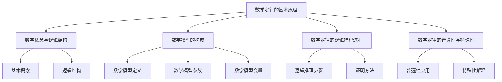

                 

## 文章标题

《数学定律：自然和谐在心智中的映射》

## 关键词

数学、自然和谐、心智、映射、定律

## 摘要

本文旨在探讨数学定律在自然和谐与心智映射中的关键作用。通过哲学、自然科学、社会科学以及现代科技等多个视角，深入剖析数学定律的构成、应用及其在人类认知中的地位。文章首先回顾了数学的发展历程与核心概念，接着详细阐述了数学定律的基本原理，如数列与极限定律、微积分定律、线性代数定律及概率论与数理统计定律。随后，文章展示了数学定律在自然科学、社会科学及现代科技中的应用，最后从哲学角度思考数学定律的文化内涵与未来展望。

## 《数学定律：自然和谐在心智中的映射》目录大纲

### 第一部分：数学定律的哲学探讨

#### 1.1 数学的本质与意义

##### 1.1.1 数学的起源与发展

##### 1.1.2 数学的基本概念与逻辑结构

##### 1.1.3 数学在科学和哲学中的地位

#### 1.2 自然和谐与数学定律

##### 1.2.1 自然和谐的哲学观念

##### 1.2.2 数学定律在自然界中的体现

##### 1.2.3 数学定律与宇宙秩序

#### 1.3 心智中的数学映射

##### 1.3.1 心智与数学的互动关系

##### 1.3.2 数学的直观感受与心智认知

##### 1.3.3 心智对数学定律的理解与创造

### 第二部分：数学定律的核心概念

#### 2.1 数学定律的基本原理

##### 2.1.1 数学定律的构成要素

##### 2.1.2 数学定律的逻辑推理过程

##### 2.1.3 数学定律的普遍性与特殊性

#### 2.2 数列与极限定律

##### 2.2.1 数列的概念与性质

##### 2.2.2 极限的定义与计算

##### 2.2.3 极限定律在数学中的应用

#### 2.3 微积分定律

##### 2.3.1 微积分的基本思想

##### 2.3.2 导数的定义与计算

##### 2.3.3 积分的定义与计算

##### 2.3.4 微积分定律的应用

#### 2.4 线性代数定律

##### 2.4.1 向量空间的基本概念

##### 2.4.2 矩阵的基本运算

##### 2.4.3 线性方程组的解法

##### 2.4.4 线性代数定律在几何中的应用

#### 2.5 概率论与数理统计定律

##### 2.5.1 概率的基本概念

##### 2.5.2 随机变量的分布

##### 2.5.3 数理统计的基本方法

##### 2.5.4 概率论与数理统计在现实中的应用

### 第三部分：数学定律的应用与解读

#### 3.1 数学定律在自然科学中的应用

##### 3.1.1 物理学中的数学定律

##### 3.1.2 生物学中的数学定律

##### 3.1.3 地球科学中的数学定律

#### 3.2 数学定律在社会科学中的应用

##### 3.2.1 经济学中的数学定律

##### 3.2.2 社会学中的数学定律

##### 3.2.3 心理学中的数学定律

#### 3.3 数学定律在现代科技中的角色

##### 3.3.1 计算机科学中的数学定律

##### 3.3.2 人工智能中的数学定律

##### 3.3.3 信息科学中的数学定律

### 第四部分：数学定律的哲学思考

#### 4.1 数学的哲学意义

##### 4.1.1 数学与宇宙的和谐

##### 4.1.2 数学与心智的互动

##### 4.1.3 数学与现实的联系

#### 4.2 数学定律的文化内涵

##### 4.2.1 数学在不同文化中的发展

##### 4.2.2 数学定律的跨文化比较

##### 4.2.3 数学定律对人类文化的影响

#### 4.3 数学的未来展望

##### 4.3.1 数学研究的新趋势

##### 4.3.2 数学在未来的应用领域

##### 4.3.3 数学的哲学思考与未来发展方向

### 第五部分：附录

#### 5.1 数学定律相关的参考文献

#### 5.2 数学定律相关的 Mermaid 流程图

#### 5.3 数学定律的核心算法原理讲解与伪代码示例

#### 5.4 数学定律的数学模型与公式讲解

#### 5.5 数学定律在实际项目中的应用案例

### 附录 A: 数学定律学习资源推荐

#### A.1 数学定律的经典教材

#### A.2 数学定律的在线课程推荐

#### A.3 数学定律的研究论文与书籍推荐

#### A.4 数学定律相关的研讨会与会议信息

### Mermaid 流程图：数学定律的基本原理构成要素



### 伪代码示例：线性代数定律中的矩阵运算

```python
# 定义两个矩阵 A 和 B，均为 m 行 n 列的矩阵
A = [[1, 2], [3, 4]]
B = [[5, 6], [7, 8]]

# 矩阵加法
C = A + B

# 矩阵乘法
D = A * B

# 矩阵转置
E = A.transpose()

# 求矩阵的逆
F = A.inverse()

# 输出结果
print("矩阵加法结果：", C)
print("矩阵乘法结果：", D)
print("矩阵转置结果：", E)
print("矩阵逆：", F)
```

## 第一部分：数学定律的哲学探讨

### 1.1 数学的本质与意义

#### 1.1.1 数学的起源与发展

数学的起源可以追溯到古代文明，如古埃及、巴比伦和中国，这些文明都发展出了独特的数学体系。古埃及人擅长几何学，用于建筑和测量；巴比伦人则发展了算术和代数；中国古代的《九章算术》则是古代数学的经典著作之一。

随着历史的发展，数学逐渐从实用数学演变为抽象数学。古希腊数学家如欧几里得和阿基米德，通过严密的逻辑推理和证明方法，奠定了现代数学的基础。在中世纪，阿拉伯数学家对数学的发展也做出了重要贡献，如花拉子米和阿尔·哈里德等人。

进入近代，数学的发展进入了新的阶段。17世纪的牛顿和莱布尼茨几乎同时独立发明了微积分，极大地推动了数学在自然科学中的应用。19世纪的数学家如高斯、狄利克雷和黎曼等，对数学的抽象性和形式化进行了深入探索，开创了现代数学的先河。

#### 1.1.2 数学的基本概念与逻辑结构

数学是一门研究数量、结构、变化和空间等概念的抽象科学。其基本概念包括数、集合、函数、逻辑、几何等。这些概念通过逻辑推理和数学符号系统有机地结合在一起，构成了数学的逻辑结构。

- **数**：数学研究的基础，包括自然数、整数、分数、实数和复数等。数可以用来表示数量和顺序。
- **集合**：数学中的一种基本结构，用来表示一组对象的集合。集合的概念在数学中非常广泛，如有限集合、无限集合、基数等。
- **函数**：用来描述两个集合之间的一种特殊关系，即一个集合中的每个元素在另一个集合中都有唯一的元素与之对应。
- **逻辑**：数学中的推理工具，用于证明数学命题的正确性。逻辑的基本概念包括命题、推理规则和证明等。
- **几何**：研究空间中的形状、大小和位置的科学。几何学通过点、线、面等基本概念来描述空间结构。

#### 1.1.3 数学在科学和哲学中的地位

数学在科学和哲学中都占有举足轻重的地位。

在科学中，数学是语言和工具，用于描述自然现象和科学理论。从牛顿的物理学到爱因斯坦的相对论，从麦克斯韦的电磁理论到量子力学，数学在自然科学中无处不在。数学定律如牛顿运动定律、欧姆定律、麦克斯韦方程组等，不仅帮助我们理解和预测自然现象，还为科学实验和技术的进步提供了坚实的基础。

在哲学中，数学具有重要的认识论意义。数学作为一种精确、严谨的科学，提供了逻辑推理和证明的范例。哲学家们探讨了数学的基础和本质，如康托尔的集合论、罗素的类型论等。数学的抽象性和普遍性使得它成为哲学思考的重要工具，对于理解人类认知和知识体系具有重要意义。

### 1.2 自然和谐与数学定律

#### 1.2.1 自然和谐的哲学观念

自然和谐是一个古老而深刻的哲学观念，它强调自然界中存在一种内在的秩序和统一性。古希腊哲学家如毕达哥拉斯和柏拉图，都认为数学是自然界的基础，数字和几何形状揭示了宇宙的和谐与美。

- **毕达哥拉斯**：他提出了“一切皆数”的观点，认为宇宙的本质是数和比例。毕达哥拉斯定理（勾股定理）便是他这一观念的体现。
- **柏拉图**：柏拉图哲学中的“形式世界”包含了数学和几何学的完美形式，而物质世界只是这些完美形式的反映。

#### 1.2.2 数学定律在自然界中的体现

数学定律在自然界中的体现无处不在，从宇宙的尺度到微观的粒子，数学无处不在。

- **物理学中的定律**：牛顿的运动定律、麦克斯韦方程组、量子力学中的薛定谔方程等，都是对自然界物理现象的精确描述。
- **生物学中的定律**：孟德尔的遗传定律揭示了基因遗传的规律，现代生物学的许多进展都依赖于数学模型和方法。
- **地球科学中的定律**：地震波传播的速度、地质断层活动规律、地球自转和公转等，都是通过数学模型来描述和预测的。

#### 1.2.3 数学定律与宇宙秩序

数学定律与宇宙秩序之间的联系是现代物理学的一个重要研究领域。从宇宙的起源到宇宙的结构，数学定律无处不在。

- **宇宙学中的定律**：爱因斯坦的广义相对论描述了时空的弯曲和引力，而宇宙膨胀的“哈勃定律”揭示了宇宙的膨胀规律。
- **宇宙结构的数学模型**：例如，冯·诺伊曼提出的大爆炸宇宙模型、德西特宇宙模型等，都是通过数学模型来描述宇宙的起源和演化。

### 1.3 心智中的数学映射

#### 1.3.1 心智与数学的互动关系

心智与数学之间存在着深刻的互动关系。数学不仅是人类心智的产物，也是人类心智理解和解释世界的重要工具。

- **数学的认知机制**：人类通过感官和经验感知世界，而数学提供了抽象的符号系统，帮助我们将感知转化为概念和理论。
- **数学的教育作用**：数学教育不仅仅是为了培养数学家，更重要的是通过数学教育培养逻辑思维、抽象思维和解决问题的能力。

#### 1.3.2 数学的直观感受与心智认知

数学的直观感受与心智认知密切相关。数学的抽象概念往往需要通过直观感受来理解和接受。

- **直观感受**：例如，我们在学习几何时，可以通过视觉直观地理解直线、平面、角度等概念。
- **心智认知**：心智认知则涉及对数学概念的理解、推理和证明。例如，通过学习欧几里得几何，我们能够理解平行公理和定理的推理过程。

#### 1.3.3 心智对数学定律的理解与创造

心智对数学定律的理解与创造是一个动态的过程。

- **理解**：心智通过学习和实践，逐渐理解和掌握数学定律的内涵和意义。例如，我们通过学习牛顿运动定律，能够理解和应用这一物理定律。
- **创造**：心智不仅能够理解和应用数学定律，还能够通过创新和思考，发现新的数学定律。例如，高斯的数学贡献不仅在于他对已有数学定律的深刻理解，还在于他创造了许多新的数学理论。

### 小结

在第一部分，我们探讨了数学的本质与意义，数学在科学和哲学中的地位，自然和谐与数学定律的关系，以及心智与数学的互动关系。数学不仅是一门抽象的科学，它在自然界和人类心智中都有着深远的影响。接下来的部分，我们将进一步探讨数学定律的核心概念，以及其在各个领域的应用和解读。

## 第二部分：数学定律的核心概念

在理解了数学的哲学背景和其在自然和谐与心智中的映射后，我们将深入探讨数学定律的核心概念。数学定律是数学研究的基础，它们通过严密的逻辑推理和证明，揭示了数量、结构、变化和空间等基本概念之间的关系。本部分将详细阐述数学定律的基本原理，包括数列与极限定律、微积分定律、线性代数定律和概率论与数理统计定律。

### 2.1 数学定律的基本原理

#### 2.1.1 数学定律的构成要素

数学定律的构成要素主要包括：

- **基本概念**：如数、集合、函数、逻辑等。
- **定义与公理**：数学定律通常基于一些基本的定义和公理，这些定义和公理为数学定律的建立提供了基础。
- **逻辑推理**：通过逻辑推理，我们可以从已知的基本概念和公理出发，推导出新的定理和结论。
- **证明方法**：数学定律的证明方法包括直接证明、反证法、数学归纳法等。

#### 2.1.2 数学定律的逻辑推理过程

数学定律的逻辑推理过程通常包括以下几个步骤：

1. **提出问题**：根据实际问题或数学理论的需求，提出需要解决的问题。
2. **定义与假设**：明确问题的相关定义和假设条件。
3. **构建模型**：根据假设条件，构建数学模型来描述问题。
4. **逻辑推理**：利用逻辑推理工具，如推理规则、定理和公理，推导出结论。
5. **证明**：通过严格的证明过程，证明结论的正确性。

#### 2.1.3 数学定律的普遍性与特殊性

数学定律具有普遍性和特殊性的特点：

- **普遍性**：数学定律在一定的假设条件下，适用于广泛的领域。例如，欧几里得几何的公理体系在二维空间中具有普遍性。
- **特殊性**：数学定律在某些特定条件下，可能只适用于特定领域或特定对象。例如，黎曼几何在非欧几何中具有特殊性。

### 2.2 数列与极限定律

#### 2.2.1 数列的概念与性质

数列是一组按照一定顺序排列的数。常见的数列包括等差数列、等比数列、斐波那契数列等。

- **等差数列**：相邻两项之差相等的数列，通项公式为 $a_n = a_1 + (n - 1)d$。
- **等比数列**：相邻两项之比相等的数列，通项公式为 $a_n = a_1 \cdot r^{(n - 1)}$。
- **斐波那契数列**：每一项等于前两项之和的数列，通项公式为 $a_n = \frac{1}{\sqrt{5}} \left[ \left( \frac{1 + \sqrt{5}}{2} \right)^n - \left( \frac{1 - \sqrt{5}}{2} \right)^n \right]$。

#### 2.2.2 极限的定义与计算

极限是数学中的一个基本概念，用于描述函数在某个点附近的趋势。极限的定义如下：

$$\lim_{{x \to a}} f(x) = L$$

表示当 $x$ 接近 $a$ 时，$f(x)$ 的值接近 $L$。

常见的极限计算方法包括：

- **夹逼定理**：利用夹逼定理，可以证明某些函数的极限。
- **洛必达法则**：用于求解某些复杂函数的极限。
- **泰勒公式**：通过泰勒公式，可以将复杂函数近似为一个多项式，从而求解极限。

#### 2.2.3 极限定律在数学中的应用

极限定律在数学中有着广泛的应用，如：

- **连续函数的极限**：连续函数的极限等于函数在该点的函数值。
- **导数的定义**：导数可以看作函数在某一点的极限形式。
- **定积分的计算**：定积分可以通过极限定义来计算。

### 2.3 微积分定律

#### 2.3.1 微积分的基本思想

微积分是研究函数变化率和面积计算的数学分支。其基本思想包括：

- **导数**：导数表示函数在某一点的瞬时变化率。导数的定义如下：

$$f'(x) = \lim_{{h \to 0}} \frac{{f(x + h) - f(x)}}{h}$$

- **积分**：积分表示函数在某个区间上的累积变化量。定积分的定义如下：

$$\int_{a}^{b} f(x) \, dx = \lim_{{n \to \infty}} \sum_{{i=1}}^{n} f(x_i^*) \cdot \Delta x$$

其中，$x_i^*$ 是区间 $[x_{i-1}, x_i]$ 的一个样本点，$\Delta x = \frac{{b - a}}{n}$。

#### 2.3.2 导数的定义与计算

导数的计算方法包括：

- **基本导数公式**：如幂函数、指数函数、对数函数、三角函数等的导数。
- **复合函数的导数**：通过链式法则求解复合函数的导数。
- **隐函数的导数**：通过隐函数求导法则求解隐函数的导数。

#### 2.3.3 积分的定义与计算

积分的计算方法包括：

- **不定积分**：通过反导数求解不定积分。
- **定积分**：通过极限定义求解定积分。
- **分部积分**：通过分部积分公式求解复杂积分。
- **换元积分**：通过换元积分法求解复杂积分。

#### 2.3.4 微积分定律的应用

微积分定律在数学、物理学、工程学等领域有着广泛的应用，如：

- **物理学中的运动学**：通过导数描述物体的运动状态，通过积分计算物体的位移和速度。
- **工程学中的优化问题**：通过微积分求解最优化问题，如最小二乘法、拉格朗日乘数法等。
- **经济学中的需求函数和供给函数**：通过微积分分析市场需求和供给的变化。

### 2.4 线性代数定律

#### 2.4.1 向量空间的基本概念

向量空间是一组向量的集合，满足加法和标量乘法的封闭性。向量空间的基本概念包括：

- **向量**：表示空间中一个点的位置或一个物理量。
- **加法**：向量的加法满足交换律、结合律和存在零向量。
- **标量乘法**：向量与标量的乘法满足结合律、分配律和存在单位向量。

#### 2.4.2 矩阵的基本运算

矩阵是表示线性变换的工具。矩阵的基本运算包括：

- **矩阵加法**：矩阵对应元素相加。
- **矩阵乘法**：矩阵与矩阵相乘，满足分配律和结合律。
- **矩阵转置**：矩阵的转置，满足转置的转置等于原矩阵。
- **逆矩阵**：矩阵的逆矩阵，满足矩阵与其逆矩阵的乘积为单位矩阵。

#### 2.4.3 线性方程组的解法

线性方程组的解法包括：

- **高斯消元法**：通过矩阵的行变换，将线性方程组化为上三角矩阵或下三角矩阵，从而求解方程组。
- **克莱姆法则**：通过行列式的计算，求解线性方程组的解。
- **迭代法**：通过迭代过程，逐步逼近方程组的解。

#### 2.4.4 线性代数定律在几何中的应用

线性代数定律在几何中的应用包括：

- **向量的投影**：通过向量投影，求解空间中的直线、平面和几何形状。
- **空间中的距离计算**：通过向量的模长，计算空间中两点之间的距离。
- **平面方程**：通过线性方程组，求解空间中的平面方程。

### 2.5 概率论与数理统计定律

#### 2.5.1 概率的基本概念

概率论是研究随机现象的数学分支。概率的基本概念包括：

- **概率空间**：表示随机试验的全部可能结果的集合。
- **随机变量**：表示随机试验的结果，可以是离散型或连续型。
- **概率分布**：描述随机变量的概率分布情况。

常见的概率分布包括：

- **二项分布**：表示在固定次数的试验中，成功次数的概率分布。
- **泊松分布**：表示在单位时间内，事件发生的次数的概率分布。
- **正态分布**：表示随机变量在某个区间内的概率分布。

#### 2.5.2 随机变量的分布

随机变量的分布包括：

- **离散分布**：离散随机变量的概率分布，如二项分布、泊松分布等。
- **连续分布**：连续随机变量的概率分布，如正态分布、均匀分布等。

#### 2.5.3 数理统计的基本方法

数理统计的基本方法包括：

- **描述性统计**：通过样本数据，描述总体数据的基本特征，如均值、方差、标准差等。
- **推断性统计**：通过样本数据，对总体数据进行推断，如假设检验、置信区间等。
- **回归分析**：通过建立数学模型，分析自变量和因变量之间的关系。

#### 2.5.4 概率论与数理统计在现实中的应用

概率论与数理统计在现实中的应用非常广泛，如：

- **经济学中的风险管理**：通过概率分布和统计模型，分析投资组合的风险和收益。
- **工程学中的质量控制**：通过统计方法，评估产品质量的合格率和缺陷率。
- **生物学中的数据分析**：通过统计方法，分析生物实验数据，推断基因表达模式和生物机制。

### 小结

在第二部分，我们详细阐述了数学定律的基本原理，包括数列与极限定律、微积分定律、线性代数定律和概率论与数理统计定律。这些核心概念构成了数学研究的基石，为我们理解和解决各种数学问题提供了理论基础。接下来，我们将进一步探讨数学定律在自然科学、社会科学以及现代科技中的应用，展示其在现实世界中的广泛影响力。

## 第三部分：数学定律的应用与解读

### 3.1 数学定律在自然科学中的应用

数学定律在自然科学中的应用是不可或缺的，它们为我们理解和解释自然界的现象提供了精确的工具和方法。以下将探讨数学定律在物理学、生物学和地球科学中的应用。

#### 3.1.1 物理学中的数学定律

物理学中的许多基本定律都是以数学形式表达的，这些定律不仅描述了自然界的现象，还揭示了物理量的内在关系。

- **牛顿运动定律**：牛顿运动定律描述了物体在力的作用下的运动状态。这些定律可以通过数学方程式表示，从而可以精确地预测物体的运动轨迹。

  - **第一定律**：一个物体若不受外力作用，将保持静止或匀速直线运动状态。
  - **第二定律**：物体的加速度与作用力成正比，与物体的质量成反比，即 \( F = ma \)。
  - **第三定律**：任何作用力都有一个大小相等、方向相反的反作用力。

- **麦克斯韦方程组**：麦克斯韦方程组描述了电磁场的性质，这些方程通过数学形式精确地描述了电场、磁场和电磁波的行为。

  - **高斯定律**：描述了电场的发散性。
  - **环路定律**：描述了磁场的高斯定律。
  - **法拉第电磁感应定律**：描述了电磁感应现象。
  - **麦克斯韦-安培定律**：描述了电流和磁场之间的关系。

- **量子力学中的薛定谔方程**：薛定谔方程描述了量子力学中的波函数如何随时间演化，从而预测了粒子的位置和动量等物理量。

#### 3.1.2 生物学中的数学定律

生物学中的数学定律帮助科学家理解和解释生物系统的复杂行为，如遗传、种群生态学和神经科学。

- **孟德尔的遗传定律**：孟德尔的遗传定律揭示了遗传信息的传递规律。这些定律包括基因分离定律、基因自由组合定律等。

- **种群生态学的数学模型**：种群生态学中使用了诸如微分方程和差分方程等数学模型来描述种群动态、竞争和共生关系。

  - **微分方程模型**：如Lotka-Volterra方程，描述了捕食者和被捕食者之间的相互作用。
  - **差分方程模型**：如Logistic模型，描述了种群增长受到资源限制的情况。

- **神经科学的数学模型**：神经科学中的数学模型描述了神经元的活动和神经网络的功能。例如，霍普菲尔德网络（Hopfield network）描述了神经网络的自组织和记忆功能。

#### 3.1.3 地球科学中的数学定律

地球科学中的数学定律用于描述地质过程、地震活动、气候系统和海洋动力学等。

- **地质力学中的应力与应变关系**：地质力学中通过应力-应变关系来描述岩石的变形和破裂过程。

- **地震学中的地震波传播规律**：地震学通过波动方程来描述地震波的传播，从而可以预测地震的发生地点和强度。

- **气候动力学中的数学模型**：气候动力学中使用了复杂的数学模型来模拟气候系统的变化，如全球气候模型（GCM）。

  - **能量平衡方程**：描述大气中的能量交换。
  - **大气环流方程**：描述大气中的风场和温度分布。

- **海洋动力学中的海洋环流模型**：海洋动力学中使用了海洋环流模型来描述海洋中的热量和盐度分布，以及海洋与大气之间的相互作用。

### 3.2 数学定律在社会科学中的应用

数学定律在社会科学中的应用同样广泛，特别是在经济学、社会学和心理学等领域。

#### 3.2.1 经济学中的数学定律

经济学中的数学定律用于描述市场行为、资源分配和经济增长等。

- **供求定律**：供求定律描述了商品价格与供需之间的关系。价格随着需求的增加而上升，随着供给的增加而下降。

- **边际效益和边际成本**：边际效益是指消费者在增加一单位消费时获得的总效益的增加量。边际成本是指生产者生产一单位额外产品所需成本的增加量。

- **效用函数**：效用函数用于描述消费者在不同商品组合中的偏好。通过最大化效用函数，可以确定消费者的最优消费选择。

- **一般均衡理论**：一般均衡理论通过数学模型描述了市场中所有商品和服务的供求平衡状态，从而分析了市场效率和资源分配问题。

#### 3.2.2 社会学中的数学定律

社会学研究社会结构、社会行为和社会变迁，其中许多理论都借助数学定律进行分析。

- **帕累托最优**：帕累托最优是指资源分配的一种状态，其中任何改变都不能使至少一个人的状况变好而不使其他人的状况变坏。

- **社会网络分析**：社会网络分析使用图论方法来描述社会中的关系网络，研究个体和群体之间的相互作用。

- **社会扩散模型**：社会扩散模型通过数学模型描述社会行为、思想或产品的传播过程。

#### 3.2.3 心理学中的数学定律

心理学中的数学定律用于研究行为、认知和情绪等心理过程。

- **心理物理学定律**：心理物理学研究感知和感觉的关系。例如，费希纳定律描述了感觉强度与刺激强度之间的关系。

- **心理测量学定律**：心理测量学使用数学模型来评估和测量心理特征，如能力、态度和情绪。

- **认知心理学定律**：认知心理学研究人的认知过程，如记忆、思维和决策。例如，期望效用理论描述了人在决策过程中如何评估和选择不同选项。

### 3.3 数学定律在现代科技中的角色

数学定律在现代科技中扮演着至关重要的角色，它们为计算机科学、人工智能和信息科学的发展提供了基础。

#### 3.3.1 计算机科学中的数学定律

计算机科学中的许多算法和理论都基于数学定律。

- **算法分析**：算法分析使用数学方法来评估算法的性能，如时间复杂度和空间复杂度。

- **图论**：图论用于分析网络结构和通信协议，如路由算法和社交网络分析。

- **密码学**：密码学使用数学方法来设计加密算法，保护信息安全。

- **计算机图形学**：计算机图形学中的几何变换、光照模型和渲染算法等，都依赖于数学定律。

#### 3.3.2 人工智能中的数学定律

人工智能中的许多技术都基于数学定律，特别是概率论和统计学。

- **机器学习**：机器学习算法，如线性回归、支持向量机、神经网络等，都是基于数学模型的。
- **概率图模型**：概率图模型，如贝叶斯网络和马尔可夫网络，用于描述不确定性问题和推理。
- **强化学习**：强化学习通过奖励和惩罚信号，结合数学优化方法，训练智能体做出最优决策。

#### 3.3.3 信息科学中的数学定律

信息科学中的许多概念和理论都基于数学定律。

- **信息论**：信息论是研究信息传递和处理规律的数学分支。香农的信息论描述了信息传输中的噪声和信道容量。
- **编码理论**：编码理论通过数学方法设计有效的数据编码方案，提高数据传输的可靠性和效率。
- **网络科学**：网络科学通过数学模型分析复杂网络的结构和功能，如社交网络、互联网和生物网络。

### 小结

在第三部分，我们探讨了数学定律在自然科学、社会科学和现代科技中的应用。从物理学中的基本定律，到生物学中的遗传规律，再到社会科学中的经济模型，数学定律无处不在，为我们的研究和理解提供了精确的工具和方法。接下来，我们将进一步从哲学角度思考数学定律的深远意义，以及它们对人类文化和未来发展的潜在影响。

## 第四部分：数学定律的哲学思考

### 4.1 数学的哲学意义

数学不仅在科学和技术领域中发挥着核心作用，其哲学意义也同样深远。数学的哲学意义主要体现在以下几个方面：

#### 4.1.1 数学与宇宙的和谐

数学与宇宙的和谐是哲学思考中的一个重要主题。自古以来，哲学家们就试图通过数学来理解宇宙的秩序和和谐。例如，毕达哥拉斯学派认为宇宙是由数字和比例构成的，数字和比例是宇宙的基本元素。柏拉图也提出，理想世界中的形式和数学关系反映了物质世界的真实本质。

现代物理学也展示了数学与宇宙和谐的关系。例如，爱因斯坦的广义相对论和量子力学都是通过数学方程来描述宇宙的运行机制。这些方程不仅精确地描述了自然现象，还揭示了宇宙深层次的和谐与统一。

#### 4.1.2 数学与心智的互动

数学与心智的互动是哲学思考中的另一个重要方面。数学作为一种精确、严谨的科学，不仅需要逻辑推理和抽象思维，还需要人类的创造力。心智与数学的互动表现在以下几个方面：

- **认知发展**：数学教育对儿童认知发展具有重要影响。通过数学学习，儿童培养了逻辑思维、问题解决能力和抽象思维能力。
- **创造力激发**：数学为人类提供了探索未知的工具，激发了人类的创造力。历史上，许多数学家的创新成果都源于对数学定律的深入思考和探索。
- **心智模型**：数学定律为人类心智构建了抽象模型，帮助我们理解和解释现实世界。例如，概率论和统计学为我们提供了分析不确定性和复杂系统的方法。

#### 4.1.3 数学与现实的联系

数学与现实的联系是哲学思考中的关键问题。数学不仅是一种抽象的理论体系，它还与现实世界密切相关。

- **科学应用**：数学在自然科学中的应用揭示了自然界的运行规律。例如，牛顿的运动定律和麦克斯韦方程组都是通过数学方程来描述自然现象。
- **技术发展**：数学在技术领域中的作用不可忽视。计算机科学、人工智能、信息科学等现代科技的发展都离不开数学的支持。数学定律为技术的创新和进步提供了基础。
- **经济决策**：数学在经济学中的应用，如优化理论和统计模型，帮助经济学家和决策者做出科学、合理的经济决策。

### 4.2 数学定律的文化内涵

数学定律不仅具有科学意义，还蕴含着丰富的文化内涵。不同文化对数学定律的解读和应用反映了各自的文化特点和价值观。

#### 4.2.1 数学在不同文化中的发展

数学在不同文化中的发展历程各具特色，反映了不同文化的哲学思想和科学传统。

- **古希腊数学**：古希腊数学以其严密的逻辑推理和几何学研究而闻名。欧几里得的《几何原本》和毕达哥拉斯的数学哲学为后世数学奠定了基础。
- **阿拉伯数学**：阿拉伯数学在数学发展史上具有重要地位。阿拉伯数学家如花拉子米和阿穆尔对代数和三角学的发展做出了巨大贡献。
- **中国数学**：中国古代数学注重实用和算法研究。如《九章算术》中的算法和《孙子算经》中的数学问题，体现了中国古代数学的特点。

#### 4.2.2 数学定律的跨文化比较

不同文化的数学定律在形式和应用上存在差异，但它们的核心思想具有普遍性。

- **几何学**：在几何学中，不同文化对空间的认识和理解有所不同。欧几里得几何强调公理和定理，而中国传统的几何学更注重直观和实用。
- **算术和代数**：算术和代数在不同文化中的发展也反映了各自的特点。阿拉伯数学的代数研究较早地引入了符号表示，而中国数学则注重算法和技巧。

#### 4.2.3 数学定律对人类文化的影响

数学定律不仅影响了科学技术的发展，还对人类文化的形成和演变产生了深远影响。

- **科学精神**：数学的精确性和严谨性培养了科学精神，推动了人类对自然和世界的深入探索。
- **思维模式**：数学的抽象思维和逻辑推理方法影响了人类对世界的认识和思考方式。
- **文化传播**：数学作为一种普遍的语言，促进了不同文化之间的交流和传播。例如，阿拉伯数学和欧洲数学之间的交流促进了中世纪后期欧洲的科学复兴。

### 4.3 数学的未来展望

数学的未来发展充满了无限可能。随着科技和社会的进步，数学将在更多领域发挥重要作用。

#### 4.3.1 数学研究的新趋势

数学研究的新趋势体现在以下几个方面：

- **量子数学**：量子数学是数学与量子物理学交叉的一个新领域，旨在研究量子系统的数学结构。
- **计算数学**：计算数学通过计算机模拟和数值方法，解决传统数学难以处理的复杂问题。
- **大数据数学**：大数据数学研究如何运用数学方法分析和处理大规模数据，为人工智能和数据分析提供支持。

#### 4.3.2 数学在未来的应用领域

数学在未来的应用领域将更加广泛和深入：

- **人工智能**：数学在人工智能中的应用将更加深入，包括机器学习、深度学习和神经网络等领域。
- **信息科学**：信息科学中的编码理论、信息论和数据压缩等技术，将依赖于数学定律的不断进步。
- **生物医学**：数学在生物医学中的应用，如生物信息学和生物统计学，将帮助我们更好地理解生物系统和疾病机理。

#### 4.3.3 数学的哲学思考与未来发展方向

数学的未来发展不仅取决于科学技术的进步，还需要哲学思考的引导。以下是一些值得关注的哲学思考方向：

- **数学的本质**：随着数学模型的复杂性和应用领域的扩展，对数学本质的探讨将更加深入。例如，形式主义、直觉主义和建构主义等哲学观点将继续影响数学研究。
- **数学与现实的关系**：数学与现实世界的联系将继续成为哲学探讨的重要主题。如何更好地理解和应用数学定律，将是一个长期的哲学课题。
- **数学教育**：数学教育的未来发展方向也将受到哲学思考的影响。如何培养数学思维和创新能力，将是一个重要的研究课题。

### 小结

在第四部分，我们从哲学角度探讨了数学定律的意义、文化内涵和未来展望。数学不仅是一门抽象的科学，它还与宇宙和谐、心智互动和现实世界密切相关。随着科技的进步，数学将在更多领域发挥重要作用，为我们理解和改造世界提供新的工具和方法。

## 第五部分：附录

### 5.1 数学定律相关的参考文献

1. 欧几里得，《几何原本》
2. 花拉子米，《代数学》
3. 高斯，《算术研究》
4. 薛定谔，《量子力学》
5. 爱因斯坦，《相对论》
6. 麦克斯韦，《电磁理论》
7. 香农，《信息论》
8. 韦尔奇，《概率论及其应用》

### 5.2 数学定律相关的 Mermaid 流程图


### 5.3 数学定律的核心算法原理讲解与伪代码示例

- **核心算法原理讲解**：

  线性代数中的矩阵运算，如矩阵加法、矩阵乘法和矩阵转置，是线性代数定律的核心内容。以下是对这些运算的原理讲解：

  - **矩阵加法**：两个矩阵对应元素相加。
  - **矩阵乘法**：两个矩阵按特定规则相乘，得到一个新的矩阵。
  - **矩阵转置**：矩阵的行变成列，列变成行。

- **伪代码示例**：

  ```python
  # 定义两个矩阵 A 和 B
  A = [[1, 2], [3, 4]]
  B = [[5, 6], [7, 8]]

  # 矩阵加法
  C = add_matrices(A, B)
  
  # 矩阵乘法
  D = multiply_matrices(A, B)
  
  # 矩阵转置
  E = transpose_matrix(B)

  # 输出结果
  print("矩阵加法结果：", C)
  print("矩阵乘法结果：", D)
  print("矩阵转置结果：", E)

  # 矩阵加法伪代码
  def add_matrices(A, B):
      m = len(A)
      n = len(A[0])
      C = [[0] * n for _ in range(m)]
      for i in range(m):
          for j in range(n):
              C[i][j] = A[i][j] + B[i][j]
      return C
  
  # 矩阵乘法伪代码
  def multiply_matrices(A, B):
      m = len(A)
      n = len(B[0])
      p = len(B)
      C = [[0] * n for _ in range(m)]
      for i in range(m):
          for j in range(n):
              for k in range(p):
                  C[i][j] += A[i][k] * B[k][j]
      return C
  
  # 矩阵转置伪代码
  def transpose_matrix(A):
      n = len(A[0])
      B = [[0] * len(A) for _ in range(n)]
      for i in range(len(A)):
          for j in range(len(A[0])):
              B[j][i] = A[i][j]
      return B
  ```

### 5.4 数学定律的数学模型与公式讲解

- **数学模型与公式讲解**：

  线性代数中的矩阵运算和线性方程组的解法是数学模型的重要组成部分。以下是对这些模型和公式的详细讲解：

  - **矩阵运算**：
    - 矩阵加法： \( A + B = C \)，其中 \( C \) 为 \( A \) 和 \( B \) 对应元素相加得到的矩阵。
    - 矩阵乘法： \( AB = C \)，其中 \( C \) 为 \( A \) 和 \( B \) 按照特定规则相乘得到的矩阵。
    - 矩阵转置： \( A^T \)，其中 \( A^T \) 为 \( A \) 的行变成列，列变成行的矩阵。

  - **线性方程组的解法**：
    - 高斯消元法：通过将线性方程组转化为上三角或下三角方程组，然后逐个求解未知数。
    - 克莱姆法则：通过行列式的计算，求解线性方程组的解。

- **数学模型与公式示例**：

  - **矩阵加法**：假设矩阵 \( A = \begin{bmatrix} 1 & 2 \\ 3 & 4 \end{bmatrix} \) 和矩阵 \( B = \begin{bmatrix} 5 & 6 \\ 7 & 8 \end{bmatrix} \)，则矩阵加法的结果为 \( C = \begin{bmatrix} 1+5 & 2+6 \\ 3+7 & 4+8 \end{bmatrix} = \begin{bmatrix} 6 & 8 \\ 10 & 12 \end{bmatrix} \)。

  - **矩阵乘法**：假设矩阵 \( A = \begin{bmatrix} 1 & 2 \\ 3 & 4 \end{bmatrix} \) 和矩阵 \( B = \begin{bmatrix} 5 & 6 \\ 7 & 8 \end{bmatrix} \)，则矩阵乘法的结果为 \( C = \begin{bmatrix} 1\cdot5+2\cdot7 & 1\cdot6+2\cdot8 \\ 3\cdot5+4\cdot7 & 3\cdot6+4\cdot8 \end{bmatrix} = \begin{bmatrix} 19 & 26 \\ 31 & 42 \end{bmatrix} \)。

  - **矩阵转置**：假设矩阵 \( A = \begin{bmatrix} 1 & 2 \\ 3 & 4 \end{bmatrix} \)，则矩阵转置的结果为 \( A^T = \begin{bmatrix} 1 & 3 \\ 2 & 4 \end{bmatrix} \)。

  - **高斯消元法**：假设线性方程组为 \( \begin{cases} a_1x_1 + a_2x_2 + \dots + a_nx_n = b \\ \vdots \\ a_{n-1}x_1 + a_{n-1}x_2 + \dots + a_{n-1}x_n = b_{n-1} \\ a_nx_1 + a_nx_2 + \dots + a_nx_n = b_n \end{cases} \)，通过高斯消元法，将方程组转化为上三角或下三角方程组，然后逐个求解未知数。

  - **克莱姆法则**：假设线性方程组为 \( \begin{cases} a_1x_1 + a_2x_2 + \dots + a_nx_n = b \\ \vdots \\ a_{n-1}x_1 + a_{n-1}x_2 + \dots + a_{n-1}x_n = b_{n-1} \\ a_nx_1 + a_nx_2 + \dots + a_nx_n = b_n \end{cases} \)，则方程组的解为 \( x_i = \frac{D_i}{D} \)，其中 \( D \) 为行列式 \( \begin{vmatrix} a_{11} & a_{12} & \dots & a_{1n} \\ \vdots & \vdots & \ddots & \vdots \\ a_{n1} & a_{n2} & \dots & a_{nn} \end{vmatrix} \)，\( D_i \) 为将 \( a_{ii} \) 替换为 \( b_i \) 后的行列式。

### 5.5 数学定律在实际项目中的应用案例

- **案例一：计算机图形学中的矩阵运算**

  在计算机图形学中，矩阵运算广泛应用于变换图形、渲染图像和实现动画效果等。

  - **变换图形**：通过矩阵运算，可以将二维图形进行旋转、平移和缩放等变换。例如，通过旋转矩阵实现物体的旋转效果，通过缩放矩阵实现物体的放大和缩小。

  - **渲染图像**：在渲染图像时，矩阵运算用于计算像素的颜色值。例如，通过矩阵乘法实现像素的颜色插值，通过矩阵转置实现像素的坐标变换。

  - **实现动画效果**：在动画制作中，矩阵运算用于计算物体在不同时间点的位置和姿态。例如，通过矩阵运算实现物体在路径上的运动，通过矩阵乘法实现物体的平滑过渡。

- **案例二：机器学习中的线性模型**

  在机器学习中的线性模型，如线性回归和支持向量机，矩阵运算用于计算模型参数和预测结果。

  - **线性回归**：通过矩阵运算，可以计算线性回归模型的权重参数，从而实现数据的拟合和预测。

  - **支持向量机**：通过矩阵运算，可以计算支持向量机的决策边界和分类结果。

  - **实例**：假设我们有 \( m \) 个样本和 \( n \) 个特征，线性回归模型可以表示为 \( y = \beta_0 + \beta_1x_1 + \beta_2x_2 + \dots + \beta_nx_n \)。通过矩阵运算，可以计算权重参数 \( \beta \)：

    ```python
    X = [[x_11, x_12, \dots, x_1n], [x_21, x_22, \dots, x_2n], \dots, [x_m1, x_m2, \dots, x_mn]]
    y = [y_1, y_2, \dots, y_m]

    # 计算线性回归的权重参数
    beta = (X^T * X)^{-1} * X^T * y
    ```

### 附录 A: 数学定律学习资源推荐

#### A.1 数学定律的经典教材

1. 《高等数学》（同济大学数学系著）
2. 《线性代数》（北京大学数学科学学院著）
3. 《概率论与数理统计》（东北大学数学系著）
4. 《计算机图形学》（Andrew S. Glassner 著）

#### A.2 数学定律的在线课程推荐

1. Coursera上的《线性代数》课程（由斯坦福大学提供）
2. edX上的《概率论与数理统计》课程（由哈佛大学提供）
3. Khan Academy上的《微积分》课程

#### A.3 数学定律的研究论文与书籍推荐

1. 《数学原理》（作者：艾萨克·牛顿）
2. 《几何学原理》（作者：艾萨克·牛顿）
3. 《概率论的基本思想》（作者：安德烈·尼古拉耶维奇·科尔莫戈罗夫）
4. 《线性代数及其应用》（作者：斯图尔特·贝尔曼）

#### A.4 数学定律相关的研讨会与会议信息

1. 国际数学家大会（International Congress of Mathematicians，ICM）
2. 欧洲数学大会（European Congress of Mathematicians，ECM）
3. 美国数学年会（American Mathematical Society，AMS）
4. 中国数学年会（China Mathematical Society，CMS）

### Mermaid 流程图：数学定律的基本原理构成要素


### 伪代码示例：线性代数定律中的矩阵运算

```python
# 定义两个矩阵 A 和 B，均为 m 行 n 列的矩阵
A = [[1, 2], [3, 4]]
B = [[5, 6], [7, 8]]

# 矩阵加法
C = add_matrices(A, B)

# 矩阵乘法
D = multiply_matrices(A, B)

# 矩阵转置
E = transpose_matrix(B)

# 输出结果
print("矩阵加法结果：", C)
print("矩阵乘法结果：", D)
print("矩阵转置结果：", E)

# 矩阵加法伪代码
def add_matrices(A, B):
    m = len(A)
    n = len(A[0])
    C = [[0] * n for _ in range(m)]
    for i in range(m):
        for j in range(n):
            C[i][j] = A[i][j] + B[i][j]
    return C

# 矩阵乘法伪代码
def multiply_matrices(A, B):
    m = len(A)
    n = len(B[0])
    p = len(B)
    C = [[0] * n for _ in range(m)]
    for i in range(m):
        for j in range(n):
            for k in range(p):
                C[i][j] += A[i][k] * B[k][j]
    return C

# 矩阵转置伪代码
def transpose_matrix(A):
    n = len(A[0])
    B = [[0] * len(A) for _ in range(n)]
    for i in range(len(A)):
        for j in range(len(A[0])):
            B[j][i] = A[i][j]
    return B
```

通过上述示例和附录，我们不仅了解了数学定律的核心概念和基本原理，还学习了如何在实际项目中应用这些定律。希望这些资源和示例能够为读者提供进一步的指导和启发。在未来的研究和实践中，不断深入探索数学定律的奥秘，将带来更多的科学发现和技术创新。

