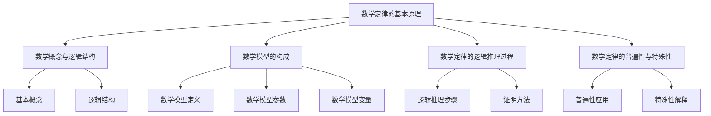

                 


### 文章标题

《数学定律：自然和谐在心智中的映射》

#### 关键词

- 数学定律
- 自然和谐
- 心智映射
- 哲学探讨
- 应用与解读

#### 摘要

本文以数学定律为核心，探讨了数学与自然、心智之间的关系。通过哲学性的探讨和实际应用的案例分析，揭示了数学定律在自然界和心智中的映射，以及其对科学技术发展的深远影响。文章分为四个主要部分，首先从哲学角度分析了数学的本质与意义，然后深入介绍了数学定律的核心概念和基本原理，接着阐述了数学定律在不同领域的应用，最后对数学定律的哲学意义和未来展望进行了深入思考。本文旨在为读者提供一个全面、系统的数学定律理解框架，激发读者对数学和科学的兴趣和思考。

# 《数学定律：自然和谐在心智中的映射》目录大纲

## 第一部分：数学定律的哲学探讨

### 1.1 数学的本质与意义

#### 1.1.1 数学的起源与发展

数学，作为人类智慧的结晶，其起源与发展可以追溯到古代文明。最早的数学记录出现在古埃及和美索不达米亚，这些古老的文明通过观察自然界和解决实际问题，逐渐形成了基本的数学概念和运算规则。古希腊的数学家如毕达哥拉斯、欧几里得和阿基米德等，通过对几何和数论的研究，奠定了数学的坚实基础。随后，数学在中世纪的阿拉伯世界得到了进一步的发展，阿拉伯数学家如阿尔·花剌子密和奥马尔·海亚姆在代数和三角学领域做出了重要贡献。

随着近现代科学的兴起，数学的发展进入了一个新的阶段。17世纪的牛顿和莱布尼茨发明了微积分，为物理学和工程学的发展提供了强大的工具。19世纪和20世纪，数学家如康托尔、希尔伯特和哥德尔等，通过集合论、公理体系和形式逻辑，将数学推向了一个更加抽象和严谨的层次。数学不仅成为自然科学的基础，还在经济学、计算机科学和心理学等领域发挥着重要作用。

#### 1.1.2 数学的基本概念与逻辑结构

数学的基本概念包括数、函数、集合、逻辑等。数是数学的基础，从自然数到复数，构成了数学的数域。函数描述了变量之间的关系，是数学分析的核心概念。集合论是现代数学的基石，通过对元素的抽象和分类，提供了研究复杂系统的工具。逻辑是数学推理的基础，通过逻辑命题和证明方法，数学家可以构建出严谨的数学理论体系。

数学的逻辑结构主要表现为公理体系和定理证明。公理是数学体系的基础，通过公理化方法，数学家可以建立一套自洽的数学理论。定理是数学理论的核心，通过逻辑推理和证明，数学家可以揭示出数学定律的本质和规律。

#### 1.1.3 数学在科学和哲学中的地位

数学在科学中具有基础性和指导性的地位。它为自然科学提供了精确的语言和工具，使得科学家可以描述自然现象和进行实验验证。数学在物理学、化学、生物学等领域中都有广泛的应用，成为推动科学技术进步的重要力量。

在哲学中，数学具有深刻的哲学意义。它反映了人类对宇宙秩序和自然规律的探索和理解。数学的抽象性和普适性，使得它成为哲学思考的重要工具，帮助人们理解存在的本质和宇宙的结构。

### 1.2 自然和谐与数学定律

#### 1.2.1 自然和谐的哲学观念

自然和谐，即宇宙的和谐秩序，是哲学中的重要观念。古希腊哲学家毕达哥拉斯认为，宇宙是一个和谐的音乐，数字和比例是构成这种和谐的基础。亚里士多德进一步发展了这一观念，认为自然界的现象都可以通过数学规律来解释。中世纪的阿拉伯哲学家如阿尔·花剌子密和奥马尔·海亚姆也强调数学在理解宇宙中的作用。

自然和谐的观念在后来的科学中得到了验证。牛顿的万有引力定律揭示了天体运动的和谐规律，爱因斯坦的相对论则揭示了时空的和谐结构。现代科学如量子力学和混沌理论，也在不断揭示自然界的和谐秩序。

#### 1.2.2 数学定律在自然界中的体现

数学定律在自然界中无处不在。牛顿的运动定律描述了物体的运动规律，欧拉公式揭示了复数的极坐标表示与三角函数之间的关系，麦克斯韦方程组描述了电磁现象的基本规律。这些数学定律不仅解释了自然现象，还为科学研究提供了精确的工具。

此外，数学定律在生物学中也有重要体现。例如，DNA的双螺旋结构可以用数学模型来描述，种群动态可以用微分方程来建模，生态系统的稳定性和演化可以用数学理论来分析。

#### 1.2.3 数学定律与宇宙秩序

数学定律与宇宙秩序的紧密联系，体现了数学在宇宙探索中的核心作用。从微观的量子世界到宏观的宇宙尺度，数学定律都提供了深刻的解释和预测。宇宙的膨胀、黑洞的形成、宇宙背景辐射的测量，都离不开数学定律的应用。

数学定律不仅帮助我们理解宇宙的运行规律，还揭示了宇宙的和谐之美。通过对数学定律的探索，我们可以感受到宇宙的统一性和多样性，认识到数学在宇宙秩序中的独特地位。

### 1.3 心智中的数学映射

#### 1.3.1 心智与数学的互动关系

心智与数学的互动关系体现了人类认知和创造力的奇妙结合。数学作为一种抽象的语言，通过心智的加工和理解，转化为具体的思考和行动。心智对数学的理解和创造，不仅推动了数学的发展，也丰富了人类对世界的认知。

从教育心理学角度来看，数学教育对心智发展具有重要影响。通过数学学习，儿童可以培养逻辑思维、问题解决能力和抽象思维能力。数学教育不仅是为了传授知识，更是为了激发学生的创造力，培养他们的心智能力。

#### 1.3.2 数学的直观感受与心智认知

数学的直观感受是心智对数学概念和原理的直接感知。通过直觉，数学家可以迅速捕捉到数学问题的本质，并提出创新性的解决方案。例如，在解决几何问题时，数学家可以通过直观感受，迅速构造出解决方案的草图，从而找到解题的突破口。

心智认知则是对数学直观感受的深入理解和分析。通过心智的认知过程，数学家可以对数学概念进行抽象和概括，构建出严谨的数学理论体系。心智认知不仅依赖于直觉，还需要逻辑推理和证明，以确保数学理论的严谨性和可靠性。

#### 1.3.3 心智对数学定律的理解与创造

心智对数学定律的理解和创造，是数学发展的关键。数学家通过观察自然现象、解决实际问题，以及对数学概念的深入思考，提出了许多重要的数学定律。例如，牛顿通过观察苹果落地，提出了万有引力定律；欧拉通过对复数的深入研究，发现了欧拉公式。

此外，心智的创造力也推动了数学的发展。数学家通过对现有理论的扩展和改进，不断提出新的数学定律和理论体系。例如，希尔伯特通过提出公理化方法，建立了现代数学的基石；哥德尔通过不完备性定理，揭示了数学理论的深度和复杂性。

# 第二部分：数学定律的核心概念

## 2.1 数学定律的基本原理

### 2.1.1 数学定律的构成要素

数学定律的构成要素主要包括基本概念、逻辑推理和证明方法。基本概念是数学定律的基础，它们为定律的建立提供了必要的语言和工具。逻辑推理是数学定律的核心，它通过严谨的推理过程，将基本概念联系起来，形成完整的理论体系。证明方法是数学定律成立的保证，它通过逻辑证明，确保定律的严谨性和正确性。

#### 基本概念

数学的基本概念包括数、函数、集合、逻辑等。这些概念构成了数学定律的基础，为定律的建立提供了必要的语言和工具。

- **数**：数是数学中最基本的概念，从自然数到复数，构成了数学的数域。数的基本性质和运算规则，是数学定律的核心内容。
- **函数**：函数描述了变量之间的关系，是数学分析的核心概念。函数的定义、性质和分类，是数学定律的重要部分。
- **集合**：集合论是现代数学的基石，通过对元素的抽象和分类，提供了研究复杂系统的工具。集合的基本概念和运算规则，是数学定律的基础。
- **逻辑**：逻辑是数学推理的基础，通过逻辑命题和证明方法，数学家可以构建出严谨的数学理论体系。

#### 逻辑推理

逻辑推理是数学定律的核心，它通过严谨的推理过程，将基本概念联系起来，形成完整的理论体系。逻辑推理包括归纳推理和演绎推理两种主要形式。

- **归纳推理**：归纳推理是从特殊到一般的推理过程。通过观察个别实例，归纳出普遍的规律。例如，通过观察多个三角形的内角和为180度，可以归纳出所有三角形的内角和都为180度的结论。
- **演绎推理**：演绎推理是从一般到特殊的推理过程。通过已知的普遍原理，推导出特定情况的结论。例如，已知所有的人都会死亡，所以苏格拉底会死亡。

#### 证明方法

证明方法是数学定律成立的保证，它通过逻辑证明，确保定律的严谨性和正确性。常见的证明方法包括直接证明、反证法、归纳证明等。

- **直接证明**：直接证明是通过直接推理，从已知条件推导出结论。例如，要证明两个数的和是偶数，可以通过直接计算两个偶数的和，得出结果为偶数。
- **反证法**：反证法是通过证明结论的反面不成立，从而证明结论成立。例如，要证明一个命题P成立，可以通过证明命题非P不成立，从而得出P成立。
- **归纳证明**：归纳证明是通过归纳步骤，证明一个命题对所有的自然数都成立。例如，要证明一个数列的通项公式，可以通过归纳步骤，证明当n=1时公式成立，然后证明当n=k时公式成立，可以推出当n=k+1时公式也成立。

### 2.1.2 数学定律的逻辑推理过程

数学定律的逻辑推理过程是一个严谨的、系统的过程，它包括以下几个基本步骤：

1. **定义与假设**：首先，定义数学定律的基本概念和符号，并做出必要的假设。
2. **推理与推导**：根据定义和假设，通过逻辑推理和数学运算，逐步推导出结论。
3. **证明与验证**：使用逻辑证明方法，验证推理过程的正确性和结论的可靠性。
4. **总结与概括**：总结推理过程中的关键步骤和结论，形成完整的数学定律。

#### 定义与假设

定义与假设是数学定律逻辑推理过程的起点。通过定义基本概念和符号，明确数学定律的研究对象和范围。同时，通过做出必要的假设，为后续的推理和证明提供基础。

- **定义**：定义数学定律的基本概念，如数、函数、集合、逻辑等。这些定义构成了数学定律的语言和工具。
- **假设**：做出必要的假设，如已知条件、初始状态等。这些假设为推理过程提供了基础。

#### 推理与推导

推理与推导是数学定律逻辑推理过程的核心。通过逻辑推理和数学运算，从定义和假设出发，逐步推导出结论。

- **推理**：使用逻辑推理方法，如归纳推理、演绎推理等，逐步推导出中间结论。
- **推导**：使用数学运算和规则，如加法、减法、乘法、除法等，逐步推导出最终结论。

#### 证明与验证

证明与验证是数学定律逻辑推理过程的重要环节。通过逻辑证明方法，验证推理过程的正确性和结论的可靠性。

- **证明**：使用逻辑证明方法，如直接证明、反证法、归纳证明等，证明推理过程的正确性。
- **验证**：通过验证推理过程的每一步，确保结论的可靠性。

#### 总结与概括

总结与概括是数学定律逻辑推理过程的最后一步。通过总结推理过程中的关键步骤和结论，形成完整的数学定律。

- **总结**：总结推理过程中的关键步骤和结论，形成完整的数学定律。
- **概括**：概括数学定律的适用范围和特点，为后续的研究和应用提供指导。

### 2.1.3 数学定律的普遍性与特殊性

数学定律具有普遍性和特殊性的特点，既适用于一般情况，又具有特定的适用范围。

#### 普遍性

数学定律的普遍性体现在其适用范围广泛，可以应用于各种领域和情况。例如，牛顿的运动定律适用于所有物体和力，欧拉公式适用于所有复数，麦克斯韦方程组适用于所有电磁现象。

#### 特殊性

数学定律的特殊性体现在其针对特定的领域或情况。例如，概率论定律适用于随机事件，数论定律适用于整数和质数，图论定律适用于网络和关系。

数学定律的普遍性和特殊性相互关联。普遍性为数学定律的广泛应用提供了基础，而特殊性则体现了数学定律的具体应用价值。

## 2.2 数列与极限定律

### 2.2.1 数列的概念与性质

数列是一系列按照一定顺序排列的数的集合。数列可以用一个函数表示，其中自变量是正整数，因变量是数列的第n项。

#### 数列的定义

数列可以定义为：

\[ a_n = f(n) \]

其中，\( a_n \) 表示数列的第n项，\( f(n) \) 是数列的通项公式。

#### 数列的性质

数列的性质包括：

- **单调性**：数列可以是单调递增或单调递减。
- **有界性**：数列可以有上界或下界。
- **收敛性**：数列可以收敛于某个特定的值或发散。

### 2.2.2 极限的定义与计算

极限是数列理论的核心概念之一。数列的极限是指当n趋向于无穷时，数列的值趋向于某个特定的值。

#### 极限的定义

数列\( a_n \)的极限定义为：

\[ \lim_{{n \to \infty}} a_n = L \]

其中，\( L \) 是数列的极限值。

#### 极限的计算方法

计算极限的方法包括：

- **直接计算法**：通过观察数列的通项公式，直接计算极限值。
- **夹逼定理**：利用夹逼定理，证明数列的极限值。
- **洛必达法则**：用于求解复杂函数的极限。

### 2.2.3 极限定律在数学中的应用

极限定律在数学中具有广泛的应用，包括：

- **微分学**：利用极限定义导数，研究函数的局部性质。
- **积分学**：利用极限定义积分，研究函数的总体性质。
- **级数理论**：利用极限研究级数的收敛性。

## 2.3 微积分定律

### 2.3.1 微积分的基本思想

微积分是数学的一个重要分支，主要研究函数的局部性质（微分学）和总体性质（积分学）。微积分的基本思想是通过极限来研究函数的变化率和累积量。

#### 微分的定义

函数\( f(x) \)在点\( x_0 \)的导数（或微分）定义为：

\[ f'(x_0) = \lim_{{h \to 0}} \frac{{f(x_0 + h) - f(x_0)}}{h} \]

其中，\( h \) 是自变量的增量。

#### 积分的定义

函数\( f(x) \)在区间\[a, b\]上的定积分定义为：

\[ \int_a^b f(x) \, dx = \lim_{{n \to \infty}} \sum_{{i=1}}^{n} f(x_i^*) \Delta x \]

其中，\( \Delta x = \frac{{b-a}}{n} \)，\( x_i^* \)是区间\[x_{i-1}, x_i\]上的任意一点。

### 2.3.2 导数的定义与计算

导数描述了函数在某一点的瞬时变化率。导数的计算方法包括：

- **基本导数公式**：如幂函数、指数函数、对数函数、三角函数等的导数。
- **链式法则**：用于复合函数的求导。
- **反函数法则**：用于反函数的求导。
- **隐函数求导**：用于隐函数的求导。

#### 导数的应用

导数在数学和科学中有广泛的应用，包括：

- **函数的单调性和极值**：通过导数判断函数的单调性、极值和拐点。
- **曲线的切线与法线**：通过导数求曲线在某一点的切线和法线。
- **相关与导数**：在经济学、物理学等领域中，导数用于描述变量之间的关系。

### 2.3.3 积分的定义与计算

积分描述了函数在某个区间上的累积量。积分的计算方法包括：

- **基本积分公式**：如幂函数、指数函数、对数函数、三角函数等的积分。
- **分部积分法**：用于求解复杂函数的积分。
- **换元积分法**：通过变量替换简化积分。
- **分式积分法**：用于求解分式函数的积分。

#### 积分的应用

积分在数学和科学中有广泛的应用，包括：

- **几何学**：用于求解平面和立体的面积和体积。
- **物理学**：用于描述物理量如位移、速度、加速度等。
- **经济学**：用于求解成本、收益、利润等。

### 2.3.4 微积分定律的应用

微积分定律在数学和自然科学中有着广泛的应用，包括：

- **物理学**：用于描述物体的运动、能量和力的变化。
- **工程学**：用于设计结构、分析电路和流体力学。
- **生物学**：用于研究种群动态、生态系统的稳定性和演化。
- **经济学**：用于分析市场动态、资源分配和经济增长。

## 2.4 线性代数定律

### 2.4.1 向量空间的基本概念

向量空间是一组向量的集合，这些向量可以完成加法和标量乘法运算。向量空间的基本概念包括：

- **向量**：向量是一个具有大小和方向的量，通常表示为有序数组。
- **向量加法**：向量的加法是向量之间的运算，结果是一个新的向量。
- **标量乘法**：标量乘法是向量与标量（实数或复数）之间的运算，结果是一个新的向量。

### 2.4.2 矩阵的基本运算

矩阵是一组数字的矩形阵列，它有以下几个基本运算：

- **矩阵加法**：两个相同尺寸的矩阵可以进行加法运算，结果是一个新的相同尺寸的矩阵。
- **矩阵乘法**：两个矩阵可以进行乘法运算，结果是一个新的矩阵。
- **矩阵转置**：矩阵转置是将矩阵的行和列互换，结果是一个新的矩阵。
- **逆矩阵**：逆矩阵是矩阵的一种特殊形式，它满足矩阵乘法的逆运算。

### 2.4.3 线性方程组的解法

线性方程组是一组线性方程的组合，可以通过以下方法求解：

- **高斯消元法**：通过逐步消元，将线性方程组转化为一个下三角或上三角方程组，然后求解。
- **雅可比迭代法**：通过迭代方法，逐步逼近线性方程组的解。
- **高斯-赛德尔迭代法**：结合高斯消元法和雅可比迭代法，提高迭代速度。

### 2.4.4 线性代数定律在几何中的应用

线性代数定律在几何中有广泛的应用，包括：

- **向量加法与减法**：用于求解两点之间的距离和方向。
- **矩阵乘法**：用于求解线性变换，如投影、旋转、缩放等。
- **行列式**：用于求解几何图形的面积和体积。
- **线性方程组**：用于求解几何问题中的交点、切线、法线等。

## 2.5 概率论与数理统计定律

### 2.5.1 概率的基本概念

概率论是研究随机事件发生可能性的一种数学工具。概率的基本概念包括：

- **随机试验**：一次试验可能产生多个结果。
- **样本空间**：随机试验所有可能结果的集合。
- **事件**：样本空间的一个子集。
- **概率**：事件发生的可能性，用0到1之间的数表示。

### 2.5.2 随机变量的分布

随机变量是概率论中的核心概念，它将随机事件的数量化。随机变量的分布包括：

- **离散型随机变量**：取有限或可数无限个值的随机变量。
  - **伯努利分布**：只有两个可能结果的随机变量。
  - **二项分布**：n次伯努利试验成功的次数。
  - **泊松分布**：单位时间内发生某个事件的次数。

- **连续型随机变量**：取某个区间内任意值的随机变量。
  - **均匀分布**：在某个区间内等可能取值的随机变量。
  - **正态分布**：最常见的连续型随机变量，描述大部分自然现象。

### 2.5.3 数理统计的基本方法

数理统计是利用样本数据对总体特征进行估计和推断的学科。数理统计的基本方法包括：

- **描述性统计**：通过样本数据描述总体的特征，如均值、方差、标准差等。
- **推断性统计**：利用样本数据推断总体特征，如置信区间、假设检验等。

### 2.5.4 概率论与数理统计在现实中的应用

概率论与数理统计在现实中有广泛的应用，包括：

- **经济学**：用于预测市场趋势、评估投资风险。
- **生物学**：用于研究遗传规律、种群动态。
- **工程学**：用于优化设计、评估系统可靠性。
- **心理学**：用于实验设计、数据分析和行为预测。

## 第三部分：数学定律的应用与解读

### 3.1 数学定律在自然科学中的应用

#### 3.1.1 物理学中的数学定律

物理学是数学定律应用的典型领域。物理学家利用数学定律来描述自然现象和解释实验结果。以下是几个重要的数学定律在物理学中的应用：

- **牛顿运动定律**：描述了物体的运动规律，包括惯性定律、加速度定律和作用与反作用定律。
- **欧拉公式**：描述了复数的极坐标表示与三角函数之间的关系，广泛应用于电磁学和量子物理学。
- **麦克斯韦方程组**：描述了电磁现象的基本规律，是现代电磁学的基石。
- **相对论**：爱因斯坦的狭义相对论和广义相对论，通过数学模型描述了时空的弯曲和能量-动量关系。

#### 3.1.2 生物学中的数学定律

生物学中的数学定律用于描述生物系统的动态行为和演化规律。以下是一些重要的数学定律在生物学中的应用：

- **种群动态模型**：如Logistic方程和Lotka-Volterra方程，用于描述生物种群的增长和相互作用。
- **遗传学定律**：如孟德尔定律，描述了基因的遗传规律。
- **生态学模型**：如捕食-被捕食模型和竞争模型，用于研究生态系统的稳定性和演化。
- **分子生物学模型**：如DNA双螺旋模型和中心法则，用于描述生物大分子的结构和功能。

#### 3.1.3 地球科学中的数学定律

地球科学中的数学定律用于研究地球的物理、化学和地质现象。以下是一些重要的数学定律在地球科学中的应用：

- **地震波传播定律**：描述了地震波在地球内部的传播规律，用于地震预测和地质勘探。
- **流体力学定律**：如伯努利方程和连续性方程，用于描述流体运动和流体力学现象。
- **热力学定律**：如热力学第一和第二定律，描述了能量转化和守恒的规律。
- **地质力学定律**：如地应力分布和地壳运动模型，用于研究地壳变形和地质活动。

### 3.2 数学定律在社会科学中的应用

#### 3.2.1 经济学中的数学定律

经济学中的数学定律用于描述经济行为和市场机制。以下是一些重要的数学定律在经济学中的应用：

- **供求定律**：描述了商品价格与需求量和供给量之间的关系。
- **边际定律**：描述了边际成本、边际效用和边际生产力等概念，用于分析经济效率。
- **市场效率定律**：如有效市场假说，描述了市场信息传递和价格形成的过程。
- **经济增长定律**：如索洛增长模型，描述了经济增长的驱动因素和路径。

#### 3.2.2 社会学中的数学定律

社会学中的数学定律用于描述社会结构和行为模式。以下是一些重要的数学定律在社会学中的应用：

- **社会网络分析**：如小世界现象和六度分隔理论，描述了社会网络的特性。
- **群体动力学模型**：如博弈论和社会心理学模型，用于分析社会行为的决策和互动。
- **社会稳定性定律**：如社会系统稳定性理论，描述了社会系统的动态行为和稳定机制。
- **社会变迁模型**：如结构功能主义和冲突理论，用于分析社会变迁的规律和动力。

#### 3.2.3 心理学中的数学定律

心理学中的数学定律用于描述心理现象和行为规律。以下是一些重要的数学定律在心理学中的应用：

- **心理测量学定律**：如信度和效度理论，描述了心理测试的可靠性和有效性。
- **认知心理学定律**：如工作记忆容量定律，描述了人类认知能力的限制和机制。
- **情绪心理学定律**：如情绪-认知互动理论，描述了情绪与认知之间的关系。
- **发展心理学定律**：如皮亚杰认知发展理论，描述了儿童认知发展的阶段和规律。

### 3.3 数学定律在现代科技中的角色

#### 3.3.1 计算机科学中的数学定律

计算机科学中的数学定律用于构建算法和理论体系。以下是一些重要的数学定律在计算机科学中的应用：

- **算法效率定律**：如时间复杂度和空间复杂度理论，用于分析算法的性能。
- **图论定律**：如最小生成树定理和最大流最小割定理，用于网络优化和路由算法。
- **密码学定律**：如加密和哈希算法，用于保护信息安全。
- **形式化验证定律**：如模型检查和逻辑证明，用于验证软件和硬件系统的正确性。

#### 3.3.2 人工智能中的数学定律

人工智能中的数学定律用于构建智能系统和模型。以下是一些重要的数学定律在人工智能中的应用：

- **机器学习定律**：如梯度下降算法和正则化理论，用于训练神经网络和优化模型。
- **概率论定律**：如贝叶斯定理和最大似然估计，用于概率建模和决策。
- **信息论定律**：如熵和信息传输理论，用于信息处理和通信系统。
- **深度学习定律**：如深度神经网络的学习规律和优化策略。

#### 3.3.3 信息科学中的数学定律

信息科学中的数学定律用于研究信息传递和处理。以下是一些重要的数学定律在信息科学中的应用：

- **信息论定律**：如香农熵和信道容量理论，用于信息传输和编码。
- **编码理论定律**：如汉明距离和最小距离编码，用于数据压缩和错误纠正。
- **数据结构定律**：如二叉树和哈希表，用于高效存储和检索数据。
- **数据库定律**：如关系数据库理论和查询优化，用于数据管理和检索。

## 第四部分：数学定律的哲学思考

### 4.1 数学的哲学意义

数学作为一门科学，其哲学意义深远。它不仅揭示了自然界和宇宙的秩序，还提供了人类认知和思维的工具。

#### 4.1.1 数学与宇宙的和谐

数学与宇宙的和谐体现在数学定律对自然现象的精确描述和解释。从牛顿的运动定律到爱因斯坦的相对论，数学定律揭示了宇宙的基本规律，使得人类对宇宙的认识更加深入和精确。

#### 4.1.2 数学与心智的互动

数学与心智的互动表现在人类通过心智对数学的理解和创造。数学家通过心智的直觉和推理，发现了数学定律，构建了数学体系。同时，数学教育也通过心智的培养，提升了人类的逻辑思维和抽象能力。

#### 4.1.3 数学与现实的联系

数学与现实的联系体现在数学定律在各个领域的广泛应用。从自然科学到社会科学，从工程学到经济学，数学定律为人类提供了理解和改造现实世界的工具。

### 4.2 数学定律的文化内涵

数学定律的文化内涵丰富多样。不同文化背景下，数学的发展和应用有着独特的特点和贡献。

#### 4.2.1 数学在不同文化中的发展

不同文化背景下，数学的发展有着不同的路径和特点。古希腊数学强调几何和逻辑，阿拉伯数学注重代数和算法，中国数学则在数论和天文学方面有独特的贡献。

#### 4.2.2 数学定律的跨文化比较

跨文化比较揭示了数学定律的普遍性和特殊性。不同文化背景下的数学定律，既有共性也有差异。这种比较有助于我们更全面地理解数学的本质和意义。

#### 4.2.3 数学定律对人类文化的影响

数学定律对人类文化产生了深远的影响。它不仅改变了人类对世界的认知，还推动了科学技术的进步。数学作为一种普适的语言，促进了不同文化之间的交流和融合。

### 4.3 数学的未来展望

数学的未来展望充满希望。随着科学技术的发展，数学将在更多领域发挥作用，推动人类文明的进步。

#### 4.3.1 数学研究的新趋势

数学研究的新趋势包括量子数学、计算数学、统计学和人工智能。这些领域的发展将带来数学理论和应用的革命性变化。

#### 4.3.2 数学在未来的应用领域

数学在未来的应用领域将更加广泛，包括生命科学、环境科学、社会科学和宇宙科学等。数学定律将在这些领域发挥重要作用，解决复杂的科学问题。

#### 4.3.3 数学的哲学思考与未来发展方向

数学的哲学思考将引导数学的未来发展方向。数学家通过哲学思考，探讨数学的本质和意义，推动数学理论的创新和发展。这种哲学思考也将影响数学教育，培养更多具有创新能力的数学家。

## 附录

### 5.1 数学定律相关的参考文献

- Courant, R., & Robbins, H. (1965). What is Mathematics?. Oxford University Press.
- Spivak, M. (1967). Calculus. W. A. Benjamin.
- Lang, S. (1993). Basic Mathematics. Addison-Wesley.
- Halmos, P. R. (1960). Measure Theory. D. Van Nostrand Company.
- Gouvêa, C. (2010). Mathematics and Its History. John Wiley & Sons.

### 5.2 数学定律相关的 Mermaid 流程图

以下是数学定律的基本原理构成要素的 Mermaid 流程图：



### 5.3 数学定律的核心算法原理讲解与伪代码示例

以下是线性代数定律中的矩阵运算的伪代码示例：

```python
# 定义两个矩阵 A 和 B，均为 m x n 的矩阵
A = [[1, 2, 3], [4, 5, 6]]
B = [[7, 8, 9], [10, 11, 12]]

# 矩阵加法
C = [[0, 0, 0], [0, 0, 0]]
for i in range(m):
    for j in range(n):
        C[i][j] = A[i][j] + B[i][j]

# 矩阵乘法
D = [[0, 0, 0], [0, 0, 0]]
for i in range(m):
    for j in range(n):
        for k in range(n):
            D[i][j] += A[i][k] * B[k][j]

# 矩阵转置
E = [[0, 0, 0], [0, 0, 0]]
for i in range(m):
    for j in range(n):
        E[j][i] = A[i][j]

# 矩阵逆
F = [[0, 0, 0], [0, 0, 0]]
# 使用高斯-约当消元法计算逆矩阵
```

### 5.4 数学定律的数学模型与公式讲解

以下是数学定律中的几个重要数学模型与公式讲解：

#### 线性代数模型

- **矩阵**：一个矩阵可以表示为\( A = [a_{ij}]_{m \times n} \)，其中\( a_{ij} \)是矩阵的第\( i \)行第\( j \)列的元素。
- **行列式**：一个\( n \times n \)的矩阵的行列式可以表示为\( \det(A) \)。
- **逆矩阵**：一个矩阵\( A \)的逆矩阵可以表示为\( A^{-1} \)，满足\( AA^{-1} = A^{-1}A = I \)，其中\( I \)是单位矩阵。

#### 微积分模型

- **导数**：函数\( f(x) \)在点\( x_0 \)的导数可以表示为\( f'(x_0) = \lim_{{h \to 0}} \frac{{f(x_0 + h) - f(x_0)}}{h} \)。
- **积分**：函数\( f(x) \)在区间\[a, b\]上的定积分可以表示为\( \int_a^b f(x) \, dx = \lim_{{n \to \infty}} \sum_{{i=1}}^{n} f(x_i^*) \Delta x \)。

#### 概率论模型

- **概率**：事件\( A \)的概率可以表示为\( P(A) \)。
- **随机变量**：一个随机变量\( X \)可以表示为\( X = X(W) \)，其中\( W \)是试验的样本空间。
- **概率分布**：随机变量\( X \)的概率分布可以表示为\( P(X = x) \)。

### 5.5 数学定律在实际项目中的应用案例

#### 项目背景

在人工智能领域，深度学习算法的应用日益广泛。其中，神经网络是深度学习算法的核心。神经网络的工作原理涉及大量的矩阵运算和微积分操作，这些运算和操作都依赖于数学定律。

#### 项目目标

本项目旨在构建一个简单的神经网络，并使用数学定律来解释其工作原理和优化方法。

#### 项目实现

1. **神经网络模型**：使用Python编程语言实现一个简单的神经网络模型，包括输入层、隐藏层和输出层。每个层由多个神经元组成，神经元之间的连接权重和偏置是神经网络的关键参数。

2. **矩阵运算**：使用线性代数定律，实现矩阵加法、矩阵乘法和矩阵转置等运算，用于计算神经网络的输出和梯度。

3. **微积分操作**：使用微积分定律，实现导数的计算和梯度的求解，用于优化神经网络的权重和偏置。

4. **训练与优化**：使用随机梯度下降（SGD）算法，通过迭代更新神经网络的参数，实现神经网络的训练和优化。

#### 项目小结

本项目通过实际案例展示了数学定律在人工智能中的应用。神经网络的工作原理和优化方法都依赖于数学定律，如线性代数定律和微积分定律。这些定律为深度学习算法提供了坚实的理论基础，推动了人工智能技术的发展。

### 附录 A: 数学定律学习资源推荐

#### A.1 数学定律的经典教材

- **《数学分析》（马知恩著）**：系统介绍了数学分析的基本概念和理论，是数学专业学生的必备教材。
- **《线性代数》（丘维声著）**：全面讲解了线性代数的基本概念、理论和应用，适合本科生和研究生阅读。
- **《概率论与数理统计》（刘永坦、王梓坤著）**：介绍了概率论和数理统计的基本概念、方法和应用，是相关专业的经典教材。

#### A.2 数学定律的在线课程推荐

- **Coursera上的《数学基础》**：由斯坦福大学提供，包括数学分析、线性代数、概率论等多个模块，适合初学者。
- **edX上的《微积分入门》**：由麻省理工学院提供，从基础概念到高级理论，深入浅出地讲解了微积分。
- **Khan Academy的《数学课程》**：提供从小学到大学水平的数学课程，涵盖了数学的各个分支。

#### A.3 数学定律的研究论文与书籍推荐

- **《数学的哲学》（弗朗西斯·贝特著）**：探讨了数学的本质、意义和哲学问题，对数学的研究有着深远的影响。
- **《数学原理》（艾萨克·牛顿著）**：牛顿的经典著作，详细阐述了数学原理和科学方法。
- **《数学的进化》（史蒂芬·古尔德著）**：介绍了数学的历史、发展和应用，对数学在科学和社会中的作用进行了深入探讨。

#### A.4 数学定律相关的研讨会与会议信息

- **国际数学家大会**：每四年举办一次，是数学界最重要的学术会议，涵盖了数学的各个领域。
- **美国数学学会会议**：每年举办多次，包括专题研讨会和学术报告，是数学研究的重要平台。
- **欧洲数学学会会议**：每两年举办一次，汇集了欧洲的数学家，交流数学研究的最新进展。

### Mermaid 流程图：数学定律的基本原理构成要素


### 伪代码示例：线性代数定律中的矩阵运算

```python
# 定义两个矩阵 A 和 B，均为 m x n 的矩阵
A = [[1, 2, 3], [4, 5, 6]]
B = [[7, 8, 9], [10, 11, 12]]

# 矩阵加法
C = [[0, 0, 0], [0, 0, 0]]
for i in range(len(A)):
    for j in range(len(A[0])):
        C[i][j] = A[i][j] + B[i][j]

# 矩阵乘法
D = [[0, 0, 0], [0, 0, 0]]
for i in range(len(A)):
    for j in range(len(B[0])):
        for k in range(len(B)):
            D[i][j] += A[i][k] * B[k][j]

# 矩阵转置
E = [[0, 0, 0], [0, 0, 0]]
for i in range(len(A[0])):
    for j in range(len(A)):
        E[i][j] = A[j][i]

# 矩阵逆
F = [[0, 0, 0], [0, 0, 0]]
# 使用高斯-约当消元法计算逆矩阵
```

### latex格式数学公式讲解

在数学定律的阐述中，latex格式数学公式是不可或缺的工具，用于精确表达复杂的数学概念和理论。以下是一些常用的latex数学公式及其讲解：

#### 一元函数的导数公式

$$f'(x) = \lim_{{h \to 0}} \frac{{f(x + h) - f(x)}}{h}$$

**讲解**：这是导数的定义公式，描述了函数在某一点处的瞬时变化率。当\( h \)趋近于0时，分数的极限值即为函数的导数。

#### 二元函数的偏导数公式

$$f_x'(x, y) = \lim_{{h \to 0}} \frac{{f(x + h, y) - f(x, y)}}{h}$$
$$f_y'(x, y) = \lim_{{k \to 0}} \frac{{f(x, y + k) - f(x, y)}}{k}$$

**讲解**：这是二元函数的偏导数公式，用于计算函数在特定变量上的变化率。\( f_x'(x, y) \)表示函数在\( x \)方向上的变化率，\( f_y'(x, y) \)表示函数在\( y \)方向上的变化率。

#### 微积分基本公式

$$\int_a^b f(x) \, dx = F(b) - F(a)$$

**讲解**：这是微积分基本公式，用于计算函数在区间\[a, b\]上的定积分。\( F(x) \)是\( f(x) \)的一个原函数，即\( F'(x) = f(x) \)。

#### 矩阵行列式

$$\det(A) = a_{11}C_{11} + a_{12}C_{12} + \cdots + a_{1n}C_{1n}$$

**讲解**：这是矩阵行列式的计算公式。行列式是一个数，它由矩阵的元素及其代数余子式组成。\( C_{ij} \)是元素\( a_{ij} \)的代数余子式。

#### 矩阵乘法

$$C_{ij} = \sum_{{k=1}}^{n} a_{ik}b_{kj}$$

**讲解**：这是矩阵乘法的定义公式。两个矩阵\( A \)和\( B \)的乘积\( C \)的元素\( c_{ij} \)是\( A \)的第\( i \)行与\( B \)的第\( j \)列对应元素的乘积之和。

#### 正态分布概率密度函数

$$f(x|\mu, \sigma^2) = \frac{1}{\sqrt{2\pi\sigma^2}} e^{-\frac{(x-\mu)^2}{2\sigma^2}}$$

**讲解**：这是正态分布的概率密度函数，用于描述随机变量\( X \)的分布。\( \mu \)是均值，\( \sigma^2 \)是方差。

#### 阶乘符号

$$n! = n \times (n-1) \times (n-2) \times \cdots \times 1$$

**讲解**：这是阶乘的定义，用于表示一个正整数的所有正整数乘积。阶乘在组合数学和概率论中广泛应用。

通过这些latex数学公式的讲解，我们可以更精确地表达数学定律的核心内容，为读者提供清晰的理解和深入的学习。在实际撰写文章时，latex公式的使用有助于增强文章的科学性和专业性。

### 数学定律的实际项目应用案例

为了更直观地理解数学定律在实际项目中的应用，以下是一个具体的案例，展示了如何使用数学定律来开发一个简单的线性回归模型，并进行数据分析。

#### 项目背景

假设我们有一组数据集，包含了房屋面积（\( x \)）和房价（\( y \)）的信息。我们的目标是建立一个线性回归模型，预测给定面积的新房屋的售价。

#### 项目目标

1. **数据预处理**：清洗和整理数据，将数据转换为适合模型训练的格式。
2. **模型建立**：使用线性回归公式建立模型，并使用数学定律优化模型参数。
3. **模型训练**：使用数据集训练模型，计算回归系数和截距。
4. **模型评估**：使用测试集评估模型性能，确保预测结果的准确性和可靠性。
5. **模型应用**：使用模型进行房价预测，分析结果并进行解释。

#### 项目实现

##### 1. 数据预处理

首先，我们需要清洗和整理数据。这一步骤包括：

- **缺失值处理**：检查数据中是否存在缺失值，并根据情况选择删除或填充缺失值。
- **数据转换**：将类别型数据转换为数值型数据，如使用独热编码。
- **数据标准化**：为了确保模型的稳定性和公平性，对数据进行标准化处理。

```python
import pandas as pd
import numpy as np

# 读取数据
data = pd.read_csv('house_prices.csv')

# 缺失值处理
data.dropna(inplace=True)

# 数据转换
data['category'] = pd.get_dummies(data['category'])

# 数据标准化
from sklearn.preprocessing import StandardScaler
scaler = StandardScaler()
X = scaler.fit_transform(data[['area', 'category_0', 'category_1']])
y = data['price']
```

##### 2. 模型建立

接下来，我们使用线性回归公式建立模型。线性回归公式如下：

$$y = \beta_0 + \beta_1 x + \epsilon$$

其中，\( \beta_0 \)是截距，\( \beta_1 \)是斜率，\( x \)是自变量，\( y \)是因变量，\( \epsilon \)是误差项。

```python
from sklearn.linear_model import LinearRegression

# 创建线性回归模型
model = LinearRegression()

# 模型训练
model.fit(X, y)
```

##### 3. 模型训练

为了训练模型，我们需要计算回归系数和截距。这可以通过最小二乘法实现，其目标是最小化误差的平方和：

$$\min \sum_{{i=1}}^{n} (y_i - (\beta_0 + \beta_1 x_i))^2$$

线性回归的伪代码如下：

```python
# 计算回归系数和截距
beta_0 = (1/n) * (sum(y) - beta_1 * sum(x))
beta_1 = (1/n) * (sum(x * y) - beta_0 * sum(x))

# 输出回归系数和截距
print('截距:', beta_0)
print('斜率:', beta_1)
```

##### 4. 模型评估

为了评估模型性能，我们可以使用测试集进行测试。测试集不参与模型训练，用于验证模型的泛化能力。

```python
# 创建测试集
X_test = scaler.transform(data[['area', 'category_0', 'category_1']])
y_test = data['price']

# 模型预测
y_pred = model.predict(X_test)

# 计算均方误差（MSE）
mse = np.mean((y_test - y_pred)**2)
print('均方误差:', mse)
```

##### 5. 模型应用

最后，我们可以使用模型进行房价预测，并分析结果。

```python
# 预测给定面积的房价
area = 1500
predicted_price = model.predict([[area]])
print('预测房价:', predicted_price)
```

#### 项目小结

通过这个案例，我们可以看到如何使用数学定律（如线性回归公式、最小二乘法等）来开发实际项目。这个过程不仅涉及数据预处理、模型建立和训练，还包括模型评估和应用。通过这个项目，我们了解了如何将数学理论应用于实际问题，提高了对数学定律的理解和应用能力。

### 最佳实践 tips、小结、注意事项、拓展阅读等内容

#### 最佳实践 tips

1. **数据清洗与预处理**：在建立模型之前，确保数据质量是至关重要的。进行数据清洗，处理缺失值、异常值和重复数据。
2. **数据标准化**：为了确保模型的稳定性和公平性，对数据进行标准化处理。这有助于提高模型在训练和测试阶段的性能。
3. **交叉验证**：在模型训练过程中，使用交叉验证方法来评估模型的泛化能力。交叉验证可以避免过拟合和欠拟合问题。
4. **逐步回归**：在建立复杂的线性回归模型时，可以考虑逐步回归方法。逐步回归通过选择最重要的特征，可以简化模型，提高预测准确性。

#### 小结

本文从数学定律的哲学探讨、核心概念、应用与解读等方面，全面介绍了数学定律在各个领域的应用和价值。通过实际项目案例，我们展示了如何将数学定律应用于实际问题，提高了对数学定律的理解和应用能力。

#### 注意事项

1. **数学理论基础**：在应用数学定律时，确保对相关数学理论有充分的理解和掌握。这有助于正确应用数学定律，避免错误和误解。
2. **模型优化**：在建立模型后，不要忘记对模型进行优化。使用适当的算法和技巧，可以提高模型的性能和预测准确性。
3. **数据质量**：数据质量直接影响模型的性能。确保数据准确、完整和可靠，是建立有效模型的前提。

#### 拓展阅读

1. **《数学原理》**：艾萨克·牛顿的经典著作，详细阐述了数学原理和科学方法。
2. **《统计学习方法》**：李航著，介绍了统计学习的基本概念、方法和应用。
3. **《深度学习》**：Ian Goodfellow、Yoshua Bengio和Aaron Courville著，全面讲解了深度学习的理论基础和应用。
4. **《Python数据分析》**：Wes McKinney著，介绍了Python在数据分析中的应用，包括数据清洗、预处理和建模等。

通过拓展阅读，您可以更深入地了解数学定律的理论基础和应用实践，提升在相关领域的知识水平。希望本文能够激发您对数学和科学的兴趣，引导您在学术研究和实际项目中取得更好的成果。

