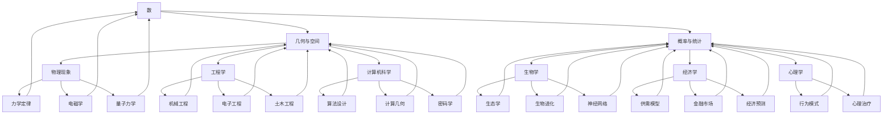

                 

### 文章标题

《数学定律：自然和谐的心智映像》

### 关键词

数学定律、自然现象、心智映像、心智模型、数学原理

### 摘要

本文旨在探讨数学定律如何构成自然和谐的心智映像。我们将首先介绍数学定律的起源与演进，理解其核心概念，并探讨数学定律在多个领域的应用。接着，我们将深入分析数学定律与自然现象、生命现象以及社会现象之间的关系，展示数学定律如何描绘出一个完整的心智映像。最后，我们将讨论数学定律在心智与美学领域的作用，展望数学定律的未来发展。通过这一系列分析，我们希望能揭示数学定律在构建心智映像中的深远影响，并提供对数学定律更全面的理解。

#### 第一部分：数学定律概述

##### 第1章：数学定律的起源与演进

###### 1.1 数学定律的起源

数学定律的起源可以追溯到古代文明，这些文明在不同的历史时期和地域独立地发展出了自己的数学体系。在埃及，数学的起源可以追溯到公元前3000年左右，当时的数学主要用于土地测量和建筑。埃及数学家使用了一种基于十进制的计数系统，并且发展了基本的算术运算和代数概念。

在巴比伦，数学的发展同样具有悠久的历史。巴比伦数学家在公元前2000年左右就已经开始使用六十进制，这在今天的现代数学中仍然有所体现，特别是在角度和时间的度量上。巴比伦人还研究了代数方程，并使用代数方法来解决问题。

中国的数学成就同样令人瞩目。在古代中国，数学主要用于农业生产和天文学。最著名的数学著作是《九章算术》，它成书于公元前2世纪左右，涵盖了算术、代数和几何等多个领域。中国数学家刘徽和祖冲之在圆周率的计算方面做出了重要贡献，这些成就对后来的数学发展产生了深远的影响。

西方数学的发展历程同样值得注意。古希腊是数学发展的黄金时期，特别是公元前5世纪的毕达哥拉斯学派和后来的欧几里得。毕达哥拉斯提出了毕达哥拉斯定理，而欧几里得的《几何原本》奠定了平面几何的基础。古希腊数学家还研究了数论、比例和比例理论，这些研究为后来的数学提供了重要的理论基础。

中世纪的阿拉伯数学同样具有重要的地位。阿拉伯数学家在公元8世纪至12世纪期间翻译并注释了大量希腊和印度的数学著作，并将这些知识传播到欧洲。阿尔·花剌子米和阿尔·巴塔尼等阿拉伯数学家在代数、三角学和天文学等领域做出了重大贡献。

###### 1.2 数学定律的历史演进

数学定律的历史演进可以分为古典数学、近现代数学和现代数学三个阶段。古典数学从古代到18世纪末，主要侧重于几何、代数和数论等基础数学领域。这一时期的数学家如欧几里得、阿基米德、费马和笛卡尔等，他们的工作奠定了现代数学的基础。

在近现代数学阶段，数学经历了一系列的革命性变革。19世纪末，集合论的发展标志着数学公理化的开始，这一过程由康托尔、戴德金和皮亚诺等人推动。集合论的引入使得数学家能够更系统地定义和理解数学对象和关系。

20世纪初，近现代数学继续发展，拓扑学、群论、域论和函数论等分支纷纷兴起。这些新的数学工具和方法不仅丰富了数学的内容，还推动了其他科学领域的发展，如物理学、生物学和计算机科学。

现代数学的发展以20世纪中期为起点，这一时期的数学更加多样化和抽象。数学家在纯数学和应用数学领域都取得了重要突破，如混沌理论、随机过程和计算几何等。计算机科学的兴起也为数学的发展提供了新的机遇，特别是算法理论和计算复杂性理论的进展。

数学定律的历史演进不仅仅是一个数学发展的过程，也是人类认识自然世界和自身思维方式的不断深化。每一个阶段的数学成就都反映了人类对自然规律的探索和理解，同时也为未来科学的发展提供了坚实的基础。

###### 1.3 数学定律在现代科学中的应用

数学定律在现代科学中发挥着至关重要的作用，其应用范围广泛，影响深远。在物理学领域，数学定律是描述自然现象和解释实验结果的基础工具。牛顿的万有引力定律、麦克斯韦的电磁场方程和爱因斯坦的相对论方程都是物理学中经典数学定律的例子，它们帮助我们理解宇宙的基本规律。

在工程学中，数学定律被广泛应用于设计、分析和优化各种工程系统。机械工程中的力学定律、电子工程中的电路定律以及土木工程中的结构力学都是数学定律的具体体现。这些定律不仅确保了工程系统的稳定性和可靠性，还提高了效率和经济性。

计算机科学的发展同样离不开数学定律的支持。算法设计、数据结构、计算几何和密码学等领域都基于数学原理。例如，排序算法中的比较律和交换律、计算机网络中的概率论和图论都是数学定律的具体应用。数学定律使得计算机系统能够高效处理海量数据，保障信息安全，并推动人工智能和机器学习等前沿技术的发展。

此外，数学定律在生物学、经济学、心理学等社会科学领域也有广泛应用。生态学中的种群动态模型、经济学中的供需模型以及心理学中的行为模式分析都依赖于数学定律。通过数学模型，科学家和研究者能够更准确地描述和预测自然现象和社会现象，为科学决策提供有力支持。

总之，数学定律在现代科学中的应用不仅丰富了我们的知识体系，还推动了各个学科的发展。数学定律作为自然和谐的心智映像，为我们提供了一个理解和探索世界的有力工具。

#### 第一部分：数学定律概述

##### 第2章：数学定律的核心概念

在理解数学定律的过程中，掌握其核心概念是至关重要的。数学定律不仅仅是一些抽象的公式和定理，它们深刻地反映了自然界的规律和逻辑关系。本章将深入探讨数学定律的核心概念，包括数的概念、几何与空间、概率与统计，并解释它们之间的联系。

###### 2.1 数的概念

数是数学的基本元素，也是数学定律的基础。数可以分为有理数、无理数和复数等类别。有理数包括整数和分数，它们可以表示为两个整数的比。无理数则不能表示为两个整数的比，如π和√2等。复数是实数和虚数的组合，它们在电子学、工程学和物理学等领域有着广泛的应用。

在数学定律中，数的概念不仅用于计数和度量，还用于表示和操作。例如，欧几里得几何中的长度、面积和体积都是通过数来定义的。在代数中，数是进行代数运算和方程求解的基本单位。数系的扩展，如复数的引入，使得数学能够更灵活地处理复杂问题。

###### 2.2 几何与空间

几何与空间是数学中的重要分支，它们研究形状、大小和位置的关系。几何学的基本概念包括点、线、面和体。点是没有大小的基本单位，线是由无数点组成的一维对象，面是由无数线组成的多维对象，而体则是三维空间中的对象。

在数学定律中，几何与空间的概念被广泛应用于物理学、工程学和计算机科学等领域。例如，牛顿的力学定律中，物体的位置和运动通过空间坐标来描述。在建筑和土木工程中，几何定律用于设计和分析结构。在计算机图形学中，几何与空间的概念用于创建和渲染三维模型。

几何与空间的关系可以通过数学公式来描述，如欧几里得几何中的勾股定理和圆的周长公式。这些公式不仅提供了几何形状的计算方法，还揭示了形状和尺寸之间的关系。例如，勾股定理（a² + b² = c²）揭示了直角三角形的边长关系，这在建筑设计中具有重要意义。

###### 2.3 概率与统计

概率与统计是数学中的另一重要分支，它们用于描述不确定性和数据分布。概率论研究事件发生的可能性，而统计学则研究如何从数据中提取信息并做出推断。

在数学定律中，概率与统计的概念被广泛应用于各个领域。例如，在物理学中，概率论用于描述粒子的随机运动和统计力学中的系统行为。在经济学中，统计学用于分析和预测市场趋势和经济指标。在医学研究中，概率和统计用于评估治疗效果和风险。

概率与统计的关系可以通过数学模型来描述。例如，正态分布是一种常用的概率分布模型，它描述了数据集中在某一值附近的特点。在统计推断中，假设检验和置信区间等方法用于评估数据的可靠性和做出科学决策。

###### 2.4 数学定律的核心概念之间的关系架构

为了更清晰地理解数学定律的核心概念，我们可以使用Mermaid流程图来展示它们之间的联系。



该流程图展示了数学定律的核心概念如何相互联系，并在不同的科学和工程领域中得到应用。通过这种架构，我们可以更好地理解数学定律的整体性和跨学科的应用潜力。

#### 第一部分：数学定律概述

##### 第3章：数学定律的数学模型

数学模型是数学定律的核心，它们通过数学公式和逻辑推理来描述和预测自然现象和人类行为。本节将详细介绍数学模型的概念、构建方法和应用场景，以及数学定律在物理学中的具体应用。

###### 3.1 数学模型的概念

数学模型是一种将现实世界的问题转化为数学形式的方法，它通过建立数学公式和方程组来描述系统的行为和规律。数学模型通常包括变量、参数、约束条件和目标函数等组成部分。变量是模型中的可变元素，参数是模型中的常数，约束条件是限制变量取值的条件，目标函数是模型中需要优化的目标。

数学模型的基本形式可以表示为：

\[ \text{目标函数} = f(\text{变量}) \]

\[ \text{约束条件} = g(\text{变量}) \]

通过求解这些方程，我们可以得到模型在特定条件下的最优解。

###### 3.2 数学模型的构建方法

构建数学模型通常涉及以下几个步骤：

1. **问题分析**：首先，我们需要明确研究的问题，理解问题的本质和目标。

2. **假设与简化**：为了使问题更易于处理，我们需要对实际情况进行简化和假设。例如，可以忽略某些次要因素，或者假设某些变量是线性的。

3. **变量定义**：定义模型中的变量，并确定它们的取值范围和单位。

4. **方程构建**：根据问题的性质，构建描述系统行为的方程组。这些方程可以是线性或非线性的，取决于问题的复杂性。

5. **求解与验证**：通过数学方法（如代数、微分方程、积分方程等）求解方程，并验证模型的准确性和稳定性。

6. **优化与调整**：根据求解结果，对模型进行调整和优化，以使其更好地符合实际情况。

###### 3.3 数学模型的应用场景

数学模型广泛应用于各个领域，包括物理学、工程学、经济学、生物学和心理学等。以下是一些典型的应用场景：

- **物理学**：在物理学中，数学模型用于描述和预测物体的运动、能量转换和粒子行为。例如，牛顿的运动定律和麦克斯韦的电磁场方程都是重要的数学模型。

- **工程学**：在工程学中，数学模型用于设计、分析和优化各种工程系统。例如，结构力学中的有限元模型用于分析建筑物的结构稳定性，电路设计中的电路方程用于模拟电子元件的行为。

- **经济学**：在经济学中，数学模型用于分析市场动态、预测经济趋势和制定经济政策。例如，供需模型和均衡模型用于研究市场均衡和价格变化。

- **生物学**：在生物学中，数学模型用于描述种群动态、遗传规律和生态系统。例如，微分方程和概率模型用于研究种群增长和物种间的相互作用。

- **心理学**：在心理学中，数学模型用于分析行为模式、心理测试和治疗效果。例如，决策模型和行为模型用于研究人类决策过程和情感反应。

###### 3.4 数学定律在物理学中的应用

物理学是数学模型应用最为广泛的领域之一。以下是一些典型的数学定律在物理学中的应用：

1. **牛顿力学**：牛顿的运动定律是物理学中最基本的定律之一，描述了物体在力的作用下的运动规律。牛顿第二定律（F=ma）通过数学模型将力、质量和加速度联系起来，为研究物体运动提供了理论基础。

2. **麦克斯韦方程**：麦克斯韦方程组是电磁学的核心定律，描述了电场、磁场和电磁波的行为。这些方程通过数学模型揭示了电磁现象的基本规律，为电磁技术的发展奠定了基础。

3. **量子力学**：量子力学使用数学模型来描述微观粒子的行为，如电子和光子。波函数和薛定谔方程是量子力学的核心，通过这些模型，我们可以理解量子现象的复杂性和独特性。

4. **统计物理**：统计物理使用概率论和统计方法来描述大量粒子组成的系统的行为。例如，麦克斯韦-玻尔兹曼分布和费米-狄拉克分布是统计物理中的核心模型，用于分析理想气体和量子系统。

总之，数学模型在物理学中扮演着至关重要的角色，它们不仅帮助我们理解和预测自然现象，还为技术创新和发展提供了理论支持。通过数学模型，我们可以将抽象的物理概念转化为具体的数学表达式，从而更深入地探索自然界的奥秘。

#### 第二部分：数学定律与自然现象

##### 第4章：数学定律与物理现象

数学定律在物理现象的描述和解释中起着核心作用，它们不仅揭示了自然界的基本规律，还为科学和技术的发展提供了强大的理论工具。本章将探讨数学定律在物理现象中的应用，包括万有引力定律、光的波动性和量子力学的基本原理。

###### 4.1 万有引力定律

万有引力定律是由艾萨克·牛顿在1687年提出的，它描述了两个物体之间的引力大小与它们的质量和距离的关系。万有引力定律可以用以下数学公式表示：

\[ F = G \frac{m_1 m_2}{r^2} \]

其中，\( F \) 是两个物体之间的引力，\( G \) 是万有引力常数，\( m_1 \) 和 \( m_2 \) 分别是两个物体的质量，\( r \) 是它们之间的距离。

万有引力定律在行星运动、星系结构和宇宙学中有着广泛的应用。例如，通过万有引力定律，我们可以计算行星的轨道，预测彗星和小行星的撞击事件。在宇宙学中，万有引力定律帮助我们理解星系的形成和演化，以及宇宙的大尺度结构。

在实际应用中，万有引力定律被用于导航和航天工程。例如，全球定位系统（GPS）依赖于对卫星运动的精确计算，而这些计算又依赖于万有引力定律。通过调整万有引力常数，科学家可以更准确地预测航天器的轨道，确保它们在预定时间内到达目标地点。

###### 4.2 光的波动性

光的行为既可以用粒子模型解释，也可以用波动模型描述。光的波动性是由克里斯蒂安·惠更斯在1690年提出的，而麦克斯韦在1865年通过麦克斯韦方程组提供了更为完整的数学描述。

麦克斯韦方程组是一组描述电磁场的偏微分方程，它们可以用以下形式表示：

\[ \nabla \cdot \mathbf{E} = \frac{\rho}{\epsilon_0} \]

\[ \nabla \cdot \mathbf{B} = 0 \]

\[ \nabla \times \mathbf{E} = -\frac{\partial \mathbf{B}}{\partial t} \]

\[ \nabla \times \mathbf{B} = \mu_0 \epsilon_0 \frac{\partial \mathbf{E}}{\partial t} \]

这些方程描述了电场和磁场的分布和变化规律，揭示了光作为一种电磁波的特性。

光的波动性在光学领域有着广泛应用，如反射、折射、干涉和衍射等现象。例如，光的反射定律（入射角等于反射角）和斯涅尔定律（折射角与入射角的关系）都是基于波动性的数学模型。干涉和衍射实验进一步证实了光的波动性，并推动了光学仪器的发展，如显微镜和望远镜。

在实际应用中，波动性原理被用于通信技术，特别是光纤通信。光纤中的光信号通过调制和传输，实现了高速数据传输，为互联网和现代通信技术提供了基础。此外，激光技术的发展也依赖于对光波动性的深入理解，激光在医学、工业和科研等领域都有广泛应用。

###### 4.3 量子力学的基本原理

量子力学是描述微观粒子行为的物理学分支，它揭示了微观世界的非连续性和不确定性。量子力学的数学描述主要由波函数和薛定谔方程提供。

薛定谔方程是量子力学的核心方程，它可以用以下形式表示：

\[ i\hbar \frac{\partial \psi}{\partial t} = \hat{H} \psi \]

其中，\( \psi \) 是波函数，表示粒子的概率分布，\( \hbar \) 是约化普朗克常数，\( \hat{H} \) 是哈密顿算子，描述系统的总能量。

量子力学的基本原理包括：

- **不确定性原理**：由海森堡提出，不确定性原理指出粒子的位置和动量不能同时被精确测量。
- **量子叠加原理**：量子系统可以同时处于多个状态的叠加，只有当进行测量时，系统才会“坍缩”到某个确定的状态。
- **量子纠缠**：两个或多个粒子可以形成量子纠缠态，它们的量子态是相互依赖的，无论它们相隔多远。

量子力学在电子学、化学和生物学等领域有着重要应用。例如，量子力学原理被用于设计和制造半导体器件，如晶体管和激光器。在化学中，量子力学帮助我们理解分子结构和化学反应机制。在生物学中，量子力学原理被用于研究生物分子和蛋白质的结构与功能。

在实际应用中，量子力学技术如量子计算和量子通信正在逐渐成熟。量子计算利用量子叠加和量子纠缠的特性，能够在某些问题上实现超快计算，这为密码破解、材料设计和药物研发等领域带来了新的机遇。量子通信则利用量子纠缠和量子隐形传态，实现了安全的信息传输。

总之，数学定律在物理现象的描述和解释中扮演着关键角色。从牛顿的万有引力定律到麦克斯韦的电磁场方程，再到量子力学的波函数和薛定谔方程，数学定律不仅揭示了自然界的基本规律，还为科学和技术的发展提供了强大的工具。通过数学模型，我们可以深入理解自然现象，探索宇宙的奥秘。

##### 第5章：数学定律与生命现象

数学定律在生命现象的描述和解释中同样扮演着至关重要的角色。从生态系统的数学模型到生物进化的数学定律，再到神经网络的数学原理，数学定律为生物学的研究提供了强大的工具，帮助我们更好地理解生命的复杂性和多样性。

###### 5.1 生态系统的数学模型

生态系统是一个复杂的多变量系统，包括生物群落、食物链和生物种群等组成部分。数学模型可以帮助我们描述和预测生态系统的动态变化，理解物种间的相互作用和生态平衡。

生态系统模型中最基本的模型之一是Lotka-Volterra模型，也称为捕食-被捕食模型。该模型通过以下微分方程组描述捕食者和被捕食者种群数量的动态变化：

\[ \frac{dN}{dt} = rN - \alpha NP \]

\[ \frac{dP}{dt} = -\delta P + \beta NP \]

其中，\( N \) 和 \( P \) 分别表示被捕食者（如兔子）和捕食者（如狐狸）的种群数量，\( r \) 是被捕食者的自然增长率，\( \alpha \) 是捕食者对被捕食者的捕食率，\( \delta \) 是捕食者的自然死亡率，\( \beta \) 是捕食者通过捕食被捕食者获得的能量转化率。

通过这个模型，我们可以分析捕食-被捕食系统的稳定性，理解物种数量在长时间内的变化趋势。此外，生态系统模型还可以扩展到考虑其他因素，如环境变化、疾病传播和气候变化等，从而提供更全面的生态预测。

###### 5.2 生物进化的数学定律

生物进化是生命现象的核心之一，描述了物种随时间的演化和适应性变化。数学定律在生物进化研究中提供了有力的工具，帮助科学家理解和预测进化过程。

最著名的生物进化数学定律之一是达尔文的自然选择定律。虽然自然选择是一个生物学过程，但它可以通过概率和遗传学原理来量化。假设在一个种群中，有特定特征的个体比其他个体具有更高的生存和繁殖成功率，那么这个特征在种群中的频率会逐渐增加。

这种过程可以用遗传学中的硬马赫效应（Hardy-Weinberg equilibrium）来描述，它表示在没有外部干扰的情况下，一个种群的基因频率在代际传递过程中保持不变。硬马赫方程如下：

\[ p^2 + 2pq + q^2 = 1 \]

其中，\( p \) 和 \( q \) 分别表示两个等位基因的频率，\( p^2 \) 和 \( q^2 \) 分别表示纯合子个体的频率，\( 2pq \) 表示杂合子个体的频率。

通过这个方程，我们可以分析种群遗传结构和进化潜力，预测物种未来可能的演化方向。

除了自然选择，现代生物进化理论还引入了遗传漂变、突变和基因流等概念。这些因素通过数学模型来描述，为理解生物多样性提供了更全面的视角。

###### 5.3 神经网络的数学原理

神经网络是生物进化和人工智能研究中的重要工具，它通过模拟生物神经系统的结构和功能，实现了对复杂问题的建模和解决。神经网络的数学原理主要包括神经元模型、学习算法和优化方法。

神经元模型是神经网络的基础，它通常由输入层、隐含层和输出层组成。每个神经元接收多个输入信号，通过权重和偏置进行加权求和，然后通过激活函数产生输出。最简单的神经元模型可以用以下数学公式表示：

\[ z = \sum_{i=1}^{n} w_i x_i + b \]

\[ a = \sigma(z) \]

其中，\( z \) 是输入信号的加权求和，\( w_i \) 和 \( b \) 是权重和偏置，\( x_i \) 是输入信号，\( \sigma \) 是激活函数，\( a \) 是输出信号。

神经网络的学习算法主要基于梯度下降法，通过调整权重和偏置来优化网络性能。梯度下降法可以用以下伪代码表示：

```
for each epoch:
    for each training example (x, y):
        Compute the predicted output y'
        Compute the error e = y - y'
        Compute the gradients ∂e/∂w and ∂e/∂b
        Update the weights and biases using the gradients
```

通过这种迭代过程，神经网络能够不断优化其参数，提高分类和预测的准确性。

在实际应用中，神经网络在图像识别、语音识别和自然语言处理等领域取得了显著成果。例如，卷积神经网络（CNN）被广泛应用于图像分类和物体检测，而循环神经网络（RNN）在序列数据分析和机器翻译中表现出色。

总之，数学定律在生命现象的研究中发挥了关键作用。从生态系统的数学模型到生物进化的数学定律，再到神经网络的数学原理，数学定律为我们提供了一个理解和探索生命复杂性的有力工具。通过数学模型，我们可以深入揭示生命的本质和演化规律，为生物科学和人工智能的发展提供理论基础和实践指导。

##### 第6章：数学定律与社会现象

数学定律在社会现象的描述和解释中也扮演着重要角色，它们帮助我们理解和预测人类行为、社会动态以及经济发展。本章将探讨数学定律在社会科学中的应用，包括社会学的数学模型、经济学的数学定律和心理学中的数学理论。

###### 6.1 社会科学的数学模型

社会学研究人类社会结构、行为和社会互动的规律。数学模型为社会科学研究提供了强有力的工具，帮助科学家定量分析和预测社会现象。

在社会学中，最著名的数学模型之一是马克斯·韦伯的社会分层模型。该模型通过数学公式描述了社会分层结构，即不同社会阶层之间的相对地位和财富分配。韦伯的社会分层模型可以用以下形式表示：

\[ S = f(p, r, h) \]

其中，\( S \) 表示社会分层，\( p \) 表示个人的社会地位，\( r \) 表示个人的财富，\( h \) 表示个人的健康水平。通过这个模型，我们可以分析社会分层的影响因素和结构变化。

另一个重要的社会学模型是帕森斯的社会系统理论。帕森斯通过数学模型描述了社会系统的运作机制，包括角色、规范、制度等组成部分。社会系统理论可以用以下形式表示：

\[ S = R + N + A \]

其中，\( S \) 表示社会系统，\( R \) 表示角色系统，\( N \) 表示规范系统，\( A \) 表示制度系统。通过这个模型，我们可以分析社会系统中的各种关系和互动，理解社会结构和社会变迁。

###### 6.2 经济学的数学定律

经济学是研究人类如何在稀缺资源下做出决策的学科。数学定律在经济学中的应用极为广泛，帮助经济学家分析市场动态、预测经济趋势和制定经济政策。

最著名的经济学数学定律之一是供需定律。供需定律描述了商品价格和数量之间的关系，即商品的需求量和供给量相等时的价格。供需定律可以用以下形式表示：

\[ P = f(Q_d, Q_s) \]

其中，\( P \) 表示商品价格，\( Q_d \) 表示需求量，\( Q_s \) 表示供给量。通过这个模型，我们可以分析市场需求和供给的变化，预测价格趋势。

另一个重要的经济学模型是凯恩斯的总量经济学模型。凯恩斯模型通过数学公式描述了总需求、总供给和宏观经济变量的关系。凯恩斯模型可以用以下形式表示：

\[ Y = C + I + G + (X - M) \]

其中，\( Y \) 表示总需求，\( C \) 表示消费，\( I \) 表示投资，\( G \) 表示政府支出，\( X \) 表示出口，\( M \) 表示进口。通过这个模型，我们可以分析宏观经济变量之间的关系，制定经济政策。

###### 6.3 心理学的数学理论

心理学是研究人类行为和心理过程的学科。数学定律在心理学中的应用帮助心理学家理解和预测人类行为，为心理治疗和心理健康提供科学依据。

在心理学中，最著名的数学理论之一是皮亚杰的认知发展理论。皮亚杰通过数学模型描述了人类认知发展的不同阶段，每个阶段都有特定的认知结构和思维模式。皮亚杰的认知发展理论可以用以下形式表示：

\[ C = f(A, T) \]

其中，\( C \) 表示认知结构，\( A \) 表示年龄，\( T \) 表示文化和社会环境。通过这个模型，我们可以分析人类认知发展的规律和影响因素。

另一个重要的心理学模型是弗洛伊德的心理动力学模型。弗洛伊德通过数学公式描述了人类心理结构，包括本我、自我和超我之间的相互作用。心理动力学模型可以用以下形式表示：

\[ P = \frac{d^2 E}{dt^2} + \frac{dE}{dt} = 0 \]

其中，\( P \) 表示心理能量，\( E \) 表示心理能量值。通过这个模型，我们可以分析人类心理状态的变化和调节。

在实际应用中，数学定律在心理学领域有着广泛的应用。例如，通过统计方法，心理学家可以分析行为数据，理解人类行为模式和决策过程。通过概率模型，心理学家可以预测行为和心理反应。

总之，数学定律在社会现象的描述和解释中发挥着关键作用。从社会学的数学模型到经济学的数学定律，再到心理学的数学理论，数学定律为我们提供了一个理解和探索社会现象的科学工具。通过数学模型，我们可以深入揭示社会动态和人类行为的规律，为社会科学的研究和发展提供理论支持。

#### 第三部分：数学定律与心智映像

##### 第7章：心智与数学定律

在探讨数学定律与心智映像的关系时，我们首先需要理解心智的概念。心智是人类心理活动的总和，包括感知、思考、记忆、情感和行为等各个方面。数学定律作为一种描述自然规律的工具，对心智的形成和发展具有深远影响。本节将深入探讨心智的概念，分析数学定律在心智模型中的应用，以及心智映像的形成与演化过程。

###### 7.1 心智的概念

心智是一个多维度的概念，涉及到认知心理学、哲学、人工智能等多个领域。从认知心理学的角度来看，心智是指个体对外界信息的接收、处理和反应的能力。感知、记忆、注意力和推理等认知功能构成了心智的核心内容。

感知是指通过感官接收外界信息的过程，如视觉、听觉、触觉等。记忆则是将感知到的信息存储在脑中，以便日后调用。注意力是心智中的一种调节机制，它帮助我们集中精力处理特定信息。推理则是基于已有信息和逻辑规则进行推断和判断的能力。

哲学领域对心智的研究则更多地关注心智的本质和意识。哲学家们探讨了心智与身体的关系，即心灵与肉体的二元论。近年来，认知科学的兴起将心智研究推向了新的高度，通过结合神经科学、心理学和计算机科学等学科，对心智的本质和功能进行了深入研究。

在人工智能领域，心智模型被用于模拟人类的思维过程。人工神经网络、决策树和强化学习等模型试图模仿人类的感知、记忆和推理能力，以实现智能机器的自主学习和决策。

###### 7.2 数学定律在心智模型中的应用

数学定律在心智模型中的应用主要体现在以下几个方面：

1. **逻辑推理**：逻辑推理是心智模型中的核心部分，它依赖于数学定律中的逻辑运算和推理规则。例如，命题逻辑和谓词逻辑提供了描述和证明推理过程的数学框架。通过这些逻辑规则，人类能够进行逻辑推理，从已知事实推导出新的结论。

2. **概率论**：概率论在心智模型中用于描述不确定性和决策过程。在现实世界中，很多情况都是不确定的，人类需要通过概率论来评估风险和做出决策。例如，贝叶斯定理是一种重要的概率模型，它帮助人类在不确定条件下进行推理和判断。

3. **计算模型**：现代心智模型大多基于计算模型，这些模型通过模拟人脑神经网络来研究心智的运作机制。数学定律如神经网络的激活函数和权重调整规则，为计算模型提供了理论基础。通过这些计算模型，研究人员能够模拟和预测人类心智的行为。

4. **统计学**：统计学在心智模型中的应用主要体现在数据分析和方法论上。通过统计学方法，心理学家能够分析实验数据，提取有意义的信息，并验证理论假设。例如，假设检验和回归分析等统计方法广泛应用于心理学研究，帮助研究者理解和解释心理现象。

###### 7.3 心智映像的形成与演化

心智映像是人类对外界世界的主观感知和认知。心智映像的形成和演化受到多种因素的影响，包括遗传、环境、教育和个人经历等。数学定律在这一过程中发挥了重要作用。

1. **遗传因素**：遗传因素决定了人类心智的基本结构和功能。基因编码了人类大脑的发育过程，影响了大脑的神经网络结构和连接方式。这些遗传因素为心智的形成提供了基础，使得人类具有基本的感知、记忆和推理能力。

2. **环境因素**：环境因素对心智的形成和发展具有深远影响。社会文化环境、教育背景和日常经验等都会影响心智的发展。例如，不同文化背景的人对同一现象的感知和理解可能存在差异，这些差异反映了环境对心智塑造的作用。

3. **教育因素**：教育是心智发展的关键因素。通过教育，人类可以获得知识、技能和思维方式，这些都会影响心智的形成。例如，逻辑训练、数学学习和科学探究等活动能够提高人类的逻辑推理能力和问题解决能力。

4. **个人经历**：个人经历是心智映像形成的重要来源。个人的生活经历、情感体验和人际关系等都会影响心智的发展。例如，积极的人生经历能够增强个人的自信心和适应能力，而负面经历可能导致心理压力和情感障碍。

数学定律在心智映像的形成和演化中起到了桥梁作用，它们通过逻辑推理、概率论、计算模型和统计学等工具，帮助人类理解和解释心智的运作机制。通过数学模型，我们可以模拟和预测心智的行为，为心理科学和人工智能的发展提供理论支持。

总之，心智与数学定律之间存在紧密的联系。数学定律不仅影响了心智的形成和发展，还在心智模型中发挥着关键作用。通过深入探讨心智的概念和数学定律在心智模型中的应用，我们能够更好地理解心智映像的形成与演化，为心理科学和人工智能的发展提供新的视角和思路。

##### 第8章：数学定律与美学

数学定律在美学领域的应用，为我们提供了一个全新的视角来探讨美学原理。从数学在艺术创作中的应用，到数学与情感的关系，数学定律为我们揭示了美学的深刻内涵和抽象表达。

###### 8.1 美学的数学原理

美学作为研究美和审美经验的学科，与数学定律有着天然的联系。数学定律的美学原理主要体现在以下几个方面：

1. **对称性**：对称性是美学中的一个重要概念，它在自然和艺术作品中普遍存在。欧几里得几何中的轴对称、中心对称和平移对称等，都在艺术作品中得到广泛应用。例如，达·芬奇的《蒙娜丽莎》就展示了一种微妙而和谐的对称性。

2. **比例与平衡**：黄金分割比例（约等于1:1.618）在美学中有着广泛应用，它被认为是一种和谐的比例关系，能够产生吸引人的视觉效果。帕台农神庙就是基于黄金分割比例设计的，展现了古希腊建筑艺术的极致之美。

3. **节奏与动态**：数学中的斐波那契数列和分形结构，在艺术创作中提供了节奏感和动态美感。例如，美国艺术家弗兰克·斯特拉的作品就运用了斐波那契数列来创造视觉效果上的和谐感。

4. **简洁与简洁性**：数学中的简洁性和精确性对艺术创作也有很大影响。艺术家常常追求简洁的美，通过简单的几何形状和线条，创造出富有表现力的作品。蒙德里安的《红、黄、蓝构图》就是这种美学思想的典型体现。

###### 8.2 数学在艺术创作中的应用

数学在艺术创作中的应用，不仅丰富了艺术表现形式，还拓展了艺术家们的创作思路。以下是一些具体的应用实例：

1. **计算机生成艺术**：计算机技术的发展，使得艺术家能够运用数学模型和算法进行艺术创作。生成艺术（Generative Art）就是利用算法生成艺术作品的一种艺术形式。例如，美国艺术家凯瑟琳·尤里克的《涟漪迷宫》就是通过计算机程序生成的一种视觉效果丰富的艺术作品。

2. **音乐创作**：音乐中的节奏、旋律和和声等元素，都可以用数学原理来描述。例如，音乐的频率、波长和振动模式等，都可以通过数学公式来表示。作曲家如菲利普·格拉斯和约翰·凯奇等，都曾运用数学原理进行音乐创作。

3. **建筑艺术**：建筑艺术中的对称性、比例和结构设计，都依赖于数学原理。著名的巴黎埃菲尔铁塔就是运用了数学原理进行设计的，其独特的结构不仅体现了美学价值，还满足了工程需求。

4. **绘画与雕塑**：艺术家如皮埃尔·布列松和雅克·路易·达维特等，都曾运用数学原理进行绘画和雕塑创作。他们的作品展现了数学原理在艺术创作中的灵活运用，创造出独特的视觉效果。

###### 8.3 数学与情感的关系

数学与情感之间的关系，是一个值得探讨的领域。尽管数学通常被视为一种理性的学科，但它在情感表达和体验中也有着重要作用。

1. **情感的计算模型**：心理学家和认知科学家试图通过数学模型来描述情感体验。例如，情绪调节理论中的认知评估模型，通过数学方法来描述个体对情感事件的处理过程。这些模型可以帮助我们理解情感的产生和调节机制。

2. **数学在情感表达中的应用**：数学在情感表达中也发挥着重要作用。例如，数学公式和图形可以被用来描述情感状态，如情绪曲线和情感地图等。这些工具帮助艺术家和设计师更准确地表达情感，创造出打动人心的作品。

3. **数学的美学价值**：数学的美学价值对情感体验有着深远影响。数学的美感往往体现在其简洁性、和谐性和精确性上，这些特质能够激发人们的情感共鸣。例如，看到一幅基于斐波那契数列的画作，人们往往会感受到一种和谐和美的体验。

总之，数学定律在美学领域的应用，不仅丰富了艺术创作的方式，还揭示了美学原理的数学本质。通过数学与美学的结合，我们能够更深入地探讨美的本质和情感体验，为艺术和心理学的研究提供了新的视角和工具。

##### 第9章：数学定律的未来

随着科技的不断进步和社会的发展，数学定律在各个领域中的应用前景愈发广阔。本章将探讨数学定律的新发展、在人工智能中的应用以及未来的展望，展示数学定律在推动科学和技术进步中的关键作用。

###### 9.1 数学定律的新发展

数学作为一门基础科学，其不断演进和发展为其他学科提供了新的工具和方法。近年来，数学领域出现了一些新的突破和趋势，这些新发展将继续推动数学定律在各个领域的应用。

1. **量子数学**：量子数学是近年来数学研究的前沿领域，它将量子力学的基本原理与数学理论相结合。量子数学的研究包括量子计算、量子图论和量子几何等。量子数学的发展为解决经典数学无法处理的复杂问题提供了新的思路。

2. **组合数学**：组合数学是研究离散结构的数学分支，它在计算机科学、工程学和统计学等领域有广泛应用。近年来，组合数学在社交网络分析、数据加密和算法设计等领域取得了显著进展，为复杂系统的建模和分析提供了强大的工具。

3. **拓扑学与代数几何**：拓扑学和代数几何是数学中的两个重要分支，它们在理论物理、量子场论和数学物理中发挥着重要作用。近年来，这些领域的研究取得了重要突破，例如量子场论中的背景场理论和代数几何在弦理论中的应用，为数学定律的发展提供了新的方向。

4. **概率论与统计学**：概率论和统计学作为数学中的重要分支，在解决现实世界中的不确定性问题方面发挥着关键作用。近年来，概率论和统计学在机器学习、金融工程和医学统计等领域得到了广泛应用，其理论和方法的不断改进为解决复杂问题提供了新的工具。

###### 9.2 数学定律在人工智能中的应用

人工智能是当前科技发展的热点，而数学定律在其中扮演着不可或缺的角色。数学定律在人工智能中的应用主要包括以下几个方面：

1. **机器学习算法**：机器学习算法是人工智能的核心技术之一，其基础是数学定律。例如，线性回归、决策树、支持向量机和神经网络等算法，都是基于数学定律构建的。这些算法通过优化目标函数和调整模型参数，实现数据的分类、回归和预测。

2. **深度学习**：深度学习是机器学习的一个重要分支，它依赖于复杂的神经网络模型。深度学习的核心是多层神经网络，这些网络通过反向传播算法不断调整权重和偏置，以优化模型的性能。深度学习在图像识别、语音识别和自然语言处理等领域取得了显著成果。

3. **概率图模型**：概率图模型是人工智能中的一种重要方法，它通过图结构来描述变量之间的关系。贝叶斯网络和马尔可夫网络是概率图模型的典型代表，它们在智能推理、知识表示和决策支持等领域有广泛应用。

4. **强化学习**：强化学习是一种通过奖励机制学习策略的机器学习方法，其核心是马尔可夫决策过程（MDP）和策略梯度方法。强化学习在游戏、自动驾驶和推荐系统等领域取得了成功，为解决复杂决策问题提供了有效工具。

###### 9.3 数学定律的未来展望

随着科技的不断进步，数学定律在未来的发展中将继续发挥重要作用，其影响将覆盖更多的领域，推动科学和技术的进一步发展。

1. **量子计算**：量子计算是未来科技的重要方向，它利用量子位（qubit）实现高效计算。量子计算将引入新的数学定律，如量子逻辑和量子概率论，这些定律将为解决复杂问题提供前所未有的计算能力。

2. **生物信息学**：生物信息学是研究生物数据的信息科学，它依赖于数学定律和计算方法。随着基因组学和生物技术的发展，生物信息学将继续应用数学定律来解析生物数据，推动生物科学和医学的进步。

3. **复杂系统**：复杂系统是由大量相互作用的个体组成的系统，如生态系统、金融市场和社会网络等。数学定律在复杂系统的研究中发挥着关键作用，通过构建数学模型和分析系统行为，我们可以更好地理解复杂系统的动态特性。

4. **人工智能伦理**：随着人工智能技术的普及，人工智能伦理成为了一个重要议题。数学定律在人工智能伦理中发挥着重要作用，通过数学模型和算法，我们可以评估和规范人工智能的行为，确保其安全性和公正性。

总之，数学定律在未来的发展中将继续推动科学和技术的进步，为解决复杂问题提供新的方法和工具。通过不断探索和创新，数学定律将在各个领域展现出其深远的影响，为人类社会的可持续发展作出贡献。

#### 附录

##### 附录A：数学定律的参考资料与扩展阅读

为了更好地理解和探索数学定律的深度和广度，以下是推荐的数学定律经典著作、在线资源和最新研究进展。

###### A.1 数学定律的经典著作

1. **《几何原本》**：作者：欧几里得
   - 简介：《几何原本》是古希腊数学家欧几里得所著的几何学著作，奠定了古典几何学的基础。该书系统地阐述了平面几何的基本概念和定理，对后世数学发展产生了深远影响。

2. **《自然哲学的数学原理》**：作者：艾萨克·牛顿
   - 简介：牛顿的《自然哲学的数学原理》提出了经典力学的三大定律，即牛顿第一定律、第二定律和第三定律，这些定律构成了经典物理学的基础。

3. **《概率论的基本原理》**：作者：安德烈·马赫洛夫
   - 简介：马赫洛夫的《概率论的基本原理》是概率论的经典著作，详细阐述了概率论的基本概念、理论和方法，对概率论的发展产生了重要影响。

4. **《概率论及其应用》**：作者：威廉·F·戈尔登和理查德·A·乔丹
   - 简介：戈尔登和乔丹的《概率论及其应用》是一本全面的概率论教材，涵盖了概率论的基本理论、随机过程、假设检验和统计推断等内容。

###### A.2 数学定律的在线资源

1. **MIT OpenCourseWare**（MIT公开课程）
   - 网址：<https://ocw.mit.edu/>
   - 简介：MIT OpenCourseWare提供了大量关于数学的课程资源，包括视频、讲义和习题，适合自学者深入学习。

2. **Khan Academy**（可汗学院）
   - 网址：<https://www.khanacademy.org/>
   - 简介：Khan Academy提供了丰富的数学学习资源，包括视频教程、练习题和测验，适合不同层次的数学学习者。

3. **Wolfram Alpha**（沃尔夫勒姆Alpha）
   - 网址：<https://www.wolframalpha.com/>
   - 简介：Wolfram Alpha是一个计算引擎，可以解答数学问题、提供数学公式和算法，是一个强大的在线数学工具。

###### A.3 数学定律的最新研究进展

1. **《数学年刊》**（Annals of Mathematics）
   - 网址：<https://annals.math.princeton.edu/>
   - 简介：《数学年刊》是一本高水平的数学期刊，刊载了数学领域的重要研究成果和论文，是了解数学最新研究进展的重要渠道。

2. **《科学》**（Science）
   - 网址：<https://www.sciencemag.org/>
   - 简介：《科学》是一本全球知名的科学期刊，经常发表数学和物理等领域的突破性研究论文，是了解数学在科学研究中应用的重要资源。

3. **《数学物理学报》**（Journal of Mathematical Physics）
   - 网址：<https://jmp.aip.org/>
   - 简介：《数学物理学报》是一本专注于数学物理领域的国际学术期刊，刊载了数学物理理论和应用的最新研究成果。

通过这些经典著作、在线资源和最新研究进展，我们可以更深入地了解数学定律的理论基础和应用前景，为数学学习和研究提供丰富的资源和指导。读者可以根据自己的兴趣和需求，选择合适的资源进行学习和研究。

