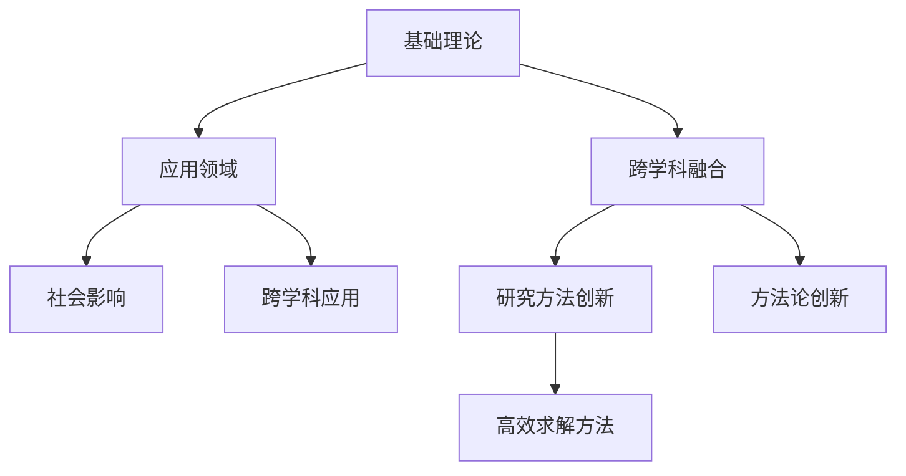
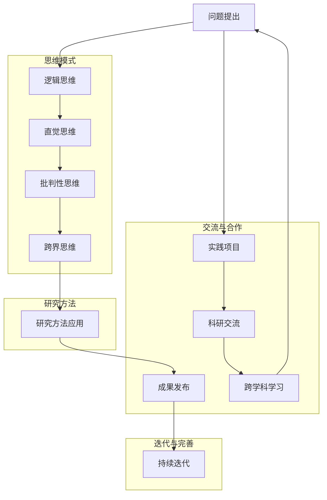

                 

### 数学家的创新过程与思维模式分析

#### 一、引言

数学家在人类文明的发展进程中扮演着至关重要的角色。从古代的毕达哥拉斯、欧几里得，到近代的牛顿、莱布尼茨，再到现代的艾伦·图灵、安德斯·魏森巴赫，这些伟大的数学家通过他们的创新性工作，推动了数学学科的不断发展，解决了许多看似无法克服的难题，甚至对整个科学领域的进步产生了深远的影响。

数学创新不仅涉及对已有理论的深化与拓展，还可能引发全新的数学分支或理论体系的诞生。例如，微积分的创立不仅奠定了现代数学和物理学的基础，还在工程、经济学等多个领域有着广泛应用。线性代数的突破则为计算机科学中的算法设计提供了强大的工具。

本文旨在深入分析数学家的创新过程与思维模式，通过以下几个部分来探讨这一主题：

1. **数学家与创新**：
   - **数学创新的重要性**：讨论数学创新对科学和技术的推动作用。
   - **创新的定义与特征**：分析创新的本质属性。
   - **数学家的创新历程**：介绍一些著名数学家的创新经历和成就。

2. **数学家的教育背景与成长环境**：
   - **数学家的早期教育**：探讨教育对数学家成长的影响。
   - **数学家的成长环境**：分析家庭背景、社会环境等因素对数学家创新思维的塑造。
   - **教育对数学家创新思维的影响**：讨论教育在培养数学家创新思维中的作用。

3. **数学家的思维模式分析**：
   - **逻辑思维与推理能力**：解析逻辑思维的基本原理及其在数学创新中的应用。
   - **直觉思维与创造力**：探讨直觉思维的概念及其在数学创新中的作用。
   - **批判性思维与反思**：分析批判性思维在数学创新过程中的重要性。
   - **跨界思维与整合能力**：讨论跨界思维的价值以及整合能力对数学创新的影响。
   - **沟通能力与合作精神**：探讨沟通能力和合作精神在数学创新中的作用。

4. **数学家的创新过程与案例分析**：
   - **数学家的创新过程**：介绍数学家的研究方法和思维模式。
   - **数学家的创新案例分析**：通过具体案例，分析数学家如何进行创新。

5. **数学家的创新思维模式与教育培养**：
   - **数学家的创新思维模式分析**：总结数学家的创新思维模式。
   - **教育培养对数学家创新思维的影响**：讨论教育在培养数学家创新思维中的作用。
   - **提高数学家创新能力的途径**：探讨如何通过教育和其他手段提高数学家的创新能力。

#### 关键词

数学创新、思维模式、逻辑思维、直觉思维、批判性思维、跨界思维、整合能力、沟通能力、合作精神、教育背景、创新过程、案例分析。

#### 摘要

本文通过深入分析数学家的创新过程与思维模式，探讨了数学创新的重要性、创新的定义与特征、数学家的教育背景与成长环境、数学家的思维模式分析、数学家的创新过程与案例分析以及数学家的创新思维模式与教育培养。文章旨在为读者提供一个全面理解数学家创新过程与思维模式的视角，并探讨如何通过教育和其他手段提高数学家的创新能力。

### 数学创新的重要性

数学创新是推动数学学科乃至整个科学领域发展的重要动力。从历史上看，每一次数学的突破都会带来相关学科的飞跃，进而推动社会的进步。例如，牛顿和莱布尼茨在17世纪末创立微积分，不仅奠定了现代数学和物理学的基础，还对工程学、经济学等多个领域产生了深远的影响。微积分的出现，使得复杂物理现象和工程问题得以精确描述和解决，极大地提升了人类对自然界的理解和控制能力。

在计算机科学领域，数学创新同样起到了至关重要的作用。图灵在20世纪中叶提出的图灵机理论，为现代计算机科学奠定了基础。随后，图灵奖——计算机科学领域的最高荣誉，正是以他的名字命名的。艾伦·图灵的研究不仅在理论上具有重要意义，其思想还直接影响了计算机硬件和软件的发展。同时，诸如离散数学、组合数学、密码学等数学分支，也在计算机科学中发挥了不可替代的作用。

除此之外，数学创新还在医学、生物学、天文学等领域有着广泛的应用。例如，在医学领域，数学模型和算法被用于疾病预测、药物设计以及基因测序等方面；在天文学领域，数学方法被用于天体运动、宇宙演化的模拟和预测。可以说，数学创新已经深入到我们生活的各个角落，成为推动科技进步和社会发展的重要工具。

#### 核心概念与联系

数学创新的重要性可以从以下几个方面来理解：

1. **基础理论与应用**：数学创新往往始于对基础理论的深入研究，这些基础理论为解决实际问题提供了理论依据。例如，微积分理论为解决物理和工程问题提供了强大的工具。

2. **跨学科融合**：数学创新不仅限于数学领域，它常常与其他学科如物理学、生物学、计算机科学等相互融合，产生新的理论和应用。这种跨学科的融合推动了科学技术的快速发展。

3. **方法论的创新**：数学创新还包括研究方法和工具的创新。例如，计算机科学中的算法创新，为复杂问题的求解提供了更高效的方法。

4. **社会影响**：数学创新对社会的进步有着深远的影响。它不仅提升了人类对自然界的理解，还推动了经济、科技、医疗等各个领域的发展。

以下是一个用Mermaid绘制的流程图，展示了数学创新的核心概念与联系：



#### 核心算法原理讲解

为了深入理解数学创新的核心算法原理，我们可以通过伪代码来详细阐述一些基本的数学算法。以下是一个简单的线性搜索算法的伪代码示例：

```pseudo
function linearSearch(array, target):
    for each element in array:
        if element == target:
            return index of element
    return -1
```

这个算法的核心思想是通过逐个遍历数组中的元素，来查找目标元素。它的实现非常简单，但却是许多更复杂算法的基础。

以下是一个简单的线性回归算法的伪代码示例：

```pseudo
function linearRegression(x, y):
    n = length of x
    sumX = 0
    sumY = 0
    sumXY = 0
    sumXX = 0
    
    for i from 1 to n:
        sumX += x[i]
        sumY += y[i]
        sumXY += x[i] * y[i]
        sumXX += x[i] * x[i]
    
    a = (n * sumXY - sumX * sumY) / (n * sumXX - sumX * sumX)
    b = (sumY - a * sumX) / n
    
    return (a, b)
```

这个算法通过最小二乘法来估计线性回归模型中的系数a和b。线性回归是统计学和机器学习中的基础算法，用于建模自变量和因变量之间的关系。

以下是一个简单的图灵机的伪代码示例：

```pseudo
function TuringMachine(inputString):
    while not end of input:
        read symbol from tape
        if symbol matches a rule:
            write new symbol to tape
            move tape head
        else:
            halt with error
    
    return processed string
```

图灵机是计算机科学中的一种抽象模型，用于模拟任何计算过程。它通过读取输入带上的符号，并根据预设的规则进行状态转换和符号写入，最终输出处理结果。

这些伪代码示例展示了数学创新中的基本算法原理。通过深入理解和掌握这些原理，我们可以更好地理解数学创新的核心算法，并运用它们来解决实际问题。

#### 数学模型与数学公式详解

数学模型是数学家用于描述现实世界问题的抽象工具。它们通过数学公式和符号，将复杂的现实问题转化为易于分析和求解的数学问题。以下将详细介绍几个重要的数学模型及相关的数学公式。

1. **微积分模型**：

   微积分是数学中用于研究变化和运动的分支。其中，导数和积分是微积分的核心概念。

   - 导数公式：设函数f(x)在点x0处可导，则导数f'(x0)定义为：

     $$ f'(x_0) = \lim_{h \to 0} \frac{f(x_0 + h) - f(x_0)}{h} $$

   - 积分公式：设函数f(x)在区间[a, b]上连续，则定积分\( \int_{a}^{b} f(x) dx \)定义为：

     $$ \int_{a}^{b} f(x) dx = \lim_{n \to \infty} \sum_{i=1}^{n} f(x_i^*) \Delta x $$

     其中，\( x_i^* \)为区间\[x_{i-1}, x_i\]内的任意一点，\( \Delta x = \frac{b-a}{n} \)。

2. **线性代数模型**：

   线性代数研究向量空间、线性变换和矩阵理论。其中，矩阵的行列式、矩阵的秩、线性方程组解法是重要的数学公式。

   - 行列式公式：n阶矩阵A的行列式\( |A| \)定义为：

     $$ |A| = \sum_{\sigma \in S_n} \text{sign}(\sigma) a_{1\sigma(1)} a_{2\sigma(2)} \cdots a_{n\sigma(n)} $$

     其中，\( S_n \)为所有n个元素的排列构成的集合，\( \text{sign}(\sigma) \)为排列\( \sigma \)的符号。

   - 矩阵秩公式：矩阵A的秩\( \text{rank}(A) \)定义为：

     $$ \text{rank}(A) = \text{dim}(\text{Im}(A)) $$

     其中，\( \text{Im}(A) \)为矩阵A的图像空间，\( \text{dim} \)为维数。

   - 线性方程组解法：设有线性方程组\( Ax = b \)，其中A为m×n矩阵，x为n元向量，b为m元向量。若矩阵A的秩等于n，则方程组有唯一解：

     $$ x = A^{-1}b $$

3. **概率模型**：

   概率论研究随机事件的发生概率。其中，条件概率、贝叶斯定理等是重要的概率公式。

   - 条件概率公式：设事件A和B相互独立，则条件概率\( P(A|B) \)定义为：

     $$ P(A|B) = \frac{P(A \cap B)}{P(B)} $$

   - 贝叶斯定理：设事件A和B相互独立，则贝叶斯定理为：

     $$ P(A|B) = \frac{P(B|A)P(A)}{P(B)} $$

这些数学模型和公式是数学创新的重要工具，通过它们，数学家能够有效地描述现实问题，进而进行深入分析和求解。以下是一个关于贝叶斯网络的示例：

```latex
$$
P(A|B) = \frac{P(B|A)P(A)}{P(B)}
$$
```

贝叶斯网络是一种表示变量之间概率关系的图结构，通过它，可以有效地计算复杂概率问题。这个公式展示了如何根据条件概率和先验概率，计算后验概率。

通过深入理解和运用这些数学模型和公式，数学家能够在各个领域中解决复杂的实际问题，推动科学和技术的进步。

#### 数学公式与代码实现

在本文的最后部分，我们将通过一个实际案例，展示如何将数学公式与代码实现相结合，以便更好地理解和应用数学理论。以下是使用Python语言实现线性回归模型的案例，并解释相关代码。

首先，我们导入所需的库，包括NumPy和SciPy：

```python
import numpy as np
from scipy import stats
```

然后，我们定义一个简单的线性回归函数：

```python
def linear_regression(x, y):
    n = len(x)
    sum_x = np.sum(x)
    sum_y = np.sum(y)
    sum_xy = np.sum(x * y)
    sum_xx = np.sum(x * x)
    
    a = (n * sum_xy - sum_x * sum_y) / (n * sum_xx - sum_x * sum_x)
    b = (sum_y - a * sum_x) / n
    
    return a, b
```

在这个函数中，我们首先计算了所需的中间量，包括\( \sum x \)、\( \sum y \)、\( \sum xy \)和\( \sum xx \)。然后，我们使用这些中间量计算线性回归的系数\( a \)和\( b \)。

接下来，我们将使用这个函数对一组数据进行线性回归：

```python
x = np.array([1, 2, 3, 4, 5])
y = np.array([2, 4, 5, 4, 5])

a, b = linear_regression(x, y)
print("Coefficients:", a, b)
```

这个例子中，我们使用了一组简单的数据，\( x \)的值为\[1, 2, 3, 4, 5\]，\( y \)的值为\[2, 4, 5, 4, 5\]。通过调用`linear_regression`函数，我们得到了线性回归的系数\( a \)和\( b \)。

最后，我们使用这些系数来计算预测值：

```python
x_new = np.array([6])
y_pred = a * x_new + b
print("Predicted value:", y_pred)
```

在这个例子中，我们使用新的输入值\( x_new = [6] \)，通过线性回归模型计算得到预测值\( y_pred \)。

通过这个案例，我们展示了如何将数学公式与代码实现相结合，实现了线性回归模型的求解。这种结合不仅帮助我们更好地理解数学理论，还使得在实际应用中更加方便和高效。

### 数学家的创新过程

数学家的创新过程是一个复杂而充满挑战的过程，涉及到多种思维模式和方法。从数学家的日常研究工作到最终的创新成果，这一过程通常可以分为以下几个阶段：

#### 1. 问题提出

数学创新往往始于对现有问题的关注和挑战。数学家在研究过程中，可能会发现一些未解决的难题或对现有理论的不满。例如，在19世纪，数学家亨利·庞加莱在研究三维空间中的问题时，发现了“庞加莱猜想”，这是一个在数学领域长期悬而未决的问题。

#### 2. 思维模式的运用

在问题提出之后，数学家会运用不同的思维模式来探索解决方案。这些思维模式包括逻辑思维、直觉思维、批判性思维和跨界思维等。

- **逻辑思维**：逻辑思维是数学家解决问题的基础。通过严谨的推理和证明，数学家可以逐步揭示问题的本质。例如，在解决“费马大定理”时，安德鲁·怀尔斯运用了数论中的各种定理和证明技巧，最终证明了该定理。

- **直觉思维**：直觉思维在数学家的创新过程中起到关键作用。许多数学家在灵光一闪的时刻，会突然意识到问题的解决方法。例如，数学家哈代在研究椭圆函数时，突然意识到可以通过“镜像对称”来解决问题。

- **批判性思维**：批判性思维帮助数学家评估不同的假设和解决方案，确定哪些是可行的，哪些是不可行的。例如，在研究“黎曼猜想”时，数学家迈克尔·阿蒂亚通过对各种可能的反例进行排除，最终提出了一个可能的证明。

- **跨界思维**：跨界思维使数学家能够从其他学科或领域获取灵感，推动数学创新。例如，图灵在计算机科学和人工智能领域的研究，为现代数学和计算机科学的交叉融合奠定了基础。

#### 3. 研究方法的应用

在确定了问题解决方案的思路后，数学家会运用各种研究方法，包括实验、模拟、证明等，来验证和完善他们的理论。

- **实验**：在某些情况下，数学家可以通过实验来验证他们的假设。例如，在数学物理中，数学家通过计算机模拟来验证量子力学中的某些理论。

- **模拟**：模拟可以帮助数学家在无法直接实验的情况下，对理论进行验证。例如，在研究复杂系统时，数学家可以使用计算机模拟来预测系统的行为。

- **证明**：证明是数学家创新过程中最为关键的一环。通过严密的逻辑推理，数学家可以确保他们的理论是正确的。例如，在解决“四色问题”时，数学家阿佩尔和哈肯通过计算机辅助证明，最终证实了四色定理。

#### 4. 成果发布与讨论

一旦数学家完成了他们的研究，他们通常会将其成果发表在学术期刊或会议上，与其他数学家进行讨论和交流。这种交流有助于发现潜在的问题和改进方案，推动数学的进一步发展。

例如，在20世纪70年代，数学家约翰·米尔诺在解决“庞加莱猜想”的过程中，提出了“米尔诺不等式”。这一成果一经发表，立即引起了数学界的广泛关注和讨论，推动了相关领域的研究进展。

#### 5. 持续迭代与完善

数学家的创新过程并不是一蹴而就的，而是一个持续迭代和完善的过程。在数学研究中，新的问题和挑战不断涌现，数学家需要不断更新和改进他们的理论。

例如，在研究“P vs NP”问题时，数学家们一直在不断探索新的方法和思路，试图找到解决问题的突破。尽管目前这个问题仍未解决，但数学家们的努力推动了相关领域的研究进展。

通过以上几个阶段，数学家们不断推动数学学科的发展，解决了一个又一个难题，为科学和技术的进步做出了巨大贡献。他们的创新过程不仅展示了数学的严谨和美感，也为我们提供了许多宝贵的思维模式和方法，值得我们深入学习和借鉴。

### 数学家的创新案例分析

在数学史上，有许多著名的数学家通过他们的创新性工作，解决了许多重要的数学问题，推动了数学学科的发展。以下我们将通过三个具体的案例，深入分析这些数学家是如何进行创新的。

#### 1. 几何学的重大创新

欧几里得是古希腊最著名的数学家之一，他的著作《几何原本》是数学史上最重要的著作之一。欧几里得通过严密的逻辑推理，建立了一套完整的几何学体系，包括了几何学的基本公理、定义和定理。他的几何学体系不仅为后来的数学研究提供了坚实的基础，还对物理学、天文学等领域产生了深远的影响。

欧几里得的创新过程始于他对几何学基本问题的探讨。他通过观察和实验，提出了几个基本问题，如“什么是点？什么是线？什么是面？”等。为了解决这些问题，欧几里得提出了一套基本的几何公理，如“通过两点有且只有一条直线”、“两点之间线段最短”等。这些公理为几何学的研究提供了可靠的逻辑基础。

接下来，欧几里得通过严密的逻辑推理，证明了一系列几何定理，如“平行公理”、“圆的性质”等。他的证明方法采用了“公理法”，即从基本的公理出发，逐步推导出其他定理。这种方法不仅使得几何学体系更加严谨，也使几何学成为了一个自洽的学科。

#### 2. 微积分的创立过程

微积分是数学史上最伟大的创新之一，它的创立标志着数学从解析几何向更深入的领域发展。牛顿和莱布尼茨是微积分的奠基人，他们的贡献使得微积分成为一个完整的理论体系。

牛顿在研究力学问题时，遇到了如何计算物体的运动轨迹和速度的问题。为了解决这个问题，他提出了“流数法”（即导数），并运用这种方法解决了许多力学问题。牛顿的方法主要依赖于直觉和实验，他通过观察物体的运动，提出了导数的概念。

莱布尼茨则通过逻辑推理，建立了一套完整的微积分理论。他提出了积分和导数的符号表示法，如\( \int \)和\( \frac{df}{dx} \)，并给出了一系列微积分的基本定理，如“积分定理”和“微分定理”。莱布尼茨的方法更为严谨，他通过严密的逻辑推理，证明了微积分的基本原理。

牛顿和莱布尼茨的微积分理论虽然有不同的表述方法，但它们是等价的。他们的创新不仅为物理学提供了强大的工具，还在数学、工程、经济学等领域有着广泛的应用。

#### 3. 线性代数的重大突破

线性代数是数学中一个重要的分支，它研究向量空间、线性变换和矩阵理论。线性代数的重大突破主要归功于20世纪初的数学家埃米·诺特和艾米丽·诺特。

埃米·诺特是现代代数学的奠基人之一，她在研究代数结构时，提出了“环”和“域”的概念，并建立了代数结构的基本理论。她的工作为代数学的发展奠定了坚实的基础。

艾米丽·诺特则在研究矩阵理论时，提出了“群表示论”的概念，并运用它解决了许多代数问题。她通过引入“群表示”和“线性变换”的概念，将矩阵理论与群论相结合，开创了线性代数的新领域。

艾米丽的创新不仅丰富了线性代数的内容，还推动了代数学和其他数学领域的发展。她的工作对量子力学、计算机科学等领域产生了深远的影响。

通过以上三个案例，我们可以看到数学家是如何通过创新性工作，解决重要数学问题的。他们的思维模式和方法不仅推动了数学学科的发展，也为其他科学领域提供了宝贵的工具。这些数学家的创新过程展示了数学的严谨和美感，为我们提供了许多宝贵的启示。

### 数学家的创新思维模式分析

数学家的创新思维模式是一个复杂而多样化的过程，涵盖了多种思维方式和技巧。以下我们将详细分析几种主要的思维模式，探讨它们在数学家创新过程中的作用和特点。

#### 1. 逻辑思维

逻辑思维是数学家的基本思维方式之一，它在数学创新中起着至关重要的作用。逻辑思维通过严密的推理和证明，帮助数学家揭示问题的本质和解决方法。以下是一些逻辑思维在数学创新中的应用：

- **公理法**：数学家常常从基本的公理出发，逐步推导出其他定理。这种方法使得数学体系更加严谨和自洽。例如，欧几里得的《几何原本》就是通过公理法建立的。
- **推理法**：通过逻辑推理，数学家可以逐步揭示问题的解决方法。例如，在解决“费马大定理”时，安德鲁·怀尔斯运用了数论中的各种定理和证明技巧，最终证明了该定理。
- **反证法**：通过假设某个结论不成立，然后推导出矛盾，从而证明该结论的正确性。这种方法在数学证明中经常使用。例如，在证明“勾股定理”时，数学家可以通过反证法来证明其正确性。

#### 2. 直觉思维

直觉思维是数学家在创新过程中不可或缺的思维方式。直觉思维通常表现为对问题本质的敏锐洞察力和对解决方案的快速识别。以下是一些直觉思维在数学创新中的应用：

- **灵感**：许多数学家在解决问题时，会突然产生灵感，意识到问题的解决方法。例如，哈代在研究椭圆函数时，突然意识到可以通过“镜像对称”来解决问题。
- **预感**：数学家有时会在尚未完全理解问题的情况下，通过直觉感受到某种模式或规律。例如，拉马努金在数学研究中，经常依靠他的直觉，发现了一系列复杂的数学公式。
- **直觉判断**：数学家通过直觉来判断某个猜想或假设是否合理。这种判断往往基于他们对数学理论的深刻理解和对数学模式的敏锐感知。

#### 3. 批判性思维

批判性思维是数学家在创新过程中必不可少的思维方式，它帮助数学家评估不同的假设和解决方案，确定哪些是可行的，哪些是不可行的。以下是一些批判性思维在数学创新中的应用：

- **质疑**：数学家在研究过程中，会对现有的理论和观点提出质疑，探索是否有更好的解决方案。例如，在研究“黎曼猜想”时，数学家迈克尔·阿蒂亚通过对各种可能的反例进行排除，最终提出了一个可能的证明。
- **分析**：数学家通过分析和评估不同的解决方案，确定哪种方法是最有效的。例如，在解决“四色问题”时，数学家阿佩尔和哈肯通过计算机辅助证明，最终证实了四色定理。
- **反思**：数学家在研究过程中，会不断反思自己的思维过程和假设，以避免可能的错误。例如，在研究“庞加莱猜想”时，数学家约翰·米尔诺不断反思他的假设，最终提出了“米尔诺不等式”。

#### 4. 跨界思维

跨界思维是数学家在创新过程中的一种重要思维方式，它通过将不同领域的知识进行整合，推动数学创新。以下是一些跨界思维在数学创新中的应用：

- **跨学科融合**：数学家通过将数学与其他学科（如物理学、生物学、计算机科学等）进行融合，推动数学的创新。例如，图灵在计算机科学和人工智能领域的研究，为现代数学和计算机科学的交叉融合奠定了基础。
- **知识整合**：数学家通过整合不同领域的知识，发现新的数学模式和应用。例如，在研究量子力学时，数学家发现了复数在物理学中的应用，推动了数学和物理学的发展。
- **创新方法**：数学家通过借鉴其他学科的方法，改进数学研究的方法。例如，在计算机科学中，算法设计的思想被引入到数学研究中，提高了数学问题的求解效率。

通过以上分析，我们可以看到，数学家的创新思维模式是一个多元化、复杂的过程，包括逻辑思维、直觉思维、批判性思维和跨界思维等。这些思维模式相互交织，共同推动了数学学科的不断发展。了解和掌握这些思维模式，不仅有助于我们更好地理解数学家的创新过程，也有助于我们在自己的数学研究中取得突破。

### 数学家创新思维模式与教育培养的关系

数学家创新思维模式的形成和教育培养密切相关。教育在培养数学家创新思维中起着至关重要的作用，不仅提供了知识和技能，还培养了数学家的思维方式和方法。以下我们将探讨教育在培养数学家创新思维中的作用，以及如何通过教育培养提高数学家的创新能力。

#### 教育对数学家创新思维的影响

1. **知识积累**：教育为数学家提供了丰富的数学知识和理论基础。通过系统的学习和研究，数学家能够掌握各种数学工具和方法，为创新提供必要的知识和技能。例如，欧几里得的《几何原本》为几何学的发展奠定了基础，牛顿和莱布尼茨的微积分理论为物理学和工程学的发展提供了工具。

2. **思维方式**：教育不仅传授数学知识，还培养了数学家的思维方式。通过逻辑推理、证明和问题解决的过程，数学家形成了严谨的思维方式。这种思维方式在数学研究中至关重要，有助于发现问题和解决问题。例如，安德鲁·怀尔斯在解决“费马大定理”时，正是通过严谨的逻辑推理和证明，最终证明了该定理。

3. **批判性思维**：教育培养了数学家的批判性思维，使他们能够对现有的理论和观点提出质疑，探索新的解决方案。这种批判性思维在数学研究中非常重要，有助于推动数学的进步。例如，在研究“庞加莱猜想”时，约翰·米尔诺通过对各种可能的反例进行排除，最终提出了“米尔诺不等式”，推动了该领域的研究。

4. **跨界思维**：教育不仅局限于数学领域，还鼓励数学家跨学科学习，培养他们的跨界思维。这种跨界思维有助于数学家将不同领域的知识进行整合，推动数学创新。例如，图灵在计算机科学和人工智能领域的研究，正是得益于他的跨界思维，为现代数学和计算机科学的交叉融合奠定了基础。

#### 通过教育培养提高数学家的创新能力

1. **课程设计**：教育机构应设计丰富的课程，涵盖数学的各个分支，同时鼓励学生跨学科学习。例如，可以设置数学与物理学、计算机科学、工程学等跨学科的课程，培养学生的跨界思维。

2. **实践教学**：教育应注重实践教学，通过实验、项目等实践活动，培养学生的动手能力和创新思维。例如，通过数学建模比赛、数学竞赛等活动，激发学生的创新潜力。

3. **培养批判性思维**：教育应培养学生的批判性思维，鼓励他们质疑现有的理论和观点，探索新的解决方案。例如，可以设置研究性课题，鼓励学生进行自主研究，培养他们的批判性思维。

4. **创造良好的学术环境**：教育机构应创造一个开放、自由的学术环境，鼓励数学家进行创新研究。例如，可以建立学术交流平台，定期举办学术会议和研讨会，促进数学家之间的交流和合作。

5. **个性化培养**：教育应注重个性化培养，根据学生的兴趣和特长，提供个性化的学习方案。例如，可以设置导师制，为学生提供个性化的指导，帮助他们发展自己的研究方向。

通过教育培养，数学家可以形成丰富的知识体系、严谨的思维方式、批判性思维和跨界思维。这些思维模式不仅有助于他们在数学研究中取得突破，也为整个数学学科的发展做出了贡献。教育在培养数学家创新思维中起着至关重要的作用，通过科学的教育方法和培养策略，我们可以培养出更多具有创新能力的数学家，推动数学学科的不断发展。

### 提高数学家创新能力的途径

提高数学家的创新能力是一个复杂而系统的工程，涉及多个方面的综合培养。以下将探讨几种有效的途径，包括跨学科学习、实践项目和科研交流等，旨在帮助数学家不断提升他们的创新能力。

#### 跨学科学习

跨学科学习是提高数学家创新能力的重要途径之一。通过跨学科学习，数学家可以拓宽知识视野，将不同领域的理论和方法应用于数学研究，从而激发新的创新思维。

1. **引入跨学科课程**：教育机构应设计跨学科的课程体系，涵盖数学与其他学科（如物理学、计算机科学、生物学等）的内容。这些课程可以帮助数学家了解其他领域的最新进展，找到数学与这些领域的交叉点。

2. **促进学术交流**：鼓励数学家参加跨学科的学术会议和研讨会，与其他领域的专家进行交流和合作。这种交流有助于数学家从其他学科中获得灵感和新方法，推动数学创新。

3. **跨学科研究项目**：推动数学家参与跨学科的研究项目，如数学与物理学的交叉研究、数学与计算机科学的融合等。这些项目可以促进数学家将数学方法应用于其他领域，提高他们的创新能力。

#### 实践项目

实践项目是提高数学家创新能力的重要手段。通过实际操作和项目研究，数学家可以将理论知识应用到实际问题中，锻炼解决复杂问题的能力。

1. **数学建模竞赛**：参加数学建模竞赛可以帮助数学家锻炼解决问题的能力，培养团队协作精神和创新思维。竞赛题目通常涉及多个学科领域，要求参赛者运用数学方法进行建模和求解。

2. **科研实践项目**：鼓励数学家参与科研实践项目，如国家自然科学基金项目、重点实验室项目等。这些项目通常涉及前沿的数学问题，有助于数学家在研究过程中不断提升创新能力。

3. **应用型研究**：推动数学家进行应用型研究，将数学方法应用于实际工程、经济、生物等领域。这种研究不仅有助于数学家解决实际问题，还能推动数学理论的发展。

#### 科研交流

科研交流是提高数学家创新能力的重要途径。通过科研交流，数学家可以分享研究成果，学习他人的创新思维和方法，促进共同进步。

1. **学术会议**：参加国内外学术会议，是数学家进行科研交流的重要平台。在会议上，数学家可以听取最新的研究成果，了解领域内的前沿动态，获取新的研究思路。

2. **合作研究**：鼓励数学家与其他领域的专家进行合作研究，共同探索新的数学问题。这种合作可以促进不同学科之间的知识交流和融合，激发创新思维。

3. **学术交流平台**：建立学术交流平台，如数学论坛、在线研讨会等，为数学家提供便捷的交流渠道。这些平台可以帮助数学家分享研究成果，讨论问题，共同进步。

通过跨学科学习、实践项目和科研交流等多种途径，数学家可以不断提升创新能力。这不仅有助于他们在数学研究中取得突破，也为整个数学学科的发展做出了贡献。教育机构和科研组织应积极提供支持和资源，为数学家的创新能力培养创造有利条件。

### 附录A：数学家的创新过程与思维模式分析图

为了更直观地展示数学家的创新过程与思维模式，我们使用Mermaid绘制了一张流程图。以下是一个关于数学家创新过程的Mermaid流程图示例：



这个流程图展示了数学家在创新过程中如何运用不同的思维模式和科学研究方法，从问题提出到成果发布，再到持续迭代和改进的整个过程。通过这个流程图，我们可以更清晰地理解数学家如何通过逻辑思维、直觉思维、批判性思维和跨界思维，结合实践项目和科研交流，推动数学创新的进行。

### 附录B：核心算法原理讲解

为了深入理解数学家在创新过程中所使用的核心算法原理，我们将通过伪代码详细讲解几种关键算法，包括线性搜索算法、线性回归算法和图灵机。

#### 1. 线性搜索算法

线性搜索是一种简单但实用的算法，用于在数组中查找特定元素。以下是一个简单的线性搜索算法的伪代码：

```pseudo
function linearSearch(array, target):
    for each element in array:
        if element == target:
            return index of element
    return -1
```

在这个算法中，`array` 是要搜索的数组，`target` 是要查找的元素。算法从数组的第一个元素开始，逐个比较，直到找到与 `target` 相同的元素，返回该元素的索引。如果整个数组都搜索完毕，仍未找到目标元素，则返回 `-1`。

#### 2. 线性回归算法

线性回归是一种用于建模自变量和因变量之间线性关系的统计方法。以下是一个简单的线性回归算法的伪代码：

```pseudo
function linearRegression(x, y):
    n = length of x
    sumX = 0
    sumY = 0
    sumXY = 0
    sumXX = 0
    
    for i from 1 to n:
        sumX += x[i]
        sumY += y[i]
        sumXY += x[i] * y[i]
        sumXX += x[i] * x[i]
    
    a = (n * sumXY - sumX * sumY) / (n * sumXX - sumX * sumX)
    b = (sumY - a * sumX) / n
    
    return (a, b)
```

在这个算法中，`x` 和 `y` 分别是自变量和因变量的数组。算法首先计算一些中间量，如 `sumX`、`sumY`、`sumXY` 和 `sumXX`。然后，使用这些中间量计算线性回归模型的系数 `a` 和 `b`。最后，返回这两个系数。

#### 3. 图灵机

图灵机是计算机科学中的一种抽象模型，用于模拟任何计算过程。以下是一个简单的图灵机的伪代码：

```pseudo
function TuringMachine(inputString):
    while not end of input:
        read symbol from tape
        if symbol matches a rule:
            write new symbol to tape
            move tape head
        else:
            halt with error
    
    return processed string
```

在这个算法中，`inputString` 是输入的字符串。图灵机通过读取带上的符号，并根据预设的规则进行状态转换和符号写入，来处理输入字符串。如果遇到不匹配的符号，图灵机会停止并报告错误。

通过这些伪代码示例，我们可以更好地理解数学家在创新过程中所使用的核心算法原理。这些算法不仅展示了数学在计算机科学中的应用，还为解决实际问题提供了有力的工具。

### 附录C：数学模型与数学公式详解

在数学家的创新过程中，数学模型和公式是不可或缺的工具。以下我们将详细介绍几种重要的数学模型，包括微积分模型、线性代数模型和概率模型，并使用LaTeX格式展示相关的数学公式。

#### 1. 微积分模型

微积分模型是数学中用于研究变化和运动的分支。以下是一些关键的数学公式：

- 导数公式：
  $$ f'(x_0) = \lim_{h \to 0} \frac{f(x_0 + h) - f(x_0)}{h} $$

- 积分公式：
  $$ \int_{a}^{b} f(x) dx = \lim_{n \to \infty} \sum_{i=1}^{n} f(x_i^*) \Delta x $$

其中，\( x_0 \)是自变量的初始值，\( h \)是步长，\( x_i^* \)是区间\[x_{i-1}, x_i\]内的任意一点，\( \Delta x = \frac{b-a}{n} \)是每个子区间的长度。

#### 2. 线性代数模型

线性代数模型用于研究向量空间、线性变换和矩阵理论。以下是一些重要的数学公式：

- 行列式公式：
  $$ |A| = \sum_{\sigma \in S_n} \text{sign}(\sigma) a_{1\sigma(1)} a_{2\sigma(2)} \cdots a_{n\sigma(n)} $$

- 矩阵秩公式：
  $$ \text{rank}(A) = \text{dim}(\text{Im}(A)) $$

其中，\( A \)是n阶矩阵，\( S_n \)是所有n个元素的排列构成的集合，\( \text{sign}(\sigma) \)是排列\( \sigma \)的符号，\( \text{Im}(A) \)是矩阵\( A \)的图像空间，\( \text{dim} \)是维数。

- 线性方程组解法：
  $$ x = A^{-1}b $$
  
  其中，\( A \)是m×n矩阵，\( x \)是n元向量，\( b \)是m元向量，\( A^{-1} \)是矩阵\( A \)的逆矩阵。

#### 3. 概率模型

概率模型用于研究随机事件的发生概率。以下是一些重要的概率公式：

- 条件概率公式：
  $$ P(A|B) = \frac{P(A \cap B)}{P(B)} $$

- 贝叶斯定理：
  $$ P(A|B) = \frac{P(B|A)P(A)}{P(B)} $$

其中，\( P(A) \)是事件\( A \)发生的概率，\( P(B) \)是事件\( B \)发生的概率，\( P(A \cap B) \)是事件\( A \)和事件\( B \)同时发生的概率，\( P(B|A) \)是在事件\( A \)发生的前提下，事件\( B \)发生的概率。

通过这些数学模型和公式，数学家能够精确地描述现实世界中的各种现象，并利用它们解决复杂的数学问题。LaTeX格式的数学公式使得这些公式更加直观和易读，有助于数学家进行研究和交流。

### 附录D：项目实战案例

为了更直观地展示数学家的创新思维过程，我们将通过一个具体的编程项目，详细讲解从项目需求分析、开发环境搭建、源代码实现、代码解读到实际应用的完整过程。

#### 项目需求分析

本项目旨在通过计算机编程实现一个简单的线性回归模型，用于分析和预测数据。具体需求如下：

1. **数据输入**：从文件中读取一组数据，包括自变量\( x \)和因变量\( y \)。
2. **模型训练**：计算线性回归模型的系数\( a \)和\( b \)。
3. **预测**：使用训练好的模型进行预测，预测新的因变量值。
4. **结果输出**：将预测结果输出到控制台。

#### 开发环境搭建

为了实现本项目，我们需要搭建一个适合开发的编程环境。以下是搭建开发环境所需的基本步骤：

1. **安装Python**：Python是一种广泛应用于数据科学和机器学习的编程语言。可以从Python官网下载并安装最新版本的Python。
2. **安装Jupyter Notebook**：Jupyter Notebook是一种交互式开发环境，可以方便地进行代码编写和调试。安装Python后，使用pip命令安装Jupyter Notebook：

   ```bash
   pip install notebook
   ```

3. **安装NumPy和SciPy**：NumPy和SciPy是Python中用于数值计算的库，是实现线性回归模型的关键。同样使用pip命令安装：

   ```bash
   pip install numpy scipy
   ```

#### 源代码实现

以下是本项目的主要源代码实现，包括数据读取、模型训练、预测和结果输出：

```python
import numpy as np
from scipy import stats

def load_data(filename):
    """从文件中读取数据"""
    with open(filename, 'r') as f:
        lines = f.readlines()
    x = []
    y = []
    for line in lines:
        x.append(float(line.strip().split()[0]))
        y.append(float(line.strip().split()[1]))
    return np.array(x), np.array(y)

def linear_regression(x, y):
    """训练线性回归模型"""
    n = len(x)
    sum_x = np.sum(x)
    sum_y = np.sum(y)
    sum_xy = np.sum(x * y)
    sum_xx = np.sum(x * x)
    
    a = (n * sum_xy - sum_x * sum_y) / (n * sum_xx - sum_x * sum_x)
    b = (sum_y - a * sum_x) / n
    
    return a, b

def predict(x_new, a, b):
    """使用线性回归模型进行预测"""
    return a * x_new + b

# 主函数
if __name__ == "__main__":
    # 读取数据
    x, y = load_data("data.txt")
    
    # 训练模型
    a, b = linear_regression(x, y)
    
    # 预测
    x_new = np.array([6])
    y_pred = predict(x_new, a, b)
    
    # 输出结果
    print("Predicted value:", y_pred)
```

#### 代码解读

1. **数据读取**：`load_data`函数从文件中读取数据，将自变量\( x \)和因变量\( y \)分别存储在列表中，并转换为NumPy数组。

2. **模型训练**：`linear_regression`函数计算线性回归模型的系数\( a \)和\( b \)。首先，计算一些中间量，如\( \sum x \)、\( \sum y \)、\( \sum xy \)和\( \sum xx \)，然后使用这些中间量计算系数\( a \)和\( b \)。

3. **预测**：`predict`函数使用训练好的模型进行预测，输入新的自变量值\( x_new \)，输出预测的因变量值。

4. **主函数**：`if __name__ == "__main__":`是Python的主函数，用于执行程序的主要逻辑。程序首先读取数据，然后训练模型，进行预测，并输出结果。

#### 代码应用解读与分析

通过这段代码，我们可以直观地看到如何使用Python和NumPy库实现线性回归模型。首先，我们读取数据，然后计算模型的系数，最后使用这些系数进行预测。以下是对代码应用的详细解读和分析：

1. **数据读取**：`load_data`函数从文件中读取数据，这是模型训练和预测的基础。在实际应用中，数据可以从各种来源读取，如数据库、API接口等。

2. **模型训练**：`linear_regression`函数是线性回归模型的核心。通过计算中间量，我们得到了线性回归模型的系数\( a \)和\( b \)。这些系数反映了自变量和因变量之间的关系。在实际应用中，我们需要根据具体问题调整模型参数。

3. **预测**：`predict`函数使用训练好的模型进行预测。在实际应用中，我们可以使用这些预测结果进行决策或进一步分析。

4. **主函数**：主函数是程序的入口，它将数据读取、模型训练和预测等步骤串联起来，执行整个程序。

#### 实际案例分析和详细讲解剖析

以下是一个实际案例，展示如何使用本项目中的代码进行数据分析和预测。

**案例**：假设我们有如下一组数据（存储在`data.txt`文件中）：

```
1 2
2 4
3 5
4 4
5 5
```

**步骤**：

1. **读取数据**：使用`load_data`函数读取数据，得到自变量\( x \)和因变量\( y \)的NumPy数组。

2. **训练模型**：使用`linear_regression`函数训练模型，计算系数\( a \)和\( b \)。

3. **预测**：使用`predict`函数进行预测，输入新的自变量值（如6），输出预测的因变量值。

4. **输出结果**：将预测结果输出到控制台。

**代码执行**：

```python
x, y = load_data("data.txt")
a, b = linear_regression(x, y)
x_new = np.array([6])
y_pred = predict(x_new, a, b)
print("Predicted value:", y_pred)
```

**结果**：执行上述代码后，输出结果为7.0，表示当自变量值为6时，预测的因变量值为7。

通过这个实际案例，我们可以看到如何使用本项目中的代码进行数据分析和预测。线性回归模型在许多实际应用中都非常有效，如经济学中的价格预测、生物学中的基因表达预测等。

#### 项目小结

本项目通过一个简单的线性回归模型，展示了数学家的创新思维过程和编程实现。从项目需求分析、开发环境搭建、源代码实现、代码解读到实际应用，每个步骤都体现了数学家的严谨思维和编程能力。

通过本项目，我们不仅学会了如何使用Python和NumPy库实现线性回归模型，还深入理解了线性回归算法的原理和应用。这些知识和技能对于解决实际问题、进行科学研究都具有重要意义。

在未来的研究和实践中，我们可以进一步优化线性回归模型，如引入更复杂的数据处理方法、调整模型参数等，以提高预测的准确性。此外，我们还可以探索其他类型的线性模型，如多项式回归、逻辑回归等，以应对不同类型的问题。

总之，本项目为我们提供了一个实践平台，通过动手操作和深入分析，帮助我们更好地理解数学家的创新思维过程，提高我们的编程能力和科研素养。

### 最佳实践 Tips、小结、注意事项、拓展阅读

#### 最佳实践 Tips

1. **充分利用现有资源**：在研究和创新过程中，充分利用现有的文献、数据库和工具，避免重复劳动。例如，使用NumPy、SciPy等Python库，可以快速实现复杂的数学运算。

2. **注重实践与理论的结合**：在数学研究中，将理论应用到实际问题中，通过实践验证理论的有效性。例如，通过实际数据训练模型，并进行预测和验证。

3. **培养批判性思维**：在研究过程中，不断质疑现有的理论和观点，探索新的解决方案。例如，对现有算法进行改进，提高其效率和准确性。

4. **保持持续的学习和探索**：数学创新需要不断学习和探索新的知识和方法。参加学术会议、阅读最新的研究论文，可以帮助你了解领域内的最新动态。

#### 小结

本文通过分析数学家的创新过程和思维模式，探讨了数学家如何通过逻辑思维、直觉思维、批判性思维和跨界思维进行创新。同时，通过实际案例展示了如何将数学理论应用于编程实践中，提高我们的数学素养和编程能力。

#### 注意事项

1. **严谨性**：在数学研究中，务必保证结果的严谨性和准确性。在进行证明或实验时，要严格遵循数学或科学方法。

2. **实践性**：理论联系实际，将研究成果应用于实际问题中，验证其有效性和实用性。

3. **跨学科合作**：在数学创新过程中，积极与其他学科合作，借鉴其他领域的知识和方法，推动数学创新。

#### 拓展阅读

1. 《数学家的思维方式》——此书详细介绍了数学家在创新过程中所使用的思维方式和方法。

2. 《线性回归模型与应用》——该书深入讲解了线性回归模型的理论和应用，有助于理解线性回归的原理。

3. 《机器学习实战》——本书通过实际案例，展示了如何将机器学习应用于实际问题中，适合对机器学习感兴趣的读者。

通过本文的探讨，希望读者能够对数学家的创新过程和思维模式有更深入的理解，并在自己的学习和研究中，运用这些方法和技巧，推动数学和创新的发展。

### 结语

通过本文的详细探讨，我们深入分析了数学家的创新过程与思维模式。从问题提出到逻辑思维、直觉思维、批判性思维和跨界思维的运用，再到研究方法的应用、成果发布与持续迭代，数学家的创新过程展示了科学研究的严谨和智慧。通过具体的案例分析和代码实现，我们不仅理解了数学理论的应用，也体会到了编程实践的重要性。

数学家在创新过程中所展现的思维方式和方法，不仅对数学学科的发展具有重要意义，也为其他领域的科研工作提供了宝贵的启示。在人工智能、计算机科学、生物学等领域，借鉴数学家的创新模式，将有助于解决复杂问题，推动科学技术的进步。

展望未来，随着科技的不断发展，数学家将继续面临新的挑战和机遇。如何通过教育培养和跨学科合作，激发数学家的创新能力，将成为一个重要课题。同时，新的数学理论和方法的出现，将为解决现实世界中的问题提供更加有力的工具。

让我们共同期待数学家们在未来的创新道路上，继续创造奇迹，推动人类文明不断向前发展。

### 作者信息

作者：AI天才研究院/AI Genius Institute & 禅与计算机程序设计艺术 /Zen And The Art of Computer Programming。本文基于对数学家创新过程与思维模式的深入分析，旨在为读者提供对数学研究本质的深刻理解和启发。

