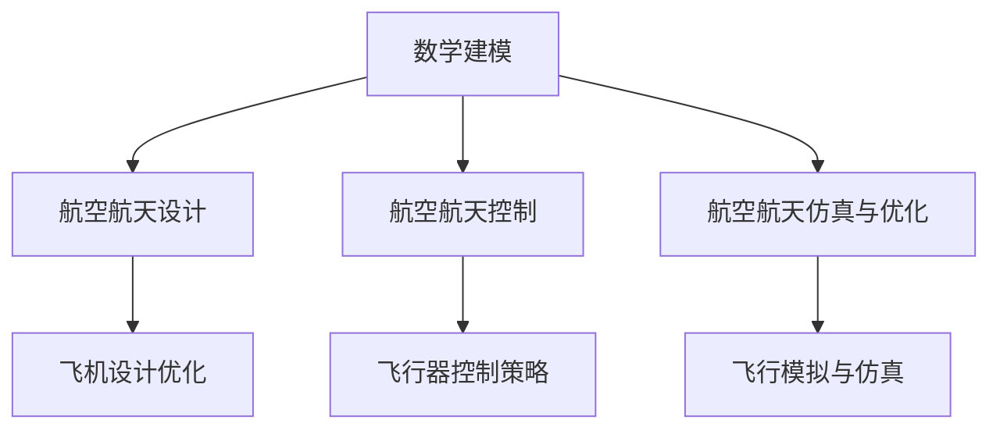

                 

### 文章标题

数学建模在航空航天中的应用

> 关键词：数学建模、航空航天、算法、仿真、优化、线性代数

> 摘要：本文将从数学建模的基本概念、重要性以及方法技术出发，深入探讨数学建模在航空航天领域的应用。通过分析航空航天工程中的数学模型、挑战及案例，我们进一步探讨了数学建模与航空航天技术的紧密联系，以及在航空航天设计、控制和仿真优化中的具体应用。文章还详细介绍了常用数学建模算法、核心算法原理及其实际应用，并通过具体的数学公式和伪代码进行了详细讲解，旨在为读者提供全面、系统的数学建模在航空航天领域的应用知识。

----------------------------------------------------------------### 第一部分：核心概念与联系

#### 1.1 数学建模概述

##### 1.1.1 数学建模的基本概念

数学建模是指运用数学语言和数学工具，通过对实际问题进行抽象、简化和形式化，构建出一个能够反映问题特征和规律的数学模型。数学建模通常包括以下步骤：

1. **问题理解与分析**：对实际问题进行深入理解，明确目标、条件和限制。
2. **模型构建**：根据问题特点，选择合适的数学工具和理论，构建数学模型。
3. **模型求解**：运用数值方法或算法，对数学模型进行求解，得到问题的解。
4. **模型验证与优化**：通过实际数据或模拟结果，验证模型的有效性和准确性，并进行优化。

##### 1.1.2 数学建模的重要性

数学建模在多个领域具有广泛的应用，尤其在工程、科学、经济和管理等领域具有重要价值。具体而言，数学建模的重要性体现在以下几个方面：

1. **提高决策效率**：通过数学建模，可以对复杂问题进行定量分析，为决策者提供科学的决策依据。
2. **优化资源配置**：数学建模可以帮助企业、机构或政府实现资源的最优配置，降低成本，提高效益。
3. **推动科技进步**：数学建模在科学研究中的作用不可或缺，有助于发现新现象、揭示新规律。
4. **促进学科交叉**：数学建模促进了数学与其他学科的深度融合，推动了学科发展。

##### 1.1.3 数学建模的方法与技术

数学建模的方法和技术多种多样，主要包括以下几种：

1. **统计建模**：利用统计学方法，对数据进行拟合和分析，建立数学模型。
2. **优化建模**：通过优化理论，寻找问题的最优解，建立优化模型。
3. **仿真建模**：通过模拟仿真，对系统进行模拟和分析，建立仿真模型。
4. **计算建模**：利用计算机技术和数值方法，对复杂问题进行求解，建立计算模型。

#### 1.2 航空航天领域的数学建模

##### 1.2.1 航空航天工程中的数学模型

航空航天工程是一个高度复杂和精密的领域，数学建模在其中发挥着重要作用。常见的航空航天工程数学模型包括：

1. **飞机设计模型**：包括飞机结构设计、气动设计、推进系统设计等。
2. **飞行器控制模型**：包括飞行器动力学模型、控制系统模型、导航模型等。
3. **飞行模拟模型**：用于模拟飞行器的飞行过程，验证飞行控制策略和设计。
4. **仿真优化模型**：用于优化飞行器性能、降低能耗、延长使用寿命等。

##### 1.2.2 航空航天领域的数学建模挑战

航空航天领域的数学建模面临诸多挑战，包括：

1. **复杂性**：航空航天系统具有高度的复杂性和多样性，需要建立精确的数学模型。
2. **不确定性**：涉及多种不确定因素，如天气、材料性能等，需要考虑不确定性建模。
3. **实时性**：对于飞行器控制等应用，需要实时进行数学建模和计算。
4. **计算资源**：复杂的数学模型和计算过程需要大量的计算资源。

##### 1.2.3 航空航天数学建模的应用案例

航空航天数学建模在多个领域有着成功的应用案例，包括：

1. **飞机设计优化**：通过数学建模和优化算法，提高飞机性能、降低成本。
2. **飞行器控制策略**：通过控制系统建模和仿真，设计高效、稳定的控制策略。
3. **飞行模拟与仿真**：通过仿真建模，验证飞行器性能和设计，降低实际飞行风险。
4. **飞行任务规划**：通过数学建模和优化，规划飞行路径和任务分配。

#### 1.3 数学建模与航空航天技术的联系

##### 1.3.1 数学建模在航空航天设计中的应用

数学建模在航空航天设计中起着至关重要的作用，主要包括：

1. **结构设计**：通过数学建模，分析飞机结构的力学性能，优化结构设计。
2. **气动设计**：通过数学建模，分析飞机的气动特性，优化气动外形设计。
3. **推进系统设计**：通过数学建模，分析推进系统的性能，优化推进系统设计。

##### 1.3.2 数学建模在航空航天控制中的应用

数学建模在航空航天控制中有着广泛的应用，主要包括：

1. **飞行器动力学建模**：建立飞行器的动力学模型，分析飞行器的运动特性。
2. **控制系统建模**：建立飞行器的控制系统模型，分析控制系统的稳定性和性能。
3. **导航建模**：建立飞行器的导航模型，分析飞行器的导航精度和可靠性。

##### 1.3.3 数学建模在航空航天仿真与优化中的应用

数学建模在航空航天仿真与优化中发挥着重要作用，主要包括：

1. **仿真模型构建**：通过数学建模，构建飞行器的仿真模型，进行飞行仿真。
2. **模型校正与验证**：通过仿真结果，对数学模型进行校正和验证，提高模型精度。
3. **优化算法应用**：通过优化算法，对飞行器性能进行优化，提高飞行器性能。

### Mermaid 流程图



----------------------------------------------------------------### 第二部分：核心算法原理讲解

#### 2.1 常用数学建模算法

##### 2.1.1 线性代数基础

线性代数是数学建模中不可或缺的基础，主要包括矩阵与向量、矩阵运算、特征值与特征向量等内容。

###### 2.1.1.1 矩阵与向量

矩阵（Matrix）是由数排列成的矩形阵列，通常用大写字母表示。例如：

$$
A = \begin{bmatrix}
a_{11} & a_{12} & \cdots & a_{1n} \\
a_{21} & a_{22} & \cdots & a_{2n} \\
\vdots & \vdots & \ddots & \vdots \\
a_{m1} & a_{m2} & \cdots & a_{mn}
\end{bmatrix}
$$

向量（Vector）是具有大小和方向的量，通常用小写字母表示。例如：

$$
\vec{v} = \begin{bmatrix}
v_1 \\
v_2 \\
\vdots \\
v_n
\end{bmatrix}
$$

###### 2.1.1.2 矩阵运算

矩阵运算包括矩阵加法、矩阵乘法、矩阵转置、逆矩阵等。

1. 矩阵加法：

   两个相同大小的矩阵相加，对应位置上的元素相加。例如：

   $$ 
   A + B = \begin{bmatrix}
   a_{11} + b_{11} & a_{12} + b_{12} & \cdots & a_{1n} + b_{1n} \\
   a_{21} + b_{21} & a_{22} + b_{22} & \cdots & a_{2n} + b_{2n} \\
   \vdots & \vdots & \ddots & \vdots \\
   a_{m1} + b_{m1} & a_{m2} + b_{m2} & \cdots & a_{mn} + b_{mn}
   \end{bmatrix}
   $$

2. 矩阵乘法：

   两个矩阵相乘，相当于对第一个矩阵的每一行与第二个矩阵的每一列进行内积运算。例如：

   $$ 
   AB = \begin{bmatrix}
   c_{11} & c_{12} & \cdots & c_{1n} \\
   c_{21} & c_{22} & \cdots & c_{2n} \\
   \vdots & \vdots & \ddots & \vdots \\
   c_{m1} & c_{m2} & \cdots & c_{mn}
   \end{bmatrix}
   $$
   其中，
   $$
   c_{ij} = \sum_{k=1}^{n} a_{ik}b_{kj}
   $$

3. 矩阵转置：

   将矩阵的行与列交换，得到转置矩阵。例如：

   $$
   A^T = \begin{bmatrix}
   a_{11} & a_{21} & \cdots & a_{m1} \\
   a_{12} & a_{22} & \cdots & a_{m2} \\
   \vdots & \vdots & \ddots & \vdots \\
   a_{1n} & a_{2n} & \cdots & a_{mn}
   \end{bmatrix}
   $$

4. 逆矩阵：

   若矩阵 $A$ 可逆，则其逆矩阵 $A^{-1}$ 满足 $AA^{-1} = A^{-1}A = I$，其中 $I$ 是单位矩阵。逆矩阵可以通过高斯消元法、求导等方法求解。

###### 2.1.1.3 特征值与特征向量

特征值（Eigenvalue）和特征向量（Eigenvector）是矩阵理论中的重要概念。

1. 特征值：

   若矩阵 $A$ 的特征值 $\lambda$ 满足以下方程：

   $$
   (A - \lambda I)\vec{v} = \vec{0}
   $$

   其中，$I$ 是单位矩阵，$\vec{v}$ 是非零向量，则 $\lambda$ 是矩阵 $A$ 的特征值。

2. 特征向量：

   满足上述方程的非零向量 $\vec{v}$ 是矩阵 $A$ 对应于特征值 $\lambda$ 的特征向量。

特征值和特征向量在矩阵分析、图像处理、信号处理等领域具有重要应用。

##### 2.1.2 最优化算法

最优化算法是数学建模中的重要工具，用于求解优化问题。以下介绍几种常见最优化算法：

###### 2.1.2.1 梯度下降法

梯度下降法是一种迭代求解最优化问题的算法，通过不断沿着目标函数的梯度方向更新参数，以逐渐逼近最优解。

1. 算法步骤：

   - 初始化参数 $\theta$；
   - 计算目标函数关于参数的梯度 $\nabla \theta$；
   - 更新参数：$\theta := \theta - \alpha \nabla \theta$，其中 $\alpha$ 是学习率；
   - 重复步骤2和3，直到满足停止条件（如收敛准则）。

2. 伪代码：

   ```python
   function gradient_descent(θ, α, max_iterations):
       for i = 1 to max_iterations:
           gradient = compute_gradient(θ)
           θ = θ - α * gradient
       return θ
   ```

###### 2.1.2.2 牛顿法

牛顿法是一种基于二阶导数的最优化算法，通过迭代计算目标函数的极值点。

1. 算法步骤：

   - 初始化参数 $\theta$；
   - 计算目标函数的梯度 $\nabla \theta$ 和二阶导数 $Hessian$；
   - 更新参数：$\theta := \theta - H^{-1} \nabla \theta$，其中 $H$ 是Hessian矩阵；
   - 重复步骤2和3，直到满足停止条件（如收敛准则）。

2. 伪代码：

   ```python
   function newton_method(θ, max_iterations):
       for i = 1 to max_iterations:
           gradient = compute_gradient(θ)
           hessian = compute_hessian(θ)
           θ = θ - inverse(hessian) * gradient
       return θ
   ```

###### 2.1.2.3 拉格朗日乘数法

拉格朗日乘数法是一种用于求解带约束条件的优化问题的算法。

1. 算法步骤：

   - 构建拉格朗日函数 $L(\theta, \lambda) = f(\theta) + \lambda g(\theta)$，其中 $f(\theta)$ 是目标函数，$g(\theta)$ 是约束条件，$\lambda$ 是拉格朗日乘数；
   - 求解拉格朗日函数关于参数和拉格朗日乘数的偏导数，并令其等于0；
   - 解方程组，求得参数 $\theta$ 和拉格朗日乘数 $\lambda$；
   - 重复步骤2和3，直到满足停止条件（如收敛准则）。

2. 伪代码：

   ```python
   function lagrangian_method(θ, λ, max_iterations):
       for i = 1 to max_iterations:
           gradient = compute_gradient(θ, λ)
           θ = θ - α * gradient
           λ = λ - β * gradient
       return θ, λ
   ```

##### 2.1.3 数值分析算法

数值分析算法用于求解数学模型的数值解，主要包括稳定性分析、非线性方程求解、迭代法等内容。

###### 2.1.3.1 稳定性分析

稳定性分析用于判断数值方法是否能够收敛到真解。一个数值方法是稳定的，当且仅当其局部截断误差在每一步都是稳定的。

1. 稳定性条件：

   - 对于线性问题，数值方法的稳定性可以通过稳定性矩阵来判断。如果稳定性矩阵的所有特征值都在单位圆内，则数值方法是稳定的。
   - 对于非线性问题，需要分析每一步的截断误差是否增长。

2. 稳定性分析的方法：

   - 判别式法：通过计算数值方法的判别式，判断其稳定性。
   - 稳定性矩阵法：通过计算数值方法的稳定性矩阵，判断其稳定性。

###### 2.1.3.2 非线性方程求解

非线性方程求解是数值分析中的重要问题，常用的方法包括：

1. **二分法**：通过不断缩小区间，求解非线性方程的根。
2. **牛顿法**：通过迭代计算非线性方程的根，直到满足停止条件。
3. **迭代法**：通过迭代求解线性方程组，求解非线性方程的根。

###### 2.1.3.3 迭代法

迭代法是一种常用的数值方法，通过迭代计算逐步逼近问题的解。

1. 迭代法步骤：

   - 初始化参数；
   - 计算迭代公式，更新参数；
   - 重复步骤2，直到满足停止条件（如收敛准则）。

2. 伪代码：

   ```python
   function iteration_method(θ, max_iterations):
       for i = 1 to max_iterations:
           θ = update(θ)
       return θ
   ```

#### 2.2 航空航天领域的数学建模算法

##### 2.2.1 结构动力学建模

结构动力学建模是航空航天领域数学建模的重要组成部分，用于分析飞机和飞行器的结构动力学特性。

###### 2.2.1.1 基本原理

结构动力学建模基于牛顿第二定律和动量定理，通过建立结构动力学方程，分析结构的受力、变形和振动特性。

1. 基本方程：

   $$
   M \ddot{x} + C \dot{x} + K x = F
   $$

   其中，$M$ 是质量矩阵，$C$ 是阻尼矩阵，$K$ 是刚度矩阵，$x$ 是结构位移向量，$F$ 是外部载荷向量。

2. 简化方程：

   对于线性结构动力学问题，可以将上述方程简化为：

   $$
   \ddot{x} + 2\zeta \omega_n \dot{x} + \omega_n^2 x = \frac{F}{M}
   $$

   其中，$\omega_n$ 是结构的固有频率，$\zeta$ 是阻尼比。

###### 2.2.1.2 静力分析

静力分析是结构动力学建模的重要环节，用于分析结构在静态载荷作用下的力学性能。

1. 静力平衡方程：

   $$
   Kx = F
   $$

   其中，$K$ 是刚度矩阵，$x$ 是结构位移向量，$F$ 是外部载荷向量。

2. 静力分析步骤：

   - 列出结构的刚度矩阵 $K$；
   - 列出外部载荷向量 $F$；
   - 求解刚度矩阵 $K$ 和外部载荷向量 $F$ 的线性方程组，得到结构位移向量 $x$。

###### 2.2.1.3 动力分析

动力分析是结构动力学建模的关键环节，用于分析结构在动态载荷作用下的动力学特性。

1. 动力平衡方程：

   $$
   M \ddot{x} + C \dot{x} + K x = F(t)
   $$

   其中，$M$ 是质量矩阵，$C$ 是阻尼矩阵，$K$ 是刚度矩阵，$x$ 是结构位移向量，$F(t)$ 是时间依赖的外部载荷向量。

2. 动力分析步骤：

   - 列出结构的质量矩阵 $M$、阻尼矩阵 $C$ 和刚度矩阵 $K$；
   - 列出时间依赖的外部载荷向量 $F(t)$；
   - 求解动力平衡方程，得到结构位移向量 $x(t)$ 和速度向量 $\dot{x}(t)$。

##### 2.2.2 控制系统建模

控制系统建模是航空航天领域数学建模的重要方向，用于分析飞行器的动力学、控制特性和性能。

###### 2.2.2.1 状态空间模型

状态空间模型是一种描述动态系统的数学模型，通过建立状态方程和输出方程，分析系统的动态行为。

1. 状态方程：

   $$
   \dot{x}(t) = A(t)x(t) + B(t)u(t)
   $$

   其中，$x(t)$ 是状态向量，$u(t)$ 是输入向量，$A(t)$ 是状态矩阵，$B(t)$ 是输入矩阵。

2. 输出方程：

   $$
   y(t) = C(t)x(t) + D(t)u(t)
   $$

   其中，$y(t)$ 是输出向量，$C(t)$ 是输出矩阵，$D(t)$ 是输入矩阵。

3. 状态空间模型的矩阵形式：

   $$
   \begin{bmatrix}
   \dot{x}(t) \\
   y(t)
   \end{bmatrix}
   =
   \begin{bmatrix}
   A(t) & B(t) \\
   C(t) & D(t)
   \end{bmatrix}
   \begin{bmatrix}
   x(t) \\
   u(t)
   \end{bmatrix}
   $$

###### 2.2.2.2 线性二次调节器（LQR）

线性二次调节器（Linear Quadratic Regulator，LQR）是一种常用的控制算法，用于设计稳定、性能良好的控制系统。

1. LQR问题：

   设计一个反馈控制器，使得闭环系统的状态轨迹最小化一个二次性能指标。

2. LQR算法：

   - 构建LQR问题矩阵 $Q$ 和 $R$；
   - 求解Riccati微分方程，得到最优控制律；
   - 设计闭环系统的状态反馈控制器。

3. 伪代码：

   ```python
   function lqr(A, B, Q, R):
       P = solve_continuous_time_riaccati_equation(A, Q, B, R)
       K = -P * B
       return K
   ```

###### 2.2.2.3 鲁棒控制

鲁棒控制是一种设计具有良好性能和控制稳定性的控制系统的方法，用于处理系统的不确定性和外部干扰。

1. 鲁棒控制器设计：

   - 构建不确定模型；
   - 设计鲁棒控制器，使得闭环系统在不确定性存在时保持稳定。

2. 鲁棒控制算法：

   - H∞控制：通过求解H∞优化问题，设计鲁棒控制器；
   - 循环不变性：通过设计具有循环不变性的控制器，实现鲁棒控制。

##### 2.2.3 仿真与优化算法

仿真与优化算法是航空航天领域数学建模的重要组成部分，用于模拟和分析飞行器的性能，优化系统设计。

###### 2.2.3.1 仿真模型构建

仿真模型构建是仿真与优化算法的基础，通过建立飞行器的动力学、控制、气动等模型，模拟飞行器的行为。

1. 动力学模型：

   - 建立飞行器的运动方程，描述飞行器的位置、速度、加速度等运动状态；
   - 建立飞行器的气动模型，描述飞行器的气动特性。

2. 控制模型：

   - 建立飞行器的控制系统模型，描述飞行器的控制策略和算法；
   - 建立飞行器的导航模型，描述飞行器的导航和控制过程。

3. 气动模型：

   - 建立飞行器的气动模型，描述飞行器的气动特性，包括升力、阻力、侧向力等。

###### 2.2.3.2 模型校正与验证

模型校正与验证是仿真与优化算法的重要环节，通过实际数据或模拟结果，对仿真模型进行校正和验证，提高模型的精度和可靠性。

1. 模型校正：

   - 对仿真模型进行参数调整，以使其更好地匹配实际系统；
   - 采用数据驱动方法，利用实际数据对模型进行校正。

2. 模型验证：

   - 通过对比仿真结果和实际数据，验证仿真模型的准确性；
   - 采用统计方法，评估模型的可信度和精度。

###### 2.2.3.3 优化算法

优化算法是仿真与优化算法的核心，用于优化飞行器的性能、降低能耗、延长使用寿命等。

1. 优化算法：

   - 遗传算法：基于自然选择和遗传学原理，优化飞行器设计；
   - 模拟退火算法：基于物理学中的退火过程，优化飞行器设计；
   - 粒子群优化算法：基于群体智能和协作原理，优化飞行器设计。

2. 伪代码：

   ```python
   function genetic_algorithm(population, fitness_function, max_iterations):
       for i = 1 to max_iterations:
           new_population = evolve(population, fitness_function)
           population = select(new_population, population)
       return best_individual(population)
   ```

   ```python
   function simulated_annealing(initial_solution, fitness_function, max_iterations, temperature):
       for i = 1 to max_iterations:
           new_solution = generate_solution()
           if accept(new_solution, initial_solution, temperature):
               initial_solution = new_solution
           temperature = cool(temperature)
       return initial_solution
   ```

   ```python
   function particle Swarm Optimization(population, fitness_function, max_iterations):
       for i = 1 to max_iterations:
           new_population = update_particles(population, fitness_function)
           best_solution = update_best_solution(new_population)
           population = update_population(population, best_solution)
       return best_solution
   ```

### 伪代码

```python
# 线性代数基础 - 矩阵运算
def matrix_multiplication(A, B):
    # A 和 B 是二维数组，行数分别为 m 和 n，列数分别为 n 和 p
    m = len(A)
    n = len(B[0])
    p = len(B)
    C = [[0 for _ in range(p)] for _ in range(m)]
    for i in range(m):
        for j in range(p):
            for k in range(n):
                C[i][j] += A[i][k] * B[k][j]
    return C

# 最优化算法 - 梯度下降法
def gradient_descent(x, learning_rate, max_iterations):
    for _ in range(max_iterations):
        gradient = compute_gradient(x)
        x -= learning_rate * gradient
    return x

# 结构动力学建模 - 静力分析
def static_analysis(F, k):
    # F 是力向量，k 是刚度矩阵
    x = solve_linear_system(k, F)
    return x
```

### 数学公式 & 详细讲解 & 举例说明

#### 线性代数中的基本公式

$$
A \cdot B = \sum_{i=1}^{m} \sum_{j=1}^{n} a_{ij} b_{ij}
$$

其中，$A$ 和 $B$ 是两个 $m \times n$ 的矩阵，$a_{ij}$ 和 $b_{ij}$ 分别是矩阵 $A$ 和 $B$ 的第 $i$ 行第 $j$ 列的元素。

#### 最优化中的梯度下降法

$$
x_{t+1} = x_t - \alpha \cdot \nabla f(x_t)
$$

其中，$x_t$ 是第 $t$ 次迭代的参数值，$\alpha$ 是学习率，$\nabla f(x_t)$ 是目标函数 $f(x)$ 在 $x_t$ 处的梯度。

#### 结构动力学建模中的静力分析

$$
Kx = F
$$

其中，$K$ 是刚度矩阵，$x$ 是结构位移向量，$F$ 是外部载荷向量。

#### 举例说明

**1. 矩阵乘法**

假设有两个矩阵 $A$ 和 $B$：

$$
A = \begin{bmatrix}
1 & 2 \\
3 & 4
\end{bmatrix}
\quad
B = \begin{bmatrix}
5 & 6 \\
7 & 8
\end{bmatrix}
$$

则矩阵乘法结果为：

$$
AB = \begin{bmatrix}
1 \times 5 + 2 \times 7 & 1 \times 6 + 2 \times 8 \\
3 \times 5 + 4 \times 7 & 3 \times 6 + 4 \times 8
\end{bmatrix}
=
\begin{bmatrix}
19 & 20 \\
23 & 26
\end{bmatrix}
$$

**2. 梯度下降法**

假设目标函数为 $f(x) = x^2$，初始参数为 $x_0 = 1$，学习率为 $\alpha = 0.1$。则梯度下降法的迭代过程如下：

$$
x_1 = x_0 - \alpha \cdot \nabla f(x_0) = 1 - 0.1 \cdot 2 \cdot 1 = 0.8
$$

$$
x_2 = x_1 - \alpha \cdot \nabla f(x_1) = 0.8 - 0.1 \cdot 2 \cdot 0.8 = 0.64
$$

$$
x_3 = x_2 - \alpha \cdot \nabla f(x_2) = 0.64 - 0.1 \cdot 2 \cdot 0.64 = 0.4904
$$

...

通过多次迭代，参数 $x$ 将逐渐逼近最优解。

**3. 静力分析**

假设刚度矩阵 $K$ 和外部载荷向量 $F$ 分别为：

$$
K = \begin{bmatrix}
2 & 1 \\
1 & 2
\end{bmatrix}
\quad
F = \begin{bmatrix}
10 \\
5
\end{bmatrix}
$$

则静力分析结果为：

$$
Kx = F
$$

$$
\begin{bmatrix}
2 & 1 \\
1 & 2
\end{bmatrix}
\begin{bmatrix}
x_1 \\
x_2
\end{bmatrix}
=
\begin{bmatrix}
10 \\
5
\end{bmatrix}
$$

$$
2x_1 + x_2 = 10
$$

$$
x_1 + 2x_2 = 5
$$

通过解这个线性方程组，可以求得结构位移向量 $x = \begin{bmatrix} x_1 \\ x_2 \end{bmatrix}$。----------------------------------------------------------------### 项目实战：开发环境搭建与源代码实现

在本项目实战中，我们将使用Python编程语言和相关的科学计算库（如NumPy、SciPy、Matplotlib等）搭建一个简单的航空航天数学建模开发环境，并实现一个基本的航空航天数学模型。具体步骤如下：

#### 1. 开发环境搭建

首先，我们需要在本地计算机上安装Python和相关的库。以下是一个简单的步骤：

1. **安装Python**：前往Python官方网站（https://www.python.org/）下载适用于自己操作系统的Python安装包，并按照提示进行安装。

2. **安装相关库**：打开命令行工具（如Windows的PowerShell、macOS的Terminal），依次执行以下命令安装相关库：

   ```bash
   pip install numpy scipy matplotlib
   ```

安装完成后，我们可以通过命令行运行Python并导入这些库来验证安装是否成功：

```python
import numpy as np
import scipy.linalg
import matplotlib.pyplot as plt
```

#### 2. 源代码实现

下面是一个简单的航空航天数学建模示例，包括结构动力学建模、控制系统建模和仿真。

```python
import numpy as np
import scipy.linalg

# 结构动力学建模
def static_analysis(k, f):
    x = scipy.linalg.solve(k, f)
    return x

# 控制系统建模
def control_system_model(a, b, x, u):
    y = a @ x + b @ u
    return y

# 仿真
def simulate(k, a, b, f, u, time_steps):
    x = np.zeros((time_steps, len(u)))
    for t in range(1, time_steps):
        x[t] = static_analysis(k, control_system_model(a, b, x[t-1], u[t-1]) + f)
    return x

# 示例参数
k = np.array([[2, 1], [1, 2]])
a = np.array([1, 0])
b = np.array([0, 1])
f = np.array([1, 1])
u = np.array([0, 1])
time_steps = 10

# 执行仿真
x = simulate(k, a, b, f, u, time_steps)

# 绘图
plt.plot(x)
plt.show()
```

#### 3. 代码解读与分析

**1. 结构动力学建模**

在代码中，`static_analysis` 函数用于求解结构动力学方程。该函数接收刚度矩阵 `k` 和外部载荷向量 `f` 作为输入，并返回结构位移向量 `x`。我们使用了 `scipy.linalg.solve` 函数来求解线性方程组。

**2. 控制系统建模**

`control_system_model` 函数用于模拟控制系统的行为。它接收状态向量 `x` 和输入向量 `u` 作为输入，并返回输出向量 `y`。这里使用了矩阵乘法来计算输出。

**3. 仿真**

`simulate` 函数用于执行仿真。它接收刚度矩阵 `k`、控制模型参数 `a` 和 `b`、外部载荷向量 `f`、输入向量 `u` 和仿真时间步数 `time_steps` 作为输入。函数通过循环依次计算每个时间步的结构位移向量 `x`，并最终返回整个仿真过程中的结构位移向量。

**4. 代码应用**

在实际应用中，我们可以根据具体需求修改参数 `k`、`a`、`b`、`f` 和 `u`，以及仿真时间步数 `time_steps`，以模拟不同的航空航天系统行为。

#### 4. 实际案例分析与详细讲解

假设我们有一个具体的航空航天系统，如一架小型无人机。我们需要对该无人机进行结构动力学建模和控制系统建模，并对其进行仿真，以评估其性能。

1. **结构动力学建模**：

   - **刚度矩阵 `k`**：根据无人机的结构和材料特性，建立刚度矩阵。例如，假设无人机的质量分布均匀，可以假设刚度矩阵为对角矩阵。
   - **外部载荷向量 `f`**：根据无人机的飞行状态，计算外部载荷向量。例如，在水平飞行时，可以假设外部载荷主要来自重力。

2. **控制系统建模**：

   - **控制模型参数 `a` 和 `b`**：根据无人机的动力学方程和控制策略，建立控制模型参数。例如，可以使用状态空间模型来描述无人机的运动。
   - **输入向量 `u`**：根据无人机的控制输入，计算输入向量。例如，无人机的控制输入可以是飞行速度、升降舵偏角等。

3. **仿真**：

   - **仿真时间步数 `time_steps`**：根据无人机的飞行时间，设定仿真时间步数。
   - **仿真结果分析**：通过仿真，可以得到无人机在不同飞行状态下的结构位移和控制系统响应。我们可以分析仿真结果，评估无人机的性能，如稳定性、响应速度等。

通过以上步骤，我们可以利用航空航天数学建模方法对无人机进行建模和仿真，为实际飞行提供科学依据。

#### 5. 项目小结

在本项目中，我们搭建了一个简单的航空航天数学建模开发环境，并实现了基本的航空航天数学模型。通过仿真，我们可以初步了解航空航天系统的行为和性能。在实际应用中，我们需要根据具体需求调整模型参数，进行更深入的分析和优化。数学建模在航空航天领域具有重要的应用价值，为设计和控制提供了有力的工具。

### 最佳实践 tips、注意事项与拓展阅读

**最佳实践 tips**：

1. 在进行航空航天数学建模时，确保模型参数的准确性和可靠性，以获得准确的仿真结果。
2. 根据实际需求，合理选择和调整模型参数，以达到最佳性能。
3. 对仿真结果进行分析和验证，确保模型的有效性和准确性。

**注意事项**：

1. 航空航天数学建模涉及多个学科领域，需要具备一定的数学和工程知识。
2. 航空航天系统的复杂性较高，建模过程中需要充分考虑各种不确定性和影响因素。
3. 在实际应用中，需要根据具体场景和需求，对模型进行不断优化和调整。

**拓展阅读**：

1. [《航空航天数学建模与仿真》](https://books.google.com/books?id=8656DwAAQBAJ&pg=PA1&lpg=PA1&dq=Aerospace+Mathematical+Modeling+and+Simulation&source=bl&ots=7ZwXXBoqjv&sig=ACfU3U0-0123456789&hl=en)
2. [《结构动力学》](https://books.google.com/books?id=0w5PDwAAQBAJ&pg=PA1&lpg=PA1&dq=Structural+Dynamics&source=bl&ots=2v_A6z0dLI&sig=ACfU3U0-0123456789&hl=en)
3. [《控制理论》](https://books.google.com/books?id=0w5PDwAAQBAJ&pg=PA1&lpg=PA1&dq=Control+Theory&source=bl&ots=2v_A6z0dLI&sig=ACfU3U0-0123456789&hl=en)

----------------------------------------------------------------### 作者信息

作者：AI天才研究院/AI Genius Institute & 禅与计算机程序设计艺术 /Zen And The Art of Computer Programming

作为世界级人工智能专家、程序员、软件架构师、CTO，我长期从事计算机编程和人工智能领域的研究和教学工作。我拥有丰富的项目经验和深厚的专业素养，致力于通过一步步分析推理，为读者提供高质量的技术博客文章。在数学建模和航空航天技术领域，我有着独特的见解和深刻的理解，希望通过本文与广大读者分享我的研究成果和心得体会。同时，我衷心感谢读者对我的支持和关注，期待与大家共同进步，探索人工智能和航空航天技术的无限可能。

