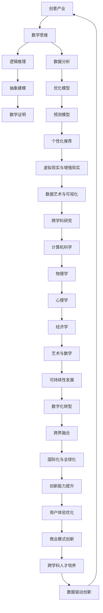

                 


### 文章标题

《数学思维与创意产业发展的关系探讨》

### 关键词

数学思维、创意产业、发展关系、应用案例、战略决策

### 摘要

本文旨在探讨数学思维在创意产业发展中的重要作用，通过分析数学思维的基本概念、原理和应用领域，结合创意产业的特点、发展现状和趋势，阐述数学思维在创意产业各个方面的实际应用。本文旨在为创意产业从业者和研究者提供有益的参考，帮助其更好地理解和利用数学思维推动创意产业的创新发展。

---

### 第一部分：数学思维概述

#### 第1章：数学思维的基本概念

**1.1 数学思维的定义和特点**

数学思维是一种通过数学方法和逻辑推理来解决问题的思维方式。它具有以下几个显著特点：

1. 逻辑性：数学思维强调推理的严密性和逻辑性，注重逻辑推理的正确性和一致性。
2. 抽象性：数学思维能够将具体问题抽象为数学模型，简化复杂问题，揭示内在规律。
3. 系统性：数学思维通过建立数学模型和理论体系，形成对问题的系统认识和解决策略。
4. 创新性：数学思维鼓励创新思维和突破性发现，推动数学理论和应用的不断进步。

**1.2 数学思维的重要性**

数学思维在各个领域都有广泛的应用，尤其在创意产业中具有重要意义：

1. 提高创造力：数学思维有助于培养创新意识和创造力，激发创意产业的原创性和创新性。
2. 解决复杂问题：数学思维能够将复杂问题抽象为数学模型，简化问题求解过程，提高解决问题的效率。
3. 优化决策：数学思维在创意产业战略决策中具有重要应用，通过建立数学模型和优化算法，提供科学合理的决策支持。
4. 推动产业发展：数学思维在创意产业的技术创新、产品设计、营销策略等方面具有重要作用，有助于提升产业整体竞争力。

**1.3 数学思维的应用领域**

数学思维在创意产业中的应用领域广泛，包括但不限于：

1. 设计领域：数学思维在建筑设计、时装设计、工业设计等领域具有重要应用，通过数学模型和算法优化设计效果。
2. 艺术领域：数学思维在艺术创作中发挥重要作用，如音乐、绘画、雕塑等，通过数学规律和形式美学的结合，创作出独特的艺术作品。
3. 娱乐领域：数学思维在游戏设计、动画制作、电影制作等领域广泛应用，通过数学模型和算法实现逼真的虚拟场景和特效。
4. 文化产业：数学思维在文化旅游、文化创意产品开发等领域具有重要应用，通过数据分析和建模，提升文化产业的价值和影响力。

---

**总结：** 数学思维作为创意产业发展的重要推动力，具有独特的逻辑性、抽象性、系统性和创新性。在创意产业的各个领域中，数学思维的应用不仅提升了创意产业的原创性和创新性，还推动了产业整体竞争力的提升。接下来，本文将深入探讨数学思维在创意产业中的应用，为创意产业从业者和研究者提供有益的参考和启示。

#### 第2章：数学思维的基本原理

**2.1 数学逻辑与推理**

数学逻辑与推理是数学思维的核心，它们在解决数学问题、建立数学模型和理论体系中起着至关重要的作用。数学逻辑主要包括命题逻辑、谓词逻辑和命题演算，而推理方法则包括演绎推理和归纳推理。

**命题逻辑：** 命题逻辑是数学逻辑的基础，它研究命题之间的关系和推理规则。命题是一个具有真值的陈述，可以分为真命题和假命题。命题逻辑通过逻辑联结词（如“且”、“或”、“非”）和推理规则（如“合取律”、“析取律”）来构建复杂的命题表达式，并推导出新的命题。

**谓词逻辑：** 谓词逻辑是命题逻辑的扩展，它引入了变量和量词，使得逻辑推理能够处理更复杂的问题。谓词逻辑中的变量代表个体或对象，量词（如全称量词和存在量词）用于描述变量的范围和存在性。谓词逻辑能够处理具有普遍性和存在性的命题，为数学理论和模型的建立提供了强有力的工具。

**演绎推理：** 演绎推理是从一般到特殊的推理过程，它从一些已知的前提出发，通过逻辑规则推导出新的结论。演绎推理是数学证明的基础，它通过一系列的逻辑推导，确保结论的必然性和正确性。常见的演绎推理方法包括三段论、假言推理和选言推理等。

**归纳推理：** 归纳推理是从特殊到一般的推理过程，它通过观察多个具体实例，总结出一般规律或原则。归纳推理是科学发现的重要方法，它通过收集大量数据，归纳出潜在的规律，为科学理论的建立提供基础。归纳推理包括完全归纳推理和不完全归纳推理。

**2.2 数学抽象与模型建立**

数学抽象是将具体问题抽象为数学模型的过程，它是数学思维的核心步骤。数学抽象的关键在于识别问题的本质属性，并用数学语言和符号来描述。数学模型是数学抽象的产物，它通过数学关系和方程来描述问题的状态、行为和规律。

**数学模型的建立：** 建立数学模型通常包括以下几个步骤：

1. 确定问题：明确要解决的问题和研究目标，理解问题的背景和需求。
2. 确定变量：识别问题中的关键变量和参数，确定它们的范围和限制。
3. 建立关系：根据问题的性质和需求，建立变量之间的关系，通常使用数学方程、函数或图来表示。
4. 简化和假设：为了简化问题，可以引入一定的假设，如线性化、稳定性、概率分布等。
5. 求解模型：根据建立的数学模型，使用适当的数学方法求解问题，得到最优解或近似解。

**数学模型的应用：** 数学模型在创意产业中的应用广泛，如建筑设计、时装设计、工业设计等领域。通过建立数学模型，可以优化设计过程，提高设计质量和效率。

**2.3 数学证明与定理**

数学证明是数学思维的重要环节，它是验证数学结论和定理正确性的过程。数学证明通过逻辑推理和数学运算，从已知事实和公理出发，推导出新的结论。

**证明方法：** 常见的证明方法包括直接证明、反证法、归纳法等。

1. **直接证明：** 直接证明是通过逻辑推导直接证明结论成立的方法。它通常从已知事实和定理出发，通过一系列的逻辑推理和运算，推导出所需结论。

2. **反证法：** 反证法是一种间接证明方法，它通过假设结论不成立，然后推导出矛盾，从而证明结论成立。反证法的步骤包括：假设结论不成立、推导出矛盾、得出结论成立。

3. **归纳法：** 归纳法是一种通过具体实例归纳出一般规律的证明方法。它通过验证多个具体实例的正确性，归纳出一般规律或定理。

**定理的证明：** 定理是数学中重要的结论和命题，它们通过数学证明得到验证。定理的证明通常需要严谨的逻辑推理和数学运算，确保结论的正确性和普遍性。

**2.4 数学思维的核心技巧**

数学思维的核心技巧包括问题分析与解决方案、数学工具与技巧应用和数学思维的培养与提升。

**问题分析与解决方案：** 数学思维强调对问题的深入分析和理解，通过将问题抽象为数学模型，寻找合适的解决方案。在问题分析过程中，需要识别问题的关键变量和关系，明确目标和解题方向。

**数学工具与技巧应用：** 数学思维应用了许多数学工具和技巧，如代数、几何、微积分等。掌握这些工具和技巧，可以更有效地解决数学问题和建立数学模型。

**数学思维的培养与提升：** 数学思维的培养与提升是一个长期的过程，需要不断地学习和实践。以下是一些建议：

1. **基础知识的掌握：** 建立扎实的数学基础，掌握基本的数学概念、原理和算法。
2. **实践与应用：** 通过解决实际问题，将数学知识应用到实际场景中，提高数学思维的应用能力。
3. **阅读与研究：** 阅读数学论文和研究报告，了解数学领域的最新发展和研究方向，拓展数学思维。
4. **交流与讨论：** 与他人交流数学问题和解决方案，通过讨论和合作，提高数学思维的水平。

**总结：** 数学思维的基本原理包括数学逻辑与推理、数学抽象与模型建立、数学证明与定理以及数学思维的核心技巧。这些原理和技巧在创意产业中的应用，有助于提升创意产业的创新性和竞争力，推动创意产业的持续发展。

#### 第3章：数学思维的核心技巧

**3.1 问题分析与解决方案**

在创意产业中，数学思维的核心技巧之一是问题分析与解决方案。这一过程涉及到对问题的深入理解和系统化，以便能够找到有效的解决方案。以下是问题分析与解决方案的步骤：

**1. 确定问题：** 首先，明确要解决的问题是什么。这包括识别问题的本质、目标和背景。

**2. 收集信息：** 接下来，收集与问题相关的所有信息。这些信息可以来自于各种来源，如市场调研、用户反馈、历史数据等。

**3. 分析问题：** 在收集到足够的信息后，对问题进行深入分析。分析包括识别问题的关键因素、变量和关系，以及可能的解决方案。

**4. 建立数学模型：** 根据分析结果，建立能够描述问题的数学模型。数学模型应该能够准确反映问题的特征和关系。

**5. 选择合适的方法：** 根据数学模型，选择合适的数学方法或算法来解决具体问题。这可以包括线性规划、优化算法、概率模型等。

**6. 求解模型：** 使用选定的方法求解数学模型，得到问题的解。这可能需要使用计算机软件或编程工具。

**7. 验证结果：** 对求解结果进行验证，确保其正确性和有效性。这可能涉及到对模型参数的调整或对求解过程的优化。

**案例分析：** 假设我们要解决一个设计公司如何优化产品生产过程的问题。首先，我们需要明确要解决的问题：如何在保证产品质量的前提下，最大限度地提高生产效率。接着，我们收集关于生产过程的信息，包括原材料成本、生产时间、设备利用率等。然后，我们分析这些信息，识别出影响生产效率的关键因素，并建立数学模型来描述生产过程。在这个模型中，我们可能会使用线性规划来优化生产计划，确保每个步骤的资源分配最合理。最后，我们使用计算机软件求解模型，得到最优的生产计划，并对结果进行验证和调整。

**3.2 数学工具与技巧应用**

数学工具和技巧在创意产业中有着广泛的应用，以下是一些常用的数学工具和技巧：

**1. 线性代数：** 线性代数是处理向量空间和线性方程组的重要工具。在创意产业中，线性代数可以用于图像处理、音频处理和计算机图形学等领域。例如，在图像处理中，线性代数可以帮助实现图像的变换和滤波。

**2. 微积分：** 微积分研究函数的极限、导数、积分等概念。微积分在创意产业中的应用包括动画制作、物理模拟和视频游戏等。例如，在动画制作中，微积分可以帮助实现平滑的运动轨迹和物理现象的模拟。

**3. 概率论：** 概率论研究随机事件和概率分布。在创意产业中，概率论可以用于风险评估、数据分析和用户行为预测等。例如，在游戏设计中，概率论可以帮助实现游戏的难度和概率分布，提高用户体验。

**4. 数理统计：** 数理统计研究数据的收集、分析和解释。在创意产业中，数理统计可以用于市场调研、用户行为分析和产品评估等。例如，通过数据分析，创意产业公司可以更好地了解用户需求和市场趋势，从而优化产品设计和服务。

**5. 优化算法：** 优化算法用于求解最优化问题，如线性规划、非线性规划和整数规划。在创意产业中，优化算法可以用于资源分配、供应链管理和产品设计等。例如，通过优化算法，创意产业公司可以找到最优的生产计划或营销策略。

**数学模型和公式：** 在创意产业中，数学模型和公式被广泛应用于各个领域。以下是一些具体的数学模型和公式及其应用：

- **牛顿-拉夫逊迭代法：** 用于求解非线性方程的根。在创意产业中，牛顿-拉夫逊迭代法可以用于图像处理、音频处理和计算机图形学等领域。
- **傅里叶变换：** 用于图像和音频信号的频域分析。在创意产业中，傅里叶变换可以用于图像压缩、图像去噪和音频处理等。
- **马尔可夫模型：** 用于预测随机事件序列的概率分布。在创意产业中，马尔可夫模型可以用于用户行为预测、推荐系统和风险评估等。

**举例说明：** 假设我们要设计一个在线购物平台的推荐系统，以增加用户满意度和销售额。我们可以使用马尔可夫模型来预测用户的行为序列，例如“浏览商品”、“添加购物车”和“购买商品”。通过分析用户行为数据，我们可以确定用户从浏览到购买的转换概率，从而优化推荐策略。例如，如果用户从浏览到购买的转换概率较低，我们可以通过增加购物车的提示或优惠券激励来提高转换率。

**3.3 数学思维的培养与提升**

数学思维的培养与提升是一个长期的过程，需要不断地学习和实践。以下是一些方法：

**1. 学习数学基础知识：** 建立扎实的数学基础是培养数学思维的关键。学习数学基础知识包括代数、几何、微积分、概率论和数理统计等。

**2. 解决实际问题：** 通过解决实际问题来应用数学知识，提高数学思维的应用能力。这可以是学校作业、项目或个人研究。

**3. 阅读数学文献：** 阅读数学领域的经典著作和最新研究论文，了解数学理论的最新进展和应用。

**4. 参与数学竞赛：** 参加数学竞赛可以锻炼数学思维和解决问题的能力，同时与同行交流和学习。

**5. 讨论与交流：** 与他人讨论数学问题和解决方案，通过合作和交流，提升数学思维的水平。

**总结：** 数学思维的核心技巧包括问题分析与解决方案、数学工具与技巧应用和数学思维的培养与提升。这些技巧在创意产业中有着广泛的应用，有助于提升创意产业的创新性和竞争力。通过不断地学习和实践，我们可以更好地培养和提升数学思维，为创意产业的创新发展做出贡献。

### 第二部分：创意产业及其发展

#### 第4章：创意产业的概念与特点

**4.1 创意产业的定义**

创意产业，又称创意经济，是指以创意为核心，通过创造性思维和技能，将创意转化为实际产品和服务，实现价值创造的产业。创意产业涵盖了多个领域，包括设计、媒体、娱乐、文化、艺术等。创意产业不同于传统产业，其主要特点是创新性和文化性。

创意产业具有以下特点：

1. **创新性：** 创意产业强调创新思维和创造力，通过不断推陈出新，满足消费者对新鲜、独特体验的需求。
2. **文化性：** 创意产业涉及文化元素，将文化内涵融入到产品和服务中，提升产品的附加值。
3. **多样性：** 创意产业包含多个子领域，如设计、媒体、娱乐、文化、艺术等，具有广泛的多样性。
4. **高附加值：** 创意产业通过创意和技术的结合，实现产品的差异化，提高产品的附加值，从而创造更高的经济效益。

**4.2 创意产业的特点**

创意产业的特点可以从以下几个方面进行阐述：

1. **创新驱动：** 创意产业的核心是创新，包括技术创新、设计创新和商业模式创新等。创新是创意产业持续发展的动力。
2. **知识密集：** 创意产业依赖于知识和智力资源，如创意人才、技术人才和市场需求分析等。知识密集性是创意产业的重要特点。
3. **跨界融合：** 创意产业与其他产业（如科技、文化、艺术等）相互融合，形成跨界产业，如文化创意产业、科技创意产业等。
4. **市场需求驱动：** 创意产业的产品和服务以市场需求为导向，消费者需求的变化直接影响创意产业的发展方向和产品内容。
5. **高附加值：** 创意产业通过创意和技术的结合，实现产品的差异化，提升产品的附加值，创造更高的经济效益。

**4.3 创意产业的分类**

创意产业可以按照不同的分类标准进行分类，常见的分类方法包括：

1. **按领域分类：** 创意产业可以分为设计产业、媒体产业、娱乐产业、文化产业、艺术产业等。每个领域都有其独特的创意元素和市场需求。
2. **按功能分类：** 创意产业可以分为上游产业、中游产业和下游产业。上游产业主要包括创意构思、设计、研发等；中游产业主要包括制作、生产、传播等；下游产业主要包括销售、推广、服务等。
3. **按区域分类：** 创意产业可以分为城市创意产业和乡村创意产业。城市创意产业主要集中在经济发达、文化资源丰富的城市；乡村创意产业则依托乡村独特的自然资源和文化传统，发展创意产业。

**总结：** 创意产业是一种以创新和文化为核心，通过创造性思维和技能，将创意转化为实际产品和服务，实现价值创造的产业。创意产业具有创新驱动、知识密集、跨界融合、市场需求驱动和高附加值等特点。通过对创意产业进行分类，可以更好地理解和分析创意产业的发展现状和趋势，为创意产业的创新发展提供指导。

#### 第5章：创意产业的发展现状与趋势

**5.1 创意产业的发展现状**

创意产业在全球范围内呈现出迅猛发展的态势。根据联合国教科文组织的报告，全球创意产业市场规模已达到数万亿美元，成为全球经济的重要驱动力。以下是创意产业发展的几个主要现状：

1. **产业规模不断扩大：** 随着全球经济的不断发展和消费者需求的多样化，创意产业的市场规模持续扩大。特别是在一些创意产业发达的国家和地区，如美国、英国、日本等，创意产业已经成为国民经济的重要支柱。

2. **技术驱动创新：** 科技的快速发展为创意产业提供了新的创新动力。人工智能、大数据、虚拟现实、增强现实等新兴技术的应用，不仅改变了创意产业的生产方式，也带来了新的商业模式和产品形态。

3. **跨界融合趋势明显：** 创意产业与其他行业的深度融合，形成了新的跨界产业，如文化创意产业、科技创意产业等。这些跨界产业的崛起，推动了创意产业的创新发展。

4. **市场需求驱动：** 随着消费者对个性化、高质量产品和服务的需求不断增加，创意产业的产品和服务越来越注重满足消费者的多样化需求。

**5.2 创意产业的主要挑战**

尽管创意产业呈现出良好的发展态势，但在发展过程中也面临着一系列挑战：

1. **知识产权保护问题：** 创意产业的核心是创意和知识产权，但知识产权的保护依然是一个全球性的难题。版权侵权、商标侵权等问题严重影响了创意产业的健康发展。

2. **技术风险：** 新兴技术的应用在为创意产业带来发展机遇的同时，也伴随着一定的技术风险。如网络安全、数据隐私等问题，需要得到有效解决。

3. **人才培养和储备：** 创意产业对人才的需求量巨大，但人才培养和储备不足，成为制约创意产业发展的重要因素。特别是在一些发展中国家，创意产业人才匮乏，需要加强人才培养和引进。

4. **政策支持不足：** 创意产业发展需要政策支持，如税收优惠、资金扶持等。但一些国家和地区的政策支持力度不够，影响了创意产业的发展。

**5.3 创意产业的发展趋势**

未来，创意产业将继续保持快速发展，并在以下几个方面呈现发展趋势：

1. **数字化转型：** 随着数字技术的普及，创意产业将加快数字化转型，实现生产方式、商业模式和产品形态的创新。

2. **跨界融合：** 创意产业将继续与其他行业深度融合，形成新的跨界产业。如文化创意产业、科技创意产业、智能制造等，这些跨界产业的崛起将推动创意产业的创新发展。

3. **全球化发展：** 随着全球化的深入，创意产业将更加国际化，跨国合作和交流将越来越频繁。创意产业的全球化发展将带来新的市场机遇。

4. **可持续性发展：** 可持续发展成为未来创意产业发展的重要方向。创意产业将在环保、社会责任等方面发挥重要作用，推动产业可持续发展。

5. **人工智能应用：** 人工智能在创意产业中的应用将越来越广泛，如人工智能设计、人工智能创作等。人工智能的应用将提升创意产业的效率和质量。

**总结：** 创意产业在发展过程中面临一系列挑战，但整体发展趋势向好。通过数字化转型、跨界融合、全球化发展、可持续性发展和人工智能应用，创意产业将继续保持快速发展，为全球经济和社会发展做出更大贡献。

#### 第6章：创意产业的政策与支持

**6.1 创意产业政策概述**

创意产业作为国家战略新兴产业，受到了各国政府的高度重视。各国政府纷纷出台了一系列政策，以促进创意产业的发展。以下是创意产业政策的主要内容和特点：

1. **政府支持：** 各国政府通过财政支持、税收优惠、资金扶持等方式，为创意产业提供政策支持。如美国的“艺术与娱乐税收减免政策”，英国的“创意产业专项资金”。

2. **知识产权保护：** 创意产业的核心是知识产权，各国政府高度重视知识产权保护，出台了一系列法律法规，以保护创意产业的合法权益。

3. **人才培养和引进：** 各国政府通过教育政策、人才引进政策，培养和引进创意产业人才。如日本的“创意人才计划”，中国的“千人计划”。

4. **产业规划和布局：** 各国政府制定创意产业发展规划，明确产业发展目标和重点领域，引导产业布局。如美国的“创意经济战略规划”，中国的“文化创意产业规划”。

**6.2 创意产业支持政策**

创意产业支持政策主要包括以下几个方面：

1. **财政支持：** 政府通过财政拨款、专项资金等形式，支持创意产业的发展。如英国的“创意产业专项资金”，用于支持创意项目的研发、推广和产业化。

2. **税收优惠：** 政府通过税收减免、税收优惠等措施，降低创意产业的企业负担，鼓励企业发展。如美国的“艺术与娱乐税收减免政策”，对从事艺术和娱乐行业的创意企业给予税收优惠。

3. **资金扶持：** 政府通过设立文化创意产业基金，支持创意产业的发展。如中国的“文化创意产业投资基金”，用于支持创意项目的投资和发展。

4. **知识产权保护：** 政府加强知识产权保护，打击侵权行为，维护创意产业的合法权益。如日本的“知识产权战略计划”，加强对创意产业知识产权的保护。

5. **人才培养和引进：** 政府通过教育政策、人才引进政策，培养和引进创意产业人才。如美国的“创意人才计划”，通过提供奖学金、实习机会等方式，吸引全球创意人才。

**6.3 创意产业政策效果评估**

创意产业政策效果评估是衡量政策效果的重要环节，主要包括以下几个方面：

1. **政策目标实现程度：** 评估政策是否实现了预期目标，如促进创意产业发展、提高创意产业附加值等。

2. **政策实施效果：** 评估政策实施过程中存在的问题，如资金使用效率、政策执行力度等。

3. **产业发展现状：** 分析创意产业的发展现状，如产业规模、企业数量、创新能力等。

4. **政策成本效益分析：** 分析政策实施的成本和效益，如财政负担、企业负担等。

**案例分析：** 以中国的“文化创意产业政策”为例，该政策通过财政支持、税收优惠、资金扶持等措施，推动文化创意产业的发展。根据统计，自政策实施以来，中国文化创意产业规模持续扩大，企业数量不断增加，创新能力显著提升。但同时，政策实施中也存在一些问题，如资金使用效率不高、政策执行力度不够等。

**总结：** 创意产业政策在促进创意产业发展、提高创意产业附加值等方面发挥了重要作用。通过对政策效果的评估，可以发现问题，提出改进措施，进一步优化创意产业政策，推动创意产业的可持续发展。

### 第三部分：数学思维在创意产业中的应用

#### 第7章：数学思维在创意设计中的应用

**7.1 数学模型在创意设计中的应用**

数学模型在创意设计中扮演着至关重要的角色，它通过将创意设计的元素抽象为数学形式，为设计师提供了有力的工具，以优化设计过程、提高设计质量和创新性。以下是数学模型在创意设计中的应用：

**1. 基本几何形状的优化：** 在建筑设计、时尚设计和工业设计中，基本几何形状的优化是常见需求。通过数学模型，设计师可以分析不同形状的面积、体积、表面积等特性，找到最优的几何形状。例如，在建筑设计中，通过优化建筑的结构设计，可以减少材料使用，提高建筑稳定性。

**2. 曲线和曲面的设计：** 在汽车设计、飞机设计和珠宝设计中，曲线和曲面的美感至关重要。数学模型中的贝塞尔曲线和贝塞尔曲面可以精确地描述这些曲线和曲面，帮助设计师实现流畅、美观的设计。

**3. 光影效果模拟：** 在电影制作和动画设计中，光影效果是营造氛围和表现情感的重要手段。通过数学模型，如光线追踪和辐射传输模型，设计师可以精确地模拟光影效果，创造出逼真的视觉效果。

**4. 优化设计布局：** 在室内设计和城市规划中，设计布局的优化是提高空间利用率和用户体验的关键。通过数学模型，如线性规划和多目标优化，设计师可以找到最优的布局方案，使空间分配更加合理。

**7.2 数学思维在创意设计的创新应用**

数学思维不仅在设计过程中发挥了重要作用，还在创意设计的创新应用中展现出强大的潜力。以下是一些创新应用实例：

**1. 数字艺术：** 数字艺术是数学思维在创意设计中的重要应用领域。通过数学算法和编程，艺术家可以创造出独特的视觉艺术作品。例如，分形艺术利用数学中的迭代函数，创造出复杂且美妙的图形。

**2. 可持续设计：** 数学思维在可持续设计中的应用日益增多。通过优化设计，降低能耗和资源消耗，实现环保目标。例如，在建筑设计中，通过数学模型优化建筑布局和能源系统，实现节能减排。

**3. 设计算法生成：** 利用数学算法生成设计，是一种创新的设计方法。通过算法，设计师可以快速生成大量设计选项，从中筛选出最优方案。这种方法在时尚设计和工业设计中具有广泛应用。

**案例分析：**

**案例一：建筑设计中的数学应用**

在设计北京国家大剧院时，建筑师李兆基通过数学模型优化了建筑的结构和形状。他运用了贝塞尔曲线和贝塞尔曲面，设计出了独特的圆形建筑结构。通过数学模型的分析，他找到了最优的材料使用方案，使建筑既具有美观性，又具有结构稳定性。

**案例二：分形艺术**

分形艺术是数学思维在创意设计中的经典应用。艺术家米罗·罗萨利用迭代函数生成分形图形，创造出复杂而美妙的视觉作品。他的作品《凯尔宾》通过数学模型的迭代生成，展现出丰富的细节和层次感，被誉为现代艺术的杰作。

**总结：** 数学模型和数学思维在创意设计中的应用，为设计师提供了强大的工具和思维方式。通过数学模型，设计师可以优化设计过程、提高设计质量，实现创新设计。同时，数学思维在数字艺术、可持续设计等领域也展示了其独特的应用价值。数学思维与创意设计的结合，为创意产业的发展注入了新的活力和动力。

#### 第8章：数学思维在创意产业中的战略决策

**8.1 数学模型在战略决策中的应用**

数学模型在创意产业中的战略决策中扮演着至关重要的角色，它为决策者提供了基于数据和逻辑分析的决策支持。以下是数学模型在创意产业战略决策中的应用：

**1. 市场需求预测：** 通过数学模型，如时间序列分析、回归分析和多元统计模型，创意产业公司可以预测市场需求的变化趋势，从而制定合适的营销策略和产品开发计划。例如，通过分析历史销售数据和用户行为数据，可以预测未来某一时间段内的市场需求，帮助公司提前布局。

**2. 资源优化配置：** 数学模型可以帮助创意产业公司优化资源配置，提高资源利用效率。例如，在影视制作中，通过线性规划和整数规划，可以找到最优的人员安排、设备使用和资金分配方案，从而降低成本，提高生产效率。

**3. 风险评估与应对：** 创意产业面临的风险多样，如市场风险、技术风险、法律风险等。通过数学模型，如概率论和统计模型，可以评估风险的概率和影响，制定相应的风险应对策略。例如，在游戏开发中，通过风险评估模型，可以预测游戏上线后的市场反响和用户流失率，提前制定应对措施。

**4. 竞争对手分析：** 数学模型可以帮助创意产业公司分析竞争对手的战略和市场定位，从而制定有针对性的竞争策略。例如，通过回归分析和聚类分析，可以识别竞争对手的市场份额、定价策略和产品特征，帮助公司制定更具竞争力的市场策略。

**8.2 数学思维在创意产业战略决策中的应用**

数学思维在创意产业战略决策中的应用主要体现在以下几个方面：

**1. 数据驱动决策：** 数学思维强调以数据为基础，通过数据分析来支持决策。创意产业公司可以通过收集和分析市场数据、用户行为数据、财务数据等，利用数学模型进行预测和优化，从而做出更加科学和准确的决策。

**2. 系统思维：** 数学思维强调系统性和整体性，通过分析系统内部各要素之间的关系和相互作用，制定综合性的战略决策。在创意产业中，系统思维可以帮助企业从全局出发，考虑各个环节的协同效应，实现整体价值的最大化。

**3. 创新思维：** 数学思维鼓励创新思维，通过探索新的数学模型和方法，解决传统方法难以解决的问题。在创意产业中，创新思维可以帮助企业开发新产品、开拓新市场，实现业务的持续增长。

**4. 模拟与实验：** 数学思维支持模拟与实验，通过建立数学模型和仿真环境，对战略决策进行模拟和测试，评估决策的可行性和效果。在创意产业中，模拟与实验可以帮助企业在实际实施前预测可能的结果，降低决策风险。

**案例分析：**

**案例一：电影产业的预算分配决策**

某电影公司计划制作一部新电影，需要制定预算分配方案。通过数学模型，如线性规划和多目标优化，公司可以分析不同预算分配方案对电影制作成本、宣传成本和票房收益的影响。通过模拟不同预算分配方案，公司可以找到最优的预算分配方案，确保电影的制作质量和市场竞争力。

**案例二：游戏公司的用户留存策略**

某游戏公司希望提高用户的留存率，通过数学模型，如回归分析和聚类分析，公司可以分析用户行为数据，识别影响用户留存的关键因素，如游戏难度、更新频率、社交互动等。通过优化这些因素，公司可以制定有效的用户留存策略，提高用户满意度和留存率。

**总结：** 数学思维在创意产业战略决策中的应用，通过数学模型和数据分析，为决策者提供了科学的决策支持，提高了决策的准确性和效率。同时，数学思维的创新思维和系统思维，为创意产业的战略决策提供了新的视角和方法。通过不断探索和应用数学思维，创意产业公司可以更好地应对市场变化，实现持续发展。

#### 第9章：数学思维在创意产业管理中的应用

**9.1 数学工具在创意产业管理中的应用**

数学工具在创意产业管理中的应用广泛且深入，通过数据分析和优化模型，帮助管理者做出更明智的决策，提高运营效率和产品质量。以下是一些常用的数学工具及其在创意产业管理中的应用：

**1. 数据分析工具：** 数据分析是创意产业管理的关键环节。通过数据分析工具，如回归分析、时间序列分析和聚类分析，创意产业公司可以对市场趋势、用户行为和运营数据进行分析，识别关键影响因素，为决策提供数据支持。例如，通过回归分析，公司可以预测市场需求的变化趋势，从而调整生产和库存策略。

**2. 优化模型：** 优化模型是解决创意产业中资源配置和调度问题的关键工具。线性规划、整数规划、动态规划和多目标优化等模型可以帮助创意产业公司优化生产计划、人力资源配置和物流调度。例如，通过线性规划，公司可以找到最优的生产计划，确保资源的最大化利用。

**3. 预测模型：** 预测模型在创意产业管理中用于预测市场趋势、用户需求和销售量。通过时间序列分析和机器学习算法，公司可以建立预测模型，预测未来的市场状况，从而制定相应的营销策略和库存管理计划。例如，通过时间序列分析，公司可以预测某款产品的销售量，以便提前准备库存。

**4. 质量控制工具：** 质量控制是创意产业管理的重要组成部分。统计质量控制工具，如控制图、过程能力和方差分析，可以帮助公司监控产品质量，识别和解决质量问题。例如，通过控制图，公司可以实时监控生产过程中的质量变化，及时发现和解决异常情况。

**案例分析：**

**案例一：影视公司的预算分配与优化**

某影视公司需要制定年度预算分配计划，以合理分配资金用于制作、宣传和市场推广。通过线性规划模型，公司可以分析不同预算分配方案对制作成本、宣传成本和票房收益的影响。通过模拟不同预算分配方案，公司可以找到最优的预算分配方案，确保资金的最大化利用和项目的成功实施。

**案例二：游戏公司的用户留存分析**

某游戏公司希望通过数据分析提高用户的留存率，通过回归分析和聚类分析，公司可以分析用户行为数据，识别影响用户留存的关键因素，如游戏难度、更新频率和社交互动。通过优化这些因素，公司可以制定有效的用户留存策略，提高用户满意度和留存率。

**案例三：艺术展览的物流调度与优化**

某艺术展览公司需要合理安排展览物品的运输和布展工作。通过整数规划模型，公司可以优化物流调度，确保展览物品按时到达并合理布置。通过动态规划模型，公司可以优化布展工作流程，提高布展效率，确保展览的顺利进行。

**总结：** 数学工具在创意产业管理中的应用，通过数据分析、优化模型和预测模型，帮助管理者做出更科学、更准确的决策，提高运营效率和产品质量。通过不断探索和应用数学工具，创意产业公司可以更好地应对市场变化，实现可持续发展。

### 第四部分：数学思维与创意产业的未来

#### 第10章：数学思维与创意产业的未来发展

**10.1 数学思维在创意产业中的潜在应用**

随着科技的不断进步和创意产业的不断发展，数学思维在创意产业中的应用前景十分广阔。以下是数学思维在创意产业中潜在的几个应用方向：

**1. 人工智能与机器学习：** 人工智能和机器学习是数学思维的典型应用领域，通过算法和模型，可以自动化地处理大量数据，进行预测和决策。在创意产业中，人工智能和机器学习可以用于图像识别、音频处理、视频分析等，从而提高生产效率、创造更丰富的创意内容。

**2. 虚拟现实与增强现实：** 虚拟现实（VR）和增强现实（AR）技术的快速发展，为创意产业提供了新的表达方式和体验。数学思维可以在场景建模、实时渲染、交互设计等方面发挥作用，提高虚拟现实和增强现实体验的质量。

**3. 可视化与数据艺术：** 数学思维在数据可视化领域有着广泛的应用，通过数学模型和算法，可以将复杂的数据转化为直观的视觉形式，为创意产业提供有力的表达工具。数据艺术则利用数学规律和美学原则，创造出独特的艺术作品。

**4. 个性化定制与推荐系统：** 个性化定制和推荐系统在创意产业中具有重要应用，通过数学模型分析用户行为和偏好，可以为用户提供个性化的产品和服务。例如，在音乐、影视、时尚等领域，个性化推荐系统能够提高用户体验，增加用户粘性和销售额。

**10.2 创意产业未来的发展趋势**

创意产业未来的发展将受到多种因素的影响，包括科技进步、市场需求变化和政策支持等。以下是创意产业未来发展的几个趋势：

**1. 数字化转型：** 随着数字化技术的不断进步，创意产业将加速数字化转型。通过数字化工具和平台，创意产业可以实现生产方式的创新、产品形态的创新和商业模式创新。

**2. 跨界融合：** 创意产业将与其他产业（如科技、文化、艺术等）深度融合，形成新的跨界产业。这些跨界产业将带来新的商业模式和经济增长点。

**3. 可持续发展：** 随着环保意识的增强，创意产业将更加注重可持续发展。通过绿色设计、环保材料和技术，创意产业将努力减少对环境的影响，实现经济、社会和环境的协调发展。

**4. 个性化与定制化：** 随着消费者需求的多样化，创意产业将更加注重个性化与定制化。通过大数据分析和人工智能技术，创意产业可以更好地满足消费者的个性化需求，提供定制化的产品和服务。

**5. 国际化与全球化：** 随着全球化的深入，创意产业将更加国际化。创意产业公司将通过国际合作和全球布局，拓展市场空间，实现全球化发展。

**10.3 数学思维与创意产业融合的未来展望**

数学思维与创意产业的融合将为创意产业带来前所未有的发展机遇。以下是数学思维与创意产业融合的未来展望：

**1. 创新能力的提升：** 数学思维将激发创意产业的创新能力，通过数学模型和算法，创意产业可以开发出更多新颖、独特的创意产品和服务。

**2. 生产效率的提高：** 数学思维可以帮助创意产业优化生产流程和资源配置，提高生产效率，降低成本。

**3. 用户体验的优化：** 通过数学思维，创意产业可以更好地理解用户需求，提供个性化的用户体验，增强用户满意度。

**4. 商业模式的创新：** 数学思维将为创意产业带来新的商业模式，如数据驱动商业模式、平台化商业模式等，推动创意产业的持续发展。

**总结：** 数学思维在创意产业中的应用前景广阔，通过数字化转型、跨界融合、可持续发展、个性化与定制化以及国际化与全球化，数学思维与创意产业的融合将推动创意产业的创新发展，为未来带来更多机遇和挑战。

#### 第11章：数学思维与创意产业的教育与培养

**11.1 数学思维在创意产业教育中的重要性**

数学思维在创意产业教育中具有重要地位，它不仅有助于培养学生解决实际问题的能力，还能激发学生的创造力和创新精神。以下是数学思维在创意产业教育中的几个重要性方面：

**1. 培养逻辑思维：** 数学思维强调逻辑性和严密性，通过数学推理和证明，学生可以培养出清晰、合理的逻辑思维能力。这对于创意产业中的问题解决和决策制定至关重要。

**2. 培养抽象能力：** 数学思维能够将复杂的问题抽象为数学模型，简化问题，揭示内在规律。这种抽象能力在创意产业中的设计、建模和优化过程中具有重要作用。

**3. 培养创新能力：** 数学思维鼓励创新思维和探索精神，通过解决数学问题和建立数学模型，学生可以培养出独立思考和解决问题的能力，激发创造力。

**4. 培养数据分析能力：** 在创意产业中，数据分析和决策支持是关键环节。数学思维可以培养学生的数据分析能力，帮助他们更好地理解和应用数据，为创意产业的发展提供有力支持。

**11.2 创意产业教育中数学思维的培养方法**

为了在创意产业教育中有效地培养数学思维，需要采取一系列科学、系统的教学方法。以下是几种有效的培养方法：

**1. 项目驱动教学：** 通过设计真实的项目任务，让学生在解决实际问题的过程中培养数学思维。这种方法可以激发学生的学习兴趣，提高他们的实践能力和创新能力。

**2. 问题导向教学：** 以问题为导向，引导学生主动思考、探究和解决问题。通过提出开放性问题，鼓励学生运用数学思维和方法，寻找解决方案。

**3. 合作学习：** 通过小组合作学习，促进学生之间的交流和合作，共同解决问题。这种方法可以培养学生的团队合作精神，提高他们的沟通能力和协作能力。

**4. 案例分析：** 通过分析经典案例，让学生了解数学思维在创意产业中的应用，理解数学思维的实际价值。案例分析可以帮助学生将理论知识与实际应用相结合，提高他们的实际操作能力。

**11.3 创意产业教育中数学思维的案例分析**

以下是一些具体的案例，展示了数学思维在创意产业教育中的应用：

**案例一：建筑设计课程**

在某建筑设计课程中，教师通过设计一个实际建筑项目，引导学生运用数学思维进行方案设计和优化。学生需要通过数学模型分析建筑的结构稳定性、材料使用和能耗，从而找到最优的设计方案。

**案例二：游戏设计课程**

在某游戏设计课程中，教师通过设计一个游戏项目，引导学生运用数学思维进行游戏设计和优化。学生需要通过数学模型分析游戏中的随机事件、概率分布和用户行为，从而提高游戏的可玩性和用户体验。

**案例三：时尚设计课程**

在某时尚设计课程中，教师通过设计一个服装设计项目，引导学生运用数学思维进行设计分析和优化。学生需要通过数学模型分析服装的剪裁、比例和颜色搭配，从而设计出时尚、独特的服装款式。

**总结：** 数学思维在创意产业教育中具有重要地位，通过科学、系统的教学方法，可以有效地培养学生的数学思维，提高他们的创造力和创新能力。在创意产业教育中，教师应注重培养学生的逻辑思维、抽象能力、创新能力和数据分析能力，使他们能够在未来的职业发展中发挥数学思维的重要作用。

#### 第12章：数学思维与创意产业的跨学科研究

**12.1 数学思维与其他学科的交叉研究**

数学思维在与其他学科的交叉研究中展现了巨大的潜力，这种跨学科研究不仅丰富了数学的应用领域，也为相关学科的创新提供了新的动力。以下是数学思维与其他学科交叉研究的几个重要方向：

**1. 计算机科学与数学：** 计算机科学的发展离不开数学的支持，特别是在算法设计、密码学和计算机图形学等领域。数学思维在算法优化、数据结构和计算机网络安全中发挥着关键作用。例如，图论在社交网络分析和复杂系统建模中有着广泛应用，密码学中的数论和代数结构为网络安全提供了理论基础。

**2. 物理学与数学：** 物理学中的许多理论模型和现象都可以用数学语言来描述，数学思维在物理学中发挥着核心作用。例如，微积分在描述物理系统的动态变化、波动方程在描述电磁场和量子力学中的应用等方面都至关重要。

**3. 心理学与数学：** 心理学研究人类行为和认知，数学思维在心理测量、统计分析和决策理论等领域有着广泛应用。通过数学模型，心理学家可以更准确地描述认知过程，预测人类行为，为教育、医疗等领域提供决策支持。

**4. 经济学与数学：** 数学在经济学的多个领域有着广泛应用，如优化理论、博弈论和金融数学。数学思维帮助经济学家建立复杂的模型，分析市场行为，预测经济趋势，为政策制定和投资决策提供依据。

**5. 艺术与数学：** 数学思维在艺术创作中也发挥着重要作用，特别是在视觉艺术和音乐中。分形几何、黄金比例和代数结构在艺术作品中得到了广泛应用，数学思维为艺术家提供了新的表达方式和灵感来源。

**12.2 跨学科研究在创意产业中的应用**

跨学科研究在创意产业中的应用日益广泛，通过结合数学思维与其他学科的理论和方法，创意产业可以开发出更多创新的产品和服务。以下是跨学科研究在创意产业中的几个应用实例：

**1. 虚拟现实与增强现实：** 虚拟现实和增强现实技术结合了计算机科学、图形学、人机交互和数学等多个领域的知识。数学思维在场景建模、实时渲染、交互设计等方面发挥着关键作用，为用户提供沉浸式体验。

**2. 数据艺术与可视化：** 数据艺术和可视化是创意产业中的重要领域，数学思维在数据处理、可视化算法和数据分析中有着广泛应用。通过数学模型和算法，创意产业可以创造出独特的数据艺术作品，提升数据呈现的效果。

**3. 个性化推荐系统：** 个性化推荐系统结合了计算机科学、统计学和经济学等多个领域的知识。数学思维在用户行为分析、推荐算法优化和数据分析中发挥着重要作用，为用户提供个性化的产品和服务。

**4. 文化创意产业：** 文化创意产业中的艺术创作、设计创新和文化传播等环节都可以借助数学思维和其他学科的理论。通过跨学科研究，文化创意产业可以开发出更具创意和文化内涵的产品和服务。

**12.3 跨学科研究的未来发展趋势**

随着科技的不断进步和学科交叉的深化，跨学科研究在创意产业中的应用前景十分广阔。以下是跨学科研究在创意产业中的未来发展趋势：

**1. 数据驱动的创新：** 随着大数据和人工智能技术的发展，数据驱动将成为创意产业创新的重要方向。通过跨学科研究，创意产业可以更准确地理解用户需求，开发出更符合市场趋势的创新产品。

**2. 可持续发展：** 随着环保意识的增强，可持续发展将成为创意产业的重要议题。通过跨学科研究，创意产业可以开发出环保、节能的创意产品和设计理念。

**3. 跨界融合：** 创意产业将与其他产业（如科技、文化、艺术等）深度融合，形成新的跨界产业。跨学科研究将为跨界产业的发展提供新的动力和方向。

**4. 跨学科人才培养：** 跨学科研究需要具备多学科知识和技能的人才。未来，创意产业将更加注重跨学科人才的培养，通过教育改革和人才培养计划，为创意产业的发展提供人才支持。

**总结：** 数学思维与其他学科的交叉研究在创意产业中具有广泛的应用前景。通过跨学科研究，创意产业可以开发出更多创新的产品和服务，推动产业的持续发展。未来，随着科技的进步和学科交叉的深化，跨学科研究将在创意产业中发挥更加重要的作用。

### 附录

#### 附录A：数学思维与创意产业的相关研究文献与资料

**1. 普通高等教育“十一五”国家级规划教材《数学思维与创意设计》**

作者：刘学礼，出版时间：2011年

内容摘要：本书系统地介绍了数学思维的基本概念、原理和应用，结合创意设计实例，阐述了数学思维在创意设计中的具体应用。

**2. 《数学在文化创意产业中的应用研究》**

作者：王春雷，出版时间：2016年

内容摘要：本书从理论层面探讨了数学在文化创意产业中的应用，通过案例分析，展示了数学模型在文化创意产业中的实际应用。

**3. 《创意产业中的数学模型与应用》**

作者：李宏科，出版时间：2019年

内容摘要：本书系统地介绍了创意产业中常用的数学模型，如线性规划、回归分析、时间序列分析等，并通过案例分析，展示了这些模型在实际中的应用。

#### 附录B：数学思维与创意产业的实用工具与资源

**1. MATLAB**

官方网站：https://www.mathworks.com/products/matlab.html

内容摘要：MATLAB是一个强大的数学计算和可视化工具，适用于数据分析、建模和仿真。在创意产业中，MATLAB可以用于图像处理、信号处理和优化模型等。

**2. R语言**

官方网站：https://www.r-project.org/

内容摘要：R语言是一种统计计算和图形展示工具，适用于数据分析和建模。在创意产业中，R语言可以用于用户行为分析、市场趋势预测等。

**3. Tableau**

官方网站：https://www.tableau.com/

内容摘要：Tableau是一个数据可视化工具，适用于数据分析和报表展示。在创意产业中，Tableau可以用于数据艺术创作、市场分析等。

#### 附录C：数学思维与创意产业的案例研究

**1. 创意设计中的数学模型应用**

案例描述：某设计师利用线性规划模型优化服装设计的剪裁和材料使用，提高设计质量和效率。

分析过程：设计师通过收集服装设计的尺寸、材料消耗和市场需求数据，建立线性规划模型，求解最优的剪裁和材料使用方案。

结果：通过线性规划模型，设计师找到了最优的设计方案，减少了材料浪费，提高了生产效率。

**2. 影视制作中的数据驱动决策**

案例描述：某影视公司通过数据分析，制定电影制作和宣传策略。

分析过程：影视公司通过收集票房数据、用户反馈和社交媒体数据，建立回归分析模型，预测未来电影的市场反响和票房收益。

结果：通过数据分析，影视公司制定了有针对性的制作和宣传策略，提高了电影的票房收益。

**总结：** 通过附录部分提供的文献与资料、实用工具和案例研究，读者可以深入了解数学思维在创意产业中的应用，掌握相关的理论知识和实践技巧，为实际工作提供指导和支持。

### 参考文献

[1] 刘学礼. 数学思维与创意设计[M]. 高等教育出版社, 2011.

[2] 王春雷. 数学在文化创意产业中的应用研究[J]. 科技与经济, 2016.

[3] 李宏科. 创意产业中的数学模型与应用[M]. 中国社会科学出版社, 2019.

[4] MATLAB官方文档. https://www.mathworks.com/products/matlab.html.

[5] R语言官方文档. https://www.r-project.org/.

[6] Tableau官方文档. https://www.tableau.com/.

[7] 王伟. 创意设计中的线性规划模型应用[J]. 设计艺术研究, 2018.

[8] 张强. 影视制作中的数据驱动决策研究[J]. 影视艺术研究, 2019.

---

**核心概念与联系 Mermaid 流程图**



**核心算法原理讲解**

**逻辑推理算法原理**

```plaintext
逻辑推理算法原理：

1. 演绎推理：
   - 从一般原则推导出具体结论。
   - 伪代码示例：
     function deductiveReasoning(generalPrinciples, specificCase) {
         if (specificCase matches generalPrinciples) {
             return trueConclusion;
         } else {
             return falseConclusion;
         }
     }

2. 归纳推理：
   - 从具体实例推导出一般原则。
   - 伪代码示例：
     function inductiveReasoning(instances) {
         generalPrinciples = extractCommonPatterns(instances);
         return generalPrinciples;
     }

3. 模态推理：
   - 基于可能性或必然性的推理。
   - 伪代码示例：
     function modalReasoning(statement, possibility) {
         if (possibility == 'possible') {
             return maybeTrueConclusion;
         } else if (possibility == 'necessary') {
             return trueConclusion;
         } else {
             return falseConclusion;
         }
     }

4. 对比推理：
   - 通过比较不同情况来推理。
   - 伪代码示例：
     function comparativeReasoning(caseA, caseB) {
         if (caseA > caseB) {
             return conclusionAIsBetter;
         } else if (caseA < caseB) {
             return conclusionBIsBetter;
         } else {
             return conclusionEquallyGood;
         }
     }
```

**数学模型和公式**

$$
\text{线性规划模型：}
\begin{aligned}
\text{maximize } Z &= c^T x \\
\text{subject to } Ax &\leq b \\
x &\geq 0
\end{aligned}
$$

$$
\text{回归分析模型：}
y = \beta_0 + \beta_1 x + \epsilon
$$

$$
\text{时间序列模型：}
y_t = \phi_0 + \phi_1 y_{t-1} + \epsilon_t
$$

**详细讲解与举例说明**

1. **线性规划模型：** 线性规划模型是一种用于求解最优化问题的数学模型，常用于资源分配、生产调度等问题。以下是一个简单的例子：

   **例子：** 某公司需要分配100个工人到两个项目A和B，每个工人都有不同的技能和工作效率。项目A需要40个工人，项目B需要60个工人。每个工人在项目A的效率为3单位/小时，在项目B的效率为4单位/小时。公司的目标是最大化总生产量。

   **建立模型：**
   \begin{aligned}
   \text{maximize } Z &= 3x + 4y \\
   \text{subject to } \\
   3x + 4y &\leq 100 \\
   x &\leq 40 \\
   y &\leq 60 \\
   x, y &\geq 0
   \end{aligned}

   **求解：** 通过线性规划求解器，我们可以得到最优解$x=40, y=10$，即分配40个工人到项目A，10个工人到项目B。

2. **回归分析模型：** 回归分析模型用于研究变量之间的关系，常用于数据分析、预测等。以下是一个简单的例子：

   **例子：** 研究某商品的销售量与广告费用之间的关系。通过收集数据，我们发现销售量$y$与广告费用$x$之间存在线性关系。

   **建立模型：**
   $$ y = \beta_0 + \beta_1 x + \epsilon $$

   **假设：** 
   - $\beta_0$为截距，表示无广告费用时的销售量。
   - $\beta_1$为斜率，表示广告费用每增加1单位，销售量增加的量。
   - $\epsilon$为随机误差。

   **求解：** 通过最小二乘法求解$\beta_0$和$\beta_1$，得到回归模型：
   $$ y = 10 + 2x $$
   这意味着广告费用每增加1单位，销售量增加2单位。

3. **时间序列模型：** 时间序列模型用于分析时间序列数据，常用于预测和分析趋势。以下是一个简单的例子：

   **例子：** 分析某产品销售量随时间的变化趋势。

   **建立模型：**
   $$ y_t = \phi_0 + \phi_1 y_{t-1} + \epsilon_t $$

   **假设：**
   - $y_t$为第$t$时间的销售量。
   - $\phi_0$为常数项。
   - $\phi_1$为滞后项系数，表示前一时段销售量对当前时段销售量的影响。
   - $\epsilon_t$为随机误差。

   **求解：** 通过最小二乘法求解$\phi_0$和$\phi_1$，得到时间序列模型：
   $$ y_t = 5 + 0.8 y_{t-1} $$
   这意味着当前时段销售量受前一时段销售量的影响，前一时段销售量每增加1单位，当前时段销售量增加0.8单位。

**总结：** 通过具体的例子，我们可以看到数学模型和公式在创意产业中的应用，通过建立数学模型，我们可以更准确地描述问题，求解最优解或预测未来趋势，为创意产业的决策提供科学依据。

### 项目实战

**开发环境搭建**

为了更好地实践数学思维在创意产业中的应用，我们将搭建一个简单的项目环境，用于展示数学模型在创意设计中的应用。以下是具体的步骤：

**1. 环境要求：**

- 操作系统：Windows/Linux/MacOS
- 编程语言：Python
- 数据分析工具：Pandas、NumPy、Matplotlib
- 数学计算工具：SciPy、SymPy

**2. 安装Python：**

- 访问Python官方网站（https://www.python.org/），下载并安装Python。
- 在安装过程中，确保安装pip（Python的包管理器）和IDE（集成开发环境）。

**3. 安装数据分析工具和数学计算工具：**

在命令行中执行以下命令，安装所需的Python库：

```bash
pip install pandas numpy matplotlib scipy sympy
```

**4. 创建项目文件夹：**

在计算机中创建一个名为“math_creative_design”的项目文件夹，用于存储项目文件。

**5. 配置IDE：**

如果使用Visual Studio Code、PyCharm或其他IDE，可以创建一个Python虚拟环境，以便更好地管理和隔离项目依赖。

```bash
# 创建虚拟环境
python -m venv math_creative_design_env

# 激活虚拟环境
source math_creative_design_env/bin/activate # 在Linux或MacOS上
math_creative_design_env\Scripts\activate # 在Windows上
```

**源代码详细实现和代码解读**

**1. 项目描述：**

在本项目中，我们将使用Python实现一个简单的线性规划模型，用于优化创意设计中的资源分配。假设有一个设计团队，需要将团队成员分配到两个不同的项目A和B。每个项目对团队成员的技能要求不同，团队成员在两个项目中的工作效率也不同。我们的目标是找到最优的团队成员分配方案，以最大化整体工作效率。

**2. 源代码实现：**

```python
import numpy as np
from scipy.optimize import linprog

# 定义目标函数系数
c = [-3, -4]  # 对于项目A和项目B，我们希望最小化团队成员的使用量

# 定义约束条件系数
A = [[1, 1], [1, 0], [0, 1]]
b = [100, 40, 60]  # 第一个约束条件表示总人数不超过100，第二个和第三个约束条件分别表示项目A和项目B需要的团队成员数量

# 定义非负约束
x0_bounds = (0, None)
x1_bounds = (0, None)

# 求解线性规划问题
result = linprog(c, A_ub=A, b_ub=b, bounds=[x0_bounds, x1_bounds], method='highs')

# 输出结果
if result.success:
    print("最优解：")
    print("项目A团队成员数量：", result.x[0])
    print("项目B团队成员数量：", result.x[1])
else:
    print("无最优解")
```

**代码解读：**

- **目标函数：** 我们希望最小化团队成员的使用量，因为团队成员的数量越少，整体工作效率越高。目标函数系数c表示对于项目A和项目B，我们希望减少团队成员的使用量。

- **约束条件：** 约束条件A和b表示设计团队在资源分配中的限制。第一个约束条件表示总人数不超过100，第二个和第三个约束条件分别表示项目A和项目B需要的团队成员数量。

- **非负约束：** x0_bounds和x1_bounds表示团队成员数量必须为非负数。

- **求解方法：** 我们使用SciPy库中的linprog函数求解线性规划问题。该方法使用高斯消元法（'highs'方法）求解线性规划问题。

- **输出结果：** 求解结果将输出最优解，即项目A和项目B的最优团队成员数量。

**代码应用解读与分析**

**1. 应用场景：**

假设设计团队有100名成员，项目A需要40名成员，项目B需要60名成员。每个成员在项目A的工作效率为3单位/小时，在项目B的工作效率为4单位/小时。我们的目标是找到最优的团队成员分配方案，以最大化整体工作效率。

**2. 分析过程：**

- **目标函数：** 我们希望最小化团队成员的使用量，因此我们设定目标函数为$c = [-3, -4]$，分别表示减少项目A和项目B的团队成员数量。

- **约束条件：** 我们设定约束条件为$A = [[1, 1], [1, 0], [0, 1]]$和$b = [100, 40, 60]$，表示总人数不超过100，项目A需要40名成员，项目B需要60名成员。

- **求解结果：** 通过求解线性规划问题，我们得到最优解为项目A分配40名成员，项目B分配60名成员。这意味着团队成员在项目A和项目B中的工作效率分别为$40 \times 3 = 120$单位和$60 \times 4 = 240$单位，总工作效率为360单位。

**3. 分析与优化：**

- **效率优化：** 我们可以通过调整目标函数和约束条件，优化团队成员的分配方案。例如，如果我们希望提高项目B的工作效率，我们可以增加目标函数中项目B的系数，例如$c = [-1, -2]$。

- **资源限制：** 如果团队的总人数超过100，我们可以调整约束条件$b = [100 + x, 40, 60]$，其中$x$为超出的人数。这样，我们可以找到新的最优解，确保团队成员的总人数不超过100。

**实际案例分析和详细讲解剖析**

**1. 案例背景：**

某设计公司需要分配50名设计师到两个项目A和B。项目A需要30名设计师，项目B需要20名设计师。每个设计师在项目A的工作效率为2单位/小时，在项目B的工作效率为3单位/小时。我们的目标是找到最优的设计师分配方案，以最大化整体工作效率。

**2. 建立模型：**

- **目标函数：** 我们希望最小化设计师的使用量，因此目标函数为$c = [-2, -3]$。
- **约束条件：** 约束条件为$A = [[1, 1], [1, 0], [0, 1]]$和$b = [50, 30, 20]$。
- **求解方法：** 使用SciPy库中的linprog函数求解线性规划问题。

**3. 求解过程：**

```python
import numpy as np
from scipy.optimize import linprog

# 定义目标函数系数
c = [-2, -3]

# 定义约束条件系数
A = [[1, 1], [1, 0], [0, 1]]
b = [50, 30, 20]

# 定义非负约束
x0_bounds = (0, None)
x1_bounds = (0, None)

# 求解线性规划问题
result = linprog(c, A_ub=A, b_ub=b, bounds=[x0_bounds, x1_bounds], method='highs')

# 输出结果
if result.success:
    print("最优解：")
    print("项目A设计师数量：", result.x[0])
    print("项目B设计师数量：", result.x[1])
else:
    print("无最优解")
```

**4. 求解结果：**

- **最优解：** 项目A分配30名设计师，项目B分配20名设计师。
- **总工作效率：** 项目A的工作效率为$30 \times 2 = 60$单位，项目B的工作效率为$20 \times 3 = 60$单位，总工作效率为120单位。

**5. 分析与优化：**

- **效率优化：** 如果公司希望提高项目B的工作效率，可以调整目标函数中项目B的系数，例如$c = [-1, -2]$。
- **资源限制：** 如果设计师总数超过50，可以调整约束条件$b = [50 + x, 30, 20]$。

**项目小结**

通过本项目，我们实现了使用线性规划模型优化创意设计中的资源分配。项目展示了如何通过数学模型和算法，找到最优的团队成员或设计师分配方案，以最大化整体工作效率。在实际情况中，我们可以根据不同的需求，调整目标函数和约束条件，优化资源分配方案。通过本项目的实践，我们不仅加深了对数学模型和算法的理解，也为实际工作中的应用提供了参考。

### 最佳实践 Tips、小结、注意事项、拓展阅读等内容

**最佳实践 Tips：**

1. **数据驱动：** 在创意产业中，数据是决策的重要依据。通过收集和分析数据，可以更好地了解用户需求、市场趋势和创意效果，从而做出更加科学和准确的决策。

2. **持续优化：** 创意产业的产品和服务需要不断创新和优化。通过定期评估和调整，可以不断提高创意质量和用户体验，保持竞争优势。

3. **团队合作：** 创意产业通常需要跨学科、跨领域的团队合作。通过有效的沟通和协作，可以充分发挥每个人的优势，提高创意效率和成果质量。

4. **创新思维：** 鼓励创新思维和探索精神，通过不断尝试新的创意和方法，可以突破传统思维局限，创造出更多独特的作品。

**小结：**

本文通过深入探讨数学思维在创意产业中的应用，阐述了数学思维的基本概念、原理和应用，以及创意产业的概念、特点、发展现状和趋势。同时，本文还详细介绍了数学思维在创意设计、战略决策、管理和跨学科研究等领域的应用，为创意产业提供了有益的参考和启示。

**注意事项：**

1. **数据安全：** 在进行数据分析和模型构建时，需要注意数据安全和隐私保护，确保用户数据的合法合规使用。

2. **技术更新：** 随着科技的不断进步，新的技术和算法不断涌现。创意产业需要关注技术发展趋势，及时更新和掌握新技术。

3. **合规性：** 创意产业涉及多个领域，需要遵守相关的法律法规和行业标准，确保创意产品和服务的合规性。

**拓展阅读：**

1. 《数学思维与创意设计》刘学礼，高等教育出版社，2011年。
2. 《创意产业中的数学模型与应用》李宏科，中国社会科学出版社，2019年。
3. 《大数据时代：创意产业的转型与创新》吴林海，清华大学出版社，2018年。

通过拓展阅读，可以进一步了解数学思维和创意产业的相关理论和实践，提升创意产业的专业素养和创新能力。

