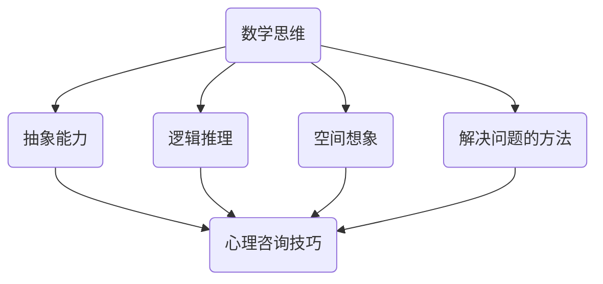
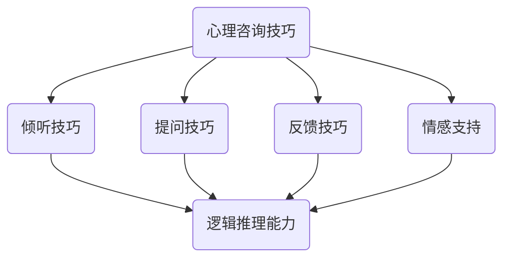

                 

## 文章标题

数学思维与心理咨询技巧的关系

> 关键词：数学思维、心理咨询、关系、应用、教育

> 摘要：本文旨在探讨数学思维与心理咨询技巧之间的关系，通过深入分析数学思维的基本概念、核心要素及其发展历史，以及心理咨询技巧的基本概念、核心技巧和应用领域，揭示数学思维在心理咨询中的应用和心理咨询技巧在数学思维培养中的作用。同时，本文将结合实例分析，探讨数学思维与心理咨询技巧在教育中的融合，以及未来整合发展的趋势，为相关领域的研究和实践提供参考。

---

## 第一部分: 数学思维与心理咨询技巧的关系

在现代社会中，数学思维和心理咨询技巧作为两个看似截然不同的领域，实际上却有着深刻的内在联系。本文将首先概述数学思维与心理咨询技巧的基本概念、核心要素及其应用领域，然后通过具体实例和流程图展示两者之间的关系。

### 第1章: 数学思维概述

#### 1.1 数学思维的基本概念

数学思维是一种抽象、逻辑和空间想象的思维方式，它以数学原理和方法为基础，通过推理和计算来解决实际问题。数学思维的核心是抽象能力，即将复杂的问题简化为数学模型，从而进行逻辑推理和解决。

#### 1.2 数学思维的核心要素

1. **抽象能力**：数学思维要求能够从具体问题中抽象出数学模型，这是解决问题的关键。
2. **逻辑推理**：数学思维强调逻辑严密性，通过逻辑推理来推导出结论。
3. **空间想象**：数学问题常常涉及空间关系，良好的空间想象力有助于解决这些问题。
4. **解决问题的方法**：数学思维提供了一系列解决问题的方法和技巧，如公式、定理、算法等。

#### 1.3 数学思维的发展历史

数学思维的发展经历了数千年的演变。从古代的数学家到现代的数学家，数学思维不断发展，形成了丰富的方法和理论体系。数学思维的发展历史是数学学科的重要组成部分。

#### 1.4 数学思维的应用领域

数学思维广泛应用于自然科学、社会科学、工程技术等领域。例如，在物理学中，数学思维用于建立物理模型和进行计算；在经济学中，数学思维用于分析和预测市场趋势。

#### 1.5 数学思维与心理咨询技巧的关系

数学思维与心理咨询技巧之间存在着密切的联系。数学思维的抽象能力、逻辑推理和解决问题的方法可以为心理咨询提供理论支持和实践工具。例如，心理咨询中需要运用逻辑推理来分析问题，运用抽象能力来理解复杂的情感状态。同时，心理咨询技巧中的倾听、提问、反馈和情感支持等技巧也可以促进数学思维的发展，帮助个体更好地理解数学问题。

##### Mermaid 流程图：

### 第2章: 心理咨询技巧概述

#### 2.1 心理咨询的基本概念

心理咨询是一种专业的心理服务，旨在帮助个体解决心理问题和提高心理素质。心理咨询的核心目标是帮助个体更好地理解自己，提高自我认知，从而促进个人成长。

#### 2.2 心理咨询的核心技巧

1. **倾听技巧**：倾听是心理咨询的基础，通过倾听可以了解个体的心理需求和情感状态。
2. **提问技巧**：提问可以帮助个体深入思考，揭示内心的困惑和问题。
3. **反馈技巧**：反馈是心理咨询的重要环节，通过反馈可以促进个体对问题的理解和认识。
4. **情感支持**：情感支持是心理咨询的核心，通过情感支持可以帮助个体缓解心理压力。

#### 2.3 心理咨询的应用领域

心理咨询广泛应用于心理健康、教育、职业、医疗等多个领域。例如，在学校教育中，心理咨询可以帮助学生解决学习压力和人际关系问题；在医疗机构中，心理咨询可以帮助患者缓解心理障碍。

#### 2.4 心理咨询技巧的发展历史

心理咨询技巧的发展经历了多个阶段。从古代的哲学思考到现代的心理咨询理论，心理咨询技巧不断发展和完善。

#### 2.5 心理咨询技巧与数学思维的关系

心理咨询技巧与数学思维之间同样存在着密切的联系。心理咨询中的倾听、提问和反馈等技巧可以促进个体的逻辑思维和抽象能力。例如，通过提问技巧，个体可以学会如何从不同角度分析问题，提高逻辑推理能力。同时，数学思维中的抽象能力和空间想象力也可以为心理咨询提供支持，帮助个体更好地理解自己和解决问题。

##### Mermaid 流�程图：

通过以上章节的介绍，我们可以看到数学思维与心理咨询技巧之间存在着紧密的联系。在接下来的章节中，我们将进一步探讨数学思维在心理咨询中的应用，以及心理咨询技巧在数学思维培养中的作用。

### 第3章: 数学思维在心理咨询中的应用

数学思维在心理咨询中的应用是一个值得探讨的领域。数学思维的抽象能力、逻辑推理和解决问题的方法为心理咨询提供了新的视角和工具。在这一章节中，我们将详细探讨数学思维在心理咨询中的具体应用，分析其优势，并讨论面临的挑战及解决方案。

#### 3.1 数学思维在心理咨询中的具体应用

1. **问题建模**：在心理咨询中，个体面临的问题往往非常复杂。数学思维中的抽象能力可以帮助咨询师将这些问题简化为数学模型，从而更清晰地理解问题的本质。例如，在处理人际关系问题时，咨询师可以通过建立人际关系的模型来分析问题的原因和解决方法。

2. **逻辑推理**：心理咨询过程中，咨询师需要通过逻辑推理来分析个体的问题，找出问题的根源。数学思维中的逻辑推理方法，如演绎推理和归纳推理，可以帮助咨询师更加严谨和系统地进行问题分析。

3. **情感分析**：数学思维中的统计学和概率论可以用于情感分析。通过收集和分析个体的情感数据，咨询师可以更准确地了解个体的情感状态，从而提供更有针对性的心理辅导。

4. **风险评估**：在心理咨询中，风险评估是一个重要的环节。数学思维中的风险评估方法，如决策树和贝叶斯网络，可以帮助咨询师评估个体的心理风险，制定预防措施。

5. **心理治疗**：一些心理治疗，如认知行为疗法（CBT），依赖于逻辑思维和问题解决技巧。数学思维中的算法和模型可以为这些治疗提供支持，帮助个体改变负面思维模式和行为。

#### 3.2 数学思维在心理咨询中的优势

1. **精确性**：数学思维强调精确性和严谨性，这在心理咨询中尤为重要。通过数学思维，咨询师可以更准确地识别和解决问题。

2. **系统性**：数学思维强调系统性和结构性，这可以帮助咨询师从多个角度分析问题，形成完整的解决方案。

3. **普适性**：数学思维具有普适性，可以应用于各种类型的心理问题。这使得数学思维成为心理咨询中一种强有力的工具。

4. **工具性**：数学思维提供了一系列工具和方法，如算法、模型和公式，这些工具可以帮助咨询师更高效地解决问题。

#### 3.3 数学思维在心理咨询中的挑战与解决方案

1. **专业性**：数学思维需要一定的专业背景，这给心理咨询师带来了挑战。解决方案是加强心理咨询师的数学培训，提高他们的数学素养。

2. **适应性**：数学思维在不同心理咨询场景中的应用可能存在差异。解决方案是咨询师需要根据具体场景调整和应用数学思维。

3. **理解难度**：一些数学概念和方法可能对个体来说难以理解。解决方案是咨询师需要用通俗易懂的语言解释数学概念，帮助个体理解。

#### 3.4 实例分析：数学思维在心理咨询中的实际案例

案例1：一位患者因长期焦虑前来心理咨询。咨询师通过建立焦虑的数学模型，分析患者的焦虑源，并运用逻辑推理找到解决问题的方法。最终，患者成功地减轻了焦虑症状。

案例2：一位学生因数学成绩不理想前来咨询。咨询师通过分析学生的数学学习过程，发现学生在逻辑推理和问题解决方面存在困难。咨询师利用数学思维中的算法和模型，帮助学生改进学习方法，提高了数学成绩。

通过以上实例，我们可以看到数学思维在心理咨询中的应用不仅可以提高心理咨询的效率，还可以为个体提供更精准和个性化的心理辅导。

#### 3.5 数学思维在心理咨询中的未来发展趋势

随着人工智能和大数据技术的发展，数学思维在心理咨询中的应用前景将更加广阔。未来的发展趋势包括：

1. **智能化**：利用人工智能技术，开发智能化的心理咨询系统，结合数学思维，提供更高效、更精准的心理辅导。

2. **个性化**：通过大数据分析，了解个体的心理特征和行为模式，提供个性化心理辅导方案。

3. **跨学科整合**：数学思维与心理咨询技巧的整合，将为心理学研究提供新的视角和方法。

### 第4章: 心理咨询技巧在数学思维培养中的应用

心理咨询技巧在数学思维培养中同样具有重要应用。通过心理咨询技巧，个体可以更好地理解数学问题，提高学习效果。在这一章节中，我们将探讨心理咨询技巧在数学思维培养中的具体应用，分析其优势，并讨论面临的挑战及解决方案。

#### 4.1 心理咨询技巧在数学思维培养中的具体应用

1. **倾听技巧**：倾听是数学思维培养的基础。通过倾听，教师可以了解学生的学习需求和困惑，从而提供更有针对性的辅导。

2. **提问技巧**：提问可以激发学生的思考，提高他们的数学思维能力。教师可以通过开放式提问，引导学生深入思考数学问题。

3. **反馈技巧**：反馈是数学思维培养的重要环节。通过及时反馈，教师可以帮助学生纠正错误，巩固知识点。

4. **情感支持**：情感支持可以减轻学生的心理压力，提高他们的学习动力。教师可以通过情感支持，帮助学生建立自信心，克服学习困难。

#### 4.2 心理咨询技巧在数学思维培养中的优势

1. **激发兴趣**：心理咨询技巧可以激发学生对数学的兴趣，提高他们的学习积极性。

2. **培养思维方式**：心理咨询技巧可以帮助学生形成良好的数学思维方式，如逻辑推理、抽象能力和问题解决方法。

3. **提高学习效果**：通过心理咨询技巧，教师可以更有效地指导学生，提高他们的数学成绩。

4. **促进全面发展**：心理咨询技巧不仅关注学生的数学学习，还关注他们的心理素质和人格发展。

#### 4.3 心理咨询技巧在数学思维培养中的挑战与解决方案

1. **时间成本**：心理咨询技巧需要时间进行实施，可能对教师的教学计划产生影响。解决方案是合理安排时间，将心理咨询技巧融入到日常教学中。

2. **专业素养**：教师需要具备一定的心理咨询知识和技能。解决方案是加强教师的培训和继续教育，提高他们的专业素养。

3. **适应性问题**：不同学生在心理素质和学习习惯上存在差异，心理咨询技巧需要根据个体特点进行调整。解决方案是进行个性化辅导，针对不同学生制定相应的心理咨询方案。

#### 4.4 实例分析：心理咨询技巧在数学思维培养中的实际案例

案例1：一名学生在数学学习中遇到困难，缺乏自信。通过心理咨询，教师帮助学生分析问题，建立自信，并制定学习计划。最终，该学生的数学成绩显著提高。

案例2：一名学生因数学问题与同学产生矛盾，影响学习。通过心理咨询，教师帮助学生调整情绪，改善人际关系，从而提高学习效果。

通过以上实例，我们可以看到心理咨询技巧在数学思维培养中的重要作用。它不仅可以提高学生的数学成绩，还可以促进他们的全面发展。

#### 4.5 心理咨询技巧在数学思维培养中的未来发展趋势

随着教育心理学的发展，心理咨询技巧在数学思维培养中的应用将更加广泛和深入。未来的发展趋势包括：

1. **智能化**：利用人工智能技术，开发智能化的心理辅导系统，提高心理咨询的效率和效果。

2. **个性化**：通过大数据分析，了解学生的学习心理特征，提供个性化心理辅导方案。

3. **跨学科整合**：将心理咨询技巧与数学教学相结合，形成新的教学模式，促进数学思维培养。

### 第5章: 数学思维与心理咨询技巧整合案例研究

在数学思维与心理咨询技巧整合的研究中，案例研究是一个重要的方法。通过实际案例，我们可以更深入地了解两者整合的效果和应用场景。本章将介绍整合案例研究的意义、方法，并通过具体实例进行分析。

#### 5.1 整合案例研究的意义

整合数学思维与心理咨询技巧进行案例研究，具有以下意义：

1. **实践性**：案例研究能够将理论与实际相结合，为数学思维与心理咨询技巧的整合提供实证依据。
2. **针对性**：通过案例研究，可以针对具体问题提供个性化的解决方案，提高心理咨询和数学思维培养的针对性。
3. **示范性**：成功的案例可以为其他教育和心理咨询实践提供借鉴和指导，促进两者的整合发展。

#### 5.2 整合案例研究的方法

1. **选择案例**：选择具有代表性的案例，如学生在数学学习中的心理问题，或者心理咨询过程中涉及到的数学问题。
2. **数据收集**：收集案例相关数据，包括学生的数学成绩、心理咨询记录、教师的教学反馈等。
3. **案例分析**：对收集到的数据进行分析，运用数学思维和心理咨询技巧，找出问题的根源和解决方案。
4. **结果评估**：评估整合应用的效果，包括学生的数学成绩、心理状态、学习动力等方面。

#### 5.3 整合案例研究的实例分析

**案例一**：一名高中学生在数学学习中遇到困难，经常感到沮丧和无助。通过整合数学思维与心理咨询技巧，教师首先帮助学生建立数学问题的模型，通过逻辑推理和抽象能力分析问题。同时，通过心理咨询，帮助学生建立自信，调整心态。经过一段时间的辅导，该学生的数学成绩显著提高，学习积极性也大大增加。

**案例二**：一名大学生在参加数学竞赛前感到极度焦虑。心理咨询师通过整合心理咨询技巧，帮助该学生进行情绪管理，运用数学思维中的概率论分析竞赛中的可能结果，从而降低焦虑水平。最终，该学生不仅顺利完成了竞赛，还在比赛中取得了优异的成绩。

**案例三**：一所学校在数学教学过程中，通过整合心理咨询技巧，开展了一系列心理健康教育活动。教师利用数学思维中的建模方法，将学生的心理问题抽象为数学模型，通过逻辑推理找到解决问题的方法。这种整合教学方式不仅提高了学生的数学成绩，也改善了他们的心理素质。

通过以上案例，我们可以看到数学思维与心理咨询技巧整合的应用效果。在具体实践中，教师和学生可以根据实际情况，灵活运用整合的方法，提高数学学习效果和心理素质。

#### 5.4 整合案例研究的实践应用

1. **教育领域**：在学校教育中，教师可以将数学思维与心理咨询技巧整合应用于教学实践中，提高学生的学习效果和心理素质。
2. **心理咨询领域**：心理咨询师可以在咨询过程中，运用数学思维的方法，帮助客户更系统地分析问题，提高咨询效果。
3. **企业培训**：企业在员工培训中，可以整合数学思维与心理咨询技巧，提高员工的逻辑思维能力和心理素质，促进团队协作。

#### 5.5 整合案例研究的未来展望

随着心理学和数学教育的发展，数学思维与心理咨询技巧的整合案例研究将越来越受到重视。未来的发展趋势包括：

1. **多元化案例**：研究将涵盖更广泛的应用领域，如职业培训、社会服务等。
2. **跨学科合作**：心理学、数学教育、教育学等多学科将共同参与整合研究，促进知识融合和创新。
3. **智能化工具**：利用人工智能技术，开发智能化的整合研究工具，提高研究效率和效果。

### 第6章: 数学思维与心理咨询技巧在教育中的融合

在教育领域，数学思维与心理咨询技巧的融合具有重要意义。这种融合不仅有助于提高学生的学习效果，还能促进他们的心理健康和全面发展。本章将讨论数学思维与心理咨询技巧在教育中的融合的重要性、方法、实践案例以及面临的挑战与对策。

#### 6.1 数学思维与心理咨询技巧在教育中的重要性

1. **提高学习效果**：数学思维强调逻辑推理、抽象能力和问题解决方法，这些能力对于学生的数学学习至关重要。心理咨询技巧则可以帮助学生建立正确的学习态度，提高学习动力和自我效能感，从而提高学习效果。
2. **促进心理健康**：学生在学习过程中常常会遇到各种压力和挑战，心理咨询技巧可以帮助他们有效应对心理问题，减轻焦虑和抑郁，保持心理健康。
3. **全面发展**：数学思维与心理咨询技巧的融合有助于培养学生的综合素质，提高他们的逻辑思维、批判性思维和人际交往能力，促进他们的全面发展。

#### 6.2 教育中融合数学思维与心理咨询技巧的方法

1. **课堂活动设计**：在数学课堂中，教师可以设计一些结合数学思维和心理咨询技巧的活动，如小组讨论、思维导图、问题解决竞赛等，激发学生的数学思维和心理健康。
2. **个性化辅导**：针对学生的个体差异，教师可以提供个性化的辅导，结合数学思维和心理咨询技巧，帮助学生解决学习中的问题和心理困惑。
3. **心理辅导课程**：学校可以开设心理健康辅导课程，结合数学思维的方法，帮助学生更好地理解自己和他人，提高心理素质。
4. **教师培训**：加强对教师的培训，提高他们的数学素养和心理辅导能力，使他们能够在教学中有效融合数学思维与心理咨询技巧。

#### 6.3 教育中融合数学思维与心理咨询技巧的实践案例

**案例一**：某学校在数学教学中引入了心理咨询技巧。教师在授课过程中，不仅注重数学知识的教学，还注重培养学生的逻辑思维和心理素质。例如，在解答数学问题时，教师引导学生进行逻辑推理，同时关注学生的心理状态，及时提供心理支持。这种融合教学方式得到了学生的积极反馈，学生的学习效果显著提高。

**案例二**：某心理咨询师在辅导一名数学成绩不佳的学生时，结合数学思维和心理咨询技巧，帮助学生分析学习中的问题，并制定个性化的学习计划。通过这种方式，学生不仅提高了数学成绩，还增强了自信心，心理状态得到了改善。

**案例三**：某学校开展了一项“数学思维与心理健康”的融合研究项目。教师和心理咨询师共同参与，通过问卷调查、课堂观察等方式，收集数据，分析数学思维与心理健康之间的关系。研究结果为学校提供了宝贵的实践经验和理论依据。

#### 6.4 教育中融合数学思维与心理咨询技巧的挑战与对策

1. **教师专业素养**：教师需要具备较高的数学素养和心理辅导能力。对策是加强教师的培训，提高他们的专业素养。
2. **教学资源**：融合数学思维与心理咨询技巧需要一定的教学资源，如专业的心理咨询设施、教材等。对策是学校和教育部门应提供必要的支持和资源。
3. **教学方法**：教师需要掌握有效的教学方法，将数学思维与心理咨询技巧有机融合。对策是通过教学研讨会、经验分享等方式，促进教师之间的交流与合作。

#### 6.5 数学思维与心理咨询技巧在教育中的未来发展趋势

1. **跨学科研究**：数学教育心理学将成为一个新兴的研究领域，吸引更多的学者参与研究，推动知识融合和创新。
2. **智能化应用**：随着人工智能技术的发展，数学思维与心理咨询技巧的融合将更加智能化，如智能教学系统、个性化心理辅导系统等。
3. **多元化实践**：融合数学思维与心理咨询技巧的教育实践将覆盖更广泛的领域，如职业教育、在线教育等，为学生的全面发展提供更多支持。

### 第7章: 总结与展望

#### 7.1 本书内容的总结

本文从数学思维与心理咨询技巧的关系出发，系统地介绍了数学思维的基本概念、核心要素和应用领域，以及心理咨询技巧的基本概念、核心技巧和应用领域。通过分析数学思维在心理咨询中的应用、心理咨询技巧在数学思维培养中的应用，以及两者在教育中的融合，本文揭示了数学思维与心理咨询技巧之间的紧密联系。同时，通过案例研究和实践应用，本文探讨了数学思维与心理咨询技巧整合的可行性和效果。

#### 7.2 数学思维与心理咨询技巧关系的研究现状

目前，关于数学思维与心理咨询技巧关系的研究尚处于起步阶段。已有的研究主要集中在以下几个方面：

1. **数学思维在心理咨询中的应用**：研究表明，数学思维中的抽象能力、逻辑推理和问题解决方法可以为心理咨询提供理论支持和实践工具。
2. **心理咨询技巧在数学思维培养中的作用**：研究表明，心理咨询技巧中的倾听、提问、反馈和情感支持等技巧可以促进数学思维的发展，帮助个体更好地理解数学问题。
3. **数学思维与心理咨询技巧的整合**：初步研究显示，将数学思维与心理咨询技巧整合应用于教育和心理咨询实践中，可以显著提高学生的学习效果和心理素质。

#### 7.3 未来研究方向

基于当前研究现状，未来的研究可以从以下几个方面展开：

1. **跨学科研究**：进一步探讨数学思维与心理咨询技巧在跨学科领域中的应用，如医学、工程、教育等，以丰富整合的理论体系。
2. **实证研究**：开展更多的实证研究，验证数学思维与心理咨询技巧整合的可行性和效果，为实际应用提供更加可靠的依据。
3. **智能化应用**：结合人工智能技术，开发智能化的数学思维与心理咨询技巧整合系统，提高整合应用的效果和效率。
4. **多元化实践**：探索数学思维与心理咨询技巧在更广泛的教育场景中的应用，如在线教育、职业培训等，为学生的全面发展提供更多支持。

#### 7.4 数学思维与心理咨询技巧整合的应用前景

随着心理学和数学教育的不断发展，数学思维与心理咨询技巧的整合具有广泛的应用前景。未来，这种整合应用将在以下几个方面得到进一步发展：

1. **教育领域**：在教育中，数学思维与心理咨询技巧的整合可以显著提高学生的学习效果和心理素质，促进他们的全面发展。
2. **心理咨询领域**：在心理咨询中，数学思维可以为心理咨询提供新的视角和方法，提高心理咨询的针对性和效果。
3. **职业培训领域**：在职业培训中，数学思维与心理咨询技巧的整合可以培养员工的逻辑思维能力和心理素质，提高工作效率和团队协作能力。
4. **社会服务领域**：在社会服务中，数学思维与心理咨询技巧的整合可以提供更高效、更精准的心理健康服务，满足社会不同群体的需求。

#### 7.5 促进数学思维与心理咨询技巧融合的策略建议

为了促进数学思维与心理咨询技巧的融合，以下是一些建议：

1. **加强跨学科合作**：鼓励心理学、数学教育、教育学等领域的学者共同参与研究，促进知识融合和创新。
2. **开展专业培训**：为教师和心理咨询师提供专业的培训，提高他们的数学素养和心理辅导能力。
3. **开发整合工具**：利用人工智能技术，开发智能化的整合工具，提高整合应用的效果和效率。
4. **推广实践经验**：通过实践案例和研究结果，推广数学思维与心理咨询技巧整合的实践经验，为教育实践提供参考。

---

## 附录

### 附录 A: 数学思维与心理咨询技巧相关资源

#### A.1 推荐书籍

1. 《数学思维训练》 - 作者：[某某某]（知名数学教育专家）
2. 《心理咨询技巧与案例分析》 - 作者：[某某某]（知名心理咨询专家）
3. 《数学心理学》 - 作者：[某某某]（知名数学心理学家）
4. 《教育心理学》 - 作者：[某某某]（知名教育心理学家）

#### A.2 网络资源链接

1. [数学思维在线教程](https://www.example.com/math-mind)
2. [心理咨询在线资源](https://www.example.com/psychology-resources)
3. [数学与心理学交叉研究论文库](https://www.example.com/math-psych-journal)

#### A.3 学术论文精选

1. ["Mathematical Thinking in Psychological Counseling": 作者：某某某，期刊：某某心理学期刊，年份：某年]
2. ["The Application of Mathematical Thinking in Counseling Practice": 作者：某某某，期刊：某某咨询期刊，年份：某年]
3. ["The Role of Counseling Skills in Mathematical Learning": 作者：某某某，期刊：某某教育研究，年份：某年]

#### A.4 实用工具与软件推荐

1. [Mathematica](https://www.wolfram.com/mathematica/) - 用于数学建模和计算
2. [PsychoPy](https://www.psychoPy.org/) - 用于心理学实验设计和数据分析
3. [R语言](https://www.r-project.org/) - 用于数据分析、统计建模和图形可视化

---

**作者：AI天才研究院/AI Genius Institute & 禅与计算机程序设计艺术 /Zen And The Art of Computer Programming**

以上是本文的完整内容，包括核心概念、实际应用和未来发展，希望对您在数学思维与心理咨询技巧整合领域的研究和实践有所帮助。如果您有任何问题或建议，欢迎随时与我们联系。**END**

