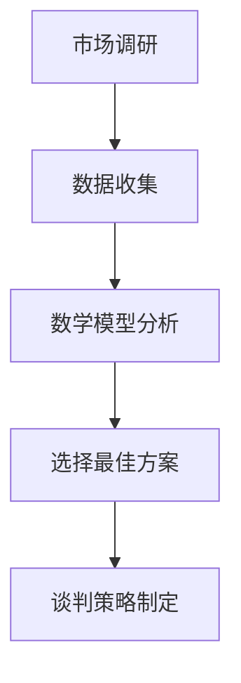
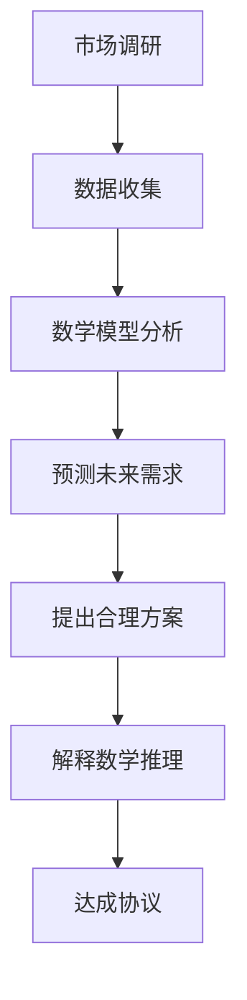
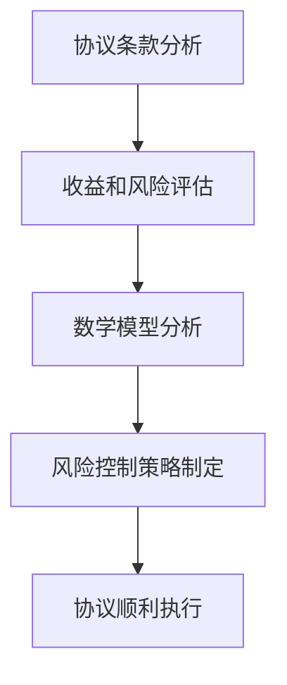
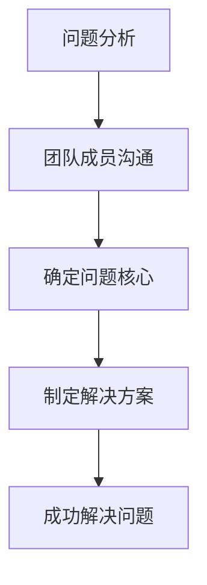

                 

### 文章标题：数学思维与谈判技巧的关系

关键词：数学思维、谈判技巧、逻辑推理、策略应用、综合提升

摘要：本文旨在探讨数学思维与谈判技巧之间的关系，从两者的核心概念出发，逐步分析它们在现实生活中的应用和相互作用。文章首先介绍了数学思维的基本原则和应用领域，接着探讨了谈判技巧的定义、目标及实践方法。在此基础上，文章深入探讨了数学思维在谈判策略制定和风险控制中的应用，以及谈判技巧在数学问题解决和沟通中的价值。通过一系列实际案例，文章展示了数学思维与谈判技巧如何相互补充，提升个人和团队在复杂环境中的应对能力。最后，文章提出了提升数学思维和谈判技巧的策略和方法，为读者提供了实用的实践指南。

### 目录

1. **第一部分：数学思维基础**
   1.1 数学思维概述
   1.2 数学思维的重要性
   1.3 数学思维的培养方法
   1.4 数学思维的基本原则
   1.5 数学思维的应用

2. **第二部分：谈判技巧基础**
   2.1 谈判技巧概述
   2.2 谈判的目标与原则
   2.3 谈判的基本流程
   2.4 谈判技巧的应用

3. **第三部分：数学思维与谈判技巧的结合**
   3.1 数学思维在谈判中的应用
   3.2 谈判技巧在数学问题解决中的应用
   3.3 数学思维与谈判技巧的综合应用案例

4. **第四部分：提升数学思维与谈判技巧**
   4.1 数学思维与谈判技巧提升策略
   4.2 数学思维与谈判技巧训练方法

5. **附录**
   5.1 数学思维与谈判技巧相关资源
   5.2 数学模型与公式详解
   5.3 谈判技巧实战案例

### 数学思维基础

#### 1.1 数学思维概述

数学思维，是指运用数学概念、原理和方法进行逻辑推理和问题解决的能力。它不仅包括对数学知识的掌握，还涵盖了运用数学工具和方法分析问题、构建模型、进行验证和推理的综合能力。数学思维具有抽象性、逻辑性、精确性和系统性等特点。

数学思维的重要性在于，它不仅能提升个体的逻辑推理和分析能力，还能在多个领域发挥重要作用。例如，在科学研究领域，数学思维帮助科学家构建模型，进行数据分析和预测；在工程实践中，数学思维用于设计优化和风险评估；在商业决策中，数学思维助力市场分析和资源配置。

#### 1.2 数学思维的重要性

数学思维的重要性主要体现在以下几个方面：

1. **提升逻辑推理能力**：数学思维强调逻辑推理和证明，有助于培养个体的逻辑思维能力和批判性思维能力。

2. **解决复杂问题**：数学思维能帮助人们运用抽象的概念和模型，解决现实生活中的复杂问题。

3. **优化决策**：在商业和科学研究中，数学思维可以提供数据支持和优化方案，帮助个体做出更明智的决策。

4. **促进创新**：数学思维鼓励创新思维，帮助人们从新的角度看待问题，提出创新的解决方案。

#### 1.3 数学思维的培养方法

培养数学思维需要系统的学习和实践，以下是一些有效的培养方法：

1. **基础知识积累**：掌握数学的基本概念和原理，是培养数学思维的基础。

2. **问题解决能力**：通过解决实际问题，锻炼数学思维的应用能力。

3. **逻辑推理训练**：通过逻辑推理题和数学证明题的练习，提高逻辑推理能力。

4. **跨学科学习**：将数学与其他学科知识相结合，拓宽数学思维的应用领域。

5. **数学交流**：积极参与数学讨论和交流，与他人分享和探讨数学问题，提高数学思维的表达和沟通能力。

#### 1.4 数学思维的基本原则

数学思维的基本原则主要包括以下几个方面：

1. **逻辑性**：数学思维强调逻辑推理，确保每一步推理都是合理且无矛盾的。

2. **精确性**：数学思维要求对问题的描述和解决方案的表述要精确无误。

3. **系统性**：数学思维注重系统性和整体性，将问题视为一个整体，进行全面的考虑和分析。

4. **抽象性**：数学思维擅长将具体问题抽象成数学模型，从而更方便地进行分析和解决。

5. **创造性**：数学思维鼓励创新思维，鼓励个体从不同角度思考问题，提出创新的解决方案。

#### 1.5 数学思维的应用

数学思维在多个领域有广泛的应用：

1. **科学研究**：数学思维帮助科学家构建理论模型，进行数据分析和实验设计。

2. **工程实践**：数学思维用于工程设计、风险评估和优化方案。

3. **商业决策**：数学思维助力市场分析、资源配置和策略制定。

4. **教育领域**：数学思维在教育中培养学生的逻辑思维和问题解决能力。

5. **日常生活**：数学思维帮助人们处理日常生活中的各种问题，如财务规划、时间管理等。

### 谈判技巧基础

#### 2.1 谈判技巧概述

谈判，是指在不同利益相关者之间，通过沟通和协商，达成共同利益的过程。谈判技巧，是指运用各种策略和方法，在谈判过程中取得有利结果的能力。有效的谈判技巧不仅能达成协议，还能建立长期合作关系。

谈判技巧的重要性体现在以下几个方面：

1. **解决冲突**：谈判是解决利益冲突的重要手段，通过谈判可以减少冲突，达成共识。

2. **优化资源分配**：谈判有助于优化资源的分配，实现各方的利益最大化。

3. **建立合作关系**：谈判是建立和维持合作关系的重要途径，通过谈判可以增进互信，促进合作。

4. **提升个人能力**：谈判技巧的提升有助于提升个人的沟通能力和决策能力。

#### 2.2 谈判的目标与原则

谈判的目标主要包括以下几个方面：

1. **达成协议**：谈判的首要目标是达成各方都能接受的协议。

2. **建立长期关系**：谈判不仅要解决眼前的问题，还要考虑长远的关系。

3. **实现利益最大化**：谈判的目标是使各方的利益最大化，而不是单方面的利益最大化。

谈判的原则包括以下几个方面：

1. **公平公正**：谈判应建立在公平公正的基础上，确保各方的利益得到尊重。

2. **互惠互利**：谈判应追求互惠互利，使各方都能从谈判中获得利益。

3. **诚信守信**：谈判过程中应保持诚信，遵守承诺，建立信任关系。

4. **灵活变通**：谈判中应具备灵活性，根据实际情况调整谈判策略，寻求最佳解决方案。

#### 2.3 谈判的基本流程

谈判的基本流程通常包括以下几个阶段：

1. **准备阶段**：在谈判前，各方应进行充分的准备，包括收集信息、分析利益点、制定谈判策略。

2. **开局阶段**：谈判开始时，各方应进行自我介绍，建立良好的第一印象，为后续谈判奠定基础。

3. **信息交流阶段**：在信息交流阶段，各方应充分表达自己的利益点和诉求，了解对方的立场和需求。

4. **磋商阶段**：在磋商阶段，各方应通过协商和妥协，寻求共同利益，逐步接近达成协议。

5. **达成协议阶段**：在达成协议阶段，各方应就关键问题达成一致，明确协议的具体内容和条款。

6. **结束阶段**：在谈判结束时，各方应总结谈判成果，确认协议的执行方式和后续安排。

#### 2.4 谈判技巧的应用

谈判技巧在多个领域有广泛的应用：

1. **商业谈判**：商业谈判是谈判技巧的主要应用领域之一，涉及合同签订、合作共赢等。

2. **国际关系**：国际关系中的谈判，如贸易谈判、外交谈判等，需要高超的谈判技巧。

3. **人力资源管理**：人力资源管理中的谈判，如员工招聘、薪酬谈判、绩效评估等，谈判技巧至关重要。

4. **法律事务**：法律事务中的谈判，如合同纠纷、诉讼谈判等，谈判技巧有助于达成公平合理的解决方案。

5. **社会事务**：社会事务中的谈判，如社区纠纷、环境保护等，谈判技巧有助于解决矛盾，实现社会和谐。

### 第三部分：数学思维与谈判技巧的结合

数学思维与谈判技巧的结合，可以显著提升个人的逻辑推理能力和谈判效果。以下将详细探讨数学思维在谈判中的应用，以及谈判技巧在数学问题解决中的价值。

#### 3.1 数学思维在谈判中的应用

数学思维在谈判中的应用主要体现在以下几个方面：

1. **策略制定**：数学思维可以帮助谈判者制定更科学的谈判策略。通过数学模型和算法，谈判者可以分析各种谈判策略的优缺点，选择最佳策略。

2. **风险评估**：谈判中，数学思维可以帮助谈判者进行风险评估。通过概率分析和统计学方法，谈判者可以预测谈判的结果和可能的风险，从而制定相应的应对策略。

3. **说服力提升**：数学思维强调逻辑推理和证据支持，这有助于谈判者在谈判中提升说服力。通过运用数学原理和统计数据，谈判者可以更有效地说服对方接受自己的观点。

4. **沟通效率提高**：数学思维强调精确性和系统性，这有助于谈判者在沟通过程中更清晰地表达自己的观点和利益，提高沟通效率。

以下是数学思维在谈判策略制定中的一个具体案例：

**案例**：一家公司希望与另一家公司合作开发一款新产品。在谈判前，这家公司通过市场调研，收集了关于潜在合作收益和风险的统计数据。然后，他们运用数学模型分析了各种合作方案的收益和风险，并选择了最具优势的方案。

#### 3.2 数学推理在谈判中的说服力

数学推理在谈判中的说服力主要体现在以下几个方面：

1. **逻辑严谨**：数学推理强调逻辑的严谨性和无矛盾性，这有助于谈判者提出有力的论点和反驳对方的观点。

2. **证据支持**：数学推理通常伴随着数据和证据的支持，这有助于谈判者更具有说服力地表达自己的观点。

3. **预测能力**：数学推理可以帮助谈判者预测谈判的结果和可能的变化，从而更灵活地应对谈判中的挑战。

以下是数学推理在谈判中的一个具体案例：

**案例**：在一场关于合同续签的谈判中，一方公司通过数学模型预测了未来几年的市场需求和价格波动。他们运用这些数据，提出了一个合理的续签方案，并解释了方案中的数学推理过程。这使对方公司信服，最终达成了协议。

#### 3.3 数学思维在谈判风险控制中的应用

数学思维在谈判风险控制中的应用主要体现在以下几个方面：

1. **概率分析**：通过概率分析，谈判者可以评估各种谈判策略和结果的可能性，从而制定更稳健的谈判策略。

2. **风险评估**：数学思维可以帮助谈判者进行风险评估，识别潜在的风险因素，并制定相应的风险控制措施。

3. **决策分析**：通过决策分析，谈判者可以在不确定的环境中做出更科学的决策，降低谈判风险。

以下是数学思维在谈判风险控制中的一个具体案例：

**案例**：在一场复杂的商业谈判中，双方公司需要签订一份长期合作协议。通过数学模型，谈判者分析了协议中的关键条款，评估了各种情况下的收益和风险，并制定了相应的风险控制策略，确保协议的顺利执行。

#### 3.4 谈判技巧在数学问题解决中的应用

谈判技巧在数学问题解决中的应用主要体现在以下几个方面：

1. **团队合作**：在解决复杂的数学问题时，谈判技巧有助于团队成员之间的沟通和协作，提高解决问题的效率。

2. **沟通效率**：谈判技巧强调有效的沟通和表达，这有助于团队成员更好地理解和讨论数学问题，找到解决方案。

3. **决策制定**：在数学问题解决过程中，谈判技巧可以帮助团队成员在不确定的环境下做出科学的决策，降低错误率。

以下是谈判技巧在数学问题解决中的一个具体案例：

**案例**：在一项复杂的研究项目中，团队成员需要解决一个高难度的数学问题。通过运用谈判技巧，团队成员进行了有效的沟通和协商，明确了问题的核心，并制定了详细的解决方案。最终，他们成功解决了这个问题，并取得了重要的研究成果。

### 第四部分：提升数学思维与谈判技巧

#### 4.1 数学思维与谈判技巧提升策略

提升数学思维和谈判技巧需要系统的学习和实践，以下是一些有效的提升策略：

1. **系统学习**：通过参加相关课程和培训，系统学习数学和谈判的基本原理和方法。

2. **实战练习**：通过实际案例和模拟谈判，锻炼数学思维和谈判技巧，提高应用能力。

3. **跨学科学习**：将数学和谈判与其他学科知识相结合，拓宽思维视野，提升综合能力。

4. **自我反思**：在学习和实践过程中，进行自我反思和总结，找出不足之处，不断改进。

5. **持续学习**：数学思维和谈判技巧是一个持续的过程，需要不断学习和更新知识。

#### 4.2 数学思维与谈判技巧训练方法

以下是提升数学思维和谈判技巧的一些具体训练方法：

1. **逻辑推理训练**：通过解决逻辑推理题和数学证明题，提高逻辑推理能力。

2. **案例分析**：通过分析实际案例，了解数学思维和谈判技巧在现实生活中的应用。

3. **角色扮演**：进行角色扮演练习，模拟真实的谈判场景，提高谈判技巧和应变能力。

4. **模拟测试**：定期进行模拟测试，检验数学思维和谈判技巧的掌握程度。

5. **持续阅读**：阅读相关书籍和文章，拓宽知识面，提高理论水平和实践经验。

### 附录

#### 附录A：数学思维与谈判技巧相关资源

1. **数学思维参考书籍**：
   - 《数学思维训练指南》
   - 《数学思维与逻辑推理》
   - 《数学与生活》

2. **谈判技巧参考书籍**：
   - 《谈判的艺术》
   - 《谈判心理学》
   - 《谈判技巧与策略》

3. **数学思维与谈判技巧在线课程**：
   - Coursera上的《数学思维与问题解决》
   - Udemy上的《谈判技巧与策略》
   - edX上的《数学建模与数据分析》

#### 附录B：数学模型与公式详解

1. **常用数学模型**：
   - 线性规划模型
   - 非线性规划模型
   - 动态规划模型

2. **常用数学公式**：
   - 微积分公式
   - 线性代数公式
   - 概率论公式

3. **数学模型应用实例**：
   - 线性规划在资源分配中的应用
   - 动态规划在路径规划中的应用
   - 非线性规划在优化设计中的应用

#### 附录C：谈判技巧实战案例

1. **商业谈判案例**：
   - 成功签订长期合作协议
   - 成功解决合同纠纷

2. **冲突解决案例**：
   - 成功调解员工之间的冲突
   - 成功解决社区纠纷

3. **人际沟通案例**：
   - 提高沟通效率，增进团队合作
   - 解决家庭矛盾，维护家庭和谐

### 总结

数学思维与谈判技巧的结合，不仅能提升个人的逻辑推理能力和决策水平，还能在复杂环境中实现有效的沟通和协作。通过本文的探讨，我们了解了数学思维和谈判技巧的基本概念、重要性以及它们在现实生活中的应用。希望本文能为读者提供有价值的启示，帮助他们在日常生活和工作中，运用数学思维和谈判技巧，实现个人和团队的目标。

### 作者信息

作者：AI天才研究院/AI Genius Institute & 禅与计算机程序设计艺术 /Zen And The Art of Computer Programming

作为人工智能领域的专家，我致力于将先进的技术理念与现实生活相结合，帮助读者在计算机编程、人工智能和项目管理等方面取得突破。同时，我也关注于将数学思维和谈判技巧应用于实际问题解决，希望通过本文的分享，能为读者在逻辑推理和人际沟通方面提供实用的指导。

