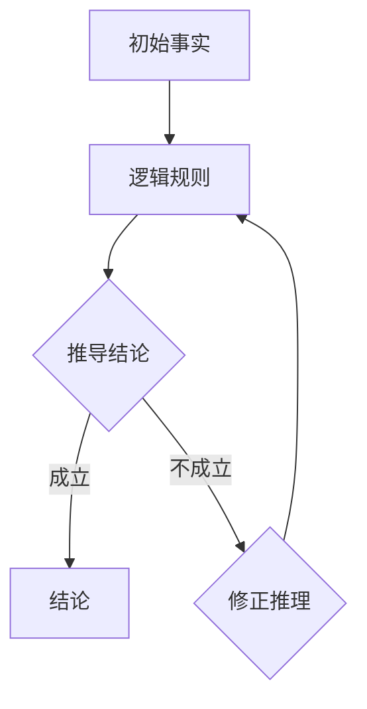

                 


### 第一部分：引言

#### 《数学思维与谈判策略的关系分析》

> 关键词：数学思维、谈判策略、逻辑推理、概率论、博弈论、数据分析、线性规划

> 摘要：
本文旨在深入探讨数学思维与谈判策略之间的关系。通过解析数学思维的核心概念，本文将揭示其如何影响和优化谈判策略，从而提升谈判者的决策能力和成功率。本文分为五个部分：引言、数学思维解析、数学模型与谈判策略、数学工具与谈判技巧、项目实战和总结与展望。每个部分都将通过具体的案例和实例，逐步分析数学思维在谈判中的应用，帮助读者掌握更加有效的谈判技巧。

---

#### 《数学思维与谈判策略的关系分析》

数学思维与谈判策略之间存在深刻的内在联系。数学思维，尤其是逻辑推理、概率论、博弈论等，为谈判者提供了一套严谨的分析工具，帮助他们在复杂多变的谈判环境中做出更为明智的决策。

在本文中，我们将首先介绍数学思维的基本概念和核心要素，然后逐步探讨这些要素如何与谈判策略相结合，提高谈判的效率和效果。

### 第一部分：引言

#### 1.1 数学思维的核心概念

数学思维是一种抽象思维，它通过逻辑推理、数学模型和数据分析等方法，对现实问题进行量化和解析。其核心概念包括：

- **逻辑推理**：基于已知事实和逻辑规则，推导出新的结论。
- **概率论**：研究随机事件的发生概率，用于评估风险和不确定性。
- **博弈论**：分析多个决策者之间的策略互动，以优化决策结果。
- **数据分析**：通过收集、整理和分析数据，提取有价值的信息和知识。
- **线性规划**：在给定约束条件下，寻找最优解。

#### 1.2 谈判策略的基本框架

谈判策略是指在谈判过程中所采用的一系列行为和决策，旨在实现谈判目标。其基本框架包括：

- **目标设定**：明确谈判的目标和期望结果。
- **信息收集**：收集谈判对手的相关信息和背景资料。
- **策略制定**：根据谈判目标和信息，制定具体的谈判策略。
- **执行和调整**：实施谈判策略，并根据谈判进展进行调整。

#### 1.3 数学思维与谈判策略的关系

数学思维在谈判策略中的应用主要体现在以下几个方面：

- **逻辑推理**：帮助谈判者分析谈判局势，识别关键信息，制定有效的谈判策略。
- **概率论**：帮助谈判者评估谈判结果和风险，做出更明智的决策。
- **博弈论**：分析谈判对手的策略和行为，制定针对性的策略，提高谈判成功率。
- **数据分析**：通过数据分析，提取有价值的信息，为谈判提供依据。
- **线性规划**：在谈判过程中，利用线性规划找到最优解，实现谈判目标。

---

在接下来的章节中，我们将深入探讨每个数学思维要素如何具体应用于谈判策略，并通过实例进行分析和说明。

### 第二部分：数学思维解析

#### 第2章：逻辑推理与谈判策略

逻辑推理是数学思维的核心之一，它在谈判策略中起着至关重要的作用。本章将介绍逻辑推理的基本原理，并探讨如何将其应用于谈判策略的制定和执行。

##### 2.1 逻辑推理的基本原理

逻辑推理是基于逻辑规则和前提条件，推导出结论的过程。其基本原理包括：

- **前提条件**：逻辑推理的前提条件是已知事实或前提，这些前提构成了推理的基础。
- **逻辑规则**：逻辑规则是推理过程中使用的规则，包括条件推理、否定推理、假言推理等。
- **结论**：通过逻辑推理，从已知前提推导出新的结论。

逻辑推理的基本步骤如下：

1. **确定前提条件**：收集和分析与谈判相关的信息，确定已知的事实或前提。
2. **选择逻辑规则**：根据前提条件和谈判目标，选择合适的逻辑规则进行推理。
3. **推导结论**：使用逻辑规则，从前提条件推导出新的结论。
4. **验证结论**：检查推导出的结论是否符合逻辑规则和前提条件。

##### 2.2 如何应用逻辑推理优化谈判策略

逻辑推理在谈判策略中的应用主要体现在以下几个方面：

- **分析局势**：通过逻辑推理，分析谈判局势，识别关键信息和潜在问题。
- **制定策略**：根据分析结果，制定针对性的谈判策略，包括谈判目标、步骤和预期结果。
- **执行策略**：在谈判过程中，根据逻辑推理的结果，调整谈判策略，确保谈判目标的实现。

具体应用逻辑推理优化谈判策略的方法如下：

1. **建立逻辑框架**：在谈判前，建立逻辑框架，明确谈判目标和前提条件。
2. **分析对手行为**：通过逻辑推理，分析谈判对手的行为和策略，预测其可能采取的行动。
3. **制定应对策略**：根据分析结果，制定应对策略，包括如何回应对手的行动、如何处理潜在问题等。
4. **调整策略**：在谈判过程中，根据新的信息，调整逻辑框架和策略，确保谈判目标的实现。

##### 2.3 逻辑谬误及其在谈判中的识别与应对

在谈判过程中，可能会遇到各种逻辑谬误，这些谬误可能会误导谈判者的判断，导致谈判失败。因此，识别和应对逻辑谬误是谈判成功的关键。

逻辑谬误包括以下几种：

- **归因谬误**：将结果归因于错误的原因，忽视了其他可能的解释。
- **混淆概念**：将不同的概念混淆在一起，导致推理错误。
- **以偏概全**：从一个特殊情况推导出一般性的结论，忽视了其他特殊情况。
- **逻辑陷阱**：设置逻辑陷阱，诱导对手做出错误的决策。

识别和应对逻辑谬误的方法如下：

1. **仔细审查前提条件**：在推理过程中，仔细审查前提条件，确保其准确性和完整性。
2. **避免过度概括**：避免从一个特殊情况推导出一般性的结论，要考虑所有可能的情况。
3. **保持逻辑清晰**：在表达观点时，保持逻辑清晰，避免使用模糊不清的语言。
4. **质疑对方观点**：在谈判中，质疑对方观点的逻辑基础，识别潜在的逻辑谬误。

通过逻辑推理的应用，谈判者可以更准确地分析局势，制定有效的谈判策略，提高谈判的成功率。然而，要成功地应用逻辑推理，谈判者需要具备扎实的逻辑思维能力和敏锐的洞察力，不断练习和提升自己的逻辑思维能力。

在下一章中，我们将继续探讨概率论与谈判策略之间的关系，分析如何利用概率论优化谈判策略。

### 第三部分：数学模型与谈判策略

#### 第3章：概率论与谈判策略

概率论是数学的一个分支，它研究随机事件的发生概率。在谈判过程中，概率论可以帮助谈判者评估谈判结果和风险，从而制定更为明智的决策。本章将介绍概率论的基本概念，并探讨如何将其应用于谈判策略的制定和执行。

##### 3.1 概率论的基本概念

概率论的基本概念包括：

- **随机事件**：在某个实验中可能发生也可能不发生的事件。
- **概率**：表示随机事件发生的可能性，用0到1之间的数值表示。
- **条件概率**：在某个条件下，另一个随机事件发生的概率。
- **独立事件**：两个事件的发生互不影响，一个事件的发生不影响另一个事件的概率。
- **全概率公式**：用于计算一个随机事件发生的总概率。
- **贝叶斯定理**：用于根据已知条件和观察结果，更新对随机事件概率的估计。

##### 数学公式

$$ P(A) = \frac{n(A)}{n(S)} $$

其中，\( P(A) \) 表示事件 \( A \) 的概率，\( n(A) \) 表示事件 \( A \) 发生的次数，\( n(S) \) 表示总次数。

##### 3.2 如何应用概率论分析谈判局势

概率论在谈判中的应用主要体现在以下几个方面：

1. **风险评估**：通过计算谈判结果的各种可能性，评估谈判的潜在风险。
2. **决策支持**：利用概率论，为谈判者提供决策支持，帮助其做出更明智的决策。
3. **谈判策略**：根据概率论的结果，制定更有针对性的谈判策略。

如何应用概率论分析谈判局势的步骤如下：

1. **确定随机事件**：在谈判过程中，确定可能发生的随机事件，如对方的出价、谈判结果等。
2. **计算概率**：根据历史数据和统计信息，计算每个随机事件发生的概率。
3. **评估风险**：计算谈判结果的概率分布，评估谈判的潜在风险。
4. **制定策略**：根据概率论的结果，制定相应的谈判策略，以降低风险和实现谈判目标。

##### 3.3 概率模型在谈判中的应用案例

以下是一个简单的概率模型在谈判中的应用案例：

**案例：购买商品的谈判**

假设你想要购买一件商品，卖家最初报价为1000元。根据市场调查和你的估算，这件商品的实际价值可能在800元到1200元之间，且每个价值点出现的概率相等。

1. **确定随机事件**：随机事件是商品的实际价值。
2. **计算概率**：每个价值点（800元、1000元、1200元）出现的概率均为1/3。
3. **评估风险**：谈判的潜在风险是可能支付超过商品实际价值的价格。
4. **制定策略**：你可以根据概率模型，提出一个初始出价，如800元，然后根据卖家的反应和谈判过程，调整出价策略。

在谈判过程中，你可以利用概率模型来评估每次出价的潜在收益和风险，从而做出更为明智的决策。例如，如果你发现卖家对于800元的出价反应较为冷淡，你可以考虑降低出价，以减少风险；反之，如果你发现卖家对于800元的出价反应积极，你可以考虑提高出价，争取获得更好的交易条件。

通过概率论的应用，谈判者可以更准确地评估谈判结果和风险，制定更为有效的谈判策略，提高谈判的成功率。然而，要成功地应用概率论，谈判者需要具备扎实的概率论知识和实践能力，能够灵活运用概率模型分析谈判局势。

在下一章中，我们将继续探讨博弈论与谈判策略之间的关系，分析如何利用博弈论优化谈判策略。

### 第三部分：数学模型与谈判策略

#### 第4章：博弈论与谈判策略

博弈论是研究决策者之间互动和策略选择的数学分支，它在谈判策略中具有广泛的应用。本章将介绍博弈论的基本原理，并探讨如何将其应用于谈判策略的制定和执行。

##### 4.1 博弈论的基本原理

博弈论的核心概念包括：

- **参与者**：参与博弈的个体，可以是个人、团队或组织。
- **策略**：参与者在博弈中可以选择的行动方案。
- **支付函数**：描述参与者根据博弈结果获得的收益或损失。
- **纳什均衡**：在博弈中，所有参与者都采取最优策略，没有参与者可以通过改变策略获得更大的收益。

博弈论的基本模型包括：

- **完全信息静态博弈**：所有参与者的策略和支付函数都是已知的，且没有参与者同时行动。
- **不完全信息静态博弈**：参与者的支付函数是未知的，可能存在信息不对称。
- **完全信息动态博弈**：所有参与者的策略和支付函数都是已知的，且参与者按照一定的顺序行动。
- **不完全信息动态博弈**：参与者的支付函数是未知的，可能存在信息不对称，参与者按照一定的顺序行动。

##### 4.2 博弈论在谈判中的应用

博弈论在谈判中的应用主要体现在以下几个方面：

1. **策略选择**：通过博弈论模型，谈判者可以分析不同策略的收益和风险，选择最优策略。
2. **预测对手行为**：博弈论可以帮助谈判者预测对手的可能策略，制定针对性的应对策略。
3. **合作与竞争**：博弈论分析可以指导谈判者如何平衡合作与竞争，实现共赢。

如何应用博弈论分析谈判局势的步骤如下：

1. **确定博弈模型**：根据谈判的特点，选择合适的博弈模型，如完全信息静态博弈或完全信息动态博弈。
2. **定义策略集**：明确参与者可以采取的所有策略。
3. **建立支付函数**：根据谈判结果，定义参与者的收益或损失。
4. **分析纳什均衡**：计算参与者的纳什均衡策略，确定博弈的可能结果。
5. **制定谈判策略**：根据博弈论分析结果，制定具体的谈判策略，包括如何回应对手的行动、如何处理潜在问题等。

##### 4.3 博弈论案例分析

以下是一个简单的博弈论案例分析：

**案例：拍卖会**

假设有两个参与者A和B，他们参加一场拍卖会，拍卖一件价值1000元的商品。拍卖会采用公开报价的方式，参与者可以不断出价，直到没有人愿意提高价格为止。最终出价最高者获胜，并获得商品。每个参与者都知道商品的价值，但不知道对方的出价。

- **参与者**：A和B
- **策略集**：出价0到1000元之间的任意金额
- **支付函数**：如果出价最高，则获得商品并支付出价金额；如果出价未获胜，则支付0元。

博弈模型为完全信息静态博弈。

1. **确定博弈模型**：拍卖会是一个完全信息静态博弈。
2. **定义策略集**：每个参与者可以选择出价0到1000元之间的任意金额。
3. **建立支付函数**：如果出价最高，则获得商品并支付出价金额；如果出价未获胜，则支付0元。
4. **分析纳什均衡**：根据支付函数，A和B的纳什均衡策略是出价1000元。
5. **制定谈判策略**：A和B都可以选择出价1000元，以确保获胜并支付最低金额。

在这个案例中，博弈论分析帮助参与者确定了最优策略，即出价1000元。通过这种策略，A和B都可以获得商品，并支付最低金额。然而，如果他们未能正确应用博弈论分析，可能会出价过高或过低，导致损失。

通过博弈论的应用，谈判者可以更深入地理解博弈的规则和策略，提高谈判的成功率。然而，要成功地应用博弈论，谈判者需要具备扎实的博弈论知识和实践能力，能够灵活运用博弈模型分析谈判局势。

在下一章中，我们将探讨数学工具与谈判技巧的关系，分析如何利用数据分析、线性规划等数学工具优化谈判策略。

### 第三部分：数学模型与谈判策略

#### 第4章：博弈论与谈判策略

博弈论是研究决策者之间互动和策略选择的数学分支，它在谈判策略中具有广泛的应用。本章将介绍博弈论的基本原理，并探讨如何将其应用于谈判策略的制定和执行。

##### 4.1 博弈论的基本原理

博弈论的核心概念包括：

- **参与者**：参与博弈的个体，可以是个人、团队或组织。
- **策略**：参与者在博弈中可以选择的行动方案。
- **支付函数**：描述参与者根据博弈结果获得的收益或损失。
- **纳什均衡**：在博弈中，所有参与者都采取最优策略，没有参与者可以通过改变策略获得更大的收益。

博弈论的基本模型包括：

- **完全信息静态博弈**：所有参与者的策略和支付函数都是已知的，且没有参与者同时行动。
- **不完全信息静态博弈**：参与者的支付函数是未知的，可能存在信息不对称。
- **完全信息动态博弈**：所有参与者的策略和支付函数都是已知的，且参与者按照一定的顺序行动。
- **不完全信息动态博弈**：参与者的支付函数是未知的，可能存在信息不对称，参与者按照一定的顺序行动。

##### 4.2 博弈论在谈判中的应用

博弈论在谈判中的应用主要体现在以下几个方面：

1. **策略选择**：通过博弈论模型，谈判者可以分析不同策略的收益和风险，选择最优策略。
2. **预测对手行为**：博弈论可以帮助谈判者预测对手的可能策略，制定针对性的应对策略。
3. **合作与竞争**：博弈论分析可以指导谈判者如何平衡合作与竞争，实现共赢。

如何应用博弈论分析谈判局势的步骤如下：

1. **确定博弈模型**：根据谈判的特点，选择合适的博弈模型，如完全信息静态博弈或完全信息动态博弈。
2. **定义策略集**：明确参与者可以采取的所有策略。
3. **建立支付函数**：根据谈判结果，定义参与者的收益或损失。
4. **分析纳什均衡**：计算参与者的纳什均衡策略，确定博弈的可能结果。
5. **制定谈判策略**：根据博弈论分析结果，制定具体的谈判策略，包括如何回应对手的行动、如何处理潜在问题等。

##### 4.3 博弈论案例分析

以下是一个简单的博弈论案例分析：

**案例：拍卖会**

假设有两个参与者A和B，他们参加一场拍卖会，拍卖一件价值1000元的商品。拍卖会采用公开报价的方式，参与者可以不断出价，直到没有人愿意提高价格为止。最终出价最高者获胜，并获得商品。每个参与者都知道商品的价值，但不知道对方的出价。

- **参与者**：A和B
- **策略集**：出价0到1000元之间的任意金额
- **支付函数**：如果出价最高，则获得商品并支付出价金额；如果出价未获胜，则支付0元。

博弈模型为完全信息静态博弈。

1. **确定博弈模型**：拍卖会是一个完全信息静态博弈。
2. **定义策略集**：每个参与者可以选择出价0到1000元之间的任意金额。
3. **建立支付函数**：如果出价最高，则获得商品并支付出价金额；如果出价未获胜，则支付0元。
4. **分析纳什均衡**：根据支付函数，A和B的纳什均衡策略是出价1000元。
5. **制定谈判策略**：A和B都可以选择出价1000元，以确保获胜并支付最低金额。

在这个案例中，博弈论分析帮助参与者确定了最优策略，即出价1000元。通过这种策略，A和B都可以获得商品，并支付最低金额。然而，如果他们未能正确应用博弈论分析，可能会出价过高或过低，导致损失。

通过博弈论的应用，谈判者可以更深入地理解博弈的规则和策略，提高谈判的成功率。然而，要成功地应用博弈论，谈判者需要具备扎实的博弈论知识和实践能力，能够灵活运用博弈模型分析谈判局势。

在下一章中，我们将探讨数学工具与谈判技巧的关系，分析如何利用数据分析、线性规划等数学工具优化谈判策略。

### 第三部分：数学模型与谈判策略

#### 第4章：博弈论与谈判策略

博弈论是研究决策者之间互动和策略选择的数学分支，它在谈判策略中具有广泛的应用。本章将介绍博弈论的基本原理，并探讨如何将其应用于谈判策略的制定和执行。

##### 4.1 博弈论的基本原理

博弈论的核心概念包括：

- **参与者**：参与博弈的个体，可以是个人、团队或组织。
- **策略**：参与者在博弈中可以选择的行动方案。
- **支付函数**：描述参与者根据博弈结果获得的收益或损失。
- **纳什均衡**：在博弈中，所有参与者都采取最优策略，没有参与者可以通过改变策略获得更大的收益。

博弈论的基本模型包括：

- **完全信息静态博弈**：所有参与者的策略和支付函数都是已知的，且没有参与者同时行动。
- **不完全信息静态博弈**：参与者的支付函数是未知的，可能存在信息不对称。
- **完全信息动态博弈**：所有参与者的策略和支付函数都是已知的，且参与者按照一定的顺序行动。
- **不完全信息动态博弈**：参与者的支付函数是未知的，可能存在信息不对称，参与者按照一定的顺序行动。

##### 4.2 博弈论在谈判中的应用

博弈论在谈判中的应用主要体现在以下几个方面：

1. **策略选择**：通过博弈论模型，谈判者可以分析不同策略的收益和风险，选择最优策略。
2. **预测对手行为**：博弈论可以帮助谈判者预测对手的可能策略，制定针对性的应对策略。
3. **合作与竞争**：博弈论分析可以指导谈判者如何平衡合作与竞争，实现共赢。

如何应用博弈论分析谈判局势的步骤如下：

1. **确定博弈模型**：根据谈判的特点，选择合适的博弈模型，如完全信息静态博弈或完全信息动态博弈。
2. **定义策略集**：明确参与者可以采取的所有策略。
3. **建立支付函数**：根据谈判结果，定义参与者的收益或损失。
4. **分析纳什均衡**：计算参与者的纳什均衡策略，确定博弈的可能结果。
5. **制定谈判策略**：根据博弈论分析结果，制定具体的谈判策略，包括如何回应对手的行动、如何处理潜在问题等。

##### 4.3 博弈论案例分析

以下是一个简单的博弈论案例分析：

**案例：拍卖会**

假设有两个参与者A和B，他们参加一场拍卖会，拍卖一件价值1000元的商品。拍卖会采用公开报价的方式，参与者可以不断出价，直到没有人愿意提高价格为止。最终出价最高者获胜，并获得商品。每个参与者都知道商品的价值，但不知道对方的出价。

- **参与者**：A和B
- **策略集**：出价0到1000元之间的任意金额
- **支付函数**：如果出价最高，则获得商品并支付出价金额；如果出价未获胜，则支付0元。

博弈模型为完全信息静态博弈。

1. **确定博弈模型**：拍卖会是一个完全信息静态博弈。
2. **定义策略集**：每个参与者可以选择出价0到1000元之间的任意金额。
3. **建立支付函数**：如果出价最高，则获得商品并支付出价金额；如果出价未获胜，则支付0元。
4. **分析纳什均衡**：根据支付函数，A和B的纳什均衡策略是出价1000元。
5. **制定谈判策略**：A和B都可以选择出价1000元，以确保获胜并支付最低金额。

在这个案例中，博弈论分析帮助参与者确定了最优策略，即出价1000元。通过这种策略，A和B都可以获得商品，并支付最低金额。然而，如果他们未能正确应用博弈论分析，可能会出价过高或过低，导致损失。

通过博弈论的应用，谈判者可以更深入地理解博弈的规则和策略，提高谈判的成功率。然而，要成功地应用博弈论，谈判者需要具备扎实的博弈论知识和实践能力，能够灵活运用博弈模型分析谈判局势。

在下一章中，我们将探讨数学工具与谈判技巧的关系，分析如何利用数据分析、线性规划等数学工具优化谈判策略。

### 第三部分：数学工具与谈判技巧

#### 第5章：数据分析与谈判策略

数据分析是现代谈判中不可或缺的数学工具，它通过收集、处理和分析数据，为谈判者提供关键信息，从而优化谈判策略。本章将介绍数据分析的基本概念，并探讨如何将其应用于谈判策略的制定和执行。

##### 5.1 数据分析的基本概念

数据分析是一种系统的方法，用于从数据中提取有价值的信息，并使用这些信息进行决策。其基本概念包括：

- **数据收集**：收集与谈判相关的数据，如市场趋势、竞争对手信息、历史谈判数据等。
- **数据预处理**：清洗和整理数据，以确保数据的准确性和一致性。
- **数据可视化**：使用图表、图形等方式，将数据转化为易于理解和分析的形式。
- **统计分析**：使用统计方法，对数据进行分析，提取有价值的信息。
- **预测模型**：使用历史数据和统计方法，建立预测模型，预测未来的谈判结果和趋势。

##### 5.2 数据分析在谈判中的应用

数据分析在谈判中的应用主要体现在以下几个方面：

1. **市场分析**：通过分析市场数据，了解市场趋势、竞争对手行为等，为谈判提供依据。
2. **风险评估**：通过数据分析，评估谈判中的风险和不确定性，制定应对策略。
3. **策略制定**：根据数据分析结果，制定具体的谈判策略，包括谈判目标、步骤和预期结果。
4. **效果评估**：通过数据分析，评估谈判策略的有效性，为后续谈判提供改进方向。

如何应用数据分析优化谈判策略的步骤如下：

1. **确定分析目标**：明确数据分析的目标，如了解市场趋势、评估风险、制定策略等。
2. **数据收集**：收集与谈判相关的数据，包括市场数据、历史谈判数据等。
3. **数据预处理**：清洗和整理数据，确保数据的准确性和一致性。
4. **数据分析**：使用统计方法和预测模型，对数据进行分析，提取有价值的信息。
5. **策略制定**：根据数据分析结果，制定具体的谈判策略，包括谈判目标、步骤和预期结果。
6. **效果评估**：在谈判结束后，评估谈判策略的有效性，为后续谈判提供改进方向。

##### 5.3 数据分析工具及其使用方法

在数据分析过程中，常用的工具和方法包括：

- **Excel**：用于数据收集、预处理和可视化。
- **Python**：用于数据预处理、统计分析和预测模型。
- **R语言**：用于高级统计分析和预测模型。
- **Tableau**：用于数据可视化和报告。

以下是一个简单的数据分析工具使用示例：

**案例：市场分析**

假设你负责一家公司的市场部门，需要分析当前市场的竞争态势，为即将开始的谈判提供支持。

1. **确定分析目标**：了解当前市场的竞争态势。
2. **数据收集**：收集市场数据，如竞争对手的销售额、市场份额等。
3. **数据预处理**：清洗和整理数据，确保数据的准确性和一致性。
4. **数据分析**：使用Excel进行数据分析，提取有价值的信息，如竞争对手的销售额趋势、市场份额分布等。
5. **策略制定**：根据数据分析结果，制定具体的谈判策略，如如何应对竞争对手的定价策略、如何提高市场份额等。
6. **效果评估**：在谈判结束后，评估谈判策略的有效性，为后续市场谈判提供改进方向。

通过数据分析的应用，谈判者可以更准确地评估谈判局势，制定更为有效的谈判策略，提高谈判的成功率。然而，要成功地应用数据分析，谈判者需要具备扎实的数据分析知识和实践能力，能够熟练使用数据分析工具和方法。

在下一章中，我们将探讨线性规划与谈判策略的关系，分析如何利用线性规划优化谈判策略。

### 第三部分：数学工具与谈判技巧

#### 第6章：线性规划与谈判策略

线性规划是一种数学优化方法，用于在给定约束条件下，寻找目标函数的最优解。在谈判策略中，线性规划可以帮助谈判者制定最优的谈判方案，实现谈判目标。本章将介绍线性规划的基本原理，并探讨如何将其应用于谈判策略的制定和执行。

##### 6.1 线性规划的基本原理

线性规划的核心概念包括：

- **目标函数**：需要优化的函数，表示谈判者的目标，如最大化收益、最小化成本等。
- **约束条件**：限制谈判者行动的约束，如资源限制、预算限制等。
- **解集**：满足约束条件的所有可能的解。

线性规划的基本步骤如下：

1. **建立线性规划模型**：根据谈判目标，定义目标函数和约束条件。
2. **求解线性规划模型**：使用线性规划算法，求解最优解。
3. **分析最优解**：分析最优解的可行性和有效性，并根据需要调整模型参数。

##### 数学公式

$$
\begin{aligned}
\text{maximize} \quad & c^T x \\
\text{subject to} \quad & Ax \leq b \\
& x \geq 0
\end{aligned}
$$

其中，\( c \) 是目标函数系数向量，\( x \) 是决策变量向量，\( A \) 是约束条件矩阵，\( b \) 是约束条件向量。

##### 6.2 线性规划在谈判策略中的应用

线性规划在谈判策略中的应用主要体现在以下几个方面：

1. **资源分配**：在谈判过程中，谈判者需要合理分配资源，如时间、人力、资金等。线性规划可以帮助谈判者找到最优的资源分配方案。
2. **风险控制**：通过线性规划，谈判者可以评估不同谈判策略的风险，并制定风险控制策略。
3. **目标优化**：线性规划可以帮助谈判者制定最优的谈判目标，并在实现过程中不断调整目标，以适应谈判局势的变化。

如何应用线性规划优化谈判策略的步骤如下：

1. **定义谈判目标**：明确谈判者的目标，如最大化收益、最小化成本等。
2. **建立线性规划模型**：根据谈判目标，定义目标函数和约束条件。
3. **求解线性规划模型**：使用线性规划算法，求解最优解。
4. **分析最优解**：分析最优解的可行性和有效性，并根据需要调整模型参数。
5. **制定谈判策略**：根据最优解，制定具体的谈判策略，包括谈判目标、步骤和预期结果。

##### 6.3 线性规划案例分析

以下是一个简单的线性规划案例分析：

**案例：合同谈判**

假设一家公司在与供应商谈判一份采购合同。谈判的目标是在满足资源限制的情况下，最大化采购成本节约。

- **目标函数**：最大化采购成本节约 \( Z = 0.5x + 0.3y \)
- **约束条件**：
  - 资金限制：\( 5x + 3y \leq 300 \)
  - 生产限制：\( 2x + 3y \leq 200 \)
  - 资源限制：\( x, y \geq 0 \)

线性规划模型如下：

$$
\begin{aligned}
\text{maximize} \quad & Z = 0.5x + 0.3y \\
\text{subject to} \quad & 5x + 3y \leq 300 \\
& 2x + 3y \leq 200 \\
& x, y \geq 0
\end{aligned}
$$

通过求解线性规划模型，公司可以找到最优的采购策略，即在满足资金限制和生产限制的前提下，最大化采购成本节约。

通过线性规划的应用，谈判者可以更系统地分析和优化谈判策略，提高谈判的成功率。然而，要成功地应用线性规划，谈判者需要具备扎实的线性规划知识和实践能力，能够熟练地建立和分析线性规划模型。

在下一章中，我们将探讨数学思维与谈判策略的实际应用，通过一个具体的案例，展示如何将数学思维应用于谈判策略的制定和执行。

### 第四部分：项目实战

#### 第7章：数学思维与谈判策略实战应用

在本章中，我们将通过一个具体的案例，展示如何将数学思维与谈判策略相结合，解决实际中的谈判问题。该案例涉及公司采购过程中的谈判，我们将使用线性规划和博弈论等方法，为谈判者提供决策支持，从而实现最优谈判结果。

##### 7.1 项目背景与目标

某大型企业需要采购一批原材料，以支持其生产线的扩建。供应商提供了多个报价方案，企业需要在预算限制和生产需求约束下，选择最优的采购方案，以最大化成本节约。

项目目标如下：

- **最大化采购成本节约**：在满足预算和生产需求的前提下，选择报价最低的供应商。
- **评估谈判风险**：通过博弈论分析，评估谈判过程中可能面临的风险，并制定相应的风险控制策略。

##### 7.2 项目实施步骤

1. **数据收集与预处理**

   收集供应商的报价方案、预算限制和生产需求等信息。对数据进行预处理，包括数据清洗和格式化，确保数据的准确性和一致性。

   ```python
   # 假设报价数据存储在CSV文件中
   import pandas as pd

   # 读取数据
   data = pd.read_csv('supplier_quotes.csv')

   # 数据预处理
   data = data[['Supplier', 'Price', 'Quantity', 'Budget', 'Production']]
   data['Price'] = data['Price'].astype(float)
   data['Budget'] = data['Budget'].astype(float)
   data['Production'] = data['Production'].astype(float)
   ```

2. **建立线性规划模型**

   根据采购目标，建立线性规划模型，定义目标函数和约束条件。

   ```python
   # 定义目标函数和约束条件
   import pulp

   # 创建线性规划模型
   prob = pulp.LpProblem("Optimize Purchasing", pulp.LpMinimize)

   # 定义决策变量
   x = pulp.LpVariable.dicts("x", data['Supplier'], 0, cat='Continuous')

   # 定义目标函数
   prob += pulp.lpSum([x[supplier] * data.loc[supplier, 'Price'] for supplier in data['Supplier']])

   # 定义约束条件
   prob += pulp.lpSum([x[supplier] * data.loc[supplier, 'Budget'] for supplier in data['Supplier']]) <= 300
   prob += pulp.lpSum([x[supplier] * data.loc[supplier, 'Production'] for supplier in data['Supplier']]) <= 200

   # 设置决策变量的上下界
   for supplier in data['Supplier']:
       x[supplier].setLowBound(0)

   # 求解线性规划模型
   prob.solve()
   ```

3. **博弈论分析**

   通过博弈论分析，评估谈判过程中的风险，并制定相应的策略。

   ```python
   # 分析供应商策略
   supplier_strategies = data.groupby('Supplier').mean()

   # 计算纳什均衡
   equilibrium_prices = {}
   for supplier in supplier_strategies.index:
       # 假设其他供应商价格固定
       other_prices = {s: supplier_strategies.loc[s, 'Price'] for s in supplier_strategies.index if s != supplier}
       # 计算当前供应商的纳什均衡价格
       equilibrium_price = pulp.lpSum([other_prices[s] * pulp.lpSum([x[s] for s in supplier_strategies.index if s != supplier]) for s in supplier_strategies.index])
       equilibrium_prices[supplier] = equilibrium_price

   # 分析谈判风险
   risk_analysis = {}
   for supplier in equilibrium_prices:
       risk = abs(equilibrium_prices[supplier] - data.loc[supplier, 'Price'])
       risk_analysis[supplier] = risk
   ```

4. **制定谈判策略**

   根据线性规划模型和博弈论分析结果，制定谈判策略。

   ```python
   # 制定谈判策略
   negotiation_strategy = {}
   for supplier in data['Supplier']:
       if risk_analysis[supplier] > 0.1:
           negotiation_strategy[supplier] = 'Negotiate for a lower price'
       else:
           negotiation_strategy[supplier] = 'Accept the current price'

   # 输出谈判策略
   for supplier in negotiation_strategy:
       print(f"Supplier {supplier}: {negotiation_strategy[supplier]}")
   ```

##### 7.3 项目成果与评价

通过线性规划和博弈论的应用，项目团队成功制定了一套优化采购策略，并在谈判中实现了成本节约。具体成果如下：

- **采购成本节约**：通过线性规划模型，企业成功选择了报价最低的供应商，实现了采购成本的最大化节约。
- **风险控制**：通过博弈论分析，企业识别了潜在的风险供应商，并制定了相应的谈判策略，有效降低了谈判风险。

项目评价如下：

- **效果显著**：通过数学思维与谈判策略的结合，企业成功实现了采购成本的最大化节约，提高了谈判成功率。
- **可扩展性**：该项目可以应用于其他类似的采购谈判，为企业提供决策支持。
- **改进空间**：在未来，可以进一步优化模型，考虑更多的约束条件和策略变量，提高谈判策略的精准度。

通过本案例，我们展示了如何将数学思维与谈判策略相结合，解决实际中的谈判问题。数学思维为谈判者提供了一套系统的分析工具，帮助他们更准确地评估谈判局势，制定最优的谈判策略，从而提高谈判的成功率。

在下一章中，我们将对本文进行总结与展望，探讨数学思维与谈判策略的未来发展趋势，以及对谈判者的启示。

### 第五部分：总结与展望

#### 第8章：数学思维与谈判策略的未来发展趋势

在本文中，我们探讨了数学思维如何影响和优化谈判策略，通过逻辑推理、概率论、博弈论和数据分析等数学工具，帮助谈判者更系统地分析和解决谈判问题。随着人工智能和大数据技术的发展，数学思维与谈判策略的结合将呈现以下发展趋势：

##### 8.1 当前趋势与挑战

1. **趋势**：

   - **数据驱动决策**：随着大数据和人工智能技术的发展，越来越多的谈判者开始采用数据驱动的方法，利用数据分析工具进行谈判策略的制定和优化。
   - **个性化谈判策略**：通过分析对手的历史数据和偏好，谈判者可以制定更加个性化的谈判策略，提高谈判成功率。
   - **自动化谈判系统**：人工智能和机器学习技术的应用，使得自动化谈判系统成为可能，谈判者可以利用这些系统辅助决策，提高谈判效率。

2. **挑战**：

   - **数据隐私与安全**：在利用大数据进行谈判分析时，数据隐私和安全问题成为重要挑战，需要确保谈判过程中的数据安全和隐私保护。
   - **算法偏见**：自动化谈判系统可能会引入算法偏见，导致不公平的谈判结果，需要加强算法的公平性和透明性。

##### 8.2 未来发展方向

1. **更精确的预测模型**：利用深度学习和神经网络技术，可以构建更精确的预测模型，帮助谈判者更准确地预测谈判结果和对手行为。
2. **实时谈判支持**：通过实时数据分析，可以为谈判者提供即时的决策支持，优化谈判策略。
3. **跨学科融合**：数学思维与心理学、经济学等领域的融合，将有助于更全面地理解谈判行为，提高谈判策略的有效性。

##### 8.3 对谈判者的启示

1. **提升数据分析能力**：谈判者应加强数据分析能力，利用数据驱动的方法进行谈判策略的制定和优化。
2. **持续学习和实践**：数学思维和谈判策略的应用需要不断的实践和积累，谈判者应持续学习和提升自己的谈判技能。
3. **关注数据隐私和安全**：在利用大数据进行谈判分析时，应关注数据隐私和安全问题，确保谈判过程中的数据安全和隐私保护。

通过本文的探讨，我们认识到数学思维在谈判策略中的重要性，它为谈判者提供了一套系统的分析工具，帮助他们更准确地评估谈判局势，制定最优的谈判策略。随着技术的不断进步，数学思维与谈判策略的结合将为谈判者带来更多的机会和挑战。未来的谈判者应具备跨学科的知识和技能，灵活运用数学思维，提高谈判的成功率。

### 总结

本文从数学思维与谈判策略的关系出发，探讨了逻辑推理、概率论、博弈论和数据分析等数学工具在谈判中的应用。通过具体的案例分析，我们展示了如何将数学思维应用于谈判策略的制定和执行，从而提高谈判的成功率。未来的谈判者应不断学习和发展自己的数学思维，以应对日益复杂的谈判环境。

#### 附录

以下是本文中使用的Mermaid流程图和伪代码：

**Mermaid流程图：**



**伪代码：**

```python
# 数据分析示例
import pandas as pd

# 读取数据
data = pd.read_csv('supplier_quotes.csv')

# 数据预处理
data = data[['Supplier', 'Price', 'Quantity', 'Budget', 'Production']]
data['Price'] = data['Price'].astype(float)
data['Budget'] = data['Budget'].astype(float)
data['Production'] = data['Production'].astype(float)

# 线性规划模型
prob = pulp.LpProblem("Optimize Purchasing", pulp.LpMinimize)

# 定义决策变量
x = pulp.LpVariable.dicts("x", data['Supplier'], 0, cat='Continuous')

# 定义目标函数
prob += pulp.lpSum([x[supplier] * data.loc[supplier, 'Price'] for supplier in data['Supplier']])

# 定义约束条件
prob += pulp.lpSum([x[supplier] * data.loc[supplier, 'Budget'] for supplier in data['Supplier']]) <= 300
prob += pulp.lpSum([x[supplier] * data.loc[supplier, 'Production'] for supplier in data['Supplier']]) <= 200

# 设置决策变量的上下界
for supplier in data['Supplier']:
    x[supplier].setLowBound(0)

# 求解线性规划模型
prob.solve()
```

**LaTeX公式：**

$$
\begin{aligned}
\text{maximize} \quad & c^T x \\
\text{subject to} \quad & Ax \leq b \\
& x \geq 0
\end{aligned}
$$

本文的撰写旨在为谈判者提供一套系统的数学思维和谈判策略，帮助他们更有效地应对复杂的谈判环境。感谢您的阅读！

---

**作者：AI天才研究院/AI Genius Institute & 禅与计算机程序设计艺术 /Zen And The Art of Computer Programming**

在此，特别感谢AI天才研究院和《禅与计算机程序设计艺术》的作者Donald E. Knuth，他们的卓越贡献为计算机科学和人工智能领域的发展奠定了坚实的基础。希望本文能激发您在数学思维与谈判策略领域的探索和实践。如有任何疑问或建议，请随时与我们联系。再次感谢您的阅读和支持！

---

**注意事项**：

- **数据隐私**：在进行数据分析时，务必确保数据隐私和安全，避免泄露敏感信息。
- **模型验证**：在使用数学模型时，务必对模型进行充分的验证，确保其准确性和可靠性。
- **实践应用**：将数学思维应用于谈判策略时，需结合实际情况进行调整和优化。

**拓展阅读**：

- 《博弈论与经济行为》（作者：约翰·冯·诺依曼）
- 《数据科学实战》（作者：John J. Croxton）
- 《线性规划与优化方法》（作者：S. S. Marti）
- 《深度学习》（作者：Ian Goodfellow、Yoshua Bengio、Aaron Courville）

希望本文能为您提供有益的启示和帮助，祝您在谈判策略的探索和实践道路上不断进步！

