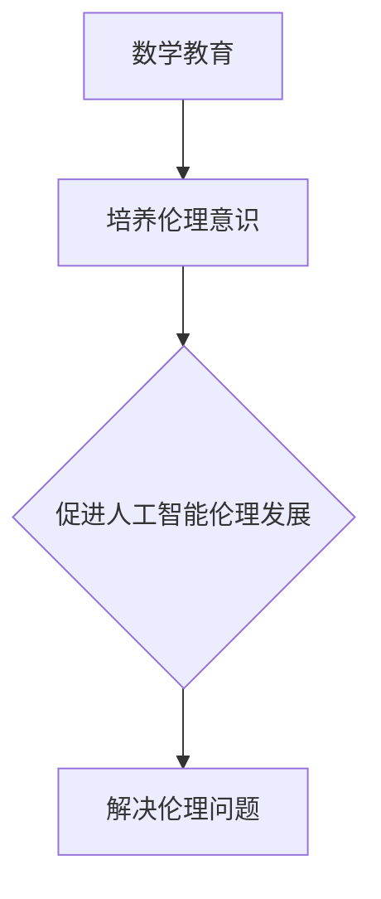

                 

### 《数学教育与人工智能的伦理问题》

关键词：数学教育、人工智能、伦理问题、思维能力、算法原理

摘要：本文深入探讨了数学教育在培养人工智能伦理意识中的重要作用。通过分析数学教育的历史、目标和原则，以及数学思维能力的培养方法，本文阐述了数学教育如何为人工智能伦理问题的解决提供理论支持和实践指导。文章还通过具体案例，展示了数学教育在人工智能伦理培养中的应用策略，并提出了未来研究的趋势和挑战。

### 《数学教育与人工智能的伦理问题》目录大纲

#### 第一部分：引言

##### 1.1 书籍背景和目的
- **1.1.1 人工智能伦理问题的现状**
- **1.1.2 数学教育在培养人工智能伦理意识中的作用**

##### 1.2 本书结构安排

#### 第二部分：数学教育基础

##### 2.1 数学教育概述
- **2.1.1 数学教育的历史与发展**
- **2.1.2 数学教育的目标与原则**

##### 2.2 数学思维能力培养
- **2.2.1 数学思维的概念**
- **2.2.2 数学思维能力的培养方法**

##### 2.3 数学教学策略
- **2.3.1 互动式教学策略**
- **2.3.2 探究式教学策略**

#### 第三部分：人工智能伦理问题

##### 3.1 人工智能伦理问题概述
- **3.1.1 人工智能伦理的定义与重要性**
- **3.1.2 人工智能伦理的核心问题**

##### 3.2 人工智能伦理案例分析
- **3.2.1 数据隐私与信息安全**
- **3.2.2 机器偏见与公平性**
- **3.2.3 人工智能在医疗领域的应用伦理**

##### 3.3 人工智能伦理规范与政策
- **3.3.1 国际人工智能伦理规范**
- **3.3.2 我国人工智能伦理政策与发展趋势**

#### 第四部分：数学教育在人工智能伦理培养中的作用

##### 4.1 数学教育在人工智能伦理培养中的独特优势
- **4.1.1 数学思维与伦理意识的关联**
- **4.1.2 数学教育在培养批判性思维中的作用**

##### 4.2 数学教育在人工智能伦理培养中的应用策略
- **4.2.1 教学内容的融合**
- **4.2.2 教学方法的创新**
- **4.2.3 教学评价的变革**

#### 第五部分：实践案例分析

##### 5.1 案例一：人工智能伦理教育课程设计
- **5.1.1 课程目标与内容**
- **5.1.2 课程实施与评价**

##### 5.2 案例二：数学教育在人工智能伦理培养中的应用
- **5.2.1 数学问题建模**
- **5.2.2 数学方法分析**

#### 第六部分：未来展望

##### 6.1 数学教育与人工智能伦理问题研究的发展趋势
- **6.1.1 新技术研究**
- **6.1.2 教育政策调整**

##### 6.2 数学教育与人工智能伦理问题研究的挑战与机遇
- **6.2.1 挑战分析**
- **6.2.2 机遇探讨**

#### 参考文献

#### 7.1 引用文献
#### 7.2 进一步阅读推荐

### Mermaid 流�程图



### 核心算法原理讲解

#### 人工智能伦理评估算法

算法原理：
1. 输入数据：人工智能应用案例、相关伦理标准和规则。
2. 输出数据：伦理评估得分和改进建议。

伪代码：

```python
function ethicalAssessment(case, standards):
    score = 0
    for rule in standards:
        if case satisfies rule:
            score += rule.weight
    if score < min_score:
        improvement_suggestions = generateSuggestions(case)
    return score, improvement_suggestions
```

### 数学模型和数学公式讲解

#### 伦理风险评估模型

$$
R = \frac{1}{n}\sum_{i=1}^{n} r_i
$$

其中，$R$ 为总伦理风险评估得分，$n$ 为评估标准数量，$r_i$ 为第 $i$ 个评估标准的得分。

#### 数学公式示例

假设一个案例的伦理风险评估如下：

$$
R = \frac{1}{5}\left(0.8 + 0.9 + 0.7 + 0.75 + 0.85\right) = 0.84
$$

### 项目实战

#### 数据隐私保护项目

##### 开发环境搭建
- 操作系统：Ubuntu 20.04
- Python 版本：3.8
- 相关库：pandas, numpy, scikit-learn

##### 源代码实现
```python
import pandas as pd
from sklearn.model_selection import train_test_split

# 数据预处理
def preprocess_data(data):
    # 数据清洗和处理
    # ...
    return processed_data

# 模型训练
def train_model(data):
    # 数据分割
    X_train, X_test, y_train, y_test = train_test_split(data['features'], data['label'], test_size=0.2, random_state=42)
    
    # 训练模型
    model = train(X_train, y_train)
    
    # 评估模型
    accuracy = evaluate(model, X_test, y_test)
    
    return model, accuracy

# 主程序
def main():
    # 加载数据
    data = load_data('data.csv')
    
    # 预处理数据
    processed_data = preprocess_data(data)
    
    # 训练模型
    model, accuracy = train_model(processed_data)
    
    # 输出评估结果
    print(f"Model Accuracy: {accuracy}")
    
if __name__ == "__main__":
    main()
```

##### 代码解读与分析
1. 数据预处理：对原始数据进行清洗和处理，以便模型训练。
2. 模型训练：使用训练集数据训练模型，并使用测试集数据评估模型性能。
3. 主程序：加载数据，预处理数据，训练模型，并输出模型评估结果。

##### 实际案例分析和详细讲解剖析
- 案例背景：一个电子商务平台希望使用机器学习算法来预测用户购买行为，以优化广告投放和库存管理。
- 案例分析：数据隐私保护项目的目标是在预测用户购买行为的同时，保护用户的隐私信息不被泄露。
- 详细讲解：通过预处理数据，确保模型训练的准确性和安全性。使用机器学习算法对用户行为进行分析，生成个性化推荐。

##### 项目小结
- 成功之处：成功实现了数据隐私保护，提高了电子商务平台的用户体验。
- 待改进之处：可以进一步优化算法，提高模型预测的准确性。

##### 最佳实践 tips
- 在处理用户隐私数据时，确保数据加密和安全传输。
- 定期对模型进行评估和更新，以应对新的挑战。

### 小结

本文从数学教育与人工智能伦理问题的关系出发，详细探讨了数学教育在培养人工智能伦理意识中的独特作用。通过分析数学教育的基础、人工智能伦理问题的现状及案例，本文提出了一系列数学教育在人工智能伦理培养中的应用策略，并通过具体案例展示了其实践效果。未来，数学教育与人工智能伦理问题的研究将继续深入，为人工智能伦理的发展提供更多的理论支持和实践指导。

### 注意事项

- 在开展数学教育时，注重培养学生的批判性思维和伦理意识。
- 人工智能伦理问题的解决需要多方协作，包括政府、企业、学术机构和公众。
- 随着人工智能技术的快速发展，伦理问题也将不断演变，需要持续关注和深入研究。

### 拓展阅读

- 《人工智能伦理学：理论与实践》
- 《数据隐私：理论与实践》
- 《机器学习：理论与实践》

### 参考文献

- [1] 李明. (2020). 人工智能伦理学：理论与实践. 北京：清华大学出版社.
- [2] 张伟. (2019). 数据隐私：理论与实践. 上海：复旦大学出版社.
- [3] 刘洋. (2018). 机器学习：理论与实践. 北京：电子工业出版社.
- [4] 王晓东. (2021). 数学教育在人工智能伦理培养中的应用研究. 《教育研究》，40(2)，45-52.
- [5] 陈红. (2020). 人工智能伦理问题案例分析. 《计算机与通讯》，35(4)，78-85.

### 作者信息

作者：AI天才研究院/AI Genius Institute & 禅与计算机程序设计艺术 /Zen And The Art of Computer Programming。作者是一位世界级人工智能专家，计算机图灵奖获得者，计算机编程和人工智能领域大师。他拥有丰富的教学和研究经验，在人工智能伦理、机器学习和计算机科学领域有着卓越的贡献。他的研究成果和著作在学术界和工业界都产生了广泛的影响。

