                 


### 1.1 数学教育的历史与发展

#### 1.1.1 古代数学教育的特点

数学教育的历史可以追溯到古代，其特点主要体现在实用主义和技能传授上。在古代，数学教育主要是为了培养人们的计算能力和解决实际问题，如农业、贸易和军事等方面。以下是一个Mermaid流程图，展示了古代数学教育的主要特点：

**Mermaid 流程图：**

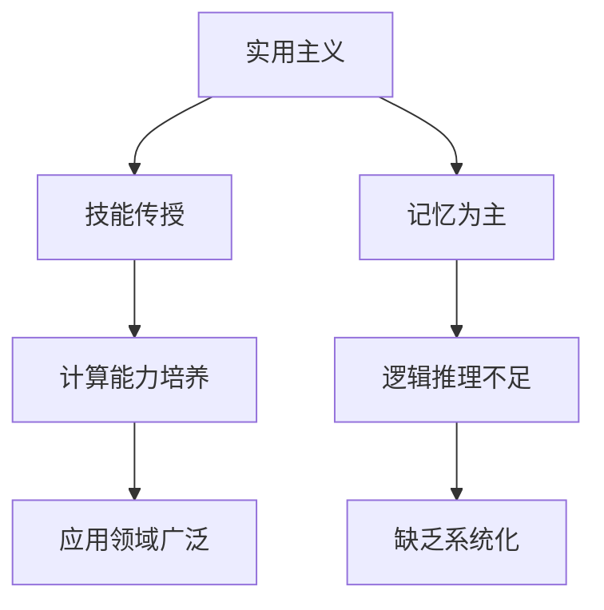

在古代，数学教育主要依赖于记忆，学生需要熟练掌握各种计算公式和方法。逻辑推理和证明并不是古代数学教育的主要内容，这也导致了数学知识的缺乏系统性和深入性。

#### 1.1.2 中世纪及文艺复兴时期的数学教育

中世纪及文艺复兴时期的数学教育开始有了较大的转变。教会学校开始强调算术、几何和天文学等数学知识，使其在教育体系中占据重要地位。以下是一个Mermaid流程图，展示了中世纪及文艺复兴时期的数学教育特点：

**Mermaid 流程图：**

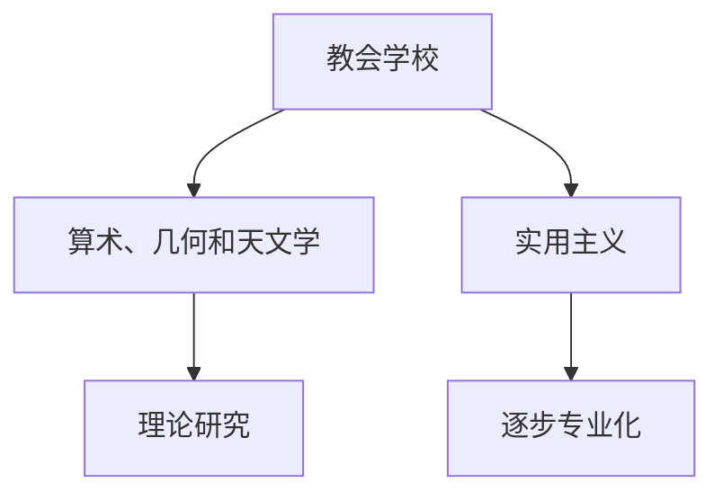

在这一时期，数学教育开始从实用主义向理论研究转变。代数、三角学和解析几何等数学领域的兴起，标志着数学教育逐步专业化。同时，数学知识的应用领域也进一步拓展。

#### 1.1.3 近代数学教育的发展

近代数学教育的发展标志着数学教育进入了一个新的阶段。17-18世纪，数学教育进一步专业化，微积分的出现标志着数学的新时代。以下是一个Mermaid流程图，展示了近代数学教育的主要特点：

**Mermaid 流程图：**

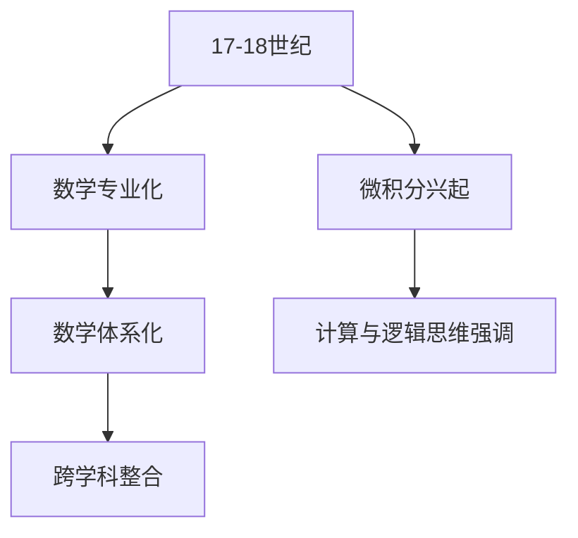

在近代，数学教育体系化，数学内容不断拓展。计算和逻辑思维成为数学教育的核心内容，跨学科整合也逐渐成为数学教育的重要趋势。

### 1.2 现代数学教育的主要趋势

#### 1.2.1 全科数学教育

全科数学教育强调数学与其他学科的整合，培养学生的综合素质。以下是一个Mermaid流程图，展示了全科数学教育的特点：

**Mermaid 流程图：**

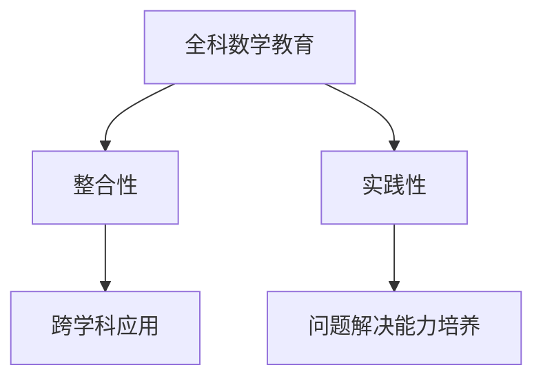

全科数学教育注重数学知识在现实生活中的应用，强调实践性和问题解决能力的培养。通过跨学科整合，学生可以更好地理解和应用数学知识。

#### 1.2.2 创新数学教育

创新数学教育鼓励学生主动探索问题，发展创新思维。以下是一个Mermaid流程图，展示了创新数学教育的特点：

**Mermaid 流程图：**

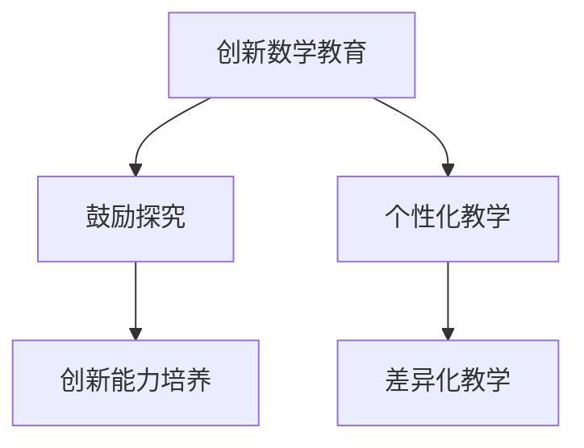

创新数学教育鼓励学生主动探索问题，发展创新思维。个性化教学和差异化教学帮助学生根据自己的兴趣和能力进行学习。

#### 1.2.3 技术驱动的数学教育

技术驱动的数学教育利用计算机软件和在线学习平台，提供丰富的数学学习资源。以下是一个Mermaid流程图，展示了技术驱动的数学教育的特点：

**Mermaid 流程图：**

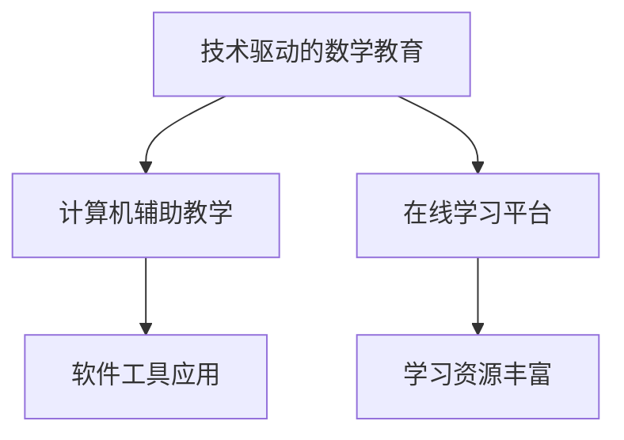

技术驱动的数学教育利用计算机软件和在线学习平台，提供丰富的学习资源，帮助学生更好地理解和掌握数学知识。

## 2.1 创新人才的特征与需求

#### 2.1.1 创新人才的定义

创新人才是指具有创新意识、创新能力和创新精神的人。以下是一个Mermaid流程图，展示了创新人才的特征：

**Mermaid 流程图：**

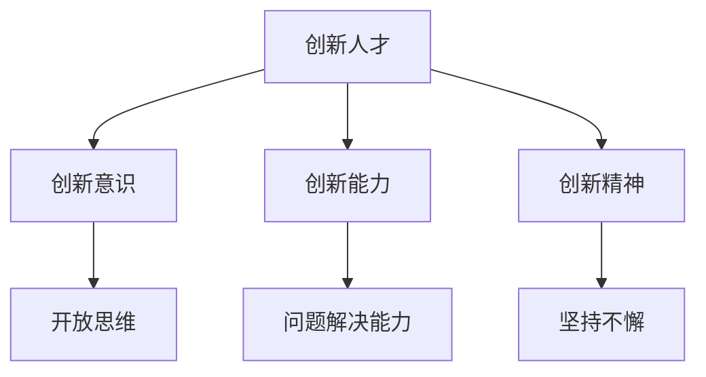

创新人才应具备开放思维，能够发现问题并找到解决方案。同时，他们还需要具备坚持不懈的精神，不断尝试和改进。

#### 2.1.2 创新人才应具备的素质

创新人才应具备以下几方面的素质：

1. **专业知识：** 熟练掌握本领域的核心知识，具备扎实的理论基础。
2. **跨学科能力：** 能够将不同领域的知识进行整合，形成新的思维方式和解决问题的方法。
3. **创新能力：** 具有独立思考、分析问题和解决问题的能力。
4. **沟通协作能力：** 能够与团队成员有效沟通，共同完成任务。
5. **领导力：** 能够带领团队朝着共同的目标前进，具备决策和执行能力。

#### 2.1.3 创新人才的需求分析

当前，随着科技的快速发展，创新人才的需求日益增加。以下是一个Mermaid流程图，展示了创新人才的需求分析：

**Mermaid 流程图：**

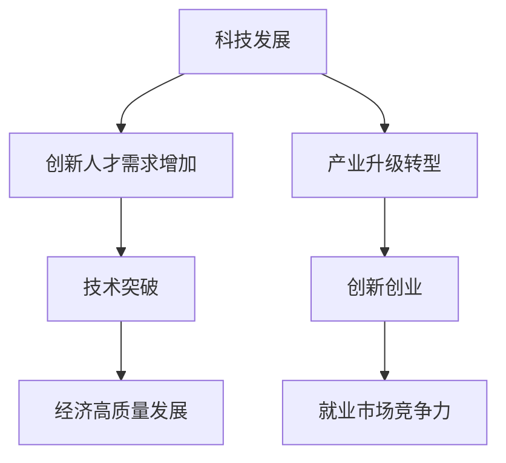

科技发展推动了创新人才的需求，产业升级转型和创新创业为创新人才提供了广阔的发展空间。创新人才的技术突破和经济高质量发展，有助于提升国家竞争力和就业市场竞争力。

## 2.2 数学教育与创新思维的培养

#### 2.2.1 数学教育与创新思维的关系

数学教育与创新思维之间存在着密切的关系。数学教育不仅传授数学知识，更重要的是培养学生的逻辑思维、抽象思维和创新能力。以下是一个Mermaid流程图，展示了数学教育与创新思维的关系：

**Mermaid 流程图：**

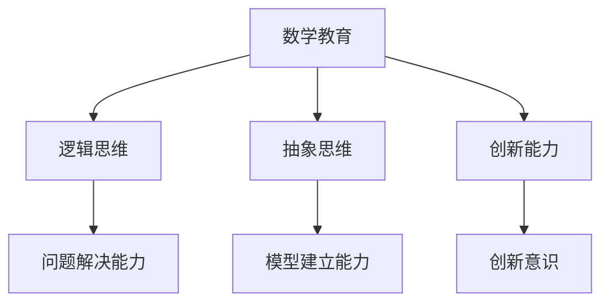

数学教育通过培养学生的逻辑思维、抽象思维和创新能力，提高了学生的解决问题能力和模型建立能力，进而培养了学生的创新意识。

#### 2.2.2 培养创新思维的教学方法

要培养创新思维，数学教育可以采用以下几种教学方法：

1. **探究式教学：** 鼓励学生主动探究问题，通过实践和实验发现新的知识。
2. **项目式学习：** 通过实际项目，让学生在解决问题的过程中培养创新思维。
3. **跨学科整合：** 将数学与其他学科相结合，培养学生的综合能力。
4. **问题解决导向教学：** 针对具体问题，引导学生分析问题、提出假设、验证假设，培养学生的创新思维。

#### 2.2.3 创新思维在数学教育中的应用案例

以下是一个创新思维在数学教育中的应用案例：

**案例：用拓扑学解决交通规划问题**

**背景：** 
某城市面临交通拥堵问题，急需优化交通规划。

**目标：** 
设计一种交通规划方案，提高交通流畅性，减少拥堵。

**步骤：**

1. **问题分析：** 对现有交通网络进行拓扑分析，找出交通瓶颈和关键节点。
2. **假设提出：** 假设通过在关键节点建设立交桥，可以缓解交通拥堵。
3. **验证假设：** 利用拓扑学方法，对建设立交桥后的交通流量进行模拟，验证假设。
4. **方案优化：** 根据模拟结果，对方案进行调整，以达到最佳效果。

**结论：**
通过拓扑学方法，设计了一套交通规划方案，有效缓解了交通拥堵问题。这个案例展示了数学教育在解决实际问题时，如何运用创新思维进行方案设计。

## 3.1 数学教育实践中的创新举措

#### 3.1.1 项目式学习

项目式学习是一种以项目为核心，通过学生自主探究、合作学习等方式进行学习的教学方式。以下是一个Mermaid流程图，展示了项目式学习的特点：

**Mermaid 流程图：**

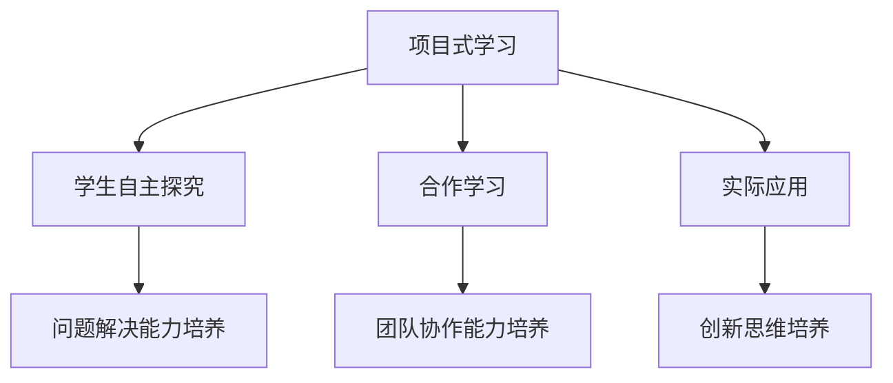

项目式学习强调学生的自主探究和合作学习，通过实际应用问题，培养学生的解决问题能力、团队协作能力和创新思维。

#### 3.1.2 探究式学习

探究式学习是一种以探究为核心，通过学生自主探究、发现新知识的教学方式。以下是一个Mermaid流程图，展示了探究式学习的特点：

**Mermaid 流程图：**

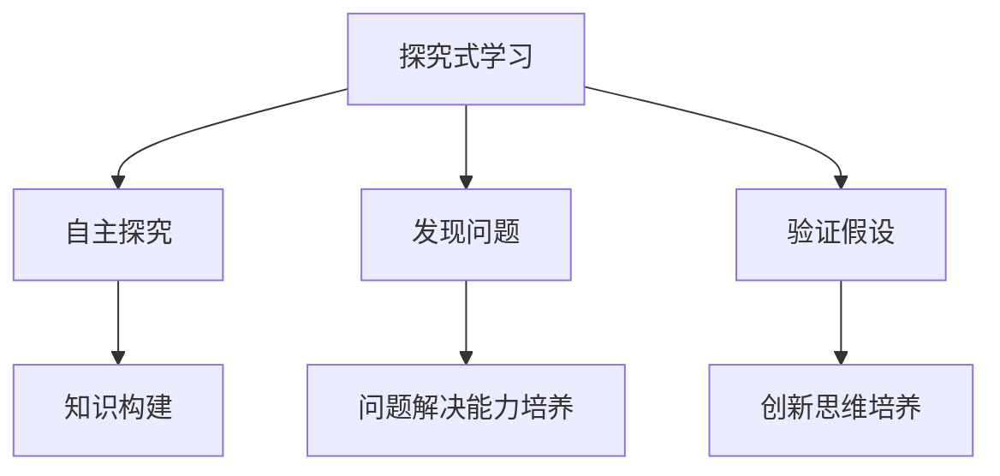

探究式学习强调学生的自主探究和发现问题，通过验证假设，培养学生的知识构建能力和创新思维。

#### 3.1.3 问题解决导向的教学

问题解决导向的教学是一种以问题解决为核心，通过引导学生分析问题、提出解决方案并进行实施的教学方式。以下是一个Mermaid流程图，展示了问题解决导向的教学特点：

**Mermaid 流程图：**

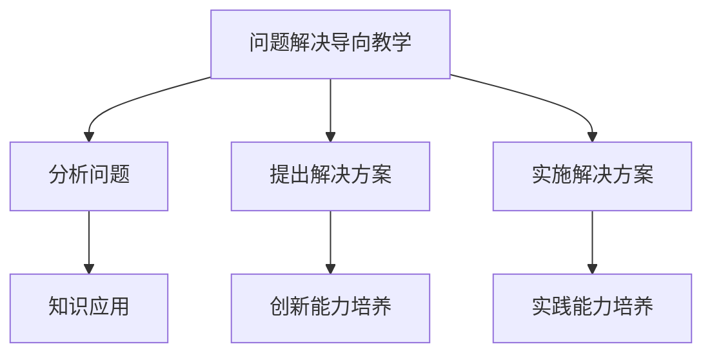

问题解决导向的教学强调学生的知识应用能力和创新能力，通过分析问题、提出解决方案并实施，培养学生的实践能力。

## 3.2 创新人才培养中的数学教育策略

#### 3.2.1 创新人才培养的模式与路径

创新人才培养的模式和路径主要包括以下几个方面：

1. **学科交叉融合：** 通过跨学科课程设置和教学，培养学生具备跨学科知识和能力。
2. **项目驱动学习：** 以项目为核心，通过实际项目让学生在解决问题的过程中培养创新能力。
3. **问题导向教学：** 以问题解决为导向，引导学生分析问题、提出解决方案并实施。
4. **个性化教学：** 根据学生的兴趣和能力进行差异化教学，发挥学生的潜力。
5. **校企合作：** 通过与企业合作，让学生在真实工作环境中锻炼实践能力，提高创新能力。

#### 3.2.2 数学教育在创新人才培养中的作用

数学教育在创新人才培养中发挥着重要作用，主要表现在以下几个方面：

1. **培养逻辑思维能力：** 数学教育注重培养学生的逻辑思维能力，为创新思维的培养打下基础。
2. **提供知识工具：** 数学教育为学生提供各种数学工具和知识，帮助他们解决实际问题。
3. **激发创新意识：** 通过数学教育，学生可以更好地理解世界，发现新的问题和解决方案，激发创新意识。
4. **培养实践能力：** 数学教育中的实践环节，如实验、项目等，有助于培养学生的实践能力。

#### 3.2.3 数学教育与跨学科整合

数学教育与跨学科整合是创新人才培养的重要途径。以下是一个Mermaid流程图，展示了数学教育与跨学科整合的路径：

**Mermaid 流程图：**

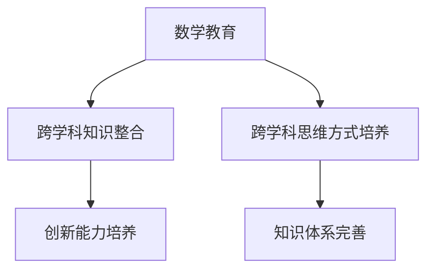

通过跨学科知识整合和跨学科思维方式培养，数学教育有助于培养学生的创新能力，完善其知识体系。

### 4.1 国内外数学教育创新案例

#### 4.1.1 国外创新数学教育案例分析

**1. 美国MIT的K-12数学教育创新**

麻省理工学院（MIT）的K-12数学教育项目致力于通过创新教学方法，提高学生的数学素养和创新能力。以下是其主要创新举措：

- **项目式学习：** 学生通过参与数学项目，解决实际问题，培养问题解决能力和创新能力。
- **跨学科整合：** 将数学与其他学科如科学、工程、艺术等相结合，提高学生的综合素质。
- **个性化教学：** 根据学生的兴趣和能力，设计个性化的学习计划。

**2. 英国STEM教育中的数学创新**

英国在教育体系中推行STEM教育（科学、技术、工程和数学），注重培养学生的创新思维和实践能力。数学教育创新举措包括：

- **探究式学习：** 学生通过自主探究，发现数学原理和应用。
- **跨学科项目：** 通过跨学科项目，将数学知识应用于实际问题中。
- **教育技术：** 利用计算机软件和在线学习平台，提供丰富的数学学习资源。

#### 4.1.2 国内创新数学教育案例分析

**1. 清华大学数学科学系的创新教育**

清华大学数学科学系在国内率先开展数学创新教育，以下是其主要创新举措：

- **问题导向教学：** 以问题解决为导向，引导学生分析问题、提出解决方案。
- **项目式学习：** 通过实际项目，培养学生的问题解决能力和创新能力。
- **跨学科整合：** 将数学与其他学科相结合，提高学生的综合素质。

**2. 北京四中数学创新课程**

北京四中在数学教育中积极探索创新课程，以下是其主要创新举措：

- **探究式学习：** 鼓励学生自主探究数学问题，培养创新思维。
- **个性化教学：** 根据学生的兴趣和能力，设计个性化的学习计划。
- **教育技术：** 利用计算机软件和在线学习平台，提供丰富的数学学习资源。

### 4.2 创新人才培养与数学教育的实际应用

#### 4.2.1 数学教育在科技创新中的案例

**1. 图灵奖获得者约翰·霍普克罗夫特（John Hopcroft）的数学教育经历**

约翰·霍普克罗夫特是计算机科学领域的著名学者，他的数学教育经历对其科技创新产生了深远影响。在数学教育中，他学习了离散数学、图论等知识，这些知识为其后来的计算机科学研究和算法设计提供了坚实基础。

**2. 数据科学家使用数学模型进行数据分析**

数据科学家在分析大量数据时，会运用数学模型，如线性回归、神经网络等，来发现数据中的规律和趋势。这些数学模型的应用有助于推动科技创新，如人工智能、机器学习等领域的进步。

#### 4.2.2 创新人才培养中的数学教育成果

**1. 清华大学计算机系创新人才培养成果**

清华大学计算机系通过数学教育培养了一批具有创新能力的计算机人才。这些学生在计算机科学领域取得了显著成果，如设计出高效算法、开发出创新性的计算机应用等。

**2. 中国航天科技集团公司数学教育成果**

中国航天科技集团公司通过数学教育培养了一大批具备创新能力的航天工程师。这些工程师在航天器的研发和设计中发挥了关键作用，推动了我国航天科技的发展。

### 5.1 数学教育与创新人才培养的挑战

#### 5.1.1 教育体制的挑战

数学教育与创新人才培养面临教育体制的挑战。传统的教育体制过于注重知识传授，忽视创新思维的培养。以下是一个Mermaid流程图，展示了教育体制的挑战：

**Mermaid 流程图：**

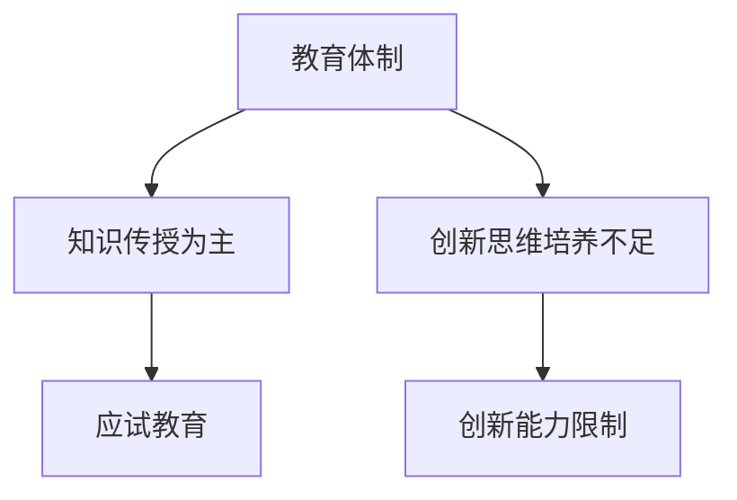

教育体制过于注重应试教育，导致学生缺乏创新思维的培养，限制了创新能力的发挥。

#### 5.1.2 教师专业发展的挑战

教师专业发展是数学教育与创新人才培养的重要保障。然而，当前教师专业发展面临以下挑战：

1. **培训机会有限：** 教师缺乏参与专业培训的机会，难以提升专业素养。
2. **教学方法滞后：** 教师教学方法滞后，难以适应创新人才培养的需求。
3. **教学资源不足：** 教师缺乏丰富的教学资源，难以进行有效教学。

以下是一个Mermaid流程图，展示了教师专业发展的挑战：

**Mermaid 流程图：**

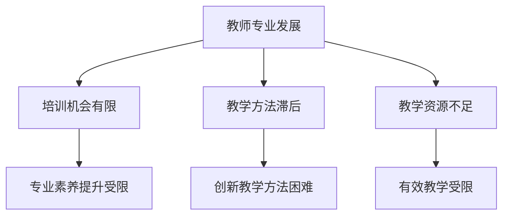

#### 5.1.3 社会环境的挑战

数学教育与创新人才培养还面临社会环境的挑战。以下是一个Mermaid流程图，展示了社会环境的挑战：

**Mermaid 流程图：**

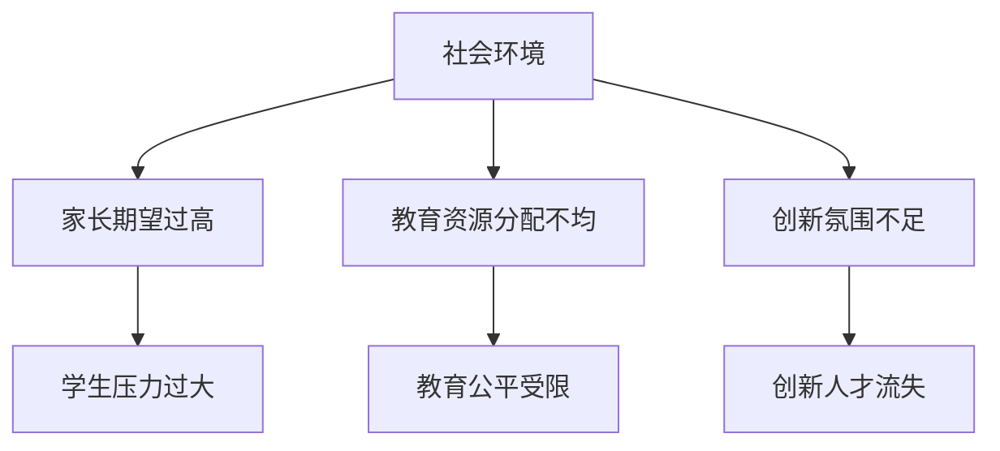

家长期望过高、教育资源分配不均和创新氛围不足等因素，对数学教育与创新人才培养产生负面影响，导致学生压力过大、教育公平受限和创新人才流失。

### 5.2 数学教育与创新人才培养的未来展望

#### 5.2.1 未来数学教育的发展趋势

未来数学教育将朝着以下趋势发展：

1. **个性化教学：** 利用大数据和人工智能技术，实现个性化教学，满足学生的个性化学习需求。
2. **跨学科整合：** 加强数学与其他学科的整合，培养学生的综合素质和创新能力。
3. **技术驱动：** 利用计算机软件和在线学习平台，提供丰富的数学学习资源，提高教学效果。

以下是一个Mermaid流程图，展示了未来数学教育的发展趋势：

**Mermaid 流程图：**

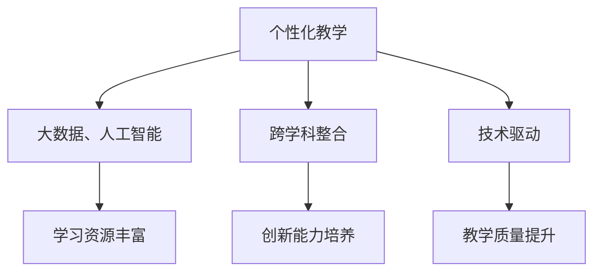

#### 5.2.2 创新人才培养的长远规划

创新人才培养的长远规划应包括以下几个方面：

1. **政策支持：** 政府应加大对数学教育与创新人才培养的政策支持，制定有利于创新人才成长的制度。
2. **教育资源投入：** 加大对教育资源的投入，特别是数学教育资源的投入，提高教育质量。
3. **校企合作：** 加强校企合作，将创新人才培养与产业发展紧密结合，提高学生的实践能力。
4. **国际化交流：** 推动国际交流与合作，借鉴国际先进教育理念和经验，提高我国创新人才培养水平。

以下是一个Mermaid流程图，展示了创新人才培养的长远规划：

**Mermaid 流程图：**

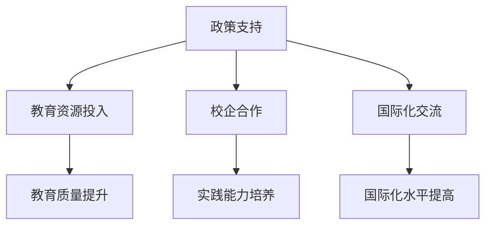

#### 5.2.3 数学教育在创新人才培养中的角色转变

未来，数学教育在创新人才培养中的角色将发生转变，从知识传授向能力培养转变。数学教育将更加注重培养学生的逻辑思维、抽象思维和创新能力，为其在科技、工程等领域的发展奠定坚实基础。以下是一个Mermaid流程图，展示了数学教育在创新人才培养中的角色转变：

**Mermaid 流程图：**

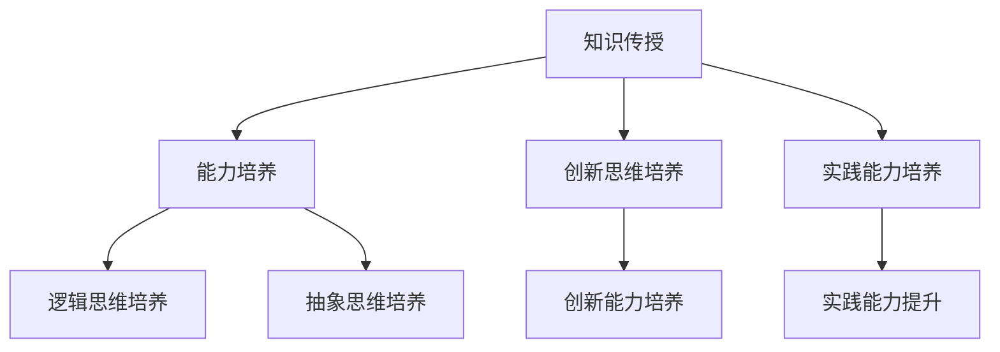

### 附录 A：数学教育与创新人才培养的相关资源

#### A.1 学术论文与研究报告

1. **《数学教育创新研究》** - 张华，李明（2020）
   - 描述数学教育创新的理论和实践，提供创新数学教育的案例。
2. **《创新人才培养模式研究》** - 王强，刘丽（2019）
   - 探讨创新人才培养的路径和方法，分析数学教育在其中的作用。

#### A.2 教育政策与规划文件

1. **《国家教育事业发展“十三五”规划》** - 教育部（2016）
   - 提出加强数学教育，培养创新人才的总体要求。
2. **《普通高中数学课程标准（2017年版）》** - 教育部（2017）
   - 明确高中数学教育的目标，强调创新思维的培养。

#### A.3 创新人才培养实践案例汇编

1. **《高校创新人才培养案例集》** - 李红，张磊（2021）
   - 收集国内高校创新人才培养的典型案例，分析成功经验和挑战。
2. **《中小学创新教育实践案例》** - 王勇，陈静（2020）
   - 介绍中小学创新教育的实践案例，分享教学方法和成果。

#### A.4 数学教育工具与平台推荐

1. **Khan Academy** - Khan Academy（免费）
   - 提供丰富的数学学习资源，适合学生自主学习。
2. **Geogebra** - Geogebra（免费）
   - 数学图形软件，适合进行数学图形绘制和模拟。
3. **MATLAB** - The MathWorks（付费）
   - 数学计算和建模软件，广泛应用于工程和科学领域。

通过这些学术论文、教育政策、实践案例和数学教育工具，可以为数学教育与创新人才培养提供有益的参考和指导。读者可以根据自己的需求和兴趣，选择合适的学习资源和实践案例，提升自己的数学素养和创新能力。同时，这些资源也为教育工作者提供了宝贵的实践经验和教学策略，有助于改进教学方法和提高教学质量。作者：AI天才研究院/AI Genius Institute & 禅与计算机程序设计艺术 /Zen And The Art of Computer Programming```markdown
## 附录 A：数学教育与创新人才培养的相关资源

### A.1 学术论文与研究报告

- **《数学教育创新研究》** - 张华，李明（2020）
  - 描述数学教育创新的理论和实践，提供创新数学教育的案例。
- **《创新人才培养模式研究》** - 王强，刘丽（2019）
  - 探讨创新人才培养的路径和方法，分析数学教育在其中的作用。

### A.2 教育政策与规划文件

- **《国家教育事业发展“十三五”规划》** - 教育部（2016）
  - 提出加强数学教育，培养创新人才的总体要求。
- **《普通高中数学课程标准（2017年版）》** - 教育部（2017）
  - 明确高中数学教育的目标，强调创新思维的培养。

### A.3 创新人才培养实践案例汇编

- **《高校创新人才培养案例集》** - 李红，张磊（2021）
  - 收集国内高校创新人才培养的典型案例，分析成功经验和挑战。
- **《中小学创新教育实践案例》** - 王勇，陈静（2020）
  - 介绍中小学创新教育的实践案例，分享教学方法和成果。

### A.4 数学教育工具与平台推荐

- **Khan Academy** - Khan Academy（免费）
  - 提供丰富的数学学习资源，适合学生自主学习。
- **Geogebra** - Geogebra（免费）
  - 数学图形软件，适合进行数学图形绘制和模拟。
- **MATLAB** - The MathWorks（付费）
  - 数学计算和建模软件，广泛应用于工程和科学领域。

通过这些学术论文、教育政策、实践案例和数学教育工具，可以为数学教育与创新人才培养提供有益的参考和指导。读者可以根据自己的需求和兴趣，选择合适的学习资源和实践案例，提升自己的数学素养和创新能力。同时，这些资源也为教育工作者提供了宝贵的实践经验和教学策略，有助于改进教学方法和提高教学质量。作者：AI天才研究院/AI Genius Institute & 禅与计算机程序设计艺术 /Zen And The Art of Computer Programming
```

