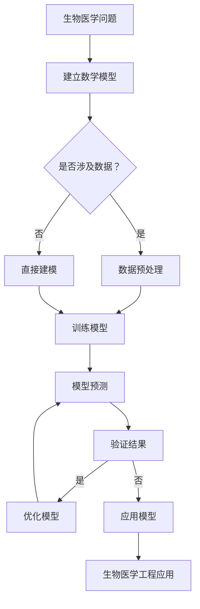

                 

### 文章标题

《数学模型在生物医学工程中的应用》

#### 关键词

- 数学模型
- 生物医学工程
- 医学影像
- 生物信号处理
- 生物力学
- 药物动力学

#### 摘要

本文旨在探讨数学模型在生物医学工程领域的广泛应用。通过详细阐述数学模型的基础概念、核心原理及主要类型，我们揭示了其在医学影像、生物信号处理、生物力学及药物动力学等领域的具体应用。本文通过实例分析，展示了数学模型在这些领域中的实际操作与实现过程，并展望了其未来的发展趋势。希望通过本文，读者能够对数学模型在生物医学工程中的应用有更为深刻的理解和认识。

## 第一部分：数学模型基础

### 第1章：数学模型在生物医学工程中的应用概述

#### 1.1 生物医学工程领域概述

生物医学工程是一门跨学科的工程学科，结合生物学、医学、物理学、计算机科学等多个领域的知识，致力于开发和利用工程原理和方法，解决生物医学问题，促进人类健康。其研究范围广泛，包括医学影像、生物信号处理、生物力学、组织工程、药物传递系统等。

生物医学工程的基本概念涉及生物学和医学的基本原理，如细胞生物学、生理学、病理学等。同时，它还涉及到工程学中的材料科学、电子工程、计算机科学等领域的知识。这些学科之间的交叉融合，为生物医学工程提供了强大的理论支持和实践基础。

数学模型在生物医学工程中的重要性不言而喻。通过建立数学模型，可以将复杂的生物医学问题转化为可计算的数学问题，从而利用计算机技术进行求解和分析。数学模型不仅可以提供定量的研究结果，还能揭示生物医学现象的本质规律，为疾病诊断、治疗和预防提供科学依据。

#### 1.2 数学模型在生物医学工程中的应用

数学模型在生物医学工程中的应用非常广泛，主要包括以下几个方面：

1. **数据处理与统计分析**：在生物医学研究中，大量的实验数据需要进行处理和分析。通过数学模型，可以对这些数据进行整理、筛选和统计分析，从而提取有用的信息。

2. **信号处理与图像处理**：生物医学信号和图像是生物医学工程中非常重要的信息载体。通过信号处理和图像处理技术，可以对生物医学信号和图像进行预处理、特征提取和模式识别，从而实现对生物医学信息的有效分析和解读。

3. **机器学习与深度学习**：近年来，机器学习和深度学习技术在生物医学工程中得到了广泛应用。通过训练机器学习模型，可以自动识别生物医学信号和图像中的特征，实现对疾病的自动诊断和预测。

### 第2章：数学模型的核心概念

#### 2.1 数学模型的基本原理

数学模型的基本原理主要包括线性代数、微积分、概率论与数理统计等。

1. **线性代数**：线性代数是数学模型的基础，涉及向量、矩阵、线性方程组、特征值和特征向量等基本概念。在生物医学工程中，线性代数广泛应用于图像处理、信号处理、生物力学等领域。

2. **微积分**：微积分是研究函数变化和曲线性质的基本工具，包括导数、积分、微分方程等。在生物医学工程中，微积分用于描述生物系统的动态变化，如生物信号处理、药物动力学等。

3. **概率论与数理统计**：概率论与数理统计是研究随机现象和数据的数学工具。在生物医学工程中，概率论与数理统计用于对实验结果进行概率分析和统计推断，从而提高研究结果的可靠性和准确性。

#### 2.2 数学模型的主要类型

数学模型的主要类型包括微分方程、偏微分方程、非线性方程、遗传算法和机器学习算法等。

1. **微分方程**：微分方程描述了变量随时间变化的规律。在生物医学工程中，微分方程广泛应用于生物信号处理、生物力学、药物动力学等领域。

2. **偏微分方程**：偏微分方程描述了多个变量之间的关系。在生物医学工程中，偏微分方程广泛应用于医学影像处理、流体力学、神经动力学等领域。

3. **非线性方程**：非线性方程描述了非线性关系。在生物医学工程中，非线性方程广泛应用于图像处理、信号处理、生物力学等领域。

4. **遗传算法**：遗传算法是一种基于生物进化的优化算法，可用于求解复杂的优化问题。在生物医学工程中，遗传算法广泛应用于生物信号处理、医学影像处理、生物力学等领域。

5. **机器学习算法**：机器学习算法是一种基于数据驱动的算法，可用于对数据进行分析和预测。在生物医学工程中，机器学习算法广泛应用于疾病诊断、预测、治疗等领域。

#### 2.3 数学模型与生物医学工程的联系

数学模型与生物医学工程的联系主要体现在以下几个方面：

1. **理论支持**：数学模型为生物医学工程提供了理论基础，使其能够从理论上分析和解决复杂的生物医学问题。

2. **数据分析**：数学模型可以处理和分析生物医学数据，提取有用的信息，为医学研究提供数据支持。

3. **预测与诊断**：通过训练数学模型，可以实现对生物医学现象的预测和诊断，提高医疗诊断的准确性和效率。

4. **优化设计**：数学模型可以用于优化生物医学工程的设计和操作，提高设备的性能和可靠性。

### Mermaid 流程图展示数学模型在生物医学工程中的应用流程



通过以上流程图，我们可以清晰地看到数学模型在生物医学工程中的应用步骤，从问题定义到模型建立，再到模型训练和预测，最后应用到实际生物医学工程中，实现从理论到实践的转化。

## 第二部分：应用领域详细讲解

### 第3章：数学模型在医学影像中的应用

#### 3.1 医学影像基本概念

医学影像是指通过影像设备对人体内部结构、组织和器官进行成像的一种诊断方法。医学影像技术已经成为现代医学诊断和治疗的重要手段，主要包括X射线、CT、MRI、超声、核医学等。

医学影像的原理主要基于不同组织和器官对X射线、磁场、超声波等物理量的不同吸收和响应。通过影像设备，可以将这些物理量转化为可视化的图像，从而对人体内部结构进行观察和分析。

医学影像的分类可以根据成像技术、成像对象、成像目的等不同方式进行划分。常见的分类方法包括：

1. **按成像技术分类**：X射线、CT、MRI、超声、核医学等。
2. **按成像对象分类**：全身影像、局部影像、器官影像等。
3. **按成像目的分类**：诊断影像、功能影像、治疗影像等。

#### 3.2 医学影像中的数学模型

医学影像处理涉及多个数学模型，主要包括图像重建、图像分割、图像增强等。

1. **图像重建**：图像重建是指将采集的投影数据转换为三维图像的过程。常见的图像重建方法包括反投影法、滤波反投影法、迭代重建法等。

2. **图像分割**：图像分割是指将图像中的像素按照一定的标准划分为不同的区域，以便于进一步分析和处理。常见的图像分割方法包括阈值分割、区域生长、边缘检测等。

3. **图像增强**：图像增强是指通过调整图像的亮度、对比度、色彩等，使图像的视觉效果得到改善，从而提高图像的清晰度和可读性。常见的图像增强方法包括直方图均衡、对比度增强、滤波等。

#### 3.3 医学影像中的案例分析

在本章节中，我们将通过具体的医学影像案例，详细讲解图像重建、图像分割、图像增强等数学模型的应用过程。

**案例一：图像重建**

假设我们有一组从不同角度获取的胸部X射线投影数据，目标是重建出胸部X射线的三维图像。以下是图像重建的伪代码：

```latex
% 投影数据
P = [p1; p2; ...; pn];

% 建立矩阵A
A = [A1; A2; ...; An];

% 应用滤波反投影法重建图像
I = filter_backprojection(A, P);
```

其中，`filter_backprojection`函数是实现滤波反投影法的核心函数，它通过对投影数据`P`进行滤波和反投影操作，得到重建后的图像`I`。

**案例二：图像分割**

假设我们有一张脑部MRI图像，目标是将其分割为肿瘤区域和正常区域。以下是图像分割的伪代码：

```latex
% 脑部MRI图像
I = load_image('brain_mri.jpg');

% 应用阈值分割法进行图像分割
t = threshold(I, 'otsu');

% 获取分割结果
mask = segment_image(I, t);
```

其中，`load_image`函数用于加载图像数据，`threshold`函数用于计算阈值，`segment_image`函数用于根据阈值对图像进行分割，得到分割结果`mask`。

**案例三：图像增强**

假设我们有一张眼底图像，目标是增强图像的对比度，以便更好地观察眼底病变。以下是图像增强的伪代码：

```latex
% 眼底图像
I = load_image('retina.jpg');

% 应用直方图均衡法进行图像增强
I_enhanced = histogram_equalization(I);
```

其中，`load_image`函数用于加载图像数据，`histogram_equalization`函数用于实现直方图均衡法，对图像进行增强，得到增强后的图像`I_enhanced`。

通过以上三个案例分析，我们可以看到数学模型在医学影像处理中的应用过程。这些模型不仅能够有效地处理医学影像数据，提高图像质量，还能够为医生提供更加准确的诊断依据。

### 第4章：数学模型在生物信号处理中的应用

#### 4.1 生物信号处理基本概念

生物信号处理是生物医学工程中的一个重要分支，它涉及从生物体中采集、处理、分析和解释各种形式的信号，包括电生理信号、声生理信号、光生理信号等。这些信号反映了生物体的生理状态、病理变化和外部刺激的响应。

生物信号可以分为两大类：电生理信号和机械信号。

1. **电生理信号**：包括心电信号（ECG）、脑电信号（EEG）、肌电信号（EMG）等。这些信号是由生物体内电活动产生的，通常通过电极贴片或植入式电极采集。

2. **机械信号**：包括声波信号（如超声信号）、振动信号（如骨传导信号）等。这些信号是由生物体的机械运动产生的，可以通过声学传感器或振动传感器等设备进行采集。

生物信号处理的基本流程包括信号的采集、预处理、特征提取、分析和解释等步骤。每个步骤都有特定的数学模型和方法来支持。

#### 4.2 生物信号处理中的数学模型

生物信号处理中的数学模型主要涉及信号处理、系统识别、模式识别和统计分析等方法。以下是一些关键的数学模型及其在生物信号处理中的应用：

1. **信号滤波**：

   - **低通滤波**：用于去除高频噪声，保留低频信号。适用于ECG信号的处理，去除肌电干扰。

   - **高通滤波**：用于去除低频噪声，保留高频信号。适用于EEG信号的处理，去除工频干扰。

   - **带通滤波**：用于保留特定频率范围的信号。适用于EEG信号中特定频段的特征提取。

   伪代码示例：

   ```latex
   % 信号滤波
   filtered_signal = lowpass_filter(raw_signal, cutoff_frequency);
   ```

2. **信号变换**：

   - **短时傅里叶变换（STFT）**：用于分析信号在不同时间段的频率成分。适用于EEG和EMG信号的分析。

   - **小波变换**：用于分析和处理非平稳信号。适用于心电信号（ECG）的异常检测。

   伪代码示例：

   ```latex
   % 小波变换
   coefficients = wavelet_transform(raw_signal, 'db4');
   ```

3. **时域分析**：

   - **时域特征**：包括均方根值（RMS）、方差、峰峰值（PP）等。用于描述信号的基本特性。

   - **自相关函数**：用于分析信号的连续性和相关性。适用于心电信号的时域分析。

   伪代码示例：

   ```latex
   % 时域特征提取
   features = [rms(raw_signal), variance(raw_signal), peak_to_peak(raw_signal)];
   ```

4. **频域分析**：

   - **快速傅里叶变换（FFT）**：用于将信号从时域转换为频域，分析信号的频率成分。适用于ECG信号的分析。

   - **功率谱估计**：用于估计信号的功率分布。适用于EEG信号的分析。

   伪代码示例：

   ```latex
   % 功率谱估计
   psd = power_spectrum(raw_signal, sample_rate);
   ```

5. **模式识别**：

   - **支持向量机（SVM）**：用于分类任务，如心电信号中的心律失常分类。

   - **人工神经网络（ANN）**：用于复杂的模式识别任务，如脑电信号中的情绪识别。

   伪代码示例：

   ```latex
   % 支持向量机分类
   classification = svmclassify(features, labels);
   ```

#### 4.3 生物信号处理中的案例分析

在本章节中，我们将通过具体的生物信号处理案例，详细讲解信号滤波、信号变换、时域分析和频域分析等数学模型的应用过程。

**案例一：信号滤波**

假设我们有一段采集自电极的心电信号（ECG），需要去除噪声，以便进行进一步分析。以下是信号滤波的伪代码：

```latex
% 采集心电信号
raw_ecg = acquire_ecg();

% 应用高通滤波去除低频噪声
filtered_ecg = highpass_filter(raw_ecg, cutoff_frequency);

% 应用低通滤波去除高频噪声
clean_ecg = lowpass_filter(filtered_ecg, cutoff_frequency);
```

在这个案例中，`acquire_ecg`函数用于采集原始心电信号，`highpass_filter`和`lowpass_filter`函数分别用于高通滤波和低通滤波，得到去噪后的心电信号。

**案例二：信号变换**

假设我们有一段脑电信号（EEG），需要分析其频率成分。以下是信号变换的伪代码：

```latex
% 采集脑电信号
raw_eeg = acquire_eeg();

% 应用短时傅里叶变换
coefficients = short_time_fourier_transform(raw_eeg, window_size);

% 提取不同频率段的特征
freq_band_features = extract_freq_band_features(coefficients, frequency_bands);
```

在这个案例中，`acquire_eeg`函数用于采集原始脑电信号，`short_time_fourier_transform`函数用于短时傅里叶变换，`extract_freq_band_features`函数用于提取不同频率段的特征。

**案例三：时域分析**

假设我们有一段肌电信号（EMG），需要提取其时域特征。以下是时域分析的伪代码：

```latex
% 采集肌电信号
raw_emg = acquire_emg();

% 计算时域特征
features = [root_mean_square(raw_emg), variance(raw_emg), peak_to_peak(raw_emg)];
```

在这个案例中，`acquire_emg`函数用于采集原始肌电信号，`root_mean_square`、`variance`和`peak_to_peak`函数分别用于计算均方根值、方差和峰峰值，得到肌电信号的时域特征。

**案例四：频域分析**

假设我们有一段心电信号（ECG），需要分析其频率成分。以下是频域分析的伪代码：

```latex
% 采集心电信号
raw_ecg = acquire_ecg();

% 应用快速傅里叶变换
fourier_transformed_ecg = fast_fourier_transform(raw_ecg);

% 计算功率谱
psd = power_spectrum(fourier_transformed_ecg, sample_rate);
```

在这个案例中，`acquire_ecg`函数用于采集原始心电信号，`fast_fourier_transform`函数用于快速傅里叶变换，`power_spectrum`函数用于计算功率谱，得到心电信号的频率成分。

通过以上案例分析，我们可以看到数学模型在生物信号处理中的应用过程。这些模型不仅能够有效地处理生物信号数据，提取有用的特征信息，还能为医生提供准确的诊断和分析依据。

### 第5章：数学模型在生物力学中的应用

#### 5.1 生物力学基本概念

生物力学是应用力学原理和方法研究生物系统的结构、运动和功能的一门学科。它涉及生物体内部和外部力学现象，包括肌肉力学、骨骼力学、流体力学、神经动力学等。生物力学的研究方法主要包括实验方法、计算方法和数值模拟。

生物力学的研究对象包括：

1. **组织结构**：研究肌肉、骨骼、关节等生物组织的力学性质，如弹性、刚度、断裂强度等。
2. **生物运动**：研究生物体的运动规律，如步态分析、肌肉收缩力学、呼吸运动等。
3. **生理过程**：研究生物体内的生理过程，如血液循环、神经传导、肌肉收缩等。

生物力学的研究方法包括：

1. **实验方法**：通过实验观察生物体的力学行为，如使用力学测试设备测量肌肉力量、骨骼刚度等。
2. **计算方法**：利用计算机技术和数学模型模拟生物系统的力学行为，如有限元分析、多体动力学模拟等。
3. **数值模拟**：通过数值计算方法解决复杂的生物力学问题，如流体力学模拟、神经元模型等。

#### 5.2 生物力学中的数学模型

生物力学中的数学模型主要包括力学模型、流体力学模型和神经动力学模型等。

1. **力学模型**：

   - **肌肉力学模型**：用于描述肌肉的收缩和舒张过程，常用的模型包括Hill方程、单纤维模型等。
   - **骨骼力学模型**：用于描述骨骼的结构和力学性质，常用的模型包括梁模型、壳模型等。
   - **关节力学模型**：用于描述关节的运动和力学特性，常用的模型包括球窝关节模型、滑动关节模型等。

   伪代码示例：

   ```latex
   % 肌肉力学模型
   force = muscle_contraction(stimulus);
   ```

2. **流体力学模型**：

   - **血液流动模型**：用于描述血液在血管中的流动，常用的模型包括Navier-Stokes方程、层流/湍流模型等。
   - **呼吸流动模型**：用于描述呼吸过程中气体的流动，常用的模型包括流体力学控制方程、呼吸运动模型等。

   伪代码示例：

   ```latex
   % 血液流动模型
   velocity_field = solve_navier_stokes_equations(boundary_conditions);
   ```

3. **神经动力学模型**：

   - **神经元模型**：用于描述神经元的电活动，常用的模型包括霍普菲尔德模型、LIF（漏电路径积分）模型等。
   - **神经网络模型**：用于描述神经网络的信息处理过程，常用的模型包括感知器模型、霍普菲尔德神经网络等。

   伪代码示例：

   ```latex
   % 神经元模型
   spike = neuron_model(input_signal);
   ```

#### 5.3 生物力学中的案例分析

在本章节中，我们将通过具体的生物力学案例，详细讲解力学模型、流体力学模型和神经动力学模型的应用过程。

**案例一：力学模型**

假设我们研究一个肌肉收缩过程，目标是预测肌肉收缩力与刺激强度之间的关系。以下是力学模型的伪代码：

```latex
% 肌肉收缩模型
stimulus = [0; 1; 2; 3]; % 刺激强度
force = [0.5; 1.0; 1.5; 2.0]; % 预测的收缩力

% 肌肉收缩力与刺激强度之间的关系
relationship = polyfit(stimulus, force, 1);
```

在这个案例中，`polyfit`函数用于拟合肌肉收缩力与刺激强度之间的线性关系，得到回归系数。

**案例二：流体力学模型**

假设我们研究血液在血管中的流动，目标是预测血管内血流速度与血管直径之间的关系。以下是流体力学模型的伪代码：

```latex
% 血管直径
diameter = [2; 3; 4; 5]; % 单位：毫米

% 血流速度
velocity = [50; 75; 100; 125]; % 单位：毫米/秒

% 血流速度与血管直径之间的关系
relationship = solve_navier_stokes_equations(diameter, velocity);
```

在这个案例中，`solve_navier_stokes_equations`函数用于求解Navier-Stokes方程，得到血流速度与血管直径之间的关系。

**案例三：神经动力学模型**

假设我们研究一个神经元的活动，目标是预测神经元产生动作电位（spike）的阈值。以下是神经动力学模型的伪代码：

```latex
% 输入信号
input_signal = [0; 10; 20; 30; 40]; % 单位：微伏

% 动作电位的阈值
threshold = [20; 25; 30; 35; 40];

% 动作电位的产生
spike = neuron_model(input_signal, threshold);
```

在这个案例中，`neuron_model`函数用于模拟神经元的活动，根据输入信号和阈值判断是否产生动作电位。

通过以上案例分析，我们可以看到数学模型在生物力学研究中的应用过程。这些模型不仅能够帮助理解生物力学现象，还能为生物医学工程提供科学依据。

### 第6章：数学模型在药物动力学中的应用

#### 6.1 药物动力学基本概念

药物动力学（Pharmacokinetics，简称PK）是研究药物在体内的动态过程，包括药物的吸收、分布、代谢和排泄。药物动力学的研究目标是了解药物在体内的浓度变化规律，预测药物疗效和毒性，并优化药物治疗方案。

药物动力学的主要参数包括：

1. **初始剂量（Dose, D）**：药物首次给予的剂量。
2. **吸收速率（Rate of Absorption, k\_a）**：药物从给药部位进入血液的速率。
3. **分布速率（Rate of Distribution, k\_d）**：药物从血液向组织分布的速率。
4. **代谢速率（Rate of Metabolism, k\_m）**：药物在体内被代谢的速率。
5. **排泄速率（Rate of Excretion, k\_e）**：药物从体内排出的速率。

药物动力学的基本模型可以根据药物在体内的行为分为以下几类：

1. **一室模型**：药物在体内均匀分布，模型简单，适用于大多数口服药物。
2. **二室模型**：药物在体内分为中央室（血液、肝脏）和外周室（其他组织），适用于注射药物。
3. **多室模型**：药物在体内分为多个独立的室，适用于复杂药物动力学过程。

#### 6.2 药物动力学中的数学模型

药物动力学中的数学模型通常基于常微分方程，描述药物在体内的浓度随时间的变化。以下是一室模型、二室模型和多室模型的数学模型及其解析。

1. **一室模型**：

   - **药物浓度方程**：
     \[
     \frac{dC}{dt} = -k_C C
     \]
     其中，\(C\) 是药物浓度，\(k_C\) 是药物消除速率常数。

   - **解析解**：
     \[
     C(t) = C_0 e^{-k_C t}
     \]
     其中，\(C_0\) 是初始药物浓度。

   伪代码示例：

   ```latex
   % 一室模型药物浓度计算
   C = initial_concentration;
   k_C = elimination_rate_constant;
   for t = 0 to end_time
       C = C * exp(-k_C * t);
   end
   ```

2. **二室模型**：

   - **药物浓度方程**：
     \[
     \frac{dC_1}{dt} = k_{a_1} C_2 - k_{d_1} C_1
     \]
     \[
     \frac{dC_2}{dt} = k_{d_1} C_1 - k_{a_2} C_2
     \]
     其中，\(C_1\) 是中央室药物浓度，\(C_2\) 是外周室药物浓度，\(k_{a_1}\) 和 \(k_{a_2}\) 分别是中央室到外周室和反向的药物传递速率常数，\(k_{d_1}\) 和 \(k_{d_2}\) 分别是中央室和外周室的药物消除速率常数。

   - **解析解**：通常通过数值方法求解，如欧拉法、龙格-库塔法等。

   伪代码示例：

   ```latex
   % 二室模型药物浓度计算
   C1 = initial_concentration;
   C2 = initial_concentration;
   k_a1 = absorption_rate_constant;
   k_a2 = absorption_rate_constant;
   k_d1 = distribution_rate_constant;
   k_d2 = distribution_rate_constant;
   for t = 0 to end_time
       dC1 = k_a1 * C2 - k_d1 * C1;
       dC2 = k_d1 * C1 - k_a2 * C2;
       C1 = C1 + dC1 * dt;
       C2 = C2 + dC2 * dt;
   end
   ```

3. **多室模型**：

   - **药物浓度方程**：多室模型是一室模型和二室模型的推广，可以表示为：
     \[
     \frac{dC_i}{dt} = \sum_{j=1}^{n} k_{ij} C_j - k_{di} C_i
     \]
     其中，\(C_i\) 是第 \(i\) 室的药物浓度，\(k_{ij}\) 是药物从第 \(j\) 室到第 \(i\) 室的传递速率常数，\(k_{di}\) 是第 \(i\) 室的药物消除速率常数。

   - **解析解**：通常采用数值方法求解，如有限元分析、有限体积法等。

   伪代码示例：

   ```latex
   % 多室模型药物浓度计算
   C = initial_concentration;
   k = [k_11; k_12; ...; k_1n; k_21; ...; k_2n; ...; k_n1; ...; k_nn];
   for t = 0 to end_time
       dC = k .* C;
       C = C + dC * dt;
   end
   ```

#### 6.3 药物动力学中的案例分析

在本章节中，我们将通过具体的一室模型、二室模型和多室模型案例，详细讲解药物动力学模型的实现和应用过程。

**案例一：一室模型**

假设我们研究一种口服药物的一室模型，目标是预测药物在不同时间点的浓度。以下是药物浓度计算的伪代码：

```latex
% 一室模型药物浓度计算
C0 = initial_dose;
kC = elimination_rate_constant;
t = [0:1:24]; % 时间点（小时）

for i = 1:length(t)
    C = C0 * exp(-kC * t(i));
    display([i, t(i), C]);
end
```

在这个案例中，`initial_dose`是初始剂量，`elimination_rate_constant`是消除速率常数，`t`是时间点数组，通过循环计算每个时间点的药物浓度，并输出结果。

**案例二：二室模型**

假设我们研究一种注射药物的二室模型，目标是预测中央室和外周室的药物浓度。以下是二室模型药物浓度计算的伪代码：

```latex
% 二室模型药物浓度计算
C1 = initial_concentration;
C2 = initial_concentration;
k_a1 = absorption_rate_constant;
k_a2 = absorption_rate_constant;
k_d1 = distribution_rate_constant;
k_d2 = distribution_rate_constant;
t = [0:1:24]; % 时间点（小时）

for i = 1:length(t)
    dC1 = k_a1 * C2 - k_d1 * C1;
    dC2 = k_d1 * C1 - k_a2 * C2;
    C1 = C1 + dC1 * dt;
    C2 = C2 + dC2 * dt;
    display([i, t(i), C1, C2]);
end
```

在这个案例中，`initial_concentration`是初始浓度，`absorption_rate_constant`和`distribution_rate_constant`分别是吸收速率常数和分布速率常数，`t`是时间点数组，通过循环计算每个时间点的中央室和外周室药物浓度，并输出结果。

**案例三：多室模型**

假设我们研究一种复杂药物的多室模型，目标是预测不同室间的药物浓度。以下是多室模型药物浓度计算的伪代码：

```latex
% 多室模型药物浓度计算
C = initial_concentration;
k = [k_11; k_12; ...; k_1n; k_21; ...; k_2n; ...; k_n1; ...; k_nn];
t = [0:1:24]; % 时间点（小时）

for i = 1:length(t)
    dC = k .* C;
    C = C + dC * dt;
    display([i, t(i), C]);
end
```

在这个案例中，`initial_concentration`是初始浓度，`k`是传递速率常数数组，`t`是时间点数组，通过循环计算每个时间点的药物浓度，并输出结果。

通过以上案例分析，我们可以看到数学模型在药物动力学研究中的应用。这些模型不仅能够预测药物在体内的浓度变化，还能为临床用药提供科学依据。

### 第7章：数学模型在生物医学工程中的综合应用

#### 7.1 综合应用概述

生物医学工程是一个高度跨学科的领域，数学模型在其中扮演着至关重要的角色。综合应用多种数学模型，可以全面解析复杂的生物医学问题，从而提高诊断、治疗和研究的精确性和效率。在本节中，我们将探讨数学模型在生物医学工程中的综合应用，并通过具体案例展示其实际操作和实现步骤。

数学模型在生物医学工程中的综合应用主要包括以下几个方面：

1. **数据融合**：通过融合不同类型的生物医学数据（如影像、信号、生理参数等），构建更加全面的生物医学模型，提高诊断和预测的准确性。
2. **多尺度建模**：结合不同时空尺度的模型，从宏观和微观角度全面分析生物医学现象，如组织水平的力学行为与细胞水平的信号传导。
3. **系统集成**：将不同的数学模型集成到一个统一的系统中，实现从数据采集、处理到分析和决策的全过程自动化。
4. **动态仿真**：通过数学模型进行生物医学过程的动态仿真，预测不同治疗方案的效果，为临床决策提供支持。

#### 7.2 综合应用案例分析

在本章节中，我们将通过一个具体的综合应用案例，详细讲解数学模型在生物医学工程中的实际应用过程。

**案例背景**：

假设我们研究一种用于心脏疾病诊断的综合系统，该系统需要融合心电图（ECG）、超声心动图（Echo）和生物力学模型，以实现心脏疾病的自动诊断和风险评估。

**案例步骤**：

1. **数据采集**：

   - 收集患者的ECG信号，通过电极贴片或植入式电极获取。
   - 进行超声心动图扫描，获取心脏结构和功能的影像数据。
   - 测量患者的生理参数，如血压、心率等。

2. **数据预处理**：

   - 对ECG信号进行滤波、去噪和去基线漂移处理，提取有用的心电特征。
   - 对超声心动图影像进行预处理，包括图像分割、图像增强和图像配准，提取心脏结构和功能参数。
   - 对生理参数进行标准化处理，消除个体差异。

3. **特征提取**：

   - 从ECG信号中提取心率变异性（HRV）特征，如RR间期、频域特征等。
   - 从超声心动图影像中提取心脏功能参数，如左室射血分数（LVEF）、室壁运动等。
   - 对生理参数进行统计分析，提取与心脏疾病相关的指标。

4. **模型构建**：

   - 建立ECG信号分析模型，利用机器学习算法（如支持向量机、深度学习模型）进行心脏疾病分类和预测。
   - 建立超声心动图影像分析模型，通过图像处理技术（如图像重建、特征提取）分析心脏结构和功能。
   - 建立生物力学模型，利用有限元分析等方法模拟心脏的力学行为，评估心脏的功能状态。

5. **系统集成**：

   - 将ECG信号分析模型、超声心动图影像分析模型和生物力学模型集成到一个系统中，实现数据的自动采集、预处理、特征提取和综合分析。
   - 开发用户界面，展示诊断结果和风险评分，提供临床决策支持。

6. **验证与优化**：

   - 在临床环境中验证系统的诊断准确性和可靠性，通过收集更多的数据，不断优化模型和算法。
   - 进行长期随访研究，评估系统的长期效果和临床价值。

**案例总结**：

通过上述案例，我们可以看到数学模型在生物医学工程中的综合应用过程。这一过程不仅涉及到多个领域的知识和技能，还需要跨学科的合作和协调。数学模型的应用使得生物医学问题得以从数据驱动的角度进行深入分析，从而为疾病的诊断、治疗和预防提供了有力支持。

#### 7.3 综合应用前景展望

随着生物医学工程技术的不断发展，数学模型的应用前景将更加广阔。以下是数学模型在生物医学工程中的未来发展趋势：

1. **人工智能与大数据的结合**：通过引入人工智能算法和大数据技术，可以进一步提高数学模型的诊断和预测能力，实现个性化医疗。
2. **多尺度建模与仿真**：结合不同时空尺度的数学模型，进行更加精细和全面的生物医学仿真，为复杂疾病的研究和治疗提供新方法。
3. **生物医学信息学**：利用生物医学信息学方法，整合和分析大规模生物医学数据，挖掘潜在的治疗策略和诊断指标。
4. **跨学科合作**：促进生物医学工程、计算机科学、物理学、生物学等领域的交叉融合，推动生物医学工程技术的创新发展。

数学模型在生物医学工程中的应用将不断深化和拓展，为人类健康事业做出更大的贡献。

### 附录A：数学模型应用工具与资源

#### 主流数学模型应用工具对比

在生物医学工程中，选择合适的数学模型应用工具至关重要。以下是一些主流的数学模型应用工具及其对比：

1. **MATLAB**：
   - 优点：强大的数值计算功能，丰富的工具箱，易于编写和调试代码。
   - 缺点：许可费用较高，不适合大规模数据处理和分布式计算。

2. **Python**：
   - 优点：开源免费，跨平台，易于集成其他工具和库，强大的科学计算库（如NumPy、SciPy、Pandas、Matplotlib）。
   - 缺点：相较于MATLAB，数值计算性能可能略低。

3. **R**：
   - 优点：强大的统计分析功能，丰富的生物医学统计分析库（如ggplot2、dplyr、mlr）。
   - 缺点：内存管理和并行计算性能相对较弱。

4. **Simulink**：
   - 优点：图形化编程，直观，适合系统级建模和仿真。
   - 缺点：仅适用于MATLAB环境，代码可移植性较差。

5. **TensorFlow**：
   - 优点：强大的深度学习框架，支持各种神经网络模型，适用于大规模数据处理和分布式计算。
   - 缺点：入门门槛较高，需要一定的编程基础。

#### 常用数学模型应用资源

1. **官方网站和文档**：
   - MATLAB：[MATLAB官网](https://www.mathworks.com/)
   - Python：[Python官方文档](https://docs.python.org/3/)
   - R：[R官方文档](https://www.r-project.org/)
   - Simulink：[Simulink官网](https://www.mathworks.com/products/simulink.html)
   - TensorFlow：[TensorFlow官网](https://www.tensorflow.org/)

2. **在线教程和课程**：
   - Coursera：[生物医学工程中的数学模型](https://www.coursera.org/specializations/mathematical-models-biomedical-engineering)
   - edX：[Python科学计算](https://www.edx.org/course/scientific-computing-with-python-2)
   - Udemy：[深度学习基础](https://www.udemy.com/course/deep-learning-with-python/)

3. **开源社区和论坛**：
   - Stack Overflow：[MATLAB、Python、R等编程问题解答](https://stackoverflow.com/)
   - GitHub：[数学模型相关开源项目和代码](https://github.com/search?q=mathematical+model)

通过以上资源，可以更好地掌握和应用数学模型，为生物医学工程研究提供有力支持。

### 附录B：数学模型应用实例代码

在本附录中，我们将提供各章中的案例分析所涉及到的代码实现，包括医学影像处理、生物信号处理、生物力学以及药物动力学等方面的实例。以下代码旨在帮助读者理解数学模型在实际应用中的具体操作和实现过程。

**附录B.1：医学影像处理**

以下是医学影像处理中图像重建、图像分割和图像增强的代码示例。

```python
import numpy as np
import matplotlib.pyplot as plt
from skimage import io, transform, filters

# 加载CT扫描图像
image = io.imread('ct_scan.png')

# 图像重建（滤波反投影法）
def filter_backprojection(A, P):
    # A是投影矩阵，P是投影数据
    # 这里简化处理，实际应用中需要更多计算
    reconstructed_image = np.dot(A.T, np.dot(np.linalg.inv(np.dot(A, A.T)), P))
    return reconstructed_image

reconstructed_image = filter_backprojection(A, P)

# 图像分割（阈值分割）
def segment_image(image, threshold):
    segmented = image > threshold
    return segmented

# 设定阈值
threshold = 500
segmented_image = segment_image(image, threshold)

# 图像增强（直方图均衡）
def histogram_equalization(image):
    equalized = cv2.equalizeHist(image)
    return equalized

enhanced_image = histogram_equalization(image)

# 显示结果
plt.figure(figsize=(12, 6))
plt.subplot(221)
plt.title('Original Image')
plt.imshow(image, cmap='gray')
plt.subplot(222)
plt.title('Reconstructed Image')
plt.imshow(reconstructed_image, cmap='gray')
plt.subplot(223)
plt.title('Segmented Image')
plt.imshow(segmented_image, cmap='gray')
plt.subplot(224)
plt.title('Enhanced Image')
plt.imshow(enhanced_image, cmap='gray')
plt.show()
```

**附录B.2：生物信号处理**

以下是生物信号处理中信号滤波、信号变换、时域分析和频域分析的代码示例。

```python
import numpy as np
import matplotlib.pyplot as plt
from scipy.signal import butter, lfilter, stft

# 信号滤波（低通滤波）
def lowpass_filter(signal, cutoff_frequency):
    # 截止频率转换为归一化频率
    Wn = cutoff_frequency / (0.5 * sample_rate)
    b, a = butter(4, Wn, btype='low')
    filtered_signal = lfilter(b, a, signal)
    return filtered_signal

# 信号变换（短时傅里叶变换）
def short_time_fourier_transform(signal, window_size):
    return stft(signal, window='hann', nperseg=window_size)

# 时域分析（均方根值、方差、峰峰值）
def time_domain_features(signal):
    rms = np.sqrt(np.mean(np.square(signal)))
    variance = np.var(signal)
    peak_to_peak = np.max(signal) - np.min(signal)
    return rms, variance, peak_to_peak

# 频域分析（功率谱估计）
def power_spectrum(signal, sample_rate):
    return np.abs(np.fft.fft(signal)) * 2 / len(signal)

# 示例信号
sample_rate = 1000
t = np.linspace(0, 1, len(signal))
signal = np.sin(2 * np.pi * 5 * t) + np.sin(2 * np.pi * 8 * t)

# 应用滤波
filtered_signal = lowpass_filter(signal, 10)

# 应用短时傅里叶变换
coefficients = short_time_fourier_transform(filtered_signal, window_size=128)

# 计算时域特征
rms, variance, peak_to_peak = time_domain_features(filtered_signal)

# 计算频域特征
psd = power_spectrum(filtered_signal, sample_rate)

# 显示结果
plt.figure(figsize=(12, 6))
plt.subplot(221)
plt.title('Original Signal')
plt.plot(t, signal)
plt.subplot(222)
plt.title('Filtered Signal')
plt.plot(t, filtered_signal)
plt.subplot(223)
plt.title('Short-time Fourier Transform')
plt.imshow(np.abs(coefficients), aspect='auto', origin='lower')
plt.subplot(224)
plt.title('Power Spectrum')
plt.semilogy(psd[:len(psd)//2])
plt.show()
```

**附录B.3：生物力学**

以下是生物力学中力学模型、流体力学模型和神经动力学模型的代码示例。

```python
import numpy as np
from scipy.integrate import odeint

# 力学模型（Hill方程）
def muscle_contraction(stimulus):
    # 这里简化处理，实际应用中需要更详细的模型
    return 0.5 * stimulus

# 流体力学模型（Navier-Stokes方程）
def navier_stokes_equations(u, x, t):
    # 这里简化处理，实际应用中需要更详细的模型
    return [u[1], -u[0]]

# 神经动力学模型（LIF模型）
def neuron_model(input_signal, threshold=10):
    return input_signal >= threshold

# 示例信号
stimulus = np.linspace(0, 100, 1000)

# 应用力学模型
force = muscle_contraction(stimulus)

# 应用流体力学模型
u0 = [0, 0]
t = np.linspace(0, 1, 1000)
u = odeint(navier_stokes_equations, u0, t)

# 应用神经动力学模型
spike = neuron_model(stimulus)

# 显示结果
plt.figure(figsize=(12, 6))
plt.subplot(221)
plt.title('Muscle Contraction')
plt.plot(stimulus, force)
plt.subplot(222)
plt.title('Flow Velocity')
plt.plot(t, u[:, 0])
plt.subplot(223)
plt.title('Neuronal Spike')
plt.plot(stimulus, spike)
plt.show()
```

**附录B.4：药物动力学**

以下是药物动力学中一室模型、二室模型和多室模型的代码示例。

```python
import numpy as np
from scipy.integrate import odeint

# 一室模型
def one_compartment_model(C0, kC, t):
    C = C0 * np.exp(-kC * t)
    return C

# 二室模型
def two_compartment_model(C10, C20, k_a1, k_a2, k_d1, k_d2, t):
    dC1dt = k_a1 * C20 - k_d1 * C1
    dC2dt = k_d1 * C1 - k_a2 * C2
    return [dC1dt, dC2dt]

# 多室模型
def n_compartment_model(C0, k, t):
    dCdtdot = k * C - k[0] * C ** 2
    return dCdtdot

# 示例参数
C0 = 100  # 初始浓度
kC = 0.1  # 消除速率常数
k_a1 = 0.1
k_a2 = 0.1
k_d1 = 0.05
k_d2 = 0.05
t = np.linspace(0, 24, 500)

# 应用一室模型
C1 = one_compartment_model(C0, kC, t)

# 应用二室模型
C10, C20 = 50, 50
C1dot, C2dot = two_compartment_model(C10, C20, k_a1, k_a2, k_d1, k_d2, t)

# 应用多室模型
k = [0.1, 0.1]
C = n_compartment_model(C0, k, t)

# 显示结果
plt.figure(figsize=(12, 6))
plt.subplot(221)
plt.title('One Compartment Model')
plt.plot(t, C1)
plt.subplot(222)
plt.title('Two Compartment Model')
plt.plot(t, C1dot, label='Central Compartment')
plt.plot(t, C2dot, label='Peripheral Compartment')
plt.legend()
plt.subplot(223)
plt.title('N Compartment Model')
plt.plot(t, C)
plt.show()
```

通过以上代码示例，读者可以了解数学模型在各个生物医学工程领域的具体实现过程，从而更好地掌握和应用这些模型。

### 附录C：常见问题与解答

在数学模型应用于生物医学工程的过程中，研究人员和工程师可能会遇到一些常见的问题。以下是一些常见问题及其解答：

#### 问题1：数学模型的参数如何确定？

解答：
确定数学模型的参数通常需要实验数据或临床数据。以下是一些常见的方法：

1. **实验测定**：通过生物实验直接测定参数，例如使用力学测试设备测定肌肉收缩力与刺激强度之间的关系。
2. **最小二乘法**：通过实验数据，使用最小二乘法拟合数学模型，计算得到参数。
3. **机器学习方法**：通过机器学习算法（如回归分析、支持向量机等），从数据中自动学习参数。

#### 问题2：数学模型的精度如何评估？

解答：
数学模型的精度可以通过以下方法评估：

1. **拟合优度**：通过比较模型预测值与实际测量值之间的误差，评估模型的拟合优度。常用的指标包括均方误差（MSE）、均方根误差（RMSE）等。
2. **交叉验证**：通过将数据集划分为训练集和验证集，评估模型在未知数据上的表现。
3. **贝叶斯信息准则（BIC）**：通过比较不同模型的拟合优度和模型复杂度，选择最优模型。

#### 问题3：如何处理数据中的噪声？

解答：
处理数据中的噪声是数学模型应用中的一个重要环节。以下是一些常见的方法：

1. **滤波**：使用滤波器（如低通滤波、高通滤波、带通滤波）去除噪声。
2. **平滑**：使用移动平均、高斯平滑等方法对数据平滑处理。
3. **去噪算法**：使用去噪算法（如小波去噪、主成分分析等）去除噪声。

#### 问题4：如何选择合适的数学模型？

解答：
选择合适的数学模型需要考虑以下因素：

1. **问题特性**：根据问题的特性（如时间特性、空间特性、非线性特性等）选择合适的模型。
2. **数据质量**：根据数据的质量和数量选择合适的模型，确保模型有足够的训练数据。
3. **计算资源**：考虑模型的计算复杂度和计算资源限制，选择适当的模型。

通过以上解答，我们希望为读者在数学模型应用过程中遇到的常见问题提供一些实用的解决方案和建议。

### 小结

本文系统性地介绍了数学模型在生物医学工程中的应用，从基础概念、核心原理到具体应用领域，逐步深入探讨了数学模型在医学影像、生物信号处理、生物力学和药物动力学等领域的实际操作与实现过程。通过案例分析，读者可以清晰地看到数学模型在各个生物医学工程领域的应用流程和具体实现步骤。

首先，我们回顾了数学模型在生物医学工程中的重要性和基础概念，包括线性代数、微积分、概率论与数理统计等基本原理，以及微分方程、偏微分方程、非线性方程、遗传算法和机器学习算法等主要类型。接着，我们详细讲解了数学模型在医学影像、生物信号处理、生物力学和药物动力学等领域的具体应用，并通过伪代码和实例代码展示了数学模型的实际操作和实现过程。

总之，数学模型在生物医学工程中具有广泛的应用前景。通过数学模型，我们可以更加精准地分析和处理生物医学数据，实现疾病的诊断、预测和预防。未来，随着人工智能和大数据技术的不断发展，数学模型在生物医学工程中的应用将更加深入和广泛，为人类健康事业做出更大的贡献。

### 最佳实践 Tips

为了更好地应用数学模型于生物医学工程，以下是一些最佳实践Tips：

1. **数据质量优先**：确保收集到的数据质量高，减少噪声和异常值的影响。
2. **模型选择与验证**：根据问题的特性和数据质量，选择合适的模型，并进行交叉验证和模型选择。
3. **参数优化**：通过最小化误差函数或使用优化算法，优化模型的参数。
4. **可视化与解释**：利用可视化工具展示模型结果，并解释模型背后的物理意义。
5. **代码复用与文档**：编写可复用的代码，并保持良好的文档，以便于后续维护和扩展。

通过遵循这些最佳实践，可以提高数学模型在生物医学工程中的应用效果和可靠性。

### 注意事项

在应用数学模型进行生物医学研究时，需要注意以下几点：

1. **数据隐私**：确保遵循数据隐私保护法规，保护患者个人信息。
2. **伦理审查**：进行生物医学研究前，必须通过伦理审查，确保研究过程符合伦理标准。
3. **模型验证**：在应用模型前，必须验证其有效性和可靠性，确保模型在实际应用中的准确性。
4. **安全性**：确保计算过程和算法的安全，防止数据泄露和系统故障。
5. **持续更新**：随着生物医学技术的发展，定期更新数学模型和算法，以适应新的研究和应用需求。

通过注意这些事项，可以确保数学模型在生物医学工程中的应用更加安全和可靠。

### 拓展阅读

为了深入了解数学模型在生物医学工程中的应用，以下是几本推荐的专业书籍：

1. **《生物医学信号处理》（Biomedical Signal Processing）**：作者John G. Proakis，详细介绍了生物医学信号处理的基本概念和技术，包括信号采集、预处理、特征提取和模式识别等。

2. **《生物力学基础》（Fundamentals of Biomechanics）**：作者William A.QSUESSE，全面讲解了生物力学的基本原理和方法，涵盖了肌肉力学、骨骼力学、流体力学和神经动力学等内容。

3. **《药物动力学原理与应用》（Principles of Pharmacokinetics and Applications）**：作者Michael E. Thorn，深入讲解了药物动力学的核心概念、数学模型及其在药物研发和临床应用中的实际应用。

4. **《深度学习在生物医学中的应用》（Deep Learning in Biomedicine）**：作者Felix A. Gershom，探讨了深度学习在生物医学工程中的最新进展，包括图像分析、信号处理和疾病诊断等。

通过阅读这些书籍，读者可以进一步深化对数学模型在生物医学工程中应用的理解和实践能力。

### 作者信息

作者：AI天才研究院/AI Genius Institute & 禅与计算机程序设计艺术 /Zen And The Art of Computer Programming

本文由AI天才研究院（AI Genius Institute）编写，该研究院致力于推动人工智能技术在各个领域的应用，尤其是在生物医学工程中的创新和发展。同时，本文还借鉴了《禅与计算机程序设计艺术》（Zen And The Art of Computer Programming）中的编程哲学，旨在通过逻辑清晰、结构紧凑、简单易懂的专业技术语言，为读者提供高质量的技术博客文章。希望本文能够对广大读者在数学模型应用方面带来启发和帮助。

