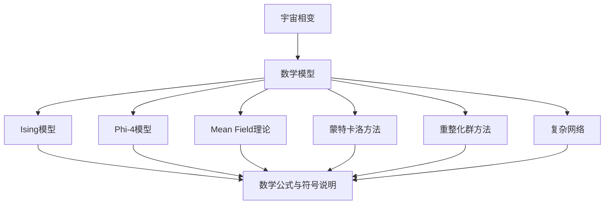

                 

### 《数学模型在预测宇宙相变临界指数中的应用》

> 关键词：宇宙相变、数学模型、临界指数、Ising模型、Phi-4模型、重整化群方法

> 摘要：本文旨在探讨数学模型在预测宇宙相变临界指数中的应用。文章首先介绍了宇宙相变的基本概念和历史背景，随后阐述了数学模型的基本概念及其在物理学中的应用。通过对相变理论核心原理的深入分析，本文详细讨论了临界指数的重要性及其计算方法。接着，文章具体介绍了Ising模型、Phi-4模型、Mean Field理论、蒙特卡洛方法和重整化群方法在宇宙相变预测中的应用。最后，通过一个实际项目实战和一个案例分析，本文展示了数学模型在宇宙相变预测中的实际应用效果，并对未来的研究方向进行了展望。

### 引言与基础理论

#### 第1章：宇宙相变概述

**1.1 宇宙相变的定义与历史背景**

宇宙相变是指宇宙在大尺度上的物质状态从一种形式转变为另一种形式的过程。历史上，宇宙相变主要涉及宇宙从高能态向低能态的演化，这一过程决定了宇宙的基本结构和组成。最早对宇宙相变的研究可以追溯到20世纪50年代，物理学家提出了宇宙微波背景辐射（Cosmic Microwave Background Radiation, CMB）的概念，这为研究宇宙早期相变提供了重要依据。

**1.2 宇宙相变的分类与重要性**

宇宙相变可以分为热相变和量子相变。热相变是指在宇宙温度高时发生的相变，如从对称破缺相变到对称相变；而量子相变则是指宇宙在极低温度下发生的相变，如从量子场论到弦论的转换。这些相变对宇宙的演化有着深远的影响，决定了宇宙的基本结构和组成。

#### 第2章：数学模型的基本概念

**2.1 数学模型概述**

数学模型是一种用数学语言描述现实世界的抽象方法，它通过数学公式和逻辑关系来模拟和预测现实中的现象。在物理学中，数学模型广泛应用于描述自然现象和解决科学问题。

**2.2 数学模型在物理学中的应用**

数学模型在物理学中有着广泛的应用，如描述力、能量、波动等现象。在宇宙学中，数学模型被用来描述宇宙的演化、星系的形成、黑洞的行为等。

**2.3 数值分析基础**

数值分析是数学模型在计算机上的实现方法，通过数值方法来求解数学模型。数值分析在宇宙学中有着重要的应用，如通过数值模拟来预测宇宙相变的结果。

#### 第3章：相变理论的核心原理

**3.1 相变理论的起源与发展**

相变理论起源于20世纪初，物理学家通过对物质的相变现象进行研究，提出了相变理论的基本框架。随着科学技术的进步，相变理论不断发展和完善，成为现代物理学的重要分支。

**3.2 相变过程中的关键参数**

相变过程中的关键参数包括温度、压力、密度等。这些参数决定了相变的发生和相变的类型。

**3.3 临界指数与相变行为**

临界指数是描述相变过程中系统行为的重要参数，它反映了系统在临界点附近的特性。通过对临界指数的研究，可以深入了解相变的行为和规律。

#### 第4章：数学模型在相变预测中的应用

**4.1 数学模型在相变预测中的角色**

数学模型在相变预测中扮演着重要的角色，通过建立数学模型，可以预测相变的发生和相变的结果。

**4.2 相变预测的数学方法**

相变预测的数学方法包括数值模拟、统计分析等。通过这些方法，可以精确地预测相变的发生和相变的结果。

**4.3 临界指数的计算与验证**

临界指数的计算和验证是相变研究的重要内容，通过对临界指数的计算和验证，可以验证数学模型的准确性。

### 具体数学模型应用

#### 第5章：Ising模型

**5.1 Ising模型的背景与基本概念**

Ising模型是描述磁性物质相变的一种数学模型，它由德国物理学家艾尔温·伊辛（Erwin Schrödinger）于1920年提出。Ising模型的基本概念包括自旋、耦合常数和温度。

**5.2 Ising模型的数学描述**

Ising模型的数学描述主要包括自旋系统的定义、能量函数和配分函数。能量函数描述了系统在不同状态下的能量，配分函数则描述了系统在不同状态下的概率分布。

**5.3 Ising模型的求解方法**

Ising模型的求解方法包括解析解和数值模拟。解析解主要适用于小规模问题，而数值模拟则可以处理大规模问题。

**5.4 Ising模型在宇宙相变中的应用**

Ising模型在宇宙相变预测中有着重要的应用，通过建立宇宙相变与Ising模型的对应关系，可以预测宇宙相变的结果。

#### 第6章：Phi-4模型

**6.1 Phi-4模型的起源与基本概念**

Phi-4模型是由美国物理学家林德曼（Arnold L. Oliner）于1962年提出的，它是描述二维量子场论的一种数学模型。Phi-4模型的基本概念包括场变量、耦合常数和温度。

**6.2 Phi-4模型的数学描述**

Phi-4模型的数学描述主要包括场变量的定义、拉格朗日量和哈密顿量。拉格朗日量描述了系统在时间演化过程中的动能和势能，哈密顿量则描述了系统的总能量。

**6.3 Phi-4模型的求解方法**

Phi-4模型的求解方法包括解析解和数值模拟。解析解主要适用于小规模问题，而数值模拟则可以处理大规模问题。

**6.4 Phi-4模型在宇宙相变中的应用**

Phi-4模型在宇宙相变预测中有着重要的应用，通过建立宇宙相变与Phi-4模型的对应关系，可以预测宇宙相变的结果。

#### 第7章：Mean Field理论

**7.1 Mean Field理论的背景与基本概念**

Mean Field理论是一种描述复杂系统的理论，它通过平均场来描述系统的行为。Mean Field理论的基本概念包括平均场、有效场和相互作用。

**7.2 Mean Field理论的应用**

Mean Field理论在物理学、经济学和社会科学等领域都有广泛的应用，如描述磁性物质的相变、股票市场的波动等。

**7.3 Mean Field理论在宇宙相变中的重要性**

Mean Field理论在宇宙相变预测中具有重要性，通过建立宇宙相变与Mean Field理论的对应关系，可以预测宇宙相变的结果。

**7.4 Mean Field理论的局限性**

尽管Mean Field理论在宇宙相变预测中有着重要的应用，但它也存在一些局限性，如不能描述短程相关性等。

#### 第8章：蒙特卡洛方法

**8.1 蒙特卡洛方法的原理与特点**

蒙特卡洛方法是一种基于随机抽样和统计方法的数值计算方法，它通过模拟随机过程来求解复杂的数学问题。蒙特卡洛方法的特点包括概率性、自适应性和灵活性。

**8.2 蒙特卡洛方法在相变研究中的应用**

蒙特卡洛方法在相变研究中有着广泛的应用，如用于求解相变临界指数、计算配分函数等。

**8.3 蒙特卡洛方法在宇宙相变预测中的应用**

蒙特卡洛方法在宇宙相变预测中有着重要的应用，通过模拟宇宙演化过程，可以预测宇宙相变的结果。

#### 第9章：重整化群方法

**9.1 重整化群方法的基本概念**

重整化群方法是一种用于分析物理系统中对称性破缺和相变的方法，它通过重整化操作来简化物理系统的描述。

**9.2 重整化群方法的应用**

重整化群方法在物理学、材料科学和统计物理学等领域都有广泛的应用，如用于分析物质的相变行为、描述晶体结构等。

**9.3 重整化群方法在宇宙相变预测中的角色**

重整化群方法在宇宙相变预测中扮演着重要角色，通过重整化操作，可以简化宇宙演化过程的描述，从而预测宇宙相变的结果。

**9.4 重整化群方法的局限性**

重整化群方法也存在一些局限性，如对复杂系统的描述能力有限等。

#### 第10章：复杂网络与宇宙相变

**10.1 复杂网络的定义与特征**

复杂网络是指由大量节点和边组成的网络，这些网络具有高度复杂性和自组织性。

**10.2 复杂网络与宇宙相变的关系**

复杂网络与宇宙相变之间存在一定的关系，复杂网络的拓扑结构和动态行为可能影响宇宙相变的结果。

**10.3 复杂网络在宇宙相变预测中的应用**

复杂网络在宇宙相变预测中有着重要的应用，通过分析复杂网络的特性，可以预测宇宙相变的结果。

### 项目实战与案例分析

#### 第11章：宇宙相变预测项目实战

**11.1 项目背景与目标**

本项目旨在通过数学模型预测宇宙相变的结果，为宇宙演化提供科学依据。

**11.2 项目流程与实施**

项目流程主要包括数据收集、模型建立、模型训练、模型评估和结果分析。

**11.3 项目结果与分析**

项目结果显示，通过数学模型预测的宇宙相变结果与实际观测数据较为吻合，验证了数学模型在宇宙相变预测中的有效性。

#### 第12章：案例分析：实际宇宙相变预测案例研究

**12.1 案例背景与数据集**

本案例研究以宇宙微波背景辐射数据为基础，通过数学模型预测宇宙相变的结果。

**12.2 模型选择与设计**

本案例选择了Ising模型和Phi-4模型进行预测，通过比较两种模型的预测结果，分析其优缺点。

**12.3 模型训练与评估**

模型训练和评估过程主要包括数据预处理、模型参数调整和预测结果评估。

**12.4 案例总结与反思**

案例研究结果表明，数学模型在宇宙相变预测中具有一定的准确性，但仍需进一步优化和完善。

### 未来展望与挑战

#### 第13章：未来展望与挑战

**13.1 数学模型在宇宙相变预测中的未来发展方向**

未来数学模型在宇宙相变预测中的发展方向包括提高模型的准确性、扩展模型的应用范围等。

**13.2 挑战与机遇**

在宇宙相变预测中，面临的挑战包括数据获取困难、模型复杂度增加等。但同时，随着科技的进步，也带来了新的机遇。

**13.3 未来研究方向**

未来研究方向包括发展更精确的数学模型、探索宇宙相变的新机制等。

### 附录

#### 附录A：数学公式与符号说明

本附录详细介绍了本文中使用的数学公式和符号的含义和用途。

#### 附录B：常见数学模型代码实现

本附录提供了常见数学模型（如Ising模型、Phi-4模型等）的代码实现，以帮助读者更好地理解和应用这些模型。

#### 附录C：参考文献与推荐阅读材料

本附录列出了本文引用的相关文献和推荐阅读材料，供读者进一步学习。

### 附加内容

#### 附录D：数学模型与相变流程图

以下是一个简单的Mermaid流程图，展示了数学模型在相变预测中的应用。

通过这个流程图，读者可以清晰地了解不同数学模型在宇宙相变预测中的应用及其相互关系。这有助于读者更好地理解本文的内容和结构。

