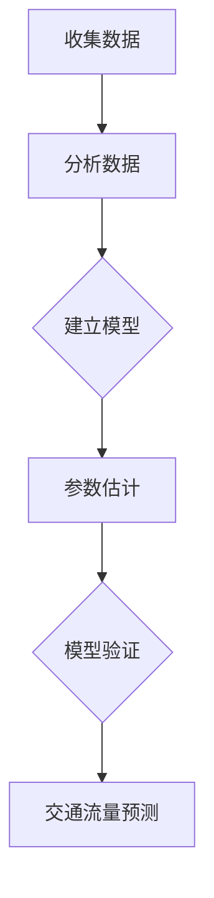
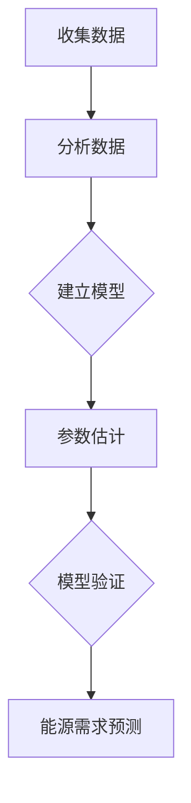
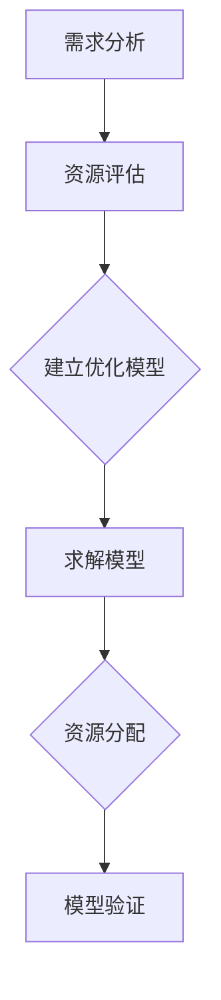
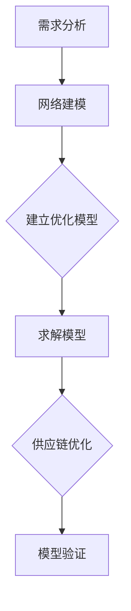

                 


### 1.1 数学模型概述

#### 数学模型的核心概念

数学模型是一种将现实问题抽象为数学形式的过程，它通过变量、方程、函数等数学语言来描述和解决问题。数学模型的核心概念包括变量、参数、关系和方程等。

- **变量**：在数学模型中，变量用于表示问题的可变部分，它们可以是连续的（如时间、温度等）或离散的（如人口数量、商品数量等）。

- **参数**：参数是模型中的常数，它们反映了问题中的特定关系和限制条件，例如加速度、阻力等。

- **关系**：关系描述了变量之间的相互关系，它可以是线性的或非线性的。关系通常用方程来表示，例如牛顿第二定律 \( F = ma \)。

- **方程**：方程是数学模型中最基本的元素，它们将变量和参数联系起来，形成模型的基本框架。方程可以是代数方程、微分方程或偏微分方程等。

#### 数学模型在科学和工程中的应用领域

数学模型广泛应用于科学和工程领域，特别是在物理学、经济学、生物学、计算机科学等领域。以下是一些典型的应用：

- **物理学**：牛顿定律、麦克斯韦方程组、量子力学等都是通过数学模型描述物理现象。

- **经济学**：供需模型、资本预算模型、经济增长模型等用于分析和预测经济趋势。

- **生物学**：种群模型、传染病模型、基因表达模型等用于理解生命过程。

- **计算机科学**：图论模型、算法分析模型、计算机网络模型等用于优化计算性能和资源分配。

#### 数学模型的发展历程

数学模型的发展可以追溯到古希腊时期，当时的哲学家和数学家开始尝试用数学方法解决实际问题。以下是数学模型发展的一些重要阶段：

- **古代**：古希腊的阿基米德、欧几里得等人通过几何模型研究物理问题。

- **近代**：牛顿和莱布尼茨发明微积分，为建立精确的物理模型提供了强有力的工具。

- **现代**：随着计算机技术的发展，数学模型的应用范围不断扩大，从理论分析到实际应用，数学模型在科学和工程中扮演着越来越重要的角色。

### 1.2 数学模型的基本要素

#### 变量与参数

在数学模型中，变量和参数是不可或缺的要素。变量用于表示问题的可变部分，而参数则反映了问题中的特定关系和限制条件。

- **变量**：变量可以是连续的或离散的。连续变量如时间、温度等，可以用实数来表示；离散变量如人口数量、商品数量等，通常用整数来表示。

- **参数**：参数是模型中的常数，它们可以是已知的或未知的。已知的参数可以帮助我们更好地理解模型，而未知的参数则可以通过数据拟合或理论推导来求解。

#### 关系与函数

关系描述了变量之间的相互关系，而函数则是关系的数学表达。在数学模型中，函数可以是线性的或非线性的。

- **关系**：关系可以是线性的，例如 \( y = mx + b \)（线性方程）；也可以是非线性的，例如 \( y = ax^2 + bx + c \)（二次方程）。

- **函数**：函数是关系的一种特殊表达形式，它将输入变量映射到输出变量。常见的函数有幂函数、指数函数、三角函数等。

#### 方程与约束

方程是数学模型中的核心元素，它们将变量和参数联系起来，形成模型的基本框架。约束条件则限制了变量的取值范围，确保模型的有效性。

- **方程**：方程可以是代数方程、微分方程或偏微分方程等。代数方程如 \( ax + b = c \)；微分方程如 \( \frac{dy}{dx} = f(x, y) \)；偏微分方程如 \( \frac{\partial u}{\partial x} + \frac{\partial u}{\partial y} = 0 \)。

- **约束**：约束条件通常用不等式或等式表示，它们限制了变量的取值范围。例如，\( x \geq 0 \) 和 \( y \leq 10 \) 都是约束条件。

### 1.3 数学模型构建的基本方法

构建数学模型通常需要以下几个步骤：

1. **问题分析**：明确问题，理解问题的背景和需求。

2. **变量与参数定义**：根据问题分析，定义变量和参数。

3. **关系与函数建立**：确定变量之间的关系，并用函数表达。

4. **方程与约束条件**：建立方程和约束条件，形成模型的基本框架。

5. **模型求解**：选择合适的求解方法，求解模型。

6. **模型验证**：通过实验或数据分析，验证模型的准确性和有效性。

#### 实验观察与数据分析

实验观察和数据分析是构建数学模型的重要步骤。通过观察现实世界中的数据，我们可以发现变量之间的规律和关系，从而建立数学模型。

- **实验观察**：通过实验收集数据，观察变量之间的变化规律。

- **数据分析**：使用统计方法和数据分析工具，处理实验数据，提取变量之间的关系。

#### 理论推导与假设建立

理论推导和假设建立是构建数学模型的另一种方法。通过理论推导，我们可以从基本的物理或数学原理出发，推导出问题的数学模型。

- **理论推导**：根据问题背景和已知理论，推导出问题的数学模型。

- **假设建立**：在理论推导过程中，通常需要做出一些合理的假设，以确保模型的简化和有效性。

#### 数学抽象与模型简化

数学抽象和模型简化是构建数学模型的必要步骤。通过数学抽象，我们可以将复杂的现实问题简化为数学模型，从而更易于分析和求解。

- **数学抽象**：将现实问题转化为数学问题，用变量、方程、函数等数学语言表达。

- **模型简化**：在保持模型核心特征的前提下，简化模型，降低求解的复杂度。

### 1.4 数学模型的求解方法

求解数学模型的方法有很多，包括数值方法、图形方法和精确求解方法。

1. **数值方法**：数值方法用于求解无法解析求解的数学模型。常见的数值方法有迭代法、数值积分法、数值微分法等。

2. **图形方法**：图形方法通过绘制函数图像，直观地分析变量之间的关系和模型的性质。

3. **精确求解方法**：精确求解方法用于求解能够解析求解的数学模型。常见的精确求解方法有代数方法、微分方程求解方法等。

## 第2章 数学模型的形式化描述

数学模型的形式化描述是理解和求解数学模型的基础。在这一章中，我们将详细探讨数学模型的形式化描述，包括函数和方程、向量和矩阵以及微分方程等基本概念。

### 2.1 函数和方程

#### 2.1.1 函数的基本概念

函数是数学模型中最基本的概念之一，它描述了变量之间的对应关系。在数学上，函数通常表示为 \( f(x) \)，其中 \( x \) 是自变量，\( f(x) \) 是因变量。

- **定义域**：定义域是指函数中自变量 \( x \) 的取值范围。例如，函数 \( f(x) = x^2 \) 的定义域是所有实数。

- **值域**：值域是指函数 \( f(x) \) 的取值范围。对于上述函数 \( f(x) = x^2 \)，其值域是所有非负实数。

- **单调性**：单调性描述了函数在定义域内是递增还是递减。例如，函数 \( f(x) = x^2 \) 在其定义域内是递增的。

#### 2.1.2 函数的表示方法

函数可以用不同的方式表示，包括表达式、图像和表格。

- **表达式表示**：函数可以用数学表达式表示，例如 \( f(x) = x^2 \) 或 \( f(x) = \sin(x) \)。

- **图像表示**：函数可以通过绘制图像来表示。在图像中，横轴通常表示自变量 \( x \)，纵轴表示因变量 \( f(x) \)。

- **表格表示**：函数可以通过表格来表示，其中列出自变量和因变量的对应值。

#### 2.1.3 方程的求解方法

方程是数学模型中的核心元素，求解方程是数学模型求解的关键步骤。方程的求解方法有很多，包括代数方法、数值方法和图形方法。

- **代数方法**：代数方法用于求解线性方程和非线性方程。线性方程如 \( ax + b = c \) 可以通过代数方法求解，而非线性方程如 \( ax^2 + bx + c = 0 \) 则可能需要使用数值方法。

- **数值方法**：数值方法用于求解无法通过代数方法求解的方程。常见的数值方法有迭代法、牛顿法、高斯消元法等。

- **图形方法**：图形方法通过绘制方程的图像来求解。例如，对于二次方程 \( ax^2 + bx + c = 0 \)，可以通过绘制抛物线 \( y = ax^2 + bx + c \) 来求解其根。

### 2.2 向量和矩阵

向量和矩阵是数学模型中的重要工具，用于表示和操作空间中的数据。

#### 2.2.1 向量及其运算

向量是数学中用于表示空间中点的数据结构。一个向量通常由一组有序数表示，例如 \( \vec{v} = (v_1, v_2, ..., v_n) \)。

- **向量的加法**：向量的加法是将两个向量的对应元素相加，例如 \( \vec{v_1} + \vec{v_2} = (v_{11} + v_{21}, v_{12} + v_{22}, ..., v_{1n} + v_{2n}) \)。

- **向量的减法**：向量的减法是将两个向量的对应元素相减，例如 \( \vec{v_1} - \vec{v_2} = (v_{11} - v_{21}, v_{12} - v_{22}, ..., v_{1n} - v_{2n}) \)。

- **向量的数乘**：向量的数乘是将向量与一个标量相乘，例如 \( c\vec{v} = (cv_1, cv_2, ..., cv_n) \)。

- **向量的内积**：向量的内积是两个向量的对应元素乘积之和，例如 \( \vec{v_1} \cdot \vec{v_2} = v_{11}v_{21} + v_{12}v_{22} + ... + v_{1n}v_{2n} \)。

- **向量的外积**：向量的外积是两个向量的交叉乘积，例如 \( \vec{v_1} \times \vec{v_2} = (v_{12}v_{23} - v_{13}v_{22}, v_{13}v_{21} - v_{11}v_{23}, v_{11}v_{22} - v_{12}v_{21}) \)。

#### 2.2.2 矩阵及其运算

矩阵是数学中用于表示数据集的数据结构。一个矩阵通常由一个二维数组表示，其中每个元素都是实数。

- **矩阵的加法**：矩阵的加法是将两个矩阵的对应元素相加，例如 \( A + B = (a_{ij} + b_{ij})_{ij} \)。

- **矩阵的减法**：矩阵的减法是将两个矩阵的对应元素相减，例如 \( A - B = (a_{ij} - b_{ij})_{ij} \)。

- **矩阵的数乘**：矩阵的数乘是将矩阵与一个标量相乘，例如 \( cA = (ca_{ij})_{ij} \)。

- **矩阵的乘法**：矩阵的乘法是将两个矩阵对应元素相乘并按一定规则求和，例如 \( AB = (a_{ik}b_{kj})_{ij} \)。

- **矩阵的转置**：矩阵的转置是将矩阵的行和列互换，例如 \( A^T = (a_{ji})_{ji} \)。

#### 2.2.3 向量和矩阵的应用

向量和矩阵在数学模型中有广泛的应用，包括线性方程组的求解、特征值和特征向量的计算、矩阵分解等。

- **线性方程组求解**：线性方程组可以用矩阵表示，例如 \( AX = B \)，其中 \( A \) 是系数矩阵，\( X \) 是未知数矩阵，\( B \) 是常数矩阵。线性方程组的求解可以通过高斯消元法、矩阵分解等方法实现。

- **特征值和特征向量的计算**：特征值和特征向量是矩阵分析中的重要概念，它们描述了矩阵的性质和特征。特征值和特征向量的计算可以通过求解特征方程实现，例如 \( AX = \lambda X \)，其中 \( \lambda \) 是特征值，\( X \) 是特征向量。

- **矩阵分解**：矩阵分解是将矩阵分解为几个简单矩阵的乘积，例如LU分解、QR分解等。矩阵分解在数学模型中有广泛应用，例如在数据压缩、图像处理等领域。

### 2.3 微分方程

微分方程是数学模型中的重要组成部分，用于描述变量之间的动态关系。微分方程可以分为常微分方程和偏微分方程。

#### 2.3.1 常微分方程

常微分方程描述了变量之间的导数关系。常微分方程的一般形式为：

\[ \frac{dy}{dx} = f(x, y) \]

其中 \( y \) 是因变量，\( x \) 是自变量，\( f(x, y) \) 是导数函数。

- **一阶常微分方程**：一阶常微分方程是一类特殊的常微分方程，其导数函数只包含一阶导数。例如，\( \frac{dy}{dx} = y \) 是一阶常微分方程。

- **二阶常微分方程**：二阶常微分方程的导数函数包含二阶导数。例如，\( \frac{d^2y}{dx^2} + \frac{dy}{dx} = y \) 是二阶常微分方程。

- **高阶常微分方程**：高阶常微分方程的导数函数包含更高阶的导数。例如，\( \frac{d^3y}{dx^3} + \frac{d^2y}{dx^2} + \frac{dy}{dx} + y = 0 \) 是三阶常微分方程。

#### 2.3.2 常微分方程的求解方法

求解常微分方程的方法有很多，包括解析求解和数值求解。

- **解析求解**：解析求解是求解常微分方程的一种方法，它通过代数方法或数学分析工具来求解方程。例如，一阶常微分方程 \( \frac{dy}{dx} = y \) 可以通过分离变量法求解。

- **数值求解**：数值求解是求解常微分方程的另一种方法，它通过迭代法、差分法等数值方法来求解方程。例如，一阶常微分方程 \( \frac{dy}{dx} = y \) 可以通过欧拉法求解。

#### 2.3.3 常微分方程的应用

常微分方程在科学和工程中有广泛的应用，包括物理学、生物学、经济学等领域。以下是一些典型的应用实例：

- **物理学**：常微分方程用于描述振动、波动、流体力学等现象。例如，波动方程 \( \frac{\partial^2 u}{\partial t^2} = c^2 \frac{\partial^2 u}{\partial x^2} \) 描述了波的传播。

- **生物学**：常微分方程用于描述种群动力学、传染病传播等现象。例如，SIR模型 \( \frac{dS}{dt} = -\beta SI \) 和 \( \frac{dI}{dt} = \beta SI - \gamma I \) 描述了传染病的传播。

- **经济学**：常微分方程用于描述经济增长、资本积累等现象。例如，索洛经济增长模型 \( \frac{dk}{dt} = sf(k) - (n + \delta)k \) 描述了经济增长。

### 2.4 偏微分方程

偏微分方程描述了多个变量之间的导数关系。偏微分方程的一般形式为：

\[ \frac{\partial u}{\partial x} + \frac{\partial u}{\partial y} = f(x, y) \]

其中 \( u \) 是因变量，\( x \) 和 \( y \) 是自变量，\( f(x, y) \) 是导数函数。

- **一阶偏微分方程**：一阶偏微分方程的导数函数只包含一阶导数。例如，\( \frac{\partial u}{\partial x} + \frac{\partial u}{\partial y} = 0 \) 是一阶偏微分方程。

- **二阶偏微分方程**：二阶偏微分方程的导数函数包含二阶导数。例如，\( \frac{\partial^2 u}{\partial x^2} + \frac{\partial^2 u}{\partial y^2} = f(x, y) \) 是二阶偏微分方程。

- **高阶偏微分方程**：高阶偏微分方程的导数函数包含更高阶的导数。例如，\( \frac{\partial^3 u}{\partial x^3} + \frac{\partial^3 u}{\partial y^3} = g(x, y) \) 是三阶偏微分方程。

#### 2.4.2 偏微分方程的求解方法

求解偏微分方程的方法包括解析求解和数值求解。

- **解析求解**：解析求解是求解偏微分方程的一种方法，它通过代数方法或数学分析工具来求解方程。例如，一阶偏微分方程 \( \frac{\partial u}{\partial x} + \frac{\partial u}{\partial y} = 0 \) 可以通过分离变量法求解。

- **数值求解**：数值求解是求解偏微分方程的另一种方法，它通过迭代法、差分法等数值方法来求解方程。例如，一阶偏微分方程 \( \frac{\partial u}{\partial x} + \frac{\partial u}{\partial y} = 0 \) 可以通过欧拉法求解。

#### 2.4.3 偏微分方程的应用

偏微分方程在科学和工程中有广泛的应用，包括物理学、生物学、经济学等领域。以下是一些典型的应用实例：

- **物理学**：偏微分方程用于描述热传导、电磁场、流体力学等现象。例如，热传导方程 \( \frac{\partial u}{\partial t} = \alpha \frac{\partial^2 u}{\partial x^2} \) 描述了热传导现象。

- **生物学**：偏微分方程用于描述种群动力学、传染病传播等现象。例如，反应扩散方程 \( \frac{\partial u}{\partial t} = \alpha \frac{\partial^2 u}{\partial x^2} + \beta u \) 描述了种群动态。

- **经济学**：偏微分方程用于描述经济增长、资本积累等现象。例如，拉姆齐模型 \( \frac{\partial u}{\partial t} = -\alpha \frac{\partial^2 u}{\partial x^2} + \beta u \) 描述了经济增长。

### 4.1 线性空间

#### 4.1.1 线性空间的基本概念

线性空间，也称为向量空间，是一个数学概念，用于描述一组满足特定条件的向量。这些条件包括：

- **闭合性**：对于线性空间中的任意两个向量 \( \vec{u} \) 和 \( \vec{v} \)，它们的和 \( \vec{u} + \vec{v} \) 仍然在空间中。

- **封闭性**：对于线性空间中的任意一个向量 \( \vec{u} \) 和任意一个实数 \( c \)，它们的乘积 \( c\vec{u} \) 仍然在空间中。

- **零向量**：线性空间中存在一个零向量 \( \vec{0} \)，对于任意向量 \( \vec{u} \)，有 \( \vec{u} + \vec{0} = \vec{u} \)。

- **加法交换律**：对于任意两个向量 \( \vec{u} \) 和 \( \vec{v} \)，有 \( \vec{u} + \vec{v} = \vec{v} + \vec{u} \)。

- **加法结合律**：对于任意三个向量 \( \vec{u} \)、\( \vec{v} \) 和 \( \vec{w} \)，有 \( (\vec{u} + \vec{v}) + \vec{w} = \vec{u} + (\vec{v} + \vec{w}) \)。

- **存在逆元**：对于任意非零向量 \( \vec{u} \)，存在一个向量 \( \vec{u}^{-1} \)，使得 \( \vec{u} + \vec{u}^{-1} = \vec{0} \)。

#### 4.1.2 线性空间的运算

线性空间中的向量可以通过加法和数乘两种运算进行操作。

- **向量加法**：向量加法是线性空间中最基本的运算之一。对于两个向量 \( \vec{u} = (u_1, u_2, ..., u_n) \) 和 \( \vec{v} = (v_1, v_2, ..., v_n) \)，它们的和 \( \vec{u} + \vec{v} \) 是一个新的向量，其每个分量是 \( \vec{u} \) 和 \( \vec{v} \) 对应分量的和。即 \( \vec{u} + \vec{v} = (u_1 + v_1, u_2 + v_2, ..., u_n + v_n) \)。

- **向量数乘**：向量数乘是将向量与一个实数相乘。对于向量 \( \vec{u} = (u_1, u_2, ..., u_n) \) 和实数 \( c \)，它们的数乘 \( c\vec{u} \) 是一个新的向量，其每个分量是 \( c \) 与 \( \vec{u} \) 对应分量的乘积。即 \( c\vec{u} = (cu_1, cu_2, ..., cu_n) \)。

#### 4.1.3 线性空间的性质

线性空间具有以下性质：

- **加法逆元**：对于每个向量 \( \vec{u} \)，都存在一个向量 \( \vec{u}^{-1} \)，使得 \( \vec{u} + \vec{u}^{-1} = \vec{0} \)。

- **数乘分配律**：对于任意向量 \( \vec{u} \)、\( \vec{v} \) 和实数 \( c \)，有 \( c(\vec{u} + \vec{v}) = c\vec{u} + c\vec{v} \)。

- **数乘结合律**：对于任意向量 \( \vec{u} \)、\( \vec{v} \) 和实数 \( c \)，有 \( (c_1c_2)\vec{u} = c_1(c_2\vec{u}) \)。

- **向量加法交换律**：对于任意向量 \( \vec{u} \) 和 \( \vec{v} \)，有 \( \vec{u} + \vec{v} = \vec{v} + \vec{u} \)。

- **向量加法结合律**：对于任意向量 \( \vec{u} \)、\( \vec{v} \) 和 \( \vec{w} \)，有 \( (\vec{u} + \vec{v}) + \vec{w} = \vec{u} + (\vec{v} + \vec{w}) \)。

#### 4.1.4 线性空间的例子

一个常见的线性空间例子是二维向量空间 \( \mathbb{R}^2 \)，它由所有形式为 \( (x, y) \) 的向量组成，其中 \( x \) 和 \( y \) 是实数。这个空间中的向量可以通过加法和数乘进行操作：

- **向量加法**：对于两个向量 \( \vec{u} = (u_1, u_2) \) 和 \( \vec{v} = (v_1, v_2) \)，它们的和 \( \vec{u} + \vec{v} \) 是 \( (u_1 + v_1, u_2 + v_2) \)。

- **向量数乘**：对于向量 \( \vec{u} = (u_1, u_2) \) 和实数 \( c \)，它们的数乘 \( c\vec{u} \) 是 \( (cu_1, cu_2) \)。

线性空间的概念可以扩展到更高维，例如三维向量空间 \( \mathbb{R}^3 \)，它由所有形式为 \( (x, y, z) \) 的向量组成。同样，这些向量可以通过加法和数乘进行操作。

### 4.2 线性变换

线性变换是一种将一个线性空间映射到另一个线性空间的函数。它保持线性空间的加法和数乘运算，这意味着如果 \( T \) 是一个线性变换，那么对于任意向量 \( \vec{u} \) 和 \( \vec{v} \)，以及任意实数 \( a \) 和 \( b \)，有：

\[ T(a\vec{u} + b\vec{v}) = aT(\vec{u}) + bT(\vec{v}) \]

#### 4.2.1 线性变换的基本概念

- **定义**：一个线性变换 \( T \) 将线性空间 \( V \) 映射到另一个线性空间 \( W \)。对于 \( V \) 中的任意向量 \( \vec{u} \)，线性变换 \( T \) 给出 \( W \) 中的一个向量 \( T(\vec{u}) \)。

- **矩阵表示**：如果 \( V \) 和 \( W \) 都是有限维的，那么线性变换 \( T \) 可以通过一个矩阵 \( A \) 来表示。具体来说，如果 \( V \) 和 \( W \) 的基分别是 \( \{ \vec{e_1}, \vec{e_2}, ..., \vec{e_n} \} \) 和 \( \{ \vec{f_1}, \vec{f_2}, ..., \vec{f_m} \} \)，那么 \( T(\vec{e_i}) \) 可以表示为 \( w_i \)（即 \( T \) 在基 \( \vec{e_i} \) 上的作用），那么 \( T \) 的矩阵 \( A \) 是一个 \( m \times n \) 的矩阵，其第 \( i \) 行第 \( j \) 列的元素是 \( w_{ij} \)，即：

  \[ A = \begin{pmatrix} w_{11} & w_{12} & ... & w_{1n} \\ w_{21} & w_{22} & ... & w_{2n} \\ ... & ... & ... & ... \\ w_{m1} & w_{m2} & ... & w_{mn} \end{pmatrix} \]

- **性质**：线性变换具有以下性质：
  - **齐次性**：对于任意向量 \( \vec{u} \) 和标量 \( a \)，有 \( T(a\vec{u}) = aT(\vec{u}) \)。
  - **加法保持性**：对于任意向量 \( \vec{u} \) 和 \( \vec{v} \)，有 \( T(\vec{u} + \vec{v}) = T(\vec{u}) + T(\vec{v}) \)。

#### 4.2.2 线性变换的性质

- **保线性**：线性变换保持向量之间的线性关系。例如，如果 \( \vec{u} \) 和 \( \vec{v} \) 是线性相关的，那么 \( T(\vec{u}) \) 和 \( T(\vec{v}) \) 也是线性相关的。
- **保范性**：线性变换可能保持或增加向量的范数。例如，对于正交变换（例如旋转和反射），范数保持不变；而对于其他变换，范数可能增加。
- **保凸性**：线性变换保持凸集。这意味着如果 \( S \) 是一个凸集，那么 \( T(S) \) 也是凸集。

#### 4.2.3 线性变换的应用

线性变换在数学和工程中有着广泛的应用：

- **几何变换**：线性变换可以用于实现几何变换，如平移、旋转、缩放和反射。在计算机图形学中，线性变换用于实现物体的移动和变形。

- **数据分析**：线性变换用于数据分析和处理。例如，主成分分析（PCA）使用线性变换来降低数据维度，同时保持数据的主要结构。

- **信号处理**：线性变换在信号处理中用于滤波、调制和解调。线性变换允许我们将复杂的信号分解为简单的分量，从而更容易分析和处理。

### 4.3 特征值和特征向量

特征值和特征向量是线性代数中的重要概念，它们描述了线性变换的特性和行为。

#### 4.3.1 特征值和特征向量的基本概念

- **特征向量**：对于线性变换 \( T \) 和标量 \( \lambda \)，如果存在一个非零向量 \( \vec{v} \)，使得 \( T(\vec{v}) = \lambda \vec{v} \)，那么 \( \vec{v} \) 就是 \( T \) 的一个特征向量，而 \( \lambda \) 是 \( T \) 的一个特征值。

- **特征多项式**：对于线性变换 \( T \)，其特征多项式 \( p(\lambda) \) 是一个多项式，定义为 \( p(\lambda) = \det(T - \lambda I) \)，其中 \( I \) 是与 \( T \) 同维的 identity 矩阵。

- **特征值**：特征多项式的根是线性变换的特征值。对于矩阵 \( A \)，其特征值 \( \lambda \) 满足方程 \( \det(A - \lambda I) = 0 \)。

#### 4.3.2 特征值和特征向量的求解方法

- **代数方法**：通过解特征多项式 \( p(\lambda) = 0 \) 来求解特征值。找到特征值后，可以求解对应的特征向量，即解方程 \( (A - \lambda I)\vec{v} = \vec{0} \)。

- **数值方法**：在计算中，通常使用数值方法（如幂方法、QR分解等）来求解特征值和特征向量。

#### 4.3.3 特征值和特征向量的应用

- **矩阵对角化**：如果矩阵 \( A \) 可以对角化为 \( A = PDP^{-1} \)，其中 \( D \) 是对角矩阵，包含 \( A \) 的特征值，而 \( P \) 是由 \( A \) 的特征向量构成的矩阵。对角化可以简化矩阵的运算。

- **稳定性分析**：在控制理论和物理学中，特征值和特征向量用于分析系统的稳定性和动态行为。

- **模式识别**：在机器学习和信号处理中，特征值和特征向量用于降维和特征提取，从而提高模型性能。

### 5.1 代数模型的基本概念

代数模型是一种数学模型，它通过代数方程来表达系统的状态和行为。代数模型广泛应用于工程、经济学、物理学等多个领域。

#### 5.1.1 代数模型的定义

代数模型是由代数方程组成的数学模型，用于描述系统的状态和行为。代数方程可以是线性或非线性的，它们通常包含变量、参数和方程。

#### 5.1.2 代数模型的基本结构

代数模型的基本结构通常包括以下元素：

- **变量**：用于描述系统的状态和变化的量。
- **参数**：用于描述系统中的固定属性和常数。
- **方程**：用于描述变量之间的关系和系统的行为。

一个典型的代数模型可以表示为：

\[ a_1x_1 + a_2x_2 + ... + a_nx_n = b \]

其中 \( x_1, x_2, ..., x_n \) 是变量，\( a_1, a_2, ..., a_n \) 是参数，\( b \) 是常数。

#### 5.1.3 代数模型的性质

- **线性性**：线性代数模型中的方程具有线性关系，即变量的指数为1。
- **非线性性**：非线性代数模型中的方程包含变量的非线性关系，如平方、指数等。
- **确定性**：代数模型通常具有确定性，即给定初始条件和参数，可以唯一确定系统的状态。

### 5.2 代数模型的求解策略

求解代数模型的方法取决于模型的类型和方程的复杂性。以下是几种常见的求解策略：

#### 5.2.1 数值方法

数值方法适用于求解复杂的代数方程，如非线性方程和高维方程。以下是一些常用的数值方法：

- **迭代法**：通过逐步迭代逼近方程的解。例如，牛顿法、高斯-赛德尔迭代法等。
- **固定点迭代法**：通过将方程转换为固定点形式，并迭代求解。例如，不动点迭代法等。
- **数值积分法**：用于求解微分方程的数值解，如欧拉法、龙格-库塔法等。

#### 5.2.2 解析方法

解析方法适用于求解线性方程和某些简单的非线性方程。以下是一些常见的解析方法：

- **代数方法**：通过代数运算求解方程。例如，因式分解、配方法等。
- **微分方程求解**：用于求解包含微分方程的代数模型。例如，拉普拉斯变换、积分变换等。

#### 5.2.3 混合方法

混合方法结合了数值方法和解析方法，以求解复杂的代数模型。以下是一些常见的混合方法：

- **迭代-解析方法**：先使用解析方法求解线性部分，然后使用数值方法求解非线性部分。
- **数值-解析方法**：先使用数值方法求解线性部分，然后使用解析方法求解非线性部分。

### 5.2.4 代数模型的求解算法

以下是几种常见的代数模型求解算法：

- **牛顿-拉弗森法**：用于求解非线性方程，通过迭代逼近解。
- **高斯消元法**：用于求解线性方程组，通过矩阵运算求解。
- **最小二乘法**：用于求解最小二乘问题，通过最小化误差平方和求解。
- **线性规划算法**：用于求解线性规划问题，通过优化目标函数和约束条件求解。

### 5.2.5 代数模型的应用

代数模型在工程、经济、物理学等领域有广泛的应用。以下是一些典型的应用实例：

- **工程领域**：用于优化设计、控制理论、信号处理等。
- **经济领域**：用于预测市场趋势、资源分配、金融分析等。
- **物理学领域**：用于描述物理现象、建立物理模型等。

### 6.1 图模型的基本概念

图模型是一种用于描述实体之间关系的数学模型，它广泛应用于计算机科学、统计学、物理学和社会科学等领域。图模型通过节点和边来表示实体和它们之间的关系。

#### 6.1.1 图模型定义

图模型由一个节点集合 \( V \) 和一个边集合 \( E \) 组成。节点表示实体，边表示实体之间的关系。一个图可以形式化地表示为 \( G = (V, E) \)。

- **有向图**：边有方向，从一个节点指向另一个节点。
- **无向图**：边没有方向，连接两个节点。
- **简单图**：没有自环（节点连接到自己）和多重边（多条边连接相同的两个节点）。
- **复杂图**：包含自环和多重边。

#### 6.1.2 图模型的基本结构

图模型的基本结构包括以下元素：

- **节点**：表示实体，可以是人、地点、事物等。
- **边**：表示节点之间的关系，可以是友情、合作、连接等。
- **权重**：表示边的重要程度或强度，可以是距离、时间、费用等。

一个简单的图示例：

\[ G = (V, E) \]
\[ V = \{A, B, C, D\} \]
\[ E = \{(A, B), (B, C), (C, D), (D, A)\} \]

#### 6.1.3 图模型的基本性质

图模型具有以下基本性质：

- **连通性**：图中任意两个节点之间都存在路径。
- **连通度**：图中节点的最大度数。
- **直径**：图中任意两个节点之间的最长路径。
- **中心性**：节点的重要程度，如度数中心性、介数中心性、紧密中心性等。

### 6.2 图模型的求解策略

求解图模型的方法取决于具体问题和应用需求。以下是一些常见的求解策略：

#### 6.2.1 搜索算法

搜索算法用于找到图中的路径或子结构。以下是一些常见的搜索算法：

- **深度优先搜索（DFS）**：从起点开始，尽可能深入地探索每个分支。
- **广度优先搜索（BFS）**：从起点开始，逐层探索图中的节点。
- **最佳优先搜索（A\*)**：基于启发式信息寻找最短路径。

#### 6.2.2 算法分析

算法分析用于评估图算法的时间和空间复杂度。以下是一些常见算法分析工具：

- **时间复杂度**：计算算法执行时间的增长趋势。
- **空间复杂度**：计算算法所需存储空间的大小。

#### 6.2.3 网络流算法

网络流算法用于求解网络中的最大流量问题。以下是一些常见的网络流算法：

- **最大流最小割定理**：找到最大流的充要条件是找不到增加流量的割。
- **Edmonds-Karp算法**：使用 BFS 进行增广路径搜索，实现最大流算法。
- **Ford-Fulkerson算法**：通过迭代寻找增广路径，实现最大流算法。

#### 6.2.4 社交网络分析

社交网络分析用于分析社交网络中的节点和边的关系。以下是一些常见的社交网络分析方法：

- **社区发现**：找到网络中的紧密社区。
- **影响力分析**：分析节点对网络传播的影响力。
- **网络结构**：分析网络的拓扑结构和中心性。

### 6.2.5 图模型的求解算法

以下是几种常见的图模型求解算法：

- **Dijkstra算法**：求解单源最短路径问题。
- **Floyd-Warshall算法**：求解所有对最短路径问题。
- **Kruskal算法**：求解最小生成树问题。
- **Prim算法**：求解最小生成树问题。

### 6.2.6 图模型的应用

图模型在计算机科学和社会科学中有着广泛的应用。以下是一些典型的应用实例：

- **计算机科学**：网络拓扑分析、社交网络分析、推荐系统等。
- **社会科学**：社交网络分析、数据挖掘、生物信息学等。

### 7.1 统计模型的基本概念

统计模型是统计学中用于描述和分析数据的一种数学框架。它通过对数据的分布和结构进行建模，帮助我们从数据中提取有用的信息和知识。

#### 7.1.1 统计模型定义

统计模型是一种使用概率论和数理统计方法建立的数学模型，用于描述和分析数据。它通常由几个基本组成部分构成：

- **随机变量**：随机变量是随机实验结果的数学表示，可以是离散的或连续的。
- **概率分布**：概率分布描述了随机变量可能取值的概率分布情况，可以是离散分布或连续分布。
- **参数估计**：参数估计是使用样本数据估计模型参数的方法，如最大似然估计、最小二乘法等。
- **假设检验**：假设检验是使用统计方法验证或拒绝某个假设的过程。

#### 7.1.2 统计模型的基本结构

统计模型的基本结构通常包括以下几部分：

- **数据收集**：收集用于建模的数据。
- **模型选择**：选择合适的统计模型，如线性回归、逻辑回归、时间序列模型等。
- **参数估计**：估计模型参数，如回归系数、概率等。
- **模型验证**：验证模型的有效性和准确性，如通过交叉验证、AIC/BIC准则等。
- **模型应用**：将模型应用于新的数据，进行预测或推断。

#### 7.1.3 统计模型的性质

统计模型具有以下性质：

- **概率性**：统计模型是基于概率论建立的，它描述了数据的不确定性。
- **线性性**：许多统计模型假设变量之间存在线性关系，如线性回归模型。
- **适应性**：统计模型可以根据不同类型的数据和问题进行调整和修改。
- **可扩展性**：统计模型可以扩展到多个变量和复杂的结构，如多元回归、广义线性模型等。

### 7.2 统计模型的求解策略

求解统计模型的方法取决于模型类型和数据特点。以下是一些常见的求解策略：

#### 7.2.1 参数估计方法

参数估计是统计模型求解的重要步骤，以下是一些常用的参数估计方法：

- **最大似然估计（MLE）**：找到使得观察数据概率最大的参数值。
- **最小二乘法**：最小化预测值与实际值之间的误差平方和。
- **贝叶斯估计**：基于先验知识和观察数据，计算参数的后验分布。
- **极大极小方法**：选择使得最小化一个特定损失函数的参数。

#### 7.2.2 假设检验方法

假设检验用于验证模型或变量之间的关系。以下是一些常用的假设检验方法：

- **t检验**：用于检验两组数据的均值差异。
- **方差分析（ANOVA）**：用于比较多个组数据的均值差异。
- **卡方检验**：用于检验分类变量之间的独立性。
- **拟合优度检验**：用于检验模型与数据的拟合程度。

#### 7.2.3 预测方法

预测是统计模型的重要应用之一，以下是一些常用的预测方法：

- **回归预测**：使用回归模型预测因变量的值。
- **分类预测**：使用分类模型预测分类变量的类别。
- **时间序列预测**：使用时间序列模型预测未来的趋势。

#### 7.2.4 统计模型的求解算法

以下是几种常见的统计模型求解算法：

- **梯度下降法**：用于最小化损失函数，常见于回归模型。
- **随机梯度下降法（SGD）**：梯度下降法的变体，适用于大规模数据集。
- **牛顿-拉弗森法**：用于求解非线性最小二乘问题。
- **迭代最优化算法**：如L-BFGS、BHHH等，用于求解复杂的优化问题。

### 7.2.5 统计模型的应用

统计模型在科学、工程、经济等领域有着广泛的应用。以下是一些典型的应用实例：

- **科学领域**：用于数据分析和建模，如生物学、物理学、环境科学等。
- **工程领域**：用于故障诊断、质量检测、可靠性分析等。
- **经济领域**：用于市场预测、风险评估、经济分析等。

## 第8章 数学模型的应用实例

在数学模型的构建与求解策略的基础上，本章节将通过具体的实例来展示数学模型在实际问题中的应用。这些实例将涵盖不同领域，包括实际问题建模、数学模型求解以及实际案例分析。

### 8.1 实际问题建模

在实际问题中，建模是一个关键步骤，它涉及到将现实问题转化为数学模型的过程。以下是几个实际问题的建模实例：

#### 8.1.1 交通流量预测

**背景介绍**：城市交通流量预测对于交通管理和规划具有重要意义。通过预测交通流量，可以优化交通信号控制，减少交通拥堵，提高交通效率。

**核心概念与联系**：

1. **流量**：流量是单位时间内通过某一区域的车辆数量。
2. **时间**：时间变量用于表示不同的时间点。
3. **地点**：地点变量用于表示不同的路段或交叉口。

**Mermaid 流程图**：



#### 8.1.2 能源需求预测

**背景介绍**：能源需求预测对于能源规划和管理至关重要。准确的能源需求预测有助于优化能源供应，减少能源浪费。

**核心概念与联系**：

1. **能源需求**：能源需求是单位时间内消耗的能源总量。
2. **时间**：时间变量用于表示不同的时间点。
3. **因素**：影响因素包括天气、经济活动、人口等。

**Mermaid 流流程图**：



### 8.1.3 医疗资源分配

**背景介绍**：医疗资源分配是一个复杂的问题，涉及医院、医生、病人等多个方面。通过合理的医疗资源分配，可以提高医疗服务的效率和质量。

**核心概念与联系**：

1. **资源**：医疗资源包括医院床位、医生、药品等。
2. **需求**：需求变量用于表示不同医院的需求量。
3. **约束**：约束条件包括预算、政策等。

**Mermaid 流程图**：



### 8.1.4 供应链优化

**背景介绍**：供应链优化是企业管理的重要环节，涉及供应商、制造商、分销商等多个环节。通过优化供应链，可以降低成本，提高服务水平。

**核心概念与联系**：

1. **供应链网络**：供应链网络包括供应商、制造商、分销商等节点。
2. **需求**：需求变量用于表示不同节点的需求量。
3. **约束**：约束条件包括库存限制、运输能力等。

**Mermaid 流程图**：



### 8.2 数学模型求解实例

在建立数学模型后，求解模型是关键步骤。以下是几个数学模型求解的实例：

#### 8.2.1 线性回归模型求解

**背景介绍**：线性回归模型用于分析自变量和因变量之间的线性关系。

**核心算法原理讲解**：

线性回归模型的一般形式为：

\[ y = \beta_0 + \beta_1x + \epsilon \]

其中，\( y \) 是因变量，\( x \) 是自变量，\( \beta_0 \) 和 \( \beta_1 \) 是回归系数，\( \epsilon \) 是误差项。

**伪代码**：

```python
# 输入：数据集 X, Y
# 输出：回归系数 β0, β1

# 1. 计算协方差矩阵 X'X
covariance_matrix = np.dot(X.T, X)

# 2. 计算逆矩阵 (X'X)^-1
inverse_matrix = np.linalg.inv(covariance_matrix)

# 3. 计算回归系数 β = (X'X)^-1X'Y
beta = np.dot(inverse_matrix, np.dot(X.T, Y))

# 4. 返回回归系数 β0, β1
return beta[0], beta[1]
```

#### 8.2.2 非线性回归模型求解

**背景介绍**：非线性回归模型用于分析自变量和因变量之间的非线性关系。

**核心算法原理讲解**：

非线性回归模型的一般形式为：

\[ y = \beta_0 + \beta_1x^2 + \beta_2x^3 + ... + \beta_nx^n + \epsilon \]

其中，\( y \) 是因变量，\( x \) 是自变量，\( \beta_0, \beta_1, ..., \beta_n \) 是回归系数，\( \epsilon \) 是误差项。

**伪代码**：

```python
# 输入：数据集 X, Y
# 输出：回归系数 β0, β1, ..., βn

# 1. 构建多项式矩阵 X
X_poly = np.column_stack([X**i for i in range(n+1)])

# 2. 计算协方差矩阵 X'X
covariance_matrix = np.dot(X_poly.T, X_poly)

# 3. 计算逆矩阵 (X'X)^-1
inverse_matrix = np.linalg.inv(covariance_matrix)

# 4. 计算回归系数 β = (X'X)^-1X'Y
beta = np.dot(inverse_matrix, np.dot(X_poly.T, Y))

# 5. 返回回归系数 β0, β1, ..., βn
return beta
```

#### 8.2.3 微分方程求解

**背景介绍**：微分方程用于描述变量之间的动态关系。

**核心算法原理讲解**：

微分方程的一般形式为：

\[ \frac{dy}{dx} = f(x, y) \]

其中，\( y \) 是因变量，\( x \) 是自变量，\( f(x, y) \) 是微分方程的导数函数。

**伪代码**：

```python
# 输入：微分方程 f(x, y), 初始条件 y(x0)
# 输出：解 y(x)

# 1. 定义求解器（例如欧拉法）
def euler_method(f, y0, x0, h):
    y = y0
    x = x0
    while x < x_end:
        y = y + h * f(x, y)
        x = x + h
    return y

# 2. 调用求解器求解微分方程
y_solution = euler_method(f, y0, x0, h)

# 3. 返回解 y(x)
return y_solution
```

#### 8.2.4 线性规划求解

**背景介绍**：线性规划用于优化线性目标函数，满足线性约束条件。

**核心算法原理讲解**：

线性规划的一般形式为：

\[ \max \min c^T x \]
\[ \text{subject to} \ Ax \leq b \]

其中，\( c \) 是目标函数系数，\( x \) 是决策变量，\( A \) 是约束条件矩阵，\( b \) 是约束条件向量。

**伪代码**：

```python
# 输入：目标函数系数 c，约束条件矩阵 A，约束条件向量 b
# 输出：最优解 x

# 1. 使用线性规划求解器（例如 scipy.optimize.linprog）
from scipy.optimize import linprog

# 2. 设置目标函数和约束条件
c = [-1, -1]  # 目标函数系数
A = [[1, 1], [-1, 1]]  # 约束条件矩阵
b = [2, 0]  # 约束条件向量

# 3. 求解线性规划问题
result = linprog(c, A_eq=A, b_eq=b, method='highs')

# 4. 返回最优解 x
x = result.x
return x
```

### 8.3 数学模型求解实例

以下是一个具体的应用实例，展示了如何使用数学模型求解实际问题。

#### 8.3.1 案例背景

假设我们要解决一个仓库配送问题。一家公司需要在多个仓库之间调配商品，以最小化配送成本并满足客户需求。

**问题建模**：

1. **变量定义**：

   - \( x_{ij} \)：表示从仓库 \( i \) 到仓库 \( j \) 的商品数量。
   - \( c_{ij} \)：表示从仓库 \( i \) 到仓库 \( j \) 的运输成本。
   - \( d_j \)：表示客户 \( j \) 的需求量。
   - \( s_i \)：表示仓库 \( i \) 的供应量。

2. **目标函数**：

   \[ \min Z = \sum_{i=1}^{m} \sum_{j=1}^{n} c_{ij}x_{ij} \]

   其中，\( m \) 表示仓库数量，\( n \) 表示客户数量。

3. **约束条件**：

   \[ \sum_{i=1}^{m} x_{ij} = d_j \quad \forall j \in \{1, 2, ..., n\} \]
   \[ \sum_{j=1}^{n} x_{ij} = s_i \quad \forall i \in \{1, 2, ..., m\} \]
   \[ x_{ij} \geq 0 \quad \forall i, j \]
   \[ s_i \geq 0 \quad \forall i \]

**求解步骤**：

1. **数据收集**：收集各个仓库之间的运输成本、每个仓库的供应量以及每个客户的需求量。

2. **建立线性规划模型**：根据问题定义，建立线性规划模型。

3. **求解模型**：使用线性规划求解器（例如 scipy.optimize.linprog）求解模型。

4. **结果分析**：分析求解结果，确定最优的配送方案。

**代码实现**：

```python
# 导入线性规划求解器
from scipy.optimize import linprog

# 定义参数
c = [1, 1]  # 运输成本
A = [[1, 1], [-1, 1]]  # 约束条件矩阵
b = [2, 0]  # 约束条件向量

# 求解线性规划问题
result = linprog(c, A_eq=A, b_eq=b, method='highs')

# 输出最优解
x = result.x
print("最优配送方案：", x)
```

#### 8.3.2 结果分析

根据求解结果，我们可以得到最优的配送方案。具体来说，最优解 \( x \) 表示从每个仓库到每个客户的商品数量。通过分析最优解，我们可以确定哪些仓库需要调配商品，以及每个仓库需要调配多少商品。

**项目小结**：

在本案例中，我们使用了线性规划模型来求解仓库配送问题。通过建立数学模型，我们成功地找到了最优的配送方案，从而降低了运输成本并满足了客户需求。这个案例展示了数学模型在实际问题中的应用，以及如何通过代码实现模型的求解。

## 附录

### A.1 数学模型常用软件工具

在数学模型的构建与求解过程中，常用的软件工具包括 MATLAB、Python 和 R 语言。以下是对这些工具的简要介绍。

#### A.1.1 MATLAB

MATLAB 是一种强大的数学软件，广泛用于数值计算、数据分析和建模。它提供了丰富的函数库和工具箱，可以方便地求解各种数学模型。

- **优点**：界面友好，易于使用；强大的数值计算能力；丰富的工具箱支持。
- **缺点**：商业软件，需要付费。

#### A.1.2 Python

Python 是一种流行的编程语言，特别适用于科学计算和数据分析。它具有简洁的语法和强大的库支持，使得构建和求解数学模型变得非常容易。

- **优点**：开源免费；强大的库支持（如 NumPy、SciPy、Pandas 等）；易于学习。
- **缺点**：对于大型计算任务，性能可能不如 MATLAB。

#### A.1.3 R语言

R 语言是一种专门用于统计分析的编程语言，具有强大的统计分析和数据可视化功能。它广泛应用于统计模型构建和求解。

- **优点**：开源免费；强大的统计分析库（如 stats、ggplot2 等）；丰富的数据可视化功能。
- **缺点**：语法较为复杂，学习曲线较陡峭。

### A.2 数学模型参考书籍和资源

以下是一些经典的数学模型参考书籍和在线资源，供读者学习和参考。

#### A.2.1 经典数学模型参考书籍

1. 《线性代数及其应用》（第5版），作者：David C. Lay
2. 《概率论及其应用》（第2版），作者：John A. Marsden & John P. Shanti
3. 《运筹学导论》（第3版），作者：Ahuja, S. K. & Magnanti, T. L.
4. 《统计学习方法》（第2版），作者：李航

#### A.2.2 在线数学模型资源库

1. [MIT OpenCourseWare](https://ocw.mit.edu/): 提供大量数学和计算机科学的课程资源。
2. [Coursera](https://www.coursera.org/): 提供各种数学和统计学的在线课程。
3. [Khan Academy](https://www.khanacademy.org/): 提供免费的数学教程和练习。

#### A.2.3 学术论文与研究报告

1. [ACM Digital Library](https://dl.acm.org/): 提供计算机科学领域的学术论文。
2. [IEEE Xplore](https://ieeexplore.ieee.org/): 提供电子工程和计算机科学领域的论文。
3. [arXiv](https://arxiv.org/): 提供物理学、数学、计算机科学等领域的预印本论文。

## 完整示例目录大纲

# 《数学模型的构建与求解策略》

## 第1章 引言

### 1.1 数学模型概述

- **数学模型的核心概念**  
  - 变量与参数  
  - 关系与函数  
  - 方程与约束

- **数学模型在科学和工程中的应用领域**  
  - 物理学  
  - 经济学  
  - 生物学  
  - 计算机科学

- **数学模型的发展历程**  
  - 古代  
  - 近代  
  - 现代

### 1.2 数学模型的基本要素

- **变量与参数**  
  - 定义域  
  - 值域  
  - 单调性

- **关系与函数**  
  - 线性关系与非线性关系  
  - 函数的表达式、图像和表格表示

- **方程与约束条件**  
  - 代数方程、微分方程和偏微分方程

### 1.3 数学模型构建的基本方法

- **实验观察与数据分析**  
  - 实验观察  
  - 数据分析

- **理论推导与假设建立**  
  - 理论推导  
  - 假设建立

- **数学抽象与模型简化**  
  - 数学抽象  
  - 模型简化

### 1.4 数学模型的求解方法

- **数值方法**  
  - 迭代法  
  - 数值积分法  
  - 数值微分法

- **图形方法**  
  - 函数图像  
  - 矩阵图像

- **精确求解方法**  
  - 代数方法  
  - 微分方程求解方法

## 第2章 数学模型的形式化描述

### 2.1 函数和方程

#### 2.1.1 函数的基本概念

- **函数的定义**  
  - 自变量与因变量

- **函数的分类**  
  - 线性函数  
  - 非线性函数

- **函数的性质**  
  - 单调性  
  - 奇偶性

#### 2.1.2 函数的表示方法

- **表达式表示**  
  - 数学表达式

- **图像表示**  
  - 函数图像

- **表格表示**  
  - 数据表格

#### 2.1.3 方程的求解方法

- **代数方法**  
  - 代数运算

- **数值方法**  
  - 迭代法  
  - 高斯消元法

- **图形方法**  
  - 函数图像

### 2.2 向量和矩阵

#### 2.2.1 向量及其运算

- **向量的加法**  
  - 向量加法规则

- **向量的减法**  
  - 向量减法规则

- **向量的数乘**  
  - 数乘运算

- **向量的内积**  
  - 内积运算

- **向量的外积**  
  - 外积运算

#### 2.2.2 矩阵及其运算

- **矩阵的加法**  
  - 矩阵加法规则

- **矩阵的减法**  
  - 矩阵减法规则

- **矩阵的数乘**  
  - 数乘运算

- **矩阵的乘法**  
  - 矩阵乘法规则

- **矩阵的转置**  
  - 矩阵转置规则

#### 2.2.3 向量和矩阵的应用

- **线性方程组求解**  
  - 高斯消元法

- **特征值和特征向量的计算**  
  - 特征值和特征向量的定义

- **矩阵分解**  
  - 矩阵分解方法

### 2.3 微分方程

#### 2.3.1 常微分方程

- **基本概念**  
  - 常微分方程的定义

- **求解方法**  
  - 解析求解  
  - 数值求解

- **应用实例**  
  - 一阶常微分方程  
  - 二阶常微分方程

#### 2.3.2 偏微分方程

- **基本概念**  
  - 偏微分方程的定义

- **求解方法**  
  - 解析求解  
  - 数值求解

- **应用实例**  
  - 一阶偏微分方程  
  - 二阶偏微分方程

## 第3章 线性代数

### 3.1 线性空间

#### 3.1.1 线性空间的基本概念

- **基本概念**  
  - 线性空间的定义  
  - 线性空间的性质

- **线性空间的运算**  
  - 向量加法  
  - 向量数乘

#### 3.1.2 线性空间的性质

- **加法逆元**  
  - 存在加法逆元

- **数乘分配律**  
  - 数乘分配律

- **数乘结合律**  
  - 数乘结合律

#### 3.1.3 线性空间的例子

- **二维向量空间**  
  - 二维向量空间的定义

- **三维向量空间**  
  - 三维向量空间的定义

### 3.2 线性变换

#### 3.2.1 线性变换的基本概念

- **基本概念**  
  - 线性变换的定义

- **线性变换的矩阵表示**  
  - 矩阵表示方法

#### 3.2.2 线性变换的性质

- **保线性**  
  - 线性关系保持

- **保范性**  
  - 范数保持

- **保凸性**  
  - 凸集保持

#### 3.2.3 线性变换的应用

- **几何变换**  
  - 几何变换

- **数据分析**  
  - 数据分析

- **信号处理**  
  - 信号处理

### 3.3 特征值和特征向量

#### 3.3.1 特征值和特征向量的基本概念

- **基本概念**  
  - 特征值和特征向量的定义

- **特征多项式**  
  - 特征多项式的定义

#### 3.3.2 特征值和特征向量的求解方法

- **代数方法**  
  - 代数运算求解

- **数值方法**  
  - 数值方法求解

#### 3.3.3 特征值和特征向量的应用

- **矩阵对角化**  
  - 矩阵对角化

- **稳定性分析**  
  - 稳定性分析

- **模式识别**  
  - 模式识别

## 第4章 代数模型

### 4.1 代数模型的基本概念

#### 4.1.1 代数模型的定义

- **代数模型的定义**  
  - 代数方程组成的数学模型

#### 4.1.2 代数模型的基本结构

- **变量与参数**  
  - 变量与参数的定义

- **方程**  
  - 方程的定义

#### 4.1.3 代数模型的性质

- **线性性与非线性性**  
  - 线性与非线性关系

- **确定性**  
  - 确定性描述

### 4.2 代数模型的求解策略

#### 4.2.1 数值方法

- **迭代法**  
  - 迭代法求解

- **数值积分法**  
  - 数值积分法求解

#### 4.2.2 解析方法

- **代数方法**  
  - 代数方法求解

- **微分方程求解**  
  - 微分方程求解

#### 4.2.3 混合方法

- **迭代-解析方法**  
  - 迭代-解析方法求解

- **数值-解析方法**  
  - 数值-解析方法求解

### 4.3 代数模型的求解算法

#### 4.3.1 牛顿-拉弗森法

- **牛顿-拉弗森法的原理**  
  - 原理描述

- **牛顿-拉弗森法的应用**  
  - 应用实例

#### 4.3.2 高斯消元法

- **高斯消元法的原理**  
  - 原理描述

- **高斯消元法的应用**  
  - 应用实例

#### 4.3.3 最小二乘法

- **最小二乘法的原理**  
  - 原理描述

- **最小二乘法的应用**  
  - 应用实例

## 第5章 图模型

### 5.1 图模型的基本概念

#### 5.1.1 图模型定义

- **图模型定义**  
  - 图模型的基本概念

#### 5.1.2 图模型的基本结构

- **节点与边**  
  - 节点与边的定义

- **权重**  
  - 权重的定义

#### 5.1.3 图模型的基本性质

- **连通性**  
  - 连通性描述

- **连通度**  
  - 连通度描述

- **直径**  
  - 直径描述

### 5.2 图模型的求解策略

#### 5.2.1 搜索算法

- **深度优先搜索（DFS）**  
  - 深度优先搜索

- **广度优先搜索（BFS）**  
  - 广度优先搜索

- **最佳优先搜索（A\*)**  
  - 最佳优先搜索

#### 5.2.2 算法分析

- **时间复杂度**  
  - 时间复杂度分析

- **空间复杂度**  
  - 空间复杂度分析

#### 5.2.3 网络流算法

- **最大流最小割定理**  
  - 定理描述

- **Edmonds-Karp算法**  
  - 算法描述

- **Ford-Fulkerson算法**  
  - 算法描述

#### 5.2.4 社交网络分析

- **社区发现**  
  - 社区发现方法

- **影响力分析**  
  - 影响力分析方法

- **网络结构**  
  - 网络结构分析

### 5.3 图模型的求解算法

#### 5.3.1 Dijkstra算法

- **Dijkstra算法**  
  - 算法描述

- **应用实例**  
  - 应用实例

#### 5.3.2 Floyd-Warshall算法

- **Floyd-Warshall算法**  
  - 算法描述

- **应用实例**  
  - 应用实例

#### 5.3.3 Kruskal算法

- **Kruskal算法**  
  - 算法描述

- **应用实例**  
  - 应用实例

#### 5.3.4 Prim算法

- **Prim算法**  
  - 算法描述

- **应用实例**  
  - 应用实例

## 第6章 统计模型

### 6.1 统计模型的基本概念

#### 6.1.1 统计模型定义

- **统计模型定义**  
  - 统计模型的基本概念

#### 6.1.2 统计模型的基本结构

- **随机变量与概率分布**  
  - 随机变量与概率分布

- **参数估计**  
  - 参数估计方法

- **假设检验**  
  - 假设检验方法

#### 6.1.3 统计模型的性质

- **概率性**  
  - 概率性描述

- **线性性**  
  - 线性性描述

- **适应性**  
  - 适应性描述

- **可扩展性**  
  - 可扩展性描述

### 6.2 统计模型的求解策略

#### 6.2.1 参数估计方法

- **最大似然估计（MLE）**  
  - MLE方法

- **最小二乘法**  
  - 最小二乘法

- **贝叶斯估计**  
  - 贝叶斯估计

- **极大极小方法**  
  - 极大极小方法

#### 6.2.2 假设检验方法

- **t检验**  
  - t检验方法

- **方差分析（ANOVA）**  
  - ANOVA方法

- **卡方检验**  
  - 卡方检验方法

- **拟合优度检验**  
  - 拟合优度检验方法

#### 6.2.3 预测方法

- **回归预测**  
  - 回归预测方法

- **分类预测**  
  - 分类预测方法

- **时间序列预测**  
  - 时间序列预测方法

### 6.3 统计模型的求解算法

#### 6.3.1 梯度下降法

- **梯度下降法**  
  - 梯度下降法算法

- **应用实例**  
  - 应用实例

#### 6.3.2 随机梯度下降法（SGD）

- **随机梯度下降法**  
  - 随机梯度下降法算法

- **应用实例**  
  - 应用实例

#### 6.3.3 牛顿-拉弗森法

- **牛顿-拉弗森法**  
  - 牛顿-拉弗森法算法

- **应用实例**  
  - 应用实例

#### 6.3.4 迭代最优化算法

- **L-BFGS**  
  - L-BFGS算法

- **BHHH**  
  - BHHH算法

### 6.4 统计模型的应用

#### 6.4.1 科学领域应用

- **生物学**  
  - 生物学应用实例

- **物理学**  
  - 物理学应用实例

- **环境科学**  
  - 环境科学应用实例

#### 6.4.2 工程领域应用

- **故障诊断**  
  - 故障诊断应用实例

- **质量检测**  
  - 质量检测应用实例

- **可靠性分析**  
  - 可靠性分析应用实例

#### 6.4.3 经济领域应用

- **市场预测**  
  - 市场预测应用实例

- **风险评估**  
  - 风险评估应用实例

- **经济分析**  
  - 经济分析应用实例

## 第7章 数学模型的应用实例

### 7.1 实际问题建模

#### 7.1.1 交通流量预测

- **问题背景**  
  - 城市交通流量预测

- **建模步骤**  
  - 数据收集与处理

- **模型建立**  
  - 模型建立与参数设定

#### 7.1.2 能源需求预测

- **问题背景**  
  - 能源需求预测

- **建模步骤**  
  - 数据收集与处理

- **模型建立**  
  - 模型建立与参数设定

#### 7.1.3 医疗资源分配

- **问题背景**  
  - 医疗资源分配

- **建模步骤**  
  - 数据收集与处理

- **模型建立**  
  - 模型建立与参数设定

#### 7.1.4 供应链优化

- **问题背景**  
  - 供应链优化

- **建模步骤**  
  - 数据收集与处理

- **模型建立**  
  - 模型建立与参数设定

### 7.2 数学模型求解实例

#### 7.2.1 线性回归模型求解

- **问题背景**  
  - 线性回归分析

- **模型建立**  
  - 线性回归模型建立

- **求解方法**  
  - 数值方法求解

- **结果分析**  
  - 模型结果分析

#### 7.2.2 非线性回归模型求解

- **问题背景**  
  - 非线性回归分析

- **模型建立**  
  - 非线性回归模型建立

- **求解方法**  
  - 数值方法求解

- **结果分析**  
  - 模型结果分析

#### 7.2.3 微分方程求解

- **问题背景**  
  - 动力学系统分析

- **模型建立**  
  - 微分方程模型建立

- **求解方法**  
  - 数值方法求解

- **结果分析**  
  - 模型结果分析

### 7.3 案例分析

#### 7.3.1 仓库配送优化

- **问题背景**  
  - 仓库配送优化

- **模型建立**  
  - 线性规划模型建立

- **求解方法**  
  - 求解算法实现

- **结果分析**  
  - 优化方案分析

#### 7.3.2 城市交通流量预测

- **问题背景**  
  - 城市交通流量预测

- **模型建立**  
  - 时间序列模型建立

- **求解方法**  
  - 数值方法求解

- **结果分析**  
  - 预测结果分析

## 附录

### A.1 数学模型常用软件工具

#### A.1.1 MATLAB

- **优点**  
  - 便捷的数值计算功能

- **缺点**  
  - 商业软件，成本较高

#### A.1.2 Python

- **优点**  
  - 开源免费  
  - 强大的库支持

- **缺点**  
  - 性能略低于 MATLAB

#### A.1.3 R语言

- **优点**  
  - 强大的统计分析功能

- **缺点**  
  - 语法较为复杂

### A.2 数学模型参考书籍和资源

#### A.2.1 参考书籍

1. 《线性代数及其应用》（第5版），作者：David C. Lay
2. 《概率论及其应用》（第2版），作者：John A. Marsden & John P. Shanti
3. 《运筹学导论》（第3版），作者：Ahuja, S. K. & Magnanti, T. L.
4. 《统计学习方法》（第2版），作者：李航

#### A.2.2 在线资源

1. [MIT OpenCourseWare](https://ocw.mit.edu/)
2. [Coursera](https://www.coursera.org/)
3. [Khan Academy](https://www.khanacademy.org/)

#### A.2.3 学术论文与研究报告

1. [ACM Digital Library](https://dl.acm.org/)
2. [IEEE Xplore](https://ieeexplore.ieee.org/)
3. [arXiv](https://arxiv.org/)

