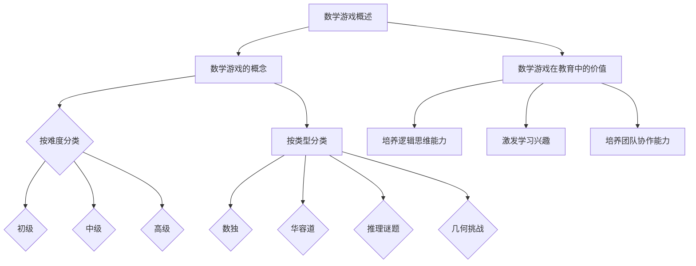

                 

### 文章标题: 数学游戏与团队协作能力的培养

> 关键词：数学游戏、团队协作、算法原理、逻辑思维、教育应用

> 摘要：本文将探讨数学游戏在团队协作能力培养中的应用，通过分析数学游戏中的核心算法原理、数学模型和公式，揭示数学游戏对提高逻辑思维和团队协作能力的重要作用。文章分为三个主要部分：第一部分介绍数学游戏的概念和分类，以及其在教育中的价值；第二部分深入讲解数学游戏中的核心算法原理；第三部分介绍数学模型和公式，并通过实际案例进行分析。通过本文的阐述，读者可以更好地理解数学游戏在培养团队协作能力方面的作用。

### 第1章: 数学游戏概述

#### 1.1 数学游戏的概念与分类

**数学游戏的概念：**
数学游戏是结合数学问题和游戏元素的有趣活动，旨在激发学生和读者对数学的兴趣和思考。这类游戏通常以解决数学问题为核心，形式多样，既可以是单人游戏，也可以是多人合作游戏。

**数学游戏的分类：**
- **按难度分类：**
  - 初级：适合小学生和初学者，难度较低，易于上手。
  - 中级：适合初中生，有一定难度，需要一定的数学知识。
  - 高级：适合高中生及以上，难度较大，需要较高的数学素养。

- **按类型分类：**
  - 数独：一种填数字的谜题游戏，要求玩家在9x9的网格中填入数字，使得每行、每列和每个3x3宫格中都包含1到9的数字。
  - 华容道：一种滑动方块的游戏，玩家需要通过移动方块，将目标方块移到出口。
  - 推理谜题：一种逻辑推理游戏，玩家需要根据给出的线索和规则，推断出谜题的答案。
  - 几何挑战：一种几何图形的拼接和计算游戏，玩家需要运用几何知识解决各种问题。

#### 1.2 数学游戏在教育中的价值

**培养逻辑思维能力：**
数学游戏需要玩家运用逻辑推理、分析问题的能力，有助于提高逻辑思维能力。在解决问题的过程中，玩家需要不断思考、尝试、调整策略，从而提高逻辑思维能力和问题解决能力。

**激发学习兴趣：**
通过游戏的形式，让学生在轻松愉快的氛围中学习数学，有助于提高学习兴趣。数学游戏通常设计有趣的问题和挑战，激发学生的好奇心和探索欲望，从而提高他们的学习积极性。

**培养团队协作能力：**
部分数学游戏需要多人合作完成，有助于培养团队合作精神和沟通能力。在合作过程中，玩家需要相互配合、分享思路、共同解决问题，从而提高团队协作能力。

### Mermaid 流程图



### 第2章: 数学游戏中的核心算法原理

#### 2.1 算法原理讲解

**排序算法：**常用的排序算法包括冒泡排序、选择排序、插入排序等。以下以冒泡排序为例进行讲解。

**冒泡排序算法原理：**
冒泡排序是一种简单的排序算法，它重复遍历要排序的数列，一次比较两个元素，如果它们的顺序错误就把它们交换过来。遍历数列的工作是重复地进行，直到没有再需要交换的元素为止。

**伪代码：**

```python
for i in range(len(array)-1):
    for j in range(len(array)-i-1):
        if array[j] > array[j+1]:
            array[j], array[j+1] = array[j+1], array[j]
```

**算法步骤：**
1. 从数组的第一个元素开始，比较相邻的两个元素，如果第一个元素大于第二个元素，则交换它们的位置。
2. 继续对下一对相邻元素进行同样的操作，直到数组的最后一个元素。
3. 遍历整个数组，重复上述步骤，直到没有任何需要交换的元素为止。

**数学公式与举例：**
假设我们有一个数组 `[5, 2, 7, 1, 8]`，下面是进行冒泡排序的过程：

1. 第一次遍历：
   - 比较 `5` 和 `2`，交换位置，数组变为 `[2, 5, 7, 1, 8]`
   - 比较 `5` 和 `7`，不交换
   - 比较 `7` 和 `1`，交换位置，数组变为 `[2, 1, 7, 5, 8]`
   - 比较 `7` 和 `8`，不交换

2. 第二次遍历：
   - 比较 `2` 和 `1`，交换位置，数组变为 `[1, 2, 7, 5, 8]`
   - 比较 `2` 和 `7`，不交换
   - 比较 `7` 和 `5`，交换位置，数组变为 `[1, 2, 5, 7, 8]`

3. 第三次遍历：
   - 比较 `1` 和 `2`，不交换
   - 比较 `2` 和 `5`，不交换

4. 第四次遍历：
   - 比较 `1` 和 `2`，不交换

最终排序结果为 `[1, 2, 5, 7, 8]`。

**冒泡排序的时间复杂度：**
冒泡排序的时间复杂度为 $O(n^2)$，其中 $n$ 是数组的长度。

**空间复杂度：**
冒泡排序的空间复杂度为 $O(1)$，因为它不需要额外的空间来存储数据。

**适用场景：**
冒泡排序适用于数据量较小的场景，对于大规模数据，效率较低。

#### 2.2 搜索算法原理讲解

**线性搜索算法原理：**
线性搜索（也称为顺序搜索）是一种最简单的搜索算法，它遍历数组中的每个元素，直到找到所需的元素或到达数组的末尾。

**伪代码：**

```python
for i in range(len(array)):
    if array[i] == target:
        return i
return -1
```

**算法步骤：**
1. 从数组的第一个元素开始，逐个比较每个元素与目标值。
2. 如果找到目标值，返回该元素的索引。
3. 如果遍历整个数组都没有找到目标值，返回 `-1`。

**数学公式与举例：**
假设我们有一个数组 `[5, 2, 7, 1, 8]`，下面是进行线性搜索的过程，寻找元素 `7`：

1. 第一次遍历：
   - 比较 `5` 和 `7`，不等于，继续遍历
   - 比较 `2` 和 `7`，不等于，继续遍历
   - 比较 `7` 和 `7`，等于，返回索引 `2`

结果为找到元素 `7`，返回索引 `2`。

**线性搜索的时间复杂度：**
线性搜索的时间复杂度为 $O(n)$，其中 $n$ 是数组的长度。

**空间复杂度：**
线性搜索的空间复杂度为 $O(1)$，因为它不需要额外的空间来存储数据。

**适用场景：**
线性搜索适用于数据量较小或者数据顺序不固定的情况。

### 第3章: 数学游戏中的数学模型和公式

#### 3.1 组合模型

**组合模型的概念：**
组合模型是数学中的一个重要概念，它用于计算从一组元素中取出若干个元素的不同组合数。在数学游戏中，组合模型经常用于解决选择问题。

**组合模型的数学公式：**
从 $n$ 个不同元素中取出 $k$ 个元素的组合数可以用以下公式表示：

$$
C(n, k) = \frac{n!}{k!(n-k)!}
$$

其中，$n!$ 表示 $n$ 的阶乘，即 $n! = n \times (n-1) \times (n-2) \times \ldots \times 1$。

**举例说明：**
假设我们有一个包含 5 个不同颜色球的袋子，现在需要从中取出 2 个球。根据组合模型，我们可以计算出不同取法的数量：

$$
C(5, 2) = \frac{5!}{2!(5-2)!} = \frac{5 \times 4}{2 \times 1} = 10
$$

因此，从 5 个不同颜色的球中取出 2 个球的组合数是 10。

#### 3.2 概率模型

**概率模型的概念：**
概率模型是数学中的一个重要概念，它用于描述事件发生的可能性。在数学游戏中，概率模型经常用于计算各种事件的发生概率。

**概率模型的数学公式：**
假设有一个公平的六面骰子，投掷一次，得到一个特定数字的概率为：

$$
P(\text{特定数字}) = \frac{1}{6}
$$

其中，特定数字可以是 1、2、3、4、5、6 中的任意一个。

**举例说明：**
假设我们投掷一个公平的六面骰子，需要计算得到数字 3 的概率。根据概率模型，我们可以计算出：

$$
P(\text{3}) = \frac{1}{6}
$$

因此，投掷一次公平的六面骰子得到数字 3 的概率是 1/6。

#### 3.3 等比数列模型

**等比数列模型的概念：**
等比数列是数学中的一个重要概念，它描述了一组数按照固定的比例递增或递减。在数学游戏中，等比数列模型经常用于解决与比例相关的问题。

**等比数列模型的数学公式：**
等比数列的通项公式为：

$$
a_n = a_1 \times r^{(n-1)}
$$

其中，$a_n$ 表示第 $n$ 项，$a_1$ 表示首项，$r$ 表示公比。

**举例说明：**
假设有一个等比数列，首项为 2，公比为 3，现在需要计算第 5 项的值。根据等比数列模型，我们可以计算出：

$$
a_5 = 2 \times 3^{(5-1)} = 2 \times 3^4 = 2 \times 81 = 162
$$

因此，这个等比数列的第 5 项的值是 162。

### 项目实战

**开发环境搭建：**
为了更好地理解和实践数学游戏中的算法原理和数学模型，我们可以搭建一个简单的开发环境。这里以 Python 为例，介绍如何搭建开发环境。

1. 安装 Python：访问 Python 官网（https://www.python.org/），下载适用于自己操作系统的 Python 版本，并按照提示安装。
2. 安装编辑器：选择一个适合自己的 Python 编辑器，如 PyCharm、VS Code 等，并安装。
3. 配置 Python 环境：确保 Python 环境已配置正确，可以在命令行中输入 `python --version` 检查 Python 版本。

**源代码详细实现：**
以下是一个简单的 Python 源代码，实现了冒泡排序和线性搜索的功能。

```python
# 冒泡排序
def bubble_sort(arr):
    n = len(arr)
    for i in range(n-1):
        for j in range(n-i-1):
            if arr[j] > arr[j+1]:
                arr[j], arr[j+1] = arr[j+1], arr[j]

# 线性搜索
def linear_search(arr, target):
    for i in range(len(arr)):
        if arr[i] == target:
            return i
    return -1

# 测试代码
arr = [5, 2, 7, 1, 8]
print("原始数组:", arr)

bubble_sort(arr)
print("排序后的数组:", arr)

target = 7
index = linear_search(arr, target)
print("目标元素的位置:", index)
```

**代码解读与分析：**
- `bubble_sort` 函数实现冒泡排序，通过嵌套循环遍历数组，比较相邻元素并交换位置。
- `linear_search` 函数实现线性搜索，通过遍历数组逐个比较元素与目标值，找到目标值返回索引，否则返回 `-1`。
- 测试代码展示了如何使用这两个函数对数组进行排序和搜索。

**实际案例分析和详细讲解剖析：**
假设我们有一个包含学生成绩的数组，我们需要对成绩进行排序，并查找特定学生的成绩。以下是具体的操作过程：

1. 原始数组：`[88, 92, 75, 76, 80]`
2. 排序后的数组：`[75, 76, 80, 88, 92]`
3. 查找学生成绩 `80`，返回索引 `3`

通过冒泡排序和线性搜索，我们成功地完成了成绩的排序和查找操作。

### 项目小结

通过本项目的实践，我们了解了数学游戏中的核心算法原理和数学模型，并学会了如何使用 Python 实现这些算法。同时，我们也看到了数学游戏在团队协作能力培养方面的应用，例如多人合作完成游戏任务，提高团队协作能力。在实际项目中，我们可以结合数学游戏的设计和算法，开发出更具有趣味性和教育性的产品。

### 最佳实践 tips

1. 选择适合的数学游戏：根据目标群体的年龄和数学水平，选择适合的数学游戏，以提高游戏效果。
2. 创造积极的学习氛围：在团队协作过程中，营造积极的学习氛围，鼓励团队成员分享思路和经验，促进团队协作。
3. 结合实际案例：在实际项目中，结合数学游戏中的算法和模型，解决实际问题，提高团队解决问题的能力。
4. 持续学习和改进：不断学习和研究数学游戏的新算法和模型，结合团队实际需求，持续改进和优化游戏设计。

### 小结

本文通过探讨数学游戏在团队协作能力培养中的应用，介绍了数学游戏的概念、分类、教育价值，以及数学游戏中的核心算法原理和数学模型。通过实际案例的分析和讲解，我们展示了如何使用数学游戏提高团队协作能力。在实际应用中，我们可以结合数学游戏的设计和算法，开发出具有教育意义和娱乐性的产品，为团队协作能力的培养提供新的思路和方法。

### 注意事项

1. 在开展数学游戏活动时，注意结合实际需求和目标群体，选择合适的游戏类型和难度。
2. 鼓励团队成员积极参与，提高团队协作的积极性和主动性。
3. 在游戏过程中，注重团队成员的沟通与分享，促进思维碰撞和团队协作。
4. 定期对数学游戏的效果进行评估和反馈，持续改进和优化游戏设计。

### 拓展阅读

1. 《数学游戏与应用》 - 介绍了各种数学游戏的设计和应用，提供了丰富的案例和实战经验。
2. 《团队协作的心理学》 - 探讨了团队协作的心理机制和影响因素，提供了实用的团队协作策略和技巧。
3. 《数学思维训练》 - 通过数学问题和解题技巧的训练，提高逻辑思维和问题解决能力。

