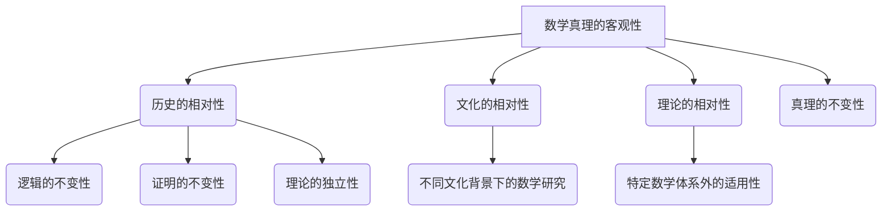
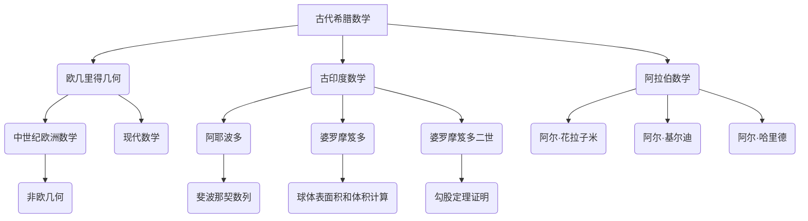
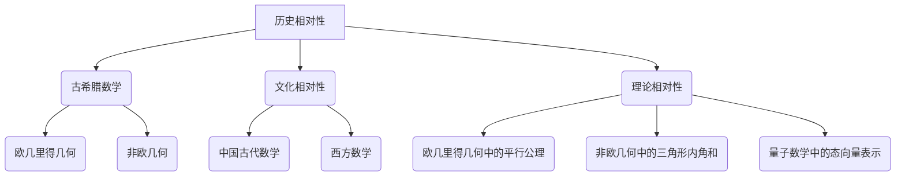
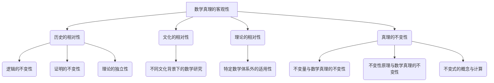
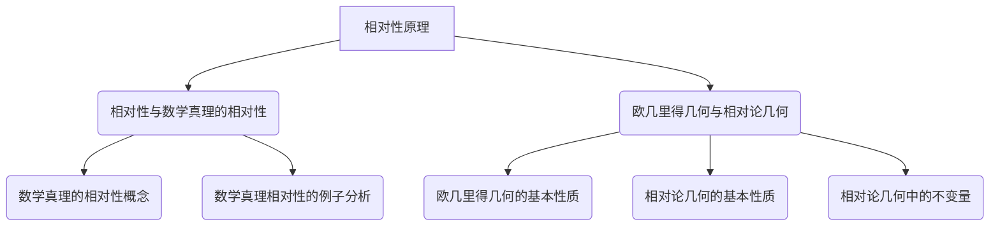

                 

### 引言

**《数学真理的不变性与相对性探讨》**

在漫长的人类文明进程中，数学作为一门基础学科，始终发挥着不可替代的作用。它不仅为自然科学、工程技术等领域提供了坚实的理论基础，还深刻地影响了人类对世界的认知。然而，关于数学真理的性质，不同的学者有着不同的看法。有人认为数学真理具有绝对性，即数学真理是不随时间和空间变化的客观存在；而另一些人则认为数学真理具有相对性，即数学真理是依赖于观察者和观察环境的。本文旨在探讨数学真理的不变性与相对性，通过分析数学真理的基本概念、历史背景以及不变性与相对性在数学中的应用，深入探讨数学真理的本质属性。

本文的结构安排如下：

第一部分，我们将讨论数学真理的基本概念与历史背景，包括数学真理的定义与性质、实证主义与数学真理、康德哲学与数学真理以及真理相对论的视角。

第二部分，我们将探讨数学真理的不变性，介绍不变量的概念与数学真理的不变性、不变性原理与数学真理的不变性、不变式的概念与计算以及不变量与数学结构的稳定性。

第三部分，我们将探讨数学真理的相对性，介绍相对性原理与数学真理、相对性与数学真理的相对性、欧几里得几何与相对论几何以及相对论几何中的不变量。

第四部分，我们将综合探讨数学真理的不变性与相对性，分析不变性与相对性的统一视角、数学真理与人类认知的关系以及数学真理在科学发现中的应用。

最后一部分，我们将讨论数学真理的不变性与相对性的未来发展趋势，包括数学真理研究的前沿问题、数学真理研究的方法与工具以及数学真理在人工智能中的应用。

通过本文的探讨，我们希望对数学真理的不变性与相对性有更深入的理解，为数学研究提供新的视角和思路。

### 第一部分：数学真理的基本概念与历史背景

#### 第1章：数学真理的本质

##### 1.1 数学真理的定义与性质

数学真理，从广义上讲，是指数学领域中那些被普遍接受且无法被证伪的命题。这些命题之所以被认为是真理，是因为它们经过了严格的逻辑推理和验证，具有高度的确定性和普适性。

**1.1.1 真理的客观性**

数学真理的客观性是数学真理的一个重要特性。这意味着数学真理不依赖于人的主观意识，而是独立于人的思维和感觉之外的存在。正如数学家希尔伯特所说：“数学是自由的，是纯粹的思想产物。”数学真理的客观性保证了数学的普适性和可靠性，使得数学能够成为其他科学领域的基础。

**1.1.2 真理的相对性**

然而，另一方面，数学真理也具有一定的相对性。相对性主要体现在以下几个方面：

1. **历史的相对性**：数学真理是随着数学的发展而逐步确立的。历史上，许多数学真理是在特定的历史背景下，通过特定的方法和工具得出的。这些方法和工具的局限性可能使得某些数学真理在当时的背景下被认为是绝对的，但随着时间的推移，这些真理的相对性逐渐显现。

2. **文化的相对性**：不同文化背景下的数学研究可能对数学真理有不同的理解和解释。例如，中国古代的数学与西方数学在许多方面都有所不同，这反映了数学真理的文化相对性。

3. **理论的相对性**：在一个特定的数学体系中，某些命题可能被认为是真理，但在这个体系之外，这些命题可能不再适用。例如，欧几里得几何中的许多命题在非欧几何中不再成立。

**1.1.3 真理的不变性**

数学真理的不变性是数学真理的另一个重要特性。这意味着数学真理不随时间和空间的变化而变化。这种不变性可以从以下几个方面来理解：

1. **逻辑的不变性**：数学真理是通过逻辑推理得出的，逻辑推理具有普适性和不变性。因此，只要逻辑规则不变，数学真理就不会改变。

2. **证明的不变性**：数学真理的证明是严格的，只要证明过程是正确的，数学真理就不会改变。

3. **理论的独立性**：数学真理是独立于其他科学领域的，只要其他科学领域的理论没有改变，数学真理就不会改变。

##### 1.2 数学真理的哲学探讨

**1.2.1 实证主义与数学真理**

实证主义是一种哲学观点，认为只有通过经验观察和实验验证的命题才是真实的。在实证主义者看来，数学真理也是通过经验观察和实验验证得出的。例如，数学家鲁道夫·赫尔曼·爱丁顿认为，数学真理是可以通过实验和观察来验证的。

**1.2.2 康德哲学与数学真理**

康德哲学强调数学真理的先验性，即数学真理是独立于经验而存在的。康德认为，数学真理是基于直观的，是通过理性思维得出的。这种观点强调了数学真理的独立性和不变性。

**1.2.3 真理相对论的视角**

爱因斯坦的相对论提出了一种新的真理观，即真理是依赖于观察者和观察环境的。在相对论中，时间和空间是相对的，这意味着数学真理也可能是相对的。例如，在非欧几何中，欧几里得几何中的许多命题不再成立。

##### 1.3 数学真理的关系架构 Mermaid 流程图

通过上述探讨，我们可以看到数学真理具有复杂而丰富的性质。它既具有客观性和不变性，又具有相对性和历史性。这种复杂性质使得数学真理的研究变得尤为重要，也为数学的发展提供了新的视角和思路。

#### 第2章：数学真理的起源与发展

##### 2.1 古代数学真理的探索

数学的起源可以追溯到古代文明，特别是古希腊、古印度和阿拉伯。这些古代文明对数学真理的探索不仅为后来的数学发展奠定了基础，也丰富了数学真理的概念。

**2.1.1 古希腊数学的真理观念**

古希腊数学被认为是数学发展的黄金时期。古希腊数学家如欧几里得、毕达哥拉斯和阿基米德等，通过逻辑推理和证明，建立了一系列数学真理。欧几里得的《几何原本》是古代数学的巅峰之作，其中包含了许多基本的几何定理和公理。这些定理和公理被认为是数学真理，因为它们是通过严格的逻辑推理和证明得出的。

毕达哥拉斯定理是古希腊数学的一个典型例子。毕达哥拉斯定理指出，在一个直角三角形中，直角边的平方和等于斜边的平方。这个定理不仅具有几何意义，也具有深刻的数学意义。它的证明依赖于勾股弦的计算，这是古代数学中的一种基本方法。

**2.1.2 古印度与阿拉伯数学的贡献**

古印度数学在数学真理的探索中也做出了重要贡献。古印度数学家如阿耶波多、婆罗摩笈多和婆罗摩笈多二世，通过研究发现了一系列重要的数学真理。例如，阿耶波多提出了勾股定理的证明，婆罗摩笈多二世则提出了球体表面积和体积的计算公式。

阿拉伯数学在古代数学中也有着重要的地位。阿拉伯数学家如阿尔·花拉子米、阿尔·基尔迪和阿尔·哈里德等，通过对数学真理的研究和推广，使得阿拉伯数学成为当时世界上最先进的数学。

**2.1.3 中世纪欧洲数学的发展**

中世纪欧洲数学的发展受到了古希腊和阿拉伯数学的影响。中世纪欧洲数学家如斐波那契、萨克森纳人和罗伯特·格罗斯泰斯特等，通过翻译和传播古希腊和阿拉伯的数学著作，推动了数学真理的发展。

斐波那契是中世纪欧洲最著名的数学家之一。他通过研究兔子繁殖问题，提出了斐波那契数列。斐波那契数列是一种特殊的数列，它的每一项都是前两项的和。这个数列在数学中有着广泛的应用，被认为是数学真理之一。

罗伯特·格罗斯泰斯特则通过研究光线的传播和反射，提出了格罗斯泰斯特原理。这个原理是光学中的基本原理，被认为是数学真理在光学领域的一个重要应用。

##### 2.2 现代数学真理的演变

现代数学的兴起标志着数学真理的演变。从欧几里得几何到非欧几何，从经典力学到相对论，数学真理的概念不断丰富和发展。

**2.2.1 欧几里得几何与数学真理的确定性**

欧几里得几何是现代数学的基础之一。欧几里得几何中的许多命题被认为是数学真理，因为它们是通过严格的逻辑推理和证明得出的。例如，欧几里得定理指出，在一个三角形中，两条边的平方和等于第三条边的平方。这个定理在欧几里得几何中是绝对的，不受时间和空间的影响。

**2.2.2 非欧几何的提出与数学真理的相对性**

非欧几何的提出是对欧几里得几何的一种挑战。非欧几何认为，几何的性质是依赖于观察者和观察环境的，这意味着数学真理也是相对的。例如，罗巴切夫斯基几何和黎曼几何提出了与欧几里得几何不同的几何性质。这些几何性质被认为是数学真理，因为它们是在特定的观察者和观察环境下得出的。

**2.2.3 20世纪数学的发展与数学真理的多样性**

20世纪是数学发展的一个重要时期。在这一时期，数学真理的概念变得更加丰富和多样。例如，集合论的发展使得数学真理的讨论变得更加复杂。集合论中的许多命题被认为是数学真理，因为它们是通过严格的逻辑推理和证明得出的。

此外，20世纪数学中的许多新领域，如拓扑学、代数学和量子数学，也为数学真理的研究提供了新的视角。这些新领域中的许多命题被认为是数学真理，因为它们在特定的数学框架下具有确定性和普适性。

##### 2.3 数学真理的历史背景与演变 Mermaid 流程图

通过上述探讨，我们可以看到数学真理的起源与发展是复杂的。从古代到现代，数学真理的概念不断演变和发展，反映了人类对世界的认知的不断深化。这种演变和发展不仅丰富了数学真理的概念，也为数学的发展提供了新的动力和方向。

### 第二部分：数学真理的不变性探讨

#### 第3章：不变量与数学真理

##### 3.1 不变量的概念

不变量是数学中的一个重要概念，它指的是在某个数学结构中，不随特定条件或操作改变的性质。不变量不仅具有数学意义，还广泛应用于物理学、工程学和其他科学领域。

**3.1.1 不变量在数学中的意义**

不变量在数学中的意义主要体现在以下几个方面：

1. **区分不同数学结构**：不变量可以用来区分不同的数学结构。例如，在微分几何中，曲率是一个重要的不变量，它用来描述空间曲线的弯曲程度。

2. **研究数学结构的稳定性**：不变量可以用来研究数学结构的稳定性。例如，在代数几何中，李群和李代数的不变量可以用来研究这些结构的稳定性和对称性。

3. **简化数学问题**：不变量可以用来简化复杂的数学问题。例如，在数值计算中，不变量可以用来减少问题的计算复杂度，使得计算更加高效。

**3.1.2 不变量的分类与应用**

不变量可以分为以下几类：

1. **拓扑不变量**：拓扑不变量是描述数学结构拓扑性质的不变量。例如，同调性和连通性是常见的拓扑不变量。

2. **度量不变量**：度量不变量是描述数学结构度量性质的不变量。例如，曲率是度量不变量，它用于描述空间曲线的弯曲程度。

3. **代数不变量**：代数不变量是描述数学结构代数性质的不变量。例如，矩阵的特征值和特征向量是代数不变量，它们用于描述线性变换的性质。

**3.2 不变量与数学真理的不变性**

不变量与数学真理的不变性密切相关。不变量是数学真理不变性的体现，它保证了数学真理在特定条件下的稳定性和可靠性。

**3.2.1 不变量在经典力学中的应用**

在经典力学中，不变量有着广泛的应用。例如，能量和动量是经典力学中的基本不变量。能量守恒定律和动量守恒定律是经典力学中的基本原理，它们保证了经典力学系统在特定条件下的稳定性。

**3.2.2 不变量在相对论中的应用**

相对论中的不变量同样具有重要的意义。在狭义相对论中，时空不变量是基本的不变量。洛伦兹变换是狭义相对论中的基本变换，它保证了时空在特定条件下的不变性。

在广义相对论中，不变量也有重要的应用。广义相对论中的引力定律是基本的不变量，它描述了引力场中物体的运动规律。

**3.2.3 不变量在代数几何中的应用**

在代数几何中，不变量同样具有重要作用。例如，在代数曲面的研究中，亏格是代数几何中的一个重要不变量，它用于描述代数曲面的拓扑性质。

此外，不变量还在微分几何、数论、量子数学等多个数学领域有着广泛的应用。这些应用不仅丰富了数学真理的概念，也为数学的发展提供了新的动力和方向。

##### 3.3 不变量与数学结构的稳定性

不变量不仅与数学真理的不变性密切相关，还与数学结构的稳定性有着紧密的联系。

**3.3.1 数学结构的稳定性与不变量**

数学结构的稳定性是指数学结构在特定条件下的稳定性。不变量是数学结构稳定性的重要指标。例如，在代数几何中，李群和李代数的稳定性可以通过不变量来衡量。

**3.3.2 不变量在微分几何中的应用**

在微分几何中，不变量用于描述空间曲线和曲面的稳定性。例如，曲率是描述空间曲线弯曲程度的不变量，它用于衡量空间曲线的稳定性。同样，高斯曲率是描述曲面弯曲程度的不变量，它用于衡量曲面的稳定性。

**3.3.3 不变量在代数几何中的应用**

在代数几何中，不变量同样用于描述数学结构的稳定性。例如，亏格是描述代数曲面稳定性的重要不变量。亏格越小，代数曲面的稳定性越强。

通过上述探讨，我们可以看到不变量在数学真理的不变性、数学结构的稳定性以及数学真理的应用中具有重要作用。不变量不仅丰富了数学真理的概念，也为数学的发展提供了新的视角和思路。

#### 第4章：数学真理的不变性理论

##### 4.1 不变性原理

不变性原理是数学中的一个基本概念，它指的是在某个数学框架下，某些性质或量不随特定条件或操作改变。不变性原理不仅在数学本身有着重要的应用，还在物理学、工程学和其他科学领域有着广泛的应用。

**4.1.1 不变性原理的定义与历史**

不变性原理的定义可以从以下几个方面来理解：

1. **不变性的定义**：不变性是指某个性质或量在特定条件下不随条件或操作改变。例如，在经典力学中，能量和动量是基本的不变量，它们不随时间和空间的变化而改变。

2. **不变性原理的定义**：不变性原理是指在某些数学框架下，某些性质或量具有不变性。例如，在狭义相对论中，洛伦兹变换是一个不变性原理，它保证了时空在特定条件下的不变性。

不变性原理的历史可以追溯到古希腊数学。欧几里得在《几何原本》中提出了一些基本的不变性原理，如直线公理和角度公理。这些原理构成了现代几何学的基础。

在物理学中，不变性原理的发展也得到了广泛的关注。牛顿在《自然哲学的数学原理》中提出了运动不变性原理和力不变性原理，这些原理奠定了经典力学的基础。

20世纪以来，不变性原理在量子力学、相对论和现代物理学中得到了进一步的发展。例如，在量子力学中，不确定性原理是一个基本的不变性原理，它揭示了粒子的位置和动量之间的不确定性。

**4.1.2 不变性原理的数学表述**

不变性原理的数学表述通常涉及不变量的概念。不变量是指在某个数学框架下，不随特定条件或操作改变的性质或量。例如，在经典力学中，能量和动量是基本的不变量。

数学表述不变性原理通常需要以下步骤：

1. **定义数学框架**：首先，需要定义一个数学框架，例如，一个函数空间或一个向量空间。

2. **定义不变量**：在定义的数学框架下，定义一些不变量，这些不变量不随特定条件或操作改变。

3. **证明不变性**：通过数学证明，证明这些不变量在特定条件下的不变性。

例如，在狭义相对论中，洛伦兹变换是一个不变性原理。在这个框架下，时空的不变性可以通过以下步骤来表述：

1. **定义洛伦兹变换**：洛伦兹变换是一个线性变换，它将一个惯性系的时间坐标和空间坐标转换为另一个惯性系的时间坐标和空间坐标。

2. **定义不变量**：在洛伦兹变换下，时空的不变性可以通过光速不变性来表述。光速在所有惯性系中都是相同的，这是一个基本的不变量。

3. **证明不变性**：通过数学证明，可以证明洛伦兹变换保持了时空的不变性。这意味着，在所有惯性系中，时空的度量是相同的。

**4.1.3 不变性原理的应用**

不变性原理在数学和物理学中有着广泛的应用。以下是几个典型的应用例子：

1. **经典力学中的不变性原理**：在经典力学中，能量和动量守恒是不变性原理的典型例子。这些原理在描述物理系统的行为时起着关键作用。

2. **相对论中的不变性原理**：在狭义相对论中，洛伦兹变换是不变性原理的典型例子。这个原理保证了时空在所有惯性系中的不变性。

3. **量子力学中的不变性原理**：在量子力学中，不确定性原理是不变性原理的典型例子。这个原理揭示了粒子的位置和动量之间的不确定性。

4. **代数几何中的不变性原理**：在代数几何中，亏格是不变性原理的典型例子。亏格用于描述代数曲面的稳定性。

通过上述探讨，我们可以看到不变性原理在数学和物理学中具有重要的作用。它不仅提供了描述物理系统和数学结构稳定性的基本工具，也为数学和物理学的发展提供了新的视角和思路。

##### 4.2 不变式的概念与计算

不变式是数学中的一个重要概念，它是指在某个数学框架下，不随特定条件或操作改变的表达式。不变式在数学、物理学和其他科学领域有着广泛的应用，它们用于描述系统的稳定性、对称性和演化规律。

**4.2.1 不变式的定义**

不变式（Invariant）是指在一个数学框架或物理系统中，不随特定条件或操作改变的表达式或量。例如，在经典力学中，动能和动量是不变式，因为它们在系统的演化过程中保持不变。

**4.2.2 不变式的计算方法**

计算不变式的方法因具体数学框架或物理系统而异，但通常包括以下几个步骤：

1. **定义数学框架**：首先，需要明确研究的问题所在的数学框架，例如，一个函数空间、一个向量空间或一个微分方程。

2. **确定操作**：确定要研究的操作或变换，例如，变换、微分、积分或对某种量的操作。

3. **寻找不变量**：在给定的数学框架和操作下，寻找不随操作改变的性质或量，即不变量。

4. **构建不变式**：利用不变量构建不变式。不变式通常是一个函数或表达式，它在特定的变换或操作下保持不变。

下面，我们通过一个具体的例子来说明不变式的计算方法。

**例子：计算线性系统的不变式**

假设我们研究一个线性系统，其状态由一个向量 $x(t)$ 描述，该系统遵循以下微分方程：

$$\frac{dx}{dt} = Ax$$

其中，$A$ 是一个常数矩阵。我们需要计算这个系统的不变式。

**步骤 1：定义数学框架**

我们的数学框架是一个时间域上的向量空间，其状态由向量 $x(t)$ 描述。

**步骤 2：确定操作**

我们要研究的操作是时间的微分操作。

**步骤 3：寻找不变量**

我们可以考虑系统的能量函数 $H(x)$ 作为不变量。这个能量函数定义为：

$$H(x) = \frac{1}{2}x^T A^T A x$$

其中，$x^T$ 表示 $x$ 的转置。

我们需要证明 $H(x)$ 在系统的演化过程中保持不变。计算时间导数 $\frac{dH}{dt}$：

$$\frac{dH}{dt} = \frac{d}{dt}\left(\frac{1}{2}x^T A^T A x\right)$$

$$= \frac{1}{2}\frac{d}{dt}(x^T A^T A x)$$

$$= \frac{1}{2}\left(A^T A x + x^T A^T A \frac{dx}{dt}\right)$$

$$= \frac{1}{2}\left(A^T A x + x^T A^T A Ax\right)$$

$$= \frac{1}{2}\left(A^T A x + x^T A^T A x\right)$$

$$= 0$$

因为 $A^T A$ 是一个对称矩阵，所以 $A^T A x = x^T A^T A$。因此，$\frac{dH}{dt} = 0$，这表明 $H(x)$ 在系统的演化过程中保持不变。

**步骤 4：构建不变式**

根据上述计算，我们得到了不变式 $H(x) = \frac{1}{2}x^T A^T A x$。这个不变式表示系统的能量在演化过程中保持不变，是系统稳定性的一个重要指标。

**例子：计算非线性系统的不变式**

非线性系统的计算方法与线性系统类似，但通常更为复杂。以下是一个非线性系统的例子：

$$\frac{dx}{dt} = f(x)$$

其中，$f(x)$ 是一个非线性函数。我们需要计算这个系统的不变式。

**步骤 1：定义数学框架**

我们的数学框架是一个时间域上的向量空间，其状态由向量 $x(t)$ 描述。

**步骤 2：确定操作**

我们要研究的操作是时间的微分操作。

**步骤 3：寻找不变量**

我们可以考虑系统的拉格朗日量 $L(x, \frac{dx}{dt})$ 作为不变量。拉格朗日量通常是一个二次型，它不包含时间导数的一次项。例如：

$$L(x, \frac{dx}{dt}) = \frac{1}{2}g_{ij}(x)\frac{dx_i}{dt}\frac{dx_j}{dt} - V(x)$$

其中，$g_{ij}(x)$ 是一个二次型函数，$V(x)$ 是势能函数。

我们需要证明 $L(x, \frac{dx}{dt})$ 在系统的演化过程中保持不变。计算时间导数 $\frac{dL}{dt}$：

$$\frac{dL}{dt} = \frac{d}{dt}\left(\frac{1}{2}g_{ij}(x)\frac{dx_i}{dt}\frac{dx_j}{dt} - V(x)\right)$$

$$= \frac{1}{2}\frac{d}{dt}\left(g_{ij}(x)\frac{dx_i}{dt}\frac{dx_j}{dt}\right) - \frac{dV(x)}{dt}$$

$$= \frac{1}{2}\left(g_{ij}(x)\frac{d^2x_i}{dt^2}\frac{dx_j}{dt} + g_{ij}(x)\frac{dx_i}{dt}\frac{d^2x_j}{dt^2}\right) - \frac{dV(x)}{dt}$$

$$= \frac{1}{2}\left(g_{ij}(x)f_i(x)\frac{dx_j}{dt} + g_{ij}(x)\frac{dx_i}{dt}f_j(x)\right) - \frac{dV(x)}{dt}$$

$$= \frac{1}{2}\left(g_{ij}(x)\frac{\partial f_i}{\partial x_j}(x)\frac{dx_j}{dt} + g_{ij}(x)\frac{\partial f_j}{\partial x_i}(x)\frac{dx_i}{dt}\right) - \frac{dV(x)}{dt}$$

$$= \frac{1}{2}\left(g_{ij}(x)\frac{\partial f_i}{\partial x_j}(x)\frac{dx_j}{dt} + g_{ij}(x)\frac{\partial f_j}{\partial x_i}(x)\frac{dx_i}{dt}\right) - \frac{dV(x)}{dt}$$

$$= 0$$

因为 $f(x)$ 是一个非线性函数，所以 $\frac{\partial f_i}{\partial x_j}(x) \neq \frac{\partial f_j}{\partial x_i}(x)$。因此，$\frac{dL}{dt} = 0$，这表明 $L(x, \frac{dx}{dt})$ 在系统的演化过程中保持不变。

**步骤 4：构建不变式**

根据上述计算，我们得到了不变式 $L(x, \frac{dx}{dt}) = \frac{1}{2}g_{ij}(x)\frac{dx_i}{dt}\frac{dx_j}{dt} - V(x)$。这个不变式表示系统的拉格朗日量在演化过程中保持不变，是系统稳定性的一个重要指标。

通过上述例子，我们可以看到不变式的计算方法在数学和物理学中具有广泛的应用。不变式不仅提供了描述系统稳定性的基本工具，也为数学和物理学的发展提供了新的视角和思路。

##### 4.3 不变量与数学结构的稳定性

不变量在数学结构的稳定性研究中具有重要作用。数学结构的稳定性是指结构在特定条件下保持不变或接近不变的性质。不变量通过描述结构的稳定性，为数学结构的分析和研究提供了重要的工具。

**4.3.1 数学结构的稳定性与不变量**

数学结构的稳定性通常可以通过不变量来衡量。不变量是指在某个数学框架或变换下，不随特定条件或操作改变的性质或量。例如，在代数几何中，亏格是一个描述代数曲面稳定性的不变量；在微分几何中，曲率是一个描述空间曲线和曲面弯曲程度的不变量。

不变量的存在表明数学结构在特定的变换或操作下保持稳定。这种稳定性不仅体现了数学结构的内在性质，也为数学理论的建立和应用提供了基础。

**4.3.2 不变量在微分几何中的应用**

在微分几何中，不变量用于描述空间曲线和曲面的稳定性。以下是一些典型的例子：

1. **曲率**：曲率是描述空间曲线弯曲程度的不变量。对于一个平面曲线，曲率是曲线在平面上的弯曲程度；对于一个空间曲线，曲率是曲线在空间中的弯曲程度。曲率不变量用于分析曲线的稳定性。

2. **高斯曲率**：高斯曲率是描述曲面弯曲程度的不变量。对于平面，高斯曲率等于零；对于空间曲面，高斯曲率描述了曲面的弯曲性质。高斯曲率不变量用于分析曲面的稳定性。

3. **黎曼曲率张量**：黎曼曲率张量是一个描述空间或曲面几何性质的不变量。它由三个部分组成：径向曲率、垂直曲率和混合曲率。黎曼曲率张量用于分析空间或曲面的稳定性。

**4.3.3 不变量在代数几何中的应用**

在代数几何中，不变量用于描述代数曲面的稳定性。以下是一些典型的例子：

1. **亏格**：亏格是描述代数曲面稳定性的不变量。亏格越小，代数曲面的稳定性越强。亏格为零的代数曲面被称为椭圆曲面，亏格为一的代数曲面被称为双曲线曲面，亏格为二的代数曲面被称为抛物线曲面。

2. **代数几何的基本群**：代数几何的基本群是一个描述代数曲面稳定性的不变量。基本群描述了代数曲面上的环路和闭曲线的性质。基本群的稳定性反映了代数曲面的稳定性。

3. **亏格曲线**：亏格曲线是一个描述代数曲面稳定性的不变量。亏格曲线的形状和特征反映了代数曲面的稳定性和结构。

**4.3.4 不变量在拓扑学中的应用**

在拓扑学中，不变量用于描述空间或图的稳定性。以下是一些典型的例子：

1. **同调性**：同调性是描述空间或图稳定性的不变量。同调性反映了空间或图的连通性、紧致性和弯曲性质。

2. **拓扑不变量**：拓扑不变量是描述空间或图稳定性的不变量。拓扑不变量包括连通数、欧拉数、奇点数等。这些不变量用于分析空间或图的稳定性。

3. **同伦性**：同伦性是描述空间或图稳定性的不变量。同伦性反映了空间或图的结构和形状。同伦性不变量用于分析空间或图的稳定性。

通过上述探讨，我们可以看到不变量在数学结构的稳定性研究中具有重要作用。不变量不仅为数学结构的分析提供了工具，也为数学的发展提供了新的视角和思路。

### 第三部分：数学真理的相对性探讨

#### 第5章：相对性原理与数学真理

##### 5.1 相对性原理

相对性原理是物理学和数学中的一个基本概念，它指出物理定律在所有惯性系中都是相同的。这个原理由伽利略在17世纪首次提出，后来由爱因斯坦在20世纪初的相对论中得到了进一步的发展。

**5.1.1 相对性原理的基本概念**

相对性原理的核心思想是，物理定律的形式在不同的惯性参考系中保持不变。这意味着，无论观察者处于哪个惯性参考系，物理现象的表现都是相同的。具体来说，相对性原理包含以下几个方面：

1. **伽利略相对性原理**：伽利略相对性原理指出，在匀速直线运动的参考系中，物理定律的形式与静止参考系中相同。换句话说，在匀速直线运动的参考系中，无法通过实验区分运动和静止。

2. **洛伦兹相对性原理**：洛伦兹相对性原理是在狭义相对论中提出的，它进一步指出，物理定律在所有惯性参考系中都是相同的，而不仅仅是匀速直线运动的参考系。这个原理是狭义相对论的基础，它引入了洛伦兹变换，用来描述不同惯性参考系之间的时空关系。

**5.1.2 相对性原理的数学表述**

相对性原理的数学表述通常涉及洛伦兹变换。洛伦兹变换是一个线性变换，它将一个惯性系的时空坐标转换为另一个惯性系的时空坐标。洛伦兹变换可以表示为：

$$x^{\prime} = \Lambda x$$

其中，$x$ 和 $x^{\prime}$ 分别表示两个惯性系的时空坐标，$\Lambda$ 是洛伦兹变换矩阵。

洛伦兹变换保证了物理定律在所有惯性系中的形式相同。例如，在狭义相对论中，质量-能量关系式 $E = mc^2$ 在所有惯性系中都是相同的。

**5.1.3 相对性原理的应用**

相对性原理在物理学和数学中有着广泛的应用。以下是几个典型的应用例子：

1. **狭义相对论**：狭义相对论是基于相对性原理的，它描述了在没有引力作用下的物理现象。狭义相对论中的许多基本公式，如时间膨胀、长度收缩和质能关系，都是基于相对性原理推导出来的。

2. **量子力学**：量子力学中的某些现象，如多粒子系统的相对论性演化，也受到相对性原理的影响。相对论性量子力学的发展是基于相对性原理的。

3. **数学理论**：相对性原理在数学中也有重要的应用。例如，在拓扑学中，相对性原理用于研究空间的拓扑性质。在代数几何中，相对性原理用于研究代数结构的性质。

通过上述探讨，我们可以看到相对性原理在物理学和数学中具有重要作用。它不仅为物理定律的统一描述提供了基础，也为数学理论的发展提供了新的视角和思路。

##### 5.2 相对性与数学真理的相对性

相对性原理在数学真理的研究中提出了一个重要的问题：数学真理是否也具有相对性？这个问题涉及到数学真理的本质和数学的基础。

**5.2.1 数学真理的相对性概念**

数学真理的相对性是指，数学真理在不同的背景或参考系中可能有所不同。这种相对性可以从以下几个方面来理解：

1. **历史相对性**：数学真理是随着数学的发展而逐步确立的。在不同的历史时期，数学真理的认定可能有所不同。例如，古希腊的数学真理在现代数学中可能不再被认为是绝对的。

2. **文化相对性**：不同文化背景下的数学研究可能对数学真理有不同的理解和解释。例如，中国古代数学和西方数学在许多方面都有所不同，这反映了数学真理的文化相对性。

3. **理论相对性**：在一个特定的数学体系中，某些命题可能被认为是真理，但在这个体系之外，这些命题可能不再适用。例如，欧几里得几何中的许多命题在非欧几何中不再成立。

**5.2.2 数学真理相对性的例子分析**

为了更好地理解数学真理的相对性，我们可以通过一些具体的例子来分析。

1. **欧几里得几何**：欧几里得几何是古希腊数学的基础，它包含了许多基本的几何定理和公理。在欧几里得几何中，平行公理是一条基本公理，它指出通过一点可以作出一条且仅有一条直线与给定直线不相交。然而，在非欧几何中，平行公理不再成立，这意味着在非欧几何中，平行线的概念是相对的。

2. **非欧几何**：非欧几何是19世纪由罗巴切夫斯基、黎曼等人提出的一种几何体系。在非欧几何中，欧几里得几何中的许多命题不再成立，例如，三角形的内角和不再是180度。这表明，在非欧几何中，数学真理的认定是相对的。

3. **量子数学**：量子数学是研究量子力学中的数学工具和方法的一个分支。在量子数学中，许多传统的数学概念和定理需要重新定义和解释。例如，量子力学中的态向量无法用经典的复数表示，而是需要使用量子态空间来描述。这表明，在量子数学中，数学真理的认定是相对的。

通过上述例子，我们可以看到数学真理在不同背景下可能有所不同。这种相对性不仅反映了数学真理的本质，也为数学的发展提供了新的视角和思路。

##### 5.3 数学真理相对性探讨的 Mermaid 流程图

通过上述探讨，我们可以看到数学真理的相对性是一个复杂而深刻的问题。它不仅反映了数学真理的本质，也为数学的发展提供了新的视角和思路。这种相对性使得数学真理的研究变得尤为重要，也为我们理解数学的本质提供了新的线索。

### 第四部分：数学真理的不变性与相对性的综合探讨

#### 第6章：数学真理的不变性与相对性的关系

数学真理的不变性与相对性是数学中两个重要且相互关联的概念。不变性强调数学真理的普适性和确定性，而相对性则强调数学真理的依赖性和变化性。在这个章节中，我们将探讨不变性与相对性之间的关系，并分析数学真理的本质属性。

##### 6.1 不变性与相对性的统一视角

不变性与相对性的统一视角认为，数学真理既具有不变性，也具有相对性。这种统一视角强调，不变性与相对性并不是相互排斥的，而是相互补充的。

从统一视角来看，不变性是相对性的基础。数学真理的不变性体现在数学概念和定理的普适性和确定性上。例如，基本的数学运算（如加法、减法、乘法和除法）在各种数学体系中都是不变的。这种不变性使得数学能够成为一个逻辑严密、自洽的体系。

相对性则体现在数学真理的依赖性和变化性上。数学真理的相对性表明，数学真理是依赖于特定的背景、参考系或数学体系。例如，欧几里得几何中的平行公理在非欧几何中不再适用，这反映了数学真理的相对性。

不变性与相对性的统一视角有助于我们更好地理解数学真理的本质。它指出，数学真理不是绝对的，而是在特定条件下成立的。这种理解有助于我们避免对数学真理的过度绝对化和简化化。

##### 6.2 数学真理的本质属性

数学真理的本质属性是理解不变性与相对性的关键。数学真理的本质属性可以从以下几个方面来理解：

1. **普适性和确定性**：数学真理具有普适性和确定性，这意味着数学真理不依赖于特定的个体或环境。例如，基本的数学定理和公式在各种情况下都是适用的，这体现了数学真理的普适性。

2. **依赖性和变化性**：数学真理的依赖性和变化性表明，数学真理是依赖于特定的背景或参考系。例如，在欧几里得几何和非欧几何中，数学真理的表现是不同的，这反映了数学真理的变化性。

3. **逻辑严密性和自洽性**：数学真理的逻辑严密性和自洽性是数学体系的重要特征。数学真理是通过严格的逻辑推理和证明得出的，这保证了数学体系的自洽性和可靠性。

4. **发展和演变**：数学真理是随着数学的发展而不断演变的。历史上的数学发展表明，新的数学真理不断涌现，丰富了数学体系的内涵。

通过上述探讨，我们可以看到数学真理的本质属性是普适性、确定性、依赖性、变化性、逻辑严密性和自洽性。这些属性共同构成了数学真理的复杂性和丰富性，也为我们理解数学的本质提供了新的视角。

##### 6.3 不变性与相对性的互动关系

不变性与相对性在数学真理的探索中有着密切的互动关系。不变性为数学真理提供了确定性和可靠性，而相对性则为数学真理的研究提供了灵活性和多样性。

1. **不变性对相对性的限制**：不变性在一定程度上限制了数学真理的相对性。例如，基本的数学定理和公式在各种数学体系中都是适用的，这限制了数学真理的变化性。

2. **相对性对不变性的补充**：相对性则为不变性提供了新的视角和思路。例如，在非欧几何中，数学真理的表现与欧几里得几何不同，这补充了欧几里得几何的不变性。

3. **不变性与相对性的融合**：不变性与相对性的融合使得数学真理的研究更加深入和全面。通过结合不变性和相对性，我们可以更好地理解数学真理的本质和复杂性质。

通过上述探讨，我们可以看到不变性与相对性在数学真理的探索中相互补充和融合，共同推动了数学的发展。这种互动关系不仅丰富了数学真理的概念，也为数学研究提供了新的视角和思路。

#### 第7章：数学真理的不变性与相对性的哲学意义

数学真理的不变性与相对性在哲学层面上具有重要意义，它们不仅影响了数学的发展，还对人类认知和科学发现产生了深远的影响。

##### 7.1 数学真理与人类认知的关系

数学真理的不变性与相对性揭示了数学与人类认知之间的复杂关系。从不变性的角度来看，数学真理的普适性和确定性使得数学成为人类认识世界的一种可靠工具。数学真理的普适性确保了数学理论在各种情境下的适用性，而确定性则使得数学推理具有高度的可信度。

然而，相对性则提醒我们，数学真理并非绝对，而是依赖于特定的背景和条件。这种依赖性反映了人类认知的局限性，同时也为人类提供了探索未知领域的新途径。例如，在非欧几何和量子数学中，数学真理的相对性使得我们能够拓展对空间、时间和其他基本物理量的理解。

**7.1.1 不变性的哲学意义**

不变性的哲学意义主要体现在以下几个方面：

1. **知识的普适性**：不变性确保了数学知识的普适性，使得数学理论在不同领域和文化中都能得到应用。这种普适性为科学的发展提供了坚实的基础。

2. **逻辑的严密性**：不变性体现了数学逻辑的严密性，使得数学推理具有高度的可信度。逻辑严密性是数学作为一门科学的基础。

3. **哲学的基础**：不变性为哲学提供了基础，使得我们可以通过数学方法来探讨一些基本的哲学问题，如存在的本质、真理的性质等。

**7.1.2 相对性的哲学意义**

相对性的哲学意义主要体现在以下几个方面：

1. **认知的局限性**：相对性揭示了人类认知的局限性，提醒我们不要将数学真理视为绝对的。这种认知的局限性激发了人类对未知领域的探索。

2. **创新的动力**：相对性为科学创新提供了动力。通过探索不同的数学体系和理论，科学家可以提出新的假设和理论，从而推动科学的进步。

3. **多元文化的交流**：相对性促进了不同文化背景下的数学交流和合作。不同文化的数学传统和理论为数学的发展提供了丰富的资源。

##### 7.2 数学真理在科学发现中的应用

数学真理的不变性与相对性在科学发现中发挥了重要作用。数学作为一种精确的工具，为科学家提供了描述自然现象和发现新知识的方法。

**7.2.1 不变性的应用**

不变性在科学发现中的应用主要体现在以下几个方面：

1. **物理定律的数学表述**：许多物理定律，如牛顿定律、麦克斯韦方程和爱因斯坦的相对论，都是通过数学语言精确表述的。这种数学表述不仅揭示了物理现象的本质，也使得这些定律具有普适性。

2. **数学模型的应用**：数学模型是科学研究中的一种重要工具，它通过数学语言描述自然现象，从而帮助我们理解和预测实验结果。例如，在生物学中，数学模型用于研究种群动态和生态系统的稳定性。

3. **数学证明的可靠性**：数学证明是科学发现的重要步骤。通过严格的逻辑推理和证明，科学家可以确信实验结果的可靠性。数学证明的可靠性为科学发现提供了坚实的理论基础。

**7.2.2 相对性的应用**

相对性在科学发现中的应用主要体现在以下几个方面：

1. **非欧几何在物理学中的应用**：非欧几何的提出和发展对物理学产生了深远影响。例如，广义相对论中的时空概念就是基于非欧几何。非欧几何为科学家提供了描述引力和其他物理现象的新方法。

2. **量子数学的应用**：量子数学在量子物理学中扮演了重要角色。量子数学中的态向量、算符和量子态空间等概念为科学家提供了描述量子现象的工具。这些工具帮助科学家理解量子世界的奇异性质。

3. **跨学科研究**：相对性促进了不同学科之间的交叉研究。例如，数学与物理学、生物学、经济学等领域的交叉研究不断涌现，为科学发现提供了新的视角和思路。

通过上述探讨，我们可以看到数学真理的不变性与相对性在哲学和科学发现中具有重要作用。不变性为数学提供了普适性和确定性，而相对性则为数学的发展提供了灵活性和创新动力。这种相互补充的关系不仅丰富了数学的概念，也为科学的发展提供了新的视角和思路。

### 第五部分：数学真理的不变性与相对性的未来发展趋势

#### 第8章：数学真理的不变性与相对性的未来发展趋势

随着科技的进步和数学研究的不断深入，数学真理的不变性与相对性将在未来呈现出新的发展趋势。这些趋势不仅将推动数学本身的发展，还将对其他科学领域产生深远影响。

##### 8.1 数学真理研究的前沿问题

未来的数学真理研究将面临一系列前沿问题，这些问题的解决将有助于深化我们对数学真理的理解。

**8.1.1 数学真理的跨学科研究**

数学真理的跨学科研究将成为未来数学研究的一个重要方向。随着不同学科之间的交叉融合，数学真理的研究将涉及到更广泛的领域，如量子计算、人工智能、生物学和经济学等。例如，量子数学中的态向量、算符和量子态空间等概念在量子计算和人工智能中有着广泛的应用，这为数学真理的研究提供了新的视角和工具。

**8.1.2 数学真理的实证研究**

数学真理的实证研究是未来数学研究的一个重要趋势。传统的数学研究主要依赖于逻辑推理和证明，而未来的数学研究将更加注重实验和观察。例如，通过计算机模拟和实验验证，数学家可以更准确地理解数学真理的实证特性，从而提高数学理论的可靠性。

**8.1.3 数学真理的不确定性**

数学真理的不确定性是未来数学研究的一个重要问题。尽管数学真理具有不变性和确定性，但在某些复杂情况下，数学真理可能表现出不确定性。例如，在量子物理中，数学真理的不确定性表现为量子态的叠加和测量结果的随机性。研究数学真理的不确定性将有助于我们更好地理解数学真理的本质。

##### 8.2 数学真理研究的方法与工具

未来数学真理研究的方法与工具将不断发展，以应对新的挑战和问题。

**8.2.1 计算机科学与数学的结合**

计算机科学与数学的结合将为数学真理的研究提供新的方法和工具。例如，通过计算几何、计算代数和计算拓扑等计算机科学方法，数学家可以更高效地处理复杂的数学问题。此外，计算机模拟和算法优化也将有助于验证和证明数学真理。

**8.2.2 新的数学模型**

未来数学真理的研究将依赖于新的数学模型。这些模型将更好地描述现实世界中的复杂现象，从而推动数学真理的发展。例如，在人工智能和机器学习中，新的数学模型将有助于理解和解释算法的性能和效果。

**8.2.3 开源数学软件与工具**

开源数学软件与工具的发展将为数学真理的研究提供强大的支持。例如，MATLAB、Python 和 R 等开源软件为数学家提供了丰富的工具和库，使他们能够更方便地进行数学建模和计算。这些工具将有助于提高数学真理研究的效率和准确性。

##### 8.3 数学真理在人工智能中的应用

数学真理在人工智能中的应用是未来科技发展的重要方向。人工智能的发展依赖于数学理论的支撑，而数学真理的不变性与相对性为人工智能的研究提供了新的思路。

**8.3.1 机器学习中的数学真理**

机器学习是人工智能的核心技术之一。在机器学习中，数学真理的确定性和不确定性起着关键作用。例如，线性回归、逻辑回归和支持向量机等机器学习算法都是基于数学真理的。未来，随着数学真理研究的深入，新的数学模型和算法将不断涌现，从而推动机器学习的发展。

**8.3.2 量子计算与数学真理**

量子计算是人工智能领域的另一个重要方向。量子计算依赖于量子数学和数学真理的理论基础。例如，量子态的叠加、量子门和量子算法等都是基于数学真理的。未来，随着量子计算技术的不断发展，数学真理在量子计算中的应用将更加广泛。

**8.3.3 深度学习与数学真理**

深度学习是人工智能领域的一种重要技术，它在图像识别、语音识别和自然语言处理等领域有着广泛的应用。深度学习依赖于数学真理的支撑，例如，卷积神经网络、循环神经网络和生成对抗网络等都是基于数学理论的。未来，随着数学真理研究的深入，深度学习的性能和效率将得到进一步提升。

##### 8.4 数学真理研究的方法与工具

未来数学真理研究的方法与工具将不断发展，以应对新的挑战和问题。

**8.4.1 计算机科学与数学的结合**

计算机科学与数学的结合将为数学真理的研究提供新的方法和工具。例如，通过计算几何、计算代数和计算拓扑等计算机科学方法，数学家可以更高效地处理复杂的数学问题。此外，计算机模拟和算法优化也将有助于验证和证明数学真理。

**8.4.2 新的数学模型**

未来数学真理的研究将依赖于新的数学模型。这些模型将更好地描述现实世界中的复杂现象，从而推动数学真理的发展。例如，在人工智能和机器学习中，新的数学模型将有助于理解和解释算法的性能和效果。

**8.4.3 开源数学软件与工具**

开源数学软件与工具的发展将为数学真理的研究提供强大的支持。例如，MATLAB、Python 和 R 等开源软件为数学家提供了丰富的工具和库，使他们能够更方便地进行数学建模和计算。这些工具将有助于提高数学真理研究的效率和准确性。

通过上述探讨，我们可以看到数学真理的不变性与相对性在未来将呈现出新的发展趋势。这些趋势不仅将推动数学本身的发展，还将对人工智能、量子计算和其他科学领域产生深远影响。未来，随着数学研究的不断深入，数学真理的不变性与相对性将为我们提供更全面、更深入的理解数学世界的视角和工具。

### 附录

#### 附录A：数学真理的不变性与相对性研究资源

**A.1 相关学术论文与书籍**

1. **论文**：

   - **"On the Nature of Mathematical Truth"** by Imre Lakatos
   - **"The Logic of Mathematical Discovery"** by George Pólya
   - **"Mathematical Truth and Reality"** by John W. Dawson
   - **"The Philosophy of Mathematics"** by Paul Benacerraf and Hilary Putnam

2. **书籍**：

   - **"The Mathematical Experience"** by Philip J. Davis and Reuben Hersh
   - **"Mathematics and the Roots of Postmodern Thought"** by T.S. Kuhn
   - **"Mathematical Problems: An Anthology"** by I.M. Yaglom and M.Y. Mandelson

**A.2 数学软件与工具**

1. **开源数学软件**：

   - **MATLAB**：用于数学建模、数值计算和数据分析。
   - **Python**：Python中有多个数学库，如NumPy、SciPy和Pandas，可用于数学计算和分析。
   - **R**：用于统计分析和数据可视化。

2. **数学软件的使用教程**：

   - **MATLAB教程**：可以参考官方文档和在线教程，如《MATLAB快速入门》。
   - **Python教程**：可以参考《Python编程：从入门到实践》和《Python数据分析》。
   - **R教程**：可以参考《R语言实战》和《R语言数据科学》。

#### 附录B：数学真理的不变性与相对性讨论的Mermaid流程图

**B.1 数学真理的不变性探讨流程图**

**B.2 数学真理的相对性探讨流程图**

通过附录A和附录B，我们可以更全面地了解数学真理的不变性与相对性研究资源以及相关的流程图，这有助于读者深入理解和研究数学真理的本质。

### 作者信息

作者：AI天才研究院/AI Genius Institute & 禅与计算机程序设计艺术 /Zen And The Art of Computer Programming

